# Active Directory Components Index 🏗️

## 🎯 Overview
This index provides a comprehensive overview of all Active Directory components, organized in logical order from foundational concepts to advanced architectural elements. Each component is essential for understanding Active Directory's structure, functionality, and security implications.

## 🧭 Navigation
- **[Active Directory](./01_Active_Directory.md)** - Start here: Core concepts and architecture
- ****Domain Enumeration (Coming Soon)**** - Next: Enumeration techniques
- ****Active Directory Overview (Coming Soon)**** - Return to main overview

## 📋 Table of Contents
- [Overview](#overview)
- [Component Architecture](#component-architecture)
- [Core Components](#core-components)
- [Component Relationships](#component-relationships)
- [Red Team Relevance](#red-team-relevance)
- [Learning Path](#learning-path)
- [Visual Component Map](#visual-component-map)

## 🏗️ Component Architecture

### **Active Directory Component Hierarchy**

```mermaid
graph TB
    subgraph "🌍 External World"
        Client[🖥️ Client Workstations]
        Admin[👨‍💼 Administrators]
        Apps[📱 Applications]
        External[🌐 External Systems]
    end
    
    subgraph "🏢 Active Directory Forest"
        subgraph "🌳 Forest Level"
            Forest[🌳 Forest Root Domain<br/>corp.com]
            Schema[📋 Schema Master<br/>Forest-Wide]
            GC[🌐 Global Catalog<br/>Forest-Wide]
        end
        
        subgraph "🏠 Domain Level"
            Domain[🏠 corp.local<br/>Primary Domain]
            ChildDomain[🏠 emea.corp.local<br/>Child Domain]
        end
        
        subgraph "🖥️ Infrastructure Level"
            DC1[🖥️ DC1<br/>Primary DC]
            DC2[🖥️ DC2<br/>Secondary DC]
            CDC[🖥️ Child DC<br/>Child Domain Controller]
        end
        
        subgraph "🏢 Organization Level"
            OU1[👥 Users OU]
            OU2[💻 Computers OU]
            OU3[🔐 Groups OU]
            OU4[📁 Resources OU]
        end
        
        subgraph "🔐 Security Level"
            GPO[📋 Group Policy Objects]
            Trusts[🔗 Trust Relationships]
            FSMO[👑 FSMO Roles]
        end
        
        subgraph "🗄️ Data Level"
            Partitions[🗄️ AD Partitions]
            Replication[🔄 Replication Service]
            Query[🔍 Query & Index]
        end
    end
    
    Client --> DC1
    Admin --> DC1
    Apps --> DC1
    External --> Trusts
    
    Forest --> Domain
    Forest --> ChildDomain
    Forest --> Schema
    Forest --> GC
    
    Domain --> DC1
    Domain --> DC2
    ChildDomain --> CDC
    
    DC1 --> OU1
    DC1 --> OU2
    DC1 --> OU3
    DC1 --> OU4
    
    DC1 --> GPO
    DC1 --> Trusts
    DC1 --> FSMO
    
    DC1 --> Partitions
    DC1 --> Replication
    DC1 --> Query
    
    style Forest fill:#ff6b6b
    style Domain fill:#4ecdc4
    style DC1 fill:#45b7d1
    style OU1 fill:#96ceb4
```

**🔍 Diagram Explanation: Active Directory Component Hierarchy**

This comprehensive diagram illustrates the **complete architectural layering** of Active Directory, showing how different components interact across multiple levels of abstraction. The diagram is structured in a **top-down approach**, starting from external entities and descending through the forest hierarchy.

**🌍 External World Layer**: This top layer represents all entities that interact with Active Directory from outside the system. **Client Workstations** authenticate and access resources, **Administrators** manage the system, **Applications** integrate with AD services, and **External Systems** establish trust relationships for cross-forest operations.

**🏢 Forest Level**: The forest serves as the **ultimate security boundary** and contains the forest root domain (`corp.com`). The **Schema Master** (highlighted in red) defines the blueprint for all objects across the entire forest, while the **Global Catalog** provides forest-wide search capabilities. This level establishes the foundation for all domains within the forest.

**🏠 Domain Level**: Below the forest, we see the **logical security boundaries** where `corp.local` serves as the primary domain and `emea.corp.local` represents a child domain for regional operations. Each domain maintains its own security policies and administrative boundaries while sharing the forest's schema and global catalog.

**🖥️ Infrastructure Level**: This layer shows the **physical servers** that host Active Directory services. **DC1** (highlighted in blue) serves as the primary domain controller, **DC2** provides redundancy, and **CDC** manages the child domain. This infrastructure layer is critical for availability and performance.

**🏢 Organization Level**: The organizational units (OUs) represent **logical containers** for grouping related objects. Users, computers, groups, and resources are organized into separate OUs for easier management and policy application. This level enables **delegated administration** and **granular control**.

**🔐 Security Level**: Security components operate across all levels, with **Group Policy Objects** enforcing settings, **Trust Relationships** enabling cross-domain access, and **FSMO Roles** preventing conflicts in multi-master replication. This layer ensures **consistent security enforcement** throughout the forest.

**🗄️ Data Level**: The foundation layer handles **data storage and synchronization**. AD partitions store different types of information, replication services ensure data consistency across domain controllers, and query mechanisms provide fast access to stored information.

**🔄 Data Flow**: The arrows show the **authentication and authorization flow**. External entities connect to domain controllers, which then access the appropriate organizational units, security policies, and data stores. This creates a **hierarchical access control model** where permissions flow from the forest level down to individual objects.

---

### **Component Interaction Flow**

```mermaid
sequenceDiagram
    participant Client as 💻 Client Computer
    participant DC as 🖥️ Domain Controller
    participant Schema as 📋 Schema
    participant GC as 🌐 Global Catalog
    participant OU as 🏢 Organizational Unit
    participant GPO as 📋 Group Policy
    participant Security as 🔐 Security Services
    
    Client->>DC: 🔍 Find Domain Controller
    DC->>Client: 🌐 Return DC Location
    
    Client->>DC: 🔐 Authentication Request
    DC->>Schema: 🔍 Validate Object Structure
    Schema->>DC: ✅ Schema Valid
    
    DC->>GC: 🔍 Check Forest-Wide Objects
    GC->>DC: ✅ Object Found
    
    DC->>OU: 🔍 Locate User Object
    OU->>DC: ✅ User Object Retrieved
    
    DC->>GPO: 🔍 Apply Group Policies
    GPO->>DC: 📋 Policy Settings Applied
    
    DC->>Security: 🔐 Validate Permissions
    Security->>DC: ✅ Access Granted
    
    DC->>Client: 🎫 Authentication Ticket + Policies
    
    Note over Client,DC: 🔐 Client now authenticated with applied policies
    Note over DC,Security: 🔄 All security decisions logged and audited
```

**🔍 Diagram Explanation: Component Interaction Flow**

This sequence diagram demonstrates the **step-by-step authentication and policy application process** that occurs when a client computer attempts to access Active Directory resources. The diagram shows the **real-time interaction** between different AD components during a typical login scenario.

**🔍 Initial Discovery**: The process begins with the client **locating a domain controller** through DNS queries and service discovery. This step ensures the client connects to the most appropriate DC based on network topology and load balancing.

**🔐 Authentication Phase**: Once connected, the client submits authentication credentials. The domain controller then **validates the object structure** against the schema to ensure the request follows proper AD object definitions. This schema validation prevents malformed requests and maintains data integrity.

**🌐 Global Catalog Lookup**: For forest-wide operations, the DC consults the **Global Catalog** to locate objects that may exist in other domains within the forest. This enables **cross-domain authentication** and resource access without requiring direct connections to other domain controllers.

**🏢 Object Location**: The DC then **locates the specific user object** within the appropriate organizational unit. This step determines which policies and permissions apply to the authenticated user based on their organizational placement.

**📋 Policy Application**: **Group Policy Objects** are applied based on the user's location in the OU hierarchy. These policies configure security settings, software deployment, and user experience configurations. The policy application is **hierarchical**, with policies flowing from domain level down to specific OUs.

**🔐 Permission Validation**: Finally, the **Security Services** validate that the authenticated user has the necessary permissions to access the requested resources. This creates a **multi-layered security model** where authentication and authorization are separate but coordinated processes.

**🎫 Result**: The client receives an **authentication ticket** along with all applicable policies. This ticket can be used for subsequent resource access without re-authentication, while the policies ensure **consistent security enforcement** across the network.

---

### **Component Dependencies Map**

```mermaid
graph TD
    subgraph "🔧 Foundation Layer"
        Schema[📋 Schema]
        Partitions[🗄️ Partitions]
        Replication[🔄 Replication]
    end
    
    subgraph "🛡️ Security Layer"
        Authentication[🔐 Authentication]
        Authorization[🛡️ Authorization]
        Policies[📋 Policies]
    end
    
    subgraph "🏗️ Management Layer"
        OUs[🏢 OUs]
        GPOs[📋 GPOs]
        Trusts[🔗 Trusts]
    end
    
    subgraph "🌐 Access Layer"
        LDAP[🌐 LDAP]
        GC[🌐 Global Catalog]
        Query[🔍 Query Engine]
    end
    
    Schema --> Authentication
    Partitions --> Authorization
    Replication --> Policies
    
    Authentication --> OUs
    Authorization --> GPOs
    Policies --> Trusts
    
    OUs --> LDAP
    GPOs --> GC
    Trusts --> Query
    
    style Schema fill:#ff6b6b
    style Authentication fill:#4ecdc4
    style OUs fill:#45b7d1
    style LDAP fill:#96ceb4
```

**🔍 Diagram Explanation: Component Dependencies Map**

This dependency map illustrates the **critical relationships** between different Active Directory components, showing how each layer depends on the layers below it. The diagram reveals the **architectural foundation** that makes Active Directory both powerful and complex.

**🔧 Foundation Layer**: The **Schema** (highlighted in red) serves as the **cornerstone** of the entire system, defining the structure and rules for all objects. **Partitions** provide the logical storage organization, while **Replication** ensures data consistency across the distributed system. This foundation layer must be **stable and well-designed** as all other components depend on it.

**🛡️ Security Layer**: Built directly on the foundation, the security layer **implements the trust model**. **Authentication** depends on the schema to validate object structures, **Authorization** relies on partitions to locate security descriptors, and **Policies** depend on replication to distribute security configurations. This layer creates the **security framework** that protects all AD operations.

**🏗️ Management Layer**: The management components **organize and control** the system. **Organizational Units** depend on authentication to determine administrative boundaries, **Group Policy Objects** rely on authorization to apply settings, and **Trusts** depend on policies to establish cross-domain relationships. This layer enables **delegated administration** and **policy enforcement**.

**🌐 Access Layer**: The top layer provides **external interfaces** for system interaction. **LDAP** depends on OUs to navigate the directory structure, the **Global Catalog** relies on GPOs to determine what information to replicate, and the **Query Engine** depends on trusts to resolve cross-domain references.

**🔄 Dependency Flow**: The arrows show **critical dependencies** where failure in a lower layer would cascade upward, affecting all dependent components. For example, if the schema becomes corrupted, authentication would fail, preventing OU management, which would break LDAP access. This **dependency chain** explains why Active Directory requires careful planning and maintenance.

---

### **Red Team Attack Surface**

```mermaid
graph TD
    subgraph "🎯 Primary Targets"
        DC[🖥️ Domain Controllers]
        Schema[📋 Schema Master]
        GC[🌐 Global Catalog]
        Trusts[🔗 Trust Relationships]
    end
    
    subgraph "🔄 Attack Vectors"
        DCSync[🔄 DCSync]
        GoldenTicket[👑 Golden Ticket]
        TrustExploit[🔗 Trust Exploitation]
        SchemaMod[📋 Schema Modification]
    end
    
    subgraph "🥷 Stealth Techniques"
        Timing[⏰ Timing Attacks]
        Logging[🔇 Log Evasion]
        Protocol[🌐 Protocol Abuse]
        Persistence[🔒 Persistent Access]
    end
    
    subgraph "🛡️ Defense Mechanisms"
        Monitoring[📊 Security Monitoring]
        Hardening[🛡️ System Hardening]
        Segmentation[🌐 Network Segmentation]
        Detection[🚨 Threat Detection]
    end
    
    DC --> DCSync
    Schema --> SchemaMod
    GC --> GoldenTicket
    Trusts --> TrustExploit
    
    DCSync --> Timing
    GoldenTicket --> Logging
    TrustExploit --> Protocol
    SchemaMod --> Persistence
    
    Timing --> Monitoring
    Logging --> Hardening
    Protocol --> Segmentation
    Persistence --> Detection
    
    style DC fill:#ff6b6b
    style DCSync fill:#4ecdc4
    style Timing fill:#45b7d1
    style Monitoring fill:#96ceb4
```

**🔍 Diagram Explanation: Red Team Attack Surface**

This attack surface diagram maps the **complete threat landscape** that red teams must understand when assessing Active Directory security. The diagram shows the **progressive attack methodology** from initial compromise to persistent access, along with the corresponding defense mechanisms.

**🎯 Primary Targets**: The diagram identifies the **highest-value targets** in Active Directory. **Domain Controllers** (highlighted in red) are the primary targets because compromising one gives access to the entire domain. The **Schema Master** controls the blueprint for all objects, the **Global Catalog** provides forest-wide search capabilities, and **Trust Relationships** enable cross-domain access. Each target represents a **different attack vector** with unique security implications.

**🔄 Attack Vectors**: These represent the **specific techniques** used to compromise each target. **DCSync** extracts password hashes by impersonating a domain controller, **Golden Ticket** creates forged authentication tickets using the KRBTGT hash, **Trust Exploitation** abuses cross-domain relationships, and **Schema Modification** changes the fundamental structure of the directory. Each vector requires **different skill levels** and **different detection methods**.

**🥷 Stealth Techniques**: Once initial access is gained, attackers use **evasion techniques** to maintain persistence. **Timing Attacks** avoid detection by operating during low-activity periods, **Log Evasion** prevents security monitoring from detecting malicious activity, **Protocol Abuse** exploits legitimate AD protocols for malicious purposes, and **Persistent Access** ensures continued control even after initial compromise is detected.

**🛡️ Defense Mechanisms**: The defense layer shows **corresponding countermeasures** for each attack technique. **Security Monitoring** detects timing anomalies, **System Hardening** prevents log evasion, **Network Segmentation** limits protocol abuse, and **Threat Detection** identifies persistent access attempts.

**🔄 Attack-Defense Correlation**: The arrows show how each attack vector maps to specific stealth techniques and how each stealth technique triggers corresponding defense mechanisms. This **mapping relationship** helps security teams understand which defenses to prioritize based on the attack vectors they're most concerned about.

---

### **Learning Path Progression**

```mermaid
graph LR
    subgraph "📚 Foundation (Weeks 1-2)"
        F1[🏗️ AD Overview]
        F2[🖥️ Domain Controllers]
        F3[🏠 Domains]
        F4[🌳 Forests]
    end
    
    subgraph "🔧 Core Components (Weeks 3-4)"
        C1[🏢 OUs]
        C2[📋 GPOs]
        C3[🔗 Trusts]
        C4[👑 FSMO Roles]
    end
    
    subgraph "🗄️ Data Architecture (Weeks 5-6)"
        D1[🗄️ Partitions]
        D2[📋 Schema]
        D3[🌐 Global Catalog]
        D4[🔄 Replication]
    end
    
    subgraph "🔍 Advanced Topics (Weeks 7-8)"
        A1[🌐 LDAP & Ports]
        A2[🔍 Query & Index]
        A3[🔐 Kerberos]
        A4[👤 User Accounts]
    end
    
    subgraph "🎯 Practical Application (Weeks 9-10)"
        P1[🔍 Enumeration]
        P2[🛡️ Security Assessment]
        P3[🔧 Administration]
        P4[📊 Monitoring]
    end
    
    F1 --> C1
    F2 --> C2
    F3 --> C3
    F4 --> C4
    
    C1 --> D1
    C2 --> D2
    C3 --> D3
    C4 --> D4
    
    D1 --> A1
    D2 --> A2
    D3 --> A3
    D4 --> A4
    
    A1 --> P1
    A2 --> P2
    A3 --> P3
    A4 --> P4
    
    style F1 fill:#ff6b6b
    style C1 fill:#4ecdc4
    style D1 fill:#45b7d1
    style A1 fill:#96ceb4
```

**🔍 Diagram Explanation: Learning Path Progression**

This learning path diagram provides a **structured approach** to mastering Active Directory components, showing the logical progression from foundational concepts to advanced practical applications. The diagram is designed to **prevent knowledge gaps** and ensure each concept builds upon previous understanding.

**📚 Foundation (Weeks 1-2)**: The learning journey begins with **fundamental concepts** that form the building blocks of Active Directory. **AD Overview** (highlighted in red) provides the big picture, **Domain Controllers** explain the core infrastructure, **Domains** establish security boundaries, and **Forests** show the top-level container structure. This foundation creates the **mental model** needed for understanding more complex components.

**🔧 Core Components (Weeks 3-4)**: Building on the foundation, learners explore **operational components** that administrators work with daily. **Organizational Units** organize objects logically, **Group Policy Objects** enforce security and configuration, **Trusts** enable cross-domain relationships, and **FSMO Roles** handle specialized operations. This phase focuses on **practical administration** and **day-to-day management**.

**🗄️ Data Architecture (Weeks 5-6)**: This phase delves into **underlying data structures** that power Active Directory. **Partitions** organize data storage, **Schema** defines object structures, **Global Catalog** enables forest-wide searches, and **Replication** ensures data consistency. Understanding this layer is crucial for **troubleshooting** and **performance optimization**.

**🔍 Advanced Topics (Weeks 7-8)**: The advanced phase covers **complex protocols and mechanisms** that enable Active Directory functionality. **LDAP & Ports** explain communication protocols, **Query & Index** show how searches work, **Kerberos** details authentication mechanisms, and **User Accounts** demonstrate identity management. This phase prepares learners for **deep technical understanding**.

**🎯 Practical Application (Weeks 9-10)**: The final phase focuses on **real-world application** of all learned concepts. **Enumeration** teaches assessment techniques, **Security Assessment** applies security knowledge, **Administration** combines all management skills, and **Monitoring** ensures ongoing system health. This phase **bridges theory and practice**.

**🔄 Progressive Learning**: The arrows show the **logical dependencies** between phases. Each phase builds upon the previous one, ensuring that learners have the necessary foundation before tackling more complex topics. This **structured progression** prevents confusion and builds confidence systematically.

---

## 🎯 Core Components

### **[Active Directory](./01_Active_Directory.md)** - Foundation 🏗️
**Purpose**: Core architectural overview and fundamental concepts
**Key Concepts**: Hierarchical structure, multi-master replication, security model
**Red Team Relevance**: Understanding attack boundaries and security implications
**Visual**: [Component Architecture Diagram](#visual-component-map)

### **[Domain Controllers (DCs)](./02_Domain_Controllers.md)** - Core Infrastructure 🖥️
**Purpose**: Servers that host Active Directory services and manage domain operations
**Key Concepts**: Authentication, authorization, replication, SYSVOL
**Red Team Relevance**: Primary targets for domain compromise
**See also**: [Domain](./03_Domain.md), [Replication Service](./15_Replication_Service.md), [FSMO Roles](./08_FSMO_Roles.md)

### **[Domain](./03_Domain.md)** - Security Boundary 🏠
**Purpose**: Logical groupings that provide administrative boundaries and security isolation
**Key Concepts**: Security boundaries, administrative delegation, Group Policy application
**Red Team Relevance**: Understanding attack scope and privilege escalation paths
**See also**: [Forest](./04_Forest.md), [Organizational Unit (OU)](./05_Organizational_Unit.md), [FSMO Roles](./08_FSMO_Roles.md), [Trusts](./07_Trusts.md)

### **[Forest](./04_Forest.md)** - Top-Level Container 🌳
**Purpose**: Top-level container that establishes trust and replication framework across domains
**Key Concepts**: Forest-wide schema, global catalog, cross-domain trusts
**Red Team Relevance**: Forest-wide attack scope and cross-domain movement
**See also**: [Domain](./03_Domain.md), [Schema](./11_Schema.md), [Global Catalog](./12_Global_Catalog.md), [Trusts](./07_Trusts.md)

### **[Organizational Units (OUs)](./05_Organizational_Unit.md)** - Organization Structure 🏢
**Purpose**: Containers for organizing objects and applying Group Policies
**Key Concepts**: Hierarchical organization, delegated administration, policy inheritance
**Red Team Relevance**: Understanding object organization and policy application
**See also**: [Domain](./03_Domain.md), [Group Policy Objects (GPO)](./09_Group_Policy_Objects.md), [Sites and Subnets](./06_Sites_and_Subnets.md)

### **[Sites and Subnets](./06_Sites_and_Subnets.md)** - Network Topology 📍
**Purpose**: Physical network topology for optimizing replication and authentication
**Key Concepts**: Network segmentation, replication topology, authentication optimization
**Red Team Relevance**: Understanding network layout and replication paths
**See also**: [Replication Service](./15_Replication_Service.md), [Domain Controllers](./02_Domain_Controllers.md)

### **[Trusts](./07_Trusts.md)** - Cross-Domain Relationships 🔗
**Purpose**: Relationships between domains enabling cross-domain resource access
**Key Concepts**: Trust types, authentication paths, cross-domain security
**Red Team Relevance**: Cross-domain movement and privilege escalation
**See also**: [Domain](./03_Domain.md), [Forest](./04_Forest.md), [LDAP and PORTS](./13_LDAP_and_Ports.md)

### **[FSMO Roles](./08_FSMO_Roles.md)** - Specialized Operations 👑
**Purpose**: Specialized tasks that can only be handled by one DC in the domain/forest
**Key Concepts**: Role placement, conflict prevention, specialized operations
**Red Team Relevance**: Understanding critical infrastructure and potential single points of failure
**See also**: [Domain Controllers](./02_Domain_Controllers.md), [Domain](./03_Domain.md), [Forest](./04_Forest.md)

### **[Group Policy Objects (GPOs)](./09_Group_Policy_Objects.md)** - Configuration Management 📋
**Purpose**: Centralized security and configuration management
**Key Concepts**: Policy inheritance, security settings, software deployment
**Red Team Relevance**: Understanding security configurations and policy enforcement
**See also**: [Organizational Unit (OU)](./05_Organizational_Unit.md), [Domain](./03_Domain.md), [Sites and Subnets](./06_Sites_and_Subnets.md)

### **[Active Directory Partitions](./10_Active_Directory_Partitions.md)** - Data Organization 🗄️
**Purpose**: Logical database divisions for efficient data organization and replication
**Key Concepts**: Partition types, replication scope, data organization
**Red Team Relevance**: Understanding data storage and replication boundaries
**See also**: [Schema](./11_Schema.md), [Replication Service](./15_Replication_Service.md), [Domain](./03_Domain.md)

### **[Schema](./11_Schema.md)** - Data Blueprint 📋
**Purpose**: Blueprint defining all object types and attributes
**Key Concepts**: Object classes, attributes, inheritance, extensibility
**Red Team Relevance**: Understanding object structure and potential attack vectors
**See also**: [Forest](./04_Forest.md), [Active Directory Partitions](./10_Active_Directory_Partitions.md), [Query and Index Mechanism](./14_Query_and_Index_Mechanism.md)

### **[Global Catalog](./12_Global_Catalog.md)** - Forest-Wide Search 🌐
**Purpose**: Forest-wide object repository for fast searches and authentication
**Key Concepts**: Partial replication, forest-wide searches, authentication optimization
**Red Team Relevance**: Understanding forest-wide attack scope and search capabilities
**See also**: [Forest](./04_Forest.md), [LDAP and PORTS](./13_LDAP_and_Ports.md), [Query and Index Mechanism](./14_Query_and_Index_Mechanism.md)

### **[LDAP and Ports](./13_LDAP_and_Ports.md)** - Communication Protocol 🔌
**Purpose**: Protocol and ports for querying and managing Active Directory objects
**Key Concepts**: LDAP operations, port configuration, protocol security
**Red Team Relevance**: Understanding communication channels and potential attack vectors
**See also**: [Global Catalog](./12_Global_Catalog.md), [Query and Index Mechanism](./14_Query_and_Index_Mechanism.md), [Trusts](./07_Trusts.md)

### **[Query and Index Mechanism](./14_Query_and_Index_Mechanism.md)** - Search Engine 🔍
**Purpose**: JET database system with indexed attributes for fast searches
**Key Concepts**: Indexing, query optimization, search performance
**Red Team Relevance**: Understanding search capabilities and performance implications
**See also**: [Schema](./11_Schema.md), [Global Catalog](./12_Global_Catalog.md), [Active Directory Partitions](./10_Active_Directory_Partitions.md)

### **[Replication Service](./15_Replication_Service.md)** - Data Synchronization 🔄
**Purpose**: Multi-master system distributing information across domain controllers
**Key Concepts**: Replication topology, conflict resolution, data consistency
**Red Team Relevance**: Understanding data flow and potential attack vectors
**See also**: [Domain Controllers](./02_Domain_Controllers.md), [Sites and Subnets](./06_Sites_and_Subnets.md), [Active Directory Partitions](./10_Active_Directory_Partitions.md)

### **[Kerberos](./16_Kerberos.md)** - Authentication Protocol 🔐
**Purpose**: Primary authentication protocol for Active Directory
**Key Concepts**: Ticket-based authentication, KDC, service principals
**Red Team Relevance**: Understanding authentication mechanisms and attack vectors
**See also**: [Domain Controllers](./02_Domain_Controllers.md), [Trusts](./07_Trusts.md), [Replication Service](./15_Replication_Service.md)

### **[User Accounts](./17_User_Accounts.md)** - Identity Management 👤
**Purpose**: Fundamental identity objects that authenticate and access resources
**Key Concepts**: Account types, security principals, authentication methods
**Red Team Relevance**: Understanding identity management and attack vectors
**See also**: [Organizational Units](./05_Organizational_Unit.md), [Kerberos](./16_Kerberos.md), [Group Policy Objects](./09_Group_Policy_Objects.md)

---

## 🔗 Component Relationships

### **Hierarchical Dependencies**
- **Forest** contains **Domains**
- **Domains** contain **Domain Controllers** and **Organizational Units**
- **Organizational Units** contain **User Accounts**, **Groups**, and **Computers**
- **Group Policy Objects** are linked to **Domains**, **Sites**, and **Organizational Units**

### **Functional Dependencies**
- **Authentication** depends on **Domain Controllers** and **Kerberos**
- **Replication** depends on **Sites and Subnets** topology
- **Search** depends on **Global Catalog** and **Query Engine**
- **Security** depends on **Trusts** and **Group Policy Objects**

### **Operational Dependencies**
- **FSMO Roles** prevent conflicts in **Replication**
- **Schema** defines structure for all **Objects**
- **Partitions** organize data for **Replication** and **Search**
- **LDAP** provides interface for all **Operations**

---

## 🎯 Red Team Relevance

### **Attack Surface Analysis**
Each component represents a **potential attack vector** that red teams must understand:

- **Domain Controllers**: Primary targets for domain compromise
- **Trusts**: Enablers for cross-domain movement
- **Group Policy Objects**: Sources of security misconfigurations
- **Schema**: Potential for structural attacks
- **Replication**: Data exfiltration opportunities

### **Privilege Escalation Paths**
Understanding component relationships reveals **privilege escalation paths**:

- **User Account** → **Group Membership** → **Domain Admin**
- **Computer Object** → **Group Policy** → **Local Admin**
- **Trust Relationship** → **Cross-Domain Access** → **Forest Admin**

### **Persistence Mechanisms**
Components provide **persistence opportunities**:

- **Schema modifications** for structural persistence
- **Group Policy changes** for configuration persistence
- **Trust modifications** for access persistence
- **Replication abuse** for data persistence

---

## 📚 Learning Path

### **Phase 1: Foundation (Weeks 1-2)**
- **Week 1**: Active Directory overview and domain controllers
- **Week 2**: Domains, forests, and basic concepts

### **Phase 2: Core Components (Weeks 3-4)**
- **Week 3**: Organizational units and Group Policy
- **Week 4**: Trusts and FSMO roles

### **Phase 3: Data Architecture (Weeks 5-6)**
- **Week 5**: Partitions and schema
- **Week 6**: Global catalog and replication

### **Phase 4: Advanced Topics (Weeks 7-8)**
- **Week 7**: LDAP, ports, and query mechanisms
- **Week 8**: Kerberos and user accounts

### **Phase 5: Practical Application (Weeks 9-10)**
- **Week 9**: Enumeration and security assessment
- **Week 10**: Administration and monitoring

---

## 🗺️ Visual Component Map

### **Complete Active Directory Architecture**

```mermaid
graph TB
    subgraph "🌍 External Access"
        Client[💻 Client Workstations]
        Admin[👨‍💼 Administrators]
        Apps[📱 Applications]
        External[🌐 External Systems]
    end
    
    subgraph "🏢 Active Directory Forest"
        subgraph "🌳 Forest Level"
            Forest[🌳 Forest Root Domain]
            Schema[📋 Schema Master]
            GC[🌐 Global Catalog]
        end
        
        subgraph "🏠 Domain Level"
            Domain[🏠 Primary Domain]
            ChildDomain[🏠 Child Domain]
        end
        
        subgraph "🖥️ Infrastructure Level"
            DC1[🖥️ Primary DC]
            DC2[🖥️ Secondary DC]
            CDC[🖥️ Child DC]
        end
        
        subgraph "🏢 Organization Level"
            OU1[👥 Users OU]
            OU2[💻 Computers OU]
            OU3[🔐 Groups OU]
            OU4[📁 Resources OU]
        end
        
        subgraph "🔐 Security Level"
            GPO[📋 Group Policy Objects]
            Trusts[🔗 Trust Relationships]
            FSMO[👑 FSMO Roles]
        end
        
        subgraph "🗄️ Data Level"
            Partitions[🗄️ AD Partitions]
            Replication[🔄 Replication Service]
            Query[🔍 Query & Index]
        end
    end
    
    Client --> DC1
    Admin --> DC1
    Apps --> DC1
    External --> Trusts
    
    Forest --> Domain
    Forest --> ChildDomain
    Forest --> Schema
    Forest --> GC
    
    Domain --> DC1
    Domain --> DC2
    ChildDomain --> CDC
    
    DC1 --> OU1
    DC1 --> OU2
    DC1 --> OU3
    DC1 --> OU4
    
    DC1 --> GPO
    DC1 --> Trusts
    DC1 --> FSMO
    
    DC1 --> Partitions
    DC1 --> Replication
    DC1 --> Query
    
    style Forest fill:#ff6b6b
    style Domain fill:#4ecdc4
    style DC1 fill:#45b7d1
    style OU1 fill:#96ceb4
```

**🔍 Diagram Explanation: Complete Active Directory Architecture**

This comprehensive visual map provides the **complete architectural overview** of Active Directory, showing all components and their relationships in a single, integrated view. This diagram serves as the **master reference** for understanding how all components work together.

**🌍 External Access Layer**: This top layer shows all **external entities** that interact with Active Directory. **Client Workstations** represent end-user computers that authenticate and access resources, **Administrators** are IT personnel who manage the system, **Applications** are software systems that integrate with AD services, and **External Systems** represent other organizations or systems that establish trust relationships.

**🏢 Forest Level**: The forest serves as the **ultimate container** for all Active Directory operations. The **Forest Root Domain** establishes the namespace and trust foundation, the **Schema Master** defines the blueprint for all objects across the entire forest, and the **Global Catalog** provides forest-wide search capabilities. This level establishes the **foundation** for all domains within the forest.

**🏠 Domain Level**: Below the forest, we see the **logical security boundaries** where the **Primary Domain** handles most operations and the **Child Domain** provides regional or organizational separation. Each domain maintains its own security policies while sharing the forest's schema and global catalog.

**🖥️ Infrastructure Level**: This layer shows the **physical servers** that host Active Directory services. The **Primary DC** handles most authentication and management tasks, the **Secondary DC** provides redundancy and load balancing, and the **Child DC** manages operations specific to the child domain.

**🏢 Organization Level**: The organizational units represent **logical containers** for grouping related objects. **Users OU** contains user accounts, **Computers OU** contains computer objects, **Groups OU** contains security and distribution groups, and **Resources OU** contains file shares, printers, and other resources.

**🔐 Security Level**: Security components operate across all levels, with **Group Policy Objects** enforcing security and configuration settings, **Trust Relationships** enabling cross-domain access, and **FSMO Roles** preventing conflicts in multi-master replication.

**🗄️ Data Level**: The foundation layer handles **data storage and synchronization**. **AD Partitions** store different types of information, **Replication Services** ensure data consistency across domain controllers, and **Query & Index** mechanisms provide fast access to stored information.

**🔄 Integration Points**: The arrows show **critical integration points** where components interact. External entities connect to domain controllers, which then access organizational units, security policies, and data stores. This creates a **hierarchical access control model** where permissions and policies flow from the forest level down to individual objects.

---

## 📚 See Also
- ****Active Directory Overview (Coming Soon)****: Main overview and navigation hub
- ****Domain Enumeration (Coming Soon)****: Practical enumeration techniques
- ****PowerShell Security (Coming Soon)****: Security controls and bypass techniques
- ****Lab Practice Overview (Coming Soon)****: Hands-on exercises and scenarios

## 🧭 Navigation
- ****Active Directory Overview (Coming Soon)**** - Return to main overview
- **[Active Directory](./01_Active_Directory.md)** - Start with components
- ****Domain Enumeration (Coming Soon)**** - Next: Practical techniques

---

**Tags**: #CRTP #ActiveDirectory #Components #Architecture #RedTeam #Learning #Visualization #Index