# Active Directory - Foundation Overview 🏗️

## 🎯 Overview
Active Directory is a directory service used to manage Windows networks. It serves as the foundation for centralized network management and security in Windows environments. This component provides the architectural foundation upon which all other Active Directory components are built.

**Related Topics**: [AD Components Index](./00_AD_Components_Index.md) | [Domain Controllers](./02_Domain_Controllers.md) | [Domain](./03_Domain.md) | [Forest](./04_Forest.md) | **Domain Enumeration (Coming Soon)**

## 🧭 Navigation
- **[← AD Components Index](./00_AD_Components_Index.md)** - Return to components overview
- **[→ Domain Controllers](./02_Domain_Controllers.md)** - Next: Core infrastructure
- **[→ Domain](./03_Domain.md)** - Next: Security boundaries
- **[→ Forest](./04_Forest.md)** - Next: Top-level container
- ****→ Domain Enumeration (Coming Soon)**** - Next: Practical techniques

## 📋 Table of Contents
- [Overview](#overview)
- [Active Directory Architecture](#active-directory-architecture)
- [Key Characteristics](#key-characteristics)
- [Core Components](#core-components)
- [Hierarchical Structure](#hierarchical-structure)
- [Data Flow and Operations](#data-flow-and-operations)
- [Security Model](#security-model)
- [Red Team / Attacker Perspective](#red-team-/-attacker-perspective)
- [Additional Notes](#additional-notes)
- [Related Components](#related-components)

## 🏗️ Active Directory Architecture

### **High-Level Active Directory Architecture**

```mermaid
graph TB
    subgraph "🌐 Network Infrastructure"
        Internet[🌐 Internet]
        Firewall[🛡️ Firewall]
        Router[🌐 Router]
        Switch[🔌 Switch]
    end
    
    subgraph "🏢 Corporate Network"
        subgraph "🖥️ Domain Controllers"
            DC1[🖥️ Primary DC<br/>corp.local]
            DC2[🖥️ Secondary DC<br/>corp.local]
            RODC[🖥️ RODC<br/>Branch Office]
        end
        
        subgraph "💻 Client Infrastructure"
            Workstations[💻 Workstations]
            Laptops[💻 Laptops]
            Servers[🖥️ Application Servers]
            Printers[🖨️ Network Printers]
        end
        
        subgraph "🔐 Security Infrastructure"
            GPO[📋 Group Policy Objects]
            Certificates[🔐 Digital Certificates]
            FirewallRules[🛡️ Firewall Rules]
            Monitoring[📊 Security Monitoring]
        end
    end
    
    Internet --> Firewall
    Firewall --> Router
    Router --> Switch
    
    Switch --> DC1
    Switch --> DC2
    Switch --> RODC
    
    DC1 --> Workstations
    DC1 --> Laptops
    DC1 --> Servers
    DC1 --> Printers
    
    DC1 --> GPO
    DC1 --> Certificates
    DC1 --> FirewallRules
    DC1 --> Monitoring
    
    style Internet fill:#ff6b6b
    style DC1 fill:#4ecdc4
    style Workstations fill:#45b7d1
    style GPO fill:#96ceb4
```


**🔍 Diagram Explanation: High-Level Active Directory Architecture**

This comprehensive diagram illustrates the **complete network architecture** that Active Directory operates within, showing how the directory service integrates with network infrastructure, client systems, and security components. The diagram demonstrates the **centralized nature** of Active Directory management.

**🌐 Network Infrastructure**: The external layer shows the **network foundation** that enables Active Directory operations. The **Internet** represents external connectivity, the **Firewall** provides security boundaries, the **Router** handles network routing decisions, and the **Switch** manages local network traffic. This infrastructure layer is **essential** for Active Directory to function across distributed networks.

**🏢 Corporate Network**: This layer contains the **core Active Directory infrastructure** and all managed resources. The **Domain Controllers** (highlighted in blue) serve as the **central authority** for all directory operations. **Primary DC** handles most operations, **Secondary DC** provides redundancy, and **RODC** (Read-Only Domain Controller) serves branch offices with limited connectivity.

**💻 Client Infrastructure**: This layer represents all **managed devices** that authenticate through Active Directory. **Workstations** and **Laptops** are end-user devices, **Application Servers** host business applications, and **Network Printers** provide shared resources. All these devices **depend on** Active Directory for authentication and policy enforcement.

**🔐 Security Infrastructure**: The security layer shows **integrated security components** that work with Active Directory. **Group Policy Objects** enforce security settings, **Digital Certificates** provide encryption and authentication, **Firewall Rules** control network access, and **Security Monitoring** tracks system activity. This layer ensures **comprehensive security coverage**.

**🔄 Data Flow**: The arrows show the **authentication and management flow**. Network traffic flows through the infrastructure to domain controllers, which then manage client devices and enforce security policies. This creates a **centralized security model** where all network operations are controlled through Active Directory.

---

### **Active Directory Data Flow Architecture**

```mermaid
sequenceDiagram
    participant Client as 💻 Client Device
    participant Network as 🌐 Network Infrastructure
    participant DC as 🖥️ Domain Controller
    participant AD as 🗄️ Active Directory Database
    participant Security as 🔐 Security Services
    participant Policy as 📋 Policy Engine
    
    Client->>Network: 🔍 Network Discovery
    Network->>Client: 🌐 Return DC Location
    
    Client->>DC: 🔐 Authentication Request
    DC->>AD: 🔍 Validate User Credentials
    AD->>DC: ✅ Credentials Valid
    
    DC->>Security: 🔐 Generate Security Token
    Security->>DC: 🎫 Issue Authentication Token
    
    DC->>Policy: 🔍 Retrieve User Policies
    Policy->>DC: 📋 Return Group Policy Settings
    
    DC->>Client: 🎫 Authentication Token + Policies
    
    Note over Client,DC: 🔐 Client now authenticated with applied policies
    Note over DC,AD: 🔄 All operations logged and audited
```


**🔍 Diagram Explanation: Active Directory Data Flow Architecture**

This sequence diagram demonstrates the **step-by-step process** of how Active Directory handles authentication and policy application. The diagram shows the **real-time interaction** between different system components during a typical user login scenario.

**🔍 Network Discovery**: The process begins with the client **discovering available domain controllers** through network protocols like DNS and DHCP. The **Network Infrastructure** responds with the location of the most appropriate domain controller based on network topology and load balancing. This step ensures **optimal connectivity** and **high availability**.

**🔐 Authentication Request**: Once connected, the client submits **authentication credentials** (username and password). The **Domain Controller** receives this request and begins the **validation process**. This step is critical for **security** as it determines whether the user is legitimate.

**🔍 Credential Validation**: The domain controller **queries the Active Directory Database** to validate the submitted credentials. The database checks the **user account status**, **password hash**, and **account restrictions**. This step ensures **data integrity** and **security compliance**.

**🔐 Security Token Generation**: After successful authentication, the **Security Services** generate a **security token** that contains the user's identity and group memberships. This token serves as the **proof of authentication** for subsequent resource access requests.

**🔍 Policy Retrieval**: The **Policy Engine** retrieves all **Group Policy settings** that apply to the authenticated user based on their organizational unit membership and group affiliations. These policies configure **security settings**, **software deployment**, and **user experience**.

**🎫 Result Delivery**: Finally, the client receives both the **authentication token** and **policy settings**. The token enables **subsequent resource access** without re-authentication, while the policies ensure **consistent security enforcement** across the network.

**🔄 Logging and Auditing**: Throughout the entire process, all operations are **logged and audited** for security monitoring and compliance purposes. This creates a **complete audit trail** of all authentication activities.

---

### **Active Directory Component Relationships**

```mermaid
graph TD
    subgraph "🌳 Forest Level"
        Forest[🌳 Forest Root Domain]
        Schema[📋 Schema Master]
        GC[🌐 Global Catalog]
    end
    
    subgraph "🏠 Domain Level"
        Domain[🏠 Primary Domain]
        ChildDomain[🏠 Child Domain]
        Trusts[🔗 Trust Relationships]
    end
    
    subgraph "🖥️ Infrastructure Level"
        DC1[🖥️ Primary DC]
        DC2[🖥️ Secondary DC]
        RODC[🖥️ Read-Only DC]
    end
    
    subgraph "🏢 Organization Level"
        OU1[👥 Users OU]
        OU2[💻 Computers OU]
        OU3[🔐 Groups OU]
        OU4[📁 Resources OU]
    end
    
    subgraph "🔐 Security Level"
        GPO[📋 Group Policy Objects]
        Security[🛡️ Security Policies]
        Audit[📊 Audit Policies]
    end
    
    Forest --> Domain
    Forest --> ChildDomain
    Forest --> Schema
    Forest --> GC
    
    Domain --> DC1
    Domain --> DC2
    ChildDomain --> RODC
    
    DC1 --> OU1
    DC1 --> OU2
    DC1 --> OU3
    DC1 --> OU4
    
    DC1 --> GPO
    DC1 --> Security
    DC1 --> Audit
    
    style Forest fill:#ff6b6b
    style Domain fill:#4ecdc4
    style DC1 fill:#45b7d1
    style OU1 fill:#96ceb4
```


**🔍 Diagram Explanation: Active Directory Component Relationships**

This relationship diagram illustrates the **hierarchical structure** and **interdependencies** between different Active Directory components. The diagram shows how components at different levels **interact and depend** on each other to provide comprehensive directory services.

**🌳 Forest Level**: The **Forest Root Domain** (highlighted in red) serves as the **ultimate container** for all Active Directory operations. The **Schema Master** defines the **blueprint** for all objects across the entire forest, while the **Global Catalog** provides **forest-wide search capabilities**. This level establishes the **foundation** for all domains within the forest.

**🏠 Domain Level**: Below the forest, we see the **logical security boundaries** where the **Primary Domain** handles most operations and the **Child Domain** provides regional or organizational separation. **Trust Relationships** enable **cross-domain authentication** and resource access. Each domain maintains its own **security policies** while sharing the forest's schema and global catalog.

**🖥️ Infrastructure Level**: This layer shows the **physical servers** that host Active Directory services. The **Primary DC** handles most authentication and management tasks, the **Secondary DC** provides **redundancy and load balancing**, and the **RODC** serves locations with **limited connectivity or security concerns**.

**🏢 Organization Level**: The organizational units represent **logical containers** for grouping related objects. **Users OU** contains user accounts organized by department or function, while **Computers OU** contains computer objects organized by location or purpose. This level enables **delegated administration** and **policy application**.

**🔐 Security Level**: Security components operate across all levels, with **Group Policy Objects** enforcing **security and configuration settings**, **Security Policies** defining **access control rules**, and **Audit Policies** ensuring **compliance and monitoring**. This layer ensures **consistent security enforcement** throughout the forest.

**🔄 Relationship Flow**: The arrows show the **hierarchical relationships** and **dependencies** between components. The forest contains domains, domains contain domain controllers, domain controllers manage organizational units, and all components work together to enforce security policies. This creates a **unified security model** where policies flow from the forest level down to individual objects.

---

## 🔑 Key Characteristics

### **Object-Based Architecture**

```mermaid
graph LR
    subgraph "🏗️ Object Foundation"
        Schema[📋 Schema Definition]
        Classes[🏷️ Object Classes]
        Attributes[🔧 Object Attributes]
    end
    
    subgraph "👥 User Objects"
        User[👤 User Account]
        Group[👥 Security Group]
        Computer[💻 Computer Account]
    end
    
    subgraph "🏢 Resource Objects"
        Printer[🖨️ Printer Object]
        Share[📁 File Share]
        Service[🔧 Service Account]
    end
    
    subgraph "🔐 Security Objects"
        Policy[📋 Security Policy]
        Certificate[🔐 Digital Certificate]
        Permission[🛡️ Access Control]
    end
    
    Schema --> Classes
    Classes --> Attributes
    
    Classes --> User
    Classes --> Group
    Classes --> Computer
    
    Classes --> Printer
    Classes --> Share
    Classes --> Service
    
    Classes --> Policy
    Classes --> Certificate
    Classes --> Permission
    
    style Schema fill:#ff6b6b
    style User fill:#4ecdc4
    style Printer fill:#45b7d1
    style Policy fill:#96ceb4
```


**🔍 Diagram Explanation: Object-Based Architecture**

This diagram illustrates the **fundamental object-oriented nature** of Active Directory, showing how all network elements are represented as **structured objects** with defined properties and relationships. The diagram demonstrates how the **schema foundation** enables **consistent object management**.

**🏗️ Object Foundation**: The **Schema Definition** (highlighted in red) serves as the **blueprint** for all Active Directory objects. It defines **Object Classes** that specify what types of objects can exist, and **Object Attributes** that define the properties each object can have. This foundation ensures **consistency** and **data integrity** across the entire directory.

**👥 User Objects**: These represent **identity and access management** objects. **User Accounts** contain authentication credentials and personal information, **Security Groups** define access permissions and policy application, and **Computer Accounts** represent devices that authenticate to the domain. These objects form the **core of user management**.

**🏢 Resource Objects**: These represent **network resources** that users can access. **Printer Objects** define network printers and their capabilities, **File Shares** represent shared directories and their permissions, and **Service Accounts** provide authentication for applications and services. These objects enable **resource discovery and access**.

**🔐 Security Objects**: These represent **security and policy components**. **Security Policies** define access control rules and security settings, **Digital Certificates** provide encryption and authentication capabilities, and **Access Control** objects define specific permissions for resources. These objects ensure **comprehensive security coverage**.

**🔄 Object Relationships**: The arrows show how the **schema foundation** enables the creation of all other object types. The schema defines the rules, classes define the types, and attributes define the properties. This **hierarchical relationship** ensures that all objects follow **consistent patterns** and can be **managed uniformly**.

---

### **Centralized Management Model**

```mermaid
graph TD
    subgraph "👨‍💼 Administrative Center"
        Admin[👨‍💼 Central Administrator]
        Console[🖥️ Management Console]
        Tools[🛠️ Administrative Tools]
    end
    
    subgraph "🏢 Organizational Structure"
        Forest[🌳 Forest Management]
        Domain[🏠 Domain Management]
        OU[🏢 OU Management]
    end
    
    subgraph "🔐 Security Management"
        Policy[📋 Policy Management]
        Access[🛡️ Access Control]
        Audit[📊 Audit Management]
    end
    
    subgraph "💻 Resource Management"
        Users[👥 User Management]
        Computers[💻 Computer Management]
        Services[🔧 Service Management]
    end
    
    Admin --> Console
    Console --> Tools
    
    Tools --> Forest
    Tools --> Domain
    Tools --> OU
    
    Forest --> Policy
    Domain --> Access
    OU --> Audit
    
    Policy --> Users
    Access --> Computers
    Audit --> Services
    
    style Admin fill:#ff6b6b
    style Forest fill:#4ecdc4
    style Policy fill:#45b7d1
    style Users fill:#96ceb4
```

```

**🔍 Diagram Explanation: Centralized Management Model**

This diagram illustrates the **centralized administrative approach** that Active Directory provides, showing how a single administrative interface can manage **entire networks** through hierarchical delegation and policy application. The diagram demonstrates the **efficiency and consistency** of centralized management.

**👨‍💼 Administrative Center**: The **Central Administrator** (highlighted in red) uses a **Management Console** that provides access to all **Administrative Tools**. This central point of control enables **unified management** of entire networks, regardless of their size or geographic distribution. The console provides **consistent interfaces** for all management tasks.

**🏢 Organizational Structure**: Administrative control flows through the **organizational hierarchy**. **Forest Management** handles forest-wide operations like schema modifications, **Domain Management** handles domain-specific operations like user creation, and **OU Management** handles organizational unit operations like policy application. This hierarchy enables **delegated administration**.

**🔐 Security Management**: Security components are managed through **integrated tools**. **Policy Management** handles Group Policy creation and application, **Access Control** manages permissions and rights, and **Audit Management** configures logging and monitoring. These tools work together to provide **comprehensive security management**.

**💻 Resource Management**: The final layer shows **specific resource management** tasks. **User Management** handles account creation and maintenance, **Computer Management** handles device enrollment and configuration, and **Service Management** handles application and service configuration. All these tasks are **coordinated** through the central management interface.

**🔄 Management Flow**: The arrows show how **administrative control** flows from the central administrator down through the organizational structure to specific resources. This flow ensures that **all management tasks** are performed through **consistent interfaces** and **proper authorization**, while maintaining **audit trails** of all administrative actions.

---

## 🧩 Core Components

Active Directory consists of several key components that work together to provide comprehensive directory services:

- **[Domain Controllers](./02_Domain_Controllers.md)**: Core servers that host AD services and manage domain operations
- **[Domain](./03_Domain.md)**: Logical groupings that provide administrative boundaries and security isolation
- **[Forest](./04_Forest.md)**: Top-level container that establishes trust and replication framework across domains
- **[Organizational Units](./05_Organizational_Unit.md)**: Containers for organizing objects and applying Group Policies
- **[Sites and Subnets](./06_Sites_and_Subnets.md)**: Physical network topology for optimizing replication and authentication
- **[Trusts](./07_Trusts.md)**: Relationships between domains enabling cross-domain resource access
- **[FSMO Roles](./08_FSMO_Roles.md)**: Specialized tasks preventing conflicts in multi-master replication
- **[Group Policy Objects](./09_Group_Policy_Objects.md)**: Centralized security and configuration management
- **[Active Directory Partitions](./10_Active_Directory_Partitions.md)**: Logical database divisions for efficient data organization and replication
- **[Schema](./11_Schema.md)**: Blueprint defining all object types and attributes
- **[Global Catalog](./12_Global_Catalog.md)**: Forest-wide object repository for fast searches
- **[LDAP and Ports](./13_LDAP_and_Ports.md)**: Protocol and ports for querying and managing objects
- **[Query and Index Mechanism](./14_Query_and_Index_Mechanism.md)**: JET database system with indexed attributes
- **[Replication Service](./15_Replication_Service.md)**: Multi-master system distributing information across DCs

## 🏗️ Hierarchical Structure

### **Active Directory Hierarchical Organization**

```mermaid
graph TD
    subgraph "🌳 Forest Level"
        Forest[🌳 Forest Root Domain<br/>corp.com]
    end

    subgraph "🏠 Domain Level"
        Domain1[🏠 Primary Domain<br/>corp.local]
        Domain2[🏠 Child Domain<br/>emea.corp.local]
    end

    subgraph "🏢 Organizational Level"
        OU1[👥 Users OU<br/>Sales Users]
        OU2[👥 Users OU<br/>IT Users]
        OU3[💻 Computers OU<br/>Sales Computers]
        OU4[💻 Computers OU<br/>IT Computers]
    end

    subgraph "👤 Object Level"
        User1[👤 John Doe<br/>Sales Manager]
        User2[👤 Jane Smith<br/>IT Admin]
        Computer1[💻 SALES-PC01<br/>Sales Workstation]
        Computer2[💻 IT-PC01<br/>IT Workstation]
    end

    Forest --> Domain1
    Forest --> Domain2

    Domain1 --> OU1
    Domain1 --> OU2
    Domain1 --> OU3
    Domain1 --> OU4

    OU1 --> User1
    OU2 --> User2
    OU3 --> Computer1
    OU4 --> Computer2

    style Forest fill:#ff6b6b
    style Domain1 fill:#4ecdc4
    style OU1 fill:#45b7d1
    style User1 fill:#96ceb4
```


**🔍 Diagram Explanation: Active Directory Hierarchical Organization**

This hierarchical diagram illustrates the **logical organization structure** of Active Directory, showing how objects are organized from the forest level down to individual users and computers. The diagram demonstrates the **scalability and flexibility** of Active Directory's organizational model.

**🌳 Forest Level**: The **Forest Root Domain** (highlighted in red) serves as the **top-level container** for the entire Active Directory infrastructure. It establishes the **namespace** and **trust foundation** for all domains within the forest. The forest level provides **forest-wide services** like schema and global catalog.

**🏠 Domain Level**: Below the forest, we see **logical security boundaries** where the **Primary Domain** handles most operations and the **Child Domain** provides regional or organizational separation. Each domain maintains its own **security policies** and **administrative boundaries** while sharing the forest's schema and global catalog.

**🏢 Organizational Level**: The organizational units represent **logical containers** for grouping related objects. **Users OU** contains user accounts organized by department or function, while **Computers OU** contains computer objects organized by location or purpose. This level enables **delegated administration** and **policy application**.

**👤 Object Level**: The final level contains **individual objects** like users and computers. **John Doe** is a sales manager in the Sales Users OU, **Jane Smith** is an IT administrator in the IT Users OU, and their respective computers are organized in corresponding Computer OUs. This level shows the **granular organization** of Active Directory objects.

**🔄 Organizational Flow**: The arrows show the **hierarchical relationships** between organizational levels. Objects inherit **policies and permissions** from their parent containers, creating a **cascading effect** where forest-level policies affect all domains, domain-level policies affect all OUs, and OU-level policies affect all contained objects.

---

## 🔄 Data Flow and Operations

### **Active Directory Operations Flow**

```mermaid
graph LR
    subgraph "🔍 Query Operations"
        Search[🔍 Search Request]
        Index[🔍 Index Lookup]
        Result[📋 Search Results]
    end

    subgraph "🔐 Authentication Operations"
        Login[🔐 Login Request]
        Validate[✅ Credential Validation]
        Token[🎫 Security Token]
    end

    subgraph "📋 Management Operations"
        Create[➕ Create Object]
        Modify[✏️ Modify Object]
        Delete[🗑️ Delete Object]
    end

    subgraph "🔄 Replication Operations"
        Change[🔄 Change Detection]
        Sync[🔄 Data Synchronization]
        Update[📝 Update Propagation]
    end

    Search --> Index
    Index --> Result

    Login --> Validate
    Validate --> Token

    Create --> Change
    Modify --> Change
    Delete --> Change

    Change --> Sync
    Sync --> Update

    style Search fill:#ff6b6b
    style Login fill:#4ecdc4
    style Create fill:#45b7d1
    style Change fill:#96ceb4
```


**🔍 Diagram Explanation: Active Directory Operations Flow**

This operations flow diagram illustrates the **four main categories** of Active Directory operations and how they interact with each other. The diagram shows how different operations **trigger and depend** on each other to maintain system consistency.

**🔍 Query Operations**: These operations handle **information retrieval** from the directory. **Search Requests** are submitted by users and applications, **Index Lookup** uses the database indexing system to find relevant information quickly, and **Search Results** are returned to the requester. These operations are **read-only** and don't modify the directory.

**🔐 Authentication Operations**: These operations handle **user authentication** and **access control**. **Login Requests** are submitted when users attempt to access resources, **Credential Validation** checks the submitted credentials against stored information, and **Security Tokens** are issued upon successful authentication. These operations are **security-critical**.

**📋 Management Operations**: These operations handle **directory maintenance** and **object lifecycle management**. **Create Object** adds new objects to the directory, **Modify Object** updates existing object properties, and **Delete Object** removes objects from the directory. These operations **modify the directory structure**.

**🔄 Replication Operations**: These operations ensure **data consistency** across multiple domain controllers. **Change Detection** identifies modifications made to the directory, **Data Synchronization** coordinates changes between domain controllers, and **Update Propagation** distributes changes throughout the network. These operations maintain **system integrity**.

**🔄 Operation Interactions**: The arrows show how **management operations** trigger **replication operations**. When objects are created, modified, or deleted, the system detects these changes and initiates replication to ensure all domain controllers have **consistent information**. This creates a **self-maintaining system** that automatically keeps all components synchronized.

---

## 🛡️ Security Model

### **Active Directory Security Architecture**

```mermaid
graph TD
    subgraph "🔐 Authentication Layer"
        Credentials[🔑 User Credentials]
        Kerberos[🎫 Kerberos Protocol]
        MultiFactor[🔐 Multi-Factor Auth]
    end

    subgraph "🛡️ Authorization Layer"
        Permissions[🛡️ Object Permissions]
        GroupMembership[👥 Group Membership]
        AccessControl[🔒 Access Control Lists]
    end

    subgraph "📋 Policy Layer"
        GroupPolicy[📋 Group Policy Objects]
        SecurityPolicy[🛡️ Security Policies]
        CompliancePolicy[📊 Compliance Policies]
    end

    subgraph "📊 Monitoring Layer"
        AuditLogs[📝 Audit Logs]
        SecurityEvents[🚨 Security Events]
        ComplianceReports[📊 Compliance Reports]
    end

    Credentials --> Kerberos
    Kerberos --> MultiFactor

    MultiFactor --> Permissions
    MultiFactor --> GroupMembership
    MultiFactor --> AccessControl

    Permissions --> GroupPolicy
    GroupMembership --> SecurityPolicy
    AccessControl --> CompliancePolicy

    GroupPolicy --> AuditLogs
    SecurityPolicy --> SecurityEvents
    CompliancePolicy --> ComplianceReports

    style Credentials fill:#ff6b6b
    style Permissions fill:#4ecdc4
    style GroupPolicy fill:#45b7d1
    style AuditLogs fill:#96ceb4
```


**🔍 Diagram Explanation: Active Directory Security Architecture**

This security architecture diagram illustrates the **multi-layered security model** that Active Directory implements, showing how different security components work together to provide **comprehensive protection**. The diagram demonstrates the **defense-in-depth approach** that makes Active Directory secure.

**🔐 Authentication Layer**: This layer handles **user identity verification**. **User Credentials** (highlighted in red) are submitted during login attempts, the **Kerberos Protocol** validates these credentials and issues authentication tickets, and **Multi-Factor Authentication** adds additional security layers like smart cards or biometrics. This layer ensures **only legitimate users** can access the system.

**🛡️ Authorization Layer**: This layer determines **what users can access** after authentication. **Object Permissions** define specific access rights to individual resources, **Group Membership** determines which policies and permissions apply to users, and **Access Control Lists** specify detailed access rules for each object. This layer provides **granular access control**.

**📋 Policy Layer**: This layer enforces **security and compliance requirements**. **Group Policy Objects** apply security settings and configurations, **Security Policies** define overall security requirements, and **Compliance Policies** ensure adherence to regulatory standards. This layer provides **consistent security enforcement**.

**📊 Monitoring Layer**: This layer provides **visibility and accountability**. **Audit Logs** record all security-related activities, **Security Events** alert administrators to potential security issues, and **Compliance Reports** demonstrate adherence to security requirements. This layer enables **proactive security management**.

**🔄 Security Flow**: The arrows show how **security controls flow** from authentication through monitoring. Users must first authenticate, then their access is controlled by authorization rules, which are enforced by policies, and all activities are monitored for security and compliance purposes. This creates a **comprehensive security framework** that protects all aspects of the system.

---

## 🎯 Red Team / Attacker Perspective

### **Active Directory Attack Surface**

```mermaid
graph TD
    subgraph "🎯 Primary Targets"
        DC[🖥️ Domain Controllers]
        Schema[📋 Schema Master]
        Trusts[🔗 Trust Relationships]
        GPO[📋 Group Policy Objects]
    end

    subgraph "🔄 Attack Vectors"
        DCSync[🔄 DCSync Attack]
        GoldenTicket[👑 Golden Ticket]
        TrustExploit[🔗 Trust Exploitation]
        PolicyAbuse[📋 Policy Manipulation]
    end

    subgraph "🥷 Stealth Techniques"
        Timing[⏰ Timing Attacks]
        Logging[🔇 Log Evasion]
        Protocol[🌐 Protocol Abuse]
        Persistence[🔒 Persistent Access]
    end

    subgraph "🛡️ Defense Mechanisms"
        Monitoring[📊 Security Monitoring]
        Hardening[🛡️ System Hardening]
        Segmentation[🌐 Network Segmentation]
        Detection[🚨 Threat Detection]
    end

    DC --> DCSync
    Schema --> GoldenTicket
    Trusts --> TrustExploit
    GPO --> PolicyAbuse

    DCSync --> Timing
    GoldenTicket --> Logging
    TrustExploit --> Protocol
    PolicyAbuse --> Persistence

    Timing --> Monitoring
    Logging --> Hardening
    Protocol --> Segmentation
    Persistence --> Detection

    style DC fill:#ff6b6b
    style DCSync fill:#4ecdc4
    style Timing fill:#45b7d1
    style Monitoring fill:#96ceb4
```


**🔍 Diagram Explanation: Active Directory Attack Surface**

This attack surface diagram maps the **complete threat landscape** that red teams must understand when assessing Active Directory security. The diagram shows the **progressive attack methodology** from initial compromise to persistent access, along with the corresponding defense mechanisms.

**🎯 Primary Targets**: The diagram identifies the **highest-value targets** in Active Directory. **Domain Controllers** (highlighted in red) are the primary targets because compromising one gives access to the entire domain. The **Schema Master** controls the blueprint for all objects, **Trust Relationships** enable cross-domain access, and **Group Policy Objects** control security configurations. Each target represents a **different attack vector** with unique security implications.

**🔄 Attack Vectors**: These represent the **specific techniques** used to compromise each target. **DCSync** extracts password hashes by impersonating a domain controller, **Golden Ticket** creates forged authentication tickets using the KRBTGT hash, **Trust Exploitation** abuses cross-domain relationships, and **Policy Manipulation** changes security configurations. Each vector requires **different skill levels** and **different detection methods**.

**🥷 Stealth Techniques**: Once initial access is gained, attackers use **evasion techniques** to maintain persistence. **Timing Attacks** avoid detection by operating during low-activity periods, **Log Evasion** prevents security monitoring from detecting malicious activity, **Protocol Abuse** exploits legitimate AD protocols for malicious purposes, and **Persistent Access** ensures continued control even after initial compromise is detected.

**🛡️ Defense Mechanisms**: The defense layer shows **corresponding countermeasures** for each attack technique. **Security Monitoring** detects timing anomalies, **System Hardening** prevents log evasion, **Network Segmentation** limits protocol abuse, and **Threat Detection** identifies persistent access attempts.

**🔄 Attack-Defense Correlation**: The arrows show how each attack vector maps to specific stealth techniques and how each stealth technique triggers corresponding defense mechanisms. This **mapping relationship** helps security teams understand which defenses to prioritize based on the attack vectors they're most concerned about.

---

## 📝 Additional Notes

### **Microsoft's Official Definition**
> "Active Directory enables centralized, secure management of an entire network, which might span a building, a city or multiple locations throughout the world."

### **Use Cases**
- **Network administration**: Centralized user and resource management
- **Security management**: Unified authentication and authorization
- **Policy enforcement**: Consistent application of organizational policies
- **Resource discovery**: Easy location and access to network resources

### **Scalability Features**
- **Single forest**: Can manage millions of objects
- **Multi-domain**: Supports complex organizational structures
- **Geographic distribution**: Enables global network management
- **Load balancing**: Distributes authentication and management load

---

## 🔗 Related Components
- **[AD Components Index](./00_AD_Components_Index.md)**: Detailed overview of all Active Directory components
- **[Domain](./03_Domain.md)**: In-depth domain concepts and security implications
- **[Forest](./04_Forest.md)**: Forest architecture and forest-wide operations
- ****Domain Enumeration (Coming Soon)****: Practical enumeration techniques
- ****User Enumeration (Coming Soon)****: User account analysis

## 📚 See Also
- **[AD Components Index](./00_AD_Components_Index.md)** - Return to components overview
- **[Domain Controllers](./02_Domain_Controllers.md)** - Next: Core infrastructure
- **[Domain](./03_Domain.md)** - Next: Security boundaries
- **[Forest](./04_Forest.md)** - Next: Top-level container
- ****Domain Enumeration (Coming Soon)**** - Next: Practical techniques

---

**Tags**: #CRTP #ActiveDirectory #Windows #Networking #DirectoryServices #Components #Architecture #Security #RedTeam
```