# Domain Controllers - Active Directory Core Servers 🖥️

## 🎯 Purpose & Definition
**Domain Controllers (DCs)** are servers that host Active Directory Domain Services (AD DS) and manage domain operations. They are the **core servers** that authenticate users, manage domain policies, and replicate directory information across the network. DCs serve as the authoritative source for all domain operations and are essential for the functioning of any Active Directory environment.

**Related Topics**: [AD Components Index](./00_AD_Components_Index.md) | [Domain](./03_Domain.md) | [Replication Service](./15_Replication_Service.md) | [FSMO Roles](./08_FSMO_Roles.md) | [Sites and Subnets](./06_Sites_and_Subnets.md) | **Domain Enumeration (Coming Soon)**

## 🧭 Navigation
- **[AD Components Index](./00_AD_Components_Index.md)** - Return to components overview
- **[Active Directory](./01_Active_Directory.md)** - Previous: Foundation overview
- **[Domain](./03_Domain.md)** - Next: Security boundaries
- **[Replication Service](./15_Replication_Service.md)** - Related: Data synchronization

## 📋 Table of Contents
- [Purpose & Definition](#purpose-&-definition)
- [Domain Controller Architecture](#domain-controller-architecture)
- [How It Works](#how-it-works)
- [DC Types and Roles](#dc-types-and-roles)
- [Core Functions and Services](#core-functions-and-services)
- [Administrative Use Cases](#administrative-use-cases)
- [Red Team / Attacker Perspective](#red-team-/-attacker-perspective)
- [Security Implications](#security-implications)
- [Additional Notes](#additional-notes)
- [Related Components](#related-components)

## 🏗️ Domain Controller Architecture

### **Active Directory Domain Controller Architecture**
```mermaid
graph TB
    subgraph "🌐 Network Infrastructure"
        Network[🌐 Network Infrastructure<br/>TCP/IP Communication]
        Firewall[🛡️ Firewall<br/>Port Filtering]
        LoadBalancer[⚖️ Load Balancer<br/>Traffic Distribution]
        VPN[🔐 VPN Gateway<br/>Remote Access]
    end
    
    subgraph "🖥️ Domain Controllers"
        DC1[🖥️ Primary DC<br/>Main Authentication Server]
        DC2[🖥️ Secondary DC<br/>Backup Authentication Server]
        DC3[🖥️ RODC<br/>Read-Only Domain Controller]
        DC4[🖥️ Global Catalog<br/>Forest-Wide Search]
    end
    
    subgraph "🗄️ Active Directory Services"
        ADDS[🗄️ Active Directory Domain Services<br/>Core Directory Service]
        DNS[🌐 DNS Service<br/>Name Resolution]
        DHCP[🔌 DHCP Service<br/>IP Address Management]
        KDC[🔐 Key Distribution Center<br/>Kerberos Authentication]
    end
    
    subgraph "💾 Data Storage"
        NTDS[💾 NTDS.dit<br/>Active Directory Database]
        SYSVOL[📁 SYSVOL<br/>Group Policy & Scripts]
        Logs[📝 Transaction Logs<br/>Change History]
        Backup[💿 Backup Files<br/>Disaster Recovery]
    end
    
    Network --> Firewall
    Firewall --> LoadBalancer
    LoadBalancer --> VPN
    
    LoadBalancer --> DC1
    LoadBalancer --> DC2
    LoadBalancer --> DC3
    LoadBalancer --> DC4
    
    DC1 --> ADDS
    DC2 --> ADDS
    DC3 --> ADDS
    DC4 --> ADDS
    
    ADDS --> DNS
    ADDS --> DHCP
    ADDS --> KDC
    
    ADDS --> NTDS
    ADDS --> SYSVOL
    ADDS --> Logs
    ADDS --> Backup
    
    style Network fill:#ff6b6b
    style DC1 fill:#4ecdc4
    style ADDS fill:#45b7d1
    style NTDS fill:#96ceb4
```

**🔍 Diagram Explanation: Active Directory Domain Controller Architecture**

This comprehensive diagram illustrates the **complete architectural structure** of domain controllers, showing how they integrate with network infrastructure, provide core services, and manage data storage. The diagram demonstrates the **central role** that domain controllers play in the Active Directory ecosystem.

**🌐 Network Infrastructure**: The external layer shows the **network foundation** that enables domain controller operations. The **Network Infrastructure** provides TCP/IP communication, the **Firewall** creates security boundaries, the **Load Balancer** distributes authentication traffic, and the **VPN Gateway** enables remote access. This infrastructure layer is **essential** for domain controllers to serve distributed networks.

**🖥️ Domain Controllers**: This layer contains the **core authentication servers** that form the backbone of Active Directory. The **Primary DC** (highlighted in blue) serves as the main authentication server, the **Secondary DC** provides redundancy and load balancing, the **RODC** serves locations with limited connectivity, and the **Global Catalog** enables forest-wide searches. This layer ensures **high availability** and **geographic distribution**.

**🗄️ Active Directory Services**: The services layer shows the **core software components** that domain controllers provide. **Active Directory Domain Services** (highlighted in blue) is the main directory service, **DNS Service** handles name resolution, **DHCP Service** manages IP address allocation, and **Key Distribution Center** provides Kerberos authentication. These services work together to provide **comprehensive directory functionality**.

**💾 Data Storage**: The storage layer shows the **persistent data components** that domain controllers maintain. **NTDS.dit** (highlighted in green) contains the Active Directory database, **SYSVOL** stores Group Policy objects and scripts, **Transaction Logs** maintain change history, and **Backup Files** enable disaster recovery. This layer ensures **data persistence** and **recovery capabilities**.

**🔄 Data Flow**: The arrows show the **service delivery flow**. Network traffic flows through the infrastructure to domain controllers, which then provide directory services, manage data storage, and coordinate with other domain controllers. This creates a **distributed but coordinated** system where multiple domain controllers work together to provide seamless service.

---

### **Domain Controller Service Architecture**
```mermaid
graph TD
    subgraph "🔧 Core Services"
        Core1[🔧 AD DS<br/>Active Directory Domain Services]
        Core2[🔧 DNS<br/>Domain Name System]
        Core3[🔧 DHCP<br/>Dynamic Host Configuration]
        Core4[🔧 KDC<br/>Key Distribution Center]
    end
    
    subgraph "🛡️ Security Services"
        Security1[🛡️ Authentication<br/>User Validation]
        Security2[🛡️ Authorization<br/>Access Control]
        Security3[🛡️ Encryption<br/>Data Protection]
        Security4[🛡️ Audit<br/>Activity Logging]
    end
    
    subgraph "🔄 Management Services"
        Mgmt1[🔄 Replication<br/>Data Synchronization]
        Mgmt2[🔄 Policy<br/>Group Policy Application]
        Mgmt3[🔄 Monitoring<br/>Health & Performance]
        Mgmt4[🔄 Backup<br/>Data Protection]
    end
    
    subgraph "📊 Support Services"
        Support1[📊 SYSVOL<br/>File Sharing]
        Support2[📊 NetLogon<br/>Authentication Support]
        Support3[📊 LDAP<br/>Directory Access]
        Support4[📊 RPC<br/>Remote Procedure Calls]
    end
    
    Core1 --> Security1
    Core2 --> Security2
    Core3 --> Security3
    Core4 --> Security4
    
    Security1 --> Mgmt1
    Security2 --> Mgmt2
    Security3 --> Mgmt3
    Security4 --> Mgmt4
    
    Mgmt1 --> Support1
    Mgmt2 --> Support2
    Mgmt3 --> Support3
    Mgmt4 --> Support4
    
    style Core1 fill:#ff6b6b
    style Security1 fill:#4ecdc4
    style Mgmt1 fill:#45b7d1
    style Support1 fill:#96ceb4
```

**🔍 Diagram Explanation: Domain Controller Service Architecture**

This service architecture diagram illustrates the **layered service model** that domain controllers implement, showing how different types of services work together to provide comprehensive directory functionality. The diagram demonstrates the **modular design** that enables domain controllers to handle diverse workloads.

**🔧 Core Services**: This layer provides the **fundamental directory functionality**. **Active Directory Domain Services** (highlighted in red) is the main directory service that manages objects and relationships, **DNS Service** handles name resolution for the domain, **DHCP Service** manages IP address allocation, and **Key Distribution Center** provides Kerberos authentication services. These services form the **foundation** of domain controller operations.

**🛡️ Security Services**: This layer implements the **security framework** that protects all operations. **Authentication** validates user credentials and establishes identity, **Authorization** determines what resources users can access, **Encryption** protects data in transit and at rest, and **Audit** tracks all security-related activities. This layer ensures **comprehensive security coverage**.

**🔄 Management Services**: This layer handles **operational tasks** that keep the system running smoothly. **Replication** synchronizes data between domain controllers, **Policy** applies Group Policy settings, **Monitoring** tracks system health and performance, and **Backup** ensures data protection and disaster recovery. This layer maintains **system reliability**.

**📊 Support Services**: This layer provides **auxiliary functionality** that enhances user experience and system management. **SYSVOL** shares Group Policy objects and scripts, **NetLogon** supports authentication processes, **LDAP** provides directory access protocols, and **RPC** enables remote procedure calls. This layer provides **additional capabilities**.

**🔄 Service Dependencies**: The arrows show how **services depend on each other** to function properly. Core services provide the foundation that security services build upon, security services enable management services to operate safely, and management services ensure support services are available. This creates a **coordinated service ecosystem** where all components work together seamlessly.

---

## ⚙️ How It Works

### **Domain Controller Operation Flow**
```mermaid
sequenceDiagram
    participant Client as 💻 Client Computer
    participant Network as 🌐 Network
    participant DC as 🖥️ Domain Controller
    participant AD as 🗄️ Active Directory
    participant Services as 🔧 AD Services
    
    Client->>Network: 🔍 Find Domain Controller
    Network->>Client: 🌐 Return DC IP Address
    
    Client->>DC: 🔐 Authentication Request
    DC->>AD: 🔍 Validate User Credentials
    AD->>DC: ✅ Credentials Valid
    
    DC->>Services: 🔐 Generate Kerberos Ticket
    Services->>DC: 🎫 Issue Authentication Ticket
    DC->>Client: 🎫 Return Authentication Ticket
    
    Client->>DC: 🔍 Request Resource Access
    DC->>AD: 🔍 Check User Permissions
    AD->>DC: ✅ Access Granted
    
    DC->>Client: ✅ Resource Access Granted
    
    Note over Client,DC: 🔐 Client now authenticated and authorized
    Note over DC,AD: 🔄 All changes replicated to other DCs
```

**🔍 Diagram Explanation: Domain Controller Operation Flow**

This sequence diagram demonstrates the **complete authentication and authorization process** that domain controllers handle, showing the step-by-step interaction between clients, network infrastructure, and Active Directory services. The diagram illustrates the **real-time coordination** required for secure domain operations.

**🔍 Client Discovery**: The process begins when the client **locates an available domain controller** through network discovery mechanisms. The **Network** responds with the IP address of the most appropriate domain controller based on network topology, load balancing, and availability. This step ensures **optimal connectivity** and **high availability**.

**🔐 Authentication Request**: Once connected, the client submits **authentication credentials** (username and password) to the domain controller. The **Domain Controller** receives this request and begins the **validation process**. This step is critical for **security** as it determines whether the user is legitimate.

**🔍 Credential Validation**: The domain controller **queries the Active Directory database** to validate the submitted credentials. The database checks the **user account status**, **password hash**, **account restrictions**, and **policy compliance**. This step ensures **data integrity** and **security compliance**.

**🔐 Kerberos Ticket Generation**: After successful authentication, the **AD Services** generate a **Kerberos ticket** that contains the user's identity, group memberships, and access rights. This ticket serves as the **proof of authentication** for subsequent resource access requests.

**🔍 Resource Access Request**: The client then requests **access to specific resources** using the authentication ticket. The domain controller **validates the user's permissions** against the requested resource's access control list.

**✅ Access Authorization**: The domain controller **grants or denies access** based on the user's permissions and the resource's security settings. This step ensures **proper access control** and **security enforcement**.

**🔄 Replication**: Throughout the entire process, all **changes and activities** are logged and replicated to other domain controllers to maintain **data consistency** and **high availability**.

---

### **Domain Controller Communication Flow**
```mermaid
graph TD
    subgraph "🔍 Client Discovery"
        Disc1[🔍 DNS Query<br/>Find DC Location]
        Disc2[🔍 SRV Records<br/>Service Discovery]
        Disc3[🔍 Load Balancing<br/>DC Selection]
        Disc4[🔍 Failover<br/>Backup DC Selection]
    end
    
    subgraph "🔐 Authentication Process"
        Auth1[🔐 Credential Submission<br/>Username & Password]
        Auth2[🔐 Password Validation<br/>Hash Comparison]
        Auth3[🔐 Account Status Check<br/>Active/Disabled/Locked]
        Auth4[🔐 Policy Validation<br/>Password Age & Complexity]
    end
    
    subgraph "✅ Authentication Success"
        Success1[✅ Kerberos Ticket<br/>TGT Generation]
        Success2[✅ Session Establishment<br/>User Context]
        Success3[✅ Group Policy Application<br/>Settings & Policies]
        Success4[✅ Resource Access<br/>File, Print, App]
    end
    
    subgraph "🔄 Ongoing Operations"
        Ongoing1[🔄 Ticket Renewal<br/>Extended Access]
        Ongoing2[🔄 Policy Updates<br/>Setting Changes]
        Ongoing3[🔄 Resource Requests<br/>Additional Access]
        Ongoing4[🔄 Logout<br/>Session Cleanup]
    end
    
    Disc1 --> Auth1
    Disc2 --> Auth2
    Disc3 --> Auth3
    Disc4 --> Auth4
    
    Auth1 --> Success1
    Auth2 --> Success2
    Auth3 --> Success3
    Auth4 --> Success4
    
    Success1 --> Ongoing1
    Success2 --> Ongoing2
    Success3 --> Ongoing3
    Success4 --> Ongoing4
    
    style Disc1 fill:#ff6b6b
    style Auth1 fill:#4ecdc4
    style Success1 fill:#45b7d1
    style Ongoing1 fill:#96ceb4
```

**🔍 Diagram Explanation: Domain Controller Communication Flow**

This communication flow diagram illustrates the **complete lifecycle** of domain controller interactions, from initial client discovery through ongoing operations. The diagram shows how different phases of communication **build upon each other** to provide seamless service delivery.

**🔍 Client Discovery**: This phase handles **initial connectivity** between clients and domain controllers. **DNS Query** locates available domain controllers, **SRV Records** provide service-specific information, **Load Balancing** distributes traffic across multiple DCs, and **Failover** ensures service continuity when primary DCs are unavailable. This phase ensures **reliable connectivity**.

**🔐 Authentication Process**: This phase handles **user identity verification**. **Credential Submission** collects username and password, **Password Validation** compares submitted credentials with stored hashes, **Account Status Check** verifies the account is active and not locked, and **Policy Validation** ensures compliance with password policies. This phase ensures **secure authentication**.

**✅ Authentication Success**: This phase establishes **user sessions** and **applies policies**. **Kerberos Ticket** generation creates the authentication token, **Session Establishment** sets up the user context, **Group Policy Application** configures security and user settings, and **Resource Access** enables access to authorized resources. This phase ensures **proper authorization**.

**🔄 Ongoing Operations**: This phase handles **continuous service delivery**. **Ticket Renewal** extends authentication validity, **Policy Updates** applies configuration changes, **Resource Requests** handles additional access needs, and **Logout** properly terminates sessions. This phase ensures **ongoing service quality**.

**🔄 Communication Flow**: The arrows show how **each phase leads to the next**, creating a continuous service delivery model. Discovery enables authentication, authentication enables success, and success enables ongoing operations. This creates a **seamless user experience** where all interactions are coordinated and efficient.

---

## 🖥️ DC Types and Roles

### **Domain Controller Types and Roles**
```mermaid
graph TD
    subgraph "🖥️ Standard Domain Controllers"
        Standard1[🖥️ Primary DC<br/>Full Read/Write Access]
        Standard2[🖥️ Secondary DC<br/>Full Read/Write Access]
        Standard3[🖥️ Additional DC<br/>Load Balancing]
        Standard4[🖥️ Backup DC<br/>Disaster Recovery]
    end
    
    subgraph "📖 Read-Only Domain Controllers"
        RODC1[📖 Branch Office DC<br/>Limited Write Access]
        RODC2[📖 DMZ DC<br/>Isolated Network]
        RODC3[📖 High-Security DC<br/>Restricted Operations]
        RODC4[📖 Temporary DC<br/>Short-Term Deployment]
    end
    
    subgraph "👑 FSMO Role Holders"
        FSMO1[👑 PDC Emulator<br/>Time Synchronization]
        FSMO2[👑 Infrastructure Master<br/>Cross-Domain References]
        FSMO3[👑 RID Master<br/>Security Identifier Pool]
        FSMO4[👑 Schema Master<br/>Schema Modifications]
    end
    
    subgraph "🔍 Specialized DCs"
        Special1[🔍 Global Catalog<br/>Forest-Wide Search]
        Special2[🔍 Bridgehead Server<br/>Site-to-Site Replication]
        Special3[🔍 Preferred DC<br/>Load Distribution]
        Special4[🔍 Monitoring DC<br/>Health & Performance]
    end
    
    Standard1 --> RODC1
    Standard2 --> RODC2
    Standard3 --> RODC3
    Standard4 --> RODC4
    
    RODC1 --> FSMO1
    RODC2 --> FSMO2
    RODC3 --> FSMO3
    RODC4 --> FSMO4
    
    FSMO1 --> Special1
    FSMO2 --> Special2
    FSMO3 --> Special3
    FSMO4 --> Special4
    
    style Standard1 fill:#ff6b6b
    style RODC1 fill:#4ecdc4
    style FSMO1 fill:#45b7d1
    style Special1 fill:#96ceb4
```

**🔍 Diagram Explanation: Domain Controller Types and Roles**

This comprehensive diagram illustrates the **diverse types and specialized roles** that domain controllers can assume within an Active Directory infrastructure. The diagram shows how different DC types are **strategically deployed** to meet various operational and security requirements.

**🖥️ Standard Domain Controllers**: This layer contains **full-functionality domain controllers** that provide complete directory services. The **Primary DC** (highlighted in red) serves as the main authentication server with full read/write access, the **Secondary DC** provides redundancy and load balancing, the **Additional DC** distributes authentication load, and the **Backup DC** ensures disaster recovery capabilities. These DCs form the **core infrastructure**.

**📖 Read-Only Domain Controllers**: This layer contains **specialized DCs** designed for specific deployment scenarios. **Branch Office DC** provides local authentication in remote locations, **DMZ DC** serves isolated networks with security restrictions, **High-Security DC** operates with enhanced security controls, and **Temporary DC** supports short-term deployment needs. These DCs address **specific operational requirements**.

**👑 FSMO Role Holders**: This layer contains **specialized DCs** that handle unique forest-wide and domain-wide operations. **PDC Emulator** manages time synchronization across the domain, **Infrastructure Master** handles cross-domain object references, **RID Master** allocates security identifier pools, and **Schema Master** controls schema modifications. These roles prevent **conflicts in multi-master replication**.

**🔍 Specialized DCs**: This layer contains **purpose-built DCs** that provide specific functionality. **Global Catalog** enables forest-wide searches, **Bridgehead Server** manages site-to-site replication, **Preferred DC** optimizes load distribution, and **Monitoring DC** tracks system health and performance. These DCs provide **enhanced capabilities**.

**🔄 Role Progression**: The arrows show how **different DC types can assume specialized roles**. Standard DCs can be configured as RODCs for specific purposes, RODCs can host FSMO roles for operational needs, and FSMO role holders can provide specialized services. This creates a **flexible deployment model** where DCs can be adapted to meet changing requirements.

---

### **DC Role Distribution Strategy**
```mermaid
graph LR
    subgraph "🏢 Central Office"
        Central1[🏢 Primary DC<br/>Full Services]
        Central2[🏢 Backup DC<br/>Redundancy]
        Central3[🏢 Global Catalog<br/>Forest Search]
        Central4[🏢 FSMO Roles<br/>Specialized Operations]
    end
    
    subgraph "🏪 Branch Offices"
        Branch1[🏪 RODC<br/>Local Authentication]
        Branch2[🏪 RODC<br/>Limited Services]
        Branch3[🏪 RODC<br/>Security Restrictions]
        Branch4[🏪 RODC<br/>Bandwidth Optimization]
    end
    
    subgraph "🌐 Remote Locations"
        Remote1[🌐 VPN Connection<br/>Remote Access]
        Remote2[🌐 Cloud DC<br/>Azure AD Connect]
        Remote3[🌐 Hybrid DC<br/>On-Premises + Cloud]
        Remote4[🌐 Disaster Recovery<br/>Backup Site]
    end
    
    subgraph "🛡️ Security Zones"
        Security1[🛡️ Internal Network<br/>Full Access]
        Security2[🛡️ DMZ Network<br/>Restricted Access]
        Security3[🛡️ Isolated Network<br/>Limited Access]
        Security4[🛡️ Air-Gapped<br/>No Network Access]
    end
    
    Central1 --> Branch1
    Central2 --> Branch2
    Central3 --> Branch3
    Central4 --> Branch4
    
    Branch1 --> Remote1
    Branch2 --> Remote2
    Branch3 --> Remote3
    Branch4 --> Remote4
    
    Remote1 --> Security1
    Remote2 --> Security2
    Remote3 --> Security3
    Remote4 --> Security4
    
    style Central1 fill:#ff6b6b
    style Branch1 fill:#4ecdc4
    style Remote1 fill:#45b7d1
    style Security1 fill:#96ceb4
```

**🔍 Diagram Explanation: DC Role Distribution Strategy**

This strategic diagram illustrates the **geographic and security-based distribution** of domain controllers across different locations and network zones. The diagram shows how DCs are **strategically placed** to optimize performance, security, and availability while meeting organizational requirements.

**🏢 Central Office**: This layer contains **primary infrastructure** that serves as the hub for all Active Directory operations. The **Primary DC** provides full services for the main location, the **Backup DC** ensures redundancy and disaster recovery, the **Global Catalog** enables forest-wide searches, and **FSMO Roles** handle specialized operations. This layer serves as the **administrative center**.

**🏪 Branch Offices**: This layer contains **distributed DCs** that provide local services in remote locations. **RODC** deployments provide local authentication while maintaining security restrictions, **Limited Services** reduce bandwidth requirements, **Security Restrictions** protect sensitive data, and **Bandwidth Optimization** minimizes network traffic. This layer enables **local operations**.

**🌐 Remote Locations**: This layer contains **alternative connectivity** methods for locations that cannot host traditional DCs. **VPN Connection** provides secure remote access, **Cloud DC** leverages Azure AD Connect for cloud integration, **Hybrid DC** combines on-premises and cloud capabilities, and **Disaster Recovery** ensures business continuity. This layer provides **flexible connectivity**.

**🛡️ Security Zones**: This layer defines **security boundaries** that determine access levels and restrictions. **Internal Network** provides full access to domain resources, **DMZ Network** restricts access for security purposes, **Isolated Network** provides limited access for specific needs, and **Air-Gapped** provides no network access for maximum security. This layer ensures **appropriate security levels**.

**🔄 Distribution Strategy**: The arrows show how **DC roles are distributed** across different locations and security zones. Central office DCs support branch offices, branch offices connect to remote locations, and remote locations operate within defined security zones. This creates a **hierarchical distribution model** that optimizes performance while maintaining security and availability.

---

## 🔧 Core Functions and Services

### **Domain Controller Core Functions**
```mermaid
graph TD
    subgraph "🔐 Authentication Services"
        Auth1[🔐 User Authentication<br/>Credential Validation]
        Auth2[🔐 Kerberos Tickets<br/>Session Management]
        Auth3[🔐 Smart Card Auth<br/>Multi-Factor Authentication]
        Auth4[🔐 Certificate Auth<br/>Digital Certificate Validation]
    end
    
    subgraph "🛡️ Authorization Services"
        Authz1[🛡️ Access Control<br/>Permission Validation]
        Authz2[🛡️ Group Policy<br/>Policy Application]
        Authz3[🛡️ Security Policies<br/>Security Enforcement]
        Authz4[🛡️ Audit Policies<br/>Activity Logging]
    end
    
    subgraph "🗄️ Directory Services"
        Dir1[🗄️ Object Storage<br/>User, Group, Computer]
        Dir2[🗄️ Schema Management<br/>Object Definition]
        Dir3[🗄️ Attribute Management<br/>Property Storage]
        Dir4[🗄️ Relationship Management<br/>Object Links]
    end
    
    subgraph "🔄 Replication Services"
        Repl1[🔄 Data Synchronization<br/>Multi-Master Replication]
        Repl2[🔄 Change Propagation<br/>Update Distribution]
        Repl3[🔄 Conflict Resolution<br/>Data Consistency]
        Repl4[🔄 Topology Management<br/>Replication Paths]
    end
    
    Auth1 --> Authz1
    Auth2 --> Authz2
    Auth3 --> Authz3
    Auth4 --> Authz4
    
    Authz1 --> Dir1
    Authz2 --> Dir2
    Authz3 --> Dir3
    Authz4 --> Dir4
    
    Dir1 --> Repl1
    Dir2 --> Repl2
    Dir3 --> Repl3
    Dir4 --> Repl4
    
    style Auth1 fill:#ff6b6b
    style Authz1 fill:#4ecdc4
    style Dir1 fill:#45b7d1
    style Repl1 fill:#96ceb4
```

**🔍 Diagram Explanation: Domain Controller Core Functions**

This core functions diagram illustrates the **fundamental services** that domain controllers provide, showing how different service categories work together to deliver comprehensive directory functionality. The diagram demonstrates the **integrated approach** that enables domain controllers to handle all aspects of Active Directory operations.

**🔐 Authentication Services**: This layer handles **user identity verification** and **session management**. **User Authentication** validates submitted credentials against stored information, **Kerberos Tickets** manage user sessions and access tokens, **Smart Card Auth** provides multi-factor authentication capabilities, and **Certificate Auth** enables digital certificate-based authentication. This layer ensures **secure access**.

**🛡️ Authorization Services**: This layer implements **access control** and **policy enforcement**. **Access Control** validates user permissions against requested resources, **Group Policy** applies security and configuration settings, **Security Policies** enforce security requirements, and **Audit Policies** track all security-related activities. This layer provides **comprehensive security**.

**🗄️ Directory Services**: This layer manages **data storage** and **object relationships**. **Object Storage** maintains user, group, and computer accounts, **Schema Management** defines object types and properties, **Attribute Management** stores object properties and values, and **Relationship Management** maintains object links and dependencies. This layer ensures **data integrity**.

**🔄 Replication Services**: This layer ensures **data consistency** across multiple domain controllers. **Data Synchronization** coordinates changes between DCs, **Change Propagation** distributes updates throughout the network, **Conflict Resolution** handles conflicting changes, and **Topology Management** optimizes replication paths. This layer maintains **system reliability**.

**🔄 Service Dependencies**: The arrows show how **services depend on each other** to function properly. Authentication services enable authorization services, authorization services enable directory services, and directory services enable replication services. This creates a **layered service model** where each layer builds upon the capabilities of the previous layer.

---

### **DC Service Dependencies**
```mermaid
graph LR
    subgraph "🔧 Operating System"
        OS1[🔧 Windows Server<br/>Server Operating System]
        OS2[🔧 System Services<br/>Core Windows Services]
        OS3[🔧 Security Features<br/>Built-in Security]
        OS4[🔧 Management Tools<br/>Administrative Tools]
    end
    
    subgraph "🗄️ Active Directory"
        AD1[🗄️ AD DS Role<br/>Directory Services]
        AD2[🗄️ Database Engine<br/>NTDS.dit Storage]
        AD3[🗄️ Schema<br/>Object Definitions]
        AD4[🗄️ Replication<br/>Data Synchronization]
    end
    
    subgraph "🌐 Network Services"
        Net1[🌐 DNS Service<br/>Name Resolution]
        Net2[🌐 DHCP Service<br/>IP Management]
        Net3[🌐 LDAP Service<br/>Directory Access]
        Net4[🌐 Kerberos Service<br/>Authentication]
    end
    
    subgraph "🛡️ Security Services"
        Sec1[🛡️ Authentication<br/>User Validation]
        Sec2[🛡️ Authorization<br/>Access Control]
        Sec3[🛡️ Encryption<br/>Data Protection]
        Sec4[🛡️ Auditing<br/>Activity Logging]
    end
    
    OS1 --> AD1
    OS2 --> AD2
    OS3 --> AD3
    OS4 --> AD4
    
    AD1 --> Net1
    AD2 --> Net2
    AD3 --> Net3
    AD4 --> Net4
    
    Net1 --> Sec1
    Net2 --> Sec2
    Net3 --> Sec3
    Net4 --> Sec4
    
    style OS1 fill:#ff6b6b
    style AD1 fill:#4ecdc4
    style Net1 fill:#45b7d1
    style Sec1 fill:#96ceb4
```

**🔍 Diagram Explanation: DC Service Dependencies**

This service dependencies diagram illustrates the **layered architecture** that domain controllers rely on, showing how different system components work together to provide reliable directory services. The diagram demonstrates the **foundational approach** that ensures domain controller stability and performance.

**🔧 Operating System**: This layer provides the **foundation** for all domain controller operations. **Windows Server** (highlighted in red) provides the server operating system platform, **System Services** deliver core Windows functionality, **Security Features** implement built-in security controls, and **Management Tools** provide administrative interfaces. This layer ensures **system stability**.

**🗄️ Active Directory**: This layer implements the **core directory functionality** that domain controllers provide. **AD DS Role** installs the directory services component, **Database Engine** manages the NTDS.dit storage file, **Schema** defines object types and properties, and **Replication** coordinates data synchronization. This layer provides **directory services**.

**🌐 Network Services**: This layer delivers **network connectivity** and **communication protocols**. **DNS Service** provides name resolution for the domain, **DHCP Service** manages IP address allocation, **LDAP Service** enables directory access protocols, and **Kerberos Service** provides authentication protocols. This layer ensures **network functionality**.

**🛡️ Security Services**: This layer implements **comprehensive security** controls and **monitoring capabilities**. **Authentication** validates user identities, **Authorization** controls resource access, **Encryption** protects data in transit and at rest, and **Auditing** tracks all security activities. This layer ensures **security compliance**.

**🔄 Dependency Flow**: The arrows show how **each layer depends on the previous layer** to function properly. The operating system provides the foundation for Active Directory, Active Directory enables network services, and network services support security services. This creates a **hierarchical dependency model** where each layer builds upon the capabilities of the underlying layers.

---

## 🎯 Administrative Use Cases

### **Domain Controller Administration Workflow**
```mermaid
graph TD
    subgraph "🔍 DC Planning"
        Plan1[🔍 Requirements Analysis<br/>Capacity Planning]
        Plan2[🔍 Network Design<br/>Topology Planning]
        Plan3[🔍 Security Planning<br/>Security Requirements]
        Plan4[🔍 Disaster Recovery<br/>Backup Strategy]
    end
    
    subgraph "🏗️ DC Implementation"
        Impl1[🏗️ Server Preparation<br/>Hardware & OS Setup]
        Impl2[🏗️ AD DS Installation<br/>Role Installation]
        Impl3[🏗️ DC Promotion<br/>Domain Controller Setup]
        Impl4[🏗️ Configuration<br/>Settings & Policies]
    end
    
    subgraph "📊 DC Management"
        Mgmt1[📊 Health Monitoring<br/>Performance & Status]
        Mgmt2[📊 Replication Management<br/>Data Synchronization]
        Mgmt3[📊 Policy Management<br/>Group Policy & Security]
        Mgmt4[📊 User Support<br/>Authentication & Access]
    end
    
    subgraph "🛡️ DC Security"
        Sec1[🛡️ Security Hardening<br/>Attack Surface Reduction]
        Sec2[🛡️ Monitoring<br/>Threat Detection]
        Sec3[🛡️ Patching<br/>Security Updates]
        Sec4[🛡️ Backup<br/>Data Protection]
    end
    
    Plan1 --> Impl1
    Plan2 --> Impl2
    Plan3 --> Impl3
    Plan4 --> Impl4
    
    Impl1 --> Mgmt1
    Impl2 --> Mgmt2
    Impl3 --> Mgmt3
    Impl4 --> Mgmt4
    
    Mgmt1 --> Sec1
    Mgmt2 --> Sec2
    Mgmt3 --> Sec3
    Mgmt4 --> Sec4
    
    style Plan1 fill:#ff6b6b
    style Impl1 fill:#4ecdc4
    style Mgmt1 fill:#45b7d1
    style Sec1 fill:#96ceb4
```

**🔍 Diagram Explanation: Domain Controller Administration Workflow**

This administration workflow diagram illustrates the **complete lifecycle** of domain controller management, from initial planning through ongoing security maintenance. The diagram shows how different administrative phases **build upon each other** to ensure reliable and secure domain controller operations.

**🔍 DC Planning**: This phase establishes the **foundation** for successful domain controller deployment. **Requirements Analysis** determines capacity and performance needs, **Network Design** plans topology and connectivity, **Security Planning** defines security requirements and controls, and **Disaster Recovery** establishes backup and recovery strategies. This phase ensures **proper preparation**.

**🏗️ DC Implementation**: This phase handles the **physical deployment** and **initial configuration** of domain controllers. **Server Preparation** sets up hardware and operating system, **AD DS Installation** installs the directory services role, **DC Promotion** configures the server as a domain controller, and **Configuration** applies settings and policies. This phase ensures **proper deployment**.

**📊 DC Management**: This phase handles **ongoing operations** and **maintenance tasks**. **Health Monitoring** tracks performance and status metrics, **Replication Management** ensures data synchronization, **Policy Management** applies Group Policy and security settings, and **User Support** handles authentication and access issues. This phase ensures **operational efficiency**.

**🛡️ DC Security**: This phase maintains **security posture** and **threat protection**. **Security Hardening** reduces attack surface and vulnerabilities, **Monitoring** detects potential security threats, **Patching** applies security updates and fixes, and **Backup** ensures data protection and recovery. This phase ensures **security compliance**.

**🔄 Workflow Integration**: The arrows show how **each phase leads to the next**, creating a continuous management cycle. Planning enables implementation, implementation enables management, and management enables security. This creates a **comprehensive management framework** that maintains domain controller reliability and security throughout their lifecycle.

---

### **Common Administrative Tasks**
```mermaid
graph LR
    subgraph "🖥️ DC Management"
        DC1[🖥️ Install AD DS<br/>Role Installation]
        DC2[🖥️ Promote to DC<br/>Domain Controller Setup]
        DC3[🖥️ Configure DC<br/>Settings & Policies]
        DC4[🖥️ Monitor DC<br/>Health & Performance]
    end
    
    subgraph "🔄 Replication Management"
        Repl1[🔄 Configure Replication<br/>Topology Setup]
        Repl2[🔄 Monitor Replication<br/>Status & Health]
        Repl3[🔄 Troubleshoot Replication<br/>Issue Resolution]
        Repl4[🔄 Optimize Replication<br/>Performance Tuning]
    end
    
    subgraph "🔐 Security Management"
        Security1[🔐 Security Hardening<br/>Attack Surface Reduction]
        Security2[🔐 Policy Configuration<br/>Security Settings]
        Security3[🔐 Monitoring Setup<br/>Threat Detection]
        Security4[🔐 Backup Configuration<br/>Data Protection]
    end
    
    subgraph "📊 Policy Management"
        Policy1[📊 Group Policy<br/>User & Computer Settings]
        Policy2[📊 Security Policy<br/>Security Configuration]
        Policy3[📊 Audit Policy<br/>Logging Configuration]
        Policy4[📊 Password Policy<br/>Authentication Rules]
    end
    
    DC1 --> Repl1
    DC2 --> Repl2
    DC3 --> Repl3
    DC4 --> Repl4
    
    Repl1 --> Security1
    Repl2 --> Security2
    Repl3 --> Security3
    Repl4 --> Security4
    
    Security1 --> Policy1
    Security2 --> Policy2
    Security3 --> Policy3
    Security4 --> Policy4
    
    style DC1 fill:#ff6b6b
    style Repl1 fill:#4ecdc4
    style Security1 fill:#45b7d1
    style Policy1 fill:#96ceb4
```

**🔍 Diagram Explanation: Common Administrative Tasks**

This administrative tasks diagram illustrates the **core responsibilities** that domain controller administrators handle, showing how different task categories are organized and how they relate to each other. The diagram demonstrates the **comprehensive nature** of domain controller administration.

**🖥️ DC Management**: This layer handles the **fundamental operations** of domain controller deployment and maintenance. **Install AD DS** sets up the directory services role, **Promote to DC** configures the server as a domain controller, **Configure DC** applies settings and policies, and **Monitor DC** tracks health and performance. These tasks form the **foundation** of DC administration.

**🔄 Replication Management**: This layer handles **data synchronization** between domain controllers. **Configure Replication** sets up the replication topology, **Monitor Replication** tracks status and health, **Troubleshoot Replication** resolves synchronization issues, and **Optimize Replication** improves performance. This layer ensures **data consistency**.

**🔐 Security Management**: This layer implements **security controls** and **protection measures**. **Security Hardening** reduces attack surface and vulnerabilities, **Policy Configuration** applies security settings, **Monitoring Setup** configures threat detection, and **Backup Configuration** ensures data protection. This layer maintains **security posture**.

**📊 Policy Management**: This layer handles **configuration management** and **policy enforcement**. **Group Policy** manages user and computer settings, **Security Policy** configures security parameters, **Audit Policy** sets up logging and monitoring, and **Password Policy** defines authentication rules. This layer ensures **consistent configuration**.

**🔄 Task Dependencies**: The arrows show how **administrative tasks build upon each other** to create a comprehensive management approach. DC management enables replication management, replication management enables security management, and security management enables policy management. This creates a **coordinated administrative framework** that addresses all aspects of domain controller operations.

---

## 🎯 Red Team / Attacker Perspective

### **High-Value Targets**

DCs are **primary targets** because compromising one gives attackers:

- **Access to the entire domain's user database**
- **Ability to create/modify user accounts and groups**
- **Access to password hashes and Kerberos tickets**
- **Control over domain policies and Group Policy Objects**

### **Attack Vectors**

- **DCSync**: Extract password hashes by impersonating a DC
- **Pass-the-Hash**: Use extracted hashes to authenticate as other users
- **Golden Ticket**: Create forged Kerberos tickets using KRBTGT hash
- **Silver Ticket**: Create forged service tickets for specific services

### **Attack Examples**

```powershell
# DCSync attack using Mimikatz
lsadump::dcsync /domain:corp.local /user:krbtgt

# Extract all users and their hashes
lsadump::dcsync /domain:corp.local /all /csv

# Pass-the-Hash attack
sekurlsa::pth /user:administrator /domain:corp.local /ntlm:hash /run:cmd.exe
```

### **Domain Controller Attack Surface**
```mermaid
graph TD
    subgraph "🎯 Primary Targets"
        Target1[🎯 Domain Controllers<br/>High Value Target]
        Target2[🎯 Authentication Services<br/>User Validation]
        Target3[🎯 Directory Services<br/>Object Storage]
        Target4[🎯 Replication Services<br/>Data Synchronization]
        Target5[🎯 Policy Services<br/>Security Configuration]
    end
    
    subgraph "🔄 Attack Vectors"
        Vector1[🔄 DCSync<br/>Password Hash Extraction]
        Vector2[🔄 Pass-the-Hash<br/>Credential Reuse]
        Vector3[🔄 Golden Ticket<br/>Forged Authentication]
        Vector4[🔄 Silver Ticket<br/>Service Ticket Attacks]
        Vector5[🔄 Kerberoasting<br/>Service Account Attacks]
    end
    
    subgraph "🛡️ Defense Evasion"
        Evasion1[🥷 Stealth Operations<br/>Avoid Detection]
        Evasion2[⏰ Timing Attacks<br/>Authentication Timing]
        Evasion3[🔇 Logging Bypass<br/>Event Evasion]
        Evasion4[🌐 Protocol Abuse<br/>Authentication Protocol]
    end
    
    Target1 --> Vector1
    Target2 --> Vector2
    Target3 --> Vector3
    Target4 --> Vector4
    Target5 --> Vector5
    
    Vector1 --> Evasion1
    Vector2 --> Evasion2
    Vector3 --> Evasion3
    Vector4 --> Evasion4
    
    style Target1 fill:#ff6b6b
    style Vector1 fill:#4ecdc4
    style Evasion1 fill:#45b7d1
```

**🔍 Diagram Explanation: Domain Controller Attack Surface**

This diagram maps the **complete threat landscape** that red teams must understand when assessing domain controller security. It shows the **progressive attack methodology** from target identification through defense evasion, providing a comprehensive view of potential attack vectors.

**🎯 Primary Targets**: Identifies the **highest-value targets** within domain controllers. Compromising a DC grants access to the entire domain. Authentication, Directory, Replication, and Policy Services each present different attack surfaces.

**🔄 Attack Vectors**: Details the **specific techniques** to compromise these targets: DCSync (hash extraction), Pass-the-Hash (credential reuse), Golden/Silver Ticket (forged authentication), and Kerberoasting (service account attacks).

**🛡️ Defense Evasion**: Explores **evasion techniques** for persistence and stealth: Stealth Operations (minimize detection), Timing Attacks (exploit authentication timing), Logging Bypass (event evasion), and Protocol Abuse (exploit legitimate protocols).

**🔄 Attack Progression**: The arrows show how **attack vectors map to specific targets** and lead to defense evasion. This helps prioritize defenses based on likely attack paths.

---

## 🛡️ Security Implications

### **Domain Controller Security Model**
```mermaid
graph TD
    subgraph "🔐 Authentication Security"
        Auth1[🔐 Strong Authentication<br/>Multi-Factor Auth]
        Auth2[🔐 Account Security<br/>Privileged Account Protection]
        Auth3[🔐 Network Security<br/>Firewall & Segmentation]
        Auth4[🔐 Physical Security<br/>Server Room Access]
    end
    
    subgraph "🛡️ Access Control"
        Access1[🛡️ Least Privilege<br/>Minimal Access Rights]
        Access2[🛡️ Role-Based Access<br/>Administrative Roles]
        Access3[🛡️ Network Access<br/>Restricted Connectivity]
        Access4[🛡️ Service Access<br/>Limited Service Exposure]
    end
    
    subgraph "📊 Monitoring & Detection"
        Monitor1[📊 Security Monitoring<br/>Threat Detection]
        Monitor2[📊 Performance Monitoring<br/>Health & Status]
        Monitor3[📊 Access Monitoring<br/>Authentication Events]
        Monitor4[📊 Change Monitoring<br/>Configuration Changes]
    end
    
    subgraph "🔒 Compliance & Governance"
        Compliance1[🔒 Security Policies<br/>Security Standards]
        Compliance2[🔒 Regular Audits<br/>Security Reviews]
        Compliance3[🔒 Documentation<br/>Security Records]
        Compliance4[🔒 Training<br/>Security Awareness]
    end
    
    Auth1 --> Access1
    Auth2 --> Access2
    Auth3 --> Access3
    Auth4 --> Access4
    
    Access1 --> Monitor1
    Access2 --> Monitor2
    Access3 --> Monitor3
    Access4 --> Monitor4
    
    Monitor1 --> Compliance1
    Monitor2 --> Compliance2
    Monitor3 --> Compliance3
    Monitor4 --> Compliance4
    
    style Auth1 fill:#ff6b6b
    style Access1 fill:#4ecdc4
    style Monitor1 fill:#45b7d1
    style Compliance1 fill:#96ceb4
```

**🔍 Diagram Explanation: Domain Controller Security Model**

This security model diagram illustrates the **multi-layered security approach** that domain controllers implement to protect against various threats. The diagram shows how different security components **work together** to provide comprehensive protection while maintaining operational efficiency.

**🔐 Authentication Security**: This layer handles **user identity verification** and **access control**. **Strong Authentication** implements multi-factor authentication methods, **Account Security** protects privileged accounts with enhanced controls, **Network Security** implements firewalls and network segmentation, and **Physical Security** controls access to server rooms and infrastructure. This layer ensures **secure access**.

**🛡️ Access Control**: This layer implements **granular access management** based on user roles and responsibilities. **Least Privilege** ensures users have only the minimum access necessary, **Role-Based Access** assigns permissions based on job functions, **Network Access** restricts connectivity to authorized resources, and **Service Access** limits exposure of unnecessary services. This layer provides **controlled access**.

**📊 Monitoring & Detection**: This layer provides **visibility and threat detection** capabilities. **Security Monitoring** detects potential security threats and anomalies, **Performance Monitoring** tracks system health and performance metrics, **Access Monitoring** logs all authentication and access events, and **Change Monitoring** tracks configuration modifications. This layer enables **proactive security management**.

**🔒 Compliance & Governance**: This layer ensures **regulatory compliance** and **security governance**. **Security Policies** define standards and requirements, **Regular Audits** verify compliance with security policies, **Documentation** maintains security records and procedures, and **Training** ensures security awareness among staff. This layer maintains **compliance standards**.

**🔄 Security Flow**: The arrows show how **security controls flow** from authentication through compliance. Strong authentication enables proper access control, access control enables effective monitoring, and monitoring enables compliance verification. This creates a **comprehensive security framework** that protects all aspects of the domain controller while maintaining operational efficiency.

---

### **Security Considerations**

- **Strong Authentication**: Implement multi-factor authentication for all administrative access
- **Network Security**: Use firewalls and network segmentation to protect DCs
- **Physical Security**: Secure server rooms and limit physical access
- **Regular Patching**: Keep DCs updated with latest security patches
- **Monitoring**: Implement comprehensive security monitoring and alerting

---

## 📝 Additional Notes

### **Domain Controller Management Tools**
```mermaid
graph LR
    subgraph "🛠️ Command Line Tools"
        C1[🛠️ dcpromo.exe<br/>DC Promotion]
        C2[🛠️ ntdsutil.exe<br/>Directory Management]
        C3[🛠️ repadmin.exe<br/>Replication Management]
        C4[🛠️ dcdiag.exe<br/>DC Diagnostics]
    end
    
    subgraph "🖥️ GUI Tools"
        G1[🖥️ Active Directory Users and Computers<br/>User Management]
        G2[🖥️ Active Directory Sites and Services<br/>Site Management]
        G3[🖥️ Group Policy Management Console<br/>Policy Management]
        G4[🖥️ Active Directory Administrative Center<br/>Modern Management]
    end
    
    C1 --> G1
    C2 --> G2
    C3 --> G3
    C4 --> G4
    
    style C1 fill:#ff6b6b
    style G1 fill:#4ecdc4
```

**🔍 Diagram Explanation: Domain Controller Management Tools**

This management tools diagram illustrates the **comprehensive toolkit** available for domain controller administration, showing both command-line and graphical interfaces. The diagram demonstrates the **dual approach** to domain controller management that accommodates different administrative preferences and automation needs.

**🛠️ Command Line Tools**: This layer provides **powerful automation** and **scripting capabilities** for experienced administrators. **dcpromo.exe** handles domain controller promotion and demotion, **ntdsutil.exe** provides advanced directory management functions, **repadmin.exe** manages replication topology and status, and **dcdiag.exe** performs comprehensive diagnostics. These tools enable **efficient automation** and **batch operations**.

**🖥️ GUI Tools**: This layer provides **user-friendly interfaces** for **visual management** and **interactive administration**. **Active Directory Users and Computers** manages user accounts and organizational units, **Active Directory Sites and Services** configures site topology and replication, **Group Policy Management Console** handles policy creation and application, and **Active Directory Administrative Center** provides modern PowerShell-based management. These tools enable **intuitive administration**.

**🔄 Tool Integration**: The arrows show how **command-line tools relate to GUI tools**, demonstrating that both approaches can be used together for comprehensive management. Command-line tools provide the **underlying functionality** that GUI tools expose through **user-friendly interfaces**. This creates a **flexible management approach** where administrators can choose the most appropriate tool for each task.

**🔧 Administrative Flexibility**: This dual-tool approach provides **maximum flexibility** for domain controller administration. Administrators can use command-line tools for **automation and scripting**, GUI tools for **interactive management**, or combine both approaches for **comprehensive administration**. This ensures that all administrative needs can be met efficiently and effectively.

---

### **PowerShell Management Tools**
```mermaid
graph LR
    subgraph "📊 PowerShell Tools"
        P1[📊 Install-ADDSDomainController<br/>DC Installation]
        P2[📊 Get-ADDomainController<br/>DC Information]
        P3[📊 Test-ADReplicationConnection<br/>Replication Testing]
        P4[📊 Get-ADReplicationPartner<br/>Replication Partners]
    end
    
    subgraph "🔧 Management Functions"
        M1[🔧 Installation<br/>DC Setup]
        M2[🔧 Information<br/>DC Status]
        M3[🔧 Testing<br/>Replication Health]
        M4[🔧 Monitoring<br/>Replication Status]
    end
    
    P1 --> M1
    P2 --> M2
    P3 --> M3
    P4 --> M4
    
    style P1 fill:#ff6b6b
    style M1 fill:#4ecdc4
```

**🔍 Diagram Explanation: PowerShell Management Tools**

This PowerShell tools diagram illustrates the **PowerShell cmdlets** available for domain controller management, showing how different commands relate to specific management functions. The diagram demonstrates the **automated approach** to domain controller administration.

**📊 PowerShell Tools**: This layer shows the **specific PowerShell cmdlets** used for domain controller management. **Install-ADDSDomainController** handles domain controller installation and promotion, **Get-ADDomainController** retrieves domain controller information and status, **Test-ADReplicationConnection** tests replication connectivity, and **Get-ADReplicationPartner** shows replication partner relationships.

**🔧 Management Functions**: This layer shows the **specific functions** that each PowerShell cmdlet performs. **Installation** handles DC setup and configuration, **Information** provides DC status and details, **Testing** verifies replication health, and **Monitoring** tracks replication status and performance.

**🔄 Tool-Function Mapping**: The arrows show how **each PowerShell cmdlet maps to specific management functions**, demonstrating the direct relationship between tools and their capabilities. This mapping enables administrators to **choose the right tool** for each management task.

---

### **Domain Controller Best Practices**

- **Redundancy**: Deploy multiple DCs for high availability
- **Strategic Placement**: Place DCs based on network topology and user distribution
- **Security Hardening**: Implement security best practices and reduce attack surface
- **Regular Monitoring**: Monitor DC health, performance, and security
- **Backup Strategy**: Implement comprehensive backup and disaster recovery
- **Documentation**: Maintain detailed documentation of DC configuration and procedures

---

## 🔗 Related Components

- **[Domain](./03_Domain.md)**: DCs manage domain operations and objects
- **[Replication Service](./15_Replication_Service.md)**: How DCs synchronize data
- **[FSMO Roles](./08_FSMO_Roles.md)**: Specialized tasks assigned to specific DCs
- **[Sites and Subnets](./06_Sites_and_Subnets.md)**: Physical placement of DCs
- **[Active Directory Partitions](./10_Active_Directory_Partitions.md)**: Data stored on DCs
- **[LDAP and Ports](./13_LDAP_and_Ports.md)**: Services provided by DCs
- **[Global Catalog](./12_Global_Catalog.md)**: Some DCs also host Global Catalog services

---

## 📚 See Also

- **[AD Components Index](./00_AD_Components_Index.md)** - Return to components overview
- **[Active Directory](./01_Active_Directory.md)** - Previous: Foundation overview
- **[Domain](./03_Domain.md)** - Next: Security boundaries
- **[Replication Service](./15_Replication_Service.md)** - Related: Data synchronization
- ****Domain Enumeration (Coming Soon)**** - Next: Practical techniques

---

**Tags**: #CRTP #ActiveDirectory #DomainControllers #Authentication #Replication #RedTeam #Architecture #Visualization #Security #Management
