# Domain - Active Directory Security Boundary 🏠

## 🎯 Purpose & Definition
A **domain** is the **core administrative and security boundary** in Active Directory. It contains a **set of objects** (users, groups, computers) and **policies** that apply to them. Each domain has its **own database (`NTDS.dit`)** and can enforce **authentication and authorization rules**.

**Related Topics**: [AD Components Index](./00_AD_Components_Index.md) | [Active Directory](./01_Active_Directory.md) | [Domain Controllers](./02_Domain_Controllers.md) | [Forest](./04_Forest.md) | **Domain Enumeration (Coming Soon)**

## 🧭 Navigation
- **[AD Components Index](./00_AD_Components_Index.md)** - Return to components overview
- **[Active Directory](./01_Active_Directory.md)** - Return to overview
- **[Domain Controllers](./02_Domain_Controllers.md)** - Previous: Core infrastructure
- **[Forest](./04_Forest.md)** - Next: Top-level container
- **[Organizational Units](./05_Organizational_Unit.md)** - Next: Organization structure

## 📋 Table of Contents
- [Purpose & Definition](#purpose-&-definition)
- [Domain Architecture](#domain-architecture)
- [How It Works](#how-it-works)
- [Domain Structure](#domain-structure)
- [Administrative Use Cases](#administrative-use-cases)
- [Red Team / Attacker Perspective](#red-team-/-attacker-perspective)
- [Security Implications](#security-implications)
- [Additional Notes](#additional-notes)
- [Related Components](#related-components)

## 🏗️ Domain Architecture

### **Domain Structure Overview**

```mermaid
graph TB
    subgraph "🌳 Forest Level"
        Forest[🏢 Forest Root Domain<br/>corp.local]
    end
    
    subgraph "🏠 Domain Level"
        subgraph "🏠 Primary Domain"
            Domain[🏠 corp.local<br/>Primary Domain]
            DC1[🖥️ DC1<br/>Primary DC]
            DC2[🖥️ DC2<br/>Secondary DC]
        end
        
        subgraph "🏠 Child Domain"
            ChildDomain[🏠 emea.corp.local<br/>Child Domain]
            CDC[🖥️ Child DC<br/>Child Domain Controller]
        end
    end
    
    subgraph "🏢 Organizational Structure"
        subgraph "👥 Users & Groups"
            OU1[👥 Users OU]
            OU2[🔐 Groups OU]
            OU3[👑 Admins OU]
        end
        
        subgraph "💻 Computers & Resources"
            OU4[💻 Computers OU]
            OU5[📁 Resources OU]
            OU6[🖨️ Printers OU]
        end
    end
    
    Forest --> Domain
    Forest --> ChildDomain
    Domain --> DC1
    Domain --> DC2
    ChildDomain --> CDC
    
    Domain --> OU1
    Domain --> OU2
    Domain --> OU3
    Domain --> OU4
    Domain --> OU5
    Domain --> OU6
    
    style Forest fill:#ff6b6b
    style Domain fill:#4ecdc4
    style ChildDomain fill:#45b7d1
    style DC1 fill:#ff9ff3
    style DC2 fill:#54a0ff
    style CDC fill:#feca57
```

**🔍 Diagram Explanation: Domain Structure Overview**

This comprehensive diagram illustrates the **complete domain architecture** within an Active Directory forest, showing how domains are organized, how domain controllers are distributed, and how organizational units structure the objects within each domain. The diagram demonstrates the **hierarchical organization** that enables scalable and secure domain management.

**🌳 Forest Level**: The **Forest Root Domain** (highlighted in red) serves as the **top-level container** that establishes the namespace and trust foundation for all domains within the forest. In this example, `corp.local` serves as the forest root, providing the **administrative foundation** and **schema definition** that all child domains inherit.

**🏠 Domain Level**: This layer shows the **logical security boundaries** where the **Primary Domain** (`corp.local`) handles most operations and contains the main infrastructure, while the **Child Domain** (`emea.corp.local`) provides regional separation for Europe, Middle East, and Africa operations. Each domain maintains its own **security policies** and **administrative boundaries**.

**🖥️ Domain Controllers**: The **Primary DC** (DC1) serves as the main authentication server for the primary domain, while **Secondary DC** (DC2) provides redundancy and load balancing. The **Child DC** (CDC) manages operations specific to the EMEA child domain. This distribution ensures **high availability** and **geographic optimization**.

**🏢 Organizational Structure**: The organizational units represent **logical containers** for grouping related objects. **Users & Groups** OUs contain user accounts, security groups, and administrative accounts, while **Computers & Resources** OUs contain computer objects, file shares, and network printers. This level enables **delegated administration** and **policy application**.

**🔄 Domain Relationships**: The arrows show how **domains are nested** within the forest and how **domain controllers serve** their respective domains. The forest contains domains, domains contain domain controllers, and domain controllers manage organizational units. This creates a **hierarchical security model** where policies and permissions flow from the forest level down to individual objects.

---

### **Domain Trust Relationships**

**🔍 Diagram Explanation: Domain Trust Relationships**

This trust relationship diagram illustrates the **different types of domain relationships** that can exist within and outside an Active Directory forest. The diagram shows how **trusts enable cross-domain authentication** and resource access while maintaining security boundaries.

**🏢 Forest Root Domain**: The **Root Domain** (`corp.local`, highlighted in red) serves as the **trust foundation** for all child domains within the forest. It establishes the **namespace hierarchy** and provides **forest-wide services** like schema and global catalog. All child domains **automatically trust** the root domain.

**🌿 Child Domains**: These represent **geographically distributed domains** that provide **local administrative control** while maintaining forest-wide consistency. **EMEA Domain** serves European, Middle Eastern, and African operations, **APAC Domain** serves Asia Pacific operations, and **Americas Domain** serves North and South American operations. Each child domain **inherits trust** from the root domain.

**🌐 External Domains**: These represent **separate organizations** that require **selective access** to forest resources. **Partner.com** represents a business partner that needs limited access, while **Vendor.net** represents a vendor network that requires specific resource access. These external trusts are **manually configured** and **selectively applied**.

**🔄 Trust Types**: The **solid arrows** represent **automatic trusts** between forest domains, where child domains automatically trust the root domain and each other. The **dotted arrows** represent **external trusts** that are manually configured and provide **limited, controlled access** to specific resources.

**🔐 Trust Security**: Trust relationships enable **cross-domain authentication** while maintaining **security boundaries**. Users in child domains can access resources in the root domain, and users in external domains can access specific resources based on **trust configuration** and **access control lists**.

---

### **Domain Authentication Flow**

```mermaid
sequenceDiagram
    participant User as 👤 User
    participant Client as 💻 Client Computer
    participant LocalDC as 🖥️ Local DC
    participant RootDC as 🖥️ Root DC
    participant Resource as 📁 Resource Server
    
    User->>Client: 🔐 Login Request
    Client->>LocalDC: 🔍 Find Local DC
    LocalDC->>Client: 🌐 Return DC Location
    
    Client->>LocalDC: 🔐 Submit Credentials
    LocalDC->>RootDC: 🔍 Validate Cross-Domain
    RootDC->>LocalDC: ✅ Credentials Valid
    
    LocalDC->>Client: 🎫 Issue Authentication Ticket
    
    Client->>Resource: 🔍 Request Resource Access
    Resource->>LocalDC: 🔍 Validate Ticket
    LocalDC->>Resource: ✅ Access Granted
    
    Resource->>Client: ✅ Resource Access Granted
    
    Note over User,Resource: 🔐 User now authenticated and accessing cross-domain resources
    Note over LocalDC,RootDC: 🔄 Cross-domain authentication coordinated through trust relationships
```

**🔍 Diagram Explanation: Domain Authentication Flow**

This sequence diagram demonstrates the **cross-domain authentication process** that occurs when users need to access resources in different domains within the same forest. The diagram shows how **trust relationships** enable seamless authentication while maintaining **security boundaries**.

**🔐 Login Request**: The process begins when a **user attempts to log in** to a client computer. The user submits their **domain credentials** (username and password) to authenticate to the local domain. This step establishes the **initial authentication context**.

**🔍 Local DC Discovery**: The client computer **locates an available domain controller** in the local domain through DNS queries and service discovery. The **Local DC** responds with its location and availability. This step ensures **optimal connectivity** to the local domain.

**🔐 Credential Submission**: The client submits the **user credentials** to the local domain controller for validation. The local DC begins the **authentication process** by checking the user's account status and password hash. This step validates the **user's identity**.

**🔍 Cross-Domain Validation**: For cross-domain operations, the **Local DC** may need to **consult the Root DC** to validate credentials or check cross-domain permissions. This coordination occurs through **trust relationships** and ensures **consistent authentication** across the forest.

**🎫 Ticket Issuance**: After successful authentication, the **Local DC** issues an **authentication ticket** that contains the user's identity, group memberships, and access rights. This ticket serves as the **proof of authentication** for subsequent resource access requests.

**🔍 Resource Access**: The client then requests **access to specific resources** using the authentication ticket. The **Resource Server** validates the ticket with the local DC to ensure the user has **appropriate permissions**.

**✅ Access Authorization**: The local DC **validates the user's permissions** against the requested resource's access control list and **grants or denies access** accordingly. This step ensures **proper access control** and **security enforcement**.

**🔄 Trust Coordination**: Throughout the entire process, **trust relationships** enable seamless coordination between domains. Users can access resources across domain boundaries while maintaining **consistent security policies** and **audit trails**.

---

## ⚙️ How It Works

### **Domain Operation Flow**

```mermaid
graph TD
    subgraph "🔍 Discovery Phase"
        Disc1[🔍 DNS Query<br/>Find Domain]
        Disc2[🔍 SRV Records<br/>Locate DCs]
        Disc3[🔍 Load Balancing<br/>Select DC]
        Disc4[🔍 Failover<br/>Backup DC]
    end
    
    subgraph "🔐 Authentication Phase"
        Auth1[🔐 Credential Submission<br/>Username & Password]
        Auth2[🔐 Password Validation<br/>Hash Comparison]
        Auth3[🔐 Account Status Check<br/>Active/Disabled/Locked]
        Auth4[🔐 Policy Validation<br/>Password Age & Complexity]
    end
    
    subgraph "✅ Authorization Phase"
        Authz1[✅ Group Membership<br/>Security Groups]
        Authz2[✅ Permission Assignment<br/>Access Rights]
        Authz3[✅ Policy Application<br/>Group Policy]
        Authz4[✅ Resource Access<br/>File, Print, App]
    end
    
    subgraph "🔄 Ongoing Operations"
        Ongoing1[🔄 Session Management<br/>Ticket Renewal]
        Ongoing2[🔄 Policy Updates<br/>Setting Changes]
        Ongoing3[🔄 Resource Requests<br/>Additional Access]
        Ongoing4[🔄 Logout<br/>Session Cleanup]
    end
    
    Disc1 --> Auth1
    Disc2 --> Auth2
    Disc3 --> Auth3
    Disc4 --> Auth4
    
    Auth1 --> Authz1
    Auth2 --> Authz2
    Auth3 --> Authz3
    Auth4 --> Authz4
    
    Authz1 --> Ongoing1
    Authz2 --> Ongoing2
    Authz3 --> Ongoing3
    Authz4 --> Ongoing4
    
    style Disc1 fill:#ff6b6b
    style Auth1 fill:#4ecdc4
    style Authz1 fill:#45b7d1
    style Ongoing1 fill:#96ceb4
```

**🔍 Diagram Explanation: Domain Operation Flow**

This operation flow diagram illustrates the **complete lifecycle** of domain operations, from initial discovery through ongoing session management. The diagram shows how different phases **build upon each other** to provide seamless domain services.

**🔍 Discovery Phase**: This phase handles **initial connectivity** between clients and the domain. **DNS Query** locates the appropriate domain, **SRV Records** provide service-specific information about available domain controllers, **Load Balancing** distributes authentication traffic across multiple DCs, and **Failover** ensures service continuity when primary DCs are unavailable. This phase ensures **reliable connectivity**.

**🔐 Authentication Phase**: This phase handles **user identity verification**. **Credential Submission** collects username and password, **Password Validation** compares submitted credentials with stored hashes, **Account Status Check** verifies the account is active and not locked, and **Policy Validation** ensures compliance with password policies. This phase ensures **secure authentication**.

**✅ Authorization Phase**: This phase establishes **user permissions** and **applies policies**. **Group Membership** determines which security groups the user belongs to, **Permission Assignment** defines specific access rights to resources, **Policy Application** configures security and user settings through Group Policy, and **Resource Access** enables access to authorized resources. This phase ensures **proper authorization**.

**🔄 Ongoing Operations**: This phase handles **continuous service delivery**. **Session Management** maintains authentication validity through ticket renewal, **Policy Updates** applies configuration changes in real-time, **Resource Requests** handles additional access needs, and **Logout** properly terminates sessions. This phase ensures **ongoing service quality**.

**🔄 Operation Flow**: The arrows show how **each phase leads to the next**, creating a continuous service delivery model. Discovery enables authentication, authentication enables authorization, and authorization enables ongoing operations. This creates a **seamless user experience** where all interactions are coordinated and efficient.

---

## 🏗️ Domain Structure

### **Domain Object Organization**

**🔍 Diagram Explanation: Domain Object Organization**

This object organization diagram illustrates the **hierarchical structure** of objects within a domain, showing how built-in containers, custom organizational units, and individual objects are organized. The diagram demonstrates the **flexible organization model** that enables efficient domain management.

**🏠 Domain Container**: The **Domain Container** (`corp.local`, highlighted in red) serves as the **root container** for all objects within the domain. It provides the **administrative boundary** and **security context** for all contained objects. This container cannot be deleted or moved.

**🏢 Built-in Containers**: These are **system-created containers** that provide essential domain functionality. **Builtin** contains system groups like Domain Admins and Domain Users, **Computers** serves as the default location for computer objects, **Users** serves as the default location for user objects, and **System** contains system objects like DNS and DHCP records.

**🏢 Custom Organizational Units**: These are **administrator-created containers** that organize objects by business function or department. **Sales OU** contains sales-related users and computers, **IT OU** contains IT department resources, **Finance OU** contains finance department resources, and **HR OU** contains human resources resources. These OUs enable **delegated administration**.

**👤 User Objects**: These represent **individual user accounts** organized by department. **Sales User** (John Doe) belongs to the Sales OU, **IT User** (Jane Smith) belongs to the IT OU, **Finance User** (Bob Johnson) belongs to the Finance OU, and **HR User** (Alice Brown) belongs to the HR OU. Each user inherits **policies and permissions** from their OU.

**💻 Computer Objects**: These represent **computer accounts** organized by department. **Sales PC** (SALES-PC01) belongs to the Sales OU, **IT PC** (IT-PC01) belongs to the IT OU, **Finance PC** (FINANCE-PC01) belongs to the Finance OU, and **HR PC** (HR-PC01) belongs to the HR OU. Each computer inherits **policies and configurations** from its OU.

**🔄 Object Relationships**: The arrows show how **objects are organized** within the domain hierarchy. The domain contains built-in containers and custom OUs, OUs contain users and computers, and all objects inherit **policies and permissions** from their parent containers. This creates a **hierarchical security model** that enables efficient policy application and access control.

---

## 🎯 Administrative Use Cases

### **Domain Administration Workflow**

```mermaid
graph LR
    subgraph "👨‍💼 Administrative Tasks"
        UserMgmt[👥 User Management<br/>Create/Modify/Delete Users]
        GroupMgmt[🔐 Group Management<br/>Create/Modify/Delete Groups]
        ComputerMgmt[💻 Computer Management<br/>Join/Remove Computers]
        PolicyMgmt[📋 Policy Management<br/>Create/Apply GPOs]
    end
    
    subgraph "🛠️ Administrative Tools"
        ADUC[🖥️ Active Directory Users and Computers<br/>Object Management]
        ADSS[🌐 Active Directory Sites and Services<br/>Site Management]
        GPMC[📋 Group Policy Management Console<br/>Policy Management]
        PowerShell[💻 PowerShell<br/>Automation & Scripting]
    end
    
    subgraph "🔐 Security Management"
        Permissions[🛡️ Permission Management<br/>Access Control Lists]
        Auditing[📊 Audit Configuration<br/>Logging & Monitoring]
        Compliance[📋 Compliance Management<br/>Policy Enforcement]
        Monitoring[📊 System Monitoring<br/>Health & Performance]
    end
    
    subgraph "📊 Reporting & Analysis"
        Reports[📊 Administrative Reports<br/>User/Computer Status]
        Analytics[📈 Usage Analytics<br/>Resource Utilization]
        Compliance[📋 Compliance Reports<br/>Policy Adherence]
        Security[🛡️ Security Reports<br/>Access & Threats]
    end
    
    UserMgmt --> ADUC
    GroupMgmt --> ADUC
    ComputerMgmt --> ADUC
    PolicyMgmt --> GPMC
    
    ADUC --> Permissions
    GPMC --> Auditing
    PowerShell --> Compliance
    ADSS --> Monitoring
    
    Permissions --> Reports
    Auditing --> Analytics
    Compliance --> Compliance
    Monitoring --> Security
    
    style UserMgmt fill:#ff6b6b
    style ADUC fill:#4ecdc4
    style Permissions fill:#45b7d1
    style Reports fill:#96ceb4
```

**🔍 Diagram Explanation: Domain Administration Workflow**

This administration workflow diagram illustrates the **complete administrative process** for managing domain objects, showing how different administrative tasks, tools, and security management functions work together. The diagram demonstrates the **integrated approach** to domain administration.

**👨‍💼 Administrative Tasks**: This layer defines the **core administrative functions** that domain administrators perform. **User Management** handles the creation, modification, and deletion of user accounts, **Group Management** handles security and distribution groups, **Computer Management** handles domain computer enrollment, and **Policy Management** handles Group Policy creation and application. These tasks form the **foundation** of domain administration.

**🛠️ Administrative Tools**: This layer shows the **specific tools** used to perform administrative tasks. **Active Directory Users and Computers (ADUC)** provides the primary interface for object management, **Active Directory Sites and Services (ADSS)** manages site topology, **Group Policy Management Console (GPMC)** handles policy management, and **PowerShell** enables automation and scripting. These tools provide **consistent interfaces**.

**🔐 Security Management**: This layer handles **security and compliance** aspects of domain administration. **Permission Management** configures access control lists for objects, **Audit Configuration** sets up logging and monitoring, **Compliance Management** ensures policy enforcement, and **System Monitoring** tracks health and performance. This layer ensures **secure operations**.

**📊 Reporting & Analysis**: This layer provides **visibility and accountability** for administrative actions. **Administrative Reports** show user and computer status, **Usage Analytics** track resource utilization, **Compliance Reports** demonstrate policy adherence, and **Security Reports** identify access patterns and threats. This layer enables **informed decision-making**.

**🔄 Workflow Integration**: The arrows show how **administrative tasks flow** through tools to security management and finally to reporting. Each administrative action is **tracked and monitored**, ensuring that all changes are **audited and compliant**. This creates a **comprehensive administrative framework** that maintains security while enabling efficient management.

---

## 🎯 Red Team / Attacker Perspective

### **Domain Attack Surface**

```mermaid
graph TD
    subgraph "🎯 Primary Targets"
        DC[🖥️ Domain Controllers]
        Users[👤 User Accounts]
        Groups[🔐 Security Groups]
        Policies[📋 Group Policies]
    end
    
    subgraph "🔄 Attack Vectors"
        DCSync[🔄 DCSync Attack]
        CredentialHarvesting[🔑 Credential Harvesting]
        GroupEnumeration[👥 Group Enumeration]
        PolicyAbuse[📋 Policy Manipulation]
    end
    
    subgraph "🥷 Stealth Techniques"
        Timing[⏰ Timing Attacks]
        Logging[🔇 Log Evasion]
        Protocol[🌐 Protocol Abuse]
        Persistence[🔒 Persistent Access]
    end
    
    subgraph "🛡️ Defense Mechanisms"
        Monitoring[📊 Security Monitoring]
        Hardening[🛡️ System Hardening]
        Segmentation[🌐 Network Segmentation]
        Detection[🚨 Threat Detection]
    end
    
    DC --> DCSync
    Users --> CredentialHarvesting
    Groups --> GroupEnumeration
    Policies --> PolicyAbuse
    
    DCSync --> Timing
    CredentialHarvesting --> Logging
    GroupEnumeration --> Protocol
    PolicyAbuse --> Persistence
    
    Timing --> Monitoring
    Logging --> Hardening
    Protocol --> Segmentation
    Persistence --> Detection
    
    style DC fill:#ff6b6b
    style DCSync fill:#4ecdc4
    style Timing fill:#45b7d1
    style Monitoring fill:#96ceb4
```

**🔍 Diagram Explanation: Domain Attack Surface**

This attack surface diagram maps the **complete threat landscape** that red teams must understand when assessing domain security. The diagram shows the **progressive attack methodology** from initial compromise to persistent access, along with the corresponding defense mechanisms.

**🎯 Primary Targets**: The diagram identifies the **highest-value targets** within a domain. **Domain Controllers** (highlighted in red) are the primary targets because compromising one gives access to the entire domain. **User Accounts** contain authentication credentials, **Security Groups** define access permissions, and **Group Policies** control security configurations. Each target represents a **different attack vector** with unique security implications.

**🔄 Attack Vectors**: These represent the **specific techniques** used to compromise each target. **DCSync** extracts password hashes by impersonating a domain controller, **Credential Harvesting** collects usernames and passwords through various methods, **Group Enumeration** discovers group memberships and permissions, and **Policy Manipulation** changes security configurations. Each vector requires **different skill levels** and **different detection methods**.

**🥷 Stealth Techniques**: Once initial access is gained, attackers use **evasion techniques** to maintain persistence. **Timing Attacks** avoid detection by operating during low-activity periods, **Log Evasion** prevents security monitoring from detecting malicious activity, **Protocol Abuse** exploits legitimate domain protocols for malicious purposes, and **Persistent Access** ensures continued control even after initial compromise is detected.

**🛡️ Defense Mechanisms**: The defense layer shows **corresponding countermeasures** for each attack technique. **Security Monitoring** detects timing anomalies, **System Hardening** prevents log evasion, **Network Segmentation** limits protocol abuse, and **Threat Detection** identifies persistent access attempts.

**🔄 Attack-Defense Correlation**: The arrows show how each attack vector maps to specific stealth techniques and how each stealth technique triggers corresponding defense mechanisms. This **mapping relationship** helps security teams understand which defenses to prioritize based on the attack vectors they're most concerned about.

---

## 🛡️ Security Implications

### **Domain Security Model**

```mermaid
graph TD
    subgraph "🔐 Authentication Security"
        Auth1[🔐 Strong Authentication<br/>Multi-Factor Auth]
        Auth2[🔐 Account Security<br/>Privileged Account Protection]
        Auth3[🔐 Network Security<br/>Firewall & Segmentation]
        Auth4[🔐 Physical Security<br/>Server Room Access]
    end
    
    subgraph "🛡️ Access Control"
        Access1[🛡️ Least Privilege<br/>Minimal Access Rights]
        Access2[🛡️ Role-Based Access<br/>Administrative Roles]
        Access3[🛡️ Network Access<br/>Restricted Connectivity]
        Access4[🛡️ Service Access<br/>Limited Service Exposure]
    end
    
    subgraph "📊 Monitoring & Detection"
        Monitor1[📊 Security Monitoring<br/>Threat Detection]
        Monitor2[📊 Performance Monitoring<br/>Health & Status]
        Monitor3[📊 Access Monitoring<br/>Authentication Events]
        Monitor4[📊 Change Monitoring<br/>Configuration Changes]
    end
    
    subgraph "🔒 Compliance & Governance"
        Compliance1[🔒 Security Policies<br/>Security Standards]
        Compliance2[🔒 Regular Audits<br/>Security Reviews]
        Compliance3[🔒 Documentation<br/>Security Records]
        Compliance4[🔒 Training<br/>Security Awareness]
    end
    
    Auth1 --> Access1
    Auth2 --> Access2
    Auth3 --> Access3
    Auth4 --> Access4
    
    Access1 --> Monitor1
    Access2 --> Monitor2
    Access3 --> Monitor3
    Access4 --> Monitor4
    
    Monitor1 --> Compliance1
    Monitor2 --> Compliance2
    Monitor3 --> Compliance3
    Monitor4 --> Compliance4
    
    style Auth1 fill:#ff6b6b
    style Access1 fill:#4ecdc4
    style Monitor1 fill:#45b7d1
    style Compliance1 fill:#96ceb4
```

**🔍 Diagram Explanation: Domain Security Model**

This security model diagram illustrates the **multi-layered security approach** that domains implement to protect against various threats. The diagram shows how different security components **work together** to provide comprehensive protection while maintaining operational efficiency.

**🔐 Authentication Security**: This layer handles **user identity verification** and **access control**. **Strong Authentication** implements multi-factor authentication methods, **Account Security** protects privileged accounts with enhanced controls, **Network Security** implements firewalls and network segmentation, and **Physical Security** controls access to server rooms and infrastructure. This layer ensures **secure access**.

**🛡️ Access Control**: This layer implements **granular access management** based on user roles and responsibilities. **Least Privilege** ensures users have only the minimum access necessary, **Role-Based Access** assigns permissions based on job functions, **Network Access** restricts connectivity to authorized resources, and **Service Access** limits exposure of unnecessary services. This layer provides **controlled access**.

**📊 Monitoring & Detection**: This layer provides **visibility and threat detection** capabilities. **Security Monitoring** detects potential security threats and anomalies, **Performance Monitoring** tracks system health and performance metrics, **Access Monitoring** logs all authentication and access events, and **Change Monitoring** tracks configuration modifications. This layer enables **proactive security management**.

**🔒 Compliance & Governance**: This layer ensures **regulatory compliance** and **security governance**. **Security Policies** define standards and requirements, **Regular Audits** verify compliance with security policies, **Documentation** maintains security records and procedures, and **Training** ensures security awareness among staff. This layer maintains **compliance standards**.

**🔄 Security Flow**: The arrows show how **security controls flow** from authentication through compliance. Strong authentication enables proper access control, access control enables effective monitoring, and monitoring enables compliance verification. This creates a **comprehensive security framework** that protects all aspects of the domain while maintaining operational efficiency.

---

## 📝 Additional Notes

### **Domain Best Practices**
- **Redundancy**: Deploy multiple domain controllers for high availability
- **Security Hardening**: Implement security best practices and reduce attack surface
- **Regular Monitoring**: Monitor domain health, performance, and security
- **Backup Strategy**: Implement comprehensive backup and disaster recovery
- **Documentation**: Maintain detailed documentation of domain configuration and procedures

### **Domain Limitations**
- **Single Point of Failure**: Domain compromise affects all contained objects
- **Scalability Constraints**: Large domains may experience performance issues
- **Administrative Complexity**: Complex domains require careful planning and management
- **Security Boundaries**: Domains provide logical but not physical security isolation

---

## 🔗 Related Components
- **[Forest](./04_Forest.md)**: Top-level container containing this domain
- **[Organizational Unit (OU)](./05_Organizational_Unit.md)**: Containers within this domain for organizing objects
- **[FSMO Roles](./08_FSMO_Roles.md)**: Specialized tasks that can only be handled by one DC in this domain
- **[Trusts](./07_Trusts.md)**: Relationships with other domains
- **[Replication Service](./15_Replication_Service.md)**: How data is synchronized within this domain
- **[Group Policy Objects (GPO)](./09_Group_Policy_Objects.md)**: Policies applied at domain level

## 📚 See Also
- **[AD Components Index](./00_AD_Components_Index.md)** - Return to components overview
- **[Active Directory](./01_Active_Directory.md)** - Return to overview
- **[Domain Controllers](./02_Domain_Controllers.md)** - Previous: Core infrastructure
- **[Forest](./04_Forest.md)** - Next: Top-level container
- **[Organizational Units](./05_Organizational_Unit.md)** - Next: Organization structure
- ****Domain Enumeration (Coming Soon)**** - Next: Practical techniques

---

**Tags**: #CRTP #ActiveDirectory #Domain #Security #RedTeam #Architecture #Visualization #Authentication #AccessControl