# Forest - Active Directory Top-level Container 🌳

## 🎯 Purpose & Definition
A **Forest** is the **top-level container** in Active Directory that contains one or more domains. It establishes the **trust and replication framework** across all domains within it. The forest shares a **common schema**, **global catalog**, and **configuration**.

**Related Topics**: [AD Components Index](./00_AD_Components_Index.md) | [Active Directory](./01_Active_Directory.md) | [Domain](./03_Domain.md) | [Schema](./11_Schema.md) | [Global Catalog](./12_Global_Catalog.md) | [Enumeration Techniques](../03_Enumeration_Techniques/00_Enumeration_Index.md)

## 🧭 Navigation
- **[AD Components Index](./00_AD_Components_Index.md)** - Return to components overview
- **[Active Directory](./01_Active_Directory.md)** - Return to overview
- **[Domain](./03_Domain.md)** - Previous: Security boundaries
- **[Organizational Units](./05_Organizational_Unit.md)** - Next: Organization structure
- **[Schema](./11_Schema.md)** - Next: Data blueprint

## 📋 Table of Contents
- [Purpose & Definition](#purpose-&-definition)
- [Forest Architecture](#forest-architecture)
- [How It Works](#how-it-works)
- [Forest Structure](#forest-structure)
- [Trust Relationships](#trust-relationships)
- [Administrative Use Cases](#administrative-use-cases)
- [Red Team / Attacker Perspective](#red-team-/-attacker-perspective)
- [Security Implications](#security-implications)
- [Additional Notes](#additional-notes)
- [Related Components](#related-components)

## 🏗️ Forest Architecture

### **Forest Structure Overview**
```mermaid
graph TB
    subgraph "🌳 Forest: corp.com"
        subgraph "🏢 Forest Root Domain"
            Root[🏠 corp.com<br/>Forest Root Domain]
            RootDC1[🖥️ DC1<br/>Root DC]
            RootDC2[🖥️ DC2<br/>Root DC]
        end
        
        subgraph "🌿 Child Domains"
            subgraph "🏠 emea.corp.com"
                EmeaDC[🖥️ EMEA DC<br/>Europe/Middle East/Africa]
                EmeaOU[🏢 EMEA OUs]
            end
            
            subgraph "🏠 apac.corp.com"
                ApacDC[🖥️ APAC DC<br/>Asia Pacific]
                ApacOU[🏢 APAC OUs]
            end
            
            subgraph "🏠 amer.corp.com"
                AmerDC[🖥️ AMER DC<br/>Americas]
                AmerOU[🏢 AMER OUs]
            end
        end
        
        subgraph "🔐 Forest-Wide Components"
            Schema[📋 Schema Master<br/>Forest-Wide]
            GC[🌐 Global Catalog<br/>Forest-Wide]
            Config[⚙️ Configuration<br/>Forest-Wide]
        end
    end
    
    Root --> RootDC1
    Root --> RootDC2
    
    Root --> EmeaDC
    Root --> ApacDC
    Root --> AmerDC
    
    Root --> Schema
    Root --> GC
    Root --> Config
    
    EmeaDC --> EmeaOU
    ApacDC --> ApacOU
    AmerDC --> AmerOU
    
    style Root fill:#ff6b6b
    style EmeaDC fill:#4ecdc4
    style ApacDC fill:#45b7d1
    style AmerDC fill:#96ceb4
    style Schema fill:#feca57
    style GC fill:#ff9ff3
    style Config fill:#54a0ff
```

**🔍 Diagram Explanation: Forest Structure Overview**

This comprehensive diagram illustrates the **complete forest architecture** of a multi-domain Active Directory environment, showing how the forest root domain, child domains, and forest-wide components work together to create a unified directory structure. The diagram demonstrates the **hierarchical organization** that enables centralized management while maintaining distributed operations.

**🌳 Forest Root Domain**: The **corp.com** forest root domain (highlighted in red) serves as the **foundational container** for the entire forest. It contains the **primary domain controllers** (DC1 and DC2) that provide authentication services and manage the forest's core operations. The forest root domain establishes the **naming convention** and **trust framework** that all child domains inherit.

**🌿 Child Domains**: The child domains represent **geographic or organizational divisions** within the forest. **EMEA Domain** (highlighted in blue) serves Europe, Middle East, and Africa regions, **APAC Domain** (highlighted in light blue) serves Asia Pacific regions, and **AMER Domain** (highlighted in green) serves Americas regions. Each child domain has its own **domain controllers**, **organizational units**, and **local resources** while maintaining **forest-wide connectivity**.

**🔐 Forest-Wide Components**: These components provide **shared services** across the entire forest. The **Schema Master** (highlighted in yellow) defines the forest's data structure, the **Global Catalog** (highlighted in pink) enables forest-wide searches, and the **Configuration** (highlighted in blue) maintains forest-wide settings. These components ensure **consistency** and **interoperability** across all domains.

**🔄 Domain Relationships**: The arrows show how **domains relate to each other** within the forest. The forest root domain **authorizes** all child domains, child domains **inherit** forest policies and schema, and forest-wide components **coordinate** operations across all domains. This creates a **unified but distributed** system where each domain operates independently while maintaining forest-wide consistency.

**🏢 Organizational Structure**: Each domain contains **organizational units** that group related objects (users, computers, groups) for **efficient management**. This structure enables **delegated administration** where different teams can manage their respective domains while maintaining **forest-wide policies** and **security standards**.

---

### **Forest Trust Relationships**
```mermaid
graph LR
    subgraph "🌳 Primary Forest"
        F1[🏢 corp.com<br/>Primary Forest]
        D1[🏠 corp.local<br/>Root Domain]
        D2[🏠 emea.corp.local<br/>Child Domain]
    end
    
    subgraph "🌲 Secondary Forest"
        F2[🏢 subsidiary.com<br/>Secondary Forest]
        D3[🏠 subsidiary.com<br/>Root Domain]
        D4[🏠 dev.subsidiary.com<br/>Child Domain]
    end
    
    subgraph "🌐 External Forests"
        F3[🏢 partner.com<br/>Partner Forest]
        F4[🏢 vendor.net<br/>Vendor Forest]
    end
    
    subgraph "🔗 Trust Types"
        T1[🔄 Two-way<br/>Transitive]
        T2[➡️ One-way<br/>Non-transitive]
        T3[🔗 External<br/>Trust]
    end
    
    F1 -->|T1| F2
    F1 -->|T2| F3
    F1 -->|T3| F4
    
    D1 -->|T1| D2
    D3 -->|T1| D4
    
    style F1 fill:#ff6b6b
    style F2 fill:#4ecdc4
    style F3 fill:#45b7d1
    style F4 fill:#96ceb4
```

**🔍 Diagram Explanation: Forest Trust Relationships**

This trust relationships diagram illustrates the **complex network of trust connections** that can exist between different Active Directory forests, showing how organizations establish **secure access paths** for collaboration while maintaining **security boundaries**. The diagram demonstrates the **strategic approach** to cross-forest authentication and resource sharing.

**🌳 Primary Forest**: The **corp.com** primary forest (highlighted in red) represents the **main organizational forest** that contains the core business domains. It establishes **internal trust relationships** between its root domain (corp.local) and child domain (emea.corp.local), enabling **seamless authentication** and **resource access** within the organization. This forest serves as the **trust anchor** for external relationships.

**🌲 Secondary Forest**: The **subsidiary.com** secondary forest (highlighted in blue) represents a **subsidiary or acquired organization** that maintains its own forest for **operational independence**. It establishes a **two-way transitive trust** with the primary forest, enabling **bidirectional access** while maintaining **separate administrative control**. This trust enables **collaboration** without **complete integration**.

**🌐 External Forests**: The **partner.com** (highlighted in light blue) and **vendor.net** (highlighted in green) forests represent **external organizations** with which the primary forest establishes **selective trust relationships**. These trusts are typically **one-way non-transitive**, providing **controlled access** to specific resources while **limiting exposure** of the primary forest's resources.

**🔗 Trust Types**: The diagram shows three **fundamental trust types** that determine the **scope and direction** of cross-forest access. **Two-way transitive** trusts (highlighted in red) provide **bidirectional access** and **automatic trust inheritance**, **One-way non-transitive** trusts (highlighted in blue) provide **controlled access** in a single direction, and **External trusts** (highlighted in light blue) establish **cross-platform compatibility**.

**🔄 Trust Flow**: The arrows show how **trust relationships flow** between different forests, demonstrating the **authentication paths** that users can follow to access resources in other forests. **Two-way transitive** trusts enable **seamless cross-forest authentication**, **One-way non-transitive** trusts provide **controlled access** to specific resources, and **External trusts** enable **cross-platform integration**.

**🔐 Security Implications**: This trust architecture enables **strategic collaboration** while maintaining **security boundaries**. Organizations can **selectively expose** resources to trusted partners while **protecting sensitive information** through **careful trust design** and **access control policies**.

---

## ⚙️ How It Works

### **Forest Functionality**
- **Schema Sharing**: All domains in a forest share the same schema
- **Global Catalog**: Forest-wide search capability across all domains
- **Configuration**: Shared configuration information for the entire forest
- **Trust Framework**: Automatic trust relationships between domains
- **Replication**: Forest-wide replication of schema and configuration

### **Forest Authentication Flow**
```mermaid
sequenceDiagram
    participant User as 👤 User (emea.corp.local)
    participant LocalDC as 🖥️ Local DC (EMEA)
    participant RootDC as 🖥️ Root DC (corp.com)
    participant Resource as 📁 Resource (apac.corp.local)
    
    User->>LocalDC: 🔐 Login Request<br/>(emea\username + password)
    LocalDC->>LocalDC: 🔍 Local Domain Authentication
    LocalDC->>User: 🎫 Kerberos TGT (Local Domain)
    
    User->>Resource: 📤 Access Request + TGT
    Resource->>RootDC: 🔍 Validate Cross-Domain TGT
    RootDC->>Resource: ✅ TGT Valid + Forest Groups
    Resource->>User: 📁 Resource Access
    
    Note over User,Resource: 🔒 Forest-wide authentication via trust relationships
    Note over LocalDC,RootDC: 🌳 Forest trust enables cross-domain access
```

**🔍 Diagram Explanation: Forest Authentication Flow**

This authentication flow sequence diagram demonstrates the **complete cross-domain authentication process** within an Active Directory forest, showing how users can seamlessly access resources in different domains using **forest-wide trust relationships**. The diagram illustrates the **coordinated authentication flow** that enables **unified access** across the entire forest.

**🔐 Initial Authentication**: The process begins when a user in the **EMEA domain** (emea.corp.local) submits their credentials to their **local domain controller**. The local DC validates the user's **username and password** against the **local domain database**, ensuring **local authentication** before proceeding with cross-domain operations. This step establishes the **user's identity** within their home domain.

**🎫 Local TGT Issuance**: After successful local authentication, the EMEA domain controller issues a **Kerberos Ticket Granting Ticket (TGT)** that contains the user's **identity information**, **group memberships**, and **domain-specific privileges**. This TGT serves as the **proof of authentication** for subsequent resource access requests within the user's home domain.

**📤 Cross-Domain Access Request**: When the user attempts to access a resource in the **APAC domain** (apac.corp.local), they present their **local domain TGT** along with the access request. The resource server receives this request and needs to **validate the user's cross-domain credentials** before granting access.

**🔍 Cross-Domain Validation**: The resource server in the APAC domain **forwards the TGT** to the **forest root domain controller** (corp.com) for validation. The root DC acts as the **trust authority** for the entire forest, validating that the user's TGT is **legitimate** and that the user has **appropriate permissions** for cross-domain access.

**✅ Forest-Wide Authorization**: The forest root domain controller validates the TGT and returns **forest-wide group memberships** and **cross-domain permissions** to the resource server. This information enables the resource server to make **informed access decisions** based on the user's **forest-wide identity** and **cross-domain privileges**.

**📁 Resource Access Granted**: With the validated cross-domain TGT and forest-wide permissions, the resource server grants the user **access to the requested resource**. The user can now **seamlessly access** resources across different domains within the forest without **re-authentication**.

**🔒 Forest Trust Benefits**: This authentication flow demonstrates how **forest-wide trust relationships** enable **unified access** while maintaining **security boundaries**. Users can access resources across the entire forest using their **home domain credentials**, and the forest's **trust framework** ensures that **cross-domain access** is **secure** and **properly authorized**.

---

### **Forest-Wide Operations**
- **Schema Updates**: Changes to the schema affect the entire forest
- **Global Catalog Searches**: Forest-wide object discovery
- **Cross-Domain Authentication**: Users can access resources in other domains
- **Forest-Wide Policies**: Policies that apply across all domains

## 🏢 Forest Structure

### **Domain Hierarchy**
```mermaid
graph TD
    subgraph "🌳 Forest: corp.com"
        subgraph "🏢 Forest Root Domain"
            Root[🏠 corp.com<br/>Forest Root Domain]
            RootOU[🏢 Root OUs]
        end
        
        subgraph "🌿 Child Domains"
            subgraph "🏠 emea.corp.com"
                Emea[🏠 EMEA Domain<br/>Europe/Middle East/Africa]
                EmeaOU[🏢 EMEA OUs]
                EmeaUsers[👥 EMEA Users]
                EmeaComputers[💻 EMEA Computers]
            end
            
            subgraph "🏠 apac.corp.com"
                Apac[🏠 APAC Domain<br/>Asia Pacific]
                ApacOU[🏢 APAC OUs]
                ApacUsers[👥 APAC Users]
                ApacComputers[💻 APAC Computers]
            end
            
            subgraph "🏠 amer.corp.com"
                Amer[🏠 AMER Domain<br/>Americas]
                AmerOU[🏢 AMER OUs]
                AmerUsers[👥 AMER Users]
                AmerComputers[💻 AMER Computers]
            end
        end
    end
    
    Root --> RootOU
    Root --> Emea
    Root --> Apac
    Root --> Amer
    
    Emea --> EmeaOU
    Apac --> ApacOU
    Amer --> AmerOU
    
    EmeaOU --> EmeaUsers
    EmeaOU --> EmeaComputers
    ApacOU --> ApacUsers
    ApacOU --> ApacComputers
    AmerOU --> AmerUsers
    AmerOU --> AmerComputers
    
    style Root fill:#ff6b6b
    style Emea fill:#4ecdc4
    style Apac fill:#45b7d1
    style Amer fill:#96ceb4
```

**🔍 Diagram Explanation: Domain Hierarchy**

This domain hierarchy diagram illustrates the **complete organizational structure** of an Active Directory forest, showing how domains are arranged in a **hierarchical tree structure** and how each domain contains its own **organizational units** and **objects**. The diagram demonstrates the **logical organization** that enables **efficient management** and **delegated administration**.

**🌳 Forest Root Domain**: The **corp.com** forest root domain (highlighted in red) serves as the **top-level container** for the entire forest. It contains the **forest root organizational units** that define the **overall structure** and **forest-wide policies**. The forest root domain establishes the **naming convention** and **trust framework** that all child domains inherit, serving as the **administrative foundation** for the entire forest.

**🌿 Child Domains**: The child domains represent **geographic or organizational divisions** that enable **distributed administration** while maintaining **forest-wide consistency**. **EMEA Domain** (highlighted in blue) serves European, Middle Eastern, and African operations, **APAC Domain** (highlighted in light blue) serves Asia Pacific operations, and **AMER Domain** (highlighted in green) serves American operations. Each child domain operates **independently** but maintains **forest-wide connectivity**.

**🏢 Organizational Units**: Each domain contains **organizational units** that group related objects for **efficient management**. These OUs enable **delegated administration** where different teams can manage their respective areas of responsibility. The OU structure provides **logical organization** that reflects the **business structure** and **operational needs** of each domain.

**👥 Users and Computers**: Each domain contains **user accounts** and **computer objects** that represent the **actual resources** within that domain. Users can **authenticate** to their home domain and **access resources** across the entire forest using **forest-wide trust relationships**. Computers join their respective domains and **inherit policies** and **security settings** from their domain and forest.

**🔄 Hierarchical Relationships**: The arrows show how **domains and objects relate** within the forest hierarchy. The forest root domain **authorizes** all child domains, child domains **inherit** forest policies and schema, and organizational units **contain** users and computers. This creates a **unified but distributed** system where each level operates independently while maintaining **forest-wide consistency**.

**🔐 Administrative Delegation**: This hierarchical structure enables **efficient administrative delegation** where different teams can manage their respective domains and organizational units while maintaining **forest-wide policies** and **security standards**. The structure provides **flexibility** for **local administration** while ensuring **consistency** across the entire forest.

---

### **Forest-Wide Components**
```mermaid
graph TD
    subgraph "🌳 Forest Components"
        subgraph "📋 Schema & Configuration"
            Schema[📋 Schema Master<br/>Forest-Wide Role]
            Config[⚙️ Configuration<br/>Forest-Wide Data]
            Partitions[🗄️ Forest Partitions<br/>Schema, Config, App]
        end
        
        subgraph "🌐 Global Services"
            GC[🌐 Global Catalog<br/>Forest-Wide Search]
            DNS[🌐 DNS Infrastructure<br/>Forest-Wide Resolution]
            Sites[📍 Sites & Subnets<br/>Forest-Wide Topology]
        end
        
        subgraph "🔐 Security & Trust"
            Trusts[🔗 Trust Relationships<br/>Forest-Wide Access]
            Policies[📋 Forest Policies<br/>Security Standards]
            Audit[📊 Forest Auditing<br/>Compliance]
        end
    end
    
    Schema --> Config
    Config --> Partitions
    
    GC --> DNS
    DNS --> Sites
    
    Trusts --> Policies
    Policies --> Audit
    
    style Schema fill:#ff6b6b
    style GC fill:#4ecdc4
    style Trusts fill:#45b7d1
```

**🔍 Diagram Explanation: Forest-Wide Components**

This forest-wide components diagram illustrates the **core services and infrastructure** that operate across the entire Active Directory forest, showing how different components work together to provide **unified functionality** while maintaining **distributed operations**. The diagram demonstrates the **integrated approach** that enables forest-wide services and management.

**📋 Schema & Configuration**: This layer provides the **foundational structure** for the entire forest. The **Schema Master** (highlighted in red) defines the forest's **data structure** and **object definitions**, the **Configuration** maintains **forest-wide settings** and **topology information**, and **Forest Partitions** store **schema**, **configuration**, and **application data** that is replicated across all domains. This layer ensures **consistency** across the entire forest.

**🌐 Global Services**: This layer delivers **forest-wide functionality** that enables **unified operations**. The **Global Catalog** (highlighted in blue) provides **forest-wide search** capabilities across all domains, **DNS Infrastructure** enables **forest-wide name resolution** and **service discovery**, and **Sites & Subnets** define the **physical topology** and **replication paths** across the entire forest. This layer enables **seamless connectivity**.

**🔐 Security & Trust**: This layer implements **forest-wide security** controls and **access management**. **Trust Relationships** (highlighted in light blue) establish **cross-domain authentication** and **resource access**, **Forest Policies** define **security standards** and **compliance requirements**, and **Forest Auditing** provides **comprehensive logging** and **monitoring** across all domains. This layer ensures **security compliance**.

**🔄 Component Integration**: The arrows show how **different components integrate** to provide forest-wide services. Schema and configuration components **coordinate** to maintain forest structure, global services **cooperate** to provide unified functionality, and security components **collaborate** to ensure comprehensive protection. This creates a **coordinated ecosystem** where all components work together seamlessly.

**🌳 Forest-Wide Benefits**: This component architecture provides **significant advantages** for large organizations. It enables **centralized management** while maintaining **distributed operations**, provides **unified security** across all domains, and ensures **consistent functionality** throughout the forest. This approach **simplifies administration** while **enhancing security** and **improving user experience**.

---

## 🔗 Trust Relationships

### **Trust Types in Forests**
```mermaid
graph TD
    subgraph "🔄 Automatic Trusts"
        A1[🔄 Parent-Child<br/>Two-way Transitive]
        A2[🔄 Tree-Root<br/>Two-way Transitive]
        A3[🔄 Forest Root<br/>Two-way Transitive]
    end
    
    subgraph "🔗 Manual Trusts"
        M1[🔗 External Trust<br/>One-way Non-transitive]
        M2[🔗 Forest Trust<br/>Two-way Transitive]
        M3[🔗 Realm Trust<br/>Cross-platform]
    end
    
    subgraph "🌐 Trust Direction"
        D1[➡️ One-way<br/>Outgoing Trust]
        D2[⬅️ One-way<br/>Incoming Trust]
        D3[🔄 Two-way<br/>Bidirectional]
    end
    
    A1 --> D3
    A2 --> D3
    A3 --> D3
    
    M1 --> D1
    M1 --> D2
    M2 --> D3
    M3 --> D3
    
    style A1 fill:#ff6b6b
    style M1 fill:#4ecdc4
    style D1 fill:#45b7d1
```

**🔍 Diagram Explanation: Trust Types in Forests**

This trust types diagram illustrates the **comprehensive taxonomy** of trust relationships that can exist within and between Active Directory forests, showing how different trust types provide **varying levels of access** and **security control**. The diagram demonstrates the **strategic approach** to trust design that enables **flexible collaboration** while maintaining **security boundaries**.

**🔄 Automatic Trusts**: These trusts are **automatically established** when domains are created within a forest and provide the **highest level of integration**. **Parent-Child** trusts (highlighted in red) are created between parent and child domains, **Tree-Root** trusts connect domain trees within a forest, and **Forest Root** trusts link the forest root domain to all other domains. These trusts are **two-way transitive**, enabling **seamless authentication** and **resource access** across the entire forest.

**🔗 Manual Trusts**: These trusts are **explicitly created** by administrators to enable **controlled collaboration** with external organizations. **External Trusts** (highlighted in blue) provide **one-way non-transitive** access to specific domains, **Forest Trusts** establish **two-way transitive** relationships between entire forests, and **Realm Trusts** enable **cross-platform integration** with non-Windows systems. These trusts provide **flexible connectivity** while maintaining **security control**.

**🌐 Trust Direction**: The trust direction determines **how authentication flows** between trusted domains. **One-way outgoing** trusts (highlighted in light blue) allow users from the trusting domain to access resources in the trusted domain, **One-way incoming** trusts allow users from the trusted domain to access resources in the trusting domain, and **Two-way** trusts enable **bidirectional access** between domains. This directionality provides **granular control** over cross-domain access.

**🔄 Trust Flow**: The arrows show how **different trust types map to trust directions**, demonstrating the **relationship between trust configuration** and **access capabilities**. Automatic trusts **always provide** two-way transitive access, manual trusts can be **configured for specific access patterns**, and trust direction determines **the scope of cross-domain authentication**.

**🔐 Security Implications**: This trust taxonomy enables organizations to **strategically design** their trust architecture based on **collaboration needs** and **security requirements**. Automatic trusts provide **seamless internal operations**, manual trusts enable **controlled external collaboration**, and trust direction provides **granular access control**. This approach ensures **secure collaboration** while maintaining **appropriate boundaries**.

**🌳 Trust Strategy**: Understanding these trust types enables administrators to **design optimal trust architectures** that balance **operational efficiency** with **security requirements**. Organizations can use **automatic trusts** for internal operations, **manual trusts** for external collaboration, and **trust direction** to control access scope. This strategic approach ensures **secure and efficient** cross-domain operations.

---

### **Trust Authentication Flow**
```mermaid
sequenceDiagram
    participant User as 👤 User (corp.local)
    participant LocalDC as 🖥️ Local DC
    participant TrustedDC as 🖥️ Trusted Domain DC
    participant Resource as 📁 Trusted Resource
    
    User->>LocalDC: 🔐 Request Access to Trusted Domain
    LocalDC->>TrustedDC: 🔍 Validate Trust Relationship
    TrustedDC->>LocalDC: ✅ Trust Valid + User Info
    LocalDC->>User: 🎫 Cross-Domain TGT
    
    User->>Resource: 📤 Access Request + Cross-Domain TGT
    Resource->>TrustedDC: 🔍 Validate Cross-Domain TGT
    TrustedDC->>Resource: ✅ Access Granted
    Resource->>User: 📁 Resource Access
    
    Note over User,Resource: 🔗 Trust enables cross-domain resource access
```

**🔍 Diagram Explanation: Trust Authentication Flow**

This trust authentication flow sequence diagram demonstrates the **complete cross-domain authentication process** through trust relationships, showing how users can access resources in trusted domains using **cross-domain authentication tickets**. The diagram illustrates the **coordinated validation process** that ensures **secure cross-domain access** while maintaining **proper authorization**.

**🔐 Cross-Domain Access Request**: The process begins when a user from the **corp.local domain** attempts to access a resource in a **trusted domain**. The user submits their **access request** along with their **local domain authentication credentials**. This request initiates the **cross-domain authentication process** that will validate the user's access rights across the trust relationship.

**🔍 Trust Relationship Validation**: The local domain controller receives the cross-domain access request and **validates the trust relationship** with the trusted domain. The local DC checks if a **valid trust** exists between the domains and **verifies the trust status** to ensure that cross-domain authentication is **permitted** and **properly configured**.

**✅ Trust Validation Success**: Once the trust relationship is validated, the trusted domain controller **confirms the trust status** and provides **user information** to the local domain controller. This information includes the user's **identity**, **group memberships**, and **cross-domain permissions** that will be used for **access authorization**.

**🎫 Cross-Domain TGT Issuance**: With the validated trust relationship, the local domain controller issues a **cross-domain Ticket Granting Ticket (TGT)** that contains the user's **cross-domain identity** and **access rights**. This TGT serves as the **proof of cross-domain authentication** and enables the user to **access resources** in the trusted domain.

**📤 Resource Access Request**: The user now presents the **cross-domain TGT** along with their **resource access request** to the trusted resource server. The resource server receives this request and needs to **validate the cross-domain TGT** to ensure that the user has **appropriate permissions** for the requested resource.

**🔍 Cross-Domain TGT Validation**: The trusted resource server **forwards the cross-domain TGT** to the **trusted domain controller** for validation. The trusted DC validates that the TGT is **legitimate**, **not expired**, and contains **appropriate permissions** for the requested resource. This validation ensures **secure cross-domain access**.

**✅ Access Authorization**: After successful TGT validation, the trusted domain controller **confirms access authorization** and returns the **user's access rights** to the resource server. The resource server can now make an **informed access decision** based on the user's **validated cross-domain permissions**.

**📁 Resource Access Granted**: With the validated cross-domain TGT and confirmed access authorization, the resource server **grants the user access** to the requested resource. The user can now **seamlessly access** resources in the trusted domain using their **cross-domain authentication**.

**🔗 Trust Benefits**: This authentication flow demonstrates how **trust relationships** enable **secure cross-domain collaboration** while maintaining **proper security controls**. Users can access resources across trusted domains using **validated authentication**, and the trust framework ensures that **cross-domain access** is **secure**, **authorized**, and **properly monitored**.

---

## 🎯 Administrative Use Cases

### **Forest Administration Tasks**
```mermaid
graph TD
    subgraph "🌳 Forest Management"
        F1[🌳 Create New Forest]
        F2[🏠 Add New Domains]
        F3[🔗 Configure Trusts]
        F4[📋 Set Forest Policies]
    end
    
    subgraph "📋 Schema Management"
        S1[📋 Modify Schema]
        S2[🔍 Schema Validation]
        S3[📊 Schema Monitoring]
        S4[🔄 Schema Replication]
    end
    
    subgraph "🌐 Global Services"
        G1[🌐 Configure Global Catalog]
        G2[📍 Manage Sites & Subnets]
        G3[🔐 Forest-Wide Security]
        G4[📊 Forest-Wide Auditing]
    end
    
    subgraph "🔗 Trust Management"
        T1[🔗 Create External Trusts]
        T2[🔗 Manage Forest Trusts]
        T3[🔍 Trust Validation]
        T4[📊 Trust Monitoring]
    end
    
    F1 --> F2
    F2 --> F3
    F3 --> F4
    
    S1 --> S2
    S2 --> S3
    S3 --> S4
    
    G1 --> G2
    G2 --> G3
    G3 --> G4
    
    T1 --> T2
    T2 --> T3
    T3 --> T4
    
    style F1 fill:#ff6b6b
    style S1 fill:#4ecdc4
    style G1 fill:#45b7d1
    style T1 fill:#96ceb4
```

**🔍 Diagram Explanation: Forest Administration Tasks**

This forest administration tasks diagram illustrates the **comprehensive scope** of administrative responsibilities required to manage an Active Directory forest, showing how different task categories **build upon each other** to ensure **efficient forest operations**. The diagram demonstrates the **systematic approach** to forest management that addresses all aspects of forest administration.

**🌳 Forest Management**: This layer handles the **fundamental operations** of forest creation and maintenance. **Create New Forest** establishes the **foundational structure** for the entire Active Directory environment, **Add New Domains** extends the forest to include additional organizational units, **Configure Trusts** establishes **cross-forest relationships** for collaboration, and **Set Forest Policies** defines **forest-wide standards** and **security requirements**. These tasks form the **administrative foundation**.

**📋 Schema Management**: This layer handles the **data structure** and **object definitions** that apply across the entire forest. **Modify Schema** adds new **object types** and **attributes** to support business requirements, **Schema Validation** ensures that **schema changes** are **compatible** and **well-formed**, **Schema Monitoring** tracks **schema modifications** and **usage patterns**, and **Schema Replication** distributes **schema changes** to all domains in the forest. This layer ensures **data consistency**.

**🌐 Global Services**: This layer manages the **forest-wide infrastructure** that enables **unified operations**. **Configure Global Catalog** sets up **forest-wide search** capabilities, **Manage Sites & Subnets** defines the **physical topology** and **replication paths**, **Forest-Wide Security** implements **comprehensive security controls** across all domains, and **Forest-Wide Auditing** provides **comprehensive logging** and **compliance monitoring**. This layer enables **unified functionality**.

**🔗 Trust Management**: This layer handles the **cross-forest relationships** that enable **external collaboration**. **Create External Trusts** establishes **selective access** to partner organizations, **Manage Forest Trusts** configures **comprehensive cross-forest** relationships, **Trust Validation** verifies that **trust relationships** are **functioning properly**, and **Trust Monitoring** tracks **trust usage** and **access patterns**. This layer enables **secure collaboration**.

**🔄 Task Dependencies**: The arrows show how **administrative tasks build upon each other** to create a comprehensive management approach. Forest management enables schema management, schema management enables global services, and global services enable trust management. This creates a **coordinated administrative framework** that addresses all aspects of forest operations systematically.

**🌳 Administrative Benefits**: This comprehensive approach to forest administration provides **significant advantages** for large organizations. It enables **centralized management** while maintaining **distributed operations**, provides **unified security** across all domains, and ensures **consistent functionality** throughout the forest. This approach **simplifies administration** while **enhancing security** and **improving operational efficiency**.

---

### **Example Implementation**
- **Forest Creation**: `corp.com` as the forest root domain
- **Child Domains**: `emea.corp.com`, `apac.corp.com`, `amer.corp.com`
- **Forest Policies**: Password policies, account lockout policies
- **Global Catalog**: Forest-wide search capability
- **Trust Relationships**: Automatic trust between all domains

## 🎯 Red Team / Attacker Perspective

### **Forest Attack Surface**
```mermaid
graph TD
    subgraph "🎯 High-Value Targets"
        T1[🌳 Forest Root Domain<br/>Complete Forest Control]
        T2[📋 Schema Master<br/>Schema Modification]
        T3[🌐 Global Catalog<br/>Forest-Wide Enumeration]
        T4[🔗 Trust Relationships<br/>Lateral Movement]
    end
    
    subgraph "🔄 Attack Paths"
        P1[🔑 Forest-Wide Credential Harvesting]
        P2[🎫 Cross-Domain Kerberoasting]
        P3[🔄 Forest-Wide DCSync]
        P4[👑 Golden Ticket Forest-Wide]
        P5[🌐 Trust Abuse<br/>Cross-Forest Attacks]
    end
    
    subgraph "🛡️ Defense Evasion"
        E1[🥷 Forest-Wide Stealth]
        E2[🔇 Cross-Domain Logging Bypass]
        E3[⏰ Forest-Wide Timing Attacks]
        E4[🌐 Cross-Domain Protocol Abuse]
    end
    
    T1 --> P1
    T2 --> P2
    T3 --> P3
    T4 --> P4
    
    P1 --> E1
    P2 --> E2
    P3 --> E3
    P4 --> E4
    
    style T1 fill:#ff6b6b
    style P1 fill:#4ecdc4
    style E1 fill:#45b7d1
```

**🔍 Diagram Explanation: Forest Attack Surface**

This forest attack surface diagram maps the **comprehensive threat landscape** that red teams must understand when assessing forest-wide security, showing how different attack vectors **map to specific targets** and how **defense evasion techniques** enable persistent access. The diagram demonstrates the **progressive attack methodology** that attackers use to compromise forest-wide security.

**🎯 High-Value Targets**: The diagram identifies the **highest-value targets** within the forest that provide **maximum impact** when compromised. The **Forest Root Domain** (highlighted in red) is the primary target because compromising it gives **complete forest control**, the **Schema Master** enables **malicious object creation** and **forest-wide modifications**, the **Global Catalog** provides **comprehensive enumeration** of all forest objects, and **Trust Relationships** enable **lateral movement** and **cross-forest attacks**. Each target represents a **different attack vector** with **unique security implications**.

**🔄 Attack Paths**: These represent the **specific techniques** used to compromise each target and **expand access** throughout the forest. **Forest-Wide Credential Harvesting** extracts **password hashes** from all domains in the forest, **Cross-Domain Kerberoasting** attacks **service accounts** across multiple domains, **Forest-Wide DCSync** extracts **credentials** from all domain controllers, **Golden Ticket Forest-Wide** creates **forged authentication tickets** that work across the entire forest, and **Trust Abuse** exploits **cross-forest relationships** for **extended access**. Each path requires **different skill levels** and **different detection methods**.

**🛡️ Defense Evasion**: Once initial access is gained, attackers use **evasion techniques** to maintain **persistence** and **avoid detection** across the entire forest. **Forest-Wide Stealth** minimizes detection through **careful planning** and **coordinated operations**, **Cross-Domain Logging Bypass** prevents **security monitoring** from detecting **malicious activity** across domains, **Forest-Wide Timing Attacks** exploit **authentication timing windows** across multiple domains, and **Cross-Domain Protocol Abuse** exploits **legitimate authentication protocols** for **malicious purposes** throughout the forest.

**🔄 Attack Progression**: The arrows show how **attack vectors map to specific targets** and how **attack vectors lead to defense evasion techniques**. Each target has **specific attack vectors**, and each attack vector requires **specific evasion techniques**. This **mapping relationship** helps security teams understand which **defenses to prioritize** based on the **attack vectors** they're most concerned about.

**🌳 Forest-Wide Impact**: This attack surface demonstrates the **significant security implications** of forest-wide attacks. Compromising forest-level components gives attackers **access to the entire organization**, enables **comprehensive data theft**, and provides **persistent access** across all domains. This **high-impact nature** makes forest security a **critical priority** for organizations with **complex Active Directory environments**.

**🔐 Security Implications**: Understanding this attack surface enables **security teams** to **prioritize defenses** and **implement appropriate controls**. Organizations can **focus resources** on protecting **high-value targets**, **implement detection** for **specific attack vectors**, and **develop response procedures** for **forest-wide incidents**. This **threat-informed approach** ensures **effective security** across the entire forest.

---

### **Forest Attack Vectors**
- **Forest-Wide Enumeration**: Use Global Catalog for comprehensive object discovery
- **Cross-Domain Attacks**: Exploit trust relationships for lateral movement
- **Schema Abuse**: Modify schema for malicious object creation
- **Forest-Wide DCSync**: Extract credentials from all domains
- **Trust Exploitation**: Abuse external trusts for access

## 🛡️ Security Implications

### **Forest Security Model**
```mermaid
graph TD
    subgraph "🔐 Forest-Wide Authentication"
        A1[🔑 Cross-Domain Authentication]
        A2[🎫 Forest-Wide Kerberos]
        A3[🔐 Trust-Based Access]
        A4[📱 Multi-Domain MFA]
    end
    
    subgraph "🔒 Forest-Wide Authorization"
        B1[👥 Cross-Domain Groups]
        B2[🔐 Forest-Wide ACLs]
        B3[📋 Forest Policies]
        B4[🏢 Cross-Domain OUs]
    end
    
    subgraph "🛡️ Forest Security Controls"
        C1[🔒 Forest-Wide Password Policies]
        C2[⏰ Forest-Wide Account Lockout]
        C3[📊 Forest-Wide Auditing]
        C4[🚫 Forest-Wide Access Restrictions]
    end
    
    subgraph "🌐 Forest Network Security"
        D1[🔐 Forest-Wide LDAPS]
        D2[🎫 Forest-Wide Kerberos]
        D3[🌐 Forest-Wide DNS Security]
        D4[🛡️ Forest-Wide Firewall Rules]
    end
    
    A1 --> B1
    A2 --> B2
    A3 --> B3
    A4 --> B4
    
    B1 --> C1
    B2 --> C2
    B3 --> C3
    B4 --> C4
    
    C1 --> D1
    C2 --> D2
    C3 --> D3
    C4 --> D4
    
    style A1 fill:#ff6b6b
    style B1 fill:#4ecdc4
    style C1 fill:#45b7d1
    style D1 fill:#96ceb4
```

**🔍 Diagram Explanation: Forest Security Model**

This forest security model diagram illustrates the **comprehensive security framework** that Active Directory forests implement to protect against various threats, showing how different security layers **work together** to provide **forest-wide protection** while maintaining **operational efficiency**. The diagram demonstrates the **defense-in-depth approach** that ensures **comprehensive security coverage** across all domains.

**🔐 Forest-Wide Authentication**: This layer implements **unified authentication** mechanisms that work across the entire forest. **Cross-Domain Authentication** enables users to **authenticate once** and access resources across all domains, **Forest-Wide Kerberos** provides **consistent authentication** protocols throughout the forest, **Trust-Based Access** leverages **trust relationships** for **secure cross-domain** operations, and **Multi-Domain MFA** implements **multi-factor authentication** across all domains. This layer ensures **secure access** throughout the forest.

**🔒 Forest-Wide Authorization**: This layer implements **comprehensive access control** that applies across all domains in the forest. **Cross-Domain Groups** enable **forest-wide group memberships** and **access control**, **Forest-Wide ACLs** implement **consistent permissions** across all domains, **Forest Policies** define **security standards** and **compliance requirements**, and **Cross-Domain OUs** provide **unified organizational structure** for **efficient management**. This layer provides **controlled access** across the entire forest.

**🛡️ Forest Security Controls**: This layer implements **specific security measures** that protect against **common threats** and **vulnerabilities**. **Forest-Wide Password Policies** ensure **consistent password requirements** across all domains, **Forest-Wide Account Lockout** implements **unified account protection** mechanisms, **Forest-Wide Auditing** provides **comprehensive logging** and **monitoring** across all domains, and **Forest-Wide Access Restrictions** implements **consistent access controls** throughout the forest. This layer maintains **security posture**.

**🌐 Forest Network Security**: This layer implements **network-level security** controls that protect **forest-wide communications** and **infrastructure**. **Forest-Wide LDAPS** ensures **encrypted directory access** across all domains, **Forest-Wide Kerberos** provides **secure authentication** protocols throughout the forest, **Forest-Wide DNS Security** implements **DNS protection** and **prevention of DNS attacks**, and **Forest-Wide Firewall Rules** establish **consistent network security** across all domains. This layer ensures **network security**.

**🔄 Security Flow**: The arrows show how **security controls flow** from authentication through network security, demonstrating the **layered security approach** that forests implement. Strong authentication enables proper authorization, comprehensive authorization enables effective security controls, and robust security controls enable network security. This creates a **comprehensive security framework** that protects all aspects of the forest while maintaining **operational efficiency**.

**🌳 Security Benefits**: This multi-layered security approach provides **significant advantages** for large organizations. It enables **centralized security management** while maintaining **distributed operations**, provides **consistent security controls** across all domains, and ensures **comprehensive threat protection** throughout the forest. This approach **simplifies security administration** while **enhancing protection** and **improving compliance**.

---

### **Security Considerations**
- **Forest Isolation**: Forests provide security boundaries
- **Trust Management**: Control cross-forest access carefully
- **Schema Protection**: Prevent unauthorized schema modifications
- **Global Catalog Security**: Secure forest-wide search capability

## 📝 Additional Notes

### **Forest Design Best Practices**
```mermaid
graph LR
    subgraph "🏢 Single Forest"
        S1[🏢 Single Forest<br/>Simple Management]
        S2[🔗 Automatic Trusts<br/>Easy Administration]
        S3[📋 Single Schema<br/>Consistent Structure]
    end
    
    subgraph "🌲 Multiple Forests"
        M1[🌲 Multiple Forests<br/>Security Isolation]
        M2[🔒 Separate Schemas<br/>Independent Control]
        M3[🛡️ Enhanced Security<br/>Attack Containment]
    end
    
    subgraph "🔗 Forest Trusts"
        T1[🔗 Forest Trusts<br/>Controlled Access]
        T2[🔐 Selective Trusts<br/>Limited Exposure]
        T3[📊 Trust Monitoring<br/>Access Control]
    end
    
    S1 --> S2
    S2 --> S3
    
    M1 --> M2
    M2 --> M3
    
    T1 --> T2
    T2 --> T3
    
    style S1 fill:#ff6b6b
    style M1 fill:#4ecdc4
    style T1 fill:#45b7d1
```

**🔍 Diagram Explanation: Forest Design Best Practices**

This forest design best practices diagram illustrates the **strategic approaches** to Active Directory forest design, showing how different design choices **impact operational efficiency**, **security posture**, and **administrative complexity**. The diagram demonstrates the **trade-offs** that organizations must consider when designing their forest architecture and how **best practices** can guide these decisions.

**🏢 Single Forest**: This design approach provides **maximum simplicity** and **operational efficiency** for organizations with **unified requirements**. **Single Forest** (highlighted in red) creates a **unified directory structure** that is **easy to manage** and **administer**, **Automatic Trusts** eliminate the need for **manual trust configuration** and **complex trust management**, and **Single Schema** ensures **consistent data structure** and **object definitions** across the entire organization. This approach is **ideal for organizations** with **centralized management** and **consistent security requirements**.

**🌲 Multiple Forests**: This design approach provides **maximum security** and **operational isolation** for organizations with **diverse requirements** or **strict security boundaries**. **Multiple Forests** (highlighted in blue) create **separate security boundaries** that **isolate different business units** or **organizations**, **Separate Schemas** enable **independent data structures** and **customization** for different business needs, and **Enhanced Security** provides **attack containment** by **limiting the scope** of potential compromises. This approach is **ideal for organizations** with **diverse security requirements** or **strict compliance needs**.

**🔗 Forest Trusts**: This design approach provides **controlled collaboration** between forests while maintaining **security boundaries** and **operational independence**. **Forest Trusts** (highlighted in light blue) establish **selective connectivity** between forests for **specific collaboration needs**, **Selective Trusts** provide **granular control** over **cross-forest access** and **resource sharing**, and **Trust Monitoring** enables **comprehensive oversight** of **cross-forest activities** and **access patterns**. This approach is **ideal for organizations** that need to **collaborate** while maintaining **security boundaries**.

**🔄 Design Progression**: The arrows show how **different design approaches build upon each other** to create **comprehensive forest architectures**. Single forest provides **foundational simplicity**, multiple forests provide **enhanced security**, and forest trusts provide **controlled collaboration**. This **progressive approach** enables organizations to **start simple** and **add complexity** as their **requirements evolve**.

**🌳 Design Benefits**: Each design approach provides **specific advantages** that organizations can leverage based on their **unique requirements**. Single forest provides **operational efficiency** and **easy management**, multiple forests provide **security isolation** and **compliance flexibility**, and forest trusts provide **collaboration capabilities** while maintaining **security boundaries**. This **flexible approach** enables organizations to **design optimal architectures** that meet their **specific needs**.

**🔐 Strategic Considerations**: Understanding these design approaches enables organizations to **make informed decisions** about their forest architecture. Organizations can **evaluate their requirements**, **assess their security needs**, and **design architectures** that provide **optimal balance** between **operational efficiency**, **security posture**, and **administrative complexity**. This **strategic approach** ensures that forest design **supports business objectives** while maintaining **appropriate security** and **operational efficiency**.

---

### **Forest Naming Conventions**
- **Internal Forests**: Use `.local`, `.internal`, or `.corp` TLDs
- **External Forests**: Use registered domain names
- **Child Domains**: Use geographic or organizational prefixes
- **Forest Root**: Choose a stable, long-term name

## 🔗 Related Components
- **[Domain](./03_Domain.md)**: Domains within this forest
- **[Schema](./11_Schema.md)**: Forest-wide schema definition
- **[Global Catalog](./12_Global_Catalog.md)**: Forest-wide search capability
- **[Trusts](./07_Trusts.md)**: Trust relationships between forests
- **[Replication Service](./15_Replication_Service.md)**: Forest-wide replication
- **[Sites and Subnets](./06_Sites_and_Subnets.md)**: Forest-wide topology

## 📚 See Also
- **[AD Components Index](./00_AD_Components_Index.md)** - Return to components overview
- **[Active Directory](./01_Active_Directory.md)** - Return to overview
- **[Domain](./03_Domain.md)** - Previous: Security boundaries
- **[Organizational Units](./05_Organizational_Unit.md)** - Next: Organization structure
- **[Schema](./11_Schema.md)** - Next: Data blueprint
- **[Enumeration Techniques](../03_Enumeration_Techniques/00_Enumeration_Index.md)** - Next: Practical techniques

---

**Tags**: #CRTP #ActiveDirectory #Forest #Security #Trust #RedTeam #Architecture #Visualization