# Organizational Units - Active Directory Organization Structure 🏢

## 🎯 Purpose & Definition
An **Organizational Unit (OU)** is a **container within a domain** used to organize objects like users, groups, and computers. OUs allow **delegation of administrative control** and **application of Group Policies**. They are not security boundaries like domains but are **logical containers** for management.

**Related Topics**: [AD Components Index](./00_AD_Components_Index.md) | [Domain](./03_Domain.md) | [Group Policy Objects](./09_Group_Policy_Objects.md) | [Sites and Subnets](./06_Sites_and_Subnets.md) | [Schema](./11_Schema.md) | [Replication Service](./15_Replication_Service.md)

## 🧭 Navigation
- **[AD Components Index](./00_AD_Components_Index.md)** - Return to components overview
- **[Domain](./03_Domain.md)** - Previous: Security boundaries
- **[Forest](./04_Forest.md)** - Previous: Top-level container
- **[Group Policy Objects](./09_Group_Policy_Objects.md)** - Next: Configuration management
- **[Sites and Subnets](./06_Sites_and_Subnets.md)** - Next: Network topology

## 📋 Table of Contents
- [Purpose & Definition](#purpose--definition)
- [OU Architecture](#ou-architecture)
- [How It Works](#how-it-works)
- [OU Structure](#ou-structure)
- [Administrative Use Cases](#administrative-use-cases)
- [Red Team / Attacker Perspective](#red-team--attacker-perspective)
- [Security Implications](#security-implications)
- [Additional Notes](#additional-notes)
- [Related Components](#related-components)

## 🏗️ OU Architecture

### **Organizational Unit Structure Overview**

```mermaid
graph TB
    subgraph "🏠 Domain: corp.local"
        subgraph "🏢 Top-Level OUs"
            OU1[👥 Users OU<br/>All User Accounts]
            OU2[💻 Computers OU<br/>All Computer Objects]
            OU3[🔐 Groups OU<br/>Security & Distribution Groups]
            OU4[📁 Resources OU<br/>File Shares & Printers]
        end
        
        subgraph "🏢 Department OUs"
            subgraph "👥 HR Department"
                HRUsers[👤 HR Users]
                HRComputers[💻 HR Computers]
                HRGroups[🔐 HR Groups]
            end
            
            subgraph "💻 IT Department"
                ITUsers[👤 IT Users]
                ITComputers[💻 IT Computers]
                ITGroups[🔐 IT Groups]
            end
            
            subgraph "💰 Finance Department"
                FinanceUsers[👤 Finance Users]
                FinanceComputers[💻 Finance Computers]
                FinanceGroups[🔐 Finance Groups]
            end
        end
        
        subgraph "🔐 Administrative OUs"
            AdminOU[👑 Administrators OU<br/>Privileged Accounts]
            ServiceOU[⚙️ Service Accounts OU<br/>Service Principals]
            TestOU[🧪 Test Accounts OU<br/>Development & Testing]
        end
    end
    
    OU1 --> HRUsers
    OU1 --> ITUsers
    OU1 --> FinanceUsers
    
    OU2 --> HRComputers
    OU2 --> ITComputers
    OU2 --> FinanceComputers
    
    OU3 --> HRGroups
    OU3 --> ITGroups
    OU3 --> FinanceGroups
    
    OU1 --> AdminOU
    OU1 --> ServiceOU
    OU1 --> TestOU
    
    style OU1 fill:#ff6b6b
    style OU2 fill:#4ecdc4
    style OU3 fill:#45b7d1
    style OU4 fill:#96ceb4
    style AdminOU fill:#feca57
```


**🔍 Diagram Explanation: Organizational Unit Structure Overview**

This comprehensive diagram illustrates the **complete OU hierarchy** within an Active Directory domain, showing how top-level OUs organize objects by type and how department-specific OUs provide granular management. The diagram demonstrates the **logical organization** that enables efficient administration and policy application.

**🏢 Top-Level OUs**: These **primary containers** organize objects by their fundamental type. The **Users OU** (highlighted in red) contains all user accounts, the **Computers OU** (highlighted in blue) contains all computer objects, the **Groups OU** (highlighted in light blue) contains security and distribution groups, and the **Resources OU** (highlighted in green) contains file shares, printers, and other network resources. This level provides **broad categorization** for domain-wide management.

**🏢 Department OUs**: These **specialized containers** organize objects by organizational function. **HR Department** contains user accounts, computers, and groups specific to human resources, **IT Department** contains technology-related objects, and **Finance Department** contains financial system objects. This level enables **department-specific administration** and **targeted policy application**.

**🔐 Administrative OUs**: These **special-purpose containers** manage objects with specific administrative requirements. The **Administrators OU** (highlighted in yellow) contains privileged accounts that require special security policies, the **Service Accounts OU** contains service principals used by applications, and the **Test Accounts OU** contains development and testing accounts with relaxed security policies.

**🔄 OU Relationships**: The arrows show how **OUs are nested** and how **objects are distributed**. Top-level OUs contain department-specific OUs, which in turn contain the actual user, computer, and group objects. This creates a **hierarchical management structure** where policies can be applied at different levels for maximum flexibility.

---

## 🔧 How It Works

### **Container Contents**
OUs can contain:
- **Users** - User accounts and service accounts
- **Groups** - Security groups and distribution groups
- **Computers** - Workstations, servers, and other computer objects
- **Other OUs** - Nested OUs for hierarchical organization
- **Contacts** - External contacts for email distribution
- **Printers** - Network printer objects
- **Shared Folders** - File share objects

### **Administrative Features**
- **Delegated Administration**: Administrators can delegate specific permissions on an OU without granting full domain admin rights
- **Group Policy Application**: **Group Policy Objects (GPOs)** can be linked to OUs to enforce policies on all contained objects
- **Inheritance**: OUs inherit permissions and policies from parent containers
- **Blocking**: Inheritance can be blocked for specific OUs when needed

### **Example Structure**
```
DC=corp,DC=local
├─ OU=Users
│    ├─ OU=HR
│    │    ├─ CN=John Doe
│    │    └─ CN=Jane Smith
│    └─ OU=IT
│        ├─ CN=Admin User
│        └─ CN=Service Account
├─ OU=Computers
│    ├─ OU=Workstations
│    └─ OU=Servers
└─ OU=Groups
    ├─ CN=HR Users
    └─ CN=IT Admins
```

---

## 🏢 OU Structure

### **Common OU Design Patterns**

#### **Function-Based Design**
```
corp.local
├─ OU=Users
│    ├─ OU=Administrators
│    ├─ OU=Service Accounts
│    └─ OU=Regular Users
├─ OU=Computers
│    ├─ OU=Workstations
│    ├─ OU=Servers
│    └─ OU=Terminal Servers
└─ OU=Groups
    ├─ OU=Security Groups
    └─ OU=Distribution Groups
```

#### **Department-Based Design**
```
corp.local
├─ OU=HR
│    ├─ OU=Users
│    ├─ OU=Computers
│    └─ OU=Groups
├─ OU=IT
│    ├─ OU=Users
│    ├─ OU=Computers
│    └─ OU=Groups
└─ OU=Finance
    ├─ OU=Users
    ├─ OU=Computers
    └─ OU=Groups
```

#### **Geographic Design**
```
corp.local
├─ OU=North America
│    ├─ OU=Users
│    ├─ OU=Computers
│    └─ OU=Groups
├─ OU=Europe
│    ├─ OU=Users
│    ├─ OU=Computers
│    └─ OU=Groups
└─ OU=Asia Pacific
    ├─ OU=Users
    ├─ OU=Computers
    └─ OU=Groups
```

---

## 🎯 Administrative Use Cases

### **Delegation**
- **HR Administration**: Assign an HR admin permission to manage only `OU=HR` without touching other OUs
- **IT Support**: Enable IT staff to reset passwords and manage computer objects in specific OUs
- **Department Management**: Allow department heads to manage their own user and computer objects
- **Service Management**: Grant application teams permission to manage service accounts

### **Group Policy Application**
- **Security Policies**: Apply password policies, desktop restrictions, or software deployment to specific OUs
- **Example implementations**:
  - `OU=HR` has a GPO enforcing auto-lock after 10 minutes
  - `OU=IT` has a GPO allowing software installation scripts for admins
  - `OU=Finance` has a GPO restricting USB device usage
  - `OU=Service Accounts` has a GPO with relaxed password policies

### **Object Organization**
- **Logical Grouping**: Organize objects by function, department, or location
- **Easier Management**: Reduce administrative overhead through logical organization
- **Policy Targeting**: Apply specific policies to targeted groups of objects
- **Audit and Compliance**: Simplify compliance reporting through organized structure

---

## 🎯 Red Team / Attacker Perspective

### **Enumeration Opportunities**
- **OU Mapping**: Attackers can **enumerate OUs** to map the organization and locate high-value targets
- **Organizational Insights**: OU names can provide **organizational insights**, which help in social engineering or lateral movement
- **Policy Analysis**: Target GPOs to understand applied restrictions or weaknesses

### **Attack Vectors**
- **Examples**:
  - Identify OUs containing privileged accounts (`OU=Admins`)
  - Target GPOs to understand applied restrictions or weaknesses
  - Use OU structure for **social engineering** by understanding company hierarchy
  - **Lateral movement** planning based on OU organization

### **Privilege Escalation**
- **Delegation Abuse**: Exploit overly permissive OU delegation
- **Policy Bypass**: Identify OUs with relaxed security policies
- **Service Account Targeting**: Focus on OUs containing service accounts

---

## 🛡️ Security Implications

### **Security Considerations**
- **No Security Boundaries**: OUs **do not provide security boundaries**; permissions inside can be delegated but domain-wide policies still apply
- **Delegation Risks**: Over-delegation can create security vulnerabilities
- **Policy Inheritance**: OUs inherit permissions and policies from parent containers
- **Audit Requirements**: OU changes should be audited for security compliance

### **Best Practices**
- **Principle of Least Privilege**: Grant only necessary permissions for OU management
- **Regular Review**: Periodically review OU delegation and permissions
- **Documentation**: Maintain clear documentation of OU structure and delegation
- **Monitoring**: Monitor OU changes for suspicious activity

---

## 📝 Additional Notes

### **Design Considerations**
- **Scalability**: Design OUs to accommodate future growth
- **Maintenance**: Consider administrative overhead when designing OU structure
- **Flexibility**: Balance between logical organization and administrative complexity
- **Standards**: Establish naming conventions and design standards

### **Operational Benefits**
- **Easier Administration**: Logical organization reduces administrative overhead
- **Policy Management**: Targeted policy application improves security and user experience
- **Delegation**: Enables distributed administration without compromising security
- **Compliance**: Simplifies compliance reporting and auditing

---

## 🔗 Related Components
- **[Domain](./03_Domain.md)**: Container that holds this OU
- **[Group Policy Objects](./09_Group_Policy_Objects.md)**: Policies linked to this OU
- **[Sites and Subnets](./06_Sites_and_Subnets.md)**: Physical locations that may contain OUs
- **[Schema](./11_Schema.md)**: Defines the object types that can be placed in OUs
- **[Replication Service](./15_Replication_Service.md)**: How OU changes are synchronized across DCs

## 📚 See Also
- **[Active Directory](./01_Active_Directory.md)**: Foundation overview
- **[Domain Controllers](./02_Domain_Controllers.md)**: Core infrastructure
- **[Enumeration Techniques](../03_Enumeration_Techniques/00_Enumeration_Index.md)**: Practical techniques

## 🧭 Navigation
- **[← Domain](./03_Domain.md)** - Previous: Security boundaries
- **[← Forest](./04_Forest.md)** - Previous: Top-level container
- **[→ Group Policy Objects](./09_Group_Policy_Objects.md)** - Next: Configuration management
- **[→ Sites and Subnets](./06_Sites_and_Subnets.md)** - Next: Network topology

---

**Tags**: #ActiveDirectory #OU #OrganizationalUnit #Delegation #GroupPolicy #RedTeam