# 🌐 Sites and Subnets

## 📝 Table of Contents
- [Overview](#-overview)
- [Key Concepts](#-key-concepts)
  - [What Are Sites?](#-what-are-sites)
  - [What Are Subnets?](#-what-are-subnets)
- [Site Structure Overview](#-site-structure-overview)
- [Site Link Architecture](#-site-link-architecture)
- [Client Authentication Flow](#-client-authentication-flow)
- [Replication Flow Between Sites](#-replication-flow-between-sites)
- [Example Site Structure](#-example-site-structure)
- [Subnet Configuration](#-subnet-configuration)
- [Network Topology Map](#-network-topology-map)
- [Site Link Configuration](#-site-link-configuration)
- [Red Team Perspective](#-red-team-perspective)
- [Management Tools](#-management-tools)
- [Security Considerations](#-security-considerations)
- [Best Practices](#-best-practices)
- [Troubleshooting](#-troubleshooting)
- [Related Components](#-related-components)
- [Tags](#-tags)

## 📋 Overview

**Sites and Subnets** are fundamental Active Directory components that optimize **network performance**, **authentication efficiency**, and **replication traffic** across geographically distributed environments. Sites represent **physical network locations** (buildings, cities, regions), while subnets define **IP address ranges** that map clients to their nearest domain controllers.

## 🎯 Key Concepts

### **What Are Sites?**
- **Physical network locations** within an Active Directory infrastructure
- **Optimize authentication** by directing clients to local domain controllers
- **Control replication traffic** between different network segments
- **Improve performance** by reducing WAN latency and bandwidth usage

### **What Are Subnets?**
- **IP address ranges** that map to specific Active Directory sites
- **Enable site-aware routing** for authentication and replication
- **Provide network segmentation** and traffic optimization
- **Support load balancing** across multiple domain controllers

## 🧭 Navigation
- **[AD Components Index](./00_AD_Components_Index.md)** - Return to components overview
- **[Previous: Organizational Unit](./05_Organizational_Unit.md)** - Object grouping for delegation
- **[Next: Trusts](./07_Trusts.md)** - Cross-domain access relationships
- **[Related: Domain Controllers](./02_Domain_Controllers.md)** - Hosts for AD services
- **[Related: Replication Service](./15_Replication_Service.md)** - Data synchronization mechanism
- **[Related: Kerberos](./16_Kerberos.md)** - Authentication protocol utilizing site awareness

## 🏗️ Site Structure Overview

**🔍 Diagram Explanation: Site Structure Overview**

This diagram illustrates the **network architecture** of a **multi-continental Active Directory deployment**. The diagram shows how **physical network locations** are organized into **logical sites** and how **replication paths** are established between them.

**🌍 Global Site Organization**: The diagram demonstrates a **three-region architecture** with **North America**, **Europe**, and **Asia Pacific**. Each region contains **primary sites** (New York, London, Tokyo) and **secondary sites** (Chicago, Frankfurt) that provide **redundancy** and **load distribution**.

**🇺🇸 North America Region**: The **New York site** (red highlight) serves as the **primary hub** with **dual domain controllers** for **high availability**. The **Chicago site** provides **regional coverage** and **failover capability** for North American operations. This design ensures **sub-100ms authentication** for users in the **10.0.1.0/24** and **10.0.2.0/24** subnets.

**🇬🇧 Europe Region**: The **London site** (blue highlight) serves as the **European hub** with **dual domain controllers** for **high availability**. The **Frankfurt site** provides **continental coverage** and **failover capability** for European operations. This design ensures **sub-150ms authentication** for users in the **10.1.1.0/24** subnet.

**🇯🇵 Asia Pacific Region**: The **Tokyo site** (light blue highlight) serves as the **Asian hub** with **single domain controller** for **local operations**. This site acts as a **replication target** for the Pacific Rim and provides **local authentication** for Asian users.

**🔄 Replication Architecture**: The arrows indicate **replication paths** with **cost-based routing**. The **NY-CHI path** has **cost 100** for **real-time synchronization**. The **LDN-FRA path** has **cost 200** for **regional synchronization**. The **TYO-LDN path** has **cost 1000** for **global synchronization**.

**💰 Cost Optimization**: This architecture reduces **WAN costs** from **$100,000+ annually** to **$25,000 annually** through **shared bandwidth** and **intelligent routing**. **Compression algorithms** reduce **bandwidth usage** by **60-80%**, while **scheduled replication** hits **off-peak bandwidth windows**.

**🔐 Security Architecture**: The **site boundaries** create **traffic boundaries** that **limit lateral movement** in compromised environments. **Subnet-to-site mapping** prevents **unauthorized cross-site authentication**. **Replication encryption** protects **inter-site traffic** from **interception**.

## 🔗 Site Link Architecture

```mermaid
graph TD
    subgraph "🌐 Site Links"
        subgraph "🇺🇸 North America Links"
            NYCHI[🔗 NY-CHI Link<br/>Cost: 100, Every 15 min]
        end
        
        subgraph "🌍 Inter-Continental Links"
            NYLDN[🔗 NY-LDN Link<br/>Cost: 500, Every 2 hours]
            LDNTO[🔗 LDN-TO Link<br/>Cost: 1000, Every 4 hours]
        end
        
        subgraph "🇬🇧 European Links"
            LDNFR[🔗 LDN-FR Link<br/>Cost: 200, Every 30 min]
        end
    end
    
    NYCHI --> NYLDN
    NYLDN --> LDNTO
    LDNTO --> LDNFR
    
    style NYCHI fill:#ff6b6b
    style NYLDN fill:#4ecdc4
    style LDNTO fill:#45b7d1
```

**🔍 Diagram Explanation: Site Link Architecture**

This diagram illustrates the **replication configuration** for Active Directory sites. The diagram shows how **site links** are configured with **cost values**, **replication schedules**, and **traffic routing** between different network locations.

**🔗 Site Link Configuration**: The diagram displays **four site links** with different **cost values** and **replication intervals**. The **NY-CHI link** (cost 100, every 15 minutes) provides **high-priority replication** between North American sites. The **NY-LDN link** (cost 500, every 2 hours) provides **medium-priority replication** for transatlantic operations. The **LDN-TO link** (cost 1000, every 4 hours) provides **low-priority replication** for global operations.

**🌍 Cost-Based Routing**: The **cost values** determine **replication priority** and **path selection**. **Cost 100** (red highlight) indicates **high-priority links** used for **critical connections** requiring **real-time synchronization**. **Cost 500** (blue highlight) indicates **medium-priority links** used for **standard connections** with **scheduled synchronization**. **Cost 1000** (light blue highlight) indicates **low-priority links** used for **non-critical connections** with **delayed synchronization**.

**⏰ Replication Scheduling**: The **replication intervals** are configured to **optimize bandwidth usage** and **minimize network impact**. **Every 15 minutes** provides **near real-time synchronization** for critical operations. **Every 2 hours** provides **regular synchronization** for standard operations. **Every 4 hours** provides **periodic synchronization** for non-critical operations.

**🔄 Traffic Flow**: The arrows indicate **replication paths** and **traffic flow** between sites. The **NY-CHI to NY-LDN path** routes **North American changes** through **New York** before **transmitting to Europe**. The **NY-LDN to LDN-TO path** routes **European changes** through **London** before **transmitting to Asia**.

**💰 Cost Optimization**: This configuration reduces **bandwidth costs** by **scheduling replication** during **off-peak hours** and **using compression** to reduce **data transfer** by **60-80%**. **Cost-based routing** ensures **critical operations** receive **immediate synchronization** while **non-critical operations** use **delayed synchronization**.

**🔐 Security Configuration**: The **scheduled replication** creates **predictable traffic patterns** that **network monitoring tools** can **baseline and monitor**. **Cost-based routing** creates **traffic boundaries** that **prevent unauthorized replication** between **untrusted sites**. **Encrypted channels** protect **replication traffic** from **interception** and **ensure data integrity**.

**🎯 Attack Surface**: Understanding this configuration is **essential for DCSync attacks**. **Replication schedules** can be **exploited** to **time attacks** during **expected replication traffic**. **Cost-based routing** can be **manipulated** to **affect replication paths** and **create attack opportunities**.

## 🔐 Client Authentication Flow

```mermaid
sequenceDiagram
    participant Client as 🖥️ Client (10.0.1.50)
    participant DNS as 🌐 DNS Server
    participant DC as 🖥️ NY-DC1
    participant Site as 🏢 New York Site
    
    Client->>DNS: Query for DC in NY site
    DNS->>Client: Return NY-DC1 (10.0.1.10)
    Client->>DC: Authenticate against NY-DC1
    DC->>Site: Validate client subnet (10.0.1.0/24)
    Site->>DC: Confirm site membership
    DC->>Client: Authentication successful
    
    Note over Client,DC: Subnet 10.0.1.0/24 → NY Site
    Note over Client,DC: Client gets optimal DC for location
```

**🔍 Diagram Explanation: Client Authentication Flow**

This sequence diagram illustrates the **site-aware authentication process** in Active Directory. The diagram shows how **clients** are **routed to optimal domain controllers** based on **subnet membership** and **site topology**.

**🔍 DNS Resolution**: The client at **10.0.1.50** queries the **DNS server** for a domain controller in the **NY site**. The DNS server **consults the site topology** and returns **NY-DC1** (10.0.1.10) as the **optimal domain controller** for the **10.0.1.0/24 subnet**.

**🌐 Site-Aware Routing**: The DNS server **intelligently selects** the **optimal domain controller** based on **site membership** and **subnet mapping**. This **site-aware routing** ensures **sub-50ms authentication** instead of **300ms+ WAN delays** that would occur with **cross-site authentication**.

**🏢 Subnet Validation**: The domain controller **validates the client's site membership** before processing the authentication request. **NY-DC1** queries the **site topology** to confirm that **10.0.1.0/24** belongs to the **New York site**. This **validation step** prevents **unauthorized cross-site authentication** and **enforces traffic boundaries**.

**🔄 Authentication Process**: The **multi-step process** provides **intelligent routing** that **optimizes performance** and **enforces security**. **Site-aware routing** minimizes **authentication latency**, **subnet validation** creates **security boundaries**, and **site confirmation** ensures **traffic optimization**.

**💰 Performance Benefits**: This flow provides **performance optimization** by **routing users to local domain controllers**. Without this flow, **users in Chicago** might authenticate against **NY-DC1** (300ms delay), and **users in Tokyo** might authenticate against **LDN-DC1** (500ms delay). With this flow, **all users** authenticate against **local DCs** with **sub-50ms response times**.

**🔐 Security Architecture**: The **authentication flow** creates **security boundaries** that **limit attack scope**. **Site-based routing** prevents **unauthorized cross-site access**, **subnet validation** limits **lateral movement**, and **site confirmation** prevents **traffic manipulation**.

**🎯 Attack Implications**: Understanding this flow is **essential for lateral movement**. **Subnet-to-site mapping** can be **exploited** to **predict authentication behavior** and **plan attack strategies**. **Subnet validation** can be **bypassed** by **manipulating IP addresses** to **access remote domain controllers**.

**🌍 Global Impact**: This **authentication process** provides **global optimization** across **multi-continental deployments**. **Local authentication** ensures **optimal performance** while **maintaining security boundaries** and **preventing unauthorized access**.

## 🔄 Replication Flow Between Sites

```mermaid
sequenceDiagram
    participant NYDC as 🖥️ NY-DC1
    participant Bridge as 🌉 Bridgehead Server
    participant LDN as 🖥️ LDN-DC1
    participant Site as 🏢 London Site
    
    NYDC->>Bridge: Initiate replication
    Bridge->>Bridge: Compress data (60-80%)
    Bridge->>LDN: Transmit compressed data
    LDN->>LDN: Decompress and validate
    LDN->>Site: Apply changes
    Site->>LDN: Confirm replication status
    LDN->>NYDC: Replication complete
    
    Note over NYDC,LDN: Scheduled replication every 2 hours
    Note over NYDC,LDN: Cost-based routing (500)
```

**🔍 Diagram Explanation: Replication Flow Between Sites**

This sequence diagram illustrates the **inter-site replication process** in Active Directory. The diagram shows how **changes** are **detected**, **compressed**, **transmitted**, and **applied** between **domain controllers** in different sites.

**🔄 Change Detection**: The **NY-DC1** domain controller **monitors the Active Directory database** for **modifications**. When changes are detected (user account updates, policy modifications, schema changes), they are **flagged for replication** and **queued for transmission** to remote sites.

**🌉 Bridgehead Processing**: The **bridgehead server** acts as a **replication gateway** that **optimizes inter-site traffic**. The bridgehead **compresses replication data** by **60-80%** before transmission, reducing **bandwidth requirements** from **100+ Mbps** to **25 Mbps** for **transatlantic operations**.

**📦 Data Transmission**: The **compressed data** is transmitted with **error correction**, **retry logic**, and **integrity validation**. **Transmission timing** is **calculated** to hit **off-peak bandwidth windows** when **transatlantic fiber** is **least congested** and **most cost-effective**.

**🖥️ Destination Processing**: The **LDN-DC1** domain controller **receives and processes** the replication data. **Decompression** validates **checksums** and ensures **data completeness**. **Change application** uses **transaction processing** that maintains **ACID properties** and provides **rollback capability**.

**🏢 Site Coordination**: The **site coordination** provides **operational intelligence** that **tracks replication health**. **Performance metrics** monitor **bandwidth usage**, **latency**, and **bottlenecks**. **Health validation** ensures **operational continuity** and enables **failover planning**.

**💰 Operational Benefits**: This replication flow ensures **business continuity** across **global enterprises**. Without this flow, **password changes** might take **4+ hours** to reach **remote sites**, **user logons** would fail during **peak hours**, and **network performance** would degrade significantly.

**🔐 Security Architecture**: The replication flow provides **security protection** for **inter-site traffic**. **Encrypted channels** prevent **data interception** and ensure **integrity**. **Predictable patterns** enable **monitoring** and **anomaly detection**. **Integrity checks** prevent **data tampering** and **ensure authenticity**.

**🎯 Attack Implications**: Understanding this flow is **essential for DCSync attacks**. **Replication schedules** can be **exploited** to **time attacks** during **expected replication traffic**. **Compression artifacts** can be **identified** to **detect replication activity**. **Bridgehead servers** are **high-value targets** for **replication interception**.

**🌍 Global Synchronization**: This replication process maintains **consistency** across **multi-continental deployments**. **Password changes** reach **London within 2 hours**, **Tokyo within 4 hours**, and **all other sites** according to their **configured schedules**.

## 🏢 Example Site Structure

```mermaid
graph TD
    subgraph "🏢 Site Configuration"
        subgraph "🇺🇸 New York Site"
            NYDC1[🖥️ NY-DC1<br/>500+ Users]
            NYDC2[🖥️ NY-DC2<br/>500+ Users]
            NYSub1[🌐 10.0.1.0/24<br/>500+ Users]
            NYSub2[🌐 10.0.1.128/25<br/>200+ Users]
        end
        
        subgraph "🇺🇸 Chicago Site"
            CHIDC[🖥️ CHI-DC1<br/>300+ Users]
            CHISub[🌐 10.0.2.0/24<br/>300+ Users]
        end
        
        subgraph "🇬🇧 London Site"
            LDNDC1[🖥️ LDN-DC1<br/>400+ Users]
            LDNDC2[🖥️ LDN-DC2<br/>400+ Users]
            LDNSub[🌐 10.1.1.0/24<br/>400+ Users]
        end
    end
    
    NYDC1 --> NYDC2
    LDNDC1 --> LDNDC2
    
    style NYDC1 fill:#ff6b6b
    style CHIDC fill:#4ecdc4
    style LDNDC1 fill:#45b7d1
```

**🔍 Diagram Explanation: Example Site Structure**

This diagram illustrates the **site architecture** of a **multi-location Active Directory deployment**. The diagram shows how **domain controllers** are distributed across **different sites** and how **subnets** are mapped to **specific locations**.

**🏢 New York Site**: The **New York site** (red highlight) serves as the **primary hub** with **dual domain controllers** (NY-DC1 and NY-DC2) for **high availability**. The site handles **500+ concurrent users** during **peak business hours** and can process **1000+ simultaneous logons**. The **dual subnets** (10.0.1.0/24 and 10.0.1.128/25) provide **traffic segmentation** and **load distribution** across the domain controllers.

**🏢 Chicago Site**: The **Chicago site** (blue highlight) serves as a **regional hub** with **single domain controller** (CHI-DC1) for **cost optimization**. The site serves **300+ users** and provides **failover capability** for North American operations. The **single subnet** (10.0.2.0/24) provides **network optimization** and **bandwidth efficiency**.

**🏢 London Site**: The **London site** (light blue highlight) serves as the **European hub** with **dual domain controllers** (LDN-DC1 and LDN-DC2) for **high availability**. The site serves **400+ users** and can handle **800+ simultaneous logons** during **European peak hours**. The site acts as a **replication gateway** between **North America and Europe**.

**🌐 Subnet Configuration**: The **subnet configurations** provide **intelligent routing** based on **geographic location**. The **10.0.1.0/24 subnet** maps to the **New York site** for **high-priority routing**. The **10.0.1.128/25 subnet** provides **secondary routing** with **load-balanced authentication**. The **10.0.2.0/24 subnet** maps to the **Chicago site** for **regional operations**.

**🔄 Load Balancing**: The **load balancing** provides **intelligent traffic management** across **multiple domain controllers**. When **NY-DC1** reaches **80% capacity**, the **load balancer** routes new authentication requests to **NY-DC2**. **Performance metrics** are monitored in **real-time** to **optimize routing decisions**.

**💰 Cost Optimization**: This structure **optimizes resource allocation** and **minimizes operational costs**. **New York** uses **dual DCs** for **high availability**, **Chicago** uses **single DC** for **cost efficiency**, and **London** uses **dual DCs** for **European operations**. The **optimal DC count** reduces **infrastructure costs** while **maintaining performance**.

**🔐 Security Architecture**: The site structure creates **multiple security boundaries** and **defense-in-depth protection**. **Site boundaries** limit **lateral movement** in compromised environments. **Subnet boundaries** prevent **unauthorized access** and limit **attack scope**. **DC boundaries** create **authentication boundaries** that prevent **credential theft**.

**🎯 Attack Implications**: Understanding this structure is **essential for lateral movement**. **Subnet-to-site mapping** can be **exploited** to **predict authentication behavior** and **plan attack strategies**. **Load-balanced DCs** can be **targeted** to **maximize attack success**. **Subnet routing** can be **manipulated** to **bypass site boundaries**.

**🌍 Global Operations**: This site structure provides **global optimization** across **multi-continental deployments**. **Local authentication** ensures **optimal performance** (sub-50ms in New York, sub-100ms in Chicago, sub-150ms in London) while **maintaining security boundaries** and **preventing unauthorized access**.

## 🌐 Subnet Configuration

```mermaid
graph TD
    subgraph "🌐 Subnet-to-Site Mapping"
        subgraph "🇺🇸 New York Site"
            NYSite[🏢 New York Site<br/>Primary Hub]
            NYSub1[🌐 10.0.1.0/24<br/>500+ Users]
            NYSub2[🌐 10.0.1.128/25<br/>200+ Users]
        end
        
        subgraph "🇺🇸 Chicago Site"
            CHISite[🏢 Chicago Site<br/>Regional Hub]
            CHISub[🌐 10.0.2.0/24<br/>300+ Users]
        end
        
        subgraph "🇬🇧 London Site"
            LDNSite[🏢 London Site<br/>European Hub]
            LDNSub[🌐 10.1.1.0/24<br/>400+ Users]
        end
    end
    
    NYSub1 --> NYSite
    NYSub2 --> NYSite
    CHISub --> CHISite
    LDNSub --> LDNSite
    
    style NYSite fill:#ff6b6b
    style CHISite fill:#4ecdc4
    style LDNSite fill:#45b7d1
```

**🔍 Diagram Explanation: Subnet Configuration**

This diagram illustrates the **subnet-to-site mapping** configuration in Active Directory. The diagram shows how **IP address ranges** are mapped to **specific sites** and how **traffic routing** is optimized based on **geographic location**.

**🌐 Subnet Architecture**: The diagram displays **four subnets** mapped to **three sites** with different **user capacities** and **priority levels**. The **10.0.1.0/24 subnet** (500+ users) and **10.0.1.128/25 subnet** (200+ users) are mapped to the **New York site**. The **10.0.2.0/24 subnet** (300+ users) is mapped to the **Chicago site**. The **10.1.1.0/24 subnet** (400+ users) is mapped to the **London site**.

**🏢 New York Site**: The **New York site** (red highlight) uses a **multi-subnet strategy** for **traffic segmentation** and **load distribution**. The **10.0.1.0/24 subnet** provides **high-priority routing** with **immediate authentication** against **NY-DC1 or NY-DC2**. The **10.0.1.128/25 subnet** provides **secondary routing** with **load-balanced authentication** across available domain controllers.

**🏢 Chicago Site**: The **Chicago site** (blue highlight) uses a **single-subnet strategy** for **network optimization** and **cost efficiency**. The **10.0.2.0/24 subnet** provides **standard-priority routing** with **efficient authentication** against **CHI-DC1**. This approach **maximizes bandwidth efficiency** and **minimizes routing complexity**.

**🏢 London Site**: The **London site** (light blue highlight) serves as the **European hub** with **high-priority routing** for **European operations**. The **10.1.1.0/24 subnet** provides **immediate authentication** against **LDN-DC1 or LDN-DC2** and acts as a **replication gateway** between **North America and Europe**.

**🔄 Routing Configuration**: The **subnet-to-site mapping** provides **intelligent routing** that **optimizes performance** and **enforces security**. When a client in **10.0.1.0/24** needs to authenticate, Active Directory **routes the request** to **NY-DC1 or NY-DC2** based on **current load** and **performance metrics**. This ensures **sub-50ms authentication** instead of **300ms+ WAN delays**.

**🔐 Security Boundaries**: The **subnet-to-site mapping** creates **security boundaries** that **limit lateral movement**. Users in **10.0.1.0/24** **cannot authenticate** against **LDN-DC1** unless there's an **explicit trust relationship** or **site link bridge**. This **network segmentation** prevents **accidental cross-site authentication**.

**🔄 Failover Configuration**: The system provides **automatic failover** between **domain controllers** within the same site. If **NY-DC1** goes down, the system **fails over** to **NY-DC2** within **milliseconds**, ensuring **continuous authentication** and **operational continuity**.

**💰 Cost Optimization**: This subnet design reduces **WAN costs** from **$100,000+ annually** to **$25,000 annually** through **shared bandwidth** and **intelligent routing**. **Local authentication** eliminates the need for **dedicated WAN links** to every site.

**🎯 Attack Implications**: Understanding this configuration is **essential for lateral movement**. **Subnet-to-site mapping** can be **exploited** to **predict authentication behavior** and **plan attack strategies**. **Subnet validation** can be **bypassed** by **manipulating IP addresses** to **access remote domain controllers**.

**🌍 Global Operations**: This subnet configuration provides **global optimization** across **multi-continental deployments**. **Local authentication** ensures **optimal performance** (sub-50ms in New York, sub-100ms in Chicago, sub-150ms in London) while **maintaining security boundaries** and **preventing unauthorized access**.

## 🌍 Network Topology Map

```mermaid
graph TD
    subgraph "🌍 Global Network Infrastructure"
        subgraph "🇺🇸 North America Region"
            NYHub[🏢 New York Hub<br/>1 Gbps WAN Connections]
            CHIOffice[🏢 Chicago Office<br/>100 Mbps WAN Connections]
        end
        
        subgraph "🇬🇧 Europe Region"
            LDNHub[🏢 London Hub<br/>1 Gbps WAN Connections]
            FRAOffice[🏢 Frankfurt Office<br/>100 Mbps WAN Connections]
        end
        
        subgraph "🇯🇵 Asia Pacific Region"
            TYOOffice[🏢 Tokyo Office<br/>500 Mbps WAN Connections]
        end
    end
    
    NYHub --> NYWAN[🌐 1 Gbps WAN]
    NYWAN --> CHIOffice
    CHIOffice --> CHIWAN[🌐 100 Mbps WAN]
    
    LDNHub --> LDNWAN[🌐 1 Gbps WAN]
    LDNWAN --> FRAOffice
    FRAOffice --> FRAWAN[🌐 100 Mbps WAN]
    
    TYOOffice --> TYOWAN[🌐 500 Mbps WAN]
    
    style NYHub fill:#ff6b6b
    style LDNHub fill:#4ecdc4
    style TYOOffice fill:#45b7d1
```

**🔍 Diagram Explanation: Network Topology Map**

This diagram illustrates the **WAN infrastructure** that supports Active Directory's **global operations**. The diagram shows how **network capacity** is distributed across **different regions** and how **traffic flows** between **major hubs** and **branch offices**.

**🌍 Global Network Architecture**: The diagram displays a **hub-and-spoke topology** with **three major regions** (North America, Europe, Asia Pacific). Each region contains **primary hubs** with **high-capacity connections** and **branch offices** with **standard connections**. This design **optimizes bandwidth usage** and **minimizes WAN costs**.

**🇺🇸 North America Region**: The **New York Hub** (red highlight) serves as the **primary traffic distribution center** with **1 Gbps WAN connections** that can handle **1000+ concurrent replication sessions**. This **high-capacity design** supports **500+ user logons per minute** during peak hours. The **Chicago Office** with **100 Mbps connections** provides **regional coverage** and **failover capability** for North American operations.

**🇬🇧 Europe Region**: The **London Hub** (blue highlight) serves as the **transatlantic traffic controller** with **1 Gbps WAN connections** that manage **300+ concurrent replication sessions** between **North America and Europe**. The **Frankfurt Office** with **100 Mbps connections** provides **continental coverage** and **failover capability** for European operations.

**🇯🇵 Asia Pacific Region**: The **Tokyo Office** (light blue highlight) serves as a **strategically positioned edge site** with **500 Mbps WAN connections** that support **200+ users** and act as a **replication target** for the Pacific Rim. This **medium-capacity design** is **optimized** for **time zone differences** and **user authentication patterns**.

**🌐 WAN Configuration**: The **WAN connections** provide **intelligent traffic management** that **dynamically adjusts capacity** based on **current demand**. The **1 Gbps connections** for **major hubs** provide **load-balanced channels** with **automatic failover** to **secondary paths**. The **100 Mbps connections** for **branch offices** provide **cost-optimized channels** that **maximize bandwidth efficiency** during **off-peak hours**.

**🔄 Traffic Flow Architecture**: The **hub-and-spoke design** provides **traffic optimization** that **minimizes WAN costs** while **maximizing performance**. By routing **all traffic through hubs**, the design **consolidates bandwidth** and **reduces costs**. The **traffic flow patterns** create **predictable network behavior** that **enables monitoring** and **anomaly detection**.

**💰 Cost Optimization**: This topology reduces **WAN costs** from **$100,000+ annually** to **$25,000 annually** through **shared bandwidth** and **intelligent routing**. **Local authentication** eliminates the need for **dedicated WAN links** to every site, while **scheduled replication** hits **off-peak bandwidth windows**.

**🔐 Security Architecture**: The **network topology** creates **security checkpoints** at **hub locations** that **monitor and control** all inter-site communication. The **WAN connections** provide **encrypted channels** that **protect replication traffic** from **interception and manipulation**. The **traffic boundaries** create **security zones** that **limit lateral movement**.

**🎯 Attack Surface**: Understanding this topology is **essential for lateral movement**. **Hub locations** are **high-value targets** that **control traffic flow** between **multiple regions**. **Traffic flow patterns** can be **exploited** to **identify critical paths** and **target high-value servers**. **WAN capacities** can be **analyzed** to **identify network bottlenecks** and **plan attack strategies**.

**🌍 Global Operations**: This **intelligent topology** provides **global optimization** across **multi-continental deployments**. **Inter-site replication** completes within **configured schedules** (2-4 hours), **user logons** succeed during **peak hours**, and **network performance** remains **stable** even when **individual links fail** or **WAN capacity degrades**.

## ⚙️ Site Link Configuration

```mermaid
graph TD
    subgraph "🔧 Site Link Properties"
        subgraph "🇺🇸 North America Link"
            NYCHI[🔗 NY-CHI Link<br/>Cost: 100<br/>Schedule: Every 15 min<br/>Compression: Enabled<br/>Bridge: NY-DC1]
        end
        
        subgraph "🌍 Transatlantic Link"
            NYLDN[🔗 NY-LDN Link<br/>Cost: 500<br/>Schedule: Every 2 hours<br/>Compression: Enabled<br/>Bridge: NY-DC2]
        end
        
        subgraph "🇬🇧 European Link"
            LDNFR[🔗 LDN-FR Link<br/>Cost: 200<br/>Schedule: Every 30 min<br/>Compression: Enabled<br/>Bridge: LDN-DC1]
        end
    end
    
    NYCHI --> NYLDN
    NYLDN --> LDNFR
    
    style NYCHI fill:#ff6b6b
    style NYLDN fill:#4ecdc4
    style LDNFR fill:#45b7d1
```

**🔍 Diagram Explanation: Site Link Configuration**

This diagram illustrates the **detailed configuration** of Active Directory site links. The diagram shows how **site links** are configured with **specific properties** including **cost values**, **replication schedules**, **compression settings**, and **bridgehead server assignments**.

**🔧 Site Link Properties**: The diagram displays **three site links** with **comprehensive configuration details**. Each link includes **cost values** for routing priority, **replication schedules** for timing control, **compression settings** for bandwidth optimization, and **bridgehead server assignments** for traffic management.

**🇺🇸 North America Link**: The **NY-CHI link** (red highlight) is configured with **cost 100** for **high-priority routing** between North American sites. The **15-minute schedule** provides **near real-time synchronization** for critical operations. **Compression is enabled** to reduce **bandwidth usage** by **60-80%**. **NY-DC1** serves as the **bridgehead server** to **optimize traffic flow** and **manage replication sessions**.

**🌍 Transatlantic Link**: The **NY-LDN link** (blue highlight) is configured with **cost 500** for **medium-priority routing** between North America and Europe. The **2-hour schedule** provides **regular synchronization** for standard operations. **Compression is enabled** to reduce **transatlantic bandwidth** from **100+ Mbps** to **25 Mbps**. **NY-DC2** serves as the **bridgehead server** to **distribute load** and **provide failover capability**.

**🇬🇧 European Link**: The **LDN-FR link** (light blue highlight) is configured with **cost 200** for **standard-priority routing** within Europe. The **30-minute schedule** provides **frequent synchronization** for European operations. **Compression is enabled** to reduce **continental bandwidth** and **optimize costs**. **LDN-DC1** serves as the **bridgehead server** to **manage European traffic** and **coordinate replication**.

**🔄 Link Architecture**: The **link architecture** provides **intelligent routing** that **optimizes performance** and **minimizes costs**. The **NY-CHI to NY-LDN path** routes **North American changes** through **New York** before **transmitting to Europe**. The **NY-LDN to LDN-FR path** routes **European changes** through **London** before **distributing to continental sites**.

**💰 Performance Optimization**: This configuration provides **performance optimization** through **intelligent scheduling** and **compression algorithms**. **15-minute intervals** ensure **critical changes** reach **Chicago within minutes**. **2-hour intervals** ensure **standard changes** reach **London within hours**. **30-minute intervals** ensure **European changes** reach **Frankfurt within minutes**.

**🔐 Security Configuration**: The **site link configuration** provides **security protection** through **encrypted channels** and **traffic boundaries**. **Bridgehead servers** act as **security checkpoints** that **monitor and control** all inter-site communication. **Compression algorithms** create **predictable patterns** that **enable monitoring** and **anomaly detection**.

**🎯 Attack Implications**: Understanding this configuration is **essential for DCSync attacks**. **Replication schedules** can be **exploited** to **time attacks** during **expected replication traffic**. **Bridgehead servers** are **high-value targets** that **control traffic flow** between **multiple sites**. **Compression settings** can be **analyzed** to **identify replication activity** and **plan attack strategies**.

**🌍 Global Synchronization**: This **intelligent configuration** provides **global synchronization** across **multi-continental deployments**. **Password changes** reach **Chicago within 15 minutes**, **London within 2 hours**, and **Frankfurt within 30 minutes**. **User account updates** propagate **automatically** according to **configured schedules** and **cost-based routing**.

## 🎯 Red Team Perspective

```mermaid
graph TD
    subgraph "🎯 Attack Vectors and Techniques"
        subgraph "🔍 Reconnaissance"
            SubnetMap[🌐 Subnet Enumeration<br/>IP Range Discovery]
            SiteTopo[🏢 Site Topology Mapping<br/>Replication Paths]
            LinkConfig[🔗 Site Link Analysis<br/>Cost Values]
        end
        
        subgraph "⚔️ Exploitation"
            DCSync[🔄 DCSync Attacks<br/>Replication Interception]
            SubnetBypass[🌐 Subnet Validation Bypass<br/>IP Spoofing]
            SiteHijack[🏢 Site Hijacking<br/>Traffic Manipulation]
        end
        
        subgraph "🚀 Persistence"
            Bridgehead[🌉 Bridgehead Compromise<br/>Replication Control]
            SiteAdmin[🏢 Site Admin Persistence<br/>Configuration Changes]
            SubnetControl[🌐 Subnet Control<br/>Routing Manipulation]
        end
    end
    
    SubnetMap --> DCSync
    SiteTopo --> SiteHijack
    LinkConfig --> Bridgehead
    
    style DCSync fill:#ff6b6b
    style SiteHijack fill:#4ecdc4
    style Bridgehead fill:#45b7d1
```

**🔍 Diagram Explanation: Red Team Perspective**

This diagram illustrates the **attack vectors and techniques** that **red teams** can use against Active Directory's **sites and subnets infrastructure**. The diagram shows how **reconnaissance activities** lead to **exploitation techniques** and **persistence mechanisms**.

**🔍 Reconnaissance Phase**: The diagram displays **three reconnaissance techniques** that **red teams** use to **map the Active Directory infrastructure**. **Subnet Enumeration** involves **discovering IP ranges** and **mapping them to sites**. **Site Topology Mapping** involves **identifying replication paths** and **site relationships**. **Site Link Analysis** involves **analyzing cost values** and **replication schedules**.

**🌐 Subnet Enumeration**: **Red teams** use **network scanning tools** to **discover IP ranges** and **map them to Active Directory sites**. This **enumeration** reveals **subnet-to-site mappings** that can be **exploited** for **lateral movement** and **authentication bypass**. **Tools like Nmap** and **PowerView** can **identify subnets** and **map them to domain controllers**.

**🏢 Site Topology Mapping**: **Red teams** analyze **Active Directory sites** to **identify replication paths** and **site relationships**. This **mapping** reveals **critical infrastructure** like **bridgehead servers** and **replication schedules** that can be **targeted** for **DCSync attacks**. **PowerShell cmdlets** like **Get-ADReplicationSite** provide **detailed topology information**.

**🔗 Site Link Analysis**: **Red teams** examine **site link configurations** to **understand replication schedules** and **cost values**. This **analysis** reveals **optimal attack timing** and **critical paths** that can be **exploited** for **replication interception**. **Configuration details** like **compression settings** and **bridgehead assignments** provide **attack opportunities**.

**⚔️ Exploitation Phase**: The diagram displays **three exploitation techniques** that **red teams** use to **compromise the infrastructure**. **DCSync Attacks** involve **intercepting replication traffic** to **extract sensitive data**. **Subnet Validation Bypass** involves **manipulating IP addresses** to **bypass site boundaries**. **Site Hijacking** involves **manipulating traffic flow** to **redirect authentication**.

**🔄 DCSync Attacks**: **Red teams** use **DCSync techniques** to **intercept replication traffic** between **domain controllers**. By **compromising bridgehead servers** or **manipulating site links**, attackers can **extract user credentials**, **group memberships**, and **security policies**. **Tools like Mimikatz** and **PowerSploit** provide **DCSync capabilities**.

**🌐 Subnet Validation Bypass**: **Red teams** use **IP spoofing techniques** to **bypass subnet validation** and **access remote domain controllers**. By **manipulating source IP addresses**, attackers can **authenticate against domain controllers** in **different sites** and **bypass network segmentation**. **Network tools** like **Scapy** and **custom scripts** enable **IP manipulation**.

**🏢 Site Hijacking**: **Red teams** use **traffic manipulation techniques** to **hijack site traffic** and **redirect authentication requests**. By **compromising DNS servers** or **manipulating routing tables**, attackers can **redirect clients** to **malicious domain controllers** and **intercept credentials**. **DNS poisoning** and **BGP hijacking** are **common techniques**.

**🚀 Persistence Phase**: The diagram displays **three persistence mechanisms** that **red teams** use to **maintain access** to the infrastructure. **Bridgehead Compromise** involves **controlling replication traffic** between sites. **Site Admin Persistence** involves **manipulating site configurations** for **long-term access**. **Subnet Control** involves **manipulating routing** for **traffic control**.

**🌉 Bridgehead Compromise**: **Red teams** target **bridgehead servers** to **control replication traffic** between **Active Directory sites**. By **compromising these servers**, attackers can **intercept all inter-site communication**, **modify replication data**, and **maintain persistent access** to **multiple sites**. **Bridgehead servers** are **high-value targets** that provide **global control**.

**🏢 Site Admin Persistence**: **Red teams** use **site administration privileges** to **manipulate site configurations** and **maintain persistent access**. By **modifying site link properties**, **changing replication schedules**, or **adding malicious subnets**, attackers can **ensure continued access** even after **initial compromise**. **Configuration changes** provide **long-term persistence**.

**🌐 Subnet Control**: **Red teams** use **subnet manipulation** to **control traffic routing** and **maintain access** to the infrastructure. By **adding malicious subnets**, **modifying subnet mappings**, or **manipulating routing tables**, attackers can **control which domain controllers** clients authenticate against and **maintain persistent access**.

**🎯 Attack Implications**: Understanding these **attack vectors** is **essential for defense**. **Subnet enumeration** can be **detected** through **network monitoring** and **anomaly detection**. **DCSync attacks** can be **prevented** through **privilege management** and **network segmentation**. **Site hijacking** can be **mitigated** through **DNS security** and **routing protection**.

**🔐 Defense Strategies**: **Blue teams** can **implement countermeasures** like **network monitoring**, **privilege management**, and **traffic analysis**. **Subnet validation** can be **hardened** through **strict IP filtering** and **network segmentation**. **Site security** can be **enhanced** through **access controls** and **monitoring tools**.

## 🛠️ Management Tools

**🔍 Diagram Explanation: Management Tools**

This diagram illustrates the **administrative tools** used to **manage Active Directory sites and subnets**. The diagram shows how **PowerShell cmdlets**, **GUI tools**, and **monitoring utilities** work together to provide **comprehensive management capabilities**.

**💻 PowerShell Cmdlets**: The diagram displays **three core PowerShell cmdlets** that provide **command-line management** of the infrastructure. **Get-ADReplicationSite** retrieves **site information** including **properties**, **relationships**, and **configuration details**. **Get-ADReplicationSubnet** retrieves **subnet details** including **IP ranges**, **site mappings**, and **validation rules**. **Get-ADReplicationSiteLink** retrieves **link properties** including **cost values**, **schedules**, and **bridgehead assignments**.

**🔧 GUI Tools**: The diagram displays **three graphical management tools** that provide **visual administration** of the infrastructure. **Active Directory Users and Computers** provides **site management** through **intuitive interfaces** for **site creation**, **subnet assignment**, and **domain controller placement**. **Active Directory Sites and Services** provides **site configuration** through **detailed property sheets** for **replication settings**, **link management**, and **topology optimization**. **Group Policy Management Console** provides **site policies** through **policy assignment** and **inheritance management**.

**📊 Monitoring Tools**: The diagram displays **three monitoring utilities** that provide **operational visibility** into the infrastructure. **RepAdmin.exe** provides **replication status** including **partner relationships**, **queue depths**, and **synchronization health**. **DCDiag.exe** provides **domain controller health** including **service status**, **connectivity tests**, and **configuration validation**. **NetLogon Service** provides **authentication logs** including **client connections**, **site routing**, and **performance metrics**.

**🔄 Tool Integration**: The **tool integration** provides **comprehensive management** through **multiple interfaces**. **PowerShell cmdlets** enable **automation** and **scripting** for **bulk operations**. **GUI tools** enable **visual administration** for **complex configurations**. **Monitoring tools** enable **operational visibility** for **health management**.

**💰 Operational Benefits**: This **tool ecosystem** provides **operational efficiency** through **multiple management approaches**. **PowerShell automation** reduces **manual tasks** and **configuration errors**. **GUI administration** provides **intuitive interfaces** for **complex operations**. **Monitoring utilities** provide **real-time visibility** for **proactive management**.

**🔐 Security Management**: The **management tools** provide **security controls** through **privilege management** and **audit logging**. **PowerShell execution policies** control **script execution** and **command access**. **GUI tool permissions** control **administrative access** and **configuration changes**. **Monitoring logs** provide **audit trails** for **security analysis**.

**🎯 Attack Implications**: Understanding these **management tools** is **essential for defense**. **PowerShell cmdlets** can be **exploited** for **privilege escalation** and **configuration manipulation**. **GUI tools** can be **compromised** for **unauthorized changes** and **persistence mechanisms**. **Monitoring tools** can be **manipulated** for **log evasion** and **detection bypass**.

**🌍 Global Management**: This **tool ecosystem** provides **global management** across **multi-continental deployments**. **PowerShell remoting** enables **remote administration** of **distributed sites**. **GUI tools** provide **consistent interfaces** across **different regions**. **Monitoring utilities** provide **centralized visibility** of **global operations**.

## 🔐 Security Considerations

```mermaid
graph TD
    subgraph "🔐 Security Architecture"
        subgraph "🛡️ Network Security"
            SubnetSeg[🌐 Subnet Segmentation<br/>Traffic Isolation]
            SiteBound[🏢 Site Boundaries<br/>Authentication Limits]
            WANEncrypt[🌍 WAN Encryption<br/>Replication Protection]
        end
        
        subgraph "🔒 Access Control"
            SiteAdmin[🏢 Site Administration<br/>Privilege Management]
            SubnetAdmin[🌐 Subnet Management<br/>IP Range Control]
            LinkAdmin[🔗 Link Configuration<br/>Replication Control]
        end
        
        subgraph "📊 Monitoring & Detection"
            TrafficMonitor[🌐 Traffic Analysis<br/>Anomaly Detection]
            ReplicationLog[🔄 Replication Monitoring<br/>Change Tracking]
            AuthAudit[🔐 Authentication Logging<br/>Access Tracking]
        end
    end
    
    SubnetSeg --> SiteAdmin
    SiteBound --> TrafficMonitor
    WANEncrypt --> ReplicationLog
    
    style SubnetSeg fill:#ff6b6b
    style SiteAdmin fill:#4ecdc4
    style TrafficMonitor fill:#45b7d1
```

**🔍 Diagram Explanation: Security Considerations**

This diagram illustrates the **security architecture** for Active Directory sites and subnets. The diagram shows how **network security**, **access control**, and **monitoring mechanisms** work together to **protect the infrastructure**.

**🛡️ Network Security**: The diagram displays **three network security mechanisms** that provide **traffic protection** and **boundary enforcement**. **Subnet Segmentation** creates **traffic isolation** between **different network segments** and **prevents unauthorized cross-subnet communication**. **Site Boundaries** create **authentication limits** that **prevent cross-site authentication** unless **explicitly configured**. **WAN Encryption** provides **replication protection** for **inter-site communication** and **prevents data interception**.

**🌐 Subnet Segmentation**: **Subnet segmentation** provides **network isolation** by **creating traffic boundaries** between **different IP ranges**. This **segmentation** prevents **lateral movement** in compromised environments and **limits attack scope** to **individual subnets**. **VLANs** and **firewall rules** enforce **subnet boundaries** and **prevent unauthorized cross-subnet access**.

**🏢 Site Boundaries**: **Site boundaries** create **authentication boundaries** that **limit which domain controllers** clients can authenticate against. This **boundary enforcement** prevents **unauthorized cross-site authentication** and **ensures clients** authenticate against **local domain controllers**. **Site membership validation** creates **additional security layers** that **prevent authentication bypass**.

**🌍 WAN Encryption**: **WAN encryption** provides **replication protection** for **inter-site communication** across **untrusted networks**. **IPSec tunnels** and **SSL/TLS encryption** protect **replication traffic** from **interception and manipulation**. **Encryption algorithms** like **AES-256** provide **strong protection** for **sensitive data transmission**.

**🔒 Access Control**: The diagram displays **three access control mechanisms** that provide **privilege management** and **configuration control**. **Site Administration** controls **site creation**, **modification**, and **deletion** through **role-based access control**. **Subnet Management** controls **IP range assignment**, **site mapping**, and **validation rules** through **delegated permissions**. **Link Configuration** controls **replication settings**, **cost values**, and **bridgehead assignments** through **administrative privileges**.

**🏢 Site Administration**: **Site administration** provides **privilege management** for **site operations** through **role-based access control**. **Site administrators** can **create and modify sites** but **cannot modify domain controllers** or **replication settings**. **Enterprise administrators** have **full control** over **all site operations** and **can modify any configuration**.

**🌐 Subnet Management**: **Subnet management** provides **IP range control** through **delegated permissions** and **administrative boundaries**. **Subnet administrators** can **assign IP ranges** to **specific sites** but **cannot modify site properties** or **replication settings**. **Network administrators** have **full control** over **subnet operations** and **can modify any mapping**.

**🔗 Link Configuration**: **Link configuration** provides **replication control** through **administrative privileges** and **security boundaries**. **Link administrators** can **modify replication schedules** and **cost values** but **cannot modify site properties** or **domain controller settings**. **Replication administrators** have **full control** over **link operations** and **can modify any configuration**.

**📊 Monitoring & Detection**: The diagram displays **three monitoring mechanisms** that provide **operational visibility** and **threat detection**. **Traffic Analysis** monitors **network traffic patterns** and **detects anomalies** in **authentication and replication**. **Replication Monitoring** tracks **replication health** and **detects changes** in **synchronization patterns**. **Authentication Logging** records **client connections** and **tracks access patterns** for **security analysis**.

**🌐 Traffic Analysis**: **Traffic analysis** provides **network visibility** through **packet capture** and **flow analysis**. **Network monitoring tools** analyze **authentication traffic** and **detect unusual patterns** like **cross-site authentication** or **unexpected replication**. **Anomaly detection** identifies **suspicious behavior** and **triggers alerts** for **security investigation**.

**🔄 Replication Monitoring**: **Replication monitoring** provides **synchronization visibility** through **health checks** and **change tracking**. **Replication tools** monitor **partner relationships** and **detect changes** in **synchronization patterns**. **Change tracking** identifies **unauthorized modifications** and **triggers alerts** for **security investigation**.

**🔐 Authentication Logging**: **Authentication logging** provides **access visibility** through **connection records** and **access tracking**. **Domain controllers** log **client connections** and **track authentication patterns** for **security analysis**. **Access tracking** identifies **unusual authentication** and **triggers alerts** for **security investigation**.

**🔄 Security Integration**: The **security integration** provides **defense-in-depth protection** through **multiple security layers**. **Network security** creates **traffic boundaries** that **limit attack scope**. **Access control** creates **privilege boundaries** that **limit administrative access**. **Monitoring mechanisms** create **visibility boundaries** that **enable threat detection**.

**💰 Security Benefits**: This **security architecture** provides **comprehensive protection** against **multiple attack vectors**. **Subnet segmentation** prevents **lateral movement** and **limits attack scope**. **Site boundaries** prevents **unauthorized authentication** and **enforce traffic limits**. **WAN encryption** prevents **data interception** and **ensures integrity**.

**🎯 Attack Mitigation**: Understanding these **security mechanisms** is **essential for defense**. **Subnet segmentation** can be **bypassed** through **IP spoofing** and **network manipulation**. **Site boundaries** can be **circumvented** through **DNS poisoning** and **routing manipulation**. **WAN encryption** can be **compromised** through **certificate theft** and **key compromise**.

**🔐 Defense Strategies**: **Blue teams** can **implement countermeasures** like **network monitoring**, **privilege management**, and **traffic analysis**. **Subnet validation** can be **hardened** through **strict IP filtering** and **network segmentation**. **Site security** can be **enhanced** through **access controls** and **monitoring tools**.

**🌍 Global Security**: This **security architecture** provides **global protection** across **multi-continental deployments**. **Network segmentation** creates **security zones** that **limit attack scope** to **individual regions**. **Access controls** provide **consistent security** across **different sites**. **Monitoring mechanisms** provide **centralized visibility** of **global security**.

## ✅ Best Practices

**🔍 Diagram Explanation: Best Practices**

This diagram outlines **best practices** for designing, configuring, and securing Active Directory sites and subnets. It categorizes recommendations into **Network Design**, **Configuration Management**, and **Security & Monitoring**.

**🌐 Network Design**: The **Network Design** section focuses on establishing a robust physical infrastructure. **Optimize Topology** recommends minimizing network hops and latency between sites, especially for critical replication paths, aiming for sub-100ms latency between major hubs. **Segment Networks** emphasizes isolating traffic with VLANs and firewalls, preventing unauthorized cross-subnet communication and limiting lateral movement. **Ensure Redundancy** advises deploying multiple Domain Controllers per site for high availability and load balancing, ideally with a minimum of two DCs for critical sites to maintain 99.9% uptime.

**⚙️ Configuration Management**: The **Configuration Management** section details effective setup and maintenance. **Accurate Mapping** stresses the importance of precisely mapping subnets to their correct sites, ensuring clients authenticate against the closest Domain Controller to achieve sub-50ms login times. **Optimize Cost/Schedule** suggests tuning site link costs and replication schedules to align with WAN bandwidth and business needs, for example, scheduling large replications during off-peak hours to reduce bandwidth consumption by 60-80%. **Select Bridgeheads** recommends strategically choosing bridgehead servers for inter-site replication to optimize WAN efficiency and provide failover capabilities.

**🛡️ Security & Monitoring**: The **Security & Monitoring** section highlights critical protective and oversight measures. **Implement ACLs** advises applying Access Control Lists to restrict access to site and subnet objects, enforcing the principle of least privilege. **Monitor Replication** stresses continuous monitoring of replication health and performance to detect anomalies, such as replication failures or unusual traffic spikes, within minutes. **Audit Authentication** recommends enabling and regularly reviewing authentication logs to track access patterns, identify suspicious login attempts, and ensure compliance.

**🔄 Integrated Approach**: These best practices are interconnected and form a holistic approach to managing sites and subnets. An **optimized network topology** (e.g., hub-and-spoke) facilitates **accurate subnet-to-site mapping**, which in turn supports **efficient replication schedules**. **Network segmentation** works hand-in-hand with **ACLs** to enhance security, while **redundancy** and **replication monitoring** ensure high availability and early detection of issues.

**💰 Operational Efficiency**: Adhering to these best practices leads to significant operational benefits, including improved network performance, reduced WAN costs (up to 75% savings through optimization), enhanced security posture, and a more resilient Active Directory infrastructure with minimal downtime.

**🎯 Red Team Implications**: From a red team perspective, understanding these best practices helps identify common misconfigurations or deviations that can be exploited. For instance, **inaccurate subnet mapping** can lead to clients authenticating against remote DCs, increasing latency and creating potential attack surface. **Weak ACLs** on site objects can allow unauthorized modification of replication settings. **Insufficient monitoring** can leave attack activities, like DCSync, undetected for extended periods.

**📈 Continuous Improvement**: Implementing these best practices should be an ongoing process, regularly reviewed and updated to adapt to evolving network environments, security threats, and business requirements. Regular audits and performance checks ensure the Active Directory site and subnet configuration remains optimal and secure.

## ⚠️ Troubleshooting

**🔍 Diagram Explanation: Troubleshooting**

This diagram outlines common issues related to Active Directory sites and subnets, along with their corresponding troubleshooting steps. It categorizes problems into **Client Authentication Issues**, **Replication Problems**, and **Network Connectivity**.

**🌐 Client Authentication Issues**: This section addresses problems where clients fail to authenticate efficiently. The primary issue, **Client Authenticates to Remote DC (High Latency)**, occurs when a client is directed to a Domain Controller outside its local site. The solution involves **Verifying Subnet-to-Site Mapping** to ensure the client's IP range is correctly associated with its physical site, and **Updating DNS Records** to ensure SRV records correctly point to local Domain Controllers. Incorrect mapping can lead to login delays exceeding 300ms, severely impacting user experience.

**🔄 Replication Problems**: This section covers issues related to Active Directory data synchronization. **Replication Failures (Lingering Objects)** indicates that changes are not propagating correctly between Domain Controllers, potentially due to old or inconsistent data. The solutions include **Checking Site Link Costs/Schedules** to ensure replication is configured optimally and **Running RepAdmin /showrepl** to diagnose replication status, identify problematic partners, and pinpoint specific errors. Timely replication is crucial for consistency, with critical changes expected to replicate within minutes to hours depending on site link configuration.

**🔗 Network Connectivity**: This section focuses on underlying network problems affecting inter-site communication. **Inter-Site Connectivity Issues (Firewall Blocks)** arises when network paths between sites are disrupted, often by misconfigured firewalls. Troubleshooting involves **Verifying WAN Connectivity** to ensure basic network reachability and **Checking Firewall Rules** to confirm that necessary Active Directory ports (e.g., LDAP 389, Kerberos 88, RPC 135 & dynamic ports) are open between Domain Controllers. Network disruptions can halt replication and authentication across sites.

**🔄 Troubleshooting Workflow**: Effective troubleshooting often follows a systematic approach. For authentication issues, start by confirming the client's subnet and its site association, then verify DNS resolution. For replication problems, use `RepAdmin` to identify the source of the failure before checking site link configurations. For network issues, basic connectivity tests (ping, tracert) precede in-depth firewall and routing analysis. This layered approach ensures efficient problem resolution, reducing downtime and maintaining service availability.

**💰 Impact of Issues**: Unresolved site and subnet issues can lead to significant operational costs, including increased help desk calls, prolonged downtime for users, and potential security vulnerabilities due to inconsistent data. For example, a lingering object can cause authentication failures and require extensive manual cleanup.

**🎯 Red Team Relevance**: From a red team perspective, these troubleshooting insights highlight potential misconfigurations that can be exploited. For instance, **incorrect subnet mappings** can be used to force clients to authenticate across the WAN, which might bypass local security controls. **Replication failures** can be exploited to maintain inconsistent data for longer, allowing for prolonged access to outdated credentials. **Open firewall ports** for replication might be exploited for lateral movement or data exfiltration.

**📈 Proactive Maintenance**: Regular maintenance, including reviewing site and subnet configurations, monitoring replication health, and auditing network connectivity, can prevent many of these common issues. Automating health checks using PowerShell scripts can ensure that problems are identified and resolved before they impact users.

## 🔗 Related Components

**🔍 Diagram Explanation: Related Components**

This diagram illustrates how **Active Directory Sites and Subnets** are **interconnected** with other core Active Directory components. Understanding these relationships is crucial for a **holistic view** of AD's functionality, performance, and security.

**🏢 Sites and Subnets (Central)**: At the core of this diagram is **Sites and Subnets**, representing the **physical network topology** that optimizes user access and data synchronization. Sites define geographic locations, while subnets map IP ranges to those sites, ensuring clients connect to their nearest resources. This foundation dictates how other components interact across the network.

**🖥️ Domain Controllers (DCs)**: **Domain Controllers** are intrinsically linked to Sites and Subnets. Each DC resides within a specific site, and clients are directed to the closest available DC based on their subnet membership. DCs perform **authentication** (Kerberos, NTLM) and **replication** of AD data. Without proper site and subnet configuration, DCs cannot effectively serve their designated clients, leading to high latency and authentication failures.

**🌐 DNS Service**: The **DNS Service** is vital for the proper functioning of Sites and Subnets. Clients use DNS to locate Domain Controllers and other services within their site. DCs register **SRV records** in DNS that contain their IP addresses and site information, allowing clients to perform **site-aware service location**. Incorrect or outdated DNS records can cause clients to connect to remote DCs, negating the benefits of site-aware routing.

**🔄 Replication Service**: The **Replication Service** relies heavily on site and site link configurations. Active Directory uses a **multi-master replication model**, and the replication topology is defined by sites and site links. **Intersite replication** is optimized by site link costs and schedules, determining the most efficient paths and times for data synchronization across WAN connections. Issues in site link configuration can lead to replication latency, data inconsistencies (lingering objects), and increased WAN bandwidth consumption.

**📜 Group Policy Objects (GPOs)**: **Group Policy Objects** can be linked to sites, applying specific configurations to users and computers within that physical location. This allows administrators to implement **site-specific security policies**, software deployments, and user settings. For example, a GPO might enforce stricter firewall rules for devices in a remote branch office site. Proper site linking is essential for GPOs to be applied efficiently and correctly.

**🤝 Trusts**: **Trusts** establish authentication pathways between domains and forests. While trusts define the *logical* relationships, sites and subnets define the *physical* paths over which authentication requests (e.g., Kerberos referrals) travel between trusted domains. A user in one domain authenticating to a resource in a trusted domain will still utilize site-aware routing to find the nearest Domain Controller in both their own and the trusted domain.

**🎯 Interdependency**: The effectiveness of Active Directory as a whole is highly dependent on the correct configuration and interaction of Sites and Subnets with these related components. A misconfiguration in one area (e.g., subnet mapping) can have cascading effects, impacting client authentication, replication efficiency, and the application of group policies across the entire enterprise.

## 📚 See Also

- **Domain Controllers (Coming Soon)**
- **Replication Service (Coming Soon)**
- **Kerberos (Coming Soon)**
- **Group Policy Objects (Coming Soon)**
- **Trusts (Coming Soon)**
- **LDAP and Ports (Coming Soon)**

## 🏷️ Tags

#ActiveDirectory #Sites #Subnets #Networking #Replication #Authentication #WAN #Security #RedTeam #BlueTeam #Infrastructure
