# 🤝 Trusts

## 📋 Overview

**Active Directory Trusts** are fundamental security relationships that enable users and computers in one domain to access resources in another domain. They establish a **secure communication channel** and define the **scope of authentication and authorization** across multiple domains within an Active Directory forest or between different forests. Trusts are crucial for **interoperability** in complex, distributed enterprise environments.

## 🎯 Key Concepts

### **What Are Trusts?**
- **Security relationships** between Active Directory domains or forests.
- Facilitate **authentication and authorization** of users/computers from one domain to access resources in another.
- Define **trusting** (resource domain) and **trusted** (user domain) sides of the relationship.
- Built upon **Kerberos** or **NTLM** authentication protocols, depending on the trust type and OS version.

### **Why Are Trusts Used?**
- **Resource Sharing**: Allows users to access shared resources (files, printers, applications) across domain boundaries without requiring separate accounts in each domain.
- **Centralized Administration**: Enables delegated administration across domains, simplifying management in large organizations.
- **Consolidation/Mergers**: Facilitates integration of separate Active Directory infrastructures during company mergers or acquisitions.
- **Security Boundary Definition**: While enabling access, trusts also define the security boundaries and the extent of access granted.

### **Trust Transitivity**
- **Transitive Trust**: A trust relationship that extends beyond the two directly involved domains to other domains in the trust path. If A trusts B, and B trusts C, then A trusts C (and vice-versa, depending on direction).
- **Non-Transitive Trust**: A trust relationship that is limited to the two directly involved domains and does not extend to any other domains.

### **Trust Direction**
- **One-Way Trust**: Access flows in a single direction. The trusting domain allows access to its resources from the trusted domain. (e.g., Domain A trusts Domain B implies users in B can access resources in A, but users in A cannot access resources in B).
- **Two-Way Trust**: Access flows in both directions. Both domains allow users from the other domain to access their resources. (e.g., Domain A trusts Domain B, and Domain B trusts Domain A).

## 🧭 Navigation
- **[AD Components Index](./00_AD_Components_Index.md)** - Return to components overview
- **[Previous: Sites and Subnets](./06_Sites_and_Subnets.md)** - Logical network organization
- **[Next: FSMO Roles](./08_FSMO_Roles.md)** - Critical operational roles
- **[Related: Forest](./04_Forest.md)** - Top-level AD structure
- **[Related: Domain](./03_Domain.md)** - Security boundary basics
- **[Related: Kerberos](./16_Kerberos.md)** - Primary authentication protocol

## 🤝 Trust Types Overview

**🔍 Diagram Explanation: Trust Types Overview**

This diagram provides a high-level overview of the **various trust types** available in Active Directory, categorizing them by their primary characteristics such as **transitivity**, **directionality**, and **applicability** (intra-forest, cross-forest, or non-AD systems). Understanding these distinctions is fundamental to designing and securing a multi-domain or multi-forest Active Directory environment.

**🌳 Forest Trust (Transitive, Two-Way, Cross-Forest)** (Red Highlight): This is the most comprehensive trust type, establishing a **transitive, two-way trust** relationship between **two Active Directory forests**. It enables users in any domain in one forest to access resources in any domain in the other forest, and vice-versa. This trust type leverages **Kerberos authentication** and requires a **forest functional level of Windows Server 2003 or higher**. It is commonly used in **mergers and acquisitions** to integrate two distinct Active Directory infrastructures, providing seamless resource access and a single logical directory for users across the entire organization.

**🔗 External Trust (Non-Transitive, One/Two-Way, Cross-Forest/Non-AD)** (Blue Highlight): An **external trust** is a **non-transitive** relationship established between a **domain in one forest** and a **domain in another forest** (or a **Windows NT domain**, or a **Kerberos V5 non-AD realm**). It can be configured as **one-way or two-way**. Since it's non-transitive, access is limited strictly to the two directly participating domains. External trusts are often used when **limited resource sharing** is required between two otherwise independent Active Directory forests or with legacy Windows NT domains, without extending trust to their entire forest structures. This trust can use either **Kerberos or NTLM authentication**.

**🌐 Realm Trust (Non-Transitive, One/Two-Way, Unix/Kerberos Realm)** (Light Blue Highlight): A **realm trust** is a **non-transitive** trust established between an **Active Directory domain** and a **non-Windows Kerberos V5 realm** (e.g., a Unix/Linux environment using Kerberos). It allows users from the Kerberos realm to authenticate to Active Directory resources, and vice versa. This trust facilitates **interoperability with Unix-based systems** that utilize Kerberos for authentication, enabling a heterogeneous environment where users can seamlessly access resources across different operating systems. It is typically a **one-way trust** but can be two-way.

**➡️ Shortcut Trust (Transitive, One/Two-Way, Intra-Forest)** (Orange Highlight): A **shortcut trust** is a **transitive** trust created **within the same Active Directory forest** to **reduce authentication latency** between domains that are far apart in the forest trust path. For instance, if Forest Root A has child domain B, and B has child domain C, a user in C accessing resources in A normally traverses A->B->C. A shortcut trust directly between A and C bypasses intermediate domains, improving authentication speed. It can be **one-way or two-way** and is primarily used for **performance optimization** in large, deeply nested domain structures.

**👶 Parent/Child Trust (Transitive, Two-Way, Intra-Forest)** (Purple Highlight): These trusts are **automatically created** and are always **transitive and two-way** when a new child domain is added to an existing domain or when a new tree is created in a forest. They link the child domain to its parent domain, and the new tree root domain to the forest root domain. This automatic establishment ensures that all domains within a forest inherently trust each other, facilitating **seamless authentication and resource access** throughout the entire forest hierarchy. These trusts are fundamental to the **hierarchical structure of an Active Directory forest**.

**🎯 Red Team Implications**: Each trust type presents unique opportunities for red teams. **Forest Trusts**, due to their transitivity, are high-value targets; compromising one forest can potentially provide access to another. **External Trusts** may be exploited if misconfigured, allowing access to resources without full forest compromise. **Realm Trusts** can be a vector for credential relay attacks if not properly secured. Understanding the specific nature of each trust (transitivity, direction, authentication protocol) is crucial for identifying viable attack paths and developing effective exploitation strategies, such as **Kerberoasting** or **Pass-the-Hash** across trust boundaries.

**🔐 Security Considerations**: Proper configuration and continuous monitoring of all trust types are essential. Limiting trust direction to one-way where possible, restricting authentication to specific users or groups, and auditing trust-related events are key defensive measures. Misconfigured trusts can significantly expand the attack surface, allowing an attacker who compromises one domain to gain unauthorized access to resources in trusted domains.

## 🔐 Trust Authentication Flow (Kerberos)

```mermaid
sequenceDiagram
    participant User as 👤 User (UserA@DomainA.com)
    participant ClientPC as 🖥️ Client PC
    participant DCAA as 🔑 KDC (DomainA DC)
    participant DCAB as 🔑 KDC (DomainB DC)
    participant ResourceServer as 🗄️ Resource Server (Resource@DomainB.com)
    
    User->>ClientPC: Logs on to Client PC
    ClientPC->>DCAA: AS-REQ (UserA)
    DCAA->>ClientPC: AS-REP (TGT for DomainA)
    
    ClientPC->>ResourceServer: Attempts to access Resource
    ResourceServer->>ClientPC: Access Denied (Kerberos Error - Target unknown)
    ClientPC->>DCAA: TGS-REQ (TGT, Service Ticket Request for Resource@DomainB.com)
    DCAA->>DCAA: Checks for Trust to DomainB
    DCAA->>ClientPC: TGS-REP (Referral Ticket for DomainB KDC)
    
    ClientPC->>DCAB: TGS-REQ (Referral Ticket, Service Ticket Request for Resource@DomainB.com)
    DCAB->>ClientPC: TGS-REP (Service Ticket for Resource@DomainB.com)
    
    ClientPC->>ResourceServer: Presents Service Ticket
    ResourceServer->>User: Grants Access
    
    Note over User,ResourceServer: Seamless access across trusted domains
```

**🔍 Diagram Explanation: Trust Authentication Flow (Kerberos)**

This sequence diagram illustrates the **Kerberos authentication process** when a user from one domain (**DomainA**) attempts to access a resource in another, trusted domain (**DomainB**). This flow highlights the crucial role of **referral tickets** in traversing trust boundaries.

**1. User Logon and Initial TGT Acquisition**: The process begins with **UserA logging on to a Client PC** in `DomainA.com`. The Client PC sends an **Authentication Service Request (AS-REQ)** for UserA to the **Key Distribution Center (KDC)** of `DomainA` (DCAA). DCAA authenticates UserA and issues an **Authentication Service Reply (AS-REP)** containing a **Ticket Granting Ticket (TGT)** for `DomainA` (valid for 10 hours by default).

**2. Initial Resource Access Attempt**: UserA, via their Client PC, then attempts to access a resource located on a **Resource Server** in `DomainB.com`. Since the Resource Server is in a different domain, the Client PC does not yet have a valid service ticket for it, leading to an initial Kerberos error (often implicit or handled internally by the client).

**3. Service Ticket Request and Referral**: The Client PC recognizes the resource is in `DomainB` and sends a **Ticket Granting Service Request (TGS-REQ)** to DCAA (KDC of `DomainA`), presenting its `DomainA` TGT and requesting a service ticket for the resource in `DomainB`. DCAA, knowing it has a trust relationship with `DomainB`, does not issue a service ticket directly but instead issues a **TGS-REP** containing a **referral ticket** for the KDC of `DomainB` (DCAB). This referral ticket is essentially a TGT for `DomainB`, issued by `DomainA`.

**4. Cross-Domain Service Ticket Acquisition**: The Client PC then takes the referral ticket and sends a new **TGS-REQ** to DCAB (KDC of `DomainB`), requesting a service ticket for the Resource Server. DCAB validates the referral ticket (which was issued by `DomainA`, a trusted domain) and, if valid, issues a **TGS-REP** containing the actual **service ticket** for the Resource Server in `DomainB`.

**5. Resource Access Granted**: Finally, the Client PC presents the newly acquired service ticket to the **Resource Server**. The Resource Server validates the service ticket and, if authorized, **grants access** to UserA. This entire process is typically transparent to the end-user, providing a seamless experience.

**🎯 Red Team Implications**: This intricate flow offers several attack opportunities. Compromising a DomainA KDC allows an attacker to forge referral tickets (e.g., using **Golden Ticket** or **Silver Ticket** techniques for specific services) to gain access to resources in trusted domains. Manipulating DNS to redirect KDC requests can lead to **credential relay attacks**. Understanding the flow helps identify where tickets are exchanged and validated, crucial for planning lateral movement across trust boundaries, as trust tickets are a common target for extraction and reuse.

**🔐 Security Considerations**: Strong security for KDCs in both trusting and trusted domains is paramount. Implementing **Enhanced Protection for Authentication (EPA)** helps mitigate credential relay attacks. **Selective Authentication** can restrict which users or groups are allowed to authenticate across a trust, reducing the attack surface. Auditing Kerberos events (Event ID 4768, 4769) provides visibility into TGT and service ticket requests, which can help detect anomalous activity across trust boundaries. Regular health checks of the trust relationship itself are also critical to prevent trust breakdown or exploitation.

## ⚙️ Trust Management

```mermaid
graph TD
    subgraph "🛠️ Managing Active Directory Trusts"
        A[Create Trust<br/>New-ADTrust / New Trust Wizard]
        B[Verify Trust<br/>Get-ADTrust / nltest / Trust Monitor]
        C[Modify Trust<br/>Set-ADTrust / Trust Properties]
        D[Delete Trust<br/>Remove-ADTrust / Trust Properties]
        E[Validate Trust<br/>netdom trust / Active Directory Domains and Trusts]
    end
    
    A --> B
    B --> C
    C --> D
    D --> E
    
    style A fill:#ff6b6b
    style B fill:#4ecdc4
    style C fill:#45b7d1
    style D fill:#f39c12
    style E fill:#9b59b6
```

**🔍 Diagram Explanation: Trust Management**

This diagram illustrates the **lifecycle and key operations** involved in **managing Active Directory trusts**, encompassing creation, verification, modification, deletion, and validation. Effective trust management is crucial for maintaining a secure and functional multi-domain environment.

**1. Create Trust (New-ADTrust / New Trust Wizard)** (Red Highlight): The process of establishing a new trust relationship. This can be done via the **New-ADTrust PowerShell cmdlet** for scripting and automation, or through the **New Trust Wizard** in the Active Directory Domains and Trusts snap-in for a guided graphical interface. During creation, administrators define parameters such as trust type (e.g., forest, external), direction (one-way, two-way), and transitivity (transitive, non-transitive). For example, creating a two-way, transitive forest trust between two forests involves steps like specifying the target forest, providing credentials, and confirming the trust direction from both sides.

**2. Verify Trust (Get-ADTrust / nltest / Trust Monitor)** (Blue Highlight): After creation or at any point, verifying a trust ensures its health and operational status. The **Get-ADTrust PowerShell cmdlet** retrieves trust properties. The `nltest /trusted_domains` and `nltest /query` commands can confirm secure channel status and trust existence. The **Trust Monitor** in Active Directory Domains and Trusts provides a graphical view of trust health. Verification includes checking secure channel status, DNS resolution, and proper Kerberos/NTLM authentication over the trust. This step is critical for detecting potential issues before they impact users.

**3. Modify Trust (Set-ADTrust / Trust Properties)** (Light Blue Highlight): Trusts can be modified to adjust their properties after creation. The **Set-ADTrust PowerShell cmdlet** allows programmatic changes to trust attributes, such as direction, authentication settings (e.g., selective authentication), or routing information. Alternatively, the **Trust Properties** dialog in Active Directory Domains and Trusts offers a GUI for these modifications. Common modifications include changing a one-way trust to two-way, enabling/disabling selective authentication, or updating trust passwords. These modifications require careful planning to avoid service disruption.

**4. Delete Trust (Remove-ADTrust / Trust Properties)** (Orange Highlight): When a trust is no longer needed (e.g., after a company divestiture or consolidation), it should be securely deleted. The **Remove-ADTrust PowerShell cmdlet** allows for scripted deletion, while the **Trust Properties** dialog provides a GUI option. Deleting a trust requires removal from both sides of the relationship to ensure all secure channels are closed and no lingering trust objects remain, which could pose security risks or cause authentication errors.

**5. Validate Trust (netdom trust / Active Directory Domains and Trusts)** (Purple Highlight): Trust validation is a critical security and maintenance task, often performed periodically. The `netdom trust` command (specifically `netdom trust /verify`) or the **Validate button** in the Active Directory Domains and Trusts snap-in checks the secure channel, DNS records, and the overall integrity of the trust. Validation helps identify issues like password mismatches, Kerberos key differences, or replication problems that could impair trust functionality and open security vulnerabilities. Regular validation is a key preventative measure.

**🎯 Red Team Implications**: Trust management tools and processes are significant targets for red teams. Compromising administrative accounts with permissions to create or modify trusts can lead to **privilege escalation** or **unauthorized access** across forests. For instance, creating a new, malicious two-way trust or modifying an existing one to enable **selective authentication bypass** could grant an attacker extensive control. Monitoring for unusual trust creation/modification events is crucial for detection. Exploiting **weak trust passwords** (if manually set on external trusts) or using **`nltest` to gather trust information** are common reconnaissance tactics. **Trust-based lateral movement** relies on understanding how trusts are managed and secured.

**🔐 Security Considerations**: Strong administrative controls over trust management are paramount. Implement **Role-Based Access Control (RBAC)** for trust-related cmdlets and GUI access. Enforce **Multi-Factor Authentication (MFA)** for administrators managing trusts. Regularly **audit all trust creation, modification, and deletion events** (Event IDs 4779, 4780). Utilize **selective authentication** where possible to restrict access to specific users/groups across trusts. Regularly **validate trusts** and ensure **trust passwords** are strong and automatically updated to prevent compromise.

## 🛡️ Security Implications

**🔍 Diagram Explanation: Security Implications**

This diagram illustrates the **primary security implications** and **risks associated with Active Directory trusts**, highlighting various attack vectors and vulnerabilities that can arise from their design and potential misconfigurations. Understanding these risks is crucial for designing robust defense strategies.

**1. Privilege Escalation (Golden/Silver Ticket)** (Red Highlight): Trusts are a prime target for privilege escalation attacks. An attacker who compromises a Domain Controller or gains sufficient privileges in a trusted domain can forge Kerberos tickets. A **Golden Ticket** can grant enterprise admin privileges across an entire forest (via a forest trust) by forging a TGT for the forest root. A **Silver Ticket** can grant access to a specific service on a resource server in a trusting domain. Both techniques exploit the trust relationship to elevate privileges, bypassing standard authentication checks.

**2. Lateral Movement (Cross-Trust Attacks)** (Blue Highlight): Trusts inherently create pathways for lateral movement between domains and forests. Once an attacker establishes a foothold in one domain, they can leverage existing trust relationships to move laterally into other trusted domains, extending their reach across the entire Active Directory environment. This can involve using compromised credentials or forged tickets to authenticate to resources in a different trust segment.

**3. Credential Theft (Trusting Domain Compromise)** (Light Blue Highlight): A compromised trusting domain (the domain where resources reside) can become a launchpad for credential theft against the trusted domain (the domain where users reside). Attackers might intercept authentication requests or exploit vulnerabilities in the trusting domain's DCs to harvest credentials that are valid in the trusted domain. This is particularly dangerous as it can allow an attacker to gain access to accounts from a more secure domain.

**4. Denial of Service (Trust Breakdown)** (Orange Highlight): Trusts are critical for inter-domain operations. A malicious actor, or even an accidental misconfiguration, that leads to a trust breakdown (e.g., secure channel failure, password mismatch, DNS issues) can result in a **Denial of Service**. Users in one domain would be unable to access resources in the trusted domain, severely impacting business operations and availability.

**5. Misconfiguration (Unintended Access)** (Purple Highlight): One of the most common and dangerous security risks is **trust misconfiguration**. This can range from unintentionally creating a two-way trust when only one-way was required, failing to enable **selective authentication**, or not adequately restricting the scope of users/groups allowed to authenticate across the trust. Such misconfigurations can grant attackers unintended and excessive access to sensitive resources, expanding the attack surface significantly.

### 🎯 Red Team Focus Areas

*   **Trust Enumeration**: Identifying all existing trusts, their types, directions, and transitivity using tools like `PowerView` (`Get-ADTrust`).
*   **Trust Exploitation**: Utilizing techniques like **Kerberoasting** on service accounts that can authenticate across trusts, or forging **Golden/Silver Tickets** after compromising a KDC.
*   **Trust-Based Reconnaissance**: Mapping the logical and physical connectivity enabled by trusts to plan multi-domain attack paths and identify high-value targets in trusting domains.

### 🔐 Defense Strategies

*   **Principle of Least Privilege**: Create trusts with the minimum necessary permissions and direction (e.g., one-way instead of two-way, if possible).
*   **Selective Authentication**: Enable selective authentication on external and forest trusts to explicitly specify which security principals are permitted to authenticate across the trust boundary.
*   **Regular Auditing**: Continuously monitor trust creation, modification, and deletion events (Event IDs 4779, 4780, 4771) and Kerberos authentication events (4768, 4769) for anomalous activity.
*   **Secure DNS**: Ensure DNS is secure and configured correctly to prevent manipulation that could redirect authentication traffic.
*   **Trust Health Monitoring**: Regularly validate trust health using `netdom trust /verify` or Active Directory Domains and Trusts to detect and remediate secure channel issues promptly.
*   **Strong KDC Security**: Protect Domain Controllers acting as KDCs with the highest level of security, as their compromise is critical for Golden Ticket attacks across trusts.
*   **Enhanced Protection for Authentication (EPA)**: Implement EPA where applicable to help prevent credential relay attacks across trusts.

## ✅ Best Practices

```mermaid
graph TD
    subgraph "✅ Best Practices for Trust Management"
        A[Principle of Least Privilege<br/>One-Way Trusts, Selective Auth]
        B[Strong Authentication<br/>MFA for Trust Admins]
        C[Regular Auditing<br/>Trust-Related Events]
        D[Secure DNS Configuration<br/>Prevent Trust Redirection]
        E[Trust Health Monitoring<br/>Periodic Validation]
        F[Secure KDCs<br/>Prevent Golden Ticket]
        G[Automate Trust Maintenance<br/>PowerShell for Routine Checks]
    end
    
    A --> B
    B --> C
    C --> D
    D --> E
    E --> F
    F --> G
    
    style A fill:#ff6b6b
    style B fill:#4ecdc4
    style C fill:#45b7d1
    style D fill:#f39c12
    style E fill:#9b59b6
    style F fill:#3498db
    style G fill:#2ecc71
```

**🔍 Diagram Explanation: Best Practices**

This diagram outlines **key best practices** for managing and securing Active Directory trusts, focusing on proactive measures to mitigate risks and maintain a robust trust infrastructure. These practices span across design, configuration, monitoring, and ongoing maintenance.

**1. Principle of Least Privilege (One-Way Trusts, Selective Auth)** (Red Highlight): This foundational principle dictates that trusts should be configured with the minimum necessary access. Prefer **one-way trusts** over two-way if resource access is only required in one direction. Crucially, enable **Selective Authentication** for external and forest trusts to explicitly define which users or groups are allowed to authenticate across the trust boundary, rather than granting blanket access. This significantly reduces the attack surface by preventing unintended access.

**2. Strong Authentication (MFA for Trust Admins)** (Blue Highlight): Implement and enforce **Multi-Factor Authentication (MFA)** for all administrative accounts that have permissions to create, modify, or delete trusts. These accounts are high-value targets, and MFA adds a critical layer of security, significantly reducing the risk of compromise from credential theft or brute-force attacks.

**3. Regular Auditing (Trust-Related Events)** (Light Blue Highlight): Continuously monitor and audit all trust-related events. This includes **Event IDs 4779** (a trust was created or deleted), **4780** (a trust relationship was modified), and **4771** (Kerberos pre-authentication failed) for unusual activity. Regular review of these logs helps detect unauthorized trust changes, secure channel issues, or suspicious authentication attempts that could indicate an ongoing attack.

**4. Secure DNS Configuration (Prevent Trust Redirection)** (Orange Highlight): Ensure that the DNS infrastructure supporting trust relationships is secure and correctly configured. DNS is critical for locating KDCs in trusted domains. Preventing DNS manipulation (e.g., DNS poisoning) is vital to ensure that authentication requests are not redirected to malicious servers, which could facilitate credential relay attacks or denial of service.

**5. Trust Health Monitoring (Periodic Validation)** (Purple Highlight): Proactively monitor the health and operational status of all trusts. This involves **periodic validation** using tools like `netdom trust /verify` or the Active Directory Domains and Trusts snap-in to check secure channel status, trust passwords, and overall integrity. Early detection of trust breakdown or misconfiguration is crucial for maintaining seamless inter-domain access and preventing service disruption.

**6. Secure KDCs (Prevent Golden Ticket)** (Dark Blue Highlight): Domain Controllers acting as Key Distribution Centers (KDCs) are prime targets for attacks like **Golden Ticket forgery**, which can grant enterprise admin privileges across a forest trust. Implement the highest level of security for KDCs, including physical security, restricted administrative access, strong patching policies, and continuous monitoring for suspicious activity related to `krbtgt` account usage.

**7. Automate Trust Maintenance (PowerShell for Routine Checks)** (Green Highlight): Leverage PowerShell for automating routine trust maintenance tasks. This includes scripting periodic trust validation, auditing trust properties, and generating reports. Automation reduces manual effort, ensures consistency, and allows for rapid detection and response to potential issues, improving overall operational efficiency and security posture.

**🎯 Red Team Considerations**: From a red team perspective, these best practices represent the defensive controls an attacker must overcome. Weaknesses in any of these areas (e.g., lack of MFA for trust admins, unmonitored trust creation, insecure DNS) become prime targets. Understanding these best practices helps red teams identify common defensive gaps and devise strategies to exploit them, such as targeting `nltest` for reconnaissance if proper logging isn't in place, or attempting **Golden Ticket** attacks if KDCs are not sufficiently hardened.

**📈 Holistic Security**: Implementing these best practices holistically strengthens the entire Active Directory trust infrastructure, enhancing security against common attack vectors, improving operational reliability, and ensuring efficient cross-domain resource access. A robust trust management strategy is an essential component of an enterprise-level Active Directory security model.

## ⚠️ Troubleshooting

**🔍 Diagram Explanation: Troubleshooting**

This diagram outlines **common troubleshooting scenarios** encountered with Active Directory trusts, along with diagnostic approaches and potential solutions. Effective troubleshooting is crucial for maintaining seamless inter-domain operations and addressing security concerns.

**1. Trust Not Verified (Secure Channel Broken)** (Red Highlight): A common issue where a trust relationship appears to exist but its underlying secure channel is broken. This prevents proper authentication flow. The solution involves **running `netdom trust /verify`** or using the **Active Directory Domains and Trusts** snap-in to explicitly validate the trust. Issues might include password mismatches (for external trusts) or DNS resolution problems. Re-establishing the secure channel (often by re-running the trust wizard or `netdom resetpwd`) is frequently required. A broken secure channel can lead to immediate authentication failures across the trust.

**2. Authentication Failures (Incorrect SPN/DNS)** (Blue Highlight): Users fail to authenticate or access resources across a trust. This can be caused by **incorrect Service Principal Names (SPNs)** registered for services in the trusting domain, or **DNS resolution issues** preventing clients from locating KDCs in the trusted domain. Troubleshooting involves **verifying SPN registrations** using `setspn -L` and ensuring proper DNS configuration, including conditional forwarders or stub zones, to resolve names across trust boundaries. Kerberos errors (Event ID 4769) are key indicators here.

**3. Slow Cross-Domain Access (Network Latency/Misconfiguration)** (Light Blue Highlight): Users experience significant delays when accessing resources in a trusted domain. This is often due to **network latency** (e.g., poor WAN links between sites involved in the trust path) or **Active Directory site and subnet misconfiguration**. Clients might be authenticating to distant Domain Controllers if their subnet is not correctly mapped to their local site. Solutions involve **optimizing site and subnet configurations**, verifying site link costs, and ensuring client DNS points to local DCs to minimize network hops for authentication traffic. Network monitoring tools can help identify latency issues.

**4. Trust Creation Fails (Firewall/DNS Issues)** (Orange Highlight): When attempting to establish a new trust, the process fails. Common culprits are **firewall blocks** preventing necessary ports (e.g., RPC dynamic ports, Kerberos 88, LDAP 389/636) between Domain Controllers of the involved domains, or **DNS resolution failures**. Troubleshooting requires **verifying firewall rules** to ensure bidirectional communication and **checking DNS configuration** to confirm that domain names can be resolved from both sides of the prospective trust. Network trace tools can pinpoint communication blocks.

**5. Lingering Trust Objects (Incomplete Deletion)** (Purple Highlight): After a trust has been deleted, residual trust objects remain in Active Directory, potentially causing errors or security concerns. This typically happens if the trust was not removed correctly from both sides. The solution involves using **`repadmin /removelingeringobjects`** or manual cleanup within Active Directory Sites and Services, and ensuring that future trust deletions are performed symmetrically. Lingering objects can lead to inconsistent authentication behavior or prevent new trusts from being established correctly.

**🎯 Red Team Relevance**: For red teams, troubleshooting knowledge is critical for understanding system weaknesses. A misconfigured trust identified during recon (e.g., by `nltest /trusted_domains` output showing issues) provides an avenue for attack. Understanding the causes of authentication failures (e.g., SPN issues) can guide **Kerberoasting** attempts. Analyzing slow access might reveal **site/subnet misconfigurations** that allow for manipulating client authentication paths. Trust breakdown scenarios can be induced as a **denial-of-service** attack or to disrupt defensive monitoring.

**📈 Proactive Health Checks**: Regularly performing proactive health checks on trusts (e.g., weekly `netdom trust /verify` scans, monitoring DNS for trust-related SRV records) and auditing relevant event logs can prevent many of these troubleshooting scenarios. A well-maintained trust environment is more resilient and less susceptible to both operational disruptions and security exploits.

## 📚 See Also

- **Forest (Coming Soon)**
- **Domain (Coming Soon)**
- **Kerberos (Coming Soon)**
- **LDAP and Ports (Coming Soon)**
- **Sites and Subnets (Coming Soon)**
- **Domain Controllers (Coming Soon)**

## 🏷️ Tags

#ActiveDirectory #Trusts #Domains #Forests #Kerberos #Authentication #Security #RedTeam #BlueTeam #Interoperability
