# FSMO Roles - Active Directory Specialized Operations 👑

## 🎯 Purpose & Definition
FSMO roles are **specialized tasks** that can only be handled by **one Domain Controller (DC) at a time** in the domain or forest. They prevent conflicts in a **multi-master replication environment**.

**Related Topics**: [AD Components Index](./00_AD_Components_Index.md) | [Domain Controllers](./02_Domain_Controllers.md) | [Domain](./03_Domain.md) | [Forest](./04_Forest.md) | [Enumeration Techniques](../03_Enumeration_Techniques/00_Enumeration_Index.md)

## 🧭 Navigation
- **[AD Components Index](./00_AD_Components_Index.md)** - Return to components overview
- **[Trusts](./07_Trusts.md)** - Previous: Cross-domain relationships
- **[Group Policy Objects](./09_Group_Policy_Objects.md)** - Next: Policy management
- **[Schema](./11_Schema.md)** - Next: Data structure definition

## 📋 Table of Contents
- [Purpose & Definition](#purpose-&-definition)
- [FSMO Architecture](#fsmo-architecture)
- [How It Works](#how-it-works)
- [Five FSMO Roles](#five-fsmo-roles)
- [FSMO Role Distribution](#fsmo-role-distribution)
- [Administrative Use Cases](#administrative-use-cases)
- [Red Team / Attacker Perspective](#red-team-/-attacker-perspective)
- [Security Implications](#security-implications)
- [Additional Notes](#additional-notes)
- [Related Components](#related-components)

## 🏗️ FSMO Architecture

### **FSMO Role Overview**
```mermaid
graph TB
    subgraph "🌳 Forest: corp.com"
        subgraph "🏠 Forest Root Domain: corp.local"
            CorpDC[🖥️ Corp-DC1<br/>Primary DC]
            Schema[👑 Schema Master<br/>Forest-Wide]
            DomainNaming[👑 Domain Naming Master<br/>Forest-Wide]
        end
        
        subgraph "🌿 Child Domain: emea.corp.local"
            EmeaDC[🖥️ Emea-DC1<br/>Child DC]
            RID[👑 RID Master<br/>Domain-Wide]
            PDC[👑 PDC Emulator<br/>Domain-Wide]
            Infrastructure[👑 Infrastructure Master<br/>Domain-Wide]
        end
        
        subgraph "🌿 Child Domain: apac.corp.local"
            ApacDC[🖥️ Apac-DC1<br/>Child DC]
        end
    end
    
    subgraph "🔗 FSMO Role Types"
        ForestWide[🌳 Forest-Wide Roles<br/>Schema + Domain Naming]
        DomainWide[🏠 Domain-Wide Roles<br/>RID + PDC + Infrastructure]
    end
    
    CorpDC --> Schema
    CorpDC --> DomainNaming
    EmeaDC --> RID
    EmeaDC --> PDC
    EmeaDC --> Infrastructure
    
    ForestWide --> Schema
    ForestWide --> DomainNaming
    DomainWide --> RID
    DomainWide --> PDC
    DomainWide --> Infrastructure
    
    style Schema fill:#ff6b6b
    style DomainNaming fill:#4ecdc4
    style RID fill:#45b7d1
    style PDC fill:#96ceb4
    style Infrastructure fill:#feca57
```

**🔍 Diagram Explanation: FSMO Role Overview**

This diagram outlines the **five FSMO roles**: two **Forest-Wide** (Schema Master, Domain Naming Master) and three **Domain-Wide** (RID Master, PDC Emulator, Infrastructure Master). It shows their unique responsibilities and typical placement, crucial for Active Directory stability.

**🌳 Forest-Wide**: **Schema Master** manages schema changes; **Domain Naming Master** handles domain/partition additions/removals. Both are forest-unique, usually on the forest root DC.

**🏠 Domain-Wide**: **RID Master** allocates unique SIDs; **PDC Emulator** manages password changes, time sync, and GPO updates; **Infrastructure Master** updates cross-domain object references. These are unique per domain, often on a dedicated DC.

**🔄 Distribution**: FSMO roles prevent conflicts in multi-master replication, ensuring consistent operations across the Active Directory environment.

---

### **FSMO Role Hierarchy**
```mermaid
graph TD
    subgraph "🌳 Forest Level"
        Forest[🌳 Forest: corp.com<br/>Multi-Domain Structure]
        Schema[👑 Schema Master<br/>Forest-Wide Control]
        DomainNaming[👑 Domain Naming Master<br/>Forest-Wide Control]
    end
    
    subgraph "🏠 Domain Level"
        Domain1[🏠 Domain: corp.local<br/>Forest Root]
        Domain2[🏠 Domain: emea.corp.local<br/>Child Domain]
        Domain3[🏠 Domain: apac.corp.local<br/>Child Domain]
        
        RID1[👑 RID Master<br/>Domain-Wide]
        PDC1[👑 PDC Emulator<br/>Domain-Wide]
        Infrastructure1[👑 Infrastructure Master<br/>Domain-Wide]
        
        RID2[👑 RID Master<br/>Domain-Wide]
        PDC2[👑 PDC Emulator<br/>Domain-Wide]
        Infrastructure2[👑 Infrastructure Master<br/>Domain-Wide]
        
        RID3[👑 RID Master<br/>Domain-Wide]
        PDC3[👑 PDC Emulator<br/>Domain-Wide]
        Infrastructure3[👑 Infrastructure Master<br/>Domain-Wide]
    end
    
    Forest --> Schema
    Forest --> DomainNaming
    
    Schema --> Domain1
    Schema --> Domain2
    Schema --> Domain3
    
    DomainNaming --> Domain1
    DomainNaming --> Domain2
    DomainNaming --> Domain3
    
    Domain1 --> RID1
    Domain1 --> PDC1
    Domain1 --> Infrastructure1
    
    Domain2 --> RID2
    Domain2 --> PDC2
    Domain2 --> Infrastructure2
    
    Domain3 --> RID3
    Domain3 --> PDC3
    Domain3 --> Infrastructure3
    
    style Schema fill:#ff6b6b
    style DomainNaming fill:#4ecdc4
    style RID1 fill:#45b7d1
    style PDC1 fill:#96ceb4
    style Infrastructure1 fill:#feca57
```

**🔍 Diagram Explanation: FSMO Role Hierarchy**

This diagram illustrates the **hierarchical nature of FSMO roles** across an Active Directory forest. It distinguishes between **Forest-Level** roles (Schema Master, Domain Naming Master) and **Domain-Level** roles (RID Master, PDC Emulator, Infrastructure Master), showing their scope and how they relate to the overall AD structure.

**🌳 Forest Level**: The **Schema Master** and **Domain Naming Master** operate at the forest level, controlling schema modifications and domain creation/deletion across all domains in the forest. They are critical for the foundational structure of Active Directory.

**🏠 Domain Level**: Each domain within the forest has its own set of **RID Master**, **PDC Emulator**, and **Infrastructure Master** roles. These roles manage unique aspects specific to their respective domains, such as SID allocation, time synchronization, and cross-domain object references. This distribution ensures localized management and prevents conflicts within individual domains.

**🔗 Interdependencies**: The arrows show how forest-level roles influence domain-level operations and how domain-level roles manage specific aspects within their scope. This hierarchy ensures a structured and conflict-free administration of Active Directory, with clear responsibilities at each level.

## ⚙️ How It Works

### **FSMO Role Assignment Process**
```mermaid
sequenceDiagram
    participant Admin as 👨‍💼 Administrator
    participant DC as 🖥️ Domain Controller
    participant FSMO as 👑 FSMO Role
    participant AD as 🗄️ Active Directory
    
    Admin->>DC: 🏗️ Promote to Domain Controller
    DC->>AD: 🔍 Check FSMO Role Availability
    AD->>DC: 📋 Assign Available FSMO Roles
    DC->>FSMO: ✅ Assume FSMO Role Responsibility
    
    Note over Admin,FSMO: 🔒 Only one DC can hold each FSMO role
    Note over DC,AD: 🔄 Multi-master replication for regular operations
    Note over FSMO,AD: 👑 Single-master operations for FSMO tasks
```

**🔍 Diagram Explanation: FSMO Role Assignment Process**

This diagram shows FSMO roles are assigned during Domain Controller promotion. The Administrator initiates it, the DC checks AD for available roles, AD assigns them, and the DC assumes responsibility. Each FSMO role is held by only one DC to prevent conflicts, unlike multi-master replication for general operations.

---

### **FSMO Role Conflict Prevention**
```mermaid
graph TD
    subgraph "🔒 Single-Master Operations"
        S1[🔒 Schema Updates<br/>Single Schema Master]
        S2[🔒 Domain Creation<br/>Single Domain Naming Master]
        S3[🔒 RID Allocation<br/>Single RID Master]
        S4[🔒 Time Synchronization<br/>Single PDC Emulator]
        S5[🔒 Cross-Domain References<br/>Single Infrastructure Master]
    end
    
    subgraph "🔄 Multi-Master Replication"
        M1[🔄 User Creation<br/>Any DC]
        M2[🔄 Group Management<br/>Any DC]
        M3[🔄 Password Changes<br/>Any DC]
        M4[🔄 Object Modifications<br/>Any DC]
        M5[🔄 Policy Application<br/>Any DC]
    end
    
    subgraph "🎯 Conflict Prevention"
        C1[🎯 Schema Conflicts<br/>Prevented by Schema Master]
        C2[🎯 Domain Conflicts<br/>Prevented by Domain Naming Master]
        C3[🎯 SID Conflicts<br/>Prevented by RID Master]
        C4[🎯 Time Conflicts<br/>Prevented by PDC Emulator]
        C5[🎯 Reference Conflicts<br/>Prevented by Infrastructure Master]
    end
    
    S1 --> C1
    S2 --> C2
    S3 --> C3
    S4 --> C4
    S5 --> C5
    
    M1 --> S3
    M2 --> S5
    M3 --> S4
    M4 --> S1
    M5 --> S2
    
    style S1 fill:#ff6b6b
    style M1 fill:#4ecdc4
    style C1 fill:#45b7d1
```

**🔍 Diagram Explanation: FSMO Role Conflict Prevention**

This diagram shows how FSMO roles prevent conflicts by enforcing **single-master operations** for critical tasks (e.g., schema updates by Schema Master, domain creation by Domain Naming Master, RID allocation by RID Master). In contrast, common tasks like user creation use **multi-master replication**. This dual approach ensures data consistency and prevents conflicts across the Active Directory forest.

## 👑 Five FSMO Roles

### **Forest-Wide FSMO Roles**
```mermaid
graph TD
    subgraph "🌳 Schema Master (Forest-Wide)"
        S1[👑 Schema Master<br/>Forest-Wide Control]
        S2[🔧 Schema Updates<br/>Object Class Modifications]
        S3[🔧 Attribute Changes<br/>Schema Extensions]
        S4[🔧 Schema Validation<br/>Consistency Checks]
        S5[🔧 Schema Replication<br/>Forest-Wide Distribution]
    end
    
    subgraph "🌳 Domain Naming Master (Forest-Wide)"
        D1[👑 Domain Naming Master<br/>Forest-Wide Control]
        D2[🏗️ Domain Creation<br/>New Domain Addition]
        D3[🗑️ Domain Removal<br/>Domain Deletion]
        D4[🔍 Domain Validation<br/>Naming Conflicts]
        D5[🔗 Trust Management<br/>Cross-Forest Trusts]
    end
    
    S1 --> S2
    S2 --> S3
    S3 --> S4
    S4 --> S5
    
    D1 --> D2
    D2 --> D3
    D3 --> D4
    D4 --> D5
    
    style S1 fill:#ff6b6b
    style D1 fill:#4ecdc4
```

**🔍 Diagram Explanation: Forest-Wide FSMO Roles**

This diagram highlights the two **Forest-Wide FSMO Roles**: **Schema Master** and **Domain Naming Master**. These roles are unique across the entire Active Directory forest.

**🌳 Schema Master**: Controls all modifications to the Active Directory schema (object classes, attributes), ensuring consistency across the forest.

**🌳 Domain Naming Master**: Manages the addition and removal of domains and application partitions within the forest, preventing naming conflicts.

---

### **Domain-Wide FSMO Roles**
```mermaid
graph TD
    subgraph "🏠 RID Master (Domain-Wide)"
        R1[👑 RID Master<br/>Domain-Wide Control]
        R2[🔢 RID Pool Management<br/>Unique Identifier Allocation]
        R3[🔢 SID Generation<br/>Security Identifier Creation]
        R4[🔢 RID Replication<br/>DC RID Distribution]
        R5[🔢 RID Validation<br/>Uniqueness Verification]
    end
    
    subgraph "🏠 PDC Emulator (Domain-Wide)"
        P1[👑 PDC Emulator<br/>Domain-Wide Control]
        P2[⏰ Time Synchronization<br/>Domain Time Authority]
        P3[🔐 Password Changes<br/>Immediate Replication]
        P4[🔐 Account Lockouts<br/>Lockout Processing]
        P5[🔐 Legacy Support<br/>NT4 PDC Compatibility]
    end
    
    subgraph "🏠 Infrastructure Master (Domain-Wide)"
        I1[👑 Infrastructure Master<br/>Domain-Wide Control]
        I2[🔗 Cross-Domain References<br/>Object Link Updates]
        I3[🔗 Group Memberships<br/>Cross-Domain Groups]
        I4[🔗 Reference Validation<br/>Link Consistency]
        I5[🔗 Reference Replication<br/>Cross-Domain Sync]
    end
    
    R1 --> R2
    R2 --> R3
    R3 --> R4
    R4 --> R5
    
    P1 --> P2
    P2 --> P3
    P3 --> P4
    P4 --> P5
    
    I1 --> I2
    I2 --> I3
    I3 --> I4
    I4 --> I5
    
    style R1 fill:#ff6b6b
    style P1 fill:#4ecdc4
    style I1 fill:#45b7d1
```

**🔍 Diagram Explanation: Domain-Wide FSMO Roles**

This diagram details the three **Domain-Wide FSMO Roles**: **RID Master**, **PDC Emulator**, and **Infrastructure Master**. These roles are unique to each domain within an Active Directory forest.

**🏠 RID Master**: Allocates unique Relative IDs (RIDs) for new security principals, ensuring unique Security IDs (SIDs) within the domain.

**🏠 PDC Emulator**: Manages password changes, acts as the primary time source, updates Group Policy, and supports legacy clients, crucial for user login and time synchronization.

**🏠 Infrastructure Master**: Updates SIDs and distinguished names for cross-domain object references, ensuring consistency for group memberships across domains and preventing lingering objects.

---

## 🗺️ FSMO Role Distribution

### **FSMO Role Placement Strategy**
```mermaid
graph LR
    subgraph "🏗️ Recommended Placement"
        RP1[🏗️ Schema Master<br/>Forest Root DC]
        RP2[🏗️ Domain Naming Master<br/>Forest Root DC]
        RP3[🏗️ RID Master<br/>Primary Domain DC]
        RP4[🏗️ PDC Emulator<br/>Primary Domain DC]
        RP5[🏗️ Infrastructure Master<br/>Primary Domain DC]
    end
    
    subgraph "🔒 Single Instance"
        SI1[🔒 One per Forest<br/>Schema + Domain Naming]
        SI2[🔒 One per Domain<br/>RID + PDC + Infrastructure]
    end
    
    subgraph "🔄 High Availability"
        HA1[🔄 Role Seizure<br/>Emergency Transfer]
        HA2[🔄 Role Transfer<br/>Planned Migration]
        HA3[🔄 Role Monitoring<br/>Health Checks]
        HA4[🔄 Role Backup<br/>Disaster Recovery]
    end
    
    RP1 --> SI1
    RP2 --> SI1
    RP3 --> SI2
    RP4 --> SI2
    RP5 --> SI2
    
    SI1 --> HA1
    SI2 --> HA2
    HA1 --> HA3
    HA2 --> HA4
    
    style RP1 fill:#ff6b6b
    style SI1 fill:#4ecdc4
    style HA1 fill:#45b7d1
```

**🔍 Diagram Explanation: FSMO Role Placement Strategy**

This diagram outlines the **recommended placement** for FSMO roles to ensure high availability and optimal performance, highlighting their **single-instance nature** and strategies for **high availability**.

**🏗️ Recommended Placement**: Forest-wide roles (Schema Master, Domain Naming Master) should be on a highly available **Forest Root DC**. Domain-wide roles (RID Master, PDC Emulator, Infrastructure Master) should be on a primary, reliable DC within their respective domains.

**🔒 Single Instance**: Each FSMO role is unique per forest or per domain, preventing conflicts.

**🔄 High Availability**: Strategies include **role transfer** (planned) and **role seizure** (emergency) for continuity, alongside essential **monitoring** and **backup**.

---

### **FSMO Role Dependencies**
```mermaid
graph TD
    subgraph "🌳 Forest Operations"
        F1[🌳 Schema Updates<br/>Requires Schema Master]
        F2[🌳 Domain Creation<br/>Requires Domain Naming Master]
        F3[🌳 Forest Trusts<br/>Requires Domain Naming Master]
    end
    
    subgraph "🏠 Domain Operations"
        D1[🏠 User Creation<br/>Requires RID Master]
        D2[🏠 Time Sync<br/>Requires PDC Emulator]
        D3[🏠 Cross-Domain Groups<br/>Requires Infrastructure Master]
    end
    
    subgraph "🔗 Cross-Domain Operations"
        C1[🔗 Group Memberships<br/>Requires Infrastructure Master]
        C2[🔗 Object References<br/>Requires Infrastructure Master]
        C3[🔗 Trust Relationships<br/>Requires Domain Naming Master]
    end
    
    subgraph "⚙️ Administrative Tasks"
        A1[⚙️ Schema Extension<br/>Requires Schema Master]
        A2[⚙️ Domain Management<br/>Requires Domain Naming Master]
        A3[⚙️ RID Management<br/>Requires RID Master]
        A4[⚙️ Time Management<br/>Requires PDC Emulator]
        A5[⚙️ Reference Management<br/>Requires Infrastructure Master]
    end
    
    F1 --> A1
    F2 --> A2
    F3 --> A2
    
    D1 --> A3
    D2 --> A4
    D3 --> A5
    
    C1 --> A5
    C2 --> A5
    C3 --> A2
    
    style F1 fill:#ff6b6b
    style D1 fill:#4ecdc4
    style C1 fill:#45b7d1
    style A1 fill:#96ceb4
```

**🔍 Diagram Explanation: FSMO Role Dependencies**

This diagram shows the **critical dependencies** of Active Directory operations on specific FSMO roles, categorized by **Forest, Domain, Cross-Domain Operations**, and **Administrative Tasks**.

**🌳 Forest Operations**: Schema updates and domain creation depend on the **Schema Master** and **Domain Naming Master**, respectively. Forest trusts also rely on the Domain Naming Master.

**🏠 Domain Operations**: User/group creation needs the **RID Master**; time synchronization depends on the **PDC Emulator**; cross-domain group memberships rely on the **Infrastructure Master**.

**🔗 Cross-Domain Operations**: Group membership updates and object reference consistency are managed by the **Infrastructure Master**. Trust relationships depend on the **Domain Naming Master**.

**⚙️ Administrative Tasks**: Many administrative actions are directly tied to the availability and functionality of the respective FSMO role holder.

**🔄 Interconnectedness**: Disruptions to a single FSMO role can significantly impact various critical Active Directory functions across the forest or domain.

## 🎯 Administrative Use Cases

### **IT Administration Tasks**
- Admins monitor FSMO role holders to ensure **availability and health**

### **Example Implementations**
- Schema update (e.g., HR system extension) requires Schema Master to be online
- RID Master ensures new users get unique SIDs
- PDC Emulator handles quick password changes and login replication

### **FSMO Administration Workflow**
```mermaid
graph TD
    subgraph "📊 FSMO Monitoring"
        M1[📊 Check Role Holders<br/>Identify Current Roles]
        M2[📊 Monitor Role Health<br/>Verify Availability]
        M3[📊 Track Role Changes<br/>Log Role Transfers]
        M4[📊 Alert Role Issues<br/>Notify Administrators]
    end
    
    subgraph "🔧 FSMO Management"
        G1[🔧 Role Transfer<br/>Planned Migration]
        G2[🔧 Role Seizure<br/>Emergency Transfer]
        G3[🔧 Role Validation<br/>Verify Role Assignment]
        G4[🔧 Role Documentation<br/>Update Records]
    end
    
    subgraph "🛡️ FSMO Security"
        S1[🛡️ Role Access Control<br/>Limit Role Management]
        S2[🛡️ Role Monitoring<br/>Audit Role Changes]
        S3[🛡️ Role Backup<br/>Disaster Recovery]
        S4[🛡️ Role Hardening<br/>Security Configuration]
    end
    
    subgraph "📋 FSMO Documentation"
        D1[📋 Role Inventory<br/>Complete Role List]
        D2[📋 Role Procedures<br/>Management Steps]
        D3[📋 Role Contacts<br/>Responsible Personnel]
        D4[📋 Role Recovery<br/>Disaster Procedures]
    end
    
    M1 --> M2
    M2 --> M3
    M3 --> M4
    
    M4 --> G1
    G1 --> G2
    G2 --> G3
    G3 --> G4
    
    G4 --> S1
    S1 --> S2
    S2 --> S3
    S3 --> S4
    
    S4 --> D1
    D1 --> D2
    D2 --> D3
    D3 --> D4
    
    style M1 fill:#ff6b6b
    style G1 fill:#4ecdc4
    style S1 fill:#45b7d1
    style D1 fill:#96ceb4
```

**🔍 Diagram Explanation: FSMO Administration Workflow**

This diagram outlines the workflow for **FSMO role administration**: **Monitoring, Management, Security**, and **Documentation**.

**📊 Monitoring**: Regularly check role holders, monitor health, track changes, and set alerts.

**🔧 Management**: Includes planned **role transfers** and emergency **role seizures**, validating assignments, and updating records.

**🛡️ Security**: Focuses on **access control**, **auditing** changes, **backing up** role information, and **hardening** role holder security.

**📋 Documentation**: Maintain accurate **role inventory**, detailed **procedures**, **contacts**, and **disaster recovery steps**.

**🔄 Integrated Approach**: Ensures FSMO roles are actively managed, secured, and documented for Active Directory stability.

## 🎯 Red Team / Attacker Perspective

### **FSMO Attack Surface**
```mermaid
graph TD
    subgraph "🎯 High-Value Targets"
        T1[👑 Schema Master<br/>Schema Manipulation]
        T2[👑 Domain Naming Master<br/>Domain Creation]
        T3[👑 RID Master<br/>SID Manipulation]
        T4[👑 PDC Emulator<br/>Time Attacks]
        T5[👑 Infrastructure Master<br/>Reference Manipulation]
    end
    
    subgraph "🔄 Attack Vectors"
        V1[🔍 FSMO Enumeration<br/>Role Discovery]
        V2[🔐 Credential Compromise<br/>Role Holder Access]
        V3[🔄 Role Seizure<br/>Unauthorized Transfer]
        V4[🌐 Role Abuse<br/>Malicious Operations]
        V5[🔗 Role Manipulation<br/>Configuration Changes]
    end
    
    subgraph "🛡️ Defense Evasion"
        E1[🥷 Stealth Role Enumeration<br/>Avoid Detection]
        E2[⏰ Timing Attacks<br/>Role Timing]
        E3[🔇 Logging Bypass<br/>Event Evasion]
        E4[🌐 Protocol Abuse<br/>Role Protocol]
    end
    
    T1 --> V1
    T2 --> V2
    T3 --> V3
    T4 --> V4
    T5 --> V5
    
    V1 --> E1
    V2 --> E2
    V3 --> E3
    V4 --> E4
    
    style T1 fill:#ff6b6b
    style V1 fill:#4ecdc4
    style E1 fill:#45b7d1
```

**🔍 Diagram Explanation: FSMO Attack Surface**

This diagram maps the **FSMO Attack Surface** from a Red Team perspective, identifying **High-Value Targets**, common **Attack Vectors**, and **Defense Evasion** techniques.

**🎯 High-Value Targets**: FSMO roles are critical. Compromising **Schema Master** allows schema manipulation; **Domain Naming Master** enables rogue domain creation; **RID Master** can be used for SID manipulation; **PDC Emulator** is vulnerable to time-based attacks/credential abuse; **Infrastructure Master** can be abused for cross-domain reference manipulation.

**🔄 Attack Vectors**: Attackers use **FSMO enumeration** for discovery, **credential compromise** for access, **role seizure** for control, **role abuse** for malicious operations, and **role manipulation** to alter configurations.

**🛡️ Defense Evasion**: Techniques include **stealthy role enumeration**, **timing attacks**, **logging bypasses**, and **protocol abuse**.

---

### **High-Value Targets**
FSMO roles are **high-value targets**. Compromise of certain roles allows attackers to:
- **Schema Master**: Modify schema to add malicious attributes or accounts.
- **Domain Naming Master**: Add rogue domains to extend attack surface.
- **PDC Emulator**: Abuse for **pass-the-hash**, Kerberos ticket attacks, or time-based attacks.

### **Attack Strategy**
- Attackers may query FSMO role holders to **identify DCs to target first**.
- **Role enumeration** to discover current role holders.
- **Role seizure** to take control of critical operations.
- **Role abuse** to perform malicious administrative tasks.

### **FSMO-Based Attack Techniques**
- **Schema Manipulation**: Add malicious schema attributes.
- **Domain Creation**: Create rogue domains for persistence.
- **SID Manipulation**: Generate duplicate SIDs for privilege escalation.
- **Time Manipulation**: Abuse time synchronization for Kerberos attacks.
- **Reference Manipulation**: Modify cross-domain object references.

## 🛡️ Security Implications

### **FSMO Security Model**
```mermaid
graph TD
    subgraph "🔐 Access Control"
        A1[🔐 Role Access Control<br/>Limited Role Management]
        A2[🔐 Role Authentication<br/>Strong Authentication]
        A3[🔐 Role Authorization<br/>Least Privilege]
        A4[🔐 Role Monitoring<br/>Continuous Oversight]
    end
    
    subgraph "🛡️ Security Controls"
        B1[🛡️ Role Validation<br/>Role Assignment Verification]
        B2[🛡️ Role Monitoring<br/>Change Detection]
        B3[🛡️ Role Auditing<br/>Operation Logging]
        B4[🛡️ Role Hardening<br/>Security Configuration]
    end
    
    subgraph "🔒 Operational Security"
        C1[🔒 Role Isolation<br/>Separate Role Management]
        C2[🔒 Role Backup<br/>Disaster Recovery]
        C3[🔒 Role Testing<br/>Regular Validation]
        C4[🔒 Role Documentation<br/>Security Procedures]
    end
    
    A1 --> B1
    A2 --> B2
    A3 --> B3
    A4 --> B4
    
    B1 --> C1
    B2 --> C2
    B3 --> C3
    B4 --> C4
    
    style A1 fill:#ff6b6b
    style B1 fill:#4ecdc4
    style C1 fill:#45b7d1
```

**🔍 Diagram Explanation: FSMO Security Model**

This diagram illustrates the **FSMO Security Model**, focusing on **Access Control, Security Controls**, and **Operational Security**.

**🔐 Access Control**: Emphasizes limited management, strong authentication, least privilege, and continuous oversight.

**🛡️ Security Controls**: Includes role validation, change monitoring, auditing, and hardening security configurations.

**🔒 Operational Security**: Focuses on role isolation, backup for disaster recovery, regular testing, and comprehensive documentation.

**🛡️ Multi-Layered Approach**: Promotes a layered security approach to protect FSMO roles, critical for Active Directory integrity.

### **Security Considerations**
- **Role compromise** can lead to forest/domain-wide attacks.
- **Role seizure** can bypass normal security controls.
- **Role monitoring** is critical for security oversight.
- **Role backup** is essential for disaster recovery.
- **Role hardening** prevents unauthorized access.

## 📝 Additional Notes

### **Management**
- Role holders can be **moved or seized** if the current DC is offline.
- Tools for FSMO management: `netdom query fsmo`, `ntdsutil`.
- Ensuring **redundancy and monitoring** is critical to prevent forest/domain-wide outages.

### **FSMO Management Tools**
```mermaid
graph LR
    subgraph "🛠️ Command Line Tools"
        C1[🛠️ netdom query fsmo<br/>Role Discovery]
        C2[🛠️ ntdsutil<br/>Role Management]
        C3[🛠️ repadmin<br/>Replication Admin]
        C4[🛠️ dcdiag<br/>DC Diagnostics]
    end
    
    subgraph "🖥️ GUI Tools"
        G1[🖥️ Active Directory Users and Computers<br/>Domain Roles]
        G2[🖥️ Active Directory Domains and Trusts<br/>Forest Roles]
        G3[🖥️ Active Directory Sites and Services<br/>Site Management]
        G4[🖥️ Group Policy Management<br/>Policy Management]
    end
    
    subgraph "📊 PowerShell Tools"
        P1[📊 Get-ADForest<br/>Forest Information]
        P2[📊 Get-ADDomain<br/>Domain Information]
        P3[📊 Get-ADDomainController<br/>DC Information]
        P4[📊 Get-ADObject<br/>Object Information]
    end
    
    C1 --> C2
    C2 --> C3
    C3 --> C4
    
    G1 --> G2
    G2 --> G3
    G3 --> G4
    
    P1 --> P2
    P2 --> P3
    P3 --> P4
    
    style C1 fill:#ff6b6b
    style G1 fill:#4ecdc4
    style P1 fill:#45b7d1
```

**🔍 Diagram Explanation: FSMO Management Tools**

This diagram categorizes essential **FSMO Management Tools**:

**🛠️ Command Line Tools**: `netdom query fsmo` (role discovery), `ntdsutil` (role management), `repadmin` (replication), `dcdiag` (diagnostics).

**🖥️ GUI Tools**: Active Directory Users and Computers, Active Directory Domains and Trusts, Active Directory Sites and Services, Group Policy Management.

**📊 PowerShell Tools**: `Get-ADForest`, `Get-ADDomain`, `Get-ADDomainController`, `Get-ADObject` for scripting.

---

### **FSMO Best Practices**
- **Role placement**: Place roles on highly available DCs.
- **Role monitoring**: Continuously monitor role health.
- **Role backup**: Maintain backup role holders.
- **Role documentation**: Document role procedures.
- **Role testing**: Regularly test role functionality.

## 🔗 Related Components
- **[Domain Controllers](./02_Domain_Controllers.md)**: Servers that can hold FSMO roles
- **[Domain](./03_Domain.md)**: Domain-wide roles (RID, PDC, Infrastructure)
- **[Forest](./04_Forest.md)**: Forest-wide roles (Schema, Domain Naming)
- **[Schema](./11_Schema.md)**: Controlled by Schema Master
- **[Replication Service](./15_Replication_Service.md)**: How FSMO changes are distributed
- **[Trusts](./07_Trusts.md)**: Domain Naming Master manages domain additions

## 📚 See Also
- **[AD Components Index](./00_AD_Components_Index.md)** - Return to components overview
- **[Trusts](./07_Trusts.md)** - Previous: Cross-domain relationships
- **[Group Policy Objects](./09_Group_Policy_Objects.md)** - Next: Policy management
- **[Schema](./11_Schema.md)** - Next: Data structure definition
- **[Enumeration Techniques](../03_Enumeration_Techniques/00_Enumeration_Index.md)** - Next: Practical techniques

---

**Tags**: #CRTP #ActiveDirectory #FSMO #SchemaMaster #RIDMaster #PDCEmulator #InfrastructureMaster #DomainNamingMaster #RedTeam #Architecture #Visualization