# Group Policy Objects - Active Directory Policy Management 📋

## 🎯 Purpose & Definition
Group Policy Objects (GPOs) define **security settings, configuration, and software deployment** for users and computers in Active Directory. GPOs are applied at **site, domain, or OU level**, providing centralized management.

## 🧭 Navigation
- **[AD Components Index](./00_AD_Components_Index.md)** - Return to components overview
- **[FSMO Roles](./08_FSMO_Roles.md)** - Previous: Specialized operations
- **[Active Directory Partitions](./10_Active_Directory_Partitions.md)** - Next: Data storage structure
- **[Replication Service](./15_Replication_Service.md)** - Next: Data synchronization

## 📋 Table of Contents
- [Purpose & Definition](#purpose-&-definition)
- [GPO Architecture](#gpo-architecture)
- [How It Works](#how-it-works)
- [GPO Contents](#gpo-contents)
- [GPO Application](#gpo-application)
- [Administrative Use Cases](#administrative-use-cases)
- [Red Team / Attacker Perspective](#red-team-/-attacker-perspective)
- [Security Implications](#security-implications)
- [Additional Notes](#additional-notes)
- [Related Components](#related-components)
- [Related Objects](#related-objects)

## 🏗️ GPO Architecture

### **GPO Structure Overview**
```mermaid
graph TB
    subgraph "🏢 Organization Structure"
        Forest[🌳 Forest: corp.com]
        Domain[🏠 Domain: corp.local]
        Site[🌐 Site: HQ-Site]
        OU1[📁 OU: IT Department]
        OU2[📁 OU: HR Department]
        OU3[📁 OU: Finance Department]
    end
    
    subgraph "📋 GPO Objects"
        GPO1[📋 Default Domain Policy<br/>Domain-Level GPO]
        GPO2[📋 IT Security Policy<br/>OU-Level GPO]
        GPO3[📋 HR Compliance Policy<br/>OU-Level GPO]
        GPO4[📋 Finance Security Policy<br/>OU-Level GPO]
        GPO5[📋 Site Security Policy<br/>Site-Level GPO]
    end
    
    subgraph "🔗 GPO Links"
        Link1[🔗 Domain Link<br/>Default Domain Policy]
        Link2[🔗 OU Link<br/>IT Security Policy]
        Link3[🔗 OU Link<br/>HR Compliance Policy]
        Link4[🔗 OU Link<br/>Finance Security Policy]
        Link5[🔗 Site Link<br/>Site Security Policy]
    end
    
    Forest --> Domain
    Domain --> Site
    Domain --> OU1
    Domain --> OU2
    Domain --> OU3
    
    GPO1 --> Link1
    GPO2 --> Link2
    GPO3 --> Link3
    GPO4 --> Link4
    GPO5 --> Link5
    
    Link1 --> Domain
    Link2 --> OU1
    Link3 --> OU2
    Link4 --> OU3
    Link5 --> Site
    
    style GPO1 fill:#ff6b6b
    style GPO2 fill:#4ecdc4
    style GPO3 fill:#45b7d1
    style GPO4 fill:#96ceb4
    style GPO5 fill:#feca57
```

**🔍 Diagram Explanation: GPO Structure Overview**

This diagram illustrates how **Group Policy Objects (GPOs)** are linked to different organizational levels within Active Directory to enforce policies. GPOs (e.g., `Default Domain Policy`, `IT Security Policy`) are defined separately and then linked to **Forests, Domains, Sites, or Organizational Units (OUs)**. These links (`Domain Link`, `OU Link`, `Site Link`) determine the scope of policy application, allowing for granular control over user and computer settings across the entire organizational structure.

### **GPO Storage Architecture**
```mermaid
graph TD
    subgraph "🗄️ Active Directory Storage"
        AD[🗄️ Active Directory Database]
        GPC[📋 Group Policy Container<br/>GPO Metadata]
        GPLink[🔗 Group Policy Links<br/>Link Information]
        GPOptions[⚙️ Group Policy Options<br/>Settings & Flags]
    end
    
    subgraph "📁 File System Storage"
        SYSVOL[📁 SYSVOL Share<br/>GPO Templates]
        GPT[📁 Group Policy Template<br/>Policy Settings]
        Scripts[📁 Scripts Folder<br/>Logon/Logoff Scripts]
        Registry[📁 Registry.pol<br/>Registry Settings]
    end
    
    subgraph "🔄 Replication"
        Repl1[🔄 AD Replication<br/>GPO Metadata]
        Repl2[🔄 SYSVOL Replication<br/>GPO Templates]
        Repl3[🔄 DFS Replication<br/>File Distribution]
    end
    
    AD --> GPC
    AD --> GPLink
    AD --> GPOptions
    
    SYSVOL --> GPT
    SYSVOL --> Scripts
    SYSVOL --> Registry
    
    GPC --> Repl1
    GPT --> Repl2
    SYSVOL --> Repl3
    
    style GPC fill:#ff6b6b
    style GPT fill:#4ecdc4
    style Repl1 fill:#45b7d1
```

**🔍 Diagram Explanation: GPO Storage Architecture**

This diagram outlines the **dual storage mechanism** for GPOs: **Active Directory** and the **SYSVOL share**. GPO metadata (e.g., `Group Policy Container`, `Group Policy Links`) is stored in Active Directory, replicating via **AD Replication**. The actual policy settings and files (`Group Policy Template`, `Scripts`, `Registry.pol`) reside in the **SYSVOL share**, which replicates using **SYSVOL Replication** (often DFS Replication). This separation ensures both quick access to GPO information from AD and efficient file distribution via SYSVOL to all domain controllers.

## ⚙️ How It Works

### **GPO Processing Flow**
```mermaid
sequenceDiagram
    participant Client as 💻 Client Computer
    participant DC as 🖥️ Domain Controller
    participant AD as 🗄️ Active Directory
    participant SYSVOL as 📁 SYSVOL Share
    
    Client->>DC: 🔐 User Logon/Computer Startup
    DC->>AD: 🔍 Query GPO Links for User/Computer
    AD->>DC: 📋 Return Applicable GPOs
    DC->>SYSVOL: 📥 Download GPO Templates
    SYSVOL->>DC: 📋 Return Policy Settings
    DC->>Client: 📤 Apply GPO Settings
    Client->>Client: ⚙️ Process Policy Settings
    
    Note over Client,DC: 🔄 GPOs are processed in order: Local → Site → Domain → OU
    Note over DC,SYSVOL: 📁 SYSVOL contains GPO templates and scripts
    Note over Client,Client: ⚙️ Settings applied to registry, security, and system configuration
```

**🔍 Diagram Explanation: GPO Processing Flow**

This sequence diagram illustrates the **step-by-step process** of how GPOs are applied to client computers during user logon or computer startup. The client first queries Active Directory (via a Domain Controller) for applicable GPO links. The Domain Controller then downloads the relevant GPO templates from the SYSVOL share and applies these policy settings to the client. This flow ensures that all necessary configurations, security settings, and scripts are consistently enforced across the network, processed in a specific order (Local → Site → Domain → OU).

### **GPO Processing Order**
```mermaid
graph TD
    subgraph "🔄 GPO Processing Order"
        P1[🔄 Local Group Policy<br/>Computer Local Settings]
        P2[🔄 Site Group Policy<br/>Site-Level Settings]
        P3[🔄 Domain Group Policy<br/>Domain-Level Settings]
        P4[🔄 OU Group Policy<br/>Organizational Unit Settings]
        P5[🔄 Nested OU Policy<br/>Sub-OU Settings]
    end
    
    subgraph "📊 Processing Rules"
        R1[📊 Last Writer Wins<br/>Later Settings Override Earlier]
        R2[📊 Enforced GPOs<br/>Cannot Be Overridden]
        R3[📊 Blocked Inheritance<br/>Prevents Parent GPOs]
        R4[📊 WMI Filtering<br/>Conditional Application]
        R5[📊 Security Filtering<br/>User/Group Based]
    end
    
    subgraph "🎯 Result"
        Result[🎯 Final Policy Configuration<br/>Applied to Client]
    end
    
    P1 --> P2
    P2 --> P3
    P3 --> P4
    P4 --> P5
    
    P5 --> R1
    R1 --> R2
    R2 --> R3
    R3 --> R4
    R4 --> R5
    
    R5 --> Result
    
    style P1 fill:#ff6b6b
    style R1 fill:#4ecdc4
    style Result fill:#45b7d1
```

**🔍 Diagram Explanation: GPO Processing Order**

This diagram illustrates the **hierarchical order** in which Group Policy Objects are processed, known as **LSDOU (Local, Site, Domain, Organizational Unit)**. Policies applied at a later stage (e.g., OU-level) override those applied earlier (e.g., Domain-level). Key processing rules like `Last Writer Wins`, `Enforced GPOs` (which cannot be overridden), `Blocked Inheritance`, `WMI Filtering`, and `Security Filtering` further refine the final policy configuration applied to clients, ensuring precise control over settings based on specific criteria.

## 📋 GPO Contents

### **GPO Policy Categories**
```mermaid
graph TD
    subgraph "🔐 Security Settings"
        S1[🔐 Account Policies<br/>Password, Lockout, Kerberos]
        S2[🔐 Local Policies<br/>Audit, User Rights, Security Options]
        S3[🔐 Windows Firewall<br/>Firewall Rules & Profiles]
        S4[🔐 Network List Manager<br/>Network Location Awareness]
        S5[🔐 Public Key Policies<br/>Certificates & Trust]
    end
    
    subgraph "⚙️ Administrative Templates"
        A1[⚙️ Windows Components<br/>System Settings]
        A2[⚙️ Control Panel<br/>User Interface Settings]
        A3[⚙️ Network<br/>Network Configuration]
        A4[⚙️ Printers<br/>Printer Management]
        A5[⚙️ System<br/>System Configuration]
    end
    
    subgraph "📱 User Configuration"
        U1[📱 Desktop Settings<br/>Wallpaper, Screensaver]
        U2[📱 Start Menu<br/>Menu Configuration]
        U3[📱 Taskbar<br/>Taskbar Settings]
        U4[📱 Control Panel<br/>Control Panel Access]
        U5[📱 Network<br/>Network Settings]
    end
    
    subgraph "💻 Computer Configuration"
        C1[💻 System Settings<br/>System Configuration]
        C2[💻 Software Settings<br/>Software Installation]
        C3[💻 Windows Settings<br/>Windows Configuration]
        C4[💻 Administrative Templates<br/>Policy Settings]
        C5[💻 Security Settings<br/>Security Configuration]
    end
    
    S1 --> S2
    S2 --> S3
    S3 --> S4
    S4 --> S5
    
    A1 --> A2
    A2 --> A3
    A3 --> A4
    A4 --> A5
    
    U1 --> U2
    U2 --> U3
    U3 --> U4
    U4 --> U5
    
    C1 --> C2
    C2 --> C3
    C3 --> C4
    C4 --> C5
    
    style S1 fill:#ff6b6b
    style A1 fill:#4ecdc4
    style U1 fill:#45b7d1
    style C1 fill:#96ceb4
```

**🔍 Diagram Explanation: GPO Policy Categories**

This diagram categorizes the **diverse settings** configurable within GPOs, broadly divided into `Security Settings`, `Administrative Templates`, `User Configuration`, and `Computer Configuration`. These categories cover everything from password policies and firewall rules (`Security Settings`) to desktop wallpapers and network configurations (`Administrative Templates`, `User Configuration`, `Computer Configuration`). This structured approach allows administrators to apply a wide range of granular controls, ensuring comprehensive management of both user environments and computer systems.

### **GPO Settings Types**
```mermaid
graph LR
    subgraph "🔧 Policy Settings"
        P1[🔧 Registry Settings<br/>System Configuration]
        P2[🔧 Security Settings<br/>Security Configuration]
        P3[🔧 Scripts<br/>Logon/Logoff Scripts]
        P4[🔧 Software Installation<br/>Application Deployment]
        P5[🔧 Folder Redirection<br/>User Data Management]
    end
    
    subgraph "📁 Storage Location"
        S1[📁 Registry.pol<br/>Registry Settings]
        S2[📁 Security Settings<br/>Security Configuration]
        S3[📁 Scripts Folder<br/>Script Files]
        S4[📁 Software Installation<br/>MSI Files]
        S5[📁 Folder Redirection<br/>Redirected Folders]
    end
    
    subgraph "🔄 Application Method"
        M1[🔄 Registry Modification<br/>Direct Registry Changes]
        M2[🔄 Security Template<br/>Security Policy Application]
        M3[🔄 Script Execution<br/>Script File Execution]
        M4[🔄 Software Installation<br/>MSI Installation]
        M5[🔄 Folder Redirection<br/>Folder Path Changes]
    end
    
    P1 --> S1
    P2 --> S2
    P3 --> S3
    P4 --> S4
    P5 --> S5
    
    S1 --> M1
    S2 --> M2
    S3 --> M3
    S4 --> M4
    S5 --> M5
    
    style P1 fill:#ff6b6b
    style S1 fill:#4ecdc4
    style M1 fill:#45b7d1
```

**🔍 Diagram Explanation: GPO Settings Types**

This diagram details various **GPO policy settings** and their corresponding **storage locations** and **application methods**. Policy settings like `Registry Settings`, `Security Settings`, `Scripts`, `Software Installation`, and `Folder Redirection` are stored in specific locations within SYSVOL (e.g., `Registry.pol`, `Scripts Folder`). These settings are then applied to client computers through diverse methods such as `Registry Modification`, `Script Execution`, or `MSI Installation`. This illustrates the granular control GPOs offer, allowing for tailored configurations across an Active Directory environment.

## 🔗 GPO Application

### **GPO Link Types**
```mermaid
graph TD
    subgraph "🔗 GPO Link Types"
        L1[🔗 Site Link<br/>Site-Level Application]
        L2[🔗 Domain Link<br/>Domain-Level Application]
        L3[🔗 OU Link<br/>Organizational Unit Application]
        L4[🔗 Nested OU Link<br/>Sub-OU Application]
    end
    
    subgraph "📊 Link Properties"
        P1[📊 Link Enabled/Disabled<br/>Enable or Disable Link]
        P2[📊 Link Order<br/>Processing Order]
        P3[📊 Enforced<br/>Cannot Be Overridden]
        P4[📊 Block Inheritance<br/>Prevent Parent GPOs]
    end
    
    subgraph "🎯 Link Scope"
        S1[🎯 Site Scope<br/>All Computers in Site]
        S2[🎯 Domain Scope<br/>All Objects in Domain]
        S3[🎯 OU Scope<br/>All Objects in OU]
        S4[🎯 Nested Scope<br/>All Objects in Sub-OU]
    end
    
    L1 --> P1
    L2 --> P2
    L3 --> P3
    L4 --> P4
    
    P1 --> S1
    P2 --> S2
    P3 --> S3
    P4 --> S4
    
    style L1 fill:#ff6b6b
    style P1 fill:#4ecdc4
    style S1 fill:#45b7d1
```

**🔍 Diagram Explanation: GPO Link Types**

This diagram illustrates the **various link types** that connect GPOs to their target containers (Sites, Domains, OUs) within Active Directory. Each link type (`Site Link`, `Domain Link`, `OU Link`, `Nested OU Link`) defines a specific scope of application. Furthermore, `Link Properties` such as `Link Enabled/Disabled`, `Link Order`, `Enforced`, and `Block Inheritance` provide granular control over how GPOs are applied, ensuring that policies are enforced precisely where intended and in the correct sequence.

### **GPO Inheritance and Blocking**
```mermaid
graph TD
    subgraph "🌳 GPO Inheritance"
        I1[🌳 Parent GPOs<br/>Inherited by Children]
        I2[🌳 Child GPOs<br/>Inherit from Parents]
        I3[🌳 Nested GPOs<br/>Inherit from All Parents]
        I4[🌳 Final Policy<br/>Combined Settings]
    end
    
    subgraph "🚫 Inheritance Blocking"
        B1[🚫 Block Inheritance<br/>Prevent Parent GPOs]
        B2[🚫 Enforced GPOs<br/>Cannot Be Blocked]
        B3[🚫 Selective Blocking<br/>Block Specific GPOs]
        B4[🚫 Override Blocking<br/>Force GPO Application]
    end
    
    subgraph "📋 Inheritance Rules"
        R1[📋 Last Writer Wins<br/>Later Settings Override]
        R2[📋 Enforced Takes Precedent<br/>Cannot Be Overridden]
        R3[📋 Blocked GPOs<br/>Are Not Applied]
        R4[📋 Final Result<br/>Applied Policy Settings]
    end
    
    I1 --> I2
    I2 --> I3
    I3 --> I4
    
    B1 --> B2
    B2 --> B3
    B3 --> B4
    
    I4 --> R1
    B4 --> R2
    R1 --> R3
    R2 --> R4
    
    style I1 fill:#ff6b6b
    style B1 fill:#4ecdc4
    style R1 fill:#45b7d1
```

**🔍 Diagram Explanation: GPO Inheritance and Blocking**

This diagram illustrates the concepts of **GPO inheritance** and mechanisms to **block or enforce** policies within Active Directory. GPOs are inherited from parent containers (`Parent GPOs`) to child containers (`Child GPOs`, `Nested GPOs`), with the `Final Policy` being a combination of these settings. `Inheritance Blocking` prevents parent GPOs from applying, while `Enforced GPOs` always take precedence and cannot be blocked. `Last Writer Wins` and other `Inheritance Rules` dictate the final applied policy, providing administrators with powerful tools to manage policy application hierarchy.

## 🎯 Administrative Use Cases

### **Policy Enforcement Scenarios**
- Apply consistent security policies across the organization
- Enforce compliance requirements
- Standardize system configurations
- Manage software deployment

### **Example Implementations**
- Enforce strong password policy for all domain users
- Deploy company-approved software to all workstations in `OU=IT`
- Restrict access to USB drives on certain OUs
- Configure firewall settings for different departments

### **GPO Administration Workflow**
```mermaid
graph TD
    subgraph "🏗️ GPO Creation"
        C1[🏗️ Plan Policy Requirements<br/>Define Policy Goals]
        C2[🏗️ Create GPO<br/>New Group Policy Object]
        C3[🏗️ Configure Settings<br/>Define Policy Settings]
        C4[🏗️ Test GPO<br/>Validate Policy Settings]
    end
    
    subgraph "🔗 GPO Deployment"
        D1[🔗 Link GPO<br/>Link to Target Container]
        D2[🔗 Configure Link<br/>Set Link Properties]
        D3[🔗 Test Link<br/>Verify Link Configuration]
        D4[🔗 Monitor Deployment<br/>Track Policy Application]
    end
    
    subgraph "📊 GPO Management"
        M1[📊 Monitor GPO Health<br/>Check Policy Status]
        M2[📊 Update GPO Settings<br/>Modify Policy Settings]
        M3[📊 Backup GPOs<br/>Create Policy Backups]
        M4[📊 Document Changes<br/>Record Policy Changes]
    end
    
    subgraph "🛡️ GPO Security"
        S1[🛡️ Review GPO Permissions<br/>Check Access Rights]
        S2[🛡️ Audit GPO Changes<br/>Monitor Modifications]
        S3[🛡️ Validate GPO Security<br/>Verify Security Settings]
        S4[🛡️ Update Security<br/>Maintain Security Posture]
    end
    
    C1 --> C2
    C2 --> C3
    C3 --> C4
    
    C4 --> D1
    D1 --> D2
    D2 --> D3
    D3 --> D4
    
    D4 --> M1
    M1 --> M2
    M2 --> M3
    M3 --> M4
    
    M4 --> S1
    S1 --> S2
    S2 --> S3
    S3 --> S4
    
    style C1 fill:#ff6b6b
    style D1 fill:#4ecdc4
    style M1 fill:#45b7d1
    style S1 fill:#96ceb4
```

**🔍 Diagram Explanation: GPO Administration Workflow**

This diagram illustrates the **four key phases** of managing Group Policy Objects: `GPO Creation`, `GPO Deployment`, `GPO Management`, and `GPO Security`. The workflow begins with planning and configuring a GPO, followed by linking and testing its deployment. Ongoing management involves monitoring, updating, and backing up GPOs, while security focuses on permissions, auditing, and hardening. This structured approach ensures GPOs are effectively designed, deployed, maintained, and secured throughout their lifecycle.

## 🎯 Red Team / Attacker Perspective

### **GPO Attack Surface**
```mermaid
graph TD
    subgraph "🎯 Enumeration Targets"
        T1[📋 GPO Objects<br/>Policy Discovery]
        T2[🔗 GPO Links<br/>Link Information]
        T3[📁 GPO Contents<br/>Policy Settings]
        T4[👥 GPO Permissions<br/>Access Rights]
        T5[🔄 GPO Replication<br/>Distribution Points]
    end
    
    subgraph "🔄 Attack Vectors"
        V1[🔍 GPO Enumeration<br/>Policy Discovery]
        V2[🔐 Credential Compromise<br/>GPO Management Access]
        V3[📝 GPO Modification<br/>Policy Changes]
        V4[🚀 GPO Abuse<br/>Malicious Policy Settings]
        V5[🔗 GPO Link Manipulation<br/>Link Changes]
    end
    
    subgraph "🛡️ Defense Evasion"
        E1[🥷 Stealth GPO Enumeration<br/>Avoid Detection]
        E2[⏰ Timing Attacks<br/>GPO Timing]
        E3[🔇 Logging Bypass<br/>Event Evasion]
        E4[🌐 Protocol Abuse<br/>GPO Protocol]
    end
    
    T1 --> V1
    T2 --> V2
    T3 --> V3
    T4 --> V4
    T5 --> V5
    
    V1 --> E1
    V2 --> E2
    V3 --> E3
    V4 --> E4
    
    style T1 fill:#ff6b6b
    style V1 fill:#4ecdc4
    style E1 fill:#45b7d1
```

**🔍 Diagram Explanation: GPO Attack Surface**

This diagram outlines the **primary areas red teams target** when exploiting Group Policy Objects, categorizing them into `Enumeration Targets`, `Attack Vectors`, and `Defense Evasion` techniques. Attackers enumerate GPOs (`GPO Objects`, `GPO Links`, `GPO Contents`, `GPO Permissions`) to understand policies and identify weaknesses. Common attack vectors include `GPO Modification` and `GPO Abuse` (e.g., deploying malicious scripts or disabling security controls). Sophisticated attackers also focus on `Defense Evasion` methods to avoid detection, highlighting the importance of robust GPO security and monitoring.

### **Attack Vector**
GPOs are a **potential attack vector**:
- Enumerate GPOs to identify **security policies** or restrictions
  ```powershell
  Get-GPO -All
  ```
- Misconfigured GPOs can be abused to **disable security controls** or **deploy malware**

### **Attack Examples**
- Modify a GPO to add a user to the local administrators group via a **malicious script** (requires high privileges)
- **GPO abuse** to disable security controls
- **Malicious script deployment** through GPO scripts
- **Registry manipulation** through GPO registry settings

### **GPO-Based Attack Techniques**
- **GPO Enumeration**: Discover all GPOs and their settings
- **GPO Modification**: Change policy settings for malicious purposes
- **Script Injection**: Insert malicious scripts into GPO scripts
- **Registry Manipulation**: Modify registry settings through GPOs
- **Security Policy Abuse**: Disable security controls through GPOs

## 🛡️ Security Implications

### **GPO Security Model**
```mermaid
graph TD
    subgraph "🔐 Access Control"
        A1[🔐 GPO Permissions<br/>Who Can Manage GPOs]
        A2[🔐 Link Permissions<br/>Who Can Link GPOs]
        A3[🔐 Read Permissions<br/>Who Can Read GPOs]
        A4[🔐 Apply Permissions<br/>Who Can Apply GPOs]
    end
    
    subgraph "🛡️ Security Controls"
        B1[🛡️ GPO Validation<br/>Policy Setting Verification]
        B2[🛡️ GPO Monitoring<br/>Change Detection]
        B3[🛡️ GPO Auditing<br/>Operation Logging]
        B4[🛡️ GPO Hardening<br/>Security Configuration]
    end
    
    subgraph "🔒 Operational Security"
        C1[🔒 GPO Isolation<br/>Separate GPO Management]
        C2[🔒 GPO Backup<br/>Disaster Recovery]
        C3[🔒 GPO Testing<br/>Regular Validation]
        C4[🔒 GPO Documentation<br/>Security Procedures]
    end
    
    A1 --> B1
    A2 --> B2
    A3 --> B3
    A4 --> B4
    
    B1 --> C1
    B2 --> C2
    B3 --> C3
    B4 --> C4
    
    style A1 fill:#ff6b6b
    style B1 fill:#4ecdc4
    style C1 fill:#45b7d1
```

**🔍 Diagram Explanation: GPO Security Model**

This diagram illustrates the **security model surrounding GPOs**, encompassing `Access Control`, `Security Controls`, and `Operational Security`. `Access Control` defines who can manage, link, read, and apply GPOs, emphasizing granular permissions. `Security Controls` involve validating, monitoring, auditing, and hardening GPOs to prevent unauthorized changes and detect malicious activity. `Operational Security` focuses on isolation, backup, regular testing, and documentation. Together, these layers ensure the integrity and confidentiality of GPOs, protecting against compromise and misconfiguration.

### **Security Considerations**
- **GPO compromise** can lead to system-wide security bypass
- **Malicious GPOs** can disable security controls
- **GPO monitoring** is critical for security oversight
- **GPO backup** is essential for disaster recovery
- **GPO hardening** prevents unauthorized access

## 📝 Additional Notes

### **Replication and Tools**
- GPOs **replicate via SYSVOL** to all domain controllers
- **Tools**:
  - **Group Policy Management Console (GPMC)** for GUI management
  - **PowerShell cmdlets** for automation: `Get-GPO`, `New-GPO`, `Set-GPLink`
- Proper GPO design reduces attack surface and ensures **consistent configuration**

### **GPO Management Tools**
```mermaid
graph LR
    subgraph "🛠️ Command Line Tools"
        C1[🛠️ gpupdate<br/>Policy Refresh]
        C2[🛠️ gpresult<br/>Policy Results]
        C3[🛠️ gpfixup<br/>Policy Fixes]
        C4[🛠️ gpotool<br/>Policy Validation]
    end
    
    subgraph "🖥️ GUI Tools"
        G1[🖥️ Group Policy Management Console<br/>GPO Management]
        G2[🖥️ Group Policy Editor<br/>Policy Editing]
        G3[🖥️ Group Policy Results<br/>Policy Results]
        G4[🖥️ Group Policy Modeling<br/>Policy Modeling]
    end
    
    subgraph "📊 PowerShell Tools"
        P1[📊 Get-GPO<br/>GPO Information]
        P2[📊 New-GPO<br/>Create New GPO]
        P3[📊 Set-GPLink<br/>Link GPOs]
        P4[📊 Remove-GPO<br/>Delete GPOs]
    end
    
    C1 --> C2
    C2 --> C3
    C3 --> C4
    
    G1 --> G2
    G2 --> G3
    G3 --> G4
    
    P1 --> P2
    P2 --> P3
    P3 --> P4
    
    style C1 fill:#ff6b6b
    style G1 fill:#4ecdc4
    style P1 fill:#45b7d1
```

**🔍 Diagram Explanation: GPO Management Tools**

This diagram outlines the **various tools available for managing GPOs**, categorized into `Command Line Tools`, `GUI Tools`, and `PowerShell Tools`. `Command Line Tools` like `gpupdate` and `gpresult` offer quick diagnostics and policy refreshes. `GUI Tools` such as the `Group Policy Management Console` and `Group Policy Editor` provide an intuitive interface for comprehensive GPO management. `PowerShell Tools` (e.g., `Get-GPO`, `New-GPO`, `Set-GPLink`) enable powerful automation and scripting for GPO operations. This diverse toolkit allows administrators to efficiently manage and troubleshoot GPOs across an Active Directory environment.

### **GPO Best Practices**
- **Policy design**: Design policies with security in mind
- **Policy testing**: Test policies in isolated environments
- **Policy documentation**: Document all policy changes
- **Policy monitoring**: Monitor policy application and health
- **Policy backup**: Regularly backup GPOs

## 🔗 Related Components
- **[Organizational Units](./05_Organizational_Unit.md)**: OUs where GPOs are linked
- **[Domain](./03_Domain.md)**: Domain-level GPOs
- **[Sites and Subnets](./06_Sites_and_Subnets.md)**: Site-level GPOs
- **[Replication Service](./15_Replication_Service.md)**: How GPOs are distributed via SYSVOL
- **[Active Directory Partitions](./10_Active_Directory_Partitions.md)**: GPC stored in configuration partition
- **[LDAP and Ports](./13_LDAP_and_Ports.md)**: Protocol used to manage GPOs

## 🔗 Related Objects

---

**Tags**: #CRTP #ActiveDirectory #GPO #GroupPolicy #Security #Configuration #RedTeam #Architecture #Visualization