# Active Directory Partitions - Data Organization & Replication 🗄️

## 🎯 Purpose & Definition
Active Directory partitions are **logical divisions of the AD database** to organize and replicate different types of data efficiently. Each partition has **specific replication scope** within the domain or forest.

## 🧭 Navigation
- **[AD Components Index](./00_AD_Components_Index.md)** - Return to components overview
- **[Group Policy Objects](./09_Group_Policy_Objects.md)** - Previous: Policy management
- **[Schema](./11_Schema.md)** - Next: Data structure definition
- **[Replication Service](./15_Replication_Service.md)** - Next: Data synchronization

## 📋 Table of Contents
- [Purpose & Definition](#purpose-&-definition)
- [Partition Architecture](#partition-architecture)
- [How It Works](#how-it-works)
- [Partition Types](#partition-types)
- [Partition Relationships](#partition-relationships)
- [Administrative Use Cases](#administrative-use-cases)
- [Red Team / Attacker Perspective](#red-team-/-attacker-perspective)
- [Security Implications](#security-implications)
- [Additional Notes](#additional-notes)
- [Related Components](#related-components)

## 🏗️ Partition Architecture

### **Partition Structure Overview**
```mermaid
graph TB
    subgraph "🌳 Forest: corp.com"
        subgraph "🏠 Domain: corp.local"
            DomainPart[🗄️ Domain Partition<br/>DC=corp,DC=local]
            Users[👥 Users, Groups, Computers]
            OUs[📁 Organizational Units]
            GPOs[📋 Group Policy Objects]
        end
        
        subgraph "🌳 Forest-Wide Partitions"
            SchemaPart[🗄️ Schema Partition<br/>CN=Schema,CN=Configuration,DC=corp,DC=local]
            ConfigPart[🗄️ Configuration Partition<br/>CN=Configuration,DC=corp,DC=local]
        end
        
        subgraph "🌿 Child Domain: emea.corp.local"
            ChildPart[🗄️ Domain Partition<br/>DC=emea,DC=corp,DC=local]
            ChildUsers[👥 Child Domain Objects]
        end
        
        subgraph "🔧 Optional Partitions"
            AppPart[🗄️ Application Partition<br/>CN=Application,DC=corp,DC=local]
            DNSZone[🌐 DNS Zones]
            CustomData[📊 Custom Application Data]
        end
    end
    
    subgraph "🔄 Replication Scope"
        DomainRepl[🔄 Domain-Wide Replication<br/>Within Domain Only]
        ForestRepl[🔄 Forest-Wide Replication<br/>All DCs in Forest]
        CustomRepl[🔄 Custom Replication<br/>Configurable Scope]
    end
    
    DomainPart --> Users
    DomainPart --> OUs
    DomainPart --> GPOs
    
    SchemaPart --> ForestRepl
    ConfigPart --> ForestRepl
    DomainPart --> DomainRepl
    ChildPart --> DomainRepl
    AppPart --> CustomRepl
    
    AppPart --> DNSZone
    AppPart --> CustomData
    
    style DomainPart fill:#ff6b6b
    style SchemaPart fill:#4ecdc4
    style ConfigPart fill:#45b7d1
    style AppPart fill:#96ceb4
```

**🔍 Diagram Explanation: Partition Structure Overview**

This diagram illustrates the **hierarchical organization of Active Directory partitions** within a forest. It highlights the `Domain Partition` (containing users, OUs, GPOs), `Schema Partition` (defining object types), `Configuration Partition` (storing forest-wide settings), and `Application Partitions` (for custom data like DNS zones). Each partition has a distinct `Replication Scope`, either `Domain-Wide` or `Forest-Wide`, or `Custom`, ensuring efficient data synchronization across the Active Directory environment.

### **Partition Storage Architecture**
```mermaid
graph TD
    subgraph "💾 Physical Storage"
        NTDS[💾 NTDS.dit<br/>Active Directory Database]
        Logs[📝 Transaction Logs<br/>EDB*.log Files]
        Temp[🔥 Temp Files<br/>Temporary Data]
    end
    
    subgraph "🗄️ Logical Partitions"
        Schema[🗄️ Schema Partition<br/>Object Definitions]
        Config[🗄️ Configuration Partition<br/>Forest Configuration]
        Domain[🗄️ Domain Partition<br/>Domain Objects]
        App[🗄️ Application Partition<br/>Custom Data]
    end
    
    subgraph "🔄 Replication Topology"
        SchemaRepl[🔄 Schema Replication<br/>Forest-Wide]
        ConfigRepl[🔄 Config Replication<br/>Forest-Wide]
        DomainRepl[🔄 Domain Replication<br/>Domain-Wide]
        AppRepl[🔄 App Replication<br/>Custom Scope]
    end
    
    NTDS --> Schema
    NTDS --> Config
    NTDS --> Domain
    NTDS --> App
    
    Schema --> SchemaRepl
    Config --> ConfigRepl
    Domain --> DomainRepl
    App --> AppRepl
    
    style Schema fill:#ff6b6b
    style Config fill:#4ecdc4
    style Domain fill:#45b7d1
    style App fill:#96ceb4
```

**🔍 Diagram Explanation: Partition Storage Architecture**

This diagram illustrates how Active Directory partitions are physically stored and logically organized. All partition data resides within the **NTDS.dit file** (`Physical Storage`). Logically, this data is divided into `Schema`, `Configuration`, `Domain`, and `Application` partitions. Each logical partition has a distinct `Replication Topology`, such as `Forest-Wide` (for Schema and Configuration) or `Domain-Wide` (for Domain partition), or `Custom` (for Application partitions), ensuring data consistency and appropriate scope of replication.

## ⚙️ How It Works

### **Partition Replication Flow**
```mermaid
sequenceDiagram
    participant DC1 as 🖥️ Domain Controller 1
    participant DC2 as 🖥️ Domain Controller 2
    participant DC3 as 🖥️ Domain Controller 3
    participant Schema as 🗄️ Schema Partition
    participant Config as 🗄️ Configuration Partition
    participant Domain as 🗄️ Domain Partition
    
    Note over DC1,DC3: Forest-Wide Replication (Schema & Config)
    DC1->>Schema: 🔄 Schema Update
    Schema->>DC2: 📤 Replicate Schema Changes
    Schema->>DC3: 📤 Replicate Schema Changes
    
    DC1->>Config: 🔄 Configuration Update
    Config->>DC2: 📤 Replicate Config Changes
    Config->>DC3: 📤 Replicate Config Changes
    
    Note over DC1,DC2: Domain-Wide Replication (Domain)
    DC1->>Domain: 🔄 Domain Object Update
    Domain->>DC2: 📤 Replicate Domain Changes
    Note over DC3: DC3 doesn't receive domain changes (different domain)
    
    Note over DC1,DC2: 🔄 Replication continues based on partition scope
```

**🔍 Diagram Explanation: Partition Replication Flow**

This sequence diagram illustrates the **replication process for different Active Directory partitions** across domain controllers. `Schema` and `Configuration` partitions undergo `Forest-Wide Replication`, meaning changes are replicated to all DCs in the forest (DC1 -> Schema -> DC2, DC3). In contrast, the `Domain Partition` performs `Domain-Wide Replication`, where changes are only replicated within its specific domain (DC1 -> Domain -> DC2), demonstrating how replication scope varies by partition type to ensure efficiency and consistency.

### **Partition Access Control**
```mermaid
graph TD
    subgraph "🔐 Partition Access Control"
        A1[🔐 Schema Partition<br/>Schema Admins Only]
        A2[🔐 Configuration Partition<br/>Enterprise Admins]
        A3[🔐 Domain Partition<br/>Domain Admins]
        A4[🔐 Application Partition<br/>Custom Permissions]
    end
    
    subgraph "👥 Administrative Groups"
        G1[👥 Schema Admins<br/>Schema Modification Rights]
        G2[👥 Enterprise Admins<br/>Forest Configuration Rights]
        G3[👥 Domain Admins<br/>Domain Object Rights]
        G4[👥 Custom Groups<br/>Application Partition Rights]
    end
    
    subgraph "🛡️ Security Controls"
        S1[🛡️ Partition Isolation<br/>Separate Access Control]
        S2[🛡️ Replication Security<br/>Secure Replication]
        S3[🛡️ Access Auditing<br/>Partition Access Logging]
        S4[🛡️ Permission Validation<br/>Access Right Verification]
    end
    
    A1 --> G1
    A2 --> G2
    A3 --> G3
    A4 --> G4
    
    G1 --> S1
    G2 --> S2
    G3 --> S3
    G4 --> S4
    
    style A1 fill:#ff6b6b
    style G1 fill:#4ecdc4
    style S1 fill:#45b7d1
```

**🔍 Diagram Explanation: Partition Access Control**

This diagram illustrates the **access control mechanisms** for Active Directory partitions, emphasizing `Partition Isolation`, `Administrative Groups`, and `Security Controls`. Each core partition (`Schema`, `Configuration`, `Domain`, `Application`) has specific `Access Control` based on administrative roles (e.g., `Schema Admins`, `Enterprise Admins`, `Domain Admins`). `Security Controls` like `Replication Security` and `Access Auditing` ensure data integrity and track access, safeguarding the critical information stored within each partition.

## 🗄️ Partition Types

### **Core Partitions**
```mermaid
graph TD
    subgraph "🌳 Schema Partition (Forest-Wide)"
        S1[🌳 Schema Partition<br/>CN=Schema,CN=Configuration,DC=corp,DC=local]
        S2[🔧 Object Classes<br/>User, Computer, Group Definitions]
        S3[🔧 Attributes<br/>Property Definitions]
        S4[🔧 Syntax Rules<br/>Data Type Definitions]
        S5[🔧 Forest-Wide Replication<br/>All DCs in Forest]
    end
    
    subgraph "🌳 Configuration Partition (Forest-Wide)"
        C1[🌳 Configuration Partition<br/>CN=Configuration,DC=corp,DC=local]
        C2[🌐 Sites and Services<br/>Network Topology]
        C3[🔗 Trusts and Domains<br/>Forest Structure]
        C4[🔄 Replication Topology<br/>Replication Configuration]
        C5[🌳 Forest-Wide Replication<br/>All DCs in Forest]
    end
    
    subgraph "🏠 Domain Partition (Domain-Wide)"
        D1[🏠 Domain Partition<br/>DC=corp,DC=local]
        D2[👥 Users and Groups<br/>Domain Accounts]
        D3[💻 Computers<br/>Domain Computers]
        D4[📁 OUs and GPOs<br/>Organizational Structure]
        D5[🏠 Domain-Wide Replication<br/>DCs in Domain Only]
    end
    
    S1 --> S2
    S2 --> S3
    S3 --> S4
    S4 --> S5
    
    C1 --> C2
    C2 --> C3
    C3 --> C4
    C4 --> C5
    
    D1 --> D2
    D2 --> D3
    D3 --> D4
    D4 --> D5
    
    style S1 fill:#ff6b6b
    style C1 fill:#4ecdc4
    style D1 fill:#45b7d1
```

**🔍 Diagram Explanation: Core Partitions**

This diagram details the **three core Active Directory partitions**: `Schema`, `Configuration`, and `Domain`. The `Schema Partition` (Forest-Wide) defines all object classes and attributes. The `Configuration Partition` (Forest-Wide) stores forest-level topology, including sites, services, and trusts. The `Domain Partition` (Domain-Wide) holds all domain-specific objects like users, groups, computers, OUs, and GPOs. Each partition has a distinct replication scope, essential for managing data consistency and availability across the Active Directory environment.

### **Optional Partitions**
```mermaid
graph TD
    subgraph "🔧 Application Partitions (Optional)"
        A1[🔧 Application Partition<br/>CN=Application,DC=corp,DC=local]
        A2[🌐 DNS Zones<br/>DNS Zone Data]
        A3[📊 Custom Data<br/>Application-Specific Information]
        A4[🔧 Custom Replication<br/>Configurable Scope]
        A5[🔧 Optional Storage<br/>Not Required for AD]
    end
    
    subgraph "🌐 DNS Application Partition"
        D1[🌐 DNS Application Partition<br/>ForestDNSZones]
        D2[🌐 Forward Lookup Zones<br/>Name Resolution]
        D3[🌐 Reverse Lookup Zones<br/>IP Resolution]
        D4[🌐 DNS Configuration<br/>Zone Settings]
        D5[🌐 Forest-Wide DNS<br/>All DCs in Forest]
    end
    
    subgraph "🔧 Custom Application Partitions"
        C1[🔧 Custom Application Partition<br/>CN=CustomApp,DC=corp,DC=local]
        C2[📊 Application Data<br/>Custom Objects]
        C3[🔧 Custom Attributes<br/>Application Properties]
        C4[🔧 Custom Replication<br/>Selective DCs]
        C5[🔧 Application Control<br/>App-Specific Management]
    end
    
    A1 --> A2
    A2 --> A3
    A3 --> A4
    A4 --> A5
    
    D1 --> D2
    D2 --> D3
    D3 --> D4
    D4 --> D5
    
    C1 --> C2
    C2 --> C3
    C3 --> C4
    C4 --> C5
    
    style A1 fill:#ff6b6b
    style D1 fill:#4ecdc4
    style C1 fill:#45b7d1
```

**🔍 Diagram Explanation: Optional Partitions**

This diagram focuses on **optional Active Directory partitions**, specifically `Application Partitions` and `DNS Application Partitions`. `Application Partitions` (like `Custom Application Partitions`) store application-specific data with `Custom Replication` scopes, providing flexibility for developers. `DNS Application Partitions` (e.g., `ForestDNSZones`) are dedicated to DNS zone data, ensuring `Forest-Wide DNS` resolution. These optional partitions are not critical for core AD functionality but offer specialized storage and replication for specific services or applications.

## 🔗 Partition Relationships

### **Partition Dependencies**
```mermaid
graph TD
    subgraph "🔗 Partition Dependencies"
        D1[🔗 Schema Partition<br/>Required for All Objects]
        D2[🔗 Configuration Partition<br/>Required for Forest]
        D3[🔗 Domain Partition<br/>Required for Domain]
        D4[🔗 Application Partition<br/>Optional for Applications]
    end
    
    subgraph "🔄 Replication Dependencies"
        R1[🔄 Schema Replication<br/>Must Complete First]
        R2[🔄 Configuration Replication<br/>Forest-Wide Sync]
        R3[🔄 Domain Replication<br/>Domain-Wide Sync]
        R4[🔄 Application Replication<br/>Custom Scope Sync]
    end
    
    subgraph "🎯 Operational Dependencies"
        O1[🎯 Object Creation<br/>Requires Schema Partition]
        O2[🎯 Forest Operations<br/>Requires Configuration Partition]
        O3[🎯 Domain Operations<br/>Requires Domain Partition]
        O4[🎯 Application Operations<br/>Requires Application Partition]
    end
    
    D1 --> R1
    D2 --> R2
    D3 --> R3
    D4 --> R4
    
    R1 --> O1
    R2 --> O2
    R3 --> O3
    R4 --> O4
    
    style D1 fill:#ff6b6b
    style R1 fill:#4ecdc4
    style O1 fill:#45b7d1
```

**🔍 Diagram Explanation: Partition Dependencies**

This diagram illustrates the **critical dependencies** between Active Directory partitions, focusing on how `Schema`, `Configuration`, `Domain`, and `Application` partitions relate to `Replication Dependencies` and `Operational Dependencies`. For instance, `Schema Replication` must complete before `Object Creation` can occur in the `Domain Partition`. Similarly, `Forest Operations` depend on the `Configuration Partition`. Understanding these interdependencies is crucial for maintaining a healthy and functional Active Directory environment and for effective troubleshooting.

### **Partition Naming Contexts**
```mermaid
graph LR
    subgraph "🏷️ Naming Contexts (NC)"
        NC1[🏷️ Schema NC<br/>CN=Schema,CN=Configuration,DC=corp,DC=local]
        NC2[🏷️ Configuration NC<br/>CN=Configuration,DC=corp,DC=local]
        NC3[🏷️ Domain NC<br/>DC=corp,DC=local]
        NC4[🏷️ Application NC<br/>CN=Application,DC=corp,DC=local]
    end
    
    subgraph "🔍 LDAP Search Base"
        L1[🔍 Schema Search<br/>SearchBase: Schema NC]
        L2[🔍 Config Search<br/>SearchBase: Configuration NC]
        L3[🔍 Domain Search<br/>SearchBase: Domain NC]
        L4[🔍 App Search<br/>SearchBase: Application NC]
    end
    
    subgraph "📊 Partition Identification"
        P1[📊 Schema Partition<br/>Forest-Wide Schema]
        P2[📊 Configuration Partition<br/>Forest-Wide Config]
        P3[📊 Domain Partition<br/>Domain-Wide Objects]
        P4[📊 Application Partition<br/>Custom Data]
    end
    
    NC1 --> L1
    NC2 --> L2
    NC3 --> L3
    NC4 --> L4
    
    L1 --> P1
    L2 --> P2
    L3 --> P3
    L4 --> P4
    
    style NC1 fill:#ff6b6b
    style L1 fill:#4ecdc4
    style P1 fill:#45b7d1
```

**🔍 Diagram Explanation: Partition Naming Contexts**

This diagram illustrates the **concept of Naming Contexts (NCs)** in Active Directory, which logically define the boundaries of each partition. The `Schema NC`, `Configuration NC`, `Domain NC`, and `Application NC` each provide a distinct `LDAP Search Base` for querying objects within that partition. These naming contexts are fundamental for `Partition Identification`, allowing administrators and applications to locate and interact with specific data subsets within the larger Active Directory database efficiently.

## 🎯 Administrative Use Cases

### **Data Management Scenarios**
Admins manage data based on partition type:
- User and computer objects → domain partition
- Schema updates → schema partition
- Sites and services → configuration partition
- Custom application data → application partition

### **Example Implementation**
Deploy a DNS zone into an **application partition** replicated only to specific DCs

### **Partition Administration Workflow**
```mermaid
graph TD
    subgraph "🔍 Partition Discovery"
        D1[🔍 Identify Partitions<br/>List All Partitions]
        D2[🔍 Analyze Partition Content<br/>Review Partition Data]
        D3[🔍 Check Partition Health<br/>Verify Partition Status]
        D4[🔍 Document Partition Structure<br/>Record Partition Info]
    end
    
    subgraph "🔧 Partition Management"
        M1[🔧 Create Application Partitions<br/>New Custom Partitions]
        M2[🔧 Configure Replication<br/>Set Replication Scope]
        M3[🔧 Manage Partition Permissions<br/>Control Access Rights]
        M4[🔧 Monitor Partition Health<br/>Track Partition Status]
    end
    
    subgraph "🔄 Partition Replication"
        R1[🔄 Monitor Replication<br/>Check Replication Status]
        R2[🔄 Troubleshoot Replication<br/>Fix Replication Issues]
        R3[🔄 Optimize Replication<br/>Improve Replication Performance]
        R4[🔄 Validate Replication<br/>Verify Data Consistency]
    end
    
    subgraph "🛡️ Partition Security"
        S1[🛡️ Review Partition Permissions<br/>Check Access Rights]
        S2[🛡️ Audit Partition Access<br/>Monitor Partition Usage]
        S3[🛡️ Secure Partition Data<br/>Protect Partition Content]
        S4[🛡️ Update Security<br/>Maintain Security Posture]
    end
    
    D1 --> D2
    D2 --> D3
    D3 --> D4
    
    D4 --> M1
    M1 --> M2
    M2 --> M3
    M3 --> M4
    
    M4 --> R1
    R1 --> R2
    R2 --> R3
    R3 --> R4
    
    R4 --> S1
    S1 --> S2
    S2 --> S3
    S3 --> S4
    
    style D1 fill:#ff6b6b
    style M1 fill:#4ecdc4
    style R1 fill:#45b7d1
    style S1 fill:#96ceb4
```

**🔍 Diagram Explanation: Partition Administration Workflow**

This diagram illustrates the **four-phase workflow for administering Active Directory partitions**: `Partition Discovery`, `Partition Management`, `Partition Replication`, and `Partition Security`. It begins with identifying and analyzing existing partitions, followed by managing their creation, configuration, and permissions. The workflow also covers monitoring and troubleshooting replication, and finally, ensuring the security of partitions through permission reviews, auditing, and data protection. This structured approach helps maintain a healthy and secure partition infrastructure.

## 🎯 Red Team / Attacker Perspective

### **Partition Attack Surface**
```mermaid
graph TD
    subgraph "🎯 Enumeration Targets"
        T1[🗄️ Partition Objects<br/>Partition Discovery]
        T2[🔍 Partition Content<br/>Data Enumeration]
        T3[🔄 Replication Topology<br/>Replication Mapping]
        T4[👥 Administrative Groups<br/>Admin Discovery]
        T5[🔐 Partition Permissions<br/>Access Rights]
    end
    
    subgraph "🔄 Attack Vectors"
        V1[🔍 Partition Enumeration<br/>Partition Discovery]
        V2[🔐 Credential Compromise<br/>Partition Access]
        V3[📝 Schema Modification<br/>Schema Changes]
        V4[🌐 Configuration Abuse<br/>Config Manipulation]
        V5[🔗 Replication Abuse<br/>Replication Attacks]
    end
    
    subgraph "🛡️ Defense Evasion"
        E1[🥷 Stealth Partition Enumeration<br/>Avoid Detection]
        E2[⏰ Timing Attacks<br/>Partition Timing]
        E3[🔇 Logging Bypass<br/>Event Evasion]
        E4[🌐 Protocol Abuse<br/>Partition Protocol]
    end
    
    T1 --> V1
    T2 --> V2
    T3 --> V3
    T4 --> V4
    T5 --> V5
    
    V1 --> E1
    V2 --> E2
    V3 --> E3
    V4 --> E4
    
    style T1 fill:#ff6b6b
    style V1 fill:#4ecdc4
    style E1 fill:#45b7d1
```

**🔍 Diagram Explanation: Partition Attack Surface**

This diagram illustrates the **attack surface presented by Active Directory partitions** from a red team perspective, broken down into `Enumeration Targets`, `Attack Vectors`, and `Defense Evasion` techniques. Attackers target `Partition Objects`, `Content`, and `Replication Topology` for discovery. `Attack Vectors` include `Schema Modification` and `Configuration Abuse`, which can impact the entire forest. `Defense Evasion` techniques aim to conceal malicious activity, highlighting the need for robust security and monitoring to protect partition integrity.

### **Attack Surface**
Partitions define **attack surface and replication scope**:
- Domain partition compromise affects **local domain objects**
- Forest-wide partitions (schema/configuration) can impact **entire forest**

### **Enumeration Tactics**
Attackers may enumerate partitions to:
- Identify **high-value targets** (users, admins)
- Discover **schema extensions**
- Map **replication paths** to plan attacks

### **Partition-Based Attack Techniques**
- **Partition Enumeration**: Discover all partitions and their content
- **Schema Manipulation**: Modify schema for malicious purposes
- **Configuration Abuse**: Manipulate forest configuration
- **Replication Attacks**: Abuse replication for lateral movement
- **Permission Abuse**: Exploit partition permissions

## 🛡️ Security Implications

### **Partition Security Model**
```mermaid
graph TD
    subgraph "🔐 Access Control"
        A1[🔐 Partition Permissions<br/>Who Can Access Partitions]
        A2[🔐 Object Permissions<br/>Who Can Modify Objects]
        A3[🔐 Replication Permissions<br/>Who Can Control Replication]
        A4[🔐 Administrative Permissions<br/>Who Can Manage Partitions]
    end
    
    subgraph "🛡️ Security Controls"
        B1[🛡️ Partition Isolation<br/>Separate Partition Access]
        B2[🛡️ Replication Security<br/>Secure Replication Channels]
        B3[🛡️ Access Auditing<br/>Partition Access Logging]
        B4[🛡️ Permission Validation<br/>Access Right Verification]
    end
    
    subgraph "🔒 Operational Security"
        C1[🔒 Partition Monitoring<br/>Continuous Oversight]
        C2[🔒 Replication Monitoring<br/>Replication Health Checks]
        C3[🔒 Access Monitoring<br/>Partition Access Tracking]
        C4[🔒 Security Validation<br/>Regular Security Reviews]
    end
    
    A1 --> B1
    A2 --> B2
    A3 --> B3
    A4 --> B4
    
    B1 --> C1
    B2 --> C2
    B3 --> C3
    B4 --> C4
    
    style A1 fill:#ff6b6b
    style B1 fill:#4ecdc4
    style C1 fill:#45b7d1
```

**🔍 Diagram Explanation: Partition Security Model**

This diagram illustrates the **security model for Active Directory partitions**, encompassing `Access Control`, `Security Controls`, and `Operational Security`. `Access Control` defines granular permissions for partitions, objects, replication, and administration. `Security Controls` include partition isolation, secure replication channels, access auditing, and permission validation. `Operational Security` focuses on continuous monitoring of partitions, replication health, and access tracking, along with regular security reviews, to protect the integrity and confidentiality of Active Directory data.

### **Security Considerations**
- **Partition compromise** can lead to forest/domain-wide attacks
- **Schema modification** can introduce security vulnerabilities
- **Configuration abuse** can disrupt forest operations
- **Replication attacks** can spread malicious changes
- **Permission abuse** can bypass security controls

## 📝 Additional Notes

### **Benefits and Storage**
- Partitions optimize **replication traffic** and **administration**
- Each DC stores copies of all partitions it participates in
- Tools for inspection: `ADSI Edit`, `Get-ADObject -SearchBase`, or **PowerShell**

### **Partition Management Tools**
```mermaid
graph LR
    subgraph "🛠️ Command Line Tools"
        C1[🛠️ ntdsutil<br/>Partition Management]
        C2[🛠️ repadmin<br/>Replication Admin]
        C3[🛠️ dcdiag<br/>DC Diagnostics]
        C4[🛠️ ldifde<br/>LDAP Data Import/Export]
    end
    
    subgraph "🖥️ GUI Tools"
        G1[🖥️ ADSI Edit<br/>Partition Editor]
        G2[🖥️ Active Directory Users and Computers<br/>Domain Objects]
        G3[🖥️ Active Directory Sites and Services<br/>Configuration Objects]
        G4[🖥️ Schema Manager<br/>Schema Management]
    end
    
    subgraph "📊 PowerShell Tools"
        P1[📊 Get-ADObject<br/>Object Information]
        P2[📊 Get-ADPartition<br/>Partition Information]
        P3[📊 Get-ADReplicationPartner<br/>Replication Partners]
        P4[📊 Get-ADReplicationAttribute<br/>Replication Attributes]
    end
    
    C1 --> C2
    C2 --> C3
    C3 --> C4
    
    G1 --> G2
    G2 --> G3
    G3 --> G4
    
    P1 --> P2
    P2 --> P3
    P3 --> P4
    
    style C1 fill:#ff6b6b
    style G1 fill:#4ecdc4
    style P1 fill:#45b7d1
```

**🔍 Diagram Explanation: Partition Management Tools**

This diagram outlines the **various tools used for managing Active Directory partitions**, categorized into `Command Line Tools`, `GUI Tools`, and `PowerShell Tools`. `Command Line Tools` like `ntdsutil` and `repadmin` are essential for advanced partition and replication management. `GUI Tools` such as `ADSI Edit` and `Active Directory Sites and Services` provide graphical interfaces for viewing and modifying partition data. `PowerShell Tools` (e.g., `Get-ADObject`, `Get-ADPartition`) offer powerful scripting capabilities for automation and detailed information retrieval, collectively enabling comprehensive partition administration.

### **Partition Best Practices**
- **Partition design**: Design partitions for optimal replication
- **Partition monitoring**: Monitor partition health and replication
- **Partition security**: Secure partition access and permissions
- **Partition documentation**: Document partition structure and purpose
- **Partition testing**: Test partition operations in isolated environments

## 🔗 Related Components
- **[Schema](./11_Schema.md)**: Schema partition defines object structure
- **[Replication Service](./15_Replication_Service.md)**: How partitions are synchronized
- **[Domain](./03_Domain.md)**: Domain partition contains domain objects
- **[Forest](./04_Forest.md)**: Forest-wide partitions (schema, configuration)
- **[Sites and Subnets](./06_Sites_and_Subnets.md)**: Configuration partition contains site information
- **[Global Catalog](./12_Global_Catalog.md)**: Partial replica of all partitions
- ****Partition Enumeration (Coming Soon)****: Practical techniques

---

**Tags**: #CRTP #ActiveDirectory #Partitions #Schema #Configuration #Replication #RedTeam #Architecture #Visualization