# Schema - Active Directory Data Blueprint 📋

## 🎯 Purpose & Definition
The **Schema** defines the **blueprint for all objects** that can exist in Active Directory. It specifies what types of objects exist, what attributes they have, and how they relate to each other. The schema is **forest-wide** (shared across the entire AD forest) and replicated to every Domain Controller.

**Related Topics**: [AD Components Index](./00_AD_Components_Index.md) | [Forest](./04_Forest.md) | [Active Directory Partitions](./10_Active_Directory_Partitions.md) | [Query and Index Mechanism](./14_Query_and_Index_Mechanism.md) | [FSMO Roles](./08_FSMO_Roles.md) | [Replication Service](./15_Replication_Service.md)

## 🧭 Navigation
- **[AD Components Index](./00_AD_Components_Index.md)** - Return to components overview
- **[Forest](./04_Forest.md)** - Previous: Top-level container
- **[Active Directory Partitions](./10_Active_Directory_Partitions.md)** - Previous: Data organization
- **[Query and Index Mechanism](./14_Query_and_Index_Mechanism.md)** - Next: Search engine
- **[Global Catalog](./12_Global_Catalog.md)** - Next: Forest-wide search

## 📋 Table of Contents
- [Purpose & Definition](#purpose--definition)
- [Schema Architecture](#schema-architecture)
- [How It Works](#how-it-works)
- [Schema Structure](#schema-structure)
- [Administrative Use Cases](#administrative-use-cases)
- [Red Team / Attacker Perspective](#red-team--attacker-perspective)
- [Security Implications](#security-implications)
- [Additional Notes](#additional-notes)
- [Related Components](#related-components)

## 🏗️ Schema Architecture

### **Schema Structure Overview**

```mermaid
graph TB
    subgraph "📋 Schema Master"
        Schema[📋 Schema Master<br/>Forest-Wide Control]
        SchemaPartition[🗄️ Schema Partition<br/>Object Definitions]
        SchemaReplication[🔄 Schema Replication<br/>Forest-Wide Distribution]
    end
    
    subgraph "🏗️ Object Classes"
        Top[🏗️ Top<br/>Base Class]
        Person[👤 Person<br/>User Base Class]
        User[👤 User<br/>User Account]
        Group[🔐 Group<br/>Security Group]
        Computer[💻 Computer<br/>Computer Object]
        OU[🏢 OrganizationalUnit<br/>Container]
        Container[📦 Container<br/>Generic Container]
    end
    
    subgraph "🔧 Attributes"
        CommonAttrs[🔧 Common Attributes<br/>cn, description, etc.]
        UserAttrs[👤 User Attributes<br/>sAMAccountName, userPrincipalName]
        GroupAttrs[🔐 Group Attributes<br/>memberOf, groupType]
        ComputerAttrs[💻 Computer Attributes<br/>dNSHostName, operatingSystem]
        OUAttrs[🏢 OU Attributes<br/>ou, distinguishedName]
    end
    
    subgraph "🔗 Relationships"
        Inheritance[🔗 Inheritance<br/>Class Hierarchy]
        Containment[📦 Containment<br/>Object Nesting]
        References[🔗 References<br/>Object Links]
    end
    
    Schema --> SchemaPartition
    SchemaPartition --> SchemaReplication
    
    Top --> Person
    Top --> Group
    Top --> Computer
    Top --> OU
    Top --> Container
    
    Person --> User
    
    SchemaPartition --> Top
    SchemaPartition --> CommonAttrs
    SchemaPartition --> UserAttrs
    SchemaPartition --> GroupAttrs
    SchemaPartition --> ComputerAttrs
    SchemaPartition --> OUAttrs
    
    Inheritance --> Top
    Containment --> Top
    References --> Top
    
    style Schema fill:#ff6b6b
    style Top fill:#4ecdc4
    style User fill:#45b7d1
    style Group fill:#96ceb4
```


**🔍 Diagram Explanation: Schema Structure Overview**

This comprehensive diagram illustrates the **complete schema architecture** of Active Directory, showing how the schema master controls object definitions, how object classes inherit from each other, and how attributes define object properties. The diagram demonstrates the **hierarchical structure** that enables flexible and extensible object management.

**📋 Schema Master**: The **Schema Master** (highlighted in red) serves as the **central authority** for all schema modifications across the entire forest. It contains the **Schema Partition** that stores all object definitions and coordinates **Schema Replication** to distribute changes to all domain controllers. This centralized control ensures **consistency** and **integrity** across the forest.

**🏗️ Object Classes**: The object class hierarchy shows how **different object types** are organized. The **Top** class (highlighted in blue) serves as the **base class** for all objects, providing common attributes and behavior. **Person** inherits from Top and adds person-specific attributes, **User** inherits from Person and adds user account functionality, **Group** provides group management capabilities, **Computer** handles computer objects, and **OrganizationalUnit** manages container functionality.

**🔧 Attributes**: Attributes define the **properties and characteristics** of objects. **Common Attributes** (like `cn`, `description`) apply to all objects, **User Attributes** (like `sAMAccountName`, `userPrincipalName`) are specific to user accounts, **Group Attributes** (like `memberOf`, `groupType`) define group behavior, **Computer Attributes** (like `dNSHostName`, `operatingSystem`) describe computer properties, and **OU Attributes** (like `ou`, `distinguishedName`) manage organizational unit properties.

**🔗 Relationships**: The relationship layer shows how **objects interact** with each other. **Inheritance** defines the class hierarchy where child classes inherit attributes from parent classes, **Containment** shows how objects can be nested within containers, and **References** enable objects to link to other objects through attributes.

---

## 🔧 How It Works

### **Object Types**
- **Objects**: Users, Groups, Computers, Printers, OUs (Organizational Units), etc.
- **Classes**: Each object belongs to a class that defines its structure and behavior
- **Instances**: Individual objects are instances of their respective classes

### **Attributes**
- **Attributes**: `sAMAccountName`, `userPrincipalName`, `memberOf`, `lastLogonTime`, etc.
- **LDAP Display Names**: Human-readable names commonly seen in tools (e.g., `sAMAccountName`)
- **Common Names (cn)**: The actual object name in the directory
- **Data Types**: String, Integer, Boolean, Binary, etc.

### **Schema Operations**
- **Read**: All domain controllers can read the schema
- **Write**: Only the Schema Master can modify the schema
- **Replication**: Schema changes are replicated forest-wide
- **Validation**: All schema modifications are validated before application

---

## 🏗️ Schema Structure

### **Class Hierarchy Example**
```
Top (Base Class)
├─ Person
│    ├─ User
│    └─ Contact
├─ Group
│    ├─ Security Group
│    └─ Distribution Group
├─ Computer
├─ OrganizationalUnit
└─ Container
```

### **Attribute Categories**
- **Required Attributes**: Must be present for object creation
- **Optional Attributes**: Can be added after object creation
- **System Attributes**: Managed by Active Directory (e.g., `objectGUID`)
- **Custom Attributes**: Added through schema extensions

### **Schema Extensions**
- **New Object Classes**: Define new types of objects
- **New Attributes**: Add properties to existing objects
- **New Relationships**: Define how objects relate to each other
- **Validation Rules**: Ensure data integrity

---

## 🎯 Administrative Use Cases

### **Legitimate Use Cases**
- **System Integration**: Integrate new applications with Active Directory
- **Custom Data**: Store organization-specific information
- **Compliance**: Add fields required for regulatory compliance
- **Automation**: Enable automated user provisioning

### **Example Implementation**
- **HR System Integration**: A company integrates a new HR system
- **Schema Extension**: The software extends the schema by adding a new object type like `EmployeeRecord` and attributes such as `employeeID`, `departmentCode`, `jobTitle`
- **Enhanced Functionality**: Now, every user object can store extra HR-related information
- **Automated Processes**: HR processes can automatically update user information

### **Schema Modification Process**
- **Planning**: Carefully plan all schema changes
- **Testing**: Test changes in a lab environment
- **Implementation**: Apply changes during maintenance windows
- **Validation**: Verify changes work correctly
- **Documentation**: Document all schema modifications

---

## 🎯 Red Team / Attacker Perspective

### **Attack Surface**
- **Schema Enumeration**: Attackers query the schema to discover what data is available
- **Attribute Discovery**: Identify sensitive attributes and custom fields
- **Object Mapping**: Understand the complete object structure
- **Relationship Analysis**: Map how objects relate to each other

### **Attack Examples**
- **Kerberoasting Preparation**: Run `ldapsearch` or `Get-ADObject` in PowerShell to enumerate attributes like `servicePrincipalName` (SPN) → used in **Kerberoasting**
- **Data Exposure**: Poorly designed schema extensions may expose sensitive fields (e.g., clear-text info stored in custom attributes)
- **Privilege Escalation**: Identify custom attributes that might contain sensitive information
- **Social Engineering**: Use schema information to understand organizational structure

### **Enumeration Techniques**
- **LDAP Queries**: Use LDAP to query schema information
- **PowerShell**: Use `Get-ADObject` and `Get-ADObjectClass` cmdlets
- **Third-Party Tools**: Use tools like ADExplorer or LDAP Browser
- **Schema Snapshots**: Compare schema versions to identify changes

---

## 🛡️ Security Implications

### **Security Considerations**
- **Forest-Wide Impact**: Schema modifications affect the entire forest
- **Irreversible Changes**: Most schema changes cannot be undone
- **Privilege Requirements**: Schema modifications require Schema Master access
- **Validation**: All changes should be thoroughly tested

### **Best Practices**
- **Change Control**: Implement strict change control for schema modifications
- **Testing**: Test all changes in a lab environment first
- **Documentation**: Maintain detailed documentation of all schema changes
- **Monitoring**: Monitor for unauthorized schema modifications
- **Backup**: Maintain schema backups before major changes

### **Risk Mitigation**
- **Access Control**: Limit access to Schema Master role
- **Audit Logging**: Enable comprehensive audit logging
- **Change Monitoring**: Monitor for unexpected schema changes
- **Recovery Planning**: Have recovery procedures for schema corruption

---

## 📝 Additional Notes

### **Schema Management**
- **Schema Master**: Only one domain controller can hold the Schema Master role
- **Replication**: Schema changes are automatically replicated forest-wide
- **Versioning**: Schema has version numbers for tracking changes
- **Compatibility**: Schema changes must maintain backward compatibility

### **Performance Considerations**
- **Indexing**: Schema changes may require re-indexing
- **Replication**: Large schema changes increase replication traffic
- **Query Performance**: Complex schema can impact query performance
- **Storage**: Schema information is stored in the NTDS.dit database

---

## 🔗 Related Components
- **[Forest](./04_Forest.md)**: Forest-wide schema shared by all domains
- **[Active Directory Partitions](./10_Active_Directory_Partitions.md)**: Schema partition contains schema definitions
- **[Query and Index Mechanism](./14_Query_and_Index_Mechanism.md)**: Schema defines searchable attributes
- **[FSMO Roles](./08_FSMO_Roles.md)**: Schema Master controls schema modifications
- **[Replication Service](./15_Replication_Service.md)**: How schema changes are distributed forest-wide
- **[Global Catalog](./12_Global_Catalog.md)**: Uses schema for object definitions

## 📚 See Also
- **[Active Directory](./01_Active_Directory.md)**: Foundation overview
- **[Domain Controllers](./02_Domain_Controllers.md)**: Core infrastructure
- **[Enumeration Techniques](../03_Enumeration_Techniques/00_Enumeration_Index.md)**: Practical techniques

## 🧭 Navigation
- **[← Forest](./04_Forest.md)** - Previous: Top-level container
- **[← Active Directory Partitions](./10_Active_Directory_Partitions.md)** - Previous: Data organization
- **[→ Query and Index Mechanism](./14_Query_and_Index_Mechanism.md)** - Next: Search engine
- **[→ Global Catalog](./12_Global_Catalog.md)** - Next: Forest-wide search

---

**Tags**: #ActiveDirectory #Schema #Objects #Attributes #RedTeam