# Global Catalog - Active Directory Forest-Wide Search & Indexing 🔍

## 🎯 Purpose & Definition
The Global Catalog (GC) contains information about every object in the directory. It's a **specialized Domain Controller role** that stores a **partial replica** of all objects in the **entire forest**, enabling fast forest-wide searches and cross-domain authentication.

## 🧭 Navigation
- **[AD Components Index](./00_AD_Components_Index.md)** - Return to components overview
- **[Schema](./11_Schema.md)** - Previous: Data structure definition
- **[LDAP and Ports](./13_LDAP_and_Ports.md)** - Next: Communication protocols
- **[Query and Index Mechanism](./14_Query_and_Index_Mechanism.md)** - Next: Search capabilities

## 📋 Table of Contents
- [Purpose & Definition](#purpose-&-definition)
- [Global Catalog Architecture](#global-catalog-architecture)
- [How It Works](#how-it-works)
- [Partial Replication](#partial-replication)
- [Global Catalog Operations](#global-catalog-operations)
- [Administrative Use Cases](#administrative-use-cases)
- [Red Team / Attacker Perspective](#red-team-/-attacker-perspective)
- [Security Implications](#security-implications)
- [Additional Notes](#additional-notes)
- [Related Components](#related-components)
- [Related Objects](#related-objects)

## 🏗️ Global Catalog Architecture

### **Global Catalog Structure Overview**
```mermaid
graph TB
    subgraph "🌳 Forest: corp.com"
        subgraph "🏠 Domain: corp.local"
            CorpDC[🖥️ Corp-DC1<br/>Primary DC]
            CorpGC[🔍 Corp-GC1<br/>Global Catalog Server]
            CorpUsers[👥 Users, Groups, Computers<br/>Domain Objects]
        end
        
        subgraph "🌿 Child Domain: emea.corp.local"
            EmeaDC[🖥️ Emea-DC1<br/>Child DC]
            EmeaUsers[👥 Users, Groups, Computers<br/>Child Domain Objects]
        end
        
        subgraph "🌿 Child Domain: apac.corp.local"
            ApacDC[🖥️ Apac-DC1<br/>Child DC]
            ApacUsers[👥 Users, Groups, Computers<br/>Child Domain Objects]
        end
        
        subgraph "🔍 Global Catalog Repository"
            GCRepo[🔍 Global Catalog<br/>Partial Replica of All Objects]
            PartialAttrs[📋 Partial Attribute Set<br/>Essential Attributes Only]
            ForestIndex[🌐 Forest-Wide Index<br/>Fast Search Capability]
        end
    end
    
    subgraph "🔄 Replication Flow"
        Repl1[🔄 Full Replication<br/>Complete Object Data]
        Repl2[🔄 Partial Replication<br/>Essential Attributes Only]
        Repl3[🔄 Forest-Wide Sync<br/>All Domains to GC]
    end
    
    CorpDC --> CorpGC
    CorpGC --> GCRepo
    EmeaDC --> GCRepo
    ApacDC --> GCRepo
    
    CorpUsers --> Repl1
    EmeaUsers --> Repl2
    ApacUsers --> Repl2
    
    Repl1 --> PartialAttrs
    Repl2 --> PartialAttrs
    PartialAttrs --> ForestIndex
    
    style CorpGC fill:#ff6b6b
    style GCRepo fill:#4ecdc4
    style PartialAttrs fill:#45b7d1
```

**🔍 Diagram Explanation: Global Catalog Structure Overview**

This diagram illustrates the **distributed architecture of the Global Catalog (GC)** within an Active Directory forest. It shows how Domain Controllers (e.g., `Corp-DC1`) from different domains (`corp.local`, `emea.corp.local`, `apac.corp.local`) contribute their object data to the `Global Catalog Repository`. The GC stores a `Partial Replica` (essential attributes only) of all forest objects, enabling `Forest-Wide Indexing` for fast searches and cross-domain authentication. This mechanism optimizes queries, preventing the need to contact multiple domain controllers.

### **Global Catalog Storage Architecture**
```mermaid
graph TD
    subgraph "🗄️ Active Directory Partitions"
        Schema[🗄️ Schema Partition<br/>Object Definitions]
        Config[🗄️ Configuration Partition<br/>Forest Configuration]
        Domain1[🗄️ Domain Partition 1<br/>corp.local Objects]
        Domain2[🗄️ Domain Partition 2<br/>emea.corp.local Objects]
        Domain3[🗄️ Domain Partition 3<br/>apac.corp.local Objects]
    end
    
    subgraph "🔍 Global Catalog Storage"
        GCStorage[🔍 Global Catalog Storage<br/>Partial Replica]
        PartialReplica[📋 Partial Replica<br/>Essential Attributes]
        SearchIndex[🔍 Search Index<br/>Fast Forest-Wide Search]
        CrossRef[🔗 Cross-References<br/>Object Relationships]
    end
    
    subgraph "🔄 Replication Process"
        FullRepl[🔄 Full Replication<br/>Complete Object Data]
        PartialRepl[🔄 Partial Replication<br/>Essential Attributes Only]
        IndexUpdate[🔄 Index Update<br/>Search Index Maintenance]
    end
    
    Schema --> GCStorage
    Config --> GCStorage
    Domain1 --> FullRepl
    Domain2 --> PartialRepl
    Domain3 --> PartialRepl
    
    FullRepl --> PartialReplica
    PartialRepl --> PartialReplica
    
    PartialReplica --> SearchIndex
    PartialReplica --> CrossRef
    
    SearchIndex --> IndexUpdate
    
    style GCStorage fill:#ff6b6b
    style PartialReplica fill:#4ecdc4
    style SearchIndex fill:#45b7d1
```

**🔍 Diagram Explanation: Global Catalog Storage Architecture**

This diagram details the **storage architecture of the Global Catalog**, showing how data from various Active Directory partitions is consolidated. The `Global Catalog Storage` (GCStorage) holds a `Partial Replica` of objects, containing only essential attributes from the Schema, Configuration, and Domain partitions. This partial replication minimizes storage requirements and replication traffic, while the `Search Index` enables efficient forest-wide queries. Cross-references maintain object relationships across domains.

## ⚙️ How It Works

### **Global Catalog Query Flow**
```mermaid
sequenceDiagram
    participant Client as 💻 Client Computer
    participant LocalDC as 🖥️ Local Domain Controller
    participant GC as 🔍 Global Catalog Server
    participant RemoteDC as 🖥️ Remote Domain Controller
    
    Client->>LocalDC: 🔍 Request Forest-Wide Search
    LocalDC->>GC: 🔍 Query Global Catalog
    GC->>GC: 🔍 Search Partial Replica
    
    alt Object Found in GC
        GC->>LocalDC: 📋 Return Partial Object Data
        LocalDC->>Client: 📋 Return Search Results
    else Object Not in GC
        GC->>RemoteDC: 🔍 Query Remote Domain
        RemoteDC->>GC: 📋 Return Complete Object Data
        GC->>LocalDC: 📋 Return Complete Object Data
        LocalDC->>Client: 📋 Return Search Results
    end
    
    Note over Client,GC: 🔍 GC provides fast forest-wide searches
    Note over GC,RemoteDC: 🔄 GC can query remote domains if needed
```

**🔍 Diagram Explanation: Global Catalog Query Flow**

This diagram outlines the **query flow when a client requests a forest-wide search**. The `Client` first contacts its `Local Domain Controller`, which then queries the `Global Catalog Server`. If the object is found in the GC's `Partial Replica`, the data is returned directly. If not, the GC can `Query Remote Domains` to retrieve complete object data, ensuring comprehensive search capabilities across the entire Active Directory forest for efficient resolution of cross-domain queries and UPN logons.

### **Global Catalog Replication Process**
```mermaid
graph TD
    subgraph "🔄 Replication Sources"
        S1[🔄 Schema Partition<br/>Complete Replication]
        S2[🔄 Configuration Partition<br/>Complete Replication]
        S3[🔄 Domain Partitions<br/>Partial Replication]
        S4[🔄 Application Partitions<br/>Configurable Replication]
    end
    
    subgraph "📋 Replication Types"
        T1[📋 Full Replication<br/>All Attributes]
        T2[📋 Partial Replication<br/>Essential Attributes Only]
        T3[📋 Selective Replication<br/>Custom Attribute Sets]
        T4[📋 Incremental Replication<br/>Change-Based Updates]
    end
    
    subgraph "🔍 Global Catalog Storage"
        G1[🔍 Partial Replica<br/>Essential Attributes]
        G2[🔍 Search Index<br/>Fast Search Capability]
        G3[🔍 Cross-References<br/>Object Relationships]
        G4[🔍 Forest-Wide View<br/>Unified Object Repository]
    end
    
    S1 --> T1
    S2 --> T1
    S3 --> T2
    S4 --> T3
    
    T1 --> G1
    T2 --> G1
    T3 --> G1
    T4 --> G1
    
    G1 --> G2
    G1 --> G3
    G1 --> G4
    
    style S1 fill:#ff6b6b
    style T1 fill:#4ecdc4
    style G1 fill:#45b7d1
```

**🔍 Diagram Explanation: Global Catalog Replication Process**

This diagram illustrates the **replication processes that populate the Global Catalog**. It shows how various Active Directory partitions (`Schema`, `Configuration`, `Domain`, `Application`) serve as `Replication Sources`. The GC primarily receives `Partial Replication` of domain partitions, focusing on essential attributes. `Full Replication` of schema and configuration partitions also occurs. `Incremental Replication` ensures that only changes are synchronized, optimizing network bandwidth and keeping the GC updated with the latest forest-wide object information.

## 📋 Partial Replication

### **Partial Attribute Set**


**🔍 Diagram Explanation: Partial Attribute Set**

This diagram highlights the **specific attributes included and excluded from the Global Catalog's partial replica**. The `Included Attributes` are essential for common forest-wide searches and UPN logons (e.g., `sAMAccountName`, `userPrincipalName`, `memberOf`). `Excluded Attributes` typically contain sensitive data or information not required for forest-wide searches (e.g., `userPassword`, `lastLogonTimestamp`). This selective replication offers `Partial Replication Benefits` by reducing storage, speeding up replication, and optimizing search performance.

### **Replication Scope Comparison**
```mermaid
graph LR
    subgraph "🔄 Full Replication (Domain Controllers)"
        F1[🔄 Complete Objects<br/>All Attributes]
        F2[🔄 Domain-Wide<br/>Within Domain Only]
        F3[🔄 Full Functionality<br/>Complete Operations]
        F4[🔄 Larger Storage<br/>More Network Traffic]
    end
    
    subgraph "📋 Partial Replication (Global Catalog)"
        P1[📋 Partial Objects<br/>Essential Attributes]
        P2[📋 Forest-Wide<br/>All Domains in Forest]
        P3[📋 Search Optimized<br/>Fast Forest Searches]
        P4[📋 Smaller Storage<br/>Less Network Traffic]
    end
    
    subgraph "🎯 Use Case Differences"
        U1[🎯 Domain Operations<br/>Full DC Required]
        U2[🎯 Forest Searches<br/>GC Sufficient]
        U3[🎯 Authentication<br/>GC for UPN Logon]
        U4[🎯 Address Lists<br/>GC for GAL Searches]
    end
    
    F1 --> U1
    F2 --> U1
    F3 --> U2
    F4 --> U2
    
    P1 --> U3
    P2 --> U3
    P3 --> U4
    P4 --> U4
    
    style F1 fill:#ff6b6b
    style P1 fill:#4ecdc4
    style U1 fill:#45b7d1
```

**🔍 Diagram Explanation: Replication Scope Comparison**

This diagram contrasts **full replication (for Domain Controllers) with partial replication (for the Global Catalog)**. `Full Replication` involves all object attributes and is domain-wide, essential for complete domain operations. In contrast, `Partial Replication` in the Global Catalog includes only essential attributes but spans the `Forest-Wide` scope, optimized for fast searches and UPN-based authentication across all domains. This distinction highlights the GC's role as a lightweight, forest-wide directory for critical lookup tasks.

## 🔍 Global Catalog Operations

### **Search Operations**
```mermaid
graph TD
    subgraph "🔍 Search Types"
        S1[🔍 Forest-Wide Search<br/>All Domains in Forest]
        S2[🔍 Cross-Domain Search<br/>Multiple Domain Objects]
        S3[🔍 Universal Group Search<br/>Forest-Wide Groups]
        S4[🔍 User Principal Name Search<br/>UPN Authentication]
    end
    
    subgraph "🔍 Search Methods"
        M1[🔍 LDAP Search<br/>Port 3268/3269]
        M2[🔍 PowerShell Search<br/>Get-ADObject with GC]
        M3[🔍 GUI Search<br/>Active Directory Tools]
        M4[🔍 API Search<br/>Programmatic Access]
    end
    
    subgraph "🔍 Search Results"
        R1[🔍 Partial Object Data<br/>Essential Attributes]
        R2[🔍 Cross-Domain References<br/>Object Relationships]
        R3[🔍 Fast Response Time<br/>Optimized Indexes]
        R4[🔍 Forest-Wide Coverage<br/>Complete Forest View]
    end
    
    S1 --> M1
    S2 --> M2
    S3 --> M3
    S4 --> M4
    
    M1 --> R1
    M2 --> R2
    M3 --> R3
    M4 --> R4
    
    style S1 fill:#ff6b6b
    style M1 fill:#4ecdc4
    style R1 fill:#45b7d1
```

**🔍 Diagram Explanation: Search Operations**

This diagram illustrates the **various search operations facilitated by the Global Catalog**. It outlines different `Search Types`, such as forest-wide, cross-domain, universal group, and UPN searches. It also details the `Search Methods` available, including LDAP queries (on ports 3268/3269), PowerShell cmdlets, GUI tools, and API access. The `Search Results` emphasize the GC's ability to provide partial object data with fast response times and forest-wide coverage, streamlining object discovery across complex Active Directory environments.

### **Authentication Operations**
```mermaid
graph TD
    subgraph "🔐 Authentication Scenarios"
        A1[🔐 UPN Logon<br/>user@domain.com]
        A2[🔐 Cross-Domain Authentication<br/>User in Different Domain]
        A3[🔐 Universal Group Membership<br/>Forest-Wide Groups]
        A4[🔐 Trust Authentication<br/>Cross-Forest Access]
    end
    
    subgraph "🔍 GC Authentication Flow"
        F1[🔍 Client Request<br/>Authentication Request]
        F2[🔍 Local DC Query<br/>Check Local Domain]
        F3[🔍 GC Query<br/>Forest-Wide Lookup]
        F4[🔍 Authentication Response<br/>Success or Failure]
    end
    
    subgraph "🔐 Authentication Benefits"
        B1[🔐 Fast Authentication<br/>Quick User Lookup]
        B2[🔐 Forest-Wide Access<br/>Cross-Domain Authentication]
        B3[🔐 Universal Groups<br/>Forest-Wide Group Membership]
        B4[🔐 Trust Support<br/>Cross-Forest Authentication]
    end
    
    A1 --> F1
    A2 --> F2
    A3 --> F3
    A4 --> F4
    
    F1 --> B1
    F2 --> B2
    F3 --> B3
    F4 --> B4
    
    style A1 fill:#ff6b6b
    style F1 fill:#4ecdc4
    style B1 fill:#45b7d1
```

**🔍 Diagram Explanation: Authentication Operations**

This diagram illustrates the **Global Catalog's role in authentication scenarios**. It covers `UPN Logon`, `Cross-Domain Authentication`, `Universal Group Membership` validation, and `Trust Authentication`. The GC streamlines these by providing a central repository for essential user attributes and group memberships across the forest. The `GC Authentication Flow` demonstrates how local DCs query the GC to resolve authentication requests efficiently, enhancing `Authentication Benefits` like faster logons and seamless cross-domain access.

## 🎯 Administrative Use Cases

### **Normal Use Cases (Admin / IT)**
- **User Logon**: A user in `emea.corp.com` logs in as `jdoe@corp.com`
- **GC Lookup**: Local DC doesn't know user → queries GC
- **Authentication**: GC returns user object → login succeeds
- **Outlook GAL**: Global Address List searches use the GC

### **Global Catalog Administration Workflow**
```mermaid
graph TD
    subgraph "🔍 GC Planning"
        P1[🔍 Plan GC Placement<br/>Strategic DC Selection]
        P2[🔍 Plan Replication<br/>Replication Topology]
        P3[🔍 Plan Storage<br/>Storage Requirements]
        P4[🔍 Plan Performance<br/>Performance Optimization]
    end
    
    subgraph "🏗️ GC Implementation"
        I1[🏗️ Install GC Role<br/>Add GC to DC]
        I2[🏗️ Configure Replication<br/>Set Replication Partners]
        I3[🏗️ Configure Storage<br/>Optimize Storage Settings]
        I4[🏗️ Test GC Functionality<br/>Validate GC Operations]
    end
    
    subgraph "📊 GC Management"
        M1[📊 Monitor GC Health<br/>Check GC Status]
        M2[📊 Monitor Replication<br/>Track Replication Health]
        M3[📊 Monitor Performance<br/>Track Search Performance]
        M4[📊 Monitor Storage<br/>Track Storage Usage]
    end
    
    subgraph "🛡️ GC Security"
        S1[🛡️ Review GC Permissions<br/>Check Access Rights]
        S2[🛡️ Monitor GC Access<br/>Track GC Usage]
        S3[🛡️ Secure GC Communication<br/>Encrypt GC Traffic]
        S4[🛡️ Update Security<br/>Maintain Security Posture]
    end
    
    P1 --> P2
    P2 --> P3
    P3 --> P4
    
    P4 --> I1
    I1 --> I2
    I2 --> I3
    I3 --> I4
    
    I4 --> M1
    M1 --> M2
    M2 --> M3
    M3 --> M4
    
    M4 --> S1
    S1 --> S2
    S2 --> S3
    S3 --> S4
    
    style P1 fill:#ff6b6b
    style I1 fill:#4ecdc4
    style M1 fill:#45b7d1
    style S1 fill:#96ceb4
```

**🔍 Diagram Explanation: Global Catalog Administration Workflow**

This diagram outlines the **comprehensive workflow for Global Catalog administration**, encompassing planning, implementation, management, and security. `GC Planning` involves strategic placement, replication, and performance considerations. `GC Implementation` covers installing the GC role, configuring replication, and testing functionality. `GC Management` focuses on monitoring health, replication, and performance. `GC Security` emphasizes reviewing permissions, monitoring access, securing communication, and maintaining overall security posture to ensure the integrity and availability of the GC.

## 🎯 Red Team / Attacker Perspective

### **Global Catalog Attack Surface**
```mermaid
graph TD
    subgraph "🎯 Enumeration Targets"
        T1[🔍 Forest Objects<br/>All Objects in Forest]
        T2[👥 User Accounts<br/>All Users in Forest]
        T3[👥 Group Memberships<br/>All Groups in Forest]
        T4[💻 Computer Objects<br/>All Computers in Forest]
        T5[🔗 Cross-Domain Relationships<br/>Object Relationships]
    end
    
    subgraph "🔄 Attack Vectors"
        V1[🔍 GC Enumeration<br/>Forest-Wide Discovery]
        V2[🔐 Credential Harvesting<br/>User Account Discovery]
        V3[👥 Group Enumeration<br/>Group Membership Discovery]
        V4[💻 Computer Enumeration<br/>Computer Discovery]
        V5[🔗 Relationship Mapping<br/>Object Relationship Mapping]
    end
    
    subgraph "🛡️ Defense Evasion"
        E1[🥷 Stealth GC Enumeration<br/>Avoid Detection]
        E2[⏰ Timing Attacks<br/>GC Timing]
        E3[🔇 Logging Bypass<br/>Event Evasion]
        E4[🌐 Protocol Abuse<br/>GC Protocol]
    end
    
    T1 --> V1
    T2 --> V2
    T3 --> V3
    T4 --> V4
    T5 --> V5
    
    V1 --> E1
    V2 --> E2
    V3 --> E3
    V4 --> E4
    
    style T1 fill:#ff6b6b
    style V1 fill:#4ecdc4
    style E1 fill:#45b7d1
```

**🔍 Diagram Explanation: Global Catalog Attack Surface**

This diagram illustrates the **Global Catalog's attack surface from a Red Team perspective**. It identifies `Enumeration Targets` such as forest objects, user accounts, group memberships, computer objects, and cross-domain relationships. `Attack Vectors` include GC enumeration for discovery, credential harvesting, and relationship mapping. `Defense Evasion` techniques focus on stealthy enumeration, timing attacks, logging bypass, and protocol abuse, emphasizing the GC as a critical resource for attackers to map and understand the entire Active Directory forest.

### **Forest Enumeration**
- Attackers query the GC to enumerate the **entire forest**
- Single query retrieves:
  - All users (`objectClass=user`)
  - All groups (`objectClass=group`)
  - All computers (`objectClass=computer`)
- Faster than per-domain queries

### **Attack Examples**
Example PowerShell:
```powershell
Get-ADUser -Server gc.corp.com:3268 -Filter * -Properties mail
```

### **Technical Details**
- GC runs on port 3268 (LDAP) or 3269 (LDAPS)
- Attackers use GC for quick forest mapping

### **Global Catalog-Based Attack Techniques**
- **Forest Enumeration**: Discover all objects in the forest
- **User Discovery**: Identify all user accounts across domains
- **Group Enumeration**: Discover all groups and memberships
- **Computer Discovery**: Map all computers in the forest
- **Relationship Mapping**: Understand object relationships

## 🛡️ Security Implications

### **Global Catalog Security Model**
```mermaid
graph TD
    subgraph "🔐 Access Control"
        A1[🔐 GC Permissions<br/>Who Can Query GC]
        A2[🔐 Replication Permissions<br/>Who Can Control Replication]
        A3[🔐 Search Permissions<br/>Who Can Perform Searches]
        A4[🔐 Administrative Permissions<br/>Who Can Manage GC]
    end
    
    subgraph "🛡️ Security Controls"
        B1[🛡️ GC Monitoring<br/>GC Query Monitoring]
        B2[🛡️ Replication Security<br/>Secure Replication Channels]
        B3[🛡️ Search Auditing<br/>Search Operation Logging]
        B4[🛡️ Access Validation<br/>Access Right Verification]
    end
    
    subgraph "🔒 Operational Security"
        C1[🔒 GC Isolation<br/>Separate GC Management]
        C2[🔒 Replication Monitoring<br/>Replication Health Checks]
        C3[🔒 Search Monitoring<br/>Search Operation Tracking]
        C4[🔒 Security Validation<br/>Regular Security Reviews]
    end
    
    A1 --> B1
    A2 --> B2
    A3 --> B3
    A4 --> B4
    
    B1 --> C1
    B2 --> C2
    B3 --> C3
    B4 --> C4
    
    style A1 fill:#ff6b6b
    style B1 fill:#4ecdc4
    style C1 fill:#45b7d1
```

**🔍 Diagram Explanation: Global Catalog Security Model**

This diagram illustrates the **security model for the Global Catalog**, focusing on access control, security controls, and operational security. `Access Control` defines who can query, replicate, search, and administer the GC. `Security Controls` involve continuous GC monitoring, securing replication channels, auditing search operations, and validating access rights. `Operational Security` emphasizes GC isolation, replication health checks, search monitoring, and regular security reviews to protect the GC from unauthorized access and compromise.

### **Security Considerations**
- **GC compromise** can lead to forest-wide enumeration
- **GC enumeration** can reveal sensitive forest information
- **GC monitoring** is critical for security oversight
- **GC access control** prevents unauthorized forest enumeration
- **GC encryption** protects sensitive search queries

## 📝 Additional Notes

### **Global Catalog Management Tools**
```mermaid
graph LR
    subgraph "🛠️ Command Line Tools"
        C1[🛠️ repadmin<br/>Replication Admin]
        C2[🛠️ ntdsutil<br/>GC Management]
        C3[🛠️ dcdiag<br/>DC Diagnostics]
        C4[🛠️ ldifde<br/>Data Import/Export]
    end
    
    subgraph "🖥️ GUI Tools"
        G1[🖥️ Active Directory Sites and Services<br/>GC Configuration]
        G2[🖥️ Active Directory Users and Computers<br/>Object Management]
        G3[🖥️ Active Directory Administrative Center<br/>Modern Management]
        G4[🖥️ Server Manager<br/>Role Management]
    end
    
    subgraph "📊 PowerShell Tools"
        P1[📊 Get-ADDomainController<br/>DC Information]
        P2[📊 Get-ADObject<br/>Object Information]
        P3[📊 Get-ADReplicationPartner<br/>Replication Partners]
        P4[📊 Test-ADReplication<br/>Replication Testing]
    end
    
    C1 --> C2
    C2 --> C3
    C3 --> C4
    
    G1 --> G2
    G2 --> G3
    G3 --> G4
    
    P1 --> P2
    P2 --> P3
    P3 --> P4
    
    style C1 fill:#ff6b6b
    style G1 fill:#4ecdc4
    style P1 fill:#45b7d1
```

**🔍 Diagram Explanation: Global Catalog Management Tools**

This diagram illustrates the **diverse set of tools used to manage and monitor the Global Catalog**. It categorizes tools into `Command Line Tools` (e.g., `repadmin`, `ntdsutil`, `dcdiag`, `ldifde`), `GUI Tools` (e.g., Active Directory Sites and Services, Active Directory Users and Computers, Active Directory Administrative Center, Server Manager), and `PowerShell Tools` (e.g., `Get-ADDomainController`, `Get-ADObject`, `Get-ADReplicationPartner`, `Test-ADReplication`). These tools collectively enable administrators to configure, maintain, troubleshoot, and secure GC operations within the Active Directory forest.

### **Global Catalog Best Practices**
- **GC placement**: Place GCs strategically for optimal performance
- **GC monitoring**: Monitor GC health and replication
- **GC security**: Secure GC access and communications
- **GC documentation**: Document GC configuration and purpose
- **GC testing**: Test GC operations in isolated environments

## 🔗 Related Components
- **[Forest](./04_Forest.md)**: Forest-wide object repository
- **[LDAP and Ports](./13_LDAP_and_Ports.md)**: Communication protocol (ports 3268/3269)
- **[Query and Index Mechanism](./14_Query_and_Index_Mechanism.md)**: Fast forest-wide searches
- **[Active Directory Partitions](./10_Active_Directory_Partitions.md)**: Partial replica of all partitions
- **[Schema](./11_Schema.md)**: Uses schema for object definitions
- **[Trusts](./07_Trusts.md)**: Enables cross-domain authentication via GC

## 🔗 Related Objects
- **[AD Components Index](./00_AD_Components_Index.md)** - Return to components overview
- **[Schema](./11_Schema.md)** - Previous: Data structure definition
- **[LDAP and Ports](./13_LDAP_and_Ports.md)** - Next: Communication protocols
- **[Query and Index Mechanism](./14_Query_and_Index_Mechanism.md)** - Next: Search capabilities
- ****Global Catalog Enumeration (Coming Soon)**** - Next: Practical techniques

---

**Tags**: #CRTP #ActiveDirectory #GlobalCatalog #Forest #Enumeration #RedTeam #Architecture #Visualization #Search #Indexing