# LDAP and Ports - Active Directory Communication Protocols 🌐

## 📋 Table of Contents
- [Purpose & Definition](#purpose-&-definition)
- [LDAP Architecture](#ldap-architecture)
- [How It Works](#how-it-works)
- [Port Configuration](#port-configuration)
- [LDAP Operations](#ldap-operations)
- [Administrative Use Cases](#administrative-use-cases)
- [Red Team / Attacker Perspective](#red-team-/-attacker-perspective)
- [Security Implications](#security-implications)
- [Additional Notes](#additional-notes)
- [Related Components](#related-components)
- [Related Objects](#related-objects)

## 🏗️ LDAP Architecture

### **LDAP Communication Architecture**
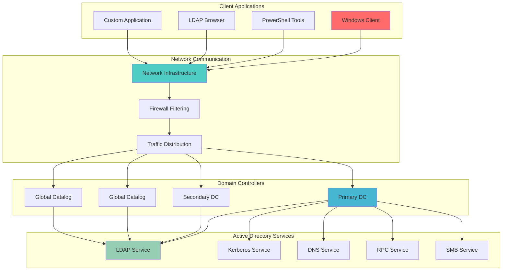

**🔍 Diagram Explanation: LDAP Communication Architecture**

This diagram illustrates the **LDAP communication flow in an Active Directory environment**. Client applications interact through the Network Infrastructure (potentially via Firewall and Load Balancer) to reach Domain Controllers and Global Catalog Servers. These servers host Active Directory Services like LDAP, Kerberos, DNS, RPC, and SMB. The primary focus is on LDAP, which facilitates directory operations over ports 389/636 (for standard LDAP) and 3268/3269 (for Global Catalog). This architecture ensures that clients can securely query and manage AD objects across the network.

### **LDAP Protocol Stack**
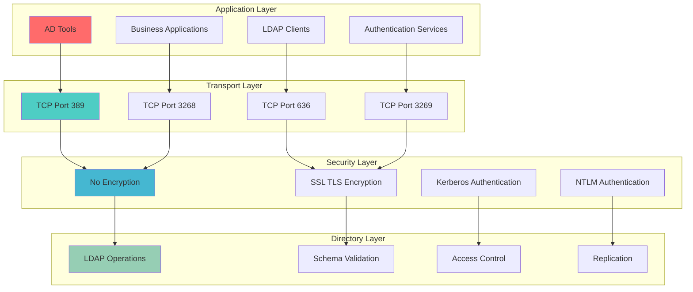

**🔍 Diagram Explanation: LDAP Protocol Stack**

This diagram outlines the **LDAP protocol stack**, illustrating its layered approach to directory services. The Application Layer shows various clients and services interacting with LDAP. The Transport Layer details the ports used: 389 for standard LDAP, 636 for secure LDAP (LDAPS), and their Global Catalog counterparts (3268/3269). The Security Layer differentiates between unencrypted and SSL/TLS encrypted communications, alongside Kerberos and NTLM authentication. Finally, the Directory Layer defines core LDAP operations, schema validation, access control, and replication, demonstrating how LDAP facilitates secure and structured directory management.

## ⚙️ How It Works

### **LDAP Query Flow**
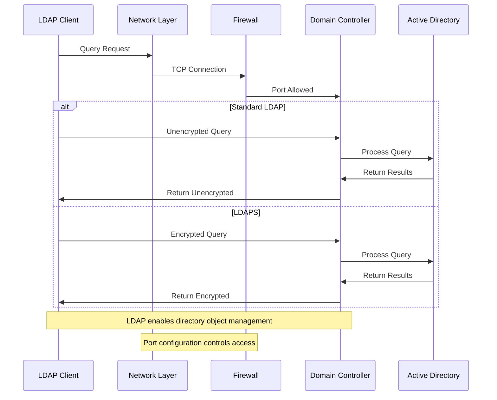

**🔍 Diagram Explanation: LDAP Query Flow**

This diagram illustrates the step-by-step process of how an **LDAP query** travels from a client computer to an Active Directory Domain Controller. Think of it as asking a question to a librarian (the Domain Controller) about information in a huge book (Active Directory).

1.  **LDAP Client (Your Computer/Application):** This is where the query starts. It could be your Windows computer, a PowerShell script, an application that needs to find user information, or an LDAP browsing tool. The client wants to find something in Active Directory.

2.  **Query Request:** The client sends out a request. This request contains specific criteria, like "find a user named 'John Doe'" or "show me all computers."

3.  **Network Layer:** The request travels through your computer's network interface and across the network cables or Wi-Fi. It's like sending a letter through the postal service.

4.  **Firewall:** Before reaching the Domain Controller, the request usually hits a firewall. The firewall acts as a security guard, checking if the communication is allowed based on its rules (specifically, if the required LDAP ports, like 389 or 636, are open).

5.  **TCP Connection:** If the firewall allows it, a TCP connection is established on a specific port.
    *   **Port 389 (Standard LDAP):** This is the default port for LDAP. When using this port, the communication is *unencrypted*. This means anyone "listening in" on the network could potentially read the query and its results. This is generally **not recommended** for sensitive information.
    *   **Port 636 (LDAPS - LDAP over SSL/TLS):** This is the secure version of LDAP. When using this port, the communication is *encrypted* using SSL/TLS, similar to how secure websites (HTTPS) work. This protects the data from eavesdropping.

6.  **Domain Controller (DC):** Once the request safely reaches an Active Directory Domain Controller, the DC receives the query.

7.  **Process Directory Query:** The Domain Controller then processes your request by looking up the information in its copy of the Active Directory database.

8.  **Return Query Results:** After finding the information, the Domain Controller compiles the results.

9.  **Return Results to Client:** Finally, the results are sent back to your client. If you used LDAPS (port 636), these results will also be encrypted during their journey back, ensuring privacy and integrity.

In essence, this flow highlights how LDAP enables computers and applications to "talk" to Active Directory, and how choosing the right port (especially LDAPS) is vital for keeping that conversation private and secure.

## 🔐 LDAP Authentication Flow

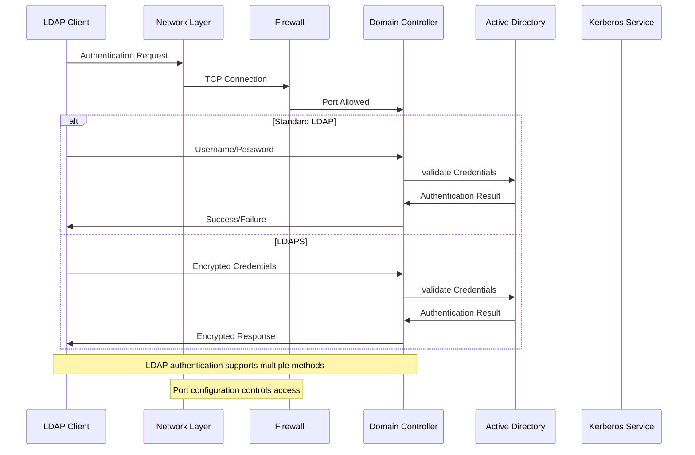

**🔍 Diagram Explanation: LDAP Authentication Flow**

This diagram illustrates the **authentication process** when a client needs to prove its identity to Active Directory using LDAP. Authentication is like showing your ID card to gain access to a secure building.

1.  **LDAP Client:** The client (user, application, or service) initiates an authentication request, typically providing a username and password.

2.  **Authentication Request:** The client sends its credentials (username/password) to the Domain Controller.

3.  **Network Layer:** The request travels through the network infrastructure to reach the Domain Controller.

4.  **Firewall:** The firewall checks if the communication is allowed based on its rules and port configurations.

5.  **TCP Connection:** If allowed, a TCP connection is established on the appropriate LDAP port (389 for standard, 636 for LDAPS).

6.  **Domain Controller:** The DC receives the authentication request and processes it.

7.  **Validate Credentials:** The DC checks the provided credentials against the Active Directory database to verify the user's identity.

8.  **Authentication Result:** AD returns the result (success or failure) to the DC.

9.  **Response to Client:** The DC sends the authentication result back to the client.

**Key Differences:**
- **Standard LDAP (Port 389):** Credentials and responses are sent in plain text, making them vulnerable to interception.
- **LDAPS (Port 636):** All communication is encrypted using SSL/TLS, protecting sensitive authentication data.

This authentication flow is fundamental to Active Directory security, ensuring only authorized users and services can access directory resources.

## 🌐 Active Directory Ports Overview

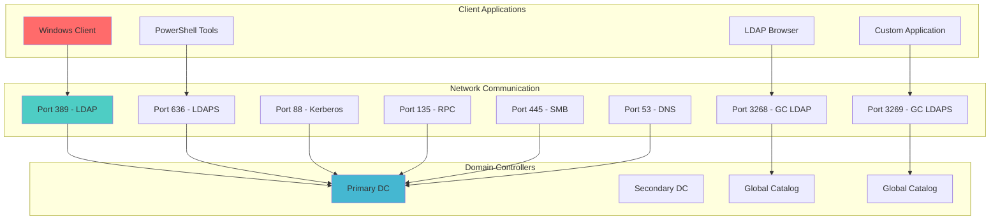

**🔍 Diagram Explanation: Active Directory Ports Overview**

This diagram provides a comprehensive overview of the **key network ports** used by Active Directory services. Think of ports as different doors in a building - each door leads to a specific service or function.

**Core LDAP Ports:**
- **Port 389 (LDAP):** The standard, unencrypted port for LDAP queries. Used for basic directory operations but sends data in plain text.
- **Port 636 (LDAPS):** The secure, encrypted version of LDAP using SSL/TLS. This is the recommended port for sensitive operations.

**Global Catalog Ports:**
- **Port 3268 (GC LDAP):** Standard port for Global Catalog queries. The Global Catalog is a specialized Domain Controller that provides forest-wide search capabilities.
- **Port 3269 (GC LDAPS):** Secure port for Global Catalog operations using SSL/TLS encryption.

**Authentication and Communication Ports:**
- **Port 88 (Kerberos):** Used for Kerberos authentication, which is the primary authentication protocol in Active Directory.
- **Port 135 (RPC):** Remote Procedure Call port used for various administrative operations and replication.
- **Port 445 (SMB):** Server Message Block port for file sharing and other Windows networking services.
- **Port 53 (DNS):** Domain Name System port for resolving computer names to IP addresses.

**Key Points for Beginners:**
1. **Security Priority:** Always prefer encrypted ports (636, 3269) over unencrypted ones (389, 3268) for sensitive operations.
2. **Firewall Configuration:** Network administrators must configure firewalls to allow these ports for Active Directory to function properly.
3. **Service Dependencies:** Different Active Directory services use different ports, so understanding this helps with troubleshooting and security planning.

This port overview is essential for network administrators, security professionals, and anyone working with Active Directory infrastructure.

## 🛡️ Port Security Configuration

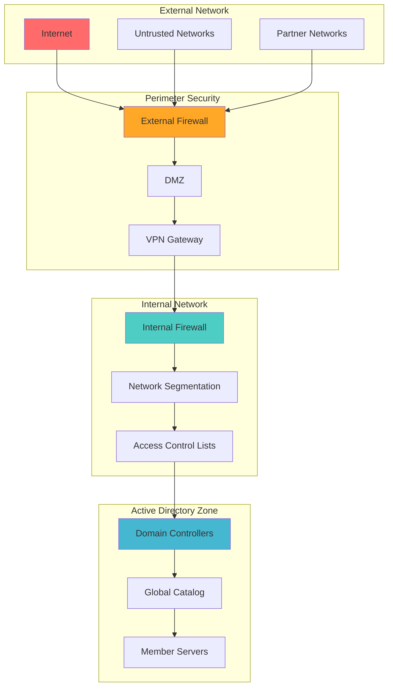

**🔍 Diagram Explanation: Port Security Configuration**

This diagram illustrates the **layered security approach** for protecting Active Directory ports and services. Think of it as having multiple security checkpoints, like airport security - you need to pass through several layers before reaching your destination.

**External Network Layer:**
- **Internet/Untrusted Networks:** These represent the outside world where potential threats originate.
- **Partner Networks:** External networks that may have limited access to your infrastructure.

**Perimeter Security Layer:**
- **External Firewall:** The first line of defense that blocks unauthorized access from external sources.
- **DMZ (Demilitarized Zone):** A buffer zone between external and internal networks where public-facing services are hosted.
- **VPN Gateway:** Provides secure remote access for authorized users and services.

**Internal Network Layer:**
- **Internal Firewall:** Additional protection for internal network segments.
- **Network Segmentation:** Divides the internal network into smaller, controlled zones.
- **Access Control Lists (ACLs):** Fine-grained rules that control which traffic is allowed between network segments.

**Active Directory Zone:**
- **Domain Controllers:** The core Active Directory servers that host directory services.
- **Global Catalog:** Specialized Domain Controllers for forest-wide searches.
- **Member Servers:** Other servers that are part of the domain.

**Security Principles Demonstrated:**
1. **Defense in Depth:** Multiple security layers provide redundancy and protection.
2. **Least Privilege:** Only necessary ports and services are exposed to each network segment.
3. **Network Segmentation:** Critical Active Directory services are isolated in their own secure zone.
4. **Controlled Access:** All external access must pass through multiple security checkpoints.

**Key Benefits for Beginners:**
- **Threat Mitigation:** Multiple layers make it harder for attackers to reach critical services.
- **Compliance:** This approach helps meet security standards and regulatory requirements.
- **Monitoring:** Each layer provides opportunities to detect and respond to security incidents.
- **Flexibility:** Different security policies can be applied at each layer based on risk assessment.

This security configuration is essential for protecting Active Directory infrastructure in enterprise environments.

## 🔧 LDAP Operation Types

```mermaid
graph TB
    subgraph "LDAP Operations"
        O1[Search Operations]
        O2[Modification Operations]
        O3[Authentication Operations]
        O4[Administrative Operations]
    end
    
    subgraph "Search Operations"
        S1[Simple Search]
        S2[Complex Search]
        S3[Paged Search]
        S4[Sorted Search]
    end
    
    subgraph "Modification Operations"
        M1[Add Entry]
        M2[Modify Entry]
        M3[Delete Entry]
        M4[Modify DN]
    end
    
    subgraph "Authentication Operations"
        A1[Bind Simple]
        A2[Bind SASL]
        A3[Unbind]
        A4[Abandon]
    end
    
    subgraph "Administrative Operations"
        AD1[Compare]
        AD2[Extended Operations]
        AD3[Control Operations]
        AD4[Schema Operations]
    end
    
    O1 --> S1
    O1 --> S2
    O1 --> S3
    O1 --> S4
    
    O2 --> M1
    O2 --> M2
    O2 --> M3
    O2 --> M4
    
    O3 --> A1
    O3 --> A2
    O3 --> A3
    O3 --> A4
    
    O4 --> AD1
    O4 --> AD2
    O4 --> AD3
    O4 --> AD4
    
    style O1 fill:#ff6b6b
    style S1 fill:#4ecdc4
    style M1 fill:#45b7d1
    style A1 fill:#96ceb4
```

**🔍 Diagram Explanation: LDAP Operation Types**

This diagram categorizes the **different types of operations** that can be performed using the LDAP protocol. Think of LDAP operations as the different actions you can perform in a library - you can search for books, add new books, modify existing ones, or perform administrative tasks.

**Search Operations:**
- **Simple Search:** Basic queries to find specific objects (e.g., "find user John Doe").
- **Complex Search:** Advanced queries using multiple criteria and logical operators.
- **Paged Search:** Large result sets that are returned in smaller, manageable chunks.
- **Sorted Search:** Results organized in a specific order (e.g., alphabetically by name).

**Modification Operations:**
- **Add Entry:** Creating new objects in the directory (e.g., adding a new user account).
- **Modify Entry:** Updating existing object attributes (e.g., changing a user's phone number).
- **Delete Entry:** Removing objects from the directory (e.g., deleting a user account).
- **Modify DN:** Changing the Distinguished Name of an object (e.g., moving a user to a different organizational unit).

**Authentication Operations:**
- **Bind Simple:** Basic username/password authentication.
- **Bind SASL:** Advanced authentication using Simple Authentication and Security Layer protocols.
- **Unbind:** Properly ending an LDAP session.
- **Abandon:** Canceling an ongoing operation.

**Administrative Operations:**
- **Compare:** Checking if an object has a specific attribute value without retrieving the object.
- **Extended Operations:** Custom operations specific to certain LDAP implementations.
- **Control Operations:** Special instructions that modify how other operations behave.
- **Schema Operations:** Operations related to the directory schema (the structure and rules for objects).

**Key Points for Beginners:**
1. **Operation Categories:** Understanding these categories helps organize LDAP knowledge and troubleshooting.
2. **Security Implications:** Different operations require different levels of permissions and authentication.
3. **Common Use Cases:** Most LDAP usage involves search and modification operations.
4. **Best Practices:** Always use appropriate authentication and follow security guidelines for each operation type.

This classification helps administrators and developers understand the full scope of LDAP capabilities and choose the right operations for their specific needs.

## 📋 LDAP Query Examples

```mermaid
graph TB
    subgraph "Query Types"
        Q1[User Queries]
        Q2[Computer Queries]
        Q3[Group Queries]
        Q4[Organizational Unit Queries]
    end
    
    subgraph "User Query Examples"
        U1[Find User by Name]
        U2[Find Users in OU]
        U3[Find Users by Department]
        U4[Find Disabled Users]
    end
    
    subgraph "Computer Query Examples"
        C1[Find Computers by OS]
        C2[Find Computers in Site]
        C3[Find Domain Controllers]
        C4[Find Workstations]
    end
    
    subgraph "Group Query Examples"
        G1[Find Group Members]
        G2[Find Nested Groups]
        G3[Find Groups by Type]
        G4[Find Empty Groups]
    end
    
    subgraph "OU Query Examples"
        OU1[Find OU Structure]
        OU2[Find Objects in OU]
        OU3[Find OU Permissions]
        OU4[Find OU Policies]
    end
    
    Q1 --> U1
    Q1 --> U2
    Q1 --> U3
    Q1 --> U4
    
    Q2 --> C1
    Q2 --> C2
    Q2 --> C3
    Q2 --> C4
    
    Q3 --> G1
    Q3 --> G2
    Q3 --> G3
    Q3 --> G4
    
    Q4 --> OU1
    Q4 --> OU2
    Q4 --> OU3
    Q4 --> OU4
    
    style Q1 fill:#ff6b6b
    style U1 fill:#4ecdc4
    style C1 fill:#45b7d1
    style G1 fill:#96ceb4
```

**🔍 Diagram Explanation: LDAP Query Examples**

This diagram showcases **practical examples** of LDAP queries that administrators commonly use in Active Directory environments. Think of these as the "recipes" for finding specific information in your directory, similar to how you might search for specific items in an online store.

**User Query Examples:**
- **Find User by Name:** Locating a specific user account (e.g., "find user John Doe").
- **Find Users in OU:** Discovering all users within a specific organizational unit (e.g., "find all users in the IT department").
- **Find Users by Department:** Filtering users based on their department attribute (e.g., "find all users in the Marketing department").
- **Find Disabled Users:** Identifying user accounts that have been deactivated (useful for security audits).

**Computer Query Examples:**
- **Find Computers by OS:** Locating machines running specific operating systems (e.g., "find all Windows 11 computers").
- **Find Computers in Site:** Discovering machines within a specific Active Directory site (useful for network management).
- **Find Domain Controllers:** Identifying all Domain Controllers in the forest (essential for administration).
- **Find Workstations:** Locating regular user workstations (distinguishing them from servers).

**Group Query Examples:**
- **Find Group Members:** Listing all users who belong to a specific group (e.g., "who is in the Administrators group?").
- **Find Nested Groups:** Discovering groups that are members of other groups (understanding group hierarchy).
- **Find Groups by Type:** Filtering groups based on their type (e.g., Security groups vs. Distribution groups).
- **Find Empty Groups:** Identifying groups with no members (useful for cleanup and security).

**Organizational Unit Query Examples:**
- **Find OU Structure:** Understanding the organizational hierarchy of your Active Directory.
- **Find Objects in OU:** Discovering all objects (users, computers, groups) within a specific OU.
- **Find OU Permissions:** Understanding who has access to manage objects within an OU.
- **Find OU Policies:** Identifying Group Policy Objects linked to specific OUs.

**Key Benefits for Beginners:**
1. **Practical Application:** These examples show real-world uses of LDAP queries.
2. **Common Scenarios:** Covers the most frequent administrative tasks.
3. **Query Patterns:** Understanding these examples helps create custom queries for specific needs.
4. **Security Awareness:** Many queries help identify security issues (like disabled accounts or empty groups).

**Tools for Executing Queries:**
- **PowerShell:** Using `Get-ADUser`, `Get-ADComputer`, `Get-ADGroup` cmdlets.
- **LDAP Browser Tools:** GUI applications for exploring Active Directory.
- **Command Line:** Using `ldapsearch` or similar command-line tools.
- **Custom Applications:** Building queries into administrative scripts or applications.

This practical approach helps beginners understand not just what LDAP can do, but how to use it effectively in real Active Directory environments.

## 🎯 AD Queries and Management

### **PowerShell LDAP Queries**

PowerShell provides powerful cmdlets for querying Active Directory using LDAP under the hood:

```powershell
# Find users by department
Get-ADUser -Filter "Department -eq 'IT'" -Properties Department,Title

# Find computers by operating system
Get-ADComputer -Filter "OperatingSystem -like '*Windows 11*'" -Properties OperatingSystem

# Find groups with specific members
Get-ADGroup -Filter "Name -eq 'Domain Admins'" -Properties Members

# Find objects in specific OU
Get-ADObject -Filter "ObjectClass -eq 'user'" -SearchBase "OU=IT,DC=company,DC=com"
```

### **LDAP Filter Syntax**

Understanding LDAP filter syntax is crucial for advanced queries:

```ldap
# Basic filters
(&(objectClass=user)(cn=John*))           # Users with names starting with "John"
(|(department=IT)(department=Marketing))   # Users in IT OR Marketing
(!(userAccountControl:1.2.840.113556.1.4.803:=2))  # Enabled users only

# Complex filters
(&(objectClass=computer)(operatingSystem=*Windows*)(whenCreated>=20230101))
```

### **Common Administrative Tasks**

**User Management:**
- Create, modify, and delete user accounts
- Reset passwords and unlock accounts
- Move users between organizational units
- Assign group memberships

**Computer Management:**
- Join computers to the domain
- Manage computer accounts and properties
- Control computer access and policies
- Monitor computer health and status

**Group Management:**
- Create and manage security groups
- Implement nested group structures
- Control group membership and permissions
- Audit group access and usage

**Organizational Unit Management:**
- Design OU hierarchy for your organization
- Apply Group Policy Objects to OUs
- Delegate administrative permissions
- Organize objects logically

### **Best Practices for LDAP Queries**

1. **Use Specific Filters:** Avoid broad queries that return large result sets
2. **Limit Properties:** Only retrieve the attributes you need
3. **Use Indexed Attributes:** Query on indexed attributes for better performance
4. **Implement Paging:** Use paged searches for large result sets
5. **Cache Results:** Cache frequently accessed data when appropriate
6. **Monitor Performance:** Watch for slow queries and optimize them
7. **Security First:** Always use appropriate authentication and encryption
8. **Document Queries:** Keep a library of commonly used queries

### **Troubleshooting Common Issues**

**Authentication Problems:**
- Verify credentials and permissions
- Check firewall and port configurations
- Ensure proper SSL/TLS certificates for LDAPS
- Verify network connectivity

**Query Performance Issues:**
- Check if attributes are properly indexed
- Review query complexity and filters
- Monitor network latency and bandwidth
- Consider query optimization techniques

**Permission Errors:**
- Verify user account permissions
- Check group memberships
- Review delegation settings
- Ensure proper access control lists

## 💻 Example Implementation

### **PowerShell Script Examples**

**User Account Management Script:**
```powershell
# Script to find and manage user accounts
param(
    [string]$Department,
    [string]$Action
)

# Import Active Directory module
Import-Module ActiveDirectory

switch ($Action) {
    "Find" {
        $users = Get-ADUser -Filter "Department -eq '$Department'" -Properties Department,Title,Enabled
        Write-Host "Found $($users.Count) users in $Department department:"
        $users | Format-Table Name,Title,Enabled
    }
    "Disable" {
        $users = Get-ADUser -Filter "Department -eq '$Department'" -Properties Department
        foreach ($user in $users) {
            Set-ADUser -Identity $user.SamAccountName -Enabled $false
            Write-Host "Disabled user: $($user.Name)"
        }
    }
    "Enable" {
        $users = Get-ADUser -Filter "Department -eq '$Department'" -Properties Department
        foreach ($user in $users) {
            Set-ADUser -Identity $user.SamAccountName -Enabled $true
            Write-Host "Enabled user: $($user.Name)"
        }
    }
}
```

**Computer Inventory Script:**
```powershell
# Script to inventory computers by operating system
$computers = Get-ADComputer -Filter * -Properties OperatingSystem,OperatingSystemVersion,LastLogonDate

$osInventory = $computers | Group-Object OperatingSystem | Sort-Object Count -Descending

Write-Host "Computer Operating System Inventory:"
Write-Host "=================================="

foreach ($os in $osInventory) {
    Write-Host "$($os.Name): $($os.Count) computers"
}

# Find computers that haven't logged on recently
$oldComputers = $computers | Where-Object {$_.LastLogonDate -lt (Get-Date).AddDays(-30)}
Write-Host "`nComputers not logged on in 30+ days: $($oldComputers.Count)"
```

### **LDAP Query Examples with Different Tools**

**Using ldapsearch Command Line:**
```bash
# Find all users in IT department
ldapsearch -H ldaps://dc.company.com:636 -D "user@company.com" -W -b "DC=company,DC=com" \
  "(&(objectClass=user)(department=IT))" cn mail department

# Find disabled user accounts
ldapsearch -H ldaps://dc.company.com:636 -D "user@company.com" -W -b "DC=company,DC=com" \
  "(&(objectClass=user)(userAccountControl:1.2.840.113556.1.4.803:=2))" cn sAMAccountName

# Find computers running Windows 11
ldapsearch -H ldaps://dc.company.com:636 -D "user@company.com" -W -b "DC=company,DC=com" \
  "(&(objectClass=computer)(operatingSystem=*Windows 11*))" cn operatingSystem
```

**Using Python with ldap3 Library:**
```python
from ldap3 import Server, Connection, ALL, SUBTREE

# Connect to Active Directory
server = Server('dc.company.com', port=636, use_ssl=True)
conn = Connection(server, 'user@company.com', 'password', auto_bind=True)

# Search for users in IT department
conn.search('DC=company,DC=com', 
           '(&(objectClass=user)(department=IT))', 
           SUBTREE, 
           attributes=['cn', 'mail', 'department'])

# Process results
for entry in conn.entries:
    print(f"User: {entry.cn}, Email: {entry.mail}, Department: {entry.department}")

conn.unbind()
```

### **Group Policy Integration**

**PowerShell Script to Apply GPOs Based on OU:**
```powershell
# Script to link GPOs to organizational units
param(
    [string]$GPOName,
    [string]$OUPath
)

# Import Group Policy module
Import-Module GroupPolicy

try {
    # Link GPO to OU
    New-GPLink -Name $GPOName -Target $OUPath
    Write-Host "Successfully linked GPO '$GPOName' to OU '$OUPath'"
    
    # Get GPO links for verification
    $links = Get-GPLink -Target $OUPath
    Write-Host "`nCurrent GPO links for OU '$OUPath':"
    $links | Format-Table DisplayName,Enabled,Enforced
    
} catch {
    Write-Error "Failed to link GPO: $($_.Exception.Message)"
}
```

### **Security Monitoring Script**

**Script to Monitor for Suspicious LDAP Activity:**
  ```powershell
# Monitor for failed LDAP bind attempts
$events = Get-WinEvent -FilterHashtable @{
    LogName = 'Security'
    ID = 4625  # Failed logon events
    StartTime = (Get-Date).AddHours(-1)
} | Where-Object {$_.Properties[2].Value -eq "3"} # Network logon type

if ($events.Count -gt 10) {
    Write-Warning "High number of failed LDAP bind attempts detected: $($events.Count)"

    # Send alert email or create incident ticket
    $body = "High number of failed LDAP bind attempts detected in the last hour.`n"
    $body += "Count: $($events.Count)`n"
    $body += "Time: $(Get-Date)"

    # Send-MailMessage -From "security@company.com" -To "admin@company.com" -Subject "LDAP Security Alert" -Body $body
}
```

### **Best Practices for Implementation**

1. **Error Handling:** Always implement proper error handling and logging
2. **Security:** Use encrypted connections (LDAPS) and appropriate authentication
3. **Performance:** Implement pagination for large result sets
4. **Documentation:** Comment your code and maintain documentation
5. **Testing:** Test scripts in a non-production environment first
6. **Monitoring:** Implement logging and monitoring for production scripts
7. **Backup:** Always backup Active Directory before making bulk changes
8. **Compliance:** Ensure your scripts comply with organizational policies

These examples provide a foundation for building custom Active Directory management solutions using LDAP queries and PowerShell automation.

## 🔄 LDAP Administration Workflow

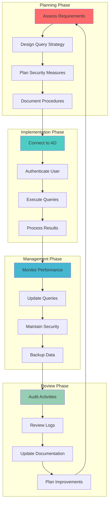

**🔍 Diagram Explanation: LDAP Administration Workflow**

This diagram illustrates the **continuous cycle** of LDAP administration in Active Directory environments. Think of it as a never-ending process of planning, implementing, managing, and improving your directory services, similar to how a gardener continuously tends to their garden.

**Planning Phase:**
- **Assess Requirements:** Understanding what information you need to find or manage in Active Directory (e.g., "I need to find all users in the IT department").
- **Design Query Strategy:** Planning how to structure your LDAP queries for efficiency and accuracy.
- **Plan Security Measures:** Ensuring you have proper authentication and authorization for the operations you plan to perform.
- **Document Procedures:** Creating step-by-step instructions for your administrative tasks.

**Implementation Phase:**
- **Connect to AD:** Establishing a connection to your Active Directory Domain Controller using the appropriate ports and protocols.
- **Authenticate User:** Proving your identity to Active Directory (usually with username/password or Kerberos ticket).
- **Execute Queries:** Running your planned LDAP queries to find or modify directory objects.
- **Process Results:** Handling the data returned by your queries (displaying, saving, or acting on the information).

**Management Phase:**
- **Monitor Performance:** Watching how your queries perform and identifying any bottlenecks or issues.
- **Update Queries:** Modifying your queries based on changing requirements or performance issues.
- **Maintain Security:** Regularly reviewing and updating security measures, including user permissions and access controls.
- **Backup Data:** Creating regular backups of your Active Directory data to prevent data loss.

**Review Phase:**
- **Audit Activities:** Reviewing what changes were made and by whom for compliance and security purposes.
- **Review Logs:** Examining system logs for any errors, security events, or performance issues.
- **Update Documentation:** Keeping your procedures and documentation current with any changes you've made.
- **Plan Improvements:** Identifying ways to make your LDAP administration more efficient, secure, or user-friendly.

**Key Benefits for Beginners:**
1. **Systematic Approach:** This workflow ensures you don't miss important steps in your administration tasks.
2. **Continuous Improvement:** The cycle nature means you're always learning and improving your processes.
3. **Security Focus:** Security is built into every phase, not just an afterthought.
4. **Documentation:** Emphasizes the importance of keeping good records of your administrative activities.

**Real-World Application:**
- **Daily Tasks:** Following this workflow for routine user management tasks.
- **Project Work:** Using this approach when implementing new Active Directory features or policies.
- **Troubleshooting:** Following the workflow when investigating and resolving directory issues.
- **Compliance:** Ensuring your administration meets organizational and regulatory requirements.

This workflow helps beginners understand that LDAP administration is not just about running queries, but about managing a complete process that includes planning, security, monitoring, and continuous improvement.

## 🛡️ Security Best Practices

```mermaid
graph TB
    subgraph "Authentication Security"
        A1[Use LDAPS Port 636]
        A2[Implement MFA]
        A3[Regular Password Changes]
        A4[Account Lockout Policies]
    end

    subgraph "Network Security"
        N1[Firewall Rules]
        N2[Network Segmentation]
        N3[VPN Access Only]
        N4[Port Restrictions]
    end

    subgraph "Access Control"
        AC1[Least Privilege]
        AC2[Role-Based Access]
        AC3[Regular Audits]
        AC4[Delegation Limits]
    end

    subgraph "Monitoring & Logging"
        M1[Event Logging]
        M2[Failed Login Alerts]
        M3[Query Monitoring]
        M4[Security Audits]
    end

    A1 --> A2
    A2 --> A3
    A3 --> A4

    N1 --> N2
    N2 --> N3
    N3 --> N4

    AC1 --> AC2
    AC2 --> AC3
    AC3 --> AC4

    M1 --> M2
    M2 --> M3
    M3 --> M4

    style A1 fill:#ff6b6b
    style N1 fill:#4ecdc4
    style AC1 fill:#45b7d1
    style M1 fill:#96ceb4
```

**🔍 Diagram Explanation: Security Best Practices**

This diagram outlines the **four key security pillars** for protecting LDAP and Active Directory services. Each pillar represents a critical aspect of security that must be implemented together for comprehensive protection.

**Authentication Security:**
- **LDAPS (Port 636):** Always use encrypted connections instead of unencrypted LDAP (Port 389)
- **Multi-Factor Authentication (MFA):** Require additional verification beyond passwords
- **Password Policies:** Implement strong password requirements and regular changes
- **Account Lockout:** Prevent brute-force attacks by locking accounts after failed attempts

**Network Security:**
- **Firewall Rules:** Restrict access to only necessary ports and services
- **Network Segmentation:** Isolate Active Directory services in secure network zones
- **VPN Access:** Require VPN connections for remote administrative access
- **Port Restrictions:** Block unnecessary ports and limit LDAP access to required systems

**Access Control:**
- **Least Privilege:** Grant only the minimum permissions necessary for tasks
- **Role-Based Access:** Assign permissions based on job functions, not individual users
- **Regular Audits:** Periodically review and validate access permissions
- **Delegation Limits:** Carefully control who can delegate permissions to others

**Monitoring & Logging:**
- **Event Logging:** Capture all LDAP operations and authentication attempts
- **Failed Login Alerts:** Get notified immediately of suspicious authentication failures
- **Query Monitoring:** Track unusual or excessive LDAP query patterns
- **Security Audits:** Regular reviews of security logs and access patterns

**Implementation Priority:**
1. **Start with Authentication** - Implement LDAPS and MFA first
2. **Add Network Controls** - Implement firewall rules and segmentation
3. **Implement Access Controls** - Apply least privilege and role-based access
4. **Enable Monitoring** - Set up logging and alerting systems

This layered approach ensures that even if one security measure fails, others continue to provide protection.

## ⚠️ LDAP Attack Surface

```mermaid
graph TB
    subgraph "Authentication Attacks"
        AA1[Brute Force]
        AA2[Password Spraying]
        AA3[Credential Stuffing]
        AA4[Kerberoasting]
    end

    subgraph "Network Attacks"
        NA1[Man in the Middle]
        NA2[Port Scanning]
        NA3[Traffic Analysis]
        NA4[Denial of Service]
    end

    subgraph "Query Attacks"
        QA1[LDAP Injection]
        QA2[Information Disclosure]
        QA3[Enumeration]
        QA4[Data Mining]
    end

    subgraph "Privilege Escalation"
        PE1[ACL Abuse]
        PE2[Delegation Abuse]
        PE3[Schema Modification]
        PE4[Trust Exploitation]
    end

    AA1 --> AA2
    AA2 --> AA3
    AA3 --> AA4

    NA1 --> NA2
    NA2 --> NA3
    NA3 --> NA4

    QA1 --> QA2
    QA2 --> QA3
    QA3 --> QA4

    PE1 --> PE2
    PE2 --> PE3
    PE3 --> PE4

    style AA1 fill:#ff6b6b
    style NA1 fill:#ffa726
    style QA1 fill:#4ecdc4
    style PE1 fill:#45b7d1
```

**🔍 Diagram Explanation: LDAP Attack Surface**

This diagram categorizes the **primary attack vectors** targeting LDAP and Active Directory infrastructure. Each category represents a different layer of the attack chain, from initial access to privilege escalation. Understanding these vectors is crucial for implementing effective defense-in-depth strategies.

**Authentication Attacks:**
- **Brute Force:** Systematic password guessing using tools like Hydra or Ncrack against LDAP services
- **Password Spraying:** Low-and-slow approach using common passwords across multiple accounts to avoid lockouts
- **Credential Stuffing:** Automated login attempts using credentials from data breaches (e.g., HaveIBeenPwned datasets)
- **Kerberoasting:** Exploiting Kerberos service tickets to crack weak service account passwords offline

**Network Attacks:**
- **Man in the Middle:** Intercepting LDAP traffic on unencrypted connections (Port 389) using tools like Ettercap
- **Port Scanning:** Discovering LDAP services using Nmap with scripts like `ldap-search.nse` and `ldap-brute.nse`
- **Traffic Analysis:** Monitoring LDAP query patterns to understand directory structure and identify high-value targets
- **Denial of Service:** Flooding LDAP services with queries to exhaust resources and disrupt operations

**Query Attacks:**
- **LDAP Injection:** Manipulating query filters to bypass access controls (e.g., `(&(objectClass=*)(cn=*))`)
- **Information Disclosure:** Using broad queries to extract sensitive attributes like `userPassword`, `pwdLastSet`, or `lastLogon`
- **Enumeration:** Systematic discovery of users, groups, OUs, and organizational structure for reconnaissance
- **Data Mining:** Collecting large datasets for offline analysis and privilege escalation planning

**Privilege Escalation:**
- **ACL Abuse:** Exploiting misconfigured access control lists to access or modify unauthorized objects
- **Delegation Abuse:** Misusing constrained/unconstrained delegation to impersonate users and access resources
- **Schema Modification:** Altering directory schema to create new object classes or attributes that bypass security
- **Trust Exploitation:** Abusing trust relationships between domains to move laterally and escalate privileges

**Advanced Attack Techniques:**
- **Golden Ticket Attacks:** Creating forged Kerberos tickets using extracted KRBTGT account hashes
- **Silver Ticket Attacks:** Forging service tickets for specific services using extracted service account hashes
- **DCSync Attacks:** Exploiting replication permissions to extract password hashes from Domain Controllers
- **Pass-the-Hash:** Using extracted NTLM hashes to authenticate without knowing plaintext passwords

**Defense Strategy Implementation:**
1. **Authentication Hardening:** Implement account lockout policies, MFA, and strong password requirements
2. **Network Security:** Use LDAPS (Port 636), implement network segmentation, and deploy IDS/IPS systems
3. **Query Security:** Implement input validation, access controls, and query result filtering
4. **Privilege Management:** Apply least privilege principles, regular access reviews, and monitoring

**Detection and Response:**
- Monitor for failed authentication attempts and unusual query patterns
- Implement logging for all LDAP operations and authentication events
- Use SIEM tools to correlate events and detect attack patterns
- Establish incident response procedures for different attack scenarios

This comprehensive understanding enables security teams to prioritize defenses, implement appropriate controls, and respond effectively to security incidents.

## 🏗️ LDAP Security Model

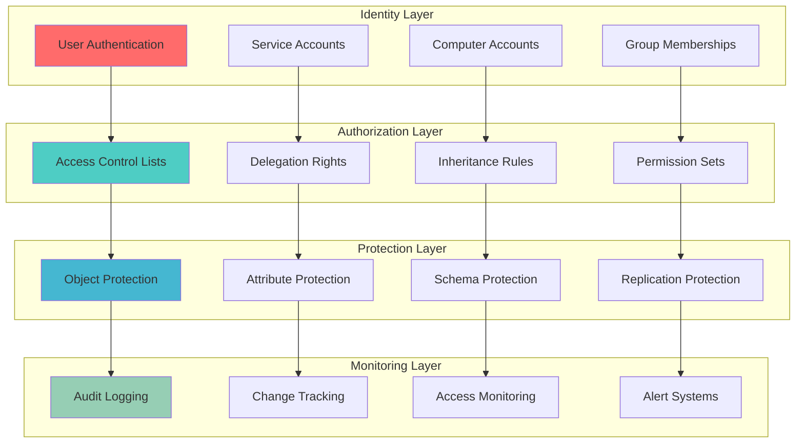

**🔍 Diagram Explanation: LDAP Security Model**

This diagram illustrates the **layered security architecture** of LDAP and Active Directory, showing how different security components work together to protect directory services. Each layer builds upon the previous one, creating a comprehensive security framework.

**Identity Layer:**
- **User Authentication:** Verifies user identity through Kerberos, NTLM, or certificate-based authentication
- **Service Accounts:** Manages security for applications and services that need directory access
- **Computer Accounts:** Controls domain-joined machines and their access to directory resources
- **Group Memberships:** Defines user roles and permissions through security group assignments

**Authorization Layer:**
- **Access Control Lists (ACLs):** Fine-grained permissions controlling who can read, write, or modify specific objects
- **Delegation Rights:** Allows specific users to perform administrative tasks on behalf of others
- **Inheritance Rules:** Permissions that flow down from parent objects to child objects automatically
- **Permission Sets:** Predefined permission combinations for common administrative tasks

**Protection Layer:**
- **Object Protection:** Safeguards directory objects from unauthorized modification or deletion
- **Attribute Protection:** Controls access to sensitive object attributes like passwords and account settings
- **Schema Protection:** Prevents unauthorized changes to the directory structure and object definitions
- **Replication Protection:** Ensures data integrity during synchronization between Domain Controllers

**Monitoring Layer:**
- **Audit Logging:** Records all directory access and modification attempts for compliance and security
- **Change Tracking:** Monitors modifications to critical objects and attributes in real-time
- **Access Monitoring:** Tracks unusual access patterns and potential security violations
- **Alert Systems:** Provides immediate notification of suspicious activities or security events

**Security Principles Implemented:**
- **Defense in Depth:** Multiple security layers provide redundancy and protection
- **Least Privilege:** Users receive only the minimum permissions necessary for their roles
- **Separation of Duties:** Critical functions are divided among different users or groups
- **Continuous Monitoring:** Ongoing surveillance detects and responds to security threats

**Implementation Considerations:**
1. **Identity Management:** Implement strong authentication and regular access reviews
2. **Permission Design:** Carefully plan ACLs and delegation to minimize attack surface
3. **Protection Configuration:** Configure object and attribute protection based on sensitivity
4. **Monitoring Setup:** Establish comprehensive logging and alerting for security events

This security model provides a structured approach to protecting Active Directory infrastructure while maintaining operational efficiency and user productivity.

## 🛠️ LDAP Management Tools

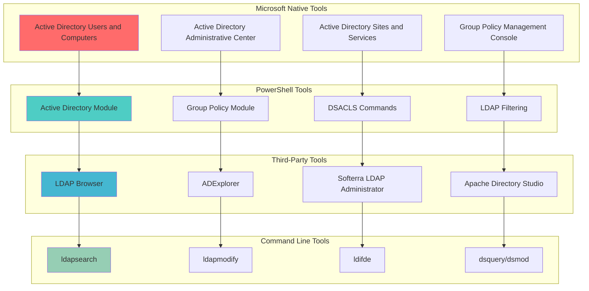

**🔍 Diagram Explanation: LDAP Management Tools**

This diagram categorizes the **essential tools and utilities** used for managing LDAP and Active Directory environments. Each category serves different purposes and skill levels, from beginner-friendly GUI tools to advanced command-line utilities for automation and scripting.

**Microsoft Native Tools:**
- **Active Directory Users and Computers (ADUC):** Primary GUI tool for managing users, groups, computers, and OUs with intuitive interface
- **Active Directory Administrative Center (ADAC):** Modern web-based interface providing enhanced management capabilities and PowerShell integration
- **Active Directory Sites and Services:** Specialized tool for managing physical network topology, sites, and replication connections
- **Group Policy Management Console (GPMC):** Comprehensive tool for creating, editing, and managing Group Policy Objects and their application

**PowerShell Tools:**
- **Active Directory Module:** Core cmdlets like `Get-ADUser`, `Set-ADUser`, `New-ADUser` for programmatic directory management
- **Group Policy Module:** PowerShell cmdlets for GPO management including `Get-GPO`, `New-GPO`, and `Set-GPO`
- **DSACLS Commands:** Advanced permission management using `dsacls.exe` for granular access control list manipulation
- **LDAP Filtering:** Native PowerShell support for complex LDAP queries and filtering operations

**Third-Party Tools:**
- **LDAP Browser:** Generic LDAP client tools for exploring directory structure and testing queries
- **ADExplorer (Sysinternals):** Lightweight tool for browsing Active Directory and viewing object properties
- **Softerra LDAP Administrator:** Professional LDAP management tool with advanced features and cross-platform support
- **Apache Directory Studio:** Open-source LDAP client with schema browsing and query building capabilities

**Command Line Tools:**
- **ldapsearch:** Standard LDAP search utility for querying directory information using filters and attributes
- **ldapmodify:** Command-line tool for modifying LDAP directory entries and attributes
- **ldifde:** Microsoft's LDAP Data Interchange Format utility for bulk import/export operations
- **dsquery/dsmod:** Windows Server utilities for querying and modifying Active Directory objects

**Tool Selection Criteria:**
1. **Administrative Tasks:** Use Microsoft native tools for routine management operations
2. **Automation Needs:** Leverage PowerShell for scripting and bulk operations
3. **Cross-Platform Requirements:** Choose third-party tools for non-Windows environments
4. **Advanced Operations:** Use command-line tools for complex queries and bulk modifications

**Best Practices for Tool Usage:**
- **GUI Tools:** Ideal for learning, exploration, and occasional administrative tasks
- **PowerShell:** Best for automation, bulk operations, and repeatable administrative procedures
- **Command Line:** Essential for scripting, troubleshooting, and advanced LDAP operations
- **Third-Party Tools:** Useful for cross-platform compatibility and specialized functionality

**Integration and Workflow:**
- Combine tools based on specific requirements and skill levels
- Use PowerShell as the central automation platform for complex workflows
- Leverage GUI tools for initial exploration and understanding
- Implement command-line tools in scripts and automated processes

This comprehensive toolset enables administrators to efficiently manage Active Directory environments regardless of their experience level or specific requirements.

## 🚨 Security Recommendations

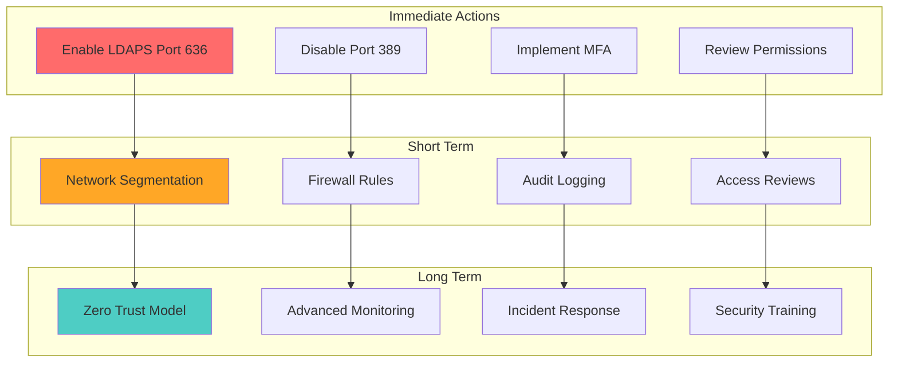

**🔍 Diagram Explanation: Security Recommendations**

This diagram provides a **prioritized roadmap** for implementing LDAP security measures. Focus on immediate actions first, then build toward comprehensive security.

**Immediate Actions (Week 1):**
- **Enable LDAPS:** Switch all LDAP traffic to encrypted Port 636
- **Disable Port 389:** Block unencrypted LDAP access
- **Implement MFA:** Require multi-factor authentication for all admin accounts
- **Review Permissions:** Audit and remove unnecessary user permissions

**Short Term (Month 1):**
- **Network Segmentation:** Isolate Active Directory services in secure zones
- **Firewall Rules:** Implement strict port and service restrictions
- **Audit Logging:** Enable comprehensive logging for all LDAP operations
- **Access Reviews:** Establish regular permission review cycles

**Long Term (Quarter 1):**
- **Zero Trust Model:** Implement continuous verification and least privilege
- **Advanced Monitoring:** Deploy SIEM and behavioral analytics
- **Incident Response:** Develop and test security incident procedures
- **Security Training:** Regular training for administrators and users

**Key Success Factors:**
- Start with high-impact, low-effort changes
- Measure progress with security metrics
- Regular testing and validation of controls
- Continuous improvement based on lessons learned

This phased approach ensures immediate security improvements while building toward comprehensive protection.

## 🔗 Related Components

- **[Domain Controllers](./02_Domain_Controllers.md)** - Core servers hosting Active Directory services
- **[Global Catalog](./12_Global_Catalog.md)** - Forest-wide search and indexing services
- **[Query and Index Mechanism](./14_Query_and_Index_Mechanism.md)** - Search capabilities and performance optimization
- **[Replication Service](./15_Replication_Service.md)** - Data synchronization between Domain Controllers

## 📚 Related Objects

- **LDAP Filters** - Query syntax for searching directory objects
- **Access Control Lists (ACLs)** - Permission management for directory objects
- **Group Policy Objects (GPOs)** - Centralized configuration management
- **Organizational Units (OUs)** - Logical grouping of directory objects
- **Security Groups** - Permission assignment and access control
- **User Accounts** - Authentication and authorization entities
- **Computer Accounts** - Domain-joined machine management
- **Service Accounts** - Application and service authentication

## 🏷️ Tags

#ActiveDirectory #LDAP #DirectoryServices #Authentication #Authorization #NetworkSecurity #PortManagement #DomainControllers #GlobalCatalog #Replication #GroupPolicy #PowerShell #Security #Administration #WindowsServer #Enterprise #IdentityManagement #AccessControl #Monitoring #Compliance

```