# Query and Index Mechanism - Active Directory Search Engine 🔍

## 📋 Table of Contents
- [Purpose & Definition](#purpose-&-definition)
- [Query and Index Architecture](#query-and-index-architecture)
- [How It Works](#how-it-works)
- [Index Types and Structure](#index-types-and-structure)
- [Query Processing](#query-processing)
- [Performance Optimization](#performance-optimization)
- [Administrative Use Cases](#administrative-use-cases)
- [Red Team / Attacker Perspective](#red-team-/-attacker-perspective)
- [Security Implications](#security-implications)
- [Additional Notes](#additional-notes)
- [Related Components](#related-components)
- [Related Objects](#related-objects)

## 🎯 Purpose & Definition
The Active Directory Query and Index Mechanism serves as the **core search engine** for the `NTDS.dit` database. It enables efficient retrieval of directory objects and their properties by employing advanced indexing strategies, ensuring fast and scalable directory operations critical for a multi-master Active Directory environment.

## 🧭 Navigation
- **[AD Components Index](./00_AD_Components_Index.md)** - Return to components overview
- **[LDAP and Ports](./13_LDAP_and_Ports.md)** - Previous: Communication protocols
- **[Replication Service](./15_Replication_Service.md)** - Next: Data synchronization
- **[Schema](./11_Schema.md)** - Related: Data structure definition

## 🏗️ Query and Index Architecture

### **Active Directory Query Architecture**

**🔍 Diagram Explanation: Active Directory Query Architecture**

This diagram shows the **layered architecture** that processes Active Directory queries efficiently. Client applications send LDAP queries through the network layer, which distributes requests across multiple Domain Controllers and Global Catalog servers for load balancing.

**Key Components:**
- **Query Engine**: Four specialized components that parse, optimize, cache, and monitor queries
- **Storage Layer**: JET database (NTDS.dit) with indexes, transaction logs, and temp files
- **Network Distribution**: Load balancers and firewalls ensure reliable query routing

**Performance Benefits:**
- **Scalability**: Handles thousands of concurrent queries
- **Redundancy**: Multiple DCs provide failover protection
- **Caching**: Frequently accessed data is cached for faster retrieval
- **Monitoring**: Performance tracking identifies bottlenecks proactively

This architecture ensures fast, reliable directory access while maintaining enterprise-grade scalability and fault tolerance.

## ⚙️ How It Works

### **Query Processing Flow**

**🔍 Diagram Explanation: Query Processing Flow**

This diagram illustrates the **two execution paths** for Active Directory queries, showing why proper indexing is critical for performance.

**Indexed Path (Fast):**
- Uses pre-built B-tree indexes for O(log n) performance
- Examples: sAMAccountName, objectGUID, objectClass
- Results cached for future queries

**Full Scan Path (Slow):**
- Sequential database scan for O(n) performance
- Used when no suitable indexes exist
- Results also cached to improve subsequent queries

**Key Insight:**
Indexed queries can be **10-100x faster** than full scans. This workflow ensures efficient query processing while maintaining data consistency and security. Always design queries to use indexed attributes when possible.

### **Index vs. Full Scan Comparison**

**🔍 Diagram Explanation: Index vs. Full Scan Comparison**

This diagram compares **indexed vs. full scan performance** to demonstrate why proper indexing is essential for Active Directory efficiency.

**Indexed Queries (Fast):**
- **O(log n) complexity**: Performance stays consistent as database grows
- **B-tree traversal**: Direct access to target data
- **Minimal I/O**: Only necessary disk sectors accessed
- **Predictable performance**: Consistent response times

**Full Scans (Slow):**
- **O(n) complexity**: Performance degrades with database size
- **Sequential processing**: Every record examined
- **High I/O**: Extensive disk access required
- **Variable performance**: Unpredictable response times

**Performance Impact:**
- Small databases: Minimal difference
- Large enterprise: **100x+ performance improvement** with indexing

**Takeaway:** Always use indexed attributes in queries for optimal performance, especially in large environments.

## 📊 Index Types and Structure

### **Active Directory Index Types**

**🔍 Diagram Explanation: Active Directory Index Types**

This diagram shows the **four index strategies** available in Active Directory for optimizing different query patterns.

**Primary Indexes (Automatic):**
- **objectClass**: Used in almost every query
- **objectGUID**: Unique identifier for all objects
- **CN, sAMAccountName**: Common name and login attributes

**Secondary Indexes (Manual):**
- Custom attributes like department, location
- Added when attributes become frequently queried
- Requires administrator intervention

**Composite Indexes (Multi-attribute):**
- **GivenName + Surname**: Full name searches
- **City + State**: Location-based queries
- Optimizes complex, multi-criteria searches

**Partial Indexes (Targeted):**
- OU-specific or attribute-specific coverage
- Reduces index maintenance overhead
- Focuses optimization on specific use cases

**Practical Use:** Start with primary indexes, add secondary indexes for business-specific attributes, use composite indexes for complex queries, and implement partial indexes for targeted optimization.

### **Index Structure and Organization**

**🔍 Diagram Explanation: Index Structure and Organization**

This diagram shows the **internal data structures** that Active Directory uses to optimize different types of queries.

**B-Tree Structure (Primary):**
- **Ordered data access**: Efficient range queries and comparisons
- **Leaf nodes**: Direct pointers to directory objects
- **Balanced structure**: Consistent performance regardless of data distribution

**Hash Index (Exact Match):**
- **O(1) performance**: Direct key lookup for specific values
- **Hash buckets**: Organized by hash values for rapid retrieval
- **Memory efficient**: Often kept in memory for fastest access

**Composite Index (Multi-attribute):**
- **Multiple attributes**: Combines several attributes in one structure
- **Complex queries**: Enables efficient multi-criteria searches
- **Storage trade-off**: More storage but better complex query performance

**Partial Index (Targeted):**
- **Subset coverage**: Only indexes specific data criteria
- **Focused optimization**: Targets particular contexts or OUs
- **Efficiency**: Reduces maintenance overhead while improving targeted performance

**Practical Impact:** This multi-layered approach ensures Active Directory can handle diverse query patterns efficiently while maintaining optimal performance across different use cases.

## 🚀 Query Processing

### **LDAP Query Processing Steps**

**🔍 Diagram Explanation: LDAP Query Processing Steps**

This diagram shows the **three-phase pipeline** that transforms LDAP queries into efficient database operations.

**Phase 1: Query Parsing**
- **Filter breakdown**: Identifies attribute, operator, and value
- **Attribute selection**: Determines which properties to retrieve
- **Scope definition**: Sets search depth (base, one-level, or subtree)

**Phase 2: Query Optimization**
- **Execution plan**: Creates most efficient data retrieval path
- **Index evaluation**: Determines whether to use indexes or full scans
- **Cost analysis**: Weighs performance implications of different strategies

**Phase 3: Data Retrieval**
- **Index utilization**: Leverages pre-built indexes for O(log n) performance
- **Fallback strategies**: Uses full scans only when no suitable indexes exist
- **Result assembly**: Combines data and applies final filters

**Key Benefit:** This pipeline ensures complex LDAP queries are processed efficiently while maintaining flexibility for both indexed and non-indexed attributes.

## ⚡ Performance Optimization

### **Query Performance Factors**

**🔍 Diagram Explanation: Query Performance Factors**

This diagram identifies the **seven key factors** that impact Active Directory query performance, providing a systematic approach to optimization.

**Infrastructure (F1-F2):**
- **Hardware resources**: CPU, RAM, and disk I/O capacity
- **Network latency**: Client-DC round-trip time

**Data Structure (F3-F4):**
- **Database size**: Larger NTDS.dit files increase complexity
- **Index quality**: Well-designed indexes improve performance by 10-100x

**Query Design (F5-F6):**
- **Query complexity**: Complex filters and deep scopes increase processing time
- **Replication state**: Out-of-date DCs may return stale results

**System Optimization (F7):**
- **Cache utilization**: Effective caching reduces database load by 20-40%

**Optimization Strategy:** Address factors in order of impact: hardware/network first, then index design, finally caching. Regular monitoring helps identify bottlenecks proactively.

### **Index Maintenance and Optimization**

**🔍 Diagram Explanation: Index Maintenance and Optimization**

This diagram shows a **sequential maintenance strategy** for Active Directory indexes, organized from basic to advanced tasks.

**Monitoring and Assessment (M1-M3):**
- **Regular monitoring**: Track performance metrics and usage patterns
- **Index defragmentation**: Rebuild fragmented indexes for optimal performance
- **Stale index removal**: Eliminate unused indexes to reduce overhead

**Strategic Optimization (M4-M6):**
- **New index creation**: Add indexes for frequently queried attributes
- **Global Catalog indexing**: Optimize forest-wide searches
- **Schema extension analysis**: Evaluate custom attributes impact

**Advanced Maintenance (M7):**
- **Database compaction**: Offline defragmentation using ntdsutil

**Maintenance Cycle:** Execute this sequence regularly to maintain optimal query performance and prevent degradation over time.

### **Query Optimization Techniques**

**🔍 Diagram Explanation: Query Optimization Techniques**

This diagram presents **four optimization strategies** that can improve Active Directory query performance by 5-20x when implemented together.

**Query Design (T1):**
- **Indexed attributes**: Use sAMAccountName, objectGUID, objectClass
- **Limited scope**: Restrict search depth and result sets
- **Simple filters**: Avoid complex LDAP filters
- **Appropriate depth**: Choose base, one-level, or subtree scope

**Index Strategy (T2):**
- **Monitor usage**: Track which indexes are used/ignored
- **Add missing**: Create indexes for frequently queried attributes
- **Remove unnecessary**: Eliminate unused indexes
- **Composite indexes**: Build multi-attribute indexes for complex queries

**Caching Strategy (T3):**
- **Cache frequent results**: Store common query results
- **Connection pooling**: Reuse LDAP connections
- **Memory optimization**: Keep indexes in memory
- **Cache invalidation**: Smart refresh strategies

**Load Management (T4):**
- **Load balancing**: Distribute across multiple DCs
- **Off-peak processing**: Schedule heavy tasks during low usage
- **Batch operations**: Group multiple queries
- **Resource limits**: Set timeouts and size limits

**Key Benefit:** These techniques reduce Domain Controller load while improving overall system responsiveness.

## 🎯 Administrative Use Cases

### **Normal Use (Admin / IT)**
Active Directory queries are fundamental for various administrative tasks, enabling IT professionals to efficiently manage users, groups, computers, and other directory objects. Common uses include: retrieving user attributes for troubleshooting, auditing group memberships, locating computer objects, verifying service principal names (SPNs), and scripting automated management tasks. Efficient querying minimizes administrative overhead and ensures accurate directory management.

### **Administrative Query Workflow**

**🔍 Diagram Explanation: Administrative Query Workflow**

This diagram shows the **administrative workflow** that transforms human intent into efficient Active Directory queries.

**Administrator Input:**
- **PowerShell**: Scriptable queries like `Get-ADUser -Filter {Enabled -eq $True}`
- **ADUC**: Graphical interface for building queries
- **Custom tools**: Specialized applications for specific tasks

**System Processing:**
- **LDAP translation**: Converts high-level queries to LDAP syntax
- **Query optimization**: Applies performance techniques automatically
- **Index utilization**: Leverages pre-built indexes for speed

**Result Delivery:**
- **Data formatting**: Converts raw data to readable formats
- **Permission filtering**: Applies administrative access controls
- **Display optimization**: Presents results in useful formats

**Key Benefit:** Administrators perform complex operations without understanding LDAP syntax, while benefiting from automatic performance optimizations.

### **Common Administrative Queries**

**🔍 Diagram Explanation: Common Administrative Queries**

This diagram shows **six essential queries** that IT professionals use daily for Active Directory management and security.

**User Management:**
- **Active Users**: `Get-ADUser -Filter {Enabled -eq $True}` - Account management and licensing audits
- **Disabled Accounts**: `Search-ADAccount -AccountDisabled` - Security hygiene and cleanup

**Security & Access Control:**
- **Group Members**: `Get-ADGroupMember -Identity "Domain Admins"` - Security audits and privilege management
- **Stale Passwords**: `Get-ADUser -Filter {PasswordLastSet -lt (Get-Date).AddDays(-90)}` - Compliance and security

**Infrastructure Management:**
- **Server Computers**: `Get-ADComputer -OperatingSystem *Server*` - Server inventory and management
- **SQL SPNs**: `Get-ADServicePrincipalName -ServicePrincipalName *SQL*` - Kerberos troubleshooting

**Best Practices Demonstrated:**
- **Specific filters**: Targeted criteria minimize result sets
- **Indexed attributes**: Leverage pre-indexed attributes for performance
- **Practical output**: Return only needed information

**Key Benefit:** These queries enable quick directory health assessment, security issue identification, and compliance maintenance while leveraging Active Directory's indexing capabilities.

## 🎯 Red Team / Attacker Perspective

### **Query-Based Attack Surface**

**🔍 Diagram Explanation: Query-Based Attack Surface**

This diagram shows the **six attack vectors** that attackers use to exploit Active Directory's query capabilities across different attack phases.

**Reconnaissance (AS1-AS3):**
- **LDAP Access (389/636)**: Enumerate users, groups, and organizational structure
- **Global Catalog (3268/3269)**: Forest-wide reconnaissance and data exfiltration
- **DNS Queries (53)**: Network topology and zone transfer attacks

**Exploitation (AS4-AS6):**
- **PowerShell Remoting (5985/5986)**: Remote script execution for lateral movement
- **Directory Replication (135/25)**: DCSync attacks to extract password hashes
- **GPO Retrieval (445)**: Policy abuse and privilege escalation

**Attack Sequence:**
1. **Reconnaissance**: LDAP/DNS queries to map environment
2. **Enumeration**: Global Catalog access for comprehensive data gathering
3. **Lateral Movement**: PowerShell remoting for script execution
4. **Privilege Escalation**: Exploit replication and GPO misconfigurations

**Defense Strategy:**
- **Network segmentation**: Isolate critical services
- **Access controls**: Implement least privilege and monitor patterns
- **Active monitoring**: Track suspicious query activities and failed authentication

### **Enumeration**
Attackers extensively use Active Directory queries for reconnaissance and enumeration. This involves discovering domain structure, identifying users, groups, computers, and their associated attributes and permissions. LDAP queries are particularly useful for stealthily gathering information without triggering alerts. Enumeration helps attackers map the environment, identify high-value targets, and uncover misconfigurations or vulnerabilities.

### **Attack Examples**

1.  **Stealthy Reconnaissance with LDAP**: Attackers can perform extensive LDAP queries to gather information about users, groups, computers, and their attributes without generating significant security alerts. For instance, querying for all users with `admin` in their description or all computers in a specific OU can reveal high-value targets.
2.  **Service Principal Name (SPN) Enumeration**: By querying for SPNs (`servicePrincipalName` attribute), attackers can identify services running under specific user accounts. This information is crucial for Kerberoasting attacks, where an attacker requests a service ticket for a target SPN and attempts to crack its password offline.
3.  **Group Policy Object (GPO) Reconnaissance**: Querying GPOs allows attackers to understand security policies, software deployment settings, and other configurations. This can expose misconfigurations, insecure scripts, or reveal sensitive information that aids in further exploitation.
4.  **ACL Enumeration**: Attackers can query Access Control Lists (ACLs) on Active Directory objects to identify misconfigurations or overly permissive permissions. This can lead to privilege escalation by targeting objects where a low-privileged user has write access to a high-privileged object.
5.  **Timing Attacks on Queries**: In some scenarios, attackers can infer the existence of objects or attributes by observing the response times of queries. A query for an existing object might return faster than for a non-existent one, allowing for stealthy enumeration.

### **Query-Based Attack Techniques**

1.  **LDAP Query Flooding**: Repeatedly sending complex or unoptimized LDAP queries to a Domain Controller can lead to resource exhaustion, impacting performance and potentially causing a Denial-of-Service (DoS).
2.  **Anonymous/Unauthenticated Bind Attacks**: If AD is misconfigured to allow anonymous LDAP binds, attackers can query sensitive information without credentials, facilitating extensive reconnaissance.
3.  **Credential Dumping through Queries**: Certain queries, especially when combined with elevated privileges, can extract password hashes or other sensitive credential material from the directory. For example, querying for the `DPLink` attribute (if configured) or other attributes that might hold sensitive data.
4.  **Schema Enumeration for Exploitation**: Analyzing the Active Directory schema through queries can reveal custom attributes or object classes that might be misconfigured, leading to information disclosure or new attack vectors.
5.  **Global Catalog Data Exfiltration**: By querying the Global Catalog, attackers can quickly enumerate a partial replica of all objects in the forest, which can be leveraged for rapid data exfiltration, especially if permissions are overly permissive.
6.  **Querying for Vulnerable Configurations**: Attackers can craft queries to find specific misconfigurations, such as users with unconstrained delegation, SPNs registered to sensitive accounts, or weak password policies (though password policy details are often not directly queryable in detail).
7.  **Replication Service Abuse (DCSync/DCShadow)**: While not purely query-based, these advanced attacks often begin with queries to identify suitable Domain Controllers or to enumerate critical objects for replication-based credential theft.

## 🛡️ Security Implications

### **Query Security Model**

```mermaid
graph TD
    C1[💻 Client\nAuthenticated User]
    DC[🖥️ Domain Controller]
    AD[🗄️ Active Directory Database]
    
    C1 -- Authenticates & Authorizes --> DC
    DC -- Processes Query --> AD
    AD -- Returns Data (Based on ACLs) --> DC
    DC -- Returns Filtered Data --> C1
    
    subgraph "🔒 Security Controls"
        ACL[Access Control Lists\nObject-Level Permissions]
        LDAPS[LDAPS\nEncrypted Communication]
        AuthZ[Authorization Policies\nQuery Scope Limits]
        Auditing[Audit Logging\nQuery Activity]
    end
    
    DC --> ACL
    DC --> LDAPS
    DC --> AuthZ
    DC --> Auditing
    
    style C1 fill:#ff6b6b
    style DC fill:#4ecdc4
    style AD fill:#45b7d1
    style ACL fill:#96ceb4
    style LDAPS fill:#ffcd4b
    style AuthZ fill:#ff8c42
    style Auditing fill:#99e1d9
```

**🔍 Diagram Explanation: Query Security Model**

This diagram shows the **multi-layered security architecture** that protects Active Directory queries through authentication, authorization, and data filtering.

**Security Flow:**
1. **Client authentication**: Kerberos, NTLM, or certificate-based identity verification
2. **Authorization check**: DC verifies user permissions for the requested query
3. **Query processing**: Only executed after successful authentication and authorization
4. **Data filtering**: Results filtered based on user permissions and object-level ACLs

**Security Controls:**
- **ACLs**: Object-level permissions for data access control
- **LDAPS**: Encrypted communication preventing eavesdropping
- **Authorization policies**: Query scope limitations preventing data exposure
- **Audit logging**: Comprehensive tracking for compliance and security

**Protection Mechanisms:**
- **Least privilege**: Users only see necessary data
- **Data encryption**: All communications encrypted in transit
- **Activity monitoring**: All queries logged for analysis
- **Access validation**: Every query validated against permissions

**Key Benefit:** Multiple security layers protect data while maintaining Active Directory's performance and usability for enterprise operations.

### **Security Considerations**

1.  **Principle of Least Privilege**: Ensure that users and service accounts only have the minimum necessary permissions to query Active Directory. Overly permissive ACLs can lead to information disclosure or privilege escalation.
2.  **LDAPS for Secure Communication**: Always enforce LDAPS (LDAP over SSL/TLS) to encrypt LDAP traffic, preventing eavesdropping and Man-in-the-Middle attacks. Use port 636 instead of 389.
3.  **Audit Logging**: Implement robust audit policies for Active Directory to log significant query events, especially for sensitive attributes or objects. This helps detect unusual activity and provides forensic evidence.
4.  **Query Rate Limiting**: Implement mechanisms to detect and limit excessive or unoptimized queries from a single source to prevent Denial-of-Service attacks and resource exhaustion.
5.  **Secure Index Management**: Carefully manage and monitor changes to indexed attributes and custom indexes. Unauthorized modifications could be used to hide malicious objects or disrupt directory services.
6.  **Regular Vulnerability Assessments**: Conduct regular security audits and penetration tests to identify misconfigurations in query permissions, LDAP policies, and indexing that could be exploited by attackers.

## 📚 Additional Notes

### **Index Management Tools**

**🔍 Diagram Explanation: Index Management Tools**

This diagram categorizes **essential tools** for managing Active Directory indexes, organized by complexity and use case.

**PowerShell Tools (T1):**
- **Get-AD* cmdlets**: Retrieve objects with filtering and attribute selection
- **Set-AD* cmdlets**: Modify existing objects and attributes
- **New-AD* cmdlets**: Create new directory objects
- **Benefits**: Scriptable, consistent, Windows-integrated

**Schema Management (T2):**
- **ADSI Edit**: Low-level editor for schema modifications
- **Use cases**: Schema extensions, custom attributes, troubleshooting
- **Caution**: Requires expertise to avoid breaking the directory

**Graphical Tools (T3):**
- **ADUC**: Traditional MMC snap-in for routine tasks
- **ADAC**: Modern web-based interface with enhanced capabilities
- **Server Manager**: Centralized management for multiple DCs
- **Benefits**: User-friendly, visual, suitable for learning

**Database Maintenance (T4):**
- **ntdsutil**: Command-line utility for offline operations
- **Functions**: Database compaction, integrity checks, metadata cleanup
- **Requirements**: Must run on DCs with appropriate permissions

**Specialized Tools (T5):**
- **LDAP Browsers**: Third-party tools for advanced query testing
- **Examples**: Softerra LDAP Administrator, Apache Directory Studio
- **Benefits**: Cross-platform, advanced query builders, schema exploration

**Custom Automation (T6):**
- **Custom scripts**: PowerShell, VBScript, or other languages
- **Use cases**: Bulk operations, scheduled maintenance, complex workflows
- **Benefits**: Tailored to organizational needs, repeatable processes

**Selection Strategy:**
- **Task complexity**: Simple = GUI, complex = PowerShell
- **Frequency**: Occasional = GUI, regular = scripting
- **Expertise level**: Beginners = GUI, experts = command-line
- **Automation needs**: Scriptable tools for consistent operations

**Key Benefit:** This toolset ensures efficient index management regardless of experience level or requirements.

### **Index Maintenance Best Practices**

1.  **Monitor Query Performance**: Regularly analyze slow queries and identify attributes that are frequently used in filters but are not indexed. Tools like Performance Monitor and `dcdiag /test:knowsOfReciprocatingSecrets` can help.
2.  **Strategic Indexing**: Only index attributes that are frequently queried. Over-indexing can degrade write performance and increase database size. Consider composite indexes for queries involving multiple attributes.
3.  **Defragmentation**: Periodically defragment the `NTDS.dit` database offline using `ntdsutil`. This reclaims space and improves read performance by reorganizing data and indexes.
4.  **Global Catalog Consideration**: For attributes frequently searched forest-wide, consider adding them to the Global Catalog's partial attribute set, but be mindful of the replication overhead.
5.  **Schema Awareness**: Understand the impact of schema extensions on indexing. New attributes may require specific indexing strategies to maintain performance.
6.  **Regular Auditing**: Audit queries for sensitive information or from unusual sources to detect malicious activity or misconfigurations. Review audit logs for frequently failing queries.

## 🔗 Related Components
- **[Domain Controllers](./02_Domain_Controllers.md)**: Host the NTDS.dit database and process queries.
- **[Global Catalog](./12_Global_Catalog.md)**: Enables forest-wide searches by indexing a partial replica of all domain objects.
- **[Schema](./11_Schema.md)**: Defines the structure and attributes that can be queried and indexed.
- **[LDAP and Ports](./13_LDAP_and_Ports.md)**: The primary protocol used for Active Directory queries.

## 📚 Related Objects
- **Users**: User accounts and their attributes are frequently queried.
- **Groups**: Group memberships and properties are essential for access control and enumeration.
- **Computers**: Computer objects, operating systems, and service principal names (SPNs) are often targets for queries.
- **Organizational Units (OUs)**: Structure for delegating administration and applying Group Policies, often defining query scopes.
- **Group Policy Objects (GPOs)**: Settings and configurations that can be enumerated and influence query behavior.
- **Schema Objects**: Definitions of all object classes and attributes in Active Directory, which determine what can be queried and indexed.
- **Global Catalog Servers**: Specialized Domain Controllers that maintain a partial, searchable replica of every object in the forest.

## 🏷️ Tags
Active Directory, LDAP, Query, Index, Performance, Security, Enumeration, Troubleshooting, NTDS.dit, Global Catalog, PowerShell, ntdsutil, ADSI Edit, Kerberoasting, DCSync, DoS, ACLs, LDAPS, Auditing
