# Replication Service - Active Directory Data Synchronization 🔄

## 🎯 Purpose & Definition
Distributes information across Domain Controllers. Active Directory is **multi-master**: Every DC holds a writable copy of `NTDS.dit`. Changes on one DC replicate to all other DCs. Managed by the **Knowledge Consistency Checker (KCC)** and the Replication Service, ensuring data consistency and availability across the entire directory infrastructure.

**Related Objects**: [AD Components Index](./00_AD_Components_Index.md) | [Domain Controllers](./02_Domain_Controllers.md) | [Sites and Subnets](./06_Sites_and_Subnets.md) | [FSMO Roles](./08_FSMO_Roles.md) | [Active Directory Partitions](./10_Active_Directory_Partitions.md) | **Replication Enumeration (Coming Soon)**

## 🧭 Navigation
- **[AD Components Index](./00_AD_Components_Index.md)** - Return to components overview
- **[Query and Index Mechanism](./14_Query_and_Index_Mechanism.md)** - Previous: Search engine & indexing
- **[Kerberos](./16_Kerberos.md)** - Next: Authentication protocol
- **[Domain Controllers](./02_Domain_Controllers.md)** - Related: Replication participants

## 📋 Table of Contents
- [Purpose & Definition](#purpose-&-definition)
- [Replication Architecture](#replication-architecture)
- [How It Works](#how-it-works)
- [Replication Topology](#replication-topology)
- [Change Tracking and Propagation](#change-tracking-and-propagation)
- [Replication Types and Protocols](#replication-types-and-protocols)
- [Advanced Replication Concepts](#advanced-replication-concepts)
- [Administrative Use Cases](#administrative-use-cases)
- [Red Team / Attacker Perspective](#red-team-/-attacker-perspective)
- [Security Implications](#security-implications)
- [Additional Notes](#additional-notes)
- [Related Components](#related-components)

## 🏗️ Replication Architecture

### **Active Directory Replication Architecture**

**🔍 Diagram Explanation: Active Directory Replication Architecture**

This diagram shows the **distributed replication architecture** that synchronizes Active Directory data across multiple geographic locations and Domain Controllers.

**Geographic Distribution:**
- **Four sites**: New York, London, Tokyo, Sydney with multiple DCs each
- **Load balancing**: Primary and secondary DCs per site for redundancy
- **Global coverage**: Ensures data availability across time zones

**Core Components:**
- **KCC**: Generates replication topology automatically
- **Replication Service**: Handles data synchronization between DCs
- **Change Tracker**: Manages USN and HWMV for consistency
- **Conflict Resolver**: Ensures data integrity across all DCs

**Data Storage:**
- **NTDS.dit**: Each DC maintains a writable copy of the directory
- **Transaction Logs**: Track all changes for replication
- **Tombstone Container**: Manages deleted objects during replication

**Key Benefit:** This architecture provides high availability, fault tolerance, and consistent data access across the entire enterprise while maintaining the multi-master replication model.
```mermaid
graph TB
    subgraph "🌍 Geographic Locations"
        Site1[🌍 New York Site\nNY-DC01, NY-DC02]
        Site2[🌍 London Site\nLDN-DC01, LDN-DC02]
        Site3[🌍 Tokyo Site\nTKY-DC01, TKY-DC02]
        Site4[🌍 Sydney Site\nSYD-DC01, SYD-DC02]
    end
    
    subgraph "🖥️ Domain Controllers"
        DC1[🖥️ NY-DC01\nPrimary DC]
        DC2[🖥️ NY-DC02\nSecondary DC]
        DC3[🖥️ LDN-DC01\nLondon DC]
        DC4[🖥️ LDN-DC02\nLondon DC]
        DC5[🖥️ TKY-DC01\nTokyo DC]
        DC6[🖥️ SYD-DC01\nSydney DC]
    end
    
    subgraph "🔄 Replication Engine"
        KCC[🔄 Knowledge Consistency Checker\nTopology Generation]
        ReplService[🔄 Replication Service\nData Synchronization]
        ChangeTracker[🔄 Change Tracker\nUSN & HWMV]
        ConflictResolver[🔄 Conflict Resolver\nData Consistency]
    end
    
    subgraph "🗄️ Data Storage"
        NTDS1[🗄️ NTDS.dit\nActive Directory Database]
        NTDS2[🗄️ NTDS.dit\nActive Directory Database]
        NTDS3[🗄️ NTDS.dit\nActive Directory Database]
        NTDS4[🗄️ NTDS.dit\nActive Directory Database]
        TransactionLogs[📝 Transaction Logs\nChange History]
        TombstoneContainer[⚰️ Tombstone Container\nDeleted Objects]
    end
    
    Site1 --> DC1
    Site1 --> DC2
    Site2 --> DC3
    Site2 --> DC4
    Site3 --> DC5
    Site4 --> DC6
    
    DC1 --> KCC
    DC2 --> KCC
    DC3 --> KCC
    DC4 --> KCC
    DC5 --> KCC
    DC6 --> KCC
    
    KCC --> ReplService
    ReplService --> ChangeTracker
    ChangeTracker --> ConflictResolver
    
    DC1 --> NTDS1
    DC2 --> NTDS2
    DC3 --> NTDS3
    DC4 --> NTDS4
    DC5 --> NTDS1
    DC6 --> NTDS1
    
    NTDS1 --> TransactionLogs
    NTDS2 --> TransactionLogs
    NTDS3 --> TransactionLogs
    NTDS4 --> TransactionLogs
    
    TransactionLogs --> TombstoneContainer
    
    style Site1 fill:#ff6b6b
    style KCC fill:#4ecdc4
    style ReplService fill:#45b7d1
    style NTDS1 fill:#96ceb4
```

### **Replication Service Components**

**🔍 Diagram Explanation: Replication Service Components**

This diagram shows the **four core service layers** that work together to manage Active Directory replication efficiently.

**Core Replication Services:**
- **DRA Service**: Handles directory replication between DCs
- **KCC Service**: Generates and maintains replication topology
- **ISTG Service**: Manages inter-site topology for WAN connections
- **ReplMon Service**: Monitors replication health and performance

**Replication Management:**
- **Topology management**: Connection objects and replication links
- **Schedule configuration**: Timing and frequency of replication
- **Partner relationships**: Source and destination DCs
- **Health monitoring**: Real-time replication status

**Change Detection:**
- **USN tracking**: Update sequence numbers for change identification
- **HWMV management**: High-watermark vectors for synchronization
- **Change notifications**: Alerts when modifications occur
- **Conflict detection**: Identifies data inconsistencies

**Security & Validation:**
- **Authentication**: Verifies DC identity before replication
- **Authorization**: Controls replication permissions
- **Data integrity**: Checksum validation for data protection
- **Audit logging**: Tracks all replication events

**Key Benefit:** This layered approach ensures reliable, secure, and monitored replication while maintaining data consistency across the entire Active Directory infrastructure.
```mermaid
graph TD
    subgraph "🔄 Core Replication Services"
        Core1[🔄 Directory Replication Agent<br/>DRA Service]
        Core2[🔄 Knowledge Consistency Checker<br/>KCC Service]
        Core3[🔄 Inter-Site Topology Generator<br/>ISTG Service]
        Core4[🔄 Replication Monitor<br/>ReplMon Service]
    end
    
    subgraph "📊 Replication Management"
        Mgmt1[📊 Replication Topology<br/>Connection Objects]
        Mgmt2[📊 Replication Schedule<br/>Timing & Frequency]
        Mgmt3[📊 Replication Partners<br/>Source & Destination]
        Mgmt4[📊 Replication Status<br/>Health Monitoring]
    end
    
    subgraph "🔍 Change Detection"
        Detect1[🔍 Update Sequence Numbers<br/>USN Tracking]
        Detect2[🔍 High-Watermark Vectors<br/>HWMV Management]
        Detect3[🔍 Change Notifications<br/>Modification Alerts]
        Detect4[🔍 Conflict Detection<br/>Data Inconsistencies]
    end
    
    subgraph "🛡️ Security & Validation"
        Security1[🛡️ Authentication<br/>DC Identity Verification]
        Security2[🛡️ Authorization<br/>Replication Permissions]
        Security3[🛡️ Data Integrity<br/>Checksum Validation]
        Security4[🛡️ Audit Logging<br/>Replication Events]
    end
    
    Core1 --> Mgmt1
    Core2 --> Mgmt2
    Core3 --> Mgmt3
    Core4 --> Mgmt4
    
    Mgmt1 --> Detect1
    Mgmt2 --> Detect2
    Mgmt3 --> Detect3
    Mgmt4 --> Detect4
    
    Detect1 --> Security1
    Detect2 --> Security2
    Detect3 --> Security3
    Detect4 --> Security4
    
    style Core1 fill:#ff6b6b
    style Mgmt1 fill:#4ecdc4
    style Detect1 fill:#45b7d1
    style Security1 fill:#96ceb4
```

## ⚙️ How It Works

### **Replication Process Flow**

**🔍 Diagram Explanation: Replication Process Flow**

This diagram illustrates the **complete replication workflow** from change initiation to confirmation across Domain Controllers.

**Change Initiation:**
- **Object modification**: User, group, or computer changes
- **Database update**: Change written to NTDS.dit
- **Transaction logging**: Change recorded in transaction log
- **USN increment**: Unique sequence number assigned

**Replication Trigger:**
- **KCC notification**: Change detected and replication scheduled
- **Service coordination**: Replication Service manages the process

**Replication Execution:**
- **Intra-site**: Immediate replication for LAN-connected DCs
- **Inter-site**: Scheduled replication for WAN-connected DCs
- **Data application**: Changes applied to destination DCs
- **USN synchronization**: Update sequence numbers aligned

**Confirmation:**
- **Replication complete**: Destination DC confirms successful sync
- **Change verified**: Source DC confirms change propagation

**Key Benefit:** This workflow ensures data consistency across all DCs while optimizing performance through intelligent scheduling based on network topology and change urgency.
```mermaid
sequenceDiagram
    participant Admin as 👨‍💼 Administrator
    participant SourceDC as 🖥️ Source DC
    participant KCC as 🔄 KCC Service
    participant ReplService as 🔄 Replication Service
    participant DestDC as 🖥️ Destination DC
    participant Database as 🗄️ NTDS.dit
    
    Admin->>SourceDC: ✏️ Modify User Object
    SourceDC->>Database: 💾 Write Change to Database
    SourceDC->>SourceDC: 📝 Log Change in Transaction Log
    SourceDC->>SourceDC: 🔢 Increment USN
    
    SourceDC->>KCC: 🔔 Notify KCC of Change
    KCC->>ReplService: 📋 Schedule Replication
    
    alt Intra-Site Replication
        ReplService->>DestDC: 🚀 Immediate Replication
        DestDC->>Database: 💾 Apply Change
        DestDC->>DestDC: 📝 Update Transaction Log
        DestDC->>DestDC: 🔢 Update USN
    else Inter-Site Replication
        ReplService->>DestDC: ⏰ Scheduled Replication
        DestDC->>Database: 💾 Apply Change
        DestDC->>DestDC: 📝 Update Transaction Log
        DestDC->>DestDC: 🔢 Update USN
    end
    
    DestDC->>SourceDC: ✅ Replication Complete
    SourceDC->>Admin: ✅ Change Confirmed
    
    Note over Admin,Database: 🔄 Multi-master replication ensures consistency
    Note over SourceDC,DestDC: 📊 USN tracking prevents conflicts
```

### **Change Tracking Mechanism**

**🔍 Diagram Explanation: Change Tracking Mechanism**

This diagram shows the **four-layer tracking system** that ensures Active Directory changes are properly recorded, synchronized, and managed across all Domain Controllers.

**USN Management:**
- **Assignment**: Unique sequential numbers for each change
- **Increment**: Sequential numbering prevents conflicts
- **Propagation**: Change distribution across DCs
- **Validation**: Consistency checks between DCs

**HWMV Management:**
- **Tracking**: Last known USN per DC maintained
- **Update**: USN synchronization between partners
- **Comparison**: Change detection through USN analysis
- **Resolution**: Conflict resolution using USN priority

**Change Logging:**
- **Transaction logs**: Complete change history maintained
- **Notifications**: Alerts when modifications occur
- **Validation**: Data integrity verification
- **Cleanup**: Log maintenance and optimization

**Replication Control:**
- **Schedule management**: Timing control for replication
- **Scope definition**: Data selection for replication
- **Priority handling**: Critical changes processed first
- **Health monitoring**: Continuous replication status checks

**Key Benefit:** This comprehensive tracking system prevents data loss, resolves conflicts automatically, and ensures all DCs maintain consistent and up-to-date directory information.
```mermaid
graph TD
    subgraph "🔢 Update Sequence Numbers (USN)"
        USN1[🔢 USN Assignment<br/>Unique Change Identifier]
        USN2[🔢 USN Increment<br/>Sequential Numbering]
        USN3[🔢 USN Propagation<br/>Change Distribution]
        USN4[🔢 USN Validation<br/>Consistency Check]
    end
    
    subgraph "📊 High-Watermark Vectors (HWMV)"
        HWMV1[📊 HWMV Tracking<br/>Last Known USN per DC]
        HWMV2[📊 HWMV Update<br/>USN Synchronization]
        HWMV3[📊 HWMV Comparison<br/>Change Detection]
        HWMV4[📊 HWMV Resolution<br/>Conflict Resolution]
    end
    
    subgraph "📝 Change Logging"
        Log1[📝 Transaction Log<br/>Change History]
        Log2[📝 Change Notification<br/>Modification Alerts]
        Log3[📝 Change Validation<br/>Data Integrity]
        Log4[📝 Change Cleanup<br/>Log Maintenance]
    end
    
    subgraph "🔄 Replication Control"
        Control1[🔄 Replication Schedule<br/>Timing Control]
        Control2[🔄 Replication Scope<br/>Data Selection]
        Control3[🔄 Replication Priority<br/>Critical Changes]
        Control4[🔄 Replication Monitoring<br/>Health Check]
    end
    
    USN1 --> HWMV1
    USN2 --> HWMV2
    USN3 --> HWMV3
    USN4 --> HWMV4
    
    HWMV1 --> Log1
    HWMV2 --> Log2
    HWMV3 --> Log3
    HWMV4 --> Log4
    
    Log1 --> Control1
    Log2 --> Control2
    Log3 --> Control3
    Log4 --> Control4
    
    style USN1 fill:#ff6b6b
    style HWMV1 fill:#4ecdc4
    style Log1 fill:#45b7d1
    style Control1 fill:#96ceb4
```

## 🌐 Replication Topology

### **Replication Topology Types**

**🔍 Diagram Explanation: Replication Topology Types**

This diagram categorizes the **four topology strategies** that Active Directory uses to optimize replication based on network characteristics and administrative requirements.

**Intra-Site Topology:**
- **Ring topology**: Circular replication for balanced load distribution
- **Hub-spoke**: Central DC hub for simplified management
- **Full mesh**: All DCs connected for maximum redundancy
- **Hybrid**: Mixed connection types for complex environments

**Inter-Site Topology:**
- **Bridgehead servers**: Designated DCs for site-to-site communication
- **Site links**: WAN connection management and configuration
- **Site link bridges**: Complex site relationship handling
- **Preferred bridgeheads**: Load distribution across multiple DCs

**Connection Objects:**
- **Manual connections**: Administrator-created replication links
- **Automatic connections**: KCC-generated topology
- **Connection schedules**: Timing and frequency configuration
- **Connection properties**: Protocol and security settings

**Topology Management:**
- **KCC generation**: Automatic topology creation and maintenance
- **Manual override**: Administrator control when needed
- **Topology validation**: Health checks and consistency verification
- **Topology optimization**: Performance tuning and improvements

**Key Benefit:** This flexible topology system allows Active Directory to adapt to various network environments while maintaining optimal replication performance and reliability.
```mermaid
graph TD
    subgraph "🏢 Intra-Site Topology"
        Intra1[🏢 Ring Topology<br/>Circular Replication]
        Intra2[🏢 Hub-Spoke Topology<br/>Central DC Hub]
        Intra3[🏢 Full Mesh Topology<br/>All DCs Connected]
        Intra4[🏢 Hybrid Topology<br/>Mixed Connection Types]
    end
    
    subgraph "🌍 Inter-Site Topology"
        Inter1[🌍 Bridgehead Servers<br/>Site-to-Site Communication]
        Inter2[🌍 Site Links<br/>WAN Connection Management]
        Inter3[🌍 Site Link Bridges<br/>Complex Site Relationships]
        Inter4[🌍 Preferred Bridgeheads<br/>Load Distribution]
    end
    
    subgraph "🔗 Connection Objects"
        Conn1[🔗 Manual Connections<br/>Administrator Created]
        Conn2[🔗 Automatic Connections<br/>KCC Generated]
        Conn3[🔗 Connection Schedules<br/>Timing Configuration]
        Conn4[🔗 Connection Properties<br/>Protocol & Settings]
    end
    
    subgraph "📊 Topology Management"
        Topo1[📊 KCC Generation<br/>Automatic Topology]
        Topo2[📊 Manual Override<br/>Administrator Control]
        Topo3[📊 Topology Validation<br/>Health Checks]
        Topo4[📊 Topology Optimization<br/>Performance Tuning]
    end
    
    Intra1 --> Inter1
    Intra2 --> Inter2
    Intra3 --> Inter3
    Intra4 --> Inter4
    
    Inter1 --> Conn1
    Inter2 --> Conn2
    Inter3 --> Conn3
    Inter4 --> Conn4
    
    Conn1 --> Topo1
    Conn2 --> Topo2
    Conn3 --> Topo3
    Conn4 --> Topo4
    
    style Intra1 fill:#ff6b6b
    style Inter1 fill:#4ecdc4
    style Conn1 fill:#45b7d1
    style Topo1 fill:#96ceb4
```

### **Replication Partner Relationships**

**🔍 Diagram Explanation: Replication Partner Relationships**

This diagram shows the **four relationship dimensions** that define how Domain Controllers communicate and synchronize data during replication.

**Replication Partners:**
- **Direct partners**: Immediate replication between connected DCs
- **Indirect partners**: Multi-hop replication through intermediate DCs
- **Bridgehead partners**: Site-to-site replication across WAN links
- **Global Catalog partners**: Forest-wide replication for shared data

**Replication Direction:**
- **Outbound replication**: Changes sent from source DCs
- **Inbound replication**: Changes received by destination DCs
- **Bidirectional replication**: Two-way synchronization
- **Unidirectional replication**: One-way data flow

**Replication Timing:**
- **Immediate replication**: Real-time synchronization
- **Scheduled replication**: Time-based synchronization
- **On-demand replication**: Manual trigger when needed
- **Urgent replication**: Critical changes bypass schedule

**Replication Status:**
- **Healthy replication**: Normal operation and synchronization
- **Delayed replication**: Sync issues and delays
- **Failed replication**: Error conditions and failures
- **Stalled replication**: No progress in synchronization

**Key Benefit:** Understanding these relationship dimensions helps administrators troubleshoot replication issues, optimize performance, and ensure data consistency across the entire Active Directory infrastructure.
```mermaid
graph LR
    subgraph "🔄 Replication Partners"
        Partner1[🔄 Direct Partners<br/>Immediate Replication]
        Partner2[🔄 Indirect Partners<br/>Multi-Hop Replication]
        Partner3[🔄 Bridgehead Partners<br/>Site-to-Site Replication]
        Partner4[🔄 Global Catalog Partners<br/>Forest-Wide Replication]
    end
    
    subgraph "📊 Replication Direction"
        Direction1[📊 Outbound Replication<br/>Changes Sent Out]
        Direction2[📊 Inbound Replication<br/>Changes Received]
        Direction3[📊 Bidirectional Replication<br/>Two-Way Sync]
        Direction4[📊 Unidirectional Replication<br/>One-Way Sync]
    end
    
    subgraph "⏰ Replication Timing"
        Timing1[⏰ Immediate Replication<br/>Real-Time Sync]
        Timing2[⏰ Scheduled Replication<br/>Time-Based Sync]
        Timing3[⏰ On-Demand Replication<br/>Manual Trigger]
        Timing4[⏰ Urgent Replication<br/>Critical Changes]
    end
    
    subgraph "🔍 Replication Status"
        Status1[🔍 Healthy Replication<br/>Normal Operation]
        Status2[🔍 Delayed Replication<br/>Sync Issues]
        Status3[🔍 Failed Replication<br/>Error Conditions]
        Status4[🔍 Stalled Replication<br/>No Progress]
    end
    
    Partner1 --> Direction1
    Partner2 --> Direction2
    Partner3 --> Direction3
    Partner4 --> Direction4
    
    Direction1 --> Timing1
    Direction2 --> Timing2
    Direction3 --> Timing3
    Direction4 --> Timing4
    
    Timing1 --> Status1
    Timing2 --> Status2
    Timing3 --> Status3
    Timing4 --> Status4
    
    style Partner1 fill:#ff6b6b
    style Direction1 fill:#4ecdc4
    style Timing1 fill:#45b7d1
    style Status1 fill:#96ceb4
```

## 📝 Change Tracking and Propagation

### **Change Propagation Flow**

**🔍 Diagram Explanation: Change Propagation Flow**

This diagram illustrates the **four-phase process** that ensures Active Directory changes are properly recorded, replicated, and confirmed across all Domain Controllers.

**Change Initiation:**
- **Object modification**: Updates to users, groups, or computers
- **Attribute change**: Property updates and modifications
- **Object creation**: New directory objects added
- **Object deletion**: Objects removed from directory

**Change Recording:**
- **Transaction log entry**: Complete change details recorded
- **USN assignment**: Unique identifier for change tracking
- **HWMV update**: High-watermark vector synchronization
- **Change notification**: Replication trigger activated

**Change Replication:**
- **Partner selection**: Target DCs identified for replication
- **Change packaging**: Data prepared for transmission
- **Change transmission**: Data transferred to destination DCs
- **Change application**: Updates applied to destination databases

**Change Confirmation:**
- **Replication success**: Change successfully applied
- **Conflict resolution**: Data consistency maintained
- **HWMV synchronization**: USN alignment across DCs
- **Change verification**: Data validation and integrity check

**Key Benefit:** This systematic approach ensures that all changes are properly tracked, replicated, and verified, maintaining data consistency and preventing information loss across the entire Active Directory infrastructure.
```mermaid
graph TD
    subgraph "✏️ Change Initiation"
        Init1[✏️ Object Modification<br/>User, Group, Computer]
        Init2[✏️ Attribute Change<br/>Property Updates]
        Init3[✏️ Object Creation<br/>New Directory Objects]
        Init4[✏️ Object Deletion<br/>Removed Objects]
    end
    
    subgraph "📝 Change Recording"
        Record1[📝 Transaction Log Entry<br/>Change Details]
        Record2[📝 USN Assignment<br/>Unique Identifier]
        Record3[📝 HWMV Update<br/>High-Watermark Vector]
        Record4[📝 Change Notification<br/>Replication Trigger]
    end
    
    subgraph "🔄 Change Replication"
        Repl1[🔄 Partner Selection<br/>Replication Targets]
        Repl2[🔄 Change Packaging<br/>Data Preparation]
        Repl3[🔄 Change Transmission<br/>Data Transfer]
        Repl4[🔄 Change Application<br/>Destination Update]
    end
    
    subgraph "✅ Change Confirmation"
        Confirm1[✅ Replication Success<br/>Change Applied]
        Confirm2[✅ Conflict Resolution<br/>Data Consistency]
        Confirm3[✅ HWMV Synchronization<br/>USN Alignment]
        Confirm4[✅ Change Verification<br/>Data Validation]
    end
    
    Init1 --> Record1
    Init2 --> Record2
    Init3 --> Record3
    Init4 --> Record4
    
    Record1 --> Repl1
    Record2 --> Repl2
    Record3 --> Repl3
    Record4 --> Repl4
    
    Repl1 --> Confirm1
    Repl2 --> Confirm2
    Repl3 --> Confirm3
    Repl4 --> Confirm4
    
    style Init1 fill:#ff6b6b
    style Record1 fill:#4ecdc4
    style Repl1 fill:#45b7d1
    style Confirm1 fill:#96ceb4
```

### **USN and HWMV Management**

**🔍 Diagram Explanation: USN and HWMV Management**

This diagram shows the **four-layer management system** that coordinates Update Sequence Numbers (USN) and High-Watermark Vectors (HWMV) to ensure efficient and consistent Active Directory replication.

**USN Management:**
- **Assignment**: Sequential numbering for each change
- **Propagation**: Change distribution across DCs
- **Validation**: Consistency checks between DCs
- **Cleanup**: Log maintenance and optimization

**HWMV Management:**
- **Tracking**: Last known USN per DC maintained
- **Update**: USN synchronization between partners
- **Comparison**: Change detection through USN analysis
- **Resolution**: Conflict resolution using USN priority

**Replication Control:**
- **Change detection**: USN comparison for replication triggers
- **Replication trigger**: HWMV mismatch initiates sync
- **Data selection**: USN range selection for efficient processing
- **Conflict resolution**: USN priority determines winner

**Performance Optimization:**
- **USN batching**: Efficient processing of multiple changes
- **HWMV caching**: Memory optimization for faster access
- **Change filtering**: Only relevant data replicated
- **Replication scheduling**: Optimal timing for network efficiency

**Key Benefit:** This coordinated management system prevents replication loops, resolves conflicts automatically, and optimizes performance by ensuring only necessary changes are replicated at optimal times.


## 🔄 Replication Types and Protocols

### **Replication Protocol Comparison**

**🔍 Diagram Explanation: Replication Protocol Comparison**

This diagram compares the **two replication protocols** that Active Directory uses for different network scenarios and their associated security and performance characteristics.

**Intra-Site Replication:**
- **Fast replication**: LAN speed for immediate synchronization
- **Frequent updates**: Real-time sync for critical changes
- **Uncompressed data**: Full data transfer for accuracy
- **RPC protocol**: Port 135 for reliable communication

**Inter-Site Replication:**
- **Slower replication**: WAN speed with bandwidth constraints
- **Scheduled updates**: Time-based sync for efficiency
- **Compressed data**: Bandwidth optimization for cost savings
- **RPC or SMTP**: Port 135 or 25 for flexibility

**Replication Security:**
- **Kerberos authentication**: DC identity verification
- **RPC encryption**: Data protection during transmission
- **Port restrictions**: Firewall control for security
- **Audit logging**: Complete replication event tracking

**Replication Performance:**
- **Bandwidth usage**: Network impact assessment
- **Latency impact**: Response time considerations
- **Resource consumption**: CPU and memory usage
- **Scalability**: Growth support and planning

**Key Benefit:** This protocol flexibility allows Active Directory to optimize replication based on network characteristics while maintaining security and performance across both local and wide area networks.
```mermaid
graph TD
    subgraph "🚀 Intra-Site Replication"
        Intra1[🚀 Fast Replication<br/>LAN Speed]
        Intra2[🚀 Frequent Updates<br/>Real-Time Sync]
        Intra3[🚀 Uncompressed Data<br/>Full Data Transfer]
        Intra4[🚀 RPC Protocol<br/>Port 135]
    end
    
    subgraph "🌐 Inter-Site Replication"
        Inter1[🌐 Slower Replication<br/>WAN Speed]
        Inter2[🌐 Scheduled Updates<br/>Time-Based Sync]
        Inter3[🌐 Compressed Data<br/>Bandwidth Optimization]
        Inter4[🌐 RPC or SMTP<br/>Port 135 or 25]
    end
    
    subgraph "🔐 Replication Security"
        Security1[🔐 Kerberos Authentication<br/>DC Identity Verification]
        Security2[🔐 RPC Encryption<br/>Data Protection]
        Security3[🔐 Port Restrictions<br/>Firewall Control]
        Security4[🔐 Audit Logging<br/>Replication Events]
    end
    
    subgraph "📊 Replication Performance"
        Perf1[📊 Bandwidth Usage<br/>Network Impact]
        Perf2[📊 Latency Impact<br/>Response Time]
        Perf3[📊 Resource Consumption<br/>CPU & Memory]
        Perf4[📊 Scalability<br/>Growth Support]
    end
    
    Intra1 --> Security1
    Intra2 --> Security2
    Intra3 --> Security3
    Intra4 --> Security4
    
    Inter1 --> Security1
    Inter2 --> Security2
    Inter3 --> Security3
    Inter4 --> Security4
    
    Security1 --> Perf1
    Security2 --> Perf2
    Security3 --> Perf3
    Security4 --> Perf4
    
    style Intra1 fill:#ff6b6b
    style Inter1 fill:#4ecdc4
    style Security1 fill:#45b7d1
    style Perf1 fill:#96ceb4
```

### **Replication Protocol Stack**

**🔍 Diagram Explanation: Replication Protocol Stack**

This diagram shows the **four-layer protocol architecture** that Active Directory uses to ensure secure, reliable, and efficient replication across the network infrastructure.

**Application Layer:**
- **Active Directory**: Core directory service functionality
- **Replication Service**: Data synchronization management
- **KCC Service**: Topology generation and maintenance
- **Monitoring Tools**: Health check and performance monitoring

**Transport Layer:**
- **RPC Protocol**: Remote procedure call for reliable communication
- **SMTP Protocol**: Simple mail transfer for WAN scenarios
- **TCP/IP**: Transmission control for network reliability
- **Port Management**: 135, 25, 389, 636 for service identification

**Security Layer:**
- **Kerberos authentication**: DC identity verification
- **RPC encryption**: Data protection during transmission
- **SSL/TLS**: Secure communication protocols
- **Firewall rules**: Port control and network security

**Data Layer:**
- **NTDS.dit**: Active Directory database storage
- **Transaction logs**: Change history and tracking
- **Replication metadata**: Synchronization information
- **Conflict resolution**: Data consistency management

**Key Benefit:** This layered approach provides multiple security controls, protocol flexibility, and reliable data transmission while maintaining compatibility with various network environments and security requirements.
```mermaid
graph TD
    subgraph "🔧 Application Layer"
        App1[🔧 Active Directory<br/>Directory Service]
        App2[🔧 Replication Service<br/>Data Synchronization]
        App3[🔧 KCC Service<br/>Topology Management]
        App4[🔧 Monitoring Tools<br/>Health Check]
    end
    
    subgraph "🌐 Transport Layer"
        T1[🌐 RPC Protocol<br/>Remote Procedure Call]
        T2[🌐 SMTP Protocol<br/>Simple Mail Transfer]
        T3[🌐 TCP/IP<br/>Transmission Control]
        T4[🌐 Port Management<br/>135, 25, 389, 636]
    end
    
    subgraph "🔐 Security Layer"
        S1[🔐 Kerberos Authentication<br/>DC Identity]
        S2[🔐 RPC Encryption<br/>Data Protection]
        S3[🔐 SSL/TLS<br/>Secure Communication]
        S4[🔐 Firewall Rules<br/>Port Control]
    end
    
    subgraph "🗄️ Data Layer"
        D1[🗄️ NTDS.dit<br/>Active Directory Database]
        D2[🗄️ Transaction Logs<br/>Change History]
        D3[🗄️ Replication Metadata<br/>Sync Information]
        D4[🗄️ Conflict Resolution<br/>Data Consistency]
    end
    
    App1 --> T1
    App2 --> T2
    App3 --> T3
    App4 --> T4
    
    T1 --> S1
    T2 --> S2
    T3 --> S3
    T4 --> S4
    
    S1 --> D1
    S2 --> D2
    S3 --> D3
    S4 --> D4
    
    style App1 fill:#ff6b6b
    style T1 fill:#4ecdc4
    style S1 fill:#45b7d1
    style D1 fill:#96ceb4
```

## 🔬 Advanced Replication Concepts

### **Lingering Objects and Tombstones**

**🔍 Diagram Explanation: Lingering Objects and Tombstones**

This diagram illustrates the **object lifecycle management** system that Active Directory uses to handle deleted objects and resolve replication issues during the deletion process.

**Object Lifecycle:**
- **Active object**: Normal operation and replication
- **Deleted object**: Tombstone creation for deletion tracking
- **Tombstone object**: Deletion marker maintained during replication
- **Expired tombstone**: Permanent removal after retention period

**Replication Issues:**
- **Replication failure**: Tombstone not synchronized across DCs
- **Network partition**: DC isolation preventing sync
- **Time synchronization**: Clock drift affecting expiration
- **Tombstone lifetime**: Expiration timing mismatches

**Lingering Object Detection:**
- **Object access attempt**: Deleted object found during queries
- **Replication conflict**: Object mismatch between DCs
- **Health check failure**: Inconsistency alerts triggered
- **Manual investigation**: Administrator review and verification

**Resolution Methods:**
- **Force replication**: Manual synchronization trigger
- **Tombstone cleanup**: Remove expired deletion markers
- **Object restoration**: Recover accidentally deleted objects
- **Replication repair**: Fix topology and connection issues

**Key Benefit:** This lifecycle management prevents data inconsistencies, enables object recovery, and maintains directory integrity even when replication issues occur during the deletion process.
```mermaid
graph TD
    subgraph "⚰️ Object Lifecycle"
        Life1[⚰️ Active Object<br/>Normal Operation]
        Life2[⚰️ Deleted Object<br/>Tombstone Creation]
        Life3[⚰️ Tombstone Object<br/>Deletion Marker]
        Life4[⚰️ Expired Tombstone<br/>Permanent Removal]
    end
    
    subgraph "🔄 Replication Issues"
        Issue1[🔄 Replication Failure<br/>Tombstone Not Synced]
        Issue2[🔄 Network Partition<br/>DC Isolation]
        Issue3[🔄 Time Synchronization<br/>Clock Drift]
        Issue4[🔄 Tombstone Lifetime<br/>Expiration Timing]
    end
    
    subgraph "🔍 Lingering Object Detection"
        Detect1[🔍 Object Access Attempt<br/>Deleted Object Found]
        Detect2[🔍 Replication Conflict<br/>Object Mismatch]
        Detect3[🔍 Health Check Failure<br/>Inconsistency Alert]
        Detect4[🔍 Manual Investigation<br/>Administrator Review]
    end
    
    subgraph "🛠️ Resolution Methods"
        Resolve1[🛠️ Force Replication<br/>Manual Sync]
        Resolve2[🛠️ Tombstone Cleanup<br/>Remove Expired]
        Resolve3[🛠️ Object Restoration<br/>Recover Deleted]
        Resolve4[🛠️ Replication Repair<br/>Fix Topology]
    end
    
    Life1 --> Life2
    Life2 --> Life3
    Life3 --> Life4
    
    Life2 --> Issue1
    Life3 --> Issue2
    Life4 --> Issue3
    
    Issue1 --> Detect1
    Issue2 --> Detect2
    Issue3 --> Detect3
    Issue4 --> Detect4
    
    Detect1 --> Resolve1
    Detect2 --> Resolve2
    Detect3 --> Resolve3
    Detect4 --> Resolve4
    
    style Life1 fill:#ff6b6b
    style Issue1 fill:#4ecdc4
    style Detect1 fill:#45b7d1
    style Resolve1 fill:#96ceb4
```

### **Urgent Replication Scenarios**

**🔍 Diagram Explanation: Urgent Replication Scenarios**

This diagram shows the **urgent replication workflow** that Active Directory uses to handle critical security changes that require immediate synchronization across all Domain Controllers.

**Critical Changes:**
- **Account lockout**: Security incident requiring immediate response
- **Password change**: Privileged account security update
- **Group membership**: Security group modification
- **Policy update**: Security policy change enforcement

**Urgent Replication:**
- **Immediate sync**: Bypass normal replication schedule
- **High priority**: Priority queue for critical changes
- **All sites**: Forest-wide synchronization
- **Verification**: Sync confirmation and validation

**Security Impact:**
- **Rapid response**: Quick mitigation of security threats
- **Consistent state**: All DCs updated simultaneously
- **Audit trail**: Complete change tracking maintained
- **Compliance**: Policy enforcement across enterprise

**Performance Considerations:**
- **Bandwidth usage**: Network impact assessment
- **Resource consumption**: DC load and performance
- **Replication queue**: Priority management for efficiency
- **Monitoring**: Health check and status verification

**Key Benefit:** This urgent replication capability ensures that critical security changes are immediately propagated across the entire Active Directory infrastructure, enabling rapid response to security incidents and maintaining consistent security posture.


## 🎯 Administrative Use Cases

### **Normal Use (Admin / IT)**
- An admin in New York resets Alice's password on `NY-DC`
- Alice travels to London and logs in on `LDN-DC`
- Replication ensures the new password is synced → login succeeds

### **Replication Administration Workflow**

**🔍 Diagram Explanation: Replication Administration Workflow**

This diagram shows the **four-phase administrative process** that IT professionals follow to plan, implement, manage, and secure Active Directory replication infrastructure.

**Replication Planning:**
- **Topology design**: DC placement and connection planning
- **Schedule configuration**: Timing and frequency optimization
- **Bandwidth planning**: Network requirements assessment
- **Monitoring setup**: Health check and alert configuration

**Replication Implementation:**
- **Site configuration**: Site and subnet setup
- **Connection objects**: Replication link creation
- **Schedule settings**: Timing configuration for efficiency
- **Security configuration**: Authentication and encryption setup

**Replication Management:**
- **Health monitoring**: Real-time replication status tracking
- **Performance tuning**: Optimization and troubleshooting
- **Issue resolution**: Problem identification and fixing
- **Capacity planning**: Growth management and scaling

**Replication Security:**
- **Access control**: Replication permission management
- **Network security**: Firewall and VPN configuration
- **Audit logging**: Complete event tracking
- **Compliance monitoring**: Policy enforcement verification

**Key Benefit:** This systematic workflow ensures that replication infrastructure is properly designed, securely implemented, efficiently managed, and continuously monitored for optimal performance and reliability.
```mermaid
graph TD
    subgraph "🔍 Replication Planning"
        Plan1[🔍 Topology Design<br/>DC Placement]
        Plan2[🔍 Schedule Configuration<br/>Timing & Frequency]
        Plan3[🔍 Bandwidth Planning<br/>Network Requirements]
        Plan4[🔍 Monitoring Setup<br/>Health Checks]
    end
    
    subgraph "🏗️ Replication Implementation"
        Impl1[🏗️ Site Configuration<br/>Site & Subnet Setup]
        Impl2[🏗️ Connection Objects<br/>Replication Links]
        Impl3[🏗️ Schedule Settings<br/>Timing Configuration]
        Impl4[🏗️ Security Configuration<br/>Authentication & Encryption]
    end
    
    subgraph "📊 Replication Management"
        Mgmt1[📊 Health Monitoring<br/>Replication Status]
        Mgmt2[📊 Performance Tuning<br/>Optimization]
        Mgmt3[📊 Troubleshooting<br/>Issue Resolution]
        Mgmt4[📊 Capacity Planning<br/>Growth Management]
    end
    
    subgraph "🛡️ Replication Security"
        Sec1[🛡️ Access Control<br/>Replication Permissions]
        Sec2[🛡️ Network Security<br/>Firewall & VPN]
        Sec3[🛡️ Audit Logging<br/>Replication Events]
        Sec4[🛡️ Compliance Monitoring<br/>Policy Enforcement]
    end
    
    Plan1 --> Impl1
    Plan2 --> Impl2
    Plan3 --> Impl3
    Plan4 --> Impl4
    
    Impl1 --> Mgmt1
    Impl2 --> Mgmt2
    Impl3 --> Mgmt3
    Impl4 --> Mgmt4
    
    Mgmt1 --> Sec1
    Mgmt2 --> Sec2
    Mgmt3 --> Sec3
    Mgmt4 --> Sec4
    
    style Plan1 fill:#ff6b6b
    style Impl1 fill:#4ecdc4
    style Mgmt1 fill:#45b7d1
    style Sec1 fill:#96ceb4
```

### **Common Replication Scenarios**

**🔍 Diagram Explanation: Common Replication Scenarios**

This diagram categorizes the **four main replication scenarios** that IT administrators encounter daily, showing how different types of changes flow through the Active Directory infrastructure.

**User Management:**
- **Password changes**: Account updates requiring immediate sync
- **Group membership**: Security group modifications
- **Account lockout**: Security incident response
- **Profile updates**: User property modifications

**Computer Management:**
- **Computer join**: Domain membership changes
- **Policy updates**: Group Policy modifications
- **Security settings**: Account policy changes
- **Trust relationships**: Cross-domain configuration

**Security Management:**
- **Policy changes**: Security policy updates
- **Permission updates**: Access control modifications
- **Audit settings**: Logging configuration changes
- **Trust configuration**: Cross-domain trust setup

**Infrastructure Management:**
- **Site configuration**: Network topology changes
- **Replication settings**: Timing and frequency updates
- **Monitoring configuration**: Health check modifications
- **Backup and recovery**: Disaster recovery planning

**Key Benefit:** Understanding these common scenarios helps administrators anticipate replication needs, optimize performance, and troubleshoot issues more effectively across different types of Active Directory changes.
```mermaid
graph LR
    subgraph "👥 User Management"
        User1[👥 Password Changes<br/>Account Updates]
        User2[👥 Group Membership<br/>Security Groups]
        User3[👥 Account Lockout<br/>Security Incidents]
        User4[👥 Profile Updates<br/>User Properties]
    end
    
    subgraph "🖥️ Computer Management"
        Comp1[🖥️ Computer Join<br/>Domain Membership]
        Comp2[🖥️ Policy Updates<br/>Group Policy]
        Comp3[🖥️ Security Settings<br/>Account Policies]
        Comp4[🖥️ Trust Relationships<br/>Cross-Domain]
    end
    
    subgraph "🔒 Security Management"
        Sec1[🔒 Policy Changes<br/>Security Policies]
        Sec2[🔒 Permission Updates<br/>Access Control]
        Sec3[🔒 Audit Settings<br/>Logging Configuration]
        Sec4[🔒 Trust Configuration<br/>Cross-Domain Trusts]
    end
    
    subgraph "📋 Infrastructure Management"
        Infra1[📋 Site Configuration<br/>Network Topology]
        Infra2[📋 Replication Settings<br/>Timing & Frequency]
        Infra3[📋 Monitoring Configuration<br/>Health Checks]
        Infra4[📋 Backup & Recovery<br/>Disaster Recovery]
    end
    
    User1 --> Comp1
    User2 --> Comp2
    User3 --> Comp3
    User4 --> Comp4
    
    Comp1 --> Sec1
    Comp2 --> Sec2
    Comp3 --> Sec3
    Comp4 --> Sec4
    
    Sec1 --> Infra1
    Sec2 --> Infra2
    Sec3 --> Infra3
    Sec4 --> Infra4
    
    style User1 fill:#ff6b6b
    style Comp1 fill:#4ecdc4
    style Sec1 fill:#45b7d1
    style Infra1 fill:#96ceb4
```

## 🎯 Red Team / Attacker Perspective

### **Replication-Based Attack Surface**

**🔍 Diagram Explanation: Replication-Based Attack Surface**

This diagram identifies the **five attack vectors** that attackers use to exploit Active Directory's replication mechanisms, organized by target, method, and evasion techniques.

**Attack Targets:**
- **Domain Controllers**: Primary replication participants
- **Replication traffic**: Network communication between DCs
- **Replication accounts**: Service accounts with sync permissions
- **Replication permissions**: Access rights for data synchronization
- **Replication data**: Sensitive information during transmission

**Attack Vectors:**
- **DCSync attack**: Password hash extraction through replication
- **Replication hijacking**: Traffic interception and manipulation
- **Credential theft**: Service account compromise
- **Permission escalation**: Access rights abuse
- **Data exfiltration**: Information disclosure through replication

**Defense Evasion:**
- **Stealth operations**: Avoid detection during attacks
- **Timing attacks**: Exploit replication schedules
- **Logging bypass**: Evade event logging
- **Protocol abuse**: Misuse replication protocols

**Key Benefit:** Understanding these attack vectors helps defenders implement appropriate controls, monitor for suspicious activity, and protect the replication infrastructure from compromise while maintaining operational functionality.
```mermaid
graph TD
    subgraph "🎯 Attack Targets"
        Target1[🎯 Domain Controllers<br/>Replication Participants]
        Target2[🎯 Replication Traffic<br/>Network Communication]
        Target3[🎯 Replication Accounts<br/>Service Accounts]
        Target4[🎯 Replication Permissions<br/>Access Rights]
        Target5[🎯 Replication Data<br/>Sensitive Information]
    end
    
    subgraph "🔄 Attack Vectors"
        Vector1[🔄 DCSync Attack<br/>Password Hash Extraction]
        Vector2[🔄 Replication Hijacking<br/>Traffic Interception]
        Vector3[🔄 Credential Theft<br/>Service Account Compromise]
        Vector4[🔄 Permission Escalation<br/>Access Rights Abuse]
        Vector5[🔄 Data Exfiltration<br/>Information Disclosure]
    end
    
    subgraph "🛡️ Defense Evasion"
        Evasion1[🥷 Stealth Operations<br/>Avoid Detection]
        Evasion2[⏰ Timing Attacks<br/>Replication Timing]
        Evasion3[🔇 Logging Bypass<br/>Event Evasion]
        Evasion4[🌐 Protocol Abuse<br/>Replication Protocol]
    end
    
    Target1 --> Vector1
    Target2 --> Vector2
    Target3 --> Vector3
    Target4 --> Vector4
    Target5 --> Vector5
    
    Vector1 --> Evasion1
    Vector2 --> Evasion2
    Vector3 --> Evasion3
    Vector4 --> Evasion4
    
    style Target1 fill:#ff6b6b
    style Vector1 fill:#4ecdc4
    style Evasion1 fill:#45b7d1
```

### **Domain Control**
- **Control one DC → control the domain**: replication spreads changes to all DCs
- Attacks can abuse replication protocols

### **DCSync Attack**
- Attackers impersonate a DC to replicate password hashes
- Requires `Replicating Directory Changes` permission
- Tools: **Mimikatz, Impacket**

### **Attack Example**
Example Mimikatz:
```
lsadump::dcsync /domain:corp.local /user:krbtgt
```
- Returns the **KRBTGT hash** → enables **Golden Ticket attacks**

### **Replication-Based Attack Techniques**
- **DCSync**: Extract password hashes through replication
- **Replication Traffic Analysis**: Intercept and analyze replication data
- **Service Account Compromise**: Exploit replication service accounts
- **Permission Abuse**: Use excessive replication permissions
- **Data Exfiltration**: Extract sensitive data through replication

## 🛡️ Security Implications

### **Replication Security Model**

**🔍 Diagram Explanation: Replication Security Model**

This diagram shows the **four-layer security architecture** that protects Active Directory replication from unauthorized access, data tampering, and network attacks.

**Authentication Security:**
- **DC identity verification**: Kerberos authentication for DCs
- **Service account security**: Replication account protection
- **Certificate validation**: Digital certificate verification
- **Multi-factor authentication**: Additional security layers

**Communication Security:**
- **RPC encryption**: Data protection during transmission
- **SSL/TLS security**: Secure communication protocols
- **Port security**: Firewall control and restriction
- **Network segmentation**: VLAN isolation and access control

**Access Control:**
- **Replication permissions**: Minimal rights principle
- **Service account permissions**: Limited access scope
- **Network access control**: Restricted connectivity
- **Audit logging**: Complete activity tracking

**Monitoring & Detection:**
- **Replication monitoring**: Real-time status tracking
- **Anomaly detection**: Unusual activity identification
- **Performance monitoring**: Replication health checks
- **Security alerts**: Threat detection and notification

**Key Benefit:** This multi-layered security approach ensures that replication traffic is protected, access is controlled, and all activities are monitored, providing comprehensive protection while maintaining operational efficiency.
```mermaid
graph TD
    subgraph "🔐 Authentication Security"
        Auth1[🔐 DC Identity Verification<br/>Kerberos Authentication]
        Auth2[🔐 Service Account Security<br/>Replication Accounts]
        Auth3[🔐 Certificate Validation<br/>Digital Certificates]
        Auth4[🔐 Multi-Factor Authentication<br/>Additional Security]
    end
    
    subgraph "🛡️ Communication Security"
        Comm1[🛡️ RPC Encryption<br/>Data Protection]
        Comm2[🛡️ SSL/TLS Security<br/>Secure Communication]
        Comm3[🛡️ Port Security<br/>Firewall Control]
        Comm4[🛡️ Network Segmentation<br/>VLAN Isolation]
    end
    
    subgraph "🔒 Access Control"
        Access1[🔒 Replication Permissions<br/>Minimal Rights]
        Access2[🔒 Service Account Permissions<br/>Limited Access]
        Access3[🔒 Network Access Control<br/>Restricted Connectivity]
        Access4[🔒 Audit Logging<br/>Activity Tracking]
    end
    
    subgraph "📊 Monitoring & Detection"
        Monitor1[📊 Replication Monitoring<br/>Real-Time Tracking]
        Monitor2[📊 Anomaly Detection<br/>Unusual Activity]
        Monitor3[📊 Performance Monitoring<br/>Replication Health]
        Monitor4[📊 Security Alerts<br/>Threat Detection]
    end
    
    Auth1 --> Comm1
    Auth2 --> Comm2
    Auth3 --> Comm3
    Auth4 --> Comm4
    
    Comm1 --> Access1
    Comm2 --> Access2
    Comm3 --> Access3
    Comm4 --> Access4
    
    Access1 --> Monitor1
    Access2 --> Monitor2
    Access3 --> Monitor3
    Access4 --> Monitor4
    
    style Auth1 fill:#ff6b6b
    style Comm1 fill:#4ecdc4
    style Access1 fill:#45b7d1
    style Monitor1 fill:#96ceb4
```

### **Security Considerations**
- **Replication Authentication**: Ensure proper DC identity verification
- **Network Security**: Protect replication traffic with encryption
- **Permission Management**: Implement least privilege for replication
- **Monitoring**: Track all replication activities for suspicious behavior
- **Audit Logging**: Log replication events for security analysis

## 📝 Additional Notes

### **Replication Management Tools**

**🔍 Diagram Explanation: Replication Management Tools**

This diagram categorizes the **essential tools** that administrators use to manage, monitor, and troubleshoot Active Directory replication across different platforms and complexity levels.

**Command Line Tools:**
- **repadmin.exe**: Replication administration and troubleshooting
- **ntdsutil.exe**: Directory service management and maintenance
- **dcdiag.exe**: Domain Controller diagnostics and health checks
- **netdom.exe**: Domain management and trust operations

**GUI Tools:**
- **Active Directory Sites and Services**: Site and topology management
- **Active Directory Users and Computers**: Object and replication management
- **Group Policy Management Console**: Policy replication monitoring
- **Active Directory Administrative Center**: Modern management interface

**PowerShell Tools:**
- **Get-ADReplicationPartner**: Replication partner identification
- **Get-ADReplicationAttribute**: Replication attribute management
- **Get-ADReplicationFailure**: Replication failure diagnosis
- **Sync-ADObject**: Force replication for specific objects

**Key Benefit:** This comprehensive toolset provides administrators with multiple options for replication management, from simple GUI operations to advanced command-line automation, ensuring efficient administration regardless of expertise level or specific requirements.
```mermaid
graph LR
    subgraph "🛠️ Command Line Tools"
        C1[🛠️ repadmin.exe<br/>Replication Administration]
        C2[🛠️ ntdsutil.exe<br/>Directory Service Management]
        C3[🛠️ dcdiag.exe<br/>Domain Controller Diagnostics]
        C4[🛠️ netdom.exe<br/>Domain Management]
    end
    
    subgraph "🖥️ GUI Tools"
        G1[🖥️ Active Directory Sites and Services<br/>Site Management]
        G2[🖥️ Active Directory Users and Computers<br/>Object Management]
        G3[🖥️ Group Policy Management Console<br/>Policy Management]
        G4[🖥️ Active Directory Administrative Center<br/>Modern Management]
    end
    
    subgraph "📊 PowerShell Tools"
        P1[📊 Get-ADReplicationPartner<br/>Replication Partners]
        P2[📊 Get-ADReplicationAttribute<br/>Replication Attributes]
        P3[📊 Get-ADReplicationFailure<br/>Replication Failures]
        P4[📊 Sync-ADObject<br/>Force Replication]
    end
    
    C1 --> C2
    C2 --> C3
    C3 --> C4
    
    G1 --> G2
    G2 --> G3
    G3 --> G4
    
    P1 --> P2
    P2 --> P3
    P3 --> P4
    
    style C1 fill:#ff6b6b
    style G1 fill:#4ecdc4
    style P1 fill:#45b7d1
```

### **Replication Best Practices**
- **Regular Monitoring**: Monitor replication health and performance
- **Proactive Maintenance**: Address replication issues before they impact users
- **Security Hardening**: Implement proper security controls for replication
- **Performance Optimization**: Tune replication schedules and bandwidth usage
- **Documentation**: Document replication topology and configuration

## 🔗 Related Components
- **[Domain Controllers](./02_Domain_Controllers.md)**: Servers that participate in replication
- **[Sites and Subnets](./06_Sites_and_Subnets.md)**: Physical locations that affect replication topology
- **[FSMO Roles](./08_FSMO_Roles.md)**: Roles that coordinate replication
- **[Active Directory Partitions](./10_Active_Directory_Partitions.md)**: Data that gets replicated
- **[LDAP and Ports](./13_LDAP_and_Ports.md)**: RPC port 135 for replication traffic
- **[Trusts](./07_Trusts.md)**: Cross-domain replication requirements

## 🔗 Related Objects
- **[AD Components Index](./00_AD_Components_Index.md)** - Return to components overview
- **[Query and Index Mechanism](./14_Query_and_Index_Mechanism.md)** - Previous: Search engine & indexing
- **[Kerberos](./16_Kerberos.md)** - Next: Authentication protocol
- **[Domain Controllers](./02_Domain_Controllers.md)** - Related: Replication participants
- ****Replication Enumeration (Coming Soon)**** - Next: Practical techniques

---

**Tags**: #CRTP #ActiveDirectory #Replication #DCSync #MultiMaster #RedTeam #Architecture #Visualization #Security #Performance