# Kerberos - Active Directory Authentication Protocol 🔐

## 🎯 Purpose & Definition
Kerberos is the primary authentication protocol used in Active Directory environments. It provides secure, ticket-based authentication for users, computers, and services, enabling single sign-on (SSO) capabilities and secure communication across the domain. Kerberos uses a trusted third-party authentication model to verify identities and issue session tickets for resource access.

**Related Topics**: [AD Components Index](./00_AD_Components_Index.md) | [Domain Controllers](./02_Domain_Controllers.md) | [Trusts](./07_Trusts.md) | [Enumeration Techniques](../03_Enumeration_Techniques/00_Enumeration_Index.md)

## 🧭 Navigation
- **[AD Components Index](./00_AD_Components_Index.md)** - Return to components overview
- **[Replication Service](./15_Replication_Service.md)** - Previous: Data synchronization
- **[User Accounts](./17_User_Accounts.md)** - Next: User management
- **[Domain Controllers](./02_Domain_Controllers.md)** - Related: Authentication servers

## 📋 Table of Contents
- [Purpose & Definition](#purpose-&-definition)
- [Kerberos Architecture](#kerberos-architecture)
- [How It Works](#how-it-works)
- [Authentication Process](#authentication-process)
- [Ticket Types and Management](#ticket-types-and-management)
- [Kerberos Components](#kerberos-components)
- [Administrative Use Cases](#administrative-use-cases)
- [Red Team / Attacker Perspective](#red-team-/-attacker-perspective)
- [Security Implications](#security-implications)
- [Additional Notes](#additional-notes)
- [Related Components](#related-components)

## 🏗️ Kerberos Architecture

### **Kerberos Authentication Architecture**

**🔍 Diagram Explanation: Kerberos Authentication Architecture**

This diagram shows the **complete Kerberos authentication ecosystem** that enables secure, ticket-based authentication across Active Directory domains.

**Client Environment Components:**
- **Windows Client**: Domain-joined computer with Kerberos client software
- **User Account**: Active Directory user with stored password hash
- **Applications**: Services that request Kerberos authentication
- **Web Browser**: HTTP-based applications using Kerberos SSO

**Domain Controller Services:**
- **KDC**: Central authentication server hosting AS and TGS services
- **AS**: Authentication Service validates initial user credentials
- **TGS**: Ticket Granting Service issues service tickets
- **Database**: Active Directory stores user accounts and service principals

**Service Infrastructure:**
- **File/Web/Database/Print Servers**: Target services requiring authentication
- **Service Accounts**: Computer accounts with SPNs for service identification

**Security Framework:**
- **Kerberos Protocol**: RFC 4120-compliant authentication protocol
- **Ticket Management**: TGT and service ticket lifecycle management
- **Encryption Keys**: Session keys for secure client-server communication
- **Time Synchronization**: Clock skew prevention (default 5-minute tolerance)

**Key Benefit:** This architecture provides mutual authentication, prevents replay attacks, and enables single sign-on across all domain resources while maintaining security through cryptographic ticket validation.

```mermaid
graph TB
    subgraph "💻 Client Environment"
        Client[💻 Windows Client\nDomain-Joined Computer]
        User[👤 User Account\nUsername & Password]
        Application[🔧 Application\nService Request]
        Browser[🌐 Web Browser\nWeb Application]
    end
    
    subgraph "🖥️ Domain Controllers"
        KDC[🖥️ Key Distribution Center\nAuthentication Server]
        AS[🔐 Authentication Service\nInitial Authentication]
        TGS[🎫 Ticket Granting Service\nService Tickets]
        Database[🗄️ Active Directory\nUser & Service Accounts]
    end
    
    subgraph "🖥️ Service Servers"
        FileServer[🖥️ File Server\nFile Sharing Service]
        WebServer[🖥️ Web Server\nWeb Application Service]
        DatabaseServer[🖥️ Database Server\nDatabase Service]
        PrintServer[🖥️ Print Server\nPrint Service]
    end
    
    subgraph "🔐 Security Components"
        Kerberos[🔐 Kerberos Protocol\nAuthentication Protocol]
        Tickets[🎫 Kerberos Tickets\nSession Credentials]
        Keys[🔑 Encryption Keys\nSession Keys]
        Time[⏰ Time Synchronization\nClock Skew Prevention]
    end
    
    Client --> KDC
    User --> Client
    Application --> Client
    Browser --> Client
    
    KDC --> AS
    KDC --> TGS
    AS --> Database
    TGS --> Database
    
    AS --> Client
    TGS --> Client
    
    Client --> FileServer
    Client --> WebServer
    Client --> DatabaseServer
    Client --> PrintServer
    
    FileServer --> Kerberos
    WebServer --> Kerberos
    DatabaseServer --> Kerberos
    PrintServer --> Kerberos
    
    Kerberos --> Tickets
    Kerberos --> Keys
    Kerberos --> Time
    
    style Client fill:#ff6b6b
    style KDC fill:#4ecdc4
    style Kerberos fill:#45b7d1
    style Tickets fill:#96ceb4
```

### **Kerberos Protocol Stack**

**🔍 Diagram Explanation: Kerberos Protocol Stack**

This diagram illustrates the **four-layer protocol architecture** that implements Kerberos authentication in Active Directory, showing how security services are layered over network infrastructure.

**Application Layer Services:**
- **Active Directory**: Core directory service using Kerberos for authentication
- **Network Services**: File, print, and web services requiring ticket validation
- **Business Applications**: Custom services integrated with Kerberos SSO
- **Authentication Services**: Login systems and single sign-on implementations

**Kerberos Protocol Layer:**
- **Authentication Service**: Handles initial user login and TGT issuance
- **Ticket Granting Service**: Manages service ticket requests and validation
- **Client-Server Authentication**: Verifies service tickets during resource access
- **Ticket Management**: Controls ticket lifecycle, renewal, and cleanup

**Transport Layer Infrastructure:**
- **TCP/IP**: Reliable network communication protocols
- **Port 88**: Standard Kerberos service port (UDP/TCP)
- **Protocol Support**: Both connectionless and connection-oriented transport
- **Network Security**: Firewall rules and port restrictions

**Security Layer Controls:**
- **Encryption**: AES-256, RC4-HMAC, DES-CBC-MD5 algorithms
- **Key Management**: Session key generation and distribution
- **Time Validation**: Clock skew prevention and timestamp validation
- **Mutual Authentication**: Bidirectional trust verification

**Key Benefit:** This layered approach provides defense in depth, protocol flexibility, and comprehensive security controls while maintaining compatibility with various network environments and security requirements.

```mermaid
graph TD
    subgraph "🔧 Application Layer"
        App1[🔧 Active Directory\nDirectory Services]
        App2[🔧 Network Services\nFile, Print, Web]
        App3[🔧 Business Applications\nCustom Services]
        App4[🔧 Authentication Services\nLogin & SSO]
    end
    
    subgraph "🔐 Kerberos Layer"
        Kerb1[🔐 Authentication Service\nInitial Login]
        Kerb2[🔐 Ticket Granting Service\nService Access]
        Kerb3[🔐 Client-Server Authentication\nService Verification]
        Kerb4[🔐 Ticket Management\nTicket Lifecycle]
    end
    
    subgraph "🌐 Transport Layer"
        Trans1[🌐 TCP/IP\nNetwork Communication]
        Trans2[🌐 Port 88\nKerberos Port]
        Trans3[🌐 UDP/TCP\nProtocol Support]
        Trans4[🌐 Network Security\nFirewall Rules]
    end
    
    subgraph "🛡️ Security Layer"
        Sec1[🛡️ Encryption\nAES, RC4, DES]
        Sec2[🛡️ Key Management\nSession Keys]
        Sec3[🛡️ Time Validation\nClock Skew]
        Sec4[🛡️ Mutual Authentication\nBidirectional Trust]
    end
    
    App1 --> Kerb1
    App2 --> Kerb2
    App3 --> Kerb3
    App4 --> Kerb4
    
    Kerb1 --> Trans1
    Kerb2 --> Trans2
    Kerb3 --> Trans3
    Kerb4 --> Trans4
    
    Trans1 --> Sec1
    Trans2 --> Sec2
    Trans3 --> Sec3
    Trans4 --> Sec4
    
    style App1 fill:#ff6b6b
    style Kerb1 fill:#4ecdc4
    style Trans1 fill:#45b7d1
    style Sec1 fill:#96ceb4
```

## ⚙️ How It Works

### **Kerberos Authentication Flow**

**🔍 Diagram Explanation: Kerberos Authentication Flow**

This diagram shows the **complete three-phase authentication sequence** that occurs when a user requests access to a service in Active Directory, demonstrating the cryptographic ticket exchange process.

**Phase 1: Initial Authentication (AS Exchange)**
- **AS_REQ**: Client sends username and timestamp to Authentication Service
- **Credential Verification**: AS validates user credentials against AD database
- **TGT Issuance**: AS generates Ticket Granting Ticket encrypted with user's password hash
- **Session Key**: AS creates client-TGS session key for subsequent communications

**Phase 2: Service Authorization (TGS Exchange)**
- **TGS_REQ**: Client presents TGT and requests service ticket for specific service
- **TGT Validation**: TGS decrypts TGT using KDC's secret key and validates timestamp
- **Service Ticket Generation**: TGS creates service ticket encrypted with service account's password hash
- **Service Session Key**: TGS generates client-service session key for secure communication

**Phase 3: Service Authentication (AP Exchange)**
- **AP_REQ**: Client presents service ticket and authenticator to target service
- **Ticket Validation**: Service decrypts ticket using its own password hash
- **Authenticator Verification**: Service validates client's timestamp to prevent replay attacks
- **Mutual Authentication**: Service responds with AP_REP to establish bidirectional trust

**Security Features:**
- **Replay Prevention**: Timestamps and authenticators prevent ticket reuse
- **Mutual Authentication**: Both client and service verify each other's identity
- **Session Keys**: Unique encryption keys for each client-service session
- **Ticket Encryption**: Tickets encrypted with respective account password hashes

**Key Benefit:** This three-phase process ensures secure authentication without transmitting passwords over the network, provides mutual authentication, and enables single sign-on across all domain services.

```mermaid
sequenceDiagram
    participant User as 👤 User
    participant Client as 💻 Client
    participant AS as 🔐 Authentication Service
    participant TGS as 🎫 Ticket Granting Service
    participant Service as 🖥️ Target Service
    
    User->>Client: 🔑 Enter Credentials
    Client->>AS: 🔐 AS_REQ (Username, Timestamp)
    AS->>AS: 🔍 Verify User Credentials
    AS->>Client: 🎫 AS_REP (TGT + Session Key)
    
    Note over Client,AS: 🔐 TGT encrypted with user's password hash
    
    Client->>TGS: 🎫 TGS_REQ (TGT, Service Name)
    TGS->>TGS: 🔍 Validate TGT
    TGS->>Client: 🎫 TGS_REP (Service Ticket + Service Session Key)
    
    Note over Client,TGS: 🎫 Service Ticket encrypted with service account password
    
    Client->>Service: 🎫 AP_REQ (Service Ticket, Authenticator)
    Service->>Service: 🔍 Validate Service Ticket
    Service->>Client: 🎫 AP_REP (Service Response)
    
    Note over Client,Service: ✅ Mutual authentication established
    
    Note over User,Service: 🔐 User now authenticated for service access
```

### **Kerberos Ticket Lifecycle**

**🔍 Diagram Explanation: Kerberos Ticket Lifecycle**

This diagram illustrates the **complete lifecycle management** of Kerberos tickets from creation to destruction, showing how Active Directory manages ticket security and performance.

**Ticket Creation Phase:**
- **Initial Authentication**: User login triggers TGT generation with 10-hour default lifetime
- **TGT Generation**: KDC creates encrypted Ticket Granting Ticket containing user identity and session key
- **Service Ticket Request**: Client requests specific service tickets using TGT
- **Service Ticket Generation**: TGS creates encrypted service tickets with 10-hour default lifetime

**Ticket Validation Phase:**
- **Time Validation**: Clock skew check prevents tickets from being used outside time tolerance (5 minutes default)
- **Expiration Check**: System validates ticket lifetime against current time
- **Renewal Check**: Renewable tickets can be extended up to 7 days maximum
- **Replay Prevention**: Authenticator timestamps prevent ticket reuse attacks

**Ticket Management Phase:**
- **Ticket Caching**: Tickets stored in LSA memory cache for performance
- **Ticket Renewal**: Automatic renewal of renewable tickets before expiration
- **Ticket Cleanup**: Expired tickets removed from cache to free memory
- **Ticket Delegation**: Constrained delegation allows service impersonation

**Ticket Destruction Phase:**
- **Logout Cleanup**: User logout removes all cached tickets
- **Expiration Cleanup**: Automatic removal of expired tickets
- **Security Cleanup**: Immediate removal if compromise detected
- **Audit Logging**: All ticket activities logged for security monitoring

**Key Benefit:** This lifecycle management ensures optimal security through controlled ticket lifetimes, prevents ticket abuse, and maintains system performance through efficient caching and cleanup mechanisms.

```mermaid
graph TD
    subgraph "🎫 Ticket Creation"
        Create1[🎫 Initial Authentication\nUser Login]
        Create2[🎫 TGT Generation\nTicket Granting Ticket]
        Create3[🎫 Service Ticket Request\nResource Access]
        Create4[🎫 Service Ticket Generation\nService Access]
    end
    
    subgraph "⏰ Ticket Validation"
        Valid1[⏰ Time Validation\nClock Skew Check]
        Valid2[⏰ Expiration Check\nTicket Lifetime]
        Valid3[⏰ Renewal Check\nRenewable Tickets]
        Valid4[⏰ Replay Prevention\nAuthenticator Validation]
    end
    
    subgraph "🔄 Ticket Management"
        Mgmt1[🔄 Ticket Caching\nMemory Storage]
        Mgmt2[🔄 Ticket Renewal\nExtended Access]
        Mgmt3[🔄 Ticket Cleanup\nExpired Tickets]
        Mgmt4[🔄 Ticket Delegation\nImpersonation]
    end
    
    subgraph "🗑️ Ticket Destruction"
        Destroy1[🗑️ Logout Cleanup\nSession Termination]
        Destroy2[🗑️ Expiration Cleanup\nAutomatic Removal]
        Destroy3[🗑️ Security Cleanup\nCompromise Response]
        Destroy4[🗑️ Audit Logging\nTicket Activity]
    end
    
    Create1 --> Valid1
    Create2 --> Valid2
    Create3 --> Valid3
    Create4 --> Valid4
    
    Valid1 --> Mgmt1
    Valid2 --> Mgmt2
    Valid3 --> Mgmt3
    Valid4 --> Mgmt4
    
    Mgmt1 --> Destroy1
    Mgmt2 --> Destroy2
    Mgmt3 --> Destroy3
    Mgmt4 --> Destroy4
    
    style Create1 fill:#ff6b6b
    style Valid1 fill:#4ecdc4
    style Mgmt1 fill:#45b7d1
    style Destroy1 fill:#96ceb4
```

## 🔗 Related Components
- **[Replication Service](./15_Replication_Service.md)**: How Kerberos policies replicate
- **[Domain Controllers](./02_Domain_Controllers.md)**: Host Kerberos services
- **[Trusts](./07_Trusts.md)**: Enable cross-domain Kerberos authentication
- **[User Accounts](./17_User_Accounts.md)**: Kerberos authentication principals
- **[Computer Objects](./17_User_Accounts.md)**: Machine authentication
- **[Group Objects](./17_User_Accounts.md)**: Access control groups

## 🔗 Related Objects
- **[AD Components Index](./00_AD_Components_Index.md)** - Return to components overview
- **[Replication Service](./15_Replication_Service.md)** - Previous: Data synchronization
- **[User Accounts](./17_User_Accounts.md)** - Next: User management
- **[Domain Controllers](./02_Domain_Controllers.md)** - Related: Authentication servers
- **[Enumeration Techniques](../03_Enumeration_Techniques/00_Enumeration_Index.md)** - Next: Practical techniques

---

**Tags**: #CRTP #ActiveDirectory #Kerberos #Authentication #Security #RedTeam #Architecture #Visualization #Protocols #Tickets
