# User Accounts - Active Directory Identity Management 👤

## 🎯 Purpose & Definition
User Accounts are the fundamental identity objects in Active Directory that represent individual users within the domain. They store authentication credentials, personal information, group memberships, and access control settings. User accounts enable single sign-on (SSO), centralized authentication, and granular access control across the entire Active Directory infrastructure.

**Related Objects**: [AD Components Index](./00_AD_Components_Index.md) | [Kerberos](./16_Kerberos.md) | **Computer Objects (Coming Soon)** | **Group Objects (Coming Soon)** | **User Enumeration (Coming Soon)**

## 🧭 Navigation
- **[AD Components Index](./00_AD_Components_Index.md)** - Return to components overview
- **[Kerberos](./16_Kerberos.md)** - Previous: Authentication protocol
- ****→ Computer Objects (Coming Soon)**** - Next: Machine management
- ****→ Group Objects (Coming Soon)**** - Related: Access control groups

## 📋 Table of Contents
- [Purpose & Definition](#purpose-&-definition)
- [User Account Architecture](#user-account-architecture)
- [How It Works](#how-it-works)
- [Account Types and Properties](#account-types-and-properties)
- [User Account Lifecycle](#user-account-lifecycle)
- [Security and Access Control](#security-and-access-control)
- [Administrative Use Cases](#administrative-use-cases)
- [Red Team / Attacker Perspective](#red-team-/-attacker-perspective)
- [Security Implications](#security-implications)
- [Additional Notes](#additional-notes)
- [Related Components](#related-components)

## 🏗️ User Account Architecture

### **Active Directory User Account Architecture**

**🔍 Diagram Explanation: User Account Architecture**

This diagram maps how user identities are represented, stored, authenticated, and protected in AD.

- **Identity Layer**: Human, service, admin, and guest accounts map to distinct risk and policy profiles.
- **Storage Layer**: Objects live in `NTDS.dit`; schema defines object/attribute rules; partitions scope data; replication keeps DCs consistent.
- **Authentication Layer**: Kerberos for SSO; NTLM for legacy; optional MFA (smart card/biometric).
- **Security Layer**: Password/lockout/audit policies plus ACL-based access control govern exposure and use.

**Key Point**: Identity, storage, auth, and policy layers are tightly coupled; misconfiguration in any layer impacts security posture.

```mermaid
graph TB
    subgraph "👤 User Identity Layer"
        User1[👤 Human User\nPhysical Person]
        User2[👤 Service Account\nApplication Service]
        User3[👤 Admin Account\nAdministrative User]
        User4[👤 Guest Account\nTemporary Access]
    end
    
    subgraph "🗄️ Active Directory Storage"
        AD[🗄️ Active Directory\nNTDS.dit Database]
        Schema[📋 Schema\nObject Definition]
        Partitions[📦 Partitions\nData Organization]
        Replication[🔄 Replication\nMulti-Master Sync]
    end
    
    subgraph "🔐 Authentication Layer"
        Kerberos[🔐 Kerberos\nAuthentication Protocol]
        NTLM[🔐 NTLM\nLegacy Authentication]
        SmartCard[🔐 Smart Card\nMulti-Factor Auth]
        Biometric[🔐 Biometric\nFingerprint/Face]
    end
    
    subgraph "🛡️ Security Layer"
        Password[🛡️ Password Policy\nComplexity & Expiration]
        Lockout[🛡️ Account Lockout\nFailed Attempts]
        Audit[🛡️ Audit Policy\nActivity Logging]
        Access[🛡️ Access Control\nPermission Management]
    end
    
    User1 --> AD
    User2 --> AD
    User3 --> AD
    User4 --> AD
    
    AD --> Schema
    AD --> Partitions
    AD --> Replication
    
    AD --> Kerberos
    AD --> NTLM
    AD --> SmartCard
    AD --> Biometric
    
    Kerberos --> Password
    NTLM --> Lockout
    SmartCard --> Audit
    Biometric --> Access
    
    style User1 fill:#ff6b6b
    style AD fill:#4ecdc4
    style Kerberos fill:#45b7d1
    style Password fill:#96ceb4
```

### **User Account Object Structure**

**🔍 Diagram Explanation: User Object Structure**

This diagram groups LDAP attributes by function to show how a user object is resolved at logon and managed over time.

- **Core Identity**: Keys for identification and binding (logon names, DN, GUID). These are stable identifiers.
- **Personal Info**: Presentation fields used by apps/address book; low security impact.
- **Security Attributes**: Drive authentication and account state (flags, password metadata, last logon, lockout).
- **Operational Attributes**: System-managed metadata (timestamps, groups, primary group) used for auditing and access decisions.

**Admin Tip**: Prefer `objectGUID` for immutable ID; `sAMAccountName`/`UPN` can change.

```mermaid
graph TD
    subgraph "🔑 Core Identity Attributes"
        Core1[🔑 sAMAccountName\nLogon Name]
        Core2[🔑 userPrincipalName\nEmail-Style Logon]
        Core3[🔑 distinguishedName\nLDAP Path]
        Core4[🔑 objectGUID\nUnique Identifier]
    end
    
    subgraph "👤 Personal Information"
        Personal1[👤 givenName\nFirst Name]
        Personal2[👤 sn\nLast Name]
        Personal3[👤 displayName\nDisplay Name]
        Personal4[👤 mail\nEmail Address]
    end
    
    subgraph "🔐 Security Attributes"
        Security1[🔐 userAccountControl\nAccount Properties]
        Security2[🔐 pwdLastSet\nPassword Information]
        Security3[🔐 lastLogon\nAuthentication Data]
        Security4[🔐 lockoutTime\nLockout Status]
    end
    
    subgraph "📊 Operational Attributes"
        Operational1[📊 whenCreated\nCreation Date]
        Operational2[📊 whenChanged\nModification Date]
        Operational3[📊 memberOf\nGroup Memberships]
        Operational4[📊 primaryGroupID\nPrimary Group]
    end
    
    Core1 --> Personal1
    Core2 --> Personal2
    Core3 --> Personal3
    Core4 --> Personal4
    
    Personal1 --> Security1
    Personal2 --> Security2
    Personal3 --> Security3
    Personal4 --> Security4
    
    Security1 --> Operational1
    Security2 --> Operational2
    Security3 --> Operational3
    Security4 --> Operational4
    
    style Core1 fill:#ff6b6b
    style Personal1 fill:#4ecdc4
    style Security1 fill:#45b7d1
    style Operational1 fill:#96ceb4
```

## ⚙️ How It Works

### **User Account Creation and Management Flow**

**🔍 Diagram Explanation: Creation & Management Flow**

This sequence shows object provisioning in AD and how schema enforcement and Kerberos registration occur.

- **Provisioning**: Admin creates object; AD validates against Schema, assigns `objectGUID`, applies defaults and policies.
- **Kerberos Registration**: UPN/SPNs registered so the KDC can issue tickets.
- **Activation**: First logon triggers authentication and ticket issuance; replication disseminates the object to all DCs.

**Operational Note**: Always verify replication convergence after bulk provisioning to avoid inconsistent logon behavior.

```mermaid
sequenceDiagram
    participant Admin as 👨‍💼 Administrator
    participant AD as 🗄️ Active Directory
    participant Schema as 📋 Schema
    participant Kerberos as 🔐 Kerberos Service
    participant User as 👤 New User
    
    Admin->>AD: 🔧 Create User Account
    AD->>Schema: 🔍 Validate Object Schema
    Schema->>AD: ✅ Schema Validation
    
    AD->>AD: 🆔 Generate Object GUID
    AD->>AD: 🔑 Set Default Attributes
    AD->>AD: 🔐 Apply Password Policy
    
    AD->>Kerberos: 🔐 Register User Principal
    Kerberos->>AD: ✅ Principal Registered
    
    AD->>Admin: ✅ Account Created
    Admin->>User: 📧 Send Account Details
    
    User->>AD: 🔑 First Login
    AD->>Kerberos: 🔐 Authenticate User
    Kerberos->>User: 🎫 Issue Kerberos Ticket
    
    Note over Admin,User: 🔐 User account now active and authenticated
    Note over AD,Kerberos: 🔄 Account replicated to all DCs
```

### **User Authentication Process**

**🔍 Diagram Explanation: User Authentication Process**

This diagram summarizes inputs, validation steps, and outcomes for interactive logon.

- **Inputs**: Username, password, domain, and workstation context.
- **Validation**: Password hash check, account state, policy/time restrictions.
- **Success**: TGT issuance, timestamps updated, GPOs applied, session established.
- **Failure**: Clear failure modes map to remediation (unlock, reset, enable, adjust hours).

```mermaid
graph TD
    subgraph "🔑 Credential Input"
        Input1[🔑 Username\nsAMAccountName]
        Input2[🔑 Password\nComplex Password]
        Input3[🔑 Domain\nTarget Domain]
        Input4[🔑 Workstation\nClient Computer]
    end
    
    subgraph "🔐 Authentication Process"
        Auth1[🔐 Credential Validation\nPassword Hash Check]
        Auth2[🔐 Account Status Check\nActive/Disabled/Locked]
        Auth3[🔐 Policy Validation\nPassword Age, Complexity]
        Auth4[🔐 Time Restrictions\nLogon Hours Check]
    end
    
    subgraph "✅ Authentication Success"
        Success1[✅ Generate Kerberos Ticket\nTGT Creation]
        Success2[✅ Update Last Logon\nTimestamp Update]
        Success3[✅ Apply Group Policies\nPolicy Application]
        Success4[✅ Establish Session\nUser Context]
    end
    
    subgraph "❌ Authentication Failure"
        Failure1[❌ Invalid Credentials\nPassword Mismatch]
        Failure2[❌ Account Locked\nToo Many Attempts]
        Failure3[❌ Account Disabled\nAdministrative Action]
        Failure4[❌ Time Restriction\nOutside Logon Hours]
    end
    
    Input1 --> Auth1
    Input2 --> Auth2
    Input3 --> Auth3
    Input4 --> Auth4
    
    Auth1 --> Success1
    Auth2 --> Success2
    Auth3 --> Success3
    Auth4 --> Success4
    
    Auth1 --> Failure1
    Auth2 --> Failure2
    Auth3 --> Failure3
    Auth4 --> Failure4
    
    style Input1 fill:#ff6b6b
    style Auth1 fill:#4ecdc4
    style Success1 fill:#45b7d1
    style Failure1 fill:#96ceb4
```

## 👥 Account Types and Properties

### **User Account Types**

**🔍 Diagram Explanation: User Account Types**

This diagram classifies accounts by function and risk. Standard users are lowest risk; admins and service accounts require tight controls and separate policies. Use separate identities for admin tasks (no dual-use).

```mermaid
graph TD
    subgraph "👤 Standard User Accounts"
        Standard1[👤 Regular User\nDaily Work Activities]
        Standard2[👤 Power User\nLimited Admin Rights]
        Standard3[👤 Guest User\nTemporary Access]
        Standard4[👤 Test User\nDevelopment/Testing]
    end
    
    subgraph "🔧 Service Accounts"
        Service1[🔧 Application Service\nBusiness Applications]
        Service2[🔧 System Service\nOperating System]
        Service3[🔧 Database Service\nDatabase Access]
        Service4[🔧 Web Service\nWeb Applications]
    end
    
    subgraph "👑 Administrative Accounts"
        Admin1[👑 Domain Admin\nFull Domain Control]
        Admin2[👑 Enterprise Admin\nForest-Wide Control]
        Admin3[👑 Schema Admin\nSchema Modification]
        Admin4[👑 Delegated Admin\nLimited Administrative]
    end
    
    subgraph "🔐 Special Purpose Accounts"
        Special1[🔐 Emergency Access\nBreak Glass Account]
        Special2[🔐 Service Account\nApplication Identity]
        Special3[🔐 Test Account\nDevelopment Use]
        Special4[🔐 Monitoring Account\nSystem Monitoring]
    end
    
    Standard1 --> Service1
    Standard2 --> Service2
    Standard3 --> Service3
    Standard4 --> Service4
    
    Service1 --> Admin1
    Service2 --> Admin2
    Service3 --> Admin3
    Service4 --> Admin4
    
    Admin1 --> Special1
    Admin2 --> Special2
    Admin3 --> Special3
    Admin4 --> Special4
    
    style Standard1 fill:#ff6b6b
    style Service1 fill:#4ecdc4
    style Admin1 fill:#45b7d1
    style Special1 fill:#96ceb4
```

### **User Account Properties and Attributes**

**🔍 Diagram Explanation: Properties & Attributes**

Operationally, identity properties feed directory lookups, while security and operational attributes drive access decisions and auditing. Keep sensitive attributes (e.g., `userAccountControl`, `lastLogon`) accurate and monitored.

```mermaid
graph LR
    subgraph "🔑 Identity Properties"
        Identity1[🔑 sAMAccountName\nLogon Name]
        Identity2[🔑 userPrincipalName\nEmail Logon]
        Identity3[🔑 objectSID\nSecurity Identifier]
        Identity4[🔑 objectGUID\nUnique Identifier]
    end
    
    subgraph "👤 Personal Properties"
        Personal1[👤 givenName\nFirst Name]
        Personal2[👤 sn\nLast Name]
        Personal3[👤 displayName\nDisplay Name]
        Personal4[👤 mail\nEmail Address]
    end
    
    subgraph "🔐 Security Properties"
        Security1[🔐 userAccountControl\nAccount Flags]
        Security2[🔐 pwdLastSet\nPassword Last Set]
        Security3[🔐 lastLogon\nLast Logon Time]
        Security4[🔐 lockoutTime\nAccount Lockout]
    end
    
    subgraph "📊 Operational Properties"
        Operational1[📊 whenCreated\nCreation Date]
        Operational2[📊 whenChanged\nLast Modified]
        Operational3[📊 memberOf\nGroup Memberships]
        Operational4[📊 primaryGroupID\nPrimary Group]
    end
    
    Identity1 --> Personal1
    Identity2 --> Personal2
    Identity3 --> Personal3
    Identity4 --> Personal4
    
    Personal1 --> Security1
    Personal2 --> Security2
    Personal3 --> Security3
    Personal4 --> Security4
    
    Security1 --> Operational1
    Security2 --> Operational2
    Security3 --> Operational3
    Security4 --> Operational4
    
    style Identity1 fill:#ff6b6b
    style Personal1 fill:#4ecdc4
    style Security1 fill:#45b7d1
    style Operational1 fill:#96ceb4
```

## 🔄 User Account Lifecycle

### **User Account Lifecycle Management**

**🔍 Diagram Explanation: Lifecycle Management**

Accounts follow a controlled lifecycle; enforcing gates between phases reduces orphaned access and drift.
- **Creation**: HR/manager request → least-privilege design → object creation → baseline setup.
- **Management**: Ongoing changes via RBAC and GPO, documented and auditable.
- **Maintenance**: Regular password/profile updates, periodic access reviews, compliance checks.
- **Termination**: Disable first, archive data, revoke access, then delete.

```mermaid
graph TD
    subgraph "🚀 Account Creation"
        Create1[🚀 Account Request\nHR/Manager Request]
        Create2[🚀 Account Design\nRole & Permissions]
        Create3[🚀 Account Creation\nAD Object Creation]
        Create4[🚀 Initial Setup\nPassword & Profile]
    end
    
    subgraph "📊 Account Management"
        Manage1[📊 Active Use\nDaily Operations]
        Manage2[📊 Permission Changes\nRole Updates]
        Manage3[📊 Group Management\nMembership Changes]
        Manage4[📊 Policy Application\nGroup Policy]
    end
    
    subgraph "🔄 Account Maintenance"
        Maintain1[🔄 Password Changes\nRegular Updates]
        Maintain2[🔄 Profile Updates\nInformation Changes]
        Maintain3[🔄 Access Reviews\nPermission Audits]
        Maintain4[🔄 Compliance Checks\nPolicy Compliance]
    end
    
    subgraph "🛑 Account Termination"
        Terminate1[🛑 Account Disable\nTemporary Disable]
        Terminate2[🛑 Data Backup\nUser Data Export]
        Terminate3[🛑 Permission Removal\nAccess Revocation]
        Terminate4[🛑 Account Deletion\nPermanent Removal]
    end
    
    Create1 --> Manage1
    Create2 --> Manage2
    Create3 --> Manage3
    Create4 --> Manage4
    
    Manage1 --> Maintain1
    Manage2 --> Maintain2
    Manage3 --> Maintain3
    Manage4 --> Maintain4
    
    Maintain1 --> Terminate1
    Maintain2 --> Terminate2
    Maintain3 --> Terminate3
    Maintain4 --> Terminate4
    
    style Create1 fill:#ff6b6b
    style Manage1 fill:#4ecdc4
    style Maintain1 fill:#45b7d1
    style Terminate1 fill:#96ceb4
```

### **Account State Transitions**

**🔍 Diagram Explanation: State Transitions**

States and triggers model operational reality: prefer disable → investigate → delete; lockouts are security-driven and reversible; password resets move state between secure/expired.

```mermaid
graph LR
    subgraph "🆕 Account States"
        State1[🆕 Created\nNew Account]
        State2[🆕 Active\nNormal Operation]
        State3[🆕 Disabled\nTemporarily Inactive]
        State4[🆕 Locked\nSecurity Lockout]
        State5[🆕 Expired\nPassword Expired]
        State6[🆕 Deleted\nRemoved Account]
    end
    
    subgraph "🔄 State Transitions"
        Trans1[🔄 Enable\nActivate Account]
        Trans2[🔄 Disable\nDeactivate Account]
        Trans3[🔄 Lock\nSecurity Lockout]
        Trans4[🔄 Unlock\nRemove Lockout]
        Trans5[🔄 Reset\nPassword Reset]
        Trans6[🔄 Delete\nRemove Account]
    end
    
    subgraph "📊 State Triggers"
        Trigger1[📊 Administrative Action\nAdmin Decision]
        Trigger2[📊 Security Policy\nAutomatic Action]
        Trigger3[📊 Time-Based\nScheduled Action]
        Trigger4[📊 Event-Based\nSystem Response]
    end
    
    State1 --> Trans1
    State2 --> Trans2
    State3 --> Trans3
    State4 --> Trans4
    State5 --> Trans5
    State6 --> Trans6
    
    Trans1 --> Trigger1
    Trans2 --> Trigger2
    Trans3 --> Trigger3
    Trans4 --> Trigger4
    Trans5 --> Trigger1
    Trans6 --> Trigger1
    
    style State1 fill:#ff6b6b
    style Trans1 fill:#4ecdc4
    style Trigger1 fill:#45b7d1
```

## 🛡️ Security and Access Control

### **User Account Security Model**

**🔍 Diagram Explanation: Security Model**

Controls are layered: strong auth, least privilege, enforce via policy, and monitor continuously. Each layer constrains blast radius and detects misuse.

```mermaid
graph TD
    subgraph "🔐 Authentication Security"
        Auth1[🔐 Password Policy\nComplexity & Length]
        Auth2[🔐 Multi-Factor Auth\nSmart Cards, Tokens]
        Auth3[🔐 Account Lockout\nFailed Attempt Protection]
        Auth4[🔐 Password History\nReuse Prevention]
    end
    
    subgraph "🛡️ Access Control"
        Access1[🛡️ Permission Management\nObject Permissions]
        Access2[🛡️ Group Membership\nRole-Based Access]
        Access3[🛡️ Delegation Control\nAdministrative Rights]
        Access4[🛡️ Resource Access\nFile, Print, App]
    end
    
    subgraph "🔒 Security Policies"
        Policy1[🔒 Logon Hours\nTime Restrictions]
        Policy2[🔒 Workstation Restrictions\nComputer Limits]
        Policy3[🔒 Password Expiration\nRegular Changes]
        Policy4[🔒 Account Expiration\nTemporary Accounts]
    end
    
    subgraph "📊 Monitoring & Auditing"
        Monitor1[📊 Login Monitoring\nAuthentication Events]
        Monitor2[📊 Access Monitoring\nResource Access]
        Monitor3[📊 Change Monitoring\nAccount Modifications]
        Monitor4[📊 Security Alerts\nSuspicious Activity]
    end
    
    Auth1 --> Access1
    Auth2 --> Access2
    Auth3 --> Access3
    Auth4 --> Access4
    
    Access1 --> Policy1
    Access2 --> Policy2
    Access3 --> Policy3
    Access4 --> Policy4
    
    Policy1 --> Monitor1
    Policy2 --> Monitor2
    Policy3 --> Monitor3
    Policy4 --> Monitor4
    
    style Auth1 fill:#ff6b6b
    style Access1 fill:#4ecdc4
    style Policy1 fill:#45b7d1
    style Monitor1 fill:#96ceb4
```

### **Access Control Implementation**

**🔍 Diagram Explanation: Access Implementation**

Map permissions to groups, inherit where possible, break inheritance only when needed, and review effective permissions regularly.

```mermaid
graph LR
    subgraph "🔑 Permission Types"
        Perm1[🔑 Full Control\nComplete Access]
        Perm2[🔑 Modify\nChange & Delete]
        Perm3[🔑 Read & Execute\nView & Run]
        Perm4[🔑 Read\nView Only]
        Perm5[🔑 Write\nCreate & Modify]
        Perm6[🔑 Special\nCustom Permissions]
    end
    
    subgraph "👥 Access Control Methods"
        Method1[👥 Direct Permissions\nUser-Specific Rights]
        Method2[👥 Group Permissions\nRole-Based Access]
        Method3[👥 Inherited Permissions\nParent Object Rights]
        Method4[👥 Delegated Permissions\nAdministrative Rights]
    end
    
    subgraph "🛡️ Security Inheritance"
        Inherit1[🛡️ Object Inheritance\nParent to Child]
        Inherit2[🛡️ Permission Blocking\nInheritance Denial]
        Inherit3[🛡️ Explicit Permissions\nDirect Assignment]
        Inherit4[🛡️ Effective Permissions\nCombined Rights]
    end
    
    subgraph "📊 Permission Management"
        Mgmt1[📊 Permission Assignment\nRight Granting]
        Mgmt2[📊 Permission Review\nAccess Auditing]
        Mgmt3[📊 Permission Removal\nAccess Revocation]
        Mgmt4[📊 Permission Documentation\nRight Recording]
    end
    
    Perm1 --> Method1
    Perm2 --> Method2
    Perm3 --> Method3
    Perm4 --> Method4
    Perm5 --> Method1
    Perm6 --> Method2
    
    Method1 --> Inherit1
    Method2 --> Inherit2
    Method3 --> Inherit3
    Method4 --> Inherit4
    
    Inherit1 --> Mgmt1
    Inherit2 --> Mgmt2
    Inherit3 --> Mgmt3
    Inherit4 --> Mgmt4
    
    style Perm1 fill:#ff6b6b
    style Method1 fill:#4ecdc4
    style Inherit1 fill:#45b7d1
    style Mgmt1 fill:#96ceb4
```

## 🎯 Administrative Use Cases

### **User Account Administration Workflow**

**🔍 Diagram Explanation: Admin Workflow**

Plan → implement → manage → secure. Treat identity as code: define roles, use groups, automate changes, and continuously monitor for drift.

```mermaid
graph TD
    subgraph "🔍 Account Planning"
        Plan1[🔍 Role Definition\nJob Responsibilities]
        Plan2[🔍 Permission Design\nAccess Requirements]
        Plan3[🔍 Group Planning\nMembership Strategy]
        Plan4[🔍 Policy Compliance\nSecurity Requirements]
    end
    
    subgraph "🏗️ Account Implementation"
        Impl1[🏗️ Account Creation\nAD Object Setup]
        Impl2[🏗️ Permission Assignment\nAccess Rights]
        Impl3[🏗️ Group Membership\nRole Assignment]
        Impl4[🏗️ Policy Application\nSecurity Settings]
    end
    
    subgraph "📊 Account Management"
        Mgmt1[📊 User Support\nDaily Operations]
        Mgmt2[📊 Permission Changes\nAccess Updates]
        Mgmt3[📊 Group Management\nMembership Changes]
        Mgmt4[📊 Policy Updates\nSecurity Changes]
    end
    
    subgraph "🛡️ Account Security"
        Sec1[🛡️ Access Reviews\nPermission Audits]
        Sec2[🛡️ Security Monitoring\nThreat Detection]
        Sec3[🛡️ Compliance Checks\nPolicy Enforcement]
        Sec4[🛡️ Incident Response\nSecurity Events]
    end
    
    Plan1 --> Impl1
    Plan2 --> Impl2
    Plan3 --> Impl3
    Plan4 --> Impl4
    
    Impl1 --> Mgmt1
    Impl2 --> Mgmt2
    Impl3 --> Mgmt3
    Impl4 --> Mgmt4
    
    Mgmt1 --> Sec1
    Mgmt2 --> Sec2
    Mgmt3 --> Sec3
    Mgmt4 --> Sec4
    
    style Plan1 fill:#ff6b6b
    style Impl1 fill:#4ecdc4
    style Mgmt1 fill:#45b7d1
    style Sec1 fill:#96ceb4
```

### **Common Administrative Tasks**

**🔍 Diagram Explanation: Common Tasks**

Standardize operations with least-privilege, approvals, and audit trails. Separate duties for user, group, and password ops.

```mermaid
graph LR
    subgraph "👤 User Management"
        User1[👤 Create User\nNew Account Setup]
        User2[👤 Modify User\nInformation Updates]
        User3[👤 Disable User\nTemporary Deactivation]
        User4[👤 Delete User\nAccount Removal]
    end
    
    subgraph "🔐 Password Management"
        Pass1[🔐 Reset Password\nForgotten Password]
        Pass2[🔐 Change Password\nRegular Updates]
        Pass3[🔐 Unlock Account\nLockout Resolution]
        Pass4[🔐 Password Policy\nComplexity Rules]
    end
    
    subgraph "👥 Group Management"
        Group1[👥 Add to Group\nMembership Addition]
        Group2[👥 Remove from Group\nMembership Removal]
        Group3[👥 Group Creation\nNew Group Setup]
        Group4[👥 Group Modification\nGroup Updates]
    end
    
    subgraph "🛡️ Security Management"
        Security1[🛡️ Permission Assignment\nAccess Rights]
        Security2[🛡️ Account Lockout\nSecurity Controls]
        Security3[🛡️ Logon Restrictions\nTime & Computer]
        Security4[🛡️ Audit Configuration\nLogging Setup]
    end
    
    User1 --> Pass1
    User2 --> Pass2
    User3 --> Pass3
    User4 --> Pass4
    
    Pass1 --> Group1
    Pass2 --> Group2
    Pass3 --> Group3
    Pass4 --> Group4
    
    Group1 --> Security1
    Group2 --> Security2
    Group3 --> Security3
    Group4 --> Security4
    
    style User1 fill:#ff6b6b
    style Pass1 fill:#4ecdc4
    style Group1 fill:#45b7d1
    style Security1 fill:#96ceb4
```

## 🎯 Red Team / Attacker Perspective

### **User Account Attack Surface**

**🔍 Diagram Explanation: Attack Surface**

Focus on credentials, privileged identities, and group-based access. Typical paths: enumerate → phish/bruteforce → escalate → persist via groups or service accounts.

```mermaid
graph TD
    subgraph "🎯 Attack Targets"
        Target1[🎯 User Credentials\nUsername & Password]
        Target2[🎯 Service Accounts\nApplication Identities]
        Target3[🎯 Administrative Accounts\nHigh-Privilege Users]
        Target4[🎯 User Profiles\nPersonal Information]
        Target5[🎯 Group Memberships\nAccess Control]
    end
    
    subgraph "🔄 Attack Vectors"
        Vector1[🔄 Credential Harvesting\nPassword Attacks]
        Vector2[🔄 Account Enumeration\nUser Discovery]
        Vector3[🔄 Privilege Escalation\nRights Elevation]
        Vector4[🔄 Account Takeover\nIdentity Theft]
        Vector5[🔄 Social Engineering\nHuman Manipulation]
    end
    
    subgraph "🛡️ Defense Evasion"
        Evasion1[🥷 Stealth Operations\nAvoid Detection]
        Evasion2[⏰ Timing Attacks\nAuthentication Timing]
        Evasion3[🔇 Logging Bypass\nEvent Evasion]
        Evasion4[🌐 Protocol Abuse\nAuthentication Protocol]
    end
    
    Target1 --> Vector1
    Target2 --> Vector2
    Target3 --> Vector3
    Target4 --> Vector4
    Target5 --> Vector5
    
    Vector1 --> Evasion1
    Vector2 --> Evasion2
    Vector3 --> Evasion3
    Vector4 --> Evasion4
    
    style Target1 fill:#ff6b6b
    style Vector1 fill:#4ecdc4
    style Evasion1 fill:#45b7d1
```

### **User Account Attack Techniques**
- **Credential Harvesting**: Extract usernames and passwords
- **Account Enumeration**: Discover valid user accounts
- **Privilege Escalation**: Elevate user rights and permissions
- **Account Takeover**: Compromise legitimate user accounts
- **Social Engineering**: Manipulate users into revealing credentials
- **Password Attacks**: Brute force, dictionary, and rainbow table attacks

### **Attack Examples**
Example User Enumeration:
```powershell
# Enumerate all users in the domain
Get-ADUser -Filter * -Properties sAMAccountName, displayName, mail, memberOf

# Find users with specific attributes
Get-ADUser -Filter {mail -like "*@corp.com"} -Properties mail, department

# Check for service accounts
Get-ADUser -Filter {ServicePrincipalName -ne "$null"} -Properties ServicePrincipalName
```

## 🛡️ Security Implications

### **User Account Security Controls**
```mermaid
graph TD
    subgraph "🔐 Authentication Controls"
        Auth1[🔐 Strong Passwords\nComplexity Requirements]
        Auth2[🔐 Multi-Factor Auth\nAdditional Verification]
        Auth3[🔐 Account Lockout\nFailed Attempt Protection]
        Auth4[🔐 Password Expiration\nRegular Changes]
    end
    
    subgraph "🛡️ Access Controls"
        Access1[🛡️ Least Privilege\nMinimal Access Rights]
        Access2[🛡️ Role-Based Access\nGroup-Based Permissions]
        Access3[🛡️ Time Restrictions\nLogon Hour Limits]
        Access4[🛡️ Workstation Limits\nComputer Restrictions]
    end
    
    subgraph "📊 Monitoring Controls"
        Monitor1[📊 Login Monitoring\nAuthentication Events]
        Monitor2[📊 Access Monitoring\nResource Access]
        Monitor3[📊 Change Monitoring\nAccount Modifications]
        Monitor4[📊 Anomaly Detection\nUnusual Behavior]
    end
    
    subgraph "🔒 Compliance Controls"
        Compliance1[🔒 Policy Enforcement\nSecurity Rules]
        Compliance2[🔒 Regular Audits\nAccess Reviews]
        Compliance3[🔒 Documentation\nPolicy Records]
        Compliance4[🔒 Training\nUser Education]
    end
    
    Auth1 --> Access1
    Auth2 --> Access2
    Auth3 --> Access3
    Auth4 --> Access4
    
    Access1 --> Monitor1
    Access2 --> Monitor2
    Access3 --> Monitor3
    Access4 --> Monitor4
    
    Monitor1 --> Compliance1
    Monitor2 --> Compliance2
    Monitor3 --> Compliance3
    Monitor4 --> Compliance4
    
    style Auth1 fill:#ff6b6b
    style Access1 fill:#4ecdc4
    style Monitor1 fill:#45b7d1
    style Compliance1 fill:#96ceb4
```

### **Security Considerations**
- **Strong Authentication**: Implement complex passwords and multi-factor authentication
- **Access Control**: Use least privilege principle and role-based access control
- **Monitoring**: Track all user account activities and access patterns
- **Regular Audits**: Conduct periodic access reviews and permission audits
- **User Training**: Educate users on security best practices

## 📝 Additional Notes

### **User Account Management Tools**
```mermaid
graph LR
    subgraph "🛠️ Command Line Tools"
        C1[🛠️ dsadd.exe\nAdd User Objects]
        C2[🛠️ dsmod.exe\nModify User Objects]
        C3[🛠️ dsrm.exe\nRemove User Objects]
        C4[🛠️ dsquery.exe\nQuery User Objects]
    end
    
    subgraph "🖥️ GUI Tools"
        G1[🖥️ Active Directory Users and Computers\nUser Management]
        G2[🖥️ Active Directory Administrative Center\nModern Management]
        G3[🖥️ Group Policy Management Console\nPolicy Configuration]
        G4[🖥️ Security and Configuration Analyzer\nSecurity Analysis]
    end
    
    subgraph "📊 PowerShell Tools"
        P1[📊 New-ADUser\nCreate User Accounts]
        P2[📊 Set-ADUser\nModify User Properties]
        P3[📊 Remove-ADUser\nDelete User Accounts]
        P4[📊 Get-ADUser\nQuery User Information]
    end
    
    C1 --> C2
    C2 --> C3
    C3 --> C4
    
    G1 --> G2
    G2 --> G3
    G3 --> G4
    
    P1 --> P2
    P2 --> P3
    P3 --> P4
    
    style C1 fill:#ff6b6b
    style G1 fill:#4ecdc4
    style P1 fill:#45b7d1
```

### **User Account Best Practices**
- **Naming Conventions**: Use consistent and meaningful naming schemes
- **Password Policies**: Implement strong password requirements
- **Access Reviews**: Regularly review and audit user permissions
- **Documentation**: Maintain detailed records of account creation and changes
- **Training**: Provide security awareness training for all users
- **Monitoring**: Implement comprehensive user activity monitoring

## 🔗 Related Components
- **[Kerberos](./16_Kerberos.md)**: User authentication protocol
- ****Computer Objects (Coming Soon)****: Machine accounts and authentication
- ****Group Objects (Coming Soon)****: Access control and permissions
- ****ACL Objects (Coming Soon)****: Permission management
- **[Replication Service](./15_Replication_Service.md)**: Account synchronization
- **[Domain Controllers](./02_Domain_Controllers.md)**: Account storage and management

## 🔗 Related Objects
- **[AD Components Index](./00_AD_Components_Index.md)** - Return to components overview
- **[Kerberos](./16_Kerberos.md)** - Previous: Authentication protocol
- ****Computer Objects (Coming Soon)**** - Next: Machine management
- ****Group Objects (Coming Soon)**** - Related: Access control groups
- ****User Enumeration (Coming Soon)**** - Next: Practical techniques

---

**Tags**: #CRTP #ActiveDirectory #UserAccounts #IdentityManagement #Security #RedTeam #Architecture #Visualization #Authentication #AccessControl


