[Prev: 03_DNS_Enumeration.md](./03_DNS_Enumeration.md) | [Up: Index](./00_Enumeration_Index.md) | [Hub](./00_Methodology_Hub.md) | [Next: 05_User_Enumeration.md](./05_User_Enumeration.md)

# 🏛️ Domain Enumeration - Active Directory Structure Discovery

> **🎯 PURPOSE**: This is your **domain structure foundation** for Active Directory enumeration. After DNS discovery, domain enumeration reveals the AD architecture, policies, and trust relationships that guide all subsequent enumeration techniques.

[🔄 Back to Master Index](./00_Enumeration_Index.md) | [🔍 Previous: DNS Enumeration](./03_DNS_Enumeration.md) | [Next: User Enumeration](./05_User_Enumeration.md)

---

## 🔗 **RELATED ACTIVE DIRECTORY COMPONENTS**

### **🏗️ Core Domain Components**
- **[Domain](../02_Active_Directory_Components/03_Domain.md)**: Primary target for domain-level enumeration and structure discovery
- **[Domain Controllers](../02_Active_Directory_Components/02_Domain_Controllers.md)**: Infrastructure servers discovered and enumerated
- **[Forest](../02_Active_Directory_Components/04_Forest.md)**: Forest context and multi-domain relationships

### **🏢 Organizational Components**
- **[Organizational Units](../02_Active_Directory_Components/05_Organizational_Unit.md)**: OU structure and hierarchy discovered through enumeration
- **[Group Policy Objects](../02_Active_Directory_Components/09_Group_Policy_Objects.md)**: Policies linked to domains and OUs
- **[Sites and Subnets](../02_Active_Directory_Components/06_Sites_and_Subnets.md)**: Physical network topology and site information

### **🔐 Security and Trust Components**
- **[Trusts](../02_Active_Directory_Components/07_Trusts.md)**: Cross-domain trust relationships discovered
- **[FSMO Roles](../02_Active_Directory_Components/08_FSMO_Roles.md)**: Critical operations roles and their placement
- **[Schema](../02_Active_Directory_Components/11_Schema.md)**: Object structure and attribute definitions

---

## 🚀 **DOMAIN STRUCTURE DISCOVERY OVERVIEW**

### **🎭 What This Foundation Provides**
Domain enumeration is the **third step** in AD engagement after network and DNS discovery. It reveals:
- **Domain Architecture**: Structure, policies, and functional levels
- **Domain Controllers**: Locations, roles, and capabilities
- **Trust Relationships**: Cross-domain and cross-forest access
- **Security Policies**: Domain policies and configuration
- **Attack Surface**: Domain-specific enumeration targets

> **⚠️ CRITICAL TOOL REQUIREMENT**: **Invisi-Shell** is mandatory for production environments to ensure stealth operations and avoid detection. See [Tool Arsenal](./01_Tool_Setup_Loading.md#invisi-shell-complete-setup) for setup instructions.

### **🎯 Domain Discovery Categories**
- **Domain Information**: Basic domain properties and configuration
- **Controller Discovery**: DC locations, roles, and capabilities
- **Trust Analysis**: Cross-domain and cross-forest relationships
- **Policy Enumeration**: Domain policies and security settings
- **Pivot Planning**: Strategic next steps for AD enumeration

### **🛠️ Mandatory Tools**
- **Invisi-Shell**: Required for all production operations to ensure stealth
- **Microsoft AD Module**: Official Microsoft tools for compliance
- **PowerView**: Offensive tools for comprehensive enumeration
- **Native Windows Tools**: Built-in commands for minimal footprint

---

## 📋 **QUICK START DOMAIN DISCOVERY**

### **⚡ Immediate Domain Discovery Commands**
| **What You Need** | **Quick Command** | **Tool Used** | **Purpose** |
|-------------------|-------------------|---------------|-------------|
| **Basic Domain Info** | `Get-ADDomain \| Select-Object Name,DomainMode,Forest` | **Microsoft AD Module** | Domain structure and functional level |
| **Domain Controllers** | `Get-ADDomainController -Filter *` | **Microsoft AD Module** | DC locations and capabilities |
| **Domain SID** | `Get-DomainSID` | **PowerView** | Security identifier for attacks |
| **Trust Relationships** | `Get-ADTrust -Filter *` | **Microsoft AD Module** | Cross-domain access paths |
| **Site Information** | `nltest /dsgetdc:corp.local` | **Native Windows** | Network topology mapping |

### **🎯 Environment-Specific Tool Selection**
```powershell
# Production Environment (Stealth Mode)
if($env:COMPUTERNAME -like "*PROD*" -or $env:USERDOMAIN -like "*PROD*") {
    Write-Host "Production environment detected - using Microsoft-signed tools only" -ForegroundColor Yellow
    $toolProfile = "Microsoft-Only"
    $usePowerView = $false
    $useADModule = $true
    $useNativeTools = $true
    $useInvisiShell = $true
    $queryLimit = 100
    
    # Load Invisi-Shell for stealth domain operations
    Write-Host "Loading Invisi-Shell for stealth domain discovery..." -ForegroundColor Cyan
    . .\RunWithPathAsAdmin.bat
    $env:INVISI_SHELL_ACTIVE = $true
} else {
    Write-Host "Lab environment detected - using full tool arsenal" -ForegroundColor Green
    $toolProfile = "Full-Arsenal"
    $usePowerView = $true
    $useADModule = $true
    $useNativeTools = $true
    $useInvisiShell = $false
    $queryLimit = 1000
}

Write-Host "Tool Profile: $toolProfile" -ForegroundColor Cyan
Write-Host "Use PowerView: $usePowerView" -ForegroundColor Cyan
Write-Host "Use AD Module: $useADModule" -ForegroundColor Cyan
Write-Host "Use Native Tools: $useNativeTools" -ForegroundColor Cyan
Write-Host "Query Limit: $queryLimit" -ForegroundColor Cyan
```

---

## 🛠️ **ENUMERATION TOOLS OVERVIEW**

> **🔒 CRITICAL TOOL REQUIREMENT**: **Invisi-Shell** is mandatory for all production domain enumeration operations. It provides AMSI bypass, logging evasion, and stealth capabilities that are essential for operational security.

### **🔧 Tool Categories and Capabilities**

#### **Microsoft-Signed Tools (CLM-Friendly)**
- **ActiveDirectory Module**: Official Microsoft module for AD management
- **GroupPolicy Module**: Official Microsoft module for GPO management
- **DnsClient Module**: Official Microsoft module for DNS operations
- **Native Windows Commands**: Built-in tools like nltest, dsquery, ldifde

#### **Offensive Tools (PowerView/SharpView)**
- **PowerView**: PowerShell-based AD enumeration framework
- **SharpView**: Compiled version of PowerView for stealth operations
- **BloodHound**: Graph-based AD enumeration and attack path mapping
- **SharpHound**: Data collector for BloodHound

#### **Third-Party Tools**
- **ADRecon**: Python-based AD reconnaissance tool
- **PingCastle**: AD security assessment tool
- **LDAPDomainDump**: Python-based LDAP enumeration tool

---

## 🛠️ **COMPREHENSIVE ENUMERATION TOOLS**

### **🔧 Microsoft-Signed Tools**
- **Microsoft AD Module**: Domain enumeration via AD objects and services
- **Get-ADDomain**: Domain object enumeration and analysis
- **Get-ADDomainController**: Domain controller discovery and mapping
- **Get-ADReplicationSite**: AD site topology and domain structure
- **Get-ADReplicationSubnet**: Subnet mapping and domain boundaries
- **Get-ADTrust**: Trust relationship enumeration and analysis

### **⚔️ Offensive Tools (PowerView, etc.)**
- **PowerView Suite**: Comprehensive domain enumeration and discovery
- **Get-Domain**: PowerView domain enumeration and analysis
- **Get-DomainController**: PowerView DC discovery and mapping
- **Get-DomainTrust**: PowerView trust relationship enumeration
- **Get-DomainSite**: PowerView site topology via domain
- **Invoke-DomainEnumeration**: PowerView domain enumeration capabilities

### **🔴 Red Team Enumeration Tools**

#### **🔍 ADRecon - The PowerShell AD Enumeration Toolkit**
**Purpose**: PowerShell-based AD enumeration with Excel export
**Setup**: Download from https://github.com/sense-of-security/ADRecon
**Primary Commands**:
```powershell
# Basic AD enumeration
.\ADRecon.ps1 -DomainController DC01.corp.local -Credential $cred  # Basic enumeration
.\ADRecon.ps1 -DomainController DC01.corp.local -Credential $cred -OutputType Excel  # Excel output
.\ADRecon.ps1 -DomainController DC01.corp.local -Credential $cred -OutputType CSV    # CSV output

# Comprehensive enumeration
.\ADRecon.ps1 -DomainController DC01.corp.local -Credential $cred -All  # All modules
.\ADRecon.ps1 -DomainController DC01.corp.local -Credential $cred -All -OutputType Excel  # All with Excel

# Specific module enumeration
.\ADRecon.ps1 -DomainController DC01.corp.local -Credential $cred -Domain  # Domain info only
.\ADRecon.ps1 -DomainController DC01.corp.local -Credential $cred -Computers  # Computers only
.\ADRecon.ps1 -DomainController DC01.corp.local -Credential $cred -Users  # Users only

# Advanced options
.\ADRecon.ps1 -DomainController DC01.corp.local -Credential $cred -All -OutputType Excel -OutputPath "C:\Results"  # Custom path
.\ADRecon.ps1 -DomainController DC01.corp.local -Credential $cred -All -OutputType Excel -OutputPath "C:\Results" -Threads 10  # With threads
```

#### **🔍 PingCastle - The AD Security Assessment Tool**
**Purpose**: AD security assessment and health check
**Setup**: Download from https://www.pingcastle.com/download/
**Primary Commands**:
```cmd
# Basic security assessment
PingCastle.exe --server DC01.corp.local --user username --password password  # Basic assessment
PingCastle.exe --server DC01.corp.local --user username --password password --output report.html  # HTML output

# Comprehensive assessment
PingCastle.exe --server DC01.corp.local --user username --password password --all  # All checks
PingCastle.exe --server DC01.corp.local --user username --password password --all --output report.html  # All with output

# Specific assessment types
PingCastle.exe --server DC01.corp.local --user username --password password --healthcheck  # Health check only
PingCastle.exe --server DC01.corp.local --user username --password password --security  # Security assessment only

# Output options
PingCastle.exe --server DC01.corp.local --user username --password password --output report.html  # HTML output
PingCastle.exe --server DC01.corp.local --user username --password password --output report.pdf   # PDF output
PingCastle.exe --server DC01.corp.local --user username --password password --output report.xml   # XML output

# Advanced options
PingCastle.exe --server DC01.corp.local --user username --password password --all --output report.html --threads 5  # With threads
PingCastle.exe --server DC01.corp.local --user username --password password --all --output report.html --timeout 300  # With timeout
```

#### **🔍 LDAPDomainDump - The Python LDAP Enumeration Tool**
**Purpose**: Python tool for dumping AD info over LDAP
**Setup**: `pip install ldapdomaindump` or download from https://github.com/dirkjanm/ldapdomaindump
**Primary Commands**:
```bash
# Basic LDAP enumeration
ldapdomaindump target.com                                   # Basic enumeration
ldapdomaindump target.com -u username -p password           # Authenticated enumeration
ldapdomaindump target.com -u username -p password -o output_dir  # Custom output

# LDAP server specification
ldapdomaindump target.com -s ldap://192.168.1.10            # Specific LDAP server
ldapdomaindump target.com -s ldaps://192.168.1.10           # LDAPS connection
ldapdomaindump target.com -s ldap://192.168.1.10:389        # Custom port

# Output formats
ldapdomaindump target.com -o output_dir --format html       # HTML output
ldapdomaindump target.com -o output_dir --format json       # JSON output
ldapdomaindump target.com -o output_dir --format csv        # CSV output

# Domain-specific data
ldapdomaindump target.com -o output_dir --include-computers  # Computer enumeration
ldapdomaindump target.com -o output_dir --include-users      # User enumeration
ldapdomaindump target.com -o output_dir --include-groups     # Group enumeration
```

#### **🔍 BloodHound - The AD Relationship Mapping Tool**
**Purpose**: Graph-based AD enumeration and attack path visualization
**Setup**: Download from https://github.com/BloodHoundAD/BloodHound/releases
**Primary Commands**:
```bash
# BloodHound data collection
SharpHound.exe -c All                                       # All collection methods
SharpHound.exe -c All -d corp.local                          # Specific domain
SharpHound.exe -c All -d corp.local -s 192.168.1.10         # Specific server

# Specific collection methods
SharpHound.exe -c Group,Computer,User                       # Specific object types
SharpHound.exe -c Group,Computer,User -d corp.local         # With domain
SharpHound.exe -c Group,Computer,User -d corp.local -s 192.168.1.10  # With server

# Output options
SharpHound.exe -c All -d corp.local -o results.zip          # Compressed output
SharpHound.exe -c All -d corp.local -o results.json         # JSON output
SharpHound.exe -c All -d corp.local -o results.csv          # CSV output

# Advanced options
SharpHound.exe -c All -d corp.local -s 192.168.1.10 -o results.zip --randomize-filenames  # Randomize filenames
SharpHound.exe -c All -d corp.local -s 192.168.1.10 -o results.zip --throttle 1000        # Throttle requests
```

### **🛠️ Alternative Enumeration Tools**

#### **🔍 Native Windows Domain Tools**
**Purpose**: Built-in Windows domain enumeration capabilities
**Setup**: Built into Windows
**Primary Commands**:
```cmd
# nltest commands
nltest /dclist:corp.local                                   # List domain controllers
nltest /domain_trusts                                       # List domain trusts
nltest /dsgetdc:corp.local                                  # Get domain controller info
nltest /dsgetdc:corp.local /gc                              # Get global catalog info

# dsquery commands
dsquery computer -name "*"                                  # Query all computers
dsquery user -name "*"                                      # Query all users
dsquery group -name "*"                                     # Query all groups
dsquery site -name "*"                                      # Query all sites

# ldifde commands
ldifde -f computers.ldf -s DC01.corp.local -d "DC=corp,DC=local" -r "(objectClass=computer)"  # Export computers
ldifde -f users.ldf -s DC01.corp.local -d "DC=corp,DC=local" -r "(objectClass=user)"          # Export users
ldifde -f groups.ldf -s DC01.corp.local -d "DC=corp,DC=local" -r "(objectClass=group)"        # Export groups

# PowerShell AD commands
Get-ADDomain                                                # Get domain information
Get-ADDomainController                                      # Get domain controllers
Get-ADTrust                                                 # Get domain trusts
Get-ADReplicationSite                                       # Get replication sites
```

#### **🔍 Online Domain Enumeration Tools**
**Purpose**: Web-based domain enumeration and reconnaissance
**Setup**: Web browser access
**Primary Tools**:
- **Microsoft Docs**: Official AD documentation and tools
- **Security Research**: Domain enumeration security analysis
- **OSINT frameworks**: Comprehensive open-source intelligence
- **Community Resources**: Domain enumeration guides and examples

**Usage Examples**:
```bash
# Microsoft Docs
# Visit https://docs.microsoft.com/en-us/windows-server/identity/ad-ds/
# Search for specific domain enumeration topics and examples

# Security Research
# Search for domain enumeration techniques and security analysis
# Use tools like Google, Bing, or specialized search engines

# Community Resources
# Visit security forums and communities for domain enumeration examples
# Access shared tools and scripts for domain enumeration analysis
```

### **🔍 Specialized Tools**

#### **🌐 Domain Discovery Tools**
- **ADRecon**: PowerShell-based AD enumeration toolkit
- **PingCastle**: AD security assessment and health check
- **LDAPDomainDump**: Python-based LDAP enumeration
- **Custom Scripts**: Advanced domain enumeration automation

#### **🔗 Domain Trust Analysis Tools**
- **Trust Enumeration**: Trust relationship discovery and analysis
- **Cross-Domain Analysis**: Multi-domain trust mapping
- **PowerView**: Trust enumeration via AD integration
- **Custom Scripts**: Advanced trust analysis automation

#### **📋 Domain Data Export Tools**
- **PowerView**: CSV export capabilities
- **ADRecon**: Excel and CSV export capabilities
- **LDAPDomainDump**: Multiple format export capabilities
- **Custom Scripts**: Advanced export format automation

#### **🎯 Domain Attack Vector Tools**
- **Domain enumeration tools**: Domain-based attacks
- **Custom Scripts**: Advanced domain exploitation
- **Attack planning tools**: Domain-based attack path planning
- **Exploitation tools**: Domain-based privilege escalation tools

---

## 🎨 **DOMAIN ENUMERATION ARCHITECTURE DIAGRAMS**

### **🏗️ Tool Selection Flowchart**

```mermaid
flowchart TD
    A[🎯 Start Domain Enumeration] --> B{🔍 Environment Type?}
    B -->|🟢 Production| C[📋 Microsoft AD Module]
    B -->|🟡 Lab| D[⚡ PowerView + AD Module]
    B -->|🔴 Penetration Test| E[💀 Full Arsenal]
    
    C --> F[✅ CLM Compliant]
    D --> G[⚖️ Balanced Approach]
    E --> H[🚨 Maximum Enumeration]
    
    F --> I[🔒 Safe for Production]
    G --> J[🧪 Good for Testing]
    H --> K[⚔️ Offensive Operations]
    
    style A fill:#ff6b6b,stroke:#333,stroke-width:3px
    style B fill:#4ecdc4,stroke:#333,stroke-width:2px
    style C fill:#45b7d1,stroke:#333,stroke-width:2px
    style D fill:#96ceb4,stroke:#333,stroke-width:2px
    style E fill:#feca57,stroke:#333,stroke-width:2px
    style F fill:#00d2d3,stroke:#333,stroke-width:2px
    style G fill:#54a0ff,stroke:#333,stroke-width:2px
    style H fill:#5f27cd,stroke:#333,stroke-width:2px
```


### **🌐 Domain Trust Relationship Map**

```mermaid
graph TB
    subgraph "🌍 Forest: corp.local"
        A[🏛️ Root Domain<br/>corp.local<br/>SID: S-1-5-21-...]
        B[🏢 Child Domain<br/>us.corp.local<br/>SID: S-1-5-21-...]
        C[🏢 Child Domain<br/>eu.corp.local<br/>SID: S-1-5-21-...]
    end
    
    subgraph "🔗 External Trusts"
        D[🌐 techventures.com<br/>External Trust]
        E[🌐 partner.local<br/>Forest Trust]
    end
    
    A -->|Parent-Child| B
    A -->|Parent-Child| C
    A -.->|External| D
    A -.->|Forest| E
    
    style A fill:#ff6b6b,stroke:#333,stroke-width:3px
    style B fill:#4ecdc4,stroke:#333,stroke-width:2px
    style C fill:#45b7d1,stroke:#333,stroke-width:2px
    style D fill:#feca57,stroke:#333,stroke-width:2px
    style E fill:#96ceb4,stroke:#333,stroke-width:2px
```


### **🖥️ Domain Controller Topology**

```mermaid
graph LR
    subgraph "🏢 Site: HQ-Main"
        A[🖥️ DC01<br/>Primary DC<br/>Global Catalog]
        B[🖥️ DC02<br/>Secondary DC<br/>Global Catalog]
    end
    
    subgraph "🏢 Site: US-East"
        C[🖥️ DC03<br/>Regional DC<br/>Global Catalog]
        D[🖥️ DC04<br/>Regional DC<br/>DC Only]
    end
    
    subgraph "🏢 Site: EU-West"
        E[🖥️ DC05<br/>Regional DC<br/>Global Catalog]
        F[🖥️ DC06<br/>Regional DC<br/>DC Only]
    end
    
    A -->|Replication| B
    A -->|Replication| C
    C -->|Replication| D
    A -->|Replication| E
    E -->|Replication| F
    
    style A fill:#ff6b6b,stroke:#333,stroke-width:3px
    style B fill:#4ecdc4,stroke:#333,stroke-width:2px
    style C fill:#45b7d1,stroke:#333,stroke-width:2px
    style D fill:#96ceb4,stroke:#333,stroke-width:2px
    style E fill:#feca57,stroke:#333,stroke-width:2px
    style F fill:#54a0ff,stroke:#333,stroke-width:2px
```


### **🛠️ Tool Capability Matrix**


---

## 🔍 **BASIC DOMAIN DISCOVERY**

### **🌐 Domain Information and Context**

#### **What is Domain Discovery?**
**Domain Discovery** establishes the Active Directory domain context and retrieves fundamental domain information that serves as the foundation for all subsequent AD enumeration.

#### **Tool 1: Native Windows Commands (Stealth Operations)**
**What it provides**: Built-in Windows tools for basic domain discovery
**CLM Status**: ✅ Native Windows (trusted)
**Use Case**: Minimal footprint, basic discovery, fallback option

```powershell
# Basic domain information
$domain = [System.DirectoryServices.ActiveDirectory.Domain]::GetCurrentDomain()
Write-Host "Current Domain: $($domain.Name)" -ForegroundColor Cyan
Write-Host "Domain SID: $($domain.DomainSID)" -ForegroundColor Cyan

# Domain controller discovery
$dcs = $domain.DomainControllers
Write-Host "`nDomain Controllers:" -ForegroundColor Cyan
foreach($dc in $dcs) {
    Write-Host "  ✓ $($dc.Name) - $($dc.IPAddress)" -ForegroundColor Green
}

# Domain trust discovery
$trusts = $domain.GetAllTrustRelationships()
Write-Host "`nDomain Trusts:" -ForegroundColor Cyan
foreach($trust in $trusts) {
    Write-Host "  ✓ $($trust.TargetDomain.Name) - $($trust.TrustType)" -ForegroundColor Green
}

# Forest information
$forest = $domain.Forest
Write-Host "`nForest Information:" -ForegroundColor Cyan
Write-Host "  Forest Name: $($forest.Name)" -ForegroundColor White
Write-Host "  Forest Mode: $($forest.ForestMode)" -ForegroundColor White
```

**Tool Advantages**:
- ✅ Built into Windows
- ✅ No additional installation
- ✅ Minimal security footprint
- ✅ Always available
- ✅ Basic discovery capabilities

**Tool Limitations**:
- ❌ Limited functionality
- ❌ Basic output format
- ❌ No rich object properties
- ❌ Limited filtering options

#### **Tool 2: PowerView Suite (Comprehensive Domain Discovery)**
**What it provides**: PowerShell framework for comprehensive domain enumeration
**CLM Status**: ❌ Not signed (offensive tool)
**Use Case**: Lab environments, penetration testing, offensive operations

```powershell
# Load PowerView
. .\PowerView.ps1

# Comprehensive domain discovery via PowerView
function Discover-DomainViaPowerView {
    param(
        [string]$Domain = "corp.local"
    )
    
    $domainInfo = @{
        Basic = @{}
        Controllers = @()
        Trusts = @()
        Sites = @()
        Subnets = @()
        Summary = @{}
    }
    
    # Get basic domain information
    Write-Host "Discovering basic domain information via PowerView..." -ForegroundColor Cyan
    $domain = Get-Domain
    $domainInfo.Basic = @{
        Name = $domain.Name
        DomainSID = $domain.DomainSID
        DistinguishedName = $domain.DistinguishedName
        DomainMode = $domain.DomainMode
        Forest = $domain.Forest
    }
    
    Write-Host "Domain: $($domain.Name)" -ForegroundColor Cyan
    Write-Host "Domain SID: $($domain.DomainSID)" -ForegroundColor Cyan
    Write-Host "Domain Mode: $($domain.DomainMode)" -ForegroundColor Cyan
    Write-Host "Forest: $($domain.Forest)" -ForegroundColor Cyan
    
    # Get domain controllers
    Write-Host "`nDiscovering domain controllers via PowerView..." -ForegroundColor Cyan
    $controllers = Get-DomainController -Properties name,ipaddress,operatingsystem,site,serviceprincipalname
    foreach($controller in $controllers) {
        $controllerInfo = @{
            Name = $controller.name
            IPAddress = $controller.ipaddress
            OperatingSystem = $controller.operatingsystem
            Site = $controller.site
            SPNs = $controller.serviceprincipalname
        }
        $domainInfo.Controllers += $controllerInfo
        
        Write-Host "  ✓ $($controller.name) - $($controller.ipaddress) - $($controller.operatingsystem)" -ForegroundColor Green
        Write-Host "    Site: $($controller.site)" -ForegroundColor Yellow
    }
    
    # Get domain trusts
    Write-Host "`nDiscovering domain trusts via PowerView..." -ForegroundColor Cyan
    $trusts = Get-DomainTrust -Properties trustdirection,trusttype,trustattributes
    foreach($trust in $trusts) {
        $trustInfo = @{
            Name = $trust.Name
            Direction = $trust.trustdirection
            Type = $trust.trusttype
            Attributes = $trust.trustattributes
        }
        $domainInfo.Trusts += $trustInfo
        
        Write-Host "  ✓ $($trust.Name) - $($trust.trustdirection) - $($trust.trusttype)" -ForegroundColor Green
    }
    
    # Get domain sites
    Write-Host "`nDiscovering domain sites via PowerView..." -ForegroundColor Cyan
    $sites = Get-DomainSite
    foreach($site in $sites) {
        $siteInfo = @{
            Name = $site.Name
            Description = $site.Description
        }
        $domainInfo.Sites += $siteInfo
        
        Write-Host "  ✓ $($site.Name) - $($site.Description)" -ForegroundColor Green
    }
    
    # Get domain subnets
    Write-Host "`nDiscovering domain subnets via PowerView..." -ForegroundColor Cyan
    $subnets = Get-DomainSubnet
    foreach($subnet in $subnets) {
        $subnetInfo = @{
            Name = $subnet.Name
            Site = $subnet.Site
            Location = $subnet.Location
        }
        $domainInfo.Subnets += $subnetInfo
        
        Write-Host "  ✓ $($subnet.Name) - $($subnet.Site) - $($subnet.Location)" -ForegroundColor Green
    }
    
    # Generate summary
    $domainInfo.Summary = @{
        TotalControllers = $domainInfo.Controllers.Count
        TotalTrusts = $domainInfo.Trusts.Count
        TotalSites = $domainInfo.Sites.Count
        TotalSubnets = $domainInfo.Subnets.Count
    }
    
    return $domainInfo
}

# Use the PowerView domain discovery function
$powerViewDomainInfo = Discover-DomainViaPowerView

# Generate comprehensive PowerView domain report
Write-Host "`n=== POWERVIEW DOMAIN DISCOVERY REPORT ===" -ForegroundColor Magenta
Write-Host "Summary:" -ForegroundColor Cyan
Write-Host "  Domain Controllers: $($powerViewDomainInfo.Summary.TotalControllers)" -ForegroundColor White
Write-Host "  Domain Trusts: $($powerViewDomainInfo.Summary.TotalTrusts)" -ForegroundColor White
Write-Host "  Sites: $($powerViewDomainInfo.Summary.TotalSites)" -ForegroundColor White
Write-Host "  Subnets: $($powerViewDomainInfo.Summary.TotalSubnets)" -ForegroundColor White

# Domain Controller Details
Write-Host "`nDomain Controller Details:" -ForegroundColor Cyan
foreach($controller in $powerViewDomainInfo.Controllers) {
    Write-Host "  $($controller.Name) - $($controller.IPAddress)" -ForegroundColor Green
    Write-Host "    OS: $($controller.OperatingSystem)" -ForegroundColor White
    Write-Host "    Site: $($controller.Site)" -ForegroundColor White
    
    if($controller.SPNs) {
        Write-Host "    SPNs:" -ForegroundColor Yellow
        $controller.SPNs | ForEach-Object {
            Write-Host "      $_" -ForegroundColor Gray
        }
    }
}

# Trust Details
Write-Host "`nTrust Details:" -ForegroundColor Cyan
foreach($trust in $powerViewDomainInfo.Trusts) {
    Write-Host "  $($trust.Name)" -ForegroundColor Green
    Write-Host "    Direction: $($trust.Direction)" -ForegroundColor White
    Write-Host "    Type: $($trust.Type)" -ForegroundColor White
    Write-Host "    Attributes: $($trust.Attributes)" -ForegroundColor White
}
```

**Tool Advantages**:
- ✅ Comprehensive domain enumeration
- ✅ Rich object properties and methods
- ✅ Built-in filtering and search
- ✅ Offensive-focused functions
- ✅ Extensive customization options

**Tool Limitations**:
- ❌ Not Microsoft-signed
- ❌ May trigger security alerts
- ❌ Not CLM-compliant
- ❌ Requires careful deployment

#### **Tool 3: Microsoft AD Module (Stealth Domain Discovery)**
**What it provides**: Official Microsoft module for AD-based domain discovery
**CLM Status**: ✅ Fully signed and CLM-friendly
**Use Case**: Production environments, compliance requirements

```powershell
# Load the module
Import-Module ActiveDirectory

# Comprehensive domain discovery via Microsoft AD Module
function Discover-DomainViaMSAD {
    param(
        [string]$Domain = "corp.local"
    )
    
    $domainInfo = @{
        Basic = @{}
        Controllers = @()
        Trusts = @()
        Sites = @()
        Subnets = @()
        Summary = @{}
    }
    
    # Get basic domain information
    Write-Host "Discovering basic domain information via Microsoft AD Module..." -ForegroundColor Cyan
    $domain = Get-ADDomain
    $domainInfo.Basic = @{
        Name = $domain.Name
        DomainSID = $domain.DomainSID
        DistinguishedName = $domain.DistinguishedName
        DomainMode = $domain.DomainMode
        Forest = $domain.Forest
    }
    
    Write-Host "Domain: $($domain.Name)" -ForegroundColor Cyan
    Write-Host "Domain SID: $($domain.DomainSID)" -ForegroundColor Cyan
    Write-Host "Domain Mode: $($domain.DomainMode)" -ForegroundColor Cyan
    Write-Host "Forest: $($domain.Forest)" -ForegroundColor Cyan
    
    # Get domain controllers
    Write-Host "`nDiscovering domain controllers via Microsoft AD Module..." -ForegroundColor Cyan
    $controllers = Get-ADDomainController -Filter * -Properties Name, IPv4Address, OperatingSystem, Site, ServicePrincipalName
    foreach($controller in $controllers) {
        $controllerInfo = @{
            Name = $controller.Name
            IPAddress = $controller.IPv4Address
            OperatingSystem = $controller.OperatingSystem
            Site = $controller.Site
            SPNs = $controller.ServicePrincipalName
        }
        $domainInfo.Controllers += $controllerInfo
        
        Write-Host "  ✓ $($controller.Name) - $($controller.IPv4Address) - $($controller.OperatingSystem)" -ForegroundColor Green
        Write-Host "    Site: $($controller.Site)" -ForegroundColor Yellow
    }
    
    # Get domain trusts
    Write-Host "`nDiscovering domain trusts via Microsoft AD Module..." -ForegroundColor Cyan
    $trusts = Get-ADTrust -Filter * -Properties TrustDirection, TrustType, TrustAttributes
    foreach($trust in $trusts) {
        $trustInfo = @{
            Name = $trust.Name
            Direction = $trust.TrustDirection
            Type = $trust.TrustType
            Attributes = $trust.TrustAttributes
        }
        $domainInfo.Trusts += $trustInfo
        
        Write-Host "  ✓ $($trust.Name) - $($trust.TrustDirection) - $($trust.TrustType)" -ForegroundColor Green
    }
    
    # Get domain sites
    Write-Host "`nDiscovering domain sites via Microsoft AD Module..." -ForegroundColor Cyan
    $sites = Get-ADReplicationSite -Filter *
    foreach($site in $sites) {
        $siteInfo = @{
            Name = $site.Name
            Description = $site.Description
        }
        $domainInfo.Sites += $siteInfo
        
        Write-Host "  ✓ $($site.Name) - $($site.Description)" -ForegroundColor Green
    }
    
    # Get domain subnets
    Write-Host "`nDiscovering domain subnets via Microsoft AD Module..." -ForegroundColor Cyan
    $subnets = Get-ADReplicationSubnet -Filter *
    foreach($subnet in $subnets) {
        $subnetInfo = @{
            Name = $subnet.Name
            Site = $subnet.Site
            Location = $subnet.Location
        }
        $domainInfo.Subnets += $subnetInfo
        
        Write-Host "  ✓ $($subnet.Name) - $($subnet.Site) - $($subnet.Location)" -ForegroundColor Green
    }
    
    # Generate summary
    $domainInfo.Summary = @{
        TotalControllers = $domainInfo.Controllers.Count
        TotalTrusts = $domainInfo.Trusts.Count
        TotalSites = $domainInfo.Sites.Count
        TotalSubnets = $domainInfo.Subnets.Count
    }
    
    return $domainInfo
}

# Use the Microsoft AD Module domain discovery function
$msadDomainInfo = Discover-DomainViaMSAD

# Generate comprehensive Microsoft AD Module domain report
Write-Host "`n=== MICROSOFT AD MODULE DOMAIN DISCOVERY REPORT ===" -ForegroundColor Magenta
Write-Host "Summary:" -ForegroundColor Cyan
Write-Host "  Domain Controllers: $($msadDomainInfo.Summary.TotalControllers)" -ForegroundColor White
Write-Host "  Domain Trusts: $($msadDomainInfo.Summary.TotalTrusts)" -ForegroundColor White
Write-Host "  Sites: $($msadDomainInfo.Summary.TotalSites)" -ForegroundColor White
Write-Host "  Subnets: $($msadDomainInfo.Summary.TotalSubnets)" -ForegroundColor White

# Domain Controller Details
Write-Host "`nDomain Controller Details:" -ForegroundColor Cyan
foreach($controller in $msadDomainInfo.Controllers) {
    Write-Host "  $($controller.Name) - $($controller.IPAddress)" -ForegroundColor Green
    Write-Host "    OS: $($controller.OperatingSystem)" -ForegroundColor White
    Write-Host "    Site: $($controller.Site)" -ForegroundColor White
    
    if($controller.SPNs) {
        Write-Host "    SPNs:" -ForegroundColor Yellow
        $controller.SPNs | ForEach-Object {
            Write-Host "      $_" -ForegroundColor Gray
        }
    }
}

# Trust Details
Write-Host "`nTrust Details:" -ForegroundColor Cyan
foreach($trust in $msadDomainInfo.Trusts) {
    Write-Host "  $($trust.Name)" -ForegroundColor Green
    Write-Host "    Direction: $($trust.Direction)" -ForegroundColor White
    Write-Host "    Type: $($trust.Type)" -ForegroundColor White
    Write-Host "    Attributes: $($trust.Attributes)" -ForegroundColor White
}
```

**Tool Advantages**:
- ✅ Microsoft-signed and trusted
- ✅ CLM-compliant
- ✅ Rich object properties
- ✅ Built-in filtering and selection
- ✅ Production environment safe

**Tool Limitations**:
- ❌ Requires AD module installation
- ❌ Some properties may be restricted
- ❌ Limited to standard AD objects

---

## 🖥️ **CONTROLLER DISCOVERY TOOLS**

### **🎯 Domain Controller Enumeration Tools**

#### **Microsoft AD Module - Controller Discovery**
```powershell
# Comprehensive controller discovery
$controllers = Get-ADDomainController -Filter * | Select-Object Name, Site, OperatingSystem, IsGlobalCatalog, IPv4Address, HostName, Enabled, LastLogonDate

# Filter by site
Get-ADDomainController -Filter * | Where-Object { $_.Site -eq "HQ-Main" }

# Filter by global catalog status
Get-ADDomainController -Filter * | Where-Object { $_.IsGlobalCatalog -eq $true }

# Filter by operating system
Get-ADDomainController -Filter * | Where-Object { $_.OperatingSystem -like "*Windows Server 2019*" }

# Controller summary
$controllers | Group-Object Site | ForEach-Object {
    Write-Host "Site: $($_.Name)" -ForegroundColor Cyan
    Write-Host "  Controllers: $($_.Count)" -ForegroundColor White
    $_.Group | ForEach-Object {
        $gcStatus = if($_.IsGlobalCatalog) {"✓ GC"} else {"✗ DC only"}
        Write-Host "    - $($_.Name) ($gcStatus)" -ForegroundColor Gray
    }
}
```

#### **PowerView - Controller Discovery**
```powershell
# Comprehensive controller discovery
$controllers = Get-DomainController | Select-Object Name, Site, OperatingSystem, IsGlobalCatalog, IPAddress, HostName, Enabled, LastLogonDate

# Filter by site
Get-DomainController | Where-Object { $_.Site -eq "HQ-Main" }

# Filter by global catalog status
Get-DomainController | Where-Object { $_.IsGlobalCatalog -eq $true }

# Filter by operating system
Get-DomainController | Where-Object { $_.OperatingSystem -like "*Windows Server 2019*" }

# Controller summary with PowerView
$controllers | Group-Object Site | ForEach-Object {
    Write-Host "Site: $($_.Name)" -ForegroundColor Cyan
    Write-Host "  Controllers: $($_.Count)" -ForegroundColor White
    $_.Group | ForEach-Object {
        $gcStatus = if($_.IsGlobalCatalog) {"✓ GC"} else {"✗ DC only"}
        Write-Host "    - $($_.Name) ($gcStatus)" -ForegroundColor Gray
    }
}
```

#### **Native Windows - Controller Discovery**
```powershell
# Basic controller discovery
$nltestResult = nltest /dsgetdc:corp.local 2>$null

if($nltestResult) {
    $dcName = ($nltestResult | Select-String "DC Name").ToString().Split(":")[1].Trim()
    $dcSite = ($nltestResult | Select-String "DC Site").ToString().Split(":")[1].Trim()
    $dcFlags = ($nltestResult | Select-String "DC Flags").ToString().Split(":")[1].Trim()
    
    Write-Host "Primary DC: $dcName" -ForegroundColor Green
    Write-Host "DC Site: $dcSite" -ForegroundColor White
    Write-Host "DC Flags: $dcFlags" -ForegroundColor Gray
}

# Site discovery
$sites = nltest /dsgetdc:corp.local /site 2>$null
if($sites) {
    Write-Host "Available Sites:" -ForegroundColor Cyan
    $sites | Select-String "Site:" | ForEach-Object {
        $siteName = $_.ToString().Split(":")[1].Trim()
        Write-Host "  - $siteName" -ForegroundColor White
    }
}
```

---

## 🔗 **TRUST ANALYSIS TOOLS**

### **🌐 Cross-Domain and Cross-Forest Tools**

#### **Microsoft AD Module - Trust Discovery**
```powershell
# All trust relationships
$trusts = Get-ADTrust -Filter * | Select-Object Name, TrustDirection, TrustType, TrustAttributes, Source, Target

# Trust direction analysis
$trusts | Group-Object TrustDirection | ForEach-Object {
    $direction = switch($_.Name) {
        0 { "Disabled" }
        1 { "Inbound" }
        2 { "Outbound" }
        3 { "Bidirectional" }
        default { "Unknown" }
    }
    Write-Host "Trust Direction: $direction" -ForegroundColor Cyan
    Write-Host "  Count: $($_.Count)" -ForegroundColor White
}

# Trust type analysis
$trusts | Group-Object TrustType | ForEach-Object {
    $type = switch($_.Name) {
        1 { "External" }
        2 { "Forest" }
        3 { "Realm" }
        4 { "Cross-Forest" }
        default { "Unknown" }
    }
    Write-Host "Trust Type: $type" -ForegroundColor Cyan
    Write-Host "  Count: $($_.Count)" -ForegroundColor White
}

# External trust analysis
$externalTrusts = $trusts | Where-Object { $_.TrustType -eq 1 }
if($externalTrusts) {
    Write-Host "External Trusts (High Risk):" -ForegroundColor Red
    $externalTrusts | ForEach-Object {
        Write-Host "  - $($_.Name) → $($_.Target)" -ForegroundColor White
    }
}
```

#### **PowerView - Trust Discovery**
```powershell
# All trust relationships
$trusts = Get-DomainTrust | Select-Object Name, TrustDirection, TrustType, TrustAttributes, Source, Target

# Trust direction analysis
$trusts | Group-Object TrustDirection | ForEach-Object {
    $direction = switch($_.Name) {
        0 { "Disabled" }
        1 { "Inbound" }
        2 { "Outbound" }
        3 { "Bidirectional" }
        default { "Unknown" }
    }
    Write-Host "Trust Direction: $direction" -ForegroundColor Cyan
    Write-Host "  Count: $($_.Count)" -ForegroundColor White
}

# Trust type analysis
$trusts | Group-Object TrustType | ForEach-Object {
    $type = switch($_.Name) {
        1 { "External" }
        2 { "Forest" }
        3 { "Realm" }
        4 { "Cross-Forest" }
        default { "Unknown" }
    }
    Write-Host "Trust Type: $type" -ForegroundColor Cyan
    Write-Host "  Count: $($_.Count)" -ForegroundColor White
}

# External trust analysis
$externalTrusts = $trusts | Where-Object { $_.TrustType -eq 1 }
if($externalTrusts) {
    Write-Host "External Trusts (High Risk):" -ForegroundColor Red
    $externalTrusts | ForEach-Object {
        Write-Host "  - $($_.Name) → $($_.Target)" -ForegroundColor White
    }
}
```

#### **Native Windows - Trust Discovery**
```powershell
# Trust discovery via nltest
$trustResult = nltest /domain_trusts 2>$null

if($trustResult) {
    Write-Host "Trust Relationships (nltest):" -ForegroundColor Cyan
    
    # Parse trust information
    $trusts = $trustResult | Select-String "Domain:" | ForEach-Object {
        $domain = $_.ToString().Split(":")[1].Trim()
        return $domain
    }
    
    foreach($trust in $trusts) {
        Write-Host "  - $trust" -ForegroundColor White
    }
}

# Forest trust discovery
$forestResult = nltest /dsgetdc:corp.local /forest 2>$null
if($forestResult) {
    Write-Host "Forest Information:" -ForegroundColor Cyan
    $forestResult | ForEach-Object { Write-Host "  $_" -ForegroundColor Gray }
}
```

---

## 🎯 **TOOL COMPARISON AND SELECTION**

### **🔄 Tool Selection Matrix**

| **Discovery Need** | **Microsoft AD Module** | **PowerView** | **Native Windows** |
|-------------------|-------------------------|---------------|-------------------|
| **Basic Domain Info** | ✅ Best | ✅ Good | ❌ Limited |
| **Controller Discovery** | ✅ Best | ✅ Good | ✅ Basic |
| **Trust Relationships** | ✅ Best | ✅ Good | ❌ Limited |
| **Domain SID** | ❌ Limited | ✅ Best | ❌ None |
| **Site Information** | ✅ Good | ✅ Good | ✅ Good |
| **CLM Compliance** | ✅ Full | ❌ None | ✅ Full |
| **Production Safe** | ✅ Yes | ❌ No | ✅ Yes |
| **Rich Properties** | ✅ Yes | ✅ Yes | ❌ No |

### **📊 Tool Capability Radar Chart**
```mermaid
radar
    title Domain Enumeration Tool Capabilities
    "CLM Compliance" : Microsoft AD Module : 100, PowerView : 0, Native Windows : 100
    "Rich Properties" : Microsoft AD Module : 90, PowerView : 100, Native Windows : 30
    "Production Safe" : Microsoft AD Module : 100, PowerView : 0, Native Windows : 100
    "Enumeration Depth" : Microsoft AD Module : 80, PowerView : 100, Native Windows : 40
    "Ease of Use" : Microsoft AD Module : 90, PowerView : 70, Native Windows : 60
    "Stealth Operations" : Microsoft AD Module : 60, PowerView : 90, Native Windows : 80
```

### **🎯 Tool Selection Guidelines**

#### **Production Environment (Stealth/Compliance)**
```powershell
# Use Microsoft-signed tools only
$toolSet = @{
    Primary = "Microsoft AD Module"
    Secondary = "Native Windows Commands"
    Avoid = "PowerView, SharpView, BloodHound"
    Reason = "CLM compliance and security requirements"
}

Write-Host "Production Tool Set:" -ForegroundColor Yellow
$toolSet.GetEnumerator() | ForEach-Object {
    Write-Host "  $($_.Key): $($_.Value)" -ForegroundColor White
}
```

#### **Lab Environment (Full Arsenal)**
```powershell
# Use full tool arsenal
$toolSet = @{
    Primary = "PowerView + Microsoft AD Module"
    Secondary = "BloodHound + SharpView"
    Additional = "Native Windows Commands"
    Reason = "Comprehensive enumeration and testing"
}

Write-Host "Lab Tool Set:" -ForegroundColor Green
$toolSet.GetEnumerator() | ForEach-Object {
    Write-Host "  $($_.Key): $($_.Value)" -ForegroundColor White
}
```

#### **Penetration Testing (Offensive Focus)**
```powershell
# Use offensive tools with fallbacks
$toolSet = @{
    Primary = "PowerView + SharpView"
    Secondary = "BloodHound + ADRecon"
    Fallback = "Microsoft AD Module + Native Windows"
    Reason = "Maximum enumeration with fallback options"
}

Write-Host "Penetration Testing Tool Set:" -ForegroundColor Red
$toolSet.GetEnumerator() | ForEach-Object {
    Write-Host "  $($_.Key): $($_.Value)" -ForegroundColor White
}
```

---

## 🔄 **FINDINGS → PIVOTS (DOMAIN DISCOVERY FLOW)**

### **🎯 Strategic Pivot Planning**

#### **What are Domain Pivots?**
**Domain Pivots** are strategic next steps based on domain discovery findings. Each discovered element leads to specific enumeration techniques.

#### **Domain-Based Pivot Matrix**
```powershell
# Define domain-based pivot matrix
$domainPivotMatrix = @{
    "Domain Controllers" = @{
        PivotTo = "07_Computer_Enumeration.md"
        Technique = "DC attribute enumeration"
        Tools = @("Get-ADComputer", "Get-DomainComputer")
        Priority = "High"
    }
    "Trust Relationships" = @{
        PivotTo = "30_Forest_Enumeration.md"
        Technique = "Cross-domain enumeration"
        Tools = @("Get-DomainTrust", "Get-ForestDomain")
        Priority = "High"
    }
    "Domain Policies" = @{
        PivotTo = "08_GPO_Enumeration.md"
        Technique = "Group Policy enumeration"
        Tools = @("Get-GPO", "Get-GPOReport")
        Priority = "Medium"
    }
    "Domain SID" = @{
        PivotTo = "22_Kerberos_Master_Index.md"
        Technique = "Kerberos ticket crafting"
        Tools = @("Get-DomainSID", "Invoke-Mimikatz")
        Priority = "High"
    }
    "Site Information" = @{
        PivotTo = "02_Network_Enumeration.md"
        Technique = "Site-based network enumeration"
        Tools = @("Get-ADReplicationSite", "Get-ADReplicationSubnet")
        Priority = "Low"
    }
}

# Generate domain pivot recommendations
function Get-DomainPivotRecommendations {
    param(
        [hashtable]$DomainResults
    )
    
    Write-Host "`n=== DOMAIN PIVOT RECOMMENDATIONS ===" -ForegroundColor Magenta
    
    foreach($element in $DomainResults.Keys) {
        $pivot = $domainPivotMatrix[$element]
        if($pivot) {
            $priority = $pivot.Priority
            $color = switch($priority) {
                "High" { "Red" }
                "Medium" { "Yellow" }
                "Low" { "Green" }
                default { "White" }
            }
            
            Write-Host "`n$element ($priority priority):" -ForegroundColor $color
            Write-Host "  → Pivot to: $($pivot.PivotTo)" -ForegroundColor Yellow
            Write-Host "  → Technique: $($pivot.Technique)" -ForegroundColor White
            Write-Host "  → Tools: $($pivot.Tools -join ', ')" -ForegroundColor Gray
        }
    }
}

# Example usage
$exampleDomainResults = @{
    "Domain Controllers" = $true
    "Trust Relationships" = $true
    "Domain SID" = $true
}

Get-DomainPivotRecommendations -DomainResults $exampleDomainResults
```

---

### **🔗 Domain Enumeration Pivot Map**

```mermaid
graph TB
    subgraph "🏛️ Domain Discovery Findings"
        A[🏛️ Domain Information] 
        B[🖥️ Domain Controllers]
        C[🔗 Trust Relationships]
        D[📋 Domain Policies]
        E[🔐 Domain SID]
        F[🌐 Site Information]
    end
    
    subgraph "🎯 Pivot Targets"
        G[👥 User Enumeration]
        H[🖥️ Computer Enumeration]
        I[📋 GPO Enumeration]
        J[🌍 Forest Enumeration]
        K[🔐 Kerberos Attacks]
        L[🌐 Network Enumeration]
    end
    
    A --> G
    B --> H
    C --> J
    D --> I
    E --> K
    F --> L
    
    style A fill:#ff6b6b,stroke:#333,stroke-width:3px
    style B fill:#4ecdc4,stroke:#333,stroke-width:2px
    style C fill:#45b7d1,stroke:#333,stroke-width:2px
    style D fill:#96ceb4,stroke:#333,stroke-width:2px
    style E fill:#feca57,stroke:#333,stroke-width:2px
    style F fill:#54a0ff,stroke:#333,stroke-width:2px
    style G fill:#ff6b6b,stroke:#333,stroke-width:2px
    style H fill:#4ecdc4,stroke:#333,stroke-width:2px
    style I fill:#45b7d1,stroke:#333,stroke-width:2px
    style J fill:#96ceb4,stroke:#333,stroke-width:2px
    style K fill:#feca57,stroke:#333,stroke-width:2px
    style L fill:#54a0ff,stroke:#333,stroke-width:2px
```


---

## 🚨 **DETECTION & OPSEC**

### **👁️ Domain Discovery Detection Vectors**
```powershell
# Event IDs to monitor for domain discovery
$domainDetectionEvents = @(
    "4624",  # Logon (successful authentication)
    "4625",  # Logon (failed authentication)
    "4688",  # Process creation
    "5136",  # Directory service changes
    "5137",  # Directory service changes
    "5138",  # Directory service changes
    "5139",  # Directory service changes
    "5141",  # Directory service changes
    "4662",  # Directory service access
    "8003",  # DNS query
    "8004"   # DNS response
)

Write-Host "Monitor these Event IDs for domain discovery detection:" -ForegroundColor Red
$domainDetectionEvents | ForEach-Object { Write-Host "  Event ID: $_" -ForegroundColor White }
```

### **🕵️ OPSEC Best Practices for Domain Discovery**

> **🔒 STEALTH REQUIREMENT**: **Invisi-Shell** must be loaded before any domain discovery in production environments to bypass logging and AMSI detection. This is non-negotiable for operational security.

```powershell
# OPSEC Profile 1: Stealth (Production)
$domainStealthProfile = @{
    UsePowerView = $false
    UseADModule = $true
    UseNativeTools = $true
    UseInvisiShell = $true
    QueryLimit = 100
    DelayRange = @(2, 5)
    JitterPattern = "Random"
    DiscoveryScope = "Essential only"
    TrustEnumeration = "Minimal"
    SiteEnumeration = "None"
}

# OPSEC Profile 2: Balanced (Lab)
$domainBalancedProfile = @{
    UsePowerView = $true
    UseADModule = $true
    UseNativeTools = $true
    QueryLimit = 1000
    DelayRange = @(1, 3)
    JitterPattern = "Random"
    DiscoveryScope = "Standard"
    TrustEnumeration = "Standard"
    SiteEnumeration = "Basic"
}

# OPSEC Profile 3: Noisy (Internal Lab)
$domainNoisyProfile = @{
    UsePowerView = $true
    UseADModule = $true
    UseNativeTools = $true
    QueryLimit = 10000
    DelayRange = @(500, 1000)
    JitterPattern = "Fixed"
    DiscoveryScope = "Comprehensive"
    TrustEnumeration = "Detailed"
    SiteEnumeration = "Comprehensive"
}

# Apply OPSEC profile
$currentDomainProfile = if($env:COMPUTERNAME -like "*PROD*") {$domainStealthProfile} elseif($env:COMPUTERNAME -like "*LAB*") {$domainNoisyProfile} else {$domainBalancedProfile}

Write-Host "Current Domain OPSEC Profile:" -ForegroundColor Cyan
$currentDomainProfile.GetEnumerator() | ForEach-Object {
    Write-Host "  $($_.Key): $($_.Value)" -ForegroundColor White
}
```

---

## 🧹 **CLEANUP & MAINTENANCE**

### **🗑️ Domain Discovery Cleanup**
```powershell
# Clear domain discovery artifacts
Write-Host "Cleaning up domain discovery artifacts..." -ForegroundColor Cyan

# Clear DNS cache
Clear-DnsClientCache
Write-Host "  ✓ DNS cache cleared" -ForegroundColor Green

# Clear AD module cache (if loaded)
if(Get-Module ActiveDirectory) {
    Remove-Module ActiveDirectory -Force
    Write-Host "  ✓ AD module unloaded" -ForegroundColor Green
}

# Clear PowerView functions (if loaded)
Get-Command | Where-Object {$_.Source -like "*PowerView*"} | ForEach-Object {
    Remove-Item "function:$($_.Name)" -Force -ErrorAction SilentlyContinue
}
Write-Host "  ✓ PowerView functions cleared" -ForegroundColor Green

# Clear temporary files
Remove-Item "$env:TEMP\domain_scan_*" -Force -ErrorAction SilentlyContinue
Write-Host "  ✓ Temporary files cleared" -ForegroundColor Green

# Clear Invisi-Shell artifacts (if used)
if($env:INVISI_SHELL_ACTIVE -eq $true) {
    Write-Host "Cleaning up Invisi-Shell artifacts..." -ForegroundColor Cyan
    Remove-Item "$env:TEMP\InvisiShell*" -Force -ErrorAction SilentlyContinue
    $env:INVISI_SHELL_ACTIVE = $false
    Write-Host "  ✓ Invisi-Shell artifacts cleared" -ForegroundColor Green
}

Write-Host "Domain discovery cleanup completed." -ForegroundColor Green
```

---

## 🛠️ **COMPREHENSIVE ENUMERATION TOOLS**

### **🔧 Microsoft-Signed Tools**
- **Microsoft AD Module**: Domain discovery via AD objects and services
- **Get-ADDomain**: Domain object analysis and configuration
- **Get-ADDomainController**: Domain controller discovery and mapping
- **Get-ADTrust**: Trust relationship enumeration and analysis
- **Get-ADReplicationSite**: AD site topology and network structure
- **Get-ADReplicationSubnet**: Subnet mapping and network boundaries

### **⚔️ Offensive Tools (PowerView, etc.)**
- **PowerView Suite**: Comprehensive domain enumeration and discovery
- **Get-Domain**: PowerView domain information and structure
- **Get-DomainController**: PowerView domain controller discovery
- **Get-DomainTrust**: PowerView trust relationship enumeration
- **Get-DomainSID**: PowerView domain SID extraction
- **Get-DomainPolicy**: PowerView domain policy enumeration

### **🔴 Red Team Enumeration Tools**

#### **📊 ADRecon - The PowerShell AD Enumeration Toolkit**
**Purpose**: PowerShell-based AD enumeration with Excel export capabilities
**Setup**: Download ADRecon scripts from GitHub
**Primary Commands**:
```powershell
# Basic AD enumeration
.\ADRecon.ps1 -Domain corp.local                           # Basic enumeration
.\ADRecon.ps1 -Domain corp.local -OutputPath C:\Results    # Custom output path
.\ADRecon.ps1 -Domain corp.local -OutputType CSV           # CSV output format

# Targeted enumeration
.\ADRecon.ps1 -Domain corp.local -Collect DomainInfo       # Domain information only
.\ADRecon.ps1 -Domain corp.local -Collect ForestInfo       # Forest information only
.\ADRecon.ps1 -Domain corp.local -Collect TrustInfo        # Trust information only

# Advanced options
.\ADRecon.ps1 -Domain corp.local -Credential $cred         # Custom credentials
.\ADRecon.ps1 -Domain corp.local -Server DC01.corp.local   # Specific DC
.\ADRecon.ps1 -Domain corp.local -UseAltCreds              # Alternative credentials

# Comprehensive enumeration
.\ADRecon.ps1 -Domain corp.local -Collect All              # All collection modules
.\ADRecon.ps1 -Domain corp.local -Collect All -OutputType Excel  # Excel output
```

#### **🏰 PingCastle - The AD Security Posture Assessor**
**Purpose**: AD security posture assessment and risk scoring
**Setup**: Download PingCastle executable from official website
**Primary Commands**:
```cmd
# Basic security assessment
PingCastle.exe -h corp.local                              # Basic assessment
PingCastle.exe -h corp.local -o results.html              # HTML output
PingCastle.exe -h corp.local -o results.xml               # XML output

# Credential specification
PingCastle.exe -h corp.local -u username -p password      # Custom credentials
PingCastle.exe -h corp.local -u username -p password -d domain  # Domain specification

# Assessment options
PingCastle.exe -h corp.local --server DC01.corp.local     # Specific server
PingCastle.exe -h corp.local --port 389                   # Custom LDAP port
PingCastle.exe -h corp.local --timeout 30                 # Custom timeout

# Output customization
PingCastle.exe -h corp.local -o results.html --template custom.html  # Custom template
PingCastle.exe -h corp.local -o results.xml --export-csv            # CSV export
PingCastle.exe -h corp.local -o results.html --export-pdf           # PDF export
```

#### **🔍 LDAPDomainDump - The Python LDAP Enumeration Tool**
**Purpose**: Python tool for dumping AD info over LDAP
**Setup**: `pip install ldapdomaindump` or download from GitHub
**Primary Commands**:
```bash
# Basic LDAP enumeration
ldapdomaindump target.com                                 # Basic enumeration
ldapdomaindump target.com -u username -p password         # Authenticated enumeration
ldapdomaindump target.com -u username -p password -o output_dir  # Custom output

# LDAP server specification
ldapdomaindump target.com -s ldap://192.168.1.10          # Specific LDAP server
ldapdomaindump target.com -s ldaps://192.168.1.10         # LDAPS connection
ldapdomaindump target.com -s ldap://192.168.1.10:389      # Custom port

# Output formats
ldapdomaindump target.com -o output_dir --format html     # HTML output
ldapdomaindump target.com -o output_dir --format json     # JSON output
ldapdomaindump target.com -o output_dir --format csv      # CSV output

# Advanced options
ldapdomaindump target.com -u username -p password --no-html  # Skip HTML generation
ldapdomaindump target.com -u username -p password --no-json  # Skip JSON generation
ldapdomaindump target.com -u username -p password --no-csv   # Skip CSV generation
```

#### **🧭 Seatbelt - The C# System Situational Awareness Tool**
**Purpose**: C# system situational awareness including AD details
**Setup**: Download Seatbelt executable from GitHub
**Primary Commands**:
```cmd
# Basic system enumeration
Seatbelt.exe all                                           # All enumeration modules
Seatbelt.exe all -q                                        # Quiet mode
Seatbelt.exe all -o results.txt                            # Output to file

# AD-specific enumeration
Seatbelt.exe Domain                                        # Domain information
Seatbelt.exe Domain -q                                     # Domain info quiet mode
Seatbelt.exe Domain -o domain_info.txt                     # Domain info output

# User and group enumeration
Seatbelt.exe Users                                         # User enumeration
Seatbelt.exe Groups                                        # Group enumeration
Seatbelt.exe LocalGroups                                   # Local group enumeration

# System enumeration
Seatbelt.exe System                                        # System information
Seatbelt.exe Processes                                     # Process enumeration
Seatbelt.exe Services                                      # Service enumeration

# Network enumeration
Seatbelt.exe Network                                       # Network configuration
Seatbelt.exe TcpConnections                                # TCP connections
Seatbelt.exe DNSCache                                      # DNS cache
```

### **🛠️ Alternative Enumeration Tools**

#### **🔍 PowerView Alternative - SharpView**
**Purpose**: Compiled version of PowerView for stealth operations
**Setup**: Download SharpView executable
**Primary Commands**:
```cmd
# Domain enumeration
SharpView.exe Get-Domain                                   # Domain information
SharpView.exe Get-DomainController                         # Domain controllers
SharpView.exe Get-DomainTrust                              # Trust relationships

# User and group enumeration
SharpView.exe Get-DomainUser                               # User enumeration
SharpView.exe Get-DomainGroup                              # Group enumeration
SharpView.exe Get-DomainGroupMember -Identity "Domain Admins"  # Group membership

# Computer enumeration
SharpView.exe Get-DomainComputer                           # Computer enumeration
SharpView.exe Get-DomainComputer -OperatingSystem "*Windows 10*"  # OS filtering

# ACL enumeration
SharpView.exe Get-DomainObjectAcl                          # Object ACLs
SharpView.exe Find-InterestingDomainAcl                    # Interesting permissions
```

#### **🌐 Native Windows Domain Tools**
**Purpose**: Built-in Windows domain enumeration capabilities
**Setup**: Built into Windows
**Primary Commands**:
```cmd
# nltest commands
nltest /dsgetdc:corp.local                                # Domain controller discovery
nltest /dsgetdc:corp.local /force                         # Force discovery
nltest /domain_trusts                                      # Trust relationship enumeration
nltest /dsgetdc:corp.local /gc                            # Global catalog discovery

# dsquery commands
dsquery computer -name "*"                                 # Computer enumeration
dsquery user -name "*"                                     # User enumeration
dsquery group -name "*"                                    # Group enumeration
dsquery site -name "*"                                     # Site enumeration

# net commands
net view /domain                                           # Domain view
net view /domain:corp.local                               # Specific domain
net group /domain                                          # Domain groups
net user /domain                                           # Domain users

# PowerShell AD cmdlets
Get-ADDomain                                              # Domain information
Get-ADDomainController -Filter *                          # Domain controllers
Get-ADTrust -Filter *                                     # Trust relationships
```

#### **🔍 Online Domain Enumeration Tools**
**Purpose**: Web-based domain enumeration and reconnaissance
**Setup**: Web browser access
**Primary Tools**:
- **Shodan**: https://www.shodan.io/ - Internet-wide device search
- **Censys**: https://censys.io/ - Internet-wide device search
- **SecurityTrails**: https://securitytrails.com/ - Domain and subdomain enumeration
- **ViewDNS**: https://viewdns.info/ - DNS and domain information
- **DNSDumpster**: https://dnsdumpster.com/ - DNS reconnaissance

**Usage Examples**:
```bash
# Shodan CLI
shodan domain target.com                                   # Domain search
shodan search hostname:target.com                          # Hostname search
shodan search ssl:"target.com"                             # SSL certificate search

# Censys CLI
censys search 'parsed.domain:target.com'                   # Domain search
censys search 'parsed.domain:target.com AND ports:389'     # Domain + LDAP port
censys search 'parsed.domain:target.com AND ports:445'     # Domain + SMB port
```

### **🔍 Specialized Tools**

#### **🌐 Domain Controller Discovery Tools**
- **nltest**: Native Windows domain controller discovery
- **dsquery**: Active Directory query tool
- **PowerView**: Comprehensive DC enumeration
- **SharpView**: Compiled PowerView for stealth operations

#### **🔗 Trust Relationship Tools**
- **Get-ADTrust**: Microsoft AD Module trust enumeration
- **Get-DomainTrust**: PowerView trust enumeration
- **nltest**: Native Windows trust enumeration
- **dsquery**: AD query tool for trust relationships

#### **📋 Policy Enumeration Tools**
- **Get-ADDefaultDomainPasswordPolicy**: Password policy enumeration
- **Get-ADDomain**: Domain policy information
- **Get-GPO**: Group Policy Object enumeration
- **gpresult**: Group Policy Result tool

#### **🎯 SID and Security Tools**
- **Get-DomainSID**: PowerView SID extraction
- **Get-ADDomain**: Domain SID information
- **wmic**: Windows Management Instrumentation for SID
- **PowerShell**: Native SID enumeration capabilities

---

## 🔗 **COMPREHENSIVE CROSS-REFERENCES**

### **📋 TECHNIQUE REFERENCES**
- **User Enumeration**: [05_User_Enumeration.md](./05_User_Enumeration.md) - Next step after domain discovery
- **Computer Enumeration**: [07_Computer_Enumeration.md](./07_Computer_Enumeration.md) - After discovering domain controllers
- **GPO Enumeration**: [08_GPO_Enumeration.md](./08_GPO_Enumeration.md) - After discovering domain policies
- **Forest Enumeration**: [30_Forest_Enumeration.md](./30_Forest_Enumeration.md) - After discovering trust relationships
- **Kerberos Enumeration**: [22_Kerberos_Master_Index.md](./22_Kerberos_Master_Index.md) - After discovering domain SID

### **🛠️ TOOL REFERENCES**
- **Tool Arsenal**: [01_Tool_Setup_Loading.md](./01_Tool_Setup_Loading.md) - Tools used for domain discovery
- **Invisi-Shell Setup**: [01_Tool_Setup_Loading.md#invisi-shell-complete-setup](./01_Tool_Setup_Loading.md#invisi-shell-complete-setup) - Critical for stealth operations
- **Methodology Hub**: [00_Methodology_Hub.md](./00_Methodology_Hub.md) - Overall enumeration strategy

---

## 🎯 **NAVIGATION & NEXT STEPS**

**🔄 [Back to Master Index](./00_Enumeration_Index.md)** | **🔍 [Previous: DNS Enumeration](./03_DNS_Enumeration.md)** | **👥 [Next: User Enumeration](./05_User_Enumeration.md)** | **🔐 [Kerberos Master Index](./22_Kerberos_Master_Index.md)**

---

**🎯 Domain enumeration reveals the Active Directory structure and architecture. Use the right tools for your environment - Microsoft-signed for production, PowerView for labs, and native tools for minimal footprint.**

---

### **🔄 Domain Enumeration Workflow**

```mermaid
flowchart LR
    subgraph "🚀 Phase 1: Tool Selection"
        A[🔍 Environment Assessment] --> B[🛠️ Tool Arsenal Selection]
        B --> C[⚙️ Tool Configuration]
    end
    
    subgraph "🔍 Phase 2: Basic Discovery"
        D[🏛️ Domain Information] --> E[🖥️ Controller Discovery]
        E --> F[🔗 Trust Analysis]
    end
    
    subgraph "🎯 Phase 3: Advanced Enumeration"
        G[🌐 Site Mapping] --> H[📋 Policy Enumeration]
        H --> I[🔐 SID Extraction]
    end
    
    subgraph "🔄 Phase 4: Pivot Planning"
        J[📊 Findings Analysis] --> K[🎯 Next Steps Planning]
        K --> L[🔗 Technique Selection]
    end
    
    C --> D
    F --> G
    I --> J
    
    style A fill:#ff6b6b,stroke:#333,stroke-width:3px
    style B fill:#4ecdc4,stroke:#333,stroke-width:2px
    style C fill:#45b7d1,stroke:#333,stroke-width:2px
    style D fill:#96ceb4,stroke:#333,stroke-width:2px
    style E fill:#feca57,stroke:#333,stroke-width:2px
    style F fill:#54a0ff,stroke:#333,stroke-width:2px
    style G fill:#5f27cd,stroke:#333,stroke-width:2px
    style H fill:#00d2d3,stroke:#333,stroke-width:2px
    style I fill:#ff9ff3,stroke:#333,stroke-width:2px
    style J fill:#ff6b6b,stroke:#333,stroke-width:2px
    style K fill:#4ecdc4,stroke:#333,stroke-width:2px
    style L fill:#45b7d1,stroke:#333,stroke-width:2px
```

