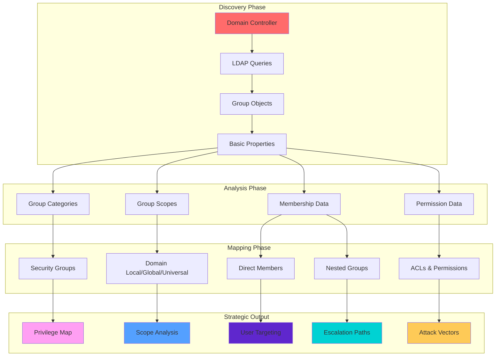
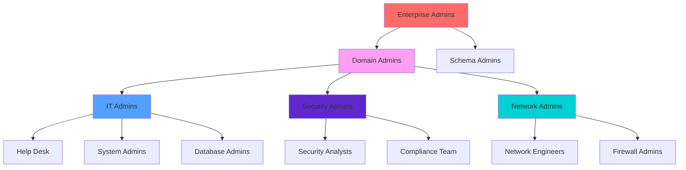

[Prev: 05_User_Enumeration.md](./05_User_Enumeration.md) | [Up: Index](./00_Enumeration_Index.md) | [Hub](./00_Methodology_Hub.md) | [Next: 07_Computer_Enumeration.md](./07_Computer_Enumeration.md)

# Group Enumeration

> **⚠️ CRITICAL TOOL REQUIREMENT**: **Invisi-Shell** is mandatory for production environments to ensure stealth operations and avoid detection. See [Tool Arsenal](./01_Tool_Setup_Loading.md#-invisi-shell-complete-setup) for setup instructions.

## 📋 **QUICK START GROUP DISCOVERY**

| Phase | Tool | Command | Purpose | OPSEC Level |
|-------|------|---------|---------|-------------|
| **1** | MS AD Module | `Get-ADGroup -Filter * -Properties groupCategory,groupScope` | Basic group discovery | 🟢 Stealth |
| **2** | PowerView | `Get-DomainGroup -Properties groupCategory,groupScope,member` | Advanced properties | 🟡 Balanced |
| **3** | PowerView | `Get-DomainGroupMember 'Domain Admins' -Recurse` | Privileged membership | 🟡 Balanced |
| **4** | PowerView | `Get-DomainObjectAcl -SamAccountName "Domain-Admins"` | Permission analysis | 🟠 Noisy |

## 🎭 **AT-A-GLANCE: GROUP ENUMERATION ESSENTIALS**

**What This Technique Reveals:**
- Organizational structure and access control patterns
- Privilege distribution and escalation paths
- Group hierarchies and nested relationships
- Administrative delegation and management

**Primary Use Cases:**
- Privilege escalation planning
- Access control analysis
- Organizational structure mapping
- Attack path identification

**Execution Speed:**
- **Stealth Mode**: 2-5 seconds between queries
- **Balanced Mode**: 1-2 seconds between queries
- **Lab Mode**: 200-500ms between queries

## 🧭 **PIVOT MATRIX: STRATEGIC NEXT STEPS**

| Finding | Immediate Pivot | Strategic Goal | Tool/Technique |
|---------|-----------------|----------------|----------------|
| **Privileged Groups** | [User Enumeration](./05_User_Enumeration.md) | High-value target identification | `Get-DomainGroupMember -Recurse` |
| **Nested Groups** | [ACL Enumeration](./09_ACL_Enumeration.md) | Delegation and rights analysis | `Get-DomainObjectAcl` |
| **Cross-Domain Groups** | [Forest Enumeration](./30_Forest_Enumeration.md) | Trust scope expansion | `Get-ADTrust` |
| **GPO-Linked Groups** | [GPO Enumeration](./08_GPO_Enumeration.md) | Policy-based attack paths | `Get-DomainGPO` |
| **Large Groups** | [User Enumeration](./05_User_Enumeration.md) | Mass user targeting | `Get-DomainGroupMember` |
| **Custom Admin Groups** | [ACL Enumeration](./09_ACL_Enumeration.md) | Custom privilege escalation | `Find-InterestingDomainAcl` |

---

## 🛠️ **COMPREHENSIVE ENUMERATION TOOLS**

### **🔧 Microsoft-Signed Tools**
- **Microsoft AD Module**: Group enumeration via AD objects and services
- **Get-ADGroup**: Group object enumeration and analysis
- **Get-ADGroupMember**: Group membership enumeration and analysis
- **Get-ADPrincipalGroupMembership**: User group membership analysis
- **Get-ADObject**: General AD object enumeration for group correlation
- **Get-ADDomain**: Domain information for group enumeration scope

### **⚔️ Offensive Tools (PowerView, etc.)**
- **PowerView Suite**: Comprehensive group enumeration and discovery
- **Get-DomainGroup**: PowerView group enumeration and analysis
- **Get-DomainGroupMember**: PowerView group membership analysis
- **Get-DomainUser**: PowerView user enumeration for group correlation
- **Find-InterestingDomainAcl**: PowerView ACL analysis for groups
- **Invoke-GroupEnumeration**: PowerView group enumeration capabilities

### **🔴 Red Team Enumeration Tools**

#### **🔍 PowerView - The AD Enumeration Swiss Army Knife**
**Purpose**: PowerShell framework for comprehensive AD enumeration and attack execution
**Setup**: Download PowerView.ps1 from GitHub
**Primary Commands**:
```powershell
# Basic group enumeration
Get-DomainGroup -Properties name,description,memberof,members  # Basic group info
Get-DomainGroup -Properties name,description,memberof,members | Where-Object {$_.description -like "*admin*"}  # Admin groups
Get-DomainGroup -Properties name,description,memberof,members | Where-Object {$_.memberof -like "*Domain Admins*"}  # Nested in Domain Admins

# Advanced group enumeration
Get-DomainGroup -Properties * | Select-Object name,description,memberof,members,admincount  # All properties
Get-DomainGroup -Properties * | Where-Object {$_.admincount -eq 1}  # Admin count groups
Get-DomainGroup -Properties * | Where-Object {$_.memberof -like "*Enterprise Admins*"}  # Nested in Enterprise Admins

# Group membership analysis
Get-DomainGroupMember -Identity "Domain Admins"              # Domain Admins members
Get-DomainGroupMember -Identity "Domain Admins" -Recurse      # Recursive membership
Get-DomainGroupMember -Identity "Domain Admins" -Recurse | Where-Object {$_.objectclass -eq "user"}  # Users only

# Group ACL analysis
Get-DomainObjectAcl -SamAccountName "Domain Admins" -ResolveGUIDs  # Group ACLs
Get-DomainObjectAcl -SamAccountName "Domain Admins" -ResolveGUIDs | Where-Object {$_.ActiveDirectoryRights -like "*GenericAll*"}  # GenericAll rights

# Group data export
Get-DomainGroup -Properties * | Export-Csv -Path "all_groups.csv"  # Export all groups
Get-DomainGroupMember -Identity "Domain Admins" -Recurse | Export-Csv -Path "domain_admins_members.csv"  # Export members
```

#### **🔍 SharpView - Compiled PowerView (C#)**
**Purpose**: C# version of PowerView without PowerShell execution
**Setup**: Download SharpView.exe from GitHub
**Primary Commands**:
```cmd
# Basic group enumeration
SharpView.exe Get-DomainGroup -Properties name,description,memberof,members  # Basic group info
SharpView.exe Get-DomainGroup -Properties name,description,memberof,members | Where-Object {$_.description -like "*admin*"}  # Admin groups
SharpView.exe Get-DomainGroup -Properties name,description,memberof,members | Where-Object {$_.memberof -like "*Domain Admins*"}  # Nested in Domain Admins

# Advanced group enumeration
SharpView.exe Get-DomainGroup -Properties * | Select-Object name,description,memberof,members,admincount  # All properties
SharpView.exe Get-DomainGroup -Properties * | Where-Object {$_.admincount -eq 1}  # Admin count groups
SharpView.exe Get-DomainGroup -Properties * | Where-Object {$_.memberof -like "*Enterprise Admins*"}  # Nested in Enterprise Admins

# Group membership analysis
SharpView.exe Get-DomainGroupMember -Identity "Domain Admins"      # Domain Admins members
SharpView.exe Get-DomainGroupMember -Identity "Domain Admins" -Recurse  # Recursive membership
SharpView.exe Get-DomainGroupMember -Identity "Domain Admins" -Recurse | Where-Object {$_.objectclass -eq "user"}  # Users only

# Group ACL analysis
SharpView.exe Get-DomainObjectAcl -SamAccountName "Domain Admins" -ResolveGUIDs  # Group ACLs
SharpView.exe Get-DomainObjectAcl -SamAccountName "Domain Admins" -ResolveGUIDs | Where-Object {$_.ActiveDirectoryRights -like "*GenericAll*"}  # GenericAll rights
```

#### **🧭 Seatbelt - The C# System Situational Awareness Tool**
**Purpose**: C# system situational awareness including group details
**Setup**: Download Seatbelt executable from GitHub
**Primary Commands**:
```cmd
# Basic system enumeration
Seatbelt.exe all                                               # All enumeration modules
Seatbelt.exe all -q                                            # Quiet mode
Seatbelt.exe all -o results.txt                               # Output to file

# Group-specific enumeration
Seatbelt.exe Groups                                            # Group enumeration
Seatbelt.exe Groups -q                                         # Group enumeration quiet mode
Seatbelt.exe Groups -o groups.txt                              # Group output

# User group enumeration
Seatbelt.exe LoggedOnUsers                                     # Logged on users
Seatbelt.exe LoggedOnUsers -q                                  # Logged on users quiet mode
Seatbelt.exe LoggedOnUsers -o loggedon_users.txt               # Logged on users output

# Group analysis
Seatbelt.exe Groups -o groups_analysis.txt                     # Group analysis output
Seatbelt.exe LoggedOnUsers -o user_group_analysis.txt          # User group analysis output
```

#### **🔍 CrackMapExec (CME) - The Swiss Army Knife**
**Purpose**: Swiss army knife for SMB/AD exploitation
**Setup**: `pip install crackmapexec`
**Primary Commands**:
```bash
# Basic group enumeration
crackmapexec smb targets.txt                                   # SMB enumeration
crackmapexec smb targets.txt -u username -p password           # Authenticated enumeration
crackmapexec smb targets.txt -u username -p password --groups  # Group enumeration

# Advanced group options
crackmapexec smb targets.txt -u username -p password --groups --users  # Groups and users
crackmapexec smb targets.txt -u username -p password --groups --local-auth  # Local authentication
crackmapexec smb targets.txt -u username -p password --groups --shares      # Share enumeration

# Group analysis
crackmapexec smb targets.txt -u username -p password --groups -o group_enumeration.txt  # Group enumeration output
crackmapexec smb targets.txt -u username -p password --groups --users -o group_user_analysis.txt  # Group user analysis output
```

### **🛠️ Alternative Enumeration Tools**

#### **🔍 LDAPDomainDump - The Python LDAP Enumeration Tool**
**Purpose**: Python tool for dumping AD info over LDAP
**Setup**: `pip install ldapdomaindump` or download from GitHub
**Primary Commands**:
```bash
# Basic LDAP enumeration
ldapdomaindump target.com                                   # Basic enumeration
ldapdomaindump target.com -u username -p password           # Authenticated enumeration
ldapdomaindump target.com -u username -p password -o output_dir  # Custom output

# LDAP server specification
ldapdomaindump target.com -s ldap://192.168.1.10            # Specific LDAP server
ldapdomaindump target.com -s ldaps://192.168.1.10           # LDAPS connection
ldapdomaindump target.com -s ldap://192.168.1.10:389        # Custom port

# Output formats
ldapdomaindump target.com -o output_dir --format html       # HTML output
ldapdomaindump target.com -o output_dir --format json       # JSON output
ldapdomaindump target.com -o output_dir --format csv        # CSV output

# Group-specific data
ldapdomaindump target.com -o output_dir --include-groups    # Group enumeration
ldapdomaindump target.com -o output_dir --include-users     # User enumeration
ldapdomaindump target.com -o output_dir --include-computers # Computer enumeration
```

#### **🌐 Native Windows Group Tools**
**Purpose**: Built-in Windows group enumeration capabilities
**Setup**: Built into Windows
**Primary Commands**:
```cmd
# net commands
net group /domain                                            # List domain groups
net group "Domain Admins" /domain                           # Get group members
net group "Enterprise Admins" /domain                       # Enterprise Admins members
net group "Schema Admins" /domain                           # Schema Admins members

# dsquery commands
dsquery group -name "*"                                     # Query all groups
dsquery group -name "*admin*"                               # Query admin groups
dsquery group -name "*admin*" -limit 10                     # Limited admin groups
dsquery group -desc "*admin*"                               # Groups with admin description

# PowerShell AD commands
Get-ADGroup                                                 # Get all groups
Get-ADGroup -Filter {name -like "*admin*"}                  # Admin groups
Get-ADGroup -Filter {admincount -eq 1}                      # Admin count groups
Get-ADGroupMember -Identity "Domain Admins"                 # Group members
```

#### **🔍 Online Group Enumeration Tools**
**Purpose**: Web-based group enumeration and reconnaissance
**Setup**: Web browser access
**Primary Tools**:
- **Microsoft Docs**: Official AD documentation and tools
- **Security Research**: Group enumeration security analysis
- **OSINT frameworks**: Comprehensive open-source intelligence
- **Community Resources**: Group enumeration guides and examples

**Usage Examples**:
```bash
# Microsoft Docs
# Visit https://docs.microsoft.com/en-us/windows-server/identity/ad-ds/
# Search for specific group enumeration topics and examples

# Security Research
# Search for group enumeration techniques and security analysis
# Use tools like Google, Bing, or specialized search engines

# Community Resources
# Visit security forums and communities for group enumeration examples
# Access shared tools and scripts for group enumeration analysis
```

### **🔍 Specialized Tools**

#### **🌐 Group Discovery Tools**
- **PowerView**: Comprehensive group enumeration toolkit
- **SharpView**: Compiled group enumeration capabilities
- **Seatbelt**: System situational awareness for groups
- **Custom Scripts**: Advanced group enumeration automation

#### **🔗 Group Membership Analysis Tools**
- **Membership Mapping**: Group member relationship analysis
- **Nested Group Analysis**: Group hierarchy and nesting mapping
- **PowerView**: Group membership analysis via AD integration
- **Custom Scripts**: Advanced membership analysis automation

#### **📋 Group Data Export Tools**
- **PowerView**: CSV export capabilities
- **SharpView**: Compiled export capabilities
- **LDAPDomainDump**: Multiple format export capabilities
- **Custom Scripts**: Advanced export format automation

#### **🎯 Group Attack Vector Tools**
- **Group enumeration tools**: Group-based attacks
- **Custom Scripts**: Advanced group exploitation
- **Attack planning tools**: Group-based attack path planning
- **Exploitation tools**: Group-based privilege escalation tools

---

## 🎭 **PERSONAS: REAL-WORLD EXECUTION PROFILES**

### **🕵️ Stealth Consultant (Production Environment)**
- **Tool Preference**: Microsoft AD Module + Invisi-Shell
- **Query Pattern**: Targeted, minimal properties, OU-scoped
- **Timing**: 3-5 second delays with jitter
- **Risk Tolerance**: Minimal detection footprint

### **⚡ Power User (Internal Assessment)**
- **Tool Preference**: PowerView + Microsoft AD Module
- **Query Pattern**: Comprehensive properties, strategic targeting
- **Timing**: 1-2 second delays
- **Risk Tolerance**: Moderate detection acceptable

### **👑 Domain Admin (Lab Environment)**
- **Tool Preference**: Full PowerView suite + SharpView
- **Query Pattern**: Broad sweeps, all properties, recursive analysis
- **Timing**: 200-500ms delays
- **Risk Tolerance**: Detection not a concern

## 🎨 **VISUAL MASTERY: GROUP ENUMERATION ARCHITECTURE**

### **Group Enumeration Data Flow Architecture**


**Architecture Explanation:**
This diagram shows the complete flow from initial discovery to strategic output. The **Discovery Phase** establishes basic group information, the **Analysis Phase** categorizes and structures the data, the **Mapping Phase** creates detailed relationships, and the **Strategic Output** provides actionable intelligence for attack planning.

### **Group Hierarchy and Nesting Patterns**


**Hierarchy Explanation:**
This diagram illustrates typical Active Directory group nesting patterns. **Enterprise Admins** sit at the top, delegating to **Domain Admins**, which then delegate to specialized administrative groups. Understanding these hierarchies is crucial for identifying privilege escalation paths and understanding administrative delegation.

## 🏭 **LAB vs PRODUCTION: EXECUTION PROFILES**

### **🔬 LAB ENVIRONMENT EXECUTION**
```powershell
# Full enumeration with maximum detail
Get-DomainGroup -Properties * | Export-Csv -Path "all_groups_detailed.csv" -NoTypeInformation

# Comprehensive nested group analysis
$allGroups = Get-DomainGroup
foreach($group in $allGroups) {
    $members = Get-DomainGroupMember -Identity $group.Name -Recurse
    Write-Host "$($group.Name): $($members.Count) total members" -ForegroundColor Green
}

# Full ACL enumeration across all groups
Get-DomainGroup | ForEach-Object {
    $acls = Get-DomainObjectAcl -SamAccountName $_.SamAccountName -ResolveGUIDs
    $acls | Export-Csv -Path "acl_$($_.Name).csv" -NoTypeInformation
}
```

**Lab Environment Characteristics:**
- **Detection**: Not a concern
- **Speed**: Maximum execution speed
- **Detail**: Full property enumeration
- **Scope**: Complete domain coverage
- **Tools**: Full PowerView suite

### **🏢 PRODUCTION ENVIRONMENT EXECUTION**
```powershell
# Stealth enumeration with minimal properties
Get-ADGroup -Filter * -Properties groupCategory,groupScope | 
    Select-Object Name, GroupCategory, GroupScope | 
    Export-Csv -Path "groups_basic.csv" -NoTypeInformation

# Targeted privileged group analysis
$privilegedGroups = @("Domain Admins", "Enterprise Admins", "Schema Admins")
foreach($group in $privilegedGroups) {
    Start-Sleep -Seconds (Get-Random -Minimum 3 -Maximum 6)
    try {
        $members = Get-ADGroupMember -Identity $group
        Write-Host "$group`: $($members.Count) members" -ForegroundColor Yellow
    }
    catch { Write-Warning "Access denied to $group" }
}

# Minimal ACL analysis on high-value targets only
$highValueGroups = Get-ADGroup -Filter 'Name -like "*admin*"' -Properties Name
foreach($group in $highValueGroups) {
    Start-Sleep -Seconds (Get-Random -Minimum 2 -Maximum 5)
    try {
        $acls = Get-ACL "AD:\$($group.DistinguishedName)"
        Write-Host "$($group.Name): $($acls.Access.Count) ACLs" -ForegroundColor Red
    }
    catch { Write-Warning "Cannot access ACLs for $($group.Name)" }
}
```

**Production Environment Characteristics:**
- **Detection**: Critical concern
- **Speed**: Controlled with jitter
- **Detail**: Minimal necessary properties
- **Scope**: Strategic targeting only
- **Tools**: Microsoft AD Module + Invisi-Shell

## 🛡️ **DETECTION, OPSEC & CLEANUP**

### **🚨 DETECTION INDICATORS**

**Event Log Monitoring:**
- **Event ID 4662**: Object access (group enumeration)
- **Event ID 5136**: Directory service changes
- **Event ID 5141**: Directory service replication
- **Event ID 4728-4735**: Group membership modifications

**Network Monitoring:**
- **LDAP Queries**: Port 389/636 queries to domain controllers
- **ADWS Traffic**: Port 9389 SOAP requests
- **Query Patterns**: Bulk group enumeration spikes
- **Cross-Domain**: Queries to multiple domains simultaneously

**Behavioral Indicators:**
- **Bulk Enumeration**: Large numbers of group queries in short time
- **Property Enumeration**: Requests for all group properties
- **Membership Analysis**: Detailed member enumeration across groups
- **ACL Analysis**: Permission enumeration across group objects

### **🔒 OPSEC BEST PRACTICES**

**Stealth Techniques:**
```powershell
# Use Invisi-Shell for maximum stealth
# See: [Tool Arsenal](./01_Tool_Setup_Loading.md#-invisi-shell-complete-setup)

# Minimize query size and scope
Get-ADGroup -Filter * -Properties name,groupCategory,groupScope | Select-Object -First 10

# Use Microsoft AD Module when possible
Import-Module ActiveDirectory

# Add jitter between queries
Start-Sleep -Seconds (Get-Random -Minimum 2 -Maximum 5)

# Scope queries by OU when possible
Get-ADGroup -SearchBase "OU=IT,DC=corp,DC=local" -Filter *
```

**Detection Avoidance:**
- **Avoid bulk operations** in single queries
- **Use native Windows commands** when possible
- **Prefer ADWS over direct LDAP** for Microsoft tools
- **Implement query delays** with randomization
- **Scope queries** to specific OUs or groups

### **🧹 CLEANUP PROCEDURES**

**File Cleanup:**
```powershell
# Remove enumeration artifacts
Remove-Item "group_*.csv" -ErrorAction SilentlyContinue
Remove-Item "acl_*.csv" -ErrorAction SilentlyContinue
Remove-Item "groups_*.csv" -ErrorAction SilentlyContinue

# Clear PowerShell history
Clear-History
Remove-Item (Get-PSReadLineOption).HistorySavePath -ErrorAction SilentlyContinue

# Clear event logs (if elevated)
wevtutil cl Security
wevtutil cl System
```

**Session Cleanup:**
```powershell
# Remove loaded modules
Remove-Module ActiveDirectory -ErrorAction SilentlyContinue
Remove-Module Microsoft.ActiveDirectory.Management -ErrorAction SilentlyContinue

# Clear variables
Remove-Variable groups, members, acls -ErrorAction SilentlyContinue

# Reset PowerShell execution policy (if changed)
Set-ExecutionPolicy -ExecutionPolicy Restricted -Force
```

## 🔗 **CROSS-REFERENCES & INTEGRATION**

### **📚 RELATED TECHNIQUES**
- **[User Enumeration](./05_User_Enumeration.md)**: Group members become user targets
- **[ACL Enumeration](./09_ACL_Enumeration.md)**: Group permissions and delegation
- **[GPO Enumeration](./08_GPO_Enumeration.md)**: Group Policy linked groups
- **[Forest Enumeration](./30_Forest_Enumeration.md)**: Cross-domain group analysis
- **[Computer Enumeration](./07_Computer_Enumeration.md)**: Computer accounts in groups

### **🛠️ TOOL DEPENDENCIES**
- **[Tool Setup & Loading](./01_Tool_Setup_Loading.md)**: Invisi-Shell and PowerView setup
- **[Network Enumeration](./02_Network_Enumeration.md)**: Domain controller discovery
- **[DNS Enumeration](./03_DNS_Enumeration.md)**: Domain name resolution
- **[Domain Enumeration](./04_Domain_Enumeration.md)**: Domain context establishment

### **🎯 ATTACK PATH INTEGRATION**
- **Privilege Escalation**: Group membership analysis → User targeting
- **Lateral Movement**: Group-based access control → Resource access
- **Persistence**: Group modification → Administrative access maintenance
- **Defense Evasion**: Group permission manipulation → Access hiding

---

## 🎯 **COMPREHENSIVE GROUP ENUMERATION COMMANDS**

### **🚀 PHASE 1: BASIC GROUP DISCOVERY (20+ Commands)**

#### **Microsoft AD Module (Stealth Operations)**
```powershell
# 1. Basic group enumeration (MS-signed, CLM-friendly)
Get-ADGroup -Filter * | Select-Object Name, GroupCategory, GroupScope, DistinguishedName

# 2. Group count and distribution
(Get-ADGroup -Filter *).Count
Get-ADGroup -Filter * -Properties GroupCategory | Group-Object GroupCategory

# 3. Group scope analysis
Get-ADGroup -Filter * -Properties GroupScope | Group-Object GroupScope

# 4. Security vs Distribution groups
Get-ADGroup -Filter 'GroupCategory -eq "Security"' -Properties Name, Description
Get-ADGroup -Filter 'GroupCategory -eq "Distribution"' -Properties Name, Description

# 5. Built-in privileged groups
$privilegedGroups = @("Domain Admins", "Enterprise Admins", "Schema Admins", "Account Operators", "Backup Operators")
foreach($group in $privilegedGroups) {
    try {
        $groupInfo = Get-ADGroup -Identity $group -Properties *
        Write-Host "$group`: $($groupInfo.MemberCount) members" -ForegroundColor Red
    }
    catch { Write-Warning "$group not found" }
}
```

#### **PowerView Suite (Comprehensive Enumeration)**
```powershell
# 6. Comprehensive group enumeration
Get-DomainGroup -Properties name, groupcategory, groupscope, description, membercount

# 7. Advanced group filtering
Get-DomainGroup -LDAPFilter "groupCategory=2" | Select-Object Name, GroupCategory

# 8. Group description analysis
Get-DomainGroup -Properties description | Where-Object {$_.description} | Select-Object Name, Description

# 9. Large groups identification
Get-DomainGroup -Properties member | Where-Object {$_.member.Count -gt 10} | Select-Object Name, @{Name='MemberCount';Expression={$_.member.Count}}

# 10. Custom admin groups
Get-DomainGroup -Properties name, description | Where-Object {$_.name -like "*admin*" -or $_.description -like "*admin*"}
```

#### **Native Windows Tools (Maximum Stealth)**
```powershell
# 11. Native group enumeration
net group /domain
net group "Domain Admins" /domain

# 12. Group member analysis
net group "Enterprise Admins" /domain

# 13. Built-in group discovery
wmic group get name, description

# 14. Local group analysis
net localgroup administrators

# 15. Group policy groups
gpresult /r | Select-String "Group"
```

### **🚀 PHASE 2: ADVANCED GROUP ANALYSIS (20+ Commands)**

#### **Membership Enumeration**
```powershell
# 16. Group member enumeration (PowerView)
Get-DomainGroupMember -Identity "Domain Admins"

# 17. Recursive member analysis
Get-DomainGroupMember -Identity "Domain Admins" -Recurse

# 18. Member properties analysis
Get-DomainGroupMember -Identity "Domain Admins" -Properties name, samaccountname, distinguishedname, objectclass

# 19. Nested group discovery
Get-DomainGroupMember -Identity "IT Admins" | Where-Object {$_.objectclass -eq "group"}

# 20. Cross-group membership analysis
$groups = Get-DomainGroup -Properties member
foreach($group in $groups) {
    if($group.member.Count -gt 0) {
        Write-Host "$($group.Name): $($group.member.Count) members" -ForegroundColor Yellow
    }
}
```

#### **Permission and ACL Analysis**
```powershell
# 21. Group object ACLs
Get-DomainObjectAcl -SamAccountName "Domain-Admins" -ResolveGUIDs

# 22. Interesting ACL discovery
Find-InterestingDomainAcl -ResolveGUIDs | Where-Object {$_.ObjectName -like "*group*"}

# 23. Group management permissions
Get-DomainGroup -Properties managedBy | Where-Object {$_.managedBy}

# 24. AdminSDHolder analysis
Get-DomainObjectAcl -SamAccountName "AdminSDHolder" -ResolveGUIDs

# 25. Group modification permissions
Get-DomainObjectAcl -SamAccountName "Domain-Admins" -ResolveGUIDs | Where-Object {$_.ActiveDirectoryRights -like "*Write*"}
```

#### **Advanced Group Properties**
```powershell
# 26. Group creation time analysis
Get-DomainGroup -Properties whencreated, whenchanged | Sort-Object whencreated

# 27. Group modification tracking
Get-DomainGroup -Properties whenchanged, uSNChanged | Sort-Object whenchanged -Descending

# 28. Group system flags
Get-DomainGroup -Properties systemFlags, isCriticalSystemObject

# 29. Group replication metadata
Get-DomainGroup -Properties uSNCreated, uSNChanged

# 30. Group security descriptors
Get-DomainGroup -Properties nTSecurityDescriptor
```

### **🚀 PHASE 3: STRATEGIC GROUP MAPPING (20+ Commands)**

#### **Cross-Domain Analysis**
```powershell
# 31. Child domain groups
$childDomains = Get-ADForest | Select-Object -ExpandProperty Domains
foreach($domain in $childDomains) {
    Get-ADGroup -Filter * -Server $domain | Select-Object Name, GroupCategory, GroupScope
}

# 32. Cross-forest group analysis
Get-ADTrust -Filter * | ForEach-Object {
    if($_.TrustType -eq "External") {
        Write-Host "External trust to: $($_.TargetName)" -ForegroundColor Yellow
    }
}

# 33. Trust relationship groups
Get-DomainGroup -Properties member | Where-Object {$_.member -match "CN=ForeignSecurityPrincipals"}

# 34. Cross-domain admin groups
Get-DomainGroup -Properties member | Where-Object {$_.member -match "CN=.*,DC=.*,DC=.*"}

# 35. Forest-wide group analysis
Get-DomainGroup -Properties member | Where-Object {$_.member -match "CN=.*,DC=.*,DC=.*,DC=.*"}
```

#### **Group Hierarchy Mapping**
```powershell
# 36. Nested group hierarchy
function Get-NestedGroupHierarchy {
    param([string]$GroupName, [int]$Depth = 0, [int]$MaxDepth = 5)
    if($Depth -gt $MaxDepth) { return }
    $indent = "  " * $Depth
    Write-Host "$indent├─ $GroupName" -ForegroundColor Green
    $members = Get-DomainGroupMember -Identity $GroupName
    $nestedGroups = $members | Where-Object {$_.objectclass -eq "group"}
    foreach($nestedGroup in $nestedGroups) {
        Get-NestedGroupHierarchy -GroupName $nestedGroup.Name -Depth ($Depth + 1) -MaxDepth $MaxDepth
    }
}

# 37. Group dependency analysis
$groups = Get-DomainGroup -Properties member
$groupDependencies = @{}
foreach($group in $groups) {
    $groupDependencies[$group.Name] = @()
    if($group.member) {
        foreach($member in $group.member) {
            if($member -match "^CN=([^,]+)") {
                $memberName = $matches[1]
                $groupDependencies[$group.Name] += $memberName
            }
        }
    }
}

# 38. Circular dependency detection
$circularDeps = @()
foreach($group in $groupDependencies.Keys) {
    $visited = @{}
    $stack = @($group)
    while($stack.Count -gt 0) {
        $current = $stack.Pop()
        if($visited.ContainsKey($current)) {
            $circularDeps += "$group -> $current"
            break
        }
        $visited[$current] = $true
        if($groupDependencies.ContainsKey($current)) {
            $stack += $groupDependencies[$current]
        }
    }
}

# 39. Group privilege escalation paths
$privilegedGroups = @("Domain Admins", "Enterprise Admins", "Schema Admins")
foreach($privilegedGroup in $privilegedGroups) {
    Write-Host "Analyzing $privilegedGroup privilege escalation paths:" -ForegroundColor Red
    Get-NestedGroupHierarchy -GroupName $privilegedGroup
}

# 40. Group access control mapping
$groupACLs = @{}
$highValueGroups = Get-DomainGroup -Properties name | Where-Object {$_.name -like "*admin*" -or $_.name -like "*power*"}
foreach($group in $highValueGroups) {
    try {
        $acls = Get-DomainObjectAcl -SamAccountName $group.SamAccountName -ResolveGUIDs
        $groupACLs[$group.Name] = $acls
        Write-Host "$($group.Name): $($acls.Count) ACLs" -ForegroundColor Yellow
    }
    catch {
        Write-Warning "Cannot access ACLs for $($group.Name)"
    }
}
```

---

## 🎯 **COMMAND EXPLANATIONS & USE CASES**

### **🔍 DISCOVERY COMMANDS EXPLAINED**

**Get-ADGroup -Filter * -Properties groupCategory,groupScope:**
- **Purpose**: Retrieves all groups with essential classification properties
- **Parameters**: `-Filter *` (all groups), `-Properties` (specific attributes)
- **Returns**: Group objects with category and scope information
- **Use Case**: Initial domain group structure analysis
- **OPSEC**: Uses ADWS, minimal properties, stealth-friendly
- **Execution Context**: Local or remote with AD module loaded

**Get-DomainGroup -Properties name,groupcategory,groupscope,description,membercount:**
- **Purpose**: Comprehensive group enumeration with key properties
- **Parameters**: `-Properties` (comma-separated attribute list)
- **Returns**: Rich group objects with membership counts
- **Use Case**: Detailed group analysis and categorization
- **OPSEC**: Direct LDAP queries, more visible but comprehensive
- **Execution Context**: Requires PowerView loaded

### **👥 MEMBERSHIP ANALYSIS COMMANDS EXPLAINED**

**Get-DomainGroupMember -Identity "Domain Admins" -Recurse:**
- **Purpose**: Retrieves all members including nested group members
- **Parameters**: `-Identity` (group name), `-Recurse` (include nested members)
- **Returns**: Complete member list with object types
- **Use Case**: Privilege escalation path mapping
- **OPSEC**: Multiple queries, reveals complete group structure
- **Execution Context**: Requires PowerView, generates multiple LDAP queries

**Get-ADGroupMember -Identity "Domain Admins":**
- **Purpose**: Retrieves direct group members only
- **Parameters**: `-Identity` (group name)
- **Returns**: Direct member list (no nested groups)
- **Use Case**: Direct membership analysis
- **OPSEC**: Single query, stealth-friendly
- **Execution Context**: Microsoft AD module, minimal footprint

### **🔐 PERMISSION ANALYSIS COMMANDS EXPLAINED**

**Get-DomainObjectAcl -SamAccountName "Domain-Admins" -ResolveGUIDs:**
- **Purpose**: Retrieves access control lists for group objects
- **Parameters**: `-SamAccountName` (group SAM name), `-ResolveGUIDs` (human-readable permissions)
- **Returns**: ACL entries with resolved permission GUIDs
- **Use Case**: Group permission analysis and delegation discovery
- **OPSEC**: Reveals access control configuration
- **Execution Context**: PowerView required, generates permission queries

**Find-InterestingDomainAcl -ResolveGUIDs:**
- **Purpose**: Discovers ACLs with potentially dangerous permissions
- **Parameters**: `-ResolveGUIDs` (human-readable output)
- **Returns**: ACLs with interesting permissions (Write, FullControl, etc.)
- **Use Case**: Attack vector identification
- **OPSEC**: Comprehensive permission scanning, high visibility
- **Execution Context**: PowerView required, extensive permission analysis

---

## 🎯 **REAL-WORLD EXECUTION SCENARIOS**

### **🏢 SCENARIO 1: STEALTH PRODUCTION ASSESSMENT**

**Objective**: Understand group structure without detection
**Tools**: Microsoft AD Module + Invisi-Shell
**Timing**: 3-5 second delays with jitter

```powershell
# Phase 1: Basic enumeration
Start-Sleep -Seconds (Get-Random -Minimum 3 -Maximum 6)
$groupCount = (Get-ADGroup -Filter *).Count
Write-Host "Total groups: $groupCount" -ForegroundColor Green

# Phase 2: Strategic targeting
$privilegedGroups = @("Domain Admins", "Enterprise Admins", "Schema Admins")
foreach($group in $privilegedGroups) {
    Start-Sleep -Seconds (Get-Random -Minimum 2 -Maximum 5)
    try {
        $members = Get-ADGroupMember -Identity $group
        Write-Host "$group`: $($members.Count) members" -ForegroundColor Yellow
    }
    catch { Write-Warning "Access denied to $group" }
}

# Phase 3: Minimal ACL analysis
$highValueGroups = Get-ADGroup -Filter 'Name -like "*admin*"' -Properties Name
foreach($group in $highValueGroups) {
    Start-Sleep -Seconds (Get-Random -Minimum 3 -Maximum 6)
    try {
    $acls = Get-ACL "AD:\$($group.DistinguishedName)"
        Write-Host "$($group.Name): $($acls.Access.Count) ACLs" -ForegroundColor Red
    }
    catch { Write-Warning "Cannot access ACLs for $($group.Name)" }
}
```

### **🔬 SCENARIO 2: COMPREHENSIVE LAB ANALYSIS**

**Objective**: Complete group structure mapping
**Tools**: Full PowerView suite
**Timing**: 200-500ms delays

```powershell
# Phase 1: Complete enumeration
$allGroups = Get-DomainGroup -Properties *
$allGroups | Export-Csv -Path "all_groups_detailed.csv" -NoTypeInformation

# Phase 2: Comprehensive analysis
foreach($group in $allGroups) {
    $members = Get-DomainGroupMember -Identity $group.Name -Recurse
    Write-Host "$($group.Name): $($members.Count) total members" -ForegroundColor Green
    
    # Export member details
    $members | Export-Csv -Path "members_$($group.Name).csv" -NoTypeInformation
}

# Phase 3: Permission mapping
Get-DomainGroup | ForEach-Object {
    $acls = Get-DomainObjectAcl -SamAccountName $_.SamAccountName -ResolveGUIDs
    $acls | Export-Csv -Path "acl_$($_.Name).csv" -NoTypeInformation
}
```

### **⚡ SCENARIO 3: BALANCED INTERNAL ASSESSMENT**

**Objective**: Strategic group analysis with moderate stealth
**Tools**: PowerView + Microsoft AD Module
**Timing**: 1-2 second delays

```powershell
# Phase 1: Strategic enumeration
$securityGroups = Get-DomainGroup -LDAPFilter "groupCategory=2"
$adminGroups = $securityGroups | Where-Object {$_.name -like "*admin*"}

# Phase 2: Targeted analysis
foreach($group in $adminGroups) {
    Start-Sleep -Seconds (Get-Random -Minimum 1 -Maximum 3)
    $members = Get-DomainGroupMember -Identity $group.Name -Recurse
    Write-Host "$($group.Name): $($members.Count) members" -ForegroundColor Yellow
}

# Phase 3: Strategic permission analysis
$highValueGroups = Get-DomainGroup -Properties name | Where-Object {$_.name -like "*admin*" -or $_.name -like "*power*"}
foreach($group in $highValueGroups) {
    Start-Sleep -Seconds (Get-Random -Minimum 1 -Maximum 3)
    try {
        $acls = Get-DomainObjectAcl -SamAccountName $group.SamAccountName -ResolveGUIDs
        Write-Host "$($group.Name): $($acls.Count) ACLs" -ForegroundColor Red
    }
    catch { Write-Warning "Cannot access ACLs for $($group.Name)" }
}
```

---

## 🔗 **INTEGRATION WITH ATTACK METHODOLOGY**

### **🎯 PHASE 1: RECONNAISSANCE INTEGRATION**
- **Network Enumeration**: Domain controller discovery for group queries
- **DNS Enumeration**: Domain name resolution for group enumeration
- **Domain Enumeration**: Domain context establishment for group queries

### **🎯 PHASE 2: WEAPONIZATION INTEGRATION**
- **Tool Setup**: Invisi-Shell and PowerView loading for stealth operations
- **Command Preparation**: Group enumeration command preparation and testing

### **🎯 PHASE 3: DELIVERY INTEGRATION**
- **Execution Context**: Local or remote execution based on access level
- **Tool Selection**: Microsoft AD Module vs PowerView based on environment

### **🎯 PHASE 4: EXPLOITATION INTEGRATION**
- **Privilege Escalation**: Group membership analysis for escalation paths
- **Lateral Movement**: Group-based access control for resource access
- **Persistence**: Group modification for administrative access maintenance

### **🎯 PHASE 5: INSTALLATION INTEGRATION**
- **Backdoor Installation**: Group-based access for backdoor deployment
- **Service Installation**: Group permissions for service installation

### **🎯 PHASE 6: COMMAND & CONTROL INTEGRATION**
- **Communication Channels**: Group-based access for C2 communication
- **Data Exfiltration**: Group permissions for data access and exfiltration

### **🎯 PHASE 7: ACTIONS ON OBJECTIVES INTEGRATION**
- **Data Destruction**: Group-based access for data manipulation
- **Account Manipulation**: Group modification for account control

---

## 📚 **ADDITIONAL RESOURCES & REFERENCES**

### **🔧 TOOL DOCUMENTATION**
- **PowerView**: [PowerView Functions Reference](https://github.com/PowerShellMafia/PowerSploit/blob/master/Recon/PowerView.ps1)
- **Microsoft AD Module**: [Get-ADGroup Documentation](https://docs.microsoft.com/en-us/powershell/module/activedirectory/get-adgroup)
- **SharpView**: [PowerView Compiled Version](https://github.com/tevora-threat/SharpView)

### **📖 TECHNICAL REFERENCES**
- **Microsoft Docs**: [Active Directory Groups](https://docs.microsoft.com/en-us/windows-server/identity/ad-ds/manage/understand-security-groups)
- **ATT&CK Framework**: [Permission Groups Discovery (T1069)](https://attack.mitre.org/techniques/T1069/)
- **LDAP Filters**: [LDAP Filter Syntax](https://ldap.com/ldap-filters/)

### **🎯 PRACTICAL GUIDES**
- **Red Team Guides**: [Active Directory Enumeration](https://www.ired.team/offensive-security-experiments/active-directory-kerberos-roasting)
- **Penetration Testing**: [AD Group Enumeration](https://adsecurity.org/?p=3658)
- **Security Research**: [Group Nesting Analysis](https://www.harmj0y.net/blog/redteaming/group-membership-and-nesting/)

---

[Prev: 05_User_Enumeration.md](./05_User_Enumeration.md) | [Up: Index](./00_Enumeration_Index.md) | [Hub](./00_Methodology_Hub.md) | [Next: 07_Computer_Enumeration.md](./07_Computer_Enumeration.md)
