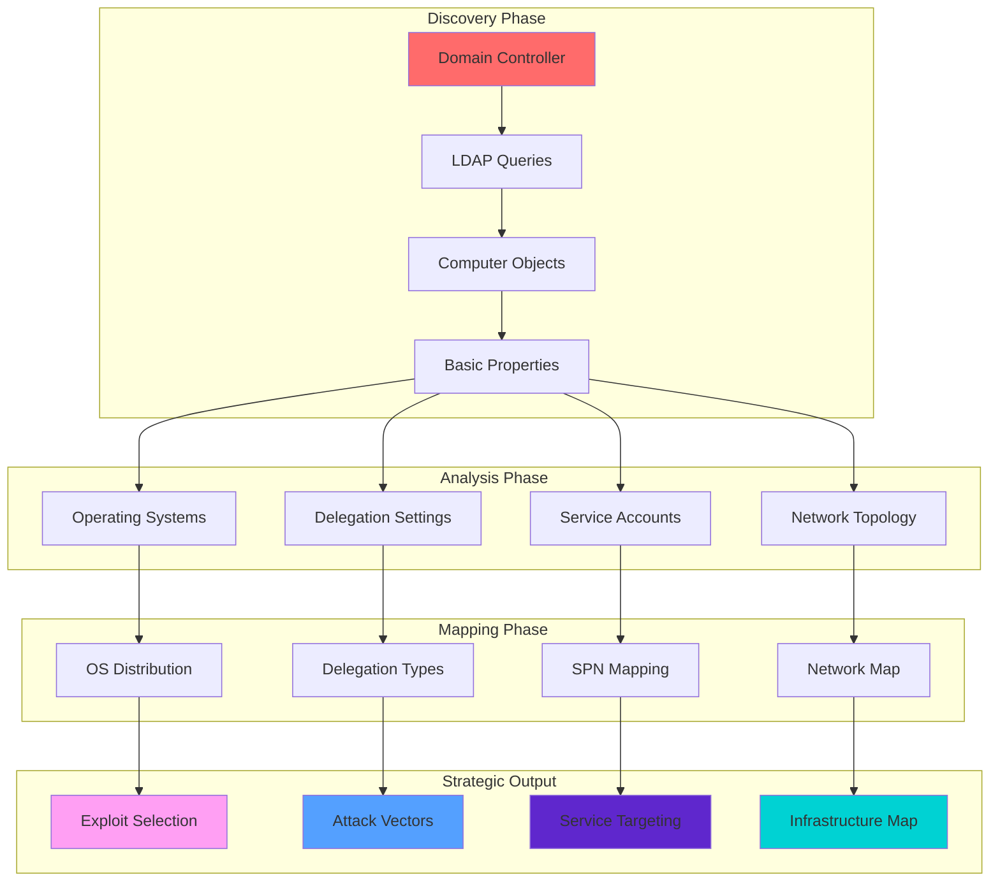

[Prev: 06_Group_Enumeration.md](./06_Group_Enumeration.md) | [Up: Index](./00_Enumeration_Index.md) | [Hub](./00_Methodology_Hub.md) | [Next: 08_GPO_Enumeration.md](./08_GPO_Enumeration.md)

# Computer Enumeration

> **⚠️ CRITICAL TOOL REQUIREMENT**: **Invisi-Shell** is mandatory for production environments to ensure stealth operations and avoid detection. See [Tool Arsenal](./01_Tool_Setup_Loading.md#-invisi-shell-complete-setup) for setup instructions.

## 📋 **QUICK START COMPUTER DISCOVERY**

| Phase | Tool | Command | Purpose | OPSEC Level |
|-------|------|---------|---------|-------------|
| **1** | MS AD Module | `Get-ADComputer -Filter * -Properties OperatingSystem` | Basic computer discovery | 🟢 Stealth |
| **2** | PowerView | `Get-DomainComputer -Properties OperatingSystem,TrustedForDelegation` | Advanced properties | 🟡 Balanced |
| **3** | PowerView | `Get-DomainComputer -Unconstrained` | Delegation abuse targets | 🟡 Balanced |
| **4** | PowerView | `Get-DomainComputer -TrustedToAuth` | RBCD targets | 🟠 Noisy |

## 🎭 **AT-A-GLANCE: COMPUTER ENUMERATION ESSENTIALS**

**What This Technique Reveals:**
- Computer infrastructure and network topology
- Operating system distribution and patch levels
- Delegation settings and attack vectors
- Service accounts and SPN mapping
- Domain controller locations and trust relationships

**Primary Use Cases:**
- Infrastructure mapping and reconnaissance
- Delegation abuse target identification
- Service account discovery for Kerberoasting
- Domain controller targeting for KDC attacks
- Operating system-specific exploit planning

**Execution Speed:**
- **Stealth Mode**: 2-5 seconds between queries
- **Balanced Mode**: 1-2 seconds between queries
- **Lab Mode**: 200-500ms between queries

## 🧭 **PIVOT MATRIX: STRATEGIC NEXT STEPS**

| Finding | Immediate Pivot | Strategic Goal | Tool/Technique |
|---------|-----------------|----------------|----------------|
| **Unconstrained Delegation** | [Kerberos Delegation Abuse](./25_Kerberos_Delegation_Abuse.md) | Ticket abuse and privilege escalation | `Get-DomainComputer -Unconstrained` |
| **TrustedToAuth (RBCD)** | [Kerberos Delegation Abuse](./25_Kerberos_Delegation_Abuse.md) | Resource-based delegation abuse | `Get-DomainComputer -TrustedToAuth` |
| **Service Accounts** | [SPN Enumeration](./24_SPN_Enumeration_Techniques.md) | Kerberoasting and service exploitation | `Get-DomainComputer -SPN` |
| **Domain Controllers** | [Kerberos Basic Enumeration](./23_Kerberos_Basic_Enumeration.md) | KDC targeting and ticket attacks | `Get-ADComputer -Filter "PrimaryGroupSID -eq 'S-1-5-21-domain-516'"` |
| **SQL/Web Servers** | [SQL Server Enumeration](./28_SQL_Server_Enumeration.md) | Service exploitation and data access | `Get-DomainComputer -LDAPFilter "servicePrincipalName=*SQL*"` |
| **Operating Systems** | [Exploit Selection](./00_Methodology_Hub.md) | OS-specific attack planning | `Get-DomainComputer -Properties OperatingSystem,OperatingSystemVersion` |

---

## 🛠️ **COMPREHENSIVE ENUMERATION TOOLS**

### **🔧 Microsoft-Signed Tools**
- **Microsoft AD Module**: Computer enumeration via AD objects and services
- **Get-ADComputer**: Computer object enumeration and analysis
- **Get-ADObject**: General AD object enumeration for computer correlation
- **Get-ADDomain**: Domain information for computer enumeration scope
- **Get-ADReplicationSite**: AD site topology for computer mapping
- **Get-ADReplicationSubnet**: Subnet mapping for computer network analysis

### **⚔️ Offensive Tools (PowerView, etc.)**
- **PowerView Suite**: Comprehensive computer enumeration and discovery
- **Get-DomainComputer**: PowerView computer enumeration and analysis
- **Get-DomainComputer -Unconstrained**: Unconstrained delegation discovery
- **Get-DomainComputer -TrustedToAuth**: RBCD delegation discovery
- **Get-DomainComputer -SPN**: Service principal name enumeration
- **Invoke-ComputerEnumeration**: PowerView computer enumeration capabilities

### **🔴 Red Team Enumeration Tools**

#### **🔍 PowerView - The AD Enumeration Swiss Army Knife**
**Purpose**: PowerShell framework for comprehensive AD enumeration and attack execution
**Setup**: Download PowerView.ps1 from GitHub
**Primary Commands**:
```powershell
# Basic computer enumeration
Get-DomainComputer -Properties name,operatingsystem,operatingsystemversion  # Basic computer info
Get-DomainComputer -Properties name,operatingsystem,operatingsystemversion | Where-Object {$_.operatingsystem -like "*Windows*"}  # Windows systems
Get-DomainComputer -Properties name,operatingsystem,operatingsystemversion | Where-Object {$_.operatingsystem -like "*Server*"}  # Server systems only

# Advanced computer enumeration
Get-DomainComputer -Properties * | Select-Object name,operatingsystem,operatingsystemversion,lastlogondate  # Detailed computer info
Get-DomainComputer -Properties * | Where-Object {$_.operatingsystem -like "*Workstation*"}  # Workstation systems only
Get-DomainComputer -Properties * | Where-Object {$_.operatingsystem -like "*Windows 10*"}  # Windows 10 systems

# Delegation enumeration
Get-DomainComputer -Unconstrained                              # Unconstrained delegation computers
Get-DomainComputer -TrustedToAuth                              # RBCD delegation computers
Get-DomainComputer -Unconstrained -Properties name,operatingsystem  # Unconstrained with properties

# SPN enumeration
Get-DomainComputer -SPN                                        # Computers with SPNs
Get-DomainComputer -SPN -Properties name,serviceprincipalname  # SPN details
Get-DomainComputer -SPN | Where-Object {$_.serviceprincipalname -like "*SQL*"}  # SQL servers

# Computer data export
Get-DomainComputer -Properties * | Export-Csv -Path "all_computers.csv"  # Export all computers
Get-DomainComputer -Unconstrained | Export-Csv -Path "unconstrained_computers.csv"  # Export unconstrained
Get-DomainComputer -SPN | Export-Csv -Path "spn_computers.csv"  # Export SPN computers
```

#### **🔍 SharpView - Compiled PowerView (C#)**
**Purpose**: C# version of PowerView without PowerShell execution
**Setup**: Download SharpView.exe from GitHub
**Primary Commands**:
```cmd
# Basic computer enumeration
SharpView.exe Get-DomainComputer -Properties name,operatingsystem,operatingsystemversion  # Basic computer info
SharpView.exe Get-DomainComputer -Properties name,operatingsystem,operatingsystemversion | Where-Object {$_.operatingsystem -like "*Windows*"}  # Windows systems
SharpView.exe Get-DomainComputer -Properties name,operatingsystem,operatingsystemversion | Where-Object {$_.operatingsystem -like "*Server*"}  # Server systems only

# Advanced computer enumeration
SharpView.exe Get-DomainComputer -Properties * | Select-Object name,operatingsystem,operatingsystemversion,lastlogondate  # Detailed computer info
SharpView.exe Get-DomainComputer -Properties * | Where-Object {$_.operatingsystem -like "*Workstation*"}  # Workstation systems only

# Delegation enumeration
SharpView.exe Get-DomainComputer -Unconstrained                # Unconstrained delegation computers
SharpView.exe Get-DomainComputer -TrustedToAuth                # RBCD delegation computers
SharpView.exe Get-DomainComputer -Unconstrained -Properties name,operatingsystem  # Unconstrained with properties

# SPN enumeration
SharpView.exe Get-DomainComputer -SPN                          # Computers with SPNs
SharpView.exe Get-DomainComputer -SPN -Properties name,serviceprincipalname  # SPN details
```

#### **🧭 Seatbelt - The C# System Situational Awareness Tool**
**Purpose**: C# system situational awareness including computer details
**Setup**: Download Seatbelt executable from GitHub
**Primary Commands**:
```cmd
# Basic system enumeration
Seatbelt.exe all                                               # All enumeration modules
Seatbelt.exe all -q                                            # Quiet mode
Seatbelt.exe all -o results.txt                               # Output to file

# Computer-specific enumeration
Seatbelt.exe SystemInfo                                        # System information
Seatbelt.exe SystemInfo -q                                     # System information quiet mode
Seatbelt.exe SystemInfo -o system_info.txt                     # System information output

# Network computer enumeration
Seatbelt.exe NetworkConnections                                # Network connections
Seatbelt.exe NetworkConnections -q                             # Network connections quiet mode
Seatbelt.exe NetworkConnections -o network_connections.txt     # Network connections output

# Computer analysis
Seatbelt.exe SystemInfo -o computer_analysis.txt               # Computer analysis output
Seatbelt.exe NetworkConnections -o network_analysis.txt        # Network analysis output
```

#### **🔍 CrackMapExec (CME) - The Swiss Army Knife**
**Purpose**: Swiss army knife for SMB/AD exploitation
**Setup**: `pip install crackmapexec`
**Primary Commands**:
```bash
# Basic computer enumeration
crackmapexec smb targets.txt                                   # SMB enumeration
crackmapexec smb targets.txt -u username -p password           # Authenticated enumeration
crackmapexec smb targets.txt -u username -p password --computers  # Computer enumeration

# Advanced computer options
crackmapexec smb targets.txt -u username -p password --computers --os  # OS detection
crackmapexec smb targets.txt -u username -p password --computers --shares  # Share enumeration
crackmapexec smb targets.txt -u username -p password --computers --sessions  # Session enumeration

# Computer analysis
crackmapexec smb targets.txt -u username -p password --computers -o computer_enumeration.txt  # Computer enumeration output
crackmapexec smb targets.txt -u username -p password --computers --os -o os_analysis.txt      # OS analysis output
```

### **🛠️ Alternative Enumeration Tools**

#### **🔍 LDAPDomainDump - The Python LDAP Enumeration Tool**
**Purpose**: Python tool for dumping AD info over LDAP
**Setup**: `pip install ldapdomaindump` or download from GitHub
**Primary Commands**:
```bash
# Basic LDAP enumeration
ldapdomaindump target.com                                   # Basic enumeration
ldapdomaindump target.com -u username -p password           # Authenticated enumeration
ldapdomaindump target.com -u username -p password -o output_dir  # Custom output

# LDAP server specification
ldapdomaindump target.com -s ldap://192.168.1.10            # Specific LDAP server
ldapdomaindump target.com -s ldaps://192.168.1.10           # LDAPS connection
ldapdomaindump target.com -s ldap://192.168.1.10:389        # Custom port

# Output formats
ldapdomaindump target.com -o output_dir --format html       # HTML output
ldapdomaindump target.com -o output_dir --format json       # JSON output
ldapdomaindump target.com -o output_dir --format csv        # CSV output

# Computer-specific data
ldapdomaindump target.com -o output_dir --include-computers  # Computer enumeration
ldapdomaindump target.com -o output_dir --include-users      # User enumeration
ldapdomaindump target.com -o output_dir --include-groups     # Group enumeration
```

#### **🌐 Native Windows Computer Tools**
**Purpose**: Built-in Windows computer enumeration capabilities
**Setup**: Built into Windows
**Primary Commands**:
```cmd
# dsquery commands
dsquery computer -name "*"                                   # Query all computers
dsquery computer -name "*" -limit 100                        # Limited computer enumeration
dsquery computer -desc "*server*"                            # Computer description search
dsquery computer -desc "*workstation*"                       # Workstation search

# PowerShell AD commands
Get-ADComputer                                               # Get all computers
Get-ADComputer -Filter {name -like "*DC*"}                  # Domain controllers
Get-ADComputer -Filter {operatingsystem -like "*Server*"}   # Server systems
Get-ADComputer -Filter {operatingsystem -like "*Workstation*"}  # Workstation systems

# WMI commands
Get-WmiObject -Class Win32_ComputerSystem                    # WMI computer enumeration
Get-WmiObject -Class Win32_ComputerSystem | Where-Object {$_.DomainRole -eq 5}  # Domain controllers
Get-WmiObject -Class Win32_ComputerSystem | Where-Object {$_.DomainRole -eq 3}  # Member servers
```

#### **🔍 Online Computer Enumeration Tools**
**Purpose**: Web-based computer enumeration and reconnaissance
**Setup**: Web browser access
**Primary Tools**:
- **Microsoft Docs**: Official AD documentation and tools
- **Security Research**: Computer enumeration security analysis
- **OSINT frameworks**: Comprehensive open-source intelligence
- **Community Resources**: Computer enumeration guides and examples

**Usage Examples**:
```bash
# Microsoft Docs
# Visit https://docs.microsoft.com/en-us/windows-server/identity/ad-ds/
# Search for specific computer enumeration topics and examples

# Security Research
# Search for computer enumeration techniques and security analysis
# Use tools like Google, Bing, or specialized search engines

# Community Resources
# Visit security forums and communities for computer enumeration examples
# Access shared tools and scripts for computer enumeration analysis
```

### **🔍 Specialized Tools**

#### **🌐 Computer Discovery Tools**
- **PowerView**: Comprehensive computer enumeration toolkit
- **SharpView**: Compiled computer enumeration capabilities
- **Seatbelt**: System situational awareness for computers
- **Custom Scripts**: Advanced computer enumeration automation

#### **🔗 Computer Delegation Analysis Tools**
- **Delegation Mapping**: Computer delegation relationship analysis
- **SPN Analysis**: Service principal name mapping and analysis
- **PowerView**: Computer delegation analysis via AD integration
- **Custom Scripts**: Advanced delegation analysis automation

#### **📋 Computer Data Export Tools**
- **PowerView**: CSV export capabilities
- **SharpView**: Compiled export capabilities
- **LDAPDomainDump**: Multiple format export capabilities
- **Custom Scripts**: Advanced export format automation

#### **🎯 Computer Attack Vector Tools**
- **Computer enumeration tools**: Computer-based attacks
- **Custom Scripts**: Advanced computer exploitation
- **Attack planning tools**: Computer-based attack path planning
- **Exploitation tools**: Computer-based privilege escalation tools

---

## 🎭 **PERSONAS: REAL-WORLD EXECUTION PROFILES**

### **🕵️ Stealth Consultant (Production Environment)**
- **Tool Preference**: Microsoft AD Module + Invisi-Shell
- **Query Pattern**: Targeted, minimal properties, OU-scoped
- **Timing**: 3-5 second delays with jitter
- **Risk Tolerance**: Minimal detection footprint

### **⚡ Power User (Internal Assessment)**
- **Tool Preference**: PowerView + Microsoft AD Module
- **Query Pattern**: Comprehensive properties, strategic targeting
- **Timing**: 1-2 second delays
- **Risk Tolerance**: Moderate detection acceptable

### **👑 Domain Admin (Lab Environment)**
- **Tool Preference**: Full PowerView suite + SharpView
- **Query Pattern**: Broad sweeps, all properties, comprehensive analysis
- **Timing**: 200-500ms delays
- **Risk Tolerance**: Detection not a concern

## 🎨 **VISUAL MASTERY: COMPUTER ENUMERATION ARCHITECTURE**

### **Computer Enumeration Data Flow Architecture**


**Architecture Explanation:**
This diagram shows the complete flow from initial discovery to strategic output. The **Discovery Phase** establishes basic computer information, the **Analysis Phase** categorizes and structures the data, the **Mapping Phase** creates detailed relationships, and the **Strategic Output** provides actionable intelligence for attack planning and infrastructure mapping.

### **Computer Infrastructure Hierarchy and Relationships**

```mermaid
graph TD
    A[Domain Controllers] --> B[Primary DC]
    A --> C[Secondary DCs]
    A --> D[Global Catalog]
    
    E[Member Servers] --> F[Application Servers]
    E --> G[File Servers]
    E --> H[Database Servers]
    E --> I[Web Servers]
    
    J[Workstations] --> K[Admin Workstations]
    J --> L[User Workstations]
    J --> M[Kiosk Workstations]
    
    N[Service Hosts] --> O[SQL Servers]
    N --> P[Exchange Servers]
    N --> Q[SharePoint Servers]
    N --> R[Custom Services]
    
    style A fill:#ff6b6b
    style E fill:#ff9ff3
    style J fill:#54a0ff
    style N fill:#5f27cd
```


**Hierarchy Explanation:**
This diagram illustrates typical Active Directory computer infrastructure hierarchy. **Domain Controllers** form the core, **Member Servers** provide services, **Workstations** serve users, and **Service Hosts** run specific applications. Understanding these relationships is crucial for identifying attack vectors and planning lateral movement.

## 🏭 **LAB vs PRODUCTION: EXECUTION PROFILES**

### **🔬 LAB ENVIRONMENT EXECUTION**
```powershell
# Full enumeration with maximum detail
Get-DomainComputer -Properties * | Export-Csv -Path "all_computers_detailed.csv" -NoTypeInformation

# Comprehensive delegation analysis
$unconstrained = Get-DomainComputer -Unconstrained
$trustedToAuth = Get-DomainComputer -TrustedToAuth
$serviceHosts = Get-DomainComputer -SPN

Write-Host "Unconstrained Delegation: $($unconstrained.Count) computers" -ForegroundColor Red
Write-Host "TrustedToAuth (RBCD): $($trustedToAuth.Count) computers" -ForegroundColor Yellow
Write-Host "Service Hosts: $($serviceHosts.Count) computers" -ForegroundColor Green

# Full SPN enumeration
Get-DomainComputer -SPN | ForEach-Object {
    $spns = $_.servicePrincipalName -join ", "
    Write-Host "$($_.Name): $spns" -ForegroundColor Cyan
}

# Complete OS distribution analysis
$osDistribution = Get-DomainComputer -Properties OperatingSystem | Group-Object OperatingSystem
$osDistribution | Sort-Object Count -Descending | ForEach-Object {
    Write-Host "$($_.Name): $($_.Count) computers" -ForegroundColor Magenta
}
```

**Lab Environment Characteristics:**
- **Detection**: Not a concern
- **Speed**: Maximum execution speed
- **Detail**: Full property enumeration
- **Scope**: Complete domain coverage
- **Tools**: Full PowerView suite

### **🏢 PRODUCTION ENVIRONMENT EXECUTION**
```powershell
# Stealth enumeration with minimal properties
Get-ADComputer -Filter * -Properties OperatingSystem, OperatingSystemVersion | 
    Select-Object Name, OperatingSystem, OperatingSystemVersion | 
    Export-Csv -Path "computers_basic.csv" -NoTypeInformation

# Targeted delegation analysis
Start-Sleep -Seconds (Get-Random -Minimum 3 -Maximum 6)
try {
    $unconstrained = Get-ADComputer -Filter "TrustedForDelegation -eq '$true'" -Properties TrustedForDelegation
    Write-Host "Unconstrained Delegation: $($unconstrained.Count) computers" -ForegroundColor Red
}
catch { Write-Warning "Cannot enumerate unconstrained delegation" }

Start-Sleep -Seconds (Get-Random -Minimum 2 -Maximum 5)
try {
    $serviceHosts = Get-ADComputer -Filter "servicePrincipalName -like '*'" -Properties servicePrincipalName
    Write-Host "Service Hosts: $($serviceHosts.Count) computers" -ForegroundColor Yellow
}
catch { Write-Warning "Cannot enumerate service hosts" }

# Minimal OS analysis
Start-Sleep -Seconds (Get-Random -Minimum 3 -Maximum 6)
$osCount = (Get-ADComputer -Filter * -Properties OperatingSystem | Group-Object OperatingSystem).Count
Write-Host "Unique Operating Systems: $osCount" -ForegroundColor Green
```

**Production Environment Characteristics:**
- **Detection**: Critical concern
- **Speed**: Controlled with jitter
- **Detail**: Minimal necessary properties
- **Scope**: Strategic targeting only
- **Tools**: Microsoft AD Module + Invisi-Shell

## 🛡️ **DETECTION, OPSEC & CLEANUP**

### **🚨 DETECTION INDICATORS**

**Event Log Monitoring:**
- **Event ID 4662**: Object access (computer enumeration)
- **Event ID 5136**: Directory service changes
- **Event ID 5141**: Directory service replication
- **Event ID 4624**: Successful logon (computer account access)

**Network Monitoring:**
- **LDAP Queries**: Port 389/636 queries to domain controllers
- **ADWS Traffic**: Port 9389 SOAP requests
- **Query Patterns**: Bulk computer enumeration spikes
- **Delegation Analysis**: Trust and delegation queries

**Behavioral Indicators:**
- **Bulk Enumeration**: Large numbers of computer queries in short time
- **Property Enumeration**: Requests for all computer properties
- **Delegation Analysis**: Trust and delegation setting queries
- **SPN Analysis**: Service principal name enumeration

### **🔒 OPSEC BEST PRACTICES**

**Stealth Techniques:**
```powershell
# Use Invisi-Shell for maximum stealth
# See: [Tool Arsenal](./01_Tool_Setup_Loading.md#-invisi-shell-complete-setup)

# Minimize query size and scope
Get-ADComputer -Filter * -Properties OperatingSystem, OperatingSystemVersion | Select-Object -First 10

# Use Microsoft AD Module when possible
Import-Module ActiveDirectory

# Add jitter between queries
Start-Sleep -Seconds (Get-Random -Minimum 2 -Maximum 5)

# Scope queries by OU when possible
Get-ADComputer -SearchBase "OU=Servers,DC=corp,DC=local" -Filter *
```

**Detection Avoidance:**
- **Avoid bulk operations** in single queries
- **Use native Windows commands** when possible
- **Prefer ADWS over direct LDAP** for Microsoft tools
- **Implement query delays** with randomization
- **Scope queries** to specific OUs or computer types

### **🧹 CLEANUP PROCEDURES**

**File Cleanup:**
```powershell
# Remove enumeration artifacts
Remove-Item "computer_*.csv" -ErrorAction SilentlyContinue
Remove-Item "computers_*.csv" -ErrorAction SilentlyContinue
Remove-Item "delegation_*.csv" -ErrorAction SilentlyContinue

# Clear PowerShell history
Clear-History
Remove-Item (Get-PSReadLineOption).HistorySavePath -ErrorAction SilentlyContinue

# Clear event logs (if elevated)
wevtutil cl Security
wevtutil cl System
```

**Session Cleanup:**
```powershell
# Remove loaded modules
Remove-Module ActiveDirectory -ErrorAction SilentlyContinue
Remove-Module Microsoft.ActiveDirectory.Management -ErrorAction SilentlyContinue

# Clear variables
Remove-Variable computers, unconstrained, trustedToAuth, serviceHosts -ErrorAction SilentlyContinue

# Reset PowerShell execution policy (if changed)
Set-ExecutionPolicy -ExecutionPolicy Restricted -Force
```

## 🔗 **CROSS-REFERENCES & INTEGRATION**

### **📚 RELATED TECHNIQUES**
- **[Kerberos Delegation Abuse](./25_Kerberos_Delegation_Abuse.md)**: Computer delegation settings and abuse
- **[SPN Enumeration](./24_SPN_Enumeration_Techniques.md)**: Service principal names and Kerberoasting
- **[Kerberos Basic Enumeration](./23_Kerberos_Basic_Enumeration.md)**: Domain controller targeting
- **[SQL Server Enumeration](./28_SQL_Server_Enumeration.md)**: Database server discovery
- **[GPO Enumeration](./08_GPO_Enumeration.md)**: Computer policy analysis

### **🛠️ TOOL DEPENDENCIES**
- **[Tool Setup & Loading](./01_Tool_Setup_Loading.md)**: Invisi-Shell and PowerView setup
- **[Network Enumeration](./02_Network_Enumeration.md)**: Domain controller discovery
- **[DNS Enumeration](./03_DNS_Enumeration.md)**: Computer name resolution
- **[Domain Enumeration](./04_Domain_Enumeration.md)**: Domain context establishment

### **🎯 ATTACK PATH INTEGRATION**
- **Privilege Escalation**: Delegation abuse → Administrative access
- **Lateral Movement**: Computer targeting → Service exploitation
- **Persistence**: Computer account manipulation → Access maintenance
- **Defense Evasion**: Delegation modification → Access hiding

---

## 🎯 **COMPREHENSIVE COMPUTER ENUMERATION COMMANDS**

### **🚀 PHASE 1: BASIC COMPUTER DISCOVERY (20+ Commands)**

#### **Microsoft AD Module (Stealth Operations)**
```powershell
# 1. Basic computer enumeration (MS-signed, CLM-friendly)
Get-ADComputer -Filter * | Select-Object Name, OperatingSystem, OperatingSystemVersion, DistinguishedName

# 2. Computer count and distribution
(Get-ADComputer -Filter *).Count
Get-ADComputer -Filter * -Properties OperatingSystem | Group-Object OperatingSystem

# 3. Operating system analysis
Get-ADComputer -Filter * -Properties OperatingSystem, OperatingSystemVersion | Group-Object OperatingSystem

# 4. Domain controller identification
Get-ADComputer -Filter "PrimaryGroupSID -eq 'S-1-5-21-domain-516'" -Properties OperatingSystem

# 5. Computer account status
Get-ADComputer -Filter * -Properties Enabled, PasswordLastSet, LastLogonDate | Where-Object {$_.Enabled -eq $false}
```

#### **PowerView Suite (Comprehensive Enumeration)**
```powershell
# 6. Comprehensive computer enumeration
Get-DomainComputer -Properties OperatingSystem, OperatingSystemVersion, lastLogonDate

# 7. Advanced computer filtering
Get-DomainComputer -LDAPFilter "objectClass=computer" | Select-Object Name, OperatingSystem

# 8. Computer description analysis
Get-DomainComputer -Properties description | Where-Object {$_.description} | Select-Object Name, Description

# 9. Large computer sets identification
Get-DomainComputer -Properties member | Where-Object {$_.member.Count -gt 10} | Select-Object Name, @{Name='MemberCount';Expression={$_.member.Count}}

# 10. Custom computer groups
Get-DomainComputer -Properties name, description | Where-Object {$_.name -like "*server*" -or $_.description -like "*server*"}
```

#### **Native Windows Tools (Maximum Stealth)**
```powershell
# 11. Native computer enumeration
net view /domain
net view /domain:corp.local

# 12. Computer account analysis
net computer /domain
net computer /domain:corp.local

# 13. Computer discovery
nltest /dsgetdc:corp.local
nltest /dclist:corp.local

# 14. Local computer analysis
net localgroup administrators

# 15. Computer policy groups
gpresult /r | Select-String "Computer"
```

### **🚀 PHASE 2: ADVANCED COMPUTER ANALYSIS (20+ Commands)**

#### **Delegation Enumeration**
```powershell
# 16. Unconstrained delegation computers (PowerView)
Get-DomainComputer -Unconstrained

# 17. TrustedToAuth (RBCD) computers
Get-DomainComputer -TrustedToAuth

# 18. Delegation properties analysis
Get-DomainComputer -Properties TrustedForDelegation, TrustedToAuthForDelegation, msDS-AllowedToActOnBehalfOfOtherIdentity

# 19. Constrained delegation discovery
Get-DomainComputer -Properties msDS-AllowedToDelegateTo | Where-Object {$_.'msDS-AllowedToDelegateTo'}

# 20. Cross-delegation analysis
$delegationComputers = Get-DomainComputer -Properties TrustedForDelegation, TrustedToAuthForDelegation
foreach($computer in $delegationComputers) {
    if($computer.TrustedForDelegation -or $computer.TrustedToAuthForDelegation) {
        Write-Host "$($computer.Name): Delegation enabled" -ForegroundColor Red
    }
}
```

#### **Service and SPN Analysis**
```powershell
# 21. Service principal names (PowerView)
Get-DomainComputer -SPN

# 22. SPN property analysis
Get-DomainComputer -Properties servicePrincipalName | Where-Object {$_.servicePrincipalName}

# 23. SQL server discovery
Get-DomainComputer -LDAPFilter "servicePrincipalName=*SQL*" | Select-Object Name, servicePrincipalName

# 24. Exchange server discovery
Get-DomainComputer -LDAPFilter "servicePrincipalName=*exchange*" | Select-Object Name, servicePrincipalName

# 25. Web server discovery
Get-DomainComputer -LDAPFilter "servicePrincipalName=*HTTP*" | Select-Object Name, servicePrincipalName
```

#### **Advanced Computer Properties**
```powershell
# 26. Computer creation time analysis
Get-DomainComputer -Properties whencreated, whenchanged | Sort-Object whencreated

# 27. Computer modification tracking
Get-DomainComputer -Properties whenchanged, uSNChanged | Sort-Object whenchanged -Descending

# 28. Computer system flags
Get-DomainComputer -Properties systemFlags, isCriticalSystemObject

# 29. Computer replication metadata
Get-DomainComputer -Properties uSNCreated, uSNChanged

# 30. Computer security descriptors
Get-DomainComputer -Properties nTSecurityDescriptor
```

### **🚀 PHASE 3: STRATEGIC COMPUTER MAPPING (20+ Commands)**

#### **Cross-Domain Analysis**
```powershell
# 31. Child domain computers
$childDomains = Get-ADForest | Select-Object -ExpandProperty Domains
foreach($domain in $childDomains) {
    Get-ADComputer -Filter * -Server $domain | Select-Object Name, OperatingSystem, OperatingSystemVersion
}

# 32. Cross-forest computer analysis
Get-ADTrust -Filter * | ForEach-Object {
    if($_.TrustType -eq "External") {
        Write-Host "External trust to: $($_.TargetName)" -ForegroundColor Yellow
    }
}

# 33. Trust relationship computers
Get-DomainComputer -Properties member | Where-Object {$_.member -match "CN=ForeignSecurityPrincipals"}

# 34. Cross-domain computer groups
Get-DomainComputer -Properties member | Where-Object {$_.member -match "CN=.*,DC=.*,DC=.*"}

# 35. Forest-wide computer analysis
Get-DomainComputer -Properties member | Where-Object {$_.member -match "CN=.*,DC=.*,DC=.*,DC=.*"}
```

#### **Computer Infrastructure Mapping**
```powershell
# 36. Computer role classification
function Get-ComputerRole {
    param([string]$ComputerName)
    $computer = Get-DomainComputer -Identity $ComputerName -Properties OperatingSystem, servicePrincipalName, TrustedForDelegation
    
    if($computer.OperatingSystem -like "*Windows Server*") {
        if($computer.servicePrincipalName) {
            return "Service Host"
        } elseif($computer.TrustedForDelegation) {
            return "Delegation Target"
        } else {
            return "Member Server"
        }
    } else {
        return "Workstation"
    }
}

# 37. Computer dependency analysis
$computers = Get-DomainComputer -Properties member
$computerDependencies = @{}
foreach($computer in $computers) {
    $computerDependencies[$computer.Name] = @()
    if($computer.member) {
        foreach($member in $computer.member) {
            if($member -match "^CN=([^,]+)") {
                $memberName = $matches[1]
                $computerDependencies[$computer.Name] += $memberName
            }
        }
    }
}

# 38. Computer network topology
$computerSites = @{}
$computers = Get-DomainComputer -Properties name, distinguishedName
foreach($computer in $computers) {
    if($computer.distinguishedName -match "OU=([^,]+)") {
        $site = $matches[1]
        if(-not $computerSites.ContainsKey($site)) {
            $computerSites[$site] = @()
        }
        $computerSites[$site] += $computer.Name
    }
}

# 39. Computer privilege escalation paths
$delegationComputers = Get-DomainComputer -Unconstrained
foreach($computer in $delegationComputers) {
    Write-Host "Analyzing $($computer.Name) delegation paths:" -ForegroundColor Red
    $spns = $computer.servicePrincipalName -join ", "
    Write-Host "  SPNs: $spns" -ForegroundColor Yellow
    Write-Host "  TrustedForDelegation: $($computer.TrustedForDelegation)" -ForegroundColor Cyan
}

# 40. Computer access control mapping
$computerACLs = @{}
$highValueComputers = Get-DomainComputer -Properties name | Where-Object {$_.name -like "*server*" -or $_.name -like "*dc*"}
foreach($computer in $highValueComputers) {
    try {
        $acls = Get-DomainObjectAcl -SamAccountName $computer.SamAccountName -ResolveGUIDs
        $computerACLs[$computer.Name] = $acls
        Write-Host "$($computer.Name): $($acls.Count) ACLs" -ForegroundColor Yellow
    }
    catch {
        Write-Warning "Cannot access ACLs for $($computer.Name)"
    }
}
```

---

## 🎯 **COMMAND EXPLANATIONS & USE CASES**

### **🔍 DISCOVERY COMMANDS EXPLAINED**

**Get-ADComputer -Filter * -Properties OperatingSystem:**
- **Purpose**: Retrieves all computers with essential operating system information
- **Parameters**: `-Filter *` (all computers), `-Properties` (specific attributes)
- **Returns**: Computer objects with OS information
- **Use Case**: Initial domain computer structure analysis
- **OPSEC**: Uses ADWS, minimal properties, stealth-friendly
- **Execution Context**: Local or remote with AD module loaded

**Get-DomainComputer -Properties OperatingSystem,TrustedForDelegation:**
- **Purpose**: Comprehensive computer enumeration with delegation properties
- **Parameters**: `-Properties` (comma-separated attribute list)
- **Returns**: Rich computer objects with delegation settings
- **Use Case**: Detailed computer analysis and delegation discovery
- **OPSEC**: Direct LDAP queries, more visible but comprehensive
- **Execution Context**: Requires PowerView loaded

### **🔐 DELEGATION ANALYSIS COMMANDS EXPLAINED**

**Get-DomainComputer -Unconstrained:**
- **Purpose**: Discovers computers with unconstrained delegation enabled
- **Parameters**: None (filters for unconstrained delegation)
- **Returns**: Computers vulnerable to delegation abuse
- **Use Case**: Privilege escalation target identification
- **OPSEC**: Reveals delegation configuration, high-value targets
- **Execution Context**: Requires PowerView, generates delegation queries

**Get-DomainComputer -TrustedToAuth:**
- **Purpose**: Discovers computers with Resource-Based Constrained Delegation (RBCD)
- **Parameters**: None (filters for RBCD computers)
- **Returns**: Computers with RBCD settings
- **Use Case**: Advanced delegation abuse target identification
- **OPSEC**: Reveals RBCD configuration, sophisticated attack vectors
- **Execution Context**: Requires PowerView, generates trust queries

### **🔧 SERVICE ANALYSIS COMMANDS EXPLAINED**

**Get-DomainComputer -SPN:**
- **Purpose**: Discovers computers running services with Service Principal Names
- **Parameters**: None (filters for computers with SPNs)
- **Returns**: Service host computers with SPN information
- **Use Case**: Service account discovery for Kerberoasting
- **OPSEC**: Reveals service infrastructure, service targeting
- **Execution Context**: Requires PowerView, generates SPN queries

**Get-DomainComputer -LDAPFilter "servicePrincipalName=*SQL*":**
- **Purpose**: Discovers specific service types using LDAP filters
- **Parameters**: `-LDAPFilter` (LDAP filter syntax)
- **Returns**: Computers running specific services
- **Use Case**: Targeted service discovery for exploitation
- **OPSEC**: Specific service queries, targeted reconnaissance
- **Execution Context**: Requires PowerView, generates filtered queries

---

## 🎯 **REAL-WORLD EXECUTION SCENARIOS**

### **🏢 SCENARIO 1: STEALTH PRODUCTION ASSESSMENT**

**Objective**: Understand computer infrastructure without detection
**Tools**: Microsoft AD Module + Invisi-Shell
**Timing**: 3-5 second delays with jitter

```powershell
# Phase 1: Basic enumeration
Start-Sleep -Seconds (Get-Random -Minimum 3 -Maximum 6)
$computerCount = (Get-ADComputer -Filter *).Count
Write-Host "Total computers: $computerCount" -ForegroundColor Green

# Phase 2: Strategic targeting
Start-Sleep -Seconds (Get-Random -Minimum 2 -Maximum 5)
try {
    $unconstrained = Get-ADComputer -Filter "TrustedForDelegation -eq '$true'" -Properties TrustedForDelegation
    Write-Host "Unconstrained Delegation: $($unconstrained.Count) computers" -ForegroundColor Red
}
catch { Write-Warning "Access denied to delegation information" }

# Phase 3: Minimal service analysis
Start-Sleep -Seconds (Get-Random -Minimum 3 -Maximum 6)
try {
    $serviceHosts = Get-ADComputer -Filter "servicePrincipalName -like '*'" -Properties servicePrincipalName
    Write-Host "Service Hosts: $($serviceHosts.Count) computers" -ForegroundColor Yellow
}
catch { Write-Warning "Cannot enumerate service hosts" }
```

### **🔬 SCENARIO 2: COMPREHENSIVE LAB ANALYSIS**

**Objective**: Complete computer infrastructure mapping
**Tools**: Full PowerView suite
**Timing**: 200-500ms delays

```powershell
# Phase 1: Complete enumeration
$allComputers = Get-DomainComputer -Properties *
$allComputers | Export-Csv -Path "all_computers_detailed.csv" -NoTypeInformation

# Phase 2: Comprehensive analysis
$unconstrained = Get-DomainComputer -Unconstrained
$trustedToAuth = Get-DomainComputer -TrustedToAuth
$serviceHosts = Get-DomainComputer -SPN

Write-Host "Unconstrained Delegation: $($unconstrained.Count) computers" -ForegroundColor Red
Write-Host "TrustedToAuth (RBCD): $($trustedToAuth.Count) computers" -ForegroundColor Yellow
Write-Host "Service Hosts: $($serviceHosts.Count) computers" -ForegroundColor Green

# Phase 3: Complete mapping
foreach($computer in $allComputers) {
    $role = Get-ComputerRole -ComputerName $computer.Name
    Write-Host "$($computer.Name): $role" -ForegroundColor Cyan
}
```

### **⚡ SCENARIO 3: BALANCED INTERNAL ASSESSMENT**

**Objective**: Strategic computer analysis with moderate stealth
**Tools**: PowerView + Microsoft AD Module
**Timing**: 1-2 second delays

```powershell
# Phase 1: Strategic enumeration
$serverComputers = Get-DomainComputer -Properties OperatingSystem | Where-Object {$_.OperatingSystem -like "*Windows Server*"}
$delegationTargets = Get-DomainComputer -Unconstrained

# Phase 2: Targeted analysis
foreach($computer in $delegationTargets) {
    Start-Sleep -Seconds (Get-Random -Minimum 1 -Maximum 3)
    Write-Host "$($computer.Name): Unconstrained delegation enabled" -ForegroundColor Red
}

# Phase 3: Strategic service analysis
$highValueServices = @("SQL", "Exchange", "SharePoint", "IIS")
foreach($service in $highValueServices) {
    Start-Sleep -Seconds (Get-Random -Minimum 1 -Maximum 3)
    $serviceHosts = Get-DomainComputer -LDAPFilter "servicePrincipalName=*$service*"
    Write-Host "$service hosts: $($serviceHosts.Count) computers" -ForegroundColor Yellow
}
```

---

## 🔗 **INTEGRATION WITH ATTACK METHODOLOGY**

### **🎯 PHASE 1: RECONNAISSANCE INTEGRATION**
- **Network Enumeration**: Domain controller discovery for computer queries
- **DNS Enumeration**: Computer name resolution for enumeration
- **Domain Enumeration**: Domain context establishment for computer queries

### **🎯 PHASE 2: WEAPONIZATION INTEGRATION**
- **Tool Setup**: Invisi-Shell and PowerView loading for stealth operations
- **Command Preparation**: Computer enumeration command preparation and testing

### **🎯 PHASE 3: DELIVERY INTEGRATION**
- **Execution Context**: Local or remote execution based on access level
- **Tool Selection**: Microsoft AD Module vs PowerView based on environment

### **🎯 PHASE 4: EXPLOITATION INTEGRATION**
- **Privilege Escalation**: Delegation abuse for administrative access
- **Lateral Movement**: Computer targeting for service exploitation
- **Persistence**: Computer account manipulation for access maintenance

### **🎯 PHASE 5: INSTALLATION INTEGRATION**
- **Backdoor Installation**: Computer-based access for backdoor deployment
- **Service Installation**: Computer permissions for service installation

### **🎯 PHASE 6: COMMAND & CONTROL INTEGRATION**
- **Communication Channels**: Computer-based access for C2 communication
- **Data Exfiltration**: Computer permissions for data access and exfiltration

### **🎯 PHASE 7: ACTIONS ON OBJECTIVES INTEGRATION**
- **Data Destruction**: Computer-based access for data manipulation
- **Account Manipulation**: Computer account modification for control

---

## 📚 **ADDITIONAL RESOURCES & REFERENCES**

### **🔧 TOOL DOCUMENTATION**
- **PowerView**: [PowerView Functions Reference](https://github.com/PowerShellMafia/PowerSploit/blob/master/Recon/PowerView.ps1)
- **Microsoft AD Module**: [Get-ADComputer Documentation](https://docs.microsoft.com/en-us/powershell/module/activedirectory/get-adcomputer)
- **SharpView**: [PowerView Compiled Version](https://github.com/tevora-threat/SharpView)

### **📖 TECHNICAL REFERENCES**
- **Microsoft Docs**: [Active Directory Computers](https://docs.microsoft.com/en-us/windows-server/identity/ad-ds/manage/understand-computer-accounts)
- **ATT&CK Framework**: [Network Service Discovery (T1046)](https://attack.mitre.org/techniques/T1046/)
- **LDAP Filters**: [LDAP Filter Syntax](https://ldap.com/ldap-filters/)

### **🎯 PRACTICAL GUIDES**
- **Red Team Guides**: [Active Directory Computer Enumeration](https://www.ired.team/offensive-security-experiments/active-directory-kerberos-roasting)
- **Penetration Testing**: [AD Computer Enumeration](https://adsecurity.org/?p=3658)
- **Security Research**: [Computer Delegation Analysis](https://www.harmj0y.net/blog/redteaming/computer-delegation-abuse/)

---

[Prev: 06_Group_Enumeration.md](./06_Group_Enumeration.md) | [Up: Index](./00_Enumeration_Index.md) | [Hub](./00_Methodology_Hub.md) | [Next: 08_GPO_Enumeration.md](./08_GPO_Enumeration.md)
