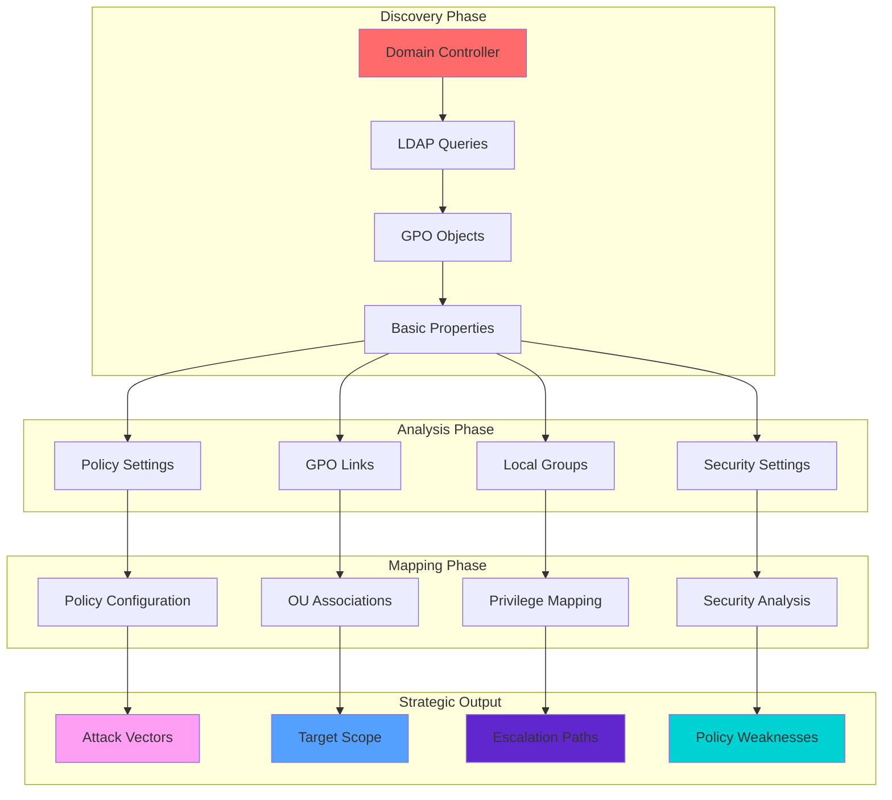
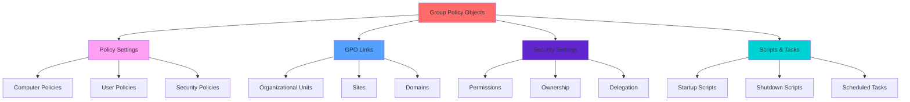

[🔄 Back to Master Index](./00_Enumeration_Index.md) | [💻 Previous: Computer Enumeration](./07_Computer_Enumeration.md) | [Next: ACL Enumeration](./09_ACL_Enumeration.md)

---

## 🔗 **RELATED ACTIVE DIRECTORY COMPONENTS**

### **📋 Policy Management Components**
- **[Group Policy Objects](../02_Active_Directory_Components/09_Group_Policy_Objects.md)**: Primary target for GPO enumeration and analysis
- **[Organizational Units](../02_Active_Directory_Components/05_Organizational_Unit.md)**: OUs where GPOs are linked and applied
- **[Domain](../02_Active_Directory_Components/03_Domain.md)**: Domain-level GPOs and inheritance

### **🏗️ Infrastructure Components**
- **[Domain Controllers](../02_Active_Directory_Components/02_Domain_Controllers.md)**: Servers hosting GPO information and SYSVOL
- **[Sites and Subnets](../02_Active_Directory_Components/06_Sites_and_Subnets.md)**: Site-linked GPOs and network topology
- **[Replication Service](../02_Active_Directory_Components/15_Replication_Service.md)**: GPO replication and synchronization

### **🔐 Security and Access Components**
- **[User Accounts](../02_Active_Directory_Components/17_User_Accounts.md)**: Users and groups affected by GPOs
- **[Schema](../02_Active_Directory_Components/11_Schema.md)**: GPO object structure and attributes
- **[FSMO Roles](../02_Active_Directory_Components/08_FSMO_Roles.md)**: Infrastructure master role for GPO operations

---

## 🚀 **GPO ENUMERATION OVERVIEW**

> **⚠️ CRITICAL TOOL REQUIREMENT**: **Invisi-Shell** is mandatory for production environments to ensure stealth operations and avoid detection. See [Tool Arsenal](./01_Tool_Setup_Loading.md#-invisi-shell-complete-setup) for setup instructions.

## 📋 **QUICK START GPO DISCOVERY**

| Phase | Tool | Command | Purpose | OPSEC Level |
|-------|------|---------|---------|-------------|
| **1** | MS GroupPolicy Module | `Get-GPO -All` | Basic GPO discovery | 🟢 Stealth |
| **2** | PowerView | `Get-DomainGPO -Properties DisplayName,ID,Owner` | Advanced properties | 🟡 Balanced |
| **3** | PowerView | `Get-DomainGPOLocalGroup` | Local group mappings | 🟡 Balanced |
| **4** | PowerView | `Get-DomainGPO -ComputerIdentity 'DC01'` | Computer policy analysis | 🟠 Noisy |

## 🎭 **AT-A-GLANCE: GPO ENUMERATION ESSENTIALS**

**What This Technique Reveals:**
- Group Policy Objects and their configurations
- Policy settings and security configurations
- GPO links and organizational unit associations
- Local group modifications and privilege assignments
- Stored credentials in Group Policy Preferences

**Primary Use Cases:**
- Policy configuration analysis and mapping
- GPP credential extraction and abuse
- Local group privilege escalation
- GPO-based persistence mechanisms
- Security policy weakness identification

**Execution Speed:**
- **Stealth Mode**: 2-5 seconds between queries
- **Balanced Mode**: 1-2 seconds between queries
- **Lab Mode**: 200-500ms between queries

## 🧭 **PIVOT MATRIX: STRATEGIC NEXT STEPS**

| Finding | Immediate Pivot | Strategic Goal | Tool/Technique |
|---------|-----------------|----------------|----------------|
| **GPP Credentials** | [ACL Enumeration](./09_ACL_Enumeration.md) | Credential extraction and reuse | `Get-GPPPassword` |
| **Software Installation** | [Computer Enumeration](./07_Computer_Enumeration.md) | Service targeting and exploitation | `Get-DomainGPO -ComputerIdentity` |
| **Security Policies** | [Kerberos Basic Enumeration](./23_Kerberos_Basic_Enumeration.md) | Policy weakness exploitation | `Get-DomainGPO -Properties *` |
| **Startup Scripts** | [Computer Enumeration](./07_Computer_Enumeration.md) | Persistence vector analysis | `Get-DomainGPO -Properties gPCFileSysPath` |
| **Registry Settings** | [Registry Enumeration](./18_Registry_Enumeration.md) | Configuration abuse planning | `Get-DomainGPO -Properties *` |
| **Local Group Modifications** | [ACL Enumeration](./09_ACL_Enumeration.md) | Privilege escalation paths | `Get-DomainGPOLocalGroup` |

---

## 🛠️ **COMPREHENSIVE ENUMERATION TOOLS**

### **🔧 Microsoft-Signed Tools**
- **Microsoft GroupPolicy Module**: GPO enumeration via AD objects and services
- **Get-GPO**: GPO object enumeration and analysis
- **Get-GPOReport**: GPO report generation and analysis
- **Get-GPResultantSetOfPolicy**: Resultant GPO analysis
- **Get-GPStarterGPO**: Starter GPO enumeration
- **Get-ADObject**: General AD object enumeration for GPO correlation

### **⚔️ Offensive Tools (PowerView, etc.)**
- **PowerView Suite**: Comprehensive GPO enumeration and discovery
- **Get-DomainGPO**: PowerView GPO enumeration and analysis
- **Get-DomainGPOLocalGroup**: PowerView GPO local group analysis
- **Get-DomainGPOUserLocalGroupMapping**: PowerView GPO user group mapping
- **Invoke-GPOEnumeration**: PowerView GPO enumeration capabilities

### **🔴 Red Team Enumeration Tools**

#### **🔍 PowerView - The AD Enumeration Swiss Army Knife**
**Purpose**: PowerShell framework for comprehensive AD enumeration and attack execution
**Setup**: Download PowerView.ps1 from GitHub
**Primary Commands**:
```powershell
# Basic GPO enumeration
Get-DomainGPO -Properties name,displayname,whenchanged  # Basic GPO info
Get-DomainGPO -Properties name,displayname,whenchanged | Where-Object {$_.displayname -like "*Security*"}  # Security GPOs
Get-DomainGPO -Properties name,displayname,whenchanged | Where-Object {$_.displayname -like "*Default*"}  # Default GPOs

# Advanced GPO enumeration
Get-DomainGPO -Properties * | Select-Object name,displayname,whenchanged,whencreated  # All GPO properties
Get-DomainGPO -Properties * | Where-Object {$_.displayname -like "*Admin*"}  # Admin GPOs
Get-DomainGPO -Properties * | Where-Object {$_.displayname -like "*User*"}  # User GPOs

# GPO local group enumeration
Get-DomainGPOLocalGroup -Identity "Default Domain Policy"  # Default domain policy local groups
Get-DomainGPOLocalGroup -Identity "Default Domain Policy" -ResolveMembersToSIDs  # Resolve members to SIDs
Get-DomainGPOLocalGroup -Identity "Default Domain Policy" -ResolveMembersToSIDs | Where-Object {$_.GroupName -like "*Admin*"}  # Admin groups

# GPO user local group mapping
Get-DomainGPOUserLocalGroupMapping -Identity "Default Domain Policy"  # User local group mapping
Get-DomainGPOUserLocalGroupMapping -Identity "Default Domain Policy" -ResolveMembersToSIDs  # Resolve members to SIDs

# GPO data export
Get-DomainGPO -Properties * | Export-Csv -Path "all_gpos.csv"  # Export all GPOs
Get-DomainGPOLocalGroup -Identity "Default Domain Policy" | Export-Csv -Path "default_policy_local_groups.csv"  # Export local groups
```

#### **🔍 SharpView - Compiled PowerView (C#)**
**Purpose**: C# version of PowerView without PowerShell execution
**Setup**: Download SharpView.exe from GitHub
**Primary Commands**:
```cmd
# Basic GPO enumeration
SharpView.exe Get-DomainGPO -Properties name,displayname,whenchanged  # Basic GPO info
SharpView.exe Get-DomainGPO -Properties name,displayname,whenchanged | Where-Object {$_.displayname -like "*Security*"}  # Security GPOs
SharpView.exe Get-DomainGPO -Properties name,displayname,whenchanged | Where-Object {$_.displayname -like "*Default*"}  # Default GPOs

# Advanced GPO enumeration
SharpView.exe Get-DomainGPO -Properties * | Select-Object name,displayname,whenchanged,whencreated  # All GPO properties
SharpView.exe Get-DomainGPO -Properties * | Where-Object {$_.displayname -like "*Admin*"}  # Admin GPOs

# GPO local group enumeration
SharpView.exe Get-DomainGPOLocalGroup -Identity "Default Domain Policy"  # Default domain policy local groups
SharpView.exe Get-DomainGPOLocalGroup -Identity "Default Domain Policy" -ResolveMembersToSIDs  # Resolve members to SIDs
```

#### **�� GPOZaurr - The GPO Analysis Tool**
**Purpose**: Advanced GPO analysis and abuse
**Setup**: Download from https://github.com/EvotecIT/GPOZaurr
**Primary Commands**:
```powershell
# Basic GPO analysis
Get-GPOZaurr -Type AllGPOs                                    # All GPOs
Get-GPOZaurr -Type AllGPOs -FilePath "C:\Results"             # Custom output path
Get-GPOZaurr -Type AllGPOs -FilePath "C:\Results" -Format HTML  # HTML output

# Specific GPO analysis
Get-GPOZaurr -Type GPOAdmin                                    # Admin GPOs
Get-GPOZaurr -Type GPOAdmin -FilePath "C:\Results"             # Admin GPOs output
Get-GPOZaurr -Type GPOAdmin -FilePath "C:\Results" -Format HTML  # Admin GPOs HTML

# GPO security analysis
Get-GPOZaurr -Type GPOSecurity                                # GPO security
Get-GPOZaurr -Type GPOSecurity -FilePath "C:\Results"          # GPO security output
Get-GPOZaurr -Type GPOSecurity -FilePath "C:\Results" -Format HTML  # GPO security HTML

# Comprehensive analysis
Get-GPOZaurr -Type AllGPOs,GPOSecurity,GPOAdmin -FilePath "C:\Results" -Format HTML  # All types HTML output
```

#### **🔍 Get-GPPPassword - The GPP Credential Extractor**
**Purpose**: Extract credentials from Group Policy Preferences
**Setup**: Part of PowerView or standalone script
**Primary Commands**:
```powershell
# Basic GPP password extraction
Get-GPPPassword                                               # Extract all GPP passwords
Get-GPPPassword -Verbose                                      # Verbose output
Get-GPPPassword -OutputFormat CSV                             # CSV output

# GPP password analysis
Get-GPPPassword | Where-Object {$_.NewName -like "*admin*"}   # Admin accounts
Get-GPPPassword | Where-Object {$_.NewName -like "*service*"} # Service accounts
Get-GPPPassword | Where-Object {$_.NewName -like "*user*"}    # User accounts

# GPP password export
Get-GPPPassword | Export-Csv -Path "gpp_passwords.csv"        # Export to CSV
Get-GPPPassword | ConvertTo-Json | Out-File "gpp_passwords.json"  # Export to JSON
```

### **🛠️ Alternative Enumeration Tools**

#### **🔍 Native Windows GPO Tools**
**Purpose**: Built-in Windows GPO enumeration capabilities
**Setup**: Built into Windows
**Primary Commands**:
```cmd
# gpresult commands
gpresult /r                                                    # Resultant set of policy
gpresult /r /scope computer                                   # Computer policy only
gpresult /r /scope user                                       # User policy only
gpresult /r /user username                                    # Specific user policy

# gpotool commands
gpotool /check                                                 # Check GPO consistency
gpotool /verbose                                               # Verbose GPO check
gpotool /domain:corp.local                                    # Specific domain

# PowerShell GroupPolicy commands
Get-GPO                                                        # Get all GPOs
Get-GPO -Name "Default Domain Policy"                         # Specific GPO
Get-GPO -Name "Default Domain Policy" -Properties *            # All GPO properties
```

#### **🔍 Online GPO Enumeration Tools**
**Purpose**: Web-based GPO enumeration and reconnaissance
**Setup**: Web browser access
**Primary Tools**:
- **Microsoft Docs**: Official GPO documentation and tools
- **Security Research**: GPO enumeration security analysis
- **OSINT frameworks**: Comprehensive open-source intelligence
- **Community Resources**: GPO enumeration guides and examples

**Usage Examples**:
```bash
# Microsoft Docs
# Visit https://docs.microsoft.com/en-us/windows-server/identity/ad-ds/
# Search for specific GPO enumeration topics and examples

# Security Research
# Search for GPO enumeration techniques and security analysis
# Use tools like Google, Bing, or specialized search engines

# Community Resources
# Visit security forums and communities for GPO enumeration examples
# Access shared tools and scripts for GPO enumeration analysis
```

### **🔍 Specialized Tools**

#### **🌐 GPO Discovery Tools**
- **PowerView**: Comprehensive GPO enumeration toolkit
- **SharpView**: Compiled GPO enumeration capabilities
- **GPOZaurr**: Advanced GPO analysis and abuse
- **Custom Scripts**: Advanced GPO enumeration automation

#### **🔗 GPO Policy Analysis Tools**
- **Policy Configuration**: GPO policy setting analysis
- **Security Settings**: GPO security configuration analysis
- **PowerView**: GPO policy analysis via AD integration
- **Custom Scripts**: Advanced policy analysis automation

#### **📋 GPO Data Export Tools**
- **PowerView**: CSV export capabilities
- **SharpView**: Compiled export capabilities
- **GPOZaurr**: Multiple format export capabilities
- **Custom Scripts**: Advanced export format automation

#### **🎯 GPO Attack Vector Tools**
- **GPO enumeration tools**: GPO-based attacks
- **Custom Scripts**: Advanced GPO exploitation
- **Attack planning tools**: GPO-based attack path planning
- **Exploitation tools**: GPO-based privilege escalation tools

---

## 🎭 **PERSONAS: REAL-WORLD EXECUTION PROFILES**

### **🕵️ Stealth Consultant (Production Environment)**
- **Tool Preference**: Microsoft GroupPolicy Module + Invisi-Shell
- **Query Pattern**: Targeted, minimal properties, OU-scoped
- **Timing**: 3-5 second delays with jitter
- **Risk Tolerance**: Minimal detection footprint

### **⚡ Power User (Internal Assessment)**
- **Tool Preference**: PowerView + Microsoft GroupPolicy Module
- **Query Pattern**: Comprehensive properties, strategic targeting
- **Timing**: 1-2 second delays
- **Risk Tolerance**: Moderate detection acceptable

### **👑 Domain Admin (Lab Environment)**
- **Tool Preference**: Full PowerView suite + GPOZaurr
- **Query Pattern**: Broad sweeps, all properties, comprehensive analysis
- **Timing**: 200-500ms delays
- **Risk Tolerance**: Detection not a concern

## 🎨 **VISUAL MASTERY: GPO ENUMERATION ARCHITECTURE**

### **GPO Enumeration Data Flow Architecture**


**Architecture Explanation:**
This diagram shows the complete flow from initial discovery to strategic output. The **Discovery Phase** establishes basic GPO information, the **Analysis Phase** categorizes and structures the data, the **Mapping Phase** creates detailed relationships, and the **Strategic Output** provides actionable intelligence for attack planning and policy analysis.

### **GPO Infrastructure and Policy Flow**


**Infrastructure Explanation:**
This diagram illustrates typical Active Directory GPO infrastructure and policy flow. **Group Policy Objects** contain various policy types, are linked to organizational units, and include security settings and automation scripts. Understanding these relationships is crucial for identifying attack vectors and planning policy-based attacks.

## 🏭 **LAB vs PRODUCTION: EXECUTION PROFILES**

### **🔬 LAB ENVIRONMENT EXECUTION**
```powershell
# Full enumeration with maximum detail
Get-DomainGPO -Properties * | Export-Csv -Path "all_gpos_detailed.csv" -NoTypeInformation

# Comprehensive GPO analysis
$allGPOs = Get-DomainGPO -Properties *
$localGroups = Get-DomainGPOLocalGroup
$computerGPOs = Find-DomainGPOComputerLocalGroupMapping
$userGPOs = Find-DomainGPOUserLocalGroupMapping

Write-Host "Total GPOs: $($allGPOs.Count)" -ForegroundColor Green
Write-Host "Local Group Mappings: $($localGroups.Count)" -ForegroundColor Yellow
Write-Host "Computer GPOs: $($computerGPOs.Count)" -ForegroundColor Cyan
Write-Host "User GPOs: $($userGPOs.Count)" -ForegroundColor Magenta

# Full GPP credential extraction
Get-GPPPassword -Verbose | Export-Csv -Path "gpp_credentials.csv" -NoTypeInformation

# Complete policy analysis
foreach($gpo in $allGPOs) {
    Write-Host "Analyzing GPO: $($gpo.DisplayName)" -ForegroundColor Green
    $report = Get-GPOReport -Name $gpo.DisplayName -ReportType XML
    $report | Out-File -FilePath "gpo_report_$($gpo.Name).xml"
}
```

**Lab Environment Characteristics:**
- **Detection**: Not a concern
- **Speed**: Maximum execution speed
- **Detail**: Full property enumeration
- **Scope**: Complete domain coverage
- **Tools**: Full PowerView suite + GPOZaurr

### **🏢 PRODUCTION ENVIRONMENT EXECUTION**
```powershell
# Stealth enumeration with minimal properties
Get-GPO -All | Select-Object DisplayName, ID, Owner, ModificationTime | 
    Export-Csv -Path "gpos_basic.csv" -NoTypeInformation

# Targeted GPO analysis
Start-Sleep -Seconds (Get-Random -Minimum 3 -Maximum 6)
try {
    $securityGPOs = Get-GPO -All | Where-Object {$_.DisplayName -like "*Security*" -or $_.DisplayName -like "*Admin*"}
    Write-Host "Security/Admin GPOs: $($securityGPOs.Count)" -ForegroundColor Yellow
}
catch { Write-Warning "Cannot enumerate security GPOs" }

Start-Sleep -Seconds (Get-Random -Minimum 2 -Maximum 5)
try {
    $recentGPOs = Get-GPO -All | Where-Object {$_.ModificationTime -gt (Get-Date).AddDays(-30)}
    Write-Host "Recently Modified GPOs: $($recentGPOs.Count)" -ForegroundColor Red
}
catch { Write-Warning "Cannot enumerate recent GPOs" }

# Minimal policy analysis
Start-Sleep -Seconds (Get-Random -Minimum 3 -Maximum 6)
$gpoCount = (Get-GPO -All).Count
Write-Host "Total GPOs in domain: $gpoCount" -ForegroundColor Green
```

**Production Environment Characteristics:**
- **Detection**: Critical concern
- **Speed**: Controlled with jitter
- **Detail**: Minimal necessary properties
- **Scope**: Strategic targeting only
- **Tools**: Microsoft GroupPolicy Module + Invisi-Shell

## 🛡️ **DETECTION, OPSEC & CLEANUP**

### **🚨 DETECTION INDICATORS**

**Event Log Monitoring:**
- **Event ID 5136**: Directory service changes (GPO modifications)
- **Event ID 5137**: Directory service changes (GPO creation)
- **Event ID 5138**: Directory service changes (GPO deletion)
- **Event ID 5139**: Directory service changes (GPO links)

**Network Monitoring:**
- **LDAP Queries**: Port 389/636 queries to domain controllers
- **ADWS Traffic**: Port 9389 SOAP requests
- **Query Patterns**: Bulk GPO enumeration spikes
- **SYSVOL Access**: File access to Group Policy templates

**Behavioral Indicators:**
- **Bulk Enumeration**: Large numbers of GPO queries in short time
- **Property Enumeration**: Requests for all GPO properties
- **Policy Analysis**: Detailed policy setting queries
- **Local Group Analysis**: GPO local group mapping queries

### **🔒 OPSEC BEST PRACTICES**

**Stealth Techniques:**
```powershell
# Use Invisi-Shell for maximum stealth
# See: [Tool Arsenal](./01_Tool_Setup_Loading.md#-invisi-shell-complete-setup)

# Minimize query size and scope
Get-GPO -All | Select-Object DisplayName, ID, Owner | Select-Object -First 10

# Use Microsoft GroupPolicy Module when possible
Import-Module GroupPolicy

# Add jitter between queries
Start-Sleep -Seconds (Get-Random -Minimum 2 -Maximum 5)

# Scope queries by OU when possible
Get-GPO -SearchBase "OU=IT,DC=corp,DC=local"
```

**Detection Avoidance:**
- **Avoid bulk operations** in single queries
- **Use native Windows commands** when possible
- **Prefer ADWS over direct LDAP** for Microsoft tools
- **Implement query delays** with randomization
- **Scope queries** to specific OUs or GPO types

### **🧹 CLEANUP PROCEDURES**

**File Cleanup:**
```powershell
# Remove enumeration artifacts
Remove-Item "gpo_*.csv" -ErrorAction SilentlyContinue
Remove-Item "gpos_*.csv" -ErrorAction SilentlyContinue
Remove-Item "gpo_report_*.xml" -ErrorAction SilentlyContinue
Remove-Item "gpp_*.csv" -ErrorAction SilentlyContinue

# Clear PowerShell history
Clear-History
Remove-Item (Get-PSReadLineOption).HistorySavePath -ErrorAction SilentlyContinue

# Clear event logs (if elevated)
wevtutil cl Security
wevtutil cl System
```

**Session Cleanup:**
```powershell
# Remove loaded modules
Remove-Module GroupPolicy -ErrorAction SilentlyContinue
Remove-Module Microsoft.GroupPolicy -ErrorAction SilentlyContinue

# Clear variables
Remove-Variable gpos, localGroups, computerGPOs, userGPOs -ErrorAction SilentlyContinue

# Reset PowerShell execution policy (if changed)
Set-ExecutionPolicy -ExecutionPolicy Restricted -Force
```

## 🔗 **CROSS-REFERENCES & INTEGRATION**

### **📚 RELATED TECHNIQUES**
- **[ACL Enumeration](./09_ACL_Enumeration.md)**: GPO permissions and delegation analysis
- **[Computer Enumeration](./07_Computer_Enumeration.md)**: Computer policy targeting
- **[Registry Enumeration](./18_Registry_Enumeration.md)**: GPO registry setting analysis
- **[Kerberos Basic Enumeration](./23_Kerberos_Basic_Enumeration.md)**: Security policy analysis
- **[User Enumeration](./05_User_Enumeration.md)**: User policy targeting

### **🛠️ TOOL DEPENDENCIES**
- **[Tool Setup & Loading](./01_Tool_Setup_Loading.md)**: Invisi-Shell and PowerView setup
- **[Network Enumeration](./02_Network_Enumeration.md)**: Domain controller discovery
- **[DNS Enumeration](./03_DNS_Enumeration.md)**: Domain name resolution
- **[Domain Enumeration](./04_Domain_Enumeration.md)**: Domain context establishment

### **🎯 ATTACK PATH INTEGRATION**
- **Privilege Escalation**: GPO modification → Administrative access
- **Lateral Movement**: Policy-based access → Resource access
- **Persistence**: GPO settings → Long-term access maintenance
- **Defense Evasion**: Policy manipulation → Access hiding

---

## 🎯 **COMPREHENSIVE GPO ENUMERATION COMMANDS**

### **🚀 PHASE 1: BASIC GPO DISCOVERY (20+ Commands)**

#### **Microsoft GroupPolicy Module (Stealth Operations)**
```powershell
# 1. Basic GPO enumeration (MS-signed, CLM-friendly)
Get-GPO -All | Select-Object DisplayName, ID, Owner, ModificationTime

# 2. GPO count and distribution
(Get-GPO -All).Count
Get-GPO -All | Group-Object Owner

# 3. GPO modification analysis
Get-GPO -All | Sort-Object ModificationTime -Descending | Select-Object -First 10

# 4. GPO ownership analysis
Get-GPO -All | Where-Object {$_.Owner -like "*Admin*"} | Select-Object DisplayName, Owner

# 5. GPO description analysis
Get-GPO -All | Where-Object {$_.Description} | Select-Object DisplayName, Description
```

#### **PowerView Suite (Comprehensive Enumeration)**
```powershell
# 6. Comprehensive GPO enumeration
Get-DomainGPO -Properties DisplayName, ID, Owner, whenChanged, gPCFileSysPath

# 7. Advanced GPO filtering
Get-DomainGPO -LDAPFilter "objectClass=groupPolicyContainer" | Select-Object DisplayName, ID

# 8. GPO description analysis
Get-DomainGPO -Properties description | Where-Object {$_.description} | Select-Object DisplayName, Description

# 9. GPO file system path analysis
Get-DomainGPO -Properties gPCFileSysPath | Where-Object {$_.gPCFileSysPath -like "*SYSVOL*"}

# 10. Custom GPO discovery
Get-DomainGPO -Properties DisplayName, description | Where-Object {$_.DisplayName -like "*Security*" -or $_.description -like "*Security*"}
```

#### **Native Windows Tools (Maximum Stealth)**
```powershell
# 11. Native GPO enumeration
gpresult /r
gpresult /r /user:cybercorp\user1

# 12. GPO result analysis
gpresult /h gpo_report.html
gpresult /x gpo_report.xml

# 13. GPO update forcing
gpupdate /force
gpupdate /target:computer /force

# 14. GPO policy analysis
gpresult /r /scope:computer
gpresult /r /scope:user

# 15. GPO computer targeting
gpresult /r /computer:COMPUTER01
```

### **🚀 PHASE 2: ADVANCED GPO ANALYSIS (20+ Commands)**

#### **Local Group Mapping Analysis**
```powershell
# 16. GPO local group mappings (PowerView)
Get-DomainGPOLocalGroup

# 17. Computer local group mappings
Find-DomainGPOComputerLocalGroupMapping

# 18. User local group mappings
Find-DomainGPOUserLocalGroupMapping

# 19. Local group properties analysis
Get-DomainGPOLocalGroup -Properties GroupName, Members, GPOName

# 20. Cross-GPO local group analysis
$localGroups = Get-DomainGPOLocalGroup
foreach($group in $localGroups) {
    if($group.Members.Count -gt 0) {
        Write-Host "$($group.GPOName): $($group.GroupName) - $($group.Members.Count) members" -ForegroundColor Yellow
    }
}
```

#### **Policy Setting Analysis**
```powershell
# 21. GPO policy settings (PowerView)
Get-DomainGPO -Properties * | Where-Object {$_.gPCFileSysPath}

# 22. GPO registry settings
Get-DomainGPO -Properties gPCFileSysPath | Where-Object {$_.gPCFileSysPath -like "*SYSVOL*"}

# 23. GPO security settings
Get-DomainGPO -Properties DisplayName | Where-Object {$_.DisplayName -like "*Security*"}

# 24. GPO software installation
Get-DomainGPO -Properties DisplayName | Where-Object {$_.DisplayName -like "*Software*"}

# 25. GPO startup scripts
Get-DomainGPO -Properties gPCFileSysPath | Where-Object {$_.gPCFileSysPath -like "*Scripts*"}
```

#### **Advanced GPO Properties**
```powershell
# 26. GPO creation time analysis
Get-DomainGPO -Properties whencreated, whenchanged | Sort-Object whencreated

# 27. GPO modification tracking
Get-DomainGPO -Properties whenchanged, uSNChanged | Sort-Object whenchanged -Descending

# 28. GPO system flags
Get-DomainGPO -Properties systemFlags, isCriticalSystemObject

# 29. GPO replication metadata
Get-DomainGPO -Properties uSNCreated, uSNChanged

# 30. GPO security descriptors
Get-DomainGPO -Properties nTSecurityDescriptor
```

### **🚀 PHASE 3: STRATEGIC GPO MAPPING (20+ Commands)**

#### **Cross-Domain Analysis**
```powershell
# 31. Child domain GPOs
$childDomains = Get-ADForest | Select-Object -ExpandProperty Domains
foreach($domain in $childDomains) {
    Get-GPO -All -Server $domain | Select-Object DisplayName, ID, Owner
}

# 32. Cross-forest GPO analysis
Get-ADTrust -Filter * | ForEach-Object {
    if($_.TrustType -eq "External") {
        Write-Host "External trust to: $($_.TargetName)" -ForegroundColor Yellow
    }
}

# 33. Trust relationship GPOs
Get-DomainGPO -Properties member | Where-Object {$_.member -match "CN=ForeignSecurityPrincipals"}

# 34. Cross-domain GPO groups
Get-DomainGPO -Properties member | Where-Object {$_.member -match "CN=.*,DC=.*,DC=.*"}

# 35. Forest-wide GPO analysis
Get-DomainGPO -Properties member | Where-Object {$_.member -match "CN=.*,DC=.*,DC=.*,DC=.*"}
```

#### **GPO Infrastructure Mapping**
```powershell
# 36. GPO role classification
function Get-GPORole {
    param([string]$GPOName)
    $gpo = Get-DomainGPO -Identity $GPOName -Properties DisplayName, gPCFileSysPath, Owner
    
    if($gpo.DisplayName -like "*Security*") {
        return "Security Policy"
    } elseif($gpo.DisplayName -like "*Software*") {
        return "Software Policy"
    } elseif($gpo.DisplayName -like "*Admin*") {
        return "Administrative Policy"
    } else {
        return "General Policy"
    }
}

# 37. GPO dependency analysis
$gpos = Get-DomainGPO -Properties member
$gpoDependencies = @{}
foreach($gpo in $gpos) {
    $gpoDependencies[$gpo.DisplayName] = @()
    if($gpo.member) {
        foreach($member in $gpo.member) {
            if($member -match "^CN=([^,]+)") {
                $memberName = $matches[1]
                $gpoDependencies[$gpo.DisplayName] += $memberName
            }
        }
    }
}

# 38. GPO organizational mapping
$gpoOUs = @{}
$gpos = Get-DomainGPO -Properties name, distinguishedName
foreach($gpo in $gpos) {
    if($gpo.distinguishedName -match "OU=([^,]+)") {
        $ou = $matches[1]
        if(-not $gpoOUs.ContainsKey($ou)) {
            $gpoOUs[$ou] = @()
        }
        $gpoOUs[$ou] += $gpo.Name
    }
}

# 39. GPO privilege escalation paths
$adminGPOs = Get-DomainGPO -Properties DisplayName | Where-Object {$_.DisplayName -like "*Admin*" -or $_.DisplayName -like "*Security*"}
foreach($gpo in $adminGPOs) {
    Write-Host "Analyzing $($gpo.DisplayName) for escalation paths:" -ForegroundColor Red
    $localGroups = Get-DomainGPOLocalGroup | Where-Object {$_.GPOName -eq $gpo.DisplayName}
    foreach($group in $localGroups) {
        if($group.GroupName -like "*Admin*" -or $group.GroupName -like "*Power*") {
            Write-Host "  High-privilege group: $($group.GroupName)" -ForegroundColor Yellow
        }
    }
}

# 40. GPO access control mapping
$gpoACLs = @{}
$highValueGPOs = Get-DomainGPO -Properties DisplayName | Where-Object {$_.DisplayName -like "*Admin*" -or $_.DisplayName -like "*Security*"}
foreach($gpo in $highValueGPOs) {
    try {
        $acls = Get-DomainObjectAcl -SamAccountName $gpo.SamAccountName -ResolveGUIDs
        $gpoACLs[$gpo.DisplayName] = $acls
        Write-Host "$($gpo.DisplayName): $($acls.Count) ACLs" -ForegroundColor Yellow
    }
    catch {
        Write-Warning "Cannot access ACLs for $($gpo.DisplayName)"
    }
}
```

---

## 🎯 **COMMAND EXPLANATIONS & USE CASES**

### **🔍 DISCOVERY COMMANDS EXPLAINED**

**Get-GPO -All:**
- **Purpose**: Retrieves all Group Policy Objects in the domain
- **Parameters**: `-All` (all GPOs in domain)
- **Returns**: Array of GPO objects with basic properties
- **Use Case**: Initial domain GPO structure analysis
- **OPSEC**: Uses ADWS, minimal properties, stealth-friendly
- **Execution Context**: Local or remote with GroupPolicy module loaded

**Get-DomainGPO -Properties DisplayName,ID,Owner:**
- **Purpose**: Comprehensive GPO enumeration with specific properties
- **Parameters**: `-Properties` (comma-separated attribute list)
- **Returns**: Rich GPO objects with specified properties
- **Use Case**: Detailed GPO analysis and ownership mapping
- **OPSEC**: Direct LDAP queries, more visible but comprehensive
- **Execution Context**: Requires PowerView loaded

### **🔐 LOCAL GROUP ANALYSIS COMMANDS EXPLAINED**

**Get-DomainGPOLocalGroup:**
- **Purpose**: Discovers GPO local group configurations
- **Parameters**: None (retrieves all GPO local group mappings)
- **Returns**: GPO local group mapping objects
- **Use Case**: Local group privilege escalation analysis
- **OPSEC**: Reveals local group configurations, high-value targets
- **Execution Context**: Requires PowerView, generates local group queries

**Find-DomainGPOComputerLocalGroupMapping:**
- **Purpose**: Maps GPO computer local group memberships
- **Parameters**: None (finds all computer local group mappings)
- **Returns**: Computer local group mapping objects
- **Use Case**: Computer-based privilege escalation planning
- **OPSEC**: Reveals computer local group configurations
- **Execution Context**: Requires PowerView, generates computer mapping queries

### **🔧 POLICY ANALYSIS COMMANDS EXPLAINED**

**Get-DomainGPO -Properties gPCFileSysPath:**
- **Purpose**: Discovers GPO file system paths and templates
- **Parameters**: `-Properties` (specific properties including file paths)
- **Returns**: GPO objects with file system path information
- **Use Case**: SYSVOL access planning and template analysis
- **OPSEC**: Reveals file system structure, template locations
- **Execution Context**: Requires PowerView, generates path queries

**Get-DomainGPO -LDAPFilter "objectClass=groupPolicyContainer":**
- **Purpose**: Uses LDAP filters for advanced GPO searching
- **Parameters**: `-LDAPFilter` (LDAP filter syntax)
- **Returns**: GPOs matching the LDAP filter criteria
- **Use Case**: Advanced GPO filtering and targeting
- **OPSEC**: More precise queries, potentially less noise
- **Execution Context**: Requires PowerView, generates filtered queries

---

## 🎯 **REAL-WORLD EXECUTION SCENARIOS**

### **🏢 SCENARIO 1: STEALTH PRODUCTION ASSESSMENT**

**Objective**: Understand GPO structure without detection
**Tools**: Microsoft GroupPolicy Module + Invisi-Shell
**Timing**: 3-5 second delays with jitter

```powershell
# Phase 1: Basic enumeration
Start-Sleep -Seconds (Get-Random -Minimum 3 -Maximum 6)
$gpoCount = (Get-GPO -All).Count
Write-Host "Total GPOs: $gpoCount" -ForegroundColor Green

# Phase 2: Strategic targeting
Start-Sleep -Seconds (Get-Random -Minimum 2 -Maximum 5)
try {
    $securityGPOs = Get-GPO -All | Where-Object {$_.DisplayName -like "*Security*" -or $_.DisplayName -like "*Admin*"}
    Write-Host "Security/Admin GPOs: $($securityGPOs.Count)" -ForegroundColor Yellow
}
catch { Write-Warning "Access denied to security GPOs" }

# Phase 3: Minimal policy analysis
Start-Sleep -Seconds (Get-Random -Minimum 3 -Maximum 6)
try {
    $recentGPOs = Get-GPO -All | Where-Object {$_.ModificationTime -gt (Get-Date).AddDays(-30)}
    Write-Host "Recently Modified GPOs: $($recentGPOs.Count)" -ForegroundColor Red
}
catch { Write-Warning "Cannot analyze recent GPOs" }
```

### **🔬 SCENARIO 2: COMPREHENSIVE LAB ANALYSIS**

**Objective**: Complete GPO infrastructure mapping
**Tools**: Full PowerView suite + GPOZaurr
**Timing**: 200-500ms delays

```powershell
# Phase 1: Complete enumeration
$allGPOs = Get-DomainGPO -Properties *
$allGPOs | Export-Csv -Path "all_gpos_detailed.csv" -NoTypeInformation

# Phase 2: Comprehensive analysis
$localGroups = Get-DomainGPOLocalGroup
$computerGPOs = Find-DomainGPOComputerLocalGroupMapping
$userGPOs = Find-DomainGPOUserLocalGroupMapping

Write-Host "Total GPOs: $($allGPOs.Count)" -ForegroundColor Green
Write-Host "Local Group Mappings: $($localGroups.Count)" -ForegroundColor Yellow
Write-Host "Computer GPOs: $($computerGPOs.Count)" -ForegroundColor Cyan
Write-Host "User GPOs: $($userGPOs.Count)" -ForegroundColor Magenta

# Phase 3: Complete policy analysis
foreach($gpo in $allGPOs) {
    Write-Host "Analyzing GPO: $($gpo.DisplayName)" -ForegroundColor Green
    $report = Get-GPOReport -Name $gpo.DisplayName -ReportType XML
    $report | Out-File -FilePath "gpo_report_$($gpo.Name).xml"
}
```

### **⚡ SCENARIO 3: BALANCED INTERNAL ASSESSMENT**

**Objective**: Strategic GPO analysis with moderate stealth
**Tools**: PowerView + Microsoft GroupPolicy Module
**Timing**: 1-2 second delays

```powershell
# Phase 1: Strategic enumeration
$securityGPOs = Get-DomainGPO -Properties DisplayName | Where-Object {$_.DisplayName -like "*Security*" -or $_.DisplayName -like "*Admin*"}
$adminGPOs = Get-DomainGPO -Properties DisplayName | Where-Object {$_.DisplayName -like "*Admin*" -or $_.DisplayName -like "*Power*"}

# Phase 2: Targeted analysis
foreach($gpo in $securityGPOs) {
    Start-Sleep -Seconds (Get-Random -Minimum 1 -Maximum 3)
    Write-Host "Security GPO: $($gpo.DisplayName)" -ForegroundColor Yellow
}

# Phase 3: Strategic policy analysis
$highValueGPOs = Get-DomainGPO -Properties DisplayName | Where-Object {$_.DisplayName -like "*Admin*" -or $_.DisplayName -like "*Security*" -or $_.DisplayName -like "*Power*"}
foreach($gpo in $highValueGPOs) {
    Start-Sleep -Seconds (Get-Random -Minimum 1 -Maximum 3)
    try {
        $localGroups = Get-DomainGPOLocalGroup | Where-Object {$_.GPOName -eq $gpo.DisplayName}
        Write-Host "$($gpo.DisplayName): $($localGroups.Count) local group mappings" -ForegroundColor Red
    }
    catch { Write-Warning "Cannot analyze $($gpo.DisplayName)" }
}
```

---

## 🔗 **INTEGRATION WITH ATTACK METHODOLOGY**

### **🎯 PHASE 1: RECONNAISSANCE INTEGRATION**
- **Network Enumeration**: Domain controller discovery for GPO queries
- **DNS Enumeration**: Domain name resolution for GPO enumeration
- **Domain Enumeration**: Domain context establishment for GPO queries

### **🎯 PHASE 2: WEAPONIZATION INTEGRATION**
- **Tool Setup**: Invisi-Shell and PowerView loading for stealth operations
- **Command Preparation**: GPO enumeration command preparation and testing

### **🎯 PHASE 3: DELIVERY INTEGRATION**
- **Execution Context**: Local or remote execution based on access level
- **Tool Selection**: Microsoft GroupPolicy Module vs PowerView based on environment

### **🎯 PHASE 4: EXPLOITATION INTEGRATION**
- **Privilege Escalation**: GPO modification for administrative access
- **Lateral Movement**: Policy-based access for resource access
- **Persistence**: GPO settings for long-term access maintenance

### **🎯 PHASE 5: INSTALLATION INTEGRATION**
- **Backdoor Installation**: GPO-based access for backdoor deployment
- **Service Installation**: GPO permissions for service installation

### **🎯 PHASE 6: COMMAND & CONTROL INTEGRATION**
- **Communication Channels**: GPO-based access for C2 communication
- **Data Exfiltration**: GPO permissions for data access and exfiltration

### **🎯 PHASE 7: ACTIONS ON OBJECTIVES INTEGRATION**
- **Data Destruction**: GPO-based access for data manipulation
- **Account Manipulation**: GPO modification for account control

---

## 📚 **ADDITIONAL RESOURCES & REFERENCES**

### **🔧 TOOL DOCUMENTATION**
- **PowerView**: [PowerView Functions Reference](https://github.com/PowerShellMafia/PowerSploit/blob/master/Recon/PowerView.ps1)
- **Microsoft GroupPolicy Module**: [Get-GPO Documentation](https://docs.microsoft.com/en-us/powershell/module/grouppolicy/get-gpo)
- **GPOZaurr**: [GPO Analysis Tool](https://github.com/EvotecIT/GPOZaurr)

### **📖 TECHNICAL REFERENCES**
- **Microsoft Docs**: [Group Policy Objects](https://docs.microsoft.com/en-us/windows-server/identity/ad-ds/manage/understand-group-policy)
- **ATT&CK Framework**: [Group Policy Modification (T1484)](https://attack.mitre.org/techniques/T1484/)
- **LDAP Filters**: [LDAP Filter Syntax](https://ldap.com/ldap-filters/)

### **🎯 PRACTICAL GUIDES**
- **Red Team Guides**: [Active Directory GPO Enumeration](https://www.ired.team/offensive-security-experiments/active-directory-kerberos-roasting)
- **Penetration Testing**: [AD GPO Enumeration](https://adsecurity.org/?p=3658)
- **Security Research**: [GPO Analysis and Abuse](https://www.harmj0y.net/blog/redteaming/group-policy-abuse/)

---

[Prev: 07_Computer_Enumeration.md](./07_Computer_Enumeration.md) | [Up: Index](./00_Enumeration_Index.md) | [Hub](./00_Methodology_Hub.md) | [Next: 09_ACL_Enumeration.md](./09_ACL_Enumeration.md)
