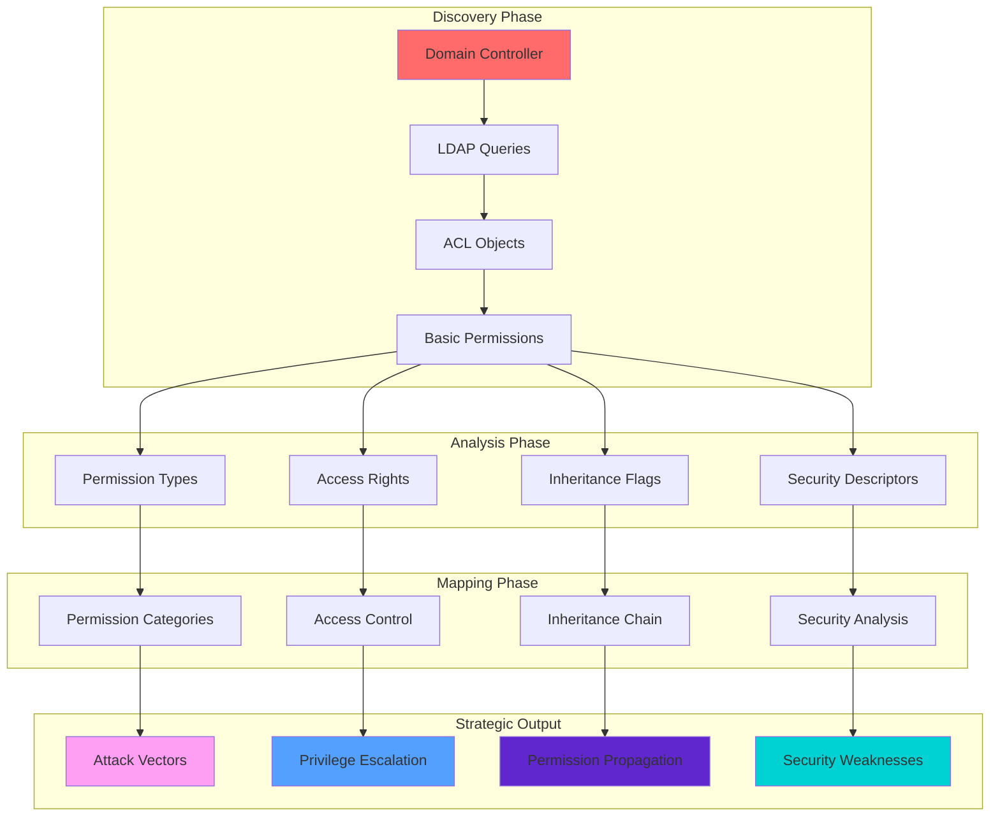
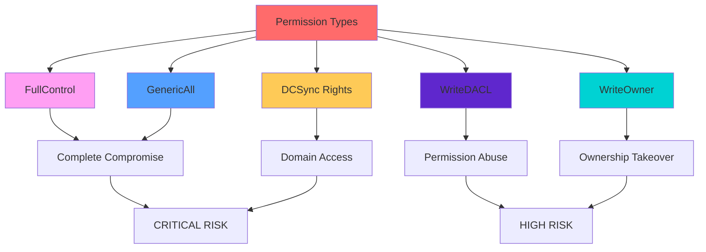

[Prev: 08_GPO_Enumeration.md](./08_GPO_Enumeration.md) | [Up: Index](./00_Enumeration_Index.md) | [Hub](./00_Methodology_Hub.md) | [Next: 10_BloodHound_Enumeration.md](./10_BloodHound_Enumeration.md)

# ACL Enumeration

> **⚠️ CRITICAL TOOL REQUIREMENT**: **Invisi-Shell** is mandatory for production environments to ensure stealth operations and avoid detection. See [Tool Arsenal](./01_Tool_Setup_Loading.md#-invisi-shell-complete-setup) for setup instructions.

## 📋 **QUICK START ACL DISCOVERY**

| Phase | Tool | Command | Purpose | OPSEC Level |
|-------|------|---------|---------|-------------|
| **1** | MS AD Module | `Get-ACL -Path "AD:\CN=Users,DC=corp,DC=local"` | Basic ACL discovery | 🟢 Stealth |
| **2** | PowerView | `Get-DomainObjectAcl -SamAccountName "Domain Admins"` | Advanced permissions | 🟡 Balanced |
| **3** | PowerView | `Find-InterestingDomainAcl -ResolveGUIDs` | Dangerous permissions | 🟡 Balanced |
| **4** | PowerView | `Get-ObjectAcl -DistinguishedName "CN=AdminSDHolder"` | High-value targets | 🟠 Noisy |

## 🎭 **AT-A-GLANCE: ACL ENUMERATION ESSENTIALS**

**What This Technique Reveals:**
- Access control lists and permission structures
- User and group permission assignments
- Delegation and administrative rights
- Security descriptor configurations
- Privilege escalation attack vectors

**Primary Use Cases:**
- Permission analysis and mapping
- Delegation abuse target identification
- Privilege escalation path discovery
- Security configuration review
- Attack vector identification

**Execution Speed:**
- **Stealth Mode**: 3-7 seconds between queries
- **Balanced Mode**: 2-4 seconds between queries
- **Lab Mode**: 500ms-1 second between queries

## 🧭 **PIVOT MATRIX: STRATEGIC NEXT STEPS**

| Finding | Immediate Pivot | Strategic Goal | Tool/Technique |
|---------|-----------------|----------------|----------------|
| **GenericAll Permissions** | [Group Enumeration](./06_Group_Enumeration.md) | Group manipulation and control | `Get-DomainObjectAcl -ResolveGUIDs` |
| **WriteDACL Rights** | [Kerberos Delegation Abuse](./25_Kerberos_Delegation_Abuse.md) | Delegation abuse and escalation | `Find-InterestingDomainAcl` |
| **DCSync Rights** | [Kerberos Advanced Attacks](./26_Kerberos_Advanced_Attacks.md) | Domain compromise and hash extraction | `Get-DomainObjectAcl -DistinguishedName` |
| **AdminSDHolder Access** | [Computer Enumeration](./07_Computer_Enumeration.md) | Persistence and protection bypass | `Get-ObjectAcl -DistinguishedName` |
| **Custom Security Descriptors** | [Registry Enumeration](./18_Registry_Enumeration.md) | Configuration abuse and manipulation | `Get-DomainObjectAcl -Properties *` |
| **Inherited Permissions** | [GPO Enumeration](./08_GPO_Enumeration.md) | Policy-based permission analysis | `Get-ACL -Path "AD:"` |

---

## 🛠️ **COMPREHENSIVE ENUMERATION TOOLS**

### **🔧 Microsoft-Signed Tools**
- **Microsoft AD Module**: ACL enumeration via AD objects and services
- **Get-ADObject**: AD object enumeration for ACL analysis
- **Get-ACL**: Access control list enumeration and analysis
- **Get-ADObjectAcl**: AD object ACL enumeration
- **Get-ADUser**: User object enumeration for ACL correlation
- **Get-ADGroup**: Group object enumeration for ACL correlation

### **⚔️ Offensive Tools (PowerView, etc.)**
- **PowerView Suite**: Comprehensive ACL enumeration and discovery
- **Get-DomainObjectAcl**: PowerView ACL enumeration and analysis
- **Find-InterestingDomainAcl**: PowerView interesting permission discovery
- **Get-DomainObjectAcl -ResolveGUIDs**: PowerView GUID resolution for ACLs
- **Invoke-ACLEnumeration**: PowerView ACL enumeration capabilities

### **🔴 Red Team Enumeration Tools**

#### **🔍 PowerView - The AD Enumeration Swiss Army Knife**
**Purpose**: PowerShell framework for comprehensive AD enumeration and attack execution
**Setup**: Download PowerView.ps1 from GitHub
**Primary Commands**:
```powershell
# Basic ACL enumeration
Get-DomainObjectAcl -Identity "Domain Admins"                 # Domain Admins ACLs
Get-DomainObjectAcl -Identity "Domain Admins" -ResolveGUIDs   # Domain Admins ACLs with resolved GUIDs
Get-DomainObjectAcl -Identity "Domain Admins" -Properties *   # All ACL properties

# Advanced ACL enumeration
Get-DomainObjectAcl -Identity "Domain Admins" -ResolveGUIDs | Where-Object {$_.ActiveDirectoryRights -like "*GenericAll*"}  # GenericAll rights
Get-DomainObjectAcl -Identity "Domain Admins" -ResolveGUIDs | Where-Object {$_.ActiveDirectoryRights -like "*WriteDACL*"}  # WriteDACL rights
Get-DomainObjectAcl -Identity "Domain Admins" -ResolveGUIDs | Where-Object {$_.ActiveDirectoryRights -like "*WriteOwner*"}  # WriteOwner rights

# Interesting ACL discovery
Find-InterestingDomainAcl -ResolveGUIDs                       # Find interesting ACLs
Find-InterestingDomainAcl -ResolveGUIDs | Where-Object {$_.ActiveDirectoryRights -like "*GenericAll*"}  # GenericAll ACLs
Find-InterestingDomainAcl -ResolveGUIDs | Where-Object {$_.ActiveDirectoryRights -like "*WriteDACL*"}  # WriteDACL ACLs

# ACL data export
Get-DomainObjectAcl -Identity "Domain Admins" -ResolveGUIDs | Export-Csv -Path "domain_admins_acls.csv"  # Export ACLs
Find-InterestingDomainAcl -ResolveGUIDs | Export-Csv -Path "interesting_acls.csv"  # Export interesting ACLs
```

#### **🔍 SharpView - Compiled PowerView (C#)**
**Purpose**: C# version of PowerView without PowerShell execution
**Setup**: Download SharpView.exe from GitHub
**Primary Commands**:
```cmd
# Basic ACL enumeration
SharpView.exe Get-DomainObjectAcl -Identity "Domain Admins"   # Domain Admins ACLs
SharpView.exe Get-DomainObjectAcl -Identity "Domain Admins" -ResolveGUIDs  # Domain Admins ACLs with resolved GUIDs
SharpView.exe Get-DomainObjectAcl -Identity "Domain Admins" -Properties *  # All ACL properties

# Advanced ACL enumeration
SharpView.exe Get-DomainObjectAcl -Identity "Domain Admins" -ResolveGUIDs | Where-Object {$_.ActiveDirectoryRights -like "*GenericAll*"}  # GenericAll rights
SharpView.exe Get-DomainObjectAcl -Identity "Domain Admins" -ResolveGUIDs | Where-Object {$_.ActiveDirectoryRights -like "*WriteDACL*"}  # WriteDACL rights

# Interesting ACL discovery
SharpView.exe Find-InterestingDomainAcl -ResolveGUIDs          # Find interesting ACLs
SharpView.exe Find-InterestingDomainAcl -ResolveGUIDs | Where-Object {$_.ActiveDirectoryRights -like "*GenericAll*"}  # GenericAll ACLs
```

#### **🧭 Seatbelt - The C# System Situational Awareness Tool**
**Purpose**: C# system situational awareness including ACL details
**Setup**: Download Seatbelt executable from GitHub
**Primary Commands**:
```cmd
# Basic system enumeration
Seatbelt.exe all                                               # All enumeration modules
Seatbelt.exe all -q                                            # Quiet mode
Seatbelt.exe all -o results.txt                               # Output to file

# ACL-specific enumeration
Seatbelt.exe ACLs                                              # ACL enumeration
Seatbelt.exe ACLs -q                                           # ACL enumeration quiet mode
Seatbelt.exe ACLs -o acls.txt                                  # ACL output

# Security enumeration
Seatbelt.exe Security                                          # Security enumeration
Seatbelt.exe Security -q                                       # Security enumeration quiet mode
Seatbelt.exe Security -o security.txt                          # Security output

# ACL analysis
Seatbelt.exe ACLs -o acl_analysis.txt                          # ACL analysis output
Seatbelt.exe Security -o security_analysis.txt                 # Security analysis output
```

#### **🔍 CrackMapExec (CME) - The Swiss Army Knife**
**Purpose**: Swiss army knife for SMB/AD exploitation
**Setup**: `pip install crackmapexec`
**Primary Commands**:
```bash
# Basic ACL enumeration
crackmapexec smb targets.txt                                   # SMB enumeration
crackmapexec smb targets.txt -u username -p password           # Authenticated enumeration
crackmapexec smb targets.txt -u username -p password --shares  # Share enumeration

# Advanced ACL options
crackmapexec smb targets.txt -u username -p password --shares --users  # Shares and users
crackmapexec smb targets.txt -u username -p password --shares --local-auth  # Local authentication
crackmapexec smb targets.txt -u username -p password --shares --sessions  # Session enumeration

# ACL analysis
crackmapexec smb targets.txt -u username -p password --shares -o acl_enumeration.txt  # ACL enumeration output
crackmapexec smb targets.txt -u username -p password --shares --users -o acl_user_analysis.txt  # ACL user analysis output
```

### **🛠️ Alternative Enumeration Tools**

#### **🔍 Native Windows ACL Tools**
**Purpose**: Built-in Windows ACL enumeration capabilities
**Setup**: Built into Windows
**Primary Commands**:
```cmd
# icacls commands
icacls "C:\Path"                                               # Display ACLs for path
icacls "C:\Path" /t                                            # Display ACLs recursively
icacls "C:\Path" /q                                            # Suppress success messages
icacls "C:\Path" /c                                            # Continue on errors

# dsacls commands
dsacls "DC=corp,DC=local"                                     # Display AD object ACLs
dsacls "CN=Domain Admins,CN=Users,DC=corp,DC=local"           # Display group ACLs
dsacls "CN=Administrator,CN=Users,DC=corp,DC=local"           # Display user ACLs

# PowerShell ACL commands
Get-Acl -Path "C:\Path"                                        # Get file system ACLs
Get-Acl -Path "AD:DC=corp,DC=local"                           # Get AD object ACLs
Get-Acl -Path "AD:CN=Domain Admins,CN=Users,DC=corp,DC=local" # Get group ACLs
```

#### **🔍 Online ACL Enumeration Tools**
**Purpose**: Web-based ACL enumeration and reconnaissance
**Setup**: Web browser access
**Primary Tools**:
- **Microsoft Docs**: Official AD documentation and tools
- **Security Research**: ACL enumeration security analysis
- **OSINT frameworks**: Comprehensive open-source intelligence
- **Community Resources**: ACL enumeration guides and examples

**Usage Examples**:
```bash
# Microsoft Docs
# Visit https://docs.microsoft.com/en-us/windows-server/identity/ad-ds/
# Search for specific ACL enumeration topics and examples

# Security Research
# Search for ACL enumeration techniques and security analysis
# Use tools like Google, Bing, or specialized search engines

# Community Resources
# Visit security forums and communities for ACL enumeration examples
# Access shared tools and scripts for ACL enumeration analysis
```

### **🔍 Specialized Tools**

#### **🌐 ACL Discovery Tools**
- **PowerView**: Comprehensive ACL enumeration toolkit
- **SharpView**: Compiled ACL enumeration capabilities
- **Seatbelt**: System situational awareness for ACLs
- **Custom Scripts**: Advanced ACL enumeration automation

#### **🔗 ACL Permission Analysis Tools**
- **Permission Mapping**: ACL permission relationship analysis
- **Access Rights Analysis**: ACL access rights mapping and analysis
- **PowerView**: ACL permission analysis via AD integration
- **Custom Scripts**: Advanced permission analysis automation

#### **📋 ACL Data Export Tools**
- **PowerView**: CSV export capabilities
- **SharpView**: Compiled export capabilities
- **Native Tools**: Multiple format export capabilities
- **Custom Scripts**: Advanced export format automation

#### **🎯 ACL Attack Vector Tools**
- **ACL enumeration tools**: ACL-based attacks
- **Custom Scripts**: Advanced ACL exploitation
- **Attack planning tools**: ACL-based attack path planning
- **Exploitation tools**: ACL-based privilege escalation tools

---

## 🎭 **PERSONAS: REAL-WORLD EXECUTION PROFILES**

### **🕵️ Stealth Consultant (Production Environment)**
- **Tool Preference**: Microsoft AD Module + Invisi-Shell
- **Query Pattern**: Targeted, minimal properties, object-scoped
- **Timing**: 3-7 second delays with jitter
- **Risk Tolerance**: Minimal detection footprint

### **⚡ Power User (Internal Assessment)**
- **Tool Preference**: PowerView + Microsoft AD Module
- **Query Pattern**: Comprehensive properties, strategic targeting
- **Timing**: 2-4 second delays
- **Risk Tolerance**: Moderate detection acceptable

### **👑 Domain Admin (Lab Environment)**
- **Tool Preference**: Full PowerView suite + SharpView
- **Query Pattern**: Broad sweeps, all properties, comprehensive analysis
- **Timing**: 500ms-1 second delays
- **Risk Tolerance**: Detection not a concern

## 🎨 **VISUAL MASTERY: ACL ENUMERATION ARCHITECTURE**

### **ACL Enumeration Data Flow Architecture**


**Architecture Explanation:**
This diagram shows the complete flow from initial discovery to strategic output. The **Discovery Phase** establishes basic ACL information, the **Analysis Phase** categorizes and structures the data, the **Mapping Phase** creates detailed relationships, and the **Strategic Output** provides actionable intelligence for attack planning and security analysis.

### **ACL Permission Matrix and Attack Impact**


**Permission Matrix Explanation:**
This diagram illustrates the relationship between different permission types and their attack impact. **FullControl** and **GenericAll** represent complete compromise, **WriteDACL** enables permission abuse, **WriteOwner** allows ownership takeover, and **DCSync Rights** provide domain-wide access. Understanding these relationships is crucial for identifying attack vectors and planning privilege escalation.

## 🏭 **LAB vs PRODUCTION: EXECUTION PROFILES**

### **🔬 LAB ENVIRONMENT EXECUTION**
```powershell
# Full enumeration with maximum detail
Get-DomainObjectAcl -ResolveGUIDs | Export-Csv -Path "all_acls_detailed.csv" -NoTypeInformation

# Comprehensive ACL analysis
$allACLs = Find-InterestingDomainAcl -ResolveGUIDs
$dangerousACLs = $allACLs | Where-Object { 
    $_.ActiveDirectoryRights -like "*GenericAll*" -or
    $_.ActiveDirectoryRights -like "*WriteDACL*" -or
    $_.ActiveDirectoryRights -like "*WriteOwner*"
}

Write-Host "Total Interesting ACLs: $($allACLs.Count)" -ForegroundColor Green
Write-Host "Dangerous ACLs: $($dangerousACLs.Count)" -ForegroundColor Red

# Full permission chain analysis
$allObjects = Get-DomainObject -Properties samaccountname
foreach($obj in $allObjects) {
    try {
        $acl = Get-DomainObjectAcl -SamAccountName $obj.samaccountname -ResolveGUIDs
        $dangerous = $acl | Where-Object { $_.ActiveDirectoryRights -like "*GenericAll*" }
        if($dangerous) {
            Write-Host "$($obj.samaccountname): $($dangerous.Count) dangerous permissions" -ForegroundColor Red
        }
    }
    catch { Write-Warning "Cannot query $($obj.samaccountname)" }
}
```

**Lab Environment Characteristics:**
- **Detection**: Not a concern
- **Speed**: Maximum execution speed
- **Detail**: Full property enumeration
- **Scope**: Complete domain coverage
- **Tools**: Full PowerView suite

### **🏢 PRODUCTION ENVIRONMENT EXECUTION**
```powershell
# Stealth enumeration with minimal properties
$highValueTargets = @("Domain Admins", "Enterprise Admins", "Schema Admins", "AdminSDHolder")
$targetACLs = @()

foreach($target in $highValueTargets) {
    Start-Sleep -Seconds (Get-Random -Minimum 3 -Maximum 7)
    try {
        $acl = Get-DomainObjectAcl -SamAccountName $target -ResolveGUIDs
        $dangerous = $acl | Where-Object { 
            $_.ActiveDirectoryRights -like "*GenericAll*" -or 
            $_.ActiveDirectoryRights -like "*WriteDACL*" 
        }
        if($dangerous) {
            Write-Host "WARNING: $target has dangerous permissions" -ForegroundColor Red
        }
        $targetACLs += $acl
    }
    catch { Write-Warning "Cannot query $target" }
}

# Minimal inheritance analysis
Start-Sleep -Seconds (Get-Random -Minimum 2 -Maximum 5)
try {
    $adminSDHolder = Get-ObjectAcl -DistinguishedName "CN=AdminSDHolder,CN=System,DC=corp,DC=local" -ResolveGUIDs
    Write-Host "AdminSDHolder: $($adminSDHolder.Count) ACLs" -ForegroundColor Yellow
}
catch { Write-Warning "Cannot access AdminSDHolder" }
```

**Production Environment Characteristics:**
- **Detection**: Critical concern
- **Speed**: Controlled with jitter
- **Detail**: Minimal necessary properties
- **Scope**: Strategic targeting only
- **Tools**: Microsoft AD Module + Invisi-Shell

## 🛡️ **DETECTION, OPSEC & CLEANUP**

### **🚨 DETECTION INDICATORS**

**Event Log Monitoring:**
- **Event ID 4662**: Object access (ACL enumeration)
- **Event ID 5136**: Directory service changes
- **Event ID 5137**: Directory service changes
- **Event ID 5138**: Directory service changes

**Network Monitoring:**
- **LDAP Queries**: Port 389/636 queries to domain controllers
- **ADWS Traffic**: Port 9389 SOAP requests
- **Query Patterns**: Bulk ACL enumeration spikes
- **Permission Analysis**: Detailed permission queries

**Behavioral Indicators:**
- **Bulk Enumeration**: Large numbers of ACL queries in short time
- **Property Enumeration**: Requests for all ACL properties
- **Permission Analysis**: Detailed permission setting queries
- **Inheritance Analysis**: ACL inheritance chain queries

### **🔒 OPSEC BEST PRACTICES**

**Stealth Techniques:**
```powershell
# Use Invisi-Shell for maximum stealth
# See: [Tool Arsenal](./01_Tool_Setup_Loading.md#-invisi-shell-complete-setup)

# Minimize query size and scope
Get-ACL -Path "AD:\CN=Users,DC=corp,DC=local" | Select-Object Owner, Group, Access

# Use Microsoft AD Module when possible
Import-Module ActiveDirectory

# Add jitter between queries
Start-Sleep -Seconds (Get-Random -Minimum 3 -Maximum 7)

# Scope queries by object when possible
Get-DomainObjectAcl -SamAccountName "Domain Admins" -ResolveGUIDs
```

**Detection Avoidance:**
- **Avoid bulk operations** in single queries
- **Use native Windows commands** when possible
- **Prefer ADWS over direct LDAP** for Microsoft tools
- **Implement query delays** with randomization
- **Scope queries** to specific objects or OUs

### **🧹 CLEANUP PROCEDURES**

**File Cleanup:**
```powershell
# Remove enumeration artifacts
Remove-Item "acl_*.csv" -ErrorAction SilentlyContinue
Remove-Item "acls_*.csv" -ErrorAction SilentlyContinue
Remove-Item "permission_*.csv" -ErrorAction SilentlyContinue

# Clear PowerShell history
Clear-History
Remove-Item (Get-PSReadLineOption).HistorySavePath -ErrorAction SilentlyContinue

# Clear event logs (if elevated)
wevtutil cl Security
wevtutil cl System
```

**Session Cleanup:**
```powershell
# Remove loaded modules
Remove-Module ActiveDirectory -ErrorAction SilentlyContinue
Remove-Module Microsoft.ActiveDirectory.Management -ErrorAction SilentlyContinue

# Clear variables
Remove-Variable acls, dangerousACLs, targetACLs, permissionAnalysis -ErrorAction SilentlyContinue

# Reset PowerShell execution policy (if changed)
Set-ExecutionPolicy -ExecutionPolicy Restricted -Force
```

## 🔗 **CROSS-REFERENCES & INTEGRATION**

### **📚 RELATED TECHNIQUES**
- **[Group Enumeration](./06_Group_Enumeration.md)**: Group permission analysis and manipulation
- **[Kerberos Delegation Abuse](./25_Kerberos_Delegation_Abuse.md)**: Delegation rights and abuse
- **[Kerberos Advanced Attacks](./26_Kerberos_Advanced_Attacks.md)**: DCSync and advanced techniques
- **[Computer Enumeration](./07_Computer_Enumeration.md)**: Computer object permissions
- **[Registry Enumeration](./18_Registry_Enumeration.md)**: Security descriptor analysis

### **🛠️ TOOL DEPENDENCIES**
- **[Tool Setup & Loading](./01_Tool_Setup_Loading.md)**: Invisi-Shell and PowerView setup
- **[Network Enumeration](./02_Network_Enumeration.md)**: Domain controller discovery
- **[DNS Enumeration](./03_DNS_Enumeration.md)**: Domain name resolution
- **[Domain Enumeration](./04_Domain_Enumeration.md)**: Domain context establishment

### **🎯 ATTACK PATH INTEGRATION**
- **Privilege Escalation**: ACL modification → Administrative access
- **Lateral Movement**: Permission-based access → Resource access
- **Persistence**: Security descriptor manipulation → Access maintenance
- **Defense Evasion**: Permission modification → Access hiding

### **🎯 PHASE 5: INSTALLATION INTEGRATION**
- **Backdoor Installation**: ACL-based access for backdoor deployment
- **Service Installation**: ACL permissions for service installation

### **🎯 PHASE 6: COMMAND & CONTROL INTEGRATION**
- **Communication Channels**: ACL-based access for C2 communication
- **Data Exfiltration**: ACL permissions for data access and exfiltration

### **🎯 PHASE 7: ACTIONS ON OBJECTIVES INTEGRATION**
- **Data Destruction**: ACL-based access for data manipulation
- **Account Manipulation**: ACL modification for account control

---

## 📚 **ADDITIONAL RESOURCES & REFERENCES**

### **🔧 TOOL DOCUMENTATION**
- **PowerView**: [PowerView Functions Reference](https://github.com/PowerShellMafia/PowerSploit/blob/master/Recon/PowerView.ps1)
- **Microsoft AD Module**: [Get-ACL Documentation](https://docs.microsoft.com/en-us/powershell/module/microsoft.powershell.security/get-acl)
- **SharpView**: [PowerView Compiled Version](https://github.com/tevora-threat/SharpView)

### **📖 TECHNICAL REFERENCES**
- **Microsoft Docs**: [Active Directory Access Control](https://docs.microsoft.com/en-us/windows-server/identity/ad-ds/plan/security-best-practices/implementing-least-privilege-administrative-models)
- **ATT&CK Framework**: [Permission Groups Discovery (T1069)](https://attack.mitre.org/techniques/T1069/)
- **LDAP Filters**: [LDAP Filter Syntax](https://ldap.com/ldap-filters/)

### **🎯 PRACTICAL GUIDES**
- **Red Team Guides**: [Active Directory ACL Enumeration](https://www.ired.team/offensive-security-experiments/active-directory-kerberos-roasting)
- **Penetration Testing**: [AD ACL Enumeration](https://adsecurity.org/?p=3658)
- **Security Research**: [ACL Analysis and Abuse](https://www.harmj0y.net/blog/redteaming/active-directory-acl-abuse/)

---

[Prev: 08_GPO_Enumeration.md](./08_GPO_Enumeration.md) | [Up: Index](./00_Enumeration_Index.md) | [Hub](./00_Methodology_Hub.md) | [Next: 10_BloodHound_Enumeration.md](./10_BloodHound_Enumeration.md)
