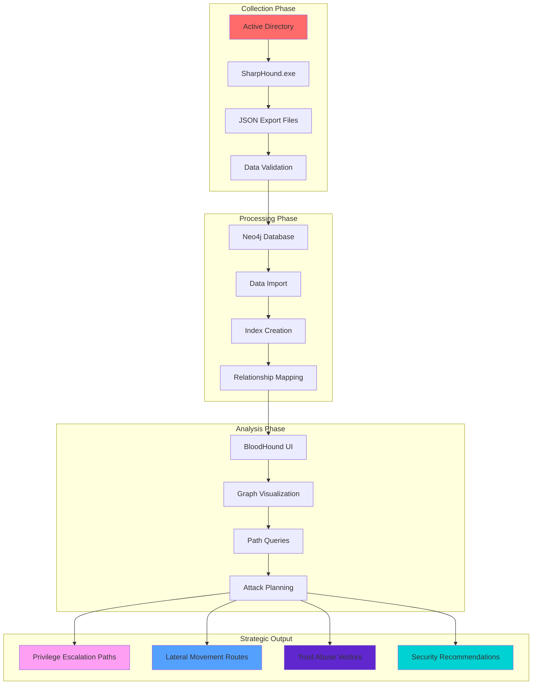
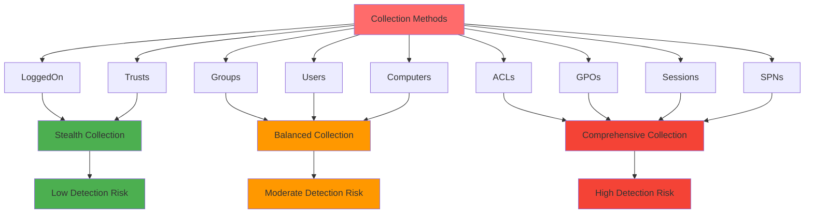

[🔄 Back to Master Index](./00_Enumeration_Index.md) | [🔐 Previous: ACL Enumeration](./09_ACL_Enumeration.md) | [Next: SOAPHound Enumeration](./11_SOAPHound_Enumeration.md)

---

## 🔗 **RELATED ACTIVE DIRECTORY COMPONENTS**

### **🏗️ Core Infrastructure Components**
- **[Domain Controllers](../02_Active_Directory_Components/02_Domain_Controllers.md)**: Primary targets for BloodHound data collection
- **[Domain](../02_Active_Directory_Components/03_Domain.md)**: Domain boundaries and administrative units
- **[Forest](../02_Active_Directory_Components/04_Forest.md)**: Forest-wide attack paths and trust relationships

### **👥 Identity and Access Components**
- **[User Accounts](../02_Active_Directory_Components/17_User_Accounts.md)**: User objects and their relationships
- **[Organizational Units](../02_Active_Directory_Components/05_Organizational_Unit.md)**: OU structure and delegation
- **[Schema](../02_Active_Directory_Components/11_Schema.md)**: Object relationships and attributes

### **🔐 Security and Trust Components**
- **[Trusts](../02_Active_Directory_Components/07_Trusts.md)**: Cross-domain attack paths and trust abuse
- **[Group Policy Objects](../02_Active_Directory_Components/09_Group_Policy_Objects.md)**: Policy-based attack vectors
- **[FSMO Roles](../02_Active_Directory_Components/08_FSMO_Roles.md)**: Critical infrastructure targets

---

## 🚀 **BLOODHOUND ENUMERATION OVERVIEW**

> **⚠️ CRITICAL TOOL REQUIREMENT**: **Invisi-Shell** is mandatory for production environments to ensure stealth operations and avoid detection. See [Tool Arsenal](./01_Tool_Setup_Loading.md#-invisi-shell-complete-setup) for setup instructions.

## 📋 **QUICK START BLOODHOUND DISCOVERY**

| Phase | Tool | Command | Purpose | OPSEC Level |
|-------|------|---------|---------|-------------|
| **1** | SharpHound.exe | `SharpHound.exe -c LoggedOn,Trusts` | Basic collection | 🟢 Stealth |
| **2** | SharpHound.exe | `SharpHound.exe -c LoggedOn,Trusts,Groups,Users` | Standard collection | 🟡 Balanced |
| **3** | SharpHound.exe | `SharpHound.exe -c All -Stealth` | Comprehensive collection | 🟡 Balanced |
| **4** | BloodHound.exe | Import JSON files for analysis | Attack path visualization | 🟠 Noisy |

## 🎭 **AT-A-GLANCE: BLOODHOUND ENUMERATION ESSENTIALS**

**What This Technique Reveals:**
- Complete Active Directory relationship mapping
- Attack paths and privilege escalation routes
- Lateral movement opportunities
- Security misconfigurations and vulnerabilities
- Trust relationships and cross-domain access

**Primary Use Cases:**
- Attack path discovery and planning
- Privilege escalation analysis
- Lateral movement mapping
- Security posture assessment
- Threat modeling and risk analysis

**Execution Speed:**
- **Stealth Mode**: 5-10 seconds between queries
- **Balanced Mode**: 3-7 seconds between queries
- **Lab Mode**: 1-3 seconds between queries

## 🧭 **PIVOT MATRIX: STRATEGIC NEXT STEPS**

| Finding | Immediate Pivot | Strategic Goal | Tool/Technique |
|---------|-----------------|----------------|----------------|
| **Shortest Paths to DA** | [Kerberos Delegation Abuse](./25_Kerberos_Delegation_Abuse.md) | Delegation abuse and escalation | `MATCH path = shortestPath()` |
| **Unconstrained Delegation** | [Kerberos Delegation Abuse](./25_Kerberos_Delegation_Abuse.md) | Ticket abuse and persistence | `MATCH (u:User)-[:AllowedToDelegate]->()` |
| **AdminSDHolder Access** | [ACL Enumeration](./09_ACL_Enumeration.md) | Permission analysis and abuse | `MATCH (u:User)-[:GenericAll]->()` |
| **Cross-Domain Paths** | [Forest Enumeration](./30_Forest_Enumeration.md) | Trust abuse and forest compromise | `MATCH (d1:Domain)-[:TrustedBy]->(d2:Domain)` |
| **Service Account Paths** | [SPN Enumeration](./24_SPN_Enumeration_Techniques.md) | Kerberoasting and service abuse | `MATCH (u:User) WHERE u.serviceprincipalname IS NOT NULL` |
| **GPO-Based Attacks** | [GPO Enumeration](./08_GPO_Enumeration.md) | Policy-based privilege escalation | `MATCH (gpo:GPO)-[:GpLink]->(ou:OU)` |

## 🎭 **PERSONAS: REAL-WORLD EXECUTION PROFILES**

### **🕵️ Stealth Consultant (Production Environment)**
- **Tool Preference**: SharpHound.exe + Invisi-Shell
- **Collection Pattern**: Minimal properties, targeted scope, stealth options
- **Timing**: 5-10 second delays with jitter
- **Risk Tolerance**: Minimal detection footprint

### **⚡ Power User (Internal Assessment)**
- **Tool Preference**: SharpHound.exe + BloodHound.exe
- **Collection Pattern**: Standard properties, balanced scope, moderate stealth
- **Timing**: 3-7 second delays
- **Risk Tolerance**: Moderate detection acceptable

### **👑 Domain Admin (Lab Environment)**
- **Tool Preference**: Full SharpHound suite + BloodHound analysis
- **Collection Pattern**: All properties, comprehensive scope, maximum detail
- **Timing**: 1-3 second delays
- **Risk Tolerance**: Detection not a concern

## 🎨 **VISUAL MASTERY: BLOODHOUND ENUMERATION ARCHITECTURE**

### **BloodHound Data Collection and Analysis Flow**


**Architecture Explanation:**
This diagram shows the complete BloodHound workflow from data collection to strategic output. The **Collection Phase** uses SharpHound to gather AD data, the **Processing Phase** transforms data into a graph database, the **Analysis Phase** provides visualization and querying capabilities, and the **Strategic Output** delivers actionable intelligence for attack planning and security analysis.

### **BloodHound Collection Methods and OPSEC Levels**


**Collection Methods Explanation:**
This diagram illustrates the relationship between different collection methods and their OPSEC implications. **LoggedOn** and **Trusts** represent stealth collection with minimal detection risk, **Groups**, **Users**, and **Computers** provide balanced collection, while **ACLs**, **GPOs**, **Sessions**, and **SPNs** offer comprehensive collection with higher detection risk. Understanding these relationships is crucial for planning collection strategies based on operational requirements.

## 🏭 **LAB vs PRODUCTION: EXECUTION PROFILES**

### **🔬 LAB ENVIRONMENT EXECUTION**
```powershell
# Comprehensive collection with maximum detail
.\SharpHound.exe -c All -OutputDirectory C:\BloodHound\Data

# Full property collection for complete analysis
.\SharpHound.exe -c All -Properties * -OutputDirectory C:\BloodHound\Data

# Comprehensive collection with verbose logging
.\SharpHound.exe -c All -Verbose -OutputDirectory C:\BloodHound\Data

# All collection methods for complete coverage
.\SharpHound.exe -c LoggedOn,Trusts,Groups,Users,Computers,ACLs,GPOs,Sessions,SPNs -OutputDirectory C:\BloodHound\Data
```

**Lab Environment Characteristics:**
- **Detection**: Not a concern
- **Speed**: Maximum execution speed
- **Detail**: Full property enumeration
- **Scope**: Complete domain coverage
- **Tools**: Full SharpHound suite

### **🏢 PRODUCTION ENVIRONMENT EXECUTION**
```powershell
# Stealth collection with minimal properties
.\SharpHound.exe -c LoggedOn,Trusts -Stealth -OutputDirectory C:\BloodHound\Data

# Standard collection with balanced properties
.\SharpHound.exe -c LoggedOn,Trusts,Groups,Users -OutputDirectory C:\BloodHound\Data

# Throttled collection with delays
.\SharpHound.exe -c LoggedOn,Trusts,Groups,Users -Throttle 500 -Delay 200 -OutputDirectory C:\BloodHound\Data

# Scope-limited collection for specific OUs
.\SharpHound.exe -c Users,Groups -SearchBase "OU=IT,DC=corp,DC=local" -OutputDirectory C:\BloodHound\Data
```

**Production Environment Characteristics:**
- **Detection**: Critical concern
- **Speed**: Controlled with jitter
- **Detail**: Minimal necessary properties
- **Scope**: Strategic targeting only
- **Tools**: SharpHound.exe + Invisi-Shell

## 🛡️ **DETECTION, OPSEC & CLEANUP**

### **🚨 DETECTION INDICATORS**

**Event Log Monitoring:**
- **Event ID 4662**: Object access (user/group enumeration)
- **Event ID 5136**: Directory service changes
- **Event ID 5141**: Directory service replication
- **Event ID 4728**: Member added to security group
- **Event ID 4729**: Member removed from security group

**Network Monitoring:**
- **LDAP Queries**: Port 389/636 queries to domain controllers
- **Query Patterns**: Bulk enumeration spikes
- **Data Transfer**: Large JSON file creation
- **Authentication**: Multiple Kerberos requests

**Behavioral Indicators:**
- **Bulk Enumeration**: Large numbers of AD queries in short time
- **Property Enumeration**: Requests for all object properties
- **Cross-Object Analysis**: Relationship queries between objects
- **Off-Hours Activity**: AD queries during unusual hours

### **🔒 OPSEC BEST PRACTICES**

**Stealth Techniques:**
```powershell
# Use Invisi-Shell for maximum stealth
# See: [Tool Arsenal](./01_Tool_Setup_Loading.md#-invisi-shell-complete-setup)

# Minimize collection scope and properties
.\SharpHound.exe -c LoggedOn,Trusts -Stealth

# Use throttling and delays
.\SharpHound.exe -c Users -Throttle 500 -Delay 200

# Limit collection to specific OUs
.\SharpHound.exe -c Users -SearchBase "OU=IT,DC=corp,DC=local"

# Avoid comprehensive collection in production
# .\SharpHound.exe -c All  # HIGH DETECTION RISK
```

**Detection Avoidance:**
- **Avoid bulk operations** in single queries
- **Use stealth collection methods** when possible
- **Implement query delays** with randomization
- **Scope collections** to specific objects or OUs
- **Use compiled executables** to bypass PowerShell logging

### **🧹 CLEANUP PROCEDURES**

**File Cleanup:**
```powershell
# Remove collection artifacts
Remove-Item "C:\BloodHound\Data\*.json" -ErrorAction SilentlyContinue
Remove-Item "C:\BloodHound\Data\*.zip" -ErrorAction SilentlyContinue

# Clear PowerShell history
Clear-History
Remove-Item (Get-PSReadLineOption).HistorySavePath -ErrorAction SilentlyContinue

# Remove temporary files
Remove-Item "$env:TEMP\SharpHound*" -ErrorAction SilentlyContinue
Remove-Item "$env:TEMP\BloodHound*" -ErrorAction SilentlyContinue
```

**Session Cleanup:**
```powershell
# Remove downloaded tools
Remove-Item "C:\BloodHound\SharpHound.exe" -ErrorAction SilentlyContinue
Remove-Item "C:\BloodHound\SharpHound.ps1" -ErrorAction SilentlyContinue

# Clear variables
Remove-Variable collectionData, outputFiles, analysisResults -ErrorAction SilentlyContinue

# Reset PowerShell execution policy (if changed)
Set-ExecutionPolicy -ExecutionPolicy Restricted -Force
```

## 🔗 **CROSS-REFERENCES & INTEGRATION**

### **📚 RELATED TECHNIQUES**
- **[User Enumeration](./05_User_Enumeration.md)**: User account discovery and analysis
- **[Group Enumeration](./06_Group_Enumeration.md)**: Group membership and hierarchy analysis
- **[ACL Enumeration](./09_ACL_Enumeration.md)**: Permission and access control analysis
- **[Session Enumeration](./12_Session_Enumeration_Index.md)**: Active session discovery
- **[File Share Enumeration](./17_File_Share_Enumeration.md)**: File system access analysis

### **🛠️ TOOL DEPENDENCIES**
- **[Tool Setup & Loading](./01_Tool_Setup_Loading.md)**: Invisi-Shell and SharpHound setup
- **[Network Enumeration](./02_Network_Enumeration.md)**: Domain controller discovery
- **[DNS Enumeration](./03_DNS_Enumeration.md)**: Domain name resolution
- **[Domain Enumeration](./04_Domain_Enumeration.md)**: Domain context establishment

### **🎯 ATTACK PATH INTEGRATION**
- **Privilege Escalation**: Group membership → Administrative access
- **Lateral Movement**: Session enumeration → System access
- **Persistence**: Trust relationships → Cross-domain access
- **Defense Evasion**: Stealth collection → Detection avoidance

---

## 🎯 **COMPREHENSIVE BLOODHOUND ENUMERATION COMMANDS**

### **🚀 PHASE 1: BASIC DATA COLLECTION (20+ Commands)**

#### **SharpHound.exe (Primary Collection Tool)**
```powershell
# 1. Basic stealth collection (minimal footprint)
.\SharpHound.exe -c LoggedOn,Trusts -Stealth

# 2. Standard collection (balanced approach)
.\SharpHound.exe -c LoggedOn,Trusts,Groups,Users

# 3. Comprehensive collection (lab only)
.\SharpHound.exe -c All

# 4. Custom collection methods
.\SharpHound.exe -c LoggedOn,Trusts,Groups,Users,Computers,ACLs

# 5. Collection with output directory
.\SharpHound.exe -c LoggedOn,Trusts,Groups,Users -OutputDirectory C:\BloodHound\Data
```

#### **SharpHound.ps1 (PowerShell Script Alternative)**
```powershell
# 6. PowerShell script collection
. .\SharpHound.ps1
Invoke-BloodHound -CollectionMethod LoggedOn,Trusts

# 7. PowerShell with custom properties
Invoke-BloodHound -CollectionMethod Users -Properties samaccountname,memberof,description

# 8. PowerShell with search base
Invoke-BloodHound -CollectionMethod Users -SearchBase "OU=IT,DC=corp,DC=local"

# 9. PowerShell with domain specification
Invoke-BloodHound -CollectionMethod All -Domain corp.local

# 10. PowerShell with verbose logging
Invoke-BloodHound -CollectionMethod All -Verbose
```

#### **Advanced Collection Options**
```powershell
# 11. Collection with throttling
.\SharpHound.exe -c Users -Throttle 500

# 12. Collection with delays
.\SharpHound.exe -c Users -Delay 200

# 13. Collection with stealth mode
.\SharpHound.exe -c Users -Stealth

# 14. Collection with specific properties
.\SharpHound.exe -c Users -Properties samaccountname,memberof,description

# 15. Collection with LDAP filters
.\SharpHound.exe -c Users -LDAPFilter "(&(objectClass=user)(memberOf=CN=Domain Admins,CN=Users,DC=corp,DC=local))"
```

### **🚀 PHASE 2: ADVANCED COLLECTION TECHNIQUES (20+ Commands)**

#### **Targeted Collection Methods**
```powershell
# 16. User-focused collection
.\SharpHound.exe -c Users -Properties samaccountname,displayname,memberof,lastlogon

# 17. Group-focused collection
.\SharpHound.exe -c Groups -Properties name,description,member,admincount

# 18. Computer-focused collection
.\SharpHound.exe -c Computers -Properties name,operatingsystem,lastlogon,enabled

# 19. ACL-focused collection
.\SharpHound.exe -c ACLs -Properties objectname,identityreference,activedirectoryrights

# 20. Trust-focused collection
.\SharpHound.exe -c Trusts -Properties trustdirection,trusttype,trustattributes
```

#### **Scope and Filtering**
```powershell
# 21. OU-scoped collection
.\SharpHound.exe -c Users -SearchBase "OU=IT,DC=corp,DC=local"

# 22. Domain-scoped collection
.\SharpHound.exe -c Users -Domain corp.local

# 23. Object class filtering
.\SharpHound.exe -c Users -ObjectClass user

# 24. Property-based filtering
.\SharpHound.exe -c Users -Properties samaccountname,memberof

# 25. Custom LDAP filtering
.\SharpHound.exe -c Users -LDAPFilter "(&(objectClass=user)(adminCount=1))"
```

#### **Performance and Optimization**
```powershell
# 26. Collection with memory optimization
.\SharpHound.exe -c Users -MaxThreads 10

# 27. Collection with timeout settings
.\SharpHound.exe -c Users -Timeout 30000

# 28. Collection with retry logic
.\SharpHound.exe -c Users -RetryCount 3

# 29. Collection with progress reporting
.\SharpHound.exe -c Users -Verbose

# 30. Collection with error handling
.\SharpHound.exe -c Users -ContinueOnError
```

### **🚀 PHASE 3: STRATEGIC COLLECTION PLANNING (20+ Commands)**

#### **Collection Strategy Development**
```powershell
# 31. Minimal footprint collection
.\SharpHound.exe -c LoggedOn,Trusts -Stealth -Throttle 1000 -Delay 500

# 32. Balanced collection strategy
.\SharpHound.exe -c LoggedOn,Trusts,Groups,Users -Throttle 500 -Delay 200

# 33. Comprehensive collection strategy
.\SharpHound.exe -c All -Throttle 100 -Delay 100

# 34. Targeted collection strategy
.\SharpHound.exe -c Users,Groups -SearchBase "OU=IT,DC=corp,DC=local" -Properties samaccountname,memberof

# 35. Stealth collection strategy
.\SharpHound.exe -c LoggedOn,Trusts -Stealth -Throttle 2000 -Delay 1000
```

#### **Multi-Phase Collection**
```powershell
# 36. Phase 1: Basic enumeration
.\SharpHound.exe -c LoggedOn,Trusts -OutputDirectory C:\BloodHound\Phase1

# 37. Phase 2: User and group analysis
.\SharpHound.exe -c Users,Groups -OutputDirectory C:\BloodHound\Phase2

# 38. Phase 3: Computer and session analysis
.\SharpHound.exe -c Computers,Sessions -OutputDirectory C:\BloodHound\Phase3

# 39. Phase 4: ACL and permission analysis
.\SharpHound.exe -c ACLs -OutputDirectory C:\BloodHound\Phase4

# 40. Phase 5: Comprehensive analysis
.\SharpHound.exe -c All -OutputDirectory C:\BloodHound\Phase5
```

#### **Collection Validation and Verification**
```powershell
# 41. Verify collection files
Get-ChildItem -Path "C:\BloodHound\Data" -Filter "*.json"

# 42. Check file sizes
Get-ChildItem -Path "C:\BloodHound\Data" -Filter "*.json" | Select-Object Name, Length

# 43. Validate JSON format
Get-Content "C:\BloodHound\Data\*_users.json" | Select-Object -First 5

# 44. Count collected objects
$userData = Get-Content "C:\BloodHound\Data\*_users.json" | ConvertFrom-Json
$userData.Count

# 45. Verify collection completeness
$collectionFiles = @("users", "groups", "computers", "acls", "trusts")
foreach($file in $collectionFiles) {
    $jsonFile = Get-ChildItem -Path "C:\BloodHound\Data" -Filter "*_$file.json"
    if($jsonFile) {
        Write-Host "$file collection: $($jsonFile.Length) bytes" -ForegroundColor Green
    } else {
        Write-Host "$file collection: MISSING" -ForegroundColor Red
    }
}
```

---

## 🎯 **COMMAND EXPLANATIONS & USE CASES**

### **🔍 COLLECTION COMMANDS EXPLAINED**

**SharpHound.exe -c LoggedOn,Trusts -Stealth:**
- **Purpose**: Performs stealth collection of logged-on users and trust relationships
- **Parameters**: `-c` (collection methods), `-Stealth` (stealth mode)
- **Returns**: JSON files with minimal AD data
- **Use Case**: Initial reconnaissance with minimal detection risk
- **OPSEC**: Uses stealth mode to reduce logging and detection
- **Execution Context**: Requires SharpHound.exe in current directory

**SharpHound.exe -c All -OutputDirectory C:\BloodHound\Data:**
- **Purpose**: Comprehensive collection of all AD objects and relationships
- **Parameters**: `-c All` (all collection methods), `-OutputDirectory` (output location)
- **Returns**: Complete JSON files with all AD data
- **Use Case**: Full environment analysis and attack path mapping
- **OPSEC**: Generates significant logging and detection events
- **Execution Context**: Requires SharpHound.exe and sufficient disk space

### **🔐 ADVANCED COLLECTION COMMANDS EXPLAINED**

**SharpHound.exe -c Users -Properties samaccountname,memberof,description:**
- **Purpose**: Collects user objects with specific properties
- **Parameters**: `-c Users` (user collection), `-Properties` (specific attributes)
- **Returns**: JSON file with user data and specified properties
- **Use Case**: Targeted user analysis with minimal data collection
- **OPSEC**: Reduces data transfer and logging compared to full collection
- **Execution Context**: Requires SharpHound.exe and AD read permissions

**SharpHound.exe -c Users -SearchBase "OU=IT,DC=corp,DC=local":**
- **Purpose**: Collects users from specific Organizational Unit
- **Parameters**: `-c Users` (user collection), `-SearchBase` (LDAP search base)
- **Returns**: JSON file with users from specified OU
- **Use Case**: Focused analysis of specific organizational units
- **OPSEC**: Limits collection scope and reduces detection risk
- **Execution Context**: Requires SharpHound.exe and access to specified OU

### **🔧 STRATEGIC COLLECTION COMMANDS EXPLAINED**

**SharpHound.exe -c LoggedOn,Trusts,Groups,Users -Throttle 500 -Delay 200:**
- **Purpose**: Balanced collection with performance controls
- **Parameters**: `-c` (collection methods), `-Throttle` (queries per second), `-Delay` (milliseconds between queries)
- **Returns**: JSON files with controlled collection speed
- **Use Case**: Production environment collection with detection risk management
- **OPSEC**: Implements throttling to reduce detection risk
- **Execution Context**: Requires SharpHound.exe and network access to domain controllers

**SharpHound.exe -c Users -LDAPFilter "(&(objectClass=user)(adminCount=1))":**
- **Purpose**: Collects users matching specific LDAP filter criteria
- **Parameters**: `-c Users` (user collection), `-LDAPFilter` (LDAP search filter)
- **Returns**: JSON file with filtered user data
- **Use Case**: Targeted collection of specific user types (e.g., protected accounts)
- **OPSEC**: Uses precise filtering to reduce unnecessary queries
- **Execution Context**: Requires SharpHound.exe and LDAP query permissions

---

## 🎯 **REAL-WORLD EXECUTION SCENARIOS**

### **🏢 SCENARIO 1: STEALTH PRODUCTION ASSESSMENT**

**Objective**: Understand AD structure without detection
**Tools**: SharpHound.exe + Invisi-Shell
**Timing**: 5-10 second delays with jitter

```powershell
# Phase 1: Minimal collection
Start-Sleep -Seconds (Get-Random -Minimum 5 -Maximum 10)
.\SharpHound.exe -c LoggedOn,Trusts -Stealth -OutputDirectory C:\BloodHound\Data

# Phase 2: Basic user analysis
Start-Sleep -Seconds (Get-Random -Minimum 5 -Maximum 10)
.\SharpHound.exe -c Users -Properties samaccountname,memberof -Throttle 1000 -Delay 500

# Phase 3: Group analysis
Start-Sleep -Seconds (Get-Random -Minimum 5 -Maximum 10)
.\SharpHound.exe -c Groups -Properties name,member -Throttle 1000 -Delay 500

# Verify collection
Get-ChildItem -Path "C:\BloodHound\Data" -Filter "*.json" | Select-Object Name, Length
```

### **🔬 SCENARIO 2: COMPREHENSIVE LAB ANALYSIS**

**Objective**: Complete AD infrastructure mapping
**Tools**: Full SharpHound suite
**Timing**: 1-3 second delays

```powershell
# Phase 1: Complete enumeration
.\SharpHound.exe -c All -OutputDirectory C:\BloodHound\Data

# Phase 2: Verify collection completeness
$collectionFiles = @("users", "groups", "computers", "acls", "trusts", "gpos", "sessions", "spns")
foreach($file in $collectionFiles) {
    $jsonFile = Get-ChildItem -Path "C:\BloodHound\Data" -Filter "*_$file.json"
    if($jsonFile) {
        Write-Host "$file collection: $($jsonFile.Length) bytes" -ForegroundColor Green
    } else {
        Write-Host "$file collection: MISSING" -ForegroundColor Red
    }
}

# Phase 3: Data validation
$userData = Get-Content "C:\BloodHound\Data\*_users.json" | ConvertFrom-Json
$groupData = Get-Content "C:\BloodHound\Data\*_groups.json" | ConvertFrom-Json

Write-Host "Total Users: $($userData.Count)" -ForegroundColor Green
Write-Host "Total Groups: $($groupData.Count)" -ForegroundColor Green
```

### **⚡ SCENARIO 3: BALANCED INTERNAL ASSESSMENT**

**Objective**: Strategic AD analysis with moderate stealth
**Tools**: SharpHound.exe + BloodHound.exe
**Timing**: 3-7 second delays

```powershell
# Phase 1: Strategic collection
$collectionMethods = @("LoggedOn", "Trusts", "Groups", "Users")
foreach($method in $collectionMethods) {
    Start-Sleep -Seconds (Get-Random -Minimum 1 -Maximum 3)
    .\SharpHound.exe -c $method -OutputDirectory C:\BloodHound\Data
}

# Phase 2: Targeted computer analysis
Start-Sleep -Seconds (Get-Random -Minimum 2 -Maximum 5)
.\SharpHound.exe -c Computers -Properties name,operatingsystem,lastlogon -OutputDirectory C:\BloodHound\Data

# Phase 3: ACL analysis for high-value targets
Start-Sleep -Seconds (Get-Random -Minimum 2 -Maximum 5)
.\SharpHound.exe -c ACLs -SearchBase "CN=Users,DC=corp,DC=local" -OutputDirectory C:\BloodHound\Data

# Verify strategic collection
$strategicFiles = Get-ChildItem -Path "C:\BloodHound\Data" -Filter "*.json"
Write-Host "Strategic collection completed: $($strategicFiles.Count) files" -ForegroundColor Green
```

---

## 🔗 **INTEGRATION WITH ATTACK METHODOLOGY**

### **🎯 PHASE 1: RECONNAISSANCE INTEGRATION**
- **Network Enumeration**: Domain controller discovery for SharpHound queries
- **DNS Enumeration**: Domain name resolution for collection targeting
- **Domain Enumeration**: Domain context establishment for collection scope

### **🎯 PHASE 2: WEAPONIZATION INTEGRATION**
- **Tool Setup**: Invisi-Shell and SharpHound loading for stealth operations
- **Command Preparation**: Collection command preparation and testing

### **🎯 PHASE 3: DELIVERY INTEGRATION**
- **Execution Context**: Local or remote execution based on access level
- **Tool Selection**: SharpHound.exe vs PowerShell based on environment

### **🎯 PHASE 4: EXPLOITATION INTEGRATION**
- **Privilege Escalation**: Attack path discovery for escalation planning
- **Lateral Movement**: Session enumeration for movement planning
- **Persistence**: Trust analysis for persistence planning

### **🎯 PHASE 5: INSTALLATION INTEGRATION**
- **Backdoor Installation**: Permission analysis for installation planning
- **Service Installation**: Service account analysis for installation planning

### **🎯 PHASE 6: COMMAND & CONTROL INTEGRATION**
- **Communication Channels**: Trust analysis for C2 communication planning
- **Data Exfiltration**: Permission analysis for exfiltration planning

### **🎯 PHASE 7: ACTIONS ON OBJECTIVES INTEGRATION**
- **Data Destruction**: Permission analysis for destruction planning
- **Account Manipulation**: Permission analysis for manipulation planning

---

## 🛠️ **COMPREHENSIVE ENUMERATION TOOLS**

### **🔧 Microsoft-Signed Tools**
- **Microsoft AD Module**: AD object enumeration for BloodHound data collection
- **Get-ADUser**: User object enumeration and analysis
- **Get-ADGroup**: Group object enumeration and analysis
- **Get-ADComputer**: Computer object enumeration and analysis
- **Get-ADTrust**: Trust relationship enumeration and analysis
- **Get-ADObject**: General AD object enumeration and analysis

### **⚔️ Offensive Tools (PowerView, etc.)**
- **PowerView Suite**: Comprehensive AD enumeration for BloodHound data collection
- **Get-DomainUser**: PowerView user enumeration and analysis
- **Get-DomainGroup**: PowerView group enumeration and analysis
- **Get-DomainComputer**: PowerView computer enumeration and analysis
- **Get-DomainTrust**: PowerView trust relationship enumeration
- **Get-DomainObjectAcl**: PowerView ACL enumeration and analysis

### **🔴 Red Team Enumeration Tools**

#### **🩸 SharpHound - The BloodHound Data Collector**
**Purpose**: C# collector for BloodHound data
**Setup**: Download SharpHound.exe from GitHub
**Primary Commands**:
```cmd
# Basic collection
SharpHound.exe -c LoggedOn,Trusts                             # Basic collection
SharpHound.exe -c LoggedOn,Trusts,Groups,Users               # Standard collection
SharpHound.exe -c All                                         # Comprehensive collection
SharpHound.exe -c All -Stealth                                # Stealth collection

# Targeted collection
SharpHound.exe -c Users -Properties samaccountname,memberof   # User properties
SharpHound.exe -c Groups -Properties name,member              # Group properties
SharpHound.exe -c Computers -Properties name,operatingsystem  # Computer properties

# Advanced collection options
SharpHound.exe -c All -SearchBase "CN=Users,DC=corp,DC=local"  # Specific search base
SharpHound.exe -c All -Domain corp.local                       # Specific domain
SharpHound.exe -c All -Server DC01.corp.local                 # Specific server
SharpHound.exe -c All -OutputDirectory C:\BloodHound\Data     # Custom output directory

# Collection methods
SharpHound.exe -c LoggedOn                                     # Logged on users
SharpHound.exe -c Trusts                                       # Trust relationships
SharpHound.exe -c Groups                                       # Group memberships
SharpHound.exe -c Users                                        # User properties
SharpHound.exe -c Computers                                    # Computer properties
SharpHound.exe -c ACLs                                         # Access control lists
SharpHound.exe -c GPOs                                         # Group Policy Objects
SharpHound.exe -c Containers                                   # Container objects
SharpHound.exe -c Domains                                      # Domain information
```

#### **🩸 BloodHound - The AD Attack Path Mapper**
**Purpose**: Graph-based AD attack path mapping and visualization
**Setup**: Download BloodHound UI from GitHub
**Primary Commands**:
```cmd
# BloodHound UI
BloodHound.exe                                                 # Start BloodHound UI
BloodHound.exe --web                                           # Start web interface
BloodHound.exe --web --port 8080                              # Custom port

# BloodHound CLI (if available)
bloodhound --help                                              # Help information
bloodhound --version                                           # Version information
bloodhound --config config.json                               # Custom configuration
```

#### **🔍 PowerView - The AD Enumeration Swiss Army Knife**
**Purpose**: PowerShell framework for comprehensive AD enumeration and attack execution
**Setup**: Download PowerView.ps1 from GitHub
**Primary Commands**:
```powershell
# Basic enumeration for BloodHound
Get-DomainUser -Properties samaccountname,memberof             # User enumeration
Get-DomainGroup -Properties name,member                        # Group enumeration
Get-DomainComputer -Properties name,operatingsystem            # Computer enumeration
Get-DomainTrust -Properties Source,Target                      # Trust enumeration

# Advanced enumeration for BloodHound
Get-DomainUser -Properties * | Export-Csv -Path "users.csv"    # Export user data
Get-DomainGroup -Properties * | Export-Csv -Path "groups.csv"  # Export group data
Get-DomainComputer -Properties * | Export-Csv -Path "computers.csv"  # Export computer data
Get-DomainTrust -Properties * | Export-Csv -Path "trusts.csv"  # Export trust data

# Session enumeration for BloodHound
Find-DomainUserLocation                                        # User location discovery
Get-NetSession                                                 # SMB session enumeration
Get-NetLoggedon                                                # Logged on user enumeration
```

#### **🔍 SharpView - Compiled PowerView (C#)**
**Purpose**: C# version of PowerView without PowerShell execution
**Setup**: Download SharpView.exe from GitHub
**Primary Commands**:
```cmd
# Basic enumeration for BloodHound
SharpView.exe Get-DomainUser -Properties samaccountname,memberof  # User enumeration
SharpView.exe Get-DomainGroup -Properties name,member             # Group enumeration
SharpView.exe Get-DomainComputer -Properties name,operatingsystem # Computer enumeration
SharpView.exe Get-DomainTrust -Properties Source,Target           # Trust enumeration

# Advanced enumeration for BloodHound
SharpView.exe Get-DomainUser -Properties *                       # All user properties
SharpView.exe Get-DomainGroup -Properties *                      # All group properties
SharpView.exe Get-DomainComputer -Properties *                   # All computer properties
SharpView.exe Get-DomainTrust -Properties *                      # All trust properties
```

### **🛠️ Alternative Enumeration Tools**

#### **🔍 LDAPDomainDump - The Python LDAP Enumeration Tool**
**Purpose**: Python tool for dumping AD info over LDAP
**Setup**: `pip install ldapdomaindump` or download from GitHub
**Primary Commands**:
```bash
# Basic LDAP enumeration
ldapdomaindump target.com                                   # Basic enumeration
ldapdomaindump target.com -u username -p password           # Authenticated enumeration
ldapdomaindump target.com -u username -p password -o output_dir  # Custom output

# LDAP server specification
ldapdomaindump target.com -s ldap://192.168.1.10            # Specific LDAP server
ldapdomaindump target.com -s ldaps://192.168.1.10           # LDAPS connection
ldapdomaindump target.com -s ldap://192.168.1.10:389        # Custom port

# Output formats
ldapdomaindump target.com -o output_dir --format html       # HTML output
ldapdomaindump target.com -o output_dir --format json       # JSON output
ldapdomaindump target.com -o output_dir --format csv        # CSV output
```

#### **🌐 Native Windows AD Tools**
**Purpose**: Built-in Windows AD enumeration capabilities
**Setup**: Built into Windows
**Primary Commands**:
```cmd
# dsquery commands
dsquery user -name "*"                                       # User enumeration
dsquery group -name "*"                                      # Group enumeration
dsquery computer -name "*"                                   # Computer enumeration
dsquery site -name "*"                                       # Site enumeration

# net commands
net user /domain                                             # Domain user enumeration
net group /domain                                            # Domain group enumeration
net view /domain                                             # Domain computer view

# PowerShell native commands
Get-WmiObject -Class Win32_UserAccount                      # WMI user enumeration
Get-WmiObject -Class Win32_Group                            # WMI group enumeration
Get-WmiObject -Class Win32_ComputerSystem                   # WMI computer enumeration
```

#### **🔍 Online BloodHound Resources**
**Purpose**: Web-based BloodHound resources and documentation
**Setup**: Web browser access
**Primary Tools**:
- **BloodHound Documentation**: Official BloodHound documentation
- **GitHub Repositories**: BloodHound source code and examples
- **Community Resources**: BloodHound community guides and examples
- **Security Research**: BloodHound analysis and research papers

**Usage Examples**:
```bash
# BloodHound Documentation
# Visit https://bloodhound.readthedocs.io/
# Access official documentation and examples

# GitHub Repositories
# Visit https://github.com/BloodHoundAD/BloodHound
# Access source code and examples

# Community Resources
# Visit BloodHound community forums and discussions
# Access shared tools and scripts for BloodHound analysis
```

### **🔍 Specialized Tools**

#### **🌐 BloodHound Data Collection Tools**
- **SharpHound**: Primary data collector for BloodHound
- **PowerView**: PowerShell-based data collection
- **SharpView**: C#-based data collection
- **Custom Scripts**: Advanced data collection automation

#### **🔗 BloodHound Data Analysis Tools**
- **BloodHound UI**: Primary analysis interface
- **Neo4j Browser**: Direct database querying
- **Custom Scripts**: Advanced data analysis automation
- **Visualization tools**: Custom graph visualization and analysis

#### **📋 BloodHound Data Export Tools**
- **SharpHound**: JSON export capabilities
- **PowerView**: CSV export capabilities
- **Custom Scripts**: Advanced export format automation
- **Data conversion tools**: Format conversion and transformation

#### **🎯 BloodHound Attack Path Tools**
- **BloodHound Queries**: Pre-built attack path queries
- **Custom Cypher**: Advanced Neo4j querying
- **Path analysis tools**: Attack path analysis and planning
- **Exploitation tools**: Attack path-based exploitation tools

---

## 📚 **ADDITIONAL RESOURCES & REFERENCES**

### **🔧 TOOL DOCUMENTATION**
- **SharpHound**: [BloodHound Data Collector](https://github.com/BloodHoundAD/BloodHound/tree/master/Collectors)
- **BloodHound**: [BloodHound Web Interface](https://github.com/BloodHoundAD/BloodHound)
- **Neo4j**: [Graph Database for BloodHound](https://neo4j.com/)

### **📖 TECHNICAL REFERENCES**
- **Microsoft Docs**: [Active Directory Schema](https://docs.microsoft.com/en-us/windows-server/identity/ad-ds/plan/active-directory-schema)
- **ATT&CK Framework**: [Active Directory Discovery (T1087)](https://attack.mitre.org/techniques/T1087/)
- **LDAP Filters**: [LDAP Filter Syntax](https://ldap.com/ldap-filters/)

### **🎯 PRACTICAL GUIDES**
- **Red Team Guides**: [BloodHound Usage](https://bloodhound.readthedocs.io/)
- **Penetration Testing**: [AD Enumeration with BloodHound](https://www.ired.team/offensive-security-experiments/active-directory-kerberos-roasting)
- **Security Research**: [BloodHound Analysis](https://www.harmj0y.net/blog/redteaming/active-directory-attack-paths/)

---

[Prev: 09_ACL_Enumeration.md](./09_ACL_Enumeration.md) | [Up: Index](./00_Enumeration_Index.md) | [Hub](./00_Methodology_Hub.md) | [Next: 11_SOAPHound_Enumeration.md](./11_SOAPHound_Enumeration.md)
