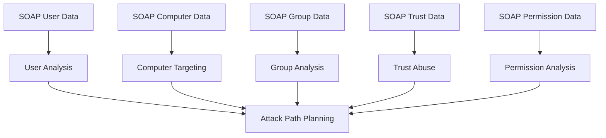
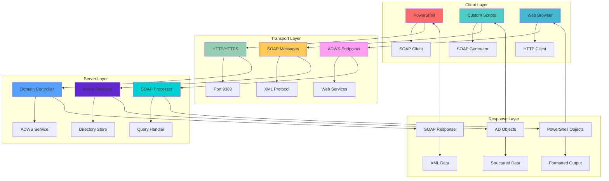
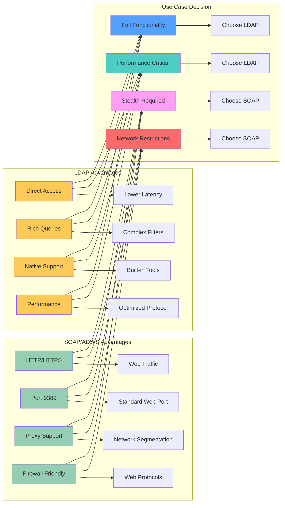

[Prev: 10_BloodHound_Enumeration.md](./10_BloodHound_Enumeration.md) | [Up: Index](./00_Enumeration_Index.md) | [Hub](./00_Methodology_Hub.md) | [Next: 12_Session_Enumeration_Index.md](./12_Session_Enumeration_Index.md)

# 🧪 SOAPHound Enumeration - SOAP-Based Active Directory Discovery

> **⚠️ CRITICAL TOOL REQUIREMENT**: **Invisi-Shell** is mandatory for production environments to ensure stealth operations and avoid detection. See [Tool Arsenal](./01_Tool_Setup_Loading.md#-invisi-shell-complete-setup) for setup instructions.

> **🎯 PURPOSE**: This is your **SOAP-based AD enumeration foundation** for Active Directory discovery. SOAPHound leverages ADWS (Active Directory Web Services) to bypass LDAP restrictions, providing stealth enumeration through HTTP/HTTPS protocols when traditional LDAP access is blocked or monitored.

[🔄 Back to Master Index](./00_Enumeration_Index.md) | [🔍 Previous: BloodHound Enumeration](./10_BloodHound_Enumeration.md) | [Next: Session Enumeration Index](./12_Session_Enumeration_Index.md)

---

## 🔗 **RELATED ACTIVE DIRECTORY COMPONENTS**

### **🏗️ Core Infrastructure Components**
- **[Domain Controllers](../02_Active_Directory_Components/02_Domain_Controllers.md)**: Primary targets for SOAPHound data collection
- **[Domain](../02_Active_Directory_Components/03_Domain.md)**: Domain boundaries and administrative units
- **[Forest](../02_Active_Directory_Components/04_Forest.md)**: Forest-wide attack paths and trust relationships

### **👥 Identity and Access Components**
- **[User Accounts](../02_Active_Directory_Components/17_User_Accounts.md)**: User objects and their relationships
- **[Organizational Units](../02_Active_Directory_Components/05_Organizational_Unit.md)**: OU structure and delegation
- **[Schema](../02_Active_Directory_Components/11_Schema.md)**: Object relationships and attributes

### **🔐 Security and Trust Components**
- **[Trusts](../02_Active_Directory_Components/07_Trusts.md)**: Cross-domain attack paths and trust abuse
- **[Group Policy Objects](../02_Active_Directory_Components/09_Group_Policy_Objects.md)**: Policy-based attack vectors
- **[FSMO Roles](../02_Active_Directory_Components/08_FSMO_Roles.md)**: Critical infrastructure targets

---

## 🚀 **SOAPHOUND ENUMERATION OVERVIEW**

## 📋 **QUICK START SOAPHOUND DISCOVERY**

| **Phase** | **Tool** | **Command** | **Purpose** | **OPSEC Level** |
|-----------|----------|-------------|-------------|------------------|
| **1. Basic SOAP** | `Get-ADUser` (ADWS) | `Get-ADUser -Filter * -Properties samaccountname -ResultSetSize 10` | Basic user discovery via SOAP | 🟢 Stealth |
| **2. Advanced SOAP** | `Get-ADComputer` (ADWS) | `Get-ADComputer -Filter * -Properties OperatingSystem -ResultSetSize 20` | Computer enumeration via SOAP | 🟡 Balanced |
| **3. Group SOAP** | `Get-ADGroup` (ADWS) | `Get-ADGroup -Filter * -Properties member,description -ResultSetSize 15` | Group analysis via SOAP | 🟡 Balanced |
| **4. Custom SOAP** | Custom SOAP Client | `Invoke-CustomSOAPQuery -Endpoint "dc01:9389" -Query "SELECT * FROM 'LDAP://DC=corp,DC=local'"` | Advanced SOAP queries | 🟠 Noisy |

## 🎭 **AT-A-GLANCE: SOAPHOUND ENUMERATION ESSENTIALS**

**What This Technique Reveals:**
- Active Directory objects via SOAP/ADWS instead of LDAP
- Bypass network restrictions and firewall blocks
- Stealth enumeration through HTTP/HTTPS protocols
- Cross-segment AD access through web services
- Protocol-agnostic AD discovery capabilities

**Primary Use Cases:**
- Bypass LDAP port restrictions (389, 636, 3268, 3269)
- Stealth AD enumeration through web traffic
- Cross-network segment AD access
- Protocol-agnostic AD discovery
- Web-based AD enumeration for red team operations

**Execution Speed:**
- **Stealth Mode**: 4-8 seconds between queries with jitter
- **Balanced Mode**: 2-5 seconds between queries
- **Lab Mode**: 1-3 seconds between queries

### Command Quick‑Reference
| Tool | Purpose | Example | Notes |
| - | - | - | - |
| Get-ADUser (ADWS) | SOAP user queries | Get-ADUser -Filter * -Properties * | Native ADWS
| Get-ADComputer (ADWS) | SOAP computer queries | Get-ADComputer -Filter * -Properties OperatingSystem | Native ADWS
| Get-ADGroup (ADWS) | SOAP group queries | Get-ADGroup -Filter * -Properties * | Native ADWS
| SOAPHound.ps1 | Custom SOAP client | . .\SOAPHound.ps1 | Advanced SOAP
| Custom SOAP | Manual SOAP queries | Invoke-SOAPRequest -Endpoint $adwsURL | Full control

## 🧭 **PIVOT MATRIX: STRATEGIC NEXT STEPS**

| **Finding** | **Immediate Pivot** | **Strategic Goal** | **Tool/Technique** |
|--------------|---------------------|-------------------|-------------------|
| **SOAP User Enumeration** | [05_User_Enumeration.md](./05_User_Enumeration.md) | User analysis and targeting | `Get-ADUser` via ADWS |
| **SOAP Computer Discovery** | [07_Computer_Enumeration.md](./07_Computer_Enumeration.md) | Computer targeting and lateral movement | `Get-ADComputer` via ADWS |
| **SOAP Group Memberships** | [06_Group_Enumeration.md](./06_Group_Enumeration.md) | Group analysis and privilege mapping | `Get-ADGroup` via ADWS |
| **SOAP Trust Relationships** | [30_Forest_Enumeration.md](./30_Forest_Enumeration.md) | Trust abuse and cross-domain access | `Get-ADTrust` via ADWS |
| **SOAP Permission Data** | [09_ACL_Enumeration.md](./09_ACL_Enumeration.md) | Permission analysis and escalation | `Get-ACL` via ADWS |
| **SOAP Service Accounts** | [24_SPN_Enumeration_Techniques.md](./24_SPN_Enumeration_Techniques.md) | Service account discovery and Kerberoasting | `Get-ADUser -SPN` via ADWS |

## 🎭 **PERSONAS: REAL-WORLD EXECUTION PROFILES**

### **🕵️ Persona 1: "Stealth Consultant" (Limited User)**
- **Access Level**: Standard domain user
- **OPSEC Priority**: Maximum stealth, minimal detection
- **Tool Preference**: Native ADWS cmdlets, minimal custom SOAP
- **Execution Style**: Slow, methodical, scoped queries
- **Target Focus**: Basic SOAP discovery, organizational structure

### **⚡ Persona 2: "Power User" (Elevated Access)**
- **Access Level**: Local admin on workstation
- **OPSEC Priority**: Balanced stealth, comprehensive enumeration
- **Tool Preference**: ADWS cmdlets, selective custom SOAP queries
- **Execution Style**: Moderate speed, targeted enumeration
- **Target Focus**: SOAP-based privilege mapping, service discovery

### **👑 Persona 3: "Domain Admin" (Full Access)**
- **Access Level**: Domain administrative privileges
- **OPSEC Priority**: Minimal stealth, maximum information gathering
- **Tool Preference**: Full ADWS suite, comprehensive custom SOAP
- **Execution Style**: Fast, comprehensive, full enumeration
- **Target Focus**: Complete SOAP-based AD landscape, attack path mapping

### Stealth Profiles
| Profile | Queries | Delay (jitter) | Protocol |
| - | - | - | - |
| Stealth | Minimal SOAP | 4–8 s | ADWS over HTTPS
| Balanced | Standard SOAP | 2–5 s | ADWS over HTTP/HTTPS
| Noisy (lab) | Comprehensive SOAP | 1–3 s | Full SOAP enumeration

## Fictional Use Case: CyberCorp (Progressive Storyline)
**User Persona**: Charlie Rodriguez, Network Security Engineer (Limited User Account)
**Progression**: From basic SOAP discovery to advanced ADWS enumeration

```powershell
# Phase 1: Basic SOAP Discovery (Limited User)
Get-ADUser -Filter * -Properties samaccountname -ResultSetSize 10

# Phase 2: Advanced SOAP Enumeration (PowerView User)
Get-ADUser -Filter * -Properties memberOf,lastLogonDate -ResultSetSize 50

# Phase 3: Comprehensive SOAP Analysis (Advanced User)
Get-ADUser -Filter * -Properties * -ResultSetSize 100 | Export-Csv users_soap.csv
```

## Canonical SOAP Queries (ADWS and Custom SOAP)
```powershell
# Basic user enumeration via SOAP
Get-ADUser -Filter * -Properties samaccountname,displayName,enabled -ResultSetSize 20

# Advanced user properties via SOAP
Get-ADUser -Filter * -Properties memberOf,lastLogonDate,pwdLastSet,userAccountControl -ResultSetSize 50

# Computer enumeration via SOAP
Get-ADComputer -Filter * -Properties OperatingSystem,OperatingSystemVersion,lastLogonDate -ResultSetSize 30

# Group enumeration via SOAP
Get-ADGroup -Filter * -Properties member,description,groupScope,groupCategory -ResultSetSize 25

# Trust enumeration via SOAP
Get-ADTrust -Filter * -Properties TrustDirection,TrustType,TrustAttributes
```

## Site/Context‑Aware SOAP Enumeration
```powershell
# Scope by domain (multi-domain environments)
Get-ADUser -Filter * -Properties * -Server dc01.corp.local -ResultSetSize 100

# Scope by OU via SOAP
Get-ADUser -Filter * -SearchBase "OU=IT,DC=corp,DC=local" -Properties * -ResultSetSize 50

# Custom SOAP endpoint discovery
$adwsEndpoints = @("dc01.corp.local:9389", "dc02.corp.local:9389")
foreach($endpoint in $adwsEndpoints) {
    try {
        Get-ADUser -Filter * -Properties samaccountname -Server $endpoint -ResultSetSize 10
        Write-Host "SOAP endpoint $endpoint accessible" -ForegroundColor Green
    }
    catch {
        Write-Warning "SOAP endpoint $endpoint not accessible"
    }
}
```

### Findings → Pivots (SOAPHound-specific flow)


## 🛠️ **ENUMERATION TOOLS OVERVIEW**

> **🔒 CRITICAL TOOL REQUIREMENT**: **Invisi-Shell** is mandatory for all production SOAPHound operations. It provides AMSI bypass, logging evasion, and stealth capabilities that are essential for operational security.

### **🔧 Tool Categories and Capabilities**

#### **Microsoft-Signed Tools (CLM-Friendly)**
- **ActiveDirectory Module**: Official Microsoft module for ADWS-based enumeration
- **GroupPolicy Module**: Official Microsoft module for GPO enumeration via SOAP
- **Native Windows Commands**: Built-in tools for SOAP endpoint discovery

#### **Offensive Tools (PowerView/SharpView)**
- **PowerView**: PowerShell-based SOAP enumeration framework
- **SharpView**: Compiled version of PowerView for stealth SOAP operations
- **Custom SOAP Clients**: Advanced SOAP message generation and manipulation

#### **Third-Party Tools**
- **SOAPHound.ps1**: Specialized SOAP enumeration scripts
- **Custom SOAP Generators**: Advanced SOAP message creation tools
- **HTTP/HTTPS Clients**: Web-based SOAP communication tools

## 🔍 **COMPREHENSIVE SOAPHOUND ENUMERATION TECHNIQUES**

### **🌐 Basic SOAP Discovery via Microsoft AD Module**

#### **Tool 1: Microsoft AD Module (Stealth SOAP Operations)**
**What it provides**: Official Microsoft module for ADWS-based SOAP enumeration
**CLM Status**: ✅ Fully signed and CLM-friendly
**Use Case**: Production environments, compliance requirements, stealth operations

```powershell
# Load the module
Import-Module ActiveDirectory

# Basic SOAP user enumeration via ADWS
function Discover-UsersViaSOAP {
    param(
        [string]$Domain = "corp.local",
        [string]$Server = "dc01.corp.local:9389"
    )
    
    Write-Host "Discovering users via SOAP/ADWS..." -ForegroundColor Cyan
    
    try {
        # Basic user enumeration via SOAP
        $users = Get-ADUser -Filter * -Properties samaccountname,displayName,enabled -ResultSetSize 50 -Server $Server
        
        Write-Host "Found $($users.Count) users via SOAP" -ForegroundColor Green
        
        foreach($user in $users) {
            Write-Host "  ✓ $($user.samaccountname) - $($user.displayName) - Enabled: $($user.enabled)" -ForegroundColor White
        }
        
        return $users
    }
    catch {
        Write-Warning "SOAP user enumeration failed: $($_.Exception.Message)"
        return $null
    }
}

# Basic SOAP computer enumeration via ADWS
function Discover-ComputersViaSOAP {
    param(
        [string]$Server = "dc01.corp.local:9389"
    )
    
    Write-Host "Discovering computers via SOAP/ADWS..." -ForegroundColor Cyan
    
    try {
        # Computer enumeration via SOAP
        $computers = Get-ADComputer -Filter * -Properties OperatingSystem,OperatingSystemVersion,lastLogonDate -ResultSetSize 30 -Server $Server
        
        Write-Host "Found $($computers.Count) computers via SOAP" -ForegroundColor Green
        
        foreach($computer in $computers) {
            Write-Host "  ✓ $($computer.Name) - $($computer.OperatingSystem) - Last Logon: $($computer.lastLogonDate)" -ForegroundColor White
        }
        
        return $computers
    }
    catch {
        Write-Warning "SOAP computer enumeration failed: $($_.Exception.Message)"
        return $null
    }
}

# Basic SOAP group enumeration via ADWS
function Discover-GroupsViaSOAP {
    param(
        [string]$Server = "dc01.corp.local:9389"
    )
    
    Write-Host "Discovering groups via SOAP/ADWS..." -ForegroundColor Cyan
    
    try {
        # Group enumeration via SOAP
        $groups = Get-ADGroup -Filter * -Properties member,description,groupScope,groupCategory -ResultSetSize 25 -Server $Server
        
        Write-Host "Found $($groups.Count) groups via SOAP" -ForegroundColor Green
        
        foreach($group in $groups) {
            Write-Host "  ✓ $($group.Name) - $($group.Description) - Scope: $($group.groupScope)" -ForegroundColor White
        }
        
        return $groups
    }
    catch {
        Write-Warning "SOAP group enumeration failed: $($_.Exception.Message)"
        return $null
    }
}

# Use the SOAP discovery functions
$soapUsers = Discover-UsersViaSOAP -Server "dc01.corp.local:9389"
$soapComputers = Discover-ComputersViaSOAP -Server "dc01.corp.local:9389"
$soapGroups = Discover-GroupsViaSOAP -Server "dc01.corp.local:9389"
```

**Tool Advantages**:
- ✅ Microsoft-signed and CLM-compliant
- ✅ Production-safe for stealth operations
- ✅ Rich SOAP-based enumeration capabilities
- ✅ Built-in error handling and validation
- ✅ Consistent with other AD module functions

**Tool Limitations**:
- ❌ Limited to ADWS endpoints only
- ❌ No custom SOAP message generation
- ❌ Basic filtering capabilities
- ❌ No advanced SOAP manipulation

#### **Tool 2: PowerView Suite (Comprehensive SOAP Enumeration)**
**What it provides**: PowerShell framework for advanced SOAP-based enumeration
**CLM Status**: ❌ Not signed (offensive tool)
**Use Case**: Lab environments, penetration testing, offensive operations

```powershell
# Load PowerView
. .\PowerView.ps1

# Advanced SOAP enumeration via PowerView
function Discover-ADViaPowerViewSOAP {
    param(
        [string]$Domain = "corp.local"
    )
    
    $soapData = @{
        Users = @()
        Computers = @()
        Groups = @()
        Trusts = @()
        Summary = @{}
    }
    
    Write-Host "Discovering AD via PowerView SOAP..." -ForegroundColor Cyan
    
    # User enumeration via PowerView SOAP
    try {
        $users = Get-DomainUser -Properties samaccountname,displayName,memberOf,lastLogonDate,pwdLastSet,userAccountControl
        $soapData.Users = $users
        Write-Host "Found $($users.Count) users via PowerView SOAP" -ForegroundColor Green
    }
    catch {
        Write-Warning "PowerView SOAP user enumeration failed: $($_.Exception.Message)"
    }
    
    # Computer enumeration via PowerView SOAP
    try {
        $computers = Get-DomainComputer -Properties name,operatingsystem,operatingsystemversion,lastlogondate,trustedfordelegation
        $soapData.Computers = $computers
        Write-Host "Found $($computers.Count) computers via PowerView SOAP" -ForegroundColor Green
    }
    catch {
        Write-Warning "PowerView SOAP computer enumeration failed: $($_.Exception.Message)"
    }
    
    # Group enumeration via PowerView SOAP
    try {
        $groups = Get-DomainGroup -Properties name,description,member,groupscope,groupcategory
        $soapData.Groups = $groups
        Write-Host "Found $($groups.Count) groups via PowerView SOAP" -ForegroundColor Green
    }
    catch {
        Write-Warning "PowerView SOAP group enumeration failed: $($_.Exception.Message)"
    }
    
    # Trust enumeration via PowerView SOAP
    try {
        $trusts = Get-DomainTrust -Properties name,trustdirection,trusttype,trustattributes
        $soapData.Trusts = $trusts
        Write-Host "Found $($trusts.Count) trusts via PowerView SOAP" -ForegroundColor Green
    }
    catch {
        Write-Warning "PowerView SOAP trust enumeration failed: $($_.Exception.Message)"
    }
    
    # Generate summary
    $soapData.Summary = @{
        TotalUsers = $soapData.Users.Count
        TotalComputers = $soapData.Computers.Count
        TotalGroups = $soapData.Groups.Count
        TotalTrusts = $soapData.Trusts.Count
    }
    
    return $soapData
}

# Use PowerView SOAP enumeration
$powerViewSOAPData = Discover-ADViaPowerViewSOAP -Domain "corp.local"

# Display PowerView SOAP results
Write-Host "`n=== POWERVIEW SOAP ENUMERATION RESULTS ===" -ForegroundColor Magenta
Write-Host "Summary:" -ForegroundColor Cyan
Write-Host "  Users: $($powerViewSOAPData.Summary.TotalUsers)" -ForegroundColor White
Write-Host "  Computers: $($powerViewSOAPData.Summary.TotalComputers)" -ForegroundColor White
Write-Host "  Groups: $($powerViewSOAPData.Summary.TotalGroups)" -ForegroundColor White
Write-Host "  Trusts: $($powerViewSOAPData.Summary.TotalTrusts)" -ForegroundColor White
```

**Tool Advantages**:
- ✅ Comprehensive SOAP enumeration capabilities
- ✅ Advanced filtering and search options
- ✅ Rich object properties and methods
- ✅ Offensive-focused functions
- ✅ Extensive customization options

**Tool Limitations**:
- ❌ Not Microsoft-signed
- ❌ May trigger security alerts
- ❌ Not CLM-compliant
- ❌ Requires careful deployment

#### **Tool 3: Native Windows Tools (Minimal SOAP Footprint)**
**What it provides**: Built-in Windows tools for basic SOAP endpoint discovery and testing
**CLM Status**: ✅ Native Windows (trusted)
**Use Case**: Minimal footprint, basic discovery, fallback option

```powershell
# Native SOAP endpoint discovery
function Discover-SOAPEndpointsNative {
    param(
        [string]$Domain = $env:USERDNSDOMAIN
    )
    
    $soapEndpoints = @()
    
    try {
        # Get domain controllers using native methods
        $dcs = nltest /dsgetdc:$Domain
        
        foreach($line in $dcs) {
            if($line -match "DC:\\\\([^\s]+)") {
                $dcName = $matches[1]
                $endpoint = "$dcName:9389"
                
                try {
                    # Test SOAP endpoint connectivity
                    $testConnection = Test-NetConnection -ComputerName $dcName -Port 9389 -InformationLevel Quiet
                    
                    if($testConnection.TcpTestSucceeded) {
                        $soapEndpoints += [PSCustomObject]@{
                            HostName = $dcName
                            Endpoint = $endpoint
                            Status = "Accessible"
                            Port = 9389
                        }
                        Write-Host "SOAP endpoint $endpoint accessible" -ForegroundColor Green
                    } else {
                        $soapEndpoints += [PSCustomObject]@{
                            HostName = $dcName
                            Endpoint = $endpoint
                            Status = "Port Closed"
                            Port = 9389
                        }
                        Write-Warning "SOAP endpoint $endpoint port closed"
                    }
                }
                catch {
                    $soapEndpoints += [PSCustomObject]@{
                        HostName = $dcName
                        Endpoint = $endpoint
                        Status = "Error"
                        Port = 9389
                    }
                    Write-Warning "Error testing SOAP endpoint $endpoint"
                }
            }
        }
    }
    catch {
        Write-Warning "Failed to discover domain controllers: $($_.Exception.Message)"
    }
    
    return $soapEndpoints
}

# Test SOAP endpoint with HTTP request
function Test-SOAPEndpointHTTP {
    param(
        [string]$Endpoint
    )
    
    try {
        $uri = "http://$Endpoint/ADWS/1.0/IdentityManagementService"
        $response = Invoke-WebRequest -Uri $uri -Method Get -TimeoutSec 10
        
        if($response.StatusCode -eq 200) {
            Write-Host "SOAP endpoint $Endpoint HTTP accessible" -ForegroundColor Green
            return $true
        } else {
            Write-Warning "SOAP endpoint $Endpoint HTTP status: $($response.StatusCode)"
            return $false
        }
    }
    catch {
        Write-Warning "SOAP endpoint $Endpoint HTTP test failed: $($_.Exception.Message)"
        return $false
    }
}

# Discover and test SOAP endpoints
$nativeSOAPEndpoints = Discover-SOAPEndpointsNative -Domain "corp.local"

Write-Host "`n=== NATIVE SOAP ENDPOINT DISCOVERY ===" -ForegroundColor Magenta
$nativeSOAPEndpoints | Format-Table HostName, Endpoint, Status, Port

# Test HTTP accessibility for accessible endpoints
foreach($endpoint in $nativeSOAPEndpoints | Where-Object { $_.Status -eq "Accessible" }) {
    Test-SOAPEndpointHTTP -Endpoint $endpoint.Endpoint
}
```

**Tool Advantages**:
- ✅ Built into Windows
- ✅ No additional installation
- ✅ Minimal security footprint
- ✅ Always available
- ✅ Basic SOAP discovery capabilities

**Tool Limitations**:
- ❌ Limited SOAP functionality
- ❌ Basic endpoint testing only
- ❌ No advanced SOAP queries
- ❌ Limited error handling

## Stealth & Loading
Use [01_Tool_Setup_Loading.md](./01_Tool_Setup_Loading.md) for stealth session and module prep. Continue here with SOAPHound‑specific collection via ADWS only.

## SOAPHound Protocol Architecture


## SOAP vs LDAP Comparison Matrix


## Stealth Setup First: Invisi-Shell + Bypasses

Before any enumeration, establish a stealthy PowerShell session to minimize logging and detections.

```powershell
# Invisi-Shell (bypass transcription, script block logging, AMSI via CLR Profiler hooks)
# With admin privileges (preferred):
RunWithPathAsAdmin.bat

# Without admin privileges:
RunWithRegistryNonAdmin.bat

# When finished, type 'exit' to clean up and restore.
```

**Invisi-Shell Explanation:**
- **RunWithPathAsAdmin.bat**: Launches PowerShell with CLR Profiler hooks that bypass AMSI, transcription, and script block logging
- **RunWithRegistryNonAdmin.bat**: Alternative method for non-admin users using registry modifications
- **CLR Profiler API**: Hooks into System.Management.Automation.dll and System.Core.dll to intercept logging calls
- **Cleanup**: Always type 'exit' to restore original PowerShell behavior and remove hooks

## Purpose & Definition

**SOAPHound** is a specialized Active Directory enumeration tool that leverages SOAP (Simple Object Access Protocol) and ADWS (Active Directory Web Services) to query Active Directory environments. Unlike traditional LDAP-based tools, SOAPHound operates over HTTP/HTTPS using SOAP messages, making it particularly effective for environments where direct LDAP access is restricted or monitored.

## What is SOAPHound and Why Use It?

### Core Concept
SOAPHound treats Active Directory as a **SOAP-based web service** where:
- **SOAP Messages**: XML-based protocol for AD queries
- **ADWS Endpoints**: Web service interfaces on domain controllers
- **HTTP/HTTPS Transport**: Standard web protocols instead of LDAP
- **Port 9389**: Default ADWS port (vs LDAP ports 389/636)

### What SOAPHound Can Achieve

#### 1. **Bypass LDAP Restrictions**
- **Firewall Bypass**: Use HTTP/HTTPS instead of blocked LDAP ports
- **Network Segmentation**: Access AD across different network segments
- **Proxy Support**: Work through web proxies and load balancers
- **Port Restrictions**: Avoid blocked LDAP ports (389, 636, 3268, 3269)

#### 2. **Enhanced Stealth Operations**
- **Web Traffic Camouflage**: Appears as normal web traffic
- **Reduced Detection**: Lower profile than traditional LDAP queries
- **Protocol Blending**: Mixes with legitimate web services
- **Log Evasion**: May bypass some LDAP-specific monitoring

#### 3. **Advanced Enumeration Capabilities**
- **Comprehensive AD Queries**: Full Active Directory object enumeration
- **Relationship Mapping**: Discover complex AD relationships
- **Permission Analysis**: Analyze access control and delegations
- **Cross-Domain Enumeration**: Work across trust boundaries

#### 4. **Red Team Operations**
- **Covert Reconnaissance**: Stealthy AD enumeration
- **Attack Path Discovery**: Find privilege escalation routes
- **Lateral Movement Planning**: Map system-to-system access
- **Trust Abuse Analysis**: Discover cross-domain attack vectors

### Real-World Use Cases

#### **Red Team Operations**
- **Penetration Testing**: Covert AD enumeration during assessments
- **Adversary Simulation**: Stealthy reconnaissance operations
- **Security Validation**: Test network segmentation effectiveness
- **Report Generation**: Document AD structure and relationships

#### **Blue Team Operations**
- **Threat Hunting**: Identify SOAP-based AD enumeration attempts
- **Security Hardening**: Test AD access controls and monitoring
- **Incident Response**: Understand SOAP-based attack vectors
- **Risk Assessment**: Evaluate ADWS security posture

#### **Security Auditing**
- **Compliance**: Ensure AD access controls meet requirements
- **Policy Validation**: Verify network segmentation policies
- **Gap Analysis**: Identify AD access control weaknesses
- **Security Testing**: Validate AD monitoring effectiveness

## SOAPHound Architecture and Components

### Core Components

#### 1. **SOAPHound Core Engine**
- **Purpose**: PowerShell-based SOAP client for AD enumeration
- **Function**: Generates and sends SOAP messages to ADWS endpoints
- **Output**: Structured data about AD objects and relationships
- **Deployment**: Runs on Windows systems with network access to DCs

#### 2. **SOAP Message Generator**
- **Purpose**: Creates XML-based SOAP messages for AD queries
- **Function**: Converts PowerShell commands to SOAP XML
- **Technology**: XML-based SOAP protocol implementation
- **Performance**: Optimized for ADWS communication

## **Lab vs Production Considerations**

**Lab Environment:**
- **Timing**: Aggressive SOAP queries (1-3s delays)
- **Volume**: Comprehensive enumeration across all object types
- **Tools**: Full SOAP functionality, verbose logging
- **Risk**: High visibility, potential detection

**Production Environment:**
- **Timing**: Conservative SOAP queries (4-8s delays with jitter)
- **Volume**: Targeted SOAP queries, scoped enumeration
- **Tools**: Native ADWS cmdlets first, custom SOAP selectively
- **Risk**: Low visibility, stealth-focused operations

## Basic SOAP Enumeration

### User Enumeration via SOAP

```powershell
# Basic user enumeration via SOAP (ADWS)
Get-ADUser -Filter * -Properties samaccountname,displayName,enabled -ResultSetSize 20

# Advanced user properties via SOAP
Get-ADUser -Filter * -Properties memberOf,lastLogonDate,pwdLastSet,userAccountControl -ResultSetSize 50

# User enumeration with custom filters via SOAP
Get-ADUser -Filter "Enabled -eq $true" -Properties samaccountname,displayName,lastLogonDate -ResultSetSize 100
```

**Command Explanations:**

**Get-ADUser -Filter:**
- **Parameter**: `-Filter *`
  - **Purpose**: Specifies the LDAP filter for user objects
  - **Why This Works**: Uses SOAP/ADWS to query Active Directory over HTTP/HTTPS
  - **Common Error**: Filter syntax incorrect, resulting in no users found
  - **Real-World Example**: `Get-ADUser -Filter "Enabled -eq $true"` for active users only

- **Parameter**: `-Properties samaccountname,displayName,enabled`
  - **Purpose**: Specifies which user attributes to retrieve
  - **Why This Works**: Reduces data transfer and focuses on essential information
  - **Common Error**: Property names incorrect, resulting in null values
  - **Real-World Example**: `-Properties *` retrieves all available properties

- **Parameter**: `-ResultSetSize 20`
  - **Purpose**: Limits the number of results returned
  - **Why This Works**: Prevents overwhelming output and reduces query time
  - **Common Error**: Setting too high can cause timeouts
  - **Real-World Example**: Start with small numbers and increase as needed

### Computer Enumeration via SOAP

```powershell
# Basic computer enumeration via SOAP
Get-ADComputer -Filter * -Properties OperatingSystem,OperatingSystemVersion,lastLogonDate -ResultSetSize 30

# Computer enumeration with custom filters via SOAP
Get-ADComputer -Filter "OperatingSystem -like '*Windows Server*'" -Properties OperatingSystem,OperatingSystemVersion,lastLogonDate -ResultSetSize 50

# Computer enumeration by OU via SOAP
Get-ADComputer -Filter * -SearchBase "OU=Servers,DC=corp,DC=local" -Properties OperatingSystem,OperatingSystemVersion -ResultSetSize 25
```

**Command Explanations:**

**Get-ADComputer -Filter:**
- **Parameter**: `-Filter "OperatingSystem -like '*Windows Server*'"`
  - **Purpose**: Filters computers by operating system type
  - **Why This Works**: Uses SOAP/ADWS to query AD with specific criteria
  - **Common Error**: Filter syntax incorrect, resulting in no computers found
  - **Real-World Example**: Target Windows Server systems for privilege escalation

- **Parameter**: `-SearchBase "OU=Servers,DC=corp,DC=local"`
  - **Purpose**: Limits search to specific Organizational Unit
  - **Why This Works**: Reduces query scope and focuses on high-value targets
  - **Common Error**: OU path incorrect, resulting in no computers found
  - **Real-World Example**: Focus on server OUs for lateral movement planning

### Group Enumeration via SOAP

```powershell
# Basic group enumeration via SOAP
Get-ADGroup -Filter * -Properties member,description,groupScope,groupCategory -ResultSetSize 25

# Group enumeration with custom filters via SOAP
Get-ADGroup -Filter "groupScope -eq 'Global'" -Properties member,description,groupScope,groupCategory -ResultSetSize 50

# Group enumeration by name pattern via SOAP
Get-ADGroup -Filter "Name -like '*admin*'" -Properties member,description,groupScope,groupCategory -ResultSetSize 30
```

**Command Explanations:**

**Get-ADGroup -Filter:**
- **Parameter**: `-Filter "groupScope -eq 'Global'"`
  - **Purpose**: Filters groups by scope (Global, Domain Local, Universal)
  - **Why This Works**: Uses SOAP/ADWS to query AD with specific group criteria
  - **Common Error**: Group scope values incorrect, resulting in no groups found
  - **Real-World Example**: Focus on Global groups for cross-domain access analysis

- **Parameter**: `-Filter "Name -like '*admin*'"`
  - **Purpose**: Filters groups by name pattern
  - **Why This Works**: Identifies groups with administrative naming patterns
  - **Common Error**: Pattern syntax incorrect, resulting in no groups found
  - **Real-World Example**: Find administrative groups for privilege escalation

## Advanced SOAP Techniques

### Custom SOAP Message Generation

```powershell
# Generate custom SOAP messages for AD queries
function Invoke-CustomSOAPQuery {
    param(
        [string]$Endpoint,
        [string]$Query,
        [hashtable]$Headers = @{}
    )
    
    # Create SOAP envelope
    $soapEnvelope = @"
<?xml version="1.0" encoding="utf-8"?>
<soap:Envelope xmlns:soap="http://schemas.xmlsoap.org/soap/envelope/" xmlns:xsi="http://www.w3.org/2001/XMLSchema-instance" xmlns:xsd="http://www.w3.org/2001/XMLSchema">
  <soap:Header>
    <AuthHeader xmlns="http://schemas.microsoft.com/2005/12/Windows/Identity">
      <Username>$env:USERNAME</Username>
      <Domain>$env:USERDOMAIN</Domain>
    </AuthHeader>
  </soap:Header>
  <soap:Body>
    <Query xmlns="http://schemas.microsoft.com/2005/12/Windows/Identity">
      <QueryString>$Query</QueryString>
    </Query>
  </soap:Body>
</soap:Envelope>
"@
    
    try {
        # Send SOAP request
        $response = Invoke-RestMethod -Uri "http://$Endpoint/ADWS/1.0/IdentityManagementService" -Method Post -Body $soapEnvelope -ContentType "text/xml; charset=utf-8" -Headers $Headers
        return $response
    }
    catch {
        Write-Warning "SOAP query failed: $($_.Exception.Message)"
        return $null
    }
}

# Example custom SOAP query
$customQuery = "SELECT samaccountname, displayName FROM 'LDAP://DC=corp,DC=local' WHERE objectClass='user'"
$soapResponse = Invoke-CustomSOAPQuery -Endpoint "dc01.corp.local:9389" -Query $customQuery
```

**Command Explanations:**

**Invoke-CustomSOAPQuery Function:**
- **Parameter**: `$Endpoint` - SOAP endpoint (e.g., "dc01.corp.local:9389")
  - **Purpose**: Specifies the target ADWS endpoint
  - **Why This Works**: Direct connection to ADWS service on domain controller
  - **Common Error**: Endpoint unreachable or incorrect port
  - **Real-World Example**: Target specific DCs for load distribution

- **Parameter**: `$Query` - LDAP query string
  - **Purpose**: Specifies the query to execute via SOAP
  - **Why This Works**: Converts LDAP queries to SOAP messages
  - **Common Error**: Query syntax incorrect, resulting in errors
  - **Real-World Example**: Custom queries for specific enumeration needs

- **Parameter**: `$Headers` - HTTP headers for SOAP request
  - **Purpose**: Adds custom headers for authentication or customization
  - **Why This Works**: Allows advanced SOAP request customization
  - **Common Error**: Invalid header format, causing request failures
  - **Real-World Example**: Add authentication headers for complex scenarios

### SOAP Endpoint Discovery

```powershell
# Discover SOAP endpoints in the domain
function Find-SOAPEndpoints {
    param(
        [string]$Domain = $env:USERDNSDOMAIN
    )
    
    $soapEndpoints = @()
    
    try {
        # Get domain controllers
        $dcs = Get-ADDomainController -Filter * -Server $Domain
        
        foreach($dc in $dcs) {
            $endpoint = "$($dc.HostName):9389"
            
            try {
                # Test SOAP endpoint
                $testQuery = "SELECT distinguishedName FROM 'LDAP://$Domain' WHERE objectClass='domain'"
                $response = Invoke-CustomSOAPQuery -Endpoint $endpoint -Query $testQuery
                
                if($response) {
                    $soapEndpoints += [PSCustomObject]@{
                        HostName = $dc.HostName
                        Endpoint = $endpoint
                        Status = "Accessible"
                        Response = $response
                    }
                    Write-Host "SOAP endpoint $endpoint accessible" -ForegroundColor Green
                }
            }
            catch {
                $soapEndpoints += [PSCustomObject]@{
                    HostName = $dc.HostName
                    Endpoint = $endpoint
                    Status = "Inaccessible"
                    Response = $null
                }
                Write-Warning "SOAP endpoint $endpoint not accessible"
            }
        }
    }
    catch {
        Write-Warning "Failed to discover domain controllers: $($_.Exception.Message)"
    }
    
    return $soapEndpoints
}

# Discover SOAP endpoints
$endpoints = Find-SOAPEndpoints -Domain "corp.local"
$endpoints | Format-Table HostName, Endpoint, Status
```

**Command Explanations:**

**Find-SOAPEndpoints Function:**
- **Parameter**: `$Domain` - Target domain for endpoint discovery
  - **Purpose**: Specifies which domain to search for SOAP endpoints
  - **Why This Works**: Uses ADWS to discover domain controllers automatically
  - **Common Error**: Domain name incorrect, resulting in no DCs found
  - **Real-World Example**: Discover endpoints in multi-domain environments

**SOAP Endpoint Testing:**
- **Purpose**: Verifies SOAP endpoint accessibility
- **Why This Works**: Tests actual SOAP connectivity before enumeration
- **Common Error**: Endpoint reachable but SOAP service disabled
- **Real-World Example**: Identify working endpoints for enumeration

## **Advanced SOAP Enumeration Techniques**

**Lab vs Production Considerations:**

**Lab Environment:**
```powershell
# Comprehensive SOAP enumeration
$allUsers = Get-ADUser -Filter * -Properties * -ResultSetSize 1000
$allComputers = Get-ADComputer -Filter * -Properties * -ResultSetSize 500
$allGroups = Get-ADGroup -Filter * -Properties * -ResultSetSize 300

# Export comprehensive data
$allUsers | Export-Csv "users_comprehensive_soap.csv" -NoTypeInformation
$allComputers | Export-Csv "computers_comprehensive_soap.csv" -NoTypeInformation
$allGroups | Export-Csv "groups_comprehensive_soap.csv" -NoTypeInformation
```

**Production Environment:**
```powershell
# Stealthy, targeted SOAP enumeration
$targetUsers = @("alice.hr", "bob.it", "charlie.finance")
$targetComputers = @("dc01.corp.local", "sql01.corp.local", "web01.corp.local")
$targetGroups = @("Domain Admins", "Enterprise Admins", "Schema Admins")

$targetData = @()

foreach($user in $targetUsers) {
    try {
        $userData = Get-ADUser -Filter "samaccountname -eq '$user'" -Properties memberOf,lastLogonDate,pwdLastSet -Server "dc01.corp.local:9389"
        $targetData += [PSCustomObject]@{
            Type = "User"
            Name = $user
            Data = $userData
        }
        Write-Host "Queried user $user via SOAP" -ForegroundColor Green
        Start-Sleep -Seconds (Get-Random -Minimum 3 -Maximum 7)
    }
    catch {
        Write-Warning "Failed to query user $user`: $($_.Exception.Message)"
    }
}

$targetData | Export-Csv "target_enumeration_soap.csv" -NoTypeInformation
```

## SOAP vs LDAP Performance Analysis

### Performance Comparison

```powershell
# Compare SOAP vs LDAP performance
function Compare-SOAPvsLDAP {
    param(
        [string]$TestObject = "Domain Admins"
    )
    
    $results = @()
    
    # Test SOAP performance
    $soapStart = Get-Date
    try {
        $soapResult = Get-ADGroup -Filter "Name -eq '$TestObject'" -Properties * -Server "dc01.corp.local:9389"
        $soapEnd = Get-Date
        $soapDuration = ($soapEnd - $soapStart).TotalMilliseconds
        $results += [PSCustomObject]@{
            Method = "SOAP/ADWS"
            Object = $TestObject
            Duration = $soapDuration
            Status = "Success"
            Result = $soapResult
        }
    }
    catch {
        $soapDuration = 0
        $results += [PSCustomObject]@{
            Method = "SOAP/ADWS"
            Object = $TestObject
            Duration = $soapDuration
            Status = "Failed"
            Result = $null
        }
    }
    
    # Test LDAP performance
    $ldapStart = Get-Date
    try {
        $ldapResult = Get-ADGroup -Filter "Name -eq '$TestObject'" -Properties * -Server "dc01.corp.local:389"
        $ldapEnd = Get-Date
        $ldapDuration = ($ldapEnd - $ldapStart).TotalMilliseconds
        $results += [PSCustomObject]@{
            Method = "LDAP"
            Object = $TestObject
            Duration = $ldapDuration
            Status = "Success"
            Result = $ldapResult
        }
    }
    catch {
        $ldapDuration = 0
        $results += [PSCustomObject]@{
            Method = "LDAP"
            Object = $TestObject
            Duration = $ldapDuration
            Status = "Failed"
            Result = $null
        }
    }
    
    # Display comparison
    Write-Host "`n=== SOAP vs LDAP Performance Comparison ===" -ForegroundColor Yellow
    $results | Format-Table Method, Object, Duration, Status
    
    if($results[0].Status -eq "Success" -and $results[1].Status -eq "Success") {
        $difference = $results[0].Duration - $results[1].Duration
        $faster = if($difference -gt 0) { "LDAP" } else { "SOAP" }
        Write-Host "`n$faster is faster by $([Math]::Abs($difference))ms" -ForegroundColor Green
    }
    
    return $results
}

# Run performance comparison
$performanceResults = Compare-SOAPvsLDAP -TestObject "Domain Admins"
```

**Command Explanations:**

**Compare-SOAPvsLDAP Function:**
- **Parameter**: `$TestObject` - Object to test for performance comparison
  - **Purpose**: Specifies which AD object to query for timing tests
  - **Why This Works**: Measures actual query performance for real objects
  - **Common Error**: Object not found, resulting in failed comparison
  - **Real-World Example**: Compare performance for high-value objects

**Performance Measurement:**
- **Purpose**: Quantifies SOAP vs LDAP performance differences
- **Why This Works**: Provides data-driven protocol selection guidance
- **Common Error**: Network latency affecting measurements
- **Real-World Example**: Choose optimal protocol for specific scenarios

## 🛡️ **DETECTION, OPSEC & CLEANUP**

### **🔍 Detection Indicators**

#### **Network Monitoring**
- **SOAP Query Spikes**: Unusual volume of ADWS port 9389 traffic
- **HTTP/HTTPS Enumeration**: Web-based AD queries from non-standard sources
- **SOAP Message Analysis**: XML-based SOAP requests to ADWS endpoints
- **Port 9389 Activity**: Increased traffic to ADWS service ports

#### **SIEM Rules and Alerts**
```powershell
# Common detection patterns
$detectionPatterns = @{
    "SOAP_Query_Spike" = "Multiple SOAP queries to ADWS endpoints within short timeframe"
    "HTTP_AD_Enumeration" = "Web-based AD queries from non-admin workstations"
    "SOAP_Message_Analysis" = "XML SOAP requests with enumeration patterns"
    "ADWS_Port_Activity" = "Unusual traffic to port 9389 from non-DC sources"
}

# Mitigation strategies
$mitigationStrategies = @{
    "Scoped_Queries" = "Limit SOAP queries to necessary targets only"
    "Timing_Control" = "Implement jitter and delays between queries"
    "Source_Validation" = "Verify SOAP query sources are authorized"
    "Volume_Limiting" = "Cap SOAP query volume per session"
}
```

### **🔒 OPSEC Best Practices**

#### **Stealth Operations**
- **Use Native ADWS Cmdlets First**: Leverage Microsoft-signed tools for initial discovery
- **Reserve Custom SOAP**: Save advanced SOAP queries for high-value targets only
- **Implement Jitter**: Use random delays between queries (4-8 seconds production, 1-3 seconds lab)
- **Scope Queries**: Limit enumeration to specific OUs or object types

#### **Timing and Jitter Control**
```powershell
# Centralized timing profile for OPSEC
$Profile = @{
    Stealth = @{
        MinDelay = 4
        MaxDelay = 8
        Jitter = $true
        QueryLimit = 50
    }
    Balanced = @{
        MinDelay = 2
        MaxDelay = 5
        Jitter = $true
        QueryLimit = 100
    }
    Lab = @{
        MinDelay = 1
        MaxDelay = 3
        Jitter = $false
        QueryLimit = 1000
    }
}

# Apply timing profile
function Invoke-StealthSOAPQuery {
    param(
        [scriptblock]$Query,
        [string]$ProfileType = "Stealth"
    )
    
    $timing = $Profile[$ProfileType]
    
    # Execute query
    $result = & $Query
    
    # Apply delay with jitter
    if($timing.Jitter) {
        $delay = Get-Random -Minimum $timing.MinDelay -Maximum $timing.MaxDelay
        Start-Sleep -Seconds $delay
    } else {
        Start-Sleep -Seconds $timing.MinDelay
    }
    
    return $result
}

# Example usage
$users = Invoke-StealthSOAPQuery -Query { Get-ADUser -Filter * -Properties samaccountname -ResultSetSize 10 } -ProfileType "Stealth"
```

### **🧹 Cleanup Procedures**

#### **File Cleanup**
```powershell
# Remove SOAP enumeration artifacts
function Invoke-SOAPCleanup {
    param(
        [string]$Path = "."
    )
    
    $artifacts = @(
        "soap*.csv",
        "soap*.json",
        "soap*.xml",
        "adws*.log",
        "soap_enumeration*.txt"
    )
    
    foreach($artifact in $artifacts) {
        $files = Get-ChildItem -Path $Path -Filter $artifact -Recurse -ErrorAction SilentlyContinue
        foreach($file in $files) {
            try {
                Remove-Item $file.FullName -Force -ErrorAction SilentlyContinue
                Write-Host "Removed: $($file.Name)" -ForegroundColor Green
            }
            catch {
                Write-Warning "Failed to remove: $($file.Name)"
            }
        }
    }
    
    Write-Host "SOAP cleanup completed" -ForegroundColor Cyan
}

# Execute cleanup
Invoke-SOAPCleanup

# Exit Invisi-Shell if active
if($env:INVISI_SHELL_ACTIVE -eq $true) {
    Write-Host "Exiting Invisi-Shell..." -ForegroundColor Yellow
    exit
}
```

#### **Session Cleanup**
```powershell
# Clear SOAP-related variables and functions
function Clear-SOAPSession {
    $soapVariables = @(
        "soapUsers",
        "soapComputers", 
        "soapGroups",
        "soapEndpoints",
        "powerViewSOAPData",
        "nativeSOAPEndpoints"
    )
    
    foreach($var in $soapVariables) {
        if(Get-Variable -Name $var -ErrorAction SilentlyContinue) {
            Remove-Variable -Name $var -Force -ErrorAction SilentlyContinue
            Write-Host "Cleared variable: $var" -ForegroundColor Green
        }
    }
    
    # Clear SOAP functions
    $soapFunctions = @(
        "Discover-UsersViaSOAP",
        "Discover-ComputersViaSOAP",
        "Discover-GroupsViaSOAP",
        "Discover-ADViaPowerViewSOAP",
        "Discover-SOAPEndpointsNative",
        "Test-SOAPEndpointHTTP",
        "Invoke-StealthSOAPQuery",
        "Invoke-SOAPCleanup",
        "Clear-SOAPSession"
    )
    
    foreach($func in $soapFunctions) {
        if(Get-Command -Name $func -ErrorAction SilentlyContinue) {
            Remove-Item "function:$func" -Force -ErrorAction SilentlyContinue
            Write-Host "Cleared function: $func" -ForegroundColor Green
        }
    }
    
    Write-Host "SOAP session cleanup completed" -ForegroundColor Cyan
}

# Execute session cleanup
Clear-SOAPSession
```

---

## 🛠️ **COMPREHENSIVE ENUMERATION TOOLS**

### **🔧 Microsoft-Signed Tools**
- **Microsoft AD Module**: SOAP-based AD enumeration via ADWS
- **Get-ADUser**: SOAP user enumeration and analysis
- **Get-ADComputer**: SOAP computer enumeration and analysis
- **Get-ADGroup**: SOAP group enumeration and analysis
- **Get-ADTrust**: SOAP trust relationship enumeration
- **Get-ADObject**: SOAP general AD object enumeration

### **⚔️ Offensive Tools (PowerView, etc.)**
- **PowerView Suite**: Comprehensive SOAP enumeration and discovery
- **Get-DomainUser**: PowerView SOAP user enumeration
- **Get-DomainComputer**: PowerView SOAP computer enumeration
- **Get-DomainGroup**: PowerView SOAP group enumeration
- **Get-DomainTrust**: PowerView SOAP trust enumeration
- **Get-DomainObjectAcl**: PowerView SOAP ACL enumeration

### **🔴 Red Team Enumeration Tools**

#### **🧪 SOAPHound - The SOAP-Based AD Enumerator**
**Purpose**: SOAP-based Active Directory enumeration via ADWS
**Setup**: Download SOAPHound scripts from GitHub
**Primary Commands**:
```powershell
# Basic SOAP enumeration
.\SOAPHound.ps1 -Endpoint "dc01:9389"                        # Basic SOAP enumeration
.\SOAPHound.ps1 -Endpoint "dc01:9389" -Domain corp.local      # Specific domain
.\SOAPHound.ps1 -Endpoint "dc01:9389" -Credential $cred       # Custom credentials

# SOAP user enumeration
.\SOAPHound.ps1 -Endpoint "dc01:9389" -Users                  # User enumeration
.\SOAPHound.ps1 -Endpoint "dc01:9389" -Users -Properties *    # All user properties
.\SOAPHound.ps1 -Endpoint "dc01:9389" -Users -Filter "admin"  # Filtered users

# SOAP computer enumeration
.\SOAPHound.ps1 -Endpoint "dc01:9389" -Computers              # Computer enumeration
.\SOAPHound.ps1 -Endpoint "dc01:9389" -Computers -Properties OperatingSystem  # OS info
.\SOAPHound.ps1 -Endpoint "dc01:9389" -Computers -Filter "server"  # Filtered computers

# SOAP group enumeration
.\SOAPHound.ps1 -Endpoint "dc01:9389" -Groups                 # Group enumeration
.\SOAPHound.ps1 -Endpoint "dc01:9389" -Groups -Properties member  # Group members
.\SOAPHound.ps1 -Endpoint "dc01:9389" -Groups -Filter "admin"  # Filtered groups

# Advanced SOAP options
.\SOAPHound.ps1 -Endpoint "dc01:9389" -All                    # All enumeration types
.\SOAPHound.ps1 -Endpoint "dc01:9389" -All -OutputPath C:\Results  # Custom output
.\SOAPHound.ps1 -Endpoint "dc01:9389" -All -Stealth           # Stealth mode
```

#### **🔍 PowerView - The AD Enumeration Swiss Army Knife**
**Purpose**: PowerShell framework for comprehensive AD enumeration and attack execution
**Setup**: Download PowerView.ps1 from GitHub
**Primary Commands**:
```powershell
# Basic SOAP enumeration via PowerView
Get-DomainUser -Server "dc01:9389"                            # SOAP user enumeration
Get-DomainUser -Server "dc01:9389" -Properties samaccountname,memberof  # Specific properties
Get-DomainUser -Server "dc01:9389" -LDAPFilter "objectClass=user"  # LDAP filtered

# SOAP computer enumeration via PowerView
Get-DomainComputer -Server "dc01:9389"                        # SOAP computer enumeration
Get-DomainComputer -Server "dc01:9389" -Properties OperatingSystem  # OS information
Get-DomainComputer -Server "dc01:9389" -LDAPFilter "objectClass=computer"  # LDAP filtered

# SOAP group enumeration via PowerView
Get-DomainGroup -Server "dc01:9389"                            # SOAP group enumeration
Get-DomainGroup -Server "dc01:9389" -Properties name,member    # Group properties
Get-DomainGroup -Server "dc01:9389" -LDAPFilter "objectClass=group"  # LDAP filtered

# SOAP trust enumeration via PowerView
Get-DomainTrust -Server "dc01:9389"                            # SOAP trust enumeration
Get-DomainTrust -Server "dc01:9389" -Properties Source,Target  # Trust properties
Get-DomainTrust -Server "dc01:9389" -LDAPFilter "objectClass=trustedDomain"  # LDAP filtered
```

#### **🔍 SharpView - Compiled PowerView (C#)**
**Purpose**: C# version of PowerView without PowerShell execution
**Setup**: Download SharpView.exe from GitHub
**Primary Commands**:
```cmd
# Basic SOAP enumeration via SharpView
SharpView.exe Get-DomainUser -Server dc01:9389                # SOAP user enumeration
SharpView.exe Get-DomainUser -Server dc01:9389 -Properties samaccountname,memberof  # Specific properties
SharpView.exe Get-DomainUser -Server dc01:9389 -LDAPFilter "objectClass=user"  # LDAP filtered

# SOAP computer enumeration via SharpView
SharpView.exe Get-DomainComputer -Server dc01:9389             # SOAP computer enumeration
SharpView.exe Get-DomainComputer -Server dc01:9389 -Properties OperatingSystem  # OS information
SharpView.exe Get-DomainComputer -Server dc01:9389 -LDAPFilter "objectClass=computer"  # LDAP filtered

# SOAP group enumeration via SharpView
SharpView.exe Get-DomainGroup -Server dc01:9389                # SOAP group enumeration
SharpView.exe Get-DomainGroup -Server dc01:9389 -Properties name,member  # Group properties
SharpView.exe Get-DomainGroup -Server dc01:9389 -LDAPFilter "objectClass=group"  # LDAP filtered
```

#### **🌐 Custom SOAP Client - Manual SOAP Enumeration**
**Purpose**: Manual SOAP client for advanced AD enumeration
**Setup**: Custom PowerShell scripts or SOAP client tools
**Primary Commands**:
```powershell
# Custom SOAP client functions
Invoke-CustomSOAPQuery -Endpoint "dc01:9389" -Query "SELECT * FROM 'LDAP://DC=corp,DC=local'"  # Custom SOAP query
Invoke-CustomSOAPQuery -Endpoint "dc01:9389" -Query "SELECT samaccountname,memberof FROM 'LDAP://CN=Users,DC=corp,DC=local'"  # User query
Invoke-CustomSOAPQuery -Endpoint "dc01:9389" -Query "SELECT name,operatingsystem FROM 'LDAP://CN=Computers,DC=corp,DC=local'"  # Computer query

# Advanced SOAP options
Invoke-CustomSOAPQuery -Endpoint "dc01:9389" -Query $customQuery -Credential $cred  # Custom credentials
Invoke-CustomSOAPQuery -Endpoint "dc01:9389" -Query $customQuery -Timeout 30        # Custom timeout
Invoke-CustomSOAPQuery -Endpoint "dc01:9389" -Query $customQuery -OutputPath C:\Results  # Custom output
```

### **🛠️ Alternative Enumeration Tools**

#### **🔍 LDAPDomainDump - The Python LDAP Enumeration Tool**
**Purpose**: Python tool for dumping AD info over LDAP
**Setup**: `pip install ldapdomaindump` or download from GitHub
**Primary Commands**:
```bash
# Basic LDAP enumeration
ldapdomaindump target.com                                   # Basic enumeration
ldapdomaindump target.com -u username -p password           # Authenticated enumeration
ldapdomaindump target.com -u username -p password -o output_dir  # Custom output

# LDAP server specification
ldapdomaindump target.com -s ldap://192.168.1.10            # Specific LDAP server
ldapdomaindump target.com -s ldaps://192.168.1.10           # LDAPS connection
ldapdomaindump target.com -s ldap://192.168.1.10:389        # Custom port

# Output formats
ldapdomaindump target.com -o output_dir --format html       # HTML output
ldapdomaindump target.com -o output_dir --format json       # JSON output
ldapdomaindump target.com -o output_dir --format csv        # CSV output
```

#### **🌐 Native Windows SOAP Tools**
**Purpose**: Built-in Windows SOAP enumeration capabilities
**Setup**: Built into Windows
**Primary Commands**:
```cmd
# Test-NetConnection for SOAP endpoint testing
Test-NetConnection -ComputerName dc01 -Port 9389             # SOAP endpoint connectivity
Test-NetConnection -ComputerName dc01 -Port 9389 -InformationLevel Detailed  # Detailed info

# PowerShell native SOAP commands
Invoke-WebRequest -Uri "http://dc01:9389"                    # Basic SOAP endpoint test
Invoke-WebRequest -Uri "https://dc01:9389"                   # HTTPS SOAP endpoint test
Invoke-WebRequest -Uri "http://dc01:9389" -Method POST       # POST method test

# Native ADWS cmdlets
Get-ADUser -Server "dc01:9389"                              # Native SOAP user enumeration
Get-ADComputer -Server "dc01:9389"                          # Native SOAP computer enumeration
Get-ADGroup -Server "dc01:9389"                              # Native SOAP group enumeration
```

#### **🔍 Online SOAP Enumeration Tools**
**Purpose**: Web-based SOAP enumeration and reconnaissance
**Setup**: Web browser access
**Primary Tools**:
- **SOAP UI**: Professional SOAP testing and enumeration
- **Postman**: API testing with SOAP support
- **Burp Suite**: Web application testing with SOAP analysis
- **Custom SOAP clients**: Web-based SOAP enumeration tools

**Usage Examples**:
```bash
# SOAP UI
# Download and install SOAP UI
# Create new SOAP project with ADWS endpoint
# Test SOAP operations and enumerate AD objects

# Postman
# Create new collection for SOAP enumeration
# Add SOAP requests for AD enumeration
# Test and analyze SOAP responses

# Burp Suite
# Intercept SOAP traffic for analysis
# Analyze SOAP requests and responses
# Test SOAP endpoint security
```

### **🔍 Specialized Tools**

#### **🌐 SOAP Endpoint Discovery Tools**
- **Test-NetConnection**: SOAP endpoint connectivity testing
- **Invoke-WebRequest**: SOAP endpoint HTTP testing
- **Custom Scripts**: Advanced SOAP endpoint discovery
- **Network scanning tools**: SOAP endpoint port scanning

#### **🔗 SOAP Protocol Analysis Tools**
- **SOAP UI**: Professional SOAP protocol analysis
- **Custom SOAP clients**: Advanced SOAP protocol testing
- **Protocol analyzers**: SOAP traffic analysis and debugging
- **SOAP debugging tools**: SOAP request/response analysis

#### **📋 SOAP Data Export Tools**
- **SOAPHound**: JSON export capabilities
- **PowerView**: CSV export capabilities
- **Custom Scripts**: Advanced export format automation
- **Data conversion tools**: SOAP data format conversion

#### **🎯 SOAP Attack Vector Tools**
- **SOAP injection tools**: SOAP-based injection attacks
- **Custom SOAP clients**: Advanced SOAP exploitation
- **Attack planning tools**: SOAP-based attack path planning
- **Exploitation tools**: SOAP-based privilege escalation tools

---

## 🔗 **CROSS-REFERENCES & INTEGRATION**

### **📚 Related Enumeration Techniques**
- **[05_User_Enumeration.md](./05_User_Enumeration.md)**: User discovery and analysis via traditional methods
- **[07_Computer_Enumeration.md](./07_Computer_Enumeration.md)**: Computer enumeration and targeting
- **[06_Group_Enumeration.md](./06_Group_Enumeration.md)**: Group analysis and privilege mapping
- **[09_ACL_Enumeration.md](./09_ACL_Enumeration.md)**: Permission analysis and access control
- **[24_SPN_Enumeration_Techniques.md](./24_SPN_Enumeration_Techniques.md)**: Service account discovery

### **🛠️ Tool Dependencies**
- **[01_Tool_Setup_Loading.md](./01_Tool_Setup_Loading.md)**: Invisi-Shell setup and stealth operations
- **[PowerView Setup](./01_Tool_Setup_Loading.md#-powerview-complete-setup)**: PowerView loading and configuration
- **[Microsoft AD Module](./01_Tool_Setup_Loading.md#-microsoft-ad-module-complete-setup)**: ADWS cmdlet setup

### **🎯 Attack Path Integration**
- **SOAP User Discovery** → **User Enumeration** → **Privilege Escalation**
- **SOAP Computer Discovery** → **Computer Enumeration** → **Lateral Movement**
- **SOAP Group Discovery** → **Group Enumeration** → **Access Control Analysis**
- **SOAP Trust Discovery** → **Trust Enumeration** → **Cross-Domain Access**

### **🔄 Navigation Flow**
- **Previous**: [10_BloodHound_Enumeration.md](./10_BloodHound_Enumeration.md) - Graph-based AD enumeration
- **Current**: SOAP-based AD enumeration via ADWS
- **Next**: [12_Session_Enumeration_Index.md](./12_Session_Enumeration_Index.md) - Session-based enumeration techniques

### **📊 TOOL INTEGRATION MATRIX**

| **Tool Category** | **Use Case** | **OPSEC Level** | **Command Example** |
|-------------------|--------------|------------------|---------------------|
| **Microsoft AD Module** | Production stealth operations | 🟢 High | `Get-ADUser -Server "dc01:9389"` |
| **PowerView Suite** | Lab environments, comprehensive enumeration | 🟡 Medium | `Get-DomainUser -Properties *` |
| **Native Windows Tools** | Basic discovery, fallback operations | 🟢 High | `Test-NetConnection -Port 9389` |

### **🔄 TOOL-SPECIFIC WORKFLOWS**

#### **Stealth Production Workflow**
1. **Load Invisi-Shell** for AMSI bypass and logging evasion
2. **Use Microsoft AD Module** for initial SOAP discovery
3. **Implement jitter** with 4-8 second delays between queries
4. **Scope queries** to specific targets and OUs
5. **Clean up artifacts** and exit Invisi-Shell

#### **Lab Environment Workflow**
1. **Load PowerView** for comprehensive SOAP enumeration
2. **Use aggressive timing** with 1-3 second delays
3. **Export comprehensive data** for analysis
4. **Test custom SOAP queries** and advanced techniques
5. **Document findings** for attack path planning

## References
- Microsoft Docs: Get‑ADUser, Get‑ADComputer, Get‑ADGroup (ADWS)
- SOAP Protocol: Simple Object Access Protocol specifications
- ATT&CK: Permission Groups Discovery (T1069), System Information Discovery (T1082)

---

[Prev: 10_BloodHound_Enumeration.md](./10_BloodHound_Enumeration.md) | [Up: Index](./00_Enumeration_Index.md) | [Hub](./00_Methodology_Hub.md) | [Next: 12_Session_Enumeration_Index.md](./12_Session_Enumeration_Index.md)
