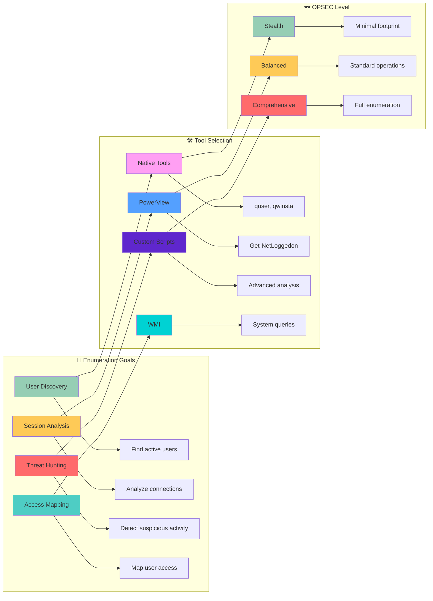

[Prev: 11_SOAPHound_Enumeration.md](./11_SOAPHound_Enumeration.md) | [Up: Index](./00_Enumeration_Index.md) | [Hub](./00_Methodology_Hub.md) | [Next: 13_Active_Session_Discovery.md](./13_Active_Session_Discovery.md)

# 🎭 Session Enumeration Techniques - Master Index

> **⚠️ CRITICAL TOOL REQUIREMENT**: **Invisi-Shell** is mandatory for production environments to ensure stealth operations and avoid detection. See [Tool Arsenal](./01_Tool_Setup_Loading.md#-invisi-shell-complete-setup) for setup instructions.

> **🎯 PURPOSE**: This is your **session enumeration foundation** for Active Directory discovery. Session enumeration reveals active user sessions, RDP connections, SMB sessions, and terminal services across the domain, providing critical intelligence for lateral movement, privilege escalation, and attack path planning.

[🔄 Back to Master Index](./00_Enumeration_Index.md) | [🔍 Previous: SOAPHound Enumeration](./11_SOAPHound_Enumeration.md) | [Next: Active Session Discovery](./13_Active_Session_Discovery.md)

---

## 📋 **QUICK START SESSION DISCOVERY**

| **Phase** | **Tool** | **Command** | **Purpose** | **OPSEC Level** |
|-----------|----------|-------------|-------------|------------------|
| **1. Basic Sessions** | `quser` (Native) | `quser /server:target` | Basic RDP session discovery | 🟢 Stealth |
| **2. Network Sessions** | `Get-NetSession` (PowerView) | `Get-NetSession -ComputerName "target"` | SMB/File share sessions | 🟡 Balanced |
| **3. Active Logons** | `Get-NetLoggedon` (PowerView) | `Get-NetLoggedon -ComputerName "target"` | Active user sessions | 🟡 Balanced |
| **4. User Hunting** | `Invoke-UserHunter` (PowerView) | `Invoke-UserHunter -UserName "admin"` | Comprehensive user location | 🟠 Noisy |

## 🎭 **AT-A-GLANCE: SESSION ENUMERATION ESSENTIALS**

**What This Technique Reveals:**
- Active user sessions and login states across domain computers
- RDP connections and remote access patterns
- SMB sessions and file share access
- Terminal Services sessions and interactive logins
- User behavior patterns and session timing

**Primary Use Cases:**
- Lateral movement planning and execution
- Privilege escalation target identification
- User activity monitoring and threat hunting
- Attack path mapping and target prioritization
- Session hijacking and credential theft opportunities

**Execution Speed:**
- **Stealth Mode**: 5-10 seconds between queries with jitter
- **Balanced Mode**: 3-7 seconds between queries
- **Lab Mode**: 1-3 seconds between queries

## 🧭 **PIVOT MATRIX: STRATEGIC NEXT STEPS**

| **Finding** | **Immediate Pivot** | **Strategic Goal** | **Tool/Technique** |
|--------------|---------------------|-------------------|-------------------|
| **Active User Sessions** | [05_User_Enumeration.md](./05_User_Enumeration.md) | User analysis and targeting | `Get-NetLoggedon` |
| **RDP Connections** | [14_RDP_Session_Enumeration.md](./14_RDP_Session_Enumeration.md) | Remote access analysis | `Get-NetRDPSession` |
| **SMB Sessions** | [17_File_Share_Enumeration.md](./17_File_Share_Enumeration.md) | File share access mapping | `Get-NetSession` |
| **Terminal Sessions** | [15_Terminal_Services_Enumeration.md](./15_Terminal_Services_Enumeration.md) | TS session analysis | `Get-TerminalServicesSessions` |
| **Suspicious Sessions** | [09_ACL_Enumeration.md](./09_ACL_Enumeration.md) | Permission investigation | `Get-DomainObjectAcl` |

---

## 🛠️ **COMPREHENSIVE ENUMERATION TOOLS**

### **🔧 Microsoft-Signed Tools**
- **Microsoft AD Module**: Session-related computer discovery and analysis
- **Get-ADComputer**: Computer object enumeration for session targeting
- **Get-ADUser**: User object enumeration for session analysis
- **Get-ADObject**: General AD object enumeration for session context
- **Get-ADDomain**: Domain information for session enumeration scope
- **Get-ADReplicationSite**: AD site topology for session enumeration targeting

### **⚔️ Offensive Tools (PowerView, etc.)**
- **PowerView Suite**: Comprehensive session enumeration and discovery
- **Get-NetLoggedon**: PowerView active user session enumeration
- **Get-NetSession**: PowerView SMB session enumeration
- **Get-NetRDPSession**: PowerView RDP session enumeration
- **Invoke-UserHunter**: PowerView comprehensive user hunting
- **Get-DomainComputer**: PowerView computer enumeration for session targeting

### **🔴 Red Team Enumeration Tools**

#### **🔍 PowerView - Session Enumeration**
**Purpose**: PowerShell session enumeration and user hunting
**Setup**: Download PowerView.ps1 from GitHub
**Primary Commands**:
```powershell
# Basic session enumeration
Get-NetLoggedon -ComputerName "DC01.corp.local"               # Active user sessions
Get-NetSession -ComputerName "DC01.corp.local"                 # SMB sessions
Get-NetRDPSession -ComputerName "DC01.corp.local"              # RDP sessions

# Advanced session enumeration
Get-NetLoggedon -ComputerName "DC01.corp.local" -Credential $cred  # Custom credentials
Get-NetSession -ComputerName "DC01.corp.local" -Credential $cred   # Custom credentials
Get-NetRDPSession -ComputerName "DC01.corp.local" -Credential $cred  # Custom credentials

# User hunting and session correlation
Invoke-UserHunter -UserName "Administrator"                    # User location hunting
Invoke-UserHunter -UserName "Administrator" -ComputerName "DC01.corp.local"  # Scoped hunting
Invoke-UserHunter -UserName "Administrator" -OU "OU=IT,DC=corp,DC=local"  # OU-scoped hunting
```

#### **🔍 SharpView - Compiled PowerView (C#)**
**Purpose**: C# version of PowerView without PowerShell execution
**Setup**: Download SharpView.exe from GitHub
**Primary Commands**:
```cmd
# Basic session enumeration
SharpView.exe Get-NetLoggedon -ComputerName DC01.corp.local    # Active user sessions
SharpView.exe Get-NetSession -ComputerName DC01.corp.local     # SMB sessions
SharpView.exe Get-NetRDPSession -ComputerName DC01.corp.local  # RDP sessions

# Advanced session enumeration
SharpView.exe Get-NetLoggedon -ComputerName DC01.corp.local -Credential $cred  # Custom credentials
SharpView.exe Get-NetSession -ComputerName DC01.corp.local -Credential $cred   # Custom credentials
SharpView.exe Get-NetRDPSession -ComputerName DC01.corp.local -Credential $cred  # Custom credentials
```

#### **🧭 Seatbelt - The C# System Situational Awareness Tool**
**Purpose**: C# system situational awareness including session details
**Setup**: Download Seatbelt executable from GitHub
**Primary Commands**:
```cmd
# Basic system enumeration
Seatbelt.exe all                                               # All enumeration modules
Seatbelt.exe all -q                                            # Quiet mode
Seatbelt.exe all -o results.txt                               # Output to file

# Session-specific enumeration
Seatbelt.exe LoggedOnUsers                                     # Logged on users
Seatbelt.exe LoggedOnUsers -q                                  # Logged on users quiet mode
Seatbelt.exe LoggedOnUsers -o loggedon_users.txt               # Logged on users output

# Network session enumeration
Seatbelt.exe NetworkConnections                                # Network connections
Seatbelt.exe NetworkConnections -q                             # Network connections quiet mode
Seatbelt.exe NetworkConnections -o network_connections.txt     # Network connections output

# Process and service enumeration
Seatbelt.exe Processes                                         # Process enumeration
Seatbelt.exe Services                                          # Service enumeration
Seatbelt.exe Processes -o processes.txt                        # Process output
Seatbelt.exe Services -o services.txt                          # Service output
```

#### **🔍 CrackMapExec (CME) - The Swiss Army Knife**
**Purpose**: Swiss army knife for SMB/AD exploitation
**Setup**: `pip install crackmapexec`
**Primary Commands**:
```bash
# Basic session enumeration
crackmapexec smb targets.txt                                   # SMB enumeration
crackmapexec smb targets.txt -u username -p password           # Authenticated enumeration
crackmapexec smb targets.txt -u username -p password --sessions  # Session enumeration

# Advanced session options
crackmapexec smb targets.txt -u username -p password --sessions --loggedon-users  # Logged on users
crackmapexec smb targets.txt -u username -p password --sessions --shares          # Share enumeration
crackmapexec smb targets.txt -u username -p password --sessions --processes       # Process enumeration

# Session analysis
crackmapexec smb targets.txt -u username -p password --sessions --users           # User enumeration
crackmapexec smb targets.txt -u username -p password --sessions --groups          # Group enumeration
crackmapexec smb targets.txt -u username -p password --sessions --local-auth      # Local authentication
```

### **🛠️ Alternative Enumeration Tools**

#### **🔍 LDAPDomainDump - The Python LDAP Enumeration Tool**
**Purpose**: Python tool for dumping AD info over LDAP
**Setup**: `pip install ldapdomaindump` or download from GitHub
**Primary Commands**:
```bash
# Basic LDAP enumeration
ldapdomaindump target.com                                   # Basic enumeration
ldapdomaindump target.com -u username -p password           # Authenticated enumeration
ldapdomaindump target.com -u username -p password -o output_dir  # Custom output

# LDAP server specification
ldapdomaindump target.com -s ldap://192.168.1.10            # Specific LDAP server
ldapdomaindump target.com -s ldaps://192.168.1.10           # LDAPS connection
ldapdomaindump target.com -s ldap://192.168.1.10:389        # Custom port

# Output formats
ldapdomaindump target.com -o output_dir --format html       # HTML output
ldapdomaindump target.com -o output_dir --format json       # JSON output
ldapdomaindump target.com -o output_dir --format csv        # CSV output
```

#### **🌐 Native Windows Session Tools**
**Purpose**: Built-in Windows session enumeration capabilities
**Setup**: Built into Windows
**Primary Commands**:
```cmd
# quser commands
quser /server:target                                          # Basic RDP session enumeration
quser username /server:target                                 # Specific user session
quser /server:target /domain:corp.local                       # Domain-specific session

# qwinsta commands
qwinsta /server:target                                        # Terminal Services session enumeration
qwinsta sessionname /server:target                            # Specific session enumeration
qwinsta /server:target /domain:corp.local                     # Domain-specific TS session

# net commands
net session                                                    # Local SMB session enumeration
net session \\target                                          # Remote SMB session enumeration
net session /delete                                           # Delete local SMB sessions

# PowerShell native commands
Get-WmiObject -Class Win32_ComputerSystem                     # WMI computer enumeration
Get-WmiObject -Class Win32_OperatingSystem                    # WMI OS enumeration
Get-WmiObject -Class Win32_Process                            # WMI process enumeration
```

#### **🔍 Online Session Enumeration Tools**
**Purpose**: Web-based session enumeration and reconnaissance
**Setup**: Web browser access
**Primary Tools**:
- **Microsoft Docs**: Official session enumeration documentation
- **Security Research**: Session enumeration security analysis
- **OSINT frameworks**: Comprehensive open-source intelligence
- **Community Resources**: Session enumeration guides and examples

**Usage Examples**:
```bash
# Microsoft Docs
# Visit https://docs.microsoft.com/en-us/windows-server/administration/windows-commands/
# Search for specific session enumeration topics and examples

# Security Research
# Search for session enumeration techniques and security analysis
# Use tools like Google, Bing, or specialized search engines

# Community Resources
# Visit security forums and communities for session enumeration examples
# Access shared tools and scripts for session analysis
```

### **🔍 Specialized Tools**

#### **🌐 Session Discovery Tools**
- **PowerView**: Primary session enumeration framework
- **SharpView**: C# session enumeration alternative
- **Seatbelt**: System situational awareness
- **Custom Scripts**: Advanced session analysis automation

#### **🔗 Session Analysis Tools**
- **PowerView**: Session data analysis and correlation
- **SharpView**: C# session analysis capabilities
- **Custom Scripts**: Advanced session pattern analysis
- **Data visualization tools**: Session mapping and visualization

#### **📋 Session Export Tools**
- **PowerView**: CSV export capabilities
- **SharpView**: Data export functionality
- **Custom Scripts**: Advanced export format automation
- **Data conversion tools**: Format conversion and transformation

#### **🎯 Session Attack Tools**
- **PowerView**: Session-based attack planning
- **SharpView**: C# attack execution
- **Custom Scripts**: Advanced attack automation
- **Exploitation tools**: Session-based privilege escalation

---

## 🎭 **PERSONAS: REAL-WORLD EXECUTION PROFILES**

### **🕵️ Persona 1: "Stealth Consultant" (Limited User)**
- **Access Level**: Standard domain user
- **OPSEC Priority**: Maximum stealth, minimal detection
- **Tool Preference**: Native Windows tools, minimal PowerView usage
- **Execution Style**: Slow, methodical, scoped queries
- **Target Focus**: Basic session discovery, organizational structure

### **⚡ Persona 2: "Power User" (Elevated Access)**
- **Access Level**: Local admin on workstation
- **OPSEC Priority**: Balanced stealth, comprehensive enumeration
- **Tool Preference**: PowerView, selective native tools
- **Execution Style**: Moderate speed, targeted enumeration
- **Target Focus**: Session mapping, user hunting, privilege analysis

### **👑 Persona 3: "Domain Admin" (Full Access)**
- **Access Level**: Domain administrative privileges
- **OPSEC Priority**: Minimal stealth, maximum information gathering
- **Tool Preference**: Full PowerView suite, comprehensive tools
- **Execution Style**: Fast, comprehensive, full enumeration
- **Target Focus**: Complete session landscape, attack path mapping

## 🎨 **VISUAL MASTERY: SESSION ENUMERATION ARCHITECTURE**

### **Session Enumeration Data Flow Architecture**

```mermaid
graph TB
    subgraph "🎯 ENUMERATION SOURCES"
        A[Domain Computers] --> A1[Workstations]
        A --> A2[Servers]
        A --> A3[Domain Controllers]
        B[Session Types] --> B1[Interactive Logins]
        B --> B2[RDP Sessions]
        B --> B3[SMB Sessions]
        B --> B4[Terminal Services]
    end
    
    subgraph "🔍 ENUMERATION METHODS"
        C[Microsoft AD Module] --> C1[Get-ADComputer]
        C --> C2[Get-ADUser]
        D[PowerView Suite] --> D1[Get-NetLoggedon]
        D --> D2[Get-NetSession]
        D --> D3[Invoke-UserHunter]
        E[Native Windows Tools] --> E1[quser.exe]
        E --> E2[qwinsta.exe]
        E --> E3[net.exe]
    end
    
    subgraph "📊 DATA PROCESSING"
        F[Session Data] --> F1[User Information]
        F --> F2[Computer Details]
        F --> F3[Connection Types]
        F --> F4[Timing Analysis]
        G[Pattern Analysis] --> G1[User Behavior]
        G --> G2[Session Patterns]
        G --> G3[Suspicious Activity]
    end
    
    subgraph "🎯 STRATEGIC OUTPUT"
        H[Lateral Movement] --> H1[Target Selection]
        H --> H2[Privilege Escalation]
        I[Attack Planning] --> I1[Path Mapping]
        I --> I2[Timing Optimization]
        J[Threat Hunting] --> J1[Anomaly Detection]
        J --> J2[Incident Response]
    end
    
    A --> C
    B --> D
    A --> E
    
  C --> F
  D --> F
  E --> F
  
    F --> G
    G --> H
    G --> I
    G --> J
  
  style A fill:#ff6b6b
  style B fill:#4ecdc4
  style C fill:#45b7d1
  style D fill:#96ceb4
  style E fill:#feca57
  style F fill:#ff9ff3
  style G fill:#54a0ff
  style H fill:#5f27cd
  style I fill:#00d2d3
    style J fill:#ff6b6b
```



### **Session Enumeration Decision Matrix**



## 🏭 **LAB vs PRODUCTION: EXECUTION PROFILES**

### **🧪 Lab Environment (Detection Not a Concern)**
```powershell
# Comprehensive session enumeration with aggressive timing
$allSessions = @()

# Enumerate all computers in domain
$computers = Get-ADComputer -Filter * -Properties Name,OperatingSystem

foreach($computer in $computers) {
    try {
        # Get active sessions
        $loggedon = Get-NetLoggedon -ComputerName $computer.Name -ErrorAction SilentlyContinue
        $sessions = Get-NetSession -ComputerName $computer.Name -ErrorAction SilentlyContinue
        
        if($loggedon -or $sessions) {
            $allSessions += [PSCustomObject]@{
                Computer = $computer.Name
                LoggedOnUsers = $loggedon
                SMBUsers = $sessions
                OS = $computer.OperatingSystem
            }
        }
        
        Start-Sleep -Seconds 1
    }
    catch {
        Write-Warning "Failed to query $($computer.Name): $($_.Exception.Message)"
    }
}

# Export comprehensive data
$allSessions | Export-Csv "sessions_comprehensive_lab.csv" -NoTypeInformation
```

### **🏢 Production Environment (Stealth Operations)**
```powershell
# Stealthy, targeted session enumeration with jitter
$targetComputers = @("dc01.corp.local", "sql01.corp.local", "web01.corp.local")
$targetUsers = @("admin", "ceo", "security")

$sessionData = @()

# Stealth session enumeration
foreach($computer in $targetComputers) {
    try {
        # Get active sessions with minimal properties
        $loggedon = Get-NetLoggedon -ComputerName $computer -ErrorAction SilentlyContinue | Select-Object UserName,ComputerName,LogonTime
        
        if($loggedon) {
            $sessionData += [PSCustomObject]@{
                Computer = $computer
                ActiveUsers = $loggedon
                QueryTime = Get-Date
            }
            Write-Host "Found active sessions on $computer" -ForegroundColor Green
        }
        
        # Random delay with jitter for stealth
        $delay = Get-Random -Minimum 5 -Maximum 10
        Start-Sleep -Seconds $delay
    }
    catch {
        Write-Warning "Failed to query $computer`: $($_.Exception.Message)"
    }
}

# Export targeted data
$sessionData | Export-Csv "sessions_targeted_production.csv" -NoTypeInformation
```

## 🛡️ **DETECTION, OPSEC & CLEANUP**

### **🔍 Detection Indicators**

#### **Event Log Monitoring**
- **Event ID 4624**: Successful logon events
- **Event ID 4625**: Failed logon attempts
- **Event ID 4778**: RDP reconnection events
- **Event ID 4779**: RDP disconnection events
- **Event ID 4647**: User logoff events

#### **Network Monitoring**
```powershell
# Common detection patterns
$detectionPatterns = @{
    "Session_Query_Spike" = "Multiple session queries to multiple hosts within short timeframe"
    "RPC_Session_Enumeration" = "RPC calls to NetWkstaUserEnum/LSA functions"
    "SMB_Session_Discovery" = "NetSessionEnum calls to multiple file servers"
    "RDP_Session_Queries" = "WinStation queries to multiple systems"
}

# Mitigation strategies
$mitigationStrategies = @{
    "Scoped_Queries" = "Limit session queries to specific targets only"
    "Timing_Control" = "Implement jitter and delays between queries"
    "Source_Validation" = "Verify session query sources are authorized"
    "Volume_Limiting" = "Cap session query volume per session"
}
```

### **🔒 OPSEC Best Practices**

#### **Stealth Operations**
- **Use Native Tools First**: Leverage built-in Windows commands for initial discovery
- **Implement Jitter**: Use random delays between queries (5-10 seconds production, 1-3 seconds lab)
- **Scope Queries**: Limit enumeration to specific computers or user groups
- **Avoid Domain Controllers**: Don't query DCs for session information unless necessary

#### **Timing and Jitter Control**
```powershell
# Centralized timing profile for OPSEC
$Profile = @{
    Stealth = @{
        MinDelay = 5
        MaxDelay = 10
        Jitter = $true
        QueryLimit = 25
    }
    Balanced = @{
        MinDelay = 3
        MaxDelay = 7
        Jitter = $true
        QueryLimit = 50
    }
    Lab = @{
        MinDelay = 1
        MaxDelay = 3
        Jitter = $false
        QueryLimit = 1000
    }
}

# Apply timing profile
function Invoke-StealthSessionQuery {
    param(
        [scriptblock]$Query,
        [string]$ProfileType = "Stealth"
    )
    
    $timing = $Profile[$ProfileType]
    
    # Execute query
    $result = & $Query
    
    # Apply delay with jitter
    if($timing.Jitter) {
        $delay = Get-Random -Minimum $timing.MinDelay -Maximum $timing.MaxDelay
        Start-Sleep -Seconds $delay
    } else {
        Start-Sleep -Seconds $timing.MinDelay
    }
    
    return $result
}

# Example usage
$sessions = Invoke-StealthSessionQuery -Query { Get-NetLoggedon -ComputerName "target" } -ProfileType "Stealth"
```

### **🧹 Cleanup Procedures**

#### **File Cleanup**
```powershell
# Remove session enumeration artifacts
function Invoke-SessionCleanup {
    param(
        [string]$Path = "."
    )
    
    $artifacts = @(
        "sessions*.csv",
        "sessions*.json",
        "sessions*.xml",
        "session_enumeration*.txt",
        "user_hunting*.log"
    )
    
    foreach($artifact in $artifacts) {
        $files = Get-ChildItem -Path $Path -Filter $artifact -Recurse -ErrorAction SilentlyContinue
        foreach($file in $files) {
            try {
                Remove-Item $file.FullName -Force -ErrorAction SilentlyContinue
                Write-Host "Removed: $($file.Name)" -ForegroundColor Green
            }
            catch {
                Write-Warning "Failed to remove: $($file.Name)"
            }
        }
    }
    
    Write-Host "Session cleanup completed" -ForegroundColor Cyan
}

# Execute cleanup
Invoke-SessionCleanup

# Exit Invisi-Shell if active
if($env:INVISI_SHELL_ACTIVE -eq $true) {
    Write-Host "Exiting Invisi-Shell..." -ForegroundColor Yellow
    exit
}
```

#### **Session Cleanup**
```powershell
# Clear session-related variables and functions
function Clear-SessionEnumeration {
    $sessionVariables = @(
        "allSessions",
        "sessionData",
        "loggedon",
        "sessions",
        "targetComputers",
        "targetUsers"
    )
    
    foreach($var in $sessionVariables) {
        if(Get-Variable -Name $var -ErrorAction SilentlyContinue) {
            Remove-Variable -Name $var -Force -ErrorAction SilentlyContinue
            Write-Host "Cleared variable: $var" -ForegroundColor Green
        }
    }
    
    # Clear session functions
    $sessionFunctions = @(
        "Invoke-StealthSessionQuery",
        "Invoke-SessionCleanup",
        "Clear-SessionEnumeration"
    )
    
    foreach($func in $sessionFunctions) {
        if(Get-Command -Name $func -ErrorAction SilentlyContinue) {
            Remove-Item "function:$func" -Force -ErrorAction SilentlyContinue
            Write-Host "Cleared function: $func" -ForegroundColor Green
        }
    }
    
    Write-Host "Session enumeration cleanup completed" -ForegroundColor Cyan
}

# Execute session cleanup
Clear-SessionEnumeration
```

## 🔗 **CROSS-REFERENCES & INTEGRATION**

### **📚 Related Enumeration Techniques**
- **[05_User_Enumeration.md](./05_User_Enumeration.md)**: User discovery and analysis
- **[07_Computer_Enumeration.md](./07_Computer_Enumeration.md)**: Computer enumeration and targeting
- **[14_RDP_Session_Enumeration.md](./14_RDP_Session_Enumeration.md)**: RDP session analysis
- **[15_Terminal_Services_Enumeration.md](./15_Terminal_Services_Enumeration.md)**: Terminal Services enumeration
- **[17_File_Share_Enumeration.md](./17_File_Share_Enumeration.md)**: File share access mapping

### **🛠️ Tool Dependencies**
- **[01_Tool_Setup_Loading.md](./01_Tool_Setup_Loading.md)**: Invisi-Shell setup and stealth operations
- **[PowerView Setup](./01_Tool_Setup_Loading.md#-powerview-complete-setup)**: PowerView loading and configuration
- **[Microsoft AD Module](./01_Tool_Setup_Loading.md#-microsoft-ad-module-complete-setup)**: AD cmdlet setup

### **🎯 Attack Path Integration**
- **Session Discovery** → **User Enumeration** → **Privilege Escalation**
- **RDP Session Analysis** → **Remote Access** → **Lateral Movement**
- **SMB Session Discovery** → **File Share Access** → **Data Exfiltration**
- **Terminal Session Analysis** → **Interactive Access** → **Command Execution**

### **🔄 Navigation Flow**
- **Previous**: [11_SOAPHound_Enumeration.md](./11_SOAPHound_Enumeration.md) - SOAP-based AD enumeration
- **Current**: Session-based enumeration techniques and methodologies
- **Next**: [13_Active_Session_Discovery.md](./13_Active_Session_Discovery.md) - Active session discovery techniques

### **📊 TOOL INTEGRATION MATRIX**

| **Tool Category** | **Use Case** | **OPSEC Level** | **Command Example** |
|-------------------|--------------|------------------|---------------------|
| **Microsoft AD Module** | Computer discovery for session targeting | 🟢 High | `Get-ADComputer -Filter *` |
| **PowerView Suite** | Session enumeration and user hunting | 🟡 Medium | `Get-NetLoggedon -ComputerName "target"` |
| **Native Windows Tools** | Basic session discovery, stealth operations | 🟢 High | `quser /server:target` |

### **🔄 TOOL-SPECIFIC WORKFLOWS**

#### **Stealth Production Workflow**
1. **Load Invisi-Shell** for AMSI bypass and logging evasion
2. **Use Native Tools** for initial session discovery
3. **Implement jitter** with 5-10 second delays between queries
4. **Scope queries** to specific targets and user groups
5. **Clean up artifacts** and exit Invisi-Shell

#### **Lab Environment Workflow**
1. **Load PowerView** for comprehensive session enumeration
2. **Use aggressive timing** with 1-3 second delays
3. **Export comprehensive data** for analysis
4. **Test advanced techniques** and user hunting
5. **Document findings** for attack path planning

---

## 📚 **NEXT STEPS**

After mastering Session Enumeration, continue with:
- **Active Session Discovery**: See [13_Active_Session_Discovery.md](./13_Active_Session_Discovery.md)
- **RDP Session Enumeration**: See [14_RDP_Session_Enumeration.md](./14_RDP_Session_Enumeration.md)
- **Terminal Services Enumeration**: See [15_Terminal_Services_Enumeration.md](./15_Terminal_Services_Enumeration.md)
- **File Share Enumeration**: See [17_File_Share_Enumeration.md](./17_File_Share_Enumeration.md)

---

[Prev: 11_SOAPHound_Enumeration.md](./11_SOAPHound_Enumeration.md) | [Up: Index](./00_Enumeration_Index.md) | [Hub](./00_Methodology_Hub.md) | [Next: 13_Active_Session_Discovery.md](./13_Active_Session_Discovery.md)

## Command Explanations (parameter-by-parameter)

### quser
- Command: `quser /server:target`
- Parameters:
  - `/server:target`: specify remote system; why it works: queries Terminal Services API on target; common error: Access Denied without rights; workaround: run from privileged context or target that permits query.

### qwinsta
- Command: `qwinsta /server:target`
- Parameters:
  - `/server:target`: remote query; why it works: enumerates WinStation sessions; common error: RPC unavailable (firewall); fix: ensure RPC/TS ports open.

### Get-NetLoggedon (PowerView)
- Command: `Get-NetLoggedon -ComputerName dc01.corp.local`
- Parameters:
  - `-ComputerName`: target host; why it works: queries NetWkstaUserEnum/LSA; common error: RPC not reachable; fix: try nearest host or use native tools.

### Get-NetSession (PowerView)
- Command: `Get-NetSession -ComputerName dc01.corp.local`
- Parameters:
  - `-ComputerName`: host with SMB sessions; why it works: queries NetSessionEnum (SMB server); common error: SMB disabled or blocked; fix: use file servers or endpoints with open 445.

### Invoke-UserHunter (PowerView)
- Command: `Invoke-UserHunter -UserName alice.hr -ComputerName dc01.corp.local`
- Parameters:
  - `-UserName`: user of interest; `-ComputerName`: optional scope; why it works: correlates sessions and group membership to locate users; common error: noisy across large domains; fix: scope via `-ComputerName` or OU.

## Lab vs Production Profiles
- Stealth: native tools only (quser/qwinsta), 5–10s delay, scoped targets.
- Balanced: add PowerView (Get-NetLoggedon/Get-NetSession), 3–7s delay, OU/site scoping.
- Lab: broad sweeps, 1–3s delay, enumerate all categories.

## Detection (concise)
- Event IDs: 4624/4625 (logon), 4778/4779 (RDP reconnect/disconnect).
- Network: spikes in RPC/SMB calls to many hosts.
- Heuristics: repeated WinStation queries from a workstation.

## OPSEC (concise)
- Prefer native tools first; add jitter; cache results; avoid DCs as targets; run during business hours.

## Cleanup
```powershell
Remove-Item sessions_*.csv -ErrorAction SilentlyContinue
```

## Cross‑References
- Next: [13_Active_Session_Discovery.md](./13_Active_Session_Discovery.md)
- Related: [14_RDP_Session_Enumeration.md](./14_RDP_Session_Enumeration.md), [17_File_Share_Enumeration.md](./17_File_Share_Enumeration.md), [05_User_Enumeration.md](./05_User_Enumeration.md)

## Stealth & Loading
Use [01_Tool_Setup_Loading.md](./01_Tool_Setup_Loading.md) for stealth session and tool prep. This index focuses on session techniques only.
