[Prev: 12_Session_Enumeration_Index.md](./12_Session_Enumeration_Index.md) | [Up: Index](./00_Enumeration_Index.md) | [Hub](./00_Methodology_Hub.md) | [Next: 14_RDP_Session_Enumeration.md](./14_RDP_Session_Enumeration.md)

# 🔍 Active Session Discovery - Real-Time User Activity Mapping

> **⚠️ CRITICAL TOOL REQUIREMENT**: **Invisi-Shell** is mandatory for production environments to ensure stealth operations and avoid detection. See [Tool Arsenal](./01_Tool_Setup_Loading.md#-invisi-shell-complete-setup) for setup instructions.

> **🎯 PURPOSE**: This is your **active session discovery foundation** for Active Directory enumeration. Active session discovery reveals real-time user activity, login states, and connection patterns across domain computers, providing critical intelligence for lateral movement, privilege escalation, and attack path planning.

[🔄 Back to Master Index](./00_Enumeration_Index.md) | [🔍 Previous: Session Enumeration Index](./12_Session_Enumeration_Index.md) | [Next: RDP Session Enumeration](./14_RDP_Session_Enumeration.md)

---

## 📋 **QUICK START ACTIVE SESSION DISCOVERY**

| **Phase** | **Tool** | **Command** | **Purpose** | **OPSEC Level** |
|-----------|----------|-------------|-------------|------------------|
| **1. Basic Discovery** | `quser` (Native) | `quser /server:target` | Basic RDP session discovery | 🟢 Stealth |
| **2. Active Users** | `Get-NetLoggedon` (PowerView) | `Get-NetLoggedon -ComputerName "target"` | Active user enumeration | 🟡 Balanced |
| **3. Network Sessions** | `Get-NetSession` (PowerView) | `Get-NetSession -ComputerName "target"` | SMB/File share sessions | 🟡 Balanced |
| **4. User Hunting** | `Invoke-UserHunter` (PowerView) | `Invoke-UserHunter -UserName "admin"` | Comprehensive user location | 🟠 Noisy |

## 🎭 **AT-A-GLANCE: ACTIVE SESSION DISCOVERY ESSENTIALS**

**What This Technique Reveals:**
- Real-time user login states across domain computers
- Active network sessions and file share access
- User activity patterns and system usage
- High-value target locations and session timing
- Lateral movement opportunities and attack vectors

**Primary Use Cases:**
- Real-time user activity monitoring
- High-value target location and targeting
- Lateral movement planning and execution
- Privilege escalation target identification
- Threat hunting and incident response

**Execution Speed:**
- **Stealth Mode**: 5-10 seconds between queries with jitter
- **Balanced Mode**: 3-7 seconds between queries
- **Lab Mode**: 1-3 seconds between queries

## 🧭 **PIVOT MATRIX: STRATEGIC NEXT STEPS**

| **Finding** | **Immediate Pivot** | **Strategic Goal** | **Tool/Technique** |
|--------------|---------------------|-------------------|-------------------|
| **Active User Sessions** | [05_User_Enumeration.md](./05_User_Enumeration.md) | User analysis and targeting | `Get-NetLoggedon` |
| **RDP Connections** | [14_RDP_Session_Enumeration.md](./14_RDP_Session_Enumeration.md) | Remote access analysis | `Get-NetRDPSession` |
| **SMB Sessions** | [17_File_Share_Enumeration.md](./17_File_Share_Enumeration.md) | File share access mapping | `Get-NetSession` |
| **Terminal Sessions** | [15_Terminal_Services_Enumeration.md](./15_Terminal_Services_Enumeration.md) | TS session analysis | `Get-TerminalServicesSessions` |
| **Suspicious Sessions** | [09_ACL_Enumeration.md](./09_ACL_Enumeration.md) | Permission investigation | `Get-DomainObjectAcl` |

---

## 🛠️ **COMPREHENSIVE ENUMERATION TOOLS**

### **🔧 Microsoft-Signed Tools**
- **Microsoft AD Module**: Active session discovery and computer enumeration
- **Get-ADComputer**: Computer object enumeration for session targeting
- **Get-ADUser**: User object enumeration for session analysis
- **Get-ADObject**: General AD object enumeration for session context
- **Get-ADDomain**: Domain information for session enumeration scope
- **Get-ADReplicationSite**: AD site topology for session enumeration targeting

### **⚔️ Offensive Tools (PowerView, etc.)**
- **PowerView Suite**: Comprehensive active session discovery and enumeration
- **Get-NetLoggedon**: PowerView active user session enumeration
- **Get-NetSession**: PowerView SMB session enumeration
- **Get-NetRDPSession**: PowerView RDP session enumeration
- **Invoke-UserHunter**: PowerView comprehensive user hunting
- **Get-DomainComputer**: PowerView computer enumeration for session targeting

### **🔴 Red Team Enumeration Tools**

#### **🔍 PowerView - Active Session Discovery**
**Purpose**: PowerShell active session discovery and user hunting
**Setup**: Download PowerView.ps1 from GitHub
**Primary Commands**:
```powershell
# Basic active session discovery
Get-NetLoggedon -ComputerName "DC01.corp.local"               # Active user sessions
Get-NetSession -ComputerName "DC01.corp.local"                 # SMB sessions
Get-NetRDPSession -ComputerName "DC01.corp.local"              # RDP sessions

# Advanced session discovery
Get-NetLoggedon -ComputerName "DC01.corp.local" -Credential $cred  # Custom credentials
Get-NetSession -ComputerName "DC01.corp.local" -Credential $cred   # Custom credentials
Get-NetRDPSession -ComputerName "DC01.corp.local" -Credential $cred  # Custom credentials

# User hunting and session correlation
Invoke-UserHunter -UserName "Administrator"                    # User location hunting
Invoke-UserHunter -UserName "Administrator" -ComputerName "DC01.corp.local"  # Scoped hunting
Invoke-UserHunter -UserName "Administrator" -OU "OU=IT,DC=corp,DC=local"  # OU-scoped hunting
```

#### **🔍 SharpView - Compiled PowerView (C#)**
**Purpose**: C# version of PowerView without PowerShell execution
**Setup**: Download SharpView.exe from GitHub
**Primary Commands**:
```cmd
# Basic active session discovery
SharpView.exe Get-NetLoggedon -ComputerName DC01.corp.local    # Active user sessions
SharpView.exe Get-NetSession -ComputerName DC01.corp.local     # SMB sessions
SharpView.exe Get-NetRDPSession -ComputerName DC01.corp.local  # RDP sessions

# Advanced session discovery
SharpView.exe Get-NetLoggedon -ComputerName DC01.corp.local -Credential $cred  # Custom credentials
SharpView.exe Get-NetSession -ComputerName DC01.corp.local -Credential $cred   # Custom credentials
SharpView.exe Get-NetRDPSession -ComputerName DC01.corp.local -Credential $cred  # Custom credentials
```

#### **🧭 Seatbelt - The C# System Situational Awareness Tool**
**Purpose**: C# system situational awareness including active session details
**Setup**: Download Seatbelt executable from GitHub
**Primary Commands**:
```cmd
# Basic system enumeration
Seatbelt.exe all                                               # All enumeration modules
Seatbelt.exe all -q                                            # Quiet mode
Seatbelt.exe all -o results.txt                               # Output to file

# Session-specific enumeration
Seatbelt.exe LoggedOnUsers                                     # Logged on users
Seatbelt.exe LoggedOnUsers -q                                  # Logged on users quiet mode
Seatbelt.exe LoggedOnUsers -o loggedon_users.txt               # Logged on users output

# Network session enumeration
Seatbelt.exe NetworkConnections                                # Network connections
Seatbelt.exe NetworkConnections -q                             # Network connections quiet mode
Seatbelt.exe NetworkConnections -o network_connections.txt     # Network connections output

# Process and service enumeration
Seatbelt.exe Processes                                         # Process enumeration
Seatbelt.exe Services                                          # Service enumeration
Seatbelt.exe Processes -o processes.txt                        # Process output
Seatbelt.exe Services -o services.txt                          # Service output
```

#### **🔍 CrackMapExec (CME) - The Swiss Army Knife**
**Purpose**: Swiss army knife for SMB/AD exploitation and session discovery
**Setup**: `pip install crackmapexec`
**Primary Commands**:
```bash
# Basic session discovery
crackmapexec smb targets.txt                                   # SMB enumeration
crackmapexec smb targets.txt -u username -p password           # Authenticated enumeration
crackmapexec smb targets.txt -u username -p password --sessions  # Session enumeration

# Advanced session options
crackmapexec smb targets.txt -u username -p password --sessions --loggedon-users  # Logged on users
crackmapexec smb targets.txt -u username -p password --sessions --shares          # Share enumeration
crackmapexec smb targets.txt -u username -p password --sessions --processes       # Process enumeration

# Session analysis
crackmapexec smb targets.txt -u username -p password --sessions --users           # User enumeration
crackmapexec smb targets.txt -u username -p password --sessions --groups          # Group enumeration
crackmapexec smb targets.txt -u username -p password --sessions --local-auth      # Local authentication
```

### **🛠️ Alternative Enumeration Tools**

#### **🔍 LDAPDomainDump - The Python LDAP Enumeration Tool**
**Purpose**: Python tool for dumping AD info over LDAP
**Setup**: `pip install ldapdomaindump` or download from GitHub
**Primary Commands**:
```bash
# Basic LDAP enumeration
ldapdomaindump target.com                                   # Basic enumeration
ldapdomaindump target.com -u username -p password           # Authenticated enumeration
ldapdomaindump target.com -u username -p password -o output_dir  # Custom output

# LDAP server specification
ldapdomaindump target.com -s ldap://192.168.1.10            # Specific LDAP server
ldapdomaindump target.com -s ldaps://192.168.1.10           # LDAPS connection
ldapdomaindump target.com -s ldap://192.168.1.10:389        # Custom port

# Output formats
ldapdomaindump target.com -o output_dir --format html       # HTML output
ldapdomaindump target.com -o output_dir --format json       # JSON output
ldapdomaindump target.com -o output_dir --format csv        # CSV output
```

#### **🌐 Native Windows Session Tools**
**Purpose**: Built-in Windows active session discovery capabilities
**Setup**: Built into Windows
**Primary Commands**:
```cmd
# quser commands
quser /server:target                                          # Basic RDP session enumeration
quser username /server:target                                 # Specific user session
quser /server:target /domain:corp.local                       # Domain-specific session

# qwinsta commands
qwinsta /server:target                                        # Terminal Services session enumeration
qwinsta sessionname /server:target                            # Specific session enumeration
qwinsta /server:target /domain:corp.local                     # Domain-specific TS session

# net commands
net session                                                    # Local SMB session enumeration
net session \\target                                          # Remote SMB session enumeration
net session /delete                                           # Delete local SMB sessions

# PowerShell native commands
Get-WmiObject -Class Win32_ComputerSystem                     # WMI computer enumeration
Get-WmiObject -Class Win32_OperatingSystem                    # WMI OS enumeration
Get-WmiObject -Class Win32_Process                            # WMI process enumeration
```

#### **🔍 Online Session Discovery Tools**
**Purpose**: Web-based session discovery and reconnaissance
**Setup**: Web browser access
**Primary Tools**:
- **Microsoft Docs**: Official session discovery documentation
- **Security Research**: Session discovery security analysis
- **OSINT frameworks**: Comprehensive open-source intelligence
- **Community Resources**: Session discovery guides and examples

**Usage Examples**:
```bash
# Microsoft Docs
# Visit https://docs.microsoft.com/en-us/windows-server/administration/windows-commands/
# Search for specific session discovery topics and examples

# Security Research
# Search for session discovery techniques and security analysis
# Use tools like Google, Bing, or specialized search engines

# Community Resources
# Visit security forums and communities for session discovery examples
# Access shared tools and scripts for session analysis
```

### **🔍 Specialized Tools**

#### **🌐 Session Discovery Tools**
- **PowerView**: Primary active session discovery framework
- **SharpView**: C# session discovery alternative
- **Seatbelt**: System situational awareness
- **Custom Scripts**: Advanced session discovery automation

#### **🔗 Session Analysis Tools**
- **PowerView**: Session data analysis and correlation
- **SharpView**: C# session analysis capabilities
- **Custom Scripts**: Advanced session pattern analysis
- **Data visualization tools**: Session mapping and visualization

#### **📋 Session Export Tools**
- **PowerView**: CSV export capabilities
- **SharpView**: Data export functionality
- **Custom Scripts**: Advanced export format automation
- **Data conversion tools**: Format conversion and transformation

#### **🎯 Session Attack Tools**
- **PowerView**: Session-based attack planning
- **SharpView**: C# attack execution
- **Custom Scripts**: Advanced attack automation
- **Exploitation tools**: Session-based privilege escalation

---

## 🎭 **PERSONAS: REAL-WORLD EXECUTION PROFILES**

### **🕵️ Persona 1: "Stealth Consultant" (Limited User)**
- **Access Level**: Standard domain user
- **OPSEC Priority**: Maximum stealth, minimal detection
- **Tool Preference**: Native Windows tools, minimal PowerView usage
- **Execution Style**: Slow, methodical, scoped queries
- **Target Focus**: Basic session discovery, organizational structure

### **⚡ Persona 2: "Power User" (Elevated Access)**
- **Access Level**: Local admin on workstation
- **OPSEC Priority**: Balanced stealth, comprehensive enumeration
- **Tool Preference**: PowerView, selective native tools
- **Execution Style**: Moderate speed, targeted enumeration
- **Target Focus**: Session mapping, user hunting, privilege analysis

### **👑 Persona 3: "Domain Admin" (Full Access)**
- **Access Level**: Domain administrative privileges
- **OPSEC Priority**: Minimal stealth, maximum information gathering
- **Tool Preference**: Full PowerView suite, comprehensive tools
- **Execution Style**: Fast, comprehensive, full enumeration
- **Target Focus**: Complete session landscape, attack path mapping

## 🎨 **VISUAL MASTERY: ACTIVE SESSION DISCOVERY ARCHITECTURE**

### **Active Session Discovery Data Flow Architecture**

```mermaid
graph TB
    subgraph "🎯 DISCOVERY SOURCES"
        A[Domain Computers] --> A1[Workstations]
        A --> A2[Servers]
        A --> A3[File Servers]
        B[Session Types] --> B1[Interactive Logins]
        B --> B2[RDP Sessions]
        B --> B3[SMB Sessions]
        B --> B4[Terminal Services]
    end
    
    subgraph "🔍 DISCOVERY METHODS"
        C[Microsoft AD Module] --> C1[Get-ADComputer]
        C --> C2[Computer Discovery]
        D[PowerView Suite] --> D1[Get-NetLoggedon]
        D --> D2[Get-NetSession]
        D --> D3[Invoke-UserHunter]
        E[Native Windows Tools] --> E1[quser.exe]
        E --> E2[qwinsta.exe]
        E --> E3[net.exe]
    end
    
    subgraph "📊 DATA PROCESSING"
        F[Session Data] --> F1[User Information]
        F --> F2[Computer Details]
        F --> F3[Connection Types]
        F --> F4[Timing Analysis]
        G[Pattern Analysis] --> G1[User Behavior]
        G --> G2[Session Patterns]
        G --> G3[Suspicious Activity]
    end
    
    subgraph "🎯 STRATEGIC OUTPUT"
        H[Lateral Movement] --> H1[Target Selection]
        H --> H2[Privilege Escalation]
        I[Attack Planning] --> I1[Path Mapping]
        I --> I2[Timing Optimization]
        J[Threat Hunting] --> J1[Anomaly Detection]
        J --> J2[Incident Response]
    end
    
    A --> C
    B --> D
    A --> E
    
  C --> F
  D --> F
  E --> F
  
    F --> G
    G --> H
    G --> I
    G --> J
  
  style A fill:#ff6b6b
  style B fill:#4ecdc4
  style C fill:#45b7d1
  style D fill:#96ceb4
  style E fill:#feca57
  style F fill:#ff9ff3
  style G fill:#54a0ff
  style H fill:#5f27cd
  style I fill:#00d2d3
    style J fill:#ff6b6b
```



### **Session Discovery Decision Matrix**

```mermaid
graph LR
    subgraph "🎯 Discovery Goals"
        A[User Discovery] --> A1[Find active users]
        B[Session Analysis] --> B1[Analyze connections]
        C[Threat Hunting] --> C1[Detect suspicious activity]
        D[Access Mapping] --> D1[Map user access]
    end
    
    subgraph "🛠️ Tool Selection"
        E[Native Tools] --> E1[quser, qwinsta]
        F[PowerView] --> F1[Get-NetLoggedon]
        G[Custom Scripts] --> G1[Advanced analysis]
        H[WMI] --> H1[System queries]
    end
    
    subgraph "🕶️ OPSEC Level"
        I[Stealth] --> I1[Minimal footprint]
        J[Balanced] --> J1[Standard operations]
        K[Comprehensive] --> K1[Full enumeration]
    end
    
    A --> E
    B --> F
    C --> G
    D --> H
    
    E --> I
    F --> J
    G --> K
    
    style A fill:#96ceb4
    style B fill:#feca57
    style C fill:#ff6b6b
    style D fill:#4ecdc4
    style E fill:#ff9ff3
    style F fill:#54a0ff
    style G fill:#5f27cd
    style H fill:#00d2d3
    style I fill:#96ceb4
    style J fill:#feca57
    style K fill:#ff6b6b
```



## 🏭 **LAB vs PRODUCTION: EXECUTION PROFILES**

### **🧪 Lab Environment (Detection Not a Concern)**
```powershell
# Comprehensive session enumeration with aggressive timing
$allSessions = @()

# Enumerate all computers in domain
$computers = Get-ADComputer -Filter * -Properties Name,OperatingSystem

foreach($computer in $computers) {
    try {
        # Get active sessions
        $loggedon = Get-NetLoggedon -ComputerName $computer.Name -ErrorAction SilentlyContinue
        $sessions = Get-NetSession -ComputerName $computer.Name -ErrorAction SilentlyContinue
        
        if($loggedon -or $sessions) {
                $allSessions += [PSCustomObject]@{
                Computer = $computer.Name
                LoggedOnUsers = $loggedon
                SMBUsers = $sessions
                OS = $computer.OperatingSystem
            }
        }
        
        Start-Sleep -Seconds 1
    }
    catch {
        Write-Warning "Failed to query $($computer.Name): $($_.Exception.Message)"
    }
}

# Export comprehensive data
$allSessions | Export-Csv "sessions_comprehensive_lab.csv" -NoTypeInformation
```

### **🏢 Production Environment (Stealth Operations)**
```powershell
# Stealthy, targeted session enumeration with jitter
$targetComputers = @("dc01.corp.local", "sql01.corp.local", "web01.corp.local")
$targetUsers = @("admin", "ceo", "security")

$sessionData = @()

# Stealth session enumeration
foreach($computer in $targetComputers) {
    try {
        # Get active sessions with minimal properties
        $loggedon = Get-NetLoggedon -ComputerName $computer -ErrorAction SilentlyContinue | Select-Object UserName,ComputerName,LogonTime
        
        if($loggedon) {
            $sessionData += [PSCustomObject]@{
                Computer = $computer
                ActiveUsers = $loggedon
                QueryTime = Get-Date
            }
            Write-Host "Found active sessions on $computer" -ForegroundColor Green
        }
        
        # Random delay with jitter for stealth
        $delay = Get-Random -Minimum 5 -Maximum 10
        Start-Sleep -Seconds $delay
    }
    catch {
        Write-Warning "Failed to query $computer`: $($_.Exception.Message)"
    }
}

# Export targeted data
$sessionData | Export-Csv "sessions_targeted_production.csv" -NoTypeInformation
```

## 🛡️ **DETECTION, OPSEC & CLEANUP**

### **🔍 Detection Indicators**

#### **Event Log Monitoring**
- **Event ID 4624**: Successful logon events
- **Event ID 4625**: Failed logon attempts
- **Event ID 4778**: RDP reconnection events
- **Event ID 4779**: RDP disconnection events
- **Event ID 4647**: User logoff events

#### **Network Monitoring**
```powershell
# Common detection patterns
$detectionPatterns = @{
    "Session_Query_Spike" = "Multiple session queries to multiple hosts within short timeframe"
    "RPC_Session_Enumeration" = "RPC calls to NetWkstaUserEnum/LSA functions"
    "SMB_Session_Discovery" = "NetSessionEnum calls to multiple file servers"
    "RDP_Session_Queries" = "WinStation queries to multiple systems"
}

# Mitigation strategies
$mitigationStrategies = @{
    "Scoped_Queries" = "Limit session queries to specific targets only"
    "Timing_Control" = "Implement jitter and delays between queries"
    "Source_Validation" = "Verify session query sources are authorized"
    "Volume_Limiting" = "Cap session query volume per session"
}
```

### **🔒 OPSEC Best Practices**

#### **Stealth Operations**
- **Use Native Tools First**: Leverage built-in Windows commands for initial discovery
- **Implement Jitter**: Use random delays between queries (5-10 seconds production, 1-3 seconds lab)
- **Scope Queries**: Limit enumeration to specific computers or user groups
- **Avoid Domain Controllers**: Don't query DCs for session information unless necessary

#### **Timing and Jitter Control**
```powershell
# Centralized timing profile for OPSEC
$Profile = @{
    Stealth = @{
        MinDelay = 5
        MaxDelay = 10
        Jitter = $true
        QueryLimit = 25
    }
    Balanced = @{
        MinDelay = 3
        MaxDelay = 7
        Jitter = $true
        QueryLimit = 50
    }
    Lab = @{
        MinDelay = 1
        MaxDelay = 3
        Jitter = $false
        QueryLimit = 1000
    }
}

# Apply timing profile
function Invoke-StealthSessionQuery {
    param(
        [scriptblock]$Query,
        [string]$ProfileType = "Stealth"
    )
    
    $timing = $Profile[$ProfileType]
    
    # Execute query
    $result = & $Query
    
    # Apply delay with jitter
    if($timing.Jitter) {
        $delay = Get-Random -Minimum $timing.MinDelay -Maximum $timing.MaxDelay
        Start-Sleep -Seconds $delay
    } else {
        Start-Sleep -Seconds $timing.MinDelay
    }
    
    return $result
}

# Example usage
$sessions = Invoke-StealthSessionQuery -Query { Get-NetLoggedon -ComputerName "target" } -ProfileType "Stealth"
```

### **🧹 Cleanup Procedures**

#### **File Cleanup**
```powershell
# Remove session enumeration artifacts
function Invoke-SessionCleanup {
    param(
        [string]$Path = "."
    )
    
    $artifacts = @(
        "sessions*.csv",
        "sessions*.json",
        "sessions*.xml",
        "session_enumeration*.txt",
        "user_hunting*.log"
    )
    
    foreach($artifact in $artifacts) {
        $files = Get-ChildItem -Path $Path -Filter $artifact -Recurse -ErrorAction SilentlyContinue
        foreach($file in $files) {
            try {
                Remove-Item $file.FullName -Force -ErrorAction SilentlyContinue
                Write-Host "Removed: $($file.Name)" -ForegroundColor Green
            }
            catch {
                Write-Warning "Failed to remove: $($file.Name)"
            }
        }
    }
    
    Write-Host "Session cleanup completed" -ForegroundColor Cyan
}

# Execute cleanup
Invoke-SessionCleanup

# Exit Invisi-Shell if active
if($env:INVISI_SHELL_ACTIVE -eq $true) {
    Write-Host "Exiting Invisi-Shell..." -ForegroundColor Yellow
    exit
}
```

#### **Session Cleanup**
```powershell
# Clear session-related variables and functions
function Clear-SessionEnumeration {
    $sessionVariables = @(
        "allSessions",
        "sessionData",
        "loggedon",
        "sessions",
        "targetComputers",
        "targetUsers"
    )
    
    foreach($var in $sessionVariables) {
        if(Get-Variable -Name $var -ErrorAction SilentlyContinue) {
            Remove-Variable -Name $var -Force -ErrorAction SilentlyContinue
            Write-Host "Cleared variable: $var" -ForegroundColor Green
        }
    }
    
    # Clear session functions
    $sessionFunctions = @(
        "Invoke-StealthSessionQuery",
        "Invoke-SessionCleanup",
        "Clear-SessionEnumeration"
    )
    
    foreach($func in $sessionFunctions) {
        if(Get-Command -Name $func -ErrorAction SilentlyContinue) {
            Remove-Item "function:$func" -Force -ErrorAction SilentlyContinue
            Write-Host "Cleared function: $func" -ForegroundColor Green
        }
    }
    
    Write-Host "Session enumeration cleanup completed" -ForegroundColor Cyan
}

# Execute session cleanup
Clear-SessionEnumeration
```

## 🔗 **CROSS-REFERENCES & INTEGRATION**

### **📚 Related Enumeration Techniques**
- **[05_User_Enumeration.md](./05_User_Enumeration.md)**: User discovery and analysis
- **[07_Computer_Enumeration.md](./07_Computer_Enumeration.md)**: Computer enumeration and targeting
- **[14_RDP_Session_Enumeration.md](./14_RDP_Session_Enumeration.md)**: RDP session analysis
- **[15_Terminal_Services_Enumeration.md](./15_Terminal_Services_Enumeration.md)**: Terminal Services enumeration
- **[17_File_Share_Enumeration.md](./17_File_Share_Enumeration.md)**: File share access mapping

### **🛠️ Tool Dependencies**
- **[01_Tool_Setup_Loading.md](./01_Tool_Setup_Loading.md)**: Invisi-Shell setup and stealth operations
- **[PowerView Setup](./01_Tool_Setup_Loading.md#-powerview-complete-setup)**: PowerView loading and configuration
- **[Microsoft AD Module](./01_Tool_Setup_Loading.md#-microsoft-ad-module-complete-setup)**: AD cmdlet setup

### **🎯 Attack Path Integration**
- **Session Discovery** → **User Enumeration** → **Privilege Escalation**
- **RDP Session Analysis** → **Remote Access** → **Lateral Movement**
- **SMB Session Discovery** → **File Share Access** → **Data Exfiltration**
- **Terminal Session Analysis** → **Interactive Access** → **Command Execution**

### **🔄 Navigation Flow**
- **Previous**: [12_Session_Enumeration_Index.md](./12_Session_Enumeration_Index.md) - Session enumeration index
- **Current**: Active session discovery techniques and methodologies
- **Next**: [14_RDP_Session_Enumeration.md](./14_RDP_Session_Enumeration.md) - RDP session enumeration

### **📊 TOOL INTEGRATION MATRIX**

| **Tool Category** | **Use Case** | **OPSEC Level** | **Command Example** |
|-------------------|--------------|------------------|---------------------|
| **Microsoft AD Module** | Computer discovery for session targeting | 🟢 High | `Get-ADComputer -Filter *` |
| **PowerView Suite** | Session enumeration and user hunting | 🟡 Medium | `Get-NetLoggedon -ComputerName "target"` |
| **Native Windows Tools** | Basic session discovery, stealth operations | 🟢 High | `quser /server:target` |

### **🔄 TOOL-SPECIFIC WORKFLOWS**

#### **Stealth Production Workflow**
1. **Load Invisi-Shell** for AMSI bypass and logging evasion
2. **Use Native Tools** for initial session discovery
3. **Implement jitter** with 5-10 second delays between queries
4. **Scope queries** to specific targets and user groups
5. **Clean up artifacts** and exit Invisi-Shell

#### **Lab Environment Workflow**
1. **Load PowerView** for comprehensive session enumeration
2. **Use aggressive timing** with 1-3 second delays
3. **Export comprehensive data** for analysis
4. **Test advanced techniques** and user hunting
5. **Document findings** for attack path planning

---

## 🛠️ **ENUMERATION TOOLS OVERVIEW**

> **🔒 CRITICAL TOOL REQUIREMENT**: **Invisi-Shell** is mandatory for all production active session discovery operations. It provides AMSI bypass, logging evasion, and stealth capabilities that are essential for operational security.

### **🔧 Tool Categories and Capabilities**

#### **Microsoft-Signed Tools (CLM-Friendly)**
- **ActiveDirectory Module**: Official Microsoft module for computer discovery
- **Native Windows Commands**: Built-in tools like quser, qwinsta, net.exe

#### **Offensive Tools (PowerView/SharpView)**
- **PowerView**: PowerShell-based session enumeration framework
- **SharpView**: Compiled version of PowerView for stealth operations
- **Custom Session Scripts**: Advanced session analysis and hunting tools

#### **Third-Party Tools**
- **WMI Queries**: System information and session details
- **Custom PowerShell Scripts**: Advanced session enumeration workflows
- **HTTP/HTTPS Clients**: Web-based session discovery tools

## 🔍 **COMPREHENSIVE ACTIVE SESSION DISCOVERY TECHNIQUES**

### **🌐 Basic Session Discovery via Native Windows Tools**

#### **Tool 1: Native Windows Commands (Stealth Session Operations)**
**What it provides**: Built-in Windows tools for basic session discovery
**CLM Status**: ✅ Native Windows (trusted)
**Use Case**: Minimal footprint, basic discovery, fallback option

```powershell
# Basic RDP session discovery via quser
function Discover-RDPSessionsNative {
    param(
        [string]$ComputerName = "localhost"
    )
    
    Write-Host "Discovering RDP sessions on $ComputerName via native tools..." -ForegroundColor Cyan
    
    try {
        # Use quser for RDP session discovery
        $rdpSessions = quser /server:$ComputerName 2>$null
        
        if($rdpSessions) {
            Write-Host "Found RDP sessions on $ComputerName" -ForegroundColor Green
            $rdpSessions | ForEach-Object {
                Write-Host "  $_" -ForegroundColor White
            }
            return $rdpSessions
        } else {
            Write-Host "No RDP sessions found on $ComputerName" -ForegroundColor Yellow
            return $null
        }
    }
    catch {
        Write-Warning "Failed to query RDP sessions on $ComputerName`: $($_.Exception.Message)"
        return $null
    }
}

# Basic Terminal Services session discovery via qwinsta
function Discover-TerminalSessionsNative {
    param(
        [string]$ComputerName = "localhost"
    )
    
    Write-Host "Discovering Terminal Services sessions on $ComputerName via native tools..." -ForegroundColor Cyan
    
    try {
        # Use qwinsta for TS session discovery
        $tsSessions = qwinsta /server:$ComputerName 2>$null
        
        if($tsSessions) {
            Write-Host "Found Terminal Services sessions on $ComputerName" -ForegroundColor Green
            $tsSessions | ForEach-Object {
                Write-Host "  $_" -ForegroundColor White
            }
            return $tsSessions
        } else {
            Write-Host "No Terminal Services sessions found on $ComputerName" -ForegroundColor Yellow
            return $null
        }
    }
    catch {
        Write-Warning "Failed to query Terminal Services sessions on $ComputerName`: $($_.Exception.Message)"
        return $null
        }
    }
}

# Basic SMB session discovery via net.exe
function Discover-SMBSessionsNative {
    param(
        [string]$ComputerName = "localhost"
    )
    
    Write-Host "Discovering SMB sessions on $ComputerName via native tools..." -ForegroundColor Cyan
    
    try {
        # Use net session for SMB session discovery
        $smbSessions = net session \\$ComputerName 2>$null
        
        if($smbSessions) {
            Write-Host "Found SMB sessions on $ComputerName" -ForegroundColor Green
            $smbSessions | ForEach-Object {
                Write-Host "  $_" -ForegroundColor White
            }
            return $smbSessions
        } else {
            Write-Host "No SMB sessions found on $ComputerName" -ForegroundColor Yellow
            return $null
        }
    }
    catch {
        Write-Warning "Failed to query SMB sessions on $ComputerName`: $($_.Exception.Message)"
        return $null
    }
}

# Use native session discovery functions
$rdpSessions = Discover-RDPSessionsNative -ComputerName "dc01.corp.local"
$tsSessions = Discover-TerminalSessionsNative -ComputerName "dc01.corp.local"
$smbSessions = Discover-SMBSessionsNative -ComputerName "dc01.corp.local"
```

**Tool Advantages**:
- ✅ Built into Windows
- ✅ No additional installation
- ✅ Minimal security footprint
- ✅ Always available
- ✅ Basic session discovery capabilities

**Tool Limitations**:
- ❌ Limited functionality
- ❌ Basic output format
- ❌ No rich object properties
- ❌ Limited filtering options

#### **Tool 2: PowerView Suite (Comprehensive Session Enumeration)**
**What it provides**: PowerShell framework for advanced session enumeration
**CLM Status**: ❌ Not signed (offensive tool)
**Use Case**: Lab environments, penetration testing, offensive operations

```powershell
# Load PowerView
. .\PowerView.ps1

# Advanced session enumeration via PowerView
function Discover-SessionsViaPowerView {
    param(
        [string]$ComputerName = "localhost"
    )
    
    $sessionData = @{
        LoggedOnUsers = @()
        SMBSessions = @()
        RDPSessions = @()
        Summary = @{}
    }
    
    Write-Host "Discovering sessions on $ComputerName via PowerView..." -ForegroundColor Cyan
    
    # Get logged on users via PowerView
    try {
        $loggedon = Get-NetLoggedon -ComputerName $ComputerName -ErrorAction SilentlyContinue
        $sessionData.LoggedOnUsers = $loggedon
        Write-Host "Found $($loggedon.Count) logged on users via PowerView" -ForegroundColor Green
    }
    catch {
        Write-Warning "PowerView logged on user enumeration failed: $($_.Exception.Message)"
    }
    
    # Get SMB sessions via PowerView
    try {
        $smbSessions = Get-NetSession -ComputerName $ComputerName -ErrorAction SilentlyContinue
        $sessionData.SMBSessions = $smbSessions
        Write-Host "Found $($smbSessions.Count) SMB sessions via PowerView" -ForegroundColor Green
    }
    catch {
        Write-Warning "PowerView SMB session enumeration failed: $($_.Exception.Message)"
    }
    
    # Get RDP sessions via PowerView (if available)
    try {
        $rdpSessions = Get-NetRDPSession -ComputerName $ComputerName -ErrorAction SilentlyContinue
        $sessionData.RDPSessions = $rdpSessions
        Write-Host "Found $($rdpSessions.Count) RDP sessions via PowerView" -ForegroundColor Green
    }
    catch {
        Write-Warning "PowerView RDP session enumeration failed: $($_.Exception.Message)"
    }
    
    # Generate summary
    $sessionData.Summary = @{
        TotalLoggedOnUsers = $sessionData.LoggedOnUsers.Count
        TotalSMBSessions = $sessionData.SMBSessions.Count
        TotalRDPSessions = $sessionData.RDPSessions.Count
    }
    
    return $sessionData
}

# Use PowerView session enumeration
$powerViewSessionData = Discover-SessionsViaPowerView -ComputerName "dc01.corp.local"

# Display PowerView session results
Write-Host "`n=== POWERVIEW SESSION ENUMERATION RESULTS ===" -ForegroundColor Magenta
Write-Host "Summary:" -ForegroundColor Cyan
Write-Host "  Logged On Users: $($powerViewSessionData.Summary.TotalLoggedOnUsers)" -ForegroundColor White
Write-Host "  SMB Sessions: $($powerViewSessionData.Summary.TotalSMBSessions)" -ForegroundColor White
Write-Host "  RDP Sessions: $($powerViewSessionData.Summary.TotalRDPSessions)" -ForegroundColor White
```

**Tool Advantages**:
- ✅ Comprehensive session enumeration capabilities
- ✅ Rich object properties and methods
- ✅ Built-in filtering and search
- ✅ Offensive-focused functions
- ✅ Extensive customization options

**Tool Limitations**:
- ❌ Not Microsoft-signed
- ❌ May trigger security alerts
- ❌ Not CLM-compliant
- ❌ Requires careful deployment

#### **Tool 3: Microsoft AD Module (Stealth Session Discovery)**
**What it provides**: Official Microsoft module for computer discovery and session targeting
**CLM Status**: ✅ Fully signed and CLM-friendly
**Use Case**: Production environments, compliance requirements

```powershell
# Load the module
Import-Module ActiveDirectory

# Stealth computer discovery for session targeting via Microsoft AD Module
function Discover-ComputersForSessions {
    param(
        [string]$Domain = "corp.local"
    )
    
    $computerData = @{
        AllComputers = @()
        Workstations = @()
        Servers = @()
        DomainControllers = @()
        Summary = @{}
    }
    
    Write-Host "Discovering computers for session enumeration via Microsoft AD Module..." -ForegroundColor Cyan
    
    try {
        # Get all computers
        $computers = Get-ADComputer -Filter * -Properties Name,OperatingSystem,OperatingSystemVersion,LastLogonDate -Server $Domain
        
        foreach($computer in $computers) {
            $computerInfo = @{
                Name = $computer.Name
                OperatingSystem = $computer.OperatingSystem
                OSVersion = $computer.OperatingSystemVersion
                LastLogon = $computer.LastLogonDate
            }
            
            $computerData.AllComputers += $computerInfo
            
            # Categorize computers
            if($computer.OperatingSystem -like "*Windows 10*" -or $computer.OperatingSystem -like "*Windows 11*") {
                $computerData.Workstations += $computerInfo
            } elseif($computer.OperatingSystem -like "*Windows Server*") {
                $computerData.Servers += $computerInfo
            }
            
            # Identify domain controllers
            if($computer.Name -like "*DC*" -or $computer.Name -like "*DC01*" -or $computer.Name -like "*DC02*") {
                $computerData.DomainControllers += $computerInfo
            }
        }
        
        # Generate summary
        $computerData.Summary = @{
            TotalComputers = $computerData.AllComputers.Count
            TotalWorkstations = $computerData.Workstations.Count
            TotalServers = $computerData.Servers.Count
            TotalDomainControllers = $computerData.DomainControllers.Count
        }
        
        Write-Host "Found $($computerData.Summary.TotalComputers) computers via Microsoft AD Module" -ForegroundColor Green
        Write-Host "  Workstations: $($computerData.Summary.TotalWorkstations)" -ForegroundColor White
        Write-Host "  Servers: $($computerData.Summary.TotalServers)" -ForegroundColor White
        Write-Host "  Domain Controllers: $($computerData.Summary.TotalDomainControllers)" -ForegroundColor White
        
        return $computerData
    }
    catch {
        Write-Warning "Microsoft AD Module computer discovery failed: $($_.Exception.Message)"
        return $null
    }
}

# Use Microsoft AD Module for computer discovery
$adModuleComputerData = Discover-ComputersForSessions -Domain "corp.local"

# Target specific computer types for session enumeration
$sessionTargets = $adModuleComputerData.Workstations | Select-Object -First 5
Write-Host "`nTargeting workstations for session enumeration:" -ForegroundColor Cyan
$sessionTargets | ForEach-Object {
    Write-Host "  ✓ $($_.Name) - $($_.OperatingSystem)" -ForegroundColor Green
}
```

**Tool Advantages**:
- ✅ Microsoft-signed and CLM-compliant
- ✅ Production-safe for stealth operations
- ✅ Rich computer discovery capabilities
- ✅ Built-in error handling and validation
- ✅ Consistent with other AD module functions

**Tool Limitations**:
- ❌ No direct session enumeration
- ❌ Limited to computer discovery only
- ❌ Requires additional tools for session data
- ❌ No session analysis capabilities

## 📚 **NEXT STEPS**

After mastering Active Session Discovery, continue with:
- **RDP Session Enumeration**: See [14_RDP_Session_Enumeration.md](./14_RDP_Session_Enumeration.md)
- **Terminal Services Enumeration**: See [15_Terminal_Services_Enumeration.md](./15_Terminal_Services_Enumeration.md)
- **File Share Enumeration**: See [17_File_Share_Enumeration.md](./17_File_Share_Enumeration.md)
- **Session Analysis Techniques**: See [16_Session_Analysis_Techniques.md](./16_Session_Analysis_Techniques.md)

---

[Prev: 12_Session_Enumeration_Index.md](./12_Session_Enumeration_Index.md) | [Up: Index](./00_Enumeration_Index.md) | [Hub](./00_Methodology_Hub.md) | [Next: 14_RDP_Session_Enumeration.md](./14_RDP_Session_Enumeration.md)
