[Prev: 13_Active_Session_Discovery.md](./13_Active_Session_Discovery.md) | [Up: Index](./00_Enumeration_Index.md) | [Hub](./00_Methodology_Hub.md) | [Next: 15_Terminal_Services_Enumeration.md](./15_Terminal_Services_Enumeration.md)

# 🖥️ RDP Session Enumeration - Remote Access Intelligence Gathering

> **⚠️ CRITICAL TOOL REQUIREMENT**: **Invisi-Shell** is mandatory for production environments to ensure stealth operations and avoid detection. See [Tool Arsenal](./01_Tool_Setup_Loading.md#-invisi-shell-complete-setup) for setup instructions.

> **🎯 PURPOSE**: This is your **RDP session enumeration foundation** for Active Directory enumeration. RDP session enumeration reveals remote access patterns, user connectivity, and lateral movement opportunities across domain systems, providing critical intelligence for attack path planning and privilege escalation.

[🔄 Back to Master Index](./00_Enumeration_Index.md) | [🔍 Previous: Active Session Discovery](./13_Active_Session_Discovery.md) | [Next: Terminal Services Enumeration](./15_Terminal_Services_Enumeration.md)

---

## 🔗 **RELATED ACTIVE DIRECTORY COMPONENTS**

### **🖥️ Remote Access Components**
- **[User Accounts](../02_Active_Directory_Components/17_User_Accounts.md)**: RDP users and authentication states
- **[Domain Controllers](../02_Active_Directory_Components/02_Domain_Controllers.md)**: Servers managing RDP authentication
- **[Kerberos](../02_Active_Directory_Components/16_Kerberos.md)**: RDP session tickets and authentication

### **🏗️ Infrastructure Components**
- **[Domain](../02_Active_Directory_Components/03_Domain.md)**: Domain boundaries for RDP access
- **[Sites and Subnets](../02_Active_Directory_Components/06_Sites_and_Subnets.md)**: Network topology for RDP routing
- **[Replication Service](../02_Active_Directory_Components/15_Replication_Service.md)**: RDP session state synchronization

### **🔐 Security and Policy Components**
- **[Group Policy Objects](../02_Active_Directory_Components/09_Group_Policy_Objects.md)**: RDP policies and restrictions
- **[Schema](../02_Active_Directory_Components/11_Schema.md)**: RDP session object attributes
- **[FSMO Roles](../02_Active_Directory_Components/08_FSMO_Roles.md)**: RDP management operations

---

## 🚀 **RDP SESSION ENUMERATION OVERVIEW**

## 📋 **QUICK START RDP SESSION DISCOVERY**

| **Phase** | **Tool** | **Command** | **Purpose** | **OPSEC Level** |
|-----------|----------|-------------|-------------|------------------|
| **1. Basic Discovery** | `quser` (Native) | `quser /server:target` | Basic RDP session discovery | 🟢 Stealth |
| **2. Session States** | `qwinsta` (Native) | `qwinsta /server:target` | RDP session state analysis | 🟢 Stealth |
| **3. Advanced Enumeration** | `Get-NetRDPSession` (PowerView) | `Get-NetRDPSession -ComputerName "target"` | Comprehensive RDP analysis | 🟡 Balanced |
| **4. Bulk Enumeration** | PowerView Suite | Bulk RDP session discovery | Domain-wide RDP mapping | 🟠 Noisy |

## 🎭 **AT-A-GLANCE: RDP SESSION ENUMERATION ESSENTIALS**

**What This Technique Reveals:**
- Remote Desktop Protocol sessions across domain computers
- User remote access patterns and connectivity
- RDP client information and connection details
- Session states and timing patterns
- Lateral movement opportunities via RDP

**Primary Use Cases:**
- Remote access pattern analysis
- High-value user activity monitoring
- Lateral movement planning and execution
- RDP session hijacking opportunities
- Remote access security assessment

**Execution Speed:**
- **Stealth Mode**: 5-10 seconds between queries with jitter
- **Balanced Mode**: 3-7 seconds between queries
- **Lab Mode**: 1-3 seconds between queries

## 🧭 **PIVOT MATRIX: STRATEGIC NEXT STEPS**

| **Finding** | **Immediate Pivot** | **Strategic Goal** | **Tool/Technique** |
|--------------|---------------------|-------------------|-------------------|
| **RDP User Sessions** | [05_User_Enumeration.md](./05_User_Enumeration.md) | User analysis and targeting | `Get-NetRDPSession` |
| **RDP Client Connections** | [13_Active_Session_Discovery.md](./13_Active_Session_Discovery.md) | Session analysis | `Get-NetSession` |
| **RDP Port Activity** | [02_Network_Enumeration.md](./02_Network_Enumeration.md) | Network analysis | Port scanning |
| **RDP Permissions** | [09_ACL_Enumeration.md](./09_ACL_Enumeration.md) | Permission investigation | `Get-DomainObjectAcl` |
| **RDP Configuration** | [18_Registry_Enumeration.md](./18_Registry_Enumeration.md) | Configuration analysis | Registry queries |

---

## 🛠️ **COMPREHENSIVE ENUMERATION TOOLS**

### **🔧 Microsoft-Signed Tools**
- **Microsoft AD Module**: RDP session discovery and computer enumeration
- **Get-ADComputer**: Computer object enumeration for RDP targeting
- **Get-ADUser**: User object enumeration for RDP session analysis
- **Get-ADObject**: General AD object enumeration for RDP context
- **Get-ADDomain**: Domain information for RDP enumeration scope
- **Get-ADReplicationSite**: AD site topology for RDP enumeration targeting

### **⚔️ Offensive Tools (PowerView, etc.)**
- **PowerView Suite**: Comprehensive RDP session discovery and enumeration
- **Get-NetRDPSession**: PowerView RDP session enumeration
- **Get-NetLoggedon**: PowerView active user session enumeration
- **Get-NetSession**: PowerView SMB session enumeration
- **Invoke-UserHunter**: PowerView comprehensive user hunting
- **Get-DomainComputer**: PowerView computer enumeration for RDP targeting

### **🔴 Red Team Enumeration Tools**

#### **🔍 PowerView - RDP Session Discovery**
**Purpose**: PowerShell RDP session discovery and user hunting
**Setup**: Download PowerView.ps1 from GitHub
**Primary Commands**:
```powershell
# Basic RDP session discovery
Get-NetRDPSession -ComputerName "DC01.corp.local"              # RDP sessions
Get-NetLoggedon -ComputerName "DC01.corp.local"               # Active user sessions
Get-NetSession -ComputerName "DC01.corp.local"                 # SMB sessions

# Advanced RDP session discovery
Get-NetRDPSession -ComputerName "DC01.corp.local" -Credential $cred  # Custom credentials
Get-NetLoggedon -ComputerName "DC01.corp.local" -Credential $cred   # Custom credentials
Get-NetSession -ComputerName "DC01.corp.local" -Credential $cred    # Custom credentials

# User hunting and RDP correlation
Invoke-UserHunter -UserName "Administrator"                    # User location hunting
Invoke-UserHunter -UserName "Administrator" -ComputerName "DC01.corp.local"  # Scoped hunting
Invoke-UserHunter -UserName "Administrator" -OU "OU=IT,DC=corp,DC=local"  # OU-scoped hunting
```

#### **🔍 SharpView - Compiled PowerView (C#)**
**Purpose**: C# version of PowerView without PowerShell execution
**Setup**: Download SharpView.exe from GitHub
**Primary Commands**:
```cmd
# Basic RDP session discovery
SharpView.exe Get-NetRDPSession -ComputerName DC01.corp.local  # RDP sessions
SharpView.exe Get-NetLoggedon -ComputerName DC01.corp.local    # Active user sessions
SharpView.exe Get-NetSession -ComputerName DC01.corp.local     # SMB sessions

# Advanced RDP session discovery
SharpView.exe Get-NetRDPSession -ComputerName DC01.corp.local -Credential $cred  # Custom credentials
SharpView.exe Get-NetLoggedon -ComputerName DC01.corp.local -Credential $cred   # Custom credentials
SharpView.exe Get-NetSession -ComputerName DC01.corp.local -Credential $cred    # Custom credentials
```

#### **🧭 Seatbelt - The C# System Situational Awareness Tool**
**Purpose**: C# system situational awareness including RDP session details
**Setup**: Download Seatbelt executable from GitHub
**Primary Commands**:
```cmd
# Basic system enumeration
Seatbelt.exe all                                               # All enumeration modules
Seatbelt.exe all -q                                            # Quiet mode
Seatbelt.exe all -o results.txt                               # Output to file

# Session-specific enumeration
Seatbelt.exe LoggedOnUsers                                     # Logged on users
Seatbelt.exe LoggedOnUsers -q                                  # Logged on users quiet mode
Seatbelt.exe LoggedOnUsers -o loggedon_users.txt               # Logged on users output

# Network session enumeration
Seatbelt.exe NetworkConnections                                # Network connections
Seatbelt.exe NetworkConnections -q                             # Network connections quiet mode
Seatbelt.exe NetworkConnections -o network_connections.txt     # Network connections output

# Process and service enumeration
Seatbelt.exe Processes                                         # Process enumeration
Seatbelt.exe Services                                          # Service enumeration
Seatbelt.exe Processes -o processes.txt                        # Process output
Seatbelt.exe Services -o services.txt                          # Service output
```

#### **🔍 CrackMapExec (CME) - The Swiss Army Knife**
**Purpose**: Swiss army knife for SMB/AD exploitation and RDP session discovery
**Setup**: `pip install crackmapexec`
**Primary Commands**:
```bash
# Basic RDP session discovery
crackmapexec smb targets.txt                                   # SMB enumeration
crackmapexec smb targets.txt -u username -p password           # Authenticated enumeration
crackmapexec smb targets.txt -u username -p password --sessions  # Session enumeration

# Advanced RDP options
crackmapexec smb targets.txt -u username -p password --sessions --loggedon-users  # Logged on users
crackmapexec smb targets.txt -u username -p password --sessions --shares          # Share enumeration
crackmapexec smb targets.txt -u username -p password --sessions --processes       # Process enumeration

# RDP session analysis
crackmapexec smb targets.txt -u username -p password --sessions --users           # User enumeration
crackmapexec smb targets.txt -u username -p password --sessions --groups          # Group enumeration
crackmapexec smb targets.txt -u username -p password --sessions --local-auth      # Local authentication
```

### **🛠️ Alternative Enumeration Tools**

#### **🔍 LDAPDomainDump - The Python LDAP Enumeration Tool**
**Purpose**: Python tool for dumping AD info over LDAP
**Setup**: `pip install ldapdomaindump` or download from GitHub
**Primary Commands**:
```bash
# Basic LDAP enumeration
ldapdomaindump target.com                                   # Basic enumeration
ldapdomaindump target.com -u username -p password           # Authenticated enumeration
ldapdomaindump target.com -u username -p password -o output_dir  # Custom output

# LDAP server specification
ldapdomaindump target.com -s ldap://192.168.1.10            # Specific LDAP server
ldapdomaindump target.com -s ldaps://192.168.1.10           # LDAPS connection
ldapdomaindump target.com -s ldap://192.168.1.10:389        # Custom port

# Output formats
ldapdomaindump target.com -o output_dir --format html       # HTML output
ldapdomaindump target.com -o output_dir --format json       # JSON output
ldapdomaindump target.com -o output_dir --format csv        # CSV output
```

#### **🌐 Native Windows RDP Tools**
**Purpose**: Built-in Windows RDP session discovery capabilities
**Setup**: Built into Windows
**Primary Commands**:
```cmd
# quser commands for RDP
quser /server:target                                          # Basic RDP session enumeration
quser username /server:target                                 # Specific user RDP session
quser /server:target /domain:corp.local                       # Domain-specific RDP session

# qwinsta commands for Terminal Services
qwinsta /server:target                                        # Terminal Services session enumeration
qwinsta sessionname /server:target                            # Specific TS session enumeration
qwinsta /server:target /domain:corp.local                     # Domain-specific TS session

# net commands for network sessions
net session                                                    # Local SMB session enumeration
net session \\target                                          # Remote SMB session enumeration
net session /delete                                           # Delete local SMB sessions

# PowerShell native commands
Get-WmiObject -Class Win32_ComputerSystem                     # WMI computer enumeration
Get-WmiObject -Class Win32_OperatingSystem                    # WMI OS enumeration
Get-WmiObject -Class Win32_Process                            # WMI process enumeration
```

#### **🔍 Online RDP Discovery Tools**
**Purpose**: Web-based RDP session discovery and reconnaissance
**Setup**: Web browser access
**Primary Tools**:
- **Microsoft Docs**: Official RDP session discovery documentation
- **Security Research**: RDP session discovery security analysis
- **OSINT frameworks**: Comprehensive open-source intelligence
- **Community Resources**: RDP session discovery guides and examples

**Usage Examples**:
```bash
# Microsoft Docs
# Visit https://docs.microsoft.com/en-us/windows-server/remote/remote-desktop-services/
# Search for specific RDP session discovery topics and examples

# Security Research
# Search for RDP session discovery techniques and security analysis
# Use tools like Google, Bing, or specialized search engines

# Community Resources
# Visit security forums and communities for RDP session discovery examples
# Access shared tools and scripts for RDP session analysis
```

### **🔍 Specialized Tools**

#### **🌐 RDP Discovery Tools**
- **PowerView**: Primary RDP session discovery framework
- **SharpView**: C# RDP session discovery alternative
- **Seatbelt**: System situational awareness
- **Custom Scripts**: Advanced RDP session discovery automation

#### **🔗 RDP Analysis Tools**
- **PowerView**: RDP session data analysis and correlation
- **SharpView**: C# RDP session analysis capabilities
- **Custom Scripts**: Advanced RDP session pattern analysis
- **Data visualization tools**: RDP session mapping and visualization

#### **📋 RDP Export Tools**
- **PowerView**: CSV export capabilities
- **SharpView**: Data export functionality
- **Custom Scripts**: Advanced export format automation
- **Data conversion tools**: Format conversion and transformation

#### **🎯 RDP Attack Tools**
- **PowerView**: RDP session-based attack planning
- **SharpView**: C# RDP attack execution
- **Custom Scripts**: Advanced RDP attack automation
- **Exploitation tools**: RDP session-based privilege escalation

---

## 🎭 **PERSONAS: REAL-WORLD EXECUTION PROFILES**

### **🕵️ Persona 1: "Stealth Consultant" (Limited User)**
- **Access Level**: Standard domain user
- **OPSEC Priority**: Maximum stealth, minimal detection
- **Tool Preference**: Native Windows tools, minimal PowerView usage
- **Execution Style**: Slow, methodical, scoped queries
- **Target Focus**: Basic RDP discovery, organizational structure

### **⚡ Persona 2: "Power User" (Elevated Access)**
- **Access Level**: Local admin on workstation
- **OPSEC Priority**: Balanced stealth, comprehensive enumeration
- **Tool Preference**: PowerView, selective native tools
- **Execution Style**: Moderate speed, targeted enumeration
- **Target Focus**: RDP session mapping, user hunting, privilege analysis

### **👑 Persona 3: "Domain Admin" (Full Access)**
- **Access Level**: Domain administrative privileges
- **OPSEC Priority**: Minimal stealth, maximum information gathering
- **Tool Preference**: Full PowerView suite, comprehensive tools
- **Execution Style**: Fast, comprehensive, full enumeration
- **Target Focus**: Complete RDP landscape, attack path mapping

## 🎨 **VISUAL MASTERY: RDP SESSION ENUMERATION ARCHITECTURE**

### **RDP Session Discovery Data Flow Architecture**


### **RDP Session Decision Matrix**

```mermaid
graph LR
    subgraph "🎯 RDP Discovery Goals"
    A[Session Discovery] --> A1[Find active RDP sessions]
    B[Client Analysis] --> B1[Analyze RDP clients]
    C[Connection Mapping] --> C1[Map RDP connections]
    D[Permission Analysis] --> D1[Analyze RDP access]
  end
  
    subgraph "🛠️ Tool Selection"
    E[Native Tools] --> E1[quser, qwinsta]
    F[PowerView] --> F1[Get-NetRDPSession]
    G[WMI] --> G1[Win32_TSLogonPermission]
    H[Network] --> H1[Port scanning]
  end
  
    subgraph "🕶️ OPSEC Level"
    I[Stealth] --> I1[Minimal footprint]
    J[Balanced] --> J1[Standard operations]
    K[Comprehensive] --> K1[Full enumeration]
  end
  
  A --> E
  B --> F
  C --> G
  D --> H
  
  E --> I
  F --> J
  G --> K
  
  style A fill:#96ceb4
  style B fill:#feca57
  style C fill:#ff6b6b
  style D fill:#4ecdc4
  style E fill:#ff9ff3
  style F fill:#54a0ff
  style G fill:#5f27cd
  style H fill:#00d2d3
  style I fill:#96ceb4
  style J fill:#feca57
  style K fill:#ff6b6b
```



## 🏭 **LAB vs PRODUCTION: EXECUTION PROFILES**

### **🧪 Lab Environment (Detection Not a Concern)**
```powershell
# Comprehensive RDP enumeration with aggressive timing
$allRDPSessions = @()

# Enumerate all computers in domain
$computers = Get-ADComputer -Filter * -Properties Name,OperatingSystem

foreach($computer in $computers) {
    try {
        # Get RDP sessions
        $rdpSessions = Get-NetRDPSession -ComputerName $computer.Name -ErrorAction SilentlyContinue
        
        if($rdpSessions) {
            $allRDPSessions += [PSCustomObject]@{
                Computer = $computer.Name
                RDPSessions = $rdpSessions
                OS = $computer.OperatingSystem
            }
        }
        
        Start-Sleep -Seconds 1
    }
    catch {
        Write-Warning "Failed to query $($computer.Name): $($_.Exception.Message)"
    }
}

# Export comprehensive data
$allRDPSessions | Export-Csv "rdp_sessions_comprehensive_lab.csv" -NoTypeInformation
```

### **🏢 Production Environment (Stealth Operations)**
```powershell
# Stealthy, targeted RDP enumeration with jitter
$targetComputers = @("web01.corp.local", "sql01.corp.local", "app01.corp.local")
$targetUsers = @("admin", "ceo", "security")

$rdpData = @()

# Stealth RDP enumeration
foreach($computer in $targetComputers) {
    try {
        # Get RDP sessions with minimal properties
        $rdpSessions = Get-NetRDPSession -ComputerName $computer -ErrorAction SilentlyContinue | Select-Object UserName,SessionId,SessionState,ClientName
        
        if($rdpSessions) {
            $rdpData += [PSCustomObject]@{
                Computer = $computer
                RDPSessions = $rdpSessions
                QueryTime = Get-Date
            }
            Write-Host "Found RDP sessions on $computer" -ForegroundColor Green
        }
        
        # Random delay with jitter for stealth
        $delay = Get-Random -Minimum 5 -Maximum 10
        Start-Sleep -Seconds $delay
    }
    catch {
        Write-Warning "Failed to query $computer`: $($_.Exception.Message)"
    }
}

# Export targeted data
$rdpData | Export-Csv "rdp_sessions_targeted_production.csv" -NoTypeInformation
```

## 🛡️ **DETECTION, OPSEC & CLEANUP**

### **🔍 Detection Indicators**

#### **Event Log Monitoring**
- **Event ID 4624**: Successful logon events (Type 10 for RDP)
- **Event ID 4625**: Failed logon attempts
- **Event ID 4778**: RDP reconnection events
- **Event ID 4779**: RDP disconnection events
- **Event ID 4647**: User logoff events

#### **Network Monitoring**
```powershell
# Common RDP detection patterns
$rdpDetectionPatterns = @{
    "RDP_Session_Query_Spike" = "Multiple RDP session queries to multiple hosts within short timeframe"
    "RDP_RPC_Enumeration" = "RPC calls to WTS APIs for session enumeration"
    "RDP_Port_Scanning" = "Multiple connections to port 3389 across multiple hosts"
    "RDP_Session_Discovery" = "WinStation queries to multiple systems"
}

# Mitigation strategies
$rdpMitigationStrategies = @{
    "Scoped_Queries" = "Limit RDP queries to specific targets only"
    "Timing_Control" = "Implement jitter and delays between queries"
    "Source_Validation" = "Verify RDP query sources are authorized"
    "Volume_Limiting" = "Cap RDP query volume per session"
}
```

### **🔒 OPSEC Best Practices**

#### **Stealth Operations**
- **Use Native Tools First**: Leverage built-in Windows commands for initial RDP discovery
- **Implement Jitter**: Use random delays between queries (5-10 seconds production, 1-3 seconds lab)
- **Scope Queries**: Limit enumeration to specific computers or user groups
- **Avoid Domain Controllers**: Don't query DCs for RDP sessions unless necessary

#### **RDP-Specific OPSEC**
```powershell
# RDP-focused timing profile for OPSEC
$RDPProfile = @{
    Stealth = @{
        MinDelay = 5
        MaxDelay = 10
        Jitter = $true
        QueryLimit = 25
        TargetTypes = @("Workstations", "Application Servers")
    }
    Balanced = @{
        MinDelay = 3
        MaxDelay = 7
        Jitter = $true
        QueryLimit = 50
        TargetTypes = @("Workstations", "Application Servers", "File Servers")
    }
    Lab = @{
        MinDelay = 1
        MaxDelay = 3
        Jitter = $false
        QueryLimit = 1000
        TargetTypes = @("All Systems")
    }
}

# Apply RDP timing profile
function Invoke-StealthRDPQuery {
    param(
        [scriptblock]$Query,
        [string]$ProfileType = "Stealth"
    )
    
    $timing = $RDPProfile[$ProfileType]
    
    # Execute query
    $result = & $Query
    
    # Apply delay with jitter
    if($timing.Jitter) {
        $delay = Get-Random -Minimum $timing.MinDelay -Maximum $timing.MaxDelay
        Start-Sleep -Seconds $delay
    } else {
        Start-Sleep -Seconds $timing.MinDelay
    }
    
    return $result
}

# Example usage
$rdpSessions = Invoke-StealthRDPQuery -Query { Get-NetRDPSession -ComputerName "target" } -ProfileType "Stealth"
```

### **🧹 Cleanup Procedures**

#### **File Cleanup**
```powershell
# Remove RDP enumeration artifacts
function Invoke-RDPCleanup {
    param(
        [string]$Path = "."
    )
    
    $artifacts = @(
        "rdp*.csv",
        "rdp*.json",
        "rdp*.xml",
        "rdp_enumeration*.txt",
        "rdp_sessions*.log"
    )
    
    foreach($artifact in $artifacts) {
        $files = Get-ChildItem -Path $Path -Filter $artifact -Recurse -ErrorAction SilentlyContinue
        foreach($file in $files) {
            try {
                Remove-Item $file.FullName -Force -ErrorAction SilentlyContinue
                Write-Host "Removed: $($file.Name)" -ForegroundColor Green
            }
            catch {
                Write-Warning "Failed to remove: $($file.Name)"
            }
        }
    }
    
    Write-Host "RDP cleanup completed" -ForegroundColor Cyan
}

# Execute cleanup
Invoke-RDPCleanup

# Exit Invisi-Shell if active
if($env:INVISI_SHELL_ACTIVE -eq $true) {
    Write-Host "Exiting Invisi-Shell..." -ForegroundColor Yellow
    exit
}
```

#### **Session Cleanup**
```powershell
# Clear RDP-related variables and functions
function Clear-RDPEnumeration {
    $rdpVariables = @(
        "allRDPSessions",
        "rdpData",
        "rdpSessions",
        "targetComputers",
        "targetUsers"
    )
    
    foreach($var in $rdpVariables) {
        if(Get-Variable -Name $var -ErrorAction SilentlyContinue) {
            Remove-Variable -Name $var -Force -ErrorAction SilentlyContinue
            Write-Host "Cleared variable: $var" -ForegroundColor Green
        }
    }
    
    # Clear RDP functions
    $rdpFunctions = @(
        "Invoke-StealthRDPQuery",
        "Invoke-RDPCleanup",
        "Clear-RDPEnumeration"
    )
    
    foreach($func in $rdpFunctions) {
        if(Get-Command -Name $func -ErrorAction SilentlyContinue) {
            Remove-Item "function:$func" -Force -ErrorAction SilentlyContinue
            Write-Host "Cleared function: $func" -ForegroundColor Green
        }
    }
    
    Write-Host "RDP enumeration cleanup completed" -ForegroundColor Cyan
}

# Execute RDP cleanup
Clear-RDPEnumeration
```

## 🔗 **CROSS-REFERENCES & INTEGRATION**

### **📚 Related Enumeration Techniques**
- **[05_User_Enumeration.md](./05_User_Enumeration.md)**: User discovery and analysis
- **[13_Active_Session_Discovery.md](./13_Active_Session_Discovery.md)**: Active session discovery
- **[15_Terminal_Services_Enumeration.md](./15_Terminal_Services_Enumeration.md)**: Terminal Services enumeration
- **[17_File_Share_Enumeration.md](./17_File_Share_Enumeration.md)**: File share access mapping
- **[18_Registry_Enumeration.md](./18_Registry_Enumeration.md)**: RDP configuration analysis

### **🛠️ Tool Dependencies**
- **[01_Tool_Setup_Loading.md](./01_Tool_Setup_Loading.md)**: Invisi-Shell setup and stealth operations
- **[PowerView Setup](./01_Tool_Setup_Loading.md#-powerview-complete-setup)**: PowerView loading and configuration
- **[Microsoft AD Module](./01_Tool_Setup_Loading.md#-microsoft-ad-module-complete-setup)**: AD cmdlet setup

### **🎯 Attack Path Integration**
- **RDP Session Discovery** → **User Enumeration** → **Privilege Escalation**
- **RDP Client Analysis** → **Network Enumeration** → **Lateral Movement**
- **RDP Session States** → **Session Analysis** → **Session Hijacking**
- **RDP Permissions** → **ACL Enumeration** → **Access Control Bypass**

### **🔄 Navigation Flow**
- **Previous**: [13_Active_Session_Discovery.md](./13_Active_Session_Discovery.md) - Active session discovery
- **Current**: RDP session enumeration techniques and methodologies
- **Next**: [15_Terminal_Services_Enumeration.md](./15_Terminal_Services_Enumeration.md) - Terminal Services enumeration

### **📊 TOOL INTEGRATION MATRIX**

| **Tool Category** | **Use Case** | **OPSEC Level** | **Command Example** |
|-------------------|--------------|------------------|---------------------|
| **Microsoft AD Module** | Computer discovery for RDP targeting | 🟢 High | `Get-ADComputer -Filter *` |
| **PowerView Suite** | RDP session enumeration and analysis | 🟡 Medium | `Get-NetRDPSession -ComputerName "target"` |
| **Native Windows Tools** | Basic RDP discovery, stealth operations | 🟢 High | `quser /server:target` |

### **🔄 TOOL-SPECIFIC WORKFLOWS**

#### **Stealth Production Workflow**
1. **Load Invisi-Shell** for AMSI bypass and logging evasion
2. **Use Native Tools** for initial RDP discovery
3. **Implement jitter** with 5-10 second delays between queries
4. **Scope queries** to specific targets and user groups
5. **Clean up artifacts** and exit Invisi-Shell

#### **Lab Environment Workflow**
1. **Load PowerView** for comprehensive RDP enumeration
2. **Use aggressive timing** with 1-3 second delays
3. **Export comprehensive data** for analysis
4. **Test advanced techniques** and RDP session hunting
5. **Document findings** for attack path planning

---

## 🛠️ **ENUMERATION TOOLS OVERVIEW**

> **🔒 CRITICAL TOOL REQUIREMENT**: **Invisi-Shell** is mandatory for all production RDP session enumeration operations. It provides AMSI bypass, logging evasion, and stealth capabilities that are essential for operational security.

### **🔧 Tool Categories and Capabilities**

#### **Microsoft-Signed Tools (CLM-Friendly)**
- **ActiveDirectory Module**: Official Microsoft module for computer discovery
- **Native Windows Commands**: Built-in tools like quser, qwinsta, netstat

#### **Offensive Tools (PowerView/SharpView)**
- **PowerView**: PowerShell-based RDP session enumeration framework
- **SharpView**: Compiled version of PowerView for stealth operations
- **Custom RDP Scripts**: Advanced RDP session analysis and hunting tools

#### **Third-Party Tools**
- **WMI Queries**: System information and RDP session details
- **Custom PowerShell Scripts**: Advanced RDP enumeration workflows
- **Network Tools**: Port scanning and RDP port detection

## 🔍 **COMPREHENSIVE RDP SESSION ENUMERATION TECHNIQUES**

### **🌐 Basic RDP Discovery via Native Windows Tools**

#### **Tool 1: Native Windows Commands (Stealth RDP Operations)**
**What it provides**: Built-in Windows tools for basic RDP session discovery
**CLM Status**: ✅ Native Windows (trusted)
**Use Case**: Minimal footprint, basic discovery, fallback option

```powershell
# Basic RDP session discovery via quser
function Discover-RDPSessionsNative {
    param(
        [string]$ComputerName = "localhost"
    )
    
    Write-Host "Discovering RDP sessions on $ComputerName via native tools..." -ForegroundColor Cyan
    
    try {
        # Use quser for RDP session discovery
        $rdpSessions = quser /server:$ComputerName 2>$null
        
        if($rdpSessions) {
            Write-Host "Found RDP sessions on $ComputerName" -ForegroundColor Green
            $rdpSessions | ForEach-Object {
                Write-Host "  $_" -ForegroundColor White
            }
            return $rdpSessions
        } else {
            Write-Host "No RDP sessions found on $ComputerName" -ForegroundColor Yellow
            return $null
        }
    }
    catch {
        Write-Warning "Failed to query RDP sessions on $ComputerName`: $($_.Exception.Message)"
        return $null
    }
}

# Basic Terminal Services session discovery via qwinsta
function Discover-TerminalSessionsNative {
    param(
        [string]$ComputerName = "localhost"
    )
    
    Write-Host "Discovering Terminal Services sessions on $ComputerName via native tools..." -ForegroundColor Cyan
    
    try {
        # Use qwinsta for TS session discovery
        $tsSessions = qwinsta /server:$ComputerName 2>$null
        
        if($tsSessions) {
            Write-Host "Found Terminal Services sessions on $ComputerName" -ForegroundColor Green
            $tsSessions | ForEach-Object {
                Write-Host "  $_" -ForegroundColor White
            }
            return $tsSessions
        } else {
            Write-Host "No Terminal Services sessions found on $ComputerName" -ForegroundColor Yellow
            return $null
        }
    }
    catch {
        Write-Warning "Failed to query Terminal Services sessions on $ComputerName`: $($_.Exception.Message)"
        return $null
    }
}

# Use native RDP discovery functions
$rdpSessions = Discover-RDPSessionsNative -ComputerName "web01.corp.local"
$tsSessions = Discover-TerminalSessionsNative -ComputerName "web01.corp.local"
```

**Tool Advantages**:
- ✅ Built into Windows
- ✅ No additional installation
- ✅ Minimal security footprint
- ✅ Always available
- ✅ Basic RDP discovery capabilities

**Tool Limitations**:
- ❌ Limited functionality
- ❌ Basic output format
- ❌ No rich object properties
- ❌ Limited filtering options

#### **Tool 2: PowerView Suite (Comprehensive RDP Enumeration)**
**What it provides**: PowerShell framework for advanced RDP session enumeration
**CLM Status**: ❌ Not signed (offensive tool)
**Use Case**: Lab environments, penetration testing, offensive operations

```powershell
# Load PowerView
. .\PowerView.ps1

# Advanced RDP enumeration via PowerView
function Discover-RDPSessionsViaPowerView {
    param(
        [string]$ComputerName = "localhost"
    )
    
    $rdpData = @{
        RDPSessions = @()
        Summary = @{}
    }
    
    Write-Host "Discovering RDP sessions on $ComputerName via PowerView..." -ForegroundColor Cyan
    
    # Get RDP sessions via PowerView
    try {
        $rdpSessions = Get-NetRDPSession -ComputerName $ComputerName -ErrorAction SilentlyContinue
        $rdpData.RDPSessions = $rdpSessions
        Write-Host "Found $($rdpSessions.Count) RDP sessions via PowerView" -ForegroundColor Green
    }
    catch {
        Write-Warning "PowerView RDP session enumeration failed: $($_.Exception.Message)"
    }
    
    # Generate summary
    $rdpData.Summary = @{
        TotalRDPSessions = $rdpData.RDPSessions.Count
        ActiveSessions = ($rdpData.RDPSessions | Where-Object { $_.SessionState -eq "Active" }).Count
        DisconnectedSessions = ($rdpData.RDPSessions | Where-Object { $_.SessionState -eq "Disconnected" }).Count
    }
    
    return $rdpData
}

# Use PowerView RDP enumeration
$powerViewRDPData = Discover-RDPSessionsViaPowerView -ComputerName "web01.corp.local"

# Display PowerView RDP results
Write-Host "`n=== POWERVIEW RDP ENUMERATION RESULTS ===" -ForegroundColor Magenta
Write-Host "Summary:" -ForegroundColor Cyan
Write-Host "  Total RDP Sessions: $($powerViewRDPData.Summary.TotalRDPSessions)" -ForegroundColor White
Write-Host "  Active Sessions: $($powerViewRDPData.Summary.ActiveSessions)" -ForegroundColor White
Write-Host "  Disconnected Sessions: $($powerViewRDPData.Summary.DisconnectedSessions)" -ForegroundColor White
```

**Tool Advantages**:
- ✅ Comprehensive RDP enumeration capabilities
- ✅ Rich object properties and methods
- ✅ Built-in filtering and search
- ✅ Offensive-focused functions
- ✅ Extensive customization options

**Tool Limitations**:
- ❌ Not Microsoft-signed
- ❌ May trigger security alerts
- ❌ Not CLM-compliant
- ❌ Requires careful deployment

#### **Tool 3: Microsoft AD Module (Stealth RDP Discovery)**
**What it provides**: Official Microsoft module for computer discovery and RDP targeting
**CLM Status**: ✅ Fully signed and CLM-friendly
**Use Case**: Production environments, compliance requirements

```powershell
# Load the module
Import-Module ActiveDirectory

# Stealth computer discovery for RDP targeting via Microsoft AD Module
function Discover-ComputersForRDP {
    param(
        [string]$Domain = "corp.local"
    )
    
    $computerData = @{
        AllComputers = @()
        Workstations = @()
        ApplicationServers = @()
        FileServers = @()
        Summary = @{}
    }
    
    Write-Host "Discovering computers for RDP enumeration via Microsoft AD Module..." -ForegroundColor Cyan
    
    try {
        # Get all computers
        $computers = Get-ADComputer -Filter * -Properties Name,OperatingSystem,OperatingSystemVersion,LastLogonDate -Server $Domain
        
        foreach($computer in $computers) {
            $computerInfo = @{
                Name = $computer.Name
                OperatingSystem = $computer.OperatingSystem
                OSVersion = $computer.OperatingSystemVersion
                LastLogon = $computer.LastLogonDate
            }
            
            $computerData.AllComputers += $computerInfo
            
            # Categorize computers for RDP targeting
            if($computer.OperatingSystem -like "*Windows 10*" -or $computer.OperatingSystem -like "*Windows 11*") {
                $computerData.Workstations += $computerInfo
            } elseif($computer.OperatingSystem -like "*Windows Server*") {
                if($computer.Name -like "*WEB*" -or $computer.Name -like "*APP*") {
                    $computerData.ApplicationServers += $computerInfo
                } elseif($computer.Name -like "*FS*" -or $computer.Name -like "*FILE*") {
                    $computerData.FileServers += $computerInfo
                }
            }
        }
        
        # Generate summary
        $computerData.Summary = @{
            TotalComputers = $computerData.AllComputers.Count
            TotalWorkstations = $computerData.Workstations.Count
            TotalApplicationServers = $computerData.ApplicationServers.Count
            TotalFileServers = $computerData.FileServers.Count
        }
        
        Write-Host "Found $($computerData.Summary.TotalComputers) computers via Microsoft AD Module" -ForegroundColor Green
        Write-Host "  Workstations: $($computerData.Summary.TotalWorkstations)" -ForegroundColor White
        Write-Host "  Application Servers: $($computerData.Summary.TotalApplicationServers)" -ForegroundColor White
        Write-Host "  File Servers: $($computerData.Summary.TotalFileServers)" -ForegroundColor White
        
        return $computerData
    }
    catch {
        Write-Warning "Microsoft AD Module computer discovery failed: $($_.Exception.Message)"
        return $null
    }
}

# Use Microsoft AD Module for computer discovery
$adModuleComputerData = Discover-ComputersForRDP -Domain "corp.local"

# Target specific computer types for RDP enumeration
$rdpTargets = $adModuleComputerData.ApplicationServers | Select-Object -First 5
Write-Host "`nTargeting application servers for RDP enumeration:" -ForegroundColor Cyan
$rdpTargets | ForEach-Object {
    Write-Host "  ✓ $($_.Name) - $($_.OperatingSystem)" -ForegroundColor Green
}
```

**Tool Advantages**:
- ✅ Microsoft-signed and CLM-compliant
- ✅ Production-safe for stealth operations
- ✅ Rich computer discovery capabilities
- ✅ Built-in error handling and validation
- ✅ Consistent with other AD module functions

**Tool Limitations**:
- ❌ No direct RDP session enumeration
- ❌ Limited to computer discovery only
- ❌ Requires additional tools for RDP session data
- ❌ No RDP session analysis capabilities

## 📚 **NEXT STEPS**

After mastering RDP Session Enumeration, continue with:
- **Terminal Services Enumeration**: See [15_Terminal_Services_Enumeration.md](./15_Terminal_Services_Enumeration.md)
- **Session Analysis Techniques**: See [16_Session_Analysis_Techniques.md](./16_Session_Analysis_Techniques.md)
- **File Share Enumeration**: See [17_File_Share_Enumeration.md](./17_File_Share_Enumeration.md)
- **Registry Enumeration**: See [18_Registry_Enumeration.md](./18_Registry_Enumeration.md)

---

[Prev: 13_Active_Session_Discovery.md](./13_Active_Session_Discovery.md) | [Up: Index](./00_Enumeration_Index.md) | [Hub](./00_Methodology_Hub.md) | [Next: 15_Terminal_Services_Enumeration.md](./15_Terminal_Services_Enumeration.md)
