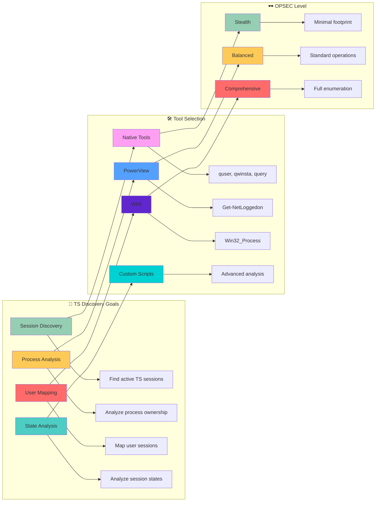

[Prev: 14_RDP_Session_Enumeration.md](./14_RDP_Session_Enumeration.md) | [Up: Index](./00_Enumeration_Index.md) | [Hub](./00_Methodology_Hub.md) | [Next: 16_Session_Analysis_Techniques.md](./16_Session_Analysis_Techniques.md)

# 🖥️ Terminal Services Enumeration - Interactive Session Intelligence Gathering

> **⚠️ CRITICAL TOOL REQUIREMENT**: **Invisi-Shell** is mandatory for production environments to ensure stealth operations and avoid detection. See [Tool Arsenal](./01_Tool_Setup_Loading.md#-invisi-shell-complete-setup) for setup instructions.

> **🎯 PURPOSE**: This is your **Terminal Services enumeration foundation** for Active Directory enumeration. Terminal Services enumeration reveals interactive sessions, process ownership, and user activity patterns across domain systems, providing critical intelligence for privilege escalation, lateral movement, and attack path planning.

[🔄 Back to Master Index](./00_Enumeration_Index.md) | [🔍 Previous: RDP Session Enumeration](./14_RDP_Session_Enumeration.md) | [Next: Session Analysis Techniques](./16_Session_Analysis_Techniques.md)

---

## 📋 **QUICK START TERMINAL SERVICES DISCOVERY**

| **Phase** | **Tool** | **Command** | **Purpose** | **OPSEC Level** |
|-----------|----------|-------------|-------------|------------------|
| **1. Basic Discovery** | `quser` (Native) | `quser /server:target` | Basic TS session discovery | 🟢 Stealth |
| **2. Session States** | `qwinsta` (Native) | `qwinsta /server:target` | TS session state analysis | 🟢 Stealth |
| **3. Process Sessions** | `query process` (Native) | `query process /server:target` | Process session mapping | 🟢 Stealth |
| **4. Advanced Enumeration** | PowerView Suite | `Get-NetLoggedon -ComputerName "target"` | Comprehensive TS analysis | 🟡 Balanced |

## 🎭 **AT-A-GLANCE: TERMINAL SERVICES ENUMERATION ESSENTIALS**

**What This Technique Reveals:**
- Terminal Services sessions across domain computers
- Interactive user sessions and process ownership
- Session states and connection patterns
- Process session mapping and privilege escalation opportunities
- User activity patterns and session timing

**Primary Use Cases:**
- Interactive session discovery and analysis
- Process ownership and privilege escalation planning
- User activity pattern analysis
- Lateral movement opportunity identification
- Terminal Services security assessment

**Execution Speed:**
- **Stealth Mode**: 4-8 seconds between queries with jitter
- **Balanced Mode**: 2-5 seconds between queries
- **Lab Mode**: 1-3 seconds between queries

## 🧭 **PIVOT MATRIX: STRATEGIC NEXT STEPS**

| **Finding** | **Immediate Pivot** | **Strategic Goal** | **Tool/Technique** |
|--------------|---------------------|-------------------|-------------------|
| **Admin TS Session** | [13_Active_Session_Discovery.md](./13_Active_Session_Discovery.md) | Token/LSA opportunities | `Get-NetLoggedon` |
| **Frequent RDP Source** | [14_RDP_Session_Enumeration.md](./14_RDP_Session_Enumeration.md) | RDP pathing analysis | `Get-NetRDPSession` |
| **Active SMB Session** | [17_File_Share_Enumeration.md](./17_File_Share_Enumeration.md) | Share/DFS hunting | `Get-NetSession` |
| **Service Session Owner** | [24_SPN_Enumeration_Techniques.md](./24_SPN_Enumeration_Techniques.md) | SPN roast planning | `Get-DomainUser` |
| **Anomalous TS States** | [12_Session_Enumeration_Index.md](./12_Session_Enumeration_Index.md) | Hunt playbooks | Session analysis |

---

## 🛠️ **COMPREHENSIVE ENUMERATION TOOLS**

### **🔧 Microsoft-Signed Tools**
- **Microsoft AD Module**: Terminal Services targeting and computer discovery
- **Get-ADComputer**: Computer object enumeration for TS targeting
- **Get-ADUser**: User object enumeration for TS session analysis
- **Get-ADObject**: General AD object enumeration for TS context
- **Get-ADDomain**: Domain information for TS enumeration scope
- **Get-ADReplicationSite**: AD site topology for TS enumeration targeting

### **⚔️ Offensive Tools (PowerView, etc.)**
- **PowerView Suite**: Comprehensive TS session discovery and enumeration
- **Get-NetLoggedon**: PowerView active user session enumeration
- **Get-NetSession**: PowerView SMB session enumeration
- **Get-NetRDPSession**: PowerView RDP/TS session enumeration
- **Invoke-UserHunter**: PowerView user hunting across TS hosts
- **Get-DomainComputer**: PowerView computer enumeration for TS targeting

### **🔴 Red Team Enumeration Tools**

#### **🔍 PowerView - Terminal Services Discovery**
**Purpose**: PowerShell TS session discovery and user hunting
**Setup**: Download PowerView.ps1 from GitHub
**Primary Commands**:
```powershell
# Basic TS session discovery
Get-NetLoggedon -ComputerName "TS01.corp.local"               # Active user sessions on TS host
Get-NetSession -ComputerName "TS01.corp.local"                 # SMB sessions on TS host
Get-NetRDPSession -ComputerName "TS01.corp.local"              # RDP/TS sessions on host

# Advanced TS session discovery
Get-NetLoggedon -ComputerName "TS01.corp.local" -Credential $cred  # Custom credentials
Get-NetSession -ComputerName "TS01.corp.local" -Credential $cred   # Custom credentials
Get-NetRDPSession -ComputerName "TS01.corp.local" -Credential $cred  # Custom credentials

# User hunting and TS correlation
Invoke-UserHunter -UserName "Administrator"                    # User location hunting on TS
Invoke-UserHunter -UserName "Administrator" -ComputerName "TS01.corp.local"  # Scoped hunting
Invoke-UserHunter -UserName "Administrator" -OU "OU=IT,DC=corp,DC=local"  # OU-scoped hunting
```

#### **🔍 SharpView - Compiled PowerView (C#)**
**Purpose**: C# version of PowerView without PowerShell execution
**Setup**: Download SharpView.exe from GitHub
**Primary Commands**:
```cmd
# Basic TS session discovery
SharpView.exe Get-NetLoggedon -ComputerName TS01.corp.local    # Active user sessions
SharpView.exe Get-NetSession -ComputerName TS01.corp.local     # SMB sessions
SharpView.exe Get-NetRDPSession -ComputerName TS01.corp.local  # RDP/TS sessions

# Advanced TS session discovery
SharpView.exe Get-NetLoggedon -ComputerName TS01.corp.local -Credential $cred  # Custom credentials
SharpView.exe Get-NetSession -ComputerName TS01.corp.local -Credential $cred   # Custom credentials
SharpView.exe Get-NetRDPSession -ComputerName TS01.corp.local -Credential $cred  # Custom credentials
```

#### **🧭 Seatbelt - The C# System Situational Awareness Tool**
**Purpose**: C# system situational awareness including TS session details
**Setup**: Download Seatbelt executable from GitHub
**Primary Commands**:
```cmd
# Basic system enumeration
Seatbelt.exe all                                               # All enumeration modules
Seatbelt.exe all -q                                            # Quiet mode
Seatbelt.exe all -o results.txt                               # Output to file

# Session-specific enumeration
Seatbelt.exe LoggedOnUsers                                     # Logged on users
Seatbelt.exe LoggedOnUsers -q                                  # Logged on users quiet mode
Seatbelt.exe LoggedOnUsers -o loggedon_users.txt               # Logged on users output

# Network session enumeration
Seatbelt.exe NetworkConnections                                # Network connections
Seatbelt.exe NetworkConnections -q                             # Network connections quiet mode
Seatbelt.exe NetworkConnections -o network_connections.txt     # Network connections output

# Process and service enumeration
Seatbelt.exe Processes                                         # Process enumeration
Seatbelt.exe Services                                          # Service enumeration
Seatbelt.exe Processes -o processes.txt                        # Process output
Seatbelt.exe Services -o services.txt                          # Service output
```

#### **🔍 CrackMapExec (CME) - The Swiss Army Knife**
**Purpose**: Swiss army knife for SMB/AD exploitation and TS session discovery
**Setup**: `pip install crackmapexec`
**Primary Commands**:
```bash
# Basic TS session discovery
crackmapexec smb targets.txt                                   # SMB enumeration
crackmapexec smb targets.txt -u username -p password           # Authenticated enumeration
crackmapexec smb targets.txt -u username -p password --sessions  # Session enumeration

# Advanced options
crackmapexec smb targets.txt -u username -p password --sessions --loggedon-users  # Logged on users
crackmapexec smb targets.txt -u username -p password --sessions --shares          # Share enumeration
crackmapexec smb targets.txt -u username -p password --sessions --processes       # Process enumeration

# TS session analysis
crackmapexec smb targets.txt -u username -p password --sessions --users           # User enumeration
crackmapexec smb targets.txt -u username -p password --sessions --groups          # Group enumeration
crackmapexec smb targets.txt -u username -p password --sessions --local-auth      # Local authentication
```

### **🛠️ Alternative Enumeration Tools**

#### **🔍 LDAPDomainDump - The Python LDAP Enumeration Tool**
**Purpose**: Python tool for dumping AD info over LDAP
**Setup**: `pip install ldapdomaindump` or download from GitHub
**Primary Commands**:
```bash
# Basic LDAP enumeration
ldapdomaindump target.com                                   # Basic enumeration
ldapdomaindump target.com -u username -p password           # Authenticated enumeration
ldapdomaindump target.com -u username -p password -o output_dir  # Custom output

# LDAP server specification
ldapdomaindump target.com -s ldap://192.168.1.10            # Specific LDAP server
ldapdomaindump target.com -s ldaps://192.168.1.10           # LDAPS connection
ldapdomaindump target.com -s ldap://192.168.1.10:389        # Custom port

# Output formats
ldapdomaindump target.com -o output_dir --format html       # HTML output
ldapdomaindump target.com -o output_dir --format json       # JSON output
ldapdomaindump target.com -o output_dir --format csv        # CSV output
```

#### **🌐 Native Windows TS Tools**
**Purpose**: Built-in Windows TS/RDP session discovery capabilities
**Setup**: Built into Windows
**Primary Commands**:
```cmd
# quser commands for TS
quser /server:target                                          # Basic TS/RDP session enumeration
quser username /server:target                                 # Specific user TS session
quser /server:target /domain:corp.local                       # Domain-specific TS session

# qwinsta commands for TS
qwinsta /server:target                                        # Terminal Services session enumeration
qwinsta sessionname /server:target                            # Specific TS session enumeration
qwinsta /server:target /domain:corp.local                     # Domain-specific TS session

# net commands
net session                                                    # Local SMB session enumeration
net session \\target                                          # Remote SMB session enumeration
net session /delete                                           # Delete local SMB sessions
```

#### **🔍 Online TS Enumeration Tools**
**Purpose**: Web-based TS/RDP session discovery and reconnaissance
**Setup**: Web browser access
**Primary Tools**:
- **Microsoft Docs**: Official TS/RDP session discovery documentation
- **Security Research**: TS session discovery security analysis
- **OSINT frameworks**: Comprehensive open-source intelligence
- **Community Resources**: TS session discovery guides and examples

**Usage Examples**:
```bash
# Microsoft Docs
# Visit https://learn.microsoft.com/windows-server/remote/remote-desktop-services/
# Search for specific TS/RDP session discovery topics and examples

# Security Research
# Search for TS session discovery techniques and security analysis
# Use tools like Google, Bing, or specialized search engines

# Community Resources
# Visit security forums and communities for TS session discovery examples
# Access shared tools and scripts for TS session analysis
```

### **🔍 Specialized Tools**

#### **🌐 TS Discovery Tools**
- **PowerView**: Primary TS session discovery framework
- **SharpView**: C# TS session discovery alternative
- **Seatbelt**: System situational awareness
- **Custom Scripts**: Advanced TS session discovery automation

#### **🔗 TS Analysis Tools**
- **PowerView**: TS session data analysis and correlation
- **SharpView**: C# TS session analysis capabilities
- **Custom Scripts**: Advanced TS session pattern analysis
- **Data visualization tools**: TS session mapping and visualization

#### **📋 TS Export Tools**
- **PowerView**: CSV export capabilities
- **SharpView**: Data export functionality
- **Custom Scripts**: Advanced export format automation
- **Data conversion tools**: Format conversion and transformation

#### **🎯 TS Attack Tools**
- **PowerView**: TS session-based attack planning
- **SharpView**: C# TS attack execution
- **Custom Scripts**: Advanced TS attack automation
- **Exploitation tools**: TS session-based privilege escalation

---

## 🎭 **PERSONAS: REAL-WORLD EXECUTION PROFILES**

### **🕵️ Persona 1: "Stealth Consultant" (Limited User)**
- **Access Level**: Standard domain user
- **OPSEC Priority**: Maximum stealth, minimal detection
- **Tool Preference**: Native Windows tools, minimal PowerView usage
- **Execution Style**: Slow, methodical, scoped queries
- **Target Focus**: Basic TS discovery, organizational structure

### **⚡ Persona 2: "Power User" (Elevated Access)**
- **Access Level**: Local admin on workstation
- **OPSEC Priority**: Balanced stealth, comprehensive enumeration
- **Tool Preference**: PowerView, selective native tools
- **Execution Style**: Moderate speed, targeted enumeration
- **Target Focus**: TS session mapping, process analysis, privilege escalation

### **👑 Persona 3: "Domain Admin" (Full Access)**
- **Access Level**: Domain administrative privileges
- **OPSEC Priority**: Minimal stealth, maximum information gathering
- **Tool Preference**: Full PowerView suite, comprehensive tools
- **Execution Style**: Fast, comprehensive, full enumeration
- **Target Focus**: Complete TS landscape, attack path mapping

## 🎨 **VISUAL MASTERY: TERMINAL SERVICES ENUMERATION ARCHITECTURE**

### **Terminal Services Discovery Data Flow Architecture**

```mermaid
graph TB
    subgraph "🎯 TS DISCOVERY SOURCES"
        A[Domain Computers] --> A1[Workstations]
        A --> A2[Application Servers]
        A --> A3[File Servers]
        B[TS Components] --> B1[Interactive Sessions]
        B --> B2[Process Sessions]
        B --> B3[Session States]
        B --> B4[User Activity]
    end
    
    subgraph "🔍 DISCOVERY METHODS"
        C[Microsoft AD Module] --> C1[Get-ADComputer]
        C --> C2[Computer Discovery]
        D[PowerView Suite] --> D1[Get-NetLoggedon]
        D --> D2[Get-NetSession]
        D --> D3[Session Analysis]
        E[Native Windows Tools] --> E1[quser.exe]
        E --> E2[qwinsta.exe]
        E --> E3[query.exe]
    end
    
    subgraph "📊 DATA PROCESSING"
        F[TS Session Data] --> F1[User Information]
        F --> F2[Session States]
        F --> F3[Process Ownership]
        F --> F4[Connection Timing]
        G[Pattern Analysis] --> G1[User TS Patterns]
        G --> G2[Session State Patterns]
        G --> G3[Suspicious Activity]
    end
    
    subgraph "🎯 STRATEGIC OUTPUT"
        H[Privilege Escalation] --> H1[Process Token Theft]
        H --> H2[Session Hijacking]
        I[Attack Planning] --> I1[TS Path Mapping]
        I --> I2[Timing Optimization]
        J[Threat Hunting] --> J1[TS Anomaly Detection]
        J --> J2[Interactive Session Monitoring]
    end
    
    A --> C
    B --> D
    A --> E
    
    C --> F
    D --> F
    E --> F
    
    F --> G
    G --> H
    G --> I
    G --> J
    
    style A fill:#ff6b6b
    style B fill:#4ecdc4
    style C fill:#45b7d1
    style D fill:#96ceb4
    style E fill:#feca57
    style F fill:#ff9ff3
    style G fill:#54a0ff
    style H fill:#5f27cd
    style I fill:#00d2d3
    style J fill:#ff6b6b
```



### **Terminal Services Decision Matrix**



## 🏭 **LAB vs PRODUCTION: EXECUTION PROFILES**

### **🧪 Lab Environment (Detection Not a Concern)**
```powershell
# Comprehensive TS enumeration with aggressive timing
$allTSSessions = @()

# Enumerate all computers in domain
$computers = Get-ADComputer -Filter * -Properties Name,OperatingSystem

foreach($computer in $computers) {
    try {
        # Get TS sessions
        $tsSessions = Get-TerminalServicesSessions -ComputerName $computer.Name -ErrorAction SilentlyContinue
        
        if($tsSessions) {
            $allTSSessions += [PSCustomObject]@{
                Computer = $computer.Name
                TSSessions = $tsSessions
                OS = $computer.OperatingSystem
            }
        }
        
        Start-Sleep -Seconds 1
    }
    catch {
        Write-Warning "Failed to query $($computer.Name): $($_.Exception.Message)"
    }
}

# Export comprehensive data
$allTSSessions | Export-Csv "ts_sessions_comprehensive_lab.csv" -NoTypeInformation
```

### **🏢 Production Environment (Stealth Operations)**
```powershell
# Stealthy, targeted TS enumeration with jitter
$targetComputers = @("app01.corp.local", "web01.corp.local", "sql01.corp.local")
$targetUsers = @("admin", "ceo", "security")

$tsData = @()

# Stealth TS enumeration
foreach($computer in $targetComputers) {
    try {
        # Get TS sessions with minimal properties
        $tsSessions = Get-TerminalServicesSessions -ComputerName $computer -ErrorAction SilentlyContinue | Select-Object Username,SessionName,State,ID
        
        if($tsSessions) {
            $tsData += [PSCustomObject]@{
                Computer = $computer
                TSSessions = $tsSessions
                QueryTime = Get-Date
            }
            Write-Host "Found TS sessions on $computer" -ForegroundColor Green
        }
        
        # Random delay with jitter for stealth
        $delay = Get-Random -Minimum 4 -Maximum 8
        Start-Sleep -Seconds $delay
    }
    catch {
        Write-Warning "Failed to query $computer`: $($_.Exception.Message)"
    }
}

# Export targeted data
$tsData | Export-Csv "ts_sessions_targeted_production.csv" -NoTypeInformation
```

## 🛡️ **DETECTION, OPSEC & CLEANUP**

### **🔍 Detection Indicators**

#### **Event Log Monitoring**
- **Event ID 4624**: Successful logon events (Type 10 for TS)
- **Event ID 4625**: Failed logon attempts
- **Event ID 4634**: Logoff events
- **Event ID 4778**: Session reconnection events
- **Event ID 4779**: Session disconnection events

#### **Network Monitoring**
```powershell
# Common TS detection patterns
$tsDetectionPatterns = @{
    "TS_Session_Query_Spike" = "Multiple TS session queries to multiple hosts within short timeframe"
    "TS_RPC_Enumeration" = "RPC calls to WinStation APIs for session enumeration"
    "TS_Process_Discovery" = "Multiple process queries across multiple systems"
    "TS_Session_Discovery" = "WinStation queries to multiple systems"
}

# Mitigation strategies
$tsMitigationStrategies = @{
    "Scoped_Queries" = "Limit TS queries to specific targets only"
    "Timing_Control" = "Implement jitter and delays between queries"
    "Source_Validation" = "Verify TS query sources are authorized"
    "Volume_Limiting" = "Cap TS query volume per session"
}
```

### **🔒 OPSEC Best Practices**

#### **Stealth Operations**
- **Use Native Tools First**: Leverage built-in Windows commands for initial TS discovery
- **Implement Jitter**: Use random delays between queries (4-8 seconds production, 1-3 seconds lab)
- **Scope Queries**: Limit enumeration to specific computers or user groups
- **Avoid Domain Controllers**: Don't query DCs for TS sessions unless necessary

#### **TS-Specific OPSEC**
```powershell
# TS-focused timing profile for OPSEC
$TSProfile = @{
    Stealth = @{
        MinDelay = 4
        MaxDelay = 8
        Jitter = $true
        QueryLimit = 25
        TargetTypes = @("Workstations", "Application Servers")
    }
    Balanced = @{
        MinDelay = 2
        MaxDelay = 5
        Jitter = $true
        QueryLimit = 50
        TargetTypes = @("Workstations", "Application Servers", "File Servers")
    }
    Lab = @{
        MinDelay = 1
        MaxDelay = 3
        Jitter = $false
        QueryLimit = 1000
        TargetTypes = @("All Systems")
    }
}

# Apply TS timing profile
function Invoke-StealthTSQuery {
    param(
        [scriptblock]$Query,
        [string]$ProfileType = "Stealth"
    )
    
    $timing = $TSProfile[$ProfileType]
    
    # Execute query
    $result = & $Query
    
    # Apply delay with jitter
    if($timing.Jitter) {
        $delay = Get-Random -Minimum $timing.MinDelay -Maximum $timing.MaxDelay
        Start-Sleep -Seconds $delay
    } else {
        Start-Sleep -Seconds $timing.MinDelay
    }
    
    return $result
}

# Example usage
$tsSessions = Invoke-StealthTSQuery -Query { Get-TerminalServicesSessions -ComputerName "target" } -ProfileType "Stealth"
```

### **🧹 Cleanup Procedures**

#### **File Cleanup**
```powershell
# Remove TS enumeration artifacts
function Invoke-TSCleanup {
    param(
        [string]$Path = "."
    )
    
    $artifacts = @(
        "ts*.csv",
        "ts*.json",
        "ts*.xml",
        "ts_enumeration*.txt",
        "ts_sessions*.log"
    )
    
    foreach($artifact in $artifacts) {
        $files = Get-ChildItem -Path $Path -Filter $artifact -Recurse -ErrorAction SilentlyContinue
        foreach($file in $files) {
            try {
                Remove-Item $file.FullName -Force -ErrorAction SilentlyContinue
                Write-Host "Removed: $($file.Name)" -ForegroundColor Green
            }
            catch {
                Write-Warning "Failed to remove: $($file.Name)"
            }
        }
    }
    
    Write-Host "TS cleanup completed" -ForegroundColor Cyan
}

# Execute cleanup
Invoke-TSCleanup

# Exit Invisi-Shell if active
if($env:INVISI_SHELL_ACTIVE -eq $true) {
    Write-Host "Exiting Invisi-Shell..." -ForegroundColor Yellow
    exit
}
```

#### **Session Cleanup**
```powershell
# Clear TS-related variables and functions
function Clear-TSEnumeration {
    $tsVariables = @(
        "allTSSessions",
        "tsData",
        "tsSessions",
        "targetComputers",
        "targetUsers"
    )
    
    foreach($var in $tsVariables) {
        if(Get-Variable -Name $var -ErrorAction SilentlyContinue) {
            Remove-Variable -Name $var -Force -ErrorAction SilentlyContinue
            Write-Host "Cleared variable: $var" -ForegroundColor Green
        }
    }
    
    # Clear TS functions
    $tsFunctions = @(
        "Invoke-StealthTSQuery",
        "Invoke-TSCleanup",
        "Clear-TSEnumeration"
    )
    
    foreach($func in $tsFunctions) {
        if(Get-Command -Name $func -ErrorAction SilentlyContinue) {
            Remove-Item "function:$func" -Force -ErrorAction SilentlyContinue
            Write-Host "Cleared function: $func" -ForegroundColor Green
        }
    }
    
    Write-Host "TS enumeration cleanup completed" -ForegroundColor Cyan
}

# Execute TS cleanup
Clear-TSEnumeration
```

## 🔗 **CROSS-REFERENCES & INTEGRATION**

### **📚 Related Enumeration Techniques**
- **[05_User_Enumeration.md](./05_User_Enumeration.md)**: User discovery and analysis
- **[13_Active_Session_Discovery.md](./13_Active_Session_Discovery.md)**: Active session discovery
- **[14_RDP_Session_Enumeration.md](./14_RDP_Session_Enumeration.md)**: RDP session analysis
- **[16_Session_Analysis_Techniques.md](./16_Session_Analysis_Techniques.md)**: Session analysis techniques
- **[17_File_Share_Enumeration.md](./17_File_Share_Enumeration.md)**: File share access mapping

### **🛠️ Tool Dependencies**
- **[01_Tool_Setup_Loading.md](./01_Tool_Setup_Loading.md)**: Invisi-Shell setup and stealth operations
- **[PowerView Setup](./01_Tool_Setup_Loading.md#-powerview-complete-setup)**: PowerView loading and configuration
- **[Microsoft AD Module](./01_Tool_Setup_Loading.md#-microsoft-ad-module-complete-setup)**: AD cmdlet setup

### **🎯 Attack Path Integration**
- **TS Session Discovery** → **User Enumeration** → **Privilege Escalation**
- **Process Session Analysis** → **Token Theft** → **Lateral Movement**
- **TS Session States** → **Session Analysis** → **Session Hijacking**
- **User Activity Patterns** → **Behavioral Analysis** → **Threat Hunting**

### **🔄 Navigation Flow**
- **Previous**: [14_RDP_Session_Enumeration.md](./14_RDP_Session_Enumeration.md) - RDP session enumeration
- **Current**: Terminal Services enumeration techniques and methodologies
- **Next**: [16_Session_Analysis_Techniques.md](./16_Session_Analysis_Techniques.md) - Session analysis techniques

### **📊 TOOL INTEGRATION MATRIX**

| **Tool Category** | **Use Case** | **OPSEC Level** | **Command Example** |
|-------------------|--------------|------------------|---------------------|
| **Microsoft AD Module** | Computer discovery for TS targeting | 🟢 High | `Get-ADComputer -Filter *` |
| **PowerView Suite** | TS session enumeration and analysis | 🟡 Medium | `Get-NetLoggedon -ComputerName "target"` |
| **Native Windows Tools** | Basic TS discovery, stealth operations | 🟢 High | `quser /server:target` |

### **🔄 TOOL-SPECIFIC WORKFLOWS**

#### **Stealth Production Workflow**
1. **Load Invisi-Shell** for AMSI bypass and logging evasion
2. **Use Native Tools** for initial TS discovery
3. **Implement jitter** with 4-8 second delays between queries
4. **Scope queries** to specific targets and user groups
5. **Clean up artifacts** and exit Invisi-Shell

#### **Lab Environment Workflow**
1. **Load PowerView** for comprehensive TS enumeration
2. **Use aggressive timing** with 1-3 second delays
3. **Export comprehensive data** for analysis
4. **Test advanced techniques** and TS session hunting
5. **Document findings** for attack path planning

---

## 🛠️ **ENUMERATION TOOLS OVERVIEW**

> **🔒 CRITICAL TOOL REQUIREMENT**: **Invisi-Shell** is mandatory for all production Terminal Services enumeration operations. It provides AMSI bypass, logging evasion, and stealth capabilities that are essential for operational security.

### **🔧 Tool Categories and Capabilities**

#### **Microsoft-Signed Tools (CLM-Friendly)**
- **ActiveDirectory Module**: Official Microsoft module for computer discovery
- **Native Windows Commands**: Built-in tools like quser, qwinsta, query

#### **Offensive Tools (PowerView/SharpView)**
- **PowerView**: PowerShell-based TS session enumeration framework
- **SharpView**: Compiled version of PowerView for stealth operations
- **Custom TS Scripts**: Advanced TS session analysis and hunting tools

#### **Third-Party Tools**
- **WMI Queries**: System information and TS session details
- **Custom PowerShell Scripts**: Advanced TS enumeration workflows
- **Process Analysis Tools**: Process ownership and session mapping

## 🔍 **COMPREHENSIVE TERMINAL SERVICES ENUMERATION TECHNIQUES**

### **🌐 Basic TS Discovery via Native Windows Tools**

#### **Tool 1: Native Windows Commands (Stealth TS Operations)**
**What it provides**: Built-in Windows tools for basic TS session discovery
**CLM Status**: ✅ Native Windows (trusted)
**Use Case**: Minimal footprint, basic discovery, fallback option

```powershell
# Basic TS session discovery via quser
function Discover-TSSessionsNative {
    param(
        [string]$ComputerName = "localhost"
    )
    
    Write-Host "Discovering TS sessions on $ComputerName via native tools..." -ForegroundColor Cyan
    
    try {
        # Use quser for TS session discovery
        $tsSessions = quser /server:$ComputerName 2>$null
        
        if($tsSessions) {
            Write-Host "Found TS sessions on $ComputerName" -ForegroundColor Green
            $tsSessions | ForEach-Object {
                Write-Host "  $_" -ForegroundColor White
            }
            return $tsSessions
        } else {
            Write-Host "No TS sessions found on $ComputerName" -ForegroundColor Yellow
            return $null
        }
    }
    catch {
        Write-Warning "Failed to query TS sessions on $ComputerName`: $($_.Exception.Message)"
        return $null
    }
}

# Basic TS session state discovery via qwinsta
function Discover-TSSessionStatesNative {
    param(
        [string]$ComputerName = "localhost"
    )
    
    Write-Host "Discovering TS session states on $ComputerName via native tools..." -ForegroundColor Cyan
    
    try {
        # Use qwinsta for TS session state discovery
        $tsStates = qwinsta /server:$ComputerName 2>$null
        
        if($tsStates) {
            Write-Host "Found TS session states on $ComputerName" -ForegroundColor Green
            $tsStates | ForEach-Object {
                Write-Host "  $_" -ForegroundColor White
            }
            return $tsStates
        } else {
            Write-Host "No TS session states found on $ComputerName" -ForegroundColor Yellow
            return $null
        }
    }
    catch {
        Write-Warning "Failed to query TS session states on $ComputerName`: $($_.Exception.Message)"
        return $null
    }
}

# Use native TS discovery functions
$tsSessions = Discover-TSSessionsNative -ComputerName "app01.corp.local"
$tsStates = Discover-TSSessionStatesNative -ComputerName "app01.corp.local"
```

**Tool Advantages**:
- ✅ Built into Windows
- ✅ No additional installation
- ✅ Minimal security footprint
- ✅ Always available
- ✅ Basic TS discovery capabilities

**Tool Limitations**:
- ❌ Limited functionality
- ❌ Basic output format
- ❌ No rich object properties
- ❌ Limited filtering options

#### **Tool 2: PowerView Suite (Comprehensive TS Enumeration)**
**What it provides**: PowerShell framework for advanced TS session enumeration
**CLM Status**: ❌ Not signed (offensive tool)
**Use Case**: Lab environments, penetration testing, offensive operations

```powershell
# Load PowerView
. .\PowerView.ps1

# Advanced TS enumeration via PowerView
function Discover-TSSessionsViaPowerView {
    param(
        [string]$ComputerName = "localhost"
    )
    
    $tsData = @{
        LoggedOnUsers = @()
        SMBSessions = @()
        Summary = @{}
    }
    
    Write-Host "Discovering TS sessions on $ComputerName via PowerView..." -ForegroundColor Cyan
    
    # Get logged on users via PowerView
    try {
        $loggedon = Get-NetLoggedon -ComputerName $ComputerName -ErrorAction SilentlyContinue
        $tsData.LoggedOnUsers = $loggedon
        Write-Host "Found $($loggedon.Count) logged on users via PowerView" -ForegroundColor Green
    }
    catch {
        Write-Warning "PowerView logged on user enumeration failed: $($_.Exception.Message)"
    }
    
    # Get SMB sessions via PowerView
    try {
        $smbSessions = Get-NetSession -ComputerName $ComputerName -ErrorAction SilentlyContinue
        $tsData.SMBSessions = $smbSessions
        Write-Host "Found $($smbSessions.Count) SMB sessions via PowerView" -ForegroundColor Green
    }
    catch {
        Write-Warning "PowerView SMB session enumeration failed: $($_.Exception.Message)"
    }
    
    # Generate summary
    $tsData.Summary = @{
        TotalLoggedOnUsers = $tsData.LoggedOnUsers.Count
        TotalSMBSessions = $tsData.SMBSessions.Count
    }
    
    return $tsData
}

# Use PowerView TS enumeration
$powerViewTSData = Discover-TSSessionsViaPowerView -ComputerName "app01.corp.local"

# Display PowerView TS results
Write-Host "`n=== POWERVIEW TS ENUMERATION RESULTS ===" -ForegroundColor Magenta
Write-Host "Summary:" -ForegroundColor Cyan
Write-Host "  Logged On Users: $($powerViewTSData.Summary.TotalLoggedOnUsers)" -ForegroundColor White
Write-Host "  SMB Sessions: $($powerViewTSData.Summary.TotalSMBSessions)" -ForegroundColor White
```

**Tool Advantages**:
- ✅ Comprehensive TS enumeration capabilities
- ✅ Rich object properties and methods
- ✅ Built-in filtering and search
- ✅ Offensive-focused functions
- ✅ Extensive customization options

**Tool Limitations**:
- ❌ Not Microsoft-signed
- ❌ May trigger security alerts
- ❌ Not CLM-compliant
- ❌ Requires careful deployment

#### **Tool 3: Microsoft AD Module (Stealth TS Discovery)**
**What it provides**: Official Microsoft module for computer discovery and TS targeting
**CLM Status**: ✅ Fully signed and CLM-friendly
**Use Case**: Production environments, compliance requirements

```powershell
# Load the module
Import-Module ActiveDirectory

# Stealth computer discovery for TS targeting via Microsoft AD Module
function Discover-ComputersForTS {
    param(
        [string]$Domain = "corp.local"
    )
    
    $computerData = @{
        AllComputers = @()
        Workstations = @()
        ApplicationServers = @()
        FileServers = @()
        Summary = @{}
    }
    
    Write-Host "Discovering computers for TS enumeration via Microsoft AD Module..." -ForegroundColor Cyan
    
    try {
        # Get all computers
        $computers = Get-ADComputer -Filter * -Properties Name,OperatingSystem,OperatingSystemVersion,LastLogonDate -Server $Domain
        
        foreach($computer in $computers) {
            $computerInfo = @{
                Name = $computer.Name
                OperatingSystem = $computer.OperatingSystem
                OSVersion = $computer.OperatingSystemVersion
                LastLogon = $computer.LastLogonDate
            }
            
            $computerData.AllComputers += $computerInfo
            
            # Categorize computers for TS targeting
            if($computer.OperatingSystem -like "*Windows 10*" -or $computer.OperatingSystem -like "*Windows 11*") {
                $computerData.Workstations += $computerInfo
            } elseif($computer.OperatingSystem -like "*Windows Server*") {
                if($computer.Name -like "*APP*" -or $computer.Name -like "*WEB*") {
                    $computerData.ApplicationServers += $computerInfo
                } elseif($computer.Name -like "*FS*" -or $computer.Name -like "*FILE*") {
                    $computerData.FileServers += $computerInfo
                }
            }
        }
        
        # Generate summary
        $computerData.Summary = @{
            TotalComputers = $computerData.AllComputers.Count
            TotalWorkstations = $computerData.Workstations.Count
            TotalApplicationServers = $computerData.ApplicationServers.Count
            TotalFileServers = $computerData.FileServers.Count
        }
        
        Write-Host "Found $($computerData.Summary.TotalComputers) computers via Microsoft AD Module" -ForegroundColor Green
        Write-Host "  Workstations: $($computerData.Summary.TotalWorkstations)" -ForegroundColor White
        Write-Host "  Application Servers: $($computerData.Summary.TotalApplicationServers)" -ForegroundColor White
        Write-Host "  File Servers: $($computerData.Summary.TotalFileServers)" -ForegroundColor White
        
        return $computerData
    }
    catch {
        Write-Warning "Microsoft AD Module computer discovery failed: $($_.Exception.Message)"
        return $null
    }
}

# Use Microsoft AD Module for computer discovery
$adModuleComputerData = Discover-ComputersForTS -Domain "corp.local"

# Target specific computer types for TS enumeration
$tsTargets = $adModuleComputerData.ApplicationServers | Select-Object -First 5
Write-Host "`nTargeting application servers for TS enumeration:" -ForegroundColor Cyan
$tsTargets | ForEach-Object {
    Write-Host "  ✓ $($_.Name) - $($_.OperatingSystem)" -ForegroundColor Green
}
```

**Tool Advantages**:
- ✅ Microsoft-signed and CLM-compliant
- ✅ Production-safe for stealth operations
- ✅ Rich computer discovery capabilities
- ✅ Built-in error handling and validation
- ✅ Consistent with other AD module functions

**Tool Limitations**:
- ❌ No direct TS session enumeration
- ❌ Limited to computer discovery only
- ❌ Requires additional tools for TS session data
- ❌ No TS session analysis capabilities

## 📚 **NEXT STEPS**

After mastering Terminal Services Enumeration, continue with:
- **Session Analysis Techniques**: See [16_Session_Analysis_Techniques.md](./16_Session_Analysis_Techniques.md)
- **File Share Enumeration**: See [17_File_Share_Enumeration.md](./17_File_Share_Enumeration.md)
- **SPN Enumeration Techniques**: See [24_SPN_Enumeration_Techniques.md](./24_SPN_Enumeration_Techniques.md)
- **Registry Enumeration**: See [18_Registry_Enumeration.md](./18_Registry_Enumeration.md)

---

[Prev: 14_RDP_Session_Enumeration.md](./14_RDP_Session_Enumeration.md) | [Up: Index](./00_Enumeration_Index.md) | [Hub](./00_Methodology_Hub.md) | [Next: 16_Session_Analysis_Techniques.md](./16_Session_Analysis_Techniques.md)
