[Prev: 15_Terminal_Services_Enumeration.md](./15_Terminal_Services_Enumeration.md) | [Up: Index](./00_Enumeration_Index.md) | [Hub](./00_Methodology_Hub.md) | [Next: 17_File_Share_Enumeration.md](./17_File_Share_Enumeration.md)

# 📊 Session Analysis Techniques - Behavioral Intelligence & Threat Hunting

> **⚠️ CRITICAL TOOL REQUIREMENT**: **Invisi-Shell** is mandatory for production environments to ensure stealth operations and avoid detection. See [Tool Arsenal](./01_Tool_Setup_Loading.md#-invisi-shell-complete-setup) for setup instructions.

> **🎯 PURPOSE**: This is your **session analysis foundation** for Active Directory enumeration. Session analysis techniques reveal user behavior patterns, system usage anomalies, and suspicious activity through comprehensive data analysis, providing critical intelligence for threat hunting, attack path planning, and privilege escalation.

[🔄 Back to Master Index](./00_Enumeration_Index.md) | [⚡ Previous: Terminal Services Enumeration](./15_Terminal_Services_Enumeration.md) | [Next: File Share Enumeration](./17_File_Share_Enumeration.md)

---

## 🔗 **RELATED ACTIVE DIRECTORY COMPONENTS**

### **📊 Session Analysis Components**
- **[User Accounts](../02_Active_Directory_Components/17_User_Accounts.md)**: Session patterns and user behavior analysis
- **[Domain Controllers](../02_Active_Directory_Components/02_Domain_Controllers.md)**: Session data collection and analysis
- **[Kerberos](../02_Active_Directory_Components/16_Kerberos.md)**: Session ticket analysis and patterns

### **🏗️ Infrastructure Components**
- **[Domain](../02_Active_Directory_Components/03_Domain.md)**: Domain boundaries for session analysis scope
- **[Sites and Subnets](../02_Active_Directory_Components/06_Sites_and_Subnets.md)**: Network topology for session routing analysis
- **[Replication Service](../02_Active_Directory_Components/15_Replication_Service.md)**: Session state synchronization analysis

### **🔐 Security and Policy Components**
- **[Group Policy Objects](../02_Active_Directory_Components/09_Group_Policy_Objects.md)**: Session policies and behavior analysis
- **[Schema](../02_Active_Directory_Components/11_Schema.md)**: Session object attribute analysis
- **[FSMO Roles](../02_Active_Directory_Components/08_FSMO_Roles.md)**: Session management operation analysis

---

## 🚀 **SESSION ANALYSIS TECHNIQUES OVERVIEW**

## 📋 **QUICK START SESSION ANALYSIS DISCOVERY**

| **Phase** | **Tool** | **Command** | **Purpose** | **OPSEC Level** |
|-----------|----------|-------------|-------------|------------------|
| **1. Basic Analysis** | `Get-NetSession` (PowerView) | `Get-NetSession -ComputerName "target"` | Basic session pattern analysis | 🟢 Stealth |
| **2. User Profiling** | `Get-NetLoggedon` (PowerView) | `Get-NetLoggedon -ComputerName "target"` | User behavior profiling | 🟡 Balanced |
| **3. Computer Analysis** | `Get-ADComputer` (AD Module) | `Get-ADComputer -Filter * -Properties *` | Computer usage patterns | 🟡 Balanced |
| **4. Anomaly Detection** | PowerView Suite | `Invoke-UserHunter -UserName "admin"` | Suspicious activity detection | 🟠 Noisy |

## 🎭 **AT-A-GLANCE: SESSION ANALYSIS ESSENTIALS**

**What This Technique Reveals:**
- User behavior patterns and session timing across domain computers
- Computer usage patterns and system access frequency
- Suspicious activity indicators and anomaly detection
- Privilege escalation opportunities through session analysis
- Lateral movement patterns and attack path mapping

**Primary Use Cases:**
- Threat hunting and incident response
- User behavior profiling and anomaly detection
- Attack path planning and target prioritization
- Privilege escalation opportunity identification
- Security assessment and vulnerability analysis

**Execution Speed:**
- **Stealth Mode**: 5-10 seconds between queries with jitter
- **Balanced Mode**: 3-7 seconds between queries
- **Lab Mode**: 1-3 seconds between queries

## 🧭 **PIVOT MATRIX: STRATEGIC NEXT STEPS**

| **Finding** | **Immediate Pivot** | **Strategic Goal** | **Tool/Technique** |
|--------------|---------------------|-------------------|-------------------|
| **High Logon Count Users** | [05_User_Enumeration.md](./05_User_Enumeration.md) | User analysis and targeting | `Get-ADUser` via AD Module |
| **Multi-Computer Users** | [13_Active_Session_Discovery.md](./13_Active_Session_Discovery.md) | Session analysis | `Get-NetLoggedon` |
| **Long-Running Sessions** | [15_Terminal_Services_Enumeration.md](./15_Terminal_Services_Enumeration.md) | Process analysis | `Get-NetProcess` |
| **Privileged User Activity** | [09_ACL_Enumeration.md](./09_ACL_Enumeration.md) | Permission investigation | `Get-DomainObjectAcl` |
| **Suspicious Computer Usage** | [07_Computer_Enumeration.md](./07_Computer_Enumeration.md) | Computer analysis | `Get-ADComputer` |

---

## 🛠️ **COMPREHENSIVE ENUMERATION TOOLS**

### **🔧 Microsoft-Signed Tools**
- **Microsoft AD Module**: Session-related user and computer analysis
- **Get-ADUser**: User object enumeration for behavioral profiling
- **Get-ADComputer**: Computer object enumeration for usage pattern analysis
- **Get-ADObject**: General AD object enumeration for session correlation
- **Get-ADGroup**: Group membership analysis for privilege assessment
- **Get-ADDomain**: Domain information for session analysis scope

### **⚔️ Offensive Tools (PowerView, etc.)**
- **PowerView Suite**: Comprehensive session analysis and behavioral profiling
- **Get-NetSession**: Active session discovery and analysis
- **Get-NetLoggedon**: Logged-on user enumeration and profiling
- **Invoke-UserHunter**: Advanced user hunting and session analysis
- **Get-NetProcess**: Process session mapping and analysis
- **Get-DomainUser**: Domain user enumeration for session correlation

### **🔴 Red Team Enumeration Tools**

#### **🔍 PowerView - Session Analysis**
**Purpose**: PowerShell framework for session analysis and behavior profiling
**Setup**: Download PowerView.ps1 from GitHub
**Primary Commands**:
```powershell
# Basic session analysis
Get-NetSession -ComputerName "DC01.corp.local"               # Active session discovery
Get-NetLoggedon -ComputerName "DC01.corp.local"               # Logged-on user enumeration
Invoke-UserHunter -UserName "Administrator"                    # User location hunting

# Advanced session analysis
Get-NetSession -ComputerName "DC01.corp.local" -Credential $cred  # Custom credentials
Get-NetLoggedon -ComputerName "DC01.corp.local" -Credential $cred  # Custom credentials
Invoke-UserHunter -UserName "Administrator" -ComputerName "DC01.corp.local"  # Scoped hunting

# Session correlation and analysis
Get-NetSession -ComputerName "DC01.corp.local" | Where-Object {$_.sesi2_cname -like "*admin*"}  # Admin sessions
Get-NetLoggedon -ComputerName "DC01.corp.local" | Where-Object {$_.wkui1_username -like "*admin*"}  # Admin logons
Invoke-UserHunter -UserName "Administrator" -OU "OU=IT,DC=corp,DC=local"  # OU-scoped hunting

# Behavioral profiling
Get-NetSession -ComputerName "DC01.corp.local" | Group-Object -Property sesi2_cname | Sort-Object Count -Descending  # Session frequency
Get-NetLoggedon -ComputerName "DC01.corp.local" | Group-Object -Property wkui1_username | Sort-Object Count -Descending  # Logon frequency
```

#### **🔍 SharpView - Compiled PowerView (C#)**
**Purpose**: C# version of PowerView without PowerShell execution
**Setup**: Download SharpView.exe from GitHub
**Primary Commands**:
```cmd
# Basic session analysis
SharpView.exe Get-NetSession -ComputerName DC01.corp.local    # Active session discovery
SharpView.exe Get-NetLoggedon -ComputerName DC01.corp.local    # Logged-on user enumeration
SharpView.exe Invoke-UserHunter -UserName Administrator        # User location hunting

# Advanced session analysis
SharpView.exe Get-NetSession -ComputerName DC01.corp.local -Credential $cred  # Custom credentials
SharpView.exe Get-NetLoggedon -ComputerName DC01.corp.local -Credential $cred  # Custom credentials
SharpView.exe Invoke-UserHunter -UserName Administrator -ComputerName DC01.corp.local  # Scoped hunting

# Session correlation and analysis
SharpView.exe Get-NetSession -ComputerName DC01.corp.local | Where-Object {$_.sesi2_cname -like "*admin*"}  # Admin sessions
SharpView.exe Get-NetLoggedon -ComputerName DC01.corp.local | Where-Object {$_.wkui1_username -like "*admin*"}  # Admin logons
```

#### **🧭 Seatbelt - The C# System Situational Awareness Tool**
**Purpose**: C# system situational awareness including session details
**Setup**: Download Seatbelt executable from GitHub
**Primary Commands**:
```cmd
# Basic system enumeration
Seatbelt.exe all                                               # All enumeration modules
Seatbelt.exe all -q                                            # Quiet mode
Seatbelt.exe all -o results.txt                               # Output to file

# Session-specific enumeration
Seatbelt.exe LoggedOnUsers                                     # Logged on users
Seatbelt.exe LoggedOnUsers -q                                  # Logged on users quiet mode
Seatbelt.exe LoggedOnUsers -o loggedon_users.txt               # Logged on users output

# Network session enumeration
Seatbelt.exe NetworkConnections                                # Network connections
Seatbelt.exe NetworkConnections -q                             # Network connections quiet mode
Seatbelt.exe NetworkConnections -o network_connections.txt     # Network connections output

# Process and service enumeration
Seatbelt.exe Processes                                         # Process enumeration
Seatbelt.exe Services                                          # Service enumeration
Seatbelt.exe Processes -o processes.txt                        # Process output
Seatbelt.exe Services -o services.txt                          # Service output
```

#### **🔍 CrackMapExec (CME) - The Swiss Army Knife**
**Purpose**: Swiss army knife for SMB/AD exploitation and session analysis
**Setup**: `pip install crackmapexec`
**Primary Commands**:
```bash
# Basic session enumeration
crackmapexec smb targets.txt                                   # SMB enumeration
crackmapexec smb targets.txt -u username -p password           # Authenticated enumeration
crackmapexec smb targets.txt -u username -p password --sessions  # Session enumeration

# Advanced session options
crackmapexec smb targets.txt -u username -p password --sessions --loggedon-users  # Logged on users
crackmapexec smb targets.txt -u username -p password --sessions --shares          # Share enumeration
crackmapexec smb targets.txt -u username -p password --sessions --processes       # Process enumeration

# Session analysis
crackmapexec smb targets.txt -u username -p password --sessions --users           # User enumeration
crackmapexec smb targets.txt -u username -p password --sessions --groups          # Group enumeration
crackmapexec smb targets.txt -u username -p password --sessions --local-auth      # Local authentication
```

## 🎭 **PERSONAS: REAL-WORLD EXECUTION PROFILES**

### **🕵️ Persona 1: "Stealth Threat Hunter" (Limited User)**
- **Access Level**: Standard domain user
- **OPSEC Priority**: Maximum stealth, minimal detection
- **Tool Preference**: Native Windows tools, minimal PowerView usage
- **Execution Style**: Slow, methodical, sampled analysis
- **Target Focus**: Basic session analysis, behavioral profiling

### **⚡ Persona 2: "Security Analyst" (Elevated Access)**
- **Access Level**: Local admin on workstation
- **OPSEC Priority**: Balanced stealth, comprehensive analysis
- **Tool Preference**: PowerView, selective AD Module usage
- **Execution Style**: Moderate speed, targeted analysis
- **Target Focus**: User profiling, anomaly detection, threat hunting

### **👑 Persona 3: "Incident Responder" (Full Access)**
- **Access Level**: Domain administrative privileges
- **OPSEC Priority**: Minimal stealth, maximum information gathering
- **Tool Preference**: Full PowerView suite, comprehensive AD Module
- **Execution Style**: Fast, comprehensive, full analysis
- **Target Focus**: Complete session landscape, attack path mapping

## 🎨 **VISUAL MASTERY: SESSION ANALYSIS ARCHITECTURE**

### **Session Analysis Data Flow Architecture**

```mermaid
graph TB
    subgraph "🎯 ANALYSIS SOURCES"
        A[Session Data] --> A1[Active Sessions]
        A --> A2[RDP Sessions]
        A --> A3[Terminal Services]
        A --> A4[SMB Sessions]
        B[User Data] --> B1[Login Patterns]
        B --> B2[Computer Usage]
        B --> B3[Session Timing]
        B --> B4[Privilege Levels]
    end
    
    subgraph "🔍 ANALYSIS METHODS"
        C[Microsoft AD Module] --> C1[Get-ADUser]
        C --> C2[Get-ADComputer]
        C --> C3[User Profiling]
        D[PowerView Suite] --> D1[Get-NetSession]
        D --> D2[Get-NetLoggedon]
        D --> D3[Invoke-UserHunter]
        E[Native Windows Tools] --> E1[quser.exe]
        E --> E2[qwinsta.exe]
        E --> E3[net.exe]
    end
    
    subgraph "📊 ANALYSIS OUTPUTS"
        F[Pattern Analysis] --> F1[User Behavior]
        F --> F2[Computer Usage]
        F --> F3[Anomaly Detection]
        G[Threat Intelligence] --> G1[Target Prioritization]
        G --> G2[Attack Paths]
        G --> G3[Privilege Escalation]
    end
    
    A --> C
    A --> D
    A --> E
    C --> F
    D --> F
    E --> F
    F --> G
```



### **Session Analysis Decision Matrix**


## 🏭 **LAB vs PRODUCTION: EXECUTION PROFILES**

### **🔬 LAB ENVIRONMENT (Aggressive Analysis)**
```powershell
# Lab: Full analysis with maximum data collection
$allSessions = @()
$allSessions += Get-NetSession -ComputerName "DC01" -ErrorAction SilentlyContinue
$allSessions += Get-NetLoggedon -ComputerName "DC01" -ErrorAction SilentlyContinue

# Comprehensive analysis
$userProfiles = Create-UserBehaviorProfiles -Sessions $allSessions
$computerProfiles = Analyze-ComputerUsage -Sessions $allSessions
$suspiciousActivity = Detect-SuspiciousActivity -Sessions $allSessions

# Export full results
$analysisResults | Export-Csv -Path "session_analysis_lab.csv" -NoTypeInformation
```

### **🏢 PRODUCTION ENVIRONMENT (Stealth Analysis)**
```powershell
# Production: Sampled analysis with stealth measures
$sampleSize = [Math]::Min(100, $allSessions.Count)
$sampleSessions = $allSessions | Get-Random -Count $sampleSize

# Stealth analysis with delays
Start-Sleep -Seconds (Get-Random -Minimum 3 -Maximum 8)
$userProfiles = Create-UserBehaviorProfiles -Sessions $sampleSessions
Start-Sleep -Seconds (Get-Random -Minimum 2 -Maximum 5)
$computerProfiles = Analyze-ComputerUsage -Sessions $sampleSessions

# Minimal data retention
$analysisResults | Select-Object Username, ComputerName, SessionType | Export-Csv -Path "minimal_analysis.csv" -NoTypeInformation
```

## 🛡️ **DETECTION, OPSEC & CLEANUP**

### **🚨 Detection Indicators**
**Event Log Monitoring:**
- **Event ID 4624**: Successful logon events during analysis
- **Event ID 4778**: Session reconnection events
- **Event ID 4779**: Session disconnection events
- **Event ID 4688**: Process creation during analysis

**Network Monitoring:**
- **LDAP Queries**: Multiple session-related LDAP queries
- **RPC Calls**: Session enumeration RPC calls
- **SMB Traffic**: Session enumeration SMB traffic
- **ADWS Traffic**: Session enumeration via ADWS

**Behavioral Indicators:**
- **Session Enumeration**: Multiple session queries in short time
- **User Profiling**: Repeated user behavior analysis
- **Computer Analysis**: Multiple computer usage queries
- **Anomaly Detection**: Suspicious activity pattern analysis

### **🔒 OPSEC Best Practices**

#### **Stealth Operations**
```powershell
# Use Invisi-Shell for all operations
Import-Module Invisi-Shell

# Implement random delays between queries
function Invoke-StealthSessionQuery {
    param([string]$ComputerName)
    
    # Random delay for stealth
    Start-Sleep -Seconds (Get-Random -Minimum 3 -Maximum 8)
    
    # Execute query with error handling
    try {
        $result = Get-NetSession -ComputerName $ComputerName -ErrorAction SilentlyContinue
        return $result
    }
    catch {
        Write-Warning "Query failed: $($_.Exception.Message)"
        return $null
    }
}
```

#### **Timing and Jitter Control**
```powershell
# Implement natural timing patterns
function Invoke-NaturalSessionAnalysis {
    param([array]$Computers)
    
    foreach ($computer in $Computers) {
        # Natural business hours timing
        $currentHour = (Get-Date).Hour
        if ($currentHour -lt 8 -or $currentHour -gt 18) {
            Start-Sleep -Seconds (Get-Random -Minimum 10 -Maximum 20)
        } else {
            Start-Sleep -Seconds (Get-Random -Minimum 3 -Maximum 8)
        }
        
        # Execute analysis
        $result = Invoke-StealthSessionQuery -ComputerName $computer
        # Process results...
    }
}
```

#### **Session-Specific OPSEC**
```powershell
# Avoid overwhelming systems during analysis
function Invoke-SafeSessionAnalysis {
    param([array]$Sessions, [int]$BatchSize = 50)
    
    # Process in batches to avoid detection
    for ($i = 0; $i -lt $Sessions.Count; $i += $BatchSize) {
        $batch = $Sessions[$i..([Math]::Min($i + $BatchSize - 1, $Sessions.Count - 1))]
        
        # Analyze batch
        $batchResults = Analyze-SessionPatterns -Sessions $batch
        
        # Delay between batches
        Start-Sleep -Seconds (Get-Random -Minimum 2 -Maximum 5)
    }
}
```

### **🧹 Cleanup Procedures**

#### **File Cleanup**
```powershell
# Clean up analysis artifacts
function Invoke-SessionAnalysisCleanup {
    param([string]$AnalysisPath = ".")
    
    try {
        # Remove analysis files
        Get-ChildItem -Path $AnalysisPath -Filter "*session*analysis*" | Remove-Item -Force
        Get-ChildItem -Path $AnalysisPath -Filter "*user*profile*" | Remove-Item -Force
        Get-ChildItem -Path $AnalysisPath -Filter "*computer*usage*" | Remove-Item -Force
        
        # Remove temporary data
        Get-ChildItem -Path $AnalysisPath -Filter "*temp*" | Remove-Item -Force
        
        Write-Host "Session analysis cleanup completed" -ForegroundColor Green
    }
    catch {
        Write-Warning "Cleanup failed: $($_.Exception.Message)"
    }
}
```

#### **Session Cleanup**
```powershell
# Clean up session analysis data
function Clear-SessionAnalysis {
    try {
        # Clear variables
        Remove-Variable -Name userProfiles, computerProfiles, suspiciousActivity -ErrorAction SilentlyContinue
        Remove-Variable -Name allSessions, analysisResults -ErrorAction SilentlyContinue
        
        # Clear PowerShell history
        Clear-History -Count 100
        
        # Garbage collection
        [System.GC]::Collect()
        
        Write-Host "Session analysis data cleared" -ForegroundColor Green
    }
    catch {
        Write-Warning "Session cleanup failed: $($_.Exception.Message)"
    }
}
```

## 🔗 **CROSS-REFERENCES & INTEGRATION**

### **Related Enumeration Techniques**
- **[13_Active_Session_Discovery.md](./13_Active_Session_Discovery.md)**: Active session enumeration and discovery
- **[14_RDP_Session_Enumeration.md](./14_RDP_Session_Enumeration.md)**: RDP session analysis and enumeration
- **[15_Terminal_Services_Enumeration.md](./15_Terminal_Services_Enumeration.md)**: Terminal Services session analysis
- **[05_User_Enumeration.md](./05_User_Enumeration.md)**: User account analysis and profiling
- **[07_Computer_Enumeration.md](./07_Computer_Enumeration.md)**: Computer object analysis and enumeration

### **Tool Dependencies**
- **[01_Tool_Setup_Loading.md](./01_Tool_Setup_Loading.md)**: Invisi-Shell setup and PowerView loading
- **[PowerView Suite](./01_Tool_Setup_Loading.md#-powerview-suite)**: Session enumeration and analysis commands
- **[Microsoft AD Module](./01_Tool_Setup_Loading.md#-microsoft-ad-module)**: User and computer object queries

### **Attack Path Integration**
- **Session Analysis → User Profiling**: Identify high-value targets based on behavior
- **Session Analysis → Computer Analysis**: Map lateral movement opportunities
- **Session Analysis → Anomaly Detection**: Identify suspicious activity patterns
- **Session Analysis → Privilege Escalation**: Find privilege escalation opportunities

### **Navigation Flow**
```
Session Analysis → User Profiling → Target Prioritization → Attack Planning
     ↓
Computer Analysis → Lateral Movement → Privilege Escalation → Domain Compromise
     ↓
Anomaly Detection → Threat Hunting → Incident Response → Security Assessment
```

---

## 🎉 **CONCLUSION**

**Session Analysis Techniques** provides comprehensive behavioral intelligence and threat hunting capabilities for Active Directory environments. By mastering these techniques, you can:

- **Identify user behavior patterns** and system usage anomalies
- **Detect suspicious activity** and potential security threats
- **Prioritize targets** based on comprehensive behavioral analysis
- **Plan attacks** based on session intelligence and user profiling
- **Maintain operational security** during analysis activities

### **🚀 Key Takeaways**
1. **Always use Invisi-Shell** for production environment stealth
2. **Implement comprehensive analysis** for maximum behavioral insights
3. **Use appropriate OPSEC measures** to avoid detection
4. **Focus on anomaly detection** for threat hunting effectiveness
5. **Prioritize targets** based on session analysis results
6. **Cross-reference with other techniques** for comprehensive understanding

---

**🎭 Remember**: Session analysis is the art of digital forensics - you're analyzing behavioral patterns to understand the human element behind the technical data. The more carefully you analyze the patterns, the better your threat hunting and attack planning will be!

---

[Prev: 15_Terminal_Services_Enumeration.md](./15_Terminal_Services_Enumeration.md) | [Up: Index](./00_Enumeration_Index.md) | [Hub](./00_Methodology_Hub.md) | [Next: 17_File_Share_Enumeration.md](./17_File_Share_Enumeration.md)
