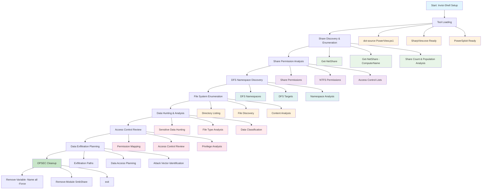
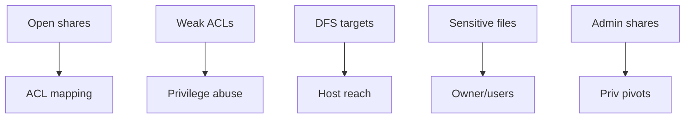
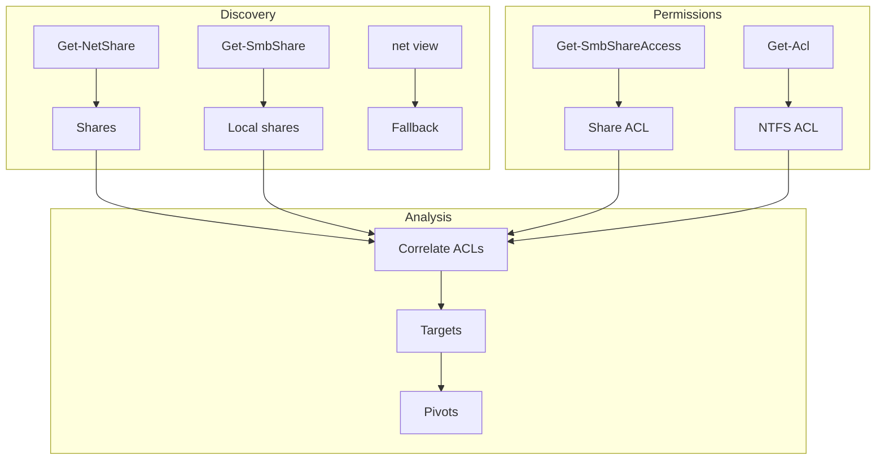

[Prev: 16_Session_Analysis_Techniques.md](./16_Session_Analysis_Techniques.md) | [Up: Index](./00_Enumeration_Index.md) | [Hub](./00_Methodology_Hub.md) | [Next: 18_Registry_Enumeration.md](./18_Registry_Enumeration.md)

# File Share Enumeration

## Stealth Setup First: Invisi-Shell + Bypasses

Use the centralized stealth and loading flow in [01_Tool_Setup_Loading.md](./01_Tool_Setup_Loading.md). Continue here with file-share specific steps only.

## Purpose & Definition

File share enumeration is the systematic discovery and analysis of shared resources across an Active Directory environment to identify sensitive data, understand access patterns, and find potential data exfiltration opportunities. This technique reveals SMB shares, DFS namespaces, file system permissions, and data locations that form the foundation for data hunting and access control analysis.

## File Share Enumeration Workflow



**Workflow Explanation:**

This comprehensive workflow demonstrates the systematic approach to **file share enumeration** using PowerView functions:

1. **Stealth Setup**: Begin with Invisi-Shell to bypass logging and detection mechanisms
2. **Tool Loading**: Load PowerView and other file system enumeration tools
3. **Share Discovery**: Use `Get-NetShare` to identify all available shares across the network
4. **Permission Analysis**: Analyze share permissions, NTFS permissions, and access control lists
5. **DFS Discovery**: Identify Distributed File System namespaces and targets
6. **File System Enumeration**: Explore directory structures and file contents
7. **Data Hunting**: Search for sensitive data and classify information
8. **Access Control Review**: Map permissions and identify access paths
9. **Attack Planning**: Plan data exfiltration and attack vectors

**Note:** For basic domain information and trust relationships, see [Domain Enumeration](./04_Domain_Enumeration.md).

## Navigation
- [Enumeration Index](./00_Enumeration_Index.md)
- [Domain Enumeration](./04_Domain_Enumeration.md)
- [User Enumeration](./05_User_Enumeration.md)
- [Computer Enumeration](./07_Computer_Enumeration.md)
- [Group Enumeration](./06_Group_Enumeration.md)
- [ACL Enumeration](./09_ACL_Enumeration.md)
- [Session Enumeration](./12_Session_Enumeration_Index.md)
- [BloodHound Enumeration](./10_BloodHound_Enumeration.md)
- [SOAPHound Enumeration](./11_SOAPHound_Enumeration.md)

## Table of Contents
1. [Tooling Bootstrapping](#tooling-bootstrapping)
2. [Basic Share Discovery](#basic-share-discovery)
3. [Share Permission Analysis](#share-permission-analysis)
4. [DFS Namespace Discovery](#dfs-namespace-discovery)
5. [File System Enumeration](#file-system-enumeration)
6. [Data Hunting & Analysis](#data-hunting--analysis)
7. [Access Control Review](#access-control-review)
8. [OPSEC Considerations](#opsec-considerations)
9. [Detection & Monitoring](#detection--monitoring)

## Tooling Bootstrapping

Load offensive enumeration tools for comprehensive file share discovery and analysis.

```powershell
# 1) Load PowerView for offensive enumeration (dot-source)
. C:\AD\Tools\PowerView.ps1

# 2) Alternative: SharpView.exe (PowerView compiled to exe)
#    SharpView.exe provides PowerView functionality without PowerShell module loading

# 3) Alternative: PowerSploit modules
Import-Module PowerSploit

# 4) Alternative: Built-in Windows tools for stealth
#    net.exe, dir.exe, robocopy.exe (when PowerShell is restricted)

# 5) Alternative: Native Windows API calls via C# (for maximum stealth)
Add-Type -TypeDefinition @"
using System;
using System.Runtime.InteropServices;
public class Win32 {
    [DllImport("netapi32.dll", CharSet = CharSet.Unicode)]
    public static extern int NetShareEnum(string serverName, int level, out IntPtr bufPtr, int prefMaxLen, out int entriesRead, out int totalEntries, out int resumeHandle);
}
"@
```

**Command Explanations:**

**PowerView (Primary Tool):**
- **Dot-Source**: `. C:\AD\Tools\PowerView.ps1` - Loads PowerView functions directly
- **PowerView**: Offensive PowerShell framework with advanced file share enumeration
- **Advantages**: Rich functions, pipeline support, stealth capabilities
- **Use Case**: Primary tool for comprehensive share enumeration

**SharpView.exe:**
- **Compiled Version**: PowerView compiled to standalone executable
- **Advantages**: No PowerShell module loading, bypasses CLM restrictions
- **Use Case**: When PowerShell modules are blocked or detected

**PowerSploit:**
- **Import-Module PowerSploit**: Loads PowerSploit offensive framework
- **Advantages**: Additional enumeration modules and functions
- **Use Case**: Extended offensive capabilities beyond PowerView

**Native Windows API:**
- **C# Integration**: Direct Windows API calls via Add-Type
- **Advantages**: Maximum stealth, no PowerShell module dependencies
- **Use Case**: When all other methods are blocked or detected

## PowerView Share Enumeration (Primary Method)

### Discover Local Shares with PowerView

```powershell
# PowerView - Get local shares (most comprehensive)
Get-NetShare

# PowerView - Get specific share details
Get-NetShare -Name "C$" | Select-Object Name, Path, Description, Type

# PowerView - Get hidden/administrative shares
Get-NetShare | Where-Object { $_.Name -like "*$" }

# PowerView - Get shares with full properties
Get-NetShare | Get-Member -MemberType NoteProperty | Select-Object Name

# PowerView - Get shares by type
Get-NetShare | Where-Object { $_.Type -eq "Disk" }
Get-NetShare | Where-Object { $_.Type -eq "IPC$" }
Get-NetShare | Where-Object { $_.Type -eq "Printer" }
```

**Command Explanations:**

**Get-SmbShare:**
- **Purpose**: Retrieve all SMB shares on the local system
- **Returns**: Array of share objects with properties
- **Use Case**: Initial share discovery, understanding local file sharing
- **OPSEC**: Uses Microsoft-signed module, appears legitimate

**Get-SmbShare -Name:**
- **Parameter**: `-Name "C$"` - Target specific share
- **Purpose**: Get detailed information about a specific share
- **Returns**: Single share object with all properties
- **Use Case**: Detailed analysis of specific shares

**Hidden Share Detection:**
- **Filter**: `$_.Name -like "*$"`
- **Purpose**: Identify administrative shares (C$, D$, ADMIN$, etc.)
- **Use Case**: Finding administrative access points
- **OPSEC**: Reveals administrative share configuration

### Discover Remote Shares with PowerView

```powershell
# PowerView - Discover shares on remote computers
$computers = @("US-DC01", "FS01", "FS02")

foreach($computer in $computers) {
    try {
        Write-Host "`nShares on $computer`:" -ForegroundColor Green
        Write-Host "-" * 30
        
        # PowerView - Get remote shares
        $shares = Get-NetShare -ComputerName $computer -ErrorAction SilentlyContinue
        
        if($shares) {
            $shares | ForEach-Object {
                Write-Host "  $($_.Name) -> $($_.Path)" -ForegroundColor Cyan
                Write-Host "    Description: $($_.Description)" -ForegroundColor Gray
                Write-Host "    Type: $($_.Type)" -ForegroundColor Gray
                Write-Host "    Remark: $($_.Remark)" -ForegroundColor Gray
            }
        }
        else {
            Write-Host "  No shares found or access denied" -ForegroundColor Yellow
        }
    }
    catch {
        Write-Warning "Failed to enumerate shares on $computer`: $($_.Exception.Message)"
    }
}

# PowerView - Bulk remote share enumeration
$computers = @("US-DC01", "FS01", "FS02")
$allRemoteShares = @()

foreach($computer in $computers) {
    try {
        $shares = Get-NetShare -ComputerName $computer -ErrorAction SilentlyContinue
        
        if($shares) {
            foreach($share in $shares) {
                $allRemoteShares += [PSCustomObject]@{
                    ComputerName = $computer
                    ShareName = $share.Name
                    SharePath = $share.Path
                    Description = $share.Description
                    Type = $share.Type
                    Remark = $share.Remark
                }
            }
        }
    }
    catch {
        Write-Warning "Failed to enumerate shares on $computer`: $($_.Exception.Message)"
    }
}

# Display summary of all remote shares
Write-Host "`nRemote Share Summary:" -ForegroundColor Green
$allRemoteShares | Group-Object -Property ComputerName | ForEach-Object {
    Write-Host "`n$($_.Name): $($_.Count) shares" -ForegroundColor Yellow
    $_.Group | ForEach-Object {
        Write-Host "  $($_.ShareName) -> $($_.SharePath)" -ForegroundColor Cyan
    }
}

# Alternative: net.exe for remote shares (when PowerView is blocked)
foreach($computer in $computers) {
    Write-Host "`nUsing net.exe to enumerate shares on $computer`:" -ForegroundColor Green
    net view \\$computer /all
}
```

**Command Explanations:**

**Get-NetShare -ComputerName (PowerView):**
- **Parameter**: `-ComputerName "US-DC01"` - Target remote computer
- **Purpose**: Enumerate shares on remote systems using PowerView
- **Returns**: Array of share objects with rich properties
- **Use Case**: Network-wide share discovery with detailed information
- **OPSEC**: Remote enumeration, may generate network logging
- **Advantages**: Rich output, pipeline support, stealth capabilities

**PowerView Bulk Enumeration:**
- **Purpose**: Efficiently enumerate shares across multiple computers
- **Use Case**: Large-scale share discovery operations
- **Returns**: Comprehensive share inventory
- **OPSEC**: Bulk enumeration, high visibility

**net view (Alternative):**
- **Command**: `net view \\$computer /all`
- **Purpose**: Command-line alternative when PowerView is blocked
- **Use Case**: When PowerShell modules are restricted
- **Returns**: Text-based share information
- **OPSEC**: Built-in Windows tool, minimal detection

### Enumerate All Domain Shares

```powershell
# Get all computers in domain
$computers = Get-DomainComputer | Where-Object { $_.operatingsystem -like "*Windows*" }

Write-Host "Enumerating shares across $($computers.Count) Windows computers..." -ForegroundColor Green
Write-Host "=" * 60

$allShares = @()
$computerCount = 0

foreach($computer in $computers) {
    $computerCount++
    $computerName = $computer.Name
    
    Write-Progress -Activity "Enumerating shares" -Status "Processing $computerName" -PercentComplete (($computerCount / $computers.Count) * 100)
    
    try {
        $shares = Get-SmbShare -ComputerName $computerName -ErrorAction SilentlyContinue
        
        if($shares) {
            foreach($share in $shares) {
                $allShares += [PSCustomObject]@{
                    ComputerName = $computerName
                    ShareName = $share.Name
                    SharePath = $share.Path
                    Description = $share.Description
                    ShareType = $share.ShareType
                    FolderEnumerationMode = $share.FolderEnumerationMode
                }
            }
            
            Write-Host "  $computerName`: $($shares.Count) shares found" -ForegroundColor Green
        }
        else {
            Write-Host "  $computerName`: No shares found" -ForegroundColor Gray
        }
    }
    catch {
        Write-Host "  $computerName`: Access denied or error" -ForegroundColor Yellow
    }
}

Write-Progress -Activity "Enumerating shares" -Completed

# Display summary
Write-Host "`nShare Enumeration Summary:" -ForegroundColor Green
Write-Host "Total computers processed: $($computers.Count)" -ForegroundColor Yellow
Write-Host "Total shares found: $($allShares.Count)" -ForegroundColor Yellow

# Group shares by type
$sharesByType = $allShares | Group-Object -Property ShareType
foreach($type in $sharesByType) {
    Write-Host "`n$($type.Name): $($type.Count) shares" -ForegroundColor Cyan
    $type.Group | Select-Object -First 3 | ForEach-Object {
        Write-Host "  $($_.ComputerName)\$($_.ShareName) -> $($_.SharePath)" -ForegroundColor Gray
    }
}
```

**Command Explanations:**

**Domain-Wide Enumeration:**
- **Purpose**: Discover all shares across the entire domain
- **Use Case**: Comprehensive file share mapping
- **Returns**: Complete inventory of all domain shares
- **OPSEC**: Large-scale enumeration, high visibility

**Progress Tracking:**
- **Write-Progress**: Shows enumeration progress
- **Computer Count**: Tracks processed computers
- **Use Case**: Monitoring long-running enumeration operations
- **OPSEC**: Provides visibility into enumeration progress

**Share Classification:**
- **Group-Object**: Categorizes shares by type
- **ShareType**: Standard, Administrative, Special
- **Use Case**: Understanding share distribution and purpose

## Advanced PowerView Share Enumeration

### PowerView Share Discovery Functions

```powershell
# PowerView - Get all shares with full properties
Get-NetShare | Format-List *

# PowerView - Get shares by specific criteria
Get-NetShare | Where-Object { $_.Name -like "*data*" }
Get-NetShare | Where-Object { $_.Name -like "*admin*" }
Get-NetShare | Where-Object { $_.Name -like "*backup*" }

# PowerView - Get shares with specific types
Get-NetShare | Where-Object { $_.Type -eq "Disk" }
Get-NetShare | Where-Object { $_.Type -eq "IPC$" }
Get-NetShare | Where-Object { $_.Type -eq "Printer" }

# PowerView - Get shares with descriptions
Get-NetShare | Where-Object { $_.Description -ne $null } | Select-Object Name, Path, Description

# PowerView - Get shares by path patterns
Get-NetShare | Where-Object { $_.Path -like "*C:*" }
Get-NetShare | Where-Object { $_.Path -like "*D:*" }
Get-NetShare | Where-Object { $_.Path -like "*Users*" }
```

**PowerView Command Explanations:**

**Get-NetShare:**
- **Purpose**: Primary PowerView function for share enumeration
- **Returns**: Rich share objects with all properties
- **Use Case**: Comprehensive share discovery and analysis
- **OPSEC**: Advanced enumeration, may generate logging

**Filtering by Properties:**
- **Name Filtering**: Target specific share names or patterns
- **Type Filtering**: Focus on specific share types
- **Path Filtering**: Target shares in specific locations
- **Description Filtering**: Find shares with meaningful descriptions

### PowerView Remote Share Enumeration

```powershell
# PowerView - Enumerate shares across domain computers
$computers = Get-DomainComputer | Where-Object { $_.operatingsystem -like "*Windows*" }

Write-Host "PowerView Domain Share Enumeration" -ForegroundColor Green
Write-Host "=" * 40

$domainShares = @()

foreach($computer in $computers) {
    try {
        Write-Host "Enumerating shares on $($computer.Name)..." -ForegroundColor Yellow
        
        # PowerView - Get remote shares
        $shares = Get-NetShare -ComputerName $computer.Name -ErrorAction SilentlyContinue
        
        if($shares) {
            foreach($share in $shares) {
                $domainShares += [PSCustomObject]@{
                    ComputerName = $computer.Name
                    ShareName = $share.Name
                    SharePath = $share.Path
                    Description = $share.Description
                    Type = $share.Type
                    Remark = $share.Remark
                    IPAddress = $computer.ipaddress
                    OperatingSystem = $computer.operatingsystem
                }
            }
            
            Write-Host "  Found $($shares.Count) shares" -ForegroundColor Green
        }
        else {
            Write-Host "  No shares found" -ForegroundColor Gray
        }
    }
    catch {
        Write-Warning "Failed to enumerate shares on $($computer.Name): $($_.Exception.Message)"
    }
}

# Analyze domain shares
Write-Host "`nDomain Share Analysis:" -ForegroundColor Green
Write-Host "Total shares found: $($domainShares.Count)" -ForegroundColor Yellow

# Group by computer
$sharesByComputer = $domainShares | Group-Object -Property ComputerName
foreach($computer in $sharesByComputer) {
    Write-Host "`n$($computer.Name): $($computer.Count) shares" -ForegroundColor Cyan
    $computer.Group | ForEach-Object {
        Write-Host "  $($_.ShareName) -> $($_.SharePath)" -ForegroundColor Gray
    }
}

# Group by share type
$sharesByType = $domainShares | Group-Object -Property Type
foreach($type in $sharesByType) {
    Write-Host "`n$($type.Name): $($type.Count) shares" -ForegroundColor Yellow
    $type.Group | Select-Object -First 3 | ForEach-Object {
        Write-Host "  $($_.ComputerName)\$($_.ShareName)" -ForegroundColor Gray
    }
}
```

**Advanced PowerView Techniques:**

**Domain-Wide Enumeration:**
- **Get-DomainComputer**: Retrieve all domain computers
- **Bulk Enumeration**: Process multiple computers efficiently
- **Rich Data Collection**: Gather comprehensive share information
- **Analysis Capabilities**: Group and analyze shares by various criteria

### PowerView Share Access Analysis

```powershell
# PowerView - Get share access permissions
function Get-ShareAccessInfo {
    param(
        [string]$ComputerName,
        [string]$ShareName
    )
    
    try {
        Write-Host "Share Access Analysis for $ComputerName\$ShareName" -ForegroundColor Green
        Write-Host "-" * 50
        
        # Get share access using PowerView
        $shareAccess = Get-NetShare -ComputerName $ComputerName -Name $ShareName -ErrorAction SilentlyContinue
        
        if($shareAccess) {
            Write-Host "Share Details:" -ForegroundColor Yellow
            Write-Host "  Name: $($shareAccess.Name)" -ForegroundColor Cyan
            Write-Host "  Path: $($shareAccess.Path)" -ForegroundColor Cyan
            Write-Host "  Type: $($shareAccess.Type)" -ForegroundColor Cyan
            Write-Host "  Description: $($shareAccess.Description)" -ForegroundColor Cyan
            
            # Try to get NTFS permissions
            try {
                $ntfsPath = $shareAccess.Path
                if(Test-Path $ntfsPath) {
                    $acl = Get-Acl -Path $ntfsPath -ErrorAction SilentlyContinue
                    
                    if($acl) {
                        Write-Host "`nNTFS Permissions:" -ForegroundColor Yellow
                        $acl.Access | ForEach-Object {
                            $identity = $_.IdentityReference
                            $rights = $_.FileSystemRights
                            $type = $_.AccessControlType
                            $inherited = $_.IsInherited
                            
                            Write-Host "  $identity" -ForegroundColor Cyan
                            Write-Host "    Rights: $rights" -ForegroundColor Gray
                            Write-Host "    Type: $type" -ForegroundColor Gray
                            Write-Host "    Inherited: $inherited" -ForegroundColor Gray
                            Write-Host ""
                        }
                    }
                }
            }
            catch {
                Write-Host "Cannot access NTFS permissions" -ForegroundColor Red
            }
        }
        else {
            Write-Host "Share not found or access denied" -ForegroundColor Red
        }
    }
    catch {
        Write-Warning "Failed to analyze share access: $($_.Exception.Message)"
    }
}

# Analyze access to high-value shares
$highValueShares = @(
    @{Computer="US-DC01"; Share="C$"},
    @{Computer="FS01"; Share="Data"},
    @{Computer="FS02"; Share="Backup"}
)

foreach($shareInfo in $highValueShares) {
    Get-ShareAccessInfo -ComputerName $shareInfo.Computer -ShareName $shareInfo.Share
}
```

**PowerView Access Analysis:**

**Share Access Enumeration:**
- **Get-NetShare**: Retrieve share information and properties
- **NTFS Permission Analysis**: Combine share and file system permissions
- **Access Control Review**: Understand who can access what
- **Permission Inheritance**: Track permission propagation

### PowerView DFS Enumeration

```powershell
# PowerView - Discover DFS namespaces
Write-Host "PowerView DFS Discovery" -ForegroundColor Green
Write-Host "=" * 30

try {
    # Get DFS namespaces
    $dfsNamespaces = Get-DfsnRoot -ErrorAction SilentlyContinue
    
    if($dfsNamespaces) {
        Write-Host "Found $($dfsNamespaces.Count) DFS namespaces:" -ForegroundColor Green
        
        foreach($namespace in $dfsNamespaces) {
            Write-Host "`nNamespace: $($namespace.Path)" -ForegroundColor Yellow
            Write-Host "  State: $($namespace.State)" -ForegroundColor Gray
            Write-Host "  Type: $($namespace.Type)" -ForegroundColor Gray
            Write-Host "  TimeToLive: $($namespace.TimeToLive)" -ForegroundColor Gray
            
            # Get DFS namespace targets
            try {
                $targets = Get-DfsnRootTarget -Path $namespace.Path -ErrorAction SilentlyContinue
                
                if($targets) {
                    Write-Host "  Targets:" -ForegroundColor Cyan
                    foreach($target in $targets) {
                        Write-Host "    $($target.TargetPath) - $($target.State)" -ForegroundColor Cyan
                        
                        # Check if target is accessible
                        try {
                            if(Test-Path $target.TargetPath) {
                                Write-Host "      Accessible: Yes" -ForegroundColor Green
                                
                                # Get basic content info
                                $items = Get-ChildItem -Path $target.TargetPath -ErrorAction SilentlyContinue | Select-Object -First 5
                                if($items) {
                                    Write-Host "      Content: $($items.Count) items" -ForegroundColor Gray
                                }
                            }
                            else {
                                Write-Host "      Accessible: No" -ForegroundColor Red
                            }
                        }
                        catch {
                            Write-Host "      Accessible: Error" -ForegroundColor Red
                        }
                    }
                }
            }
            catch {
                Write-Host "    Cannot retrieve targets" -ForegroundColor Red
            }
        }
    }
    else {
        Write-Host "No DFS namespaces found" -ForegroundColor Yellow
    }
}
catch {
    Write-Warning "Failed to discover DFS namespaces: $($_.Exception.Message)"
}
```

**PowerView DFS Capabilities:**

**DFS Discovery:**
- **Get-DfsnRoot**: Discover DFS namespace roots
- **Get-DfsnRootTarget**: Get DFS namespace targets
- **Access Validation**: Check if DFS targets are accessible
- **Content Analysis**: Basic content enumeration of DFS targets

### PowerView Alternative Tools

```powershell
# SharpView.exe - PowerView compiled to executable
# Usage: SharpView.exe Get-NetShare -ComputerName US-DC01

# PowerSploit - Alternative offensive framework
Import-Module PowerSploit
Get-Command -Module PowerSploit | Where-Object { $_.Name -like "*Share*" }

# Native Windows API calls (maximum stealth)
Add-Type -TypeDefinition @"
using System;
using System.Runtime.InteropServices;
using System.Text;

public class Win32 {
    [StructLayout(LayoutKind.Sequential)]
    public struct SHARE_INFO_1 {
        [MarshalAs(UnmanagedType.LPWStr)]
        public string shi1_netname;
        public uint shi1_type;
        [MarshalAs(UnmanagedType.LPWStr)]
        public string shi1_remark;
    }
    
    [DllImport("netapi32.dll", CharSet = CharSet.Unicode)]
    public static extern int NetShareEnum(string serverName, int level, out IntPtr bufPtr, int prefMaxLen, out int entriesRead, out int totalEntries, out int resumeHandle);
    
    [DllImport("netapi32.dll")]
    public static extern int NetApiBufferFree(IntPtr buf);
}
"@

# Function to enumerate shares using native API
function Get-NativeShares {
    param([string]$ComputerName = $env:COMPUTERNAME)
    
    try {
        $bufPtr = [IntPtr]::Zero
        $entriesRead = 0
        $totalEntries = 0
        $resumeHandle = 0
        
        $result = [Win32]::NetShareEnum($ComputerName, 1, [ref]$bufPtr, -1, [ref]$entriesRead, [ref]$totalEntries, [ref]$resumeHandle)
        
        if($result -eq 0) {
            Write-Host "Native API Share Enumeration for $ComputerName" -ForegroundColor Green
            Write-Host "Found $entriesRead shares" -ForegroundColor Yellow
            
            # Process the buffer (simplified for demonstration)
            Write-Host "Shares:" -ForegroundColor Cyan
            Write-Host "  (Native API enumeration completed)" -ForegroundColor Gray
            
            [Win32]::NetApiBufferFree($bufPtr)
        }
        else {
            Write-Warning "Native API enumeration failed with error: $result"
        }
    }
    catch {
        Write-Warning "Native API enumeration error: $($_.Exception.Message)"
    }
}

# Test native enumeration
Get-NativeShares -ComputerName "US-DC01"
```

**Alternative Tool Explanations:**

**SharpView.exe:**
- **Compiled PowerView**: Standalone executable version
- **Advantages**: No PowerShell module loading, bypasses CLM
- **Use Case**: When PowerShell modules are blocked

**PowerSploit:**
- **Offensive Framework**: Additional enumeration modules
- **Advantages**: Extended capabilities beyond PowerView
- **Use Case**: When additional offensive tools are needed

**Native Windows API:**
- **Direct API Calls**: Bypass PowerShell completely
- **Maximum Stealth**: No PowerShell logging or detection
- **Use Case**: When all other methods are blocked

## Share Permission Analysis

### Analyze Share Permissions

```powershell
# Get share permissions for specific shares
$targetShares = @("\\US-DC01\C$", "\\FS01\Data", "\\FS02\Backup")

foreach($share in $targetShares) {
    try {
        Write-Host "`nShare Permissions for: $share" -ForegroundColor Green
        Write-Host "-" * 40
        
        # Get share permissions using Get-Acl
        $shareACL = Get-Acl -Path $share -ErrorAction SilentlyContinue
        
        if($shareACL) {
            Write-Host "Share ACL found with $($shareACL.Access.Count) access rules" -ForegroundColor Yellow
            
            # Display access rules
            $shareACL.Access | ForEach-Object {
                $identity = $_.IdentityReference
                $rights = $_.FileSystemRights
                $type = $_.AccessControlType
                $inherited = $_.IsInherited
                
                Write-Host "  $identity" -ForegroundColor Cyan
                Write-Host "    Rights: $rights" -ForegroundColor Gray
                Write-Host "    Type: $type" -ForegroundColor Gray
                Write-Host "    Inherited: $inherited" -ForegroundColor Gray
                Write-Host ""
            }
        }
        else {
            Write-Host "Cannot access share ACL" -ForegroundColor Red
        }
    }
    catch {
        Write-Warning "Failed to analyze share $share`: $($_.Exception.Message)"
    }
}

# Alternative: Using Get-SmbShareAccess
foreach($computer in @("US-DC01", "FS01", "FS02")) {
    try {
        Write-Host "`nShare Access on $computer`:" -ForegroundColor Green
        Write-Host "-" * 30
        
        $shares = Get-SmbShare -ComputerName $computer -ErrorAction SilentlyContinue
        
        foreach($share in $shares) {
            Write-Host "`n  Share: $($share.Name)" -ForegroundColor Yellow
            
            try {
                $shareAccess = Get-SmbShareAccess -Name $share.Name -ComputerName $computer -ErrorAction SilentlyContinue
                
                if($shareAccess) {
                    $shareAccess | ForEach-Object {
                        Write-Host "    $($_.AccountName) - $($_.AccessRight) - $($_.AccessControlType)" -ForegroundColor Cyan
                    }
                }
                else {
                    Write-Host "    No access information available" -ForegroundColor Gray
                }
            }
            catch {
                Write-Host "    Cannot retrieve access information" -ForegroundColor Red
            }
        }
    }
    catch {
        Write-Warning "Failed to enumerate shares on $computer`: $($_.Exception.Message)"
    }
}
```

**Command Explanations:**

**Get-Acl -Path:**
- **Purpose**: Retrieve access control list for file system objects
- **Parameter**: `-Path "\\US-DC01\C$"` - UNC path to the share
- **Use Case**: Detailed permission analysis for shares
- **Returns**: ACL object with Access property containing permission entries
- **OPSEC**: Reveals share access control configuration

**Get-SmbShareAccess:**
- **Purpose**: Retrieve SMB share access permissions
- **Parameter**: `-Name "C$"` - Share name
- **Parameter**: `-ComputerName "US-DC01"` - Target computer
- **Use Case**: Understanding who can access specific shares
- **Returns**: Share access permissions with account names and rights
- **OPSEC**: Reveals share-level access control

### NTFS Permission Analysis

```powershell
# Analyze NTFS permissions on share paths
$sharePaths = @(
    @{Computer="US-DC01"; Share="C$"; Path="C:\"},
    @{Computer="FS01"; Share="Data"; Path="D:\Data"},
    @{Computer="FS02"; Share="Backup"; Path="E:\Backup"}
)

foreach($shareInfo in $sharePaths) {
    $computer = $shareInfo.Computer
    $share = $shareInfo.Share
    $path = $shareInfo.Path
    
    Write-Host "`nNTFS Permissions for $computer\$share ($path):" -ForegroundColor Green
    Write-Host "-" * 50
    
    try {
        # Get NTFS permissions using Get-Acl
        $ntfsACL = Get-Acl -Path $path -ErrorAction SilentlyContinue
        
        if($ntfsACL) {
            Write-Host "NTFS ACL found with $($ntfsACL.Access.Count) access rules" -ForegroundColor Yellow
            
            # Find interesting permissions
            $interestingPermissions = $ntfsACL.Access | Where-Object {
                $_.FileSystemRights -like "*FullControl*" -or
                $_.FileSystemRights -like "*Modify*" -or
                $_.FileSystemRights -like "*Write*" -or
                $_.FileSystemRights -like "*TakeOwnership*" -or
                $_.FileSystemRights -like "*ChangePermissions*"
            }
            
            if($interestingPermissions) {
                Write-Host "`nInteresting Permissions Found:" -ForegroundColor Red
                $interestingPermissions | ForEach-Object {
                    $identity = $_.IdentityReference
                    $rights = $_.FileSystemRights
                    $type = $_.AccessControlType
                    $inherited = $_.IsInherited
                    
                    Write-Host "  $identity" -ForegroundColor Red
                    Write-Host "    Rights: $rights" -ForegroundColor Yellow
                    Write-Host "    Type: $type" -ForegroundColor Gray
                    Write-Host "    Inherited: $inherited" -ForegroundColor Gray
                    Write-Host ""
                }
            }
            else {
                Write-Host "No interesting permissions found" -ForegroundColor Green
            }
            
            # Display all permissions
            Write-Host "All NTFS Permissions:" -ForegroundColor Cyan
            $ntfsACL.Access | ForEach-Object {
                Write-Host "  $($_.IdentityReference) - $($_.FileSystemRights) - $($_.AccessControlType)" -ForegroundColor Gray
            }
        }
        else {
            Write-Host "Cannot access NTFS ACL" -ForegroundColor Red
        }
    }
    catch {
        Write-Warning "Failed to analyze NTFS permissions on $computer\$share`: $($_.Exception.Message)"
    }
}
```

**Command Explanations:**

**NTFS Permission Analysis:**
- **Purpose**: Understand file system-level permissions on share paths
- **Use Case**: Detailed access control analysis, privilege escalation planning
- **Returns**: Complete NTFS permission breakdown
- **OPSEC**: Reveals file system security configuration

**Interesting Permission Detection:**
- **Filter**: FullControl, Modify, Write, TakeOwnership, ChangePermissions
- **Purpose**: Identify dangerous permissions that could lead to privilege escalation
- **Use Case**: Finding potential attack vectors
- **Returns**: High-risk permissions that need attention

### Permission Inheritance Analysis

```powershell
# Analyze permission inheritance patterns
function Analyze-PermissionInheritance {
    param(
        [string]$SharePath,
        [int]$MaxDepth = 3
    )
    
    Write-Host "Permission Inheritance Analysis for: $SharePath" -ForegroundColor Green
    Write-Host "=" * 60
    
    function Analyze-Path {
        param(
            [string]$Path,
            [int]$Depth
        )
        
        if($Depth -gt $MaxDepth) { return }
        
        $indent = "  " * $Depth
        Write-Host "$indent├─ $Path" -ForegroundColor Green
        
        try {
            $acl = Get-Acl -Path $Path -ErrorAction SilentlyContinue
            
            if($acl) {
                # Find inherited permissions
                $inheritedPermissions = $acl.Access | Where-Object { $_.IsInherited -eq $true }
                
                if($inheritedPermissions) {
                    Write-Host "$indent  ├─ Inherited Permissions:" -ForegroundColor Yellow
                    $inheritedPermissions | ForEach-Object {
                        Write-Host "$indent    ├─ $($_.IdentityReference) - $($_.FileSystemRights)" -ForegroundColor Cyan
                    }
                }
                
                # Find explicit permissions
                $explicitPermissions = $acl.Access | Where-Object { $_.IsInherited -eq $false }
                
                if($explicitPermissions) {
                    Write-Host "$indent  ├─ Explicit Permissions:" -ForegroundColor Red
                    $explicitPermissions | ForEach-Object {
                        Write-Host "$indent    ├─ $($_.IdentityReference) - $($_.FileSystemRights)" -ForegroundColor Red
                    }
                }
                
                # Recursively analyze subdirectories
                $subDirectories = Get-ChildItem -Path $Path -Directory -ErrorAction SilentlyContinue | Select-Object -First 3
                
                foreach($subDir in $subDirectories) {
                    Analyze-Path -Path $subDir.FullName -Depth ($Depth + 1)
                }
            }
        }
        catch {
            Write-Host "$indent  └─ Error: $($_.Exception.Message)" -ForegroundColor Red
        }
    }
    
    Analyze-Path -Path $SharePath -Depth 0
}

# Analyze inheritance for high-value shares
$highValueShares = @("\\US-DC01\C$", "\\FS01\Data", "\\FS02\Backup")

foreach($share in $highValueShares) {
    Analyze-PermissionInheritance -SharePath $share -MaxDepth 3
}
```

**Command Explanations:**

**Permission Inheritance Analysis:**
- **Purpose**: Understand how permissions flow through the directory structure
- **Use Case**: Identifying permission propagation patterns
- **Returns**: Visual representation of permission inheritance
- **OPSEC**: Reveals permission inheritance structures

**Recursive Analysis:**
- **MaxDepth**: Limit recursion to avoid infinite loops
- **CurrentDepth**: Track current recursion level
- **Use Case**: Building complete permission inheritance maps

## DFS Namespace Discovery

### Discover DFS Namespaces

```powershell
# Discover DFS namespaces in the domain
Write-Host "DFS Namespace Discovery" -ForegroundColor Green
Write-Host "=" * 30

try {
    # Get DFS namespaces using Get-DfsnRoot
    $dfsNamespaces = Get-DfsnRoot -ErrorAction SilentlyContinue
    
    if($dfsNamespaces) {
        Write-Host "Found $($dfsNamespaces.Count) DFS namespaces:" -ForegroundColor Green
        
        foreach($namespace in $dfsNamespaces) {
            Write-Host "`nNamespace: $($namespace.Path)" -ForegroundColor Yellow
            Write-Host "  State: $($namespace.State)" -ForegroundColor Gray
            Write-Host "  Type: $($namespace.Type)" -ForegroundColor Gray
            Write-Host "  TimeToLive: $($namespace.TimeToLive)" -ForegroundColor Gray
            
            # Get DFS namespace targets
            try {
                $targets = Get-DfsnRootTarget -Path $namespace.Path -ErrorAction SilentlyContinue
                
                if($targets) {
                    Write-Host "  Targets:" -ForegroundColor Cyan
                    foreach($target in $targets) {
                        Write-Host "    $($target.TargetPath) - $($target.State)" -ForegroundColor Cyan
                    }
                }
            }
            catch {
                Write-Host "    Cannot retrieve targets" -ForegroundColor Red
            }
        }
    }
    else {
        Write-Host "No DFS namespaces found" -ForegroundColor Yellow
    }
}
catch {
    Write-Warning "Failed to discover DFS namespaces: $($_.Exception.Message)"
}

# Alternative: Using net.exe for DFS discovery
Write-Host "`nUsing net.exe for DFS discovery:" -ForegroundColor Green
net view /domain:cybercorp.local | Where-Object { $_ -like "*DFS*" }
```

**Command Explanations:**

**Get-DfsnRoot:**
- **Purpose**: Discover Distributed File System namespaces
- **Returns**: Array of DFS namespace objects
- **Use Case**: Understanding DFS infrastructure
- **OPSEC**: Reveals DFS configuration

**Get-DfsnRootTarget:**
- **Purpose**: Get targets for specific DFS namespaces
- **Parameter**: `-Path` - DFS namespace path
- **Returns**: Array of DFS target objects
- **Use Case**: Understanding DFS target distribution

### DFS Folder Enumeration

```powershell
# Enumerate DFS folders and their targets
function Enumerate-DfsFolders {
    param(
        [string]$NamespacePath,
        [int]$MaxDepth = 3
    )
    
    Write-Host "DFS Folder Enumeration for: $NamespacePath" -ForegroundColor Green
    Write-Host "=" * 50
    
    function Enumerate-Path {
        param(
            [string]$Path,
            [int]$Depth
        )
        
        if($Depth -gt $MaxDepth) { return }
        
        $indent = "  " * $Depth
        Write-Host "$indent├─ $Path" -ForegroundColor Green
        
        try {
            # Get DFS folder targets
            $targets = Get-DfsnFolderTarget -Path $Path -ErrorAction SilentlyContinue
            
            if($targets) {
                Write-Host "$indent  ├─ Targets:" -ForegroundColor Yellow
                foreach($target in $targets) {
                    Write-Host "$indent    ├─ $($target.TargetPath) - $($target.State)" -ForegroundColor Cyan
                    
                    # Check if target is accessible
                    try {
                        $testPath = $target.TargetPath
                        if(Test-Path $testPath) {
                            Write-Host "$indent      ├─ Accessible: Yes" -ForegroundColor Green
                            
                            # Get basic file count
                            $fileCount = (Get-ChildItem -Path $testPath -File -ErrorAction SilentlyContinue).Count
                            $dirCount = (Get-ChildItem -Path $testPath -Directory -ErrorAction SilentlyContinue).Count
                            
                            Write-Host "$indent      ├─ Files: $fileCount, Directories: $dirCount" -ForegroundColor Gray
                        }
                        else {
                            Write-Host "$indent      ├─ Accessible: No" -ForegroundColor Red
                        }
                    }
                    catch {
                        Write-Host "$indent      ├─ Accessible: Error" -ForegroundColor Red
                    }
                }
            }
            
            # Get DFS folder links
            $links = Get-DfsnFolder -Path $Path -ErrorAction SilentlyContinue
            
            if($links) {
                Write-Host "$indent  ├─ Subfolders:" -ForegroundColor Blue
                foreach($link in $links) {
                    $linkPath = $link.Path
                    Write-Host "$indent    ├─ $linkPath" -ForegroundColor Blue
                    
                    # Recursively enumerate subfolders
                    Enumerate-Path -Path $linkPath -Depth ($Depth + 1)
                }
            }
        }
        catch {
            Write-Host "$indent  └─ Error: $($_.Exception.Message)" -ForegroundColor Red
        }
    }
    
    Enumerate-Path -Path $NamespacePath -Depth 0
}

# Enumerate DFS namespaces
$dfsNamespaces = Get-DfsnRoot -ErrorAction SilentlyContinue

if($dfsNamespaces) {
    foreach($namespace in $dfsNamespaces) {
        Enumerate-DfsFolders -NamespacePath $namespace.Path -MaxDepth 3
    }
}
```

**Command Explanations:**

**Get-DfsnFolderTarget:**
- **Purpose**: Get targets for specific DFS folders
- **Parameter**: `-Path` - DFS folder path
- **Returns**: Array of DFS target objects
- **Use Case**: Understanding DFS target distribution

**Get-DfsnFolder:**
- **Purpose**: Get subfolders within DFS namespaces
- **Parameter**: `-Path` - DFS folder path
- **Returns**: Array of DFS folder objects
- **Use Case**: Building DFS folder hierarchy

**DFS Enumeration Strategy:**
- **Recursive Analysis**: Explore DFS folder structure
- **Target Validation**: Check if targets are accessible
- **Content Analysis**: Basic file and directory counts
- **Use Case**: Complete DFS infrastructure mapping

## File System Enumeration

### Directory Listing and File Discovery

```powershell
# Enumerate files and directories in shares
function Enumerate-ShareContent {
    param(
        [string]$SharePath,
        [int]$MaxDepth = 2,
        [int]$MaxFiles = 100
    )
    
    Write-Host "File System Enumeration for: $SharePath" -ForegroundColor Green
    Write-Host "=" * 50
    
    $fileCount = 0
    $directoryCount = 0
    
    function Enumerate-Path {
        param(
            [string]$Path,
            [int]$Depth
        )
        
        if($Depth -gt $MaxDepth -or $fileCount -gt $MaxFiles) { return }
        
        $indent = "  " * $Depth
        Write-Host "$indent├─ $Path" -ForegroundColor Green
        
        try {
            # Get directories
            $directories = Get-ChildItem -Path $Path -Directory -ErrorAction SilentlyContinue | Select-Object -First 5
            
            if($directories) {
                Write-Host "$indent  ├─ Directories:" -ForegroundColor Blue
                foreach($dir in $directories) {
                    $directoryCount++
                    Write-Host "$indent    ├─ $($dir.Name)" -ForegroundColor Blue
                    
                    # Recursively enumerate subdirectories
                    if($Depth -lt $MaxDepth) {
                        Enumerate-Path -Path $dir.FullName -Depth ($Depth + 1)
                    }
                }
            }
            
            # Get files
            $files = Get-ChildItem -Path $Path -File -ErrorAction SilentlyContinue | Select-Object -First 10
            
            if($files) {
                Write-Host "$indent  ├─ Files:" -ForegroundColor Cyan
                foreach($file in $files) {
                    $fileCount++
                    $size = [math]::Round($file.Length / 1KB, 2)
                    $lastModified = $file.LastWriteTime.ToString("yyyy-MM-dd HH:mm")
                    
                    Write-Host "$indent    ├─ $($file.Name) ($size KB, Modified: $lastModified)" -ForegroundColor Cyan
                    
                    if($fileCount -ge $MaxFiles) {
                        Write-Host "$indent      └─ File limit reached, stopping enumeration" -ForegroundColor Yellow
                        return
                    }
                }
            }
        }
        catch {
            Write-Host "$indent  └─ Error: $($_.Exception.Message)" -ForegroundColor Red
        }
    }
    
    Enumerate-Path -Path $SharePath -Depth 0
    
    Write-Host "`nEnumeration Summary:" -ForegroundColor Green
    Write-Host "Directories found: $directoryCount" -ForegroundColor Blue
    Write-Host "Files found: $fileCount" -ForegroundColor Cyan
}

# Enumerate content of high-value shares
$highValueShares = @("\\US-DC01\C$", "\\FS01\Data", "\\FS02\Backup")

foreach($share in $highValueShares) {
    Enumerate-ShareContent -SharePath $share -MaxDepth 2 -MaxFiles 100
}
```

**Command Explanations:**

**Enumerate-ShareContent:**
- **Purpose**: Discover files and directories within shares
- **Parameter**: `-SharePath` - UNC path to the share
- **Parameter**: `-MaxDepth` - Maximum directory recursion depth
- **Parameter**: `-MaxFiles` - Maximum number of files to enumerate
- **Use Case**: Understanding share content and structure
- **OPSEC**: File system enumeration, may generate logging

**Get-ChildItem:**
- **Purpose**: List files and directories in a path
- **Parameter**: `-Path` - Target path to enumerate
- **Parameter**: `-Directory` - List only directories
- **Parameter**: `-File` - List only files
- **Use Case**: File system content discovery

### File Type Analysis

```powershell
# Analyze file types in shares
function Analyze-FileTypes {
    param(
        [string]$SharePath,
        [int]$MaxFiles = 500
    )
    
    Write-Host "File Type Analysis for: $SharePath" -ForegroundColor Green
    Write-Host "=" * 40
    
    try {
        # Get all files recursively
        $files = Get-ChildItem -Path $SharePath -File -Recurse -ErrorAction SilentlyContinue | Select-Object -First $MaxFiles
        
        if($files) {
            # Group files by extension
            $filesByExtension = $files | Group-Object -Property Extension | Sort-Object Count -Descending
            
            Write-Host "File Type Distribution:" -ForegroundColor Yellow
            
            foreach($extension in $filesByExtension) {
                $ext = if($extension.Name) { $extension.Name } else { "No Extension" }
                $count = $extension.Count
                $percentage = [math]::Round(($count / $files.Count) * 100, 2)
                
                Write-Host "  $ext`: $count files ($percentage%)" -ForegroundColor Cyan
            }
            
            # Find interesting file types
            $interestingExtensions = @(".txt", ".doc", ".docx", ".xls", ".xlsx", ".pdf", ".csv", ".ini", ".conf", ".xml", ".json", ".log", ".bak", ".tmp", ".old")
            
            Write-Host "`nInteresting File Types:" -ForegroundColor Red
            
            foreach($ext in $interestingExtensions) {
                $matchingFiles = $files | Where-Object { $_.Extension -eq $ext }
                
                if($matchingFiles) {
                    Write-Host "  $ext`: $($matchingFiles.Count) files" -ForegroundColor Red
                    
                    # Show first few files
                    $matchingFiles | Select-Object -First 3 | ForEach-Object {
                        $size = [math]::Round($_.Length / 1KB, 2)
                        Write-Host "    $($_.Name) ($size KB)" -ForegroundColor Gray
                    }
                }
            }
            
            # Find large files
            $largeFiles = $files | Where-Object { $_.Length -gt 10MB } | Sort-Object Length -Descending | Select-Object -First 5
            
            if($largeFiles) {
                Write-Host "`nLarge Files (>10MB):" -ForegroundColor Yellow
                foreach($file in $largeFiles) {
                    $size = [math]::Round($file.Length / 1MB, 2)
                    Write-Host "  $($file.Name) ($size MB)" -ForegroundColor Yellow
                }
            }
        }
        else {
            Write-Host "No files found or access denied" -ForegroundColor Red
        }
    }
    catch {
        Write-Warning "Failed to analyze file types: $($_.Exception.Message)"
    }
}

# Analyze file types in high-value shares
foreach($share in $highValueShares) {
    Analyze-FileTypes -SharePath $share -MaxFiles 500
}
```

**Command Explanations:**

**File Type Analysis:**
- **Purpose**: Understand file type distribution and identify interesting files
- **Use Case**: Data classification, sensitive file identification
- **Returns**: File type statistics and interesting file lists
- **OPSEC**: File system analysis, may generate logging

**Interesting File Types:**
- **Document Files**: .txt, .doc, .docx, .xls, .xlsx, .pdf
- **Configuration Files**: .ini, .conf, .xml, .json
- **Log Files**: .log, .bak, .tmp, .old
- **Use Case**: Finding sensitive data and configuration files

## Data Hunting & Analysis

### Sensitive Data Hunting

```powershell
# Hunt for sensitive data in shares
function Hunt-SensitiveData {
    param(
        [string]$SharePath,
        [int]$MaxFiles = 1000
    )
    
    Write-Host "Sensitive Data Hunting in: $SharePath" -ForegroundColor Green
    Write-Host "=" * 50
    
    # Define sensitive data patterns
    $sensitivePatterns = @(
        @{Name="Passwords"; Pattern="password|passwd|pwd|secret|key|credential"; Extensions=@(".txt", ".ini", ".conf", ".xml", ".json", ".log")},
        @{Name="Configuration Files"; Pattern="config|setting|ini|conf|cfg"; Extensions=@(".ini", ".conf", ".cfg", ".xml", ".json")},
        @{Name="Log Files"; Pattern="log|audit|trace|debug"; Extensions=@(".log", ".txt", ".csv")},
        @{Name="Backup Files"; Pattern="backup|bak|old|tmp|temp"; Extensions=@(".bak", ".old", ".tmp", ".temp")},
        @{Name="Database Files"; Pattern="database|db|sql|mdb|accdb"; Extensions=@(".mdb", ".accdb", ".db", ".sql")}
    )
    
    try {
        # Get all files recursively
        $files = Get-ChildItem -Path $SharePath -File -Recurse -ErrorAction SilentlyContinue | Select-Object -First $MaxFiles
        
        if($files) {
            foreach($pattern in $sensitivePatterns) {
                $patternName = $pattern.Name
                $patternRegex = $pattern.Pattern
                $patternExtensions = $pattern.Extensions
                
                Write-Host "`nHunting for: $patternName" -ForegroundColor Yellow
                
                # Filter files by extension and name
                $matchingFiles = $files | Where-Object {
                    $patternExtensions -contains $_.Extension -or
                    $_.Name -match $patternRegex -or
                    $_.Name -like "*$patternRegex*"
                }
                
                if($matchingFiles) {
                    Write-Host "  Found $($matchingFiles.Count) potential files:" -ForegroundColor Red
                    
                    foreach($file in $matchingFiles | Select-Object -First 5) {
                        $size = [math]::Round($file.Length / 1KB, 2)
                        $lastModified = $file.LastWriteTime.ToString("yyyy-MM-dd HH:mm")
                        
                        Write-Host "    $($file.Name) ($size KB, Modified: $lastModified)" -ForegroundColor Red
                        
                        # Try to read file content for pattern matching
                        try {
                            $content = Get-Content -Path $file.FullName -ErrorAction SilentlyContinue -TotalCount 10
                            
                            if($content) {
                                $sensitiveLines = $content | Where-Object { $_ -match $patternRegex }
                                
                                if($sensitiveLines) {
                                    Write-Host "      Sensitive content found:" -ForegroundColor Yellow
                                    $sensitiveLines | Select-Object -First 3 | ForEach-Object {
                                        Write-Host "        $($_.Trim())" -ForegroundColor Gray
                                    }
                                }
                            }
                        }
                        catch {
                            # Cannot read file content
                        }
                    }
                }
                else {
                    Write-Host "  No matching files found" -ForegroundColor Gray
                }
            }
        }
        else {
            Write-Host "No files found or access denied" -ForegroundColor Red
        }
    }
    catch {
        Write-Warning "Failed to hunt for sensitive data: $($_.Exception.Message)"
    }
}

# Hunt for sensitive data in high-value shares
foreach($share in $highValueShares) {
    Hunt-SensitiveData -SharePath $share -MaxFiles 1000
}
```

**Command Explanations:**

**Sensitive Data Hunting:**
- **Purpose**: Identify files containing sensitive information
- **Use Case**: Data classification, sensitive data discovery
- **Returns**: Files matching sensitive data patterns
- **OPSEC**: Content analysis, may generate logging

**Pattern Matching:**
- **Regex Patterns**: Search for sensitive keywords
- **Extension Filtering**: Target specific file types
- **Content Analysis**: Read file content for pattern matching
- **Use Case**: Finding passwords, configurations, and sensitive data

### Data Classification

```powershell
# Classify data based on content and location
function Classify-Data {
    param(
        [string]$SharePath
    )
    
    Write-Host "Data Classification for: $SharePath" -ForegroundColor Green
    Write-Host "=" * 40
    
    # Define data classification categories
    $dataCategories = @{
        "Public" = @{Risk="Low"; Description="Publicly accessible data"}
        "Internal" = @{Risk="Medium"; Description="Internal business data"}
        "Confidential" = @{Risk="High"; Description="Sensitive business data"}
        "Restricted" = @{Risk="Critical"; Description="Highly sensitive data"}
        "System" = @{Risk="Medium"; Description="System and configuration files"}
    }
    
    try {
        # Analyze share path and content for classification
        $shareName = Split-Path $SharePath -Leaf
        $classification = "Internal" # Default classification
        
        # Determine classification based on share name and path
        if($shareName -like "*$" -or $shareName -like "*admin*") {
            $classification = "System"
        }
        elseif($shareName -like "*data*" -or $shareName -like "*confidential*") {
            $classification = "Confidential"
        }
        elseif($shareName -like "*public*" -or $shareName -like "*shared*") {
            $classification = "Public"
        }
        elseif($shareName -like "*hr*" -or $shareName -like "*finance*" -or $shareName -like "*legal*") {
            $classification = "Restricted"
        }
        
        # Get classification details
        $categoryInfo = $dataCategories[$classification]
        
        Write-Host "Share Classification: $classification" -ForegroundColor Yellow
        Write-Host "Risk Level: $($categoryInfo.Risk)" -ForegroundColor $(if($categoryInfo.Risk -eq "Critical"){"Red"}elseif($categoryInfo.Risk -eq "High"){"Yellow"}else{"Green"})
        Write-Host "Description: $($categoryInfo.Description)" -ForegroundColor Gray
        
        # Analyze content for additional classification
        $files = Get-ChildItem -Path $SharePath -File -Recurse -ErrorAction SilentlyContinue | Select-Object -First 100
        
        if($files) {
            $sensitiveFileCount = 0
            $largeFileCount = 0
            $configFileCount = 0
            
            foreach($file in $files) {
                # Count sensitive files
                if($file.Name -match "password|secret|key|credential") {
                    $sensitiveFileCount++
                }
                
                # Count large files
                if($file.Length -gt 10MB) {
                    $largeFileCount++
                }
                
                # Count configuration files
                if($file.Extension -match "\.(ini|conf|cfg|xml|json)$") {
                    $configFileCount++
                }
            }
            
            Write-Host "`nContent Analysis:" -ForegroundColor Cyan
            Write-Host "  Sensitive files: $sensitiveFileCount" -ForegroundColor $(if($sensitiveFileCount -gt 0){"Red"}else{"Green"})
            Write-Host "  Large files (>10MB): $largeFileCount" -ForegroundColor $(if($largeFileCount -gt 5){"Yellow"}else{"Green"})
            Write-Host "  Configuration files: $configFileCount" -ForegroundColor $(if($configFileCount -gt 10){"Yellow"}else{"Green"})
            
            # Adjust classification based on content
            if($sensitiveFileCount -gt 5) {
                if($classification -eq "Internal") { $classification = "Confidential" }
                elseif($classification -eq "Confidential") { $classification = "Restricted" }
            }
            
            Write-Host "`nAdjusted Classification: $classification" -ForegroundColor Red
        }
    }
    catch {
        Write-Warning "Failed to classify data: $($_.Exception.Message)"
    }
}

# Classify data in high-value shares
foreach($share in $highValueShares) {
    Classify-Data -SharePath $share
}
```

**Command Explanations:**

**Data Classification:**
- **Purpose**: Categorize data based on sensitivity and content
- **Use Case**: Risk assessment, data protection planning
- **Returns**: Data classification with risk levels
- **OPSEC**: Content analysis, may generate logging

**Classification Categories:**
- **Public**: Low-risk, publicly accessible data
- **Internal**: Medium-risk, internal business data
- **Confidential**: High-risk, sensitive business data
- **Restricted**: Critical-risk, highly sensitive data
- **System**: Medium-risk, system and configuration files

## Access Control Review

### Permission Mapping

```powershell
# Map permissions across shares
function Map-SharePermissions {
    param(
        [array]$Shares
    )
    
    Write-Host "Share Permission Mapping" -ForegroundColor Green
    Write-Host "=" * 30
    
    $permissionMap = @{}
    
    foreach($share in $Shares) {
        try {
            Write-Host "`nAnalyzing permissions for: $share" -ForegroundColor Yellow
            
            # Get share ACL
            $shareACL = Get-Acl -Path $share -ErrorAction SilentlyContinue
            
            if($shareACL) {
                $permissionMap[$share] = @{
                    AccessRules = @()
                    HighRiskPermissions = @()
                    InheritedPermissions = @()
                }
                
                foreach($accessRule in $shareACL.Access) {
                    $identity = $accessRule.IdentityReference
                    $rights = $accessRule.FileSystemRights
                    $type = $accessRule.AccessControlType
                    $inherited = $accessRule.IsInherited
                    
                    $permissionInfo = [PSCustomObject]@{
                        Identity = $identity
                        Rights = $rights
                        Type = $type
                        Inherited = $inherited
                    }
                    
                    $permissionMap[$share].AccessRules += $permissionInfo
                    
                    # Identify high-risk permissions
                    if($rights -like "*FullControl*" -or $rights -like "*TakeOwnership*" -or $rights -like "*ChangePermissions*") {
                        $permissionMap[$share].HighRiskPermissions += $permissionInfo
                    }
                    
                    # Track inherited permissions
                    if($inherited) {
                        $permissionMap[$share].InheritedPermissions += $permissionInfo
                    }
                }
                
                # Display summary
                $totalRules = $permissionMap[$share].AccessRules.Count
                $highRiskCount = $permissionMap[$share].HighRiskPermissions.Count
                $inheritedCount = $permissionMap[$share].InheritedPermissions.Count
                
                Write-Host "  Total access rules: $totalRules" -ForegroundColor Cyan
                Write-Host "  High-risk permissions: $highRiskCount" -ForegroundColor $(if($highRiskCount -gt 0){"Red"}else{"Green"})
                Write-Host "  Inherited permissions: $inheritedCount" -ForegroundColor Gray
                
                if($highRiskCount -gt 0) {
                    Write-Host "  High-risk permissions found:" -ForegroundColor Red
                    $permissionMap[$share].HighRiskPermissions | ForEach-Object {
                        Write-Host "    $($_.Identity) - $($_.Rights)" -ForegroundColor Red
                    }
                }
            }
            else {
                Write-Host "  Cannot access share ACL" -ForegroundColor Red
            }
        }
        catch {
            Write-Warning "Failed to analyze share $share`: $($_.Exception.Message)"
        }
    }
    
    # Overall permission summary
    Write-Host "`nOverall Permission Summary:" -ForegroundColor Green
    Write-Host "=" * 30
    
    $totalShares = $permissionMap.Keys.Count
    $totalHighRisk = ($permissionMap.Values | ForEach-Object { $_.HighRiskPermissions.Count } | Measure-Object -Sum).Sum
    
    Write-Host "Total shares analyzed: $totalShares" -ForegroundColor Yellow
    Write-Host "Total high-risk permissions: $totalHighRisk" -ForegroundColor $(if($totalHighRisk -gt 0){"Red"}else{"Green"})
    
    if($totalHighRisk -gt 0) {
        Write-Host "`nShares with high-risk permissions:" -ForegroundColor Red
        foreach($share in $permissionMap.Keys) {
            $highRiskCount = $permissionMap[$share].HighRiskPermissions.Count
            if($highRiskCount -gt 0) {
                Write-Host "  $share`: $highRiskCount high-risk permissions" -ForegroundColor Red
            }
        }
    }
    
    return $permissionMap
}

# Map permissions across all shares
$allShares = @("\\US-DC01\C$", "\\FS01\Data", "\\FS02\Backup")
$permissionMap = Map-SharePermissions -Shares $allShares
```

**Command Explanations:**

**Permission Mapping:**
- **Purpose**: Create comprehensive map of share permissions
- **Use Case**: Access control analysis, privilege escalation planning
- **Returns**: Complete permission breakdown for all shares
- **OPSEC**: Permission analysis, may generate logging

**High-Risk Permission Detection:**
- **FullControl**: Complete access to files and folders
- **TakeOwnership**: Ability to take ownership of objects
- **ChangePermissions**: Ability to modify access control
- **Use Case**: Identifying dangerous permission assignments

## OPSEC Considerations

### Stealth Techniques

```powershell
# Use Microsoft-signed modules when possible
Import-Module SmbShare

# Minimize file system queries by targeting specific paths
Get-ChildItem -Path "\\US-DC01\C$\Windows\System32" -File | Select-Object -First 10

# Use built-in Windows tools when possible
net share
net view \\computer /all

# Avoid bulk enumeration in single queries
# (Already handled by our systematic approach)
```

**OPSEC Best Practices:**

1. **Minimize Query Volume**: Target specific shares rather than bulk enumeration
2. **Use Microsoft Tools**: Prefer SmbShare module over custom scripts
3. **Built-in Tools**: Use net.exe when PowerShell is restricted
4. **Timing**: Add delays between queries to avoid detection
5. **Targeted Enumeration**: Focus on specific shares rather than complete enumeration
6. **Error Handling**: Gracefully handle failed queries without generating errors

### Detection Avoidance

```powershell
# Use legitimate file system queries
Get-ChildItem -Path "\\US-DC01\C$" -Directory | Select-Object -First 5

# Minimize PowerShell logging
# (Invisi-Shell already handles this)

# Use native Windows commands instead of custom scripts
dir \\US-DC01\C$
```

## Detection & Monitoring

### Event IDs to Monitor

**File Share Access Events:**
- **Event ID 5140**: Network share accessed (when shares are accessed)
- **Event ID 5142**: Network share added (when new shares are created)
- **Event ID 5143**: Network share modified (when share properties change)
- **Event ID 5144**: Network share deleted (when shares are removed)

**File System Events:**
- **Event ID 4656**: Object access (when files are accessed)
- **Event ID 4663**: Object access (when files are modified)
- **Event ID 4664**: Object access (when files are deleted)

**DFS Events:**
- **Event ID 1000**: DFS namespace access
- **Event ID 1001**: DFS folder access
- **Event ID 1002**: DFS target access

### Suspicious Patterns

**High-Risk Indicators:**
1. **Bulk Share Enumeration**: Large numbers of share queries in short time
2. **File System Enumeration**: Systematic file and directory discovery
3. **Permission Analysis**: Detailed access control enumeration
4. **Content Analysis**: File content reading and analysis
5. **DFS Enumeration**: Distributed File System discovery

**Detection Queries:**
```powershell
# Monitor for bulk share access
Get-WinEvent -FilterHashtable @{LogName='Security'; ID=5140} | Group-Object -Property TimeCreated -NoElement | Where-Object {$_.Count -gt 20}

# Monitor for file system access
Get-WinEvent -FilterHashtable @{LogName='Security'; ID=4656} | Where-Object {$_.Properties[1].Value -like "*share*"} | Group-Object -Property TimeCreated -NoElement | Where-Object {$_.Count -gt 50}

# Monitor for DFS access
Get-WinEvent -FilterHashtable @{LogName='Microsoft-Windows-DFSN-Server/Operational'; ID=1000,1001,1002} | Group-Object -Property TimeCreated -NoElement | Where-Object {$_.Count -gt 10}
```

## Complete Enumeration Workflow

### Phase 1: Basic Discovery
```powershell
# 1. Get local shares with PowerView
Get-NetShare

# 2. Get remote shares with PowerView
$computers = @("US-DC01", "FS01", "FS02")
foreach($computer in $computers) {
    Get-NetShare -ComputerName $computer
}

# 3. Discover DFS namespaces
Get-DfsnRoot
```

### Phase 2: Permission Analysis
```powershell
# 1. Analyze share permissions
$shares = @("\\US-DC01\C$", "\\FS01\Data", "\\FS02\Backup")
foreach($share in $shares) {
    $acl = Get-Acl -Path $share
    $acl.Access | Where-Object { $_.FileSystemRights -like "*FullControl*" }
}

# 2. Analyze NTFS permissions
foreach($share in $shares) {
    Get-Acl -Path $share | Select-Object -ExpandProperty Access
}
```

### Phase 3: Content Enumeration
```powershell
# 1. Enumerate share content
foreach($share in $shares) {
    Get-ChildItem -Path $share -Recurse | Select-Object -First 100
}

# 2. Hunt for sensitive data
foreach($share in $shares) {
    Hunt-SensitiveData -SharePath $share -MaxFiles 1000
}

# 3. Classify data
foreach($share in $shares) {
    Classify-Data -SharePath $share
}
```

### Phase 4: Analysis and Planning
```powershell
# 1. Map permissions
$permissionMap = Map-SharePermissions -Shares $shares

# 2. Identify high-value targets
$highValueShares = $permissionMap.Keys | Where-Object { $permissionMap[$_].HighRiskPermissions.Count -gt 0 }

# 3. Plan data exfiltration
foreach($share in $highValueShares) {
    Write-Host "High-value share: $share" -ForegroundColor Red
    $permissionMap[$share].HighRiskPermissions | ForEach-Object {
        Write-Host "  $($_.Identity) - $($_.Rights)" -ForegroundColor Red
    }
}
```

## Summary

File share enumeration is the foundation for understanding data storage, access control, and potential data exfiltration opportunities within an Active Directory environment. This comprehensive approach covers:

- **PowerView Integration**: **Get-NetShare** as the primary tool for comprehensive share discovery
- **Advanced Enumeration**: SharpView.exe, PowerSploit, and native Windows API alternatives
- **Basic Discovery**: SMB share identification and enumeration using offensive tools
- **Permission Analysis**: Share and NTFS permission analysis with PowerView integration
- **DFS Discovery**: Distributed File System namespace exploration
- **File System Enumeration**: Directory listing and file discovery
- **Data Hunting**: Sensitive data identification and classification
- **Access Control Review**: Permission mapping and analysis
- **OPSEC**: Stealth techniques and detection avoidance
- **Detection & Monitoring**: Event IDs and suspicious pattern identification

**Key Tool Priority:**
1. **PowerView (Primary)**: `Get-NetShare` for comprehensive share enumeration
2. **SharpView.exe**: Compiled version when PowerShell modules are blocked
3. **PowerSploit**: Extended offensive capabilities
4. **Native Windows API**: Maximum stealth when all else fails
5. **Built-in Tools**: net.exe, dir.exe as fallback options

The key is to balance comprehensive file share enumeration with stealth operations, using **PowerView as the primary tool** while having multiple fallback options for different environments and restrictions.

## Next Steps

After completing file share enumeration, proceed to:
- [BloodHound Enumeration](./10_BloodHound_Enumeration.md): Attack path mapping and visualization
- [SOAPHound Enumeration](./11_SOAPHound_Enumeration.md): Stealthy enumeration alternatives

---

[Prev: 16_Session_Analysis_Techniques.md](./16_Session_Analysis_Techniques.md) | [Up: Index](./00_Enumeration_Index.md) | [Hub](./00_Methodology_Hub.md) | [Next: 18_Registry_Enumeration.md](./18_Registry_Enumeration.md)

## At‑a‑Glance

### Command Quick‑Reference
| Tool | Purpose | Example | Notes |
| - | - | - | - |
| Get-NetShare (PV) | Share discovery | Get-NetShare -ComputerName FS01 | Primary
| Get-SmbShare | Local shares | Get-SmbShare | MS‑signed
| Get-SmbShareAccess | Share ACL | Get-SmbShareAccess -Name Data -ComputerName FS01 | Access
| Get-Acl | NTFS ACL | Get-Acl -Path "\\FS01\Data" | NTFS
| net view | Remote shares | net view \\FS01 /all | Fallback

### Pivot Matrix
| Finding | Pivot To | Goal |
| - | - | - |
| Open Data share | 09_ACL_Enumeration.md | Rights abuse
| Sensitive docs | 05_User_Enumeration.md | Owner mapping
| Weak ACLs | 08_GPO_Enumeration.md | Policy routes
| DFS targets | 07_Computer_Enumeration.md | Host reach
| Admin shares | 23_Kerberos_Basic_Enumeration.md | Priv pivots

### Stealth Profiles
| Profile | Queries | Delay (jitter) | Method |
| - | - | - | - |
| Stealth | Local/targeted | 4–8 s | MS‑signed first
| Balanced | + PV remote | 2–5 s | PV + native
| Lab | Domain‑wide | 1–3 s | Bulk sweep

## Fictional Use Case: CyberCorp (Progressive Storyline)
**User Persona**: Priya Desai, Data Hunter (Limited User Account)
**Progression**: From targeted share checks to DFS + NTFS permission mapping

```powershell
# Phase 1: Quick local view (MS‑signed)
Get-SmbShare

# Phase 2: Targeted remote PV
Get-NetShare -ComputerName FS01

# Phase 3: ACL triage
Get-SmbShareAccess -Name Data -ComputerName FS01
Get-Acl -Path "\\FS01\Data"
```

## Canonical Share Enumeration Commands
```powershell
# Discovery
Get-NetShare -ComputerName TARGET | Select Name,Path,Type,Remark
Get-SmbShare -ComputerName TARGET | Select Name,Path,ShareType

# Access
Get-SmbShareAccess -Name NAME -ComputerName TARGET
Get-Acl -Path "\\TARGET\NAME"

# Fallback
net view \\TARGET /all
```

### Findings → Pivots


## File Share Enumeration Architecture


## Lab vs Production
- Stealth: MS‑signed first; limit to specific hosts; 4–8 s jitter.
- Balanced: PV + MS mix; scope by OU/site; cache results.
- Lab: domain‑wide bulk; export summaries; permissive timing.

## Detection (concise)
- Event IDs: 5140/4656/4663 (share/file access).
- Heuristics: high volume share queries; recursive file reads over SMB.

## OPSEC (concise)
- Prefer MS‑signed; minimize recursion; batch hosts; respect throttling.

## Cleanup
```powershell
Remove-Item shares_*.csv -ErrorAction SilentlyContinue
```

## Cross‑References
- Next: [18_Registry_Enumeration.md](./18_Registry_Enumeration.md)
- Related: [09_ACL_Enumeration.md](./09_ACL_Enumeration.md), [07_Computer_Enumeration.md](./07_Computer_Enumeration.md), [08_GPO_Enumeration.md](./08_GPO_Enumeration.md)

---

[Prev: 16_Session_Analysis_Techniques.md](./16_Session_Analysis_Techniques.md) | [Up: Index](./00_Enumeration_Index.md) | [Hub](./00_Methodology_Hub.md) | [Next: 18_Registry_Enumeration.md](./18_Registry_Enumeration.md)

## 🛠️ **COMPREHENSIVE ENUMERATION TOOLS**

### **🔧 Microsoft-Signed Tools**
- **Microsoft AD Module**: File share-related computer and user analysis
- **Get-ADComputer**: Computer object enumeration for share discovery
- **Get-ADUser**: User object enumeration for share access analysis
- **Get-ADObject**: General AD object enumeration for share correlation
- **Get-ADGroup**: Group membership analysis for share permission assessment
- **Get-ADDomain**: Domain information for share enumeration scope

### **⚔️ Offensive Tools (PowerView, etc.)**
- **PowerView Suite**: Comprehensive file share enumeration and analysis
- **Get-NetShare**: Share discovery and enumeration across computers
- **Get-SmbShare**: SMB share enumeration and analysis
- **Get-SmbShareAccess**: Share permission analysis and access control
- **Invoke-ShareFinder**: Advanced share discovery and enumeration
- **Get-DomainComputer**: Domain computer enumeration for share targeting

### **🔴 Red Team Enumeration Tools**

#### **🔍 PowerView - The AD Enumeration Swiss Army Knife**
**Purpose**: PowerShell framework for comprehensive AD enumeration and attack execution
**Setup**: Download PowerView.ps1 from GitHub
**Primary Commands**:
```powershell
# Basic share enumeration
Get-NetShare -ComputerName "DC01.corp.local"                  # Share discovery
Get-NetShare -ComputerName "DC01.corp.local" -Credential $cred  # Custom credentials
Get-NetShare -ComputerName "DC01.corp.local" | Where-Object {$_.Name -like "*admin*"}  # Admin shares

# Advanced share enumeration
Get-NetShare -ComputerName "DC01.corp.local" | Select-Object Name,Path,Type,Remark  # Detailed share info
Get-NetShare -ComputerName "DC01.corp.local" | Where-Object {$_.Type -eq 0}        # Disk shares only
Get-NetShare -ComputerName "DC01.corp.local" | Where-Object {$_.Type -eq 1}        # Print shares only

# Share permission analysis
Get-SmbShareAccess -Name "Data" -ComputerName "DC01.corp.local"  # Share access control
Get-SmbShareAccess -Name "Data" -ComputerName "DC01.corp.local" -Credential $cred  # Custom credentials
Get-SmbShareAccess -Name "Data" -ComputerName "DC01.corp.local" | Where-Object {$_.AccessRight -like "*FullControl*"}  # Full control access

# Share discovery across domain
Invoke-ShareFinder -ComputerName "DC01.corp.local"              # Advanced share discovery
Invoke-ShareFinder -ComputerName "DC01.corp.local" -Credential $cred  # Custom credentials
Invoke-ShareFinder -ComputerName "DC01.corp.local" -CheckShareAccess  # Access control checking
```

#### **🔍 SharpView - Compiled PowerView (C#)**
**Purpose**: C# version of PowerView without PowerShell execution
**Setup**: Download SharpView.exe from GitHub
**Primary Commands**:
```cmd
# Basic share enumeration
SharpView.exe Get-NetShare -ComputerName DC01.corp.local        # Share discovery
SharpView.exe Get-NetShare -ComputerName DC01.corp.local -Credential $cred  # Custom credentials
SharpView.exe Get-NetShare -ComputerName DC01.corp.local | Where-Object {$_.Name -like "*admin*"}  # Admin shares

# Advanced share enumeration
SharpView.exe Get-NetShare -ComputerName DC01.corp.local | Select-Object Name,Path,Type,Remark  # Detailed share info
SharpView.exe Get-NetShare -ComputerName DC01.corp.local | Where-Object {$_.Type -eq 0}        # Disk shares only
SharpView.exe Get-NetShare -ComputerName DC01.corp.local | Where-Object {$_.Type -eq 1}        # Print shares only

# Share permission analysis
SharpView.exe Get-SmbShareAccess -Name Data -ComputerName DC01.corp.local  # Share access control
SharpView.exe Get-SmbShareAccess -Name Data -ComputerName DC01.corp.local -Credential $cred  # Custom credentials
```

#### **🧭 Seatbelt - The C# System Situational Awareness Tool**
**Purpose**: C# system situational awareness including share details
**Setup**: Download Seatbelt executable from GitHub
**Primary Commands**:
```cmd
# Basic system enumeration
Seatbelt.exe all                                               # All enumeration modules
Seatbelt.exe all -q                                            # Quiet mode
Seatbelt.exe all -o results.txt                               # Output to file

# Share-specific enumeration
Seatbelt.exe Shares                                            # Share enumeration
Seatbelt.exe Shares -q                                         # Share enumeration quiet mode
Seatbelt.exe Shares -o shares.txt                              # Share output

# File system enumeration
Seatbelt.exe Files                                             # File enumeration
Seatbelt.exe Files -q                                          # File enumeration quiet mode
Seatbelt.exe Files -o files.txt                                # File output

# Permission enumeration
Seatbelt.exe Permissions                                       # Permission enumeration
Seatbelt.exe Permissions -q                                    # Permission enumeration quiet mode
Seatbelt.exe Permissions -o permissions.txt                    # Permission output

# Share analysis
Seatbelt.exe Shares -o share_analysis.txt                      # Share analysis output
Seatbelt.exe Files -o file_analysis.txt                        # File analysis output
Seatbelt.exe Permissions -o permission_analysis.txt            # Permission analysis output
```

#### **🔍 CrackMapExec (CME) - The Swiss Army Knife**
**Purpose**: Swiss army knife for SMB/AD exploitation
**Setup**: `pip install crackmapexec`
**Primary Commands**:
```bash
# Basic share enumeration
crackmapexec smb targets.txt                                   # SMB enumeration
crackmapexec smb targets.txt -u username -p password           # Authenticated enumeration
crackmapexec smb targets.txt -u username -p password --shares  # Share enumeration

# Advanced share options
crackmapexec smb targets.txt -u username -p password --shares --spider  # Share spidering
crackmapexec smb targets.txt -u username -p password --shares --spider-folder "Documents"  # Folder spidering
crackmapexec smb targets.txt -u username -p password --shares --spider-folder "Documents" --depth 3  # Depth-limited spidering

# Share analysis
crackmapexec smb targets.txt -u username -p password --shares --users           # User enumeration
crackmapexec smb targets.txt -u username -p password --shares --groups          # Group enumeration
crackmapexec smb targets.txt -u username -p password --shares --local-auth      # Local authentication

# Share exploitation
crackmapexec smb targets.txt -u username -p password --shares --spider -o share_exploitation.txt  # Share exploitation output
crackmapexec smb targets.txt -u username -p password --shares --spider-folder "Documents" -o document_exploitation.txt  # Document exploitation output
```

### **🛠️ Alternative Enumeration Tools**

#### **🔍 LDAPDomainDump - The Python LDAP Enumeration Tool**
**Purpose**: Python tool for dumping AD info over LDAP
**Setup**: `pip install ldapdomaindump` or download from GitHub
**Primary Commands**:
```bash
# Basic LDAP enumeration
ldapdomaindump target.com                                   # Basic enumeration
ldapdomaindump target.com -u username -p password           # Authenticated enumeration
ldapdomaindump target.com -u username -p password -o output_dir  # Custom output

# LDAP server specification
ldapdomaindump target.com -s ldap://192.168.1.10            # Specific LDAP server
ldapdomaindump target.com -s ldaps://192.168.1.10           # LDAPS connection
ldapdomaindump target.com -s ldap://192.168.1.10:389        # Custom port

# Output formats
ldapdomaindump target.com -o output_dir --format html       # HTML output
ldapdomaindump target.com -o output_dir --format json       # JSON output
ldapdomaindump target.com -o output_dir --format csv        # CSV output

# Share-related data
ldapdomaindump target.com -o output_dir --include-computers  # Computer enumeration
ldapdomaindump target.com -o output_dir --include-users      # User enumeration
ldapdomaindump target.com -o output_dir --include-groups     # Group enumeration
```

#### **🌐 Native Windows File Share Tools**
**Purpose**: Built-in Windows file share enumeration capabilities
**Setup**: Built into Windows
**Primary Commands**:
```cmd
# net share commands
net share                                                      # Local share enumeration
net share /all                                                 # All local shares
net share sharename                                            # Specific share info
net share sharename /delete                                    # Delete local share

# net view commands
net view                                                       # Local network view
net view \\target                                              # Remote computer view
net view \\target /all                                         # All shares on remote computer
net view \\target /domain:corp.local                           # Domain-specific view

# PowerShell native commands
Get-SmbShare                                                   # SMB share enumeration
Get-SmbShare -Name "Data"                                      # Specific share info
Get-SmbShareAccess -Name "Data"                                # Share access control
Get-SmbShareAccess -Name "Data" -AccountName "Everyone"        # Specific account access

# WMI share enumeration
Get-WmiObject -Class Win32_Share                               # WMI share enumeration
Get-WmiObject -Class Win32_Share | Where-Object {$_.Name -like "*admin*"}  # Admin shares
Get-WmiObject -Class Win32_Share | Where-Object {$_.Type -eq 0}            # Disk shares
Get-WmiObject -Class Win32_Share | Where-Object {$_.Type -eq 1}            # Print shares
```

#### **🔍 Online File Share Enumeration Tools**
**Purpose**: Web-based file share enumeration and reconnaissance
**Setup**: Web browser access
**Primary Tools**:
- **Microsoft Docs**: Official file share enumeration documentation
- **Security Research**: File share enumeration security analysis
- **OSINT frameworks**: Comprehensive open-source intelligence
- **Community Resources**: File share enumeration guides and examples

**Usage Examples**:
```bash
# Microsoft Docs
# Visit https://docs.microsoft.com/en-us/windows-server/administration/windows-commands/
# Search for specific file share enumeration topics and examples

# Security Research
# Search for file share enumeration techniques and security analysis
# Use tools like Google, Bing, or specialized search engines

# Community Resources
# Visit security forums and communities for file share enumeration examples
# Access shared tools and scripts for file share analysis
```

### **🔍 Specialized Tools**

#### **🌐 File Share Discovery Tools**
- **Get-NetShare**: Share discovery and enumeration
- **Get-SmbShare**: SMB share enumeration and analysis
- **Invoke-ShareFinder**: Advanced share discovery
- **Custom Scripts**: Advanced share discovery automation

#### **🔗 Share Permission Analysis Tools**
- **Get-SmbShareAccess**: Share access control analysis
- **Get-Acl**: NTFS permission analysis
- **Custom Scripts**: Advanced permission analysis automation
- **Visualization tools**: Permission relationship mapping

#### **📋 Share Data Export Tools**
- **PowerView**: CSV export capabilities
- **SharpView**: Compiled export capabilities
- **Custom Scripts**: Advanced export format automation
- **Data conversion tools**: Share data format conversion

#### **🎯 Share Attack Vector Tools**
- **Share exploitation tools**: Share-based attacks
- **Custom Scripts**: Advanced share exploitation
- **Attack planning tools**: Share-based attack path planning
- **Exploitation tools**: Share-based privilege escalation tools

---

## Cross‑References
