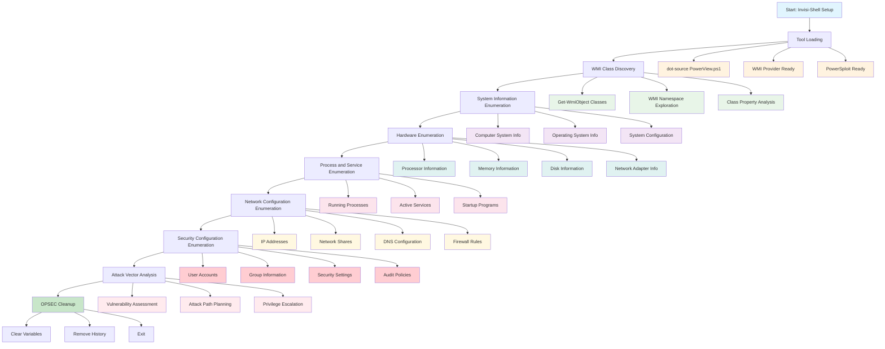
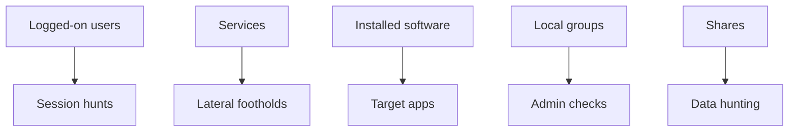
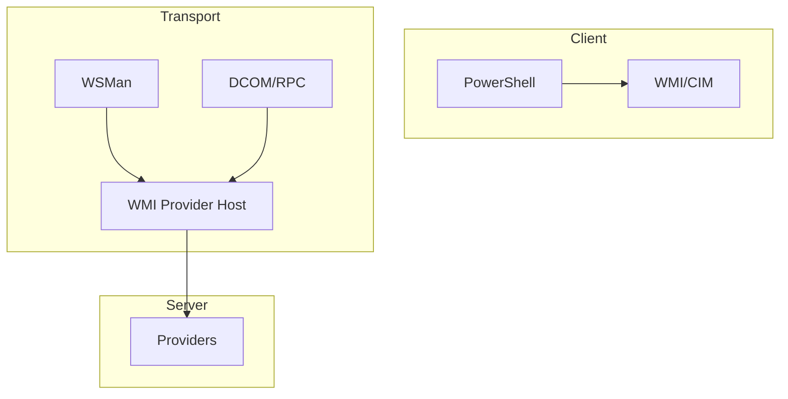

[Prev: 19_PowerShell_Remoting_Enumeration.md](./19_PowerShell_Remoting_Enumeration.md) | [Up: Index](./00_Enumeration_Index.md) | [Hub](./00_Methodology_Hub.md) | [Next: 21_Time_Based_Enumeration.md](./21_Time_Based_Enumeration.md)

# WMI Enumeration

## Overview
**WMI Enumeration** is a red team technique for discovering and analyzing Windows Management Instrumentation (WMI) information to understand system configuration, hardware details, installed software, and system state. This method provides comprehensive insights into Windows systems and their configurations for attack planning and lateral movement.

## What WMI Enumeration Achieves
- **System Information Discovery**: Gather hardware and software details
- **Configuration Analysis**: Understand system settings and policies
- **Process and Service Enumeration**: Identify running processes and services
- **Network Configuration Analysis**: Examine network settings and connections
- **Security Assessment**: Evaluate system security configurations
- **Attack Vector Identification**: Find potential attack paths through WMI

## Stealth & Loading
Use [01_Tool_Setup_Loading.md](./01_Tool_Setup_Loading.md) for stealth and tool prep. This page focuses on WMI/CIM class targeting and safe transport choices.

## WMI Enumeration Workflow



**Workflow Explanation:**

This comprehensive workflow demonstrates the systematic approach to **WMI enumeration** using PowerShell and PowerView functions:

1. **Stealth Setup**: Begin with Invisi-Shell to bypass logging and detection mechanisms
2. **Tool Loading**: Load PowerView and WMI-specific enumeration tools
3. **WMI Discovery**: Explore WMI classes and namespaces
4. **System Information**: Gather comprehensive system details through WMI
5. **Hardware Enumeration**: Discover hardware specifications and configurations
6. **Process Analysis**: Identify running processes and services
7. **Network Configuration**: Map network settings and configurations
8. **Security Analysis**: Review security settings and audit policies
9. **Attack Planning**: Identify WMI-based attack vectors and privilege escalation paths

**Note:** For basic domain information and trust relationships, see [Domain Enumeration](./04_Domain_Enumeration.md).

## WMI Enumeration Tools

### 1. Native Windows WMI Tools

#### **Get-WmiObject** - PowerShell WMI Access
```powershell
# Basic WMI class enumeration
Get-WmiObject -Class Win32_ComputerSystem

# List all available WMI classes
Get-WmiObject -Class * | Select-Object Name | Sort-Object Name

# Get WMI class properties
Get-WmiObject -Class Win32_Process -Property Name, ProcessId, WorkingSetSize | Select-Object -First 10
```

**Tool Explanation:**
- **Get-WmiObject**: Native PowerShell WMI access cmdlet
- **-Class**: Specify WMI class to query
- **-Property**: Select specific properties to retrieve
- **Advantages**: Native PowerShell, comprehensive WMI access
- **Disadvantages**: PowerShell-specific, may be logged

#### **wmic.exe** - Command Line WMI Tool
```cmd
# Basic WMI queries using wmic
wmic computersystem get name,domain,totalphysicalmemory

# Process information
wmic process get name,processid,workingsetsize

# Service information
wmic service get name,state,startmode

# Network adapter information
wmic nic get name,adaptertype,macaddress
```

**Tool Explanation:**
- **wmic.exe**: Built-in Windows WMI command-line tool
- **get**: Retrieve specific properties
- **Advantages**: Built into Windows, no PowerShell required
- **Disadvantages**: Limited output formatting, complex syntax

### 2. PowerShell WMI Tools

#### **Get-CimInstance** - Modern WMI Access
```powershell
# Modern WMI access using CIM
Get-CimInstance -ClassName Win32_ComputerSystem

# Get CIM class properties
Get-CimInstance -ClassName Win32_Process | Select-Object Name, ProcessId, WorkingSetSize | Select-Object -First 10

# Query with filters
Get-CimInstance -ClassName Win32_Service -Filter "State='Running'"
```

**Tool Explanation:**
- **Get-CimInstance**: Modern PowerShell WMI access using CIM
- **-ClassName**: Specify WMI class name
- **-Filter**: Apply WMI filters to queries
- **Advantages**: Modern WMI access, better performance, CIM standard
- **Disadvantages**: Requires PowerShell, may be logged

#### **PowerView - WMI Integration**
```powershell
# PowerView WMI enumeration
Get-WmiObject -Class Win32_ComputerSystem | Select-Object Name, Domain, TotalPhysicalMemory

# PowerView with WMI for system enumeration
Get-WmiObject -Class Win32_OperatingSystem | Select-Object Caption, Version, BuildNumber, LastBootUpTime
```

**Tool Explanation:**
- **PowerView Integration**: Use PowerView with WMI for enumeration
- **WMI Classes**: Access various WMI classes for system information
- **Advantages**: PowerView integration, comprehensive enumeration
- **Disadvantages**: Requires PowerView, may trigger logging

### 3. Third-Party WMI Tools

#### **PowerSploit - Get-WmiObject with Advanced Queries**
```powershell
# PowerSploit WMI enumeration
Import-Module PowerSploit

# Advanced WMI queries
Get-WmiObject -Class Win32_Process | Where-Object { $_.WorkingSetSize -gt 100MB } | Select-Object Name, ProcessId, WorkingSetSize

# WMI service enumeration
Get-WmiObject -Class Win32_Service | Where-Object { $_.State -eq "Running" } | Select-Object Name, DisplayName, StartName
```

**Tool Explanation:**
- **PowerSploit**: Offensive PowerShell framework with WMI capabilities
- **Advanced Queries**: Complex WMI queries with filtering
- **Advantages**: Offensive framework, advanced capabilities
- **Disadvantages**: Requires PowerSploit, highly detectable

#### **Empire - WMI Enumeration Module**
```powershell
# Empire WMI enumeration
usemodule powershell/management/wmi_query
set ClassName Win32_ComputerSystem
execute

# Empire WMI process enumeration
usemodule powershell/management/wmi_query
set ClassName Win32_Process
set Filter "WorkingSetSize > 104857600"
execute
```

**Tool Explanation:**
- **Empire**: Post-exploitation framework with WMI modules
- **WMI Query Module**: Dedicated WMI enumeration module
- **Advantages**: Framework integration, advanced filtering
- **Disadvantages**: Requires Empire, highly detectable

### 4. Custom WMI Scripts

#### **Comprehensive WMI Enumeration Script**
```powershell
# Comprehensive WMI enumeration
function Invoke-ComprehensiveWMIEnumeration {
    param([string]$ComputerName = "localhost")
    
    try {
        Write-Host "Comprehensive WMI Enumeration for $ComputerName" -ForegroundColor Green
        Write-Host "=" * 60
        
        $wmiResults = @{
            ComputerSystem = $null
            OperatingSystem = $null
            Processors = @()
            Memory = @()
            Disks = @()
            NetworkAdapters = @()
            Processes = @()
            Services = @()
            StartupPrograms = @()
            UserAccounts = @()
            Groups = @()
        }
        
        # Computer System Information
        Write-Host "Getting computer system information..." -ForegroundColor Yellow
        try {
            $wmiResults.ComputerSystem = Get-WmiObject -Class Win32_ComputerSystem -ComputerName $ComputerName
            Write-Host "  Computer Name: $($wmiResults.ComputerSystem.Name)"
            Write-Host "  Domain: $($wmiResults.ComputerSystem.Domain)"
            Write-Host "  Manufacturer: $($wmiResults.ComputerSystem.Manufacturer)"
            Write-Host "  Model: $($wmiResults.ComputerSystem.Model)"
            Write-Host "  Total Memory: $([math]::Round($wmiResults.ComputerSystem.TotalPhysicalMemory / 1GB, 2)) GB"
        }
        catch {
            Write-Host "  Failed to get computer system information: $($_.Exception.Message)" -ForegroundColor Red
        }
        
        # Operating System Information
        Write-Host "`nGetting operating system information..." -ForegroundColor Yellow
        try {
            $wmiResults.OperatingSystem = Get-WmiObject -Class Win32_OperatingSystem -ComputerName $ComputerName
            Write-Host "  OS: $($wmiResults.OperatingSystem.Caption)"
            Write-Host "  Version: $($wmiResults.OperatingSystem.Version)"
            Write-Host "  Build: $($wmiResults.OperatingSystem.BuildNumber)"
            Write-Host "  Last Boot: $($wmiResults.OperatingSystem.LastBootUpTime)"
        }
        catch {
            Write-Host "  Failed to get OS information: $($_.Exception.Message)" -ForegroundColor Red
        }
        
        # Processor Information
        Write-Host "`nGetting processor information..." -ForegroundColor Yellow
        try {
            $processors = Get-WmiObject -Class Win32_Processor -ComputerName $ComputerName
            foreach ($processor in $processors) {
                $processorInfo = @{
                    Name = $processor.Name
                    Cores = $processor.NumberOfCores
                    LogicalProcessors = $processor.NumberOfLogicalProcessors
                    MaxClockSpeed = $processor.MaxClockSpeed
                }
                $wmiResults.Processors += $processorInfo
                
                Write-Host "  $($processor.Name)"
                Write-Host "    Cores: $($processor.NumberOfCores), Logical: $($processor.NumberOfLogicalProcessors)"
                Write-Host "    Speed: $($processor.MaxClockSpeed) MHz"
            }
        }
        catch {
            Write-Host "  Failed to get processor information: $($_.Exception.Message)" -ForegroundColor Red
        }
        
        # Memory Information
        Write-Host "`nGetting memory information..." -ForegroundColor Yellow
        try {
            $memoryModules = Get-WmiObject -Class Win32_PhysicalMemory -ComputerName $ComputerName
            foreach ($memory in $memoryModules) {
                $memoryInfo = @{
                    Capacity = [math]::Round($memory.Capacity / 1GB, 2)
                    Speed = $memory.Speed
                    Manufacturer = $memory.Manufacturer
                }
                $wmiResults.Memory += $memoryInfo
                
                Write-Host "  $([math]::Round($memory.Capacity / 1GB, 2)) GB - $($memory.Speed) MHz - $($memory.Manufacturer)"
            }
        }
        catch {
            Write-Host "  Failed to get memory information: $($_.Exception.Message)" -ForegroundColor Red
        }
        
        # Disk Information
        Write-Host "`nGetting disk information..." -ForegroundColor Yellow
        try {
            $disks = Get-WmiObject -Class Win32_DiskDrive -ComputerName $ComputerName
            foreach ($disk in $disks) {
                $diskInfo = @{
                    Model = $disk.Model
                    Size = [math]::Round($disk.Size / 1GB, 2)
                    InterfaceType = $disk.InterfaceType
                }
                $wmiResults.Disks += $diskInfo
                
                Write-Host "  $($disk.Model)"
                Write-Host "    Size: $([math]::Round($disk.Size / 1GB, 2)) GB, Interface: $($disk.InterfaceType)"
            }
        }
        catch {
            Write-Host "  Failed to get disk information: $($_.Exception.Message)" -ForegroundColor Red
        }
        
        # Network Adapter Information
        Write-Host "`nGetting network adapter information..." -ForegroundColor Yellow
        try {
            $networkAdapters = Get-WmiObject -Class Win32_NetworkAdapter -ComputerName $ComputerName | Where-Object { $_.NetEnabled -eq $true }
            foreach ($adapter in $networkAdapters) {
                $adapterInfo = @{
                    Name = $adapter.Name
                    AdapterType = $adapter.AdapterType
                    MACAddress = $adapter.MACAddress
                }
                $wmiResults.NetworkAdapters += $adapterInfo
                
                Write-Host "  $($adapter.Name)"
                Write-Host "    Type: $($adapter.AdapterType), MAC: $($adapter.MACAddress)"
            }
        }
        catch {
            Write-Host "  Failed to get network adapter information: $($_.Exception.Message)" -ForegroundColor Red
        }
        
        # Process Information
        Write-Host "`nGetting process information..." -ForegroundColor Yellow
        try {
            $processes = Get-WmiObject -Class Win32_Process -ComputerName $ComputerName | Select-Object -First 20
            foreach ($process in $processes) {
                $processInfo = @{
                    Name = $process.Name
                    ProcessId = $process.ProcessId
                    WorkingSetSize = [math]::Round($process.WorkingSetSize / 1MB, 2)
                }
                $wmiResults.Processes += $processInfo
                
                Write-Host "  $($process.Name) (PID: $($process.ProcessId))"
                Write-Host "    Memory: $([math]::Round($process.WorkingSetSize / 1MB, 2)) MB"
            }
        }
        catch {
            Write-Host "  Failed to get process information: $($_.Exception.Message)" -ForegroundColor Red
        }
        
        # Service Information
        Write-Host "`nGetting service information..." -ForegroundColor Yellow
        try {
            $services = Get-WmiObject -Class Win32_Service -ComputerName $ComputerName | Where-Object { $_.State -eq "Running" } | Select-Object -First 20
            foreach ($service in $services) {
                $serviceInfo = @{
                    Name = $service.Name
                    DisplayName = $service.DisplayName
                    State = $service.State
                    StartMode = $service.StartMode
                }
                $wmiResults.Services += $serviceInfo
                
                Write-Host "  $($service.DisplayName) ($($service.Name))"
                Write-Host "    State: $($service.State), Start Mode: $($service.StartMode)"
            }
        }
        catch {
            Write-Host "  Failed to get service information: $($_.Exception.Message)" -ForegroundColor Red
        }
        
        # Startup Programs
        Write-Host "`nGetting startup program information..." -ForegroundColor Yellow
        try {
            $startupPrograms = Get-WmiObject -Class Win32_StartupCommand -ComputerName $ComputerName
            foreach ($startup in $startupPrograms) {
                $startupInfo = @{
                    Name = $startup.Name
                    Command = $startup.Command
                    Location = $startup.Location
                }
                $wmiResults.StartupPrograms += $startupInfo
                
                Write-Host "  $($startup.Name)"
                Write-Host "    Command: $($startup.Command)"
                Write-Host "    Location: $($startup.Location)"
            }
        }
        catch {
            Write-Host "  Failed to get startup program information: $($_.Exception.Message)" -ForegroundColor Red
        }
        
        # User Account Information
        Write-Host "`nGetting user account information..." -ForegroundColor Yellow
        try {
            $userAccounts = Get-WmiObject -Class Win32_UserAccount -ComputerName $ComputerName | Where-Object { $_.LocalAccount -eq $true }
            foreach ($user in $userAccounts) {
                $userInfo = @{
                    Name = $user.Name
                    FullName = $user.FullName
                    Disabled = $user.Disabled
                    Lockout = $user.Lockout
                }
                $wmiResults.UserAccounts += $userInfo
                
                $status = if ($user.Disabled) { "Disabled" } else { "Enabled" }
                Write-Host "  $($user.Name) ($($user.FullName)) - $status"
            }
        }
        catch {
            Write-Host "  Failed to get user account information: $($_.Exception.Message)" -ForegroundColor Red
        }
        
        # Group Information
        Write-Host "`nGetting group information..." -ForegroundColor Yellow
        try {
            $groups = Get-WmiObject -Class Win32_Group -ComputerName $ComputerName | Where-Object { $_.LocalAccount -eq $true }
            foreach ($group in $groups) {
                $groupInfo = @{
                    Name = $group.Name
                    Description = $group.Description
                }
                $wmiResults.Groups += $groupInfo
                
                Write-Host "  $($group.Name) - $($group.Description)"
            }
        }
        catch {
            Write-Host "  Failed to get group information: $($_.Exception.Message)" -ForegroundColor Red
        }
        
        Write-Host "`nWMI Enumeration Complete!" -ForegroundColor Green
        return $wmiResults
        
    }
    catch {
        Write-Warning "Comprehensive WMI enumeration failed: $($_.Exception.Message)"
        return $null
    }
}

# Execute comprehensive WMI enumeration
$wmiResults = Invoke-ComprehensiveWMIEnumeration -ComputerName "localhost"
```

**Tool Explanation:**
- **Custom Function**: Tailored WMI enumeration for comprehensive system analysis
- **Multiple WMI Classes**: Cover all major system components
- **Error Handling**: Graceful handling of failed WMI queries
- **Structured Output**: Organized results for analysis
- **Advantages**: Comprehensive coverage, customizable, error handling
- **Disadvantages**: Custom code, may be complex

## WMI Analysis Techniques

### 1. System Health Analysis

#### **Performance Metrics Analysis**
```powershell
# Analyze system performance through WMI
function Analyze-SystemPerformance {
    param([hashtable]$WMIResults)
    
    try {
        Write-Host "Analyzing system performance..." -ForegroundColor Yellow
        Write-Host "=" * 50
        
        $performanceAnalysis = @{
            OverallHealth = "Good"
            Issues = @()
            Recommendations = @()
            PerformanceMetrics = @{}
        }
        
        # Memory analysis
        if ($WMIResults.OperatingSystem) {
            $os = $WMIResults.OperatingSystem
            $memoryUsage = (($os.TotalVirtualMemorySize - $os.FreeVirtualMemory) / $os.TotalVirtualMemorySize) * 100
            
            $performanceAnalysis.PerformanceMetrics["MemoryUsage"] = [math]::Round($memoryUsage, 2)
            
            if ($memoryUsage -gt 80) {
                $performanceAnalysis.Issues += @{
                    Type = "High Memory Usage"
                    Severity = "Medium"
                    Description = "Virtual memory usage is above 80%"
                    Current = "$([math]::Round($memoryUsage, 2))%"
                    Recommended = "Below 80%"
                }
                $performanceAnalysis.OverallHealth = "Fair"
            }
            
            Write-Host "Memory Usage: $([math]::Round($memoryUsage, 2))%"
        }
        
        # Process analysis
        if ($WMIResults.Processes) {
            $highMemoryProcesses = $WMIResults.Processes | Where-Object { $_.WorkingSetSize -gt 100 }
            
            if ($highMemoryProcesses.Count -gt 5) {
                $performanceAnalysis.Issues += @{
                    Type = "Multiple High Memory Processes"
                    Severity = "Low"
                    Description = "Multiple processes using more than 100MB of memory"
                    Current = "$($highMemoryProcesses.Count) processes"
                    Recommended = "Monitor and optimize if necessary"
                }
            }
            
            Write-Host "High Memory Processes: $($highMemoryProcesses.Count)"
        }
        
        # Service analysis
        if ($WMIResults.Services) {
            $stoppedServices = $WMIResults.Services | Where-Object { $_.State -eq "Stopped" }
            
            if ($stoppedServices.Count -gt 10) {
                $performanceAnalysis.Issues += @{
                    Type = "Multiple Stopped Services"
                    Severity = "Low"
                    Description = "Multiple services are stopped"
                    Current = "$($stoppedServices.Count) services"
                    Recommended = "Review and start necessary services"
                }
            }
            
            Write-Host "Stopped Services: $($stoppedServices.Count)"
        }
        
        # Generate recommendations
        if ($performanceAnalysis.Issues.Count -gt 0) {
            $performanceAnalysis.Recommendations += "Monitor memory usage and consider optimization"
            $performanceAnalysis.Recommendations += "Review high memory processes for optimization opportunities"
            $performanceAnalysis.Recommendations += "Ensure critical services are running"
        }
        
        $performanceAnalysis.Recommendations += "Regular system health monitoring"
        $performanceAnalysis.Recommendations += "Performance baseline establishment"
        
        # Display analysis
        Write-Host "`nSystem Performance Analysis:" -ForegroundColor Green
        Write-Host "  Overall Health: $($performanceAnalysis.OverallHealth)"
        Write-Host "  Issues: $($performanceAnalysis.Issues.Count)"
        Write-Host "  Recommendations: $($performanceAnalysis.Recommendations.Count)"
        
        if ($performanceAnalysis.Issues.Count -gt 0) {
            Write-Host "`nIssues:" -ForegroundColor Yellow
            foreach ($issue in $performanceAnalysis.Issues | Sort-Object Severity -Descending) {
                $severityIcon = if ($issue.Severity -eq "High") { "🔴" } elseif ($issue.Severity -eq "Medium") { "🟡" } else { "🟢" }
                Write-Host "  $severityIcon $($issue.Type): $($issue.Description)"
                Write-Host "    Current: $($issue.Current), Recommended: $($issue.Recommended)"
            }
        }
        
        return $performanceAnalysis
        
    }
    catch {
        Write-Warning "System performance analysis failed: $($_.Exception.Message)"
        return $null
    }
}

# Analyze system performance
$performanceAnalysis = Analyze-SystemPerformance -WMIResults $wmiResults
```

**Tool Explanation:**
- **Performance Analysis**: Analyze system performance through WMI data
- **Issue Identification**: Identify performance problems and bottlenecks
- **Recommendations**: Generate actionable recommendations
- **Health Scoring**: Overall system health assessment
- **Advantages**: Comprehensive analysis, actionable insights
- **Disadvantages**: Complex analysis, requires WMI data

### 2. Security Assessment

#### **Security Configuration Analysis**
```powershell
# Assess system security through WMI
function Assess-SystemSecurity {
    param([hashtable]$WMIResults)
    
    try {
        Write-Host "Assessing system security..." -ForegroundColor Yellow
        Write-Host "=" * 50
        
        $securityAssessment = @{
            RiskLevel = "Low"
            SecurityIssues = @()
            Recommendations = @()
            Vulnerabilities = @()
        }
        
        # User account security
        if ($WMIResults.UserAccounts) {
            $disabledUsers = $WMIResults.UserAccounts | Where-Object { $_.Disabled -eq $true }
            $usersWithoutPasswords = $WMIResults.UserAccounts | Where-Object { $_.PasswordRequired -eq $false }
            
            if ($usersWithoutPasswords.Count -gt 0) {
                $securityAssessment.SecurityIssues += @{
                    Type = "Users Without Passwords"
                    Severity = "High"
                    Description = "Local user accounts without password requirements"
                    Count = $usersWithoutPasswords.Count
                    Recommendation = "Require passwords for all user accounts"
                }
                $securityAssessment.RiskLevel = "High"
            }
            
            Write-Host "User Account Security:"
            Write-Host "  Disabled Users: $($disabledUsers.Count)"
            Write-Host "  Users Without Passwords: $($usersWithoutPasswords.Count)"
        }
        
        # Network security
        if ($WMIResults.NetworkAdapters) {
            $wirelessAdapters = $WMIResults.NetworkAdapters | Where-Object { $_.AdapterType -like "*Wireless*" }
            
            if ($wirelessAdapters.Count -gt 0) {
                $securityAssessment.SecurityIssues += @{
                    Type = "Wireless Network Adapters"
                    Severity = "Medium"
                    Description = "Wireless network adapters detected"
                    Count = $wirelessAdapters.Count
                    Recommendation = "Review wireless security configurations"
                }
                
                if ($securityAssessment.RiskLevel -ne "High") {
                    $securityAssessment.RiskLevel = "Medium"
                }
            }
            
            Write-Host "`nNetwork Security:"
            Write-Host "  Wireless Adapters: $($wirelessAdapters.Count)"
        }
        
        # Generate recommendations
        if ($securityAssessment.SecurityIssues.Count -gt 0) {
            foreach ($issue in $securityAssessment.SecurityIssues) {
                $securityAssessment.Recommendations += $issue.Recommendation
            }
        }
        
        $securityAssessment.Recommendations += "Implement strong password policies"
        $securityAssessment.Recommendations += "Regular security audits"
        $securityAssessment.Recommendations += "Network access controls"
        $securityAssessment.Recommendations += "User account monitoring"
        
        # Display assessment
        Write-Host "`nSecurity Assessment:" -ForegroundColor Green
        Write-Host "  Risk Level: $($securityAssessment.RiskLevel)"
        Write-Host "  Security Issues: $($securityAssessment.SecurityIssues.Count)"
        Write-Host "  Recommendations: $($securityAssessment.Recommendations.Count)"
        
        if ($securityAssessment.SecurityIssues.Count -gt 0) {
            Write-Host "`nSecurity Issues:" -ForegroundColor Yellow
            foreach ($issue in $securityAssessment.SecurityIssues | Sort-Object Severity -Descending) {
                $severityIcon = if ($issue.Severity -eq "High") { "🔴" } elseif ($issue.Severity -eq "Medium") { "🟡" } else { "🟢" }
                Write-Host "  $severityIcon $($issue.Type): $($issue.Description)"
                Write-Host "    Count: $($issue.Count), Recommendation: $($issue.Recommendation)"
            }
        }
        
        return $securityAssessment
        
    }
    catch {
        Write-Warning "Security assessment failed: $($_.Exception.Message)"
        return $null
    }
}

# Assess system security
$securityAssessment = Assess-SystemSecurity -WMIResults $wmiResults
```

**Tool Explanation:**
- **Security Assessment**: Evaluate system security through WMI data
- **Vulnerability Identification**: Identify security weaknesses and misconfigurations
- **Risk Assessment**: Determine overall security risk level
- **Security Recommendations**: Generate security improvement recommendations
- **Advantages**: Security insights, risk assessment, actionable recommendations
- **Disadvantages**: Complex analysis, requires security knowledge

## OPSEC Considerations

### 1. Stealth Techniques
- **Gradual Enumeration**: Spread WMI queries over time
- **Targeted Enumeration**: Focus on specific WMI classes
- **Normal User Context**: Use regular user accounts when possible
- **Limited Scope**: Focus on necessary system information

### 2. Detection Avoidance
- **Event Logging**: Be aware of WMI access events
- **Audit Policies**: Consider WMI audit policies
- **Query Patterns**: Avoid predictable WMI access patterns
- **Response Analysis**: Analyze responses for anomalies

## Best Practices

### 1. WMI Enumeration
- **Scope Definition**: Clearly define enumeration scope
- **Tool Selection**: Choose appropriate WMI classes
- **Documentation**: Document all enumeration activities
- **Validation**: Verify discovered system information

### 2. Security Analysis
- **Configuration Review**: Thoroughly review system configurations
- **Vulnerability Assessment**: Identify security weaknesses
- **Documentation**: Document all security findings
- **Reporting**: Generate comprehensive security reports

## Related Objects
- [Computer Enumeration](./07_Computer_Enumeration.md)
- [Network Enumeration](./02_Network_Enumeration.md)
- [PowerShell Remoting Enumeration](./19_PowerShell_Remoting_Enumeration.md)
- [Time-Based Enumeration](./21_Time_Based_Enumeration.md)

## Navigation
- [Master Index](../00_MASTER_INDEX.md)
- [Enumeration Index](./00_Enumeration_Index.md)

## See Also
- [Forest Enumeration](./30_Forest_Enumeration.md)
- [DNS Enumeration](./03_DNS_Enumeration.md)
- [LDAP Injection](./29_LDAP_Injection.md)

---

**Tags**: #WMIEnumeration #ActiveDirectory #AD #Enumeration #WMI #SystemInformation #RedTeam

## At‑a‑Glance

### Command Quick‑Reference
| Tool | Purpose | Example | Notes |
| - | - | - | - |
| Get-WmiObject | Legacy WMI | Get-WmiObject Win32_OperatingSystem -ComputerName dc01 | Signed
| Get-CimInstance | Modern WMI | Get-CimInstance Win32_Service -ComputerName dc01 | WSMan/DCF
| Invoke-WmiMethod | Remote method | Invoke-WmiMethod -Class Win32_Process -Name Create -ArgumentList 'cmd /c whoami' -ComputerName dc01 | Exec
| Get-CimSession | Session reuse | New-CimSession -ComputerName dc01 | Efficient

### Pivot Matrix
| Finding | Pivot To | Goal |
| - | - | - |
| Logged-on users | 12_Session_Enumeration_Index.md | Presence
| Services info | 07_Computer_Enumeration.md | Lateral footholds
| Installed software | 27_AD_CS_Enumeration.md | App paths
| Local groups | 06_Group_Enumeration.md | Admin checks
| Share info | 17_File_Share_Enumeration.md | Data paths

### Stealth Profiles
| Profile | Calls | Delay (jitter) | Transport |
| - | - | - | - |
| Stealth | Read-only CIM | 4–8 s | WSMan
| Balanced | + limited WMI | 2–5 s | Mixed
| Lab | Method exec | 1–3 s | RPC/WSMan

## Fictional Use Case: CyberCorp (Progressive Storyline)
**User Persona**: Zane Brooks, Systems Auditor (Limited User Account)
**Progression**: From read-only inventory to targeted service/process checks

```powershell
# Phase 1: Read-only OS/service inventory
Get-CimInstance Win32_OperatingSystem -ComputerName us-srv01 | Select Caption,Version
Get-CimInstance Win32_Service -ComputerName us-srv01 | Select Name,State,StartMode -First 10

# Phase 2: Accounts and sessions (read-only)
Get-CimInstance Win32_LoggedOnUser -ComputerName us-srv01 -ErrorAction SilentlyContinue | Select -First 5

# Phase 3: Targeted method calls (lab)
Invoke-WmiMethod -Class Win32_Process -Name Create -ArgumentList 'cmd /c hostname' -ComputerName us-srv01
```

## Canonical WMI/CIM Enumeration
```powershell
# Modern CIM preferred
Get-CimInstance Win32_ComputerSystem -ComputerName TARGET | Select Manufacturer,Model,Domain
Get-CimInstance Win32_LoggedOnUser -ComputerName TARGET | Select Antecedent,Dependent
Get-CimInstance Win32_Share -ComputerName TARGET | Select Name,Path,Type

# Legacy WMI fallback
Get-WmiObject Win32_OperatingSystem -ComputerName TARGET | Select Caption,Version

# Sessions for reuse
$cs = New-CimSession -ComputerName TARGET
Get-CimInstance -CimSession $cs Win32_Service | Select Name,State -First 10
Remove-CimSession $cs
```

### Findings → Pivots


## WMI/CIM Architecture


## Lab vs Production
- Stealth: Get-CimInstance only; no method calls; reuse sessions; throttle.
- Balanced: small sets of classes; limit properties; avoid recursion.
- Lab: invoke methods; process/service control; broad queries.

## Detection (concise)
- Logs: Microsoft-Windows-WMI-Activity/Operational; Security 4688 on remote.
- Heuristics: method Create on Win32_Process; high volume queries across hosts.

## OPSEC (concise)
- Prefer CIM over WMI; reuse sessions; limit property sets; randomize delays.

## Cleanup
```powershell
Get-CimSession | Remove-CimSession -ErrorAction SilentlyContinue
```

---


---

[Prev: 19_PowerShell_Remoting_Enumeration.md](./19_PowerShell_Remoting_Enumeration.md) | [Up: Index](./00_Enumeration_Index.md) | [Hub](./00_Methodology_Hub.md) | [Next: 21_Time_Based_Enumeration.md](./21_Time_Based_Enumeration.md)
