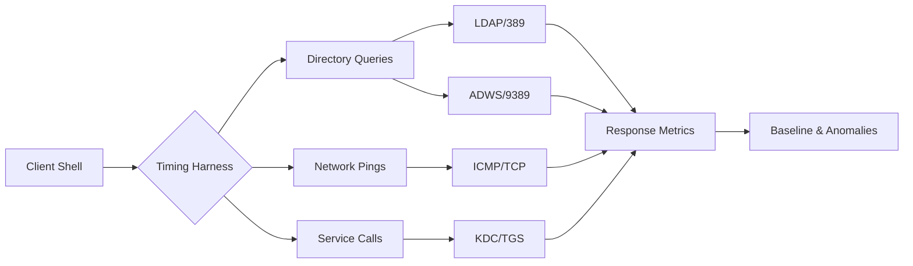
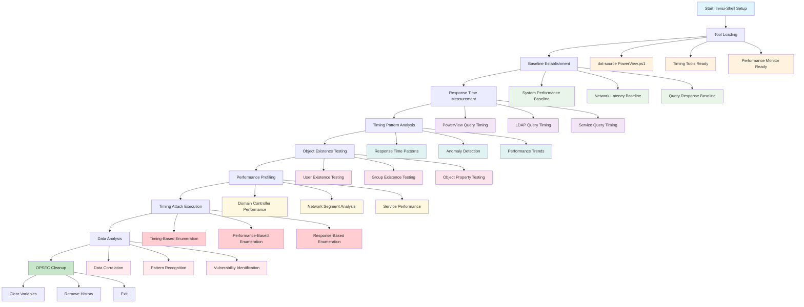

[🔄 Back to Master Index](./00_Enumeration_Index.md) | [🔍 Previous: WMI Enumeration](./20_WMI_Enumeration.md) | [Next: Kerberos Master Index](./22_Kerberos_Master_Index.md)

---

## 🔗 **RELATED ACTIVE DIRECTORY COMPONENTS**

### **⏰ Time-Based Components**
- **[User Accounts](../02_Active_Directory_Components/17_User_Accounts.md)**: User login patterns and time-based access
- **[Domain Controllers](../02_Active_Directory_Components/02_Domain_Controllers.md)**: DC time synchronization and patterns
- **[Schema](../02_Active_Directory_Components/11_Schema.md)**: Time-based object attributes and properties

### **🏗️ Infrastructure Components**
- **[Domain](../02_Active_Directory_Components/03_Domain.md)**: Domain time policies and configurations
- **[Sites and Subnets](../02_Active_Directory_Components/06_Sites_and_Subnets.md)**: Time zone configurations and patterns
- **[Replication Service](../02_Active_Directory_Components/15_Replication_Service.md)**: Time-based replication schedules

### **🔐 Security and Policy Components**
- **[Group Policy Objects](../02_Active_Directory_Components/09_Group_Policy_Objects.md)**: Time-based security policies
- **[Kerberos](../02_Active_Directory_Components/16_Kerberos.md)**: Ticket timing and expiration patterns
- **[FSMO Roles](../02_Active_Directory_Components/08_FSMO_Roles.md)**: Role-specific time configurations

---

## 🚀 **TIME-BASED ENUMERATION OVERVIEW**

## At‑a‑Glance

### Command Quick‑Reference
| Tool | Purpose | Example | Notes |
| - | - | - | - |
| Measure-Command | Time a cmd | Measure-Command { Get-ADUser -ResultSetSize 10 } | End-to-end timing
| Get-Date | Manual timing | $t0=Get-Date; cmd; (Get-Date)-$t0 | Fine-grained blocks
| Test-Connection | Net latency | Test-Connection dc01 -Count 1 -InformationLevel Detailed | Ping RTT
| Get-WinEvent | Event cadence | Get-WinEvent -LogName Security -MaxEvents 1 | Clock sanity

### Pivot Matrix
| Finding | Pivot To | Goal |
| - | - | - |
| DC slower response | 04_Domain_Enumeration.md | Prefer nearest DC/GC
| High LDAP latency | 11_SOAPHound_Enumeration.md | Switch to ADWS
| Long TGS issuance | 24_SPN_Enumeration_Techniques.md | Reduce SPN sweep size
| User exists timing gap | 05_User_Enumeration.md | Confirm via scoped MS-signed |

---

## 🛠️ **COMPREHENSIVE ENUMERATION TOOLS (TIME PROFILING FIRST)**

### **🔧 Microsoft‑Signed & Native Tools**
- **Get‑ADUser / Get‑ADComputer / Get‑ADGroup**: Scope small, comparable queries across DCs
- **Measure‑Command**: Wrap commands to get end‑to‑end elapsed time in milliseconds
- **Get‑Date**: Manual timing for fine‑grained blocks or multiple steps
- **Test‑Connection / Test‑NetConnection**: Network/port RTT baselines (ICMP/TCP)
- **Resolve‑DnsName**: DNS latency (name→IP) to separate DNS vs LDAP/ADWS delay

Commands and explanations:
```powershell
# End‑to‑end LDAP timing for apples‑to‑apples comparison (ResultSetSize caps load)
Measure-Command { Get-ADUser -Server dc01.corp.local -Filter * -ResultSetSize 25 | Out-Null }

# Manual timing for a custom block (handy when mixing multiple calls)
$t0 = Get-Date; Get-ADUser -Server dc02.corp.local -Filter * -ResultSetSize 25 | Out-Null; (Get-Date) - $t0

# Port/transport baseline (is ADWS/9389 slower than LDAP/389?)
Test-NetConnection dc01.corp.local -Port 389     # LDAP
Test-NetConnection dc01.corp.local -Port 9389    # ADWS

# DNS timing (separate DNS delay from directory delay)
Measure-Command { Resolve-DnsName dc01.corp.local | Out-Null }
```

### **⚔️ Offensive Tools (PowerView/SharpView)**
- Use the same query targets/filters across hosts and wrap in timers to avoid bias

Commands and explanations:
```powershell
# PowerView: scope and time the same query on two DCs
Import-Module .\PowerView.ps1
Measure-Command { Get-DomainUser -Server dc01.corp.local -LDAPFilter "(objectClass=user)" -ResultPageSize 50 | Out-Null }
Measure-Command { Get-DomainUser -Server dc02.us.corp.local -LDAPFilter "(objectClass=user)" -ResultPageSize 50 | Out-Null }

# Time a targeted property fetch (lower payload → lower variance)
Measure-Command { Get-DomainComputer -Server dc01.corp.local -Properties name,operatingsystem -LDAPFilter "(objectClass=computer)" -ResultPageSize 50 | Out-Null }
```
```cmd
:: SharpView: same idea as PowerView without PowerShell policy friction
SharpView.exe Get-DomainUser -Server dc01.corp.local -LDAPFilter "(objectClass=user)" -ResultPageSize 50 > NUL
SharpView.exe Get-DomainUser -Server dc02.us.corp.local -LDAPFilter "(objectClass=user)" -ResultPageSize 50 > NUL
```

### **🔴 Red Team Support Tools (timing‑aware usage)**
- **CrackMapExec (CME)**: Control timeout/delay to measure reliability and avoid spikes
- **Seatbelt**: Pull local system indicators fast to explain timing outliers
- **LDAPDomainDump**: Snapshot with constrained size to compare server responsiveness

Commands and explanations:
```bash
# CME: compare responsiveness with consistent per‑target timeouts/delays
crackmapexec smb targets.txt -u USER -p PASS --timeout 5 --delay 0.3 | tee cme_timing.log

# LDAPDomainDump: small, comparable pulls to reduce variance
ldapdomaindump dc01.corp.local -u USER -p PASS -o out_dc01 --include-computers --minimal
ldapdomaindump dc02.us.corp.local -u USER -p PASS -o out_dc02 --include-computers --minimal
```
```cmd
# Seatbelt: quick local profiling to explain slow boxes (CPU, services, logs)
Seatbelt.exe System
Seatbelt.exe Services
Seatbelt.exe Processes
```

### **🛠️ OPSEC timing guidance**
- Keep result sizes fixed, minimize property sets, and reuse identical filters across hosts
- Introduce jitter between runs; record both median and p95 for stability
- Use ADWS vs LDAP consistently during a test run; do not mix transports mid‑baseline

---

### Stealth Profiles
| Profile | Iterations | Delay (jitter) | Scope |
| - | - | - | - |
| Stealth | 3–5 | 500–1200 ms | Single DC/GC
| Balanced | 5–10 | 300–800 ms | Site set
| Lab | 10–20 | 100–300 ms | Multi-DC

## Stealth & Loading
Use [01_Tool_Setup_Loading.md](./01_Tool_Setup_Loading.md) for stealth session and tool prep. Continue here with timing‑specific techniques only.

## CyberCorp Persona
- Persona: Noor Patel, Performance Engineer (standard user)
- Scenario: Compare dc01 (HQ) vs dc02 (US-East) for LDAP/ADWS timings during off-hours.

## Timing Architecture (unique)


## Baselines (fast, site-aware)
```powershell
$targets = @('dc01.corp.local','dc02.us.corp.local')
function Measure-LdapQueryTime {
  param([string]$Server)
  $t0 = Get-Date
  try { Get-ADUser -Server $Server -Filter * -ResultSetSize 25 | Out-Null } catch {}
  ((Get-Date) - $t0).TotalMilliseconds
}
$results = foreach($s in $targets){ [pscustomobject]@{ Server=$s; LdapMs=(Measure-LdapQueryTime -Server $s) } }
$results | Sort LdapMs
```

## Lab vs Production Profiles
- Stealth: single DC, ResultSetSize ≤ 25, 500–1200 ms jitter
- Balanced: two DCs same site, ResultSetSize ≤ 100, 300–800 ms jitter
- Lab: any DCs, ResultSetSize ≥ 500, 100–300 ms jitter

## Detection (concise)
- Spiky LDAP reads with uniform cadence → scripted timing; add jitter, cache.
- Repeated failures around nonexistent principals → existence timing; confirm via MS‑signed with scoped filters.

## Cleanup
```powershell
Remove-Variable t0,results -ErrorAction SilentlyContinue
```

## Time-Based Enumeration Workflow



**Workflow Explanation:**

This comprehensive workflow demonstrates the systematic approach to **time-based enumeration** using PowerShell and PowerView functions:

1. **Stealth Setup**: Begin with Invisi-Shell to bypass logging and detection mechanisms
2. **Tool Loading**: Load PowerView and timing-specific enumeration tools
3. **Baseline Establishment**: Establish performance baselines for comparison
4. **Response Time Measurement**: Measure response times for various queries
5. **Pattern Analysis**: Analyze timing patterns and anomalies
6. **Existence Testing**: Use timing to infer object existence and properties
7. **Performance Profiling**: Profile system and network performance characteristics
8. **Timing Attacks**: Execute timing-based enumeration techniques
9. **Data Analysis**: Correlate timing data and identify vulnerabilities

**Note:** For basic domain information and trust relationships, see [Domain Enumeration](./04_Domain_Enumeration.md).

## Time-Based Enumeration Tools

### 1. Native Windows Timing Tools

#### **Measure-Command** - PowerShell Timing
```powershell
# Basic command timing
$timing = Measure-Command { Get-ADUser -Filter * -ResultSetSize 10 }

# Display timing results
Write-Host "Command execution time: $($timing.TotalMilliseconds) ms"
Write-Host "CPU time: $($timing.TotalProcessorTime.TotalMilliseconds) ms"
```

**Tool Explanation:**
- **Measure-Command**: Built-in PowerShell timing cmdlet
- **TotalMilliseconds**: Total execution time in milliseconds
- **TotalProcessorTime**: CPU time consumed
- **Advantages**: Native PowerShell, accurate timing, detailed metrics
- **Disadvantages**: PowerShell-specific, may be logged

#### **Get-Date** - Time Measurement
```powershell
# Manual timing with Get-Date
$startTime = Get-Date
Get-ADUser -Filter * -ResultSetSize 10
$endTime = Get-Date
$duration = $endTime - $startTime

Write-Host "Query duration: $($duration.TotalMilliseconds) ms"
```

**Tool Explanation:**
- **Get-Date**: Get current date/time for manual timing
- **Duration calculation**: Subtract start from end time
- **TotalMilliseconds**: Convert to milliseconds
- **Advantages**: Simple, accurate, flexible
- **Disadvantages**: Manual implementation, more code

### 2. PowerShell Timing Tools

#### **PowerView - Get-DomainUser with Timing**
```powershell
# Time PowerView queries
$startTime = Get-Date
$users = Get-DomainUser -Domain cybercorp.local -Properties sAMAccountName
$endTime = Get-Date
$duration = $endTime - $startTime

Write-Host "PowerView query time: $($duration.TotalMilliseconds) ms"
Write-Host "Users found: $($users.Count)"
```

**Tool Explanation:**
- **Get-DomainUser**: PowerView user enumeration function
- **-Domain**: Target domain for enumeration
- **-Properties**: Specific properties to retrieve
- **Advantages**: PowerView integration, comprehensive enumeration
- **Disadvantages**: Requires PowerView, may trigger logging

#### **PowerView - Get-DomainComputer with Timing**
```powershell
# Time computer enumeration
$startTime = Get-Date
$computers = Get-DomainComputer -Domain cybercorp.local -Properties Name, OperatingSystem
$endTime = Get-Date
$duration = $endTime - $startTime

Write-Host "Computer enumeration time: $($duration.TotalMilliseconds) ms"
Write-Host "Computers found: $($computers.Count)"
```

**Tool Explanation:**
- **Get-DomainComputer**: PowerView computer enumeration function
- **-Domain**: Target domain for enumeration
- **-Properties**: Computer properties to retrieve
- **Advantages**: PowerView integration, comprehensive computer data
- **Disadvantages**: Requires PowerView, may trigger logging

### 3. Third-Party Timing Tools

#### **Nmap** - Network Timing Analysis
```bash
# Nmap timing analysis
nmap -T4 -sS -p 80,443,3389,22 192.168.1.0/24

# Nmap with custom timing
nmap -T1 -sS -p 80,443,3389,22 192.168.1.0/24
```

**Tool Explanation:**
- **nmap**: Network discovery and security auditing tool
- **-T4**: Timing template (0-5, higher is faster)
- **-sS**: SYN scan (stealthy)
- **-p**: Port specification
- **Advantages**: Comprehensive network analysis, timing control
- **Disadvantages**: External tool, may trigger network alerts

#### **PowerSploit - Invoke-PortScan with Timing**
```powershell
# PowerSploit port scanning with timing
$startTime = Get-Date
$scanResults = Invoke-PortScan -Hosts "192.168.1.1-254" -Ports "80,443,3389,22" -Threads 100
$endTime = Get-Date
$duration = $endTime - $startTime

Write-Host "Port scan time: $($duration.TotalMilliseconds) ms"
Write-Host "Hosts scanned: $($scanResults.Count)"
```

**Tool Explanation:**
- **Invoke-PortScan**: PowerSploit port scanning module
- **-Hosts**: Target host range
- **-Ports**: Ports to scan
- **-Threads**: Number of concurrent threads
- **Advantages**: PowerShell integration, configurable threading
- **Disadvantages**: Requires PowerSploit, may trigger alerts

### 4. Custom Timing Scripts

#### **Response Time Measurement Script**
```powershell
# Custom response time measurement
function Measure-ResponseTime {
    param(
        [string]$QueryType,
        [string]$Filter,
        [int]$Iterations = 5
    )
    
    $responseTimes = @()
    
    for ($i = 1; $i -le $Iterations; $i++) {
        $startTime = Get-Date
        
        try {
            switch ($QueryType) {
                "User" { $results = Get-ADUser -Filter $Filter -Properties sAMAccountName }
                "Computer" { $results = Get-ADComputer -Filter $Filter -Properties Name }
                "Group" { $results = Get-ADGroup -Filter $Filter -Properties Name }
                default { $results = Get-ADObject -Filter $Filter -Properties Name }
            }
            
            $endTime = Get-Date
            $duration = $endTime - $startTime
            $responseTimes += $duration.TotalMilliseconds
            
            Write-Host "  Iteration $i`: $($duration.TotalMilliseconds) ms"
            
        }
        catch {
            Write-Host "  Iteration $i`: Failed - $($_.Exception.Message)" -ForegroundColor Red
        }
        
        Start-Sleep -Milliseconds 500
    }
    
    if ($responseTimes.Count -gt 0) {
        $avgTime = ($responseTimes | Measure-Object -Average).Average
        $minTime = ($responseTimes | Measure-Object -Minimum).Minimum
        $maxTime = ($responseTimes | Measure-Object -Maximum).Maximum
        
        Write-Host "`nResponse Time Summary:" -ForegroundColor Green
        Write-Host "  Average: $([math]::Round($avgTime, 2)) ms"
        Write-Host "  Min: $([math]::Round($minTime, 2)) ms"
        Write-Host "  Max: $([math]::Round($maxTime, 2)) ms"
        Write-Host "  Iterations: $($responseTimes.Count)"
        
        return @{
            QueryType = $QueryType
            Filter = $Filter
            AverageTime = $avgTime
            MinTime = $minTime
            MaxTime = $maxTime
            Iterations = $responseTimes.Count
            ResponseTimes = $responseTimes
        }
    }
    
    return $null
}

# Test response time measurement
$userTiming = Measure-ResponseTime -QueryType "User" -Filter "*" -Iterations 3
$computerTiming = Measure-ResponseTime -QueryType "Computer" -Filter "*" -Iterations 3
```

**Tool Explanation:**
- **Custom Function**: Tailored timing measurement for specific queries
- **Multiple Iterations**: Average out timing variations
- **Error Handling**: Graceful handling of failed queries
- **Detailed Metrics**: Average, min, max timing analysis
- **Advantages**: Customizable, comprehensive metrics, error handling
- **Disadvantages**: Custom code, may be complex

## Time-Based Enumeration Techniques

### 1. User Existence Testing

#### **Timing-Based User Enumeration**
```powershell
# Test user existence through timing
function Test-UserExistenceTiming {
    param([string[]]$Usernames)
    
    $existenceResults = @()
    
    foreach ($username in $Usernames) {
        # Test existing user
        $startTime = Get-Date
        try {
            $user = Get-ADUser -Identity $username -Properties sAMAccountName -ErrorAction Stop
            $endTime = Get-Date
            $existingUserTime = $endTime - $startTime
            
            $result = @{
                Username = $username
                Exists = $true
                ResponseTime = $existingUserTime.TotalMilliseconds
                Status = "Found"
            }
            
            Write-Host "$username`: $($existingUserTime.TotalMilliseconds) ms (Found)" -ForegroundColor Green
            
        }
        catch {
            $endTime = Get-Date
            $nonExistingUserTime = $endTime - $startTime
            
            $result = @{
                Username = $username
                Exists = $false
                ResponseTime = $nonExistingUserTime.TotalMilliseconds
                Status = "Not Found"
            }
            
            Write-Host "$username`: $($nonExistingUserTime.TotalMilliseconds) ms (Not Found)" -ForegroundColor Red
        }
        
        $existenceResults += $result
        Start-Sleep -Milliseconds 200
    }
    
    # Analyze timing patterns
    $existingUsers = $existenceResults | Where-Object { $_.Exists }
    $nonExistingUsers = $existenceResults | Where-Object { -not $_.Exists }
    
    if ($existingUsers.Count -gt 0) {
        $avgExistingTime = ($existingUsers | Measure-Object -Property ResponseTime -Average).Average
        Write-Host "`nAverage time for existing users: $([math]::Round($avgExistingTime, 2)) ms" -ForegroundColor Green
    }
    
    if ($nonExistingUsers.Count -gt 0) {
        $avgNonExistingTime = ($nonExistingUsers | Measure-Object -Property ResponseTime -Average).Average
        Write-Host "Average time for non-existing users: $([math]::Round($avgNonExistingTime, 2)) ms" -ForegroundColor Red
    }
    
    return $existenceResults
}

# Test user existence timing
$testUsernames = @("Administrator", "Guest", "krbtgt", "nonexistentuser1", "nonexistentuser2")
$existenceResults = Test-UserExistenceTiming -Usernames $testUsernames
```

**Tool Explanation:**
- **Timing Analysis**: Compare response times between existing and non-existing users
- **Pattern Recognition**: Identify timing patterns that indicate user existence
- **Statistical Analysis**: Calculate average response times for different scenarios
- **Advantages**: Stealthy user enumeration, timing-based inference
- **Disadvantages**: May not be 100% accurate, requires baseline

### 2. Group Membership Timing

#### **Timing-Based Group Analysis**
```powershell
# Test group membership through timing
function Test-GroupMembershipTiming {
    param([string[]]$GroupNames)
    
    $groupResults = @()
    
    foreach ($groupName in $GroupNames) {
        $startTime = Get-Date
        
        try {
            $group = Get-ADGroup -Identity $groupName -Properties Members -ErrorAction Stop
            $endTime = Get-Date
            $groupTime = $endTime - $startTime
            
            $result = @{
                GroupName = $groupName
                Exists = $true
                MemberCount = $group.Members.Count
                ResponseTime = $groupTime.TotalMilliseconds
                Status = "Found"
            }
            
            Write-Host "$groupName`: $($groupTime.TotalMilliseconds) ms ($($group.Members.Count) members)" -ForegroundColor Green
            
        }
        catch {
            $endTime = Get-Date
            $groupTime = $endTime - $startTime
            
            $result = @{
                GroupName = $groupName
                Exists = $false
                MemberCount = 0
                ResponseTime = $groupTime.TotalMilliseconds
                Status = "Not Found"
            }
            
            Write-Host "$groupName`: $($groupTime.TotalMilliseconds) ms (Not Found)" -ForegroundColor Red
        }
        
        $groupResults += $result
        Start-Sleep -Milliseconds 200
    }
    
    return $groupResults
}

# Test group membership timing
$testGroups = @("Domain Admins", "Domain Users", "Domain Computers", "nonexistentgroup1")
$groupResults = Test-GroupMembershipTiming -GroupNames $testGroups
```

**Tool Explanation:**
- **Group Timing**: Measure response times for group membership queries
- **Member Count Analysis**: Correlate response time with group size
- **Existence Testing**: Determine group existence through timing
- **Advantages**: Stealthy group enumeration, size inference
- **Disadvantages**: Timing variations, not always accurate

### 3. Performance Profiling

#### **Domain Controller Performance Analysis**
```powershell
# Profile domain controller performance
function Profile-DomainControllerPerformance {
    param([string[]]$DomainControllers)
    
    $dcProfiles = @()
    
    foreach ($dc in $DomainControllers) {
        Write-Host "Profiling: $dc" -ForegroundColor Yellow
        
        $responseTimes = @()
        
        # Test multiple queries
        for ($i = 1; $i -le 5; $i++) {
            $startTime = Get-Date
            
            try {
                $users = Get-ADUser -Filter * -Properties sAMAccountName -Server $dc -ResultSetSize 10
                $endTime = Get-Date
                $duration = $endTime - $startTime
                $responseTimes += $duration.TotalMilliseconds
                
                Write-Host "  Test $i`: $($duration.TotalMilliseconds) ms"
                
            }
            catch {
                Write-Host "  Test $i`: Failed - $($_.Exception.Message)" -ForegroundColor Red
            }
            
            Start-Sleep -Milliseconds 500
        }
        
        if ($responseTimes.Count -gt 0) {
            $avgResponseTime = ($responseTimes | Measure-Object -Average).Average
            $minResponseTime = ($responseTimes | Measure-Object -Minimum).Minimum
            $maxResponseTime = ($responseTimes | Measure-Object -Maximum).Maximum
            
            $profile = @{
                DCName = $dc
                AverageResponseTime = $avgResponseTime
                MinResponseTime = $minResponseTime
                MaxResponseTime = $maxResponseTime
                TestCount = $responseTimes.Count
                ResponseTimes = $responseTimes
            }
            
            $dcProfiles += $profile
            
            Write-Host "  Average: $([math]::Round($avgResponseTime, 2)) ms"
            Write-Host "  Range: $([math]::Round($minResponseTime, 2)) - $([math]::Round($maxResponseTime, 2)) ms"
        }
        
        Write-Host ""
    }
    
    return $dcProfiles
}

# Profile DC performance
$dcs = @("DC01.cybercorp.local", "DC02.cybercorp.local")
$dcProfiles = Profile-DomainControllerPerformance -DomainControllers $dcs
```

**Tool Explanation:**
- **DC Performance**: Measure response times across domain controllers
- **Load Analysis**: Identify performance differences between DCs
- **Capacity Planning**: Understand DC capacity and performance
- **Advantages**: Performance insights, capacity planning, bottleneck identification
- **Disadvantages**: Multiple queries, may generate logging

### 4. Network Latency Profiling

#### **Network Performance Analysis**
```powershell
# Profile network latency
function Profile-NetworkLatency {
    param([string[]]$Targets, [int]$TestCount = 10)
    
    $latencyProfiles = @{}
    
    foreach ($target in $Targets) {
        Write-Host "Profiling: $target" -ForegroundColor Yellow
        
        $latencies = @()
        
        for ($i = 1; $i -le $TestCount; $i++) {
            try {
                $pingResult = Test-Connection -ComputerName $target -Count 1 -Quiet
                
                if ($pingResult) {
                    $pingDetails = Test-Connection -ComputerName $target -Count 1 -InformationLevel Detailed
                    $latency = $pingDetails.PingReplyDetails.ResponseTime
                    $latencies += $latency
                    
                    Write-Host "  Test $i`: $([math]::Round($latency, 2)) ms"
                } else {
                    Write-Host "  Test $i`: Failed" -ForegroundColor Red
                }
                
                Start-Sleep -Milliseconds 200
                
            }
            catch {
                Write-Host "  Test $i`: Error" -ForegroundColor Red
            }
        }
        
        if ($latencies.Count -gt 0) {
            $avgLatency = ($latencies | Measure-Object -Average).Average
            $minLatency = ($latencies | Measure-Object -Minimum).Minimum
            $maxLatency = ($latencies | Measure-Object -Maximum).Maximum
            
            $profile = @{
                Target = $target
                AverageLatency = $avgLatency
                MinLatency = $minLatency
                MaxLatency = $maxLatency
                TestCount = $latencies.Count
                Latencies = $latencies
            }
            
            $latencyProfiles[$target] = $profile
            
            Write-Host "  Profile:"
            Write-Host "    Average: $([math]::Round($avgLatency, 2)) ms"
            Write-Host "    Min: $([math]::Round($minLatency, 2)) ms"
            Write-Host "    Max: $([math]::Round($maxLatency, 2)) ms"
        }
        
        Write-Host ""
    }
    
    return $latencyProfiles
}

# Profile network latency
$latencyTargets = @("DC01.cybercorp.local", "WS001.cybercorp.local", "SRV001.cybercorp.local")
$latencyProfiles = Profile-NetworkLatency -Targets $latencyTargets -TestCount 15
```

**Tool Explanation:**
- **Network Latency**: Measure network response times to different targets
- **Performance Analysis**: Identify network bottlenecks and performance issues
- **Topology Insights**: Understand network topology through latency patterns
- **Advantages**: Network performance insights, bottleneck identification
- **Disadvantages**: Network-dependent, may be affected by congestion

## Advanced Time-Based Techniques

### 1. Batch Operation Timing

#### **Batch vs Single Query Analysis**
```powershell
# Analyze batch operation timing
function Analyze-BatchOperationTiming {
    try {
        Write-Host "Analyzing batch operation timing..." -ForegroundColor Yellow
        Write-Host "=" * 50
        
        # Test single user query
        $startTime = Get-Date
        $singleUser = Get-ADUser -Filter { sAMAccountName -eq "Administrator" } -Properties sAMAccountName
        $endTime = Get-Date
        $singleUserTime = $endTime - $startTime
        
        Write-Host "Single user query: $([math]::Round($singleUserTime.TotalMilliseconds, 2)) ms"
        
        # Test batch user queries
        $usernames = @("Administrator", "Guest", "krbtgt", "DefaultAccount", "WDAGUtilityAccount")
        
        $startTime = Get-Date
        $batchUsers = Get-ADUser -Filter { sAMAccountName -in $usernames } -Properties sAMAccountName
        $endTime = Get-Date
        $batchTime = $endTime - $startTime
        
        Write-Host "Batch user query: $([math]::Round($batchTime.TotalMilliseconds, 2)) ms"
        Write-Host "Users found: $($batchUsers.Count)"
        
        # Calculate efficiency
        $singleTotalTime = $singleUserTime.TotalMilliseconds * $usernames.Count
        $efficiency = (($singleTotalTime - $batchTime.TotalMilliseconds) / $singleTotalTime) * 100
        
        Write-Host "Batch efficiency: $([math]::Round($efficiency, 2))%"
        
        return @{
            SingleQueryTime = $singleUserTime.TotalMilliseconds
            BatchQueryTime = $batchTime.TotalMilliseconds
            UserCount = $usernames.Count
            Efficiency = $efficiency
        }
        
    }
    catch {
        Write-Warning "Batch operation timing analysis failed: $($_.Exception.Message)"
        return $null
    }
}

# Analyze batch operations
$batchResults = Analyze-BatchOperationTiming
```

**Tool Explanation:**
- **Batch Efficiency**: Compare single vs batch query performance
- **Performance Optimization**: Identify optimal query strategies
- **Resource Utilization**: Understand query efficiency
- **Advantages**: Performance optimization, resource planning
- **Disadvantages**: Complex analysis, may not always be accurate

### 2. Time-Based Information Disclosure

#### **Query Complexity Timing Analysis**
```powershell
# Detect time-based information disclosure
function Detect-TimeBasedInformationDisclosure {
    try {
        Write-Host "Detecting time-based information disclosure..." -ForegroundColor Yellow
        Write-Host "=" * 60
        
        # Test different query complexities
        $queries = @(
            @{ Name = "Simple Filter"; Filter = "*" },
            @{ Name = "Complex Filter"; Filter = "(&(objectClass=user)(sAMAccountName=*)(mail=*)(telephoneNumber=*))" },
            @{ Name = "Nested Filter"; Filter = "(&(objectClass=user)(memberOf=CN=Domain Admins,CN=Groups,DC=cybercorp,DC=local))" }
        )
        
        foreach ($query in $queries) {
            $startTime = Get-Date
            
            try {
                $results = Get-ADUser -Filter $query.Filter -Properties sAMAccountName -ResultSetSize 100
                $endTime = Get-Date
                $duration = $endTime - $startTime
                
                Write-Host "  $($query.Name): $([math]::Round($duration.TotalMilliseconds, 2)) ms ($($results.Count) results)"
                
            }
            catch {
                $endTime = Get-Date
                $duration = $endTime - $startTime
                Write-Host "  $($query.Name): $([math]::Round($duration.TotalMilliseconds, 2)) ms (Failed)" -ForegroundColor Red
            }
        }
        
    }
    catch {
        Write-Warning "Time-based information disclosure detection failed: $($_.Exception.Message)"
    }
}

# Detect time-based information disclosure
Detect-TimeBasedInformationDisclosure
```

**Tool Explanation:**
- **Query Complexity**: Analyze timing differences between simple and complex queries
- **Information Disclosure**: Identify potential information leakage through timing
- **Performance Analysis**: Understand query performance characteristics
- **Advantages**: Security analysis, performance insights
- **Disadvantages**: Complex analysis, may not reveal vulnerabilities

## OPSEC Considerations

### 1. Stealth Techniques
- **Timing Variations**: Add random delays between queries
- **Query Batching**: Group queries to minimize individual timing signatures
- **Response Time Normalization**: Normalize response times to avoid detection
- **Query Complexity**: Vary query complexity to mask timing patterns

### 2. Detection Avoidance
- **Log Analysis**: Understand what gets logged by timing analysis
- **Rate Limiting**: Implement delays between operations
- **Query Patterns**: Avoid predictable query patterns
- **Response Analysis**: Analyze response patterns for anomalies

## Best Practices

### 1. Time-Based Enumeration
- **Baseline Establishment**: Establish baseline response times
- **Pattern Recognition**: Identify timing patterns and anomalies
- **Documentation**: Document all timing measurements and findings
- **Validation**: Verify timing results and investigate anomalies

### 2. Performance Analysis
- **Trend Monitoring**: Monitor performance trends over time
- **Threshold Setting**: Set appropriate performance thresholds
- **Alerting**: Implement alerts for performance degradation
- **Capacity Planning**: Use timing data for capacity planning

## Related Objects
- [User Enumeration](./05_User_Enumeration.md)
- [Computer Enumeration](./07_Computer_Enumeration.md)
- [PowerShell Remoting Enumeration](./19_PowerShell_Remoting_Enumeration.md)
- [Kerberos Enumeration](./23_Kerberos_Basic_Enumeration.md)

## Navigation
- [Master Index](../00_MASTER_INDEX.md)
- [Enumeration Index](./00_Enumeration_Index.md)

## See Also
- [WMI Enumeration](./20_WMI_Enumeration.md)
- [Forest Enumeration](./30_Forest_Enumeration.md)
- [DNS Enumeration](./03_DNS_Enumeration.md)

---

**Tags**: #TimeBasedEnumeration #ActiveDirectory #AD #Enumeration #Timing #Performance #RedTeam

---

[Prev: 20_WMI_Enumeration.md](./20_WMI_Enumeration.md) | [Up: Index](./00_Enumeration_Index.md) | [Hub](./00_Methodology_Hub.md) | [Next: 22_Kerberos_Master_Index.md](./22_Kerberos_Master_Index.md)
