[Prev: 28_SQL_Server_Enumeration.md](./28_SQL_Server_Enumeration.md) | [Up: Index](./00_Enumeration_Index.md) | [Hub](./00_Methodology_Hub.md) | [Next: 30_Forest_Enumeration.md](./30_Forest_Enumeration.md)

# LDAP Injection

> **⚠️ CRITICAL TOOL REQUIREMENT**: **Invisi-Shell** is mandatory for production environments to ensure stealth operations and avoid detection. See [Tool Arsenal](./01_Tool_Setup_Loading.md#-invisi-shell-complete-setup) for setup instructions.

## Overview
**LDAP Injection** is a red team technique that exploits vulnerabilities in LDAP (Lightweight Directory Access Protocol) queries by injecting malicious input that alters the query structure. This method can lead to unauthorized access, information disclosure, and privilege escalation in Active Directory environments.

## What LDAP Injection Achieves
- **Query Manipulation**: Alter LDAP filter syntax through input injection
- **Authentication Bypass**: Circumvent authentication mechanisms
- **Information Disclosure**: Extract sensitive data from the directory
- **Privilege Escalation**: Gain elevated access through query manipulation
- **Data Enumeration**: Enumerate objects and attributes through injection
- **Attack Path Discovery**: Find LDAP-based attack vectors

## 📋 **QUICK START LDAP INJECTION TESTING**

| Phase | Tool | Command | Purpose | OPSEC |
|------|------|---------|---------|------|
| 1 | Get-DomainObject | `Get-DomainObject -LDAPFilter "(objectClass=*)" -ResultSetSize 5` | Basic injection test | 🟢 |
| 2 | Get-ADObject | `Get-ADObject -LDAPFilter "(|(objectClass=user)(objectClass=group))"` | OR injection test | 🟢 |
| 3 | dsquery | `dsquery * -filter "(&(objectClass=user)(sAMAccountName=*admin*))"` | AND injection test | 🟡 |
| 4 | PowerView | `Get-DomainObject -LDAPFilter "(cn=*)(cn=*)"` | Blind injection test | 🟡 |
| 5 | Custom | `Get-DomainObject -LDAPFilter "(|(cn=a*)(cn=b*))"` | Timing side-channel | 🟠 |

## 🎭 **AT-A-GLANCE: LDAP INJECTION ESSENTIALS**

**Reveals:** Query manipulation, authentication bypass, information disclosure, privilege escalation, data enumeration.

**Use Cases:** Web app testing, authentication bypass, data extraction, privilege escalation, attack path discovery.

**Speed:** Stealth 3–6s jitter; Balanced 1–2s; Lab unrestricted.

## 🧭 **PIVOT MATRIX: STRATEGIC NEXT STEPS**

| Finding | Immediate Pivot | Goal | Tool/Technique |
|---------|-----------------|------|----------------|
| App accepts raw filters | Domain enumeration | Validate object counts | Get-DomainObject, Get-ADObject |
| User/Group leakage | User enumeration | Map targets | Get-DomainUser, Get-DomainGroup |
| Auth bypass hints | Kerberos attacks | Ticket pivots | Rubeus, Mimikatz |
| Privilege escalation | ACL analysis | Rights abuse | Get-DomainObjectAcl |

---

## 🛠️ **COMPREHENSIVE ENUMERATION TOOLS**

### 🔧 Microsoft‑Signed & Native
- `Get-ADObject -LDAPFilter "(objectClass=*)" -ResultSetSize 10` — Basic injection test
- `dsquery * -filter "(objectClass=user)"` — Native LDAP query tool
- `ldp.exe` — GUI LDAP client for manual testing
- `Test-NetConnection -ComputerName DC01 -Port 389` — LDAP port validation

### ⚔️ Offensive (PowerView/SharpView)
```powershell
Get-DomainObject -LDAPFilter "(objectClass=*)" -Properties *
Get-DomainObject -LDAPFilter "(|(objectClass=user)(objectClass=group))" -Properties *
Get-DomainObject -LDAPFilter "(&(objectClass=user)(sAMAccountName=*admin*))" -Properties *
# Injection payloads
Get-DomainObject -LDAPFilter "(|(cn=a*)(cn=b*))" -Properties cn
Get-DomainObject -LDAPFilter "(&(objectClass=*)(objectClass=*))" -Properties *
```

### 🔴 Red Team (LDAP Injection)
```cmd
Get-DomainObject -LDAPFilter "(objectClass=*)" -ResultSetSize 100              :: Basic injection
Get-DomainObject -LDAPFilter "(|(cn=a*)(cn=b*))" -Properties cn               :: Blind injection
Get-DomainObject -LDAPFilter "(&(objectClass=user)(sAMAccountName=*admin*))"  :: Targeted injection
dsquery * -filter "(objectClass=*)" -limit 50                                 :: Native tool test
ldp.exe                                                                        :: Manual testing
```

> **🔒 STEALTH REQUIREMENT**: **Invisi-Shell** must be loaded before any LDAP injection testing in production environments to bypass logging and AMSI detection.

---

## Stealth & Loading
Use [01_Tool_Setup_Loading.md](./01_Tool_Setup_Loading.md) for stealth session and prep. Continue here with LDAP‑injection testing and analysis only.

## CyberCorp Persona
- Persona: Maia Chen, AppSec Engineer. Target: legacy HR portal that passes user input into LDAP search for login and directory.

## Injection Decision Map (unique)

```mermaid
flowchart LR
  A[User Input Point] --> B{Filter Echo Observed?}
  B -- Yes --> C[Direct OR/Wildcard Payload]
  B -- No --> D[Blind Payload + Timing]
  C --> E[Data Disclosure]
  D --> F[Count/Timing Side‑channel]
  E --> G[Targeted Queries]
  F --> G
```


## Lab vs Production
- Stealth: favor blind/count‑based tests; throttle requests; avoid verbose errors; log your own tests separately.
- Lab: full payload matrix including comments and nested OR/AND; instrument timings.

## Detection (concise)
- Repeated broad filters, malformed filters, or bursts of directory queries. Alert on ((objectClass=*)(objectClass=*)).

## Cleanup
```powershell
Remove-Variable injectionResults,payloadAnalysis -ErrorAction SilentlyContinue
```

## LDAP Injection Workflow


**Workflow Explanation:**

This comprehensive workflow demonstrates the systematic approach to **LDAP injection** using PowerShell and PowerView functions:

1. **Stealth Setup**: Begin with Invisi-Shell to bypass logging and detection mechanisms
2. **Tool Loading**: Load PowerView and LDAP injection-specific tools
3. **Query Analysis**: Analyze LDAP query structure and input parameters
4. **Payload Design**: Design injection payloads for different attack scenarios
5. **Authentication Bypass**: Test LDAP injection for authentication bypass
6. **Information Disclosure**: Use injection to extract sensitive information
7. **Privilege Escalation**: Test injection for privilege escalation opportunities
8. **Data Enumeration**: Enumerate objects and attributes through injection
9. **Attack Planning**: Map attack paths and identify vulnerabilities

**Note:** For basic domain information and trust relationships, see [Domain Enumeration](./04_Domain_Enumeration.md).

## LDAP Injection Tools

### 1. Native Windows LDAP Tools

#### **ldp.exe** - LDAP Data Port
```cmd
# Launch LDP
ldp.exe

# Connect to domain controller
# Connection -> Connect -> Server: DC01.cybercorp.local, Port: 389
# Connection -> Bind -> Domain\Username: cybercorp.local\username, Password: password

# Browse LDAP structure
# View -> Tree -> Base DN: DC=cybercorp,DC=local
```

**Tool Explanation:**
- **ldp.exe**: Built-in Windows LDAP client tool
- **Graphical Interface**: Visual LDAP browsing and querying
- **Connection Management**: Connect to LDAP servers
- **Tree View**: Browse LDAP directory structure
- **Advantages**: Built into Windows, visual interface, comprehensive LDAP access
- **Disadvantages**: GUI-based, may be logged, requires user interaction

#### **dsquery.exe** - Directory Service Query
```cmd
# Query users with LDAP filters
dsquery user -name "*admin*"

# Query computers
dsquery computer -name "*DC*"

# Query groups
dsquery group -name "*Admin*"

# Custom LDAP filter
dsquery * -filter "(&(objectClass=user)(sAMAccountName=*admin*))"
```

**Tool Explanation:**
- **dsquery.exe**: Built-in Windows directory service query tool
- **User Queries**: Query user objects with filters
- **Computer Queries**: Query computer objects
- **Group Queries**: Query group objects
- **Custom Filters**: Use custom LDAP filters
- **Advantages**: Built into Windows, command-line interface, LDAP filter support
- **Disadvantages**: Limited output formatting, may be logged

### 2. PowerShell LDAP Tools

#### **PowerView - LDAP Query Functions**
```powershell
# PowerView LDAP queries
Get-DomainObject -LDAPFilter "(objectClass=user)" -Properties sAMAccountName, userPrincipalName

# LDAP injection testing
Get-DomainObject -LDAPFilter "(|(objectClass=user)(objectClass=group))" -Properties sAMAccountName

# Complex LDAP filters
Get-DomainObject -LDAPFilter "(&(objectClass=user)(sAMAccountName=*admin*))" -Properties sAMAccountName, admincount
```

**Tool Explanation:**
- **Get-DomainObject**: PowerView LDAP query function
- **-LDAPFilter**: Custom LDAP filter syntax
- **-Properties**: Specific attributes to retrieve
- **Injection Testing**: Test LDAP injection payloads
- **Advantages**: PowerView integration, flexible LDAP queries, injection testing
- **Disadvantages**: Requires PowerView, may trigger logging

#### **Active Directory Module - LDAP Queries**
```powershell
# Import Active Directory module
Import-Module ActiveDirectory

# LDAP queries with Get-ADObject
Get-ADObject -LDAPFilter "(objectClass=user)" -Properties sAMAccountName, userPrincipalName

# LDAP injection testing
Get-ADObject -LDAPFilter "(|(objectClass=user)(objectClass=group))" -Properties sAMAccountName

# Complex filters
Get-ADObject -LDAPFilter "(&(objectClass=user)(sAMAccountName=*admin*))" -Properties sAMAccountName, admincount
```

**Tool Explanation:**
- **Get-ADObject**: Native PowerShell AD object query cmdlet
- **-LDAPFilter**: Custom LDAP filter syntax
- **-Properties**: Specific attributes to retrieve
- **Injection Testing**: Test LDAP injection payloads
- **Advantages**: Native PowerShell, Microsoft supported, LDAP filter support
- **Disadvantages**: Requires AD module, may be logged

### 3. Third-Party LDAP Tools

#### **PowerSploit - LDAP Injection Functions**
```powershell
# PowerSploit LDAP injection
Import-Module PowerSploit

# LDAP enumeration functions
Get-ADObject -LDAPFilter "(objectClass=user)" -Properties sAMAccountName, userPrincipalName

# Advanced LDAP queries
Get-ADObject -LDAPFilter "(|(objectClass=user)(objectClass=group))" -Properties sAMAccountName
```

**Tool Explanation:**
- **PowerSploit**: Offensive PowerShell framework
- **LDAP Functions**: Dedicated LDAP enumeration functions
- **Injection Testing**: Test LDAP injection vulnerabilities
- **Advantages**: Offensive framework, comprehensive LDAP functions
- **Disadvantages**: Requires PowerSploit, highly detectable

#### **Empire - LDAP Enumeration Module**
```powershell
# Empire LDAP enumeration
usemodule powershell/management/ldap_query
set Query "(objectClass=user)"
set Properties "sAMAccountName,userPrincipalName"
execute
```

**Tool Explanation:**
- **Empire**: Post-exploitation framework with LDAP modules
- **LDAP Query Module**: Dedicated LDAP enumeration module
- **Custom Queries**: Execute custom LDAP queries
- **Advantages**: Framework integration, advanced LDAP capabilities
- **Disadvantages**: Requires Empire, highly detectable

### 4. Custom LDAP Injection Scripts

#### **Comprehensive LDAP Injection Testing Script**
```powershell
# Comprehensive LDAP injection testing
function Invoke-LDAPInjectionTesting {
    param([string]$BaseDN = "DC=cybercorp,DC=local")
    
    try {
        Write-Host "Comprehensive LDAP Injection Testing" -ForegroundColor Green
        Write-Host "=" * 60
        
        $injectionResults = @{
            AuthenticationBypass = @()
            InformationDisclosure = @()
            DataEnumeration = @()
            PrivilegeEscalation = @()
        }
        
        # Authentication Bypass Testing
        Write-Host "Testing Authentication Bypass..." -ForegroundColor Yellow
        
        $authBypassPayloads = @(
            @{ Name = "OR 1=1"; Filter = "(|(objectClass=*)(objectClass=*))" },
            @{ Name = "OR Comment"; Filter = "(|(objectClass=*)(objectClass=*))" },
            @{ Name = "Wildcard"; Filter = "(objectClass=*)" },
            @{ Name = "Null Byte"; Filter = "(objectClass=*)" },
            @{ Name = "Double Comment"; Filter = "(|(objectClass=*)(objectClass=*))" },
            @{ Name = "Nested OR"; Filter = "(|(|(objectClass=*)(objectClass=*)))" }
        )
        
        foreach ($payload in $authBypassPayloads) {
            try {
                Write-Host "  Testing: $($payload.Name)" -ForegroundColor Cyan
                Write-Host "    Filter: $($payload.Filter)"
                
                $results = Get-ADObject -LDAPFilter $payload.Filter -Properties sAMAccountName -ResultSetSize 10
                
                $result = @{
                    PayloadName = $payload.Name
                    Filter = $payload.Filter
                    Results = $results.Count
                    Success = $true
                    Users = $results | Select-Object -ExpandProperty sAMAccountName
                }
                
                $injectionResults.AuthenticationBypass += $result
                
                Write-Host "    Results: $($results.Count) objects found" -ForegroundColor Green
                if ($results.Count -gt 0) {
                    Write-Host "      Users: $($results | Select-Object -ExpandProperty sAMAccountName -join ', ')"
                }
                
            }
            catch {
                $result = @{
                    PayloadName = $payload.Name
                    Filter = $payload.Filter
                    Results = 0
                    Success = $false
                    Error = $_.Exception.Message
                }
                
                $injectionResults.AuthenticationBypass += $result
                Write-Host "    Error: $($_.Exception.Message)" -ForegroundColor Red
            }
            
            Write-Host ""
        }
        
        # Information Disclosure Testing
        Write-Host "Testing Information Disclosure..." -ForegroundColor Yellow
        
        $infoDisclosurePayloads = @(
            @{ Name = "User Enumeration"; Filter = "(|(objectClass=user)(objectClass=*))" },
            @{ Name = "Group Enumeration"; Filter = "(|(objectClass=group)(objectClass=*))" },
            @{ Name = "Computer Enumeration"; Filter = "(|(objectClass=computer)(objectClass=*))" },
            @{ Name = "All Objects"; Filter = "(|(objectClass=*)(objectClass=*))" },
            @{ Name = "Attribute Enumeration"; Filter = "(|(sAMAccountName=*)(objectClass=*))" },
            @{ Name = "Nested Enumeration"; Filter = "(|(|(objectClass=user)(objectClass=group))(objectClass=*))" }
        )
        
        foreach ($payload in $infoDisclosurePayloads) {
            try {
                Write-Host "  Testing: $($payload.Name)" -ForegroundColor Cyan
                Write-Host "    Filter: $($payload.Filter)"
                
                $results = Get-ADObject -LDAPFilter $payload.Filter -Properties sAMAccountName, objectClass -ResultSetSize 10
                
                $result = @{
                    PayloadName = $payload.Name
                    Filter = $payload.Filter
                    Results = $results.Count
                    Success = $true
                    ObjectClasses = ($results | Select-Object -ExpandProperty objectClass | Sort-Object -Unique)
                }
                
                $injectionResults.InformationDisclosure += $result
                
                Write-Host "    Results: $($results.Count) objects found" -ForegroundColor Green
                Write-Host "    Object Classes: $($result.ObjectClasses -join ', ')"
                
            }
            catch {
                $result = @{
                    PayloadName = $payload.Name
                    Filter = $payload.Filter
                    Results = 0
                    Success = $false
                    Error = $_.Exception.Message
                }
                
                $injectionResults.InformationDisclosure += $result
                Write-Host "    Error: $($_.Exception.Message)" -ForegroundColor Red
            }
            
            Write-Host ""
        }
        
        # Data Enumeration Testing
        Write-Host "Testing Data Enumeration..." -ForegroundColor Yellow
        
        $dataEnumerationPayloads = @(
            @{ Name = "User Attributes"; Filter = "(objectClass=user)" },
            @{ Name = "Group Attributes"; Filter = "(objectClass=group)" },
            @{ Name = "Computer Attributes"; Filter = "(objectClass=computer)" },
            @{ Name = "Admin Users"; Filter = "(&(objectClass=user)(admincount=1))" },
            @{ Name = "Service Accounts"; Filter = "(&(objectClass=user)(servicePrincipalName=*))" }
        )
        
        foreach ($payload in $dataEnumerationPayloads) {
            try {
                Write-Host "  Testing: $($payload.Name)" -ForegroundColor Cyan
                Write-Host "    Filter: $($payload.Filter)"
                
                $results = Get-ADObject -LDAPFilter $payload.Filter -Properties sAMAccountName, objectClass, admincount, servicePrincipalName -ResultSetSize 10
                
                $result = @{
                    PayloadName = $payload.Name
                    Filter = $payload.Filter
                    Results = $results.Count
                    Success = $true
                    Objects = $results
                }
                
                $injectionResults.DataEnumeration += $result
                
                Write-Host "    Results: $($results.Count) objects found" -ForegroundColor Green
                
            }
            catch {
                $result = @{
                    PayloadName = $payload.Name
                    Filter = $payload.Filter
                    Results = 0
                    Success = $false
                    Error = $_.Exception.Message
                }
                
                $injectionResults.DataEnumeration += $result
                Write-Host "    Error: $($_.Exception.Message)" -ForegroundColor Red
            }
            
            Write-Host ""
        }
        
        # Privilege Escalation Testing
        Write-Host "Testing Privilege Escalation..." -ForegroundColor Yellow
        
        $privilegeEscalationPayloads = @(
            @{ Name = "Domain Admins"; Filter = "(&(objectClass=group)(sAMAccountName=Domain Admins))" },
            @{ Name = "Enterprise Admins"; Filter = "(&(objectClass=group)(sAMAccountName=Enterprise Admins))" },
            @{ Name = "Schema Admins"; Filter = "(&(objectClass=group)(sAMAccountName=Schema Admins))" },
            @{ Name = "Account Operators"; Filter = "(&(objectClass=group)(sAMAccountName=Account Operators))" },
            @{ Name = "Backup Operators"; Filter = "(&(objectClass=group)(sAMAccountName=Backup Operators))" }
        )
        
        foreach ($payload in $privilegeEscalationPayloads) {
            try {
                Write-Host "  Testing: $($payload.Name)" -ForegroundColor Cyan
                Write-Host "    Filter: $($payload.Filter)"
                
                $results = Get-ADObject -LDAPFilter $payload.Filter -Properties sAMAccountName, objectClass, Members -ResultSetSize 10
                
                $result = @{
                    PayloadName = $payload.Name
                    Filter = $payload.Filter
                    Results = $results.Count
                    Success = $true
                    Objects = $results
                }
                
                $injectionResults.PrivilegeEscalation += $result
                
                Write-Host "    Results: $($results.Count) objects found" -ForegroundColor Green
                
            }
            catch {
                $result = @{
                    PayloadName = $payload.Name
                    Filter = $payload.Filter
                    Results = 0
                    Success = $false
                    Error = $_.Exception.Message
                }
                
                $injectionResults.PrivilegeEscalation += $result
                Write-Host "    Error: $($_.Exception.Message)" -ForegroundColor Red
            }
            
            Write-Host ""
        }
        
        Write-Host "LDAP Injection Testing Complete!" -ForegroundColor Green
        Write-Host "Summary:" -ForegroundColor Yellow
        Write-Host "  Authentication Bypass Tests: $($injectionResults.AuthenticationBypass.Count)"
        Write-Host "  Information Disclosure Tests: $($injectionResults.InformationDisclosure.Count)"
        Write-Host "  Data Enumeration Tests: $($injectionResults.DataEnumeration.Count)"
        Write-Host "  Privilege Escalation Tests: $($injectionResults.PrivilegeEscalation.Count)"
        
        return $injectionResults
        
    }
    catch {
        Write-Warning "LDAP injection testing failed: $($_.Exception.Message)"
        return $null
    }
}

# Execute comprehensive LDAP injection testing
$injectionResults = Invoke-LDAPInjectionTesting -BaseDN "DC=cybercorp,DC=local"
```

**Tool Explanation:**
- **Custom Function**: Tailored LDAP injection testing for comprehensive analysis
- **Multiple Test Categories**: Cover all major injection types
- **Payload Testing**: Test various injection payloads
- **Result Analysis**: Analyze injection test results
- **Advantages**: Comprehensive coverage, customizable, result analysis
- **Disadvantages**: Custom code, may be complex

## LDAP Injection Analysis Techniques

### 1. Injection Payload Analysis

#### **Payload Effectiveness Analysis**
```powershell
# Analyze injection payload effectiveness
function Analyze-InjectionPayloads {
    param([hashtable]$InjectionResults)
    
    try {
        Write-Host "Analyzing injection payload effectiveness..." -ForegroundColor Yellow
        Write-Host "=" * 60
        
        $analysis = @{
            SuccessfulPayloads = @()
            FailedPayloads = @()
            VulnerableCategories = @()
            Recommendations = @()
        }
        
        # Analyze authentication bypass payloads
        Write-Host "Authentication Bypass Analysis:" -ForegroundColor Green
        $successfulAuthBypass = $InjectionResults.AuthenticationBypass | Where-Object { $_.Success }
        $failedAuthBypass = $InjectionResults.AuthenticationBypass | Where-Object { -not $_.Success }
        
        if ($successfulAuthBypass.Count -gt 0) {
            Write-Host "  ⚠ VULNERABLE: $($successfulAuthBypass.Count) successful authentication bypass payloads" -ForegroundColor Red
            $analysis.VulnerableCategories += "Authentication Bypass"
            
            foreach ($payload in $successfulAuthBypass) {
                $analysis.SuccessfulPayloads += @{
                    Category = "Authentication Bypass"
                    Payload = $payload.PayloadName
                    Filter = $payload.Filter
                    Results = $payload.Results
                }
                
                Write-Host "    - $($payload.PayloadName): $($payload.Results) results" -ForegroundColor Red
            }
        } else {
            Write-Host "  ✓ No successful authentication bypass payloads" -ForegroundColor Green
        }
        
        # Analyze information disclosure payloads
        Write-Host "`nInformation Disclosure Analysis:" -ForegroundColor Green
        $successfulInfoDisclosure = $InjectionResults.InformationDisclosure | Where-Object { $_.Success }
        $failedInfoDisclosure = $InjectionResults.InformationDisclosure | Where-Object { -not $_.Success }
        
        if ($successfulInfoDisclosure.Count -gt 0) {
            Write-Host "  ⚠ VULNERABLE: $($successfulInfoDisclosure.Count) successful information disclosure payloads" -ForegroundColor Red
            $analysis.VulnerableCategories += "Information Disclosure"
            
            foreach ($payload in $successfulInfoDisclosure) {
                $analysis.SuccessfulPayloads += @{
                    Category = "Information Disclosure"
                    Payload = $payload.PayloadName
                    Filter = $payload.Filter
                    Results = $payload.Results
                }
                
                Write-Host "    - $($payload.PayloadName): $($payload.Results) results" -ForegroundColor Red
            }
        } else {
            Write-Host "  ✓ No successful information disclosure payloads" -ForegroundColor Green
        }
        
        # Analyze data enumeration payloads
        Write-Host "`nData Enumeration Analysis:" -ForegroundColor Green
        $successfulDataEnum = $InjectionResults.DataEnumeration | Where-Object { $_.Success }
        $failedDataEnum = $InjectionResults.DataEnumeration | Where-Object { -not $_.Success }
        
        if ($successfulDataEnum.Count -gt 0) {
            Write-Host "  ⚠ VULNERABLE: $($successfulDataEnum.Count) successful data enumeration payloads" -ForegroundColor Red
            $analysis.VulnerableCategories += "Data Enumeration"
            
            foreach ($payload in $successfulDataEnum) {
                $analysis.SuccessfulPayloads += @{
                    Category = "Data Enumeration"
                    Payload = $payload.PayloadName
                    Filter = $payload.Filter
                    Results = $payload.Results
                }
                
                Write-Host "    - $($payload.PayloadName): $($payload.Results) results" -ForegroundColor Red
            }
        } else {
            Write-Host "  ✓ No successful data enumeration payloads" -ForegroundColor Green
        }
        
        # Analyze privilege escalation payloads
        Write-Host "`nPrivilege Escalation Analysis:" -ForegroundColor Green
        $successfulPrivEsc = $InjectionResults.PrivilegeEscalation | Where-Object { $_.Success }
        $failedPrivEsc = $InjectionResults.PrivilegeEscalation | Where-Object { -not $_.Success }
        
        if ($successfulPrivEsc.Count -gt 0) {
            Write-Host "  ⚠ VULNERABLE: $($successfulPrivEsc.Count) successful privilege escalation payloads" -ForegroundColor Red
            $analysis.VulnerableCategories += "Privilege Escalation"
            
            foreach ($payload in $successfulPrivEsc) {
                $analysis.SuccessfulPayloads += @{
                    Category = "Privilege Escalation"
                    Payload = $payload.PayloadName
                    Filter = $payload.Filter
                    Results = $payload.Results
                }
                
                Write-Host "    - $($payload.PayloadName): $($payload.Results) results" -ForegroundColor Red
            }
        } else {
            Write-Host "  ✓ No successful privilege escalation payloads" -ForegroundColor Green
        }
        
        # Generate recommendations
        if ($analysis.VulnerableCategories.Count -gt 0) {
            Write-Host "`nVulnerability Summary:" -ForegroundColor Red
            Write-Host "  Vulnerable Categories: $($analysis.VulnerableCategories.Count)"
            Write-Host "  Successful Payloads: $($analysis.SuccessfulPayloads.Count)"
            
            $analysis.Recommendations += "Implement input validation and sanitization"
            $analysis.Recommendations += "Use parameterized LDAP queries"
            $analysis.Recommendations += "Implement proper access controls"
            $analysis.Recommendations += "Monitor LDAP query patterns"
            $analysis.Recommendations += "Regular security audits"
        } else {
            Write-Host "`nSecurity Status:" -ForegroundColor Green
            Write-Host "  ✓ No LDAP injection vulnerabilities detected"
            $analysis.Recommendations += "Maintain current security measures"
            $analysis.Recommendations += "Regular security testing"
        }
        
        return $analysis
        
    }
    catch {
        Write-Warning "Injection payload analysis failed: $($_.Exception.Message)"
        return $null
    }
}

# Analyze injection payloads
$payloadAnalysis = Analyze-InjectionPayloads -InjectionResults $injectionResults
```

**Tool Explanation:**
- **Payload Analysis**: Analyze injection payload effectiveness
- **Vulnerability Assessment**: Identify vulnerable injection categories
- **Security Recommendations**: Generate security improvement recommendations
- **Risk Assessment**: Determine overall security risk level
- **Advantages**: Security insights, risk assessment, actionable recommendations
- **Disadvantages**: Complex analysis, requires security knowledge

## OPSEC Considerations

### 1. Stealth Techniques
- **Input Validation**: Validate input before processing
- **Error Handling**: Implement proper error handling
- **Logging**: Monitor and log suspicious activities
- **Rate Limiting**: Implement rate limiting for queries

### 2. Detection Avoidance
- **Input Sanitization**: Properly sanitize all user inputs
- **Parameterized Queries**: Use parameterized queries when possible
- **Access Control**: Implement proper access controls
- **Monitoring**: Monitor for unusual query patterns

## Best Practices

### 1. Prevention
- **Input Validation**: Validate all user inputs
- **Input Sanitization**: Sanitize inputs to remove dangerous characters
- **Parameterized Queries**: Use parameterized queries when available
- **Access Control**: Implement proper access controls

### 2. Detection
- **Log Monitoring**: Monitor logs for suspicious activities
- **Pattern Recognition**: Recognize common injection patterns
- **Anomaly Detection**: Detect unusual query patterns
- **Response Analysis**: Analyze query responses for anomalies

## Related Objects
- [User Enumeration](./05_User_Enumeration.md)
- [Computer Enumeration](./07_Computer_Enumeration.md)
- [Time-Based Enumeration](./21_Time_Based_Enumeration.md)
- [DNS Enumeration](./03_DNS_Enumeration.md)

## Navigation
- [Master Index](../00_MASTER_INDEX.md)
- [Enumeration Index](./00_Enumeration_Index.md)

## See Also
- [WMI Enumeration](./20_WMI_Enumeration.md)
- [Forest Enumeration](./30_Forest_Enumeration.md)

---

**Tags**: #LDAPInjection #ActiveDirectory #AD #Enumeration #LDAP #Injection #Security #RedTeam

---

[Prev: 28_SQL_Server_Enumeration.md](./28_SQL_Server_Enumeration.md) | [Up: Index](./00_Enumeration_Index.md) | [Hub](./00_Methodology_Hub.md) | [Next: 30_Forest_Enumeration.md](./30_Forest_Enumeration.md)

---

## 🎯 **COMPREHENSIVE LDAP INJECTION COMMAND REFERENCE (20+ Commands)**

### **1. Native Windows LDAP Commands (dsquery/ldp)**

#### **Basic LDAP Query Commands**
```cmd
# Basic object queries
dsquery * -filter "(objectClass=*)" -limit 10
dsquery * -filter "(objectClass=user)" -limit 20
dsquery * -filter "(objectClass=group)" -limit 20
dsquery * -filter "(objectClass=computer)" -limit 20

# User-specific queries
dsquery user -name "*admin*"
dsquery user -samid "*admin*"
dsquery user -upn "*@cybercorp.local"

# Computer-specific queries
dsquery computer -name "*DC*"
dsquery computer -samid "*DC*"
dsquery computer -desc "*Domain Controller*"
```

**Command Explanations:**
- **`dsquery * -filter "(objectClass=*)"`**: Queries all object types with custom LDAP filters
- **`dsquery user -name "*admin*"`**: Finds users with "admin" in their name
- **`dsquery computer -name "*DC*"`**: Discovers domain controllers and related computers

#### **Advanced LDAP Filter Commands**
```cmd
# Complex LDAP filters
dsquery * -filter "(&(objectClass=user)(sAMAccountName=*admin*))" -limit 50
dsquery * -filter "(|(objectClass=user)(objectClass=group))" -limit 100
dsquery * -filter "(&(objectClass=user)(admincount=1))" -limit 25

# Attribute-based queries
dsquery * -filter "(objectClass=user)" -attr sAMAccountName,userPrincipalName,admincount
dsquery * -filter "(objectClass=group)" -attr name,description,member
dsquery * -filter "(objectClass=computer)" -attr name,dNSHostName,operatingSystem
```

**Command Explanations:**
- **`dsquery * -filter "(&(objectClass=user)(sAMAccountName=*admin*))"`**: Finds users with "admin" in their SAM account name
- **`dsquery * -filter "(|(objectClass=user)(objectClass=group))"`**: Retrieves both users and groups
- **`dsquery * -filter "(&(objectClass=user)(admincount=1))"`**: Finds users with admin count set to 1

#### **LDAP Port and Service Commands**
```cmd
# LDAP connectivity testing
Test-NetConnection -ComputerName "DC01.cybercorp.local" -Port 389
Test-NetConnection -ComputerName "DC01.cybercorp.local" -Port 636
Test-NetConnection -ComputerName "DC02.cybercorp.local" -Port 389

# LDAP service discovery
Get-Service -Name "*LDAP*" | Where-Object {$_.Status -eq "Running"}
Get-Service -Name "*AD*" | Where-Object {$_.Status -eq "Running"}
Get-Service -Name "*NTDS*" | Where-Object {$_.Status -eq "Running"}
```

**Command Explanations:**
- **`Test-NetConnection -ComputerName "DC01" -Port 389`**: Tests LDAP connectivity on standard port
- **`Test-NetConnection -ComputerName "DC01" -Port 636`**: Tests LDAPS connectivity on secure port
- **`Get-Service -Name "*LDAP*"`**: Discovers LDAP-related services

### **2. PowerShell LDAP Commands (Microsoft AD Module)**

#### **Basic LDAP Injection Testing**
```powershell
# Import AD module
Import-Module ActiveDirectory

# Basic injection tests
Get-ADObject -LDAPFilter "(objectClass=*)" -ResultSetSize 10
Get-ADObject -LDAPFilter "(objectClass=user)" -ResultSetSize 25
Get-ADObject -LDAPFilter "(objectClass=group)" -ResultSetSize 25
Get-ADObject -LDAPFilter "(objectClass=computer)" -ResultSetSize 25

# OR injection tests
Get-ADObject -LDAPFilter "(|(objectClass=user)(objectClass=group))" -ResultSetSize 50
Get-ADObject -LDAPFilter "(|(objectClass=computer)(objectClass=user))" -ResultSetSize 50
Get-ADObject -LDAPFilter "(|(objectClass=*)(objectClass=*))" -ResultSetSize 100
```

**Command Explanations:**
- **`Get-ADObject -LDAPFilter "(objectClass=*)"`**: Tests basic LDAP injection with wildcard
- **`Get-ADObject -LDAPFilter "(|(objectClass=user)(objectClass=group))"`**: Tests OR injection for multiple object types
- **`Get-ADObject -LDAPFilter "(|(objectClass=*)(objectClass=*))"`**: Tests redundant OR injection for maximum results

#### **Advanced LDAP Injection Payloads**
```powershell
# AND injection tests
Get-ADObject -LDAPFilter "(&(objectClass=user)(sAMAccountName=*admin*))" -Properties *
Get-ADObject -LDAPFilter "(&(objectClass=group)(name=*Admin*))" -Properties *
Get-ADObject -LDAPFilter "(&(objectClass=computer)(operatingSystem=*Windows*))" -Properties *

# Complex injection payloads
Get-ADObject -LDAPFilter "(&(objectClass=user)(|(sAMAccountName=*admin*)(sAMAccountName=*user*)))" -Properties *
Get-ADObject -LDAPFilter "(|(&(objectClass=user)(admincount=1))(&(objectClass=group)(name=*Admin*)))" -Properties *
Get-ADObject -LDAPFilter "(&(objectClass=*)(objectClass=user))" -Properties *
```

**Command Explanations:**
- **`Get-ADObject -LDAPFilter "(&(objectClass=user)(sAMAccountName=*admin*))"`**: Tests AND injection for admin users
- **`Get-ADObject -LDAPFilter "(&(objectClass=user)(|(sAMAccountName=*admin*)(sAMAccountName=*user*)))"`**: Tests nested OR within AND injection
- **`Get-ADObject -LDAPFilter "(&(objectClass=*)(objectClass=user))"`**: Tests redundant AND injection

#### **Blind LDAP Injection Testing**
```powershell
# Blind injection with timing
Get-ADObject -LDAPFilter "(|(cn=a*)(cn=b*))" -Properties cn -ResultSetSize 100
Get-ADObject -LDAPFilter "(|(cn=*)(cn=*))" -Properties cn -ResultSetSize 100
Get-ADObject -LDAPFilter "(|(sAMAccountName=a*)(sAMAccountName=b*))" -Properties sAMAccountName

# Count-based blind injection
Get-ADObject -LDAPFilter "(objectClass=*)" -ResultSetSize 1 | Measure-Object
Get-ADObject -LDAPFilter "(objectClass=user)" -ResultSetSize 1 | Measure-Object
Get-ADObject -LDAPFilter "(objectClass=group)" -ResultSetSize 1 | Measure-Object
```

**Command Explanations:**
- **`Get-ADObject -LDAPFilter "(|(cn=a*)(cn=b*))"`**: Tests blind injection with character-based filtering
- **`Get-ADObject -LDAPFilter "(|(cn=*)(cn=*))"`**: Tests blind injection with wildcard redundancy
- **`Get-ADObject -LDAPFilter "(objectClass=*)" -ResultSetSize 1 | Measure-Object`**: Tests count-based blind injection

### **3. PowerView/SharpView LDAP Injection Commands**

#### **PowerView LDAP Injection Testing**
```powershell
# Basic PowerView injection tests
Get-DomainObject -LDAPFilter "(objectClass=*)" -Properties *
Get-DomainObject -LDAPFilter "(objectClass=user)" -Properties sAMAccountName,userPrincipalName
Get-DomainObject -LDAPFilter "(objectClass=group)" -Properties name,description,member

# OR injection with PowerView
Get-DomainObject -LDAPFilter "(|(objectClass=user)(objectClass=group))" -Properties *
Get-DomainObject -LDAPFilter "(|(objectClass=computer)(objectClass=user))" -Properties *
Get-DomainObject -LDAPFilter "(|(objectClass=*)(objectClass=*))" -Properties *
```

**Command Explanations:**
- **`Get-DomainObject -LDAPFilter "(objectClass=*)"`**: PowerView-based basic LDAP injection test
- **`Get-DomainObject -LDAPFilter "(|(objectClass=user)(objectClass=group))"`**: PowerView OR injection for multiple object types
- **`Get-DomainObject -LDAPFilter "(|(objectClass=*)(objectClass=*))"`**: PowerView redundant OR injection test

#### **Advanced PowerView Injection Payloads**
```powershell
# AND injection with PowerView
Get-DomainObject -LDAPFilter "(&(objectClass=user)(sAMAccountName=*admin*))" -Properties *
Get-DomainObject -LDAPFilter "(&(objectClass=group)(name=*Admin*))" -Properties *
Get-DomainObject -LDAPFilter "(&(objectClass=computer)(operatingSystem=*Windows*))" -Properties *

# Complex nested injection
Get-DomainObject -LDAPFilter "(&(objectClass=user)(|(sAMAccountName=*admin*)(sAMAccountName=*user*)))" -Properties *
Get-DomainObject -LDAPFilter "(|(&(objectClass=user)(admincount=1))(&(objectClass=group)(name=*Admin*)))" -Properties *
Get-DomainObject -LDAPFilter "(&(objectClass=*)(objectClass=user))" -Properties *
```

**Command Explanations:**
- **`Get-DomainObject -LDAPFilter "(&(objectClass=user)(sAMAccountName=*admin*))"`**: PowerView AND injection for admin users
- **`Get-DomainObject -LDAPFilter "(&(objectClass=user)(|(sAMAccountName=*admin*)(sAMAccountName=*user*)))"`**: PowerView nested OR within AND injection
- **`Get-DomainObject -LDAPFilter "(&(objectClass=*)(objectClass=user))"`**: PowerView redundant AND injection test

#### **PowerView Blind and Timing Injection**
```powershell
# Blind injection with PowerView
Get-DomainObject -LDAPFilter "(|(cn=a*)(cn=b*))" -Properties cn
Get-DomainObject -LDAPFilter "(|(cn=*)(cn=*))" -Properties cn
Get-DomainObject -LDAPFilter "(|(sAMAccountName=a*)(sAMAccountName=b*))" -Properties sAMAccountName

# Timing-based injection
Get-DomainObject -LDAPFilter "(objectClass=*)" -ResultSetSize 1 | Measure-Object
Get-DomainObject -LDAPFilter "(objectClass=user)" -ResultSetSize 1 | Measure-Object
Get-DomainObject -LDAPFilter "(objectClass=group)" -ResultSetSize 1 | Measure-Object
```

**Command Explanations:**
- **`Get-DomainObject -LDAPFilter "(|(cn=a*)(cn=b*))"`**: PowerView blind injection with character filtering
- **`Get-DomainObject -LDAPFilter "(|(cn=*)(cn=*))"`**: PowerView blind injection with wildcard redundancy
- **`Get-DomainObject -LDAPFilter "(objectClass=*)" -ResultSetSize 1 | Measure-Object`**: PowerView count-based blind injection

### **4. Red Team LDAP Injection Tools**

#### **Custom LDAP Injection Scripts**
```powershell
# Comprehensive LDAP injection testing function
function Invoke-LDAPInjectionTesting {
    param([string]$BaseDN = "DC=cybercorp,DC=local")
    
    try {
        Write-Host "Comprehensive LDAP Injection Testing" -ForegroundColor Green
        Write-Host "=" * 60
        
        $injectionResults = @{
            BaseDN = $BaseDN
            BasicTests = @()
            ORTests = @()
            ANDTests = @()
            BlindTests = @()
            Vulnerabilities = @()
        }
        
        # Basic injection tests
        Write-Host "Testing basic LDAP injection..." -ForegroundColor Yellow
        try {
            $basicTest = Get-DomainObject -LDAPFilter "(objectClass=*)" -ResultSetSize 5
            $injectionResults.BasicTests += @{
                Filter = "(objectClass=*)"
                ResultCount = $basicTest.Count
                Success = $true
            }
            Write-Host "  Basic injection: SUCCESS - $($basicTest.Count) objects returned" -ForegroundColor Green
        }
        catch {
            $injectionResults.BasicTests += @{
                Filter = "(objectClass=*)"
                ResultCount = 0
                Success = $false
                Error = $_.Exception.Message
            }
            Write-Host "  Basic injection: FAILED - $($_.Exception.Message)" -ForegroundColor Red
        }
        
        # OR injection tests
        Write-Host "Testing OR injection..." -ForegroundColor Yellow
        try {
            $orTest = Get-DomainObject -LDAPFilter "(|(objectClass=user)(objectClass=group))" -ResultSetSize 10
            $injectionResults.ORTests += @{
                Filter = "(|(objectClass=user)(objectClass=group))"
                ResultCount = $orTest.Count
                Success = $true
            }
            Write-Host "  OR injection: SUCCESS - $($orTest.Count) objects returned" -ForegroundColor Green
        }
        catch {
            $injectionResults.ORTests += @{
                Filter = "(|(objectClass=user)(objectClass=group))"
                ResultCount = 0
                Success = $false
                Error = $_.Exception.Message
            }
            Write-Host "  OR injection: FAILED - $($_.Exception.Message)" -ForegroundColor Red
        }
        
        # AND injection tests
        Write-Host "Testing AND injection..." -ForegroundColor Yellow
        try {
            $andTest = Get-DomainObject -LDAPFilter "(&(objectClass=user)(sAMAccountName=*admin*))" -ResultSetSize 10
            $injectionResults.ANDTests += @{
                Filter = "(&(objectClass=user)(sAMAccountName=*admin*))"
                ResultCount = $andTest.Count
                Success = $true
            }
            Write-Host "  AND injection: SUCCESS - $($andTest.Count) objects returned" -ForegroundColor Green
        }
        catch {
            $injectionResults.ANDTests += @{
                Filter = "(&(objectClass=user)(sAMAccountName=*admin*))"
                ResultCount = 0
                Success = $false
                Error = $_.Exception.Message
            }
            Write-Host "  AND injection: FAILED - $($_.Exception.Message)" -ForegroundColor Red
        }
        
        # Blind injection tests
        Write-Host "Testing blind injection..." -ForegroundColor Yellow
        try {
            $blindTest = Get-DomainObject -LDAPFilter "(|(cn=a*)(cn=b*))" -Properties cn -ResultSetSize 10
            $injectionResults.BlindTests += @{
                Filter = "(|(cn=a*)(cn=b*))"
                ResultCount = $blindTest.Count
                Success = $true
            }
            Write-Host "  Blind injection: SUCCESS - $($blindTest.Count) objects returned" -ForegroundColor Green
        }
        catch {
            $injectionResults.BlindTests += @{
                Filter = "(|(cn=a*)(cn=b*))"
                ResultCount = 0
                Success = $false
                Error = $_.Exception.Message
            }
            Write-Host "  Blind injection: FAILED - $($_.Exception.Message)" -ForegroundColor Red
        }
        
        # Vulnerability assessment
        Write-Host "`nVulnerability Assessment:" -ForegroundColor Cyan
        if ($injectionResults.BasicTests[0].Success) {
            Write-Host "  ⚠️  Basic LDAP injection vulnerability detected" -ForegroundColor Red
            $injectionResults.Vulnerabilities += "Basic LDAP injection vulnerability"
        }
        
        if ($injectionResults.ORTests[0].Success) {
            Write-Host "  ⚠️  OR injection vulnerability detected" -ForegroundColor Red
            $injectionResults.Vulnerabilities += "OR injection vulnerability"
        }
        
        if ($injectionResults.ANDTests[0].Success) {
            Write-Host "  ⚠️  AND injection vulnerability detected" -ForegroundColor Red
            $injectionResults.Vulnerabilities += "AND injection vulnerability"
        }
        
        if ($injectionResults.BlindTests[0].Success) {
            Write-Host "  ⚠️  Blind injection vulnerability detected" -ForegroundColor Red
            $injectionResults.Vulnerabilities += "Blind injection vulnerability"
        }
        
        # Display summary
        Write-Host "`nLDAP Injection Testing Summary:" -ForegroundColor Green
        Write-Host "  Basic Tests: $($injectionResults.BasicTests.Count)"
        Write-Host "  OR Tests: $($injectionResults.ORTests.Count)"
        Write-Host "  AND Tests: $($injectionResults.ANDTests.Count)"
        Write-Host "  Blind Tests: $($injectionResults.BlindTests.Count)"
        Write-Host "  Vulnerabilities Found: $($injectionResults.Vulnerabilities.Count)"
        
        if ($injectionResults.Vulnerabilities.Count -gt 0) {
            Write-Host "`n🔴 VULNERABILITIES FOUND:" -ForegroundColor Red
            foreach ($vuln in $injectionResults.Vulnerabilities) {
                Write-Host "  - $vuln"
            }
        }
        
        Write-Host "`nLDAP Injection Testing Complete!" -ForegroundColor Green
        return $injectionResults
        
    }
    catch {
        Write-Warning "LDAP injection testing failed: $($_.Exception.Message)"
        return $null
    }
}

# Execute comprehensive LDAP injection testing
$ldapResults = Invoke-LDAPInjectionTesting -BaseDN "DC=cybercorp,DC=local"
```

**Command Explanations:**
- **`Invoke-LDAPInjectionTesting`**: Comprehensive LDAP injection testing function
- **Basic injection tests**: Tests basic wildcard injection
- **OR injection tests**: Tests OR-based injection payloads
- **AND injection tests**: Tests AND-based injection payloads
- **Blind injection tests**: Tests blind injection techniques
- **Vulnerability assessment**: Analyzes results for security weaknesses

---

## 👥 **PERSONAS: LDAP INJECTION TESTING ROLES**

### **🔍 Web Application Tester**
- **Focus**: Web app LDAP injection, authentication bypass, input validation
- **Tools**: Browser dev tools, custom payloads, PowerView
- **Output**: Injection vulnerabilities, bypass techniques, attack vectors
- **Timeline**: 2-4 hours for comprehensive testing

### **⚔️ LDAP Security Assessor**
- **Focus**: LDAP filter analysis, injection payload design, vulnerability assessment
- **Tools**: PowerView, Get-ADObject, custom scripts
- **Output**: Security assessment, payload matrix, risk analysis
- **Timeline**: 1-2 hours for security analysis

### **🚀 Injection Exploitation Engineer**
- **Focus**: Payload execution, data extraction, privilege escalation
- **Tools**: Custom LDAP queries, PowerView, native tools
- **Output**: Extracted data, elevated access, attack paths
- **Timeline**: 30 minutes to 2 hours depending on complexity

### **🛡️ OPSEC Coordinator**
- **Focus**: Stealth operations, detection avoidance, cleanup
- **Tools**: Invisi-Shell, timing controls, log analysis
- **Output**: Stealth protocols, detection metrics, cleanup procedures
- **Timeline**: Continuous throughout operation

---

## 🎨 **VISUAL MASTERY: LDAP INJECTION ATTACK FLOWS**

### **LDAP Injection Testing Workflow**

```mermaid
flowchart TD
    subgraph "🔍 Discovery Phase"
        A[🎯 Invisi-Shell Setup] --> B[🔍 Input Point Discovery]
        B --> C[📋 Query Structure Analysis]
        C --> D[🎯 Parameter Identification]
    end
    
    subgraph "⚔️ Testing Phase"
        D --> E[🔒 Basic Injection Tests]
        E --> F[⚠️ Advanced Payload Testing]
        F --> G[🎯 Blind Injection Testing]
    end
    
    subgraph "🚀 Exploitation Phase"
        G --> H[💥 Authentication Bypass]
        H --> I[🔍 Information Disclosure]
        I --> J[🔓 Privilege Escalation]
    end
    
    subgraph "🔄 Analysis Phase"
        J --> K[📊 Data Analysis]
        K --> L[🎯 Attack Path Mapping]
        L --> M[🛡️ OPSEC Cleanup]
    end
    
    %% Styling
    classDef discovery fill:#e3f2fd,stroke:#1565c0,stroke-width:3px
    classDef testing fill:#f3e5f5,stroke:#7b1fa2,stroke-width:3px
    classDef exploitation fill:#ffebee,stroke:#d32f2f,stroke-width:3px
    classDef analysis fill:#e8f5e8,stroke:#388e3c,stroke-width:3px
    
    class A,B,C,D discovery
    class E,F,G testing
    class H,I,J exploitation
    class K,L,M analysis
```


### **LDAP Injection Payload Matrix**
```mermaid
mindmap
  root((LDAP Injection))
    🔴 Critical
      Basic Injection
        (objectClass=*)
        Wildcard bypass
      OR Injection
        (|(objectClass=user)(objectClass=group))
        Multiple object types
      AND Injection
        (&(objectClass=user)(sAMAccountName=*admin*))
        Targeted filtering
    🟠 High
      Blind Injection
        (|(cn=a*)(cn=b*))
        Timing side-channels
      Nested Injection
        (&(objectClass=user)(|(sAMAccountName=*admin*)(sAMAccountName=*user*)))
        Complex logic
    🟡 Medium
      Comment Injection
        (objectClass=*)(objectClass=*)
        Redundant filters
      Attribute Injection
        (sAMAccountName=*)
        Attribute enumeration
    🟢 Low
      Information Disclosure
        Version info
        Schema details
      Error Analysis
        Filter syntax errors
        Response analysis
```

---

## 🧪 **LAB vs PRODUCTION EXECUTION PROFILES**

### **🧪 LAB ENVIRONMENT**
- **Timing**: No restrictions, immediate execution
- **Scope**: Full payload matrix, comprehensive testing, verbose output
- **Tools**: All tools available, no stealth requirements
- **Logging**: Minimal concern, focus on learning
- **Risk**: Low, controlled environment

### **🏢 PRODUCTION ENVIRONMENT**
- **Timing**: 3-6 second jitter between queries, gradual escalation
- **Scope**: Targeted testing, minimal payloads, stealth-first approach
- **Tools**: Invisi-Shell mandatory, selective tooling
- **Logging**: Maximum stealth, minimal footprint
- **Risk**: High, detection consequences

### **⚡ BALANCED APPROACH**
- **Timing**: 1-2 second jitter, moderate pace
- **Scope**: Strategic testing, vulnerability-focused
- **Tools**: Invisi-Shell + selective tooling
- **Logging**: Moderate stealth, controlled visibility
- **Risk**: Medium, balanced approach

---

## 🔒 **DETECTION/OPSEC & CLEANUP**

### **🔒 STEALTH REQUIREMENTS**
> **⚠️ CRITICAL**: **Invisi-Shell** must be loaded before any LDAP injection testing in production environments to bypass logging and AMSI detection.

#### **OPSEC Best Practices**
- **Timing Control**: Use 3-6 second jitter between queries
- **Payload Selection**: Use minimal, targeted payloads
- **Tool Selection**: Use Microsoft-signed tools when possible
- **Scope Limitation**: Focus on specific injection points
- **Response Analysis**: Monitor for detection indicators

#### **Detection Avoidance**
- **Event Logging**: Minimize LDAP injection events
- **Network Monitoring**: Blend with normal LDAP activity
- **Query Volume**: Limit concurrent queries
- **Tool Signatures**: Use native tools to avoid detection
- **Response Patterns**: Analyze responses for anomalies

### **🧹 Cleanup Procedures**

#### **LDAP Injection Cleanup**
```powershell
# Remove LDAP injection testing artifacts
Remove-Variable injectionResults -ErrorAction SilentlyContinue
Remove-Variable payloadAnalysis -ErrorAction SilentlyContinue
Remove-Variable ldapResults -ErrorAction SilentlyContinue

# Clear LDAP connection cache
Get-Process | Where-Object {$_.ProcessName -like "*ldp*"} | Stop-Process -Force -ErrorAction SilentlyContinue
```

#### **Log Cleanup**
```powershell
# Clear relevant event logs (requires elevation)
Clear-EventLog -LogName "Application" -Source "*LDAP*" -ErrorAction SilentlyContinue
Clear-EventLog -LogName "Security" -Source "Microsoft-Windows-Security-Auditing" -ErrorAction SilentlyContinue
```

#### **Evidence Removal**
- **Temporary Files**: Remove injection test results and logs
- **Command History**: Clear PowerShell history
- **Registry Keys**: Remove any custom registry entries
- **Network Traces**: Clear network connection logs

---

## 🔗 **CROSS-REFERENCES & INTEGRATION**

### **📚 Related Enumeration Techniques**
- **[Domain Enumeration](./04_Domain_Enumeration.md)**: Validate object counts and structure
- **[User Enumeration](./05_User_Enumeration.md)**: Map targets through injection
- **[Group Enumeration](./06_Group_Enumeration.md)**: Discover group memberships
- **[Computer Enumeration](./07_Computer_Enumeration.md)**: Find systems through injection
- **[ACL Enumeration](./09_ACL_Enumeration.md)**: Analyze permissions through injection

### **🛠️ Tool Integration**
- **[Tool Setup & Loading](./01_Tool_Setup_Loading.md)**: Invisi-Shell, PowerView setup
- **[PowerShell Remoting](./19_PowerShell_Remoting_Enumeration.md)**: Remote LDAP injection testing
- **[Registry Enumeration](./18_Registry_Enumeration.md)**: LDAP configuration analysis
- **[WMI Enumeration](./20_WMI_Enumeration.md)**: LDAP service enumeration

### **🎯 Attack Path Integration**
- **[Kerberos Basic Enumeration](./23_Kerberos_Basic_Enumeration.md)**: Authentication bypass through injection
- **[SPN Enumeration](./24_SPN_Enumeration_Techniques.md)**: Service discovery through injection
- **[BloodHound Integration](./10_BloodHound_Enumeration.md)**: Attack path mapping through injection
- **[Session Enumeration](./13_Active_Session_Discovery.md)**: Session analysis through injection

### **🛡️ Detection & Defense**
- **[Blue Team Detection](./32_Detection_Blue_Team.md)**: LDAP injection monitoring and alerting
- **[Red Team OPSEC](./33_Detection_Red_Team.md)**: Stealth techniques and evasion
- ****Remediation Planning (removed)****: LDAP injection security hardening

---
