[Prev: 30_Forest_Enumeration.md](./30_Forest_Enumeration.md) | [Up: Index](./00_Enumeration_Index.md) | [Hub](./00_Methodology_Hub.md) | [Next: 32_Detection_Blue_Team.md](./32_Detection_Blue_Team.md)

# 🎯 Detection Techniques - Master Index

> **⚠️ CRITICAL TOOL REQUIREMENT**: **Invisi-Shell** is mandatory for production environments to ensure stealth operations and avoid detection. See [Tool Arsenal](./01_Tool_Setup_Loading.md#-invisi-shell-complete-setup) for setup instructions.

## 📋 TABLE OF CONTENTS
1. [Overview](#-overview)
2. [Detection Perspectives](#-detection-perspectives)
3. [Integration Strategy](#-integration-strategy)
4. [Cross-References](#-cross-references)
5. [Tool Requirements](#-tool-requirements)
6. [Best Practices](#-best-practices)

## 🎯 OVERVIEW

**Detection Techniques** provides comprehensive coverage of both Blue Team monitoring and Red Team evasion strategies for Active Directory enumeration activities. This index serves as the central navigation hub for understanding detection capabilities and evasion techniques.

### **🌟 What You'll Learn**
- **Blue Team detection** strategies and monitoring techniques
- **Red Team evasion** methods and OPSEC practices
- **Integration approaches** for comprehensive security
- **Tool requirements** for both detection and evasion
- **Best practices** for effective security operations

---

## 🛡️ DETECTION PERSPECTIVES

```mermaid
graph TB
    A[🎯 Detection Techniques] --> B[🛡️ Blue Team Detection]
    A --> C[🕶️ Red Team Evasion]
    A --> D[🔄 Integration Strategy]
    
    B --> B1[Event Monitoring]
    B --> B2[SIEM Rules]
    B --> B3[Advanced Detection]
    B --> B4[Response Procedures]
    
    C --> C1[Detection Evasion]
    C --> C2[OPSEC Techniques]
    C --> C3[Tool Evasion]
    C --> C4[Method Rotation]
    
    D --> D1[Comprehensive Coverage]
    D --> D2[Threat Intelligence]
    D --> D3[Continuous Improvement]
    D --> D4[Team Coordination]
    
    style A fill:#ff6b6b,stroke:#333,stroke-width:3px
    style B fill:#4ecdc4,stroke:#333,stroke-width:2px
    style C fill:#45b7d1,stroke:#333,stroke-width:2px
    style D fill:#96ceb4,stroke:#333,stroke-width:2px
```



### **Dual Perspective Approach**
1. **Blue Team Focus**: Comprehensive monitoring and response capabilities
2. **Red Team Focus**: Evasion techniques and OPSEC best practices
3. **Integration**: Understanding both sides for better security
4. **Continuous Improvement**: Learning from both perspectives

---

## 🛡️ BLUE TEAM DETECTION

### **File**: [11_Detection_Blue_Team.md](./32_Detection_Blue_Team.md)

**Overview**: Comprehensive monitoring and detection capabilities for Active Directory enumeration activities.

#### **Key Components**
- **Event Monitoring**: Critical Windows Security Events
- **SIEM Rules**: Automated detection and alerting
- **Advanced Detection**: Machine learning and behavioral analysis
- **Response Procedures**: Incident response and containment

#### **Detection Capabilities**
```yaml
# Blue Team Detection Coverage
event_monitoring:
  - authentication_events: "Event ID 4624, 4625"
  - account_management: "Event ID 4728-4738"
  - directory_service: "Event ID 4662"
  - kerberos_events: "Event ID 4769, 4771"

siem_rules:
  - powerview_detection: "PowerView-based enumeration"
  - session_enumeration: "Session enumeration across computers"
  - kerberos_abuse: "Kerberos enumeration and abuse"

advanced_detection:
  - machine_learning: "User Behavior Analytics (UBA)"
  - network_analysis: "Deep packet inspection"
  - behavioral_analysis: "Anomaly detection"
```

#### **Response Procedures**
- **Immediate Response**: 0-5 minutes containment
- **Investigation**: Evidence collection and analysis
- **Containment**: Automated and manual response actions
- **Recovery**: System restoration and monitoring

---

## 🕶️ RED TEAM EVASION

### **File**: [12_Detection_Red_Team.md](./33_Detection_Red_Team.md)

**Overview**: Comprehensive techniques for understanding and evading Blue Team monitoring during Active Directory enumeration activities.

#### **Key Components**
- **Detection Evasion**: Timing and volume control
- **OPSEC Techniques**: Advanced operational security
- **Tool Evasion**: Signature evasion and modification
- **Method Rotation**: Technique and source variation

#### **Evasion Capabilities**
```yaml
# Red Team Evasion Coverage
timing_evasion:
  - business_hours: "Simulate legitimate timing"
  - natural_delays: "Random intervals and pacing"
  - progressive_discovery: "Gradual information gathering"

volume_management:
  - batch_processing: "Controlled query volumes"
  - distributed_queries: "Spread across multiple sources"
  - query_limits: "Stay under detection thresholds"

tool_evasion:
  - custom_functions: "Signature-free enumeration"
  - alternative_methods: "Native AD tools and LDAP"
  - method_rotation: "Varying techniques and sources"
```

#### **OPSEC Techniques**
- **Process Injection**: Memory execution without disk artifacts
- **Log Evasion**: Disable logging during operations
- **Source Rotation**: Vary enumeration sources
- **Pattern Variation**: Avoid consistent behavior patterns

---

## 🔄 INTEGRATION STRATEGY

### **Comprehensive Security Approach**

#### **1. Detection Coverage Mapping**

```mermaid
graph LR
    A[🔍 Enumeration Techniques] --> B[🛡️ Blue Team Detection]
    A --> C[🕶️ Red Team Evasion]
    
    B --> D[📊 Event Monitoring]
    B --> E[🚨 SIEM Rules]
    B --> F[⚡ Response Actions]
    
    C --> G[⏱️ Timing Control]
    C --> H[📊 Volume Management]
    C --> I[🛠️ Tool Evasion]
    
    D --> J[🔄 Continuous Improvement]
    E --> J
    F --> J
    G --> J
    H --> J
    I --> J
    
    style A fill:#ff6b6b,stroke:#333,stroke-width:3px
    style B fill:#4ecdc4,stroke:#333,stroke-width:2px
    style C fill:#45b7d1,stroke:#333,stroke-width:2px
    style J fill:#feca57,stroke:#333,stroke-width:2px
```


#### **2. Integration Benefits**
- **Complete Coverage**: Understanding both detection and evasion
- **Threat Intelligence**: Learning from both perspectives
- **Continuous Improvement**: Adapting to new techniques
- **Team Coordination**: Better communication between teams

---

## 🔗 CROSS-REFERENCES

### **Detection Integration**
- **Blue Team Detection**: See [11_Detection_Blue_Team.md](./32_Detection_Blue_Team.md)
- **Red Team Evasion**: See [12_Detection_Red_Team.md](./33_Detection_Red_Team.md)

### **Technique Integration**
- **Tool Setup**: See [01_Tool_Setup_Loading.md](./01_Tool_Setup_Loading.md)
- **Session Enumeration**: See [06_Session_Enumeration_Index.md](./12_Session_Enumeration_Index.md)
- **PowerShell Remoting**: See [11_PowerShell_Remoting_Enumeration.md](./19_PowerShell_Remoting_Enumeration.md)
- **User Enumeration**: See [02_User_Enumeration.md](./05_User_Enumeration.md)
- **Computer Enumeration**: See [03_Computer_Enumeration.md](./07_Computer_Enumeration.md)

### **Tool Integration**
- **SIEM Platforms**: Splunk, QRadar, ELK Stack, Microsoft Sentinel
- **EDR Solutions**: CrowdStrike, Carbon Black, SentinelOne
- **Network Monitoring**: Wireshark, Zeek, Suricata
- **Active Directory**: Advanced Threat Analytics (ATA), Azure AD Identity Protection

---

## 🛠️ TOOL REQUIREMENTS

### **Blue Team Tools**
```yaml
# Blue Team Detection Tools
siem_platforms:
  - splunk: "Enterprise SIEM with advanced analytics"
  - qradar: "IBM Security QRadar SIEM"
  - elk_stack: "Open-source log analysis platform"
  - microsoft_sentinel: "Cloud-native SIEM solution"

edr_solutions:
  - crowdstrike: "Endpoint detection and response"
  - carbon_black: "Advanced threat hunting"
  - sentinelone: "Autonomous endpoint protection"

network_monitoring:
  - wireshark: "Network protocol analyzer"
  - zeek: "Network security monitoring"
  - suricata: "Intrusion detection and prevention"
```

### **Red Team Tools**
```yaml
# Red Team Evasion Tools
stealth_execution:
  - invisi_shell: "Stealth PowerShell execution"
  - custom_scripts: "Signature-free enumeration"
  - native_tools: "Built-in Windows tools"

evasion_frameworks:
  - powerview: "Modified for evasion"
  - custom_functions: "Tool signature evasion"
  - alternative_methods: "LDAP and WMI queries"
```

---

## 🌟 BEST PRACTICES

### **Blue Team Best Practices**
1. **Comprehensive Monitoring**: Cover all enumeration vectors
2. **Automated Response**: Quick containment of identified threats
3. **Continuous Improvement**: Regular tuning of detection rules
4. **Team Coordination**: Clear response procedures and communication
5. **Threat Intelligence**: Integration with external threat feeds

### **Red Team Best Practices**
1. **Stealth First**: Avoid detection while maintaining effectiveness
2. **Natural Behavior**: Mimic legitimate administrative activities
3. **Progressive Discovery**: Build knowledge gradually over time
4. **Tool Diversity**: Use multiple tools and methods
5. **OPSEC Discipline**: Maintain operational security throughout

### **Integration Best Practices**
1. **Dual Perspective**: Understand both detection and evasion
2. **Continuous Learning**: Adapt to new techniques and tools
3. **Threat Intelligence**: Share knowledge between teams
4. **Regular Assessment**: Evaluate detection and evasion effectiveness
5. **Team Collaboration**: Coordinate between Blue and Red teams

---

## 🎯 CONCLUSION

**Detection Techniques** provides comprehensive coverage of both Blue Team monitoring and Red Team evasion strategies. By understanding both perspectives, security teams can:

- **Implement effective detection** for enumeration activities
- **Develop robust evasion** techniques for testing
- **Improve overall security** through dual perspective understanding
- **Coordinate team efforts** for better security outcomes
- **Maintain continuous improvement** in detection and evasion

### **🚀 Key Success Factors**
1. **Dual Perspective**: Understanding both detection and evasion
2. **Comprehensive Coverage**: All enumeration vectors monitored
3. **Continuous Improvement**: Regular assessment and tuning
4. **Team Coordination**: Clear communication and procedures
5. **Tool Integration**: Effective use of security tools

---

## 📋 **QUICK START DETECTION TECHNIQUES**

| Phase | Tool | Command | Purpose | OPSEC |
|------|------|---------|---------|------|
| 1 | Get-WinEvent | `Get-WinEvent -FilterHashtable @{LogName='Security';ID=4624}` | Authentication events | 🟢 |
| 2 | Get-WinEvent | `Get-WinEvent -FilterHashtable @{LogName='Security';ID=4769}` | Kerberos events | 🟢 |
| 3 | Get-WinEvent | `Get-WinEvent -FilterHashtable @{LogName='Security';ID=4662}` | Directory service | 🟢 |
| 4 | Get-WinEvent | `Get-WinEvent -FilterHashtable @{LogName='Security';ID=4728}` | Account management | 🟢 |
| 5 | Get-WinEvent | `Get-WinEvent -FilterHashtable @{LogName='Security';ID=4778}` | Session enumeration | 🟢 |

## 🎭 **AT-A-GLANCE: DETECTION TECHNIQUES ESSENTIALS**

**Reveals:** Blue Team monitoring capabilities, Red Team evasion techniques, detection integration strategies, tool requirements, best practices.

**Use Cases:** Security operations, threat hunting, incident response, red team operations, security assessment, detection engineering.

**Speed:** Stealth 3–6s jitter; Balanced 1–2s; Lab unrestricted.

## 🧭 **PIVOT MATRIX: STRATEGIC NEXT STEPS**

| Finding | Immediate Pivot | Goal | Tool/Technique |
|---------|-----------------|------|----------------|
| Authentication events | Blue Team detection | Monitor login patterns | Get-WinEvent, SIEM rules |
| Kerberos enumeration | Red Team evasion | Avoid detection | Invisi-Shell, timing controls |
| Session enumeration | Blue Team response | Detect lateral movement | Event correlation, SIEM alerts |
| Account management | Red Team OPSEC | Stealth operations | Native tools, custom scripts |

---

## 🛠️ **COMPREHENSIVE DETECTION TOOLS**

### 🔧 Microsoft‑Signed & Native
- `Get-WinEvent -FilterHashtable @{LogName='Security';ID=4624}` — Authentication success events
- `Get-WinEvent -FilterHashtable @{LogName='Security';ID=4625}` — Authentication failure events
- `Get-WinEvent -FilterHashtable @{LogName='Security';ID=4769}` — Kerberos service ticket requests
- `Get-WinEvent -FilterHashtable @{LogName='Security';ID=4771}` — Kerberos pre-authentication failures
- `Get-WinEvent -FilterHashtable @{LogName='Security';ID=4662}` — Directory service access events

### ⚔️ Offensive (PowerView/SharpView)
```powershell
# Detection evasion techniques
Get-WinEvent -FilterHashtable @{LogName='Security';ID=4624} | Select-Object -First 10
Get-WinEvent -FilterHashtable @{LogName='Security';ID=4769} | Select-Object -First 10
Get-WinEvent -FilterHashtable @{LogName='Security';ID=4662} | Select-Object -First 10

# Stealth event analysis
Get-WinEvent -FilterHashtable @{LogName='Security';ID=4728} | Select-Object -First 10
Get-WinEvent -FilterHashtable @{LogName='Security';ID=4778} | Select-Object -First 10
```

### 🔴 Red Team (Detection Evasion)
```cmd
Get-WinEvent -FilterHashtable @{LogName='Security';ID=4624} -MaxEvents 5    :: Auth success
Get-WinEvent -FilterHashtable @{LogName='Security';ID=4625} -MaxEvents 5    :: Auth failure
Get-WinEvent -FilterHashtable @{LogName='Security';ID=4769} -MaxEvents 5    :: Kerberos TGS
Get-WinEvent -FilterHashtable @{LogName='Security';ID=4771} -MaxEvents 5    :: Kerberos pre-auth
Get-WinEvent -FilterHashtable @{LogName='Security';ID=4662} -MaxEvents 5    :: Directory access
```

> **🔒 STEALTH REQUIREMENT**: **Invisi-Shell** must be loaded before any detection testing in production environments to bypass logging and AMSI detection.

---

## 🎯 **COMPREHENSIVE DETECTION COMMAND REFERENCE (20+ Commands)**

### **1. Native Windows Event Monitoring Commands (Get-WinEvent)**

#### **Authentication Event Monitoring**
```powershell
# Authentication success events
Get-WinEvent -FilterHashtable @{LogName='Security';ID=4624} -MaxEvents 10
Get-WinEvent -FilterHashtable @{LogName='Security';ID=4624;StartTime=(Get-Date).AddHours(-1)} -MaxEvents 20
Get-WinEvent -FilterHashtable @{LogName='Security';ID=4624;StartTime=(Get-Date).AddHours(-24)} -MaxEvents 50

# Authentication failure events
Get-WinEvent -FilterHashtable @{LogName='Security';ID=4625} -MaxEvents 10
Get-WinEvent -FilterHashtable @{LogName='Security';ID=4625;StartTime=(Get-Date).AddHours(-1)} -MaxEvents 20
Get-WinEvent -FilterHashtable @{LogName='Security';ID=4625;StartTime=(Get-Date).AddHours(-24)} -MaxEvents 50
```

**Command Explanations:**
- **`Get-WinEvent -FilterHashtable @{LogName='Security';ID=4624}`**: Monitors successful authentication events
- **`Get-WinEvent -FilterHashtable @{LogName='Security';ID=4625}`**: Monitors failed authentication attempts
- **`StartTime=(Get-Date).AddHours(-1)`**: Filters events from the last hour for focused monitoring

#### **Kerberos Event Monitoring**
```powershell
# Kerberos service ticket requests
Get-WinEvent -FilterHashtable @{LogName='Security';ID=4769} -MaxEvents 10
Get-WinEvent -FilterHashtable @{LogName='Security';ID=4769;StartTime=(Get-Date).AddHours(-1)} -MaxEvents 20
Get-WinEvent -FilterHashtable @{LogName='Security';ID=4769;StartTime=(Get-Date).AddHours(-24)} -MaxEvents 50

# Kerberos pre-authentication failures
Get-WinEvent -FilterHashtable @{LogName='Security';ID=4771} -MaxEvents 10
Get-WinEvent -FilterHashtable @{LogName='Security';ID=4771;StartTime=(Get-Date).AddHours(-1)} -MaxEvents 20
Get-WinEvent -FilterHashtable @{LogName='Security';ID=4771;StartTime=(Get-Date).AddHours(-24)} -MaxEvents 50
```

**Command Explanations:**
- **`Get-WinEvent -FilterHashtable @{LogName='Security';ID=4769}`**: Monitors Kerberos service ticket requests
- **`Get-WinEvent -FilterHashtable @{LogName='Security';ID=4771}`**: Monitors Kerberos pre-authentication failures
- **`StartTime=(Get-Date).AddHours(-24)`**: Filters events from the last 24 hours for comprehensive monitoring

#### **Directory Service Event Monitoring**
```powershell
# Directory service access events
Get-WinEvent -FilterHashtable @{LogName='Security';ID=4662} -MaxEvents 10
Get-WinEvent -FilterHashtable @{LogName='Security';ID=4662;StartTime=(Get-Date).AddHours(-1)} -MaxEvents 20
Get-WinEvent -FilterHashtable @{LogName='Security';ID=4662;StartTime=(Get-Date).AddHours(-24)} -MaxEvents 50

# Account management events
Get-WinEvent -FilterHashtable @{LogName='Security';ID=4728} -MaxEvents 10
Get-WinEvent -FilterHashtable @{LogName='Security';ID=4729} -MaxEvents 10
Get-WinEvent -FilterHashtable @{LogName='Security';ID=4730} -MaxEvents 10
```

**Command Explanations:**
- **`Get-WinEvent -FilterHashtable @{LogName='Security';ID=4662}`**: Monitors directory service access events
- **`Get-WinEvent -FilterHashtable @{LogName='Security';ID=4728}`**: Monitors user account creation
- **`Get-WinEvent -FilterHashtable @{LogName='Security';ID=4729}`**: Monitors user account deletion

### **2. Advanced Event Monitoring Commands**

#### **Session Enumeration Event Monitoring**
```powershell
# Session enumeration events
Get-WinEvent -FilterHashtable @{LogName='Security';ID=4778} -MaxEvents 10
Get-WinEvent -FilterHashtable @{LogName='Security';ID=4778;StartTime=(Get-Date).AddHours(-1)} -MaxEvents 20
Get-WinEvent -FilterHashtable @{LogName='Security';ID=4778;StartTime=(Get-Date).AddHours(-24)} -MaxEvents 50

# Logon session events
Get-WinEvent -FilterHashtable @{LogName='Security';ID=4627} -MaxEvents 10
Get-WinEvent -FilterHashtable @{LogName='Security';ID=4634} -MaxEvents 10
Get-WinEvent -FilterHashtable @{LogName='Security';ID=4647} -MaxEvents 10
```

**Command Explanations:**
- **`Get-WinEvent -FilterHashtable @{LogName='Security';ID=4778}`**: Monitors session enumeration activities
- **`Get-WinEvent -FilterHashtable @{LogName='Security';ID=4627}`**: Monitors logon session creation
- **`Get-WinEvent -FilterHashtable @{LogName='Security';ID=4634}`**: Monitors logoff events

#### **Group Management Event Monitoring**
```powershell
# Group membership changes
Get-WinEvent -FilterHashtable @{LogName='Security';ID=4728} -MaxEvents 10
Get-WinEvent -FilterHashtable @{LogName='Security';ID=4729} -MaxEvents 10
Get-WinEvent -FilterHashtable @{LogName='Security';ID=4730} -MaxEvents 10

# Group policy changes
Get-WinEvent -FilterHashtable @{LogName='Security';ID=4735} -MaxEvents 10
Get-WinEvent -FilterHashtable @{LogName='Security';ID=4736} -MaxEvents 10
Get-WinEvent -FilterHashtable @{LogName='Security';ID=4737} -MaxEvents 10
```

**Command Explanations:**
- **`Get-WinEvent -FilterHashtable @{LogName='Security';ID=4735}`**: Monitors group creation events
- **`Get-WinEvent -FilterHashtable @{LogName='Security';ID=4736}`**: Monitors group deletion events
- **`Get-WinEvent -FilterHashtable @{LogName='Security';ID=4737}`**: Monitors group modification events

### **3. Red Team Detection Evasion Commands**

#### **Stealth Event Analysis**
```powershell
# Stealth event monitoring with limits
Get-WinEvent -FilterHashtable @{LogName='Security';ID=4624} -MaxEvents 5 | Select-Object TimeCreated,Id,Message
Get-WinEvent -FilterHashtable @{LogName='Security';ID=4769} -MaxEvents 5 | Select-Object TimeCreated,Id,Message
Get-WinEvent -FilterHashtable @{LogName='Security';ID=4662} -MaxEvents 5 | Select-Object TimeCreated,Id,Message

# Minimal event footprint
Get-WinEvent -FilterHashtable @{LogName='Security';ID=4728} -MaxEvents 3 | Select-Object TimeCreated,Id
Get-WinEvent -FilterHashtable @{LogName='Security';ID=4778} -MaxEvents 3 | Select-Object TimeCreated,Id
```

**Command Explanations:**
- **`Get-WinEvent -FilterHashtable @{LogName='Security';ID=4624} -MaxEvents 5`**: Limits event retrieval to minimize detection
- **`Select-Object TimeCreated,Id,Message`**: Selects only essential event properties
- **`Select-Object TimeCreated,Id`**: Minimal property selection for stealth operations

#### **Timing-Based Event Analysis**
```powershell
# Business hours event analysis
$businessStart = (Get-Date).Date.AddHours(9)
$businessEnd = (Get-Date).Date.AddHours(17)
Get-WinEvent -FilterHashtable @{LogName='Security';ID=4624;StartTime=$businessStart;EndTime=$businessEnd} -MaxEvents 10

# Off-hours event analysis
$offHoursStart = (Get-Date).Date.AddHours(17)
$offHoursEnd = (Get-Date).Date.AddDays(1).AddHours(9)
Get-WinEvent -FilterHashtable @{LogName='Security';ID=4624;StartTime=$offHoursStart;EndTime=$offHoursEnd} -MaxEvents 10
```

**Command Explanations:**
- **`$businessStart = (Get-Date).Date.AddHours(9)`**: Sets business hours start time (9 AM)
- **`$businessEnd = (Get-Date).Date.AddHours(17)`**: Sets business hours end time (5 PM)
- **`StartTime=$businessStart;EndTime=$businessEnd`**: Filters events during business hours

### **4. SIEM Integration Commands**

#### **SIEM Event Export**
```powershell
# Export events for SIEM analysis
$events = Get-WinEvent -FilterHashtable @{LogName='Security';ID=4624;StartTime=(Get-Date).AddHours(-1)} -MaxEvents 100
$events | Export-Csv -Path "C:\temp\auth_events.csv" -NoTypeInformation

# Export Kerberos events
$kerberosEvents = Get-WinEvent -FilterHashtable @{LogName='Security';ID=4769;StartTime=(Get-Date).AddHours(-1)} -MaxEvents 100
$kerberosEvents | Export-Csv -Path "C:\temp\kerberos_events.csv" -NoTypeInformation
```

**Command Explanations:**
- **`Export-Csv -Path "C:\temp\auth_events.csv"`**: Exports events to CSV for SIEM analysis
- **`-NoTypeInformation`**: Removes type information from CSV export
- **`$events | Export-Csv`**: Pipes events directly to CSV export

#### **Real-Time Event Monitoring**
```powershell
# Real-time event monitoring
Get-WinEvent -FilterHashtable @{LogName='Security';ID=4624} -MaxEvents 1 -Newest
Get-WinEvent -FilterHashtable @{LogName='Security';ID=4769} -MaxEvents 1 -Newest
Get-WinEvent -FilterHashtable @{LogName='Security';ID=4662} -MaxEvents 1 -Newest

# Continuous monitoring setup
while ($true) {
    $newEvents = Get-WinEvent -FilterHashtable @{LogName='Security';ID=4624} -MaxEvents 1 -Newest
    if ($newEvents) {
        Write-Host "New authentication event: $($newEvents.TimeCreated)" -ForegroundColor Green
    }
    Start-Sleep -Seconds 30
}
```

**Command Explanations:**
- **`Get-WinEvent -FilterHashtable @{LogName='Security';ID=4624} -MaxEvents 1 -Newest`**: Gets the most recent authentication event
- **`while ($true)`**: Sets up continuous monitoring loop
- **`Start-Sleep -Seconds 30`**: Adds 30-second delay between checks

### **5. Custom Detection Scripts**

#### **Comprehensive Detection Monitoring Script**
```powershell
# Comprehensive detection monitoring function
function Invoke-ComprehensiveDetectionMonitoring {
    param([int]$MaxEvents = 50)
    
    try {
        Write-Host "Comprehensive Detection Monitoring" -ForegroundColor Green
        Write-Host "=" * 50
        
        $detectionResults = @{
            AuthenticationEvents = @()
            KerberosEvents = @()
            DirectoryServiceEvents = @()
            AccountManagementEvents = @()
            SessionEvents = @()
            Summary = @{}
        }
        
        # Authentication Events
        Write-Host "Monitoring authentication events..." -ForegroundColor Yellow
        try {
            $authEvents = Get-WinEvent -FilterHashtable @{LogName='Security';ID=4624} -MaxEvents $MaxEvents
            $detectionResults.AuthenticationEvents = $authEvents
            Write-Host "  Authentication events: $($authEvents.Count)" -ForegroundColor Green
        }
        catch {
            Write-Warning "Failed to get authentication events: $($_.Exception.Message)"
        }
        
        # Kerberos Events
        Write-Host "Monitoring Kerberos events..." -ForegroundColor Yellow
        try {
            $kerberosEvents = Get-WinEvent -FilterHashtable @{LogName='Security';ID=4769} -MaxEvents $MaxEvents
            $detectionResults.KerberosEvents = $kerberosEvents
            Write-Host "  Kerberos events: $($kerberosEvents.Count)" -ForegroundColor Green
        }
        catch {
            Write-Warning "Failed to get Kerberos events: $($_.Exception.Message)"
        }
        
        # Directory Service Events
        Write-Host "Monitoring directory service events..." -ForegroundColor Yellow
        try {
            $dsEvents = Get-WinEvent -FilterHashtable @{LogName='Security';ID=4662} -MaxEvents $MaxEvents
            $detectionResults.DirectoryServiceEvents = $dsEvents
            Write-Host "  Directory service events: $($dsEvents.Count)" -ForegroundColor Green
        }
        catch {
            Write-Warning "Failed to get directory service events: $($_.Exception.Message)"
        }
        
        # Account Management Events
        Write-Host "Monitoring account management events..." -ForegroundColor Yellow
        try {
            $accountEvents = Get-WinEvent -FilterHashtable @{LogName='Security';ID=4728} -MaxEvents $MaxEvents
            $detectionResults.AccountManagementEvents = $accountEvents
            Write-Host "  Account management events: $($accountEvents.Count)" -ForegroundColor Green
        }
        catch {
            Write-Warning "Failed to get account management events: $($_.Exception.Message)"
        }
        
        # Session Events
        Write-Host "Monitoring session events..." -ForegroundColor Yellow
        try {
            $sessionEvents = Get-WinEvent -FilterHashtable @{LogName='Security';ID=4778} -MaxEvents $MaxEvents
            $detectionResults.SessionEvents = $sessionEvents
            Write-Host "  Session events: $($sessionEvents.Count)" -ForegroundColor Green
        }
        catch {
            Write-Warning "Failed to get session events: $($_.Exception.Message)"
        }
        
        # Summary
        $detectionResults.Summary = @{
            TotalEvents = $detectionResults.AuthenticationEvents.Count + $detectionResults.KerberosEvents.Count + $detectionResults.DirectoryServiceEvents.Count + $detectionResults.AccountManagementEvents.Count + $detectionResults.SessionEvents.Count
            AuthEvents = $detectionResults.AuthenticationEvents.Count
            KerberosEvents = $detectionResults.KerberosEvents.Count
            DSEvents = $detectionResults.DirectoryServiceEvents.Count
            AccountEvents = $detectionResults.AccountManagementEvents.Count
            SessionEvents = $detectionResults.SessionEvents.Count
        }
        
        # Display summary
        Write-Host "`nDetection Monitoring Summary:" -ForegroundColor Green
        Write-Host "  Total Events: $($detectionResults.Summary.TotalEvents)"
        Write-Host "  Authentication: $($detectionResults.Summary.AuthEvents)"
        Write-Host "  Kerberos: $($detectionResults.Summary.KerberosEvents)"
        Write-Host "  Directory Service: $($detectionResults.Summary.DSEvents)"
        Write-Host "  Account Management: $($detectionResults.Summary.AccountEvents)"
        Write-Host "  Session: $($detectionResults.Summary.SessionEvents)"
        
        Write-Host "`nDetection Monitoring Complete!" -ForegroundColor Green
        return $detectionResults
        
    }
    catch {
        Write-Warning "Detection monitoring failed: $($_.Exception.Message)"
        return $null
    }
}

# Execute comprehensive detection monitoring
$detectionResults = Invoke-ComprehensiveDetectionMonitoring -MaxEvents 25
```

**Command Explanations:**
- **`Invoke-ComprehensiveDetectionMonitoring`**: Comprehensive detection monitoring function
- **Authentication events**: Monitors successful and failed logins
- **Kerberos events**: Monitors Kerberos ticket requests and failures
- **Directory service events**: Monitors AD access and modifications
- **Account management events**: Monitors user and group changes
- **Session events**: Monitors session enumeration and management

---

## At‑a‑Glance

### Index Quick‑Reference
- Blue lens: 32_Detection_Blue_Team.md
- Red lens: 33_Detection_Red_Team.md
- Map technique → events/signals → evasion knobs

### Pivot Matrix
| Technique | Blue (detect) | Red (evade) |
| - | - | - |
| Kerberos (23–26) | 4768/4769/4771 | timing, enc types, sampling
| SPN (24) | SPN query surges | sample‑first, defer TGS
| Sessions (12–15) | 4624/4778 spikes | file‑server focus

## Persona
- SOC Lead (Blue) and Red Team Lead (Red) co‑own this hub; integrate viewpoints per technique.

---

## 📚 **NEXT STEPS**

After mastering Detection Techniques, continue with:
- **Kerberos Reorganization**: See **Remediation_Plan.md (removed)** Phase 12
- **Cross-Reference Implementation**: See **Remediation_Plan.md (removed)** Phase 13
- **Interdependent File Logic**: See **Remediation_Plan.md (removed)** Phase 14

---

**🎯 Remember**: Detection techniques are like having both a security system and a lockpicking kit - you need to understand how to protect against attacks while also knowing how to test your defenses!**

---

## 👥 **PERSONAS: DETECTION TECHNIQUES ROLES**

### **🛡️ Blue Team SOC Analyst**
- **Focus**: Event monitoring, SIEM analysis, incident response, threat hunting
- **Tools**: Get-WinEvent, SIEM platforms, EDR solutions, event correlation
- **Output**: Security alerts, incident reports, threat intelligence, response procedures
- **Timeline**: 24/7 monitoring, real-time response, continuous improvement

### **🔍 Security Incident Responder**
- **Focus**: Incident investigation, evidence collection, containment, recovery
- **Tools**: Event analysis, forensic tools, response playbooks, threat intelligence
- **Output**: Incident reports, containment actions, recovery procedures, lessons learned
- **Timeline**: Immediate response (0-5 min), investigation (1-4 hours), recovery (4-24 hours)

### **🕶️ Red Team Detection Tester**
- **Focus**: Detection evasion, OPSEC testing, stealth operations, detection bypass
- **Tools**: Invisi-Shell, custom scripts, native tools, timing controls
- **Output**: Evasion techniques, OPSEC improvements, detection gaps, stealth protocols
- **Timeline**: Stealth operations (3-6s jitter), comprehensive testing (1-4 hours)

### **🔄 Detection Engineer**
- **Focus**: Detection rule development, SIEM tuning, threat modeling, continuous improvement
- **Tools**: SIEM platforms, rule engines, threat intelligence, analytics tools
- **Output**: Detection rules, SIEM configurations, threat models, improvement metrics
- **Timeline**: Rule development (1-2 days), tuning (ongoing), improvement (weekly)

---

## 🎨 **VISUAL MASTERY: DETECTION TECHNIQUES ARCHITECTURE**

### **Detection Techniques Integration Map**

```mermaid
flowchart TD
    subgraph "🎯 Detection Techniques Hub"
        A[🛡️ Blue Team Detection] --> B[📊 Event Monitoring]
        A --> C[🚨 SIEM Rules]
        A --> D[⚡ Response Actions]
        A --> E[🔍 Threat Hunting]
        
        F[🕶️ Red Team Evasion] --> G[⏱️ Timing Control]
        F --> H[📊 Volume Management]
        F --> I[🛠️ Tool Evasion]
        F --> J[🔄 Method Rotation]
        
        K[🔄 Integration Strategy] --> L[📈 Continuous Improvement]
        K --> M[🔄 Threat Intelligence]
        K --> N[🤝 Team Coordination]
    end
    
    subgraph "🔍 Enumeration Techniques"
        O[👥 User Enumeration] --> P[🛡️ Detection Events]
        Q[💻 Computer Enumeration] --> P
        R[🔐 Kerberos Enumeration] --> P
        S[🌐 Session Enumeration] --> P
        T[🏗️ Forest Enumeration] --> P
    end
    
    subgraph "🛠️ Detection Tools"
        U[📊 SIEM Platforms] --> V[🚨 Alert Generation]
        W[🔍 EDR Solutions] --> V
        X[🌐 Network Monitoring] --> V
        Y[🖥️ Host Monitoring] --> V
    end
    
    P --> U
    P --> W
    P --> X
    P --> Y
    
    style A fill:#4ecdc4,stroke:#333,stroke-width:3px
    style F fill:#45b7d1,stroke:#333,stroke-width:3px
    style K fill:#96ceb4,stroke:#333,stroke-width:3px
    style O fill:#ff6b6b,stroke:#333,stroke-width:2px
    style U fill:#feca57,stroke:#333,stroke-width:2px
```


### **Detection Techniques Workflow**

```mermaid
mindmap
  root((Detection Techniques))
    🛡️ Blue Team Detection
      Event Monitoring
        Authentication events (4624/4625)
        Kerberos events (4769/4771)
        Directory service (4662)
        Account management (4728-4738)
        Session events (4778)
      SIEM Rules
        Automated detection
        Alert generation
        Correlation analysis
        Threat scoring
      Response Actions
        Immediate containment
        Investigation procedures
        Recovery actions
        Lessons learned
    🕶️ Red Team Evasion
      Detection Evasion
        Timing controls
        Volume management
        Tool selection
        Method rotation
      OPSEC Techniques
        Invisi-Shell integration
        Stealth operations
        Pattern avoidance
        Evidence cleanup
      Tool Evasion
        Custom scripts
        Native tools
        Signature evasion
        Alternative methods
    🔄 Integration Strategy
      Comprehensive Coverage
        All enumeration vectors
        Multiple detection layers
        Cross-platform monitoring
        Threat intelligence
      Continuous Improvement
        Detection tuning
        Rule optimization
        Threat adaptation
        Team coordination
      Team Collaboration
        Blue-Red coordination
        Knowledge sharing
        Joint exercises
        Unified procedures
```


---

## 🧪 **LAB vs PRODUCTION EXECUTION PROFILES**

### **🧪 LAB ENVIRONMENT**
- **Timing**: No restrictions, immediate execution
- **Scope**: Full detection testing, comprehensive monitoring, verbose output
- **Tools**: All tools available, no stealth requirements
- **Logging**: Minimal concern, focus on learning
- **Risk**: Low, controlled environment

### **🏢 PRODUCTION ENVIRONMENT**
- **Timing**: 3-6 second jitter between queries, gradual escalation
- **Scope**: Targeted detection, minimal footprint, stealth-first approach
- **Tools**: Invisi-Shell mandatory, selective tooling
- **Logging**: Maximum stealth, minimal footprint
- **Risk**: High, detection consequences

### **⚡ BALANCED APPROACH**
- **Timing**: 1-2 second jitter, moderate pace
- **Scope**: Strategic detection, vulnerability-focused
- **Tools**: Invisi-Shell + selective tooling
- **Logging**: Moderate stealth, controlled visibility
- **Risk**: Medium, balanced approach

---

## 🔒 **DETECTION/OPSEC & CLEANUP**

### **🔒 STEALTH REQUIREMENTS**
> **⚠️ CRITICAL**: **Invisi-Shell** must be loaded before any detection testing in production environments to bypass logging and AMSI detection.

#### **OPSEC Best Practices**
- **Timing Control**: Use 3-6 second jitter between detection queries
- **Volume Management**: Limit event retrieval to minimize detection
- **Tool Selection**: Use Microsoft-signed tools when possible
- **Pattern Avoidance**: Vary detection methods and timing
- **Response Analysis**: Monitor for detection indicators

#### **Detection Avoidance**
- **Event Logging**: Minimize detection testing events
- **SIEM Monitoring**: Blend with normal monitoring activities
- **Query Patterns**: Use standard event queries to avoid detection
- **Tool Signatures**: Use native tools to avoid detection
- **Response Patterns**: Analyze responses for anomalies

### **🧹 Cleanup Procedures**

#### **Detection Testing Cleanup**
```powershell
# Remove detection testing artifacts
Remove-Variable detectionResults -ErrorAction SilentlyContinue
Remove-Variable eventAnalysis -ErrorAction SilentlyContinue
Remove-Variable monitoringResults -ErrorAction SilentlyContinue

# Clear event monitoring cache
Get-Process | Where-Object {$_.ProcessName -like "*event*"} | Stop-Process -Force -ErrorAction SilentlyContinue
```

#### **Log Cleanup**
```powershell
# Clear relevant event logs (requires elevation)
Clear-EventLog -LogName "Application" -Source "*Detection*" -ErrorAction SilentlyContinue
Clear-EventLog -LogName "Security" -Source "Microsoft-Windows-Security-Auditing" -ErrorAction SilentlyContinue
```

#### **Evidence Removal**
- **Temporary Files**: Remove detection testing results and logs
- **Command History**: Clear PowerShell history
- **Registry Keys**: Remove any custom registry entries
- **Network Traces**: Clear network connection logs

---

## 🔗 **CROSS-REFERENCES & INTEGRATION**

### **📚 Related Detection Techniques**
- **[Blue Team Detection](./32_Detection_Blue_Team.md)**: Comprehensive monitoring and response capabilities
- **[Red Team Evasion](./33_Detection_Red_Team.md)**: Stealth techniques and evasion strategies
- **[Tool Setup & Loading](./01_Tool_Setup_Loading.md)**: Invisi-Shell and detection tool setup
- **[Event Monitoring](./32_Detection_Blue_Team.md)**: Windows event analysis and correlation

### **🛠️ Tool Integration**
- **[SIEM Platforms](./32_Detection_Blue_Team.md)**: Splunk, QRadar, ELK Stack, Microsoft Sentinel
- **[EDR Solutions](./32_Detection_Blue_Team.md)**: CrowdStrike, Carbon Black, SentinelOne
- **[Network Monitoring](./32_Detection_Blue_Team.md)**: Wireshark, Zeek, Suricata
- **[Active Directory](./32_Detection_Blue_Team.md)**: Advanced Threat Analytics (ATA), Azure AD Identity Protection

### **🎯 Detection Integration**
- **[Authentication Events](./32_Detection_Blue_Team.md)**: Login monitoring and analysis
- **[Kerberos Events](./32_Detection_Blue_Team.md)**: Kerberos ticket monitoring
- **[Directory Service](./32_Detection_Blue_Team.md)**: AD access monitoring
- **[Session Enumeration](./32_Detection_Blue_Team.md)**: Session monitoring and detection

### **🛡️ Security Operations**
- **[Incident Response](./32_Detection_Blue_Team.md)**: Response procedures and playbooks
- **[Threat Hunting](./32_Detection_Blue_Team.md)**: Proactive threat detection
- **[Forensics](./32_Detection_Blue_Team.md)**: Evidence collection and analysis
- **[Recovery](./32_Detection_Blue_Team.md)**: System restoration and monitoring

---

[Prev: 30_Forest_Enumeration.md](./30_Forest_Enumeration.md) | [Up: Index](./00_Enumeration_Index.md) | [Hub](./00_Methodology_Hub.md) | [Next: 32_Detection_Blue_Team.md](./32_Detection_Blue_Team.md)
