[Prev: 31_Detection_Index.md](./31_Detection_Index.md) | [Up: Index](./00_Enumeration_Index.md) | [Hub](./00_Methodology_Hub.md) | [Next: 33_Detection_Red_Team.md](./33_Detection_Red_Team.md)

# 🛡️ Blue Team Detection - Active Directory Enumeration Monitoring

> **⚠️ CRITICAL TOOL REQUIREMENT**: **Invisi-Shell** is mandatory for production environments to ensure stealth operations and avoid detection. See [Tool Arsenal](./01_Tool_Setup_Loading.md#-invisi-shell-complete-setup) for setup instructions.

## 📋 TABLE OF CONTENTS
1. [Overview](#-overview)
2. [Detection Strategy](#-detection-strategy)
3. [Event Monitoring](#-event-monitoring)
4. [SIEM Rules](#-siem-rules)
5. [Advanced Detection](#-advanced-detection)
6. [Response Procedures](#-response-procedures)
7. [Cross-References](#-cross-references)

## 🎯 OVERVIEW

**Blue Team Detection** provides comprehensive monitoring and detection capabilities for Active Directory enumeration activities. This guide equips security teams with the tools and techniques needed to identify, investigate, and respond to enumeration attempts in real-time.

### **🌟 What You'll Learn**
- **Real-time monitoring** of AD enumeration activities
- **SIEM rule creation** for automated detection
- **Advanced detection techniques** using machine learning
- **Incident response procedures** for enumeration events
- **Integration with existing security tools**

---

## 🕵️ DETECTION STRATEGY

```mermaid
graph TB
    A[🛡️ Blue Team Detection] --> B[📊 Data Collection]
    A --> C[🔍 Pattern Analysis]
    A --> D[🚨 Alert Generation]
    A --> E[⚡ Response Actions]
    
    B --> B1[Windows Events]
    B --> B2[Network Traffic]
    B --> B3[Authentication Logs]
    B --> B4[PowerShell Logs]
    
    C --> C1[Baseline Analysis]
    C --> C2[Anomaly Detection]
    C --> C3[Threat Intelligence]
    C --> C4[Machine Learning]
    
    D --> D1[Real-time Alerts]
    D --> D2[Escalation Procedures]
    D --> D3[Dashboard Updates]
    D --> D4[Notification Systems]
    
    E --> E1[Immediate Response]
    E --> E2[Investigation]
    E --> E3[Containment]
    E --> E4[Recovery]
    
    style A fill:#ff6b6b,stroke:#333,stroke-width:3px
    style B fill:#4ecdc4,stroke:#333,stroke-width:2px
    style C fill:#45b7d1,stroke:#333,stroke-width:2px
    style D fill:#96ceb4,stroke:#333,stroke-width:2px
    style E fill:#feca57,stroke:#333,stroke-width:2px
```



### **Detection Philosophy**
1. **Layered Defense**: Multiple detection methods working together
2. **Real-time Monitoring**: Immediate identification of suspicious activities
3. **Behavioral Analysis**: Understanding normal vs. abnormal patterns
4. **Threat Intelligence**: Integration with external threat feeds
5. **Automated Response**: Quick containment of identified threats

---

## 📊 EVENT MONITORING

### **Critical Windows Security Events**

#### **1. Authentication Events (Event ID 4624)**
```xml
<!-- SIEM Query: Multiple Failed Logons -->
<QueryList>
  <Query Id="0" Path="Security">
    <Select Path="Security">*[System[(EventID=4624)]]
      and *[EventData[Data[@Name='LogonType']='3']]
      and *[EventData[Data[@Name='WorkstationName']!='-']]
    </Select>
  </Query>
</QueryList>
```

**Detection Logic:**
- **Threshold**: 5+ failed logons within 5 minutes
- **Source**: Non-domain computers
- **Pattern**: Multiple user accounts from same source
- **Action**: High-priority alert, immediate investigation

#### **2. Account Management Events (Event ID 4728-4738)**
```xml
<!-- SIEM Query: Suspicious Group Membership Changes -->
<QueryList>
  <Query Id="0" Path="Security">
    <Select Path="Security">*[System[(EventID=4728 or EventID=4729 or EventID=4730)]]
      and *[EventData[Data[@Name='TargetUserName']='Domain Admins']]
    </Select>
  </Query>
</QueryList>
```

**Detection Logic:**
- **Critical Groups**: Domain Admins, Enterprise Admins, Schema Admins
- **Time Window**: Any changes outside business hours
- **Source**: Non-privileged accounts
- **Action**: Critical alert, immediate account lockout

#### **3. Directory Service Access (Event ID 4662)**
```xml
<!-- SIEM Query: Suspicious LDAP Queries -->
<QueryList>
  <Query Id="0" Path="Security">
    <Select Path="Security">*[System[(EventID=4662)]]
      and *[EventData[Data[@Name='ObjectName']='*']]
      and *[EventData[Data[@Name='ObjectType']='*']]
    </Select>
  </Query>
</QueryList>
```

**Detection Logic:**
- **Query Volume**: 100+ LDAP queries within 1 minute
- **Query Pattern**: Wildcard searches, enumeration queries
- **Source**: Non-administrative accounts
- **Action**: Medium alert, user investigation

---

## 🔍 SIEM RULES

### **Rule 1: PowerView Enumeration Detection**
```yaml
# SIEM Rule: PowerView Enumeration
rule_name: "PowerView Active Directory Enumeration"
description: "Detects PowerView-based enumeration activities"
severity: "High"
category: "Active Directory Enumeration"

# Detection Criteria
triggers:
  - event_source: "Windows Security"
    event_id: "4624"
    conditions:
      - field: "LogonType"
        value: "3"
        operator: "equals"
      - field: "WorkstationName"
        value: ".*"
        operator: "regex"
      - field: "TargetUserName"
        value: ".*"
        operator: "regex"
    
  - event_source: "PowerShell"
    event_id: "4103"
    conditions:
      - field: "Message"
        value: "Get-NetUser|Get-NetComputer|Get-NetGroup"
        operator: "regex"

# Alert Actions
actions:
  - type: "email"
    recipients: ["security@company.com", "soc@company.com"]
    subject: "ALERT: PowerView Enumeration Detected"
  - type: "ticket"
    system: "ServiceNow"
    priority: "High"
  - type: "block_ip"
    duration: "1 hour"
```

### **Rule 2: Session Enumeration Detection**
```yaml
# SIEM Rule: Session Enumeration
rule_name: "Active Directory Session Enumeration"
description: "Detects session enumeration across multiple computers"
severity: "Medium"
category: "Session Enumeration"

# Detection Criteria
triggers:
  - event_source: "Windows Security"
    event_id: "4624"
    conditions:
      - field: "LogonType"
        value: "2"
        operator: "equals"
      - field: "TargetUserName"
        value: ".*"
        operator: "regex"
    
  - event_source: "Windows Security"
    event_id: "4778"
    conditions:
      - field: "TargetUserName"
        value: ".*"
        operator: "regex"

# Correlation Logic
correlation:
  time_window: "5 minutes"
  threshold: "10+ session queries"
  grouping: "SourceIPAddress"

# Alert Actions
actions:
  - type: "email"
    recipients: ["soc@company.com"]
    subject: "ALERT: Session Enumeration Detected"
  - type: "investigation"
    priority: "Medium"
```

### **Rule 3: Kerberos Enumeration Detection**
```yaml
# SIEM Rule: Kerberos Enumeration
rule_name: "Kerberos Enumeration and Abuse"
description: "Detects Kerberos-based enumeration and attack attempts"
severity: "Critical"
category: "Kerberos Attacks"

# Detection Criteria
triggers:
  - event_source: "Windows Security"
    event_id: "4769"
    conditions:
      - field: "ServiceName"
        value: ".*"
        operator: "regex"
      - field: "TicketEncryptionType"
        value: "0x17"
        operator: "equals"
    
  - event_source: "Windows Security"
    event_id: "4771"
    conditions:
      - field: "TargetUserName"
        value: ".*"
        operator: "regex"

# Advanced Detection
machine_learning:
  model: "Kerberos_Anomaly_Detection"
  features:
    - "Ticket requests per minute"
    - "Service principal names queried"
    - "Encryption types used"
    - "Source IP patterns"

# Alert Actions
actions:
  - type: "email"
    recipients: ["security@company.com", "soc@company.com", "management@company.com"]
    subject: "CRITICAL: Kerberos Attack Detected"
  - type: "block_ip"
    duration: "24 hours"
  - type: "account_lockout"
    target: "SourceAccount"
```

---

## 🚀 ADVANCED DETECTION

### **Machine Learning-Based Detection**

#### **1. User Behavior Analytics (UBA)**
```python
# Python Script: UBA for Enumeration Detection
import pandas as pd
from sklearn.ensemble import IsolationForest
from sklearn.preprocessing import StandardScaler

class EnumerationDetector:
    def __init__(self):
        self.model = IsolationForest(contamination=0.1, random_state=42)
        self.scaler = StandardScaler()
        self.baseline_data = None
    
    def create_baseline(self, historical_data):
        """Create baseline from historical user behavior"""
        features = [
            'ldap_queries_per_hour',
            'computers_queried_per_day',
            'users_queried_per_day',
            'session_queries_per_hour',
            'kerberos_requests_per_hour'
        ]
        
        self.baseline_data = historical_data[features]
        self.baseline_data_scaled = self.scaler.fit_transform(self.baseline_data)
        self.model.fit(self.baseline_data_scaled)
    
    def detect_anomalies(self, current_activity):
        """Detect anomalous enumeration behavior"""
        current_scaled = self.scaler.transform(current_activity)
        predictions = self.model.predict(current_scaled)
        
        anomalies = current_activity[predictions == -1]
        return anomalies
    
    def calculate_risk_score(self, user_activity):
        """Calculate risk score for user activity"""
        risk_factors = {
            'enumeration_volume': 0.3,
            'query_patterns': 0.25,
            'time_patterns': 0.2,
            'source_anomaly': 0.25
        }
        
        risk_score = sum([
            user_activity[factor] * weight 
            for factor, weight in risk_factors.items()
        ])
        
        return min(risk_score, 100)
```

#### **2. Network Traffic Analysis**
```yaml
# Network Detection Rule: LDAP Enumeration
rule_name: "LDAP Enumeration Network Traffic"
description: "Detects LDAP enumeration through network analysis"
severity: "Medium"
category: "Network Enumeration"

# Network Criteria
network_triggers:
  - protocol: "LDAP"
    port: "389, 636"
    conditions:
      - field: "packet_count"
        threshold: "100+ packets per minute"
      - field: "query_pattern"
        value: ".*"
        operator: "regex"
      - field: "source_ip"
        value: ".*"
        operator: "regex"

# Deep Packet Inspection
dpi_analysis:
  - ldap_queries:
      - "(&(objectClass=user)(sAMAccountName=*))"
      - "(&(objectClass=computer)(name=*))"
      - "(&(objectClass=group)(member=*))"
  
  - response_analysis:
      - "large_result_sets"
      - "multiple_object_queries"
      - "enumeration_patterns"

# Alert Actions
actions:
  - type: "network_block"
    target: "source_ip"
    duration: "30 minutes"
  - type: "traffic_analysis"
    priority: "Medium"
```

---

## 🔍 ADVANCED THREAT HUNTING

### **Real-World Enumeration Scenarios**

#### **Scenario 1: PowerView Enumeration Campaign**
```yaml
# Threat Hunting Scenario: PowerView Enumeration
scenario_name: "PowerView Enumeration Campaign"
description: "Multi-stage enumeration campaign using PowerView"
severity: "High"
category: "Active Directory Enumeration"

# Detection Indicators
indicators:
  - ioc_type: "PowerShell Commands"
    value: "Get-NetUser|Get-NetComputer|Get-NetGroup|Get-NetSession"
    confidence: "High"
    
  - ioc_type: "Event Patterns"
    value: "Multiple LDAP queries from single source"
    confidence: "Medium"
    
  - ioc_type: "Timing Patterns"
    value: "Burst queries during off-hours"
    confidence: "Medium"

# Investigation Steps
investigation:
  1: "Identify source IP and user account"
  2: "Analyze PowerShell execution logs"
  3: "Review LDAP query patterns"
  4: "Check for lateral movement"
  5: "Assess data exfiltration"

# Response Actions
response:
  - immediate: "Block source IP"
  - short_term: "Lock suspicious account"
  - long_term: "Implement enhanced monitoring"
```

#### **Scenario 2: Kerberos Enumeration Attack**
```yaml
# Threat Hunting Scenario: Kerberos Enumeration
scenario_name: "Kerberos Enumeration Attack"
description: "Kerberos-based enumeration and abuse attempt"
severity: "Critical"
category: "Kerberos Attacks"

# Detection Indicators
indicators:
  - ioc_type: "Kerberos Events"
    value: "Event ID 4769 - Multiple TGS requests"
    confidence: "High"
    
  - ioc_type: "Encryption Types"
    value: "RC4-HMAC encryption requests"
    confidence: "High"
    
  - ioc_type: "Service Principal Names"
    value: "Multiple SPN queries from single source"
    confidence: "Medium"

# Investigation Steps
investigation:
  1: "Analyze Kerberos event logs"
  2: "Identify source account and computer"
  3: "Check for privilege escalation attempts"
  4: "Review SPN enumeration patterns"
  5: "Assess domain compromise risk"

# Response Actions
response:
  - immediate: "Lock source account"
  - short_term: "Reset krbtgt password"
  - long_term: "Implement Kerberos monitoring"
```

---

## 🎨 ENHANCED CREATIVE DIAGRAMS

### **Advanced Detection Architecture**

```mermaid
graph TB
    subgraph "🛡️ Blue Team Detection Architecture"
        A[📊 Data Sources] --> B[🔍 Detection Engine]
        B --> C[🚨 Alert System]
        C --> D[⚡ Response Actions]
        
        A1[Windows Events] --> A
        A2[Network Traffic] --> A
        A3[PowerShell Logs] --> A
        A4[Authentication Logs] --> A
        
        B1[SIEM Rules] --> B
        B2[Machine Learning] --> B
        B3[Behavioral Analysis] --> B
        B4[Threat Intelligence] --> B
        
        C1[Real-time Alerts] --> C
        C2[Escalation Procedures] --> C
        C3[Dashboard Updates] --> C
        
        D1[Immediate Containment] --> D
        D2[Investigation] --> D
        D3[Recovery] --> D
    end
    
    subgraph "🎯 Advanced Detection Capabilities"
        E[🕵️ Threat Hunting] --> F[🔬 Forensics]
        F --> G[📈 Analytics]
        G --> H[🔄 Continuous Improvement]
        
        E1[Scenario-based Hunting] --> E
        E2[Proactive Monitoring] --> E
        E3[Intelligence Gathering] --> E
        
        F1[Memory Analysis] --> F
        F2[Network Forensics] --> F
        F3[Log Analysis] --> F
        
        G1[Risk Scoring] --> G
        G2[Trend Analysis] --> G
        G3[Performance Metrics] --> G
    end
    
    style A fill:#ff6b6b,stroke:#333,stroke-width:3px
    style B fill:#4ecdc4,stroke:#333,stroke-width:2px
    style C fill:#45b7d1,stroke:#333,stroke-width:2px
    style D fill:#96ceb4,stroke:#333,stroke-width:2px
    style E fill:#feca57,stroke:#333,stroke-width:2px
    style F fill:#ff9ff3,stroke:#333,stroke-width:2px
    style G fill:#54a0ff,stroke:#333,stroke-width:2px
    style H fill:#5f27cd,stroke:#333,stroke-width:2px
```


---

## 🔗 CROSS-REFERENCES

### **Related Detection Techniques**
- **User Enumeration Detection**: See [02_User_Enumeration.md](./05_User_Enumeration.md)
- **Computer Enumeration Detection**: See [03_Computer_Enumeration.md](./07_Computer_Enumeration.md)
- **Group Enumeration Detection**: See [04_Group_Enumeration.md](./06_Group_Enumeration.md)
- **Session Enumeration Detection**: See [06_Session_Enumeration_Index.md](./12_Session_Enumeration_Index.md)
- **Detection Index**: See [10_Detection_Index.md](./31_Detection_Index.md)
- **Red Team Evasion**: See [12_Detection_Red_Team.md](./33_Detection_Red_Team.md)

### **Tool Integration**
- **SIEM Platforms**: Splunk, QRadar, ELK Stack, Microsoft Sentinel
- **EDR Solutions**: CrowdStrike, Carbon Black, SentinelOne
- **Network Monitoring**: Wireshark, Zeek, Suricata
- **Active Directory**: Advanced Threat Analytics (ATA), Azure AD Identity Protection

---

## 🎯 CONCLUSION

**Blue Team Detection** provides comprehensive monitoring and response capabilities for Active Directory enumeration activities. By implementing these detection techniques, security teams can:

- **Identify enumeration attempts** in real-time
- **Automate response actions** for immediate containment
- **Investigate incidents** with detailed evidence collection
- **Prevent information disclosure** through proactive monitoring
- **Maintain security posture** against enumeration attacks

### **🚀 Key Success Factors**
1. **Comprehensive Monitoring**: Cover all enumeration vectors
2. **Automated Response**: Quick containment of identified threats
3. **Continuous Improvement**: Regular tuning of detection rules
4. **Team Coordination**: Clear response procedures and communication
5. **Threat Intelligence**: Integration with external threat feeds

---

**🛡️ Remember**: Blue Team detection is like having a security camera system that not only records suspicious activity but also automatically calls the police and locks the doors when threats are detected!**

---

## 📋 **QUICK START BLUE TEAM DETECTION**

| Phase | Tool | Command | Purpose | OPSEC |
|------|------|---------|---------|------|
| 1 | Get-WinEvent | `Get-WinEvent -FilterHashtable @{LogName='Security';ID=4624}` | Authentication monitoring | 🟢 |
| 2 | Get-WinEvent | `Get-WinEvent -FilterHashtable @{LogName='Security';ID=4769}` | Kerberos monitoring | 🟢 |
| 3 | Get-WinEvent | `Get-WinEvent -FilterHashtable @{LogName='Security';ID=4662}` | Directory service monitoring | 🟢 |
| 4 | Get-WinEvent | `Get-WinEvent -FilterHashtable @{LogName='Security';ID=4728}` | Account management monitoring | 🟢 |
| 5 | Get-WinEvent | `Get-WinEvent -FilterHashtable @{LogName='Security';ID=4778}` | Session enumeration monitoring | 🟢 |

## 🎭 **AT-A-GLANCE: BLUE TEAM DETECTION ESSENTIALS**

**Reveals:** Real-time AD enumeration monitoring, SIEM rule creation, advanced detection techniques, incident response procedures, threat intelligence integration.

**Use Cases:** Security operations, threat hunting, incident response, security monitoring, threat detection, security engineering.

**Speed:** Real-time monitoring; Immediate alerts; Automated response.

## 🧭 **PIVOT MATRIX: STRATEGIC NEXT STEPS**

| Finding | Immediate Pivot | Goal | Tool/Technique |
|---------|-----------------|------|----------------|
| Authentication events | User investigation | Account compromise | Get-WinEvent, SIEM correlation |
| Kerberos enumeration | Kerberos monitoring | Ticket abuse detection | Event ID 4769/4771, ML analysis |
| Directory service access | LDAP monitoring | Enumeration detection | Event ID 4662, query analysis |
| Account management | Privilege escalation | Admin account protection | Event ID 4728-4738, group monitoring |

---

## 🛠️ **COMPREHENSIVE DETECTION TOOLS**

### 🔧 Microsoft‑Signed & Native
- `Get-WinEvent -FilterHashtable @{LogName='Security';ID=4624}` — Authentication success monitoring
- `Get-WinEvent -FilterHashtable @{LogName='Security';ID=4625}` — Authentication failure monitoring
- `Get-WinEvent -FilterHashtable @{LogName='Security';ID=4769}` — Kerberos service ticket monitoring
- `Get-WinEvent -FilterHashtable @{LogName='Security';ID=4771}` — Kerberos pre-authentication monitoring
- `Get-WinEvent -FilterHashtable @{LogName='Security';ID=4662}` — Directory service access monitoring

### ⚔️ Offensive (Detection Testing)
```powershell
# Detection testing with limits
Get-WinEvent -FilterHashtable @{LogName='Security';ID=4624} -MaxEvents 5 | Select-Object TimeCreated,Id,Message
Get-WinEvent -FilterHashtable @{LogName='Security';ID=4769} -MaxEvents 5 | Select-Object TimeCreated,Id,Message
Get-WinEvent -FilterHashtable @{LogName='Security';ID=4662} -MaxEvents 5 | Select-Object TimeCreated,Id,Message

# Stealth detection testing
Get-WinEvent -FilterHashtable @{LogName='Security';ID=4728} -MaxEvents 3 | Select-Object TimeCreated,Id
Get-WinEvent -FilterHashtable @{LogName='Security';ID=4778} -MaxEvents 3 | Select-Object TimeCreated,Id
```

### 🔴 Red Team (Detection Evasion)
```cmd
Get-WinEvent -FilterHashtable @{LogName='Security';ID=4624} -MaxEvents 3    :: Auth success
Get-WinEvent -FilterHashtable @{LogName='Security';ID=4769} -MaxEvents 3    :: Kerberos TGS
Get-WinEvent -FilterHashtable @{LogName='Security';ID=4662} -MaxEvents 3    :: Directory access
Get-WinEvent -FilterHashtable @{LogName='Security';ID=4728} -MaxEvents 3    :: Account management
Get-WinEvent -FilterHashtable @{LogName='Security';ID=4778} -MaxEvents 3    :: Session enumeration
```

> **🔒 STEALTH REQUIREMENT**: **Invisi-Shell** must be loaded before any detection testing in production environments to bypass logging and AMSI detection.

---

## At‑a‑Glance

### Coverage Quick‑Reference
| Vector | Key Events/Signals |
| - | - |
| Kerberos | 4768, 4769, 4771; enc type anomalies |
| LDAP/ADWS | 4662 volume, object breadth |
| Sessions/RDP | 4624, 4778 patterns |
| SQL/AD CS | app logs + 4886–4899 |

## Persona
- SOC engineer: aligns rules with current campaign (e.g., Kerberos SPN surge from 24/23).

## SOC Dataflow (unique)


## Pivots
- Map alerts to technique files: Kerberos → 22–26; SPN → 24; Sessions → 12–15; SQL → 28; AD CS → 27.

## Lab vs Production
- Lab: low thresholds, verbose logs. Prod: thresholds by baseline, suppression windows, business hours sensitivity.

## Cleanup
- Keep suppression maps and false‑positive notes alongside rule IDs; rotate test indicators after drills.

---

## 👥 **PERSONAS: BLUE TEAM DETECTION ROLES**

### **🛡️ SOC Analyst**
- **Focus**: Real-time monitoring, alert triage, initial investigation, incident escalation
- **Tools**: SIEM platforms, Get-WinEvent, event correlation, threat intelligence
- **Output**: Security alerts, incident tickets, escalation reports, threat analysis
- **Timeline**: 24/7 monitoring, immediate response (0-5 min), continuous improvement

### **🔍 Security Incident Responder**
- **Focus**: Incident investigation, evidence collection, containment, recovery, lessons learned
- **Tools**: Event analysis, forensic tools, response playbooks, threat intelligence, SIEM
- **Output**: Incident reports, containment actions, recovery procedures, post-incident analysis
- **Timeline**: Immediate response (0-5 min), investigation (1-4 hours), recovery (4-24 hours)

### **🚀 Threat Hunter**
- **Focus**: Proactive threat detection, behavioral analysis, threat intelligence, advanced detection
- **Tools**: Machine learning, behavioral analytics, threat feeds, custom detection rules
- **Output**: Threat reports, detection improvements, threat models, hunting playbooks
- **Timeline**: Continuous hunting, weekly threat assessments, monthly intelligence updates

### **🔄 Detection Engineer**
- **Focus**: Detection rule development, SIEM tuning, threat modeling, continuous improvement
- **Tools**: SIEM platforms, rule engines, threat intelligence, analytics tools, testing frameworks
- **Output**: Detection rules, SIEM configurations, threat models, improvement metrics, tuning reports
- **Timeline**: Rule development (1-2 days), tuning (ongoing), improvement (weekly)

---

## 🎨 **VISUAL MASTERY: BLUE TEAM DETECTION ARCHITECTURE**

### **Blue Team Detection Architecture Map**

```mermaid
flowchart TD
    subgraph "🛡️ Blue Team Detection Hub"
        A[📊 Event Collection] --> B[🔍 Pattern Analysis]
        A --> C[🚨 Alert Generation]
        A --> D[⚡ Response Actions]
        A --> E[📈 Continuous Improvement]
        
        B --> F[Baseline Analysis]
        B --> G[Anomaly Detection]
        B --> H[Threat Intelligence]
        B --> I[Machine Learning]
        
        C --> J[Real-time Alerts]
        C --> K[Escalation Procedures]
        C --> L[Dashboard Updates]
        C --> M[Notification Systems]
        
        D --> N[Immediate Response]
        D --> O[Investigation]
        D --> P[Containment]
        D --> Q[Recovery]
    end
    
    subgraph "🔍 Detection Sources"
        R[Windows Security Events] --> A
        S[Network Traffic] --> A
        T[Authentication Logs] --> A
        U[PowerShell Logs] --> A
        V[SIEM Platforms] --> A
    end
    
    subgraph "🛠️ Detection Tools"
        W[SIEM Platforms] --> X[Alert Generation]
        Y[EDR Solutions] --> X
        Z[Network Monitoring] --> X
        AA[Host Monitoring] --> X
    end
    
    R --> W
    S --> Y
    T --> Z
    U --> AA
    
    style A fill:#4ecdc4,stroke:#333,stroke-width:3px
    style B fill:#45b7d1,stroke:#333,stroke-width:3px
    style C fill:#96ceb4,stroke:#333,stroke-width:3px
    style D fill:#feca57,stroke:#333,stroke-width:3px
    style R fill:#ff6b6b,stroke:#333,stroke-width:2px
    style W fill:#a8e6cf,stroke:#333,stroke-width:2px
```


### **Blue Team Detection Workflow**

```mermaid
mindmap
  root((Blue Team Detection))
    📊 Event Collection
      Windows Security Events
        Authentication (4624/4625)
        Kerberos (4769/4771)
        Directory service (4662)
        Account management (4728-4738)
        Session events (4778)
      Network Traffic
        Deep packet inspection
        Flow analysis
        Protocol analysis
        Traffic patterns
      Authentication Logs
        Login attempts
        Failed authentications
        Account lockouts
        Privilege changes
    🔍 Pattern Analysis
      Baseline Analysis
        Normal behavior patterns
        Historical data analysis
        Statistical analysis
        Trend identification
      Anomaly Detection
        Machine learning models
        Behavioral analytics
        Statistical outliers
        Pattern deviations
      Threat Intelligence
        IOC correlation
        Threat feeds
        Attack patterns
        Known adversaries
    🚨 Alert Generation
      Real-time Alerts
        Immediate notifications
        Severity classification
        Escalation procedures
        Response coordination
      Dashboard Updates
        Real-time monitoring
        Status indicators
        Performance metrics
        Threat overview
    ⚡ Response Actions
      Immediate Response
        0-5 minute containment
        Initial investigation
        Evidence preservation
        Escalation procedures
      Investigation
        Evidence collection
        Root cause analysis
        Impact assessment
        Timeline reconstruction
      Recovery
        System restoration
        Service recovery
        Monitoring enhancement
        Lessons learned
```


---

## 🧪 **LAB vs PRODUCTION EXECUTION PROFILES**

### **🧪 LAB ENVIRONMENT**
- **Timing**: No restrictions, immediate execution
- **Scope**: Full detection testing, comprehensive monitoring, verbose output
- **Tools**: All tools available, no stealth requirements
- **Logging**: Minimal concern, focus on learning
- **Risk**: Low, controlled environment

### **🏢 PRODUCTION ENVIRONMENT**
- **Timing**: Real-time monitoring, immediate response, continuous operation
- **Scope**: Production monitoring, critical alerting, automated response
- **Tools**: Production SIEM, EDR solutions, automated response systems
- **Logging**: Comprehensive logging, audit trails, compliance requirements
- **Risk**: High, production impact consequences

### **⚡ BALANCED APPROACH**
- **Timing**: Real-time monitoring with controlled response
- **Scope**: Strategic monitoring, vulnerability-focused, controlled automation
- **Tools**: Production tools with testing capabilities
- **Logging**: Comprehensive logging with controlled automation
- **Risk**: Medium, balanced approach

---

## 🔒 **DETECTION/OPSEC & CLEANUP**

### **🔒 STEALTH REQUIREMENTS**
> **⚠️ CRITICAL**: **Invisi-Shell** must be loaded before any detection testing in production environments to bypass logging and AMSI detection.

#### **OPSEC Best Practices**
- **Detection Testing**: Use controlled environments for testing
- **Volume Management**: Limit test event generation to minimize impact
- **Tool Selection**: Use Microsoft-signed tools when possible
- **Pattern Avoidance**: Vary detection methods and timing
- **Response Analysis**: Monitor for detection indicators

#### **Detection Avoidance**
- **Event Logging**: Minimize detection testing events in production
- **SIEM Monitoring**: Blend with normal monitoring activities
- **Query Patterns**: Use standard event queries to avoid detection
- **Tool Signatures**: Use native tools to avoid detection
- **Response Patterns**: Analyze responses for anomalies

### **🧹 Cleanup Procedures**

#### **Detection Testing Cleanup**
```powershell
# Remove detection testing artifacts
Remove-Variable detectionResults -ErrorAction SilentlyContinue
Remove-Variable eventAnalysis -ErrorAction SilentlyContinue
Remove-Variable monitoringResults -ErrorAction SilentlyContinue

# Clear detection monitoring cache
Get-Process | Where-Object {$_.ProcessName -like "*event*"} | Stop-Process -Force -ErrorAction SilentlyContinue
```

#### **Log Cleanup**
```powershell
# Clear relevant event logs (requires elevation)
Clear-EventLog -LogName "Application" -Source "*Detection*" -ErrorAction SilentlyContinue
Clear-EventLog -LogName "Security" -Source "Microsoft-Windows-Security-Auditing" -ErrorAction SilentlyContinue
```

#### **Evidence Removal**
- **Temporary Files**: Remove detection testing results and logs
- **Command History**: Clear PowerShell history
- **Registry Keys**: Remove any custom registry entries
- **Network Traces**: Clear network connection logs

---

## 🔗 **CROSS-REFERENCES & INTEGRATION**

### **📚 Related Detection Techniques**
- **[Detection Index](./31_Detection_Index.md)**: Central detection techniques hub
- **[Red Team Evasion](./33_Detection_Red_Team.md)**: Evasion techniques and OPSEC strategies
- **[Tool Setup & Loading](./01_Tool_Setup_Loading.md)**: Invisi-Shell and detection tool setup
- **[Event Monitoring](./31_Detection_Index.md)**: Windows event analysis and correlation

### **🛠️ Tool Integration**
- **[SIEM Platforms](./31_Detection_Index.md)**: Splunk, QRadar, ELK Stack, Microsoft Sentinel
- **[EDR Solutions](./31_Detection_Index.md)**: CrowdStrike, Carbon Black, SentinelOne
- **[Network Monitoring](./31_Detection_Index.md)**: Wireshark, Zeek, Suricata
- **[Active Directory](./31_Detection_Index.md)**: Advanced Threat Analytics (ATA), Azure AD Identity Protection

### **🎯 Detection Integration**
- **[Authentication Events](./31_Detection_Index.md)**: Login monitoring and analysis
- **[Kerberos Events](./31_Detection_Index.md)**: Kerberos ticket monitoring
- **[Directory Service](./31_Detection_Index.md)**: AD access monitoring
- **[Session Enumeration](./31_Detection_Index.md)**: Session monitoring and detection

### **🛡️ Security Operations**
- **[Incident Response](./31_Detection_Index.md)**: Response procedures and playbooks
- **[Threat Hunting](./31_Detection_Index.md)**: Proactive threat detection
- **[Forensics](./31_Detection_Index.md)**: Evidence collection and analysis
- **[Recovery](./31_Detection_Index.md)**: System restoration and monitoring

---

## 🎯 **COMPREHENSIVE BLUE TEAM DETECTION COMMAND REFERENCE (20+ Commands)**

### **1. Native Windows Event Monitoring Commands (Get-WinEvent)**

#### **Authentication Event Monitoring Commands**
```powershell
# Authentication success events
Get-WinEvent -FilterHashtable @{LogName='Security';ID=4624} -MaxEvents 10
Get-WinEvent -FilterHashtable @{LogName='Security';ID=4624;StartTime=(Get-Date).AddHours(-1)} -MaxEvents 20
Get-WinEvent -FilterHashtable @{LogName='Security';ID=4624;StartTime=(Get-Date).AddHours(-24)} -MaxEvents 50

# Authentication failure events
Get-WinEvent -FilterHashtable @{LogName='Security';ID=4625} -MaxEvents 10
Get-WinEvent -FilterHashtable @{LogName='Security';ID=4625;StartTime=(Get-Date).AddHours(-1)} -MaxEvents 20
Get-WinEvent -FilterHashtable @{LogName='Security';ID=4625;StartTime=(Get-Date).AddHours(-24)} -MaxEvents 50
```

**Command Explanations:**
- **`Get-WinEvent -FilterHashtable @{LogName='Security';ID=4624}`**: Monitors successful authentication events for potential enumeration
- **`Get-WinEvent -FilterHashtable @{LogName='Security';ID=4625}`**: Monitors failed authentication attempts for brute force attacks
- **`StartTime=(Get-Date).AddHours(-1)`**: Filters events from the last hour for focused monitoring

#### **Kerberos Event Monitoring Commands**
```powershell
# Kerberos service ticket requests
Get-WinEvent -FilterHashtable @{LogName='Security';ID=4769} -MaxEvents 10
Get-WinEvent -FilterHashtable @{LogName='Security';ID=4769;StartTime=(Get-Date).AddHours(-1)} -MaxEvents 20
Get-WinEvent -FilterHashtable @{LogName='Security';ID=4769;StartTime=(Get-Date).AddHours(-24)} -MaxEvents 50

# Kerberos pre-authentication failures
Get-WinEvent -FilterHashtable @{LogName='Security';ID=4771} -MaxEvents 10
Get-WinEvent -FilterHashtable @{LogName='Security';ID=4771;StartTime=(Get-Date).AddHours(-1)} -MaxEvents 20
Get-WinEvent -FilterHashtable @{LogName='Security';ID=4771;StartTime=(Get-Date).AddHours(-24)} -MaxEvents 50
```

**Command Explanations:**
- **`Get-WinEvent -FilterHashtable @{LogName='Security';ID=4769}`**: Monitors Kerberos service ticket requests for enumeration
- **`Get-WinEvent -FilterHashtable @{LogName='Security';ID=4771}`**: Monitors Kerberos pre-authentication failures for attacks
- **`StartTime=(Get-Date).AddHours(-24)`**: Filters events from the last 24 hours for comprehensive monitoring

#### **Directory Service Event Monitoring Commands**
```powershell
# Directory service access events
Get-WinEvent -FilterHashtable @{LogName='Security';ID=4662} -MaxEvents 10
Get-WinEvent -FilterHashtable @{LogName='Security';ID=4662;StartTime=(Get-Date).AddHours(-1)} -MaxEvents 20
Get-WinEvent -FilterHashtable @{LogName='Security';ID=4662;StartTime=(Get-Date).AddHours(-24)} -MaxEvents 50

# Account management events
Get-WinEvent -FilterHashtable @{LogName='Security';ID=4728} -MaxEvents 10
Get-WinEvent -FilterHashtable @{LogName='Security';ID=4729} -MaxEvents 10
Get-WinEvent -FilterHashtable @{LogName='Security';ID=4730} -MaxEvents 10
```

**Command Explanations:**
- **`Get-WinEvent -FilterHashtable @{LogName='Security';ID=4662}`**: Monitors directory service access for LDAP enumeration
- **`Get-WinEvent -FilterHashtable @{LogName='Security';ID=4728}`**: Monitors user account creation for privilege escalation
- **`Get-WinEvent -FilterHashtable @{LogName='Security';ID=4729}`**: Monitors user account deletion for account compromise

### **2. Advanced Event Monitoring Commands**

#### **Session Enumeration Event Monitoring**
```powershell
# Session enumeration events
Get-WinEvent -FilterHashtable @{LogName='Security';ID=4778} -MaxEvents 10
Get-WinEvent -FilterHashtable @{LogName='Security';ID=4778;StartTime=(Get-Date).AddHours(-1)} -MaxEvents 20
Get-WinEvent -FilterHashtable @{LogName='Security';ID=4778;StartTime=(Get-Date).AddHours(-24)} -MaxEvents 50

# Logon session events
Get-WinEvent -FilterHashtable @{LogName='Security';ID=4627} -MaxEvents 10
Get-WinEvent -FilterHashtable @{LogName='Security';ID=4634} -MaxEvents 10
Get-WinEvent -FilterHashtable @{LogName='Security';ID=4647} -MaxEvents 10
```

**Command Explanations:**
- **`Get-WinEvent -FilterHashtable @{LogName='Security';ID=4778}`**: Monitors session enumeration activities for lateral movement
- **`Get-WinEvent -FilterHashtable @{LogName='Security';ID=4627}`**: Monitors logon session creation for session hijacking
- **`Get-WinEvent -FilterHashtable @{LogName='Security';ID=4634}`**: Monitors logoff events for session analysis

#### **Group Management Event Monitoring**
```powershell
# Group membership changes
Get-WinEvent -FilterHashtable @{LogName='Security';ID=4728} -MaxEvents 10
Get-WinEvent -FilterHashtable @{LogName='Security';ID=4729} -MaxEvents 10
Get-WinEvent -FilterHashtable @{LogName='Security';ID=4730} -MaxEvents 10

# Group policy changes
Get-WinEvent -FilterHashtable @{LogName='Security';ID=4735} -MaxEvents 10
Get-WinEvent -FilterHashtable @{LogName='Security';ID=4736} -MaxEvents 10
Get-WinEvent -FilterHashtable @{LogName='Security';ID=4737} -MaxEvents 10
```

**Command Explanations:**
- **`Get-WinEvent -FilterHashtable @{LogName='Security';ID=4735}`**: Monitors group creation events for privilege escalation
- **`Get-WinEvent -FilterHashtable @{LogName='Security';ID=4736}`**: Monitors group deletion events for account compromise
- **`Get-WinEvent -FilterHashtable @{LogName='Security';ID=4737}`**: Monitors group modification events for privilege changes

### **3. SIEM Integration Commands**

#### **SIEM Event Export Commands**
```powershell
# Export events for SIEM analysis
$events = Get-WinEvent -FilterHashtable @{LogName='Security';ID=4624;StartTime=(Get-Date).AddHours(-1)} -MaxEvents 100
$events | Export-Csv -Path "C:\temp\auth_events.csv" -NoTypeInformation

# Export Kerberos events
$kerberosEvents = Get-WinEvent -FilterHashtable @{LogName='Security';ID=4769;StartTime=(Get-Date).AddHours(-1)} -MaxEvents 100
$kerberosEvents | Export-Csv -Path "C:\temp\kerberos_events.csv" -NoTypeInformation

# Export directory service events
$dsEvents = Get-WinEvent -FilterHashtable @{LogName='Security';ID=4662;StartTime=(Get-Date).AddHours(-1)} -MaxEvents 100
$dsEvents | Export-Csv -Path "C:\temp\ds_events.csv" -NoTypeInformation
```

**Command Explanations:**
- **`Export-Csv -Path "C:\temp\auth_events.csv"`**: Exports authentication events to CSV for SIEM analysis
- **`Export-Csv -Path "C:\temp\kerberos_events.csv"`**: Exports Kerberos events to CSV for SIEM analysis
- **`Export-Csv -Path "C:\temp\ds_events.csv"`**: Exports directory service events to CSV for SIEM analysis

#### **Real-Time Event Monitoring Commands**
```powershell
# Real-time event monitoring
Get-WinEvent -FilterHashtable @{LogName='Security';ID=4624} -MaxEvents 1 -Newest
Get-WinEvent -FilterHashtable @{LogName='Security';ID=4769} -MaxEvents 1 -Newest
Get-WinEvent -FilterHashtable @{LogName='Security';ID=4662} -MaxEvents 1 -Newest

# Continuous monitoring setup
while ($true) {
    $newEvents = Get-WinEvent -FilterHashtable @{LogName='Security';ID=4624} -MaxEvents 1 -Newest
    if ($newEvents) {
        Write-Host "New authentication event: $($newEvents.TimeCreated)" -ForegroundColor Green
    }
    Start-Sleep -Seconds 30
}
```

**Command Explanations:**
- **`Get-WinEvent -FilterHashtable @{LogName='Security';ID=4624} -MaxEvents 1 -Newest`**: Gets the most recent authentication event
- **`while ($true)`**: Sets up continuous monitoring loop for real-time detection
- **`Start-Sleep -Seconds 30`**: Adds 30-second delay between checks

### **4. Advanced Detection Commands**

#### **Machine Learning Detection Commands**
```powershell
# Behavioral analysis setup
$baselineData = Get-WinEvent -FilterHashtable @{LogName='Security';ID=4624;StartTime=(Get-Date).AddDays(-7)} -MaxEvents 1000
$currentData = Get-WinEvent -FilterHashtable @{LogName='Security';ID=4624;StartTime=(Get-Date).AddHours(-1)} -MaxEvents 100

# Anomaly detection
$baselineCount = $baselineData.Count / 7  # Average per day
$currentCount = $currentData.Count
if ($currentCount -gt ($baselineCount * 2)) {
    Write-Warning "Anomalous authentication activity detected: $currentCount events in last hour"
}
```

**Command Explanations:**
- **`$baselineData = Get-WinEvent -FilterHashtable @{LogName='Security';ID=4624;StartTime=(Get-Date).AddDays(-7)}`**: Collects baseline data from the last week
- **`$currentData = Get-WinEvent -FilterHashtable @{LogName='Security';ID=4624;StartTime=(Get-Date).AddHours(-1)}`**: Collects current data from the last hour
- **`if ($currentCount -gt ($baselineCount * 2))`**: Detects anomalies when current activity exceeds 2x baseline

#### **Threat Intelligence Integration Commands**
```powershell
# Threat intelligence correlation
$suspiciousIPs = @("192.168.1.100", "10.0.0.50", "172.16.0.25")
$recentEvents = Get-WinEvent -FilterHashtable @{LogName='Security';ID=4624;StartTime=(Get-Date).AddHours(-24)} -MaxEvents 1000

foreach ($event in $recentEvents) {
    $ipAddress = $event.Properties[18].Value
    if ($suspiciousIPs -contains $ipAddress) {
        Write-Warning "Suspicious IP detected: $ipAddress in event $($event.Id)"
    }
}
```

**Command Explanations:**
- **`$suspiciousIPs = @("192.168.1.100", "10.0.0.50", "172.16.0.25")`**: Defines list of suspicious IP addresses
- **`$recentEvents = Get-WinEvent -FilterHashtable @{LogName='Security';ID=4624;StartTime=(Get-Date).AddHours(-24)}`**: Gets recent authentication events
- **`$ipAddress = $event.Properties[18].Value`**: Extracts IP address from event properties

### **5. Custom Blue Team Detection Scripts**

#### **Comprehensive Blue Team Detection Script**
```powershell
# Comprehensive Blue Team detection monitoring function
function Invoke-ComprehensiveBlueTeamDetection {
    param([int]$MaxEvents = 100)
    
    try {
        Write-Host "Comprehensive Blue Team Detection Monitoring" -ForegroundColor Green
        Write-Host "=" * 60
        
        $detectionResults = @{
            AuthenticationEvents = @()
            KerberosEvents = @()
            DirectoryServiceEvents = @()
            AccountManagementEvents = @()
            SessionEvents = @()
            Anomalies = @()
            Summary = @{}
        }
        
        # Authentication Events
        Write-Host "Monitoring authentication events..." -ForegroundColor Yellow
        try {
            $authEvents = Get-WinEvent -FilterHashtable @{LogName='Security';ID=4624} -MaxEvents $MaxEvents
            $detectionResults.AuthenticationEvents = $authEvents
            Write-Host "  Authentication events: $($authEvents.Count)" -ForegroundColor Green
        }
        catch {
            Write-Warning "Failed to get authentication events: $($_.Exception.Message)"
        }
        
        # Kerberos Events
        Write-Host "Monitoring Kerberos events..." -ForegroundColor Yellow
        try {
            $kerberosEvents = Get-WinEvent -FilterHashtable @{LogName='Security';ID=4769} -MaxEvents $MaxEvents
            $detectionResults.KerberosEvents = $kerberosEvents
            Write-Host "  Kerberos events: $($kerberosEvents.Count)" -ForegroundColor Green
        }
        catch {
            Write-Warning "Failed to get Kerberos events: $($_.Exception.Message)"
        }
        
        # Directory Service Events
        Write-Host "Monitoring directory service events..." -ForegroundColor Yellow
        try {
            $dsEvents = Get-WinEvent -FilterHashtable @{LogName='Security';ID=4662} -MaxEvents $MaxEvents
            $detectionResults.DirectoryServiceEvents = $dsEvents
            Write-Host "  Directory service events: $($dsEvents.Count)" -ForegroundColor Green
        }
        catch {
            Write-Warning "Failed to get directory service events: $($_.Exception.Message)"
        }
        
        # Account Management Events
        Write-Host "Monitoring account management events..." -ForegroundColor Yellow
        try {
            $accountEvents = Get-WinEvent -FilterHashtable @{LogName='Security';ID=4728} -MaxEvents $MaxEvents
            $detectionResults.AccountManagementEvents = $accountEvents
            Write-Host "  Account management events: $($accountEvents.Count)" -ForegroundColor Green
        }
        catch {
            Write-Warning "Failed to get account management events: $($_.Exception.Message)"
        }
        
        # Session Events
        Write-Host "Monitoring session events..." -ForegroundColor Yellow
        try {
            $sessionEvents = Get-WinEvent -FilterHashtable @{LogName='Security';ID=4778} -MaxEvents $MaxEvents
            $detectionResults.SessionEvents = $sessionEvents
            Write-Host "  Session events: $($sessionEvents.Count)" -ForegroundColor Green
        }
        catch {
            Write-Warning "Failed to get session events: $($_.Exception.Message)"
        }
        
        # Anomaly Detection
        Write-Host "`nPerforming anomaly detection..." -ForegroundColor Yellow
        try {
            # Simple anomaly detection based on event volume
            $totalEvents = $detectionResults.AuthenticationEvents.Count + $detectionResults.KerberosEvents.Count + $detectionResults.DirectoryServiceEvents.Count
            
            if ($totalEvents -gt 200) {
                $anomaly = "High event volume detected: $totalEvents events"
                $detectionResults.Anomalies += $anomaly
                Write-Warning "  $anomaly" -ForegroundColor Red
            }
            
            # Check for unusual authentication patterns
            $uniqueUsers = ($detectionResults.AuthenticationEvents | ForEach-Object { $_.Properties[5].Value } | Sort-Object -Unique).Count
            if ($uniqueUsers -gt 50) {
                $anomaly = "High number of unique users: $uniqueUsers"
                $detectionResults.Anomalies += $anomaly
                Write-Warning "  $anomaly" -ForegroundColor Red
            }
        }
        catch {
            Write-Warning "Failed to perform anomaly detection: $($_.Exception.Message)"
        }
        
        # Summary
        $detectionResults.Summary = @{
            TotalEvents = $detectionResults.AuthenticationEvents.Count + $detectionResults.KerberosEvents.Count + $detectionResults.DirectoryServiceEvents.Count + $detectionResults.AccountManagementEvents.Count + $detectionResults.SessionEvents.Count
            AuthEvents = $detectionResults.AuthenticationEvents.Count
            KerberosEvents = $detectionResults.KerberosEvents.Count
            DSEvents = $detectionResults.DirectoryServiceEvents.Count
            AccountEvents = $detectionResults.AccountManagementEvents.Count
            SessionEvents = $detectionResults.SessionEvents.Count
            Anomalies = $detectionResults.Anomalies.Count
        }
        
        # Display summary
        Write-Host "`nBlue Team Detection Summary:" -ForegroundColor Green
        Write-Host "  Total Events: $($detectionResults.Summary.TotalEvents)"
        Write-Host "  Authentication: $($detectionResults.Summary.AuthEvents)"
        Write-Host "  Kerberos: $($detectionResults.Summary.KerberosEvents)"
        Write-Host "  Directory Service: $($detectionResults.Summary.DSEvents)"
        Write-Host "  Account Management: $($detectionResults.Summary.AccountEvents)"
        Write-Host "  Session: $($detectionResults.Summary.SessionEvents)"
        Write-Host "  Anomalies Detected: $($detectionResults.Summary.Anomalies)"
        
        if ($detectionResults.Anomalies.Count -gt 0) {
            Write-Host "`n🔴 ANOMALIES DETECTED:" -ForegroundColor Red
            foreach ($anomaly in $detectionResults.Anomalies) {
                Write-Host "  - $anomaly"
            }
        }
        
        Write-Host "`nBlue Team Detection Complete!" -ForegroundColor Green
        return $detectionResults
        
    }
    catch {
        Write-Warning "Blue Team detection failed: $($_.Exception.Message)"
        return $null
    }
}

# Execute comprehensive Blue Team detection monitoring
$blueTeamResults = Invoke-ComprehensiveBlueTeamDetection -MaxEvents 50
```

**Command Explanations:**
- **`Invoke-ComprehensiveBlueTeamDetection`**: Comprehensive Blue Team detection monitoring function
- **Authentication events**: Monitors successful and failed logins for enumeration
- **Kerberos events**: Monitors Kerberos ticket requests and failures for attacks
- **Directory service events**: Monitors AD access and modifications for enumeration
- **Account management events**: Monitors user and group changes for privilege escalation
- **Session events**: Monitors session enumeration and management for lateral movement
- **Anomaly detection**: Performs behavioral analysis to identify suspicious patterns

---

[Prev: 31_Detection_Index.md](./31_Detection_Index.md) | [Up: Index](./00_Enumeration_Index.md) | [Hub](./00_Methodology_Hub.md) | [Next: 33_Detection_Red_Team.md](./33_Detection_Red_Team.md)
